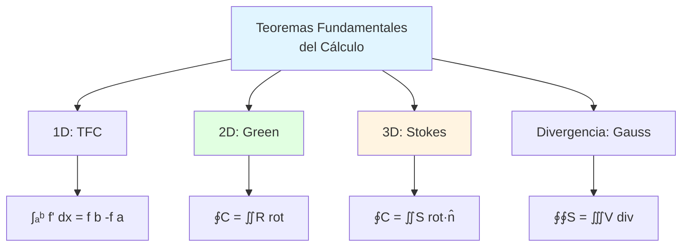

# 🌀 Teorema de Stokes y Teorema de Green

## 🎯 Introducción

> [!info]- 💡 ¿Qué son estos Teoremas Fundamentales?
> Los **Teoremas de Green y Stokes** son dos de los resultados más profundos y hermosos del cálculo vectorial. Ambos establecen conexiones fundamentales entre **integrales sobre regiones de diferentes dimensiones**, relacionando lo que ocurre en el **interior** de una región con lo que sucede en su **frontera**.
> 
> **Analogía práctica:** Imagina un río que fluye alrededor de una isla:
> 
> - **Teorema de Green:** Si mides el flujo total alrededor del perímetro de la isla (circulación), esto está relacionado con la suma de todos los "remolinos" dentro de la isla
> - **Teorema de Stokes:** Similar, pero en 3D - relaciona la circulación alrededor del borde de una superficie con el "rotacional" acumulado sobre toda la superficie
> - Ambos dicen: "Lo que pasa en el borde está determinado por lo que pasa adentro"
> 
> **¿Por qué son importantes?**
> 
> |Aspecto|Descripción|Aplicación|
> |---|---|---|
> |**Unificación**|Conectan integrales de línea con dobles/superficie|Simplifican cálculos complejos|
> |**Física**|Formulan leyes fundamentales|Electromagnetismo (Ley de Faraday)|
> |**Topología**|Relacionan geometría local con global|Propiedades invariantes|
> |**Computación**|Permiten elegir ruta más fácil|Optimización de cálculos|
> |**Comprensión**|Revelan estructura profunda|Unidad del cálculo|



---

## 📐 Teorema de Green

### 📜 Enunciado y Formulación

> [!example]- 🎨 Teorema de Green en el Plano
> 
> **Enunciado:**
> 
> Sea C una curva cerrada simple, suave a trozos, orientada **positivamente** (antihorario), que encierra una región R en el plano xy. Sea **F̄(x,y) = (P(x,y), Q(x,y))** un campo vectorial con P y Q que tienen derivadas parciales continuas en una región abierta que contiene R. Entonces:
> 
> $$\oint_C \mathbf{F} \cdot d\mathbf{r} = \oint_C P \, dx + Q \, dy = \iint_R \left(\frac{\partial Q}{\partial x} - \frac{\partial P}{\partial y}\right) dA$$
> 
> **Forma alternativa (rotacional):**
> 
> $$\oint_C \mathbf{F} \cdot d\mathbf{r} = \iint_R (\nabla \times \mathbf{F}) \cdot \mathbf{k} \, dA$$
> 
> **Componentes del teorema:**
> 
> |Elemento|Símbolo|Significado|Dimensión|
> |---|---|---|---|
> |**Lado izquierdo**|∮C F̄·dr̄|Circulación alrededor de C|Integral de línea (1D)|
> |**Lado derecho**|∬R (∂Q/∂x - ∂P/∂y) dA|"Rotación total" en R|Integral doble (2D)|
> |**Curva C**|Frontera ∂R|Borde de la región|Curva cerrada|
> |**Región R**|Interior|Área encerrada|Región plana|
> |**Orientación**|Antihorario|Positiva|Por convención|
> 
> **Visualización:**
> 
> ```
>         Curva C (frontera)
>            ↺ antihorario
>          ___________
>        ╱             ╲
>       │               │
>       │   Región R    │
>       │   (interior)  │
>        ╲_____________╱
>     
>     ∮C F̄·dr̄  =  ∬R (∂Q/∂x - ∂P/∂y) dA
>     
>     Circulación    =    Rotacional acumulado
>     en frontera         en el interior
> ```
> 
> **Interpretación física:**
> 
> ```mermaid
> graph LR
>     A[Campo vectorial F̄] --> B[Circulación en C]
>     A --> C[Rotacional en R]
>     
>     B --> D[∮C F̄·dr̄<br/>¿Cuánto gira<br/>alrededor?]
>     C --> E[∬R rot F̄<br/>¿Cuánta rotación<br/>hay dentro?]
>     
>     D --> F[Green dice:<br/>SON IGUALES]
>     E --> F
>     
>     style A fill:#e1f5ff
>     style F fill:#e1ffe1
> ```
> 
> **Notación del rotacional en 2D:**
> 
> $$\nabla \times \mathbf{F} = \left(\frac{\partial Q}{\partial x} - \frac{\partial P}{\partial y}\right) \mathbf{k}$$
> 
> En 2D, el rotacional solo tiene componente k̂ (perpendicular al plano).

### 🔍 Condiciones y Hipótesis

> [!warning]- ⚠️ Requisitos del Teorema
> 
> **Condiciones necesarias:**
> 
> 1. **Curva C cerrada y simple:**
>    - Cerrada: empieza y termina en el mismo punto
>    - Simple: no se cruza a sí misma
>    - Suave a trozos: puede tener esquinas finitas
> 
> 2. **Orientación positiva:**
>    - Antihorario (contrario a las agujas del reloj)
>    - Al recorrer C, la región R queda a la **izquierda**
> 
> 3. **Campo vectorial F̄ = (P, Q):**
>    - P y Q tienen derivadas parciales continuas
>    - Definidas en toda R y su frontera
> 
> 4. **Región R:**
>    - Simplemente conexa (sin agujeros) para la versión básica
>    - Si tiene agujeros, se usa versión extendida
> 
> **Tabla de validez:**
> 
> |Situación|¿Aplica Green?|Observación|
> |---|---|---|
> |Círculo, triángulo, rectángulo|✅ Sí|Curvas simples cerradas|
> |Curva en forma de 8|❌ No|Se cruza (no simple)|
> |Segmento de curva|❌ No|No cerrada|
> |Región con agujero|⚠️ Versión extendida|Green con múltiples curvas|
> |F̄ discontinuo en punto de R|❌ No|Viola hipótesis|
> |Orientación horaria|⚠️ Cambiar signo|Usar -∮C|
> 
> **Orientación correcta:**
> 
> ```
> CORRECTO (antihorario):        INCORRECTO (horario):
> 
>        →  →                         ←  ←
>      ↑      ↓                     ↓      ↑
>      ↑  R   ↓                     ↓  R   ↑
>      ↑      ↓                     ↓      ↑
>        ←  ←                         →  →
> 
>   R a la izquierda            R a la derecha
>   Green se cumple            Green con signo -
> ```
> 
> **Regiones con agujeros (versión extendida):**
> 
> ```
>     C₂ (interior, horario)
>        ___
>      ╱     ╲
>     │  ⊙   │  R
>      ╲_____╱
>   
>   ↺_____________↺
>   C₁ (exterior, antihorario)
> 
> ∮C₁ F̄·dr̄ - ∮C₂ F̄·dr̄ = ∬R (∂Q/∂x - ∂P/∂y) dA
> 
> (C₂ con signo - porque va horario)
> ```

### 💡 Ejemplos Resueltos

> [!example]- 🎯 Aplicaciones del Teorema de Green
> 
> **Ejemplo 1: Verificación directa**
> 
> ```
> Verificar Green para F̄(x,y) = (-y, x) alrededor del círculo
> x² + y² = 1 orientado antihorario.
> 
> MÉTODO 1 - Integral de línea (lado izquierdo):
> 
> Parametrización: r̄(t) = (cos t, sin t), 0 ≤ t ≤ 2π
> r̄'(t) = (-sin t, cos t)
> 
> F̄(r̄(t)) = (-sin t, cos t)
> 
> ∮C F̄·dr̄ = ∫₀^(2π) (-sin t, cos t)·(-sin t, cos t) dt
>          = ∫₀^(2π) (sin²t + cos²t) dt
>          = ∫₀^(2π) 1 dt
>          = 2π
> 
> MÉTODO 2 - Integral doble (lado derecho):
> 
> P = -y, Q = x
> ∂Q/∂x = 1
> ∂P/∂y = -1
> 
> ∂Q/∂x - ∂P/∂y = 1 - (-1) = 2
> 
> ∬R 2 dA = 2 · Área(círculo)
>         = 2 · π(1)²
>         = 2π ✓
> 
> Ambos métodos dan 2π, Green verificado.
> ```
> 
> **Ejemplo 2: Simplificación de cálculo**
> 
> ```
> Calcular ∮C (x² + y) dx + (x + y²) dy donde C es el triángulo
> con vértices (0,0), (2,0), (2,2), orientado antihorario.
> 
> P = x² + y, Q = x + y²
> 
> MÉTODO DIRECTO (sin Green): Tedioso - 3 segmentos
> 
> MÉTODO CON GREEN: Mucho más fácil
> 
> ∂Q/∂x = 1
> ∂P/∂y = 1
> 
> ∂Q/∂x - ∂P/∂y = 1 - 1 = 0
> 
> Por Green:
> ∮C F̄·dr̄ = ∬R 0 dA = 0
> 
> ¡Respuesta inmediata sin calcular la integral!
> 
> Interpretación: F̄ es conservativo (∇×F̄ = 0)
> ```
> 
> **Ejemplo 3: Cálculo práctico**
> 
> ```
> Evaluar ∮C xy² dx + x² dy donde C es el rectángulo
> [0,2] × [0,3] orientado antihorario.
> 
> P = xy², Q = x²
> 
> ∂Q/∂x = 2x
> ∂P/∂y = 2xy
> 
> ∂Q/∂x - ∂P/∂y = 2x - 2xy = 2x(1-y)
> 
> Por Green:
> ∮C = ∬R 2x(1-y) dA
>    = ∫₀² ∫₀³ 2x(1-y) dy dx
>    = ∫₀² 2x [y - y²/2]₀³ dx
>    = ∫₀² 2x [3 - 9/2] dx
>    = ∫₀² 2x(-3/2) dx
>    = -3 ∫₀² x dx
>    = -3 [x²/2]₀²
>    = -3(2)
>    = -6
> 
> Respuesta: -6
> ```
> 
> **Ejemplo 4: Cálculo de área**
> 
> ```
> Fórmula de Green para área:
> 
> Si elegimos F̄ = (-y/2, x/2), entonces:
> ∂Q/∂x - ∂P/∂y = 1/2 - (-1/2) = 1
> 
> Por Green:
> Área(R) = ∬R 1 dA = ∮C (-y/2) dx + (x/2) dy
>         = (1/2) ∮C (x dy - y dx)
> 
> Ejemplo: Área del círculo x² + y² = r²
> Parametrización: x = r cos t, y = r sin t, 0 ≤ t ≤ 2π
> 
> Área = (1/2) ∫₀^(2π) (r cos t · r cos t - r sin t · (-r sin t)) dt
>      = (1/2) ∫₀^(2π) r²(cos²t + sin²t) dt
>      = (1/2) ∫₀^(2π) r² dt
>      = (1/2) · r² · 2π
>      = πr² ✓
> ```

---

## 🌊 Teorema de Stokes

### 📜 Enunciado General

> [!note]- 🎲 Stokes en el Espacio 3D
> 
> **Enunciado:**
> 
> Sea S una superficie **orientada**, suave a trozos, con frontera C (curva cerrada simple). Sea **F̄(x,y,z)** un campo vectorial cuyas componentes tienen derivadas parciales continuas en una región abierta que contiene S. Entonces:
> 
> $$\oint_C \mathbf{F} \cdot d\mathbf{r} = \iint_S (\nabla \times \mathbf{F}) \cdot \mathbf{n} \, dS$$
> 
> Donde:
> - C = ∂S (frontera de S)
> - n̂ es el vector normal unitario a S
> - La orientación de C y n̂ siguen la **regla de la mano derecha**
> 
> **Forma extendida:**
> 
> $$\oint_C \mathbf{F} \cdot d\mathbf{r} = \iint_S \text{rot}(\mathbf{F}) \cdot d\mathbf{S}$$
> 
> **Componentes:**
> 
> |Lado|Expresión|Dimensión|Significado|
> |---|---|---|---|
> |**Izquierdo**|∮C F̄·dr̄|1D|Circulación alrededor del borde|
> |**Derecho**|∬S (∇×F̄)·n̂ dS|2D|Flujo del rotacional a través de S|
> |**C**|Curva frontera|1D|Borde de la superficie|
> |**S**|Superficie|2D|Interior de la región|
> |**∇×F̄**|Rotacional|Vector|"Rotación" del campo|
> 
> **Visualización 3D:**
> 
> ```
>           Normal n̂
>             ↑
>             │
>         Superficie S
>          ___╱╲___
>        ╱         ╲
>       │           │
>        ╲_________╱
>           ↺
>         Curva C
>      (borde de S)
>     
>     ∮C F̄·dr̄  =  ∬S (∇×F̄)·n̂ dS
>     
>     Circulación  =  Flujo del rotacional
>     en borde          a través de S
> ```
> 
> **Regla de la mano derecha:**
> 
> ```mermaid
> flowchart LR
>     A[Orientación de C] --> B[Curva tu mano<br/>siguiendo C]
>     B --> C[Pulgar apunta<br/>en dirección n̂]
>     
>     D[Si n̂ apunta<br/>hacia arriba] --> E[C va antihorario<br/>visto desde arriba]
>     
>     style A fill:#e1f5ff
>     style C fill:#e1ffe1
>     style E fill:#fff4e1
> ```
> 
> **Relación con Green:**
> 
> El Teorema de Green es un **caso particular** de Stokes cuando S es una región plana en el plano xy:
> 
> $$\text{Green} = \text{Stokes con } S \text{ plana en xy}$$

### 🔧 Cálculo del Rotacional

> [!tip]- 🌀 Rotacional en Coordenadas Cartesianas
> 
> **Definición:**
> 
> Para F̄(x,y,z) = (P, Q, R):
> 
> $$\nabla \times \mathbf{F} = \begin{vmatrix} \mathbf{i} & \mathbf{j} & \mathbf{k} \\ \frac{\partial}{\partial x} & \frac{\partial}{\partial y} & \frac{\partial}{\partial z} \\ P & Q & R \end{vmatrix}$$
> 
> **Desarrollo:**
> 
> $$\nabla \times \mathbf{F} = \left(\frac{\partial R}{\partial y} - \frac{\partial Q}{\partial z}\right)\mathbf{i} - \left(\frac{\partial R}{\partial x} - \frac{\partial P}{\partial z}\right)\mathbf{j} + \left(\frac{\partial Q}{\partial x} - \frac{\partial P}{\partial y}\right)\mathbf{k}$$
> 
> **Forma nemotécnica:**
> 
> |Componente|Fórmula|Variables involucradas|
> |---|---|---|
> |**i (x)**|∂R/∂y - ∂Q/∂z|y, z (no x)|
> |**j (y)**|-(∂R/∂x - ∂P/∂z)|x, z (no y)|
> |**k (z)**|∂Q/∂x - ∂P/∂y|x, y (no z)|
> 
> **Ejemplo de cálculo:**
> 
> ```
> Calcular ∇×F̄ para F̄(x,y,z) = (yz, xz, xy)
> 
> P = yz, Q = xz, R = xy
> 
> Componente i:
> ∂R/∂y - ∂Q/∂z = ∂(xy)/∂y - ∂(xz)/∂z = x - x = 0
> 
> Componente j:
> -(∂R/∂x - ∂P/∂z) = -(∂(xy)/∂x - ∂(yz)/∂z) = -(y - y) = 0
> 
> Componente k:
> ∂Q/∂x - ∂P/∂y = ∂(xz)/∂x - ∂(yz)/∂y = z - z = 0
> 
> ∇×F̄ = (0, 0, 0) = 0̄
> 
> Por lo tanto F̄ es conservativo (irrotacional)
> ```

### 💫 Ejemplos con Stokes

> [!success]- 🎯 Aplicaciones Prácticas
> 
> **Ejemplo 1: Superficie plana (conexión con Green)**
> 
> ```
> Verificar Stokes para F̄(x,y,z) = (-y, x, 0) sobre el disco
> S: x² + y² ≤ 1, z = 0, con normal n̂ = k̂ (hacia arriba).
> 
> MÉTODO 1 - Integral de línea:
> C es el círculo x² + y² = 1 en z = 0
> (Ya calculado en ejemplo de Green): ∮C F̄·dr̄ = 2π
> 
> MÉTODO 2 - Integral de superficie con Stokes:
> 
> Calcular ∇×F̄:
> P = -y, Q = x, R = 0
> 
> ∇×F̄ = (∂R/∂y - ∂Q/∂z, -(∂R/∂x - ∂P/∂z), ∂Q/∂x - ∂P/∂y)
>      = (0-0, -(0-0), 1-(-1))
>      = (0, 0, 2)
> 
> n̂ = k̂ = (0,0,1)
> 
> (∇×F̄)·n̂ = (0,0,2)·(0,0,1) = 2
> 
> ∬S (∇×F̄)·n̂ dS = ∬S 2 dS = 2 · Área(disco)
>                  = 2 · π(1)² = 2π ✓
> 
> Coincide con la integral de línea.
> ```
> 
> **Ejemplo 2: Superficie curva**
> 
> ```
> Calcular ∮C F̄·dr̄ donde F̄(x,y,z) = (z, x, y) y C es la
> intersección del cilindro x² + y² = 1 con el plano z = y,
> orientado antihorario visto desde arriba.
> 
> En lugar de parametrizar C directamente (complicado),
> usamos Stokes con S = parte del plano z = y dentro del cilindro.
> 
> Paso 1 - Calcular ∇×F̄:
> P = z, Q = x, R = y
> 
> ∇×F̄ = (∂y/∂y - ∂x/∂z, -(∂y/∂x - ∂z/∂z), ∂x/∂x - ∂z/∂y)
>      = (1-0, -(0-1), 1-1)
>      = (1, 1, 0)
> 
> Paso 2 - Parametrizar S:
> S: z = y, x² + y² ≤ 1
> r̄(x,y) = (x, y, y) con x² + y² ≤ 1
> 
> Paso 3 - Calcular normal:
> Plano z = y → z - y = 0
> ∇(z-y) = (0, -1, 1)
> n̂ = (0, -1, 1)/√2 (normalizado, apuntando correctamente)
> 
> Paso 4 - Producto punto:
> (∇×F̄)·n̂ = (1,1,0)·(0,-1,1)/√2 = -1/√2
> 
> Paso 5 - Elemento de superficie:
> dS = √(1 + (∂z/∂x)² + (∂z/∂y)²) dA
>    = √(1 + 0 + 1) dA = √2 dA
> 
> Paso 6 - Integral:
> ∮C F̄·dr̄ = ∬D (-1/√2)·√2 dA
>          = ∬D -1 dA
>          = -Área(disco)
>          = -π
> 
> Respuesta: -π
> ```
> 
> **Ejemplo 3: Campo conservativo**
> 
> ```
> Sea F̄(x,y,z) = (y+z, x+z, x+y). Verificar que es conservativo
> y calcular ∮C F̄·dr̄ para cualquier curva cerrada C.
> 
> Verificación:
> ∇×F̄ = (∂(x+y)/∂y - ∂(x+z)/∂z, -(∂(x+y)/∂x - ∂(y+z)/∂z), ∂(x+z)/∂x - ∂(y+z)/∂y)
>      = (1-1, -(1-1), 1-1)
>      = (0, 0, 0) = 0̄
> 
> Como ∇×F̄ = 0̄, F̄ es conservativo.
> 
> Por Stokes, para cualquier superficie S con frontera C:
> ∮C F̄·dr̄ = ∬S (∇×F̄)·n̂ dS = ∬S 0̄·n̂ dS = 0
> 
> Conclusión: ∮C F̄·dr̄ = 0 para toda curva cerrada C
> ```

---

## 🔗 Relación entre Green y Stokes

### 🌉 Green como Caso Especial

> [!note]- 🎭 Unificación de Teoremas
> 
> **Teorema de Green ES Stokes en 2D:**
> 
> Cuando la superficie S es **plana** (en el plano xy) con z = 0:
> 
> |Aspecto|En Stokes|En Green|
> |---|---|---|
> |**Superficie**|S cualquiera en 3D|Región R en plano xy|
> |**Normal**|n̂ cualquiera|n̂ = k̂ (hacia arriba)|
> |**Campo**|F̄(x,y,z) = (P,Q,R)|F̄(x,y) = (P,Q,0)|
> |**Rotacional**|(∇×F̄)_x, (∇×F̄)_y, (∇×F̄)_z|Solo (∇×F̄)_z = ∂Q/∂x - ∂P/∂y|
> |**Producto**|(∇×F̄)·k̂|∂Q/∂x - ∂P/∂y|
> 
> **Derivación de Green desde Stokes:**
> 
> ```
> Stokes: ∮C F̄·dr̄ = ∬S (∇×F̄)·n̂ dS
> 
> Con S en plano xy:
> - F̄ = (P(x,y), Q(x,y), 0)
> - n̂ = k̂ = (0, 0, 1)
> - dS = dA (área en el plano)
> 
> ∇×F̄ = (0, 0, ∂Q/∂x - ∂P/∂y)
> 
> (∇×F̄)·k̂ = ∂Q/∂x - ∂P/∂y
> 
> Entonces:
> ∮C F̄·dr̄ = ∬R (∂Q/∂x - ∂P/∂y) dA
> 
> ¡Esto es exactamente Green!
> ```
> 
> **Diagrama conceptual:**
> 
> ```mermaid
> graph TD
>     A[Teorema de Stokes<br/>General 3D] --> B{Restricción}
>     B -->|S plana en xy| C[Teorema de Green<br/>2D]
>     B -->|S cualquiera| D[Stokes completo]
>     
>     C --> E[∮C = ∬R ∂Q/∂x - ∂P/∂y]
>     D --> F[∮C = ∬S ∇×F̄·n̂]
>     
>     style A fill:#e1f5ff
>     style C fill:#e1ffe1
>     style D fill:#fff4e1
> ```

### 🎯 Comparación Sistemática

> [!tip]- 📊 Tabla Comparativa Detallada
> 
> |Característica|Teorema de Green|Teorema de Stokes|
> |---|---|---|
> |**Dimensión espacial**|2D (plano)|3D (espacio)|
> |**Dominio izq.**|Curva C en plano|Curva C en espacio|
> |**Dominio der.**|Región R en plano|Superficie S en espacio|
> |**Campo vectorial**|F̄(x,y) = (P,Q)|F̄(x,y,z) = (P,Q,R)|
> |**Integral izq.**|∮C P dx + Q dy|∮C F̄·dr̄|
> |**Operador**|∂Q/∂x - ∂P/∂y|∇×F̄ (rotacional completo)|
> |**Integral der.**|∬R (∂Q/∂x - ∂P/∂y) dA|∬S (∇×F̄)·n̂ dS|
> |**Orientación**|Antihorario|Regla mano derecha|
> |**Aplicaciones**|Fluidos 2D, circuitos|Electromagnetismo, fluidos 3D|
> |**Caso especial de**|Stokes con S plano|Teorema fundamental general|
> 
> **Árbol genealógico de teoremas:**
> 
> ```mermaid
> graph TB
>     A[Teorema Fundamental<br/>del Cálculo 1D] --> B[Generalización<br/>a dimensiones superiores]
>     
>     B --> C[Teorema de Green<br/>2D]
>     B --> D[Teorema de Stokes<br/>3D]
>     B --> E[Teorema de Gauss<br/>Divergencia 3D]
>     
>     D --> F[Contiene a Green<br/>como caso especial]
>     
>     C --> G[Relaciona:<br/>∮ línea con ∬ área]
>     D --> H[Relaciona:<br/>∮ línea con ∬ superficie]
>     E --> I[Relaciona:<br/>∬ superficie con ∭ volumen]
>     
>     style A fill:#e1f5ff
>     style D fill:#e1ffe1
>     style F fill:#fff4e1
> ```

---

## 🎨 Aplicaciones Físicas

### ⚡ Electromagnetismo

> [!example]- 🔌 Ley de Faraday
> 
> **Ley de Faraday (forma integral):**
> 
> La **fuerza electromotriz** (fem) inducida alrededor de una curva cerrada C es igual a la tasa de cambio del **flujo magnético** a través de cualquier superficie S limitada por C:
> 
> $$\oint_C \mathbf{E} \cdot d\mathbf{r} = -\frac{d}{dt}\iint_S \mathbf{B} \cdot \mathbf{n} \, dS$$
> 
> **Ley de Faraday (forma diferencial) usando Stokes:**
> 
> Aplicando Stokes al lado izquierdo:
> 
> $$\iint_S (\nabla \times \mathbf{E}) \cdot \mathbf{n} \, dS = -\frac{\partial}{\partial t}\iint_S \mathbf{B} \cdot \mathbf{n} \, dS$$
> 
> Como esto vale para cualquier superficie S:
> 
> $$\nabla \times \mathbf{E} = -\frac{\partial \mathbf{B}}{\partial t}$$
> 
> **Interpretación:**
> 
> |Concepto|Significado|Ecuación|
> |---|---|---|
> |**Campo eléctrico Ē**|Fuerza sobre carga|Vector 3D|
> |**Campo magnético B̄**|Fuerza magnética|Vector 3D|
> |**Circulación de Ē**|fem inducida|∮C Ē·dr̄|
> |**Flujo de B̄**|Líneas magnéticas|∬S B̄·n̂ dS|
> |**Ley de Faraday**|Cambio de B̄ → circulación de Ē|∇×Ē = -∂B̄/∂t|
> 
> ```
> Ejemplo: Espira circular en campo magnético creciente
> 
>         B̄ (aumentando)
>           ↑↑↑↑↑
>         ________
>        /        \
>       |    ↺Ē    |  ← Corriente inducida
>        \________/
>         Espira C
> 
> Si B̄ = B(t)k̂ aumenta con el tiempo:
> - Flujo: Φ_B = ∬S B·n̂ dS = B(t)·πr²
> - fem: ε = -dΦ_B/dt = -πr²·dB/dt
> - Por Stokes: ε = ∮C Ē·dr̄
> 
> El campo eléctrico inducido circula alrededor
> ```
> 
> **Ley de Ampère-Maxwell:**
> 
> $$\oint_C \mathbf{B} \cdot d\mathbf{r} = \mu_0\iint_S \left(\mathbf{J} + \epsilon_0\frac{\partial \mathbf{E}}{\partial t}\right) \cdot \mathbf{n} \, dS$$
> 
> Usando Stokes:
> 
> $$\nabla \times \mathbf{B} = \mu_0\left(\mathbf{J} + \epsilon_0\frac{\partial \mathbf{E}}{\partial t}\right)$$

### 🌊 Mecánica de Fluidos

> [!success]- 💨 Circulación y Vorticidad
> 
> **Circulación de un fluido:**
> 
> La **circulación** Γ de un campo de velocidades v̄ alrededor de una curva cerrada C:
> 
> $$\Gamma = \oint_C \mathbf{v} \cdot d\mathbf{r}$$
> 
> **Vorticidad:**
> 
> La **vorticidad** ω̄ es el rotacional del campo de velocidades:
> 
> $$\boldsymbol{\omega} = \nabla \times \mathbf{v}$$
> 
> **Teorema de Stokes relaciona ambos:**
> 
> $$\Gamma = \oint_C \mathbf{v} \cdot d\mathbf{r} = \iint_S (\nabla \times \mathbf{v}) \cdot \mathbf{n} \, dS = \iint_S \boldsymbol{\omega} \cdot \mathbf{n} \, dS$$
> 
> **Interpretación física:**
> 
> ```
> Circulación = Flujo de vorticidad
> 
> Circulación alrededor   =   Suma de todos los "remolinos"
> del borde C                 dentro de la superficie S
> ```
> 
> |Concepto|Fórmula|Interpretación|
> |---|---|---|
> |**Velocidad**|v̄(x,y,z)|Campo vectorial del flujo|
> |**Circulación**|Γ = ∮C v̄·dr̄|"Cuánto gira" alrededor de C|
> |**Vorticidad**|ω̄ = ∇×v̄|"Rotación local" del fluido|
> |**Stokes**|Γ = ∬S ω̄·n̂ dS|Relaciona circulación con vorticidad|
> 
> **Ejemplo: Vórtice**
> 
> ```
> Campo de velocidades de un vórtice en 2D:
> v̄ = (-y/(x²+y²), x/(x²+y²), 0)
> 
> Circulación alrededor de círculo de radio r:
> ∮C v̄·dr̄ = 2π (constante, independiente de r)
> 
> Vorticidad:
> ∇×v̄ = 0̄ excepto en el origen (singularidad)
> 
> Toda la vorticidad está concentrada en el centro
> ```

---

## 🔍 Técnicas de Cálculo

### 📝 Estrategia para Aplicar Stokes

> [!tip]- 🎯 Algoritmo de Decisión
> 
> **Proceso paso a paso:**
> 
> ```mermaid
> flowchart TD
>     A[Problema: Calcular ∮C F̄·dr̄] --> B{¿C es cerrada?}
>     B -->|No| C[No usar Stokes<br/>Parametrizar C]
>     B -->|Sí| D{¿Conoces S<br/>con frontera C?}
>     
>     D -->|No| E[Encontrar superficie S<br/>conveniente]
>     D -->|Sí| F[Calcular ∇×F̄]
>     E --> F
>     
>     F --> G{¿∇×F̄ = 0̄?}
>     G -->|Sí| H[∮C F̄·dr̄ = 0<br/>¡Listo!]
>     G -->|No| I{¿Qué es más fácil?}
>     
>     I -->|Integral línea| J[Calcular ∮C directamente]
>     I -->|Stokes| K[Calcular ∬S ∇×F̄·n̂ dS]
>     
>     style H fill:#e1ffe1
>     style J fill:#fff4e1
>     style K fill:#e1f5ff
> ```
> 
> **Criterios de decisión:**
> 
> |Situación|Método Recomendado|Razón|
> |---|---|---|
> |∇×F̄ = 0̄|Ninguno (resultado = 0)|Campo conservativo|
> |C muy complicada|Stokes|Elegir S más simple|
> |S muy complicada|Integral de línea|Parametrizar C|
> |C y S simples|Ambos (verificación)|Doble comprobación|
> |S plana|Green (caso especial)|Más directo en 2D|
> 
> **Ejemplo de decisión:**
> 
> ```
> Problema: ∮C F̄·dr̄ donde F̄ = (y², xz, z²) y C es la
> intersección del cilindro x² + y² = 1 con z = x + 2
> 
> Análisis:
> 1. C es COMPLICADA de parametrizar directamente
> 2. Podemos usar S = parte del plano z = x + 2 dentro del cilindro
>    (más fácil de trabajar)
> 3. Calcular ∇×F̄ primero para ver si vale la pena
> 
> ∇×F̄ = (∂z²/∂y - ∂xz/∂z, -(∂z²/∂x - ∂y²/∂z), ∂xz/∂x - ∂y²/∂y)
>      = (0-x, -0-0, z-2y)
>      = (-x, 0, z-2y)
> 
> No es cero, pero calcular ∬S (∇×F̄)·n̂ dS con S plana
> es más fácil que parametrizar C
> 
> Decisión: Usar Stokes ✓
> ```

### 🧮 Elección de Superficie

> [!warning]- 🎨 Libertad en la Elección de S
> 
> **Propiedad fundamental:**
> 
> Si C es una curva cerrada, **cualquier superficie S con frontera C** da el mismo resultado al aplicar Stokes:
> 
> $$\oint_C \mathbf{F} \cdot d\mathbf{r} = \iint_{S_1} (\nabla \times \mathbf{F}) \cdot \mathbf{n}_1 \, dS = \iint_{S_2} (\nabla \times \mathbf{F}) \cdot \mathbf{n}_2 \, dS$$
> 
> **Estrategia de elección:**
> 
> ```
> Para una curva C dada, elegir S que:
> 
> 1. Tenga frontera exactamente C (fundamental)
> 2. Sea lo más SIMPLE posible geométricamente
> 3. Haga (∇×F̄)·n̂ fácil de calcular
> 4. Tenga parametrización sencilla
> 5. Aproveche simetrías si existen
> ```
> 
> **Opciones comunes:**
> 
> |Curva C|Superficies S posibles|Más conveniente|
> |---|---|---|
> |Círculo en z=0|Disco plano, hemisferio, cono|Disco plano|
> |Círculo en z=h|Disco en z=h, superficie cilíndrica|Disco en z=h|
> |Elipse|Región elíptica plana|Plano que contiene elipse|
> |Frontera irregular|Plano que la corte, superficie curva|Depende del problema|
> 
> **Ejemplo comparativo:**
> 
> ```
> C: círculo x² + y² = 1 en el plano z = 0
> F̄ = (-y, x, z²)
> 
> OPCIÓN 1 - Disco plano D en z = 0:
> S₁: r̄(r,θ) = (r cos θ, r sin θ, 0), 0≤r≤1, 0≤θ≤2π
> n̂₁ = k̂
> dS₁ = r dr dθ
> 
> ∇×F̄ = (0, 0, 2)
> (∇×F̄)·n̂₁ = 2
> 
> ∬S₁ = ∫₀^2π ∫₀¹ 2·r dr dθ = 2π
> 
> OPCIÓN 2 - Hemisferio superior:
> S₂: x² + y² + z² = 1, z ≥ 0
> n̂₂ = (x, y, z) (hacia afuera)
> Mucho más complicado...
> 
> Resultado: ambos dan 2π, pero S₁ es MUCHO más fácil
> ```
> 
> **Visualización:**
> 
> ```
>     Misma curva C, diferentes superficies:
>     
>         Hemisferio        Cono         Disco plano
>            ___            /\             ____
>          /     \         /  \           |    |
>         |   S₂  |       | S₃ |          | S₁ |
>          \_____/        |____|          |____|
>            C              C               C
>     
>     Todas válidas, pero S₁ (disco) es la más simple
> ```

---

## 📊 Ejemplos Integradores

> [!example]- 🎯 Problemas Completos Paso a Paso
> 
> **Ejemplo 1: Comparación directa de métodos**
> 
> ```
> Calcular ∮C F̄·dr̄ donde F̄(x,y,z) = (y, -x, xyz) y C es el
> cuadrado con vértices (0,0,2), (1,0,2), (1,1,2), (0,1,2)
> orientado antihorario visto desde arriba.
> 
> ════════════════════════════════════════════════════
> MÉTODO 1 - Integral de línea directa (tedioso)
> ════════════════════════════════════════════════════
> 
> Parametrizar 4 segmentos:
> 
> C₁: (t,0,2), 0≤t≤1
> C₂: (1,t,2), 0≤t≤1
> C₃: (1-t,1,2), 0≤t≤1
> C₄: (0,1-t,2), 0≤t≤1
> 
> [Cálculos largos para cada segmento...]
> 
> ════════════════════════════════════════════════════
> MÉTODO 2 - Teorema de Stokes (elegante)
> ════════════════════════════════════════════════════
> 
> Paso 1 - Elegir superficie:
> S: cuadrado plano en z = 2, 0≤x≤1, 0≤y≤1
> n̂ = k̂ (hacia arriba, por regla mano derecha)
> 
> Paso 2 - Calcular rotacional:
> P = y, Q = -x, R = xyz
> 
> ∇×F̄ = (∂R/∂y - ∂Q/∂z, -(∂R/∂x - ∂P/∂z), ∂Q/∂x - ∂P/∂y)
>      = (xz - 0, -(yz - 0), -1 - 1)
>      = (xz, -yz, -2)
> 
> Paso 3 - Producto punto con normal:
> (∇×F̄)·k̂ = -2
> 
> Paso 4 - Integral sobre S:
> ∮C F̄·dr̄ = ∬S -2 dS
>          = -2 · Área(cuadrado)
>          = -2 · 1
>          = -2
> 
> Respuesta: -2 (¡mucho más rápido!)
> ```
> 
> **Ejemplo 2: Campo no conservativo**
> 
> ```
> Verificar que F̄(x,y,z) = (z, x, y) NO es conservativo,
> luego calcular ∮C F̄·dr̄ donde C es la curva formada por
> la intersección de x² + y² = 4 con z = x.
> 
> Paso 1 - Verificar si es conservativo:
> ∇×F̄ = (∂y/∂y - ∂x/∂z, -(∂y/∂x - ∂z/∂z), ∂x/∂x - ∂z/∂y)
>      = (1-0, -(0-1), 1-0)
>      = (1, 1, 1) ≠ 0̄
> 
> No es conservativo, así que ∮C F̄·dr̄ ≠ 0 en general
> 
> Paso 2 - Aplicar Stokes:
> Elegir S = parte del plano z = x dentro del cilindro x² + y² = 4
> 
> Parametrización de S:
> r̄(x,y) = (x, y, x) con x² + y² ≤ 4
> 
> Paso 3 - Vector normal:
> Plano: z - x = 0
> ∇(z-x) = (-1, 0, 1)
> |∇(z-x)| = √2
> n̂ = (-1, 0, 1)/√2
> 
> (Verificar orientación con regla mano derecha)
> 
> Paso 4 - Producto punto:
> (∇×F̄)·n̂ = (1,1,1)·(-1,0,1)/√2 = 0/√2 = 0
> 
> Paso 5 - Resultado:
> ∮C F̄·dr̄ = ∬S 0 dS = 0
> 
> ¡Aunque el campo NO es conservativo, la integral
> sobre esta curva particular es cero!
> ```
> 
> **Ejemplo 3: Aplicación física**
> 
> ```
> Una espira circular de radio a está en el plano xy centrada
> en el origen. Un campo magnético B̄ = (0, 0, B₀t) aumenta
> linealmente con el tiempo. Calcular la fem inducida.
> 
> Datos:
> - C: x² + y² = a², z = 0 (espira)
> - B̄(t) = B₀t k̂ (campo magnético)
> - Encontrar: ε = ∮C Ē·dr̄ (fem inducida)
> 
> Solución usando Ley de Faraday:
> 
> Método 1 - Flujo magnético:
> Φ_B = ∬S B̄·n̂ dS
>     = ∬S B₀t dS
>     = B₀t · πa²
> 
> fem = -dΦ_B/dt = -πa² · dB₀t/dt = -πa²B₀
> 
> Método 2 - Con Stokes y ∇×Ē = -∂B̄/∂t:
> ∂B̄/∂t = B₀k̂
> 
> Por Ley de Faraday: ∇×Ē = -B₀k̂
> 
> Aplicando Stokes:
> ∮C Ē·dr̄ = ∬S (∇×Ē)·k̂ dS
>          = ∬S (-B₀) dS
>          = -B₀ · πa²
> 
> fem inducida: ε = -πa²B₀
> 
> El signo negativo indica que la corriente inducida
> se opone al cambio de flujo (Ley de Lenz)
> ```

---

## 🎓 Ejercicios Propuestos

> [!note]- 💪 Problemas para Práctica
> 
> **Nivel Básico:**
> 
> **1. Verificación de Green**
> ```
> Verificar el Teorema de Green para F̄ = (x², y²) alrededor
> del triángulo con vértices (0,0), (1,0), (0,1).
> 
> Calcular ambos:
> a) ∮C F̄·dr̄ directamente
> b) ∬R (∂Q/∂x - ∂P/∂y) dA
> ```
> 
> **2. Campo conservativo**
> ```
> Determinar si F̄ = (yz, xz, xy) es conservativo.
> Si lo es, encontrar función potencial f tal que F̄ = ∇f.
> ```
> 
> **Nivel Intermedio:**
> 
> **3. Aplicación de Stokes**
> ```
> Calcular ∮C F̄·dr̄ donde F̄ = (y², z², x²) y C es la curva
> de intersección del cilindro x² + y² = 1 con el plano
> z = x + 1, orientada antihorario vista desde arriba.
> ```
> 
> **4. Elección de superficie**
> ```
> Para F̄ = (-y³, x³, z³) y C el círculo x² + y² = 4 en z = 0:
> a) Calcular usando disco plano
> b) Verificar usando hemisferio z = √(4-x²-y²)
> c) Comparar dificultad de cálculos
> ```
> 
> **Nivel Avanzado:**
> 
> **5. Región con agujero**
> ```
> Sea R la región anular 1 ≤ x² + y² ≤ 4.
> Usar Green para calcular ∮C₁ F̄·dr̄ - ∮C₂ F̄·dr̄ donde
> C₁ es el círculo exterior (antihorario),
> C₂ es el círculo interior (horario),
> y F̄ = (xy, x² + y²).
> ```
> 
> **6. Aplicación electromagnética**
> ```
> Un solenoide de radio R tiene campo magnético B̄ = B₀sin(ωt)k̂
> en su interior. Calcular el campo eléctrico inducido Ē a
> distancia r del eje para:
> a) r < R (dentro del solenoide)
> b) r > R (fuera del solenoide)
> 
> Usar ∇×Ē = -∂B̄/∂t y Stokes.
> ```

---

## 📋 Resumen y Fórmulas Clave

> [!success]- 📊 Tabla Maestra de Referencia
> 
> ### Teoremas Fundamentales
> 
> |Teorema|Fórmula|Relaciona|
> |---|---|---|
> |**Green**|∮C P dx + Q dy = ∬R (∂Q/∂x - ∂P/∂y) dA|Línea 1D ↔ Área 2D|
> |**Stokes**|∮C F̄·dr̄ = ∬S (∇×F̄)·n̂ dS|Línea 1D ↔ Superficie 2D|
> |**Relación**|Green = Stokes con S plana|2D es caso de 3D|
> 
> ### Rotacional
> 
> |Coordenadas|Fórmula|
> |---|---|
> |**Cartesianas**|∇×F̄ = (∂R/∂y-∂Q/∂z, -(∂R/∂x-∂P/∂z), ∂Q/∂x-∂P/∂y)|
> |**2D (Green)**|∂Q/∂x - ∂P/∂y (solo componente z)|
> 
> ### Condiciones
> 
> |Propiedad|Implicación|
> |---|---|
> |∇×F̄ = 0̄|F̄ conservativo → ∮C F̄·dr̄ = 0|
> |∮C F̄·dr̄ = 0 para toda C|F̄ conservativo|
> |F̄ = ∇f|∇×F̄ = 0̄ automáticamente|
> 
> ### Orientaciones
> 
> |Contexto|Regla|
> |---|---|
> |**Green**|C antihorario, R a la izquierda|
> |**Stokes**|Regla mano derecha: C → n̂|
> |**Horario**|Cambiar signo del resultado|

---

## 🔗 Conexión con Próximos Temas

> [!quote]- 🌟 Hacia Teoremas Más Generales
> 
> **Has dominado:**
> 
> ```mermaid
> mindmap
>   root((Green y<br/>Stokes))
>     Green 2D
>       Circulación
>       Rotacional
>       Área
>     Stokes 3D
>       Superficies
>       Regla mano derecha
>       Ley Faraday
>     Aplicaciones
>       Electromagnetismo
>       Fluidos
>       Conservativos
> ```
> 
> **Progresión:**
> 
> |Nivel|Tema|Conexión|
> |---|---|---|
> |**Actual**|Green y Stokes|Relacionan línea con área/superficie|
> |**Siguiente**|Teorema de Gauss|Relaciona superficie con volumen|
> |**Unificación**|Teorema de Stokes Generalizado|Unifica todos los teoremas|
> |**Aplicado**|Ecuaciones de Maxwell|Usa todos los teoremas|
> |**Avanzado**|Formas diferenciales|Lenguaje moderno|
> 
> **Roadmap:**
> 
> ```mermaid
> graph LR
>     A[TFC 1D] --> B[Green 2D]
>     B --> C[Stokes 3D]
>     C --> D[Gauss Divergencia]
>     
>     B -.-> E[Caso especial]
>     E -.-> C
>     
>     D --> F[Teorema Stokes<br/>Generalizado]
>     C --> F
>     
>     F --> G[Unifica todo<br/>el cálculo vectorial]
>     
>     style C fill:#e1ffe1
>     style F fill:#e1f5ff
>     style G fill:#fff4e1
> ```
> 
> **El Gran Teorema de Stokes Generalizado:**
> 
> $$\int_{\partial \Omega} \omega = \int_{\Omega} d\omega$$
> 
> Donde Ω es una región de dimensión n y ∂Ω es su frontera de dimensión n-1.
> 
> Este teorema **unifica**:
> - TFC: ∫ₐᵇ f' = f(b) - f(a)
> - Green: ∮C = ∬R
> - Stokes: ∮C = ∬S
> - Gauss: ∬S = ∭V

---

**Tags:** #calculo-vectorial #teorema-green #teorema-stokes #rotacional #circulacion #integrales-linea #integrales-superficie #electromagnetismo #ley-faraday #mecanica-fluidos #campos-conservativos