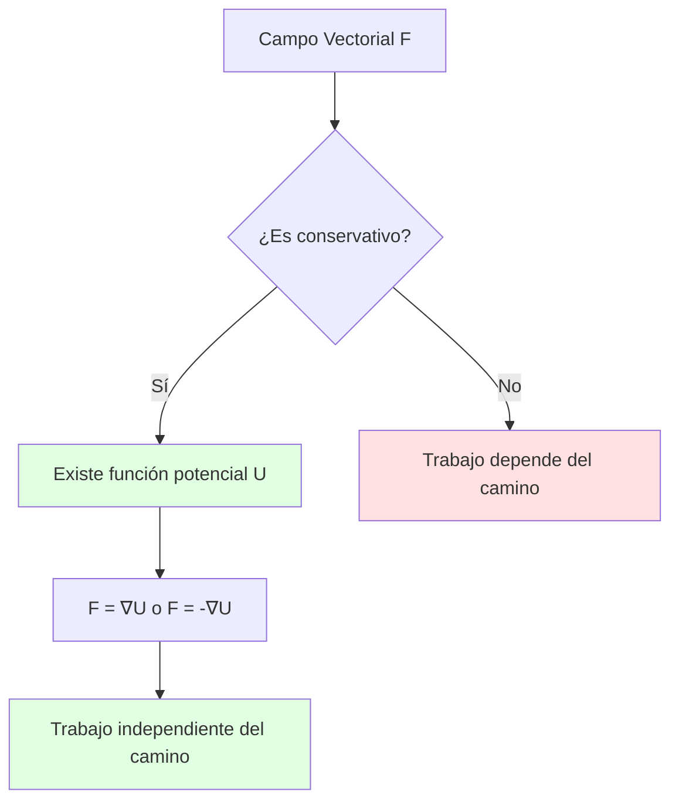
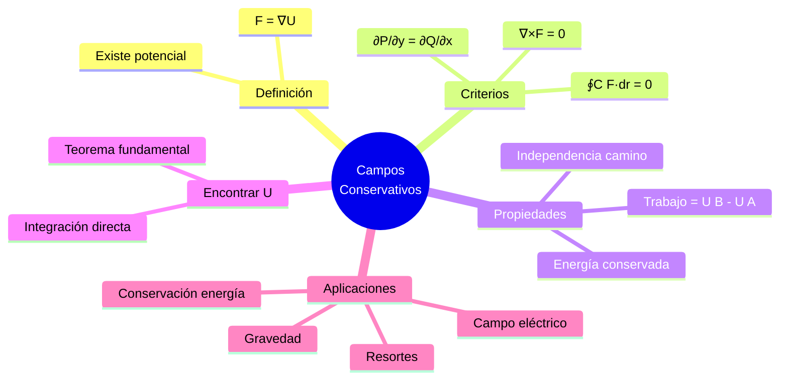
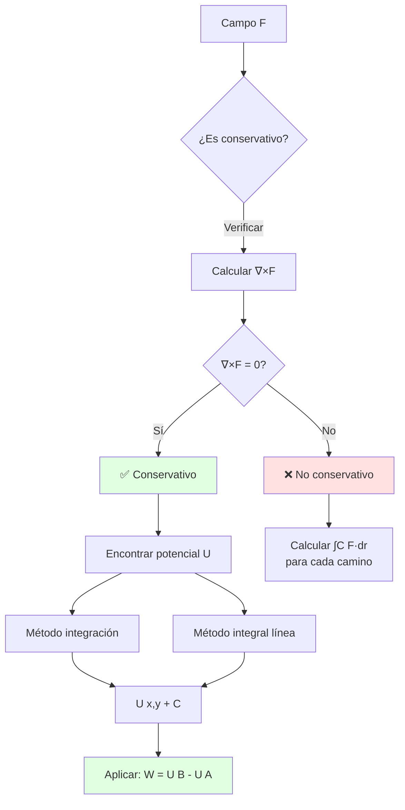

# 🌀 Campos Conservativos

## 🎯 Introducción

> [!info]- 💡 ¿Qué es un Campo Conservativo? Un **campo conservativo** es un campo vectorial especial donde el trabajo realizado al mover un objeto depende únicamente de los puntos inicial y final, no del camino seguido. Es una de las propiedades más importantes en física y matemáticas aplicadas.
> 
> **Analogía práctica:** Imagina caminar por una montaña:
> 
> - **Campo conservativo (gravitatorio):** Subir del valle (100m) a la cima (500m) requiere la misma energía sin importar si vas por el camino corto empinado o el largo serpenteante. Solo importa la diferencia de alturas: 400m.
> - **Campo no conservativo (fricción):** El camino más largo requiere más energía porque hay más fricción. El camino importa.
> 
> **¿Por qué son importantes?**
> 
> |Aspecto|Descripción|Ejemplo de Uso|
> |---|---|---|
> |**Conservación de energía**|La energía total se mantiene|Mecánica clásica|
> |**Independencia del camino**|Trabajo = f(inicio, fin)|Gravedad, campo eléctrico|
> |**Función potencial**|Existe U tal que F = -∇U|Energía potencial|
> |**Integrales simplificadas**|∫C F·dr = U(B) - U(A)|Cálculo eficiente|
> |**Predicción**|Conocer U predice todo el campo|Modelado físico|



---

## 🔍 Definición y Características

### 📐 Definición Formal

> [!example]- 📋 Concepto Matemático Preciso
> 
> **Definición:**
> 
> Un campo vectorial **F** en una región D es **conservativo** si existe una función escalar U (llamada **función potencial**) tal que:
> 
> ```
> F = ∇U    o equivalentemente    F = -∇U
> 
> donde ∇U = (∂U/∂x, ∂U/∂y, ∂U/∂z)
> ```
> 
> **Notación según contexto:**
> 
> |Contexto|Relación|Interpretación|
> |---|---|---|
> |**Matemáticas**|F = ∇U|F es gradiente de U|
> |**Física**|F = -∇U|F es negativo del gradiente|
> |**Potencial gravitatorio**|g = -∇φ|Fuerza apunta hacia menor potencial|
> |**Potencial eléctrico**|E = -∇V|Campo eléctrico|
> 
> **Visualización:**
> 
> ```mermaid
> graph LR
>     A[Función Potencial U x,y,z] --> B[Calcular ∇U]
>     B --> C[Campo Vectorial F]
>     C -.-> D[Curvas de nivel de U]
>     C -.-> E[F perpendicular a curvas]
>     
>     style A fill:#e1f5ff
>     style C fill:#e1ffe1
> ```
> 
> **Ejemplo en ℝ²:**
> 
> ```
> U(x,y) = x² + y²    (función potencial)
> 
> ∇U = (∂U/∂x, ∂U/∂y) = (2x, 2y)
> 
> F(x,y) = (2x, 2y)   (campo conservativo)
> 
> Interpretación: F apunta radialmente hacia afuera
> ```
> 
> **Propiedades clave:**
> 
> ```mermaid
> mindmap
>   root((Campo<br/>Conservativo))
>     Tiene potencial U
>       F = ∇U
>       U única salvo constante
>     Trabajo
>       Independiente del camino
>       ∫C F·dr = U B - U A
>     Integral cerrada
>       ∮C F·dr = 0
>     Rotacional
>       ∇×F = 0
> ```

### 🎨 Interpretación Geométrica

> [!success]- 🗺️ Visualización del Campo y el Potencial
> 
> **Relación entre U y F:**
> 
> ```mermaid
> graph TB
>     subgraph "Función Potencial U(x,y)"
>     A[Superficie z = U x,y]
>     B[Curvas de nivel U = constante]
>     end
>     
>     subgraph "Campo Vectorial F"
>     C[Vectores ∇U]
>     D[Perpendiculares a curvas de nivel]
>     E[Apuntan hacia mayor U]
>     end
>     
>     A --> C
>     B --> D
>     
>     style C fill:#e1ffe1
>     style D fill:#fff4e1
> ```
> 
> **Ejemplo visual - Montaña:**
> 
> ```
> U(x,y) = 100 - (x² + y²)   (colina)
> 
> Curvas de nivel (vista desde arriba):
> 
>         100  ← Cima
>       ⚬ 90
>      ⚬   ⚬ 80
>     ⚬     ⚬ 70
>    ⚬       ⚬ 60
>   
> F = ∇U = (-2x, -2y)
> Apunta hacia la cima (mayor U)
> ```
> 
> **Características geométricas:**
> 
> |Propiedad|Descripción|Visualización|
> |---|---|---|
> |**F ⊥ curvas de nivel**|Campo perpendicular a U=cte|Flechas cruzan círculos|
> |**\|F\| proporcional a pendiente**|Más empinado → \|F\| mayor|Vectores más largos|
> |**F apunta a mayor U**|Dirección de máximo crecimiento|Hacia arriba en montaña|
> |**Líneas de campo**|Caminos de máxima pendiente|Rutas más empinadas|
> 
> **Analogía con mapa topográfico:**
> 
> ```mermaid
> graph LR
>     A[Curvas de nivel] -->|Espaciadas| B[Pendiente suave<br/>Campo débil]
>     A -->|Juntas| C[Pendiente fuerte<br/>Campo intenso]
>     
>     style B fill:#e1ffe1
>     style C fill:#ffe1e1
> ```

### ⚡ Trabajo e Independencia del Camino

> [!note]- 🛣️ Propiedad Fundamental
> 
> **Teorema fundamental de campos conservativos:**
> 
> Si F es conservativo con potencial U, entonces:
> 
> ```
> ∫C F·dr = U(B) - U(A)
> 
> donde:
> • C: cualquier curva de A a B
> • A, B: puntos inicial y final
> ```
> 
> **Visualización del trabajo:**
> 
> ```mermaid
> flowchart LR
>     A["Punto A<br/>U(A)"] -->|Camino 1| B["Punto B<br/>U(B)"]
>     A -->|Camino 2| B
>     A -->|Camino 3| B
>     
>     B --> C["Trabajo = U(B) - U(A)<br/>¡Mismo para todos!"]
>     
>     style C fill:#e1ffe1
> ```
> 
> **Ejemplo calculado:**
> 
> ```
> F(x,y) = (2x, 2y)  con  U(x,y) = x² + y²
> 
> De A(0,0) a B(1,1):
> 
> Camino 1: Línea recta y = x
> Camino 2: Primero (0,0)→(1,0), luego (1,0)→(1,1)
> Camino 3: Parábola y = x²
> 
> Todos dan: U(1,1) - U(0,0) = (1²+1²) - 0 = 2
> ```
> 
> **Consecuencia: Integral en curva cerrada**
> 
> ```
> Si C es cerrada (A = B):
> 
> ∮C F·dr = U(A) - U(A) = 0
> 
> "En un campo conservativo, el trabajo 
>  en un ciclo cerrado es cero"
> ```
> 
> **Tabla comparativa:**
> 
> |Aspecto|Campo Conservativo|Campo No Conservativo|
> |---|---|---|
> |**Trabajo A→B**|U(B) - U(A)|Depende del camino|
> |**Ciclo cerrado**|Siempre 0|Generalmente ≠ 0|
> |**Cálculo**|Evaluar U en extremos|Integrar ∫C F·dr|
> |**Ejemplo físico**|Gravedad|Fricción, campo magnético|

---

## 🧪 Criterios de Conservatividad

### ✓ Test del Rotacional

> [!tip]- 🌀 Condición Necesaria y Suficiente
> 
> **Teorema (en regiones simplemente conexas):**
> 
> ```
> F es conservativo  ⟺  ∇×F = 0
> 
> (rotacional nulo)
> ```
> 
> **Definición del rotacional:**
> 
> **En ℝ²:** F = (P, Q)
> 
> ```
> ∇×F = ∂Q/∂x - ∂P/∂y
> 
> (componente z del rotacional en 3D)
> ```
> 
> **En ℝ³:** F = (P, Q, R)
> 
> ```
> ∇×F = |  i      j      k   |
>       | ∂/∂x  ∂/∂y  ∂/∂z |
>       |  P      Q      R   |
> 
>     = (∂R/∂y - ∂Q/∂z, ∂P/∂z - ∂R/∂x, ∂Q/∂x - ∂P/∂y)
> ```
> 
> **Algoritmo de verificación:**
> 
> ```mermaid
> flowchart TD
>     A[Campo F = P,Q o P,Q,R] --> B[Calcular derivadas parciales]
>     B --> C{En ℝ²?}
>     C -->|Sí| D[∂Q/∂x - ∂P/∂y = 0?]
>     C -->|No ℝ³| E[∇×F = 0,0,0?]
>     D -->|Sí| F[✅ Conservativo]
>     D -->|No| G[❌ No conservativo]
>     E -->|Sí| F
>     E -->|No| G
>     
>     style F fill:#e1ffe1
>     style G fill:#ffe1e1
> ```
> 
> **Ejemplo 1 (ℝ²) - Conservativo:**
> 
> ```
> F(x,y) = (2xy, x² + 1)
>         = (P,  Q)
> 
> Verificar: ∂Q/∂x - ∂P/∂y = ?
> 
> ∂Q/∂x = ∂(x² + 1)/∂x = 2x
> ∂P/∂y = ∂(2xy)/∂y = 2x
> 
> ∇×F = 2x - 2x = 0  ✅ Conservativo
> ```
> 
> **Ejemplo 2 (ℝ²) - NO Conservativo:**
> 
> ```
> F(x,y) = (-y, x)
>         = (P, Q)
> 
> ∂Q/∂x = ∂x/∂x = 1
> ∂P/∂y = ∂(-y)/∂y = -1
> 
> ∇×F = 1 - (-1) = 2 ≠ 0  ❌ No conservativo
> 
> (Este es un campo rotacional)
> ```
> 
> **Ejemplo 3 (ℝ³):**
> 
> ```
> F(x,y,z) = (yz, xz, xy)
>          = (P, Q, R)
> 
> ∇×F = (∂R/∂y - ∂Q/∂z, ∂P/∂z - ∂R/∂x, ∂Q/∂x - ∂P/∂y)
>     = (x - x, y - y, z - z)
>     = (0, 0, 0)  ✅ Conservativo
> ```
> 
> **⚠️ IMPORTANTE: Región simplemente conexa**
> 
> ```mermaid
> graph LR
>     A[Región D] --> B{¿Simplemente conexa?}
>     B -->|Sí<br/>Sin agujeros| C[∇×F = 0 ⟺ Conservativo]
>     B -->|No<br/>Con agujeros| D[∇×F = 0 ⇏ Conservativo]
>     
>     style C fill:#e1ffe1
>     style D fill:#ffe1e1
> ```
> 
> Ejemplo de región NO simplemente conexa: plano sin el origen (anillo)

### 🔎 Test de las Derivadas Parciales

> [!warning]- 📊 Condición Necesaria (más simple)
> 
> **Criterio (en ℝ²):**
> 
> Si F = (P, Q) es conservativo, entonces:
> 
> ```
> ∂P/∂y = ∂Q/∂x
> 
> (derivadas cruzadas iguales)
> ```
> 
> **Relación con rotacional:**
> 
> ```
> ∇×F = ∂Q/∂x - ∂P/∂y = 0
> 
> ⟺  ∂Q/∂x = ∂P/∂y
> ```
> 
> **Algoritmo simplificado:**
> 
> ```mermaid
> flowchart TD
>     A[F = P,Q] --> B[Calcular ∂P/∂y]
>     A --> C[Calcular ∂Q/∂x]
>     B --> D{∂P/∂y = ∂Q/∂x?}
>     C --> D
>     D -->|Sí| E[Puede ser conservativo<br/>verificar dominio]
>     D -->|No| F[❌ Definitivamente<br/>NO conservativo]
>     
>     style E fill:#fff4e1
>     style F fill:#ffe1e1
> ```
> 
> **Ejemplos:**
> 
> **Caso 1: Conservativo**
> 
> ```
> F(x,y) = (3x² + 4y, 4x + 2y)
>         = (P,      Q)
> 
> ∂P/∂y = 4
> ∂Q/∂x = 4
> 
> ∂P/∂y = ∂Q/∂x  ✅ Cumple condición necesaria
> ```
> 
> **Caso 2: NO Conservativo**
> 
> ```
> F(x,y) = (y², 3x)
>         = (P,  Q)
> 
> ∂P/∂y = 2y
> ∂Q/∂x = 3
> 
> 2y ≠ 3  ❌ No es conservativo
> ```
> 
> **Extensión a ℝ³:**
> 
> Para F = (P, Q, R), se deben cumplir **tres condiciones**:
> 
> |Condición|Interpretación|
> |---|---|
> |∂P/∂y = ∂Q/∂x|Consistencia en plano xy|
> |∂P/∂z = ∂R/∂x|Consistencia en plano xz|
> |∂Q/∂z = ∂R/∂y|Consistencia en plano yz|
> 
> Equivalente a ∇×F = (0, 0, 0)

### 🎯 Test de Integral en Curva Cerrada

> [!example]- 🔄 Verificación Práctica
> 
> **Criterio:**
> 
> ```
> F es conservativo  ⟺  ∮C F·dr = 0  
>                        para toda curva cerrada C
> ```
> 
> **Procedimiento:**
> 
> 1. Elegir una curva cerrada simple (círculo, cuadrado)
> 2. Calcular ∮C F·dr
> 3. Si = 0 → posiblemente conservativo
> 4. Si ≠ 0 → definitivamente NO conservativo
> 
> **Ejemplo - Verificación con círculo:**
> 
> ```
> F(x,y) = (-y, x)
> 
> Curva C: círculo x² + y² = 1, sentido antihorario
> Parametrización: r(t) = (cos t, sin t), t ∈ [0, 2π]
> 
> dr/dt = (-sin t, cos t)
> 
> F(r(t)) = (-sin t, cos t)
> 
> ∮C F·dr = ∫₀²π (-sin t, cos t)·(-sin t, cos t) dt
>         = ∫₀²π (sin²t + cos²t) dt
>         = ∫₀²π 1 dt
>         = 2π ≠ 0
> 
> ∴ F NO es conservativo
> ```
> 
> **Visualización:**
> 
> ```mermaid
> graph TB
>     A[Campo F] --> B[Elegir curva cerrada C]
>     B --> C[Calcular ∮C F·dr]
>     C --> D{Resultado?}
>     D -->|= 0| E[Posiblemente conservativo<br/>Verificar con rotacional]
>     D -->|≠ 0| F[❌ NO conservativo<br/>Definitivo]
>     
>     style E fill:#fff4e1
>     style F fill:#ffe1e1
> ```
> 
> **Curvas cerradas comunes para probar:**
> 
> |Curva|Parametrización|Uso|
> |---|---|---|
> |**Círculo**|(R cos t, R sin t)|Simetría radial|
> |**Cuadrado**|Cuatro segmentos|Cálculo simple|
> |**Triángulo**|Tres segmentos|Región triangular|

---

## 🔧 Encontrar la Función Potencial

### 📝 Método de Integración Directa

> [!success]- 🎯 Procedimiento Sistemático
> 
> **Objetivo:** Dado F conservativo, encontrar U tal que F = ∇U
> 
> **Método (en ℝ²):**
> 
> Si F = (P, Q), entonces:
> 
> ```
> ∂U/∂x = P
> ∂U/∂y = Q
> ```
> 
> **Algoritmo paso a paso:**
> 
> ```mermaid
> flowchart TD
>     A[F = P,Q] --> B[Integrar ∂U/∂x = P<br/>respecto a x]
>     B --> C[U = ∫P dx + g y]
>     C --> D[Derivar U respecto a y]
>     D --> E[∂U/∂y = ... + g' y]
>     E --> F[Igualar a Q]
>     F --> G[Encontrar g y]
>     G --> H[U x,y = ... + C]
>     
>     style H fill:#e1ffe1
> ```
> 
> **Ejemplo completo:**
> 
> ```
> F(x,y) = (2xy, x² + 3y²)
>         = (P,   Q)
> 
> Paso 1: Verificar conservatividad
> ∂P/∂y = 2x,  ∂Q/∂x = 2x  ✅ Iguales
> 
> Paso 2: Integrar ∂U/∂x = P
> ∂U/∂x = 2xy
> U = ∫2xy dx = x²y + g(y)
>                     ↑
>              función solo de y
> 
> Paso 3: Derivar respecto a y
> ∂U/∂y = x² + g'(y)
> 
> Paso 4: Igualar a Q
> x² + g'(y) = x² + 3y²
> g'(y) = 3y²
> 
> Paso 5: Integrar g'(y)
> g(y) = ∫3y² dy = y³ + C
> 
> Solución: U(x,y) = x²y + y³ + C
> 
> Verificación:
> ∇U = (2xy, x² + 3y²) = F ✓
> ```
> 
> **Variación del método - Integrar Q primero:**
> 
> ```
> También podemos:
> 1. Integrar ∂U/∂y = Q respecto a y
> 2. U = ∫Q dy + h(x)
> 3. Derivar respecto a x e igualar a P
> 4. Encontrar h(x)
> 
> Resultado: misma U (salvo constante)
> ```
> 
> **Tabla de estrategias:**
> 
> |Situación|Estrategia|
> |---|---|
> |**P más simple**|Integrar P primero|
> |**Q más simple**|Integrar Q primero|
> |**P = f(x) solamente**|Definitivamente integrar P|
> |**Q = f(y) solamente**|Definitivamente integrar Q|

### 🔄 Método en ℝ³

> [!note]- 📐 Extensión a Tres Dimensiones
> 
> **Para F = (P, Q, R):**
> 
> ```
> ∂U/∂x = P
> ∂U/∂y = Q
> ∂U/∂z = R
> ```
> 
> **Procedimiento:**
> 
> ```mermaid
> flowchart TD
>     A[F = P,Q,R] --> B[Integrar ∂U/∂x = P]
>     B --> C[U = ∫P dx + g y,z]
>     C --> D[Derivar ∂U/∂y]
>     D --> E[Igualar a Q<br/>encontrar parte de g]
>     E --> F[Derivar ∂U/∂z]
>     F --> G[Igualar a R<br/>completar g]
>     G --> H[U x,y,z = ... + C]
>     
>     style H fill:#e1ffe1
> ```
> 
> **Ejemplo:**
> 
> ```
> F(x,y,z) = (yz, xz + 2y, xy + 3z²)
>          = (P,  Q,        R)
> 
> Paso 1: Integrar P respecto a x
> U = ∫yz dx = xyz + g(y,z)
> 
> Paso 2: Derivar respecto a y
> ∂U/∂y = xz + ∂g/∂y
> 
> Igualar a Q:
> xz + ∂g/∂y = xz + 2y
> ∂g/∂y = 2y
> g(y,z) = y² + h(z)
> 
> U = xyz + y² + h(z)
> 
> Paso 3: Derivar respecto a z
> ∂U/∂z = xy + h'(z)
> 
> Igualar a R:
> xy + h'(z) = xy + 3z²
> h'(z) = 3z²
> h(z) = z³ + C
> 
> Solución: U(x,y,z) = xyz + y² + z³ + C
> 
> Verificación:
> ∇U = (yz, xz+2y, xy+3z²) = F ✓
> ```

### ⚡ Método del Teorema Fundamental

> [!tip]- 🚀 Cálculo Directo con Integral de Línea
> 
> **Fórmula:**
> 
> ```
> U(x,y) = U(x₀,y₀) + ∫C F·dr
> 
> donde C es cualquier curva de (x₀,y₀) a (x,y)
> ```
> 
> **Estrategia práctica:**
> 
> Elegir camino conveniente (generalmente rectangular):
> 
> ```mermaid
> graph LR
>     A["(x₀,y₀)"] -->|Horizontal| B["(x,y₀)"]
>     B -->|Vertical| C["(x,y)"]
>     
>     style A fill:#e1ffe1
>     style C fill:#ffe1f5
> ```
> 
> **Ejemplo:**
> 
> ```
> F(x,y) = (2x, 2y),  de (0,0) a (x,y)
> 
> Camino:
> C₁: (0,0) → (x,0)  parametrizado: r₁(t) = (t,0), t∈[0,x]
> C₂: (x,0) → (x,y)  parametrizado: r₂(s) = (x,s), s∈[0,y]
> 
> En C₁: F(t,0) = (2t,0), dr₁ = (1,0)dt
> ∫C₁ F·dr = ∫₀ˣ 2t dt = x²
> 
> En C₂: F(x,s) = (2x,2s), dr₂ = (0,1)ds
> ∫C₂ F·dr = ∫₀ʸ 2s ds = y²
> 
> U(x,y) = U(0,0) + x² + y²
> 
> Eligiendo U(0,0) = 0:
> U(x,y) = x² + y² + C
> ```
> 
> **Ventajas y desventajas:**
> 
> |Método|Ventajas|Desventajas|
> |---|---|---|
> |**Integración directa**|Sistemático, algebraico|Más pasos|
> |**Teorema fundamental**|Conceptualmente claro|Requiere parametrizar|
> 
> **Ambos dan el mismo resultado** (salvo constante de integración)

---

## 🔬 Teoremas Relacionados

### 📜 Teorema de Green

> [!note]- 🔄 Conexión entre Integral de Línea y Doble
> 
> **Enunciado:**
> 
> Sea D una región simplemente conexa con frontera C (orientada positivamente):
> 
> ```
> ∮C P dx + Q dy = ∬D (∂Q/∂x - ∂P/∂y) dA
> 
>    ↑                        ↑
> Integral de línea     Integral doble
> ```
> 
> **Interpretación para campos conservativos:**
> 
> ```
> Si F = (P,Q) es conservativo:
> ∂Q/∂x - ∂P/∂y = 0  (rotacional nulo)
> 
> ∴ ∮C F·dr = ∬D 0 dA = 0  ✓
> 
> (confirma integral cerrada = 0)
> ```
> 
> **Visualización:**
> 
> ```mermaid
> graph TB
>     subgraph "Región D"
>     A[Interior D]
>     B[Frontera C]
>     end
>     
>     C[∮C ...] -.-> D[Green]
>     D -.-> E[∬D ...]
>     
>     style D fill:#e1ffe1
> ```
> 
> **Ejemplo:**
> 
> ```
> F = (-y, x), C: círculo x²+y²=1
> 
> Método 1: Integral de línea
> ∮C F·dr = 2π  (calculado antes)
> 
> Método 2: Green
> ∂Q/∂x - ∂P/∂y = 1-(-1) = 2
> 
> ∬D 2 dA = 2×(área de círculo) = 2π ✓
> ```

### 🌀 Teorema de Stokes

> [!tip]- 🎭 Generalización en ℝ³
> 
> **Enunciado:**
> 
> ```
> ∮C F·dr = ∬S (∇×F)·n dS
> 
> Integral      Flujo del rotacional
> de línea      a través de superficie
> ```
> 
> **Para campos conservativos:**
> 
> ```
> Si F conservativo:
> ∇×F = 0
> 
> ∴ ∮C F·dr = ∬S 0·n dS = 0  ✓
> ```
> 
> **Diagrama:**
> 
> ```mermaid
> graph TB
>     A[Superficie S] --> B[Frontera C]
>     C[Campo F] --> D[∇×F]
>     D --> E[Flujo a través de S]
>     B --> F[Circulación en C]
>     E -.->|Stokes| F
>     
>     style F fill:#e1ffe1
> ```
> 
> **Importancia:**
> 
> Conecta propiedades locales (∇×F en puntos) con globales (circulación en curva)

### 📊 Teorema de la Divergencia

> [!example]- 📤 Flujo y Conservación
> 
> **Enunciado:**
> 
> ```
> ∬S F·n dS = ∭V (∇·F) dV
> 
> Flujo saliente    Integral de divergencia
> de superficie     en volumen
> ```
> 
> **Aplicación:**
> 
> Aunque no relacionado directamente con conservatividad, es fundamental para:
> 
> - Leyes de conservación (masa, carga)
> - Ecuaciones de Maxwell
> - Mecánica de fluidos
> 
> **Ley de Gauss (eléctrica):**
> 
> ```
> ∬S E·n dS = Q_encerrada / ε₀
> 
> Flujo eléctrico = carga dentro / permitividad
> ```

---

## 📊 Resumen Visual Completo

### Mapa Conceptual General



> [!success]- Tabla Resumen de Criterios
> 
> 
> |Criterio|Fórmula|Cuándo usar|Limitación|
> |---|---|---|---|
> |**Rotacional**|∇×F = 0|Siempre (regiones simples)|✅ Necesario y suficiente|
> |**Derivadas parciales**|∂P/∂y = ∂Q/∂x|Verificación rápida ℝ²|⚠️ Solo necesario|
> |**Integral cerrada**|∮C F·dr = 0|Verificación experimental|⚠️ Hay que probar todas|
> |**Existe U**|F = ∇U|Definición|⚠️ Hay que encontrar U|
> 

### Diagrama de Flujo: Verificar y Usar



---

## 🎓 Ejercicios Guiados

> [!example]- 💪 Práctica Progresiva
> 
> **Nivel Básico:**
> 
> **1. Verificar conservatividad**
> 
> ```
> F(x,y) = (3x² + y, x + 4y³)
>         = (P,      Q)
> 
> Solución:
> ∂P/∂y = 1
> ∂Q/∂x = 1
> 
> ∂P/∂y = ∂Q/∂x  ✅ Es conservativo
> ```
> 
> **2. Encontrar potencial**
> 
> ```
> F(x,y) = (2x, 3y²)
> 
> Paso 1: Integrar P
> U = ∫2x dx = x² + g(y)
> 
> Paso 2: Derivar y comparar con Q
> ∂U/∂y = g'(y) = 3y²
> g(y) = y³ + C
> 
> Solución: U(x,y) = x² + y³ + C
> 
> Verificación:
> ∇U = (2x, 3y²) = F ✓
> ```
> 
> **Nivel Intermedio:**
> 
> **3. Calcular trabajo**
> 
> ```
> F(x,y) = (2xy, x²), de A(0,0) a B(2,3)
> 
> Paso 1: Verificar conservatividad
> ∂P/∂y = 2x,  ∂Q/∂x = 2x  ✅
> 
> Paso 2: Encontrar U
> U = ∫2xy dx = x²y + g(y)
> ∂U/∂y = x² + g'(y) = x²
> g'(y) = 0 → g(y) = C
> 
> U(x,y) = x²y
> 
> Paso 3: Calcular trabajo
> W = U(2,3) - U(0,0)
>   = (2²)(3) - 0
>   = 12
> 
> ¡Independiente del camino!
> ```
> 
> **4. Campo NO conservativo**
> 
> ```
> F(x,y) = (y², 2x)
> 
> ∂P/∂y = 2y
> ∂Q/∂x = 2
> 
> 2y ≠ 2  ❌ No conservativo
> 
> Verificar con integral cerrada:
> C: círculo unitario
> ∮C F·dr = [cálculo] ≠ 0 ✓ Confirma
> ```
> 
> **Nivel Avanzado:**
> 
> **5. Campo en ℝ³**
> 
> ```
> F(x,y,z) = (y+z, x+z, x+y)
>          = (P,   Q,   R)
> 
> Verificar:
> ∂R/∂y - ∂Q/∂z = 1 - 1 = 0  ✓
> ∂P/∂z - ∂R/∂x = 1 - 1 = 0  ✓
> ∂Q/∂x - ∂P/∂y = 1 - 1 = 0  ✓
> 
> ∇×F = (0,0,0)  ✅ Conservativo
> 
> Encontrar U:
> U = ∫(y+z) dx = xy + xz + g(y,z)
> ∂U/∂y = x + ∂g/∂y = x + z
> ∂g/∂y = z → g = yz + h(z)
> 
> U = xy + xz + yz + h(z)
> ∂U/∂z = x + y + h'(z) = x + y
> h'(z) = 0 → h = C
> 
> Solución: U(x,y,z) = xy + xz + yz + C
> ```
> 
> **6. Aplicación física**
> 
> ```
> Campo gravitatorio en 2D:
> F(x,y) = -GM(x,y)/r³  donde r = √(x²+y²)
> 
> Mostrar que es conservativo y encontrar U.
> 
> Solución:
> P = -GMx/(x²+y²)^(3/2)
> Q = -GMy/(x²+y²)^(3/2)
> 
> [Verificar ∂P/∂y = ∂Q/∂x...]
> 
> U(x,y) = -GM/√(x²+y²) + C
>        = -GM/r + C
> ```

---

## 🔗 Conexión con Próximos Temas

> [!quote]- 🌟 Continuando el Aprendizaje
> 
> **Has dominado:**
> 
> ```mermaid
> mindmap
>   root((Campos<br/>Conservativos))
>     Verificación
>       Rotacional
>       Derivadas parciales
>     Potencial
>       Encontrar U
>       Aplicar U
>     Trabajo
>       Independencia
>       Conservación energía
>     Aplicaciones
>       Física
>       Ingeniería
> ```
> 
> **Progresión natural del aprendizaje:**
> 
> |Nivel|Tema|Por qué es el siguiente paso|
> |---|---|---|
> |**Actual**|Campos Conservativos|Campos especiales|
> |**Siguiente**|Teorema de Green|Conectar línea con área|
> |**Avanzado**|Teorema de Stokes|Generalización 3D|
> |**Integrador**|Teorema de la Divergencia|Flujo y conservación|
> |**Aplicado**|Ecuaciones de Maxwell|Electromagnetismo|
> |**Profesional**|Formas Diferenciales|Framework unificado|
> 
> **Roadmap de evolución:**
> 
> ```mermaid
> graph LR
>     A[Campos Conservativos] --> B[Teorema de Green]
>     B --> C[Teorema de Stokes]
>     C --> D[Teorema de Divergencia]
>     D --> E[Cálculo Vectorial Completo]
>     
>     A -.-> F[Aplicaciones Física]
>     F -.-> G[Mecánica]
>     F -.-> H[Electromagnetismo]
>     F -.-> I[Fluidos]
>     
>     style A fill:#e1ffe1
>     style B fill:#fff4e1
>     style C fill:#e1f5ff
>     style E fill:#ffe1f5
> ```
> 
> **Conceptos clave que siguen:**
> 
> 1. **Teorema de Green:** Relaciona ∮C con ∬D
> 2. **Teorema de Stokes:** Relaciona ∮C con ∬S (∇×F)
> 3. **Teorema de Divergencia:** Relaciona ∬S con ∭V (∇·F)
> 4. **Ecuaciones de Maxwell:** Unifica electricidad y magnetismo
> 5. **Formas Diferenciales:** Generalización abstracta

---

**Tags:** #calculo-vectorial #campos-conservativos #potencial #trabajo #energia #rotacional #teorema-fundamental #fisica #aplicaciones #mermaid #diagramas
