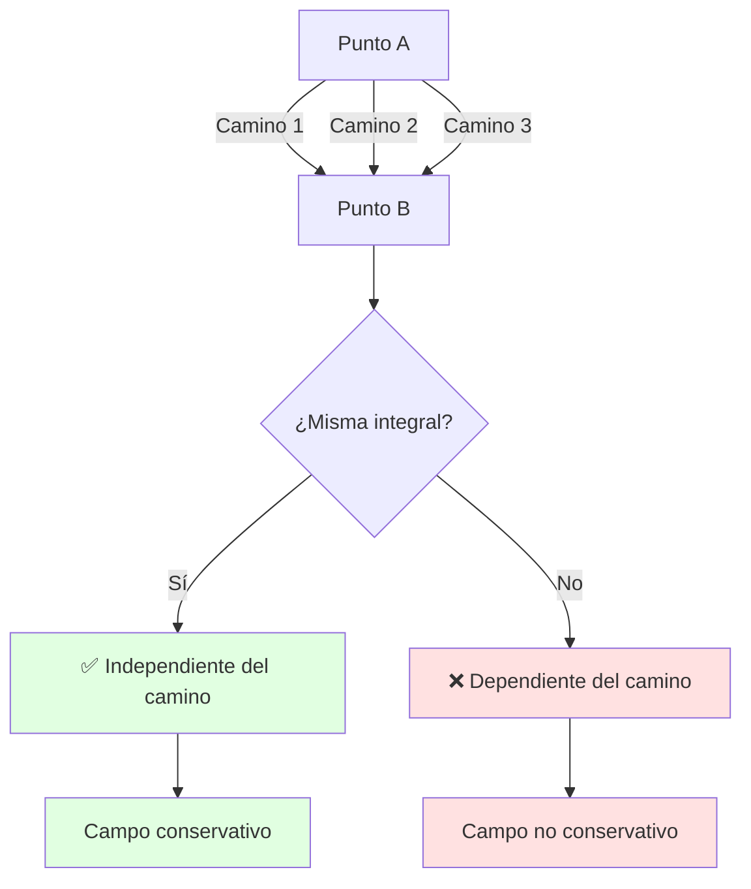
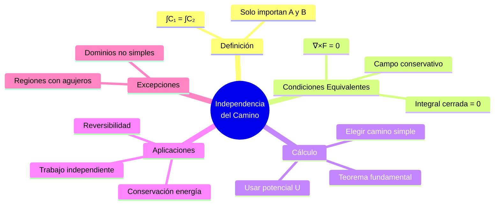
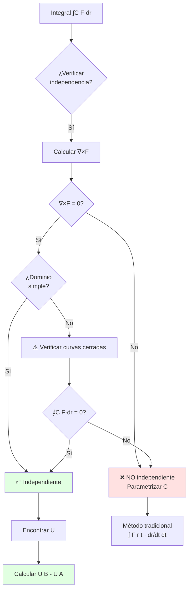

# 🛣️ Independencia del Camino

## 🎯 Introducción

> [!info]- 💡 ¿Qué es la Independencia del Camino? La **independencia del camino** es una propiedad fundamental de ciertas integrales de línea donde el valor de la integral depende únicamente de los puntos inicial y final, no de la trayectoria específica seguida entre ellos.
> 
> **Analogía práctica:** Imagina viajar entre dos ciudades:
> 
> - **Con peaje (dependiente del camino):** Si pagas por kilómetro recorrido, la autopista directa cuesta menos que el camino escénico largo. **El camino importa**.
> - **Con tarifa fija (independiente del camino):** Si pagas una tarifa fija por llegar al destino, no importa qué ruta tomes. **Solo importan origen y destino**.
> - **Altitud (independiente del camino):** Subir de 100m a 500m requiere la misma energía potencial sin importar la ruta. **Solo importa la diferencia de altura**.
> 
> **¿Por qué es importante?**
> 
> |Aspecto|Descripción|Ejemplo de Uso|
> |---|---|---|
> |**Simplificación de cálculo**|No necesitas parametrizar curvas complejas|Elegir el camino más simple|
> |**Conservación de energía**|Trabajo independiente del camino|Física conservativa|
> |**Existencia de potencial**|Garantiza función potencial|Encontrar U explícitamente|
> |**Reversibilidad**|Ir y volver suma cero|Ciclos cerrados|
> |**Aplicaciones físicas**|Campos conservativos en naturaleza|Gravedad, campo eléctrico|



---

## 📐 Definición Formal

### 🎯 Concepto Matemático

> [!example]- 📋 Definición Precisa
> 
> **Definición:**
> 
> Sea F un campo vectorial continuo en una región D. La integral de línea ∫C F·dr es **independiente del camino** en D si:
> 
> ```
> Para cualesquiera dos curvas C₁ y C₂ en D 
> con los mismos puntos inicial A y final B:
> 
> ∫C₁ F·dr = ∫C₂ F·dr
> ```
> 
> **Notación:**
> 
> Cuando hay independencia, podemos escribir:
> 
> ```
> ∫C F·dr = ∫A→B F·dr
> 
> (sin especificar el camino C)
> ```
> 
> **Visualización:**
> 
> ```mermaid
> graph TB
>     subgraph "Región D"
>     A["Punto A<br/>(x₀,y₀)"]
>     B["Punto B<br/>(x₁,y₁)"]
>     end
>     
>     A -->|C₁: recta| B
>     A -->|C₂: curva| B
>     A -->|C₃: zigzag| B
>     
>     C["∫C₁ = ∫C₂ = ∫C₃"]
>     
>     style C fill:#e1ffe1
> ```
> 
> **Ejemplo intuitivo:**
> 
> ```
> Campo F(x,y) = (2x, 2y)
> De A(0,0) a B(1,1)
> 
> Camino 1: y = x (diagonal)
> Camino 2: (0,0)→(1,0)→(1,1) (rectangular)
> Camino 3: y = x² (parábola)
> 
> Todos dan: ∫ F·dr = 2
> 
> ✅ Independiente del camino
> ```
> 
> **Tabla de características:**
> 
> |Con independencia|Sin independencia|
> |---|---|
> |∫C₁ F·dr = ∫C₂ F·dr|∫C₁ F·dr ≠ ∫C₂ F·dr|
> |Solo importan A y B|Importa trayectoria completa|
> |Campo conservativo|Campo no conservativo|
> |∇×F = 0|∇×F ≠ 0|

### 🔄 Relación con Curvas Cerradas

> [!note]- ⭕ Consecuencia Importante
> 
> **Teorema:**
> 
> ```
> ∫C F·dr es independiente del camino
> 
> ⟺
> 
> ∮C F·dr = 0  para toda curva cerrada C
> ```
> 
> **Demostración (⟹):**
> 
> ```mermaid
> graph LR
>     A[Punto A] -->|C₁| B[Punto B]
>     B -->|C₂ invertida| A
>     
>     C["Curva cerrada = C₁ + (-C₂)"]
>     
>     style C fill:#fff4e1
> ```
> 
> ```
> Si hay independencia:
> ∫C₁ F·dr = ∫C₂ F·dr
> 
> Curva cerrada C = C₁ ∪ (-C₂):
> ∮C F·dr = ∫C₁ F·dr + ∫₍₋C₂₎ F·dr
>         = ∫C₁ F·dr - ∫C₂ F·dr
>         = 0  ✓
> ```
> 
> **Demostración (⟸):**
> 
> ```
> Si ∮C F·dr = 0 para toda curva cerrada:
> 
> Sean C₁ y C₂ de A a B:
> C = C₁ ∪ (-C₂) es cerrada
> 
> 0 = ∮C F·dr = ∫C₁ F·dr - ∫C₂ F·dr
> 
> ∴ ∫C₁ F·dr = ∫C₂ F·dr  ✓
> ```
> 
> **Interpretación física:**
> 
> ```
> Curva cerrada = ciclo completo
> 
> Si ∮C F·dr = 0:
> • Trabajo en ciclo = 0
> • No se puede extraer energía indefinidamente
> • Sistema conservativo
> ```
> 
> **Ejemplo verificación:**
> 
> ```
> F(x,y) = (-y, x)  (campo rotacional)
> C: círculo x² + y² = 1
> 
> ∮C F·dr = 2π ≠ 0
> 
> ∴ NO hay independencia del camino
> ```

---

## 🔍 Condiciones Equivalentes

### 📊 Teorema de Equivalencia

> [!success]- 🎭 Cuatro Caracterizaciones Equivalentes
> 
> **Teorema fundamental:**
> 
> Para un campo vectorial F continuo en una región D **simplemente conexa**, las siguientes condiciones son **equivalentes**:
> 
> ```mermaid
> graph TB
>     A["(1) Independencia<br/>del camino"]
>     B["(2) ∮C F·dr = 0<br/>para toda C cerrada"]
>     C["(3) F conservativo<br/>F = ∇U"]
>     D["(4) ∇×F = 0"]
>     
>     A <--> B
>     B <--> C
>     C <--> D
>     D <--> A
>     
>     style A fill:#e1ffe1
>     style B fill:#fff4e1
>     style C fill:#e1f5ff
>     style D fill:#ffe1f5
> ```
> 
> **Tabla de equivalencias:**
> 
> |Condición|Enunciado|Cómo verificar|
> |---|---|---|
> |**(1)**|Independencia del camino|Calcular por dos caminos|
> |**(2)**|Integral cerrada = 0|Integrar en círculo|
> |**(3)**|Existe potencial U|Encontrar U tal que F=∇U|
> |**(4)**|Rotacional nulo|Calcular ∇×F|
> 
> **Diagrama de implicaciones:**
> 
> ```mermaid
> flowchart LR
>     A[1 Independencia] -->|implica| B[2 Ciclo = 0]
>     B -->|implica| C["3 ∃U: F=∇U"]
>     C -->|implica| D[4 ∇×F=0]
>     D -->|implica| A
>     
>     style A fill:#e1ffe1
>     style B fill:#fff4e1
>     style C fill:#e1f5ff
>     style D fill:#ffe1f5
> ```
> 
> **⚠️ IMPORTANTE: Región simplemente conexa**
> 
> ```
> Simplemente conexa = sin agujeros
> 
> Ejemplos SÍ simplemente conexos:
> • Todo el plano ℝ²
> • Un disco
> • Un rectángulo
> • Interior de una esfera
> 
> Ejemplos NO simplemente conexos:
> • Plano menos un punto
> • Anillo (disco con agujero)
> • Toro
> ```
> 
> **Contraejemplo clásico (región con agujero):**
> 
> ```
> F(x,y) = (-y/(x²+y²), x/(x²+y²))
> 
> Definido en ℝ² \ {(0,0)}  ← Agujero en origen
> 
> ∇×F = 0 en su dominio ✓
> 
> PERO: ∮C F·dr = 2π ≠ 0
>       (C: círculo alrededor del origen)
> 
> ∴ NO hay independencia
> 
> Razón: región NO simplemente conexa
> ```

### 🧮 Verificación Práctica

> [!tip]- ✅ Estrategia de Verificación
> 
> **Método recomendado según contexto:**
> 
> ```mermaid
> flowchart TD
>     A[Quiero verificar<br/>independencia] --> B{¿Qué tengo?}
>     
>     B -->|"Campo F=(P,Q)"| C[Calcular ∂Q/∂x - ∂P/∂y]
>     B -->|"Curva específica"| D[Calcular ∮C F·dr]
>     B -->|"Contexto físico"| E[Buscar potencial U]
>     
>     C --> F{= 0?}
>     D --> G{= 0?}
>     E --> H{¿Existe U?}
>     
>     F -->|Sí| I[✅ Independiente]
>     F -->|No| J[❌ Dependiente]
>     G -->|Sí| I
>     G -->|No| J
>     H -->|Sí| I
>     H -->|No| J
>     
>     style I fill:#e1ffe1
>     style J fill:#ffe1e1
> ```
> 
> **Algoritmo paso a paso:**
> 
> **Paso 1: Verificar dominio**
> 
> ```
> ¿El dominio D es simplemente conexo?
> • Sí → Continuar
> • No → Cuidado, puede haber excepciones
> ```
> 
> **Paso 2: Calcular rotacional (más fácil)**
> 
> ```
> En ℝ²: ∇×F = ∂Q/∂x - ∂P/∂y
> En ℝ³: ∇×F = (∂R/∂y-∂Q/∂z, ∂P/∂z-∂R/∂x, ∂Q/∂x-∂P/∂y)
> 
> Si = 0 → Independiente ✅
> Si ≠ 0 → Dependiente ❌
> ```
> 
> **Ejemplos de verificación:**
> 
> **Ejemplo 1: Verificación exitosa**
> 
> ```
> F(x,y) = (3x²y, x³ + 2y)
>         = (P,   Q)
> 
> ∂P/∂y = 3x²
> ∂Q/∂x = 3x²
> 
> ∇×F = 3x² - 3x² = 0  ✅
> 
> ∴ Hay independencia del camino
> ```
> 
> **Ejemplo 2: Verificación negativa**
> 
> ```
> F(x,y) = (x², xy)
>         = (P,  Q)
> 
> ∂P/∂y = 0
> ∂Q/∂x = y
> 
> ∇×F = y - 0 = y ≠ 0  ❌
> 
> ∴ NO hay independencia (excepto en y=0)
> ```
> 
> **Ejemplo 3: Verificación en ℝ³**
> 
> ```
> F(x,y,z) = (2xy, x² + z, y)
>          = (P,   Q,      R)
> 
> ∂R/∂y - ∂Q/∂z = 1 - 1 = 0  ✓
> ∂P/∂z - ∂R/∂x = 0 - 0 = 0  ✓
> ∂Q/∂x - ∂P/∂y = 2x - 2x = 0  ✓
> 
> ∇×F = (0,0,0)  ✅
> 
> ∴ Hay independencia del camino
> ```

---

## 🎯 Cálculo de Integrales

### 🚀 Método del Teorema Fundamental

> [!example]- 📐 Uso de la Función Potencial
> 
> **Teorema fundamental para integrales de línea:**
> 
> ```
> Si F = ∇U (campo conservativo), entonces:
> 
> ∫C F·dr = U(B) - U(A)
> 
> donde C va de A a B
> ```
> 
> **Procedimiento:**
> 
> ```mermaid
> flowchart TD
>     A[Verificar F conservativo] --> B[Encontrar potencial U]
>     B --> C[Evaluar U en punto final B]
>     C --> D[Evaluar U en punto inicial A]
>     D --> E[Restar: U B - U A]
>     
>     style E fill:#e1ffe1
> ```
> 
> **Ejemplo completo:**
> 
> ```
> Calcular ∫C F·dr donde F(x,y) = (2x, 2y)
> de A(0,0) a B(3,4)
> 
> Paso 1: Verificar conservatividad
> ∂(2x)/∂y = 0,  ∂(2y)/∂x = 0
> ∇×F = 0 - 0 = 0  ✅ Conservativo
> 
> Paso 2: Encontrar U
> ∂U/∂x = 2x  →  U = x² + g(y)
> ∂U/∂y = g'(y) = 2y  →  g(y) = y²
> 
> U(x,y) = x² + y²
> 
> Paso 3: Aplicar teorema
> ∫C F·dr = U(3,4) - U(0,0)
>         = (3² + 4²) - (0² + 0²)
>         = 9 + 16 - 0
>         = 25
> 
> ¡Solo dos evaluaciones, sin parametrizar!
> ```
> 
> **Ventajas del método:**
> 
> |Ventaja|Descripción|
> |---|---|
> |**Rapidez**|Solo evaluar U en 2 puntos|
> |**Simplicidad**|No parametrizar curvas|
> |**Generalidad**|Sirve para cualquier camino|
> |**Conceptual**|Usa estructura del problema|
> 
> **Comparación con método tradicional:**
> 
> ```
> Método tradicional (sin independencia):
> 1. Parametrizar C: r(t), t ∈ [a,b]
> 2. Calcular dr/dt
> 3. Evaluar F(r(t))
> 4. Calcular F(r(t))·(dr/dt)
> 5. Integrar ∫ₐᵇ F(r(t))·(dr/dt) dt
> 
> Método con independencia:
> 6. Encontrar U
> 7. Calcular U(B) - U(A)
> 
> ¡Mucho más eficiente!
> ```

### 🛤️ Elección del Camino Más Conveniente

> [!tip]- 🎨 Estrategia de Simplificación
> 
> **Idea clave:**
> 
> Cuando hay independencia, podemos elegir **el camino más fácil de parametrizar**.
> 
> **Caminos convenientes:**
> 
> ```mermaid
> graph TB
>     A["De (x₀,y₀) a (x₁,y₁)"]
>     
>     A --> B[Camino 1: Segmentos<br/>horizontales y verticales]
>     A --> C[Camino 2: Línea recta]
>     A --> D[Camino 3: Seguir ejes]
>     
>     B --> E[Más fácil]
>     C --> F[Más corto]
>     D --> G[Más simple]
>     
>     style E fill:#e1ffe1
>     style F fill:#fff4e1
>     style G fill:#e1f5ff
> ```
> 
> **Ejemplo: Caminos rectangulares**
> 
> ```
> F(x,y) = (2xy, x²)
> De (0,0) a (2,3)
> 
> Camino rectangular (más fácil):
> C₁: (0,0) → (2,0)  (horizontal, y=0)
> C₂: (2,0) → (2,3)  (vertical, x=2)
> 
> En C₁: r₁(t) = (t,0), t ∈ [0,2]
>        F(t,0) = (0, t²)
>        dr₁ = (1,0)dt
>        ∫C₁ = ∫₀² 0·1 dt = 0
> 
> En C₂: r₂(s) = (2,s), s ∈ [0,3]
>        F(2,s) = (4s, 4)
>        dr₂ = (0,1)ds
>        ∫C₂ = ∫₀³ 4·1 ds = 12
> 
> Total: ∫C F·dr = 0 + 12 = 12
> ```
> 
> **Tabla de caminos recomendados:**
> 
> |Situación|Camino recomendado|Ventaja|
> |---|---|---|
> |**Campo simple**|Segmentos paralelos a ejes|Componentes se anulan|
> |**Simetría radial**|Línea desde origen|Aprovecha simetría|
> |**Un componente nulo**|Seguir ese eje|Integral = 0 en parte|
> |**Potencial conocido**|¡Cualquiera!|Usar U(B)-U(A)|
> 
> **Estrategia para componentes:**
> 
> ```
> Si F = (P, 0):
> → Elegir camino con dy = 0 (horizontal)
> → Entonces F·dr = P dx (más simple)
> 
> Si F = (0, Q):
> → Elegir camino con dx = 0 (vertical)
> → Entonces F·dr = Q dy (más simple)
> ```

### 📊 Ejemplos Detallados

> [!success]- 💡 Casos Prácticos Resueltos
> 
> **Ejemplo 1: Campo polinomial**
> 
> ```
> F(x,y) = (3x² + 4y, 4x + 6y²)
> De A(-1,0) a B(2,1)
> 
> Solución:
> 
> Verificar conservatividad:
> ∂P/∂y = 4,  ∂Q/∂x = 4  ✅
> 
> Encontrar U:
> U = ∫(3x² + 4y) dx = x³ + 4xy + g(y)
> ∂U/∂y = 4x + g'(y) = 4x + 6y²
> g'(y) = 6y²  →  g(y) = 2y³
> 
> U(x,y) = x³ + 4xy + 2y³
> 
> Calcular:
> ∫C F·dr = U(2,1) - U(-1,0)
>         = (8 + 8 + 2) - (-1 + 0 + 0)
>         = 18 - (-1)
>         = 19
> ```
> 
> **Ejemplo 2: Campo con radicales**
> 
> ```
> F(x,y) = (y/√(xy), x/√(xy))
> De A(1,1) a B(4,4)
> 
> Solución:
> 
> Simplificar:
> F = (y/(xy)^(1/2), x/(xy)^(1/2))
>   = (√(y/x), √(x/y))
> 
> Verificar (más fácil usar potencial):
> Intentar U = k√(xy)
> ∇U = (k·½·√(y/x), k·½·√(x/y))
> 
> Comparar con F: k = 2
> U(x,y) = 2√(xy)
> 
> Calcular:
> ∫C F·dr = U(4,4) - U(1,1)
>         = 2√16 - 2√1
>         = 8 - 2
>         = 6
> ```
> 
> **Ejemplo 3: Campo en ℝ³**
> 
> ```
> F(x,y,z) = (yz, xz, xy)
> De A(0,0,0) a B(1,1,1)
> 
> Solución:
> 
> Verificar ∇×F = 0 (ya verificado antes)
> 
> Encontrar U:
> U = ∫yz dx = xyz + g(y,z)
> ∂U/∂y = xz + ∂g/∂y = xz
> ∂g/∂y = 0  →  g = h(z)
> 
> U = xyz + h(z)
> ∂U/∂z = xy + h'(z) = xy
> h'(z) = 0  →  h = C
> 
> U(x,y,z) = xyz
> 
> Calcular:
> ∫C F·dr = U(1,1,1) - U(0,0,0)
>         = 1 - 0
>         = 1
> ```
> 
> **Ejemplo 4: Eligiendo camino conveniente**
> 
> ```
> F(x,y) = (eˣ + y, x + sin y)
> De (0,0) a (1,π/2)
> 
> Sin potencial (método directo):
> Camino rectangular: (0,0)→(1,0)→(1,π/2)
> 
> C₁: y=0, dy=0, x: 0→1
> ∫C₁ = ∫₀¹ (eˣ + 0) dx = e - 1
> 
> C₂: x=1, dx=0, y: 0→π/2
> ∫C₂ = ∫₀^(π/2) (1 + sin y) dy 
>     = [y - cos y]₀^(π/2)
>     = (π/2 - 0) - (0 - 1)
>     = π/2 + 1
> 
> Total: (e-1) + (π/2+1) = e + π/2
> ```

---

## 🔬 Aplicaciones y Consecuencias

### ⚡ Trabajo y Energía

> [!note]- 💪 Interpretación Física
> 
> **Trabajo realizado por fuerza conservativa:**
> 
> ```
> W = ∫C F·dr = U(A) - U(B) = -ΔU
> 
> Trabajo = Disminución de energía potencial
> ```
> 
> **Principio de conservación:**
> 
> ```mermaid
> graph LR
>     A[Energía Total] --> B[Cinética K]
>     A --> C[Potencial U]
>     
>     D[K + U = E₀]
>     
>     B -.->|ΔK = -ΔU| C
>     
>     style D fill:#e1ffe1
> ```
> 
> **Ejemplo: Objeto cayendo**
> 
> ```
> Campo gravitatorio: F = (0, -mg)
> Potencial: U(y) = mgy
> 
> Cae de altura h₁ a h₂:
> W = U(h₁) - U(h₂) = mg(h₁ - h₂) = mgΔh
> 
> Por conservación de energía:
> ½mv₂² - ½mv₁² = mgΔh
> 
> Si v₁ = 0 (parte del reposo):
> v₂ = √(2gΔh)
> 
> ¡Independiente de la trayectoria!
> ```
> 
> **Tabladel trabajo:**
> 
> |Movimiento|Trabajo|Interpretación|
> |---|---|---|
> |**Subir**|W < 0|Contra el campo, aumenta U|
> |**Bajar**|W > 0|A favor del campo, disminuye U|
> |**Horizontal**|W = 0|Perpendicular al campo|
> |**Ciclo cerrado**|W = 0|Vuelve al inicio|

### 🔄 Reversibilidad

> [!tip]- ↩️ Procesos Reversibles
> 
> **Propiedad:**
> 
> ```
> Si hay independencia del camino:
> 
> Trabajo A→B = -(Trabajo B→A)
> 
> ∫A→B F·dr = -∫B→A F·dr
> ```
> 
> **Visualización:**
> 
> ```mermaid
> graph LR
>     A[Punto A<br/>U A] -->|"Ir: W₁"| B[Punto B<br/>U B]
>     B -->|"Volver: W₂"| A
>     
>     C["W₁ = U(A) - U(B)<br/>W₂ = U(B) - U(A)<br/>W₁ + W₂ = 0"]
>     
>     style C fill:#e1ffe1
> ```
> 
> **Ejemplo:**
> 
> ```
> F(x,y) = (2x, 2y), U(x,y) = x² + y²
> 
> Ir de (0,0) a (1,1):
> W₁ = U(0,0) - U(1,1) = 0 - 2 = -2
> 
> Volver de (1,1) a (0,0):
> W₂ = U(1,1) - U(0,0) = 2 - 0 = 2
> 
> W₁ + W₂ = -2 + 2 = 0 ✓
> 
> "Proceso reversible: energía recuperable"
> ```
> 
> **Contraste con procesos irreversibles:**
> 
> |Proceso|Reversible|Irreversible|
> |---|---|---|
> |**Ejemplo**|Péndulo ideal|Péndulo con fricción|
> |**Energía**|Conservada|Disipada|
> |**Ciclo**|W = 0|W < 0|
> |**Campo**|Conservativo|No conservativo|

### 🎯 Simplificación de Problemas

> [!success]- 🚀 Estrategias Eficientes
> 
> **Ventajas computacionales:**
> 
> ```mermaid
> mindmap
>   root((Independencia<br/>del Camino))
>     Elegir camino simple
>       Segmentos rectos
>       Paralelos a ejes
>     Usar potencial
>       Solo 2 evaluaciones
>       U B - U A
>     Evitar parametrización
>       No calcular dr/dt
>       No integrar
>     Verificar una vez
>       ∇×F = 0
>       Usar siempre
> ```

> **Ejemplo comparativo:**
> 
> **Problema:** ∫C F·dr donde F(x,y) = (2xy, x²) De (0,0) a (2,3) por y = (3/4)x²
> 
> **Método tradicional (sin reconocer independencia):**
> 
> ```
> 1. Parametrizar: r(t) = (t, 3t²/4), t ∈ [0,2]
> 2. dr/dt = (1, 3t/2)
> 3. F(r(t)) = (2t·3t²/4, t²) = (3t³/2, t²)
> 4. F·(dr/dt) = (3t³/2)·1 + t²·(3t/2) = 3t³
> 5. ∫₀² 3t³ dt = [3t⁴/4]₀² = 12
> ```
> 
> **Método con independencia:**
> 
> ```
> 6. Verificar: ∂(x²)/∂x = 2x = ∂(2xy)/∂y ✓
> 7. U(x,y) = x²y
> 8. U(2,3) - U(0,0) = 12 - 0 = 12
> ```
> 
> **Comparación:**
> 
> |Aspecto|Sin independencia|Con independencia|
> |---|---|---|
> |**Pasos**|5 complejos|3 simples|
> |**Cálculos**|Derivadas, producto punto, integral|Derivadas parciales, resta|
> |**Tiempo**|~5 minutos|~1 minuto|
> |**Errores**|Propenso|Menos propenso|

---

## 🧩 Casos Especiales

### 🕳️ Regiones No Simplemente Conexas

> [!warning]- ⚠️ Cuidado con Agujeros
> 
> **Definición:**
> 
> Una región NO es simplemente conexa si tiene "agujeros" o no se puede deformar cualquier curva cerrada a un punto sin salir de la región.
> 
> **Ejemplos visuales:**
> 
> ```mermaid
> graph TB
>     subgraph "Simplemente conexa ✅"
>     A1[Disco completo]
>     A2[Rectángulo]
>     A3[Todo ℝ²]
>     end
>     
>     subgraph "NO simplemente conexa ❌"
>     B1[Anillo agujero]
>     B2[ℝ² \ punto]
>     B3[Toro dona]
>     end
>     
>     style A1 fill:#e1ffe1
>     style A2 fill:#e1ffe1
>     style A3 fill:#e1ffe1
>     style B1 fill:#ffe1e1
>     style B2 fill:#ffe1e1
>     style B3 fill:#ffe1e1
> ```
> 
> **Contraejemplo clásico:**
> 
> ```
> F(x,y) = (-y/(x²+y²), x/(x²+y²))
> 
> Dominio: ℝ² \ {(0,0)}  (plano sin origen)
> 
> Verificar rotacional:
> P = -y/(x²+y²)
> Q = x/(x²+y²)
> 
> ∂Q/∂x - ∂P/∂y = [cálculo tedioso...] = 0
> 
> ∴ ∇×F = 0 en su dominio ✅
> 
> PERO: C = círculo x²+y²=1 (rodea el agujero)
> ∮C F·dr = 2π ≠ 0 ❌
> 
> ¿Por qué? El agujero en (0,0) "rompe" la independencia
> ```
> 
> **Regla práctica:**
> 
> ```mermaid
> flowchart TD
>     A[∇×F = 0] --> B{¿Región simplemente<br/>conexa?}
>     B -->|Sí| C[✅ Independencia<br/>garantizada]
>     B -->|No| D[⚠️ Puede fallar<br/>Verificar curvas cerradas]
>     
>     style C fill:#e1ffe1
>     style D fill:#fff4e1
> ```
> 
> **Tabla de situaciones:**
> 
> |Situación|∇×F = 0|Simplemente conexa|Independencia|
> |---|---|---|---|
> |**Caso 1**|✅|✅|✅ Sí|
> |**Caso 2**|❌|✅|❌ No|
> |**Caso 3**|✅|❌|⚠️ Depende|
> |**Caso 4**|❌|❌|❌ No|

### 🔀 Dependencia Parcial

> [!example]- 📐 Independencia en Subregiones
> 
> **Concepto:**
> 
> Un campo puede tener independencia del camino en ciertas regiones pero no en otras.
> 
> **Ejemplo:**
> 
> ```
> F(x,y) = (y², 2xy)
> 
> ∂(2xy)/∂x = 2y
> ∂(y²)/∂y = 2y
> ∇×F = 0  ✅
> 
> Dominio: Todo ℝ² (simplemente conexo)
> ∴ Hay independencia en TODO ℝ²
> 
> ---
> 
> G(x,y) = (-y/(x²+y²), x/(x²+y²))
> 
> ∇×G = 0 en ℝ²\{(0,0)}
> 
> Región 1: x > 0 (medio plano derecho)
> → Simplemente conexa → Independencia ✅
> 
> Región 2: ℝ²\{(0,0)} (plano completo sin origen)
> → NO simplemente conexa → NO independencia ❌
> ```
> 
> **Criterio por regiones:**
> 
> ```mermaid
> graph TB
>     A[Campo F] --> B[Dividir en regiones]
>     B --> C[Región R₁]
>     B --> D[Región R₂]
>     
>     C --> E{∇×F=0 y<br/>simplemente conexa?}
>     D --> F{∇×F=0 y<br/>simplemente conexa?}
>     
>     E -->|Sí| G[✅ Independencia en R₁]
>     E -->|No| H[❌ No en R₁]
>     F -->|Sí| I[✅ Independencia en R₂]
>     F -->|No| J[❌ No en R₂]
>     
>     style G fill:#e1ffe1
>     style I fill:#e1ffe1
>     style H fill:#ffe1e1
>     style J fill:#ffe1e1
> ```

---

## 📊 Resumen Visual Completo

### Mapa Conceptual General



### Tabla Resumen de Criterios

|Criterio|Condición|Ventaja|Limitación|
|---|---|---|---|
|**Rotacional**|∇×F = 0|✅ Necesario y suficiente|Requiere región simple|
|**Derivadas parciales**|∂P/∂y = ∂Q/∂x|Rápido de verificar|Solo en ℝ²|
|**Integral cerrada**|∮C F·dr = 0|Verificación directa|Todas las curvas|
|**Potencial**|∃U: F=∇U|Cálculo eficiente|Hay que encontrar U|

### Diagrama de Flujo: Resolver Problemas



---

## 🎓 Ejercicios Guiados

> [!example]- 💪 Práctica Progresiva
> 
> **Nivel Básico:**
> 
> **1. Verificar independencia**
> 
> ```
> F(x,y) = (2x + y, x + 2y)
> 
> Solución:
> ∂P/∂y = 1
> ∂Q/∂x = 1
> 
> ∇×F = 1 - 1 = 0  ✅ Independiente
> ```
> 
> **2. Calcular con potencial**
> 
> ```
> F(x,y) = (2x, 3y²)
> De (0,0) a (1,2)
> 
> Encontrar U:
> U = x² + y³
> 
> ∫C F·dr = U(1,2) - U(0,0)
>         = (1 + 8) - 0
>         = 9
> ```
> 
> **Nivel Intermedio:**
> 
> **3. Comparar caminos**
> 
> ```
> F(x,y) = (y, x), de (0,0) a (2,2)
> 
> Camino 1: y = x (diagonal)
> r₁(t) = (t,t), t ∈ [0,2]
> F(r₁) = (t,t), dr₁ = (1,1)dt
> ∫C₁ = ∫₀² 2t dt = 4
> 
> Camino 2: (0,0)→(2,0)→(2,2)
> C₂ₐ: y=0, ∫ = 0
> C₂ᵦ: x=2, ∫ = ∫₀² 2 dy = 4
> Total: 4
> 
> ✅ Mismo resultado (es conservativo)
> ```
> 
> **4. Campo NO independiente**
> 
> ```
> F(x,y) = (x, y²)
> 
> ∂P/∂y = 0
> ∂Q/∂x = 0
> 
> ∇×F = 0  ✅ ¿Independiente?
> 
> Pero esperaeso está mal!
> 
> Recalcular:
> P = x → ∂P/∂y = 0
> Q = y² → ∂Q/∂x = 0
> 
> ∇×F = 0 - 0 = 0  ✅ SÍ es independiente
> 
> Encontrar U:
> U = x²/2 + y³/3
> ```
> 
> **Nivel Avanzado:**
> 
> **5. Región con agujero**
> 
> ```
> F(x,y) = (-y/(x²+y²), x/(x²+y²))
> 
> Dominio: ℝ²\{(0,0)}
> 
> a) Verificar ∇×F = 0 en dominio
> b) Calcular ∮C F·dr para C: x²+y²=1
> 
> Solución:
> a) [Cálculo largo] ∇×F = 0 ✓
> 
> b) Parametrizar: r(t) = (cost, sint)
>    F(r(t)) = (-sint, cost)
>    dr/dt = (-sint, cost)
>    F·(dr/dt) = sin²t + cos²t = 1
>    ∮C = ∫₀^(2π) 1 dt = 2π ≠ 0
> 
> ∴ NO hay independencia (agujero en origen)
> ```
> 
> **6. Aplicación física**
> 
> ```
> Campo gravitatorio 2D:
> F(x,y) = -GM(x,y)/(x²+y²)^(3/2)
> 
> Calcular trabajo de (1,0) a (0,1)
> 
> Solución:
> Es conservativo: U(x,y) = -GM/√(x²+y²)
> 
> W = U(1,0) - U(0,1)
>   = -GM/1 - (-GM/1)
>   = 0
> 
> ¡Trabajo nulo! Misma distancia al origen.
> ```

---

## 🔗 Conexión con Próximos Temas

> [!quote]- 🌟 Continuando el Aprendizaje
> 
> **Has dominado:**
> 
> ```mermaid
> mindmap
>   root((Independencia<br/>del Camino))
>     Verificación
>       Rotacional
>       Integral cerrada
>     Cálculo
>       Potencial
>       Camino simple
>     Condiciones
>       Equivalencias
>       Excepciones
>     Aplicaciones
>       Trabajo
>       Energía
> ```
> 
> **Progresión natural del aprendizaje:**
> 
> |Nivel|Tema|Por qué es el siguiente paso|
> |---|---|---|
> |**Actual**|Independencia del Camino|Integrales de línea especiales|
> |**Siguiente**|Teorema de Green|Relaciona línea con área|
> |**Avanzado**|Teorema de Stokes|Generalización a superficies|
> |**Integrador**|Teoremas Fundamentales|Unifica todo el cálculo vectorial|
> |**Aplicado**|Ecuaciones Diferenciales|Campos de direcciones|
> |**Profesional**|Topología Diferencial|Teoría profunda|
> 
> **Roadmap de evolución:**
> 
> ```mermaid
> graph LR
>     A[Independencia del Camino] --> B[Teorema de Green]
>     B --> C[Teorema de Stokes]
>     C --> D[Teorema de Divergencia]
>     D --> E[Teoremas Integrales]
>     
>     A -.-> F[Aplicaciones]
>     F -.-> G[Mecánica]
>     F -.-> H[Termodinámica]
>     F -.-> I[Electromagnetismo]
>     
>     style A fill:#e1ffe1
>     style B fill:#fff4e1
>     style C fill:#e1f5ff
>     style E fill:#ffe1f5
> ```
> 
> **Conceptos clave que siguen:**
> 
> 1. **Teorema de Green:** ∮C ↔ ∬D (línea a área)
> 2. **Teorema de Stokes:** ∮C ↔ ∬S (∇×F) (línea a superficie)
> 3. **Formas diferenciales:** Generalización abstracta
> 4. **Cohomología:** Estructura topológica profunda
> 5. **Cálculo en variedades:** Geometría diferencial

---

**Tags:** #calculo-vectorial #independencia-camino #integrales-linea #campos-conservativos #teorema-fundamental #trabajo #energia #aplicaciones #mermaid #diagramas