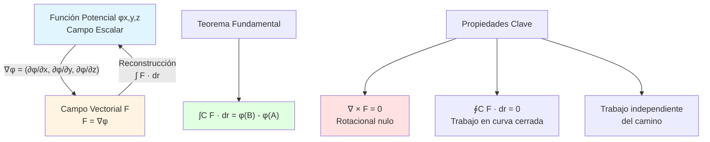

# 🔋 Potenciales y Reconstrucción del Potencial en Cálculo Vectorial

## 🎯 Introducción

> [!info]- 💡 ¿Qué es un Campo Potencial? En **Cálculo Vectorial**, un **campo potencial** (o función potencial) es una función escalar φ cuyo gradiente genera un campo vectorial **F**. Esta relación establece una conexión fundamental entre campos escalares y vectoriales.
> 
> **Analogía práctica:** Imagina una colina con diferentes alturas:
> 
> - El **potencial φ(x,y)** es la altura en cada punto (función escalar)
> - El **campo vectorial ∇φ** son las flechas que apuntan hacia la dirección de máxima pendiente ascendente
> - Una pelota rodando sigue la dirección de **-∇φ** (descenso más pronunciado)
> - **Reconstruir el potencial** es determinar el mapa de alturas conociendo solo las direcciones de pendiente
> 
> **¿Por qué es importante en Cálculo Vectorial?**
> 
> |Aspecto|Descripción|Ejemplo de Uso|
> |---|---|---|
> |**Simplificación**|Reduce 2 o 3 funciones (campo vectorial) a 1 función (potencial)|Campos gravitatorios y eléctricos|
> |**Trabajo e Integrales**|Facilita el cálculo de integrales de línea|Teorema Fundamental para integrales de línea|
> |**Campos Conservativos**|Identifica campos donde la energía se conserva|Física: sistemas mecánicos|
> |**Independencia de camino**|El trabajo no depende de la trayectoria, solo de inicio y fin|Optimización de rutas|
> |**Análisis de flujos**|Caracteriza comportamiento de campos vectoriales|Dinámica de fluidos|



---

## 📐 Campos Vectoriales Conservativos

### 🔍 Definición y Criterios

> [!example]- ⚡ ¿Cuándo un Campo Vectorial tiene Potencial?
> 
> Un **campo vectorial** **F** es **conservativo** (o tiene función potencial) si existe una función escalar φ tal que:
> 
> **F** = ∇φ = grad(φ)
> 
> **Relación Gradiente-Campo:**
> 
> ```
> En ℝ²:
> F(x,y) = P(x,y)î + Q(x,y)ĵ = ∇φ
> 
> Significa:
> P(x,y) = ∂φ/∂x
> Q(x,y) = ∂φ/∂y
> 
> ────────────────────────────────
> 
> En ℝ³:
> F(x,y,z) = P(x,y,z)î + Q(x,y,z)ĵ + R(x,y,z)k̂ = ∇φ
> 
> Significa:
> P(x,y,z) = ∂φ/∂x
> Q(x,y,z) = ∂φ/∂y
> R(x,y,z) = ∂φ/∂z
> ```
> 
> **Criterio de Conservatividad:**
> 
> ```mermaid
> flowchart TD
>     A[Campo Vectorial F] --> B{¿Dominio<br/>simplemente conexo?}
>     B -->|No| C[❌ Test no concluyente<br/>Verificar otros métodos]
>     B -->|Sí| D{En ℝ²:<br/>∂Q/∂x = ∂P/∂y?}
>     B -->|Sí| E{En ℝ³:<br/>∇ × F = 0?}
>     
>     D -->|Sí| F[✅ Es conservativo<br/>Existe potencial φ]
>     D -->|No| G[❌ NO es conservativo<br/>No existe potencial]
>     
>     E -->|Sí| F
>     E -->|No| G
>     
>     F --> H[Reconstruir φ]
>     
>     style F fill:#e1ffe1
>     style G fill:#ffe1e1
>     style B fill:#fff4e1
> ```
> 
> **Test de Conservatividad en ℝ²:**
> 
> Para **F** = P**î** + Q**ĵ**, el campo es conservativo si y solo si:
> 
> $$\frac{\partial Q}{\partial x} = \frac{\partial P}{\partial y}$$
> 
> |Paso|Acción|Resultado|
> |---|---|---|
> |**1**|Identificar P(x,y) y Q(x,y)|Componentes del campo|
> |**2**|Calcular ∂Q/∂x|Derivada parcial de Q respecto a x|
> |**3**|Calcular ∂P/∂y|Derivada parcial de P respecto a y|
> |**4**|Comparar|Si son iguales → conservativo|
> 
> **Ejemplo en ℝ²:**
> 
> ```
> F(x,y) = (2xy + 3)î + (x² - 4y)ĵ
> 
> P(x,y) = 2xy + 3
> Q(x,y) = x² - 4y
> 
> Test:
> ∂Q/∂x = ∂(x² - 4y)/∂x = 2x
> ∂P/∂y = ∂(2xy + 3)/∂y = 2x
> 
> ∂Q/∂x = ∂P/∂y ✅
> 
> Conclusión: F es conservativo, existe φ tal que F = ∇φ
> ```
> 
> **Test de Conservatividad en ℝ³:**
> 
> Para **F** = P**î** + Q**ĵ** + R**k̂**, el campo es conservativo si y solo si:
> 
> $$\nabla \times \mathbf{F} = \mathbf{0}$$
> 
> Es decir, todas las componentes del rotacional son cero:
> 
> $$\begin{cases} \frac{\partial R}{\partial y} - \frac{\partial Q}{\partial z} = 0 \[8pt] \frac{\partial P}{\partial z} - \frac{\partial R}{\partial x} = 0 \[8pt] \frac{\partial Q}{\partial x} - \frac{\partial P}{\partial y} = 0 \end{cases}$$
> 
> **Interpretación geométrica:**
> 
> ```mermaid
> graph LR
>     A[Rotacional = 0] --> B[No hay circulación]
>     B --> C[Sin remolinos<br/>o vórtices]
>     C --> D[Campo conservativo]
>     
>     E[Rotacional ≠ 0] --> F[Hay circulación]
>     F --> G[Presencia de<br/>vórtices]
>     G --> H[NO conservativo]
>     
>     style D fill:#e1ffe1
>     style H fill:#ffe1e1
> ```

### 🌀 Rotacional y Campos Conservativos

> [!note]- 🔄 El Rotacional como Detector
> 
> El **rotacional** (∇ × **F**) mide la "tendencia a rotar" de un campo vectorial:
> 
> **Definición del Rotacional:**
> 
> $$\nabla \times \mathbf{F} = \begin{vmatrix} \mathbf{i} & \mathbf{j} & \mathbf{k} \ \frac{\partial}{\partial x} & \frac{\partial}{\partial y} & \frac{\partial}{\partial z} \ P & Q & R \end{vmatrix}$$
> 
> $$= \left(\frac{\partial R}{\partial y} - \frac{\partial Q}{\partial z}\right)\mathbf{i} - \left(\frac{\partial R}{\partial x} - \frac{\partial P}{\partial z}\right)\mathbf{j} + \left(\frac{\partial Q}{\partial x} - \frac{\partial P}{\partial y}\right)\mathbf{k}$$
> 
> **Propiedad fundamental:**
> 
> Si **F** = ∇φ (conservativo), entonces:
> 
> $$\nabla \times \mathbf{F} = \nabla \times (\nabla \phi) = \mathbf{0}$$
> 
> **¿Por qué?** El rotacional del gradiente es siempre cero (teorema de Schwarz sobre igualdad de derivadas mixtas).
> 
> **Tabla comparativa:**
> 
> |Campo|Rotacional|Potencial|Interpretación Física|
> |---|---|---|---|
> |**Conservativo**|∇ × **F** = **0**|✅ Existe φ|Sin vórtices, energía conservada|
> |**NO Conservativo**|∇ × **F** ≠ **0**|❌ No existe φ|Con vórtices, energía disipada|
> |**Irrotacional**|∇ × **F** = **0**|✅ Existe φ|Sinónimo de conservativo|
> 
> **Ejemplo visual:**
> 
> ```mermaid
> graph TB
>     subgraph "Campo Conservativo"
>     A1[∇ × F = 0] --> A2[Sin rotación local]
>     A2 --> A3[Líneas de campo<br/>no forman ciclos]
>     end
>     
>     subgraph "Campo NO Conservativo"
>     B1[∇ × F ≠ 0] --> B2[Con rotación local]
>     B2 --> B3[Líneas de campo<br/>forman vórtices]
>     end
>     
>     style A1 fill:#e1ffe1
>     style B1 fill:#ffe1e1
> ```
> 
> **Ejemplo calculado:**
> 
> ```
> Campo: F(x,y,z) = yî + xĵ + 0k̂
> 
> P = y,  Q = x,  R = 0
> 
> Rotacional:
> ∇ × F = (∂R/∂y - ∂Q/∂z)î - (∂R/∂x - ∂P/∂z)ĵ + (∂Q/∂x - ∂P/∂y)k̂
>       = (0 - 0)î - (0 - 0)ĵ + (1 - 1)k̂
>       = 0î + 0ĵ + 0k̂ = 0
> 
> ✅ Es conservativo
> ```

---

## 🔨 Reconstrucción del Potencial

### 📝 Método de Integración Directa (ℝ²)

> [!success]- 🎯 Método Paso a Paso en Dos Dimensiones
> 
> **Dado:** Campo vectorial **F** = P(x,y)**î** + Q(x,y)**ĵ** que es conservativo
> 
> **Objetivo:** Encontrar φ(x,y) tal que **F** = ∇φ
> 
> **Sistema de ecuaciones:**
> 
> $$\begin{cases} \frac{\partial \phi}{\partial x} = P(x,y) & \text{(1)} \[8pt] \frac{\partial \phi}{\partial y} = Q(x,y) & \text{(2)} \end{cases}$$
> 
> **Algoritmo de reconstrucción:**
> 
> ```mermaid
> flowchart TD
>     A[Inicio: F = Pî + Qĵ] --> B[Verificar conservatividad<br/>∂Q/∂x = ∂P/∂y]
>     B -->|✅| C[Integrar ecuación 1<br/>φ = ∫P dx + g(y)]
>     B -->|❌| Z[STOP: No existe potencial]
>     
>     C --> D[Derivar resultado<br/>respecto a y]
>     D --> E[Igualar con ecuación 2<br/>∂φ/∂y = Q]
>     E --> F[Determinar g'(y)]
>     F --> G[Integrar g'(y)<br/>para obtener g(y)]
>     G --> H[φ(x,y) = ∫P dx + g(y)]
>     H --> I[✅ Potencial encontrado<br/>+ constante C]
>     
>     style B fill:#fff4e1
>     style C fill:#e1f5ff
>     style I fill:#e1ffe1
>     style Z fill:#ffe1e1
> ```
> 
> **PASO A PASO DETALLADO:**
> 
> |Paso|Acción|Fórmula|Propósito|
> |---|---|---|---|
> |**1**|Integrar P respecto a x|φ = ∫P(x,y) dx + g(y)|g(y) es constante respecto a x|
> |**2**|Derivar parcialmente respecto a y|∂φ/∂y = ∂/∂y[∫P dx] + g'(y)|Aplicar ecuación (2)|
> |**3**|Igualar con Q|∂/∂y[∫P dx] + g'(y) = Q(x,y)|Usar condición del gradiente|
> |**4**|Despejar g'(y)|g'(y) = Q - ∂/∂y[∫P dx]|Debe depender solo de y|
> |**5**|Integrar g'(y)|g(y) = ∫g'(y) dy|Obtener función de y|
> |**6**|Sustituir en φ|φ(x,y) = ∫P dx + g(y) + C|C es constante arbitraria|
> 
> **EJEMPLO COMPLETO:**
> 
> ```
> Dado: F(x,y) = (2xy + 3)î + (x² + 4y³)ĵ
> 
> Paso 0: Verificar conservatividad
> P = 2xy + 3,  Q = x² + 4y³
> ∂Q/∂x = 2x,  ∂P/∂y = 2x  ✅ Iguales → es conservativo
> 
> Paso 1: Integrar P respecto a x
> φ = ∫(2xy + 3) dx = x²y + 3x + g(y)
> 
> Paso 2: Derivar respecto a y
> ∂φ/∂y = x² + g'(y)
> 
> Paso 3: Igualar con Q
> x² + g'(y) = x² + 4y³
> 
> Paso 4: Despejar g'(y)
> g'(y) = 4y³
> 
> Paso 5: Integrar g'(y)
> g(y) = ∫4y³ dy = y⁴
> 
> Paso 6: Potencial final
> φ(x,y) = x²y + 3x + y⁴ + C
> 
> ✅ Verificación:
> ∂φ/∂x = 2xy + 3 = P ✓
> ∂φ/∂y = x² + 4y³ = Q ✓
> ```
> 
> **Método alternativo (integrar Q primero):**
> 
> ```
> Mismo ejemplo, ruta alternativa:
> 
> Paso 1: Integrar Q respecto a y
> φ = ∫(x² + 4y³) dy = x²y + y⁴ + h(x)
> 
> Paso 2: Derivar respecto a x
> ∂φ/∂x = 2xy + h'(x)
> 
> Paso 3: Igualar con P
> 2xy + h'(x) = 2xy + 3
> 
> Paso 4: Despejar h'(x)
> h'(x) = 3
> 
> Paso 5: Integrar h'(x)
> h(x) = ∫3 dx = 3x
> 
> Paso 6: Resultado
> φ(x,y) = x²y + y⁴ + 3x + C
> 
> ✅ Mismo resultado
> ```

### 📐 Método de Integración Directa (ℝ³)

> [!tip]- 🔷 Reconstrucción en Tres Dimensiones
> 
> **Dado:** Campo vectorial **F** = P**î** + Q**ĵ** + R**k̂** conservativo
> 
> **Sistema de ecuaciones:**
> 
> $$\begin{cases} \frac{\partial \phi}{\partial x} = P(x,y,z) \[8pt] \frac{\partial \phi}{\partial y} = Q(x,y,z) \[8pt] \frac{\partial \phi}{\partial z} = R(x,y,z) \end{cases}$$
> 
> **Algoritmo extendido:**
> 
> |Paso|Acción|Resultado|
> |---|---|---|
> |**1**|Integrar P respecto a x|φ = ∫P dx + g(y,z)|
> |**2**|Derivar respecto a y, igualar con Q|∂φ/∂y = Q → encontrar ∂g/∂y|
> |**3**|Integrar para actualizar g|g(y,z) = ∫(∂g/∂y) dy + h(z)|
> |**4**|Derivar respecto a z, igualar con R|∂φ/∂z = R → encontrar h'(z)|
> |**5**|Integrar h'(z)|h(z) = ∫h'(z) dz|
> |**6**|Ensamblar potencial completo|φ(x,y,z) = ... + C|
> 
> **EJEMPLO EN ℝ³:**
> 
> ```
> F(x,y,z) = (2xyz)î + (x²z)ĵ + (x²y + 2z)k̂
> 
> Verificar (∇ × F = 0):
> ∂R/∂y = x²,  ∂Q/∂z = x²  ✓
> ∂P/∂z = 2xy,  ∂R/∂x = 2xy  ✓
> ∂Q/∂x = 2xz,  ∂P/∂y = 2xz  ✓
> → Es conservativo
> 
> Paso 1: Integrar P respecto a x
> φ = ∫2xyz dx = x²yz + g(y,z)
> 
> Paso 2: Derivar respecto a y e igualar con Q
> ∂φ/∂y = x²z + ∂g/∂y = x²z
> → ∂g/∂y = 0
> → g no depende de y: g(y,z) = h(z)
> 
> Paso 3: Derivar respecto a z e igualar con R
> ∂φ/∂z = x²y + h'(z) = x²y + 2z
> → h'(z) = 2z
> 
> Paso 4: Integrar h'(z)
> h(z) = ∫2z dz = z²
> 
> Paso 5: Potencial final
> φ(x,y,z) = x²yz + z² + C
> 
> ✅ Verificación:
> ∂φ/∂x = 2xyz = P ✓
> ∂φ/∂y = x²z = Q ✓
> ∂φ/∂z = x²y + 2z = R ✓
> ```

### 🛣️ Método de Integración de Línea

> [!example]- 🎯 Reconstrucción mediante Camino
> 
> **Concepto:** Si **F** es conservativo, el potencial puede calcularse integrando a lo largo de cualquier camino desde un punto de referencia.
> 
> **Fórmula:**
> 
> $$\phi(\mathbf{r}) = \phi(\mathbf{r}_0) + \int_{\mathbf{r}_0}^{\mathbf{r}} \mathbf{F} \cdot d\mathbf{r}$$
> 
> Típicamente se elige φ(**r**₀) = 0, entonces:
> 
> $$\phi(x,y) = \int_{(x_0,y_0)}^{(x,y)} \mathbf{F} \cdot d\mathbf{r}$$
> 
> **Camino típico:** Segmentos paralelos a los ejes
> 
> ```mermaid
> graph LR
>     A["(x₀,y₀)<br/>Origen"] -->|"∫ P dx"| B["(x,y₀)<br/>Horizontal"]
>     B -->|"∫ Q dy"| C["(x,y)<br/>Destino"]
>     
>     style A fill:#e1f5ff
>     style B fill:#fff4e1
>     style C fill:#e1ffe1
> ```
> 
> **Camino en dos etapas (ℝ²):**
> 
> 1. **Horizontal:** (x₀,y₀) → (x,y₀)
>     - Parametrización: **r**(t) = (t, y₀), x₀ ≤ t ≤ x
>     - Contribución: ∫P(t,y₀) dt
> 2. **Vertical:** (x,y₀) → (x,y)
>     - Parametrización: **r**(t) = (x, t), y₀ ≤ t ≤ y
>     - Contribución: ∫Q(x,t) dt
> 
> **Fórmula simplificada:**
> 
> $$\phi(x,y) = \int_{x_0}^{x} P(t,y_0),dt + \int_{y_0}^{y} Q(x,t),dt$$
> 
> **EJEMPLO:**
> 
> ```
> F(x,y) = (2x + y)î + (x + 2y)ĵ
> Punto de referencia: (0,0) con φ(0,0) = 0
> 
> Camino: (0,0) → (x,0) → (x,y)
> 
> Tramo 1: (0,0) → (x,0)
> ∫₀ˣ P(t,0) dt = ∫₀ˣ (2t + 0) dt = [t²]₀ˣ = x²
> 
> Tramo 2: (x,0) → (x,y)
> ∫₀ʸ Q(x,t) dt = ∫₀ʸ (x + 2t) dt = [xt + t²]₀ʸ = xy + y²
> 
> Potencial:
> φ(x,y) = x² + xy + y² + C
> 
> Con C = 0:
> φ(x,y) = x² + xy + y²
> 
> ✅ Verificación:
> ∂φ/∂x = 2x + y = P ✓
> ∂φ/∂y = x + 2y = Q ✓
> ```
> 
> **Ventaja:** No requiere integrar "funciones misteriosas" g(y) o h(x) **Desventaja:** Requiere parametrizar caminos (más trabajo en ℝ³)

---

## 🎯 Teorema Fundamental para Integrales de Línea

### 📜 Enunciado y Significado

> [!note]- 🌟 El Teorema más Importante
> 
> **Teorema Fundamental para Integrales de Línea:**
> 
> Si **F** es un campo vectorial conservativo con potencial φ, y C es una curva suave desde el punto A hasta el punto B, entonces:
> 
> $$\int_C \mathbf{F} \cdot d\mathbf{r} = \phi(B) - \phi(A)$$
> 
> **Interpretación:**
> 
> ```mermaid
> graph LR
>     A["Punto A<br/>φ(A)"] -->|"Cualquier camino C"| B["Punto B<br/>φ(B)"]
>     
>     C[Trabajo = φB - φA] --> D[Independiente<br/>del camino]
>     
>     style A fill:#e1f5ff
>     style B fill:#fff4e1
>     style D fill:#e1ffe1
> ```
> 
> **Consecuencias importantes:**
> 
> |Propiedad|Descripción|Aplicación|
> |---|---|---|
> |**Independencia de camino**|El valor solo depende de inicio y fin|Cálculo simplificado de trabajo|
> |**Curvas cerradas**|∮**F**·d**r** = 0|Conservación de energía|
> |**Simplificación de cálculo**|No parametrizar curvas complejas|Física e ingeniería|
> |**Reversibilidad**|Trabajo de A→B es -trabajo de B→A|Procesos reversibles|
> 
> **Comparación con cálculo de una variable:**
> 
> |Cálculo I|Cálculo Vectorial|
> |---|---|
> |∫ₐᵇ f'(x) dx = f(b) - f(a)|∫C ∇φ · d**r** = φ(B) - φ(A)|
> |f'(x) es la derivada|∇φ es el gradiente|
> |f(x) es la antiderivada|φ es el potencial|
> 
> **Ejemplo de aplicación:**
> 
> ```
> Calcular: ∫C F · dr donde F = (2x + y)î + (x + 2y)ĵ
> Curva C: desde (0,0) hasta (1,1) a lo largo de y = x³
> 
> Método tradicional: Parametrizar C, calcular dr, integrar
> → Complicado
> 
> Método con teorema:
> 1. Verificar que F es conservativo:
>    ∂Q/∂x = 1,  ∂P/∂y = 1  ✓
> 
> 2. Encontrar φ:
>    φ = x² + xy + y² (del ejemplo anterior)
> 
> 3. Evaluar:
>    ∫C F · dr = φ(1,1) - φ(0,0)
>              = (1 + 1 + 1) - (0)
>              = 3
> 
> ✅ Respuesta: 3 (sin parametrizar la curva)
> ```

### 🔄 Trabajo e Independencia de Camino

> [!success]- ⚡ Aplicaciones Físicas
> 
> **Interpretación física:**
> 
> El **trabajo** realizado por una fuerza conservativa **F** al mover un objeto de A a B es:
> 
> $$W = \int_C \mathbf{F} \cdot d\mathbf{r} = \phi(B) - \phi(A)$$
> 
> **Energía potencial:**
> 
> En física, típicamente se define la energía potencial U = -φ, entonces:
> 
> $$W = -[U(B) - U(A)] = U(A) - U(B)$$
> 
> "El trabajo es igual a la disminución de la energía potencial"
> 
> **Ejemplos físicos:**
> 
> |Campo|Fuerza|Potencial|Interpretación|
> |---|---|---|---|
> |**Gravitatorio**|**F** = -mg**k̂**|φ = mgh|Altura gravitacional|
> |**Eléctrico**|**F** = qE|φ = qV|Voltaje eléctrico|
> |**Resorte**|**F** = -kx**î**|φ = ½kx²|Energía elástica|
> |**Gravitatorio general**|**F** = -GMm/r²**r̂**|φ = -GMm/r|Gravedad newtoniana|
> 
> **Conservación de energía:**
> 
> ```mermaid
> graph TD
>     A[Energía Total = Constante] --> B[E = K + U]
>     B --> C[Energía Cinética K]
>     B --> D[Energía Potencial U = -φ]
> 	E[Trabajo de fuerzas<br/>conservativas] --> F["W = -ΔU"]
> 	F --> G[ΔK + ΔU = 0]
> 
> style A fill:#e1ffe1
> style G fill:#e1f5ff
> ```
> 
> ```
> 
> **Ejemplo: Lanzamiento vertical**
> 
> ```
> 
> Campo gravitatorio: F = -mg k̂ Potencial: φ(z) = mgz (tomando φ(0) = 0)
> 
> Objeto lanzado desde z = 0 con velocidad v₀
> 
> Trabajo de 0 a altura h: W = φ(h) - φ(0) = mgh - 0 = mgh
> 
> Conservación de energía: ½mv₀² = ½mv² + mgh
> 
> Altura máxima (v = 0): h_max = v₀²/(2g)
> 
> ✅ El trabajo no depende de la trayectoria (parabólica, vertical, etc.)

---
## 🔍 Ejemplos Resueltos Completos

### 📘 Ejemplo 1: Campo Lineal en ℝ²

> [!example]- 💼 Problema Completo Paso a Paso
> 
> **ENUNCIADO:**
> 
> Dado el campo vectorial **F**(x,y) = (3x² + 4y)**î** + (4x + 6y²)**ĵ**:
> 
> a) Verificar si es conservativo b) Encontrar la función potencial φ c) Calcular ∫C **F**·d**r** desde (0,0) hasta (1,2)
> 
> ---
> 
> **SOLUCIÓN:**
> 
> **Parte (a): Verificar conservatividad**
> 
> ```
> F = Pî + Qĵ donde:
> P(x,y) = 3x² + 4y
> Q(x,y) = 4x + 6y²
> 
> Test: ∂Q/∂x = ∂P/∂y
> 
> ∂Q/∂x = ∂(4x + 6y²)/∂x = 4
> ∂P/∂y = ∂(3x² + 4y)/∂y = 4
> 
> 4 = 4 ✅
> 
> Conclusión: F es conservativo
> ```
> 
> **Parte (b): Encontrar potencial φ**
> 
> ```
> Método: Integración directa
> 
> Paso 1: Integrar P respecto a x
> φ = ∫(3x² + 4y) dx
>   = x³ + 4xy + g(y)
> 
> Paso 2: Derivar respecto a y
> ∂φ/∂y = 4x + g'(y)
> 
> Paso 3: Igualar con Q
> 4x + g'(y) = 4x + 6y²
> g'(y) = 6y²
> 
> Paso 4: Integrar g'(y)
> g(y) = ∫6y² dy = 2y³
> 
> Paso 5: Potencial completo
> φ(x,y) = x³ + 4xy + 2y³ + C
> 
> Tomamos C = 0:
> φ(x,y) = x³ + 4xy + 2y³
> ```
> 
> **Verificación:**
> 
> ```
> ∂φ/∂x = 3x² + 4y = P ✓
> ∂φ/∂y = 4x + 6y² = Q ✓
> ```
> 
> **Parte (c): Calcular integral de línea**
> 
> ```
> Usando teorema fundamental:
> ∫C F · dr = φ(1,2) - φ(0,0)
> 
> φ(1,2) = (1)³ + 4(1)(2) + 2(2)³
>        = 1 + 8 + 16
>        = 25
> 
> φ(0,0) = 0
> 
> ∫C F · dr = 25 - 0 = 25
> ```
> 
> **RESPUESTAS:**
> 
> - a) Sí, es conservativo (∂Q/∂x = ∂P/∂y = 4)
> - b) φ(x,y) = x³ + 4xy + 2y³
> - c) ∫C **F**·d**r** = 25

### 📗 Ejemplo 2: Campo en ℝ³

> [!example]- 🎓 Problema Tridimensional
> 
> **ENUNCIADO:**
> 
> Dado **F**(x,y,z) = (yz)**î** + (xz + 2y)**ĵ** + (xy + 3z²)**k̂**:
> 
> a) Verificar si es conservativo b) Encontrar φ(x,y,z) c) Calcular el trabajo de (0,0,0) a (1,1,1)
> 
> ---
> 
> **SOLUCIÓN:**
> 
> **Parte (a): Verificar ∇ × F = 0**
> 
> ```
> P = yz,  Q = xz + 2y,  R = xy + 3z²
> 
> Componente î:
> ∂R/∂y - ∂Q/∂z = x - x = 0 ✓
> 
> Componente ĵ:
> ∂P/∂z - ∂R/∂x = y - y = 0 ✓
> 
> Componente k̂:
> ∂Q/∂x - ∂P/∂y = z - z = 0 ✓
> 
> ∇ × F = 0 → Es conservativo ✅
> ```
> 
> **Parte (b): Reconstruir potencial**
> 
> ```
> Paso 1: Integrar P respecto a x
> φ = ∫yz dx = xyz + g(y,z)
> 
> Paso 2: Derivar respecto a y, igualar con Q
> ∂φ/∂y = xz + ∂g/∂y = xz + 2y
> ∂g/∂y = 2y
> 
> Integrar: g(y,z) = y² + h(z)
> 
> Entonces: φ = xyz + y² + h(z)
> 
> Paso 3: Derivar respecto a z, igualar con R
> ∂φ/∂z = xy + h'(z) = xy + 3z²
> h'(z) = 3z²
> 
> Integrar: h(z) = z³
> 
> Potencial final:
> φ(x,y,z) = xyz + y² + z³
> ```
> 
> **Verificación completa:**
> 
> ```
> ∂φ/∂x = yz = P ✓
> ∂φ/∂y = xz + 2y = Q ✓
> ∂φ/∂z = xy + 3z² = R ✓
> ```
> 
> **Parte (c): Trabajo**
> 
> ```
> W = φ(1,1,1) - φ(0,0,0)
> 
> φ(1,1,1) = (1)(1)(1) + (1)² + (1)³
>          = 1 + 1 + 1
>          = 3
> 
> φ(0,0,0) = 0
> 
> W = 3 - 0 = 3 unidades
> ```
> 
> **RESPUESTAS:**
> 
> - a) Sí, conservativo (∇ × **F** = **0**)
> - b) φ(x,y,z) = xyz + y² + z³
> - c) Trabajo = 3

### 📙 Ejemplo 3: Campo NO Conservativo

> [!warning]- ❌ Cuando NO Existe Potencial
> 
> **ENUNCIADO:**
> 
> Determinar si **F**(x,y) = (-y)**î** + (x)**ĵ** es conservativo. Si no lo es, calcular ∮C **F**·d**r** donde C es el círculo x² + y² = 1.
> 
> ---
> 
> **SOLUCIÓN:**
> 
> **Verificar conservatividad:**
> 
> ```
> P = -y,  Q = x
> 
> ∂Q/∂x = 1
> ∂P/∂y = -1
> 
> 1 ≠ -1 ❌
> 
> Conclusión: NO es conservativo
> No existe función potencial φ
> ```
> 
> **Interpretación geométrica:**
> 
> ```mermaid
> graph TD
>     A[Campo F = -yî + xĵ] --> B[Campo rotacional]
>     B --> C[Líneas de campo<br/>forman círculos]
>     C --> D[Circulación no nula]
>     D --> E[∮C F · dr ≠ 0]
>     
>     style A fill:#ffe1e1
>     style E fill:#ffe1e1
> ```
> 
> **Cálculo de circulación:**
> 
> ```
> Parametrización del círculo unitario:
> r(t) = cos(t)î + sen(t)ĵ,  0 ≤ t ≤ 2π
> 
> dr/dt = -sen(t)î + cos(t)ĵ
> 
> F(r(t)) = -sen(t)î + cos(t)ĵ
> 
> F · dr/dt = (-sen(t))(-sen(t)) + (cos(t))(cos(t))
>           = sen²(t) + cos²(t)
>           = 1
> 
> ∮C F · dr = ∫₀²π 1 dt = 2π
> ```
> 
> **Conclusión:**
> 
> ∮C **F**·d**r** = 2π ≠ 0
> 
> Esto confirma que **F** NO es conservativo.
> 
> **Significado físico:** Este campo representa rotación pura alrededor del origen.

---

## 🎨 Visualización y Geometría

### 🗺️ Superficies de Nivel y Campos

> [!note]- 🌄 Relación Geométrica
> 
> **Concepto:** Las superficies de nivel del potencial φ y las líneas de campo de **F** = ∇φ están relacionadas geométricamente.
> 
> **Propiedades visuales:**
> 
> |Elemento|Descripción|Propiedad|
> |---|---|---|
> |**Superficies φ = constante**|Curvas de nivel del potencial|Equipotenciales|
> |**Líneas de campo F**|Trayectorias que sigue **F**|Perpendiculares a equipotenciales|
> |**Gradiente ∇φ**|Dirección de máximo crecimiento|Apunta "cuesta arriba"|
> |**Campo -∇φ**|Dirección de máximo descenso|Apunta "cuesta abajo"|
> 
> **Visualización 2D:**
> 
> ```mermaid
> graph TD
>     A[Potencial φx,y] --> B[Superficie 3D]
>     B --> C[Vista superior:<br/>curvas de nivel]
>     
>     C --> D[φ = c₁]
>     C --> E[φ = c₂]
>     C --> F[φ = c₃]
>     
>     G[Campo F = ∇φ] --> H[Vectores perpendiculares<br/>a curvas de nivel]
>     
>     style B fill:#e1f5ff
>     style C fill:#fff4e1
>     style H fill:#e1ffe1
> ```
> 
> **Ejemplo: φ(x,y) = x² + y²**
> 
> ```
> Potencial: φ(x,y) = x² + y²
> 
> Curvas de nivel: x² + y² = c
> → Círculos concéntricos
> 
> Gradiente: ∇φ = 2xî + 2yĵ
> → Vectores radiales hacia afuera
> 
> Propiedad: Los vectores del campo son
> perpendiculares a los círculos
> ```
> 
> **Analogía del paisaje montañoso:**
> 
> - **Curvas de nivel:** Líneas de igual altura en un mapa topográfico
> - **Vectores gradiente:** Direcciones de máxima pendiente
> - **Magnitude |∇φ|:** Qué tan empinada es la pendiente
> - **Agua fluyendo:** Sigue la dirección de -∇φ (descenso)

### 🎯 Interpretación Física

> [!success]- ⚡ Aplicaciones en Física
> 
> **Campos físicos comunes:**
> 
> ```mermaid
> mindmap
>   root((Campos<br/>Conservativos))
>     Gravitatorio
>       φ = mgh altura
>       φ = -GMm/r Newton
>       F = -∇φ atracción
>     Eléctrico
>       φ = kQ/r coulomb
>       V voltaje
>       E = -∇V campo
>     Elástico
>       φ = ½kx² resorte
>       F = -kx ley Hooke
>     Térmico
>       φ = T temperatura
>       Flujo = -k∇T conducción
> ```
> 
> **Tabla de campos físicos:**
> 
> |Campo|Potencial φ|Campo Vectorial F|Ecuación|
> |---|---|---|---|
> |**Gravitatorio<br/>(uniforme)**|φ = mgh|**F** = -mg**k̂**|F = -∇φ|
> |**Gravitatorio<br/>(Newton)**|φ = -GMm/r|**F** = -GMm/r²**r̂**|F = -∇φ|
> |**Eléctrico**|φ = kQ/r<br/>(V voltaje)|**E** = kQ/r²**r̂**|E = -∇V|
> |**Resorte**|φ = ½kx²|**F** = -kx**î**|F = -dφ/dx|
> 
> **Conservación de energía:**
> 
> Para una partícula en campo conservativo:
> 
> $$E_{total} = K + U = \text{constante}$$
> 
> Donde:
> 
> - K = ½mv² (energía cinética)
> - U = -φ (energía potencial)
> 
> ```
> Ejemplo: Péndulo simple
> 
> Potencial: φ(θ) = -mgL cos(θ)
> (tomando φ = 0 en posición horizontal)
> 
> Energía total:
> E = ½m(Lθ̇)² - mgL cos(θ) = constante
> 
> En el punto más bajo (θ = 0):
> E = ½mv₀² - mgL
> 
> En el punto más alto (θ = θ_max, v = 0):
> E = -mgL cos(θ_max)
> 
> Conservación:
> ½mv₀² - mgL = -mgL cos(θ_max)
> → θ_max determinado por v₀
> ```

---

## 🔧 Problemas Especiales

### 🌀 Dominios No Simplemente Conexos

> [!warning]- ⚠️ Casos con "Agujeros"
> 
> **Dominio simplemente conexo:** Región sin "agujeros"
> 
> - Cualquier curva cerrada puede contraerse a un punto
> - Ejemplo: Todo el plano ℝ², un disco, un rectángulo
> 
> **Dominio NO simplemente conexo:** Región con "agujeros"
> 
> - Hay curvas que no pueden contraerse
> - Ejemplo: Plano con el origen eliminado, anillo
> 
> ```mermaid
> graph LR
>     subgraph "Simplemente Conexo"
>     A1[Sin agujeros] --> A2[∇ × F = 0 → conservativo]
>     end
>     
>     subgraph "NO Simplemente Conexo"
>     B1[Con agujeros] --> B2[∇ × F = 0 → ???]
>     B2 --> B3[Puede no ser conservativo]
>     end
>     
>     style A2 fill:#e1ffe1
>     style B3 fill:#ffe1e1
> ```
> 
> **Ejemplo clásico:**
> 
> ```
> Campo: F = (-y/(x²+y²))î + (x/(x²+y²))ĵ
> Dominio: ℝ² \ {(0,0)} (plano sin origen)
> 
> Verificar rotacional:
> P = -y/(x²+y²),  Q = x/(x²+y²)
> 
> ∂Q/∂x = (x²+y²) - x(2x)   =  y² - x²
>         ──────────────────     ─────────
>          (x²+y²)²              (x²+y²)²
> 
> ∂P/∂y = -(x²+y²) + y(2y)  =  y² - x²
>         ──────────────────     ─────────
>          (x²+y²)²              (x²+y²)²
> 
> ∂Q/∂x = ∂P/∂y ✓ → ∇ × F = 0
> 
> PERO: Circulación alrededor del origen:
> ∮ F · dr = 2π ≠ 0
> 
> Conclusión: NO es conservativo en este dominio
> (a pesar de tener rotacional nulo)
> ```
> 
> **Moraleja:**
> 
> - En dominio simplemente conexo: ∇ × **F** = **0** ⟺ conservativo
> - En dominio NO simplemente conexo: ∇ × **F** = **0** ⇏ conservativo

### 🔀 Potenciales Multivaluados

> [!tip]- 🔄 Funciones con Ramas
> 
> **Problema:** En dominios no simplemente conexos, el "potencial" puede ser multivaluado.
> 
> **Ejemplo: Campo angular**
> 
> ```
> F = (-y/(x²+y²))î + (x/(x²+y²))ĵ
> 
> En coordenadas polares: F = (1/r)θ̂
> 
> "Potencial": φ(x,y) = arctan(y/x)
> 
> Problema: arctan es multivaluado
> φ(1,0) = 0, 2π, 4π, -2π, ...
> 
> Al dar una vuelta completa alrededor del origen,
> φ aumenta en 2π (no vuelve al mismo valor)
> ```
> 
> **Solución:** Definir una "rama" del potencial mediante un corte
> 
> ```mermaid
> graph TD
>     A[Dominio con agujero] --> B[Hacer un corte]
>     B --> C[Región simplemente conexa]
>     C --> D[Potencial bien definido<br/>en la región cortada]
>     
>     E[Al cruzar el corte] --> F[φ salta en 2π]
>     
>     style C fill:#e1ffe1
>     style F fill:#fff4e1
> ```

---

## 📊 Tabla Resumen Completa

> [!success]- 📋 Síntesis de Conceptos
> 
> ### Criterios de Conservatividad
> 
> |Dimensión|Test|Condición|Acción si cumple|
> |---|---|---|---|
> |**ℝ²**|Derivadas cruzadas|∂Q/∂x = ∂P/∂y|Reconstruir φ|
> |**ℝ³**|Rotacional|∇ × **F** = **0**|Reconstruir φ|
> |**General**|Integral cerrada|∮C **F**·d**r** = 0|Campo conservativo|
> 
> ### Métodos de Reconstrucción
> 
> |Método|Ventajas|Desventajas|Mejor para|
> |---|---|---|---|
> |**Integración directa**|Sistemático, siempre funciona|Puede ser algebraicamente complejo|Campos polinomiales|
> |**Integración de línea**|Intuitivo, geométrico|Requiere parametrizar|Campos simples|
> |**Inspección**|Rápido si se reconoce|Requiere experiencia|Campos estándar conocidos|
> 
> ### Propiedades Clave
> 
> |Propiedad|Si F es conservativo|Si F NO es conservativo|
> |---|---|---|
> |**Rotacional**|∇ × **F** = **0**|∇ × **F** ≠ **0**|
> |**Existe φ**|Sí, **F** = ∇φ|No|
> |**Trabajo en curva cerrada**|∮ **F**·d**r** = 0|∮ **F**·d**r** ≠ 0|
> |**Independencia de camino**|Sí|No|
> |**Energía**|Se conserva|Se disipa|

---

## 🎯 Ejercicios Propuestos

> [!example]- 💪 Práctica Guiada
> 
> ### Nivel Básico
> 
> **Ejercicio 1:** Verificar si **F** = (2x + 3y)î + (3x + 4y)ĵ es conservativo. Si lo es, encontrar φ.
> 
> <details> <summary>💡 Pista</summary> Calcular ∂Q/∂x y ∂P/∂y. Si son iguales, integrar P respecto a x. </details>
> 
> **Ejercicio 2:** Dado φ(x,y) = x³y² - y³, encontrar **F** = ∇φ.
> 
> <details> <summary>💡 Pista</summary> F = (∂φ/∂x)î + (∂φ/∂y)ĵ </details>
> 
> ### Nivel Intermedio
> 
> **Ejercicio 3:** Para **F** = (yeˣʸ + cos(x))î + (xeˣʸ + 1)ĵ: a) Verificar conservatividad b) Encontrar φ(x,y) c) Calcular ∫C **F**·d**r** de (0,0) a (π,1)
> 
> **Ejercicio 4:** En ℝ³, dado **F** = (2xyz²)î + (x²z²)ĵ + (2x²yz)k̂: a) Calcular ∇ × **F** b) Reconstruir φ(x,y,z)
> 
> ### Nivel Avanzado
> 
> **Ejercicio 5:** Campo eléctrico de carga puntual: **E** = kQ/r² **r̂** donde **r** = x**î** + y**ĵ** + z**k̂**
> 
> Demostrar que φ(x,y,z) = -kQ/r es su potencial.
> 
> **Ejercicio 6:** Demostrar que si **F** y **G** son conservativos con potenciales φ y ψ, entonces a**F** + b**G** es conservativo con potencial aφ + bψ.

---

## 🔗 Conexiones y Extensiones

> [!quote]- 🌟 Relación con Otros Temas
> 
> **Árbol de conceptos:**
> 
> ```mermaid
> mindmap
>   root((Potenciales))
>     Prerequisitos
>       Gradiente
>       Derivadas parciales
>       Integrales de línea
>       Rotacional
>     Temas relacionados
>       Teorema de Green
>       Teorema de Stokes
>       Teorema de Divergencia
>       Superficies de nivel
>     Aplicaciones
>       Física
>         Campos eléctricos
>         Campos gravitatorios
>         Mecánica conservativa
>       Ingeniería
>         Análisis de circuitos
>         Flujos de calor
>         Diseño estructural
>       Matemáticas
>         EDO y EDP
>         Análisis complejo
>         Geometría diferencial
> ```
> 
> **Progresión del aprendizaje:**
> 
> |Nivel|Tema|Conexión|
> |---|---|---|
> |**Previo**|Gradiente|Define cómo φ genera **F**|
> |**Previo**|Integrales de línea|Trabajo y circulación|
> |**Actual**|Potenciales|Reconstrucción de φ|
> |**Siguiente**|Teorema de Green|Relaciona integral de línea con área|
> |**Siguiente**|Teorema de Stokes|Generaliza Green a 3D|
> |**Avanzado**|Formas diferenciales|Generalización abstracta|
> 
> **Teoremas importantes:**
> 
> ```mermaid
> graph TD
>     A[Teorema Fundamental<br/>Cálculo Vectorial] --> B[∫C ∇φ · dr = φB - φA]
>     
>     C[Teorema de Green] --> D[Relaciona circulación<br/>con rotacional]
>     
>     E[Teorema de Stokes] --> F[Generaliza Green<br/>a superficies en ℝ³]
>     
>     G[Teorema de Divergencia] --> H[Relaciona flujo<br/>con divergencia]
>     
>     A -.-> C
>     C -.-> E
>     
>     style A fill:#e1ffe1
>     style C fill:#fff4e1
>     style E fill:#e1f5ff
> ```

---

## 🎓 Puntos Clave para Recordar

> [!success]- ✅ Resumen Ejecutivo
> 
> **Las 10 ideas esenciales:**
> 
> 1. **Definición:** **F** es conservativo si **F** = ∇φ para algún φ
>     
> 2. **Test ℝ²:** Conservativo ⟺ ∂Q/∂x = ∂P/∂y
>     
> 3. **Test ℝ³:** Conservativo ⟺ ∇ × **F** = **0**
>     
> 4. **Reconstrucción:** Integrar componentes y determinar funciones desconocidas
>     
> 5. **Teorema fundamental:** ∫C **F**·d**r** = φ(B) - φ(A)
>     
> 6. **Independencia:** En campo conservativo, trabajo solo depende de inicio/fin
>     
> 7. **Curvas cerradas:** ∮C **F**·d**r** = 0 si y solo si **F** es conservativo
>     
> 8. **Física:** Campos conservativos ⟺ conservación de energía
>     
> 9. **Geometría:** Líneas de campo perpendiculares a equipotenciales
>     
> 10. **Dominio:** Cuidado con regiones no simplemente conexas (con "agujeros")
>     
> 
> **Estrategia de resolución:**
> 
> ```mermaid
> flowchart TD
>     A[Campo Vectorial F] --> B{¿Conservativo?}
>     B -->|Test| C{∂Q/∂x = ∂P/∂y<br/>o ∇×F=0?}
>     C -->|Sí| D[Reconstruir φ]
>     C -->|No| E[Usar integración directa<br/>parametrizar curva]
>     
>     D --> F[Método integración directa]
>     D --> G[Método integral de línea]
>     
>     F --> H[φ encontrado]
>     G --> H
>     
>     H --> I[Usar teorema fundamental<br/>∫ F·dr = φB - φA]
>     
>     style C fill:#fff4e1
>     style H fill:#e1ffe1
>     style E fill:#ffe1e1
> ```

---

**Tags:** #calculovectorial #potenciales #campos #conservativo #gradiente #rotacional #integraldelinea #trabajo #energia #fisica #matematicas #mermaid
