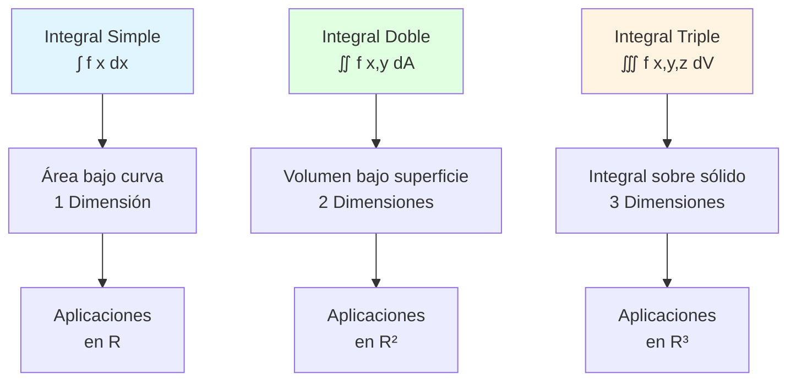
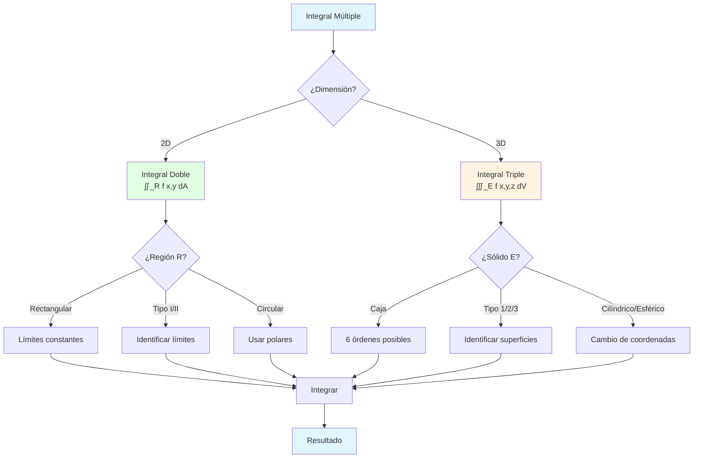

# 📐 Integrales Múltiples

## 🎯 Introducción

> [!info]- 💡 ¿Qué son las Integrales Múltiples? Las **integrales múltiples** son una extensión natural de las integrales definidas de una variable a funciones de varias variables. Permiten calcular volúmenes, masas, centroides y otras magnitudes en espacios de dimensión superior.
> 
> **Analogía práctica:** Imagina que necesitas calcular:
> 
> - **Integral simple (1D):** El área bajo una curva (como medir la cantidad de pintura para una pared)
> - **Integral doble (2D):** El volumen bajo una superficie (como calcular cuánta agua cabe en una piscina de profundidad variable)
> - **Integral triple (3D):** La masa de un sólido con densidad variable (como pesar una escultura de materiales mixtos)
> 
> **¿Por qué son importantes?**
> 
> |Aspecto|Descripción|Ejemplo de Uso|
> |---|---|---|
> |**Geometría**|Calcular áreas, volúmenes, superficies|Diseño arquitectónico, CAD|
> |**Física**|Masa, centro de masa, momento de inercia|Ingeniería estructural, robótica|
> |**Probabilidad**|Distribuciones conjuntas, esperanzas|Estadística multivariada, ML|
> |**Ingeniería**|Flujo de calor, campos electromagnéticos|Termodinámica, electromagnetismo|
> |**Economía**|Funciones de utilidad, producción|Optimización, teoría de juegos|



---

## 📊 Integrales Dobles

### 🔲 Concepto Fundamental

> [!example]- 📐 Definición de Integral Doble
> 
> Una **integral doble** extiende el concepto de integral definida a funciones de dos variables. Si f(x,y) es una función continua sobre una región R del plano xy, la integral doble se define como:
> 
> ```
> ∬_R f(x,y) dA = lim_(n→∞) Σ f(x_i*, y_i*) ΔA_i
> ```
> 
> donde la región R se divide en n subrectángulos de área ΔA_i, y (x_i*, y_i*) es un punto en cada subrectángulo.
> 
> **Interpretación geométrica:**
> 
> ```mermaid
> graph TD
>     A[Región R en plano xy] --> B[Dividir en<br/>pequeños rectángulos]
>     B --> C[Calcular altura<br/>f x_i, y_i en cada uno]
>     C --> D[Volumen de cada<br/>prisma rectangular]
>     D --> E[Sumar todos<br/>los prismas]
>     E --> F{Refinar<br/>partición}
>     F -->|n → ∞| G[Volumen exacto<br/>bajo la superficie]
>     F -->|Más divisiones| B
>     
>     style A fill:#e1f5ff
>     style D fill:#fff4e1
>     style G fill:#e1ffe1
> ```
> 
> **Interpretaciones:**
> 
> |Contexto|f(x,y) representa|∬_R f(x,y) dA calcula|
> |---|---|---|
> |**Geometría**|Altura de superficie|Volumen bajo z = f(x,y)|
> |**Física**|Densidad superficial|Masa total de lámina|
> |**Probabilidad**|Densidad conjunta|Probabilidad sobre R|
> |**Área**|f(x,y) = 1|Área de la región R|
> 
> **Propiedades fundamentales:**
> 
> ```
> 1. Linealidad:
>    ∬_R [af(x,y) + bg(x,y)] dA = a∬_R f(x,y) dA + b∬_R g(x,y) dA
> 
> 2. Aditividad:
>    Si R = R₁ ∪ R₂ (sin solapamiento):
>    ∬_R f(x,y) dA = ∬_R₁ f(x,y) dA + ∬_R₂ f(x,y) dA
> 
> 3. Comparación:
>    Si f(x,y) ≤ g(x,y) en R:
>    ∬_R f(x,y) dA ≤ ∬_R g(x,y) dA
> 
> 4. Acotación:
>    Si m ≤ f(x,y) ≤ M en R:
>    m · Área(R) ≤ ∬_R f(x,y) dA ≤ M · Área(R)
> ```

### 📏 Regiones de Integración

> [!note]- 🗺️ Tipos de Regiones
> 
> **Clasificación de regiones:**
> 
> ```mermaid
> graph TD
>     A[Regiones de<br/>Integración] --> B[Tipo I<br/>Verticalmente Simple]
>     A --> C[Tipo II<br/>Horizontalmente Simple]
>     A --> D[Tipo General<br/>Dividir en subregiones]
>     
>     B --> E[x fijo:<br/>a ≤ x ≤ b<br/>y varía: g₁ x ≤y≤ g₂ x]
>     C --> F[y fijo:<br/>c ≤ y ≤ d<br/>x varía: h₁ y ≤x≤ h₂ y]
>     D --> G[Combinar<br/>regiones Tipo I y II]
>     
>     style B fill:#e1ffe1
>     style C fill:#fff4e1
>     style D fill:#ffe1e1
> ```
> 
> **Región Tipo I (Verticalmente Simple):**
> 
> ```
> R = {(x,y) | a ≤ x ≤ b, g₁(x) ≤ y ≤ g₂(x)}
> 
> Integral iterada:
> ∬_R f(x,y) dA = ∫ₐᵇ ∫_{g₁(x)}^{g₂(x)} f(x,y) dy dx
> 
> Interpretación: Para cada x fijo entre a y b,
>                 y varía entre dos funciones de x
> ```
> 
> **Región Tipo II (Horizontalmente Simple):**
> 
> ```
> R = {(x,y) | c ≤ y ≤ d, h₁(y) ≤ x ≤ h₂(y)}
> 
> Integral iterada:
> ∬_R f(x,y) dA = ∫_c^d ∫_{h₁(y)}^{h₂(y)} f(x,y) dx dy
> 
> Interpretación: Para cada y fijo entre c y d,
>                 x varía entre dos funciones de y
> ```
> 
> **Tabla comparativa:**
> 
> |Característica|Tipo I|Tipo II|
> |---|---|---|
> |**Orden**|dy dx|dx dy|
> |**Límites externos**|Constantes en x|Constantes en y|
> |**Límites internos**|Funciones de x|Funciones de y|
> |**Líneas verticales**|Cruzan R una vez|Pueden cruzar varias veces|
> |**Líneas horizontales**|Pueden cruzar varias veces|Cruzan R una vez|
> |**Mejor para**|Bordes son funciones y = f(x)|Bordes son funciones x = g(y)|
> 
> **Ejemplos visuales:**
> 
> ```
> Ejemplo Tipo I:
> R: 0 ≤ x ≤ 1, x² ≤ y ≤ x
> 
>     y
>     |     y = x
>     1    /
>     |   /|
>     |  / |  R
>     | /  |
>     |/____|_____ x
>     0    1
>        y = x²
> 
> ∬_R f(x,y) dA = ∫₀¹ ∫_{x²}^x f(x,y) dy dx
> 
> 
> Ejemplo Tipo II:
> R: 0 ≤ y ≤ 1, y ≤ x ≤ √y
> 
>     y
>     |
>     1|----\  x = √y
>     | R   \
>     |  x=y \
>     |_______\__ x
>     0        1
> 
> ∬_R f(x,y) dA = ∫₀¹ ∫_y^{√y} f(x,y) dx dy
> ```
> 
> **Región rectangular (caso especial):**
> 
> ```
> R = [a,b] × [c,d] = {(x,y) | a ≤ x ≤ b, c ≤ y ≤ d}
> 
> Es tanto Tipo I como Tipo II:
> 
> ∬_R f(x,y) dA = ∫ₐᵇ ∫_c^d f(x,y) dy dx = ∫_c^d ∫ₐᵇ f(x,y) dx dy
> 
> Si f(x,y) = g(x)·h(y) (separable):
> ∬_R g(x)h(y) dA = [∫ₐᵇ g(x) dx] · [∫_c^d h(y) dy]
> ```

### ⚙️ Cálculo de Integrales Dobles

> [!success]- 🔢 Procedimiento de Evaluación
> 
> **Algoritmo paso a paso:**
> 
> ```mermaid
> flowchart TD
>     A[Integral ∬_R f x,y dA] --> B[Paso 1:<br/>Identificar tipo de región]
>     
>     B --> C{¿Tipo I o II?}
>     C -->|Tipo I| D[Escribir como<br/>∫ₐᵇ ∫_{g₁ x}^{g₂ x} f dy dx]
>     C -->|Tipo II| E[Escribir como<br/>∫_c^d ∫_{h₁ y}^{h₂ y} f dx dy]
>     C -->|Ambos| F[Elegir el más simple]
>     
>     D --> G[Paso 2:<br/>Integrar interior]
>     E --> G
>     F --> G
>     
>     G --> H[Resultado:<br/>función de variable externa]
>     
>     H --> I[Paso 3:<br/>Integrar exterior]
>     
>     I --> J[Resultado final]
>     
>     style A fill:#e1f5ff
>     style G fill:#fff4e1
>     style J fill:#e1ffe1
> ```
> 
> **Ejemplo detallado 1: Región rectangular**
> 
> ```
> Problema: Calcular ∬_R (x + 2y) dA
>          donde R = [0,2] × [0,3]
> 
> Solución:
> 
> Paso 1: Región rectangular → usar cualquier orden
>         Elegimos dy dx
> 
> Paso 2: Escribir integral iterada
>         ∬_R (x + 2y) dA = ∫₀² ∫₀³ (x + 2y) dy dx
> 
> Paso 3: Integrar respecto a y (tratar x como constante)
>         ∫₀³ (x + 2y) dy = [xy + y²]₀³
>                         = x(3) + (3)² - [x(0) + (0)²]
>                         = 3x + 9
> 
> Paso 4: Integrar respecto a x
>         ∫₀² (3x + 9) dx = [3x²/2 + 9x]₀²
>                         = 3(4)/2 + 9(2) - 0
>                         = 6 + 18
>                         = 24
> 
> Resultado: 24
> ```
> 
> **Ejemplo detallado 2: Región Tipo I**
> 
> ```
> Problema: Calcular ∬_R xy dA
>          donde R: 0 ≤ x ≤ 1, x² ≤ y ≤ x
> 
> Solución:
> 
> Paso 1: Identificar como Tipo I
>         x varía: 0 → 1 (constantes)
>         y varía: x² → x (funciones de x)
> 
> Paso 2: Escribir integral
>         ∬_R xy dA = ∫₀¹ ∫_{x²}^x xy dy dx
> 
> Paso 3: Integrar respecto a y
>         ∫_{x²}^x xy dy = x ∫_{x²}^x y dy    (x es constante)
>                        = x [y²/2]_{x²}^x
>                        = x [(x)²/2 - (x²)²/2]
>                        = x [x²/2 - x⁴/2]
>                        = x³/2 - x⁵/2
> 
> Paso 4: Integrar respecto a x
>         ∫₀¹ (x³/2 - x⁵/2) dx = [x⁴/8 - x⁶/12]₀¹
>                                = 1/8 - 1/12
>                                = 3/24 - 2/24
>                                = 1/24
> 
> Resultado: 1/24
> ```
> 
> **Ejemplo detallado 3: Cambio de orden**
> 
> ```
> Problema: Evaluar ∫₀¹ ∫_y¹ e^(x²) dx dy
> 
> Análisis: La integral ∫ e^(x²) dx no tiene forma cerrada
>          → Necesitamos cambiar el orden de integración
> 
> Paso 1: Identificar región R
>         Límites dados: 0 ≤ y ≤ 1, y ≤ x ≤ 1
>         
>         Esto es Tipo II: y varía primero
>         
>         y
>         1|----
>         |  R |
>         |   \|
>         |____\
>         0     1  x
>              x=y
> 
> Paso 2: Convertir a Tipo I
>         Para x fijo: 0 ≤ y ≤ x
>         x varía: 0 ≤ x ≤ 1
>         
>         Nueva integral: ∫₀¹ ∫₀^x e^(x²) dy dx
> 
> Paso 3: Integrar respecto a y
>         ∫₀^x e^(x²) dy = e^(x²) [y]₀^x    (x² es constante)
>                        = x e^(x²)
> 
> Paso 4: Integrar respecto a x
>         ∫₀¹ x e^(x²) dx
>         
>         Sustitución: u = x², du = 2x dx
>         
>         = ½ ∫₀¹ e^u du
>         = ½ [e^u]₀¹
>         = ½ (e¹ - e⁰)
>         = (e - 1)/2
> 
> Resultado: (e - 1)/2 ≈ 0.859
> ```
> 
> **Verificación de resultados:**
> 
> |Verificación|Método|Ejemplo|
> |---|---|---|
> |**Unidades**|¿Resultado tiene sentido dimensional?|Volumen debe ser positivo|
> |**Simetría**|¿Aproveché simetrías?|Función par/impar|
> |**Casos límite**|¿Qué pasa cuando R → 0?|Volumen → 0|
> |**Comparación**|¿Ambos órdenes dan mismo resultado?|Cambiar dy dx ↔ dx dy|

---

## 🧊 Integrales Triples

### 📦 Concepto de Integral Triple

> [!info]- 🎲 Extensión a Tres Dimensiones
> 
> Una **integral triple** extiende el concepto a funciones de tres variables sobre regiones tridimensionales (sólidos).
> 
> ```
> ∭_E f(x,y,z) dV = lim_(n→∞) Σ f(x_i*, y_i*, z_i*) ΔV_i
> ```
> 
> donde E es una región en R³, dividida en n cajas de volumen ΔV_i.
> 
> **Interpretación:**
> 
> ```mermaid
> graph TD
>     A[Sólido E en R³] --> B[Dividir en<br/>pequeñas cajas]
>     B --> C[Evaluar f en<br/>cada caja]
>     C --> D[Multiplicar por<br/>volumen ΔV_i]
>     D --> E[Sumar todas<br/>las contribuciones]
>     E --> F{Refinar<br/>partición}
>     F -->|n → ∞| G[Valor exacto<br/>de la integral]
>     F -->|Más divisiones| B
>     
>     style A fill:#e1f5ff
>     style D fill:#fff4e1
>     style G fill:#e1ffe1
> ```
> 
> **Interpretaciones físicas:**
> 
> |Contexto|f(x,y,z) representa|∭_E f(x,y,z) dV calcula|
> |---|---|---|
> |**Geometría**|f = 1|Volumen del sólido E|
> |**Física**|Densidad ρ(x,y,z)|Masa total del sólido|
> |**Temperatura**|Temperatura T(x,y,z)|Temperatura promedio|
> |**Probabilidad**|Densidad conjunta|Probabilidad en E|
> |**Campo escalar**|Intensidad|Integral total del campo|
> 
> **Comparación con dimensiones inferiores:**
> 
> |Dimensión|Integral|Región|Elemento|Resultado típico|
> |---|---|---|---|---|
> |**1D**|∫ₐᵇ f(x) dx|Intervalo [a,b]|dx|Área|
> |**2D**|∬_R f(x,y) dA|Región plana R|dA = dy dx|Volumen|
> |**3D**|∭_E f(x,y,z) dV|Sólido E|dV = dz dy dx|Masa, carga, etc.|

### 🗂️ Tipos de Regiones en R³

> [!note]- 📐 Clasificación de Sólidos
> 
> **Sólidos de Tipo 1 (z varía entre funciones):**
> 
> ```
> E = {(x,y,z) | (x,y) ∈ R, u₁(x,y) ≤ z ≤ u₂(x,y)}
> 
> donde R es región en el plano xy
> 
> Integral:
> ∭_E f(x,y,z) dV = ∬_R [∫_{u₁(x,y)}^{u₂(x,y)} f(x,y,z) dz] dA
> 
> Interpretación: Para cada punto (x,y) en R,
>                 z varía entre dos superficies
> ```
> 
> **Sólidos de Tipo 2 (y varía entre funciones):**
> 
> ```
> E = {(x,y,z) | (x,z) ∈ R, u₁(x,z) ≤ y ≤ u₂(x,z)}
> 
> donde R es región en el plano xz
> 
> Integral:
> ∭_E f(x,y,z) dV = ∬_R [∫_{u₁(x,z)}^{u₂(x,z)} f(x,y,z) dy] dA
> ```
> 
> **Sólidos de Tipo 3 (x varía entre funciones):**
> 
> ```
> E = {(x,y,z) | (y,z) ∈ R, u₁(y,z) ≤ x ≤ u₂(y,z)}
> 
> donde R es región en el plano yz
> 
> Integral:
> ∭_E f(x,y,z) dV = ∬_R [∫_{u₁(y,z)}^{u₂(y,z)} f(x,y,z) dx] dA
> ```
> 
> **Caja rectangular (caso más simple):**
> 
> ```
> E = [a,b] × [c,d] × [p,q]
>   = {(x,y,z) | a ≤ x ≤ b, c ≤ y ≤ d, p ≤ z ≤ q}
> 
> Integral:
> ∭_E f(x,y,z) dV = ∫ₐᵇ ∫_c^d ∫_p^q f(x,y,z) dz dy dx
> 
> (puede evaluarse en cualquier orden si los límites son constantes)
> ```
> 
> **Diagrama de decisión:**
> 
> ```mermaid
> flowchart TD
>     A[Sólido E] --> B{¿Forma del sólido?}
>     
>     B -->|Caja rectangular| C[Límites constantes<br/>6 órdenes posibles]
>     B -->|Entre dos superficies z| D[Tipo 1<br/>dz en el medio]
>     B -->|Entre dos superficies y| E[Tipo 2<br/>dy en el medio]
>     B -->|Entre dos superficies x| F[Tipo 3<br/>dx en el medio]
>     B -->|Complejo| G[Dividir en<br/>subregiones simples]
>     
>     C --> H[Integrar en<br/>cualquier orden]
>     D --> I[∬_R ... dz dA]
>     E --> J[∬_R ... dy dA]
>     F --> K[∬_R ... dx dA]
>     
>     style B fill:#fff4e1
>     style D fill:#e1ffe1
>     style G fill:#ffe1e1
> ```
> 
> **Ejemplo: Pirámide**
> 
> ```
> E: sólido bajo el plano z = 1 - x - y
>    sobre el triángulo R: x ≥ 0, y ≥ 0, x + y ≤ 1
> 
> Tipo 1 (más natural):
> Para cada (x,y) en R: 0 ≤ z ≤ 1 - x - y
> 
> ∭_E f dV = ∫₀¹ ∫₀^{1-x} ∫₀^{1-x-y} f(x,y,z) dz dy dx
> 
> Orden de integración: dz dy dx
> - z varía primero (0 → 1-x-y)
> - y varía segundo (0 → 1-x)
> - x varía último (0 → 1)
> ```

### 🔄 Órdenes de Integración

> [!tip]- 🔀 Cambiar el Orden
> 
> Para una caja rectangular, hay **6 órdenes posibles**:
> 
> ```
> dz dy dx    dx dy dz    dy dz dx
> dz dx dy    dx dz dy    dy dx dz
> ```
> 
> **Tabla de órdenes:**
> 
> |Orden|Variable interior|Variable media|Variable exterior|Mejor cuando...|
> |---|---|---|---|---|
> |**dz dy dx**|z|y|x|Sólido entre superficies z = f(x,y)|
> |**dz dx dy**|z|x|y|Límites de z dependen de x, y|
> |**dy dz dx**|y|z|x|Sólido entre superficies y = g(x,z)|
> |**dy dx dz**|y|x|z|Límites de y dependen de x, z|
> |**dx dy dz**|x|y|z|Sólido entre superficies x = h(y,z)|
> |**dx dz dy**|x|z|y|Límites de x dependen de z, y|
> 
> **Estrategia para elegir orden:**
> 
> ```mermaid
> flowchart TD
>     A[Integral triple] --> B{¿Límites constantes?}
>     
>     B -->|Sí, todos| C[Cualquier orden<br/>Elegir el más simple]
>     B -->|No| D{¿Cuáles dependen<br/>de otras variables?}
>     
>     D --> E[Identificar dependencias]
>     E --> F[Variable con límites<br/>más complejos → INTERIOR]
>     F --> G[Variables con límites<br/>simples → EXTERIOR]
>     
>     C --> H[Evaluar]
>     G --> H
>     
>     style A fill:#e1f5ff
>     style F fill:#fff4e1
>     style H fill:#e1ffe1
> ```
> 
> **Ejemplo de cambio de orden:**
> 
> ```
> Problema: Simplificar ∫₀¹ ∫₀^{1-x} ∫₀^{1-x-y} f(x,y,z) dz dy dx
> 
> Paso 1: Identificar región E
>         0 ≤ x ≤ 1
>         0 ≤ y ≤ 1 - x
>         0 ≤ z ≤ 1 - x - y
>         
>         Es el tetraedro: x + y + z ≤ 1, x,y,z ≥ 0
> 
> Paso 2: Cambiar a orden dz dx dy
>         
>         Para y fijo: 0 ≤ y ≤ 1
>         Para x fijo: 0 ≤ x ≤ 1 - y
>         Para z: 0 ≤ z ≤ 1 - x - y
>         
>         Nueva integral:
>         ∫₀¹ ∫₀^{1-y} ∫₀^{1-x-y} f(x,y,z) dz dx dy
> 
> Paso 3: Cambiar a orden dy dx dz
>         
>         Para z fijo: 0 ≤ z ≤ 1
>         Para x fijo: 0 ≤ x ≤ 1 - z
>         Para y: 0 ≤ y ≤ 1 - x - z
>         
>         Nueva integral:
>         ∫₀¹ ∫₀^{1-z} ∫₀^{1-x-z} f(x,y,z) dy dx dz
> ```

---

## 🎯 Aplicaciones de Integrales Múltiples

### ⚖️ Masa y Centro de Masa

> [!success]- 🏋️ Cálculos Físicos
> 
> **Para láminas (2D):**
> 
> ```
> Densidad superficial: ρ(x,y) [masa por unidad de área]
> 
> 1. Masa total:
>    m = ∬_R ρ(x,y) dA
> 
> 2. Momentos respecto a los ejes:
>    M_x = ∬_R y · ρ(x,y) dA    (momento respecto a eje x)
>    M_y = ∬_R x · ρ(x,y) dA    (momento respecto a eje y)
> 
> 3. Centro de masa (x̄, ȳ):
>    x̄ = M_y / m = (∬_R x·ρ dA) / (∬_R ρ dA)
>    ȳ = M_x / m = (∬_R y·ρ dA) / (∬_R ρ dA)
> 
> 4. Momentos de inercia:
>    I_x = ∬_R y² · ρ(x,y) dA   (respecto a eje x)
>    I_y = ∬_R x² · ρ(x,y) dA   (respecto a eje y)
>    I_0 = ∬_R (x²+y²) · ρ(x,y) dA (respecto al origen)
<
>```
> 
> **Para sólidos (3D):**
> 
> ```
> 
> Densidad volumétrica: ρ(x,y,z) [masa por unidad de volumen]
> 
> 1. Masa total: m = ∭_E ρ(x,y,z) dV
>     
> 2. Momentos respecto a los planos: M_xy = ∭_E z · ρ(x,y,z) dV (respecto al plano xy) M_xz = ∭_E y · ρ(x,y,z) dV (respecto al plano xz) M_yz = ∭_E x · ρ(x,y,z) dV (respecto al plano yz)
>     
> 3. Centro de masa (x̄, ȳ, z̄): x̄ = M_yz / m ȳ = M_xz / m z̄ = M_xy / m
>     
> 4. Momentos de inercia: I_x = ∭_E (y² + z²) · ρ dV (respecto a eje x) I_y = ∭_E (x² + z²) · ρ dV (respecto a eje y) I_z = ∭_E (x² + y²) · ρ dV (respecto a eje z)
>     
> 
> ```
> 
> **Casos especiales (densidad constante):**
> 
> ```
> 
> Si ρ = k (constante), entonces:
> 
> Centro de masa = Centroide geométrico
> 
> x̄ = (∬_R x dA) / (Área de R) ȳ = (∬_R y dA) / (Área de R)
> 
> Para 3D: x̄ = (∭_E x dV) / (Volumen de E) ȳ = (∭_E y dV) / (Volumen de E) z̄ = (∭_E z dV) / (Volumen de E)
> 
> ```
> 
> **Ejemplo: Lámina triangular**
> 
> ```
> 
> Problema: Encontrar el centro de masa de una lámina con densidad ρ(x,y) = x + y sobre el triángulo R: 0 ≤ x ≤ 1, 0 ≤ y ≤ 1 - x
> 
> Solución:
> 
> 1. Masa: m = ∬_R (x + y) dA = ∫₀¹ ∫₀^{1-x} (x + y) dy dx
>     
>     = ∫₀¹ [xy + y²/2]₀^{1-x} dx = ∫₀¹ [x(1-x) + (1-x)²/2] dx = ∫₀¹ [x - x² + (1-2x+x²)/2] dx = ∫₀¹ [x - x² + 1/2 - x + x²/2] dx = ∫₀¹ [1/2 - x²/2] dx = [x/2 - x³/6]₀¹ = 1/2 - 1/6 = 1/3
>     
> 2. Momento M_y: M_y = ∬_R x(x + y) dA = ∫₀¹ ∫₀^{1-x} x(x + y) dy dx = ∫₀¹ ∫₀^{1-x} (x² + xy) dy dx = ∫₀¹ [x²y + xy²/2]₀^{1-x} dx = ∫₀¹ [x²(1-x) + x(1-x)²/2] dx = ∫₀¹ [x² - x³ + x(1-2x+x²)/2] dx = ... = 1/12
>     
> 3. Momento M_x: M_x = ∬_R y(x + y) dA = ... = 1/6
>     
> 4. Centro de masa: x̄ = M_y/m = (1/12)/(1/3) = 1/4 ȳ = M_x/m = (1/6)/(1/3) = 1/2
>     
> 
> Centro de masa: (1/4, 1/2)
> ```

### 📐 Volumen de Sólidos

> [!example]- 📦 Cálculo de Volúmenes
> 
> **Volumen bajo una superficie:**
> 
> ```
> Si z = f(x,y) ≥ 0 sobre región R:
> 
> V = ∬_R f(x,y) dA
> ```
> 
> **Volumen entre dos superficies:**
> 
> ```
> Si f(x,y) ≥ g(x,y) sobre R:
> 
> V = ∬_R [f(x,y) - g(x,y)] dA
> ```
> 
> **Volumen de un sólido E:**
> 
> ```
> V = ∭_E dV = ∭_E 1 dV
> ```
> 
> **Ejemplos clásicos:**
> 
> |Sólido|Descripción|Integral|
> |---|---|---|
> |**Paraboloide**|z = 1 - x² - y², z ≥ 0|∬_{x²+y²≤1} (1-x²-y²) dA|
> |**Cono**|z = √(x²+y²), 0 ≤ z ≤ h|∭_{E} dV con E: región cónica|
> |**Esfera**|x² + y² + z² ≤ a²|∭_{E} dV = (4/3)πa³|
> |**Cilindro**|x² + y² ≤ a², 0 ≤ z ≤ h|πa²h|
> 
> **Ejemplo: Volumen bajo paraboloide**
> 
> ```
> Problema: Volumen bajo z = 4 - x² - y² sobre R: x² + y² ≤ 4
> 
> Solución usando coordenadas polares:
> 
> V = ∬_R (4 - x² - y²) dA
> 
> En polares: x² + y² = r², dA = r dr dθ
> R: 0 ≤ r ≤ 2, 0 ≤ θ ≤ 2π
> 
> V = ∫₀^{2π} ∫₀² (4 - r²) r dr dθ
>   = ∫₀^{2π} ∫₀² (4r - r³) dr dθ
>   = ∫₀^{2π} [2r² - r⁴/4]₀² dθ
>   = ∫₀^{2π} [8 - 4] dθ
>   = ∫₀^{2π} 4 dθ
>   = 8π
> 
> Volumen: 8π unidades cúbicas
> ```

---

## 📊 Estrategias de Resolución

### 🗺️ Diagrama de Flujo General



### ✅ Checklist de Resolución

> [!tip]- 📋 Lista de Verificación
> 
> **Para integrales dobles:**
> 
> - [ ] ¿Dibujé la región R?
> - [ ] ¿Identifiqué si es Tipo I, II o ambos?
> - [ ] ¿Elegí el orden más conveniente?
> - [ ] ¿Los límites son correctos?
> - [ ] ¿Consideré usar coordenadas polares?
> - [ ] ¿La función está bien expresada?
> - [ ] ¿Integré en el orden correcto?
> - [ ] ¿El resultado tiene sentido físicamente?
> 
> **Para integrales triples:**
> 
> - [ ] ¿Visualicé o bosquejé el sólido E?
> - [ ] ¿Identifiqué el tipo de sólido?
> - [ ] ¿Elegí el mejor orden de integración?
> - [ ] ¿Los límites son consistentes?
> - [ ] ¿Consideré coordenadas cilíndricas o esféricas?
> - [ ] ¿Verifiqué las unidades del resultado?
> - [ ] ¿Probé con casos límite simples?
> 
> **Errores comunes a evitar:**
> 
> |Error|Descripción|Corrección|
> |---|---|---|
> |**Límites incorrectos**|Invertir superior e inferior|Dibujar región R o E|
> |**Orden equivocado**|dxdy cuando debería ser dydx|Verificar dependencias|
> |**Olvidar Jacobiano**|En cambios de coordenadas|Siempre calcular \|J\||
> |**Variables constantes**|Tratar x como variable cuando es constante|Identificar variable de integración|
> |**Signos**|Errores en límites negativos|Verificar cuidadosamente|

---

## 🎓 Ejemplos Resueltos Completos

### 📝 Ejemplo 1: Integral Doble sobre Región Tipo I

> [!example]- 🎯 Problema Completo
> 
> **Problema:** Calcular ∬_R y² dA donde R está acotada por y = x, y = 2x, x = 1
> 
> **Solución paso a paso:**
> 
> ```
> Paso 1: Dibujar y analizar la región R
>         
>         y
>         |   y = 2x
>         2|  /
>         | /|
>         |/ | R
>         |  |/
>         |__|_____ x
>         0  1
>            y = x
>         
>         R: 0 ≤ x ≤ 1, x ≤ y ≤ 2x
> 
> Paso 2: Identificar tipo
>         Tipo I: para x fijo, y varía entre dos funciones
> 
> Paso 3: Escribir integral iterada
>         ∬_R y² dA = ∫₀¹ ∫_x^{2x} y² dy dx
> 
> Paso 4: Integrar respecto a y
>         ∫_x^{2x} y² dy = [y³/3]_x^{2x}
>                        = (2x)³/3 - x³/3
>                        = 8x³/3 - x³/3
>                        = 7x³/3
> 
> Paso 5: Integrar respecto a x
>         ∫₀¹ (7x³/3) dx = (7/3)[x⁴/4]₀¹
>                        = (7/3)(1/4)
>                        = 7/12
> 
> Resultado: 7/12
> 
> Verificación:
> - Resultado positivo ✓
> - Unidades: [longitud²] ✓
> - Orden de magnitud razonable ✓
> ```

### 📝 Ejemplo 2: Integral Triple sobre Tetraedro

> [!example]- 🎯 Volumen de Tetraedro
> 
> **Problema:** Calcular el volumen del tetraedro limitado por los planos coordenados y el plano x + 2y + 3z = 6
> 
> **Solución:**
> 
> ```
> Paso 1: Identificar el sólido E
>         Intersecciones con ejes:
>         - x = 6 (cuando y = z = 0)
>         - y = 3 (cuando x = z = 0)
>         - z = 2 (cuando x = y = 0)
>         
>         Vértices: (0,0,0), (6,0,0), (0,3,0), (0,0,2)
> 
> Paso 2: Expresar como sólido Tipo 1
>         Para cada (x,y) en proyección R sobre xy:
>         
>         De x + 2y + 3z = 6:
>         z = (6 - x - 2y)/3 = 2 - x/3 - 2y/3
>         
>         E: 0 ≤ z ≤ 2 - x/3 - 2y/3
> 
> Paso 3: Determinar región R en plano xy
>         Cuando z = 0: x + 2y = 6
>         
>         R: 0 ≤ x ≤ 6, 0 ≤ y ≤ (6-x)/2
> 
> Paso 4: Escribir integral
>         V = ∭_E dV = ∫₀⁶ ∫₀^{(6-x)/2} ∫₀^{2-x/3-2y/3} dz dy dx
> 
> Paso 5: Integrar respecto a z
>         ∫₀^{2-x/3-2y/3} dz = 2 - x/3 - 2y/3
> 
> Paso 6: Integrar respecto a y
>         ∫₀^{(6-x)/2} (2 - x/3 - 2y/3) dy
>         
>         = [2y - xy/3 - y²/3]₀^{(6-x)/2}
>         
>         = 2·(6-x)/2 - x·(6-x)/6 - ((6-x)/2)²/3
>         
>         = (6-x) - x(6-x)/6 - (6-x)²/12
>         
>         = (6-x)[1 - x/6 - (6-x)/12]
>         
>         = (6-x)[12/12 - 2x/12 - (6-x)/12]
>         
>         = (6-x)[(12 - 2x - 6 + x)/12]
>         
>         = (6-x)(6-x)/12
>         
>         = (6-x)²/12
> 
> Paso 7: Integrar respecto a x
>         ∫₀⁶ (6-x)²/12 dx
>         
>         Sustitución: u = 6-x, du = -dx
>         Cuando x = 0: u = 6
>         Cuando x = 6: u = 0
>         
>         = -∫₆⁰ u²/12 du = ∫₀⁶ u²/12 du
>         
>         = (1/12)[u³/3]₀⁶
>         
>         = (1/36)(6³)
>         
>         = 216/36
>         
>         = 6
> 
> Resultado: V = 6 unidades cúbicas
> 
> Verificación por fórmula del tetraedro:
> V = (1/6)|base × altura|
> Base es triángulo en xy con área = (1/2)(6)(3) = 9
> Altura = 2
> V = (1/6)(9)(2) = 3... 
> 
> [Nota: La fórmula directa es más compleja para este caso]
> ```

### 📝 Ejemplo 3: Centro de Masa de Lámina

> [!example]- 🎯 Aplicación Física
> 
> **Problema:** Encontrar el centro de masa de una lámina semicircular de radio a con densidad ρ(x,y) = y
> 
> **Solución:**
> 
> ```
> Paso 1: Definir la región
>         R: x² + y² ≤ a², y ≥ 0 (semicírculo superior)
> 
> Paso 2: Usar coordenadas polares
>         x = r cos(θ), y = r sen(θ)
>         0 ≤ r ≤ a, 0 ≤ θ ≤ π
>         J = r
> 
> Paso 3: Calcular masa
>         m = ∬_R y dA
>           = ∫₀^π ∫₀^a (r sen(θ)) · r dr dθ
>           = ∫₀^π ∫₀^a r² sen(θ) dr dθ
>           = ∫₀^π sen(θ) [r³/3]₀^a dθ
>           = (a³/3) ∫₀^π sen(θ) dθ
>           = (a³/3) [-cos(θ)]₀^π
>           = (a³/3)[- cos(π) + cos(0)]
>           = (a³/3)[1 + 1]
>           = 2a³/3
> 
> Paso 4: Calcular M_y (momento respecto a eje y)
>         M_y = ∬_R x·y dA
>             = ∫₀^π ∫₀^a (r cos(θ))(r sen(θ)) · r dr dθ
>             = ∫₀^π ∫₀^a r³ cos(θ) sen(θ) dr dθ
>             = ∫₀^π cos(θ) sen(θ) [r⁴/4]₀^a dθ
>             = (a⁴/4) ∫₀^π cos(θ) sen(θ) dθ
>             
>         Usando sen(2θ) = 2sen(θ)cos(θ):
>         cos(θ) sen(θ) = sen(2θ)/2
>             
>             = (a⁴/8) ∫₀^π sen(2θ) dθ
>             = (a⁴/8) [-cos(2θ)/2]₀^π
>             = (a⁴/16) [-cos(2π) + cos(0)]
>             = (a⁴/16) [-1 + 1]
>             = 0
> 
> Paso 5: Calcular M_x (momento respecto a eje x)
>         M_x = ∬_R y·y dA = ∬_R y² dA
>             = ∫₀^π ∫₀^a (r sen(θ))² · r dr dθ
>             = ∫₀^π ∫₀^a r³ sen²(θ) dr dθ
>             = ∫₀^π sen²(θ) [r⁴/4]₀^a dθ
>             = (a⁴/4) ∫₀^π sen²(θ) dθ
>             
>         Usando sen²(θ) = (1 - cos(2θ))/2:
>             
>             = (a⁴/8) ∫₀^π (1 - cos(2θ)) dθ
>             = (a⁴/8) [θ - sen(2θ)/2]₀^π
>             = (a⁴/8) [π - 0 - (0 - 0)]
>             = πa⁴/8
> 
> Paso 6: Centro de masa
>         x̄ = M_y/m = 0/(2a³/3) = 0
>         
>         ȳ = M_x/m = (πa⁴/8)/(2a³/3)
>            = (πa⁴/8) · (3/2a³)
>            = 3πa/16
> 
> Resultado: Centro de masa en (0, 3πa/16)
> 
> Interpretación:
> - x̄ = 0 por simetría ✓
> - ȳ > 0 en mitad superior ✓
> - ȳ < a/2 ya que más densidad arriba ✓
> ```

---

## 🔗 Conexión con Próximos Temas

> [!quote]- 🌟 Camino de Aprendizaje
> 
> **Has dominado:**
> 
> ```mermaid
> mindmap
>   root((Integrales<br/>Múltiples))
>     Dobles
>       Regiones Tipo I/II
>       Órdenes
>       Aplicaciones
>     Triples
>       Sólidos 3D
>       Cambio de orden
>       Volúmenes
>     Aplicaciones
>       Masa
>       Centro de masa
>       Momentos
>     Técnicas
>       Límites
>       Cambio de variables
>       Coordenadas
> ```
> 
> **Progresión del aprendizaje:**
> 
> |Nivel|Tema|Relación con integrales múltiples|
> |---|---|---|
> |**Previo**|Integral simple|Base conceptual|
> |**Actual**|Integrales dobles y triples|Extensión multidimensional|
> |**Siguiente**|Coordenadas cilíndricas/esféricas|Simplificación de triples|
> |**Avanzado**|Teorema cambio de variables|Generalización de transformaciones|
> |**Aplicado**|Campos vectoriales|Preparación para teoremas integrales|
> |**Superior**|Teoremas de Green, Stokes, Gauss|Unificación del cálculo|
> 
> **Roadmap completo:**
> 
> ```mermaid
> graph LR
>     A[Integral<br/>Simple] --> B[Integrales<br/>Dobles]
>     B --> C[Integrales<br/>Triples]
>     C --> D[Coordenadas<br/>Curvilíneas]
>     
>     B --> E[Cambio de<br/>Variables 2D]
>     C --> F[Cambio de<br/>Variables 3D]
>     
>     E --> G[Aplicaciones<br/>Físicas]
>     F --> G
>     
>     G --> H[Integrales<br/>de Línea]
>     G --> I[Integrales<br/>de Superficie]
>     
>     H --> J[Teoremas<br/>Fundamentales]
>     I --> J
>     
>     style B fill:#e1ffe1
>     style C fill:#fff4e1
>     style G fill:#e1f5ff
>     style J fill:#ffe1e1
> ```
> 
> **Aplicaciones futuras:**
> 
> - **Física:** Electromagnetismo, mecánica de fluidos, termodinámica
> - **Ingeniería:** Análisis estructural, transferencia de calor
> - **Probabilidad:** Distribuciones multivariadas, estadística bayesiana
> - **Economía:** Teoría de producción, optimización multiobjetivo
> - **Ciencias de datos:** Machine learning, análisis multidimensional

---

**Tags:** #calculo-vectorial #integrales-multiples #integrales-dobles #integrales-triples #volumen #masa #centro-de-masa #regiones #coordenadas #mermaid #diagramas