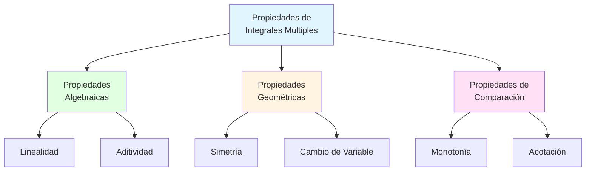
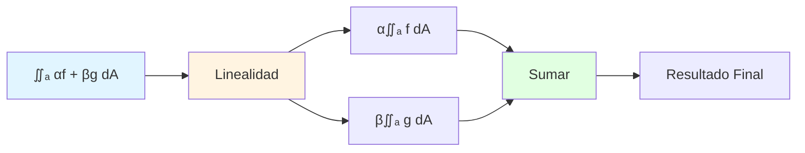
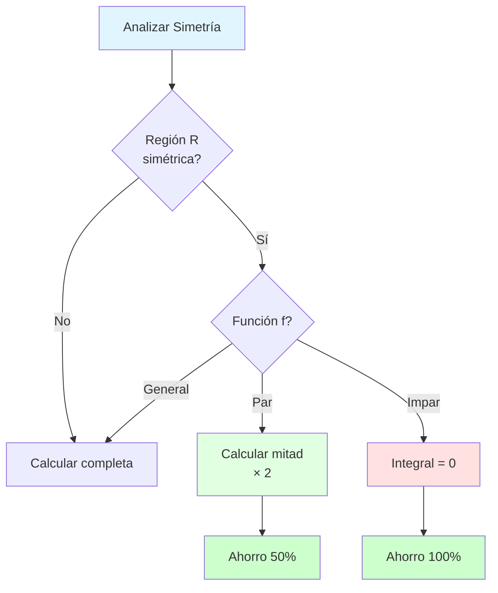
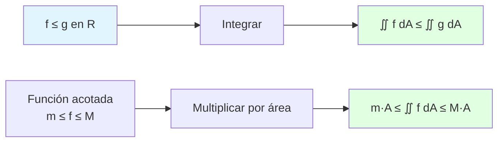
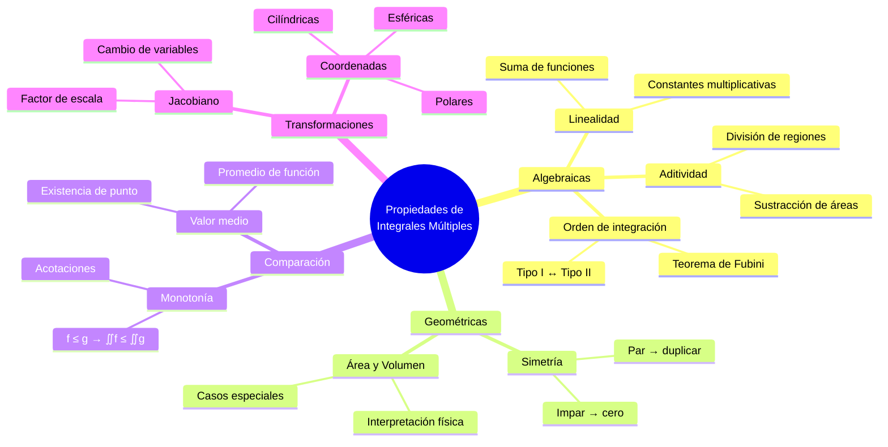
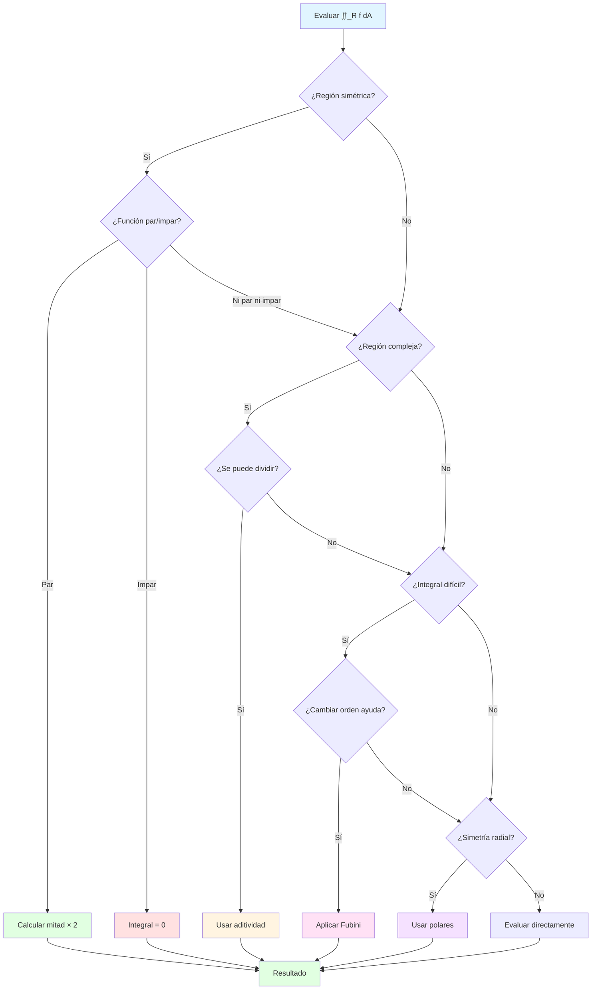

# 📐 Propiedades de las Integrales Múltiples

## 🎯 Introducción

> [!info]- 💡 ¿Qué son las Propiedades de las Integrales Múltiples? Las **propiedades de las integrales múltiples** son reglas fundamentales que nos permiten manipular, simplificar y evaluar integrales de funciones de varias variables de manera más eficiente. Estas propiedades extienden los conceptos familiares de las integrales de una variable al espacio multidimensional.
> 
> **Analogía práctica:** Imagina que estás calculando el volumen de agua en un recipiente complejo:
> 
> - **Linealidad** → Puedes separar diferentes líquidos y sumar sus volúmenes
> - **Aditividad** → Dividir el recipiente en secciones más simples
> - **Monotonía** → Si un líquido es más denso, su masa será mayor
> - **Simetría** → Aprovechar formas simétricas para simplificar cálculos
> 
> **¿Por qué son importantes?**
> 
> |Aspecto|Descripción|Ejemplo de Uso|
> |---|---|---|
> |**Simplificación**|Reducir cálculos complejos|Separar integrales complicadas|
> |**Optimización**|Elegir mejor orden de integración|Cambiar el orden de dx dy|
> |**Verificación**|Comprobar resultados|Usar simetría para validar|
> |**Estimación**|Acotar valores sin calcular|Teoremas de comparación|
> |**Transformaciones**|Cambiar variables convenientemente|Coordenadas polares, cilíndricas|



---

## 🔢 Propiedades Algebraicas Fundamentales

### 📊 Linealidad de la Integral

> [!example]- ⚡ Propiedad de Linealidad
> 
> La integral múltiple es un **operador lineal**, lo que significa que respeta la suma de funciones y la multiplicación por constantes.
> 
> **Definición formal:**
> 
> Para funciones integrables $f(x,y)$ y $g(x,y)$ en una región $R$, y constantes $\alpha, \beta \in \mathbb{R}$:
> 
> $$\iint_R [\alpha f(x,y) + \beta g(x,y)] , dA = \alpha \iint_R f(x,y) , dA + \beta \iint_R g(x,y) , dA$$
> 
> **Versión para integrales triples:**
> 
> $$\iiint_V [\alpha f(x,y,z) + \beta g(x,y,z)] , dV = \alpha \iiint_V f(x,y,z) , dV + \beta \iiint_V g(x,y,z) , dV$$
> 
> **Casos particulares importantes:**
> 
> |Propiedad|Fórmula|Significado|
> |---|---|---|
> |**Constante multiplicativa**|$\iint_R c \cdot f(x,y) , dA = c \iint_R f(x,y) , dA$|Sacar constantes fuera|
> |**Suma de funciones**|$\iint_R [f + g] , dA = \iint_R f , dA + \iint_R g , dA$|Integrar por separado|
> |**Diferencia**|$\iint_R [f - g] , dA = \iint_R f , dA - \iint_R g , dA$|Restar integrales|
> |**Integral de cero**|$\iint_R 0 , dA = 0$|Integral trivial|
> 
> **Ejemplo numérico completo:**
> 
> Calcular: $\displaystyle \iint_R [3x^2 + 2xy - 5y] , dA$ donde $R = [0,1] \times [0,2]$
> 
> ```
> Paso 1: Aplicar linealidad
> ∬_R [3x² + 2xy - 5y] dA = 3∬_R x² dA + 2∬_R xy dA - 5∬_R y dA
> 
> Paso 2: Calcular cada integral por separado
> 
> I₁ = ∬_R x² dA = ∫₀¹ ∫₀² x² dy dx = ∫₀¹ x² · 2 dx = 2[x³/3]₀¹ = 2/3
> 
> I₂ = ∬_R xy dA = ∫₀¹ ∫₀² xy dy dx = ∫₀¹ x[y²/2]₀² dx = ∫₀¹ 2x dx = [x²]₀¹ = 1
> 
> I₃ = ∬_R y dA = ∫₀¹ ∫₀² y dy dx = ∫₀¹ [y²/2]₀² dx = ∫₀¹ 2 dx = 2
> 
> Paso 3: Combinar resultados
> = 3(2/3) + 2(1) - 5(2) = 2 + 2 - 10 = -6
> ```



> **Aplicación práctica:**
> 
> Si calculas el centro de masa de un objeto, la linealidad te permite:
> 
> - Separar componentes x, y, z
> - Trabajar con densidades variables por partes
> - Simplificar cálculos complejos

### ➕ Aditividad sobre Regiones

> [!success]- 🗺️ División de Regiones
> 
> Si una región $R$ puede dividirse en subregiones disjuntas $R_1, R_2, \ldots, R_n$, entonces:
> 
> $$\iint_R f(x,y) , dA = \sum_{i=1}^n \iint_{R_i} f(x,y) , dA$$
> 
> **Visualización geométrica:**
> 
> ```mermaid
> graph TD
>     A[Región R completa] --> B[R₁]
>     A --> C[R₂]
>     A --> D[R₃]
>     
>     B --> E[∬_R₁ f dA]
>     C --> F[∬_R₂ f dA]
>     D --> G[∬_R₃ f dA]
>     
>     E --> H[Sumar todos]
>     F --> H
>     G --> H
>     
>     H --> I[∬_R f dA]
>     
>     style A fill:#e1f5ff
>     style H fill:#fff4e1
>     style I fill:#e1ffe1
> ```
> 
> **Requisitos para usar aditividad:**
> 
> |Condición|Descripción|Importante porque...|
> |---|---|---|
> |**Disjuntas**|$R_i \cap R_j = \emptyset$ para $i \neq j$|No contar áreas dos veces|
> |**Unión completa**|$\bigcup_{i=1}^n R_i = R$|Cubrir toda la región|
> |**Interiores disjuntos**|Pueden compartir frontera|Fronteras tienen medida cero|
> 
> **Ejemplo: Región con forma irregular**
> 
> Calcular $\displaystyle \iint_R (x+y) , dA$ donde $R$ es un cuadrado $[0,2] \times [0,2]$ con un cuadrado interior $[0.5, 1.5] \times [0.5, 1.5]$ removido.
> 
> ```
> Estrategia: R = R_grande - R_pequeño
> 
> Paso 1: Integral sobre región grande
> I_grande = ∬_{[0,2]×[0,2]} (x+y) dA
>          = ∫₀² ∫₀² (x+y) dy dx
>          = ∫₀² [xy + y²/2]₀² dx
>          = ∫₀² (2x + 2) dx
>          = [x² + 2x]₀² = 4 + 4 = 8
> 
> Paso 2: Integral sobre región pequeña
> I_pequeño = ∬_{[0.5,1.5]×[0.5,1.5]} (x+y) dA
>           = ∫₀.₅^1.5 ∫₀.₅^1.5 (x+y) dy dx
>           = ∫₀.₅^1.5 [xy + y²/2]₀.₅^1.5 dx
>           = ∫₀.₅^1.5 (1.5x - 0.5x + 1.125 - 0.125) dx
>           = ∫₀.₅^1.5 (x + 1) dx
>           = [x²/2 + x]₀.₅^1.5 = 2.375 - 0.625 = 1.75
> 
> Paso 3: Restar
> I_total = I_grande - I_pequeño = 8 - 1.75 = 6.25
> ```
> 
> **Aplicaciones estratégicas:**
> 
> ```mermaid
> graph LR
>     A[Región Compleja] --> B{Estrategia}
>     B -->|División| C[Subdividir en<br/>partes simples]
>     B -->|Sustracción| D[Grande - Pequeña]
>     B -->|Simetría| E[Calcular 1/4<br/>y multiplicar]
>     
>     C --> F[Más fácil integrar]
>     D --> F
>     E --> F
>     
>     style A fill:#ffe1e1
>     style F fill:#e1ffe1
> ```

### 🔄 Cambio en el Orden de Integración

> [!tip]- 🔀 Teorema de Fubini
> 
> Para funciones continuas en regiones rectangulares o "tipo I/II", podemos cambiar el orden de integración:
> 
> $$\int_a^b \int_{g_1(x)}^{g_2(x)} f(x,y) , dy , dx = \int_c^d \int_{h_1(y)}^{h_2(y)} f(x,y) , dx , dy$$
> 
> **Clasificación de regiones:**
> 
> |Tipo|Descripción|Límites|Cuando usar|
> |---|---|---|---|
> |**Tipo I**|Verticalmente simple|$a \leq x \leq b$<br/>$g_1(x) \leq y \leq g_2(x)$|Fácil ver límites en $y$|
> |**Tipo II**|Horizontalmente simple|$c \leq y \leq d$<br/>$h_1(y) \leq x \leq h_2(y)$|Fácil ver límites en $x$|
> |**Ambos**|Simple en ambos sentidos|Puede usarse cualquiera|Elegir el más fácil|
> 
> **Procedimiento para cambiar orden:**
> 
> ```mermaid
> flowchart TD
>     A[Integral original] --> B[Dibujar región R]
>     B --> C[Identificar límites actuales]
>     C --> D{Tipo de región}
>     D -->|Tipo I| E[Cambiar a Tipo II]
>     D -->|Tipo II| F[Cambiar a Tipo I]
>     E --> G[Nuevos límites]
>     F --> G
>     G --> H[Reescribir integral]
>     H --> I[Evaluar]
>     
>     style A fill:#e1f5ff
>     style B fill:#fff4e1
>     style G fill:#ffe1f5
>     style I fill:#e1ffe1
> ```
> 
> **Ejemplo detallado:**
> 
> Cambiar el orden: $\displaystyle \int_0^2 \int_x^2 e^{y^2} , dy , dx$
> 
> ```
> Paso 1: Identificar región original (Tipo I)
> - 0 ≤ x ≤ 2
> - x ≤ y ≤ 2
> 
> Paso 2: Visualizar la región
> Es el triángulo con vértices: (0,0), (2,2), (0,2)
> 
> Paso 3: Expresar como Tipo II
> Para cada y fijo:
> - 0 ≤ y ≤ 2  (rango de y)
> - 0 ≤ x ≤ y  (rango de x dado y)
> 
> Paso 4: Nueva integral
> ∫₀² ∫₀ʸ e^(y²) dx dy
> 
> Paso 5: Evaluar (ahora es más fácil)
> = ∫₀² e^(y²) · x|₀ʸ dy
> = ∫₀² y·e^(y²) dy
> 
> Sea u = y², entonces du = 2y dy
> = (1/2)∫₀⁴ eᵘ du
> = (1/2)[eᵘ]₀⁴
> = (1/2)(e⁴ - 1)
> ```
> 
> **¿Cuándo cambiar el orden?**
> 
> |Situación|Acción|Razón|
> |---|---|---|
> |Integral difícil/imposible|✅ Cambiar|Puede simplificar|
> |Límites complejos|✅ Cambiar|Límites más simples|
> |Función sin antiderivada|✅ Cambiar|Diferente orden puede tenerla|
> |Ya es simple|❌ No cambiar|No ganar nada|

---

## 🎨 Propiedades Geométricas

### 🪞 Simetría en Integrales Múltiples

> [!note]- ⚖️ Aprovechando la Simetría
> 
> **Tipos de simetría y sus consecuencias:**
> 
> **1. Simetría Respecto al Eje X**
> 
> Si $R$ es simétrica respecto al eje $x$ y $f(x, -y) = -f(x,y)$ (función impar en $y$):
> 
> $$\iint_R f(x,y) , dA = 0$$
> 
> Si $f(x, -y) = f(x,y)$ (función par en $y$):
> 
> $$\iint_R f(x,y) , dA = 2 \iint_{R^+} f(x,y) , dA$$
> 
> donde $R^+$ es la parte con $y \geq 0$.
> 
> **2. Simetría Respecto al Eje Y**
> 
> Análogamente:
> 
> - $f(-x,y) = -f(x,y)$ → integral es cero
> - $f(-x,y) = f(x,y)$ → duplicar mitad
> 
> **3. Simetría Radial (Circular)**
> 
> Si $R$ es circular y $f$ solo depende de $r = \sqrt{x^2+y^2}$:
> 
> Usar coordenadas polares es lo más eficiente.
> 
> **Tabla de decisión:**
> 
> |Tipo de Simetría|Condición en f|Región R|Resultado|
> |---|---|---|---|
> |Par en x|$f(-x,y) = f(x,y)$|Simétrica en x|$2 \times$ mitad derecha|
> |Impar en x|$f(-x,y) = -f(x,y)$|Simétrica en x|Integral = 0|
> |Par en y|$f(x,-y) = f(x,y)$|Simétrica en y|$2 \times$ mitad superior|
> |Impar en y|$f(x,-y) = -f(x,y)$|Simétrica en y|Integral = 0|
> |Radial|$f(x,y) = g(r)$|Circular/anular|Usar polares|



> **Ejemplos ilustrativos:**
> 
> **Ejemplo 1: Función impar**
> 
> $$\iint_R xy , dA \quad \text{donde } R = {(x,y) : x^2+y^2 \leq 1}$$
> 
> ```
> Análisis:
> - R es simétrica respecto a ambos ejes
> - f(x,y) = xy
> - f(-x,y) = -xy = -f(x,y)  (impar en x)
> - f(x,-y) = -xy = -f(x,y)  (impar en y)
> 
> Conclusión: ∬_R xy dA = 0
> 
> Sin necesidad de calcular!
> ```
> 
> **Ejemplo 2: Función par**
> 
> $$\iint_R (x^2+y^2) , dA \quad \text{donde } R = [-1,1] \times [-1,1]$$
> 
> ```
> Análisis:
> - R es simétrica respecto a ambos ejes
> - f(x,y) = x² + y²
> - f(-x,y) = x² + y² = f(x,y)  (par en x)
> - f(x,-y) = x² + y² = f(x,y)  (par en y)
> 
> Estrategia:
> ∬_R (x²+y²) dA = 4 × ∬_{R₁} (x²+y²) dA
> 
> donde R₁ = [0,1] × [0,1] (primer cuadrante)
> 
> Calcular:
> = 4∫₀¹ ∫₀¹ (x²+y²) dy dx
> = 4∫₀¹ [x²y + y³/3]₀¹ dx
> = 4∫₀¹ (x² + 1/3) dx
> = 4[x³/3 + x/3]₀¹
> = 4(1/3 + 1/3) = 8/3
> ```

### 📏 Área y Volumen como Casos Especiales

> [!success]- 📐 Integrales Constantes
> 
> **1. Área de una región plana:**
> 
> $$\text{Área}(R) = \iint_R 1 , dA$$
> 
> **2. Volumen bajo una superficie:**
> 
> $$V = \iint_R f(x,y) , dA \quad \text{donde } f(x,y) \geq 0$$
> 
> **3. Volumen de un sólido en 3D:**
> 
> $$V = \iiint_V 1 , dV$$
> 
> **Interpretación geométrica:**
> 
> |Integral|Dimensión|Interpretación|Unidades|
> |---|---|---|---|
> |$\int_a^b 1 , dx$|1D|Longitud|m|
> |$\iint_R 1 , dA$|2D|Área|m²|
> |$\iiint_V 1 , dV$|3D|Volumen|m³|
> |$\iint_R f(x,y) , dA$|2D→3D|Volumen bajo superficie|m³|
> 
> **Ejemplo: Área de un círculo**
> 
> $$\text{Área} = \iint_R 1 , dA \quad \text{donde } R: x^2+y^2 \leq r^2$$
> 
> ```
> Método 1: Coordenadas cartesianas (difícil)
> = ∫₋ᵣʳ ∫₋√(r²-x²)^√(r²-x²) 1 dy dx
> 
> Método 2: Coordenadas polares (fácil)
> = ∫₀^2π ∫₀ʳ ρ dρ dθ
> = ∫₀^2π [ρ²/2]₀ʳ dθ
> = ∫₀^2π r²/2 dθ
> = r²/2 · 2π = πr²  ✓
> ```

---

## ⚖️ Propiedades de Comparación

### 📊 Monotonía de la Integral

> [!warning]- 📈 Desigualdades en Integrales
> 
> **Propiedad fundamental:**
> 
> Si $f(x,y) \leq g(x,y)$ para todo $(x,y) \in R$, entonces:
> 
> $$\iint_R f(x,y) , dA \leq \iint_R g(x,y) , dA$$
> 
> **Casos especiales importantes:**
> 
> |Condición|Consecuencia|Aplicación|
> |---|---|---|
> |$f(x,y) \geq 0$ en $R$|$\iint_R f , dA \geq 0$|Volúmenes siempre positivos|
> |$m \leq f(x,y) \leq M$|$m \cdot A(R) \leq \iint_R f , dA \leq M \cdot A(R)$|Acotar integrales|
> |$\|f(x,y)\| \leq g(x,y)$|$\left|\iint_R f , dA\right|
> 
> **Ejemplo de acotación:**
> 
> Estimar: $\displaystyle \iint_R e^{-x^2-y^2} , dA$ donde $R = [0,1] \times [0,1]$
> 
> ```
> Análisis de cotas:
> 
> Para (x,y) ∈ [0,1] × [0,1]:
> - Mínimo de x²+y²: 0 (en el origen)
> - Máximo de x²+y²: 2 (en esquina (1,1))
> 
> Por tanto:
> 0 ≤ x²+y² ≤ 2
> -2 ≤ -(x²+y²) ≤ 0
> e⁻² ≤ e^(-(x²+y²)) ≤ e⁰ = 1
> 
> Aplicando monotonía:
> e⁻² · Área(R) ≤ ∬_R e^(-(x²+y²)) dA ≤ 1 · Área(R)
> 
> e⁻² · 1 ≤ Integral ≤ 1
> 
> 0.135 ≤ Integral ≤ 1
> ```



### 🎯 Teorema del Valor Medio para Integrales

> [!example]- 📍 Valor Promedio
> 
> **Enunciado del teorema:**
> 
> Si $f$ es continua en una región cerrada y acotada $R$, entonces existe un punto $(x_0, y_0) \in R$ tal que:
> 
> $$\iint_R f(x,y) , dA = f(x_0, y_0) \cdot \text{Área}(R)$$
> 
> **Valor promedio de una función:**
> 
> $$f_{\text{prom}} = \frac{1}{\text{Área}(R)} \iint_R f(x,y) , dA$$
> 
> **Interpretación geométrica:**
> 
> ```mermaid
> graph TD
>     A[Integral ∬_R f dA] --> B[Representa volumen total]
>     C[Área de R] --> D[Base del sólido]
>     B --> E[Volumen = Base × Altura]
>     D --> E
>     E --> F[Altura = f_prom]
>     
>     style A fill:#e1f5ff
>     style F fill:#e1ffe1
> ```
> 
> |Concepto|Fórmula|Significado|
> |---|---|---|
> |**Integral total**|$\iint_R f , dA$|"Suma" de todos los valores|
> |**Área de R**|$\iint_R 1 , dA$|Tamaño de la región|
> |**Valor promedio**|$\frac{\iint_R f , dA}{\iint_R 1 , dA}$|Valor típico de f en R|
> 
> **Ejemplo: Temperatura promedio**
> 
> ```
> Problema: Encuentra la temperatura promedio en una placa 
> rectangular R = [0,2] × [0,3] si la temperatura es 
> T(x,y) = xy + 2x.
> 
> Paso 1: Calcular área
> Área(R) = 2 × 3 = 6
> 
> Paso 2: Calcular integral
> ∬_R (xy + 2x) dA = ∫₀² ∫₀³ (xy + 2x) dy dx
>                  = ∫₀² [xy²/2 + 2xy]₀³ dx
>                  = ∫₀² (9x/2 + 6x) dx
>                  = ∫₀² (21x/2) dx
>                  = [21x²/4]₀² = 21
> 
> Paso 3: Calcular promedio
> T_prom = 21/6 = 3.5
> 
> Interpretación: La temperatura promedio es 3.5°
> ```

---

## 🔄 Teorema del Cambio de Variables

### 🗺️ Transformaciones Generales

> [!tip]- 🧮 Jacobiano y Cambio de Variables
> 
> **Teorema fundamental:**
> 
> Sea $T: (u,v) \mapsto (x,y)$ una transformación diferenciable, entonces:
> 
> $$\iint_R f(x,y) , dx , dy = \iint_S f(x(u,v), y(u,v)) \left|\frac{\partial(x,y)}{\partial(u,v)}\right| , du , dv$$
> 
> donde el **Jacobiano** es:
> 
> $$\frac{\partial(x,y)}{\partial(u,v)} = \begin{vmatrix} \frac{\partial x}{\partial u} & \frac{\partial x}{\partial v} \ \frac{\partial y}{\partial u} & \frac{\partial y}{\partial v} \end{vmatrix} = \frac{\partial x}{\partial u}\frac{\partial y}{\partial v} - \frac{\partial x}{\partial v}\frac{\partial y}{\partial u}$$
> 
> **Pasos para cambio de variables:**
> 
> ```mermaid
> flowchart TD
>     A[Problema original<br/>∬_R f dxdy] --> B[Definir transformación<br/>x=x u,v, y=y u,v]
> B --> C[Calcular Jacobiano<br/>∂ x,y / ∂ u,v]
> C --> D[Determinar nuevos límites<br/>región S]
> D --> E["Sustituir en integral<br/>f x u,v, y u,v · |J|"]
> E --> F[Evaluar ∬_S]
> 
> style A fill:#e1f5ff
> style C fill:#fff4e1
> style F fill:#e1ffe1
> ```
> 
> ```
> 
> **Transformaciones importantes:**
> 
> |Transformación|Fórmulas|Jacobiano|Cuándo usar|
> |---|---|---|---|
> |**Polares**|$x=r\cos\theta$<br/>$y=r\sin\theta$|$r$|Simetría circular|
> |**Cilíndricas**|$x=r\cos\theta$<br/>$y=r\sin\theta$<br/>$z=z$|$r$|Cilindros, conos|
> |**Esféricas**|$x=\rho\sin\phi\cos\theta$<br/>$y=\rho\sin\phi\sin\theta$<br/>$z=\rho\cos\phi$|$\rho^2\sin\phi$|Esferas|
> |**Lineal**|$x=au+bv$<br/>$y=cu+dv$|$|ad-bc|$|Paralelogramos|
> ```

### 🎯 Coordenadas Polares (Caso Especial)

> [!success]- 🌀 Aplicación de Polares
> 
> **Transformación polar:**
> 
> $$\begin{cases} x = r\cos\theta \ y = r\sin\theta \end{cases} \quad \Rightarrow \quad dA = dx , dy = r , dr , d\theta$$
> 
> **Cálculo del Jacobiano:**
> 
> $$J = \begin{vmatrix} \frac{\partial x}{\partial r} & \frac{\partial x}{\partial \theta} \ \frac{\partial y}{\partial r} & \frac{\partial y}{\partial \theta} \end{vmatrix} = \begin{vmatrix} \cos\theta & -r\sin\theta \ \sin\theta & r\cos\theta \end{vmatrix} = r\cos^2\theta + r\sin^2\theta = r$$
> 
> **Regiones típicas en polares:**
> 
> |Tipo de Región|Descripción|Límites|
> |---|---|---|
> |**Círculo**|$x^2+y^2 \leq a^2$|$0 \leq r \leq a$<br/>$0 \leq \theta \leq 2\pi$|
> |**Sector circular**|Porción de círculo|$0 \leq r \leq a$<br/>$\alpha \leq \theta \leq \beta$|
> |**Anillo**|Entre dos círculos|$a \leq r \leq b$<br/>$0 \leq \theta \leq 2\pi$|
> |**Cardioide**|$r = a(1+\cos\theta)$|$0 \leq r \leq a(1+\cos\theta)$<br/>$0 \leq \theta \leq 2\pi$|
> 
> **Ejemplo completo:**
> 
> Calcular $\displaystyle \iint_R e^{-(x^2+y^2)} , dA$ donde $R: x^2+y^2 \leq 1$
> 
> ```
> Paso 1: Identificar que x²+y² = r² sugiere polares
> 
> Paso 2: Transformar
> - Región: 0 ≤ r ≤ 1, 0 ≤ θ ≤ 2π
> - Función: e^(-(x²+y²)) = e^(-r²)
> - Jacobiano: r
> 
> Paso 3: Nueva integral
> ∬_R e^(-(x²+y²)) dA = ∫₀^(2π) ∫₀¹ e^(-r²) · r dr dθ
> 
> Paso 4: Evaluar (separable)
> = [∫₀^(2π) dθ] × [∫₀¹ r·e^(-r²) dr]
> 
> Primera integral: ∫₀^(2π) dθ = 2π
> 
> Segunda integral (sustitución u = -r², du = -2r dr):
> ∫₀¹ r·e^(-r²) dr = -½∫₀^(-1) eᵘ du
>                   = -½[eᵘ]₀^(-1)
>                   = -½(e⁻¹ - 1)
>                   = ½(1 - e⁻¹)
> 
> Paso 5: Resultado final
> = 2π × ½(1 - e⁻¹) = π(1 - e⁻¹)
> ```

---

## 📊 Resumen Visual Completo

### Mapa Conceptual de Propiedades



### Tabla Resumen de Propiedades

> [!quote]- 📋 Referencia Rápida
> 
> |Propiedad|Fórmula|Cuándo Aplicar|Beneficio|
> |---|---|---|---|
> |**Linealidad**|$\iint [\alpha f + \beta g] = \alpha\iint f + \beta\iint g$|Siempre que sea posible|Simplificar cálculos|
> |**Aditividad**|$\iint_R = \sum \iint_{R_i}$|Regiones complejas|Dividir problema|
> |**Cambio orden**|$\int\int dy,dx = \int\int dx,dy$|Integral difícil|Facilitar evaluación|
> |**Simetría par**|$\iint_R f = 2\iint_{R/2} f$|$f$ par, $R$ simétrica|Reducir cálculo 50%|
> |**Simetría impar**|$\iint_R f = 0$|$f$ impar, $R$ simétrica|Evitar cálculo|
> |**Monotonía**|$f \leq g \Rightarrow \iint f \leq \iint g$|Estimaciones|Acotar valores|
> |**Valor medio**|$\iint_R f = f(x_0,y_0) \cdot A(R)$|Promedios|Interpretar integral|
> |**Jacobiano**|$dxdy = \|J\| , dudv$|Cambio variables|Simplificar región|
> |**Polares**|$dxdy = r , dr,d\theta$|Simetría circular|Integral más fácil|

### Diagrama de Decisión: ¿Qué Propiedad Usar?



---

## 🎓 Ejercicios Resueltos Paso a Paso

> [!example]- 💪 Ejercicio 1: Aplicando Linealidad
> 
> **Problema:** Evaluar $\displaystyle \iint_R (3x^2 - 2xy + 4) , dA$ donde $R = [0,1] \times [0,2]$
> 
> ```
> Solución:
> 
> Paso 1: Aplicar linealidad
> ∬_R (3x² - 2xy + 4) dA = 3∬_R x² dA - 2∬_R xy dA + 4∬_R 1 dA
> 
> Paso 2: Calcular cada integral
> 
> I₁ = ∬_R x² dA = ∫₀¹ ∫₀² x² dy dx
>    = ∫₀¹ x²[y]₀² dx
>    = ∫₀¹ 2x² dx
>    = 2[x³/3]₀¹ = 2/3
> 
> I₂ = ∬_R xy dA = ∫₀¹ ∫₀² xy dy dx
>    = ∫₀¹ x[y²/2]₀² dx
>    = ∫₀¹ 2x dx
>    = 2[x²/2]₀¹ = 1
> 
> I₃ = ∬_R 1 dA = Área(R) = 1 × 2 = 2
> 
> Paso 3: Combinar resultados
> = 3(2/3) - 2(1) + 4(2)
> = 2 - 2 + 8
> = 8
> ```

> [!example]- 💪 Ejercicio 2: Cambio de Orden
> 
> **Problema:** Evaluar $\displaystyle \int_0^1 \int_y^1 \frac{e^x}{x} , dx , dy$
> 
> ```
> Solución:
> 
> Paso 1: Intentar evaluar directamente
> ∫ eˣ/x dx no tiene forma cerrada simple → Cambiar orden
> 
> Paso 2: Identificar región original
> - 0 ≤ y ≤ 1
> - y ≤ x ≤ 1
> Es el triángulo con vértices: (0,0), (1,0), (1,1)
> 
> Paso 3: Expresar con orden invertido
> Para x fijo:
> - 0 ≤ x ≤ 1
> - 0 ≤ y ≤ x
> 
> Paso 4: Nueva integral
> ∫₀¹ ∫₀ˣ (eˣ/x) dy dx
> 
> Paso 5: Evaluar
> = ∫₀¹ (eˣ/x) · y|₀ˣ dx
> = ∫₀¹ (eˣ/x) · x dx
> = ∫₀¹ eˣ dx
> = [eˣ]₀¹
> = e - 1
> ```

> [!example]- 💪 Ejercicio 3: Usando Simetría
> 
> **Problema:** Evaluar $\displaystyle \iint_R x^3y , dA$ donde $R = [-2,2] \times [-1,1]$
> 
> ```
> Solución:
> 
> Paso 1: Analizar simetría de región
> R es simétrica respecto a ambos ejes
> 
> Paso 2: Analizar simetría de función
> f(x,y) = x³y
> 
> Verificar respecto a x:
> f(-x,y) = (-x)³y = -x³y = -f(x,y) ✓ Impar en x
> 
> Paso 3: Aplicar propiedad
> Como f es impar en x y R es simétrica en x:
> 
> ∬_R x³y dA = 0
> 
> Sin necesidad de calcular la integral!
> ```

> [!example]- 💪 Ejercicio 4: Coordenadas Polares
> 
> **Problema:** Calcular $\displaystyle \iint_R \sqrt{x^2+y^2} , dA$ donde $R: x^2+y^2 \leq 4$
> 
> ```
> Solución:
> 
> Paso 1: Identificar conveniencia de polares
> - Región circular: x² + y² ≤ 4
> - Función contiene √(x²+y²) = r
> → Usar coordenadas polares
> 
> Paso 2: Transformar
> x = r cos θ,  y = r sin θ
> √(x²+y²) = r
> dA = r dr dθ
> 
> Límites:
> - 0 ≤ r ≤ 2  (radio del círculo)
> - 0 ≤ θ ≤ 2π  (ángulo completo)
> 
> Paso 3: Nueva integral
> ∬_R √(x²+y²) dA = ∫₀^(2π) ∫₀² r · r dr dθ
>                 = ∫₀^(2π) ∫₀² r² dr dθ
> 
> Paso 4: Evaluar (separable)
> = [∫₀^(2π) dθ] × [∫₀² r² dr]
> = [θ]₀^(2π) × [r³/3]₀²
> = 2π × 8/3
> = 16π/3
> ```

---

## 🔗 Conexión con Próximos Temas

> [!quote]- 🌟 Continuando el Aprendizaje
> 
> **Progresión natural:**
> 
> ```mermaid
> graph LR
>     A[Propiedades de<br/>Integrales Múltiples] --> B[Aplicaciones Físicas]
>     A --> C[Cambios de Coordenadas<br/>Avanzados]
>     A --> D[Integrales de Línea]
>     
>     B --> E[Centro de masa]
>     B --> F[Momentos de inercia]
>     
>     C --> G[Coordenadas generalizadas]
>     C --> H[Transformaciones no lineales]
>     
>     D --> I[Teorema de Green]
>     D --> J[Campos vectoriales]
>     
>     style A fill:#e1ffe1
>     style B fill:#fff4e1
>     style C fill:#e1f5ff
>     style D fill:#ffe1f5
> ```
> 
> |Concepto Actual|Próximo Paso|Relación|
> |---|---|---|
> |Propiedades algebraicas|Aplicaciones físicas|Usar linealidad para centroides|
> |Cambio de variables|Coordenadas curvilíneas|Generalizar Jacobiano|
> |Simetría|Problemas con simetría|Aprovechar para simplificar|
> |Valor medio|Distribuciones de probabilidad|Valores esperados|
> |Aditividad|Teorema de Green|Descomposición de regiones|

---

**Tags:** #cálculo #integrales-múltiples #propiedades #linealidad #simetría #jacobiano #fubini #cambio-variables #coordenadas-polares #valor-medio
