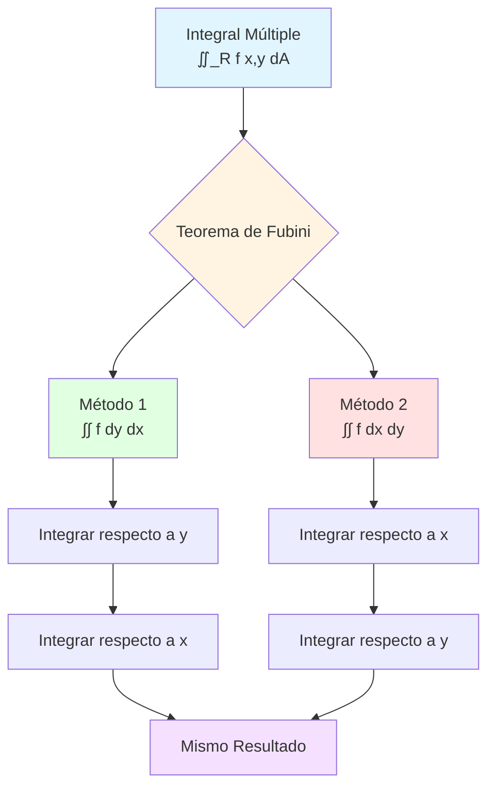
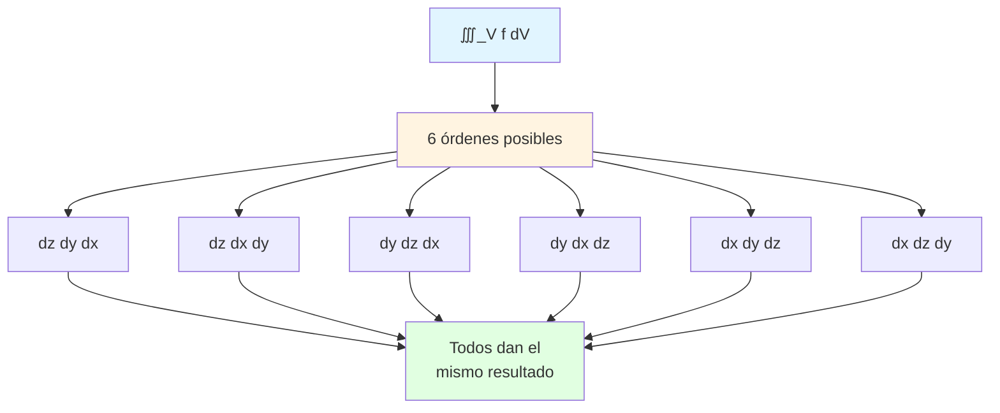
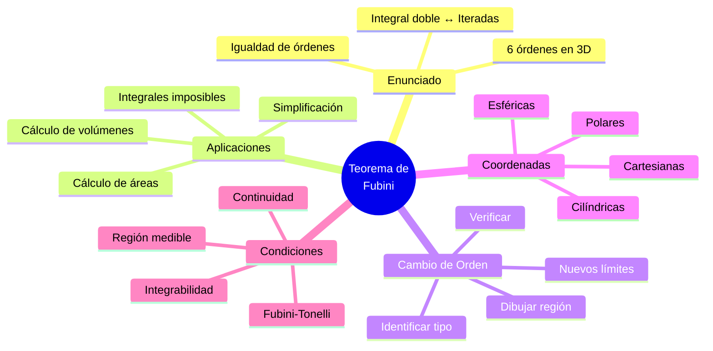
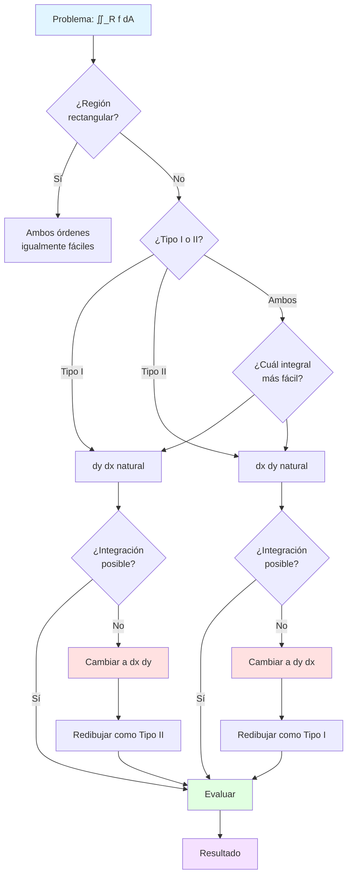

# 📐 Teorema de Fubini para Integrales Múltiples

## 🎯 Introducción

> [!info]- 💡 ¿Qué es el Teorema de Fubini? El **Teorema de Fubini** es uno de los resultados más importantes del cálculo multivariable. Nos permite **convertir una integral múltiple en integrales iteradas**, es decir, calcular integrales dobles o triples realizando integraciones sucesivas de una variable a la vez.
> 
> **Analogía práctica:** Imagina que necesitas contar todas las personas en un estadio rectangular:
> 
> - **Método 1 (integral doble):** Contar a todas simultáneamente
> - **Método 2 (Fubini):** Contar fila por fila, luego sumar las filas
> - **Método 3 (Fubini invertido):** Contar columna por columna, luego sumar
> 
> Fubini garantiza que **ambos métodos dan el mismo resultado**.
> 
> **¿Por qué es fundamental?**
> 
> |Aspecto|Descripción|Beneficio|
> |---|---|---|
> |**Computacional**|Reduce integral múltiple a integrales simples|Cálculo práctico posible|
> |**Flexibilidad**|Permite cambiar orden de integración|Elegir el más fácil|
> |**Teórico**|Conecta integrales múltiples con iteradas|Base del cálculo multivariable|
> |**Aplicaciones**|Volúmenes, probabilidades, física|Resolver problemas reales|
> |**Verificación**|Dos formas de calcular|Confirmar resultados|



---

## 📚 Enunciado Formal del Teorema

### 📜 Versión para Integrales Dobles

> [!note]- 📋 Teorema de Fubini (Integrales Dobles)
> 
> **Enunciado completo:**
> 
> Sea $f(x,y)$ una función **continua** en una región rectangular $R = [a,b] \times [c,d]$. Entonces:
> 
> $$\iint_R f(x,y) , dA = \int_a^b \int_c^d f(x,y) , dy , dx = \int_c^d \int_a^b f(x,y) , dx , dy$$
> 
> **Elementos clave:**
> 
> |Componente|Descripción|Importancia|
> |---|---|---|
> |$f(x,y)$ continua|Función sin discontinuidades|Condición suficiente (no necesaria)|
> |$R$ rectangular|$[a,b] \times [c,d]$|Forma más simple del teorema|
> |Orden $dy , dx$|Primero $y$, luego $x$|Leer de adentro hacia afuera|
> |Orden $dx , dy$|Primero $x$, luego $y$|Orden invertido|
> |Igualdad|Ambos órdenes dan igual|Corazón del teorema|
> 
> **Interpretación visual:**
> 
> ```mermaid
> graph LR
>     A[∬_R f x,y dA] --> B{Fubini}
>     
>     B --> C[Fijar x<br/>Integrar en y]
>     C --> D[c ≤ y ≤ d]
>     D --> E[Resultado: g x]
>     E --> F[Integrar g x<br/>en a ≤ x ≤ b]
>     
>     B --> G[Fijar y<br/>Integrar en x]
>     G --> H[a ≤ x ≤ b]
>     H --> I[Resultado: h y]
>     I --> J[Integrar h y<br/>en c ≤ y ≤ d]
>     
>     F --> K[Mismo Valor Final]
>     J --> K
>     
>     style A fill:#e1f5ff
>     style C fill:#e1ffe1
>     style G fill:#ffe1e1
>     style K fill:#f5e1ff
> ```

### 🔺 Extensión a Regiones No Rectangulares

> [!success]- 🗺️ Regiones Tipo I y Tipo II
> 
> El teorema se extiende a regiones más generales que no son rectangulares:
> 
> **Región Tipo I (Verticalmente Simple):**
> 
> $$R = {(x,y) : a \leq x \leq b, , g_1(x) \leq y \leq g_2(x)}$$
> 
> $$\iint_R f(x,y) , dA = \int_a^b \int_{g_1(x)}^{g_2(x)} f(x,y) , dy , dx$$
> 
> **Región Tipo II (Horizontalmente Simple):**
> 
> $$R = {(x,y) : c \leq y \leq d, , h_1(y) \leq x \leq h_2(y)}$$
> 
> $$\iint_R f(x,y) , dA = \int_c^d \int_{h_1(y)}^{h_2(y)} f(x,y) , dx , dy$$
> 
> **Visualización de tipos:**
> 
> ```mermaid
> graph TB
>     subgraph "Tipo I - Vertical"
>     A1[Para cada x fijo] --> A2[y varía entre<br/>g₁ x y g₂ x]
>     A2 --> A3[Curvas: y=g x]
>     end
>     
>     subgraph "Tipo II - Horizontal"
>     B1[Para cada y fijo] --> B2[x varía entre<br/>h₁ y y h₂ y]
>     B2 --> B3[Curvas: x=h y]
>     end
>     
>     style A1 fill:#e1ffe1
>     style A3 fill:#e1ffe1
>     style B1 fill:#ffe1e1
>     style B3 fill:#ffe1e1
> ```
> 
> **Comparación visual:**
> 
> |Característica|Tipo I|Tipo II|
> |---|---|---|
> |**Variable exterior**|$x$ (constante primero)|$y$ (constante primero)|
> |**Variable interior**|$y$ (varía primero)|$x$ (varía primero)|
> |**Límites internos**|Funciones de $x$: $g_1(x), g_2(x)$|Funciones de $y$: $h_1(y), h_2(y)$|
> |**Límites externos**|Constantes: $a, b$|Constantes: $c, d$|
> |**Orden integral**|$dy , dx$|$dx , dy$|
> |**Descripción**|"Verticalmente entre curvas"|"Horizontalmente entre curvas"|

### 📦 Versión para Integrales Triples

> [!example]- 🎲 Teorema de Fubini (Tres Variables)
> 
> **Para regiones rectangulares:**
> 
> Si $f(x,y,z)$ es continua en $B = [a,b] \times [c,d] \times [p,q]$, entonces:
> 
> $$\iiint_B f(x,y,z) , dV = \int_a^b \int_c^d \int_p^q f(x,y,z) , dz , dy , dx$$
> 
> **¡Existen 6 órdenes posibles!**
> 
> $$\begin{align} &dz , dy , dx \quad \text{(primero z, luego y, finalmente x)} \ &dz , dx , dy \quad \text{(primero z, luego x, finalmente y)} \ &dy , dz , dx \quad \text{(primero y, luego z, finalmente x)} \ &dy , dx , dz \quad \text{(primero y, luego x, finalmente z)} \ &dx , dy , dz \quad \text{(primero x, luego y, finalmente z)} \ &dx , dz , dy \quad \text{(primero x, luego z, finalmente y)} \end{align}$$
> 
> **Tabla de órdenes:**
> 
> |Orden|Primera Integral|Segunda Integral|Tercera Integral|
> |---|---|---|---|
> |$dz , dy , dx$|$\int_p^q \ldots dz$|$\int_c^d \ldots dy$|$\int_a^b \ldots dx$|
> |$dx , dy , dz$|$\int_a^b \ldots dx$|$\int_c^d \ldots dy$|$\int_p^q \ldots dz$|
> |$dy , dx , dz$|$\int_c^d \ldots dy$|$\int_a^b \ldots dx$|$\int_p^q \ldots dz$|



---

## 🔍 Interpretación Geométrica

### 📊 Método de las Rebanadas (Slicing)

> [!tip]- 🍰 Visualización por Cortes
> 
> **Concepto fundamental:**
> 
> El Teorema de Fubini permite calcular el volumen bajo una superficie cortándola en "rebanadas" y sumando sus áreas.
> 
> **Proceso visual:**
> 
> ```mermaid
> flowchart LR
>     A[Sólido 3D] --> B[Cortar en<br/>rebanadas]
>     B --> C1[Rebanada x=x₁]
>     B --> C2[Rebanada x=x₂]
>     B --> C3[Rebanada x=x₃]
>     
>     C1 --> D1[Área A x₁]
>     C2 --> D2[Área A x₂]
>     C3 --> D3[Área A x₃]
>     
>     D1 --> E[Integrar áreas<br/>∫ A x dx]
>     D2 --> E
>     D3 --> E
>     
>     E --> F[Volumen Total]
>     
>     style A fill:#e1f5ff
>     style B fill:#fff4e1
>     style F fill:#e1ffe1
> ```
> 
> **Dos formas de cortar:**
> 
> |Método|Descripción|Fórmula|Interpretación|
> |---|---|---|---|
> |**Rebanadas verticales**|Fijar $x$, variar $y$|$\int_a^b \left[\int_{g_1(x)}^{g_2(x)} f(x,y) , dy\right] dx$|Área de cada rebanada × espesor|
> |**Rebanadas horizontales**|Fijar $y$, variar $x$|$\int_c^d \left[\int_{h_1(y)}^{h_2(y)} f(x,y) , dx\right] dy$|Área de cada rebanada × espesor|
> 
> **Ejemplo conceptual:**
> 
> Volumen bajo $z = f(x,y)$ sobre región $R$:
> 
> ```
> Método 1: Rebanadas perpendiculares al eje x
> 
> Paso 1: Fijar x = x₀
> Paso 2: Para ese x₀, calcular área de la sección:
>         A(x₀) = ∫_{g₁(x₀)}^{g₂(x₀)} f(x₀, y) dy
> 
> Paso 3: "Apilar" todas las rebanadas:
>         V = ∫_a^b A(x) dx = ∫_a^b [∫_{g₁(x)}^{g₂(x)} f(x,y) dy] dx
> 
> Método 2: Rebanadas perpendiculares al eje y
> 
> Paso 1: Fijar y = y₀
> Paso 2: Para ese y₀, calcular área:
>         A(y₀) = ∫_{h₁(y₀)}^{h₂(y₀)} f(x, y₀) dx
> 
> Paso 3: "Apilar" todas las rebanadas:
>         V = ∫_c^d A(y) dy = ∫_c^d [∫_{h₁(y)}^{h₂(y)} f(x,y) dx] dy
> ```

### 🎯 Significado de los Límites de Integración

> [!warning]- ⚠️ Interpretación Correcta de Límites
> 
> **Regla fundamental:**
> 
> - **Límites internos:** Pueden ser **funciones** de la variable externa
> - **Límites externos:** Siempre son **constantes**
> 
> **Lectura de integrales iteradas:**
> 
> $$\int_a^b \int_{g_1(x)}^{g_2(x)} f(x,y) , dy , dx$$
> 
> ```mermaid
> flowchart TD
>     A[Leer de adentro<br/>hacia afuera] --> B[Integral interna]
>     B --> C[∫ dy: Integrar<br/>respecto a y]
>     C --> D[Límites: g₁ x a g₂ x<br/>dependen de x]
>     D --> E[Resultado: función de x]
>     
>     E --> F[Integral externa]
>     F --> G[∫ dx: Integrar<br/>respecto a x]
>     G --> H[Límites: a a b<br/>constantes]
>     H --> I[Resultado: número]
>     
>     style A fill:#e1f5ff
>     style E fill:#fff4e1
>     style I fill:#e1ffe1
> ```
> 
> **Ejemplos de límites:**
> 
> |Expresión|Variable interna|Límites internos|Variable externa|Límites externos|
> |---|---|---|---|---|
> |$\int_0^1 \int_0^x f , dy , dx$|$y$|$0$ a $x$ (función)|$x$|$0$ a $1$ (constantes)|
> |$\int_0^2 \int_{y^2}^4 f , dx , dy$|$x$|$y^2$ a $4$ (función)|$y$|$0$ a $2$ (constantes)|
> |$\int_1^e \int_{\ln x}^1 f , dy , dx$|$y$|$\ln x$ a $1$ (función)|$x$|$1$ a $e$ (constantes)|
> |$\int_0^\pi \int_0^{\sin y} f , dx , dy$|$x$|$0$ a $\sin y$ (función)|$y$|$0$ a $\pi$ (constantes)|
> 
> **Error común:**
> 
> ```
> ❌ INCORRECTO:
> ∫₀^x ∫₀^y f(x,y) dy dx
> 
> Problema: Los límites externos dependen de x,
> pero x es la variable de integración externa.
> 
> ✅ CORRECTO (posibles formas):
> ∫₀^a ∫₀^x f(x,y) dy dx
> o
> ∫₀^b ∫_y^b f(x,y) dx dy
> ```

---

## 🔄 Cambio de Orden de Integración

### 📐 Metodología Sistemática

> [!success]- 🔀 Pasos para Cambiar Orden
> 
> **Procedimiento completo:**
> 
> ```mermaid
> flowchart TD
>     A[Integral original] --> B[Paso 1:<br/>Dibujar región R]
>     B --> C[Paso 2:<br/>Identificar límites actuales]
>     C --> D[Paso 3:<br/>Identificar vértices/fronteras]
>     D --> E[Paso 4:<br/>Expresar región en nuevo orden]
>     E --> F[Paso 5:<br/>Escribir nuevos límites]
>     F --> G[Paso 6:<br/>Verificar con punto de prueba]
>     G --> H[Nueva integral]
>     
>     style A fill:#e1f5ff
>     style B fill:#fff4e1
>     style E fill:#ffe1f5
>     style H fill:#e1ffe1
> ```
> 
> **Paso 1: Identificar la región actual**
> 
> De $\displaystyle \int_a^b \int_{g_1(x)}^{g_2(x)} f(x,y) , dy , dx$:
> 
> - Región: $a \leq x \leq b$ y $g_1(x) \leq y \leq g_2(x)$
> - Tipo: Región Tipo I (verticalmente simple)
> 
> **Paso 2: Graficar la región**
> 
> - Identificar curvas $y = g_1(x)$ y $y = g_2(x)$
> - Marcar límites $x = a$ y $x = b$
> - Encontrar puntos de intersección
> 
> **Paso 3: Re-expresar como Tipo II**
> 
> - Encontrar rango de $y$: $c \leq y \leq d$
> - Para cada $y$ fijo, encontrar rango de $x$: $h_1(y) \leq x \leq h_2(y)$
> 
> **Paso 4: Escribir nueva integral**
> 
> $$\int_c^d \int_{h_1(y)}^{h_2(y)} f(x,y) , dx , dy$$

### 💡 Ejemplos Detallados

> [!example]- 📝 Ejemplo 1: Región Triangular
> 
> **Problema:** Cambiar el orden de integración en:
> 
> $$\int_0^2 \int_0^x (x^2 + y^2) , dy , dx$$
> 
> ```
> SOLUCIÓN:
> 
> Paso 1: Identificar región original (Tipo I)
> - 0 ≤ x ≤ 2  (límites externos, constantes)
> - 0 ≤ y ≤ x  (límites internos, función de x)
> 
> Paso 2: Describir región en palabras
> "y va desde 0 hasta la línea y = x"
> "x va desde 0 hasta 2"
> 
> Paso 3: Identificar fronteras
> - Línea inferior: y = 0
> - Línea superior: y = x  (equivalente a x = y)
> - Límite izquierdo: x = 0
> - Límite derecho: x = 2
> 
> Vértices del triángulo: (0,0), (2,0), (2,2)
> 
> Paso 4: Re-expresar como Tipo II
> Para cada y fijo:
> - y varía desde 0 hasta 2  (altura del triángulo)
> - Para y fijo, x va desde la línea x = y hasta x = 2
> 
> Por tanto:
> - 0 ≤ y ≤ 2  (límites externos)
> - y ≤ x ≤ 2  (límites internos)
> 
> Paso 5: Nueva integral
> ∫₀² ∫_y² (x² + y²) dx dy
> 
> Verificación: Punto (1, 0.5)
> ✓ Original: 0 ≤ 1 ≤ 2 y 0 ≤ 0.5 ≤ 1
> ✓ Nueva: 0 ≤ 0.5 ≤ 2 y 0.5 ≤ 1 ≤ 2
> ```
> 
> **Diagrama visual:**
> 
> ```
>   y
>   2 |      ____
>     |     /||||
>     |    / ||||
>   1 |   /  ||||
>     |  /   ||||
>   0 |_/_____|___x
>     0  1    2
> 
> Tipo I: Barras verticales (dy dx)
> Tipo II: Barras horizontales (dx dy)
> ```

> [!example]- 📝 Ejemplo 2: Región Parabólica
> 
> **Problema:** Cambiar el orden:
> 
> $$\int_0^4 \int_{\sqrt{x}}^2 f(x,y) , dy , dx$$
> 
> ```
> SOLUCIÓN:
> 
> Paso 1: Región original (Tipo I)
> - 0 ≤ x ≤ 4
> - √x ≤ y ≤ 2
> 
> Paso 2: Identificar fronteras
> - Curva inferior: y = √x  →  x = y²
> - Línea superior: y = 2
> - Límite izquierdo: x = 0
> - Límite derecho: x = 4
> 
> Intersecciones:
> - y = √x y y = 2  →  x = 4, punto (4, 2)
> - y = √x y x = 0  →  punto (0, 0)
> 
> Paso 3: Re-expresar como Tipo II
> Para y fijo entre 0 y 2:
> - Desde la curva x = y² hasta x = 4
> 
> Por tanto:
> - 0 ≤ y ≤ 2
> - y² ≤ x ≤ 4
> 
> Paso 4: Nueva integral
> ∫₀² ∫_{y²}⁴ f(x,y) dx dy
> ```

> [!example]- 📝 Ejemplo 3: Región Dividida
> 
> **Problema:** Cambiar el orden:
> 
> $$\int_0^1 \int_0^{1-x} f(x,y) , dy , dx + \int_1^2 \int_0^{2-x} f(x,y) , dy , dx$$
> 
> ```
> SOLUCIÓN:
> 
> Paso 1: Analizar cada integral
> 
> Primera integral:
> - 0 ≤ x ≤ 1
> - 0 ≤ y ≤ 1-x  (línea y = 1-x)
> 
> Segunda integral:
> - 1 ≤ x ≤ 2
> - 0 ≤ y ≤ 2-x  (línea y = 2-x)
> 
> Paso 2: Dibujar región completa
> Es un triángulo con vértices: (0,0), (2,0), (0,1)
> 
> Paso 3: Expresar como Tipo II
> Para y entre 0 y 1:
> - x va desde 0 hasta la línea que pasa por los puntos
> - Línea superior: pasa por (0,1) y (2,0)
>   Ecuación: y = 1 - x/2  →  x = 2(1-y)
> 
> Por tanto:
> - 0 ≤ y ≤ 1
> - 0 ≤ x ≤ 2(1-y)
> 
> Paso 4: Simplificación
> ∫₀¹ ∫₀^{2(1-y)} f(x,y) dx dy
> 
> ¡Una sola integral en lugar de dos!
> ```

### 🎲 Estrategias de Decisión

> [!tip]- 🧠 ¿Cuándo Cambiar el Orden?
> 
> **Indicadores para cambiar:**
> 
> |Situación|Razón|Ejemplo|
> |---|---|---|
> |**Integral imposible**|No existe antiderivada|$\int e^{x^2} dx$, $\int \frac{\sin x}{x} dx$|
> |**Integral muy compleja**|Antiderivada complicada|$\int (x^2+y^2)^{3/2} dy$|
> |**Límites complicados**|Funciones difíciles|$\int_{\sqrt{x}}^{e^x} \ldots dy$|
> |**Múltiples integrales**|Región dividida|Suma de varias integrales|
> |**Simetría oculta**|Mejor aprovechada|Cambio revela simetría|
> 
> **Árbol de decisión:**
> 
> ```mermaid
> flowchart TD
>     A{¿Puedes integrar<br/>fácilmente?} -->|Sí| B[No cambiar]
>     A -->|No| C{¿Existe la<br/>antiderivada?}
>     
>     C -->|No| D[✅ Cambiar orden]
>     C -->|Sí, pero difícil| E{¿Límites<br/>complicados?}
>     
>     E -->|Sí| D
>     E -->|No| F{¿Región<br/>dividida?}
>     
>     F -->|Sí| D
>     F -->|No| G[Proceder con<br/>orden actual]
>     
>     style D fill:#e1ffe1
>     style B fill:#e1f5ff
>     style G fill:#fff4e1
> ```

---

## 🎓 Aplicaciones y Ejemplos Completos

### 📊 Cálculo de Áreas

> [!success]- 📏 Área de Regiones Planas
> 
> **Fórmula fundamental:**
> 
> $$\text{Área}(R) = \iint_R 1 , dA = \int_a^b \int_{g_1(x)}^{g_2(x)} 1 , dy , dx$$
> 
> **Ejemplo: Área entre dos curvas**
> 
> Calcular el área de la región limitada por $y = x^2$ y $y = 2x$.
> 
> ```
> SOLUCIÓN:
> 
> Paso 1: Encontrar intersecciones
> x² = 2x
> x² - 2x = 0
> x(x - 2) = 0
> x = 0 o x = 2
> 
> Puntos: (0,0) y (2,4)
> 
> Paso 2: Determinar cuál curva está arriba
> Para x ∈ (0,2): y = 2x está arriba de y = x²
> 
> Paso 3: Configurar integral (Tipo I)
> Área = ∫₀² ∫_{x²}^{2x} 1 dy dx
> 
> Paso 4: Evaluar
> = ∫₀² [y]_{x²}^{2x} dx
> = ∫₀² (2x - x²) dx
> = [x² - x³/3]₀²
> = 4 - 8/3
> = 4/3
> 
> Paso 5: Verificar con orden invertido (Tipo II)
> Para y entre 0 y 4:
> - Curva izquierda: x = y/2
> - Curva derecha: x = √y
> 
> Área = ∫₀⁴ ∫_{y/2}^{√y} 1 dx dy
>      = ∫₀⁴ (√y - y/2) dy
>      = [2y^(3/2)/3 - y²/4]₀⁴
>      = 16/3 - 4
>      = 4/3  ✓ Confirma resultado
> ```

### 🔢 Cálculo de Volúmenes

> [!example]- 📦 Volumen bajo una Superficie
> 
> **Ejemplo completo:**
> 
> Calcular el volumen del sólido bajo $z = xy$ sobre la región triangular con vértices $(0,0)$, $(2,0)$, $(2,2)$.
> 
> ```
> SOLUCIÓN:
> 
> Paso 1: Describir región R
> VVértices: (0,0), (2,0), (2,2)
> Fronteras:
> 
> - Lado inferior: y = 0
> - Lado vertical: x = 2
> - Hipotenusa: línea de (0,0) a (2,2), ecuación y = x
> 
> Paso 2: Método 1 - Tipo I (dy dx) Para x entre 0 y 2:
> 
> - y va desde 0 hasta x
> 
> V = ∫₀² ∫₀ˣ xy dy dx
> 
> Paso 3: Evaluar integral interna ∫₀ˣ xy dy = x ∫₀ˣ y dy = x [y²/2]₀ˣ = x · x²/2 = x³/2
> 
> Paso 4: Evaluar integral externa V = ∫₀² x³/2 dx = (1/2)[x⁴/4]₀² = (1/2)(16/4) = 2
> 
> Paso 5: Método 2 - Tipo II (dx dy) Para y entre 0 y 2:
> 
> - x va desde y hasta 2
> 
> V = ∫₀² ∫_y² xy dx dy
> 
> Integral interna: ∫_y² xy dx = y ∫_y² x dx = y [x²/2]_y² = y(4/2 - y²/2) = 2y - y³/2
> 
> Integral externa: V = ∫₀² (2y - y³/2) dy = [y² - y⁴/8]₀² = 4 - 16/8 = 4 - 2 = 2 ✓ Mismo resultado
> ```

### 🎯 Integrales que Requieren Cambio de Orden

> [!warning]- ⚡ Ejemplos donde es Necesario
> 
> **Ejemplo 1: Exponencial de x²**
> 
> $$\int_0^1 \int_x^1 e^{y^2} , dy , dx$$
> 
> ```
> Análisis:
> ∫ e^(y²) dy no tiene forma cerrada en términos de funciones elementales
> → NECESARIO cambiar orden
> 
> Paso 1: Región original
> - 0 ≤ x ≤ 1
> - x ≤ y ≤ 1
> Triángulo: (0,0), (1,0), (1,1)
> 
> Paso 2: Cambiar a dx dy
> - 0 ≤ y ≤ 1
> - 0 ≤ x ≤ y
> 
> Paso 3: Nueva integral
> ∫₀¹ ∫₀ʸ e^(y²) dx dy
> 
> Paso 4: Evaluar (ahora es posible!)
> = ∫₀¹ e^(y²) · x|₀ʸ dy
> = ∫₀¹ y·e^(y²) dy
> 
> Sustitución: u = y², du = 2y dy
> = (1/2) ∫₀¹ e^u du
> = (1/2)[e^u]₀¹
> = (1/2)(e - 1)
> ```
> 
> **Ejemplo 2: Función racional compleja**
> 
> $$\int_0^2 \int_{x/2}^1 \frac{x}{y^3 + 1} , dy , dx$$
> 
> ```
> Análisis:
> ∫ x/(y³+1) dy es muy complejo
> → Cambiar orden puede simplificar
> 
> Paso 1: Región original
> - 0 ≤ x ≤ 2
> - x/2 ≤ y ≤ 1
> 
> Fronteras:
> - y = x/2 → x = 2y
> - y = 1
> - x = 0, x = 2
> 
> Intersecciones:
> y = x/2 con y = 1: x = 2, punto (2,1)
> y = x/2 con x = 0: punto (0,0)
> 
> Paso 2: Cambiar a dx dy
> Para y entre 0 y 1:
> - x va desde 0 hasta 2y
> 
> Paso 3: Nueva integral
> ∫₀¹ ∫₀^(2y) x/(y³+1) dx dy
> 
> Paso 4: Evaluar
> = ∫₀¹ 1/(y³+1) [x²/2]₀^(2y) dy
> = ∫₀¹ 1/(y³+1) · 2y² dy
> = ∫₀¹ 2y²/(y³+1) dy
> 
> Sustitución: u = y³+1, du = 3y² dy
> = (2/3) ∫₁² 1/u du
> = (2/3)[ln|u|]₁²
> = (2/3) ln 2
> ```

---

## 📐 Fubini en Coordenadas No Cartesianas

### 🌀 Coordenadas Polares

> [!note]- 🔄 Teorema de Fubini en Polares
> 
> **Transformación:**
> 
> $$\begin{cases} x = r\cos\theta \ y = r\sin\theta \end{cases} \quad \Rightarrow \quad dA = r , dr , d\theta$$
> 
> **Versión de Fubini:**
> 
> $$\iint_R f(x,y) , dA = \int_{\alpha}^{\beta} \int_{r_1(\theta)}^{r_2(\theta)} f(r\cos\theta, r\sin\theta) \cdot r , dr , d\theta$$
> 
> **También válido el orden inverso:**
> 
> $$= \int_{a}^{b} \int_{\theta_1(r)}^{\theta_2(r)} f(r\cos\theta, r\sin\theta) \cdot r , d\theta , dr$$
> 
> **Ejemplo: Integral gaussiana**
> 
> $$I = \int_{-\infty}^{\infty} \int_{-\infty}^{\infty} e^{-(x^2+y^2)} , dx , dy$$
> 
> ```
> Paso 1: Reconocer simetría circular
> x² + y² = r²  → Usar polares
> 
> Paso 2: Límites en polares
> - 0 ≤ r < ∞
> - 0 ≤ θ ≤ 2π
> 
> Paso 3: Transformar
> I = ∫₀^(2π) ∫₀^∞ e^(-r²) · r dr dθ
> 
> Paso 4: Separar (Fubini para variables independientes)
> = [∫₀^(2π) dθ] × [∫₀^∞ r·e^(-r²) dr]
> 
> Primera integral: ∫₀^(2π) dθ = 2π
> 
> Segunda integral (sustitución u = -r²):
> ∫₀^∞ r·e^(-r²) dr = [-1/2·e^(-r²)]₀^∞
>                    = 0 - (-1/2)
>                    = 1/2
> 
> Paso 5: Resultado
> I = 2π × 1/2 = π
> 
> Conclusión famosa:
> ∫_{-∞}^∞ e^(-x²) dx = √π
> ```

### 📦 Coordenadas Cilíndricas y Esféricas

> [!tip]- 🎲 Fubini en 3D
> 
> **Coordenadas cilíndricas:**
> 
> $$\begin{cases} x = r\cos\theta \ y = r\sin\theta \ z = z \end{cases} \quad \Rightarrow \quad dV = r , dr , d\theta , dz$$
> 
> $$\iiint_V f , dV = \int \int \int f(r\cos\theta, r\sin\theta, z) \cdot r , dr , d\theta , dz$$
> 
> **Órdenes posibles:** 6 combinaciones de $dr, d\theta, dz$
> 
> **Coordenadas esféricas:**
> 
> $$\begin{cases} x = \rho\sin\phi\cos\theta \ y = \rho\sin\phi\sin\theta \ z = \rho\cos\phi \end{cases} \quad \Rightarrow \quad dV = \rho^2\sin\phi , d\rho , d\phi , d\theta$$
> 
> $$\iiint_V f , dV = \int \int \int f(...) \cdot \rho^2\sin\phi , d\rho , d\phi , d\theta$$
> 
> **Órdenes posibles:** 6 combinaciones de $d\rho, d\phi, d\theta$

---

## ⚠️ Condiciones y Limitaciones

### 📋 Hipótesis del Teorema

> [!warning]- 🔍 Cuándo NO Aplica Fubini
> 
> **Condiciones suficientes (pero no necesarias):**
> 
> |Condición|Explicación|Por qué importa|
> |---|---|---|
> |**Continuidad**|$f$ continua en $R$|Garantiza integrabilidad|
> |**Región medible**|$R$ tiene área bien definida|Evita paradojas|
> |**Integrabilidad**|$\iint_R|f|
> 
> **Contraejemplo clásico:**
> 
> $$f(x,y) = \frac{x^2 - y^2}{(x^2 + y^2)^2}$$
> 
> ```
> Sobre R = [0,1] × [0,1]:
> 
> Orden 1: ∫₀¹ ∫₀¹ f(x,y) dy dx = π/4
> 
> Orden 2: ∫₀¹ ∫₀¹ f(x,y) dx dy = -π/4
> 
> ¡Diferentes resultados! ❌
> 
> Razón: f no es integrable en sentido absoluto
> ∬_R |f(x,y)| dA = ∞
> ```
> 
> **Teorema de Fubini-Tonelli:**
> 
> Si alguna de estas condiciones se cumple:
> 
> 1. $f \geq 0$ en $R$, o
> 2. $\iint_R |f| , dA < \infty$
> 
> Entonces Fubini aplica y ambos órdenes dan el mismo resultado.

### 🚫 Errores Comunes

> [!danger]- ⚠️ Equivocaciones Frecuentes
> 
> **Error 1: Confundir límites**
> 
> ```
> ❌ INCORRECTO:
> ∫₀ʸ ∫₀ˣ f(x,y) dx dy
> 
> Problema: Límite exterior depende de variable de integración interior
> 
> ✅ CORRECTO:
> ∫₀^a ∫₀^y f(x,y) dx dy
> o
> ∫₀^b ∫₀ˣ f(x,y) dy dx
> ```
> 
> **Error 2: Olvidar el Jacobiano**
> 
> ```
> ❌ INCORRECTO (coordenadas polares):
> ∫∫ f(r,θ) dr dθ
> 
> ✅ CORRECTO:
> ∫∫ f(r,θ) · r dr dθ
> 
> El factor r es ESENCIAL
> ```
> 
> **Error 3: Región mal descrita**
> 
> ```
> Región: triángulo con vértices (0,0), (1,0), (0,1)
> 
> ❌ INCORRECTO:
> ∫₀¹ ∫₀¹ f dy dx  (esto es un cuadrado!)
> 
> ✅ CORRECTO:
> ∫₀¹ ∫₀^(1-x) f dy dx
> ```
> 
> **Error 4: No verificar continuidad**
> 
> ```
> f(x,y) = 1/√(xy) en [0,1] × [0,1]
> 
> Problema: f → ∞ cuando x → 0 o y → 0
> No se puede aplicar Fubini directamente
> Se necesita análisis de convergencia
> ```

---

## 📊 Resumen Visual Completo

### Mapa Mental del Teorema



### Tabla de Referencia Rápida

> [!quote]- 📚 Guía de Consulta
> 
> **Tipos de regiones:**
> 
> |Tipo|Descripción|Orden|Límites|
> |---|---|---|---|
> |**Rectangular**|$[a,b] \times [c,d]$|Ambos|Todos constantes|
> |**Tipo I**|Vertical|$dy , dx$|$a \leq x \leq b$, $g_1(x) \leq y \leq g_2(x)$|
> |**Tipo II**|Horizontal|$dx , dy$|$c \leq y \leq d$, $h_1(y) \leq x \leq h_2(y)$|
> 
> **Checklist para cambio de orden:**
> 
> - [ ] Dibujar la región $R$
> - [ ] Identificar todas las fronteras
> - [ ] Encontrar intersecciones clave
> - [ ] Determinar rango de nueva variable externa
> - [ ] Expresar límites internos como funciones
> - [ ] Verificar con un punto de prueba
> - [ ] Reescribir integral completa

### Diagrama de Flujo Maestro



---

## 🎓 Ejercicios Resueltos Avanzados

> [!example]- 💪 Ejercicio 1: Integral de Fresnel
> 
> **Problema:** Evaluar $\displaystyle \int_0^1 \int_x^1 \cos(y^2) , dy , dx$
> 
> ```
> SOLUCIÓN:
> 
> Paso 1: Reconocer que ∫ cos(y²) dy no tiene forma cerrada
> → Necesario cambiar orden
> 
> Paso 2: Región original
> - 0 ≤ x ≤ 1
> - x ≤ y ≤ 1
> 
> Triángulo: (0,0), (1,0), (1,1)
> 
> Paso 3: Cambiar a dx dy
> - 0 ≤ y ≤ 1
> - 0 ≤ x ≤ y
> 
> Paso 4: Nueva integral
> ∫₀¹ ∫₀ʸ cos(y²) dx dy
> 
> Paso 5: Evaluar
> = ∫₀¹ cos(y²) · [x]₀ʸ dy
> = ∫₀¹ y·cos(y²) dy
> 
> Sustitución: u = y², du = 2y dy
> = (1/2) ∫₀¹ cos(u) du
> = (1/2)[sin(u)]₀¹
> = (1/2) sin(1)
> 
> Respuesta: sin(1)/2 ≈ 0.4207
> ```

> [!example]- 💪 Ejercicio 2: Volumen de Paraboloide
> 
> **Problema:** Calcular el volumen bajo $z = 4 - x^2 - y^2$ sobre el primer cuadrante hasta $x + y = 2$.
> 
> ```
> SOLUCIÓN:
> 
> Paso 1: Identificar región R
> - Primer cuadrante: x ≥ 0, y ≥ 0
> - Debajo de línea: x + y ≤ 2
> 
> Vértices: (0,0), (2,0), (0,2)
> 
> Paso 2: Método 1 - dy dx
> Para x entre 0 y 2:
> - y va desde 0 hasta 2-x
> 
> V = ∫₀² ∫₀^(2-x) (4 - x² - y²) dy dx
> 
> Paso 3: Integral interna
> ∫₀^(2-x) (4 - x² - y²) dy
> = [4y - x²y - y³/3]₀^(2-x)
> = 4(2-x) - x²(2-x) - (2-x)³/3
> = 8 - 4x - 2x² + x³ - (8 - 12x + 6x² - x³)/3
> = 8 - 4x - 2x² + x³ - 8/3 + 4x - 2x² + x³/3
> = 8 - 8/3 - 4x² + 4x³/3
> = 16/3 - 4x² + 4x³/3
> 
> Paso 4: Integral externa
> V = ∫₀² (16/3 - 4x² + 4x³/3) dx
>   = [16x/3 - 4x³/3 + x⁴/3]₀²
>   = 32/3 - 32/3 + 16/3
>   = 16/3
> 
> Respuesta: V = 16/3 unidades cúbicas
> ```

> [!example]- 💪 Ejercicio 3: Región con Tres Partes
> 
> **Problema:** Cambiar el orden de:
> 
> $$\int_0^1 \int_0^x f(x,y) , dy , dx + \int_1^2 \int_0^{2-x} f(x,y) , dy , dx$$
> 
> ```
> SOLUCIÓN:
> 
> Paso 1: Analizar cada región
> 
> Región 1:
> - 0 ≤ x ≤ 1
> - 0 ≤ y ≤ x
> Triángulo inferior
> 
> Región 2:
> - 1 ≤ x ≤ 2
> - 0 ≤ y ≤ 2-x
> Triángulo superior
> 
> Paso 2: Dibujar región completa
> Vértices: (0,0), (1,0), (2,0), (1,1)
> Es un triángulo con vértices (0,0), (2,0), (1,1)
> 
> Paso 3: Expresar como dx dy
> 
> Para 0 ≤ y ≤ 1:
> - Lado izquierdo: x = y (de región 1)
> - Lado derecho: x = 2-y (de región 2)
> 
> Paso 4: Nueva integral (unificada)
> ∫₀¹ ∫_y^(2-y) f(x,y) dx dy
> 
> ¡Una sola integral en lugar de dos!
> ```

---

## 🔗 Conexión con Próximos Temas

> [!quote]- 🌟 Hacia Adelante en Cálculo
> 
> **Teorema de Fubini como base para:**
> 
> ```mermaid
> graph LR
>     A[Teorema de<br/>Fubini] --> B[Cambio de<br/>Variables]
>     A --> C[Integrales de<br/>Superficie]
>     A --> D[Teorema de<br/>Green]
>     
>     B --> E[Jacobiano generalizado]
>     C --> F[Parametrizaciones]
>     D --> G[Circulación y flujo]
>     
>     E --> H[Transformaciones<br/>no lineales]
>     F --> I[Stokes]
>     G --> I
>     
>     style A fill:#e1ffe1
>     style B fill:#fff4e1
>     style C fill:#e1f5ff
>     style D fill:#ffe1f5
>     style I fill:#f5e1ff
> ```
> 
> |Concepto Actual|Siguiente Paso|Conexión|
> |---|---|---|
> |Fubini básico|Jacobiano|Fubini con cambio de variables|
> |Orden de integración|Coordenadas curvilíneas|Órdenes óptimos en nuevas coordenadas|
> |Regiones tipo I/II|Superficies paramétricas|Generalización a 2D en 3D|
> |Integrales iteradas|Teorema de Green|Relación integral doble-línea|
> |6 órdenes en 3D|Divergencia|Optimizar según geometría|

---

**Tags:** #cálculo #fubini #integrales-iteradas #cambio-orden #regiones #tipo-I #tipo-II #volumen #área #coordenadas-polares #mermaid
