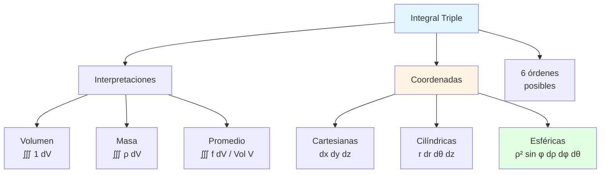
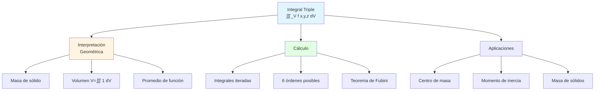
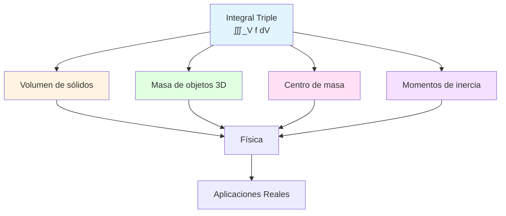
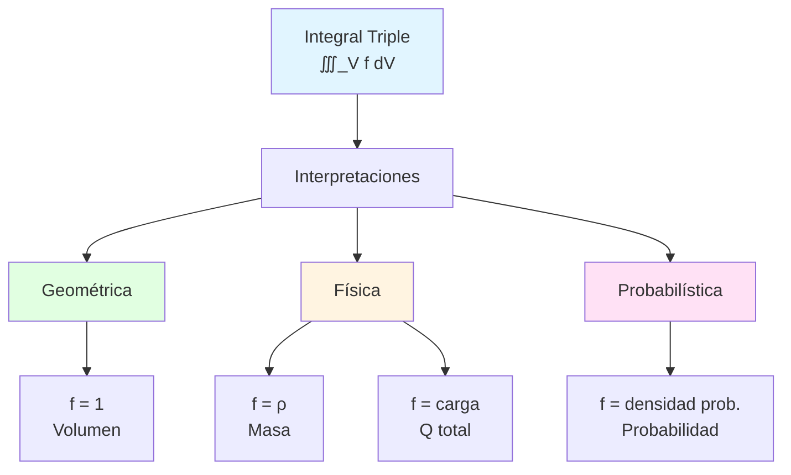
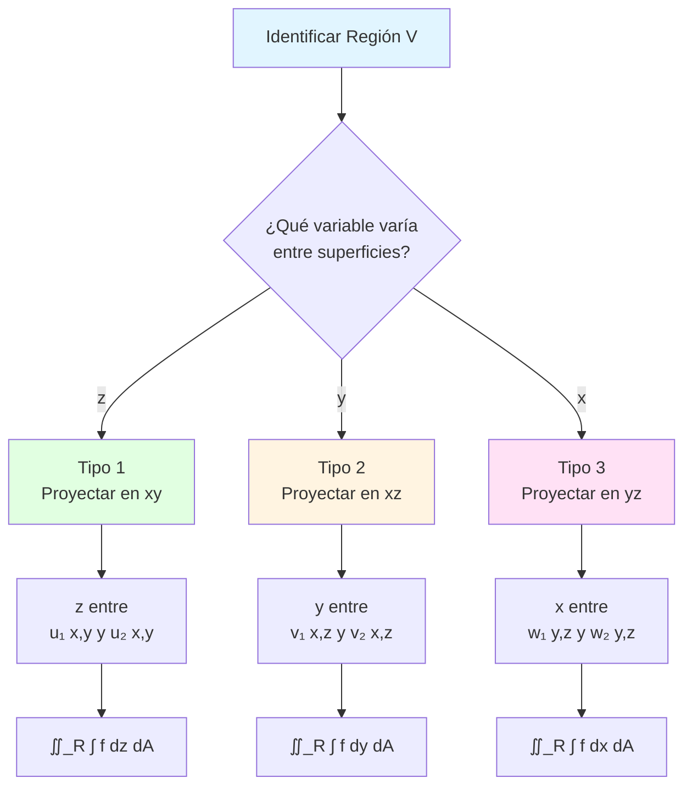
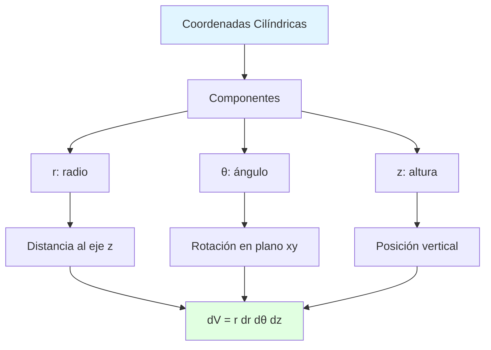
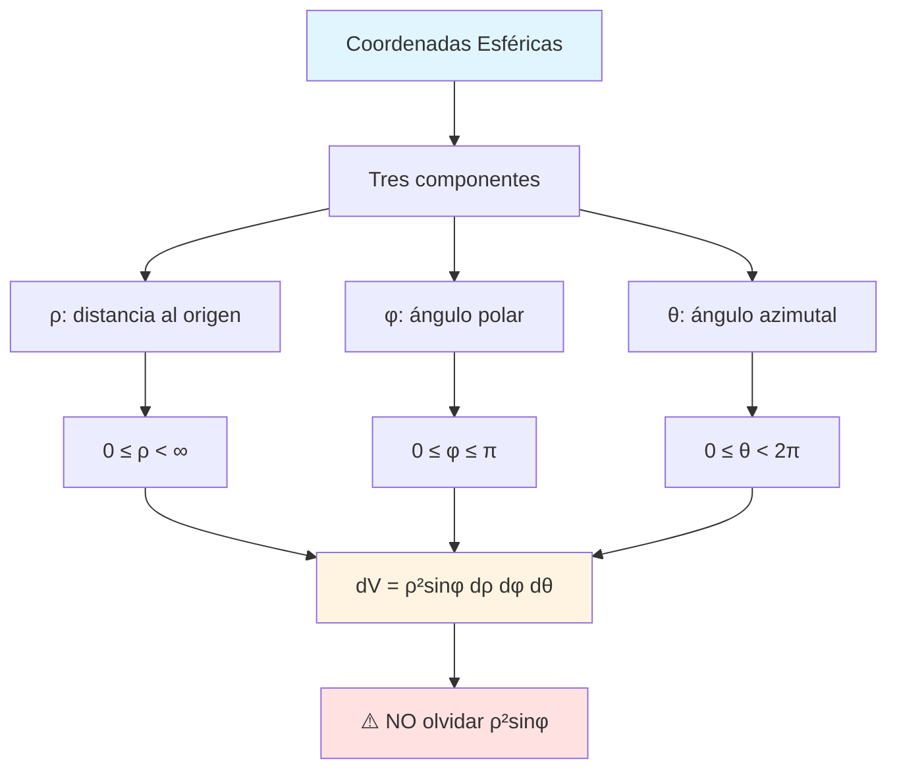
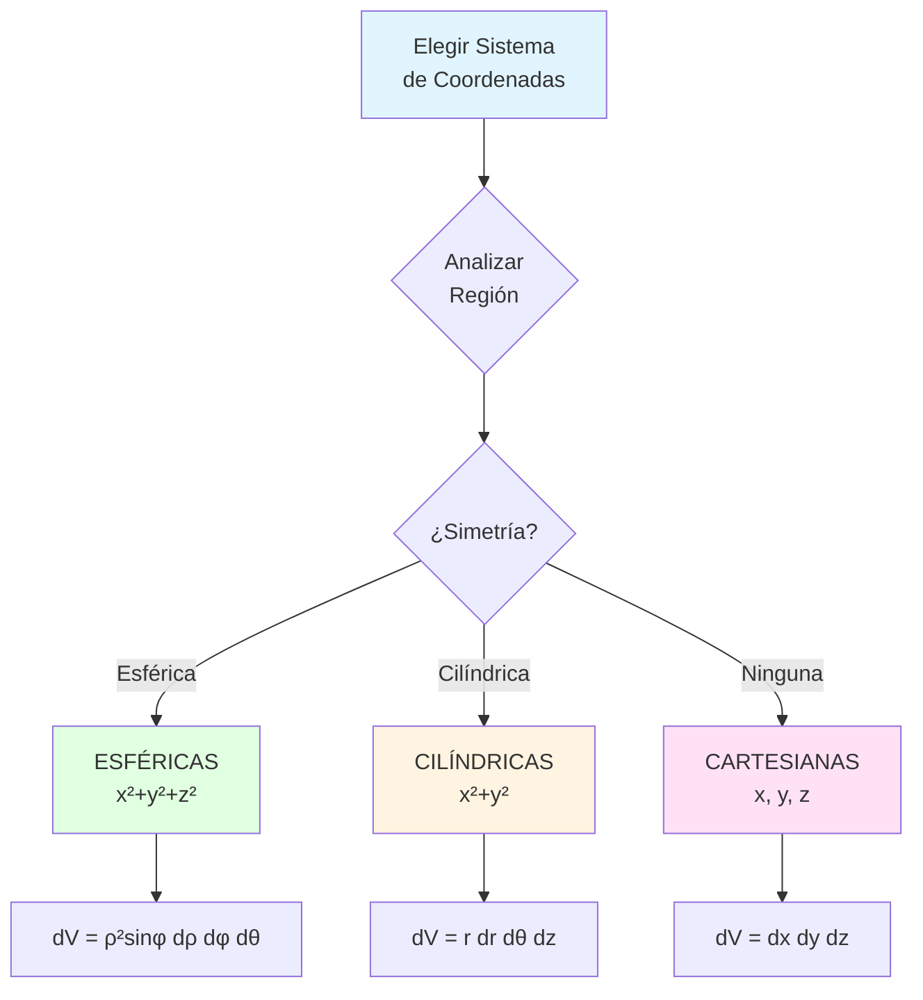
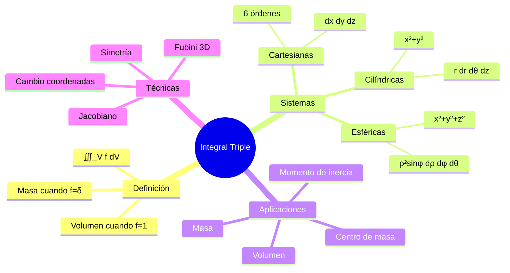

# 📦 Integral Triple

## 🎯 Introducción

> [!info]- 💡 ¿Qué es una Integral Triple? La **integral triple** es la extensión natural de las integrales dobles al espacio tridimensional. Mientras que las integrales dobles nos permiten calcular áreas y volúmenes bajo superficies, las **integrales triples** nos permiten calcular volúmenes, masas, centros de masa y otras propiedades de sólidos en el espacio tridimensional.
> 
> **Analogía práctica:** Imagina que necesitas calcular la masa total de un objeto 3D con densidad variable:
> 
> - **Integral simple** → Masa de una varilla (1D)
> - **Integral doble** → Masa de una lámina plana (2D)
> - **Integral triple** → Masa de un sólido (3D)
> 
> **¿Por qué son importantes?**
> 
> |Aspecto|Descripción|Ejemplo de Uso|
> |---|---|---|
> |**Volúmenes**|Calcular volúmenes de sólidos|Recipientes, estructuras|
> |**Masa y densidad**|Objetos con densidad variable|Física, ingeniería|
> |**Centro de masa**|Punto de equilibrio 3D|Diseño estructural|
> |**Momentos de inercia**|Resistencia a rotación|Ingeniería mecánica|
> |**Probabilidad**|Distribuciones en 3D|Estadística multivariable|
> |**Física**|Campos escalares en espacio|Densidad, temperatura, presión|



---

## 🎯 Introducción

> [!info]- 💡 ¿Qué es una Integral Triple? La **integral triple** extiende el concepto de integración a funciones de tres variables, permitiéndonos calcular volúmenes, masas, centros de masa y otras cantidades físicas en regiones tridimensionales.
> 
> **Analogía práctica:** Si una integral doble calcula el "volumen bajo una superficie", una integral triple puede calcular:
> 
> - **Masa total** de un sólido con densidad variable
> - **Carga total** en una región con densidad de carga
> - **Volumen** de un sólido en el espacio
> - **Momento de inercia** de un objeto 3D
> 
> **¿Por qué son importantes?**
> 
> |Aspecto|Descripción|Ejemplo|
> |---|---|---|
> |**Volúmenes**|Calcular volumen de sólidos complejos|Volumen bajo superficie|
> |**Masa total**|Con densidad variable|$M = \iiint_V \rho(x,y,z) , dV$|
> |**Centro de masa**|Punto de equilibrio|$\bar{x} = \frac{1}{M}\iiint x\rho , dV$|
> |**Momento de inercia**|Rotación de sólidos|$I = \iiint r^2 \delta , dV$|
> |**Probabilidades**|Distribuciones 3D|Funciones de densidad|



Let me create the complete document:

# 📦 Integral Triple

## 🎯 Introducción

> [!info]- 💡 ¿Qué es una Integral Triple? La **integral triple** extiende el concepto de integral a funciones de tres variables, permitiéndonos calcular volúmenes, masas, centros de masa y otras propiedades de sólidos tridimensionales.
> 
> **Analogía práctica:** Imagina calcular la masa total de un objeto 3D con densidad variable:
> 
> - **Integral simple** → Masa de un alambre (1D)
> - **Integral doble** → Masa de una lámina plana (2D)
> - **Integral triple** → Masa de un sólido 3D
> 
> Cada dimensión adicional requiere una integración más.
> 
> **¿Por qué son importantes?**
> 
> |Aspecto|Descripción|Aplicación|
> |---|---|---|
> |**Volumen**|Región tridimensional|Capacidad de tanques, edificios|
> |**Masa**|Con densidad variable|Física, ingeniería|
> |**Centro de masa**|Punto de equilibrio|Diseño estructural|
> |**Momento de inercia**|Resistencia a rotación|Mecánica, ingeniería|
> |**Carga total**|Distribución de densidad|Electromagnetismo|
> |**Probabilidad**|Distribuciones 3D|Estadística multivariable|



---

## 📚 Definición y Concepto

### 🎯 ¿Qué es una Integral Triple?

> [!info]- 💡 Concepto Fundamental
> 
> La **integral triple** es una extensión natural de la integral doble al espacio tridimensional. Mientras que una integral doble calcula "área acumulada" o "volumen bajo una superficie", la integral triple trabaja con funciones de tres variables y permite calcular propiedades de sólidos en el espacio.
> 
> **Definición formal:**
> 
> Sea $f(x,y,z)$ una función continua en una región sólida $V \subset \mathbb{R}^3$. La **integral triple** se define como:
> 
> $$\iiint_V f(x,y,z) , dV$$
> 
> donde $dV$ representa el elemento diferencial de volumen.
> 
> **Interpretaciones físicas:**
> 
> |Si f(x,y,z) es...|La integral representa...|Unidades|
> |---|---|---|
> |$f = 1$|Volumen de la región $V$|$\text{m}^3$|
> |Densidad $\rho(x,y,z)$|Masa total del sólido|$\text{kg}$|
> |Temperatura $T(x,y,z)$|"Temperatura total"|$°\text{C} \cdot \text{m}^3$|
> |Carga $q(x,y,z)$|Carga eléctrica total|$\text{C}$ (coulombs)|
> |Presión $P(x,y,z)$|"Presión acumulada"|$\text{Pa} \cdot \text{m}^3$|



---

## 🎯 Cálculo de Integrales Triples

### 📐 Coordenadas Cartesianas

> [!note]- 📦 Región Rectangular
> 
> **Caso más simple:** $V = [a,b] \times [c,d] \times [p,q]$
> 
> $$\iiint_V f(x,y,z) , dV = \int_a^b \int_c^d \int_p^q f(x,y,z) , dz , dy , dx$$
> 
> **Los 6 órdenes posibles:**
> 
> ```mermaid
> graph TD
>     A[∭ f dV] --> B[6 órdenes de integración]
>     
>     B --> C1[dz dy dx]
>     B --> C2[dz dx dy]
>     B --> C3[dy dz dx]
>     B --> C4[dy dx dz]
>     B --> C5[dx dy dz]
>     B --> C6[dx dz dy]
>     
>     C1 --> D[Todos equivalentes<br/>por Fubini]
>     C2 --> D
>     C3 --> D
>     C4 --> D
>     C5 --> D
>     C6 --> D
>     
>     style A fill:#e1f5ff
>     style D fill:#e1ffe1
> ```
> 
> **Ejemplo básico:**
> 
> Calcular $\displaystyle \iiint_V xyz , dV$ donde $V = [0,1] \times [0,2] \times [0,3]$
> 
> ```
> Solución (usando orden dz dy dx):
> 
> Paso 1: Configurar integral
> ∭_V xyz dV = ∫₀¹ ∫₀² ∫₀³ xyz dz dy dx
> 
> Paso 2: Integrar respecto a z
> ∫₀³ xyz dz = xy[z²/2]₀³ = xy · 9/2 = 9xy/2
> 
> Paso 3: Integrar respecto a y
> ∫₀² (9xy/2) dy = (9x/2)[y²/2]₀² = (9x/2) · 2 = 9x
> 
> Paso 4: Integrar respecto a x
> ∫₀¹ 9x dx = 9[x²/2]₀¹ = 9/2
> 
> Respuesta: 9/2
> ```

### 🏔️ Regiones Más Generales

> [!success]- 🗻 Tipos de Regiones Sólidas
> 
> **Clasificación de regiones tridimensionales:**
> 
> **Tipo 1: z varía entre superficies**
> 
> $$V = {(x,y,z) : (x,y) \in R, , u_1(x,y) \leq z \leq u_2(x,y)}$$
> 
> $$\iiint_V f , dV = \iint_R \left[\int_{u_1(x,y)}^{u_2(x,y)} f(x,y,z) , dz\right] dA$$
> 
> **Tipo 2: y varía entre superficies**
> 
> $$V = {(x,y,z) : (x,z) \in R, , v_1(x,z) \leq y \leq v_2(x,z)}$$
> 
> **Tipo 3: x varía entre superficies**
> 
> $$V = {(x,y,z) : (y,z) \in R, , w_1(y,z) \leq x \leq w_2(y,z)}$$
> 
> **Comparación visual:**
> 
> |Tipo|Límite variable|Superficie base|Orden típico|
> |---|---|---|---|
> |**Tipo 1**|$z$ entre superficies|Región en plano $xy$|$dz , dy , dx$ o $dz , dx , dy$|
> |**Tipo 2**|$y$ entre superficies|Región en plano $xz$|$dy , dz , dx$ o $dy , dx , dz$|
> |**Tipo 3**|$x$ entre superficies|Región en plano $yz$|$dx , dy , dz$ o $dx , dz , dy$|



> [!example]- 📝 Ejemplo: Tetraedro
> 
> **Problema:** Calcular el volumen del tetraedro con vértices en $(0,0,0)$, $(1,0,0)$, $(0,1,0)$, $(0,0,1)$.
> 
> ```
> SOLUCIÓN:
> 
> Paso 1: Describir la región
> El tetraedro está limitado por:
> - Planos coordenados: x = 0, y = 0, z = 0
> - Plano: x + y + z = 1
> 
> Paso 2: Expresar como Tipo 1
> Para (x,y) en la región triangular del plano xy:
> - 0 ≤ z ≤ 1 - x - y
> 
> Proyección R en plano xy:
> - Triángulo con vértices (0,0), (1,0), (0,1)
> - Puede expresarse como: 0 ≤ x ≤ 1, 0 ≤ y ≤ 1-x
> 
> Paso 3: Configurar integral (f = 1 para volumen)
> V = ∫₀¹ ∫₀^(1-x) ∫₀^(1-x-y) 1 dz dy dx
> 
> Paso 4: Integrar respecto a z
> ∫₀^(1-x-y) dz = [z]₀^(1-x-y) = 1-x-y
> 
> Paso 5: Integrar respecto a y
> ∫₀^(1-x) (1-x-y) dy = [y - xy - y²/2]₀^(1-x)
>                      = (1-x) - x(1-x) - (1-x)²/2
>                      = 1 - x - x + x² - (1 - 2x + x²)/2
>                      = 1 - 2x + x² - 1/2 + x - x²/2
>                      = 1/2 - x + x²/2
> 
> Paso 6: Integrar respecto a x
> ∫₀¹ (1/2 - x + x²/2) dx = [x/2 - x²/2 + x³/6]₀¹
>                          = 1/2 - 1/2 + 1/6
>                          = 1/6
> 
> Respuesta: V = 1/6 unidades cúbicas
> ```

---

## 🌀 Coordenadas Cilíndricas

### 📊 Definición y Transformación

> [!tip]- 🔄 Sistema Cilíndrico
> 
> **Transformación de coordenadas:**
> 
> $$\begin{cases} x = r\cos\theta \ y = r\sin\theta \ z = z \end{cases}$$
> 
> **Transformación inversa:**
> 
> $$\begin{cases} r = \sqrt{x^2+y^2} \ \theta = \arctan(y/x) \ z = z \end{cases}$$
> 
> **Elemento de volumen:**
> 
> $$dV = dx , dy , dz = r , dr , d\theta , dz$$
> 
> **Jacobiano:**
> 
> $$J = \begin{vmatrix} \frac{\partial x}{\partial r} & \frac{\partial x}{\partial \theta} & \frac{\partial x}{\partial z} \ \frac{\partial y}{\partial r} & \frac{\partial y}{\partial \theta} & \frac{\partial y}{\partial z} \ \frac{\partial z}{\partial r} & \frac{\partial z}{\partial \theta} & \frac{\partial z}{\partial z} \end{vmatrix} = \begin{vmatrix} \cos\theta & -r\sin\theta & 0 \ \sin\theta & r\cos\theta & 0 \ 0 & 0 & 1 \end{vmatrix} = r$$
> 
> **Rangos típicos:**
> 
> |Coordenada|Rango típico|Descripción|
> |---|---|---|
> |$r$|$0 \leq r < \infty$|Distancia radial (no negativa)|
> |$\theta$|$0 \leq \theta < 2\pi$|Ángulo azimutal (completo)|
> |$z$|$-\infty < z < \infty$|Altura (sin restricción)|



### 🎯 Cuándo Usar Cilíndricas

> [!success]- 🎪 Indicadores de Uso
> 
> **Usar coordenadas cilíndricas cuando:**
> 
> |Situación|Ejemplo|Razón|
> |---|---|---|
> |**Simetría cilíndrica**|Cilindros, tubos|Eje natural de simetría|
> |**Función con $x^2+y^2$**|$f(x,y,z) = e^{-(x^2+y^2)}$|Se simplifica a $f(r,\theta,z) = e^{-r^2}$|
> |**Región circular en xy**|Base circular|Límites simples en $r, \theta$|
> |**Eje de simetría vertical**|Torre, chimenea|Coordenada $z$ natural|
> 
> **Regiones típicas:**
> 
> ```
> 1. Cilindro circular: x² + y² ≤ a², 0 ≤ z ≤ h
>    Cilíndricas: 0 ≤ r ≤ a, 0 ≤ θ ≤ 2π, 0 ≤ z ≤ h
> 
> 2. Cono: x² + y² ≤ z², 0 ≤ z ≤ h
>    Cilíndricas: 0 ≤ r ≤ z, 0 ≤ θ ≤ 2π, 0 ≤ z ≤ h
> 
> 3. Paraboloide: z = x² + y², z ≤ h
>    Cilíndricas: z = r², 0 ≤ r ≤ √h, 0 ≤ θ ≤ 2π
> ```

> [!example]- 📝 Ejemplo: Cilindro con Densidad Variable
> 
> **Problema:** Calcular la masa de un cilindro sólido de radio $a$ y altura $h$ con densidad $\rho(x,y,z) = z\sqrt{x^2+y^2}$.
> 
> ```
> SOLUCIÓN:
> 
> Paso 1: Identificar que x² + y² sugiere cilíndricas
> En cilíndricas: ρ(r,θ,z) = z·r
> 
> Paso 2: Describir región en cilíndricas
> - 0 ≤ r ≤ a (radio del cilindro)
> - 0 ≤ θ ≤ 2π (vuelta completa)
> - 0 ≤ z ≤ h (altura)
> 
> Paso 3: Configurar integral
> M = ∭_V ρ dV = ∫₀^(2π) ∫₀^a ∫₀^h (zr) · r dz dr dθ
>   = ∫₀^(2π) ∫₀^a ∫₀^h zr² dz dr dθ
> 
> Paso 4: Integrar respecto a z
> ∫₀^h zr² dz = r²[z²/2]₀^h = r²h²/2
> 
> Paso 5: Integrar respecto a r
> ∫₀^a (r²h²/2) dr = (h²/2)[r³/3]₀^a = h²a³/6
> 
> Paso 6: Integrar respecto a θ
> ∫₀^(2π) (h²a³/6) dθ = (h²a³/6) · 2π = πh²a³/3
> 
> Respuesta: M = πh²a³/3 unidades de masa
> ```

---

## 🌍 Coordenadas Esféricas

### 🌐 Definición y Transformación

> [!note]- 🔮 Sistema Esférico
> 
> **Transformación de coordenadas:**
> 
> $$\begin{cases} x = \rho\sin\phi\cos\theta \ y = \rho\sin\phi\sin\theta \ z = \rho\cos\phi \end{cases}$$
> 
> **Transformación inversa:**
> 
> $$\begin{cases} \rho = \sqrt{x^2+y^2+z^2} \ \phi = \arccos(z/\rho) \ \theta = \arctan(y/x) \end{cases}$$
> 
> **Elemento de volumen:**
> 
> $$dV = dx , dy , dz = \rho^2\sin\phi , d\rho , d\phi , d\theta$$
> 
> **Interpretación geométrica:**
> 
> |Variable|Nombre|Rango típico|Significado|
> |---|---|---|---|
> |$\rho$ (rho)|Radio esférico|$0 \leq \rho < \infty$|Distancia al origen|
> |$\phi$ (phi)|Ángulo polar|$0 \leq \phi \leq \pi$|Ángulo desde eje z positivo|
> |$\theta$ (theta)|Ángulo azimutal|$0 \leq \theta < 2\pi$|Ángulo en plano xy|
> 
> **Convenciones importantes:**
> 
> - $\phi = 0$: Polo norte (eje z positivo)
> - $\phi = \pi/2$: Ecuador (plano xy)
> - $\phi = \pi$: Polo sur (eje z negativo)
> - $\theta$: Medido desde eje x positivo



### 🎪 Cuándo Usar Esféricas

> [!tip]- 🌟 Indicadores de Uso
> 
> **Usar coordenadas esféricas cuando:**
> 
> |Situación|Ejemplo|Transformación simplificada|
> |---|---|---|
> |**Simetría esférica**|Esferas, bolas|$x^2+y^2+z^2 = \rho^2$|
> |**Función de distancia**|$f(\sqrt{x^2+y^2+z^2})$|$f(\rho)$|
> |**Conos**|$z = c\sqrt{x^2+y^2}$|$\phi = \text{constante}$|
> |**Origen como centro**|Fenómenos radiales|Límites simples|
> 
> **Regiones típicas:**
> 
> ```
> 1. Esfera: x² + y² + z² ≤ a²
>    Esféricas: 0 ≤ ρ ≤ a, 0 ≤ φ ≤ π, 0 ≤ θ ≤ 2π
> 
> 2. Hemisferio superior: x² + y² + z² ≤ a², z ≥ 0
>    Esféricas: 0 ≤ ρ ≤ a, 0 ≤ φ ≤ π/2, 0 ≤ θ ≤ 2π
> 
> 3. Cono: z = √(x²+y²), z ≤ h
>    Esféricas: φ = π/4, 0 ≤ ρ ≤ h√2, 0 ≤ θ ≤ 2π
> 
> 4. Casquete esférico: a ≤ √(x²+y²+z²) ≤ b
>    Esféricas: a ≤ ρ ≤ b, 0 ≤ φ ≤ π, 0 ≤ θ ≤ 2π
> ```

> [!example]- 📝 Ejemplo: Volumen de Esfera
> 
> **Problema:** Calcular el volumen de una esfera de radio $a$.
> 
> ```
> SOLUCIÓN:
> 
> Paso 1: Descripción en esféricas
> Esfera: x² + y² + z² ≤ a²
> En esféricas: ρ ≤ a
> 
> Límites:
> - 0 ≤ ρ ≤ a
> - 0 ≤ φ ≤ π
> - 0 ≤ θ ≤ 2π
> 
> Paso 2: Configurar integral (f = 1 para volumen)
> V = ∫₀^(2π) ∫₀^π ∫₀^a ρ²sinφ dρ dφ dθ
> 
> Paso 3: Separar (variables independientes)
> = [∫₀^(2π) dθ] × [∫₀^π sinφ dφ] × [∫₀^a ρ² dρ]
> 
> Paso 4: Evaluar cada integral
> 
> I₁ = ∫₀^(2π) dθ = 2π
> 
> I₂ = ∫₀^π sinφdφ = [-cosφ]₀^π
> = -cos(π) - (-cos(0)) = -(-1) + 1 = 2
> 
> I₃ = ∫₀^a ρ² dρ = [ρ³/3]₀^a = a³/3
> 
> Paso 5: Multiplicar V = 2π × 2 × a³/3 = 4πa³/3
> 
> Respuesta: V = 4πa³/3 ✓ (fórmula conocida)
> ```

> [!example]- 📝 Ejemplo: Masa de Hemisferio
> 
> **Problema:** Calcular la masa del hemisferio superior $x^2+y^2+z^2 \leq a^2$, $z \geq 0$ con densidad $\rho(x,y,z) = z$.
> 
> ```
> SOLUCIÓN:
> 
> Paso 1: Transformar densidad a esféricas
> z = ρ cos φ
> Entonces: ρ(ρ,φ,θ) = ρ cos φ
> 
> Paso 2: Límites del hemisferio superior
> - 0 ≤ ρ ≤ a
> - 0 ≤ φ ≤ π/2  (solo parte superior)
> - 0 ≤ θ ≤ 2π
> 
> Paso 3: Configurar integral
> M = ∫₀^(2π) ∫₀^(π/2) ∫₀^a (ρ cosφ) · ρ² sinφ dρ dφ dθ
>   = ∫₀^(2π) ∫₀^(π/2) ∫₀^a ρ³ cosφ sinφ dρ dφ dθ
> 
> Paso 4: Separar
> = [∫₀^(2π) dθ] × [∫₀^(π/2) cosφ sinφ dφ] × [∫₀^a ρ³ dρ]
> 
> Paso 5: Evaluar
> 
> I₁ = ∫₀^(2π) dθ = 2π
> 
> I₂ = ∫₀^(π/2) cosφ sinφ dφ
>    Sustitución: u = sinφ, du = cosφ dφ
>    = ∫₀¹ u du = [u²/2]₀¹ = 1/2
> 
> I₃ = ∫₀^a ρ³ dρ = [ρ⁴/4]₀^a = a⁴/4
> 
> Paso 6: Resultado
> M = 2π × 1/2 × a⁴/4 = πa⁴/4
> 
> Respuesta: M = πa⁴/4 unidades de masa
> ```

---

## 📊 Comparación de Sistemas de Coordenadas

### 🎯 Tabla Comparativa

> [!quote]- 📋 Guía de Selección
> 
> |Sistema|Transformación|dV|Cuándo usar|Regiones típicas|
> |---|---|---|---|---|
> |**Cartesiano**|$x, y, z$|$dx,dy,dz$|Cajas, cubos, paralelepípedos|Límites constantes o planos|
> |**Cilíndrico**|$x=r\cos\theta$<br/>$y=r\sin\theta$<br/>$z=z$|$r,dr,d\theta,dz$|Cilindros, simetría eje z|$x^2+y^2$ presente|
> |**Esférico**|$x=\rho\sin\phi\cos\theta$<br/>$y=\rho\sin\phi\sin\theta$<br/>$z=\rho\cos\phi$|$\rho^2\sin\phi,d\rho,d\phi,d\theta$|Esferas, simetría radial|$x^2+y^2+z^2$ presente|



### 🔄 Estrategia de Conversión

> [!success]- 🎲 Proceso de Decisión
> 
> **Pasos para elegir coordenadas:**
> 
> ```mermaid
> flowchart LR
>     A[Problema] --> B[Examinar región V]
>     B --> C[Examinar función f]
>     C --> D{¿Qué simplifica más?}
>     
>     D --> E[Región]
>     D --> F[Función]
>     D --> G[Ambos]
>     
>     E --> H[Elegir coordenadas<br/>según región]
>     F --> I[Elegir coordenadas<br/>según función]
>     G --> J[Mejor sistema:<br/>simplifica ambos]
>     
>     style A fill:#e1f5ff
>     style J fill:#e1ffe1
> ```
> 
> **Indicadores clave:**
> 
> |Presencia en f o V|Sistema sugerido|Ejemplo|
> |---|---|---|
> |$x^2 + y^2 + z^2$|Esféricas|$e^{-(x^2+y^2+z^2)}$|
> |$x^2 + y^2$|Cilíndricas|$e^{-(x^2+y^2)}$, cilindro|
> |$z^2 = x^2 + y^2$|Cilíndricas o esféricas|Cono|
> |Planos coordenados|Cartesianas|Límites lineales|

---

## 🎓 Aplicaciones Físicas

### ⚖️ Centro de Masa

> [!example]- 📍 Cálculo de Centroide
> 
> **Definiciones:**
> 
> Para un sólido con densidad $\delta(x,y,z)$:
> 
> **Masa total:** $$M = \iiint_V \delta(x,y,z) , dV$$
> 
> **Coordenadas del centro de masa:**
> 
> $$\bar{x} = \frac{1}{M}\iiint_V x\delta(x,y,z) , dV$$
> 
> $$\bar{y} = \frac{1}{M}\iiint_V y\delta(x,y,z) , dV$$
> 
> $$\bar{z} = \frac{1}{M}\iiint_V z\delta(x,y,z) , dV$$
> 
> **Centroide (densidad constante $\delta = 1$):**
> 
> $$\bar{x} = \frac{1}{V}\iiint_V x , dV, \quad \bar{y} = \frac{1}{V}\iiint_V y , dV, \quad \bar{z} = \frac{1}{V}\iiint_V z , dV$$
> 
> **Ejemplo: Centro de masa de hemisferio**
> 
> ```
> Problema: Encontrar el centro de masa del hemisferio superior
> x² + y² + z² ≤ a², z ≥ 0, con densidad constante δ = 1.
> 
> Solución:
> 
> Paso 1: Por simetría, x̄ = 0 y ȳ = 0
> Solo necesitamos calcular z̄
> 
> Paso 2: Volumen del hemisferio
> V = (1/2) · (4πa³/3) = 2πa³/3
> 
> Paso 3: Calcular ∭_V z dV usando esféricas
> z = ρ cos φ
> 
> ∭_V z dV = ∫₀^(2π) ∫₀^(π/2) ∫₀^a (ρ cosφ) · ρ²sinφ dρ dφ dθ
>          = ∫₀^(2π) dθ · ∫₀^(π/2) cosφ sinφ dφ · ∫₀^a ρ³ dρ
>          = 2π · [sin²φ/2]₀^(π/2) · [ρ⁴/4]₀^a
>          = 2π · 1/2 · a⁴/4
>          = πa⁴/4
> 
> Paso 4: Centro de masa
> z̄ = (πa⁴/4) / (2πa³/3) = (πa⁴/4) · (3/2πa³) = 3a/8
> 
> Respuesta: Centro de masa en (0, 0, 3a/8)
> ```

### 🔄 Momento de Inercia

> [!note]- 🌀 Resistencia a la Rotación
> 
> **Definición:**
> 
> El momento de inercia respecto a un eje mide la resistencia de un sólido a rotar alrededor de ese eje.
> 
> **Fórmulas:**
> 
> Respecto al eje z: $$I_z = \iiint_V (x^2 + y^2)\delta(x,y,z) , dV$$
> 
> Respecto al eje x: $$I_x = \iiint_V (y^2 + z^2)\delta(x,y,z) , dV$$
> 
> Respecto al eje y: $$I_y = \iiint_V (x^2 + z^2)\delta(x,y,z) , dV$$
> 
> Respecto al origen: $$I_0 = \iiint_V (x^2 + y^2 + z^2)\delta(x,y,z) , dV$$
> 
> **Unidades:** $[\text{masa}] \cdot [\text{longitud}]^2 = \text{kg} \cdot \text{m}^2$

---

## 📊 Resumen Visual Completo

### Mapa Conceptual



### Tabla de Referencia Rápida

> [!quote]- 📚 Guía Práctica
> 
> **Elementos diferenciales de volumen:**
> 
> |Sistema|dV|Factor clave|
> |---|---|---|
> |Cartesiano|$dx,dy,dz$|1|
> |Cilíndrico|$r,dr,d\theta,dz$|$r$|
> |Esférico|$\rho^2\sin\phi,d\rho,d\phi,d\theta$|$\rho^2\sin\phi$|
> 
> **Checklist de evaluación:**
> 
> - [ ] Identificar tipo de región (rectangular, cilíndrica, esférica)
> - [ ] Analizar simetría de región y función
> - [ ] Elegir sistema de coordenadas óptimo
> - [ ] Determinar límites de integración
> - [ ] Recordar incluir Jacobiano
> - [ ] Verificar orden de integración conveniente
> - [ ] Evaluar integrales de adentro hacia afuera

---

## 🎓 Ejercicios Resueltos Completos

> [!example]- 💪 Ejercicio 1: Cono en Cilíndricas
> 
> **Problema:** Calcular el volumen del sólido limitado por el cono $z = \sqrt{x^2+y^2}$ y el plano $z = 4$.
> 
> ```
> SOLUCIÓN:
> 
> Paso 1: Reconocer x²+y² → usar cilíndricas
> En cilíndricas: z = r
> 
> Paso 2: Límites
> - Cono: z = r
> - Plano: z = 4
> - Para z fijo entre 0 y 4: r va de 0 hasta z
> 
> Mejor descripción:
> - 0 ≤ r ≤ 4
> - 0 ≤ θ ≤ 2π
> - r ≤ z ≤ 4
> 
> Paso 3: Configurar integral
> V = ∫₀^(2π) ∫₀⁴ ∫_r⁴ r dz dr dθ
> 
> Paso 4: Integrar respecto a z
> ∫_r⁴ r dz = r[z]_r⁴ = r(4-r) = 4r - r²
> 
> Paso 5: Integrar respecto a r
> ∫₀⁴ (4r - r²) dr = [2r² - r³/3]₀⁴
>                   = 32 - 64/3
>                   = 96/3 - 64/3
>                   = 32/3
> 
> Paso 6: Integrar respecto a θ
> ∫₀^(2π) (32/3) dθ = (32/3) · 2π = 64π/3
> 
> Respuesta: V = 64π/3 unidades cúbicas
> ```

> [!example]- 💪 Ejercicio 2: Esfera con Densidad
> 
> **Problema:** Una esfera de radio $a$ tiene densidad $\delta(x,y,z) = k\sqrt{x^2+y^2+z^2}$ donde $k$ es constante. Calcular su masa total.
> 
> ```
> SOLUCIÓN:
> 
> Paso 1: Identificar √(x²+y²+z²) = ρ → esféricas
> δ(ρ,φ,θ) = kρ
> 
> Paso 2: Límites de la esfera
> - 0 ≤ ρ ≤ a
> - 0 ≤ φ ≤ π
> - 0 ≤ θ ≤ 2π
> 
> Paso 3: Configurar integral
> M = ∫₀^(2π) ∫₀^π ∫₀^a (kρ) · ρ²sinφ dρ dφ dθ
>   = k ∫₀^(2π) ∫₀^π ∫₀^a ρ³ sinφ dρ dφ dθ
> 
> Paso 4: Separar (variables independientes)
> = k[∫₀^(2π) dθ] · [∫₀^π sinφ dφ] · [∫₀^a ρ³ dρ]
> 
> Paso 5: Evaluar
> I₁ = 2π
> I₂ = [-cosφ]₀^π = 2
> I₃ = [ρ⁴/4]₀^a = a⁴/4
> 
> Paso 6: Resultado
> M = k · 2π · 2 · a⁴/4 = πka⁴
> 
> Respuesta: M = πka⁴ unidades de masa
> ```

---

## 🔗 Conexión con Próximos Temas

> [!quote]- 🌟 Continuando el Aprendizaje
> 
> **Has dominado:**
> 
> - Integrales triples en tres sistemas de coordenadas
> - Cálculo de volúmenes, masas y centroides
> - Selección óptima de coordenadas
> 
> **Próximos pasos naturales:**
> 
> ```mermaid
> graph LR
>     A[Integral Triple] --> B[Integrales de Línea]
>     A --> C[Integrales de Superficie]
>     A --> D[Teoremas Fundamentales]
>     
>     B --> E[Trabajo y circulación]
>     C --> F[Flujo a través de superficies]
>     D --> G[Teorema de Green]
>     D --> H[Teorema de Stokes]
>     D --> I[Teorema de la Divergencia]
>     
>     style A fill:#e1ffe1
>     style B fill:#fff4e1
>     style C fill:#e1f5ff
>     style D fill:#ffe1f5
> ```
> 
> |Concepto Actual|Próximo Tema|Relación|
> |---|---|---|
> |Integral triple|Teorema de la Divergencia|Relaciona integral triple con flujo|
> |Coordenadas cilíndricas|Campos vectoriales|Expresar campos en cilíndricas|
> |Coordenadas esféricas|Potencial gravitatorio|Simetría esférica|
> |Centro de masa|Ecuaciones de movimiento|Dinámica de sólidos|
> |Momento de inercia|Rotación de cuerpos|Mecánica de sólidos rígidos|

---

**Tags:** #cálculo #integral-triple #coordenadas-cilíndricas #coordenadas-esféricas #volumen #masa #centro-de-masa #momento-inercia #jacobiano #mermaid
