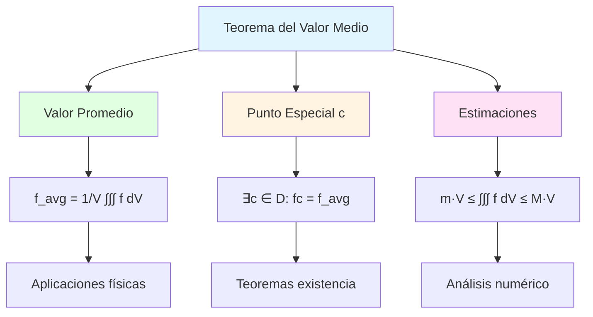

# 📊 Teorema del Valor Medio para Integrales Triples

## 🎯 Introducción

> [!info]- 💡 ¿Qué es el Teorema del Valor Medio? El **Teorema del Valor Medio para Integrales Triples** es una extensión natural del teorema clásico al espacio tridimensional. Establece que para funciones continuas sobre regiones acotadas, existe un punto donde la función toma su "valor promedio".
> 
> **Analogía práctica:** Imagina medir la temperatura en todos los puntos de una habitación:
> 
> - **Temperatura variable** → Algunos lugares más calientes que otros
> - **Temperatura promedio** → La integral triple dividida por el volumen
> - **Punto especial** → Existe al menos un punto con temperatura exactamente igual al promedio
> 
> **¿Por qué es importante?**
> 
> |Aspecto|Descripción|Ejemplo de Uso|
> |---|---|---|
> |**Estimación**|Aproximar integrales complejas|Cálculos físicos aproximados|
> |**Valor promedio**|Encontrar magnitudes promedio|Temperatura, densidad, presión media|
> |**Existencia**|Garantizar soluciones|Ecuaciones diferenciales, optimización|
> |**Acotación**|Establecer límites superiores/inferiores|Análisis de error, convergencia|
> |**Aplicaciones**|Fundamento de teoremas avanzados|Análisis funcional, física matemática|



---

## 📐 Enunciado del Teorema

### 🎲 Versión Clásica

> [!note]- 📋 Teorema del Valor Medio (Forma Principal)
> 
> Sea $f: D \subset \mathbb{R}^3 \to \mathbb{R}$ una función **continua** en una región $D$ **conexa** y **acotada**. Entonces existe al menos un punto $\mathbf{c} = (c_1, c_2, c_3) \in D$ tal que:
> 
> $$\boxed{\iiint_D f(x,y,z),dV = f(\mathbf{c}) \cdot V(D)}$$
> 
> donde $V(D)$ es el volumen de la región $D$.
> 
> **Componentes del teorema:**
> 
> ```mermaid
> graph TD
>     A[Hipótesis] --> B[f continua en D]
>     A --> C[D conexa]
>     A --> D[D acotada]
>     
>     E[Conclusión] --> F[∃c ∈ D tal que]
>     F --> G[∫∫∫_D f dV = fc · VD]
>     
>     B --> H[Sin discontinuidades]
>     C --> I[No hay 'huecos']
>     D --> J[Volumen finito]
>     
>     style A fill:#fff4e1
>     style E fill:#e1ffe1
>     style G fill:#e1f5ff
> ```
> 
> **Términos clave:**
> 
> |Concepto|Definición|Importancia|
> |---|---|---|
> |**Continuidad**|$f$ no tiene saltos ni discontinuidades|Garantiza valores intermedios|
> |**Conexa**|$D$ es de "una sola pieza"|Evita regiones separadas|
> |**Acotada**|$D$ cabe en una bola finita|Volumen finito|
> |**Punto $\mathbf{c}$**|Punto donde se alcanza el valor medio|Puede no ser único|
> 
> **Interpretación geométrica:**
> 
> El volumen bajo la superficie $z = f(x,y,z)$ sobre $D$ es igual al volumen de un "sólido" con altura constante $f(\mathbf{c})$ y base $D$.
> 
> **Forma equivalente:**
> 
> $$f(\mathbf{c}) = \frac{1}{V(D)} \iiint_D f(x,y,z),dV$$
> 
> El valor $f(\mathbf{c})$ es el **valor promedio** de $f$ sobre $D$.

### 🔢 Valor Promedio

> [!success]- 📊 Definición de Valor Promedio
> 
> El **valor promedio** (o **valor medio**) de una función $f$ sobre una región $D$ es:
> 
> $$\boxed{f_{\text{avg}} = \frac{1}{V(D)} \iiint_D f(x,y,z),dV}$$
> 
> **Interpretación física:**
> 
> ```mermaid
> flowchart LR
>     A[Función fx,y,z] --> B[Integrar sobre D]
>     B --> C[∫∫∫_D f dV]
>     C --> D[Dividir por volumen]
>     D --> E[f_avg = total/VD]
>     
>     E --> F[Valor promedio]
>     
>     style A fill:#e1f5ff
>     style C fill:#fff4e1
>     style F fill:#e1ffe1
> ```
> 
> **Analogías:**
> 
> |Contexto|Interpretación|Fórmula|
> |---|---|---|
> |**Números finitos**|Promedio de $n$ valores|$\frac{1}{n}\sum_{i=1}^n x_i$|
> |**Función 1D**|Valor medio en $[a,b]$|$\frac{1}{b-a}\int_a^b f(x),dx$|
> |**Función 2D**|Valor medio en región plana|$\frac{1}{A(R)}\iint_R f(x,y),dA$|
> |**Función 3D**|Valor medio en región sólida|$\frac{1}{V(D)}\iiint_D f(x,y,z),dV$|
> 
> **Ejemplo conceptual:**
> 
> Si $f(x,y,z)$ representa la **temperatura** en cada punto de una habitación $D$:
> 
> - $\iiint_D f(x,y,z),dV$ = "suma" de todas las temperaturas
> - $V(D)$ = volumen de la habitación
> - $f_{\text{avg}}$ = temperatura promedio de la habitación
> 
> **Propiedades del valor promedio:**
> 
> $$\min_{D} f \leq f_{\text{avg}} \leq \max_{D} f$$

---

## 🔍 Demostración del Teorema

### 📝 Prueba Detallada

> [!example]- 🧮 Demostración Paso a Paso
> 
> **Paso 1: Establecer cotas**
> 
> Como $f$ es continua en el compacto $D$, por el **Teorema del Valor Extremo**, $f$ alcanza su máximo y mínimo:
> 
> $$m = \min_{(x,y,z) \in D} f(x,y,z), \quad M = \max_{(x,y,z) \in D} f(x,y,z)$$
> 
> Por lo tanto, para todo $(x,y,z) \in D$:
> 
> $$m \leq f(x,y,z) \leq M$$
> 
> **Paso 2: Integrar las desigualdades**
> 
> Integrando sobre $D$:
> 
> $$\iiint_D m,dV \leq \iiint_D f(x,y,z),dV \leq \iiint_D M,dV$$
> 
> Como $m$ y $M$ son constantes:
> 
> $$m \cdot V(D) \leq \iiint_D f(x,y,z),dV \leq M \cdot V(D)$$
> 
> **Paso 3: Dividir por el volumen**
> 
> Asumiendo $V(D) > 0$:
> 
> $$m \leq \frac{1}{V(D)} \iiint_D f(x,y,z),dV \leq M$$
> 
> Definimos:
> 
> $$\mu = \frac{1}{V(D)} \iiint_D f(x,y,z),dV$$
> 
> Entonces: $m \leq \mu \leq M$
> 
> **Paso 4: Aplicar Teorema del Valor Intermedio**
> 
> Como $f$ es continua y $D$ es conexa, $f$ toma todos los valores entre $m$ y $M$ en $D$.
> 
> Por lo tanto, existe al menos un punto $\mathbf{c} = (c_1, c_2, c_3) \in D$ tal que:
> 
> $$f(\mathbf{c}) = \mu = \frac{1}{V(D)} \iiint_D f(x,y,z),dV$$
> 
> **Paso 5: Conclusión**
> 
> Multiplicando por $V(D)$:
> 
> $$\boxed{\iiint_D f(x,y,z),dV = f(\mathbf{c}) \cdot V(D)}$$
> 
> ```mermaid
> flowchart TD
>     A[f continua en D compacto] --> B[Existe m y M]
>     B --> C[m ≤ fx,y,z ≤ M]
>     C --> D[Integrar desigualdades]
>     D --> E[m·VD ≤ ∫∫∫ f dV ≤ M·VD]
>     E --> F[Dividir por VD]
>     F --> G[m ≤ μ ≤ M]
>     G --> H[Teorema Valor Intermedio]
>     H --> I[∃c: fc = μ]
>     I --> J[∫∫∫ f dV = fc·VD]
>     
>     style A fill:#e1f5ff
>     style I fill:#fff4e1
>     style J fill:#e1ffe1
> ```

---

## 🎯 Aplicaciones del Teorema

### 📊 Estimación de Integrales

> [!tip]- 🔢 Acotación de Valores
> 
> **Corolario (Desigualdad de acotación):**
> 
> Si $m \leq f(x,y,z) \leq M$ para todo $(x,y,z) \in D$, entonces:
> 
> $$\boxed{m \cdot V(D) \leq \iiint_D f(x,y,z),dV \leq M \cdot V(D)}$$
> 
> **Utilidad:**
> 
> |Aplicación|Descripción|Ejemplo|
> |---|---|---|
> |**Cota superior**|Acotar integrales difíciles|Análisis de convergencia|
> |**Cota inferior**|Garantizar positividad|Energía, masa siempre positivas|
> |**Estimación rápida**|Aproximar sin calcular|Verificación de órdenes de magnitud|
> |**Verificación**|Comprobar resultados numéricos|Detección de errores|
> 
> **Ejemplo 1:** Estimación simple
> 
> Estimar $\displaystyle I = \iiint_D (x^2 + y^2 + z^2),dV$ donde $D = [0,1]^3$
> 
> **Solución:**
> 
> - En $D$: $0 \leq x,y,z \leq 1$
> - Mínimo: en $(0,0,0)$: $f(0,0,0) = 0$
> - Máximo: en $(1,1,1)$: $f(1,1,1) = 3$
> - Volumen: $V(D) = 1$
> 
> Por el teorema:
> 
> $$0 \cdot 1 \leq I \leq 3 \cdot 1$$ $$\boxed{0 \leq I \leq 3}$$
> 
> (El valor exacto es $I = 1$)
> 
> **Ejemplo 2:** Acotación con funciones conocidas
> 
> Estimar $\displaystyle I = \iiint_D e^{-(x^2+y^2+z^2)},dV$ donde $D$ es la bola $x^2+y^2+z^2 \leq 1$
> 
> **Solución:**
> 
> - En $D$: $0 \leq x^2+y^2+z^2 \leq 1$
> - Por tanto: $e^{-1} \leq e^{-(x^2+y^2+z^2)} \leq e^0 = 1$
> - Volumen: $V(D) = \frac{4\pi}{3}$
> 
> $$\frac{4\pi}{3e} \leq I \leq \frac{4\pi}{3}$$ $$\boxed{1.47 \leq I \leq 4.19}$$

### 🌡️ Valor Promedio en Física

> [!success]- ⚡ Magnitudes Físicas Promedio
> 
> **Aplicaciones físicas directas:**
> 
> |Magnitud|Función $f(x,y,z)$|Valor promedio|Interpretación|
> |---|---|---|---|
> |**Temperatura**|$T(x,y,z)$|$\displaystyle T_{\text{avg}} = \frac{1}{V(D)}\iiint_D T,dV$|Temperatura media|
> |**Densidad**|$\rho(x,y,z)$|$\displaystyle \rho_{\text{avg}} = \frac{1}{V(D)}\iiint_D \rho,dV$|Densidad promedio|
> |**Presión**|$P(x,y,z)$|$\displaystyle P_{\text{avg}} = \frac{1}{V(D)}\iiint_D P,dV$|Presión media|
> |**Concentración**|$C(x,y,z)$|$\displaystyle C_{\text{avg}} = \frac{1}{V(D)}\iiint_D C,dV$|Concentración media|
> |**Campo eléctrico**|$E(x,y,z)$|$\displaystyle E_{\text{avg}} = \frac{1}{V(D)}\iiint_D E,dV$|Campo promedio|
> 
> **Ejemplo aplicado:** Temperatura promedio
> 
> La temperatura en una esfera de radio $a$ está dada por:
> 
> $$T(x,y,z) = T_0(1 - \frac{x^2+y^2+z^2}{a^2})$$
> 
> Encontrar la temperatura promedio.
> 
> **Solución usando coordenadas esféricas:**
> 
> $$\begin{align} T_{\text{avg}} &= \frac{1}{V}\iiint_D T_0\left(1 - \frac{\rho^2}{a^2}\right) \rho^2\sin\phi,d\rho,d\phi,d\theta \[0.5em] &= \frac{3}{4\pi a^3} \int_0^{2\pi} \int_0^{\pi} \int_0^a T_0\left(1 - \frac{\rho^2}{a^2}\right) \rho^2\sin\phi,d\rho,d\phi,d\theta \[0.5em] &= \frac{3T_0}{4\pi a^3} \cdot 2\pi \cdot 2 \int_0^a \left(\rho^2 - \frac{\rho^4}{a^2}\right) d\rho \[0.5em] &= \frac{3T_0}{a^3} \left[\frac{\rho^3}{3} - \frac{\rho^5}{5a^2}\right]_0^a \[0.5em] &= \frac{3T_0}{a^3} \left(\frac{a^3}{3} - \frac{a^3}{5}\right) = T_0\left(1 - \frac{3}{5}\right) \[0.5em] &= \boxed{\frac{2T_0}{5}} \end{align}$$
> 
> ```mermaid
> graph TB
>     A[Temperatura Tx,y,z] --> B[Integrar sobre esfera]
>     B --> C[∫∫∫_D T dV]
>     C --> D[Dividir por volumen]
>     D --> E[T_avg = 2T₀/5]
>     
>     E --> F[60% de temp. central]
>     
>     style A fill:#fff4e1
>     style E fill:#e1ffe1
> ```

### 🎲 Teorema de Existencia

> [!note]- ✅ Garantía de Soluciones
> 
> El teorema del valor medio garantiza la **existencia** de puntos con propiedades específicas.
> 
> **Aplicación 1: Punto de densidad promedio**
> 
> Si $\rho(x,y,z)$ es la densidad en una región $D$, existe al menos un punto $\mathbf{c}$ donde:
> 
> $$\rho(\mathbf{c}) = \frac{m}{V(D)} = \rho_{\text{avg}}$$
> 
> donde $m = \iiint_D \rho,dV$ es la masa total.
> 
> **Aplicación 2: Ecuaciones diferenciales**
> 
> En teoría de EDPs, el teorema ayuda a probar existencia de soluciones al garantizar que ciertos valores promedio se alcanzan.
> 
> **Aplicación 3: Optimización**
> 
> Para encontrar extremos condicionados, el valor promedio proporciona un "punto de partida" garantizado.

---

## 🔄 Generalizaciones y Variantes

### 📐 Teorema del Valor Medio Ponderado

> [!example]- ⚖️ Versión con Peso
> 
> **Enunciado:**
> 
> Si $f$ y $g$ son continuas en $D$, y $g(x,y,z) \geq 0$ en $D$, entonces existe $\mathbf{c} \in D$ tal que:
> 
> $$\boxed{\iiint_D f(x,y,z) g(x,y,z),dV = f(\mathbf{c}) \iiint_D g(x,y,z),dV}$$
> 
> **Interpretación:**
> 
> - $g(x,y,z)$ actúa como una **función de peso**
> - Útil cuando diferentes puntos tienen diferente "importancia"
> 
> **Aplicación:** Centro de masa
> 
> Si $g = \rho$ (densidad), entonces:
> 
> $$\iiint_D x \rho(x,y,z),dV = \bar{x} \cdot m$$
> 
> donde existe un punto donde se concentra toda la masa para efectos del momento.
> 
> **Caso especial:** Valor promedio ponderado
> 
> $$f_{\text{avg,ponderado}} = \frac{\iiint_D f \cdot g,dV}{\iiint_D g,dV}$$

### 🌐 Teorema en Otras Coordenadas

> [!tip]- 🔄 Coordenadas Cilíndricas y Esféricas
> 
> El teorema también vale en otros sistemas de coordenadas, pero el volumen se calcula con el Jacobiano correspondiente.
> 
> **Coordenadas cilíndricas:**
> 
> $$f_{\text{avg}} = \frac{1}{V(D)} \iiint_D f(r,\theta,z) , r,dr,d\theta,dz$$
> 
> **Coordenadas esféricas:**
> 
> $$f_{\text{avg}} = \frac{1}{V(D)} \iiint_D f(\rho,\phi,\theta) , \rho^2\sin\phi,d\rho,d\phi,d\theta$$
> 
> **Ejemplo:** Valor promedio en esfera
> 
> Para $f(x,y,z) = x^2+y^2+z^2 = \rho^2$ en la esfera $\rho \leq a$:
> 
> $$\begin{align} f_{\text{avg}} &= \frac{3}{4\pi a^3} \int_0^{2\pi} \int_0^{\pi} \int_0^a \rho^2 \cdot \rho^2\sin\phi,d\rho,d\phi,d\theta \[0.5em] &= \frac{3}{4\pi a^3} \cdot 2\pi \cdot 2 \cdot \frac{a^5}{5} = \frac{3a^2}{5} \end{align}$$

---

## 💡 Ejemplos Resueltos Completos

### 📌 Ejemplo 1: Valor Promedio en Cubo

> [!example]- 📦 Función Polinomial
> 
> **Problema:** Encontrar el valor promedio de $f(x,y,z) = x^2 + y^2 + z^2$ en el cubo $D = [0,2] \times [0,2] \times [0,2]$.
> 
> **Solución:**
> 
> **Paso 1:** Calcular el volumen
> 
> $$V(D) = 2 \times 2 \times 2 = 8$$
> 
> **Paso 2:** Calcular la integral
> 
> $$\begin{align} \iiint_D (x^2+y^2+z^2),dV &= \int_0^2 \int_0^2 \int_0^2 (x^2+y^2+z^2),dx,dy,dz \[0.5em] &= \int_0^2 \int_0^2 \left[\frac{x^3}{3} + x(y^2+z^2)\right]_0^2 dy,dz \[0.5em] &= \int_0^2 \int_0^2 \left(\frac{8}{3} + 2y^2 + 2z^2\right) dy,dz \[0.5em] &= \int_0^2 \left[\frac{8y}{3} + \frac{2y^3}{3} + 2yz^2\right]_0^2 dz \[0.5em] &= \int_0^2 \left(\frac{16}{3} + \frac{16}{3} + 4z^2\right) dz \[0.5em] &= \int_0^2 \left(\frac{32}{3} + 4z^2\right) dz \[0.5em] &= \left[\frac{32z}{3} + \frac{4z^3}{3}\right]_0^2 \[0.5em] &= \frac{64}{3} + \frac{32}{3} = \frac{96}{3} = 32 \end{align}$$
> 
> **Paso 3:** Calcular valor promedio
> 
> $$f_{\text{avg}} = \frac{32}{8} = \boxed{4}$$
> 
> **Verificación:** Por el teorema del valor medio, existe $\mathbf{c} \in D$ tal que $f(\mathbf{c}) = 4$.
> 
> Por ejemplo: $\mathbf{c} = \left(\sqrt{\frac{4}{3}}, \sqrt{\frac{4}{3}}, \sqrt{\frac{4}{3}}\right) \approx (1.15, 1.15, 1.15)$

### 📌 Ejemplo 2: Estimación de Integral

> [!example]- 🎯 Acotación sin Calcular
> 
> **Problema:** Estimar $\displaystyle I = \iiint_D \frac{1}{1+x^2+y^2+z^2},dV$ donde $D = [-1,1]^3$ sin calcular la integral.
> 
> **Solución:**
> 
> **Paso 1:** Encontrar cotas de la función
> 
> En $D$: $-1 \leq x,y,z \leq 1$
> 
> - Mínimo de $x^2+y^2+z^2$: 0 (en el origen)
> - Máximo de $x^2+y^2+z^2$: 3 (en los vértices como $(1,1,1)$)
> 
> Por tanto:
> 
> $$\frac{1}{1+3} \leq f(x,y,z) \leq \frac{1}{1+0} = 1$$ $$\frac{1}{4} \leq f(x,y,z) \leq 1$$
> 
> **Paso 2:** Calcular volumen
> 
> $$V(D) = 2 \times 2 \times 2 = 8$$
> 
> **Paso 3:** Aplicar acotación
> 
> $$\frac{1}{4} \cdot 8 \leq I \leq 1 \cdot 8$$ $$\boxed{2 \leq I \leq 8}$$
> 
> **Mejora de la estimación:**
> 
> Notando que $f$ es más cercana a 1 cerca del origen (donde hay más volumen), podemos estimar que $I \approx 6$.

### 📌 Ejemplo 3: Aplicación Física

> [!example]- 🌡️ Temperatura Promedio
> 
> **Problema:** En una esfera sólida de radio $R$, la temperatura está dada por:
> 
> $$T(x,y,z) = 100 - \frac{100(x^2+y^2+z^2)}{R^2}$$
> 
> Encontrar: (a) La temperatura promedio, (b) Un punto donde se alcanza.
> 
> **Solución:**
> 
> **(a) Temperatura promedio**
> 
> Usando coordenadas esféricas: $x^2+y^2+z^2 = \rho^2$
> 
> $$T(\rho) = 100\left(1 - \frac{\rho^2}{R^2}\right)$$
> 
> $$\begin{align} T_{\text{avg}} &= \frac{1}{V} \iiint_D T(\rho),dV \[0.5em] &= \frac{3}{4\pi R^3} \int_0^{2\pi} \int_0^{\pi} \int_0^R 100\left(1-\frac{\rho^2}{R^2}\right) \rho^2\sin\phi,d\rho,d\phi,d\theta \[0.5em] &= \frac{300}{\cancel{4\pi} R^3} \cdot \cancel{4\pi} \int_0^R \left(\rho^2 - \frac{\rho^4}{R^2}\right) d\rho \[0.5em] &= \frac{300}{R^3} \left[\frac{\rho^3}{3} - \frac{\rho^5}{5R^2}\right]_0^R \[0.5em] &= \frac{300}{R^3} \left(\frac{R^3}{3} - \frac{R^3}{5}\right) \[0.5em] &= 300 \left(\frac{1}{3} - \frac{1}{5}\right) = 300 \cdot \frac{2}{15} \[0.5em] &= \boxed{40°C} \end{align}$$
> 
> **(b) Punto donde se alcanza**
> 
> Necesitamos $\rho$ tal que:
> 
> $$100\left(1 - \frac{\rho^2}{R^2}\right) = 40$$ $$1 - \frac{\rho^2}{R^2} = 0.4$$ $$\frac{\rho^2}{R^2} = 0.6$$ $$\rho = R\sqrt{0.6} \approx 0.775R$$
> 
> **Respuesta:** La temperatura promedio es 40°C, y se alcanza en todos los puntos de la esfera de radio $\rho = R\sqrt{0.6}$.

---

## 🎯 Ejercicios Propuestos

> [!question]- 💪 Práctica ProgresivaNivel Básico
> **1.** Calcular el valor promedio de $f(x,y,z) = xyz$ en $D = [0,1] \times [0,2] \times [0,3]$
> 
> **2.** Encontrar cotas para $\displaystyle \iiint_D \sin(x+y+z),dV$ donde $D = [0,\pi/4]^3$
> 
> **3.** Si $f(x,y,z) = 5$ en todo punto de $D$, y $V(D) = 10$, ¿cuánto vale $\iiint_D f,dV$?
> 
> ### Nivel Intermedio
> 
> **4.** Demostrar que el valor promedio de $f(x,y,z) = z$ en el cilindro $x^2+y^2 \leq a^2$, $0 \leq z \leq h$ es $h/2$
> 
> **5.** Estimar $\displaystyle I = \iiint_D e^{xyz},dV$ donde $D = [0,1]^3$ usando el teorema del valor medio
> 
> **6.** Encontrar el valor promedio de $f(x,y,z) = \sqrt{x^2+y^2+z^2}$ en la bola $x^2+y^2+z^2 \leq 1$
> 
> ### Nivel Avanzado
> 
> **7.** Probar que si $f \geq 0$ y continua en $D$, y $\iiint_D f,dV = 0$, entonces $f \equiv 0$ en $D$
> 
> **8.** La densidad en una región $D$ es $\rho(x,y,z) = k(x^2+y^2+z^2)$. Si la masa total es $M$ y el volumen es $V$, expresar $k$ en términos de $M$, $V$ y el valor promedio de $x^2+y^2+z^2$
> 
> **9.** Usar el teorema del valor medio para probar que si $f$ es continua en $D$ y $\iiint_D f,dV = 0$, entonces existe $\mathbf{c} \in D$ tal que $f(\mathbf{c}) = 0$

---

## 📊 Comparación con Casos 1D y 2D

> [!note]- 🔍 Unificación de Conceptos
> 
> |Dimensión|Dominio|Fórmula del valor medio|Punto especial|
> |---|---|---|---|
> |**1D**|Intervalo $[a,b]$|$\displaystyle f_{\text{avg}} = \frac{1}{b-a}\int_a^b f(x),dx$|$\exists c \in [a,b]: f(c) = f_{\text{avg}}$|
> |**2D**|Región $R$ en plano|$\displaystyle f_{\text{avg}} = \frac{1}{A(R)}\iint_R f(x,y),dA$|$\exists (c_1,c_2) \in R: f(c_1,c_2) = f_{\text{avg}}$|
> |**3D**|Región $D$ en espacio|$\displaystyle f_{\text{avg}} = \frac{1}{V(D)}\iiint_D f(x,y,z),dV$|$\exists (c_1,c_2,c_3) \in D: f(c_1,c_2,c_3) = f_{\text{avg}}$|
> 
> **Patrón general:**
> 
> ```mermaid
> graph LR
>     A[Integral de f] --> B[Dividir por medida]
>     B --> C[Valor promedio]
>     C --> D[Existe punto<br/>que lo alcanza]
>     
>     A -.-> E[∫ f dx, ∫∫ f dA, ∫∫∫ f dV]
>     B -.-> F[longitud, área, volumen]
>     
>     style C fill:#e1ffe1
>     style D fill:#fff4e1
> ```
> 
> **Ejemplo comparativo:**
> 
> Para $f(x) = x^2$:
> 
> - **1D** en $[0,1]$: $\displaystyle f_{\text{avg}} = \int_0^1 x^2,dx = \frac{1}{3}$, alcanzado en $c = \frac{1}{\sqrt{3}}$
>     
> - **2D** en $[0,1]^2$: $\displaystyle f_{\text{avg}} = \iint_{[0,1]^2} x^2,dA = \frac{1}{3}$, alcanzado en $(c,y)$ con $c = \frac{1}{\sqrt{3}}$, cualquier $y \in [0,1]$
>     
> - **3D** en $[0,1]^3$: $\displaystyle f_{\text{avg}} = \iiint_{[0,1]^3} x^2,dV = \frac{1}{3}$, alcanzado en $(c,y,z)$ con $c = \frac{1}{\sqrt{3}}$, cualesquiera $y,z \in [0,1]$
>     

---

## 📚 Resumen y Fórmulas Clave

> [!note]- 📖 Compendio Rápido
> 
> ### Teorema Principal
> 
> $$\boxed{\iiint_D f(x,y,z),dV = f(\mathbf{c}) \cdot V(D)}$$
> 
> para algún $\mathbf{c} \in D$, si $f$ es continua y $D$ es conexa y acotada.
> 
> ### Valor Promedio
> 
> $$\boxed{f_{\text{avg}} = \frac{1}{V(D)} \iiint_D f(x,y,z),dV}$$
> 
> ### Desigualdad de Acotación
> 
> Si $m \leq f \leq M$ en $D$:
> 
> $$\boxed{m \cdot V(D) \leq \iiint_D f,dV \leq M \cdot V(D)}$$
> 
> ### Versión Ponderada
> 
> Con $g \geq 0$ continua:
> 
> $$\boxed{\iiint_D fg,dV = f(\mathbf{c}) \iiint_D g,dV}$$
> 
> ### Aplicaciones Físicas
> 
> |Magnitud|Fórmula|
> |---|---|
> |Temperatura promedio|$T_{\text{avg}} = \frac{1}{V}\iiint_D T,dV$|
> |Densidad promedio|$\rho_{\text{avg}} = \frac{m}{V} = \frac{1}{V}\iiint_D \rho,dV$|
> |Presión promedio|$P_{\text{avg}} = \frac{1}{V}\iiint_D P,dV$|

---

## 🔗 Conexión con Próximos Temas

> [!quote]- 🌟 Progresión del Aprendizaje
> 
> ```mermaid
> mindmap
>   root((Teorema<br/>Valor Medio))
>     Fundamentos
>       Continuidad
>       Conexidad
>       Valor promedio
>     Aplicaciones
>       Estimación integrales
>       Física matemática
>       Existencia soluciones
>     Generalizaciones
>       Versión ponderada
>       Otros sistemas coord.
>       Dimensiones superiores
>     Próximos Temas
>       Teorema Divergencia
>       Teorema Stokes
>       Ecuaciones diferenciales
>       Análisis funcional
> ```
> 
> **Roadmap:**
> 
> |Nivel|Tema|Conexión|
> |---|---|---|
> |**Actual**|Teorema del valor medio|Propiedad fundamental de integrales|
> |**Siguiente**|Teorema de la divergencia|Relaciona integrales triples y de superficie|
> |**Avanzado**|Teorema de Stokes|Generalización de teoremas fundamentales|
> |**Aplicado**|EDPs|Ecuaciones en derivadas parciales|
> |**Abstracto**|Análisis funcional|Espacios de funciones|

---

**Tags:** #calculo-vectorial #teorema-valor-medio #integrales-triples #valor-promedio #estimacion #aplicaciones-fisicas #continuidad #teoremas-existencia #analisis-matematico