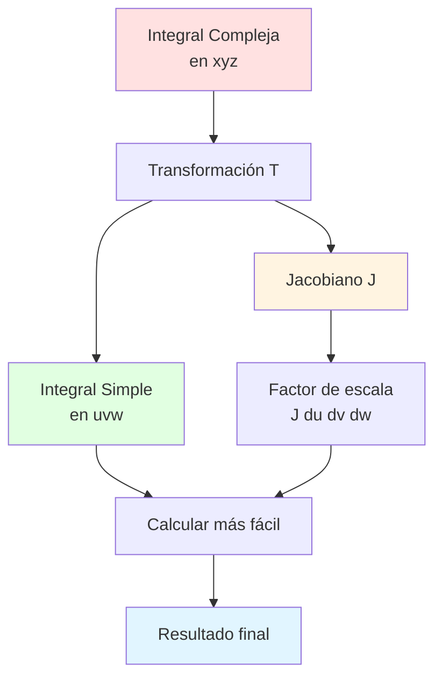

# 🔄 Teorema de Cambio de Variable en R³

## 🎯 Introducción

> [!info]- 💡 ¿Qué es el Cambio de Variable? El **Teorema de Cambio de Variable** (o **Teorema de Sustitución**) es una herramienta fundamental que permite transformar integrales triples complejas en otras más simples mediante un cambio de coordenadas. Es la extensión tridimensional del cambio de variable en integrales simples.
> 
> **Analogía práctica:** Imagina describir la ubicación de un punto:
> 
> - **Sistema cartesiano** → Usar calles perpendiculares (x, y, z)
> - **Sistema cilíndrico** → Usar distancia radial, ángulo y altura (r, θ, z)
> - **Sistema esférico** → Usar radio, latitud y longitud (ρ, φ, θ)
> 
> Cada sistema es mejor para ciertos problemas, igual que usar kilómetros vs millas.
> 
> **¿Por qué es importante?**
> 
> |Aspecto|Descripción|Ejemplo de Uso|
> |---|---|---|
> |**Simplificación**|Convertir límites complejos en simples|Esfera → límites constantes|
> |**Simetría**|Aprovechar simetrías naturales|Cilindros, esferas, conos|
> |**Integrabilidad**|Hacer integrales calculables|Funciones que dependen de $r$ o $\rho$|
> |**Generalidad**|Aplicar a cualquier transformación|Transformaciones lineales, afines|
> |**Aplicaciones**|Problemas físicos reales|Campos electromagnéticos, fluidos|



---

## 📐 Enunciado del Teorema

### 🎲 Versión General

> [!note]- 📋 Teorema de Cambio de Variable
> 
> Sea $T: D' \subset \mathbb{R}^3 \to D \subset \mathbb{R}^3$ una transformación **uno a uno** y **continuamente diferenciable** definida por:
> 
> $$T(u,v,w) = (x(u,v,w), y(u,v,w), z(u,v,w))$$
> 
> Si $f$ es continua en $D$, entonces:
> 
> $$\boxed{\iiint_D f(x,y,z),dx,dy,dz = \iiint_{D'} f(x(u,v,w), y(u,v,w), z(u,v,w)) \left|J\right| ,du,dv,dw}$$
> 
> donde $J$ es el **Jacobiano** de la transformación:
> 
> $$J = \frac{\partial(x,y,z)}{\partial(u,v,w)} = \begin{vmatrix} \frac{\partial x}{\partial u} & \frac{\partial x}{\partial v} & \frac{\partial x}{\partial w} \[0.3em] \frac{\partial y}{\partial u} & \frac{\partial y}{\partial v} & \frac{\partial y}{\partial w} \[0.3em] \frac{\partial z}{\partial u} & \frac{\partial z}{\partial v} & \frac{\partial z}{\partial w} \end{vmatrix}$$
> 
> **Componentes del teorema:**
> 
> ```mermaid
> graph TD
>     A[Hipótesis] --> B[T: D' → D uno a uno]
>     A --> C[T continuamente diferenciable]
>     A --> D[f continua en D]
>     
>     E[Transformación] --> F[x = xu,v,w]
>     E --> G[y = yu,v,w]
>     E --> H[z = zu,v,w]
>     
>     I[Jacobiano] --> J[J = det∂x,y,z/∂u,v,w]
>     
>     K[Fórmula] --> L[∫∫∫_D f dx dy dz =<br/>∫∫∫_D' fT · J du dv dw]
>     
>     style A fill:#fff4e1
>     style I fill:#ffe1e1
>     style L fill:#e1ffe1
> ```
> 
> **Términos clave:**
> 
> |Concepto|Definición|Importancia|
> |---|---|---|
> |**Uno a uno**|Cada punto de $D$ viene de exactamente un punto de $D'$|Evita contar regiones múltiples veces|
> |**Cont. diferenciable**|Derivadas parciales continuas|Garantiza que $J$ existe y es continuo|
> |**Jacobiano $J$**|Determinante de la matriz de derivadas|Factor de escala del volumen|
> |**$\|J\|$**|Valor absoluto del Jacobiano|Siempre positivo (orientación)|

### 🔍 El Jacobiano: Factor de Escala

> [!success]- 📊 Interpretación Geométrica
> 
> El **Jacobiano** mide cómo la transformación $T$ **escala volúmenes**.
> 
> **Interpretación:**
> 
> $$dV = dx,dy,dz = |J| ,du,dv,dw$$
> 
> - Si $|J| > 1$ → La transformación **expande** volúmenes
> - Si $|J| < 1$ → La transformación **contrae** volúmenes
> - Si $|J| = 1$ → La transformación **preserva** volúmenes
> 
> ```mermaid
> graph LR
>     A[Cubo infinitesimal<br/>en uvw] --> B[Transformación T]
>     B --> C[Paralelepípedo<br/>en xyz]
>     
>     A -.-> D[Volumen: du dv dw]
>     C -.-> E[Volumen: J du dv dw]
>     
>     B -.-> F[Factor de escala: J]
>     
>     style A fill:#fff4e1
>     style C fill:#e1ffe1
>     style F fill:#ffe1e1
> ```
> 
> **Analogía física:**
> 
> Imagina un cubo de plastilina:
> 
> - **Volumen original:** $\Delta u \cdot \Delta v \cdot \Delta w$
> - **Después de estirar/comprimir:** $|J| \cdot \Delta u \cdot \Delta v \cdot \Delta w$
> - El Jacobiano es el **factor de deformación**
> 
> **Cálculo del Jacobiano:**
> 
> $$J = \begin{vmatrix} x_u & x_v & x_w \ y_u & y_v & y_w \ z_u & z_v & z_w \end{vmatrix}$$
> 
> donde usamos la notación $x_u = \frac{\partial x}{\partial u}$, etc.

---

## 🧮 Cálculo del Jacobiano

### 📝 Método del Determinante

> [!example]- 🔢 Desarrollo del Determinante
> 
> **Desarrollo por la primera fila:**
> 
> $$\begin{align} J &= \begin{vmatrix} x_u & x_v & x_w \ y_u & y_v & y_w \ z_u & z_v & z_w \end{vmatrix} \[1em] &= x_u \begin{vmatrix} y_v & y_w \ z_v & z_w \end{vmatrix}
> 
> - x_v \begin{vmatrix} y_u & y_w \ z_u & z_w \end{vmatrix}
> 
> - x_w \begin{vmatrix} y_u & y_v \ z_u & z_v \end{vmatrix} \[1em] &= x_u(y_v z_w - y_w z_v) - x_v(y_u z_w - y_w z_u) + x_w(y_u z_v - y_v z_u) \end{align}$$
> 
> **Ejemplo 1:** Transformación lineal
> 
> $$\begin{cases} x = 2u + v \ y = u - w \ z = 3w \end{cases}$$
> 
> **Matriz Jacobiana:**
> 
> $$\frac{\partial(x,y,z)}{\partial(u,v,w)} = \begin{pmatrix} 2 & 1 & 0 \ 1 & 0 & -1 \ 0 & 0 & 3 \end{pmatrix}$$
> 
> **Jacobiano:**
> 
> $$\begin{align} J &= \begin{vmatrix} 2 & 1 & 0 \ 1 & 0 & -1 \ 0 & 0 & 3 \end{vmatrix} \[0.5em] &= 2 \begin{vmatrix} 0 & -1 \ 0 & 3 \end{vmatrix}
> 
> - 1 \begin{vmatrix} 1 & -1 \ 0 & 3 \end{vmatrix}
> 
> - 0 \[0.5em] &= 2(0) - 1(3) = -3 \end{align}$$
> 
> Por tanto: $|J| = 3$

### 🎯 Propiedades del Jacobiano

> [!tip]- ⚡ Propiedades Importantes
> 
> **1. Regla de la cadena para Jacobianos**
> 
> Si $T_1: (u,v,w) \to (x,y,z)$ y $T_2: (r,s,t) \to (u,v,w)$:
> 
> $$\frac{\partial(x,y,z)}{\partial(r,s,t)} = \frac{\partial(x,y,z)}{\partial(u,v,w)} \cdot \frac{\partial(u,v,w)}{\partial(r,s,t)}$$
> 
> **2. Jacobiano de la transformación inversa**
> 
> $$\frac{\partial(u,v,w)}{\partial(x,y,z)} = \frac{1}{J} = \left[\frac{\partial(x,y,z)}{\partial(u,v,w)}\right]^{-1}$$
> 
> **3. Transformaciones que preservan volumen**
> 
> Si $|J| = 1$ en todo punto, la transformación es **isométrica** (preserva volúmenes).
> 
> **4. Jacobiano de transformaciones ortogonales**
> 
> Para rotaciones y reflexiones: $|J| = 1$
> 
> ```mermaid
> graph TD
>     A[Propiedades del Jacobiano] --> B[Regla de la cadena]
>     A --> C[Inversa]
>     A --> D[J = 1 preserva volumen]
>     
>     B --> E[J_composición = J₁ · J₂]
>     C --> F[J_inversa = 1/J]
>     D --> G[Rotaciones, traslaciones]
>     
>     style A fill:#e1f5ff
>     style B fill:#e1ffe1
>     style C fill:#fff4e1
>     style D fill:#ffe1f5
> ```

---

## 🌐 Coordenadas Cilíndricas

### 📏 Definición y Transformación

> [!example]- 🔄 Sistema Cilíndrico
> 
> **Transformación:**
> 
> $$\begin{cases} x = r\cos\theta \ y = r\sin\theta \ z = z \end{cases}$$
> 
> **Variables:**
> 
> - $r \geq 0$ : distancia al eje $z$ (radio)
> - $0 \leq \theta < 2\pi$ : ángulo en el plano $xy$ (ángulo azimutal)
> - $-\infty < z < \infty$ : altura
> 
> **Inversa:**
> 
> $$\begin{cases} r = \sqrt{x^2 + y^2} \ \theta = \arctan\left(\frac{y}{x}\right) \ z = z \end{cases}$$
> 
> ```mermaid
> graph TB
>     A[Punto en espacio] --> B[Coordenadas<br/>Cartesianas]
>     A --> C[Coordenadas<br/>Cilíndricas]
>     
>     B --> D[x, y, z]
>     C --> E[r, θ, z]
>     
>     D --> F[x² + y² + z²]
>     E --> G[r² + z²]
>     
>     style B fill:#ffe1e1
>     style C fill:#e1ffe1
> ```
> 
> **Visualización:**
> 
> |Componente|Significado geométrico|Rango típico|
> |---|---|---|
> |$r$|Distancia al eje $z$|$[0, \infty)$|
> |$\theta$|Ángulo desde eje $x$ positivo|$[0, 2\pi)$|
> |$z$|Altura sobre plano $xy$|$(-\infty, \infty)$|

### 🧮 Jacobiano Cilíndrico

> [!success]- 📐 Cálculo del Jacobiano
> 
> **Derivadas parciales:**
> 
> $$\begin{align} \frac{\partial x}{\partial r} &= \cos\theta, \quad \frac{\partial x}{\partial \theta} = -r\sin\theta, \quad \frac{\partial x}{\partial z} = 0 \[0.3em] \frac{\partial y}{\partial r} &= \sin\theta, \quad \frac{\partial y}{\partial \theta} = r\cos\theta, \quad \frac{\partial y}{\partial z} = 0 \[0.3em] \frac{\partial z}{\partial r} &= 0, \quad \frac{\partial z}{\partial \theta} = 0, \quad \frac{\partial z}{\partial z} = 1 \end{align}$$
> 
> **Matriz Jacobiana:**
> 
> $$\frac{\partial(x,y,z)}{\partial(r,\theta,z)} = \begin{pmatrix} \cos\theta & -r\sin\theta & 0 \ \sin\theta & r\cos\theta & 0 \ 0 & 0 & 1 \end{pmatrix}$$
> 
> **Determinante:**
> 
> $$\begin{align} J &= \begin{vmatrix} \cos\theta & -r\sin\theta & 0 \ \sin\theta & r\cos\theta & 0 \ 0 & 0 & 1 \end{vmatrix} \[0.5em] &= 1 \cdot \begin{vmatrix} \cos\theta & -r\sin\theta \ \sin\theta & r\cos\theta \end{vmatrix} \[0.5em] &= r\cos^2\theta + r\sin^2\theta \[0.5em] &= r(\cos^2\theta + \sin^2\theta) = r \end{align}$$
> 
> **Elemento de volumen:**
> 
> $$\boxed{dV = dx,dy,dz = r,dr,d\theta,dz}$$
> 
> **Interpretación:** El factor $r$ refleja que al alejarse del eje $z$, un pequeño cambio en $\theta$ produce un cambio mayor en la posición.

### 🎯 Cuándo Usar Cilíndricas

> [!tip]- 📋 Criterios de Selección
> 
> **Usar coordenadas cilíndricas cuando:**
> 
> |Situación|Ejemplo|Ventaja|
> |---|---|---|
> |**Simetría respecto al eje z**|Cilindros, conos|Límites constantes en $r$|
> |**Ecuaciones con $x^2+y^2$**|$x^2+y^2 \leq a^2$|Se convierte en $r \leq a$|
> |**Altura independiente**|Prisma cilíndrico|$z$ se separa fácilmente|
> |**Rotación alrededor del eje z**|Torno, sólidos de revolución|$\theta$ integra fácilmente|
> 
> **Regiones típicas:**
> 
> ```mermaid
> graph TB
>     A[Regiones Cilíndricas] --> B[Cilindro recto]
>     A --> C[Cono]
>     A --> D[Paraboloide circular]
>     A --> E[Toro parcial]
>     
>     B --> F[x² + y² ≤ a²]
>     C --> G[z² = x² + y²]
>     D --> H[z = x² + y²]
>     
>     style A fill:#e1f5ff
>     style B fill:#e1ffe1
>     style C fill:#fff4e1
>     style D fill:#ffe1f5
> ```
> 
> **Ejemplo de transformación:**
> 
> **Región:** Cilindro $x^2+y^2 \leq 4$, $0 \leq z \leq 3$
> 
> - **Cartesianas:** $\int_{-2}^{2} \int_{-\sqrt{4-x^2}}^{\sqrt{4-x^2}} \int_0^3 f(x,y,z),dz,dy,dx$ ❌ Complejo
>     
> - **Cilíndricas:** $\int_0^{2\pi} \int_0^2 \int_0^3 f(r\cos\theta, r\sin\theta, z) \cdot r,dz,dr,d\theta$ ✅ Simple
>     

---

## 🔮 Coordenadas Esféricas

### 🌍 Definición y Transformación

> [!example]- 🌐 Sistema Esférico
> 
> **Transformación:**
> 
> $$\begin{cases} x = \rho\sin\phi\cos\theta \ y = \rho\sin\phi\sin\theta \ z = \rho\cos\phi \end{cases}$$
> 
> **Variables:**
> 
> - $\rho \geq 0$ : distancia al origen (radio)
> - $0 \leq \phi \leq \pi$ : ángulo desde eje $z$ positivo (ángulo polar/colatitud)
> - $0 \leq \theta < 2\pi$ : ángulo en plano $xy$ (ángulo azimutal/longitud)
> 
> **Inversa:**
> 
> $$\begin{cases} \rho = \sqrt{x^2 + y^2 + z^2} \ \phi = \arccos\left(\frac{z}{\sqrt{x^2+y^2+z^2}}\right) \ \theta = \arctan\left(\frac{y}{x}\right) \end{cases}$$
> 
> ```mermaid
> graph TB
>     A[Punto P en espacio] --> B[ρ: radio]
>     A --> C[φ: ángulo polar]
>     A --> D[θ: ángulo azimutal]
>     
>     B --> E[Distancia al origen<br/>0 ≤ ρ < ∞]
>     C --> F[Desde eje z<br/>0 ≤ φ ≤ π]
>     D --> G[En plano xy<br/>0 ≤ θ < 2π]
>     
>     E --> H[ρ = 0: origen]
>     F --> I[φ = 0: eje z+<br/>φ = π: eje z-]
>     G --> J[θ = 0: eje x+]
>     
>     style A fill:#e1f5ff
>     style B fill:#e1ffe1
>     style C fill:#fff4e1
>     style D fill:#ffe1f5
> ```
> 
> **Relaciones importantes:**
> 
> $$\begin{align} x^2 + y^2 + z^2 &= \rho^2 \ x^2 + y^2 &= \rho^2\sin^2\phi \ z &= \rho\cos\phi \end{align}$$

### 🧮 Jacobiano Esférico

> [!success]- 📐 Cálculo Detallado
> 
> **Derivadas parciales:**
> 
> $$\begin{align} \frac{\partial x}{\partial \rho} &= \sin\phi\cos\theta, \quad \frac{\partial x}{\partial \phi} = \rho\cos\phi\cos\theta, \quad \frac{\partial x}{\partial \theta} = -\rho\sin\phi\sin\theta \[0.3em] \frac{\partial y}{\partial \rho} &= \sin\phi\sin\theta, \quad \frac{\partial y}{\partial \phi} = \rho\cos\phi\sin\theta, \quad \frac{\partial y}{\partial \theta} = \rho\sin\phi\cos\theta \[0.3em] \frac{\partial z}{\partial \rho} &= \cos\phi, \quad \frac{\partial z}{\partial \phi} = -\rho\sin\phi, \quad \frac{\partial z}{\partial \theta} = 0 \end{align}$$
> 
> **Matriz Jacobiana:**
> 
> $$\frac{\partial(x,y,z)}{\partial(\rho,\phi,\theta)} = \begin{pmatrix} \sin\phi\cos\theta & \rho\cos\phi\cos\theta & -\rho\sin\phi\sin\theta \ \sin\phi\sin\theta & \rho\cos\phi\sin\theta & \rho\sin\phi\cos\theta \ \cos\phi & -\rho\sin\phi & 0 \end{pmatrix}$$
> 
> **Determinante (desarrollando por tercera columna):**
> 
> $$\begin{align} J &= -\rho\sin\phi\sin\theta \begin{vmatrix} \sin\phi\sin\theta & \rho\cos\phi\sin\theta \ \cos\phi & -\rho\sin\phi \end{vmatrix} \ &\quad + \rho\sin\phi\cos\theta \begin{vmatrix} \sin\phi\cos\theta & \rho\cos\phi\cos\theta \ \cos\phi & -\rho\sin\phi \end{vmatrix} \[0.5em] &= -\rho\sin\phi\sin\theta(-\rho\sin^2\phi\sin\theta - \rho\cos^2\phi\sin\theta) \ &\quad + \rho\sin\phi\cos\theta(-\rho\sin^2\phi\cos\theta - \rho\cos^2\phi\cos\theta) \[0.5em] &= \rho^2\sin\phi\sin^2\theta(\sin^2\phi + \cos^2\phi) + \rho^2\sin\phi\cos^2\theta(\sin^2\phi + \cos^2\phi) \[0.5em] &= \rho^2\sin\phi(\sin^2\theta + \cos^2\theta) \[0.5em] &= \rho^2\sin\phi \end{align}$$
> 
> **Elemento de volumen:**
> 
> $$\boxed{dV = dx,dy,dz = \rho^2\sin\phi,d\rho,d\phi,d\theta}$$
> 
> **Interpretación geométrica:**
> 
> - $\rho^2$ : área de la superficie de la esfera crece con el cuadrado del radio
> - $\sin\phi$ : factor de corrección por latitud (máximo en ecuador, cero en polos)

### 🎯 Cuándo Usar Esféricas

> [!tip]- 📋 Criterios de Selección
> 
> **Usar coordenadas esféricas cuando:**
> 
> |Situación|Ejemplo|Ventaja|
> |---|---|---|
> |**Simetría esférica**|Esferas, conos|Límites constantes en $\rho$|
> |**Ecuaciones con $x^2+y^2+z^2$**|$x^2+y^2+z^2 \leq a^2$|Se convierte en $\rho \leq a$|
> |**Conos simétricos**|$z^2 = x^2 + y^2$|$\phi$ constante|
> |**Distancia al origen**|Campos centrales, gravitación|Separación radial natural|
> 
> **Regiones típicas:**
> 
> ```mermaid
> graph TB
>     A[Regiones Esféricas] --> B[Esfera]
>     A --> C[Cono]
>     A --> D[Hemisferio]
>     A --> E[Cuña esférica]
>     
>     B --> F[x² + y² + z² ≤ a²]
>     C --> G[φ = constante]
>     D --> H[0 ≤ φ ≤ π/2]
>     E --> I[θ₁ ≤ θ ≤ θ₂]
>     
>     style A fill:#e1f5ff
>     style B fill:#e1ffe1
>     style C fill:#fff4e1
>     style D fill:#ffe1f5
> ```

---

## 📊 Tabla Comparativa de Sistemas

> [!note]- 🔍 Comparación Completa
> 
> |Sistema|Transformación|Jacobiano|Elemento dV|Mejor para|
> |---|---|---|---|---|
> |**Cartesiano**|$x, y, z$|1|$dx,dy,dz$|Regiones rectangulares|
> |**Cilíndrico**|$r\cos\theta, r\sin\theta, z$|$r$|$r,dr,d\theta,dz$|Simetría en eje z|
> |**Esférico**|$\rho\sin\phi\cos\theta, \ldots$|$\rho^2\sin\phi$|$\rho^2\sin\phi,d\rho,d\phi,d\theta$|Simetría radial|
> 
> **Relaciones entre sistemas:**
> 
> ```mermaid
> graph TD
>     A[Cartesianas<br/>x, y, z] --> B[Cilíndricas<br/>r, θ, z]
>     A --> C[Esféricas<br/>ρ, φ, θ]
>     B --> C
>     
>     B -.-> D[r² = x² + y²<br/>z = z]
>     C -.-> E[ρ² = x² + y² + z²]
>     B -.-> F[ρ² = r² + z²<br/>tan φ = r/z]
>     
>     style A fill:#e1f5ff
>     style B fill:#fff4e1
>     style C fill:#f5e1ff
> ```
> 
> **Guía de decisión:**
> 
> ```mermaid
> flowchart TD
>     A[¿Qué sistema usar?] --> B{¿Ecuación tiene<br/>x² + y² + z²?}
>     B -->|Sí| C[Esféricas]
>     B -->|No| D{¿Ecuación tiene<br/>x² + y²?}
>     
>     D -->|Sí| E[Cilíndricas]
>     D -->|No| F{¿Simetría<br/>especial?}
>     
>     F -->|Eje z| E
>     F -->|Radial| C
>     F -->|No| G[Cartesianas]
>     
>     style C fill:#f5e1ff
>     style E fill:#fff4e1
>     style G fill:#e1f5ff
> ```

---

## 💡 Ejemplos Resueltos Completos

### 📌 Ejemplo 1: Cilindro con Cilíndricas

> [!example]- 🔧 Volumen de Cilindro Inclinado
> 
> **Problema:** Calcular $\displaystyle \iiint_D z,dV$ donde $D$ es la región acotada por el cilindro $x^2 + y^2 = 4$, el plano $z = 0$ y el plano $z = x + 2$.
> 
> **Solución:**
> 
> **Paso1:** Identificar el sistema apropiado
> La ecuación $x^2 + y^2 = 4$ sugiere **coordenadas cilíndricas**.
> 
> **Paso 2:** Transformar las ecuaciones
> 
> - Cilindro: $r^2 = 4 \Rightarrow r = 2$
> - Plano inferior: $z = 0$
> - Plano superior: $z = x + 2 = r\cos\theta + 2$
> 
> **Paso 3:** Establecer límites
> 
> $$\begin{cases} 0 \leq r \leq 2 \ 0 \leq \theta \leq 2\pi \ 0 \leq z \leq r\cos\theta + 2 \end{cases}$$
> 
> **Paso 4:** Transformar el integrando
> 
> $$f(x,y,z) = z \quad \Rightarrow \quad f(r,\theta,z) = z$$
> 
> **Paso 5:** Plantear y calcular la integral
> 
> $$\begin{align} I &= \int_0^{2\pi} \int_0^2 \int_0^{r\cos\theta + 2} z \cdot r,dz,dr,d\theta \[0.5em] &= \int_0^{2\pi} \int_0^2 r \left[\frac{z^2}{2}\right]_0^{r\cos\theta + 2} dr,d\theta \[0.5em] &= \int_0^{2\pi} \int_0^2 \frac{r(r\cos\theta + 2)^2}{2},dr,d\theta \[0.5em] &= \frac{1}{2}\int_0^{2\pi} \int_0^2 r(r^2\cos^2\theta + 4r\cos\theta + 4),dr,d\theta \[0.5em] &= \frac{1}{2}\int_0^{2\pi} \int_0^2 (r^3\cos^2\theta + 4r^2\cos\theta + 4r),dr,d\theta \[0.5em] &= \frac{1}{2}\int_0^{2\pi} \left[\frac{r^4\cos^2\theta}{4} + \frac{4r^3\cos\theta}{3} + 2r^2\right]_0^2 d\theta \[0.5em] &= \frac{1}{2}\int_0^{2\pi} \left(4\cos^2\theta + \frac{32\cos\theta}{3} + 8\right) d\theta \[0.5em] &= \frac{1}{2}\left[4 \cdot \frac{\theta}{2} + 2\sin(2\theta) + \frac{32\sin\theta}{3} + 8\theta\right]_0^{2\pi} \[0.5em] &= \frac{1}{2}(4\pi + 0 + 0 + 16\pi) = \frac{1}{2} \cdot 20\pi \[0.5em] &= \boxed{10\pi} \end{align}$$

### 📌 Ejemplo 2: Esfera con Esféricas

> [!example]- 🌐 Volumen de Esfera
> 
> **Problema:** Calcular el volumen de la esfera $x^2 + y^2 + z^2 \leq a^2$ usando coordenadas esféricas.
> 
> **Solución:**
> 
> **Paso 1:** Transformar la región
> 
> - Esfera: $\rho^2 \leq a^2 \Rightarrow \rho \leq a$
> - Esfera completa: $0 \leq \phi \leq \pi$, $0 \leq \theta \leq 2\pi$
> 
> **Paso 2:** Plantear la integral
> 
> $$V = \iiint_D 1,dV = \int_0^{2\pi} \int_0^{\pi} \int_0^a \rho^2\sin\phi,d\rho,d\phi,d\theta$$
> 
> **Paso 3:** Separar y calcular
> 
> $$\begin{align} V &= \left(\int_0^{2\pi} d\theta\right) \left(\int_0^{\pi} \sin\phi,d\phi\right) \left(\int_0^a \rho^2,d\rho\right) \[0.5em] &= [\ \theta]_0^{2\pi} \cdot [-\cos\phi]_0^{\pi} \cdot \left[\frac{\rho^3}{3}\right]_0^a \[0.5em] &= 2\pi \cdot (-(-1) - (-1)) \cdot \frac{a^3}{3} \[0.5em] &= 2\pi \cdot 2 \cdot \frac{a^3}{3} \[0.5em] &= \boxed{\frac{4\pi a^3}{3}} \end{align}$$

### 📌 Ejemplo 3: Cono con Esféricas

> [!example]- 🔺 Masa de Cono con Densidad Variable
> 
> **Problema:** Calcular la masa del cono $z = \sqrt{x^2 + y^2}$, $0 \leq z \leq h$ con densidad $\rho(x,y,z) = z$.
> 
> **Solución:**
> 
> **Paso 1:** Identificar el sistema
> 
> El cono $z = \sqrt{x^2 + y^2}$ en esféricas es:
> 
> $$\rho\cos\phi = \rho\sin\phi \quad \Rightarrow \quad \cos\phi = \sin\phi \quad \Rightarrow \quad \phi = \frac{\pi}{4}$$
> 
> **Paso 2:** Límites en esféricas
> 
> - El tope $z = h$ da: $\rho\cos\phi = h \Rightarrow \rho = \frac{h}{\cos\phi}$
> - Para $\phi = \pi/4$: $\rho \leq \frac{h}{\cos(\pi/4)} = h\sqrt{2}$
> 
> Pero mejor usar: $0 \leq \rho \leq \frac{h}{\cos\phi}$
> 
> $$\begin{cases} 0 \leq \rho \leq \frac{h}{\cos\phi} \ 0 \leq \phi \leq \frac{\pi}{4} \ 0 \leq \theta \leq 2\pi \end{cases}$$
> 
> **Paso 3:** Transformar densidad
> 
> $$\rho(x,y,z) = z = \rho\cos\phi$$
> 
> **Paso 4:** Calcular masa
> 
> $$\begin{align} m &= \int_0^{2\pi} \int_0^{\pi/4} \int_0^{h/\cos\phi} (\rho\cos\phi) \cdot \rho^2\sin\phi,d\rho,d\phi,d\theta \[0.5em] &= 2\pi \int_0^{\pi/4} \cos\phi\sin\phi \int_0^{h/\cos\phi} \rho^3,d\rho,d\phi \[0.5em] &= 2\pi \int_0^{\pi/4} \cos\phi\sin\phi \cdot \frac{1}{4}\left(\frac{h}{\cos\phi}\right)^4 d\phi \[0.5em] &= \frac{\pi h^4}{2} \int_0^{\pi/4} \frac{\sin\phi}{\cos^3\phi},d\phi \[0.5em] &= \frac{\pi h^4}{2} \left[\frac{1}{2\cos^2\phi}\right]_0^{\pi/4} \[0.5em] &= \frac{\pi h^4}{4} \left(\frac{1}{\cos^2(\pi/4)} - 1\right) \[0.5em] &= \frac{\pi h^4}{4}(2 - 1) = \boxed{\frac{\pi h^4}{4}} \end{align}$$

---

## 🎯 Ejercicios Propuestos

> [!question]- 💪 Práctica Progresiva
> 
> ### Nivel Básico
> 
> **1.** Calcular el Jacobiano de la transformación: $$\begin{cases} x = u + v \ y = u - v \ z = 2w \end{cases}$$
> 
> **2.** Convertir la integral a coordenadas cilíndricas: $$\int_{-2}^{2} \int_{-\sqrt{4-x^2}}^{\sqrt{4-x^2}} \int_0^{4} f(x,y,z),dz,dy,dx$$
> 
> **3.** Calcular el volumen del cilindro $x^2 + y^2 \leq 9$, $0 \leq z \leq 5$ usando cilíndricas
> 
> ### Nivel Intermedio
> 
> **4.** Evaluar $\displaystyle \iiint_D (x^2 + y^2),dV$ donde $D$ es el cilindro $x^2 + y^2 \leq 1$, $-1 \leq z \leq 1$
> 
> **5.** Calcular el volumen de la región acotada por $z = \sqrt{x^2 + y^2}$ y $z = 4$
> 
> **6.** Encontrar la masa de la esfera $x^2 + y^2 + z^2 \leq a^2$ con densidad $\rho = k\sqrt{x^2+y^2+z^2}$
> 
> ### Nivel Avanzado
> 
> **7.** Calcular $\displaystyle \iiint_D e^{-(x^2+y^2+z^2)^{3/2}},dV$ donde $D$ es la bola unitaria
> 
> **8.** Hallar el volumen de la región dentro de la esfera $\rho = 2$ y el cono $\phi = \pi/3$
> 
> **9.** Demostrar usando cambio de variable que el volumen del elipsoide $\frac{x^2}{a^2} + \frac{y^2}{b^2} + \frac{z^2}{c^2} \leq 1$ es $\frac{4\pi abc}{3}$

---

## 📚 Resumen y Fórmulas Clave

> [!note]- 📖 Compendio Rápido
> 
> ### Teorema General
> 
> $$\boxed{\iiint_D f(x,y,z),dV = \iiint_{D'} f(T(u,v,w)) |J|,du,dv,dw}$$
> 
> ### Jacobiano
> 
> $$J = \frac{\partial(x,y,z)}{\partial(u,v,w)} = \begin{vmatrix} x_u & x_v & x_w \ y_u & y_v & y_w \ z_u & z_v & z_w \end{vmatrix}$$
> 
> ### Coordenadas Cilíndricas
> 
> **Transformación:** $$x = r\cos\theta, \quad y = r\sin\theta, \quad z = z$$
> 
> **Jacobiano:** $|J| = r$
> 
> **Elemento:** $dV = r,dr,d\theta,dz$
> 
> ### Coordenadas Esféricas
> 
> **Transformación:** $$x = \rho\sin\phi\cos\theta, \quad y = \rho\sin\phi\sin\theta, \quad z = \rho\cos\phi$$
> 
> **Jacobiano:** $|J| = \rho^2\sin\phi$
> 
> **Elemento:** $dV = \rho^2\sin\phi,d\rho,d\phi,d\theta$
> 
> ### Guía Rápida de Decisión
> 
> |Si la ecuación contiene...|Usar...|
> |---|---|
> |$x^2 + y^2$|Cilíndricas|
> |$x^2 + y^2 + z^2$|Esféricas|
> |Simetría en eje z|Cilíndricas|
> |Simetría radial|Esféricas|
> |Nada especial|Cartesianas|

---

## 🔗 Conexión con Próximos Temas

> [!quote]- 🌟 Progresión del Aprendizaje
> 
> ```mermaid
> mindmap
>   root((Cambio de<br/>Variable))
>     Fundamentos
>       Jacobiano
>       Transformaciones
>       Factor de escala
>     Sistemas
>       Cilíndricas
>       Esféricas
>       Generales
>     Aplicaciones
>       Simplificar integrales
>       Aprovechar simetría
>       Física matemática
>     Próximos Temas
>       Integrales de línea
>       Integrales de superficie
>       Teorema de Stokes
>       Teorema de la Divergencia
> ```
> 
> **Roadmap:**
> 
> |Nivel|Tema|Conexión|
> |---|---|---|
> |**Actual**|Cambio de variable|Herramienta fundamental|
> |**Siguiente**|Integrales de línea|Generalización a curvas|
> |**Avanzado**|Integrales de superficie|Generalización a superficies|
> |**Teoremas**|Stokes, Divergencia|Relacionan diferentes integrales|
> |**Aplicado**|Física-Matemática|Campos electromagnéticos, fluidos|

---

**Tags:** #calculo-vectorial #cambio-variable #jacobiano #coordenadas-cilindricas #coordenadas-esfericas #transformaciones #integrales-triples #simetria #aplicaciones-fisicas