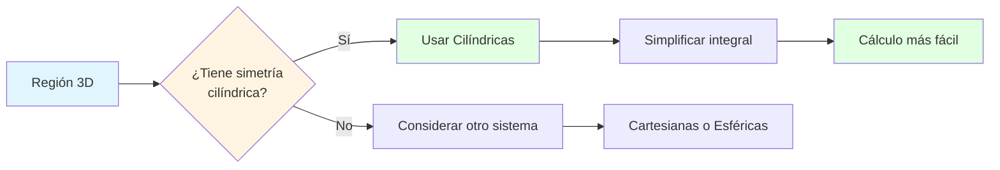
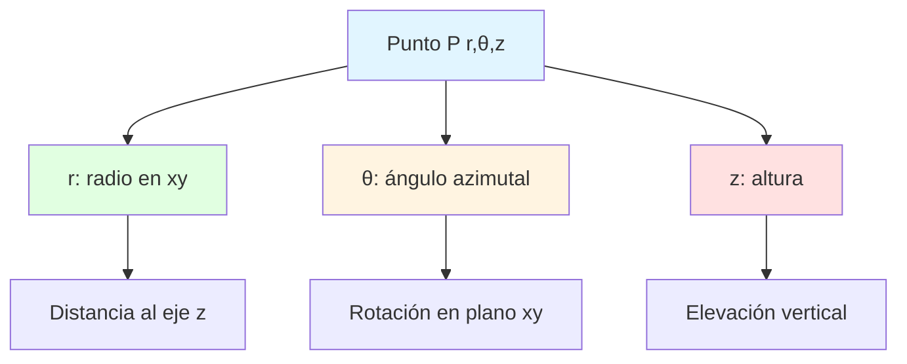
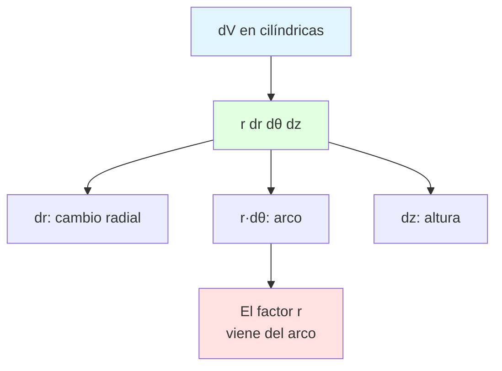
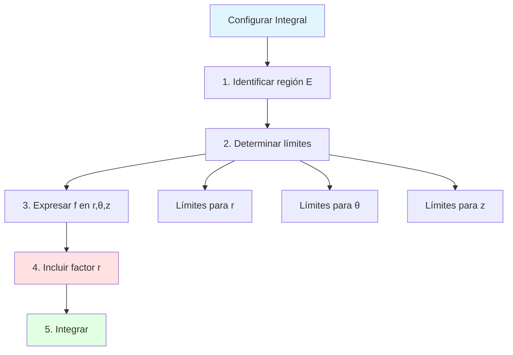
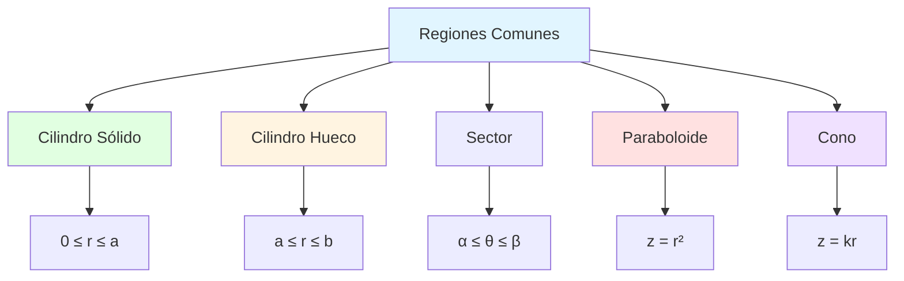
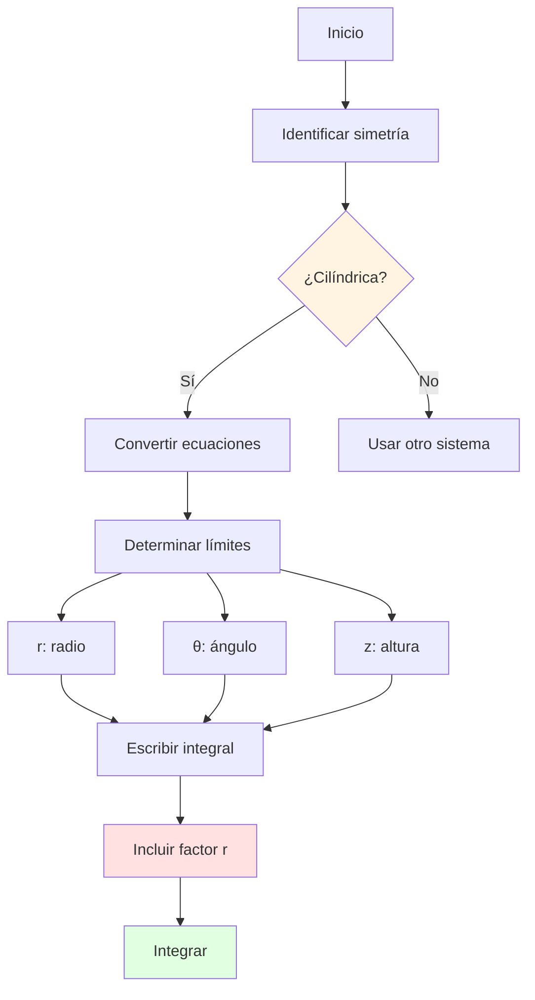
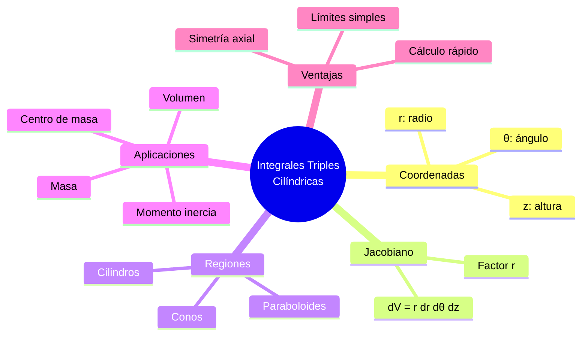
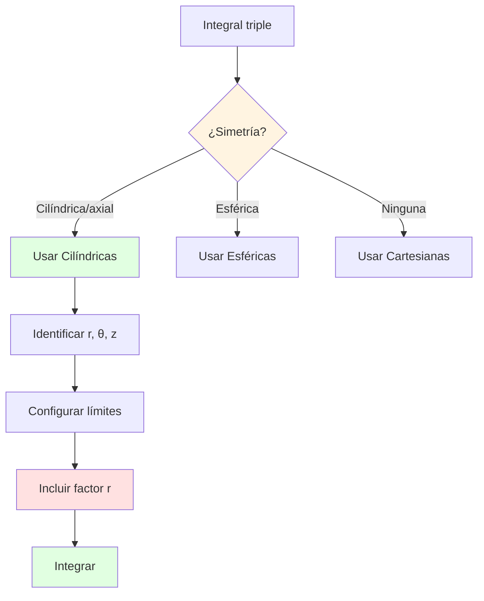
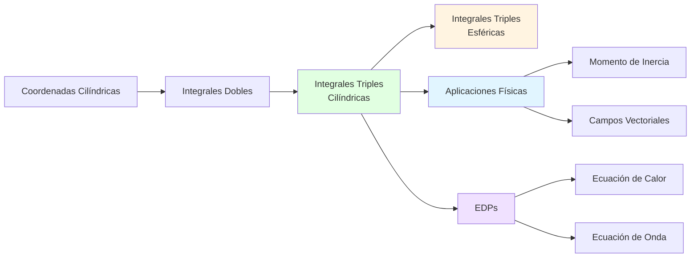

# 🔵 Integrales Triples en Coordenadas Cilíndricas

## 🎯 Introducción

> [!info]- 💡 ¿Qué son las Integrales Triples en Cilíndricas?
> 
> Las **integrales triples en coordenadas cilíndricas** son una herramienta poderosa para calcular volúmenes, masas, centroides y otras cantidades sobre regiones tridimensionales que exhiben **simetría cilíndrica** o **axial**.
> 
> **Analogía práctica:** Imagina calcular el volumen de agua en un tanque cilíndrico de forma irregular, o la masa total de un cable que tiene densidad variable. En coordenadas cartesianas, estos cálculos pueden ser extremadamente complicados. Sin embargo, usando coordenadas cilíndricas, que se alinean naturalmente con la geometría del problema, las integrales se simplifican dramáticamente.
> 
> **¿Por qué usar coordenadas cilíndricas?**
> 
> |Aspecto|Descripción|Ejemplo de Uso|
> |---|---|---|
> |**Simetría axial**|Regiones simétricas alrededor de un eje|Tanques, tuberías|
> |**Cilindros**|Superficies cilíndricas simples|Torres, postes|
> |**Simplificación**|Ecuaciones más compactas|$x^2 + y^2 = a^2$ → $r = a$|
> |**Límites claros**|Rangos de integración más naturales|Radio, ángulo, altura|
> |**Cálculos físicos**|Problemas con rotación|Momento de inercia, flujo|



---

## 📐 Recordatorio: Coordenadas Cilíndricas

> [!note]- 🔄 Sistema de Coordenadas Cilíndricas
> 
> **Definición:**
> 
> Un punto $P$ en el espacio se describe mediante tres coordenadas:
> 
> - **$r$:** Distancia desde el eje $z$ (radio cilíndrico)
> - **$\theta$:** Ángulo en el plano $xy$ desde el eje $x$ positivo
> - **$z$:** Altura (igual que en cartesianas)
> 
> **Relación con cartesianas:**
> 
> $$\boxed{\begin{cases} x = r\cos\theta \ y = r\sin\theta \ z = z \end{cases}}$$
> 
> $$\boxed{\begin{cases} r = \sqrt{x^2 + y^2} \ \theta = \arctan(y/x) \ z = z \end{cases}}$$
> 
> **Rangos típicos:**
> 
> |Coordenada|Rango Estándar|Significado|
> |---|---|---|
> |$r$|$r \geq 0$|Radio (distancia al eje $z$)|
> |$\theta$|$0 \leq \theta < 2\pi$|Ángulo completo|
> |$z$|$-\infty < z < \infty$|Altura sin restricción|
> 
> **Visualización:**
> 
> ```
>      z ↑
>        |
>        |    • P(r,θ,z)
>        |   /│
>        |  / │ z
>        | /  │
>    ────O────┼───→ y
>       / θ  r│
>      /      │
>     ↙       •
>    x    proyección
> ```



---

## 🧮 Elemento de Volumen en Cilíndricas

> [!warning]- ⚠️ El Jacobiano: Factor $r$
> 
> **Elemento diferencial de volumen:**
> 
> Al transformar de cartesianas a cilíndricas, el elemento de volumen cambia:
> 
> $$\boxed{dV = dx,dy,dz = r,dr,d\theta,dz}$$
> 
> **⚠️ CRÍTICO:** El factor $r$ es el **Jacobiano** de la transformación.
> 
> **¿De dónde viene el factor $r$?**
> 
> El Jacobiano de la transformación cilíndrica es:
> 
> $$J = \begin{vmatrix} \frac{\partial x}{\partial r} & \frac{\partial x}{\partial \theta} & \frac{\partial x}{\partial z} \ \frac{\partial y}{\partial r} & \frac{\partial y}{\partial \theta} & \frac{\partial y}{\partial z} \ \frac{\partial z}{\partial r} & \frac{\partial z}{\partial \theta} & \frac{\partial z}{\partial z} \end{vmatrix} = \begin{vmatrix} \cos\theta & -r\sin\theta & 0 \ \sin\theta & r\cos\theta & 0 \ 0 & 0 & 1 \end{vmatrix}$$
> 
> Expandiendo por la tercera fila:
> 
> $$J = 1 \cdot \begin{vmatrix} \cos\theta & -r\sin\theta \ \sin\theta & r\cos\theta \end{vmatrix} = r\cos^2\theta + r\sin^2\theta = r$$
> 
> **Interpretación geométrica:**
> 
> ```
>     Vista superior (plano xy):
>     
>         d(r·θ) = r·dθ
>           ╱────╲
>          ╱      ╲
>         │   •    │  Elemento de área
>          ╲      ╱   en anillo cilíndrico
>           ╲────╱
>             dr
>     
>     Área del anillo ≈ r·dθ·dr
>     Volumen = (área del anillo) × altura
>             = r·dθ·dr·dz
> ```
> 
> **Tabla comparativa:**
> 
> |Sistema|Elemento de Volumen|Factor adicional|
> |---|---|---|
> |**Cartesiano**|$dx,dy,dz$|Ninguno (1)|
> |**Cilíndrico**|$r,dr,d\theta,dz$|$r$|
> |**Esférico**|$\rho^2\sin\phi,d\rho,d\theta,d\phi$|$\rho^2\sin\phi$|



---

## 📝 Forma General de la Integral Triple

> [!example]- 📖 Fórmula Fundamental
> 
> **Integral triple en coordenadas cilíndricas:**
> 
> $$\boxed{\iiint_E f(x,y,z),dV = \iiint_E f(r\cos\theta, r\sin\theta, z) \cdot r,dr,d\theta,dz}$$
> 
> **Pasos para configurar la integral:**
> 
> 1. **Identificar la región $E$** en el espacio 3D
> 2. **Determinar los límites** para $r$, $\theta$, $z$
> 3. **Expresar $f(x,y,z)$** en términos de $r$, $\theta$, $z$
> 4. **No olvidar** el factor $r$ en $dV$
> 5. **Integrar** en el orden apropiado
> 
> **Órdenes de integración comunes:**
> 
> |Orden|Forma|Cuándo usar|
> |---|---|---|
> |**$dr,d\theta,dz$**|$\int \int \int r,dr,d\theta,dz$|Cilindro con tapas variables|
> |**$dz,dr,d\theta$**|$\int \int \int r,dz,dr,d\theta$|Altura varía con $r$|
> |**$d\theta,dr,dz$**|$\int \int \int r,d\theta,dr,dz$|Sector angular variable|
> 
> **Límites típicos:**
> 
> - **$r$:** De $r_1(\theta, z)$ a $r_2(\theta, z)$
> - **$\theta$:** De $\theta_1$ a $\theta_2$ (usualmente $0$ a $2\pi$ para cilindros completos)
> - **$z$:** De $z_1(r, \theta)$ a $z_2(r, \theta)$



---

## 💡 Ejemplos Resueltos Paso a Paso

> [!example]- 📝 Ejemplo 1: Cilindro Sólido (Volumen)
> 
> **Problema:**
> 
> Calcular el volumen del cilindro sólido: $$E: x^2 + y^2 \leq 4, \quad 0 \leq z \leq 3$$
> 
> **Solución:**
> 
> **Paso 1: Identificar la región**
> 
> - Base: círculo de radio 2 en plano $xy$
> - Altura: de $z = 0$ a $z = 3$
> 
> **Paso 2: Convertir a cilíndricas**
> 
> - $x^2 + y^2 \leq 4$ se convierte en $r^2 \leq 4$, es decir, $r \leq 2$
> - Cilindro completo: $0 \leq \theta < 2\pi$
> - Altura: $0 \leq z \leq 3$
> 
> **Paso 3: Límites de integración**
> 
> - $0 \leq r \leq 2$
> - $0 \leq \theta \leq 2\pi$
> - $0 \leq z \leq 3$
> 
> **Paso 4: Configurar la integral**
> 
> Para volumen, $f(x,y,z) = 1$:
> 
> $$V = \iiint_E dV = \int_0^{2\pi} \int_0^2 \int_0^3 r,dz,dr,d\theta$$
> 
> **Paso 5: Evaluar**
> 
> Integrando respecto a $z$:
> 
> $$= \int_0^{2\pi} \int_0^2 [rz]_0^3 dr,d\theta = \int_0^{2\pi} \int_0^2 3r,dr,d\theta$$
> 
> Integrando respecto a $r$:
> 
> $$= \int_0^{2\pi} \left[\frac{3r^2}{2}\right]_0^2 d\theta = \int_0^{2\pi} 6,d\theta$$
> 
> Integrando respecto a $\theta$:
> 
> $$= [6\theta]_0^{2\pi} = 12\pi$$
> 
> **Verificación:** Fórmula del cilindro: $V = \pi r^2 h = \pi(2)^2(3) = 12\pi$ ✅
> 
> **Respuesta:** $V = 12\pi$ unidades cúbicas

> [!example]- 📝 Ejemplo 2: Cilindro con Tapa Parabólica
> 
> **Problema:**
> 
> Calcular el volumen de la región acotada por:
> 
> - Cilindro: $x^2 + y^2 = 4$
> - Plano inferior: $z = 0$
> - Superficie superior: $z = 4 - x^2 - y^2$
> 
> **Solución:**
> 
> **Paso 1: Análisis de la región**
> 
> - Base cilíndrica: radio 2
> - Tapa superior es un paraboloide: $z = 4 - (x^2 + y^2) = 4 - r^2$
> 
> **Paso 2: Límites**
> 
> - $0 \leq r \leq 2$
> - $0 \leq \theta \leq 2\pi$
> - $0 \leq z \leq 4 - r^2$
> 
> **Paso 3: Integral**
> 
> $$V = \int_0^{2\pi} \int_0^2 \int_0^{4-r^2} r,dz,dr,d\theta$$
> 
> **Paso 4: Evaluar**
> 
> Integrando respecto a $z$:
> 
> $$= \int_0^{2\pi} \int_0^2 r(4-r^2),dr,d\theta = \int_0^{2\pi} \int_0^2 (4r - r^3),dr,d\theta$$
> 
> Integrando respecto a $r$:
> 
> $$= \int_0^{2\pi} \left[2r^2 - \frac{r^4}{4}\right]_0^2 d\theta = \int_0^{2\pi} \left(8 - 4\right) d\theta = \int_0^{2\pi} 4,d\theta$$
> 
> Integrando respecto a $\theta$:
> 
> $$= [4\theta]_0^{2\pi} = 8\pi$$
> 
> **Respuesta:** $V = 8\pi$ unidades cúbicas

> [!example]- 📝 Ejemplo 3: Cono (entre superficies)
> 
> **Problema:**
> 
> Calcular el volumen del sólido acotado por:
> 
> - Cono: $z = \sqrt{x^2 + y^2}$
> - Plano: $z = 2$
> 
> **Solución:**
> 
> **Paso 1: Convertir el cono**
> 
> $z = \sqrt{x^2 + y^2} = r$ en cilíndricas
> 
> **Paso 2: Determinar límites**
> 
> El cono intersecta el plano $z = 2$ cuando: $$r = 2$$
> 
> Por tanto:
> 
> - $0 \leq r \leq 2$
> - $0 \leq \theta \leq 2\pi$
> - $r \leq z \leq 2$ (desde el cono hasta el plano)
> 
> **Paso 3: Integral**
> 
> $$V = \int_0^{2\pi} \int_0^2 \int_r^2 r,dz,dr,d\theta$$
> 
> **Paso 4: Evaluar**
> 
> Integrando respecto a $z$:
> 
> $$= \int_0^{2\pi} \int_0^2 r[z]_r^2 dr,d\theta = \int_0^{2\pi} \int_0^2 r(2-r),dr,d\theta$$
> 
> $$= \int_0^{2\pi} \int_0^2 (2r - r^2),dr,d\theta$$
> 
> Integrando respecto a $r$:
> 
> $$= \int_0^{2\pi} \left[r^2 - \frac{r^3}{3}\right]_0^2 d\theta = \int_0^{2\pi} \left(4 - \frac{8}{3}\right) d\theta$$
> 
> $$= \int_0^{2\pi} \frac{4}{3},d\theta = \frac{4}{3} \cdot 2\pi = \frac{8\pi}{3}$$
> 
> **Respuesta:** $V = \frac{8\pi}{3}$ unidades cúbicas

> [!example]- 📝 Ejemplo 4: Masa con Densidad Variable
> 
> **Problema:**
> 
> Calcular la masa del cilindro $x^2 + y^2 \leq 1$, $0 \leq z \leq 2$, con densidad: $$\rho(x,y,z) = z$$
> 
> **Solución:**
> 
> **Paso 1: Configurar**
> 
> La masa se calcula con: $$M = \iiint_E \rho(x,y,z),dV$$
> 
> **Paso 2: Límites en cilíndricas**
> 
> - $0 \leq r \leq 1$
> - $0 \leq \theta \leq 2\pi$
> - $0 \leq z \leq 2$
> - $\rho = z$ (ya está en forma apropiada)
> 
> **Paso 3: Integral**
> 
> $$M = \int_0^{2\pi} \int_0^1 \int_0^2 z \cdot r,dz,dr,d\theta$$
> 
> **Paso 4: Evaluar**
> 
> Integrando respecto a $z$:
> 
> $$= \int_0^{2\pi} \int_0^1 r\left[\frac{z^2}{2}\right]_0^2 dr,d\theta = \int_0^{2\pi} \int_0^1 2r,dr,d\theta$$
> 
> Integrando respecto a $r$:
> 
> $$= \int_0^{2\pi} [r^2]_0^1 d\theta = \int_0^{2\pi} 1,d\theta$$
> 
> Integrando respecto a $\theta$:
> 
> $$= [\theta]_0^{2\pi} = 2\pi$$
> 
> **Respuesta:** $M = 2\pi$ unidades de masa

---

## 🎯 Regiones Comunes en Cilíndricas

> [!note]- 🔍 Tipos de Regiones Frecuentes
> 
> **1. Cilindro sólido**
> 
> $$x^2 + y^2 \leq a^2, \quad h_1 \leq z \leq h_2$$
> 
> Límites:
> 
> - $0 \leq r \leq a$
> - $0 \leq \theta \leq 2\pi$
> - $h_1 \leq z \leq h_2$
> 
> ---
> 
> **2. Cilindro hueco**
> 
> $$a^2 \leq x^2 + y^2 \leq b^2, \quad h_1 \leq z \leq h_2$$
> 
> Límites:
> 
> - $a \leq r \leq b$
> - $0 \leq \theta \leq 2\pi$
> - $h_1 \leq z \leq h_2$
> 
> ---
> 
> **3. Sector cilíndrico**
> 
> $$x^2 + y^2 \leq a^2, \quad \alpha \leq \theta \leq \beta, \quad h_1 \leq z \leq h_2$$
> 
> Límites:
> 
> - $0 \leq r \leq a$
> - $\alpha \leq \theta \leq \beta$
> - $h_1 \leq z \leq h_2$
> 
> ---
> 
> **4. Paraboloide de revolución**
> 
> $$z = x^2 + y^2 = r^2, \quad 0 \leq z \leq h$$
> 
> Límites:
> 
> - $0 \leq r \leq \sqrt{h}$
> - $0 \leq \theta \leq 2\pi$
> - $r^2 \leq z \leq h$
> 
> ---
> 
> **5. Cono**
> 
> $$z = k\sqrt{x^2 + y^2} = kr, \quad 0 \leq z \leq h$$
> 
> Límites:
> 
> - $0 \leq r \leq h/k$
> - $0 \leq \theta \leq 2\pi$
> - $kr \leq z \leq h$



---

## 🚀 Aplicaciones Físicas

> [!success]- ⚙️ Aplicaciones en Ciencia e Ingeniería
> 
> **1. Centro de masa**
> 
> Para un sólido con densidad $\rho(r, \theta, z)$:
> 
> $$\bar{z} = \frac{1}{M} \iiint_E z\rho(r,\theta,z) \cdot r,dr,d\theta,dz$$
> 
> donde $M = \iiint_E \rho \cdot r,dr,d\theta,dz$
> 
> ---
> 
> **2. Momento de inercia**
> 
> Alrededor del eje $z$:
> 
> $$I_z = \iiint_E r^2 \rho(r,\theta,z) \cdot r,dr,d\theta,dz = \iiint_E r^3 \rho,dr,d\theta,dz$$
> 
> ---
> 
> **3. Carga eléctrica total**
> 
> Con densidad de carga $\sigma(r, \theta, z)$:
> 
> $$Q = \iiint_E \sigma(r,\theta,z) \cdot r,dr,d\theta,dz$$
> 
> ---
> 
> **4. Temperatura promedio**
> 
> $$T_{prom} = \frac{1}{V} \iiint_E T(r,\theta,z) \cdot r,dr,d\theta,dz$$
> 
> ---
> 
> **Tabla de aplicaciones:**
> 
> |Aplicación|Función|Integral|
> |---|---|---|
> |**Volumen**|$f = 1$|$\iiint_E r,dr,d\theta,dz$|
> |**Masa**|$f = \rho$|$\iiint_E \rho \cdot r,dr,d\theta,dz$|
> |**Centro de masa (z)**|$f = z\rho$|$\frac{1}{M}\iiint_E z\rho \cdot r,dr,d\theta,dz$|
> |**Momento de inercia**|$f = r^2\rho$|$\iiint_E r^3\rho,dr,d\theta,dz$|
> |**Carga total**|$f = \sigma$|$\iiint_E \sigma \cdot r,dr,d\theta,dz$|

---

## 📋 Estrategias para Configurar Integrales

> [!tip]- 🎯 Método Sistemático
> 
> **Paso 1: Dibujar la región (si es posible)**
> 
> - Identificar simetría cilíndrica
> - Visualizar corte transversal
> 
> **Paso 2: Expresar superficies en cilíndricas**
> 
> |Superficie Cartesiana|Cilíndrica|
> |---|---|
> |$x^2 + y^2 = a^2$|$r = a$|
> |$z = c$|$z = c$|
> |$z = x^2 + y^2$|$z = r^2$|
> |$z = \sqrt{x^2 + y^2}$|$z = r$|
> 
> **Paso 3: Determinar límites**
> 
> - **Para $\theta$:** ¿Cilindro completo? → $0$ a $2\pi$
> - **Para $r$:** ¿Desde el eje? → $0$ a radio máximo
> - **Para $z$:** Entre superficies inferior y superior
> 
> **Paso 4: Elegir orden de integración**
> 
> - Generalmente: $dz$ primero si $z$ varía con $r$
> - Luego $dr$, finalmente $d\theta$
> 
> **Paso 5: No olvidar el factor $r$**



---

## 🎓 Ejercicios Propuestos

> [!example]- 💪 Práctica Guiada
> 
> **Nivel Básico:**
> 
> **1. Volúmenes simples**
> 
> Calcular el volumen de:
> 
> a) Cilindro $x^2 + y^2 \leq 9$, $0 \leq z \leq 5$
> 
> b) Cilindro hueco $1 \leq x^2 + y^2 \leq 4$, $0 \leq z \leq 3$
> 
> c) Semicilindro $x^2 + y^2 \leq 1$, $x \geq 0$, $0 \leq z \leq 2$
> 
> **Pista:** Para (c), $\theta$ va de $-\pi/2$ a $\pi/2$
> 
> ---
> 
> **2. Con superficies curvas**
> 
> Calcular el volumen entre:
> 
> a) $z = 0$ y $z = 9 - x^2 - y^2$, dentro de $x^2 + y^2 = 9$
> 
> b) $z = x^2 + y^2$ y $z = 4$
> 
> **Pista:** Para (b), encontrar donde se intersectan.
> 
> ---
> 
> **Nivel Intermedio:**
> 
> **3. Masa con densidad**
> 
> Calcular la masa del cilindro $x^2 + y^2 \leq 4$, $0 \leq z \leq 3$, con densidades:
> 
> a) $\rho = x^2 + y^2$ (en cil: $\rho = r^2$)
> b) $\rho = z^2$
> 
> c) $\rho = \sqrt{x^2 + y^2}$ (en cil: $\rho = r$)
> 
> ---
> 
> **4. Centro de masa**
> 
> Encontrar $\bar{z}$ (coordenada $z$ del centro de masa) del sólido:
> 
> $x^2 + y^2 \leq 1$, $0 \leq z \leq 2$, con densidad $\rho = z$
> 
> **Pista:** $\bar{z} = \frac{1}{M}\iiint_E z\rho,dV$
> 
> ---
> 
> **Nivel Avanzado:**
> 
> **5. Región compleja**
> 
> Calcular el volumen del sólido acotado por:
> 
> - Paraboloide: $z = x^2 + y^2$
> - Cono: $z = 2\sqrt{x^2 + y^2}$
> 
> **Pista:** Encontrar intersección: $r^2 = 2r \Rightarrow r = 2$
> 
> ---
> 
> **6. Momento de inercia**
> 
> Calcular el momento de inercia alrededor del eje $z$ del cilindro:
> 
> $x^2 + y^2 \leq a^2$, $0 \leq z \leq h$, con densidad constante $\rho_0$
> 
> $$I_z = \iiint_E (x^2 + y^2)\rho_0,dV = \iiint_E r^2\rho_0 \cdot r,dr,d\theta,dz$$
> 
> ---
> 
> **7. Sector cilíndrico**
> 
> Volumen del sólido en el primer octante ($x, y, z \geq 0$) dentro del cilindro $x^2 + y^2 = 4$ y bajo el plano $z = y$.
> 
> **Pista:** $z = y = r\sin\theta$, y $\theta$ va de $0$ a $\pi/2$
> 
> ---
> 
> **8. Aplicación física**
> 
> Un alambre cilíndrico tiene radio 0.1 m y longitud 2 m. La densidad varía con la distancia al eje:
> 
> $$\rho(r) = \rho_0(1 + kr)$$
> 
> donde $\rho_0 = 8000$ kg/m³ y $k = 10$ m⁻¹.
> 
> Calcular la masa total del alambre.

---

## 📊 Comparación: Cartesianas vs Cilíndricas

> [!note]- 🔄 Cuándo Preferir Cada Sistema
> 
> **Ejemplo comparativo: Cilindro $x^2 + y^2 \leq 1$, $0 \leq z \leq 2$**
> 
> **En Cartesianas:**
> 
> $$V = \int_{-1}^1 \int_{-\sqrt{1-x^2}}^{\sqrt{1-x^2}} \int_0^2 dz,dy,dx$$
> 
> - Límites de $y$ dependen de $x$ (complicado)
> - Requiere función raíz cuadrada
> - Difícil de evaluar
> 
> **En Cilíndricas:**
> 
> $$V = \int_0^{2\pi} \int_0^1 \int_0^2 r,dz,dr,d\theta = 2\pi \cdot \frac{1}{2} \cdot 2 = 2\pi$$
> 
> - Límites constantes y simples
> - Evaluación directa
> - Respuesta inmediata
> 
> **Ventajas comparadas:**
> 
> |Aspecto|Cartesianas|Cilíndricas|
> |---|---|---|
> |**Para cilindros**|Límites complejos|Límites simples|
> |**Simetría axial**|No aprovecha|✅ Explota simetría|
> |**Cálculo**|Más pasos|Menos pasos|
> |**Intuición**|Familiar|Requiere práctica|
> |**Mejor para**|Cajas, cubos|Cilindros, tubos|


---

## 📊 Resumen Visual Completo

### Mapa Conceptual



### Tabla Resumen de Fórmulas

|Concepto|Fórmula|Notas|
|---|---|---|
|**Elemento de volumen**|$dV = r,dr,d\theta,dz$|Factor $r$ obligatorio|
|**Volumen**|$V = \iiint_E r,dr,d\theta,dz$|$f = 1$|
|**Masa**|$M = \iiint_E \rho(r,\theta,z) \cdot r,dr,d\theta,dz$|Con densidad|
|**Centro de masa (z)**|$\bar{z} = \frac{1}{M}\iiint_E z\rho \cdot r,dr,d\theta,dz$|Requiere masa total|
|**Momento de inercia**|$I_z = \iiint_E r^3\rho,dr,d\theta,dz$|Alrededor de eje $z$|

### Diagrama de Flujo de Decisión



---

## 🔗 Conexión con Próximos Temas

> [!quote]- 🌟 Continuando el Aprendizaje
> 
> **Has dominado:**
> 
> - ✅ Integrales triples en coordenadas cilíndricas
> - ✅ Factor jacobiano $r$
> - ✅ Configuración de límites
> - ✅ Aplicaciones físicas
> 
> **Progresión natural:**
> 
> |Nivel|Tema|Conexión|
> |---|---|---|
> |**Previo**|Transformaciones de coordenadas|Base fundamental|
> |**Actual**|Integrales triples cilíndricas|Aplicación práctica|
> |**Siguiente**|Integrales triples esféricas|Otro sistema curvilíneo|
> |**Avanzado**|Cambio de variables general|Jacobiano arbitrario|
> |**Aplicado**|Ecuaciones diferenciales|EDPs en cilíndricas|
> |**Profesional**|Análisis vectorial|Operadores en cilíndricas|



---

**Tags:** #cálculo #integrales-triples #coordenadas-cilíndricas #jacobiano #volumen #masa #momento-inercia #aplicaciones-físicas #mermaid #diagramas