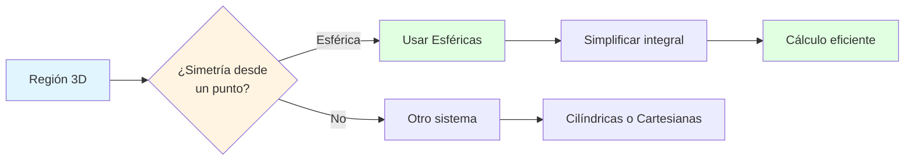
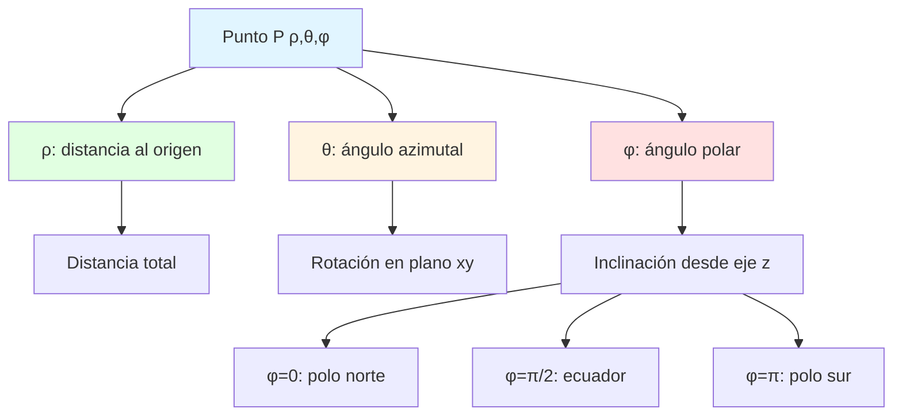
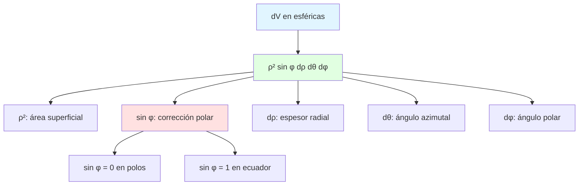
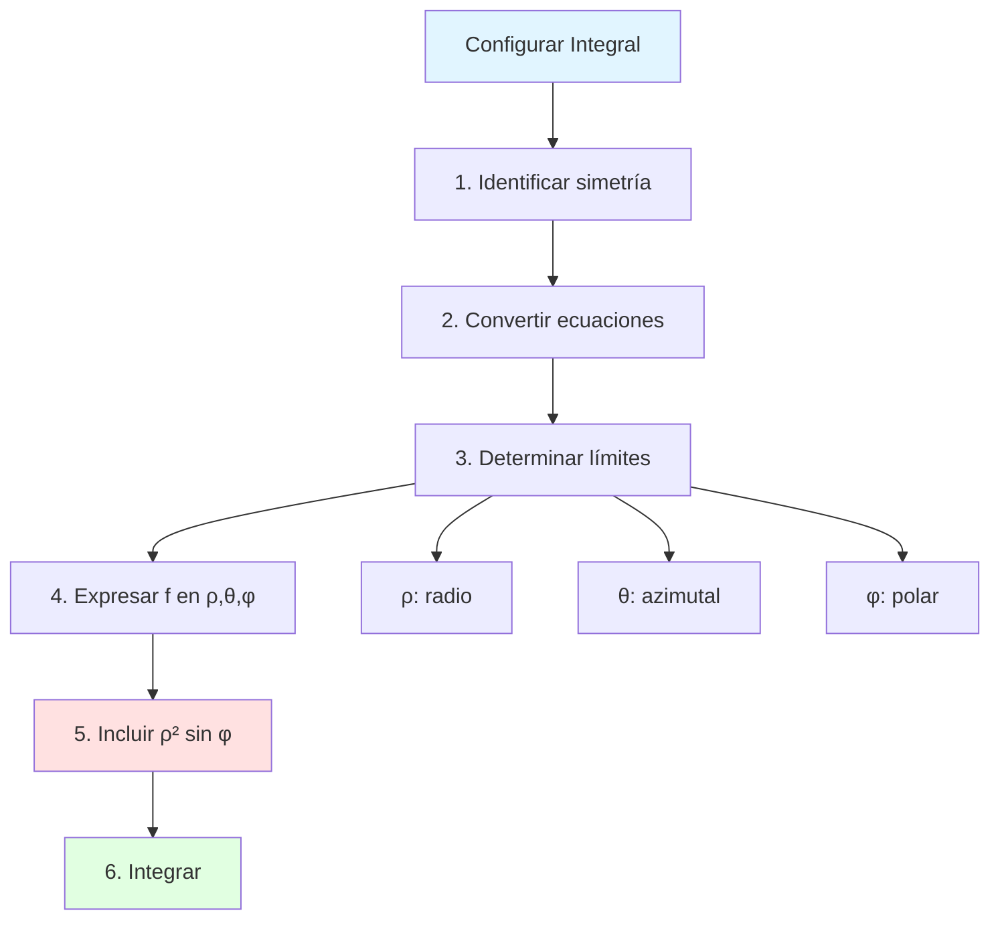
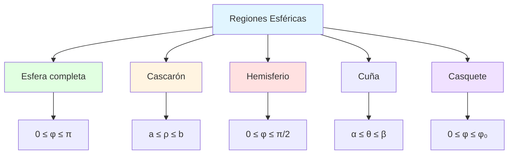
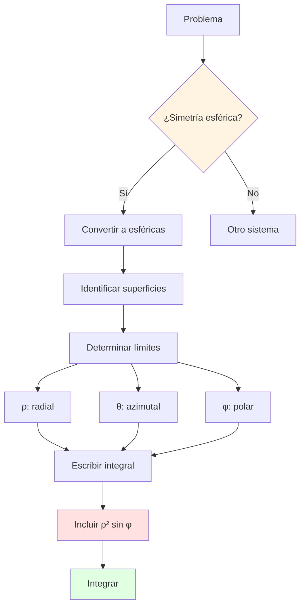
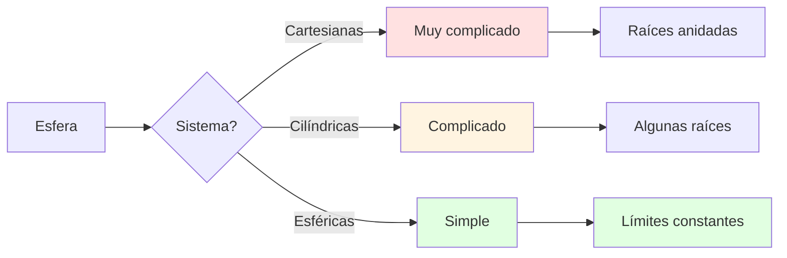
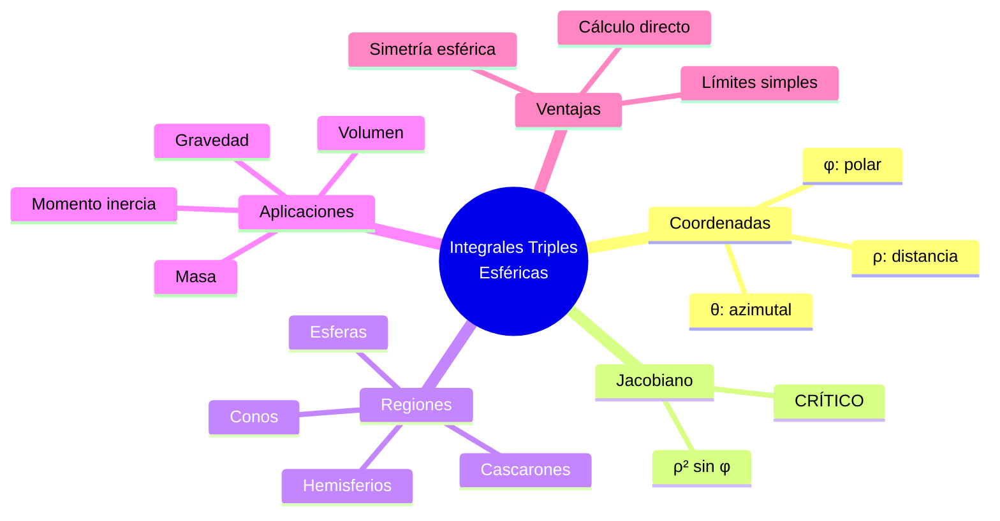
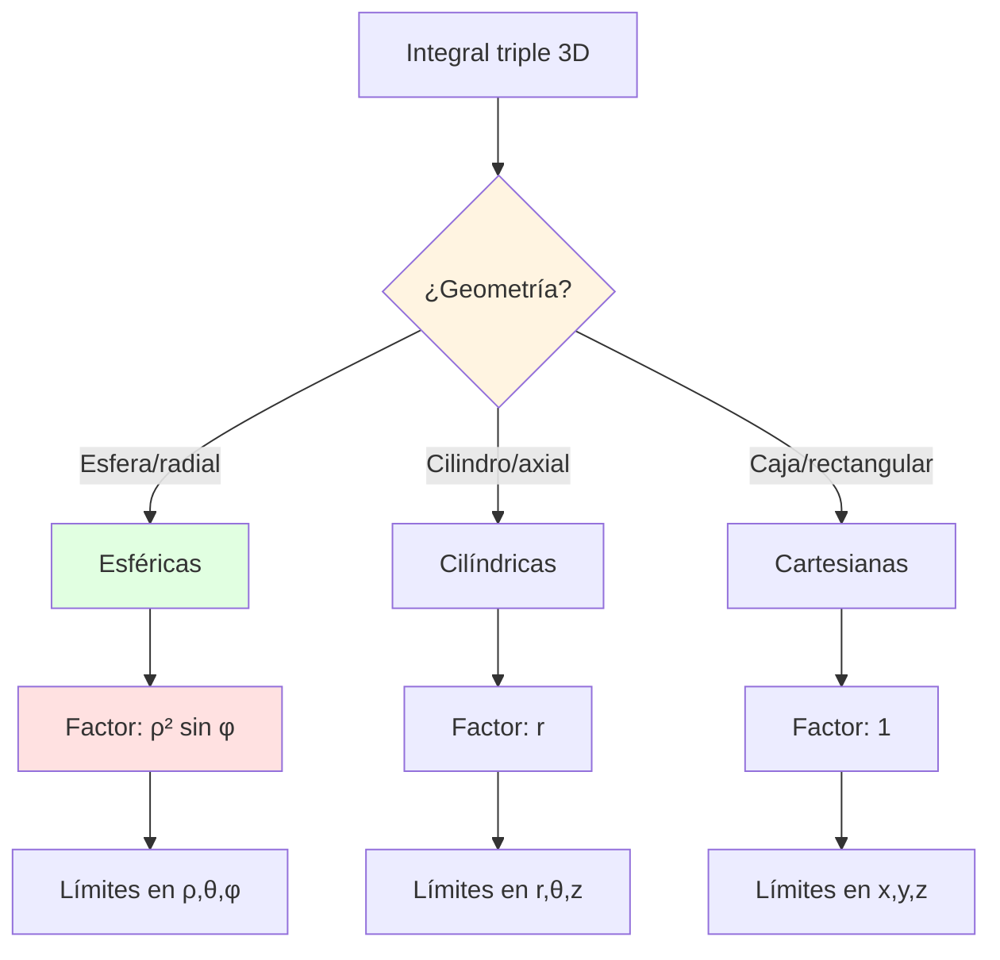
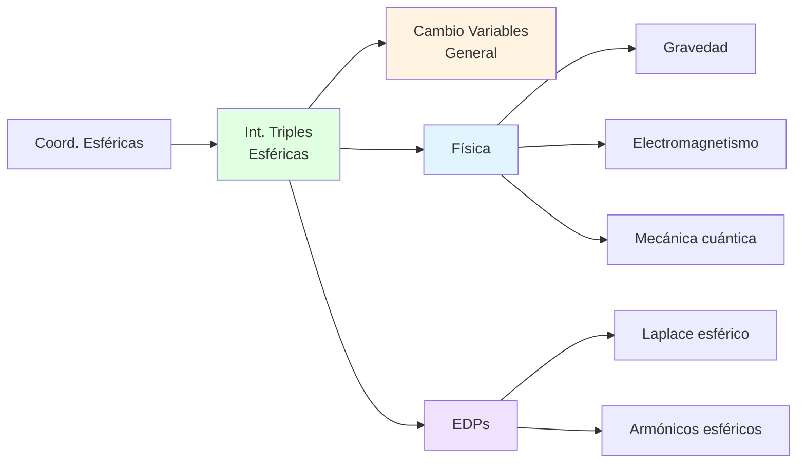

# 🌐 Integrales Triples en Coordenadas Esféricas

## 🎯 Introducción

> [!info]- 💡 ¿Qué son las Integrales Triples en Esféricas?
> 
> Las **integrales triples en coordenadas esféricas** son una herramienta fundamental para calcular volúmenes, masas, centroides y otras cantidades sobre regiones tridimensionales que exhiben **simetría esférica** o **radial desde un punto**.
> 
> **Analogía práctica:** Imagina calcular la masa de la Tierra sabiendo que su densidad varía solo con la distancia al centro. En coordenadas cartesianas, esto sería extremadamente complejo. Sin embargo, usando coordenadas esféricas que respetan la simetría natural del problema, la integral se simplifica dramáticamente.
> 
> **¿Por qué usar coordenadas esféricas?**
> 
> |Aspecto|Descripción|Ejemplo de Uso|
> |---|---|---|
> |**Simetría esférica**|Regiones simétricas desde un punto|Planetas, átomos, burbujas|
> |**Esferas**|Superficies esféricas naturales|Balones, satélites|
> |**Campos centrales**|Fuerzas/campos radiales|Gravedad, electrostática|
> |**Simplificación**|Ecuaciones compactas|$x^2 + y^2 + z^2 = a^2$ → $\rho = a$|
> |**Física**|Problemas con punto central|Mecánica cuántica, astrofísica|



---

## 📐 Recordatorio: Coordenadas Esféricas

> [!note]- 🔄 Sistema de Coordenadas Esféricas
> 
> **Definición:**
> 
> Un punto $P$ en el espacio se describe mediante tres coordenadas:
> 
> - **$\rho$ (rho):** Distancia desde el origen al punto
> - **$\theta$ (theta):** Ángulo azimutal en el plano $xy$ (igual que cilíndricas)
> - **$\phi$ (phi):** Ángulo polar desde el eje $z$ positivo
> 
> **⚠️ CONVENCIÓN:** Usamos la **convención matemática** ($\phi$ desde eje $z$)
> 
> **Relación con cartesianas:**
> 
> $$\boxed{\begin{cases} x = \rho\sin\phi\cos\theta \ y = \rho\sin\phi\sin\theta \ z = \rho\cos\phi \end{cases}}$$
> 
> $$\boxed{\begin{cases} \rho = \sqrt{x^2 + y^2 + z^2} \ \theta = \arctan(y/x) \ \phi = \arccos(z/\rho) \end{cases}}$$
> 
> **Rangos estándar:**
> 
> |Coordenada|Rango|Significado|
> |---|---|---|
> |$\rho$|$\rho \geq 0$|Distancia al origen|
> |$\theta$|$0 \leq \theta < 2\pi$|Ángulo en plano $xy$|
> |$\phi$|$0 \leq \phi \leq \pi$|Ángulo desde eje $z+$|
> 
> **Valores especiales de $\phi$:**
> 
> |Valor de $\phi$|Ubicación|Descripción|
> |---|---|---|
> |$\phi = 0$|Eje $z$ positivo|Polo norte|
> |$\phi = \pi/2$|Plano $xy$|Ecuador|
> |$\phi = \pi$|Eje $z$ negativo|Polo sur|
> 
> **Visualización:**
> 
> ```
>      z ↑
>        |
>        |    • P(ρ,θ,φ)
>        |   /│
>      φ |  / │ ρ
>        | /  │
>    ────O────┼───→ y
>       / θ   │
>      /      │
>     ↙       •
>    x    proyección
>    
>    ρ: distancia total
>    θ: rotación en xy
>    φ: inclinación desde z
> ```



---

## 🧮 Elemento de Volumen en Esféricas

> [!warning]- ⚠️ El Jacobiano: Factor $\rho^2\sin\phi$
> 
> **Elemento diferencial de volumen:**
> 
> Al transformar de cartesianas a esféricas, el elemento de volumen cambia:
> 
> $$\boxed{dV = dx,dy,dz = \rho^2\sin\phi,d\rho,d\theta,d\phi}$$
> 
> **⚠️ CRÍTICO:** El factor $\rho^2\sin\phi$ es el **Jacobiano** de la transformación.
> 
> **¿De dónde viene el factor $\rho^2\sin\phi$?**
> 
> El Jacobiano de la transformación esférica es:
> 
> $$J = \begin{vmatrix} \frac{\partial x}{\partial \rho} & \frac{\partial x}{\partial \theta} & \frac{\partial x}{\partial \phi} \ \frac{\partial y}{\partial \rho} & \frac{\partial y}{\partial \theta} & \frac{\partial y}{\partial \phi} \ \frac{\partial z}{\partial \rho} & \frac{\partial z}{\partial \theta} & \frac{\partial z}{\partial \phi} \end{vmatrix}$$
> 
> $$= \begin{vmatrix} \sin\phi\cos\theta & -\rho\sin\phi\sin\theta & \rho\cos\phi\cos\theta \ \sin\phi\sin\theta & \rho\sin\phi\cos\theta & \rho\cos\phi\sin\theta \ \cos\phi & 0 & -\rho\sin\phi \end{vmatrix}$$
> 
> Después de calcular (expandiendo por la segunda columna):
> 
> $$J = \rho^2\sin\phi$$
> 
> **Interpretación geométrica:**
> 
> ```
>     El volumen del elemento esférico:
>     
>     • d(ρ): cambio radial
>     • ρ·dφ: arco meridional
>     • ρ·sin(φ)·dθ: arco latitudinal
>     
>     Volumen ≈ dρ × (ρ·dφ) × (ρ·sin(φ)·dθ)
>            = ρ²·sin(φ)·dρ·dφ·dθ
> ```
> 
> **Desglose del factor:**
> 
> |Factor|Origen|Significado|
> |---|---|---|
> |$\rho^2$|Distancia al origen|Área crece con cuadrado de distancia|
> |$\sin\phi$|Ángulo polar|Corrección por latitud|
> |$d\rho$|Diferencial radial|Espesor de capa|
> |$d\theta$|Diferencial azimutal|Ángulo de sector|
> |$d\phi$|Diferencial polar|Ángulo meridional|
> 
> **Comparación de Jacobianos:**
> 
> |Sistema|Jacobiano|Forma del elemento|
> |---|---|---|
> |**Cartesiano**|$1$|Caja rectangular|
> |**Cilíndrico**|$r$|Sector cilíndrico|
> |**Esférico**|$\rho^2\sin\phi$|Cuña esférica|



---

## 📝 Forma General de la Integral Triple

> [!example]- 📖 Fórmula Fundamental
> 
> **Integral triple en coordenadas esféricas:**
> 
> $$\boxed{\iiint_E f(x,y,z),dV = \iiint_E f(\rho,\theta,\phi) \cdot \rho^2\sin\phi,d\rho,d\theta,d\phi}$$
> 
> donde $f(\rho,\theta,\phi)$ significa $f(\rho\sin\phi\cos\theta, \rho\sin\phi\sin\theta, \rho\cos\phi)$
> 
> **Pasos para configurar la integral:**
> 
> 1. **Identificar la región $E$** con simetría esférica
> 2. **Convertir superficies** a coordenadas esféricas
> 3. **Determinar límites** para $\rho$, $\theta$, $\phi$
> 4. **Expresar $f(x,y,z)$** en términos de $\rho$, $\theta$, $\phi$
> 5. **No olvidar** el factor $\rho^2\sin\phi$
> 6. **Integrar** en el orden apropiado
> 
> **Órdenes de integración comunes:**
> 
> |Orden|Forma|Cuándo usar|
> |---|---|---|
> |**$d\rho,d\phi,d\theta$**|$\int\int\int \rho^2\sin\phi,d\rho,d\phi,d\theta$|Esfera completa|
> |**$d\theta,d\phi,d\rho$**|$\int\int\int \rho^2\sin\phi,d\theta,d\phi,d\rho$|Capas esféricas|
> |**$d\phi,d\rho,d\theta$**|$\int\int\int \rho^2\sin\phi,d\phi,d\rho,d\theta$|Sectores|
> 
> **Límites típicos para esfera completa:**
> 
> - **$\rho$:** $0 \leq \rho \leq R$ (desde origen hasta radio)
> - **$\theta$:** $0 \leq \theta \leq 2\pi$ (rotación completa)
> - **$\phi$:** $0 \leq \phi \leq \pi$ (de polo norte a polo sur)



---

## 💡 Ejemplos Resueltos Paso a Paso

> [!example]- 📝 Ejemplo 1: Volumen de Esfera
> 
> **Problema:**
> 
> Calcular el volumen de la esfera sólida: $$x^2 + y^2 + z^2 \leq a^2$$
> 
> **Solución:**
> 
> **Paso 1: Convertir a esféricas**
> 
> La ecuación $x^2 + y^2 + z^2 = a^2$ se convierte en: $$\rho^2 = a^2 \quad \Rightarrow \quad \rho = a$$
> 
> **Paso 2: Determinar límites**
> 
> Para la esfera completa:
> 
> - $0 \leq \rho \leq a$ (desde el centro hasta la superficie)
> - $0 \leq \theta \leq 2\pi$ (rotación completa)
> - $0 \leq \phi \leq \pi$ (de polo norte a polo sur)
> 
> **Paso 3: Configurar la integral**
> 
> $$V = \iiint_E dV = \int_0^{2\pi} \int_0^\pi \int_0^a \rho^2\sin\phi,d\rho,d\phi,d\theta$$
> 
> **Paso 4: Evaluar**
> 
> Integrando respecto a $\rho$:
> 
> $$= \int_0^{2\pi} \int_0^\pi \sin\phi\left[\frac{\rho^3}{3}\right]_0^a d\phi,d\theta = \int_0^{2\pi} \int_0^\pi \frac{a^3}{3}\sin\phi,d\phi,d\theta$$
> 
> Integrando respecto a $\phi$:
> 
> $$= \int_0^{2\pi} \frac{a^3}{3}\left[-\cos\phi\right]_0^\pi d\theta = \int_0^{2\pi} \frac{a^3}{3}[-(-1) - (-1)],d\theta$$
> 
> $$= \int_0^{2\pi} \frac{2a^3}{3},d\theta$$
> 
> Integrando respecto a $\theta$:
> 
> $$= \frac{2a^3}{3}[\theta]_0^{2\pi} = \frac{2a^3}{3} \cdot 2\pi = \frac{4\pi a^3}{3}$$
> 
> **Verificación:** Fórmula conocida: $V = \frac{4}{3}\pi a^3$ ✅
> 
> **Respuesta:** $V = \frac{4\pi a^3}{3}$ unidades cúbicas

> [!example]- 📝 Ejemplo 2: Hemisferio Superior
> 
> **Problema:**
> 
> Calcular el volumen del hemisferio superior de radio $R$: $$x^2 + y^2 + z^2 \leq R^2, \quad z \geq 0$$
> 
> **Solución:**
> 
> **Paso 1: Análisis**
> 
> - Esfera de radio $R$: $\rho \leq R$
> - Solo parte superior: $z \geq 0$
> - Como $z = \rho\cos\phi$, necesitamos $\cos\phi \geq 0$
> - Esto ocurre cuando $0 \leq \phi \leq \pi/2$
> 
> **Paso 2: Límites**
> 
> - $0 \leq \rho \leq R$
> - $0 \leq \theta \leq 2\pi$
> - $0 \leq \phi \leq \pi/2$ (hemisferio superior)
> 
> **Paso 3: Integral**
> 
> $$V = \int_0^{2\pi} \int_0^{\pi/2} \int_0^R \rho^2\sin\phi,d\rho,d\phi,d\theta$$
> 
> **Paso 4: Evaluar**
> 
> $$= \int_0^{2\pi} \int_0^{\pi/2} \frac{R^3}{3}\sin\phi,d\phi,d\theta$$
> 
> $$= \int_0^{2\pi} \frac{R^3}{3}[-\cos\phi]_0^{\pi/2} d\theta = \int_0^{2\pi} \frac{R^3}{3}[0 - (-1)],d\theta$$
> 
> $$= \int_0^{2\pi} \frac{R^3}{3},d\theta = \frac{R^3}{3} \cdot 2\pi = \frac{2\pi R^3}{3}$$
> 
> **Verificación:** Mitad de la esfera: $\frac{1}{2} \cdot \frac{4\pi R^3}{3} = \frac{2\pi R^3}{3}$ ✅
> 
> **Respuesta:** $V = \frac{2\pi R^3}{3}$ unidades cúbicas

> [!example]- 📝 Ejemplo 3: Casquete Esférico
> 
> **Problema:**
> 
> Calcular el volumen entre dos esferas concéntricas: $$a^2 \leq x^2 + y^2 + z^2 \leq b^2 \quad (a < b)$$
> 
> **Solución:**
> 
> **Paso 1: En esféricas**
> 
> - Esfera interior: $\rho = a$
> - Esfera exterior: $\rho = b$
> 
> **Paso 2: Límites**
> 
> - $a \leq \rho \leq b$ (cascarón)
> - $0 \leq \theta \leq 2\pi$
> - $0 \leq \phi \leq \pi$
> 
> **Paso 3: Integral**
> 
> $$V = \int_0^{2\pi} \int_0^\pi \int_a^b \rho^2\sin\phi,d\rho,d\phi,d\theta$$
> 
> **Paso 4: Evaluar**
> 
> $$= \int_0^{2\pi} \int_0^\pi \sin\phi\left[\frac{\rho^3}{3}\right]_a^b d\phi,d\theta$$
> 
> $$= \int_0^{2\pi} \int_0^\pi \frac{b^3 - a^3}{3}\sin\phi,d\phi,d\theta$$
> 
> $$= \int_0^{2\pi} \frac{b^3 - a^3}{3}[-\cos\phi]_0^\pi d\theta = \int_0^{2\pi} \frac{b^3 - a^3}{3} \cdot 2,d\theta$$
> 
> $$= \frac{2(b^3 - a^3)}{3} \cdot 2\pi = \frac{4\pi(b^3 - a^3)}{3}$$
> 
> **Interpretación:** Diferencia de volúmenes de esferas ✅
> 
> **Respuesta:** $V = \frac{4\pi(b^3 - a^3)}{3}$ unidades cúbicas

> [!example]- 📝 Ejemplo 4: Cono dentro de Esfera
> 
> **Problema:**
> 
> Calcular el volumen de la región dentro de la esfera $x^2 + y^2 + z^2 = 4$ y dentro del cono $z = \sqrt{x^2 + y^2}$.
> 
> **Solución:**
> 
> **Paso 1: Convertir superficies**
> 
> - Esfera: $\rho = 2$
>     
> - Cono: $z = \sqrt{x^2 + y^2}$
>     
>     Como $z = \rho\cos\phi$ y $\sqrt{x^2 + y^2} = \rho\sin\phi$:
>     
>     $$\rho\cos\phi = \rho\sin\phi$$ $$\cos\phi = \sin\phi$$ $$\tan\phi = 1$$ $$\phi = \frac{\pi}{4}$$
>     
> 
> **Paso 2: Análisis geométrico**
> 
> El cono $\phi = \pi/4$ divide la esfera. La región es el casquete esférico con $0 \leq \phi \leq \pi/4$ (sobre el cono).
> 
> **Paso 3: Límites**
> 
> - $0 \leq \rho \leq 2$
> - $0 \leq \theta \leq 2\pi$
> - $0 \leq \phi \leq \pi/4$
> 
> **Paso 4: Integral**
> 
> $$V = \int_0^{2\pi} \int_0^{\pi/4} \int_0^2 \rho^2\sin\phi,d\rho,d\phi,d\theta$$
> 
> **Paso 5: Evaluar**
> 
> $$= \int_0^{2\pi} \int_0^{\pi/4} \frac{8}{3}\sin\phi,d\phi,d\theta$$
> 
> $$= \int_0^{2\pi} \frac{8}{3}[-\cos\phi]_0^{\pi/4} d\theta$$
> 
> $$= \int_0^{2\pi} \frac{8}{3}\left[1 - \frac{\sqrt{2}}{2}\right] d\theta$$
> 
> $$= \frac{8}{3}\left(1 - \frac{\sqrt{2}}{2}\right) \cdot 2\pi = \frac{16\pi}{3}\left(1 - \frac{\sqrt{2}}{2}\right)$$
> 
> **Respuesta:** $V = \frac{16\pi}{3}\left(1 - \frac{\sqrt{2}}{2}\right) = \frac{16\pi(2-\sqrt{2})}{6} = \frac{8\pi(2-\sqrt{2})}{3}$ unidades cúbicas

> [!example]- 📝 Ejemplo 5: Masa con Densidad Radial
> 
> **Problema:**
> 
> Calcular la masa de la esfera $x^2 + y^2 + z^2 \leq R^2$ con densidad: $$\rho_{masa}(x,y,z) = k\sqrt{x^2 + y^2 + z^2}$$
> 
> donde $k$ es una constante.
> 
> **Solución:**
> 
> **Paso 1: Expresar densidad en esféricas**
> 
> $$\rho_{masa} = k\sqrt{x^2 + y^2 + z^2} = k\rho$$
> 
> **Paso 2: Configurar integral de masa**
> 
> $$M = \iiint_E \rho_{masa},dV = \int_0^{2\pi} \int_0^\pi \int_0^R k\rho \cdot \rho^2\sin\phi,d\rho,d\phi,d\theta$$
> 
> $$= k\int_0^{2\pi} \int_0^\pi \int_0^R \rho^3\sin\phi,d\rho,d\phi,d\theta$$
> 
> **Paso 3: Evaluar**
> 
> $$= k\int_0^{2\pi} \int_0^\pi \sin\phi\left[\frac{\rho^4}{4}\right]_0^R d\phi,d\theta$$
> 
> $$= k\int_0^{2\pi} \int_0^\pi \frac{R^4}{4}\sin\phi,d\phi,d\theta$$
> 
> $$= k\int_0^{2\pi} \frac{R^4}{4}[-\cos\phi]_0^\pi d\theta$$
> 
> $$= k\int_0^{2\pi} \frac{R^4}{4} \cdot 2,d\theta = k \cdot \frac{R^4}{2} \cdot 2\pi = k\pi R^4$$
> 
> **Respuesta:** $M = k\pi R^4$ unidades de masa

---

## 🎯 Regiones Comunes en Esféricas

> [!note]- 🔍 Tipos de Regiones Frecuentes
> 
> **1. Esfera sólida completa**
> 
> $$x^2 + y^2 + z^2 \leq a^2$$
> 
> Límites:
> 
> - $0 \leq \rho \leq a$
> - $0 \leq \theta \leq 2\pi$
> - $0 \leq \phi \leq \pi$
> 
> ---
> 
> **2. Cascarón esférico**
> 
> $$a^2 \leq x^2 + y^2 + z^2 \leq b^2$$
> 
> Límites:
> 
> - $a \leq \rho \leq b$
> - $0 \leq \theta \leq 2\pi$
> - $0 \leq \phi \leq \pi$
> 
> ---
> 
> **3. Hemisferio**
> 
> $$x^2 + y^2 + z^2 \leq a^2, \quad z \geq 0$$
> 
> Límites:
> 
> - $0 \leq \rho \leq a$
> - $0 \leq \theta \leq 2\pi$
> - $0 \leq \phi \leq \pi/2$
> 
> ---
> 
> **4. Cuña esférica (sector)**
> 
> $$x^2 + y^2 + z^2 \leq a^2, \quad \alpha \leq \theta \leq \beta$$
> 
> Límites:
> 
> - $0 \leq \rho \leq a$
> - $\alpha \leq \theta \leq \beta$
> - $0 \leq \phi \leq \pi$
> 
> ---
> 
> **5. Cono**
> 
> $$z = k\sqrt{x^2 + y^2}$$
> 
> En esféricas: $\rho\cos\phi = k\rho\sin\phi$, entonces $\phi = \arctan(1/k)$
> 
> ---
> 
> **6. Casquete esférico**
> 
> $$x^2 + y^2 + z^2 \leq a^2, \quad z \geq h$$
> 
> Como $z = \rho\cos\phi$:
> 
> - $0 \leq \rho \leq a$
> - $0 \leq \theta \leq 2\pi$
> - $0 \leq \phi \leq \arccos(h/a)$



---

## 🚀 Aplicaciones Físicas

> [!success]- ⚙️ Aplicaciones en Ciencia e Ingeniería
> 
> **1. Centro de masa**
> 
> Para un sólido esférico con densidad $\rho_{masa}(\rho, \theta, \phi)$:
> 
> Por simetría, si la densidad solo depende de $\rho$, el centro de masa está en el origen.
> 
> Coordenada $z$ del centro de masa:
> 
> $$\bar{z} = \frac{1}{M} \iiint_E z \c\rho_{masa},dV = \frac{1}{M} \iiint_E (\rho\cos\phi) \rho_{masa} \cdot \rho^2\sin\phi,d\rho,d\theta,d\phi$$

> ---
> 
> **2. Momento de inercia**
> 
> Alrededor del eje $z$ para esfera:
> 
> $$I_z = \iiint_E (x^2 + y^2)\rho_{masa},dV$$
> 
> Como $x^2 + y^2 = \rho^2\sin^2\phi$:
> 
> $$I_z = \iiint_E \rho^2\sin^2\phi \cdot \rho_{masa} \cdot \rho^2\sin\phi,d\rho,d\theta,d\phi$$
> 
> ---
> 
> **3. Potencial gravitacional**
> 
> El potencial de una esfera de masa $M$ y radio $R$ en un punto exterior:
> 
> $$\Phi = -\frac{GM}{\rho}$$
> 
> donde $\rho$ es la distancia al centro.
> 
> ---
> 
> **4. Campo eléctrico de distribución esférica**
> 
> Para una distribución de carga con simetría esférica, el campo en un punto depende solo de $\rho$:
> 
> $$\vec{E} = E(\rho)\hat{\rho}$$
> 
> ---
> 
> **Tabla de aplicaciones:**
> 
> |Aplicación|Función|Integral|
> |---|---|---|
> |**Volumen**|$f = 1$|$\iiint_E \rho^2\sin\phi,d\rho,d\theta,d\phi$|
> |**Masa**|$f = \rho_{masa}$|$\iiint_E \rho_{masa} \cdot \rho^2\sin\phi,d\rho,d\theta,d\phi$|
> |**Momento inercia**|$f = r^2\rho_{masa}$|$\iiint_E \rho^2\sin^2\phi \cdot \rho_{masa} \cdot \rho^2\sin\phi,d\rho,d\theta,d\phi$|
> |**Carga total**|$f = \sigma$|$\iiint_E \sigma \cdot \rho^2\sin\phi,d\rho,d\theta,d\phi$|

---

## 📋 Estrategias para Configurar Integrales

> [!tip]- 🎯 Método Sistemático
> 
> **Paso 1: Identificar simetría esférica**
> 
> Buscar:
> 
> - Esferas: $x^2 + y^2 + z^2 = \text{constante}$
> - Conos desde origen
> - Funciones que dependen de $\sqrt{x^2 + y^2 + z^2}$
> 
> **Paso 2: Convertir ecuaciones**
> 
> |Superficie Cartesiana|Esférica|
> |---|---|
> |$x^2 + y^2 + z^2 = a^2$|$\rho = a$|
> |$z = c$|$\rho\cos\phi = c$ → $\rho = c/\cos\phi$|
> |$z = \sqrt{x^2 + y^2}$|$\cos\phi = \sin\phi$ → $\phi = \pi/4$|
> |$x^2 + y^2 = a^2$ (cilindro)|$\rho\sin\phi = a$|
> 
> **Paso 3: Determinar límites**
> 
> - **$\rho$:** Desde origen (o esfera interior) hasta superficie exterior
> - **$\theta$:** $0$ a $2\pi$ para revolución completa
> - **$\phi$:** $0$ (polo norte) a $\pi$ (polo sur), o rango parcial
> 
> **Paso 4: Orden de integración**
> 
> Típicamente: $d\rho,d\phi,d\theta$ (de adentro hacia afuera, de arriba abajo, rotación)
> 
> **Paso 5: Factor $\rho^2\sin\phi$**
> 
> ⚠️ **NUNCA OLVIDAR**



---

## 🎓 Ejercicios Propuestos

> [!example]- 💪 Práctica Guiada
> 
> **Nivel Básico:**
> 
> **1. Volúmenes esféricos**
> 
> Calcular el volumen de:
> 
> a) Esfera de radio 3
> 
> b) Hemisferio superior de radio 5
> 
> c) Octante de esfera de radio 2 ($x, y, z \geq 0$)
> 
> **Pista:** Para (c), $0 \leq \theta \leq \pi/2$ y $0 \leq \phi \leq \pi/2$
> 
> ---
> 
> **2. Cascarones**
> 
> Volumen del cascarón esférico:
> 
> a) $1 \leq x^2 + y^2 + z^2 \leq 4$
> 
> b) $4 \leq x^2 + y^2 + z^2 \leq 9$, $z \geq 0$
> 
> ---
> 
> **Nivel Intermedio:**
> 
> **3. Masa con densidad**
> 
> Calcular la masa de la esfera $x^2 + y^2 + z^2 \leq 4$ con:
> 
> a) $\rho_{masa} = 1$ (densidad constante)
> 
> b) $\rho_{masa} = x^2 + y^2 + z^2$ (en esf: $\rho_{masa} = \rho^2$)
> 
> c) $\rho_{masa} = z^2$ (en esf: $\rho_{masa} = \rho^2\cos^2\phi$)
> 
> ---
> 
> **4. Intersecciones**
> 
> Volumen de la región:
> 
> a) Dentro de $x^2 + y^2 + z^2 = 9$ y sobre $z = 2$
> 
> b) Dentro de $x^2 + y^2 + z^2 = 4$ y dentro de $z^2 = x^2 + y^2$ (cono doble)
> 
> **Pista:** Para (a), encontrar $\phi$ cuando $z = 2$ en esfera de radio 3
> 
> ---
> 
> **Nivel Avanzado:**
> 
> **5. Centro de masa**
> 
> Encontrar $\bar{z}$ del hemisferio superior $x^2 + y^2 + z^2 \leq R^2$, $z \geq 0$, con densidad constante.
> 
> ---
> 
> **6. Momento de inercia**
> 
> Calcular $I_z$ de la esfera sólida $x^2 + y^2 + z^2 \leq a^2$ con densidad constante $\rho_0$.
> 
> $$I_z = \iiint_E (x^2 + y^2)\rho_0,dV = \iiint_E \rho^2\sin^2\phi \cdot \rho_0 \cdot \rho^2\sin\phi,d\rho,d\theta,d\phi$$
> 
> ---
> 
> **7. Aplicación física**
> 
> La densidad de la Tierra varía con la distancia al centro según:
> 
> $$\rho(\rho) = \rho_0\left(1 - \frac{\rho}{R}\right)$$
> 
> donde $R$ es el radio terrestre. Calcular la masa total.
> 
> ---
> 
> **8. Región compleja**
> 
> Volumen dentro de $x^2 + y^2 + z^2 = 4z$ (esfera descentrada).
> 
> **Pista:** Completar el cuadrado: $x^2 + y^2 + (z-2)^2 = 4$. Hacer traslación.

---

## 📊 Comparación de Sistemas de Coordenadas

> [!note]- 🔄 Cartesianas vs Cilíndricas vs Esféricas
> 
> **Ejemplo: Esfera $x^2 + y^2 + z^2 = 1$**
> 
> **En Cartesianas:**
> 
> $$V = \int_{-1}^1 \int_{-\sqrt{1-x^2}}^{\sqrt{1-x^2}} \int_{-\sqrt{1-x^2-y^2}}^{\sqrt{1-x^2-y^2}} dz,dy,dx$$
> 
> - Límites con raíces cuadradas anidadas
> - Muy complicado de evaluar
> 
> **En Cilíndricas:**
> 
> $$V = \int_0^{2\pi} \int_0^1 \int_{-\sqrt{1-r^2}}^{\sqrt{1-r^2}} r,dz,dr,d\theta$$
> 
> - Mejor que cartesianas
> - Aún tiene raíces cuadradas
> 
> **En Esféricas:**
> 
> $$V = \int_0^{2\pi} \int_0^\pi \int_0^1 \rho^2\sin\phi,d\rho,d\phi,d\theta = \frac{4\pi}{3}$$
> 
> - Límites constantes
> - Evaluación inmediata
> - ✅ **MEJOR OPCIÓN**
> 
> **Comparación:**
> 
> |Sistema|Complejidad|Mejor para|
> |---|---|---|
> |**Cartesianas**|⭐⭐⭐⭐⭐|Cajas, cubos|
> |**Cilíndricas**|⭐⭐⭐|Cilindros, simetría axial|
> |**Esféricas**|⭐|Esferas, simetría radial|



---

## 📊 Resumen Visual Completo

### Mapa Conceptual



### Tabla Resumen de Fórmulas

|Concepto|Fórmula|Notas|
|---|---|---|
|**Transformación**|$x = \rho\sin\phi\cos\theta$<br/>$y = \rho\sin\phi\sin\theta$<br/>$z = \rho\cos\phi$|Convención matemática|
|**Elemento volumen**|$dV = \rho^2\sin\phi,d\rho,d\theta,d\phi$|Factor $\rho^2\sin\phi$|
|**Esfera**|$x^2 + y^2 + z^2 = a^2$ → $\rho = a$|Límite constante|
|**Volumen esfera**|$V = \frac{4\pi a^3}{3}$|Fórmula clásica|
|**Rangos estándar**|$\rho \geq 0$, $0 \leq \theta < 2\pi$, $0 \leq \phi \leq \pi$|Esfera completa|

### Guía Rápida de Decisión



---

## 🔗 Conexión con Próximos Temas

> [!quote]- 🌟 Continuando el Aprendizaje
> 
> **Has dominado:**
> 
> - ✅ Integrales triples en coordenadas esféricas
> - ✅ Factor jacobiano $\rho^2\sin\phi$
> - ✅ Configuración de límites esféricos
> - ✅ Aplicaciones en física
> 
> **Progresión natural:**
> 
> |Nivel|Tema|Conexión|
> |---|---|---|
> |**Previo**|Coordenadas esféricas|Base fundamental|
> |**Actual**|Integrales triples esféricas|Cálculo de volúmenes|
> |**Siguiente**|Cambio de variables general|Jacobiano arbitrario|
> |**Avanzado**|Integrales de superficie|Esferas y cascarones|
> |**Aplicado**|EDPs en esféricas|Ecuación de Laplace|
> |**Profesional**|Armónicos esféricos|Mecánica cuántica|



**Aplicaciones futuras:**

- **Física gravitacional:** Campo de planetas y estrellas
- **Electromagnetismo:** Átomos de hidrógeno, orbitales
- **Mecánica cuántica:** Funciones de onda con simetría esférica
- **Astrofísica:** Modelos estelares, distribución de materia
- **Ingeniería:** Antenas esféricas, sensores radiales
- **Matemáticas puras:** Armónicos esféricos, análisis en esferas

---

**Tags:** #cálculo #integrales-triples #coordenadas-esféricas #jacobiano #esfera #volumen #masa #momento-inercia #física #mermaid #diagramas