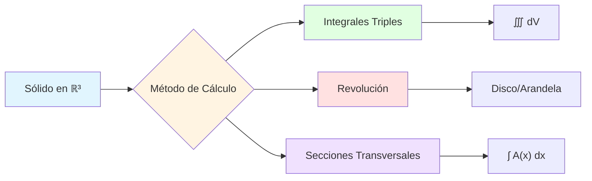
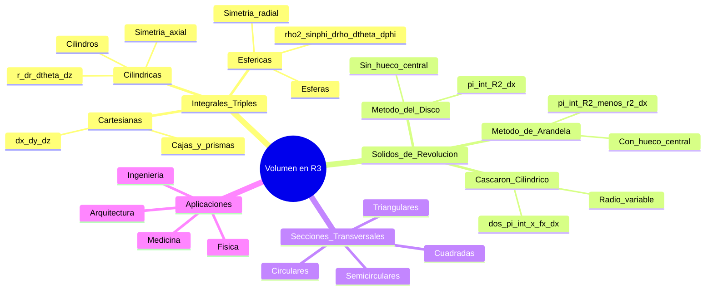

# 📐 Volumen de Sólidos en ℝ³

## 🎯 Introducción

> [!info]- 💡 ¿Qué es el Volumen de Sólidos en ℝ³?
> 
> El **volumen de sólidos en ℝ³** es la medida del espacio tridimensional que ocupa un objeto geométrico. En cálculo vectorial, utilizamos integrales múltiples para calcular estos volúmenes, extendiendo los conceptos de área a tres dimensiones.
> 
> **Analogía práctica:** Imagina llenar un recipiente con agua. El volumen es:
> 
> - **Cantidad de agua** necesaria para llenarlo completamente
> - **Espacio tridimensional** que ocupa el recipiente
> - **Suma infinita** de capas infinitesimales apiladas
> 
> **¿Por qué es importante?**
> 
> |Aspecto|Descripción|Ejemplo de Uso|
> |---|---|---|
> |**Ingeniería**|Cálculo de capacidades|Tanques, tuberías, estructuras|
> |**Física**|Masa y densidad|Centro de masa, momentos de inercia|
> |**Arquitectura**|Volúmenes de construcción|Diseño de edificios, espacios|
> |**Medicina**|Volúmenes de órganos|Imágenes médicas, diagnóstico|
> |**Manufactura**|Materiales necesarios|Fundición, moldes, costos|



---

## 📊 Métodos Fundamentales para Calcular Volúmenes

### 🔷 1. Integrales Triples

> [!example]- 📐 Concepto y Aplicación
> 
> La **integral triple** calcula el volumen dividiendo el sólido en elementos infinitesimales de volumen **dV**.
> 
> **Fórmula general:**
> 
> $$V = \iiint_R dV = \iiint_R dx,dy,dz$$
> 
> **Tipos de coordenadas:**
> 
> |Sistema|Elemento de Volumen|Cuándo Usar|
> |---|---|---|
> |**Cartesianas**|$dV = dx,dy,dz$|Cajas, prismas, formas rectangulares|
> |**Cilíndricas**|$dV = r,dr,d\theta,dz$|Cilindros, conos, simetría axial|
> |**Esféricas**|$dV = \rho^2\sin\phi,d\rho,d\theta,d\phi$|Esferas, conos, simetría radial|
> 
> **Ejemplo 1: Paralelepípedo**
> 
> Calcular el volumen de la región: $$R: 0 \leq x \leq 2, \quad 0 \leq y \leq 3, \quad 0 \leq z \leq 4$$
> 
> **Solución:**
> 
> $$V = \int_0^2 \int_0^3 \int_0^4 dz,dy,dx$$
> 
> $$= \int_0^2 \int_0^3 [z]_0^4 dy,dx = \int_0^2 \int_0^3 4,dy,dx$$
> 
> $$= \int_0^2 [4y]_0^3 dx = \int_0^2 12,dx$$
> 
> $$= [12x]_0^2 = 24 \text{ unidades cúbicas}$$
> 
> **Ejemplo 2: Región más compleja**
> 
> Volumen bajo el plano $z = 6 - 2x - 3y$ en el primer octante:
> 
> $$V = \int_0^3 \int_0^{(6-2x)/3} \int_0^{6-2x-3y} dz,dy,dx$$
> 
> **Visualización del proceso:**
> 
> ```mermaid
> graph TD
>     A[Región R en ℝ³] --> B[Dividir en capas]
>     B --> C[Integrar en z]
>     C --> D[Integrar en y]
>     D --> E[Integrar en x]
>     E --> F[Volumen Total]
>     
>     B --> G[dV = dz dy dx]
>     
>     style A fill:#e1f5ff
>     style C fill:#e1ffe1
>     style D fill:#fff4e1
>     style E fill:#ffe1e1
>     style F fill:#f0e1ff
> ```

### 🔄 2. Sólidos de Revolución

> [!success]- 🌀 Método del Disco y la Arandela
> 
> **Concepto:** Rotar una región plana alrededor de un eje genera un sólido tridimensional.
> 
> **Métodos principales:**
> 
> |Método|Fórmula|Cuándo Usar|Diagrama|
> |---|---|---|---|
> |**Disco**|$V = \pi \int_a^b [R(x)]^2 dx$|Región entre curva y eje|⭕|
> |**Arandela**|$V = \pi \int_a^b ([R(x)]^2 - [r(x)]^2) dx$|Región entre dos curvas|🔵⚪|
> |**Cascarón**|$V = 2\pi \int_a^b x \cdot f(x) dx$|Más fácil cuando radio es x|🥫|
> 
> **Ejemplo 1: Método del Disco**
> 
> Rotar $y = \sqrt{x}$ de $x=0$ a $x=4$ alrededor del eje x.
> 
> $$V = \pi \int_0^4 (\sqrt{x})^2 dx = \pi \int_0^4 x,dx$$
> 
> $$= \pi \left[\frac{x^2}{2}\right]_0^4 = \pi \cdot \frac{16}{2} = 8\pi$$
> 
> **Ejemplo 2: Método de la Arandela**
> 
> Región entre $y = x$ y $y = x^2$ de $x=0$ a $x=1$, rotada sobre el eje x.
> 
> - Radio exterior: $R(x) = x$
> - Radio interior: $r(x) = x^2$
> 
> $$V = \pi \int_0^1 (x^2 - (x^2)^2) dx = \pi \int_0^1 (x^2 - x^4) dx$$
> 
> $$= \pi \left[\frac{x^3}{3} - \frac{x^5}{5}\right]_0^1 = \pi \left(\frac{1}{3} - \frac{1}{5}\right) = \frac{2\pi}{15}$$
> 
> **Flujo de decisión:**
> 
> ```mermaid
> flowchart TD
>     A[Región a rotar] --> B{¿Eje de rotación?}
>     B -->|Eje X| C{¿Hueco en el centro?}
>     B -->|Eje Y| D{¿Hueco en el centro?}
>     
>     C -->|No| E[Método del Disco<br/>V = π∫R²dx]
>     C -->|Sí| F[Método de Arandela<br/>V = π∫R²-r² dx]
>     
>     D -->|No| G[Método del Disco<br/>V = π∫R²dy]
>     D -->|Sí| H[Método de Arandela<br/>V = π∫R²-r² dy]
>     
>     E --> I[Calcular integral]
>     F --> I
>     G --> I
>     H --> I
>     
>     style A fill:#e1f5ff
>     style E fill:#e1ffe1
>     style F fill:#fff4e1
>     style I fill:#f0e1ff
> ```

### 📏 3. Método de Secciones Transversales

> [!tip]- ✂️ Integración por Capas
> 
> **Concepto:** El volumen se calcula integrando el área de secciones transversales perpendiculares a un eje.
> 
> **Fórmula general:**
> 
> $$V = \int_a^b A(x) dx$$
> 
> donde $A(x)$ es el área de la sección transversal en la posición $x$.
> 
> **Tipos de secciones comunes:**
> 
> |Forma de Sección|Área A(x)|Aplicaciones|
> |---|---|---|
> |**Cuadrada**|$A(x) = [s(x)]^2$|Base conocida|
> |**Circular**|$A(x) = \pi [r(x)]^2$|Túneles, tuberías|
> |**Triangular**|$A(x) = \frac{1}{2}b(x)h(x)$|Prismas triangulares|
> |**Semicircular**|$A(x) = \frac{\pi}{2}[r(x)]^2$|Arcos, bóvedas|
> 
> **Ejemplo 1: Secciones cuadradas**
> 
> Base en $xy$: región entre $y = x^2$ y $y = 4$ de $x=-2$ a $x=2$. Secciones perpendiculares al eje $x$ son cuadrados.
> 
> Lado del cuadrado: $s(x) = 4 - x^2$
> 
> $$A(x) = [4-x^2]^2 = 16 - 8x^2 + x^4$$
> 
> $$V = \int_{-2}^2 (16 - 8x^2 + x^4) dx$$
> 
> $$= \left[16x - \frac{8x^3}{3} + \frac{x^5}{5}\right]_{-2}^2$$
> 
> $$= 2\left(32 - \frac{64}{3} + \frac{32}{5}\right) = \frac{2048}{15}$$
> 
> **Ejemplo 2: Secciones semicirculares**
> 
> Base: región triangular con vértices $(0,0)$, $(2,0)$, $(0,2)$. Secciones perpendiculares al eje $x$ son semicírculos.
> 
> Diámetro: $d(x) = 2-x$, entonces radio: $r(x) = \frac{2-x}{2}$
> 
> $$A(x) = \frac{\pi}{2}\left(\frac{2-x}{2}\right)^2 = \frac{\pi(2-x)^2}{8}$$
> 
> $$V = \int_0^2 \frac{\pi(2-x)^2}{8} dx = \frac{\pi}{8}\int_0^2 (4-4x+x^2) dx$$
> 
> $$= \frac{\pi}{8}\left[4x - 2x^2 + \frac{x^3}{3}\right]_0^2 = \frac{\pi}{8} \cdot \frac{8}{3} = \frac{\pi}{3}$$
> 
> **Proceso de resolución:**
> 
> ```mermaid
> graph LR
>     A[Identificar base] --> B[Determinar forma<br/>de sección]
>     B --> C[Expresar dimensiones<br/>en función de x o y]
>     C --> D[Calcular área A x]
>     D --> E[Integrar ∫A x dx]
>     E --> F[Volumen total]
>     
>     style A fill:#e1f5ff
>     style C fill:#fff4e1
>     style E fill:#e1ffe1
>     style F fill:#f0e1ff
> ```

---

## 🌍 Coordenadas Cilíndricas y Esféricas

### 🔵 Coordenadas Cilíndricas

> [!note]- 🎯 Sistema Cilíndrico (r, θ, z)
> 
> **Transformación desde cartesianas:**
> 
> $$\begin{cases} x = r\cos\theta \ y = r\sin\theta \ z = z \end{cases} \qquad \begin{cases} r = \sqrt{x^2 + y^2} \ \theta = \arctan(y/x) \ z = z \end{cases}$$
> 
> **Elemento de volumen:**
> 
> $$dV = r,dr,d\theta,dz$$
> 
> **El factor $r$ es CRÍTICO** - representa el Jacobiano de la transformación.
> 
> **Cuándo usar cilíndricas:**
> 
> |Situación|Razón|Ejemplo|
> |---|---|---|
> |**Simetría circular**|Simplifica límites|Cilindros, conos|
> |**Rotación sobre eje z**|Coordenada θ natural|Sólidos de revolución|
> |**Problemas con $x^2+y^2$**|Se convierte en $r^2$|Paraboloides circulares|
> 
> **Ejemplo 1: Cilindro sólido**
> 
> Cilindro de radio 3 y altura 5:
> 
> $$V = \int_0^{2\pi} \int_0^3 \int_0^5 r,dz,dr,d\theta$$
> 
> $$= \int_0^{2\pi} \int_0^3 5r,dr,d\theta = \int_0^{2\pi} \left[\frac{5r^2}{2}\right]_0^3 d\theta$$
> 
> $$= \int_0^{2\pi} \frac{45}{2} d\theta = \frac{45}{2} \cdot 2\pi = 45\pi$$
> 
> **Ejemplo 2: Paraboloide**
> 
> Región bajo $z = 4-r^2$ sobre el círculo $r \leq 2$:
> 
> $$V = \int_0^{2\pi} \int_0^2 \int_0^{4-r^2} r,dz,dr,d\theta$$
> 
> $$= \int_0^{2\pi} \int_0^2 r(4-r^2) dr,d\theta = \int_0^{2\pi} \int_0^2 (4r-r^3) dr,d\theta$$
> 
> $$= \int_0^{2\pi} \left[2r^2 - \frac{r^4}{4}\right]_0^2 d\theta = \int_0^{2\pi} (8-4) d\theta = 8\pi$$
> 
> **Visualización:**
> 
> ```mermaid
> graph TD
>     A[Coordenadas<br/>Cilíndricas] --> B[r: distancia al eje z]
>     A --> C[θ: ángulo en plano xy]
>     A --> D[z: altura]
>     
>     B --> E[0 ≤ r ≤ R]
>     C --> F[0 ≤ θ ≤ 2π]
>     D --> G[z₁ ≤ z ≤ z₂]
>     
>     E --> H[dV = r dr dθ dz]
>     F --> H
>     G --> H
>     
>     style A fill:#e1f5ff
>     style H fill:#e1ffe1
> ```

### 🌐 Coordenadas Esféricas

> [!success]- 🔮 Sistema Esférico (ρ, θ, φ)
> 
> **Transformación desde cartesianas:**
> 
> $$\begin{cases} x = \rho\sin\phi\cos\theta \ y = \rho\sin\phi\sin\theta \ z = \rho\cos\phi \end{cases} \qquad \begin{cases} \rho = \sqrt{x^2+y^2+z^2} \ \theta = \arctan(y/x) \ \phi = \arccos(z/\rho) \end{cases}$$
> 
> **Elemento de volumen:**
> 
> $$dV = \rho^2\sin\phi,d\rho,d\theta,d\phi$$
> 
> **Variables:**
> 
> |Variable|Nombre|Rango|Significado|
> |---|---|---|---|
> |**ρ** (rho)|Radio esférico|$\rho \geq 0$|Distancia al origen|
> |**θ** (theta)|Ángulo azimutal|$0 \leq \theta \leq 2\pi$|Rotación en xy|
> |**φ** (phi)|Ángulo polar|$0 \leq \phi \leq \pi$|Ángulo desde eje z+|
> 
> **Cuándo usar esféricas:**
> 
> - Esferas y casquetes esféricos
> - Conos con vértice en el origen
> - Problemas con $x^2+y^2+z^2$
> - Simetría radial desde el origen
> 
> **Ejemplo 1: Esfera completa**
> 
> Esfera de radio $a$: $x^2+y^2+z^2 \leq a^2$
> 
> $$V = \int_0^{2\pi} \int_0^\pi \int_0^a \rho^2\sin\phi,d\rho,d\phi,d\theta$$
> 
> $$= \int_0^{2\pi} \int_0^\pi \left[\frac{\rho^3}{3}\right]_0^a \sin\phi,d\phi,d\theta$$
> 
> $$= \frac{a^3}{3} \int_0^{2\pi} \int_0^\pi \sin\phi,d\phi,d\theta$$
> 
> $$= \frac{a^3}{3} \int_0^{2\pi} [-\cos\phi]_0^\pi d\theta = \frac{a^3}{3} \int_0^{2\pi} 2,d\theta$$
> 
> $$= \frac{2a^3}{3} \cdot 2\pi = \frac{4\pi a^3}{3}$$
> 
> **Ejemplo 2: Cono esférico**
> 
> Interior del cono $\phi = \pi/6$ (30°) hasta $\rho = 2$:
> 
> $$V = \int_0^{2\pi} \int_0^{\pi/6} \int_0^2 \rho^2\sin\phi,d\rho,d\phi,d\theta$$
> 
> $$= \int_0^{2\pi} \int_0^{\pi/6} \frac{8}{3}\sin\phi,d\phi,d\theta$$
> 
> $$= \frac{8}{3} \int_0^{2\pi} [-\cos\phi]_0^{\pi/6} d\theta = \frac{8}{3} \int_0^{2\pi} (1-\frac{\sqrt{3}}{2}) d\theta$$
> 
> $$= \frac{8}{3}(2-\sqrt{3}) \cdot 2\pi = \frac{16\pi}{3}(2-\sqrt{3})$$
> 
> **Comparación de sistemas:**
> 
> ```mermaid
> graph TD
>     A[¿Qué coordenadas usar?] --> B{Simetría}
>     
>     B -->|Rectangular| C[Cartesianas<br/>dV = dx dy dz]
>     B -->|Circular en xy| D[Cilíndricas<br/>dV = r dr dθ dz]
>     B -->|Radial desde origen| E[Esféricas<br/>dV = ρ²sinφ dρ dθ dφ]
>     
>     C --> F[Cajas, prismas]
>     D --> G[Cilindros, conos<br/>eje z]
>     E --> H[Esferas, conos<br/>origen]
>     
>     style C fill:#ffe1e1
>     style D fill:#fff4e1
>     style E fill:#e1ffe1
> ```

---

## 🎓 Problemas Tipo y Estrategias

### 📝 Clasificación de Problemas

> [!example]- 🔍 Identificar el Método Apropiado
> 
> **Árbol de decisión:**
> 
> ```mermaid
> flowchart TD
>     A[Problema de volumen] --> B{¿Tipo de región?}
>     
>     B -->|Delimitada por<br/>funciones| C{¿Hay rotación?}
>     B -->|Forma geométrica<br/>estándar| D[Fórmulas directas]
>     
>     C -->|Sí| E{¿Alrededor de<br/>qué eje?}
>     C -->|No| F{¿Secciones<br/>conocidas?}
>     
>     E -->|Eje coordenado| G[Disco/Arandela]
>     E -->|Eje paralelo| H[Cascarón]
>     
>     F -->|Sí| I[Secciones<br/>transversales]
>     F -->|No| J{¿Simetría?}
>     
>     J -->|Circular xy| K[Cilíndricas]
>     J -->|Radial origen| L[Esféricas]
>     J -->|Ninguna| M[Cartesianas]
>     
>     style G fill:#e1ffe1
>     style I fill:#fff4e1
>     style K fill:#e1f5ff
>     style L fill:#f0e1ff
>     style M fill:#ffe1e1
> ```
> 
> **Tabla de estrategias:**
> 
> |Descripción del Problema|Método Recomendado|Pista Clave|
> |---|---|---|
> |"Rotar región alrededor del eje x"|Disco/Arandela|Palabra "rotar"|
> |"Secciones perpendiculares son cuadrados"|Secciones transversales|"Secciones" dadas|
> |"Cilindro de radio..."|Cilíndricas|$x^2+y^2$ o "cilindro"|
> |"Esfera de radio..."|Esféricas|$x^2+y^2+z^2$ o "esfera"|
> |"Región acotada por..."|Integral triple|Múltiples superficies|

### 🏆 Problemas Resueltos Paso a Paso

> [!tip]- 💪 Ejercicios Completos
> 
> **Problema 1: Volumen entre dos superficies**
> 
> Calcular el volumen de la región acotada por:
> 
> - $z = x^2 + y^2$ (paraboloide)
> - $z = 8 - x^2 - y^2$ (paraboloide invertido)
> 
> **Solución:**
> 
> **Paso 1:** Encontrar la intersección: $$x^2 + y^2 = 8 - x^2 - y^2$$ $$2(x^2 + y^2) = 8$$ $$x^2 + y^2 = 4 \quad \Rightarrow \quad r = 2$$
> 
> **Paso 2:** Usar cilíndricas (simetría circular):
> 
> $$V = \int_0^{2\pi} \int_0^2 \int_{r^2}^{8-r^2} r,dz,dr,d\theta$$
> 
> **Paso 3:** Integrar en $z$:
> 
> $$= \int_0^{2\pi} \int_0^2 r[(8-r^2) - r^2] dr,d\theta$$
> 
> $$= \int_0^{2\pi} \int_0^2 r(8-2r^2) dr,d\theta$$
> 
> **Paso 4:** Integrar en $r$:
> 
> $$= \int_0^{2\pi} \int_0^2 (8r - 2r^3) dr,d\theta$$
> 
> $$= \int_0^{2\pi} \left[4r^2 - \frac{r^4}{2}\right]_0^2 d\theta$$
> 
> $$= \int_0^{2\pi} (16 - 8) d\theta = 8 \cdot 2\pi = 16\pi$$
> 
> **Respuesta:** $V = 16\pi$ unidades cúbicas
> 
> ---
> 
> **Problema 2: Sólido de revolución con hueco**
> 
> Rotar alrededor del eje $x$ la región entre:
> 
> - $y = x^2$ (parábola)
> - $y = 2x$ (recta)
> - de $x = 0$ a $x = 2$
> 
> **Solución:**
> 
> **Paso 1:** Identificar radios:
> 
> - Radio exterior: $R(x) = 2x$
> - Radio interior: $r(x) = x^2$
> 
> **Paso 2:** Verificar intersecciones: $$x^2 = 2x \Rightarrow x(x-2) = 0$$ Puntos: $x = 0$ y $x = 2$ ✓
> 
> **Paso 3:** Aplicar método de arandela:
> 
> $$V = \pi \int_0^2 [(2x)^2 - (x^2)^2] dx$$
> 
> $$= \pi \int_0^2 (4x^2 - x^4) dx$$
> 
> **Paso 4:** Integrar:
> 
> $$= \pi \left[\frac{4x^3}{3} - \frac{x^5}{5}\right]_0^2$$
> 
> $$= \pi \left(\frac{32}{3} - \frac{32}{5}\right) = \pi \cdot \frac{160-96}{15} = \frac{64\pi}{15}$$
> 
> **Respuesta:** $V = \frac{64\pi}{15}$ unidades cúbicas
> 
> ---
> 
> **Problema 3: Hemisferio usando esféricas**
> 
> Calcular el volumen del hemisferio superior de radio 3.
> 
> **Solución:**
> 
> **Paso 1:** Definir límites:
> 
> - $0 \leq \rho \leq 3$ (radio de 0 a 3)
> - $0 \leq \theta \leq 2\pi$ (vuelta completa)
> - $0 \leq \phi \leq \pi/2$ (solo hemisferio superior)
> 
> **Paso 2:** Plantear integral:
> 
> $$V = \int_0^{2\pi} \int_0^{\pi/2} \int_0^3 \rho^2\sin\phi,d\rho,d\phi,d\theta$$
> 
> **Paso 3:** Integrar en $\rho$:
> 
> $$= \int_0^{2\pi} \int_0^{\pi/2} \left[\frac{\rho^3}{3}\right]_0^3 \sin\phi,d\phi,d\theta$$
> 
> $$= 9\int_0^{2\pi} \int_0^{\pi/2} \sin\phi,d\phi,d\theta$$
> 
> **Paso 4:** Integrar en $\phi$:
> 
> $$= 9\int_0^{2\pi} [-\cos\phi]_0^{\pi/2} d\theta = 9\int_0^{2\pi} (0-(-1)) d\theta$$
> 
> $$= 9\int_0^{2\pi} 1,d\theta = 9 \cdot 2\pi = 18\pi$$
> 
> **Verificación:** Fórmula: $V_{\text{esfera}} = \frac{4\pi r^3}{3} = \frac{4\pi(3)^3}{3} = 36\pi$
> 
> Hemisferio = $\frac{36\pi}{2} = 18\pi$ ✓
> 
> **Respuesta:** $V = 18\pi$ unidades cúbicas

---

## 📐 Aplicaciones Prácticas

### 🏗️ Ingeniería y Física

> [!note]- 🔧 Casos Reales> **1. Tanque de almacenamiento**
> 
> Tanque cilíndrico con tapa semiesférica de radio $R = 2$ m y altura cilíndrica $h = 5$ m.
> 
> **Volumen del cilindro:** $$V_{\text{cil}} = \pi R^2 h = \pi(2)^2(5) = 20\pi \text{ m}^3$$
> 
> **Volumen del hemisferio:** $$V_{\text{hem}} = \frac{2}{3}\pi R^3 = \frac{2}{3}\pi(2)^3 = \frac{16\pi}{3} \text{ m}^3$$
> 
> **Volumen total:** $$V_{\text{total}} = 20\pi + \frac{16\pi}{3} = \frac{76\pi}{3} \approx 79.59 \text{ m}^3$$
> 
> ---
> 
> **2. Centro de masa**
> 
> Para un sólido con densidad $\delta(x,y,z)$:
> 
> $$\bar{x} = \frac{1}{M} \iiint_R x\delta,dV$$
> 
> donde $M = \iiint_R \delta,dV$ es la masa total.
> 
> **Ejemplo:** Hemisferio de densidad constante $\delta = 1$, radio $a$.
> 
> Por simetría: $\bar{x} = \bar{y} = 0$
> 
> $$\bar{z} = \frac{\iiint_R z,dV}{\iiint_R dV}$$
> 
> Usando esféricas: $z = \rho\cos\phi$
> 
> $$\bar{z} = \frac{\int_0^{2\pi}\int_0^{\pi/2}\int_0^a \rho\cos\phi \cdot \rho^2\sin\phi,d\rho,d\phi,d\theta}{\frac{2\pi a^3}{3}}$$
> 
> Resultado: $\bar{z} = \frac{3a}{8}$
> 
> **Aplicación:** El centro de masa está a 3/8 del radio desde la base.
> 
> ---
> 
> **Tabla de aplicaciones:**
> 
> |Área|Problema|Método|Uso|
> |---|---|---|---|
> |**Hidráulica**|Volumen de agua en presa|Integrales triples|Capacidad|
> |**Mecánica**|Momento de inercia|$\iiint r^2\delta,dV$|Rotación|
> |**Arquitectura**|Volumen de cúpula|Esféricas|Materiales|
> |**Medicina**|Volumen de tumor|Secciones CT|Diagnóstico|
> |**Manufactura**|Material necesario|Sólidos de revolución|Costos|

---

## 📊 Resumen y Comparación de Métodos

### 🎯 Tabla Comparativa Completa

|Método|Fórmula|Ventajas|Desventajas|Mejor Para|
|---|---|---|---|---|
|**Integral Triple Cartesiana**|$\iiint dx,dy,dz$|Directa, versátil|Límites complejos|Regiones rectangulares|
|**Cilíndricas**|$\iiint r,dr,d\theta,dz$|Simplifica simetría circular|Requiere conversión|Cilindros, conos|
|**Esféricas**|$\iiint \rho^2\sin\phi,d\rho,d\theta,d\phi$|Ideal para esferas|Compleja para otros|Esferas, simetría radial|
|**Disco**|$\pi\int R^2,dx$|Simple, una variable|Solo sólidos de revolución|Rotación sin hueco|
|**Arandela**|$\pi\int (R^2-r^2) dx$|Maneja huecos|Dos funciones necesarias|Rotación con hueco|
|**Secciones**|$\int A(x),dx$|Áreas generales|Requiere geometría|Formas irregulares|

### 🗺️ Mapa Mental del Tema



---

## ✅ Checklist de Resolución

> [!success]- 📋 Guía Paso a Paso
> 
> **Antes de empezar:**
> 
> - [ ] Leer el problema completo
> - [ ] Identificar qué se pide (volumen de...)
> - [ ] Hacer un bosquejo del sólido
> - [ ] Identificar simetrías
> 
> **Selección del método:**
> 
> - [ ] ¿Hay rotación? → Disco/Arandela/Cascarón
> - [ ] ¿Secciones conocidas? → Secciones transversales
> - [ ] ¿Simetría circular en xy? → Cilíndricas
> - [ ] ¿Simetría radial? → Esféricas
> - [ ] ¿Ninguna de las anteriores? → Cartesianas
> 
> **Durante la resolución:**
> 
> - [ ] Establecer límites de integración
> - [ ] Verificar el elemento de volumen (dV, r, ρ²sinφ)
> - [ ] Integrar en el orden correcto
> - [ ] Verificar signos y constantes
> 
> **Al finalizar:**
> 
> - [ ] Verificar unidades (unidades³)
> - [ ] Comprobar que el resultado tiene sentido
> - [ ] Si es posible, verificar con fórmula conocida

---

## 🎓 Ejercicios Propuestos

> [!example]- 💪 Práctica Progresiva
> 
> **Nivel Básico:**
> 
> 1. Calcular el volumen del sólido delimitado por:
>     
>     - $0 \leq x \leq 3$
>     - $0 \leq y \leq 2$
>     - $0 \leq z \leq 5$
> 2. Rotar $y = x$ de $x=0$ a $x=4$ alrededor del eje $x$.
>     
> 3. Volumen del cilindro $x^2+y^2 \leq 4$, $0 \leq z \leq 3$.
>     
> 
> **Nivel Intermedio:**
> 
> 4. Región entre $y = x^2$ y $y = 4$ rotada sobre el eje $x$.
>     
> 5. Volumen bajo $z = 9-x^2-y^2$ y sobre el plano $xy$.
>     
> 6. Esfera $x^2+y^2+z^2 \leq 9$ usando esféricas.
>     
> 
> **Nivel Avanzado:**
> 
> 7. Sólido acotado por $z = x^2+y^2$ y $z = 2y$.
>     
> 8. Región dentro de $x^2+y^2+z^2 = 4$ y fuera de $z = \sqrt{x^2+y^2}$.
>     
> 9. Base triangular con vértices $(0,0)$, $(1,0)$, $(0,1)$ y secciones perpendiculares al eje $x$ que son semicírculos.
>     

---

## 🔗 Conexión con Próximos Temas

> [!quote]- 🌟 Continuando el Aprendizaje
> 
> **Has dominado:**
> 
> - ✅ Integrales triples en diferentes coordenadas
> - ✅ Sólidos de revolución
> - ✅ Método de secciones transversales
> - ✅ Cambio entre sistemas de coordenadas
> 
> **Próximos pasos naturales:**
> 
> |Tema Actual|Siguiente Tema|Conexión|
> |---|---|---|
> |Volumen de sólidos|**Integrales de superficie**|De volumen 3D a área 2D en ℝ³|
> |Coordenadas cilíndricas/esféricas|**Integrales de línea**|Parametrización de curvas|
> |Cambio de coordenadas|**Jacobiano general**|Transformaciones más complejas|
> |Aplicaciones físicas|**Teoremas de Green, Gauss, Stokes**|Relaciones fundamentales|
> 
> **Roadmap:**
> 
> ```mermaid
> graph LR
>     A[Volumen de Sólidos] --> B[Integrales de Superficie]
>     B --> C[Teoremas Integrales]
>     C --> D[Campos Vectoriales]
>     D --> E[Aplicaciones Físicas]
>     
>     A -.-> F[Coordenadas Curvilíneas]
>     F -.-> G[Tensores]
>     
>     style A fill:#e1ffe1
>     style B fill:#fff4e1
>     style C fill:#e1f5ff
>     style D fill:#f0e1ff
> ```

---

**Tags:** #cálculo-vectorial #volumen #integrales-triples #coordenadas-cilíndricas #coordenadas-esféricas #sólidos-revolución #secciones-transversales #aplicaciones #física #ingeniería