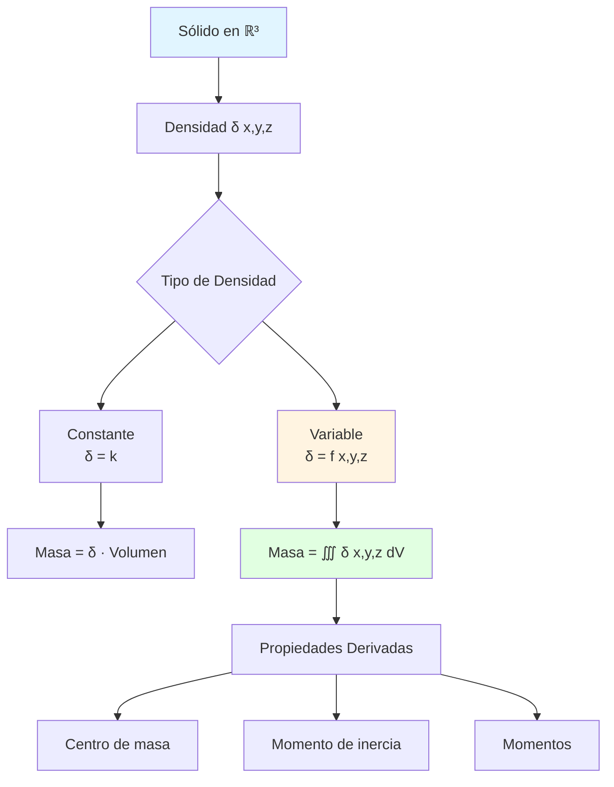
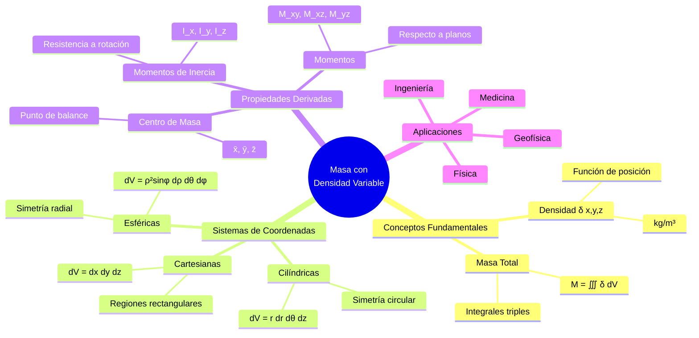

# ⚖️ Masa de un Sólido con Densidad Variable

## 🎯 Introducción

> [!info]- 💡 ¿Qué es la Masa con Densidad Variable?
> 
> La **masa de un sólido con densidad variable** es la cantidad total de materia contenida en un objeto cuya densidad cambia de punto a punto en el espacio. A diferencia de objetos homogéneos, aquí la densidad es una función de la posición: $\delta(x,y,z)$.
> 
> **Analogía práctica:** Imagina una pieza de metal donde:
> 
> - El **centro es más denso** que los bordes (como una aleación gradual)
> - La **composición cambia** con la profundidad (como capas geológicas)
> - La **temperatura afecta** la densidad local (como materiales bajo estrés térmico)
> 
> **¿Por qué es importante?**
> 
> |Aspecto|Descripción|Ejemplo de Uso|
> |---|---|---|
> |**Diseño estructural**|Distribución de material|Vigas con refuerzos variables|
> |**Materiales compuestos**|Múltiples densidades|Fibra de carbono + resina|
> |**Geofísica**|Densidad varía con profundidad|Corteza terrestre, núcleo|
> |**Medicina**|Tejidos con densidades diferentes|Hueso, músculo, grasa|
> |**Astrofísica**|Estrellas y planetas|Densidad radial variable|



---

## 📐 Fundamentos Matemáticos

### 🔢 Concepto de Densidad

> [!note]- 📊 Densidad como Función
> 
> **Definición:**
> 
> La **densidad** $\delta(x,y,z)$ en un punto $(x,y,z)$ representa la masa por unidad de volumen en ese punto.
> 
> $$\delta(x,y,z) = \lim_{\Delta V \to 0} \frac{\Delta m}{\Delta V}$$
> 
> **Unidades:**
> 
> |Sistema|Unidad|Notación|
> |---|---|---|
> |**SI**|kilogramo/metro³|kg/m³|
> |**CGS**|gramo/centímetro³|g/cm³|
> |**Otros**|libra/pie³|lb/ft³|
> 
> **Tipos de funciones de densidad:**
> 
> |Tipo|Forma|Ejemplo|Interpretación|
> |---|---|---|---|
> |**Constante**|$\delta = k$|$\delta = 5$ kg/m³|Material homogéneo|
> |**Lineal**|$\delta = ax + b$|$\delta = 2x + 3$|Gradiente uniforme|
> |**Radial**|$\delta = f(r)$|$\delta = e^{-r}$|Simetría desde centro|
> |**Esférica**|$\delta = f(\rho)$|$\delta = \frac{1}{\rho^2}$|Simetría radial 3D|
> |**Polinomial**|$\delta = x^2 + y^2$|$\delta = x^2 + y^2 + z^2$|Paraboloidal|
> 
> **Visualización de densidad variable:**
> 
> ```mermaid
> graph LR
>     A[Punto x,y,z] --> B[Densidad δ x,y,z]
>     B --> C{Valor de δ}
>     C -->|Alto| D[Más masa<br/>concentrada]
>     C -->|Bajo| E[Menos masa<br/>concentrada]
>     C -->|Cero| F[Sin masa<br/>vacío]
>     
>     D --> G[Color oscuro<br/>⬛]
>     E --> H[Color claro<br/>⬜]
>     
>     style D fill:#1a1a1a,color:#ffffff
>     style E fill:#e8e8e8
>     style F fill:#ffffff
> ```

### 📏 Fórmula de Masa Total

> [!success]- ⚡ Integral Triple para Masa
> 
> **Fórmula fundamental:**
> 
> $$M = \iiint_R \delta(x,y,z) , dV$$
> 
> donde:
> 
> - $M$ = masa total
> - $R$ = región que ocupa el sólido
> - $\delta(x,y,z)$ = función de densidad
> - $dV$ = elemento de volumen
> 
> **En diferentes coordenadas:**
> 
> |Sistema|Elemento dV|Fórmula de Masa|
> |---|---|---|
> |**Cartesianas**|$dx,dy,dz$|$M = \iiint_R \delta(x,y,z),dx,dy,dz$|
> |**Cilíndricas**|$r,dr,d\theta,dz$|$M = \iiint_R \delta(r,\theta,z),r,dr,d\theta,dz$|
> |**Esféricas**|$\rho^2\sin\phi,d\rho,d\theta,d\phi$|$M = \iiint_R \delta(\rho,\theta,\phi),\rho^2\sin\phi,d\rho,d\theta,d\phi$|
> 
> **Proceso conceptual:**
> 
> ```mermaid
> flowchart TD
>     A[Sólido con densidad variable] --> B[Dividir en elementos infinitesimales]
>     B --> C[Cada elemento tiene volumen dV]
>     C --> D[Masa del elemento: dm = δ x,y,z dV]
>     D --> E[Sumar todos los elementos]
>     E --> F[M = ∭ δ x,y,z dV]
>     
>     style A fill:#e1f5ff
>     style D fill:#fff4e1
>     style F fill:#e1ffe1
> ```
> 
> **Interpretación física:**
> 
> - **dV**: volumen infinitesimal en $(x,y,z)$
> - **δ(x,y,z) dV**: masa de ese elemento
> - **∭**: suma de todas las masas elementales

---

## 🧮 Cálculo de Masa: Ejemplos Fundamentales

### 📦 Coordenadas Cartesianas

> [!example]- 🎲 Problemas en Cartesianas
> 
> **Ejemplo 1: Densidad lineal en x**
> 
> Calcular la masa del cubo $0 \leq x,y,z \leq 2$ con densidad $\delta(x,y,z) = x + 1$.
> 
> **Solución:**
> 
> $$M = \int_0^2 \int_0^2 \int_0^2 (x+1),dz,dy,dx$$
> 
> **Paso 1:** Integrar en $z$:
> 
> $$= \int_0^2 \int_0^2 (x+1)[z]_0^2 dy,dx = \int_0^2 \int_0^2 2(x+1) dy,dx$$
> 
> **Paso 2:** Integrar en $y$:
> 
> $$= \int_0^2 2(x+1)[y]_0^2 dx = \int_0^2 4(x+1) dx$$
> 
> **Paso 3:** Integrar en $x$:
> 
> $$= 4\int_0^2 (x+1) dx = 4\left[\frac{x^2}{2} + x\right]_0^2$$
> 
> $$= 4\left(2 + 2\right) = 16 \text{ unidades de masa}$$
> 
> **Interpretación:** Aunque el volumen es 8 unidades³, la masa es 16 porque la densidad promedio es 2 (evaluada en el centro x=1: δ=2).
> 
> ---
> 
> **Ejemplo 2: Densidad cuadrática**
> 
> Región: $0 \leq x \leq 1$, $0 \leq y \leq 1$, $0 \leq z \leq x+y$
> 
> Densidad: $\delta(x,y,z) = xyz$
> 
> **Solución:**
> 
> $$M = \int_0^1 \int_0^1 \int_0^{x+y} xyz,dz,dy,dx$$
> 
> **Paso 1:** Integrar en $z$:
> 
> $$= \int_0^1 \int_0^1 xy\left[\frac{z^2}{2}\right]_0^{x+y} dy,dx$$
> 
> $$= \int_0^1 \int_0^1 \frac{xy(x+y)^2}{2} dy,dx$$
> 
> $$= \frac{1}{2}\int_0^1 \int_0^1 xy(x^2 + 2xy + y^2) dy,dx$$
> 
> **Paso 2:** Expandir:
> 
> $$= \frac{1}{2}\int_0^1 \int_0^1 (x^3y + 2x^2y^2 + xy^3) dy,dx$$
> 
> **Paso 3:** Integrar en $y$:
> 
> $$= \frac{1}{2}\int_0^1 \left[x^3\frac{y^2}{2} + 2x^2\frac{y^3}{3} + x\frac{y^4}{4}\right]_0^1 dx$$
> 
> $$= \frac{1}{2}\int_0^1 \left(\frac{x^3}{2} + \frac{2x^2}{3} + \frac{x}{4}\right) dx$$
> 
> **Paso 4:** Integrar en $x$:
> 
> $$= \frac{1}{2}\left[\frac{x^4}{8} + \frac{2x^3}{9} + \frac{x^2}{8}\right]_0^1$$
> 
> $$= \frac{1}{2}\left(\frac{1}{8} + \frac{2}{9} + \frac{1}{8}\right) = \frac{1}{2}\left(\frac{1}{4} + \frac{2}{9}\right)$$
> 
> $$= \frac{1}{2} \cdot \frac{9+8}{36} = \frac{17}{72}$$
> 
> **Respuesta:** $M = \frac{17}{72}$ unidades de masa

### 🔵 Coordenadas Cilíndricas

> [!tip]- 🎯 Densidad con Simetría Circular
> 
> **Cuándo usar cilíndricas:**
> 
> - Densidad depende de la distancia al eje $z$: $\delta = f(r)$
> - Geometría cilíndrica o cónica
> - Aparece $x^2 + y^2$ en la densidad
> 
> **Conversión de densidad:**
> 
> Si $\delta(x,y,z) = x^2 + y^2 + z$, entonces:
> 
> $$\delta(r,\theta,z) = r^2 + z$$
> 
> **Ejemplo 1: Cilindro con densidad radial**
> 
> Cilindro sólido: $r \leq 2$, $0 \leq z \leq 3$
> 
> Densidad: $\delta(r,\theta,z) = r$ (más denso lejos del eje)
> 
> **Solución:**
> 
> $$M = \int_0^{2\pi} \int_0^2 \int_0^3 r \cdot r,dz,dr,d\theta$$
> 
> **Nota:** El primer $r$ es la densidad, el segundo es el Jacobiano.
> 
> $$= \int_0^{2\pi} \int_0^2 r^2[z]_0^3 dr,d\theta$$
> 
> $$= 3\int_0^{2\pi} \int_0^2 r^2,dr,d\theta$$
> 
> $$= 3\int_0^{2\pi} \left[\frac{r^3}{3}\right]_0^2 d\theta$$
> 
> $$= 3\int_0^{2\pi} \frac{8}{3} d\theta = 8\int_0^{2\pi} d\theta = 16\pi$$
> 
> **Respuesta:** $M = 16\pi$ unidades de masa
> 
> ---
> 
> **Ejemplo 2: Paraboloide con densidad z**
> 
> Región bajo $z = 4 - r^2$ sobre el disco $r \leq 2$
> 
> Densidad: $\delta = z$ (más denso arriba)
> 
> **Solución:**
> 
> $$M = \int_0^{2\pi} \int_0^2 \int_0^{4-r^2} z \cdot r,dz,dr,d\theta$$
> 
> $$= \int_0^{2\pi} \int_0^2 r\left[\frac{z^2}{2}\right]_0^{4-r^2} dr,d\theta$$
> 
> $$= \frac{1}{2}\int_0^{2\pi} \int_0^2 r(4-r^2)^2 dr,d\theta$$
> 
> $$= \frac{1}{2}\int_0^{2\pi} \int_0^2 r(16 - 8r^2 + r^4) dr,d\theta$$
> 
> $$= \frac{1}{2}\int_0^{2\pi} \int_0^2 (16r - 8r^3 + r^5) dr,d\theta$$
> 
> $$= \frac{1}{2}\int_0^{2\pi} \left[8r^2 - 2r^4 + \frac{r^6}{6}\right]_0^2 d\theta$$
> 
> $$= \frac{1}{2}\int_0^{2\pi} \left(32 - 32 + \frac{64}{6}\right) d\theta$$
> 
> $$= \frac{1}{2} \cdot \frac{64}{6} \cdot 2\pi = \frac{64\pi}{6} = \frac{32\pi}{3}$$
> 
> **Respuesta:** $M = \frac{32\pi}{3}$ unidades de masa
> 
> **Tabla de densidades comunes en cilíndricas:**
> 
> |Densidad|Expresión|Significado Físico|
> |---|---|---|
> |$\delta = r$|Lineal radial|Más denso lejos del eje|
> |$\delta = r^2$|Cuadrática radial|Densidad crece rápidamente|
> |$\delta = e^{-r}$|Exponencial decreciente|Máxima en el eje|
> |$\delta = z$|Lineal vertical|Más denso arriba|
> |$\delta = r + z$|Combinada|Crece en ambas direcciones|

### 🌐 Coordenadas Esféricas

> [!success]- 🔮 Densidad con Simetría Radial
> 
> **Cuándo usar esféricas:**
> 
> - Densidad depende solo de la distancia al origen: $\delta = f(\rho)$
> - Geometría esférica
> - Aparece $x^2 + y^2 + z^2$ en la densidad
> 
> **Conversión de densidad:**
> 
> Si $\delta(x,y,z) = \sqrt{x^2+y^2+z^2}$, entonces:
> 
> $$\delta(\rho,\theta,\phi) = \rho$$
> 
> **Ejemplo 1: Esfera con densidad radial**
> 
> Esfera de radio $a$ con densidad $\delta = \rho$ (más denso lejos del centro)
> 
> **Solución:**
> 
> $$M = \int_0^{2\pi} \int_0^\pi \int_0^a \rho \cdot \rho^2\sin\phi,d\rho,d\phi,d\theta$$
> 
> **Nota:** El primer $\rho$ es densidad, $\rho^2\sin\phi$ es el Jacobiano.
> 
> $$= \int_0^{2\pi} \int_0^\pi \int_0^a \rho^3\sin\phi,d\rho,d\phi,d\theta$$
> 
> $$= \int_0^{2\pi} \int_0^\pi \left[\frac{\rho^4}{4}\right]_0^a \sin\phi,d\phi,d\theta$$
> 
> $$= \frac{a^4}{4}\int_0^{2\pi} \int_0^\pi \sin\phi,d\phi,d\theta$$
> 
> $$= \frac{a^4}{4}\int_0^{2\pi} [-\cos\phi]_0^\pi d\theta$$
> 
> $$= \frac{a^4}{4}\int_0^{2\pi} 2,d\theta = \frac{a^4}{2} \cdot 2\pi = \pi a^4$$
> 
> **Respuesta:** $M = \pi a^4$ unidades de masa
> 
> ---
> 
> **Ejemplo 2: Densidad inversamente proporcional**
> 
> Esfera de radio 3 con $\delta = \frac{k}{\rho^2}$ (más denso cerca del centro)
> 
> $$M = \int_0^{2\pi} \int_0^\pi \int_0^3 \frac{k}{\rho^2} \cdot \rho^2\sin\phi,d\rho,d\phi,d\theta$$
> 
> **Simplificación:** $\frac{k}{\rho^2} \cdot \rho^2 = k$
> 
> $$= \int_0^{2\pi} \int_0^\pi \int_0^3 k\sin\phi,d\rho,d\phi,d\theta$$
> 
> $$= k\int_0^{2\pi} \int_0^\pi [\rho]_0^3 \sin\phi,d\phi,d\theta$$
> 
> $$= 3k\int_0^{2\pi} [-\cos\phi]_0^\pi d\theta$$
> 
> $$= 3k\int_0^{2\pi} 2,d\theta = 12k\pi$$
> 
> **Respuesta:** $M = 12k\pi$ unidades de masa
> 
> **Observación importante:** La densidad $\delta = \frac{k}{\rho^2}$ se cancela exactamente con parte del Jacobiano, resultando en densidad constante equivalente.
> 
> ---
> 
> **Ejemplo 3: Hemisferio con densidad z**
> 
> Hemisferio superior de radio 2: $\rho \leq 2$, $0 \leq \phi \leq \pi/2$
> 
> Densidad: $\delta = z = \rho\cos\phi$
> 
> **Solución:**
> 
> $$M = \int_0^{2\pi} \int_0^{\pi/2} \int_0^2 \rho\cos\phi \cdot \rho^2\sin\phi,d\rho,d\phi,d\theta$$
> 
> $$= \int_0^{2\pi} \int_0^{\pi/2} \int_0^2 \rho^3\cos\phi\sin\phi,d\rho,d\phi,d\theta$$
> 
> $$= \int_0^{2\pi} \int_0^{\pi/2} \left[\frac{\rho^4}{4}\right]_0^2 \cos\phi\sin\phi,d\phi,d\theta$$
> 
> $$= 4\int_0^{2\pi} \int_0^{\pi/2} \cos\phi\sin\phi,d\phi,d\theta$$
> 
> **Usar:** $\sin\phi\cos\phi = \frac{1}{2}\sin(2\phi)$
> 
> $$= 2\int_0^{2\pi} \int_0^{\pi/2} \sin(2\phi),d\phi,d\theta$$
> 
> $$= 2\int_0^{2\pi} \left[-\frac{\cos(2\phi)}{2}\right]_0^{\pi/2} d\theta$$
> 
> $$= 2\int_0^{2\pi} \left(-\frac{-1}{2} - \left(-\frac{1}{2}\right)\right) d\theta = 2\int_0^{2\pi} 1,d\theta = 4\pi$$
> 
> **Respuesta:** $M = 4\pi$ unidades de masa

---

## 📊 Propiedades Derivadas de la Masa

### 🎯 Centro de Masa

> [!note]- 📍 Punto de Balance del Sólido
> 
> **Definición:**
> 
> El **centro de masa** $(\bar{x}, \bar{y}, \bar{z})$ es el punto donde se concentra toda la masa del sólido para efectos de balance.
> 
> **Fórmulas:**
> 
> $$\bar{x} = \frac{1}{M}\iiint_R x\delta(x,y,z),dV$$
> 
> $$\bar{y} = \frac{1}{M}\iiint_R y\delta(x,y,z),dV$$
> 
> $$\bar{z} = \frac{1}{M}\iiint_R z\delta(x,y,z),dV$$
> 
> donde $M = \iiint_R \delta(x,y,z),dV$ es la masa total.
> 
> **Interpretación física:**
> 
> ```mermaid
> graph TD
>     A[Sólido con densidad variable] --> B[Calcular masa total M]
>     B --> C[Calcular momentos]
>     C --> D[M_yz = ∭ x·δ dV]
>     C --> E[M_xz = ∭ y·δ dV]
>     C --> F[M_xy = ∭ z·δ dV]
>     
>     D --> G[x̄ = M_yz / M]
>     E --> H[ȳ = M_xz / M]
>     F --> I[z̄ = M_xy / M]
>     
>     G --> J[Centro de masa<br/>x̄, ȳ, z̄]
>     H --> J
>     I --> J
>     
>     style A fill:#e1f5ff
>     style B fill:#fff4e1
>     style J fill:#e1ffe1
> ```
> 
> **Ejemplo 1: Cubo con densidad lineal**
> 
> Cubo $0 \leq x,y,z \leq 1$ con $\delta = x + y + z + 1$
> 
> **Paso 1:** Calcular masa:
> 
> $$M = \int_0^1\int_0^1\int_0^1 (x+y+z+1),dx,dy,dz$$
> 
> Por simetría en la integración:
> 
> $$= \int_0^1\int_0^1 \left[\frac{x^2}{2} + xy + xz + x\right]_0^1 dy,dz$$
> 
> $$= \int_0^1\int_0^1 \left(\frac{1}{2} + y + z + 1\right) dy,dz$$
> 
> $$= \int_0^1 \left[\frac{3y}{2} + \frac{y^2}{2} + yz\right]_0^1 dz$$
> 
> $$= \int_0^1 \left(\frac{3}{2} + \frac{1}{2} + z\right) dz = \int_0^1 (2+z) dz$$
> 
> $$= \left[2z + \frac{z^2}{2}\right]_0^1 = \frac{5}{2}$$
> 
> **Paso 2:** Por simetría, $\bar{x} = \bar{y} = \bar{z}$. Calculamos $\bar{x}$:
> 
> $$\bar{x} = \frac{1}{5/2}\int_0^1\int_0^1\int_0^1 x(x+y+z+1),dx,dy,dz$$
> 
> $$= \frac{2}{5}\int_0^1\int_0^1\int_0^1 (x^2+xy+xz+x),dx,dy,dz$$
> 
> Integrando paso a paso (cálculos omitidos):
> 
> $$\bar{x} = \frac{2}{5} \cdot \frac{13}{12} = \frac{13}{30}$$
> 
> Por simetría: $\bar{y} = \bar{z} = \frac{13}{30}$
> 
> **Respuesta:** Centro de masa en $\left(\frac{13}{30}, \frac{13}{30}, \frac{13}{30}\right)$
> 
> **Nota:** Sin densidad (δ=1), estaría en $(1/2, 1/2, 1/2)$. La densidad lo desplaza hacia la esquina $(1,1,1)$.
> 
> ---
> 
> **Ejemplo 2: Hemisferio con densidad z**
> 
> Hemisferio superior $x^2+y^2+z^2 \leq a^2$, $z \geq 0$, con $\delta = z$
> 
> Por simetría: $\bar{x} = \bar{y} = 0$
> 
> Usando esféricas: $z = \rho\cos\phi$
> 
> **Masa:**
> 
> $$M = \int_0^{2\pi}\int_0^{\pi/2}\int_0^a \rho\cos\phi \cdot \rho^2\sin\phi,d\rho,d\phi,d\theta$$
> 
> $$= \frac{\pi a^4}{2}$$ (del ejemplo anterior con $a$ general)
> 
> **Momento respecto a xy:**
> 
> $$M_{xy} = \int_0^{2\pi}\int_0^{\pi/2}\int_0^a \rho\cos\phi \cdot \rho\cos\phi \cdot \rho^2\sin\phi,d\rho,d\phi,d\theta$$
> 
> $$= \int_0^{2\pi}\int_0^{\pi/2}\int_0^a \rho^4\cos^2\phi\sin\phi,d\rho,d\phi,d\theta$$
> 
> $$= \frac{a^5}{5}\int_0^{2\pi}\int_0^{\pi/2} \cos^2\phi\sin\phi,d\phi,d\theta$$
> 
> Sustitución $u = \cos\phi$, $du = -\sin\phi,d\phi$:
> 
> $$= \frac{a^5}{5} \cdot 2\pi \cdot \left[-\frac{\cos^3\phi}{3}\right]_0^{\pi/2} = \frac{a^5}{5} \cdot 2\pi \cdot \frac{1}{3} = \frac{2\pi a^5}{15}$$
> 
> **Centro de masa:**
> 
> $$\bar{z} = \frac{M_{xy}}{M} = \frac{2\pi a^5/15}{\pi a^4/2} = \frac{2a^5}{15} \cdot \frac{2}{a^4} = \frac{4a}{15}$$
> 
> **Respuesta:** $\left(0, 0, \frac{4a}{15}\right)$

### ⚙️ Momentos de Inercia

> [!tip]- 🌀 Resistencia a la Rotación
> 
> **Definición:**
> 
> Los **momentos de inercia** miden la resistencia de un sólido a cambiar su velocidad de rotación alrededor de un eje.
> **Fórmulas para los ejes principales:**
> 
> $$I_x = \iiint_R (y^2 + z^2)\delta(x,y,z),dV$$
> 
> $$I_y = \iiint_R (x^2 + z^2)\delta(x,y,z),dV$$
> 
> $$I_z = \iiint_R (x^2 + y^2)\delta(x,y,z),dV$$
> 
> **Momento polar (respecto al origen):**
> 
> $$I_0 = \iiint_R (x^2 + y^2 + z^2)\delta,dV = I_x + I_y + I_z - I_0$$
> 
> **Relación:** $I_0 = I_x + I_y + I_z$ para ejes perpendiculares
> 
> **Tabla de momentos de inercia:**
> 
> |Eje|Fórmula|Distancia|Significado|
> |---|---|---|---|
> |**Eje x**|$I_x = \int(y^2+z^2)\delta,dV$|$\sqrt{y^2+z^2}$|Rotación alrededor de x|
> |**Eje y**|$I_y = \int(x^2+z^2)\delta,dV$|$\sqrt{x^2+z^2}$|Rotación alrededor de y|
> |**Eje z**|$I_z = \int(x^2+y^2)\delta,dV$|$\sqrt{x^2+y^2}$|Rotación alrededor de z|
> 
> **Ejemplo: Cilindro sólido**
> 
> Cilindro de radio $a$, altura $h$, densidad constante $\delta = \rho_0$
> 
> Momento de inercia respecto al eje z (eje del cilindro):
> 
> $$I_z = \int_0^{2\pi}\int_0^a\int_0^h (r^2)\rho_0 \cdot r,dz,dr,d\theta$$
> 
> $$= \rho_0\int_0^{2\pi}\int_0^a r^3[z]_0^h dr,d\theta$$
> 
> $$= h\rho_0\int_0^{2\pi}\int_0^a r^3,dr,d\theta$$
> 
> $$= h\rho_0\int_0^{2\pi} \left[\frac{r^4}{4}\right]_0^a d\theta$$
> 
> $$= \frac{ha^4\rho_0}{4} \cdot 2\pi = \frac{\pi ha^4\rho_0}{2}$$
> 
> Como $M = \pi a^2 h\rho_0$:
> 
> $$I_z = \frac{Ma^2}{2}$$
> 
> **Interpretación:** Más masa lejos del eje → mayor inercia

---

## 🎯 Problemas Tipo y Estrategias

### 📋 Guía de Resolución

> [!success]- ✅ Metodología Paso a Paso
> 
> **Pasos generales:**
> 
> ```mermaid
> flowchart TD
>     A[Leer problema] --> B[Identificar región R]
>     B --> C[Identificar densidad δ]
>     C --> D{¿Qué simetría?}
>     
>     D -->|Rectangular| E[Cartesianas]
>     D -->|Circular en xy| F[Cilíndricas]
>     D -->|Radial| G[Esféricas]
>     
>     E --> H[Establecer límites]
>     F --> H
>     G --> H
>     
>     H --> I[Plantear integral<br/>M = ∭ δ dV]
>     I --> J[Integrar paso a paso]
>     J --> K[Verificar unidades]
>     K --> L{¿Piden más?}
>     
>     L -->|Centro de masa| M[Calcular x̄, ȳ, z̄]
>     L -->|Momento de inercia| N[Calcular I_x, I_y, I_z]
>     L -->|Solo masa| O[Terminar]
>     
>     style D fill:#fff4e1
>     style I fill:#e1ffe1
>     style L fill:#e1f5ff
> ```
> 
> **Checklist:**
> 
> - [ ] Identificar la región del sólido
> - [ ] Expresar la densidad como función
> - [ ] Elegir sistema de coordenadas apropiado
> - [ ] Convertir densidad al sistema elegido
> - [ ] Establecer límites de integración
> - [ ] Incluir el Jacobiano correcto (r o ρ²sinφ)
> - [ ] Integrar en orden apropiado
> - [ ] Verificar dimensiones del resultado

### 🏆 Problemas Completos Resueltos

> [!example]- 💪 Ejercicios Detallados
> 
> **Problema 1: Cono con densidad altura**
> 
> Calcular la masa del cono sólido $z = \sqrt{x^2+y^2}$, $0 \leq z \leq h$, con densidad $\delta = kz$ (más denso arriba).
> 
> **Solución:**
> 
> **Paso 1:** Usar cilíndricas. El cono es $z = r$, así que $r \leq z \leq h$.
> 
> Mejor: para $z$ fijo, $r \leq z$.
> 
> Límites: $0 \leq r \leq z$, $0 \leq z \leq h$, $0 \leq \theta \leq 2\pi$
> 
> **Paso 2:** Densidad: $\delta = kz$
> 
> $$M = \int_0^{2\pi}\int_0^h\int_0^z kz \cdot r,dr,dz,d\theta$$
> 
> **Paso 3:** Integrar en $r$:
> 
> $$= \int_0^{2\pi}\int_0^h kz\left[\frac{r^2}{2}\right]_0^z dz,d\theta$$
> 
> $$= \frac{k}{2}\int_0^{2\pi}\int_0^h z^3,dz,d\theta$$
> 
> **Paso 4:** Integrar en $z$:
> 
> $$= \frac{k}{2}\int_0^{2\pi} \left[\frac{z^4}{4}\right]_0^h d\theta = \frac{kh^4}{8}\int_0^{2\pi} d\theta$$
> 
> **Paso 5:** Integrar en $\theta$:
> 
> $$= \frac{kh^4}{8} \cdot 2\pi = \frac{\pi kh^4}{4}$$
> 
> **Respuesta:** $M = \frac{\pi kh^4}{4}$
> 
> ---
> 
> **Problema 2: Esfera con densidad inversamente radial**
> 
> Esfera $x^2+y^2+z^2 \leq 4$ con densidad $\delta = \frac{5}{\sqrt{x^2+y^2+z^2}}$
> 
> **Solución:**
> 
> **Paso 1:** Usar esféricas. $\delta = \frac{5}{\rho}$
> 
> Límites: $0 \leq \rho \leq 2$, $0 \leq \phi \leq \pi$, $0 \leq \theta \leq 2\pi$
> 
> **Paso 2:**
> 
> $$M = \int_0^{2\pi}\int_0^\pi\int_0^2 \frac{5}{\rho} \cdot \rho^2\sin\phi,d\rho,d\phi,d\theta$$
> 
> $$= \int_0^{2\pi}\int_0^\pi\int_0^2 5\rho\sin\phi,d\rho,d\phi,d\theta$$
> 
> **Paso 3:** Integrar en $\rho$:
> 
> $$= 5\int_0^{2\pi}\int_0^\pi \left[\frac{\rho^2}{2}\right]_0^2 \sin\phi,d\phi,d\theta$$
> 
> $$= 10\int_0^{2\pi}\int_0^\pi \sin\phi,d\phi,d\theta$$
> 
> **Paso 4:** Integrar en $\phi$:
> 
> $$= 10\int_0^{2\pi} [-\cos\phi]_0^\pi d\theta = 10\int_0^{2\pi} 2,d\theta$$
> 
> **Paso 5:** Integrar en $\theta$:
> 
> $$= 20 \cdot 2\pi = 40\pi$$
> 
> **Respuesta:** $M = 40\pi$
> 
> ---
> 
> **Problema 3: Centro de masa de región con densidad xy**
> 
> Región: $0 \leq x \leq 1$, $0 \leq y \leq 1-x$, $0 \leq z \leq 1$
> 
> Densidad: $\delta = xy$
> 
> **Solución:**
> 
> **Paso 1:** Calcular masa total:
> 
> $$M = \int_0^1\int_0^{1-x}\int_0^1 xy,dz,dy,dx$$
> 
> $$= \int_0^1\int_0^{1-x} xy[z]_0^1 dy,dx = \int_0^1\int_0^{1-x} xy,dy,dx$$
> 
> $$= \int_0^1 x\left[\frac{y^2}{2}\right]_0^{1-x} dx = \frac{1}{2}\int_0^1 x(1-x)^2,dx$$
> 
> $$= \frac{1}{2}\int_0^1 (x - 2x^2 + x^3),dx$$
> 
> $$= \frac{1}{2}\left[\frac{x^2}{2} - \frac{2x^3}{3} + \frac{x^4}{4}\right]_0^1$$
> 
> $$= \frac{1}{2}\left(\frac{1}{2} - \frac{2}{3} + \frac{1}{4}\right) = \frac{1}{2} \cdot \frac{6-8+3}{12} = \frac{1}{24}$$
> 
> **Paso 2:** Calcular $\bar{x}$:
> 
> $$\bar{x} = \frac{1}{M}\int_0^1\int_0^{1-x}\int_0^1 x \cdot xy,dz,dy,dx$$
> 
> $$= 24\int_0^1\int_0^{1-x} x^2y,dy,dx$$
> 
> (Continuando los cálculos...)
> 
> $$\bar{x} = \frac{2}{5}$$
> 
> **Paso 3:** Por simetría del problema (intercambiando x e y):
> 
> $$\bar{y} = \frac{2}{5}$$
> 
> **Paso 4:** Calcular $\bar{z}$:
> 
> $$\bar{z} = \frac{1}{M}\int_0^1\int_0^{1-x}\int_0^1 z \cdot xy,dz,dy,dx$$
> 
> $$= 24\int_0^1\int_0^{1-x} xy\left[\frac{z^2}{2}\right]_0^1 dy,dx$$
> 
> $$= 12\int_0^1\int_0^{1-x} xy,dy,dx = 12 \cdot \frac{1}{24} = \frac{1}{2}$$
> 
> **Respuesta:** Centro de masa en $\left(\frac{2}{5}, \frac{2}{5}, \frac{1}{2}\right)$

---

## 📈 Aplicaciones Avanzadas

### 🔬 Física e Ingeniería

> [!note]- 🌟 Casos Prácticos
> 
> **1. Planeta con densidad radial**
> 
> Modelar la Tierra como una esfera con densidad que decrece desde el núcleo:
> 
> $$\delta(\rho) = \delta_0\left(1 - \frac{\rho}{R}\right)$$
> 
> donde $R$ es el radio terrestre, $\delta_0$ es la densidad en el centro.
> 
> **Masa total:**
> 
> $$M = \int_0^{2\pi}\int_0^\pi\int_0^R \delta_0\left(1-\frac{\rho}{R}\right) \rho^2\sin\phi,d\rho,d\phi,d\theta$$
> 
> $$= 4\pi\delta_0\int_0^R \left(\rho^2 - \frac{\rho^3}{R}\right) d\rho$$
> 
> $$= 4\pi\delta_0\left[\frac{\rho^3}{3} - \frac{\rho^4}{4R}\right]_0^R = 4\pi\delta_0\left(\frac{R^3}{3} - \frac{R^3}{4}\right)$$
> 
> $$= 4\pi\delta_0 R^3\left(\frac{1}{3} - \frac{1}{4}\right) = \frac{\pi\delta_0 R^3}{3}$$
> 
> **Aplicación:** Calcular gravedad en función de la profundidad.
> 
> ---
> 
> **2. Viga con densidad variable**
> 
> Viga de sección transversal cuadrada ($a \times a$), longitud $L$, con densidad:
> 
> $$\delta(x) = \delta_0\left(1 + \frac{x}{L}\right)$$
> 
> (más densa en un extremo)
> 
> **Masa:**
> 
> $$M = \int_0^L\int_0^a\int_0^a \delta_0\left(1+\frac{x}{L}\right) dz,dy,dx$$
> 
> $$= a^2\delta_0\int_0^L \left(1+\frac{x}{L}\right) dx$$
> 
> $$= a^2\delta_0\left[x + \frac{x^2}{2L}\right]_0^L = a^2\delta_0\left(L + \frac{L}{2}\right)$$
> 
> $$= \frac{3a^2L\delta_0}{2}$$
> 
> **Centro de masa (solo en x):**
> 
> $$\bar{x} = \frac{2}{3a^2L\delta_0}\int_0^L\int_0^a\int_0^a x\delta_0\left(1+\frac{x}{L}\right) dz,dy,dx$$
> 
> $$= \frac{2}{3L}\int_0^L x\left(1+\frac{x}{L}\right) dx = \frac{2}{3L}\int_0^L \left(x+\frac{x^2}{L}\right) dx$$
> 
> $$= \frac{2}{3L}\left[\frac{x^2}{2} + \frac{x^3}{3L}\right]_0^L = \frac{2}{3L}\left(\frac{L^2}{2} + \frac{L^2}{3}\right)$$
> 
> $$= \frac{2}{3L} \cdot \frac{5L^2}{6} = \frac{5L}{9}$$
> 
> **Interpretación:** El centro de masa está más cerca del extremo denso.

---

## 📊 Resumen Visual Completo



---

## ✅ Tabla Comparativa de Métodos

|Aspecto|Cartesianas|Cilíndricas|Esféricas|
|---|---|---|---|
|**Densidad típica**|$\delta(x,y,z)$|$\delta(r,\theta,z)$|$\delta(\rho,\theta,\phi)$|
|**Elemento dV**|$dx,dy,dz$|$r,dr,d\theta,dz$|$\rho^2\sin\phi,d\rho,d\theta,d\phi$|
|**Jacobiano**|1|$r$|$\rho^2\sin\phi$|
|**Mejor para**|Cajas, prismas|Cilindros, conos|Esferas, simetría radial|
|**Conversión x**|$x$|$r\cos\theta$|$\rho\sin\phi\cos\theta$|
|**Conversión y**|$y$|$r\sin\theta$|$\rho\sin\phi\sin\theta$|
|**Conversión z**|$z$|$z$|$\rho\cos\phi$|
|**Complejidad**|Baja-Media|Media|Alta|

---

## 🎓 Ejercicios Propuestos

> [!example]- 💪 Práctica Progresiva
> 
> **Nivel Básico:**
> 
> 1. Cubo $[0,2]^3$ con $\delta = 2x + 3$. Calcular masa.
>     
> 2. Cilindro $r \leq 3$, $0 \leq z \leq 2$ con $\delta = 1$. Verificar $M = \pi r^2h$.
>     
> 3. Esfera de radio 1 con $\delta = 5$. Verificar $M = \frac{20\pi}{3}$.
>     
> 
> **Nivel Intermedio:**
> 
> 4. Tetraedro con vértices $(0,0,0)$, $(1,0,0)$, $(0,1,0)$, $(0,0,1)$ con $\delta = x+y+z$.
>     
> 5. Cilindro $r \leq 2$, $0 \leq z \leq 4$ con $\delta = r^2+z$. Calcular masa y $\bar{z}$.
>     
> 6. Hemisferio superior de radio 3 con $\delta = \rho$. Encontrar centro de masa.
>     
> 
> **Nivel Avanzado:**
> 
> 7. Cono $z = \sqrt{x^2+y^2}$, $0 \leq z \leq 2$ con $\delta = z^2$. Masa y $I_z$.
>     
> 8. Región entre esferas $\rho=1$ y $\rho=2$ con $\delta = \frac{1}{\rho}$.
>     
> 9. Elipsoide $\frac{x^2}{4}+\frac{y^2}{9}+\frac{z^2}{16} \leq 1$ con $\delta = xyz$.
>     

---

## 🔗 Conexión con Próximos Temas

> [!quote]- 🌟 Continuando el Aprendizaje
> 
> **Has dominado:**
> 
> - ✅ Cálculo de masa con densidad variable
> - ✅ Centro de masa en 3D
> - ✅ Momentos de inercia
> - ✅ Uso estratégico de coordenadas
> 
> **Próximos pasos:**
> 
> |Tema Actual|Siguiente Tema|Conexión|
> |---|---|---|
> |Masa y densidad|**Integrales de línea**|De masa distribuida a trabajo|
> |Centro de masa|**Campos vectoriales**|De escalar a vectorial|
> |Momentos de inercia|**Dinámica rotacional**|Aplicación en movimiento|
> |Coordenadas esféricas|**Divergencia y rotacional**|Operadores en curvilíneas|
> 
> **Roadmap:**
> 
> ```mermaid
> graph LR
>     A[Masa con<br/>Densidad Variable] --> B[Integrales de Línea]
>     B --> C[Integrales de Superficie]
>     C --> D[Teoremas Fundamentales]
>     D --> E[Ecuaciones Diferenciales]
>     
>     A -.-> F[Física Matemática]
>     F -.-> G[Mecánica Continua]
>     
>     style A fill:#e1ffe1
>     style B fill:#fff4e1
>     style C fill:#e1f5ff
>     style D fill:#f0e1ff
> ```

---

**Tags:** #cálculo-vectorial #masa #densidad-variable #integrales-triples #centro-de-masa #momento-de-inercia #coordenadas-cilíndricas #coordenadas-esféricas #física #aplicaciones