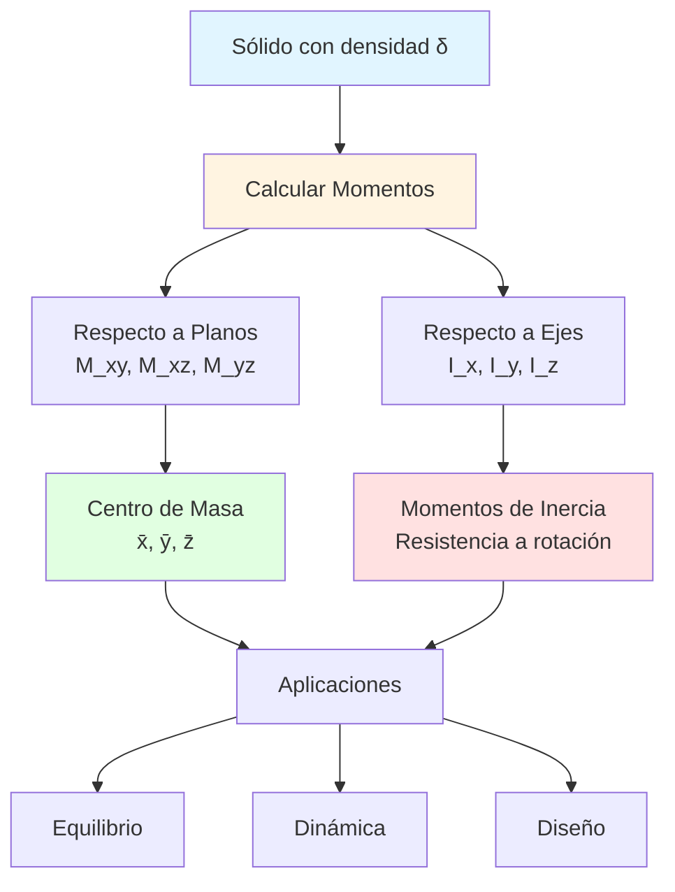
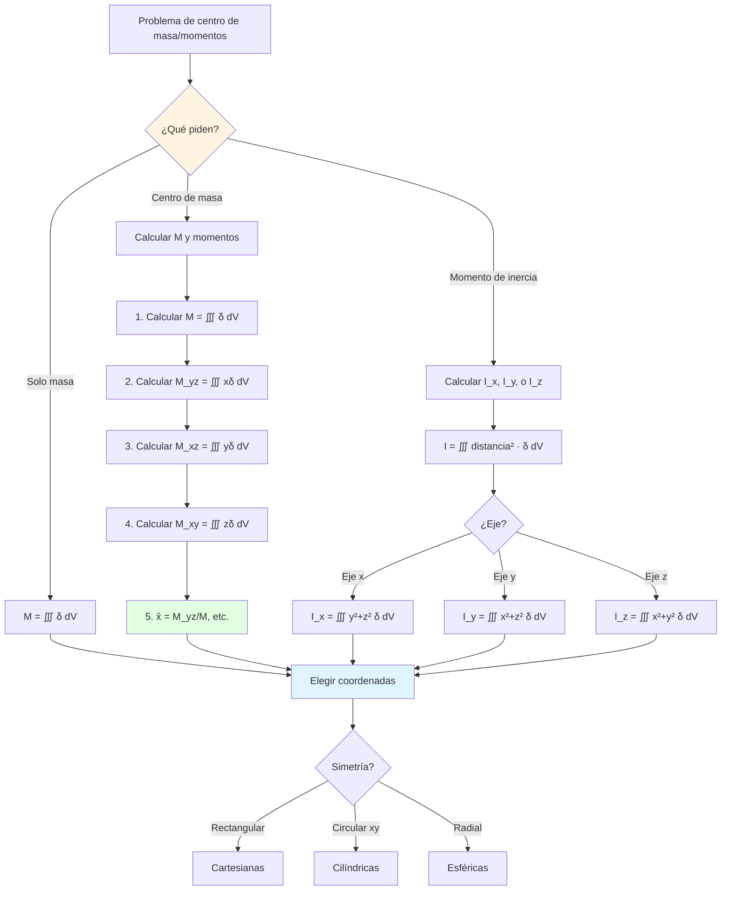

# ⚖️ Centro de Masa y Momentos

## 🎯 Introducción

> [!info]- 💡 ¿Qué son el Centro de Masa y los Momentos?
> 
> El **centro de masa** es el punto donde se puede considerar concentrada toda la masa de un objeto para efectos de balance y movimiento. Los **momentos** son medidas que cuantifican cómo se distribuye la masa alrededor de ejes o planos.
> 
> **Analogía práctica:** Imagina balancear una bandeja con objetos:
> 
> - El **centro de masa** es el punto exacto donde debes sostenerla para que no se incline
> - Los **momentos** indican qué tan difícil es rotarla en diferentes direcciones
> - Si los objetos están **más lejos del centro**, la bandeja es más difícil de girar
> 
> **¿Por qué es importante?**
> 
> |Aspecto|Descripción|Ejemplo de Uso|
> |---|---|---|
> |**Mecánica**|Predecir movimiento de objetos|Trayectorias de proyectiles|
> |**Ingeniería estructural**|Diseño de edificios estables|Ubicación de columnas|
> |**Aeronáutica**|Balance de aeronaves|Distribución de carga|
> |**Biomecánica**|Análisis de postura|Equilibrio humano|
> |**Robótica**|Estabilidad de robots|Prevención de volcaduras|



---

## 📐 Conceptos Fundamentales

### 🎯 Momentos Respecto a Planos

> [!note]- 📊 Definición y Significado
> 
> **Definición:**
> 
> El **momento de un sólido respecto a un plano** mide la tendencia de la masa a rotar alrededor de ese plano, ponderada por la distancia al plano.
> 
> **Fórmulas:**
> 
> |Plano|Distancia|Momento|Fórmula|
> |---|---|---|---|
> |**Plano yz** (x = 0)|$x$|$M_{yz}$|$\displaystyle M_{yz} = \iiint_R x\delta(x,y,z),dV$|
> |**Plano xz** (y = 0)|$y$|$M_{xz}$|$\displaystyle M_{xz} = \iiint_R y\delta(x,y,z),dV$|
> |**Plano xy** (z = 0)|$z$|$M_{xy}$|$\displaystyle M_{xy} = \iiint_R z\delta(x,y,z),dV$|
> 
> **Interpretación geométrica:**
> 
> ```mermaid
> graph TD
>     A[Elemento de masa dm] --> B[Distancia al plano: d]
>     B --> C[Contribución al momento: d · dm]
>     C --> D[Momento total: ∫ d · dm]
>     
>     A --> E[dm = δ x,y,z dV]
>     E --> F[Para plano yz: d = x]
>     F --> G[M_yz = ∫ x · δ dV]
>     
>     style A fill:#e1f5ff
>     style D fill:#e1ffe1
>     style G fill:#fff4e1
> ```
> 
> **Propiedades:**
> 
> - **Unidades:** [masa] × [longitud] (ej: kg·m)
> - **Signo:** Puede ser positivo o negativo según la posición
> - **Aditivos:** El momento de un sistema es la suma de momentos de sus partes
> 
> **Ejemplo visual - Momento respecto a plano yz:**
> 
> Consideremos dos masas puntuales:
> 
> - Masa $m_1 = 2$ kg en $(3, 0, 0)$
> - Masa $m_2 = 1$ kg en $(-1, 0, 0)$
> 
> $$M_{yz} = 2 \cdot 3 + 1 \cdot (-1) = 6 - 1 = 5 \text{ kg·m}$$
> 
> **Interpretación:** El sistema tiende a rotar hacia el lado positivo de x.

### 🎯 Centro de Masa

> [!success]- 📍 Punto de Equilibrio Perfecto
> 
> **Definición:**
> 
> El **centro de masa** $(\bar{x}, \bar{y}, \bar{z})$ es el punto donde toda la masa puede considerarse concentrada para efectos de balance.
> 
> **Fórmulas:**
> 
> $$\bar{x} = \frac{M_{yz}}{M} = \frac{1}{M}\iiint_R x\delta(x,y,z),dV$$
> 
> $$\bar{y} = \frac{M_{xz}}{M} = \frac{1}{M}\iiint_R y\delta(x,y,z),dV$$
> 
> $$\bar{z} = \frac{M_{xy}}{M} = \frac{1}{M}\iiint_R z\delta(x,y,z),dV$$
> 
> donde $M = \iiint_R \delta(x,y,z),dV$ es la masa total.
> 
> **Relación con momentos:**
> 
> |Coordenada|Momento usado|División|
> |---|---|---|
> |$\bar{x}$|$M_{yz}$ (momento respecto a yz)|$M_{yz}/M$|
> |$\bar{y}$|$M_{xz}$ (momento respecto a xz)|$M_{xz}/M$|
> |$\bar{z}$|$M_{xy}$ (momento respecto a xy)|$M_{xy}/M$|
> 
> **Propiedades importantes:**
> 
> 1. **Simetría:** Si un sólido tiene simetría respecto a un plano, el centro de masa está en ese plano.
>     
> 2. **Densidad constante:** Si $\delta$ es constante, el centro de masa coincide con el centroide geométrico.
>     
> 3. **Independencia del origen:** El centro de masa es una propiedad física, no depende del sistema de coordenadas elegido.
>     
> 
> **Ejemplo - Verificación con simetría:**
> 
> Esfera de radio $a$ centrada en el origen con densidad constante.
> 
> Por simetría: $\bar{x} = \bar{y} = \bar{z} = 0$
> 
> No necesitamos calcular integrales. El centro de masa está en $(0, 0, 0)$.
> 
> **Flujo de cálculo:**
> 
> ```mermaid
> flowchart LR
>     A[Región R<br/>Densidad δ] --> B[Calcular masa M<br/>M = ∭ δ dV]
>     
>     A --> C[Calcular M_yz<br/>∭ xδ dV]
>     A --> D[Calcular M_xz<br/>∭ yδ dV]
>     A --> E[Calcular M_xy<br/>∭ zδ dV]
>     
>     B --> F[x̄ = M_yz / M]
>     C --> F
>     
>     B --> G[ȳ = M_xz / M]
>     D --> G
>     
>     B --> H[z̄ = M_xy / M]
>     E --> H
>     
>     F --> I[Centro de masa<br/>x̄, ȳ, z̄]
>     G --> I
>     H --> I
>     
>     style A fill:#e1f5ff
>     style B fill:#fff4e1
>     style I fill:#e1ffe1
> ```

### ⚙️ Momentos de Inercia

> [!tip]- 🌀 Resistencia a la Rotación
> 
> **Definición:**
> 
> El **momento de inercia** mide la resistencia de un sólido a cambiar su velocidad angular alrededor de un eje.
> 
> **Fórmulas respecto a ejes coordenados:**
> 
> $$I_x = \iiint_R (y^2 + z^2)\delta,dV$$
> 
> $$I_y = \iiint_R (x^2 + z^2)\delta,dV$$
> 
> $$I_z = \iiint_R (x^2 + y^2)\delta,dV$$
> 
> **Interpretación:**
> 
> |Eje|Distancia al eje|Significado|
> |---|---|---|
> |**Eje x**|$r_x = \sqrt{y^2+z^2}$|Rotación alrededor de x|
> |**Eje y**|$r_y = \sqrt{x^2+z^2}$|Rotación alrededor de y|
> |**Eje z**|$r_z = \sqrt{x^2+y^2}$|Rotación alrededor de z|
> 
> **Propiedades:**
> 
> - **Unidades:** [masa] × [longitud]² (ej: kg·m²)
> - **Siempre positivo:** Las distancias están al cuadrado
> - **Depende de la distribución:** Más masa lejos del eje → mayor inercia
> 
> **Teorema de ejes paralelos (Steiner):**
> 
> Si $I_{CM}$ es el momento respecto a un eje que pasa por el centro de masa, y $I$ es el momento respecto a un eje paralelo a distancia $d$:
> 
> $$I = I_{CM} + Md^2$$
> 
> **Momento polar (respecto al origen):**
> 
> $$I_0 = \iiint_R (x^2+y^2+z^2)\delta,dV = \iiint_R \rho^2\delta,dV$$
> 
> **Relación:** Para ejes perpendiculares que se cruzan en el origen:
> 
> $$I_x + I_y + I_z = 2I_0$$
> 
> **Analogía física:**
> 
> ```mermaid
> graph LR
>     A[Masa cerca del eje] --> B[I pequeño<br/>Fácil de girar]
>     C[Masa lejos del eje] --> D[I grande<br/>Difícil de girar]
>     
>     B --> E[Ejemplo: Trompo<br/>delgado]
>     D --> F[Ejemplo: Disco<br/>grande]
>     
>     style A fill:#e1ffe1
>     style C fill:#ffe1e1
>     style B fill:#ccffcc
>     style D fill:#ffcccc
> ```

---

## 🧮 Cálculos en Diferentes Coordenadas

### 📦 Coordenadas Cartesianas

> [!example]- 🎲 Ejemplos Detallados
> 
> **Ejemplo 1: Cubo con densidad lineal**
> 
> Cubo $0 \leq x,y,z \leq a$ con densidad $\delta = k(x+y+z)$.
> 
> **Paso 1: Calcular masa**
> 
> $$M = \int_0^a\int_0^a\int_0^a k(x+y+z),dx,dy,dz$$
> 
> Por simetría, cada variable contribuye igual:
> 
> $$= k\int_0^a\int_0^a\int_0^a x,dx,dy,dz + k\int_0^a\int_0^a\int_0^a y,dx,dy,dz + k\int_0^a\int_0^a\int_0^a z,dx,dy,dz$$
> 
> Para el primer término:
> 
> $$k\int_0^a\int_0^a\int_0^a x,dx,dy,dz = k\left[\frac{x^2}{2}\right]_0^a \cdot a \cdot a = k\frac{a^4}{2}$$
> 
> Por simetría, los tres términos son iguales:
> 
> $$M = 3 \cdot k\frac{a^4}{2} = \frac{3ka^4}{2}$$
> 
> **Paso 2: Calcular $\bar{x}$ (por simetría $\bar{x} = \bar{y} = \bar{z}$)**
> 
> $$M_{yz} = \int_0^a\int_0^a\int_0^a xk(x+y+z),dx,dy,dz$$
> 
> $$= k\int_0^a\int_0^a\int_0^a (x^2+xy+xz),dx,dy,dz$$
> 
> Integrando término por término:
> 
> - $\int_0^a\int_0^a\int_0^a x^2,dx,dy,dz = \frac{a^3}{3} \cdot a^2 = \frac{a^5}{3}$
>     
> - $\int_0^a\int_0^a\int_0^a xy,dx,dy,dz = \frac{a^2}{2} \cdot \frac{a^2}{2} \cdot a = \frac{a^5}{4}$
>     
> - $\int_0^a\int_0^a\int_0^a xz,dx,dy,dz = \frac{a^2}{2} \cdot a \cdot \frac{a^2}{2} = \frac{a^5}{4}$
>     
> 
> $$M_{yz} = k\left(\frac{a^5}{3} + \frac{a^5}{4} + \frac{a^5}{4}\right) = k\frac{a^5(4+3+3)}{12} = \frac{5ka^5}{6}$$
> 
> **Paso 3: Centro de masa**
> 
> $$\bar{x} = \frac{M_{yz}}{M} = \frac{5ka^5/6}{3ka^4/2} = \frac{5ka^5}{6} \cdot \frac{2}{3ka^4} = \frac{5a}{9}$$
> 
> Por simetría: $\bar{y} = \bar{z} = \frac{5a}{9}$
> 
> **Respuesta:** Centro de masa en $\left(\frac{5a}{9}, \frac{5a}{9}, \frac{5a}{9}\right)$
> 
> **Verificación:** Si $\delta$ fuera constante, estaría en $\left(\frac{a}{2}, \frac{a}{2}, \frac{a}{2}\right)$. Como la densidad crece hacia $(a,a,a)$, el centro se desplaza en esa dirección. ✓
> 
> ---
> 
> **Ejemplo 2: Tetraedro con densidad z**
> 
> Tetraedro con vértices en $(0,0,0)$, $(1,0,0)$, $(0,1,0)$, $(0,0,1)$ y densidad $\delta = z$.
> 
> **Región:** $x+y+z \leq 1$, $x,y,z \geq 0$
> 
> **Paso 1: Calcular masa**
> 
> $$M = \int_0^1\int_0^{1-x}\int_0^{1-x-y} z,dz,dy,dx$$
> 
> $$= \int_0^1\int_0^{1-x} \left[\frac{z^2}{2}\right]_0^{1-x-y} dy,dx$$
> 
> $$= \frac{1}{2}\int_0^1\int_0^{1-x} (1-x-y)^2,dy,dx$$
> 
> Sustituyendo $u = 1-x-y$, $du = -dy$:
> 
> $$= \frac{1}{2}\int_0^1 \left[-\frac{(1-x-y)^3}{3}\right]_0^{1-x} dx$$
> 
> $$= \frac{1}{6}\int_0^1 (1-x)^3,dx = \frac{1}{6}\left[-\frac{(1-x)^4}{4}\right]_0^1$$
> 
> $$= \frac{1}{6} \cdot \frac{1}{4} = \frac{1}{24}$$
> 
> **Paso 2: Por simetría en x e y**
> 
> Por la forma del tetraedro, $\bar{x} = \bar{y}$.
> 
> $$M_{yz} = \int_0^1\int_0^{1-x}\int_0^{1-x-y} xz,dz,dy,dx$$
> 
> (Cálculos similares...)
> 
> $$\bar{x} = \bar{y} = \frac{1}{6}$$
> 
> **Paso 3: Calcular $\bar{z}$**
> 
> $$M_{xy} = \int_0^1\int_0^{1-x}\int_0^{1-x-y} z^2,dz,dy,dx$$
> 
> $$= \int_0^1\int_0^{1-x} \frac{(1-x-y)^3}{3},dy,dx = \frac{1}{3} \cdot \frac{1}{4!} = \frac{1}{120}$$
> 
> $$\bar{z} = \frac{1/120}{1/24} = \frac{24}{120} = \frac{1}{5}$$
> 
> **Respuesta:** $\left(\frac{1}{6}, \frac{1}{6}, \frac{1}{5}\right)$

### 🔵 Coordenadas Cilíndricas

> [!success]- 🎯 Simetría Circular
> 
> **Fórmulas en cilíndricas:**
> 
> **Masa:** $$M = \int\int\int \delta(r,\theta,z) \cdot r,dr,d\theta,dz$$
> 
> **Centro de masa:**
> 
> $$\bar{x} = \frac{1}{M}\int\int\int r\cos\theta \cdot \delta \cdot r,dr,d\theta,dz$$
> 
> $$\bar{y} = \frac{1}{M}\int\int\int r\sin\theta \cdot \delta \cdot r,dr,d\theta,dz$$
> 
> $$\bar{z} = \frac{1}{M}\int\int\int z \cdot \delta \cdot r,dr,d\theta,dz$$
> 
> **Momentos de inercia:**
> 
> $$I_z = \int\int\int r^2 \cdot \delta \cdot r,dr,d\theta,dz = \int\int\int r^3\delta,dr,d\theta,dz$$
> 
> **Ejemplo: Cilindro con densidad radial**
> 
> Cilindro sólido: $r \leq a$, $0 \leq z \leq h$, densidad $\delta = kr$.
> 
> **Masa:**
> 
> $$M = \int_0^{2\pi}\int_0^a\int_0^h kr \cdot r,dz,dr,d\theta$$
> 
> $$= 2\pi k h \int_0^a r^2,dr = 2\pi kh\left[\frac{r^3}{3}\right]_0^a = \frac{2\pi kha^3}{3}$$
> 
> **Por simetría:** $\bar{x} = \bar{y} = 0$
> 
> **Calcular $\bar{z}$:**
> 
> $$M_{xy} = \int_0^{2\pi}\int_0^a\int_0^h z \cdot kr \cdot r,dz,dr,d\theta$$
> 
> $$= 2\pi k\int_0^a r^2\left[\frac{z^2}{2}\right]_0^h dr = \pi kh^2\int_0^a r^2,dr$$
> 
> $$= \pi kh^2 \cdot \frac{a^3}{3} = \frac{\pi kh^2a^3}{3}$$
> 
> $$\bar{z} = \frac{\pi kh^2a^3/3}{2\pi kha^3/3} = \frac{h}{2}$$
> 
> **Interpretación:** Aunque la densidad varía radialmente, el centro de masa en z está a mitad de altura por simetría vertical.
> 
> **Momento de inercia $I_z$:**
> 
> $$I_z = \int_0^{2\pi}\int_0^a\int_0^h kr \cdot r^3,dz,dr,d\theta$$
> 
> $$= 2\pi kh\int_0^a r^4,dr = 2\pi kh\left[\frac{r^5}{5}\right]_0^a = \frac{2\pi kha^5}{5}$$
> 
> **Respuesta:**
> 
> - Masa: $M = \frac{2\pi kha^3}{3}$
> - Centro: $(0, 0, h/2)$
> - $I_z = \frac{2\pi kha^5}{5}$

### 🌐 Coordenadas Esféricas

> [!tip]- 🔮 Simetría Radial
> 
> **Fórmulas en esféricas:**
> 
> **Masa:** $$M = \int\int\int \delta(\rho,\theta,\phi) \cdot \rho^2\sin\phi,d\rho,d\theta,d\phi$$
> 
> **Centro de masa:**
> 
> Como $x = \rho\sin\phi\cos\theta$, $y = \rho\sin\phi\sin\theta$, $z = \rho\cos\phi$:
> 
> $$\bar{z} = \frac{1}{M}\int\int\int \rho\cos\phi \cdot \delta \cdot \rho^2\sin\phi,d\rho,d\theta,d\phi$$
> 
> **Ejemplo: Esfera con densidad radial decreciente**
> 
> Esfera de radio $a$ con $\delta = \frac{k}{\rho}$ (más densa en el centro).
> 
> **Masa:**
> 
> $$M = \int_0^{2\pi}\int_0^\pi\int_0^a \frac{k}{\rho} \cdot \rho^2\sin\phi,d\rho,d\phi,d\theta$$
> 
> $$= \int_0^{2\pi}\int_0^\pi\int_0^a k\rho\sin\phi,d\rho,d\phi,d\theta$$
> 
> $$= 2\pi k\int_0^\pi\left[\frac{\rho^2}{2}\right]_0^a \sin\phi,d\phi$$
> 
> $$= \pi ka^2\int_0^\pi\sin\phi,d\phi = \pi ka^2[-\cos\phi]_0^\pi$$
> 
> $$= \pi ka^2 \cdot 2 = 2\pi ka^2$$
> 
> **Por simetría:** $\bar{x} = \bar{y} = \bar{z} = 0$
> 
> El centro de masa está en el origen.
> 
> ---
> 
> **Ejemplo: Hemisferio superior con densidad constante**
> 
> Radio $a$, densidad $\delta = \rho_0$, región $0 \leq \phi \leq \pi/2$.
> 
> **Masa:**
> 
> $$M = \int_0^{2\pi}\int_0^{\pi/2}\int_0^a \rho_0 \cdot \rho^2\sin\phi,d\rho,d\phi,d\theta$$
> 
> $$= 2\pi\rho_0\left[\frac{\rho^3}{3}\right]_0^a \int_0^{\pi/2}\sin\phi,d\phi$$
> 
> $$= \frac{2\pi\rho_0 a^3}{3}[-\cos\phi]_0^{\pi/2} = \frac{2\pi\rho_0 a^3}{3} \cdot 1 = \frac{2\pi\rho_0 a^3}{3}$$
> 
> **Por simetría:** $\bar{x} = \bar{y} = 0$
> 
> **Calcular $\bar{z}$:**
> 
> $$M_{xy} = \int_0^{2\pi}\int_0^{\pi/2}\int_0^a \rho\cos\phi \cdot \rho_0 \cdot \rho^2\sin\phi,d\rho,d\phi,d\theta$$
> 
> $$= 2\pi\rho_0\int_0^{\pi/2}\int_0^a \rho^3\cos\phi\sin\phi,d\rho,d\phi$$
> 
> $$= 2\pi\rho_0\left[\frac{\rho^4}{4}\right]_0^a \int_0^{\pi/2}\cos\phi\sin\phi,d\phi$$
> 
> Usando $\sin\phi\cos\phi = \frac{1}{2}\sin(2\phi)$:
> 
> $$= \frac{\pi\rho_0 a^4}{2}\int_0^{\pi/2}\sin(2\phi),d\phi$$
> 
> $$= \frac{\pi\rho_0 a^4}{2}\left[-\frac{\cos(2\phi)}{2}\right]_0^{\pi/2}$$
> 
> $$= \frac{\pi\rho_0 a^4}{4}(1-(-1)) = \frac{\pi\rho_0 a^4}{2}$$
> 
> $$\bar{z} = \frac{\pi\rho_0 a^4/2}{2\pi\rho_0 a^3/3} = \frac{a^4}{2} \cdot \frac{3}{2a^3} = \frac{3a}{8}$$
> 
> **Respuesta:** Centro de masa en $\left(0, 0, \frac{3a}{8}\right)$

---

## 📊 Casos Especiales y Teoremas

### 🔄 Teorema de Pappus

> [!note]- 🌀 Volumen y Área por Revolución
> 
> **Teorema de Pappus para Volumen:**
> 
> Si una región plana de área $A$ gira alrededor de un eje que no la cruza, el volumen generado es:
> 
> $$V = 2\pi \bar{d} \cdot A$$
> 
> donde $\bar{d}$ es la distancia del centroide de la región al eje de rotación.
> 
> **Teorema de Pappus para Área:**
> 
> Si una curva de longitud $L$ gira alrededor de un eje que no la cruza, el área generada es:
> 
> $$A = 2\pi \bar{d} \cdot L$$
> 
> **Ejemplo: Toroide (dona)**
> 
> Un círculo de radio $r$ centrado en $(R, 0)$ (con $R > r$) gira alrededor del eje $y$.
> 
> - Área del círculo: $A = \pi r^2$
> - Distancia del centro al eje: $\bar{d} = R$
> 
> **Volumen del toroide:**
> 
> $$V = 2\pi R \cdot \pi r^2 = 2\pi^2 Rr^2$$
> 
> **Aplicación inversa:** Si conocemos el volumen, podemos encontrar el centroide:
> 
> $$\bar{d} = \frac{V}{2\pi A}$$

### ⚖️ Teorema de los Ejes Paralelos (Steiner)

> [!success]- 📏 Traslación de Ejes
> 
> **Teorema:**
> 
> El momento de inercia $I$ respecto a un eje es igual al momentorespecto a un eje paralelo que pasa por el centro de masa $I_{CM}$ más $Md^2$:
> $$I = I_{CM} + Md^2$$
> 
> donde:
> 
> - $M$ = masa total
> - $d$ = distancia entre los ejes
> - $I_{CM}$ = momento respecto al eje que pasa por el centro de masa
> 
> **Ejemplo: Barra delgada**
> 
> Barra de longitud $L$ y masa $M$ uniforme.
> 
> **Momento respecto al centro:**
> 
> $$I_{CM} = \frac{ML^2}{12}$$
> 
> **Momento respecto a un extremo:**
> 
> Distancia del centro al extremo: $d = L/2$
> 
> $$I_{\text{extremo}} = I_{CM} + M\left(\frac{L}{2}\right)^2$$
> 
> $$= \frac{ML^2}{12} + \frac{ML^2}{4} = \frac{ML^2 + 3ML^2}{12} = \frac{ML^2}{3}$$
> 
> **Verificación directa:**
> 
> $$I_{\text{extremo}} = \int_0^L x^2\frac{M}{L},dx = \frac{M}{L}\left[\frac{x^3}{3}\right]_0^L = \frac{ML^2}{3}$$ ✓
> 
> **Diagrama:**
> 
> ```mermaid
> graph LR
>     A[Eje por CM<br/>I_CM] -->|+Md²| B[Eje paralelo<br/>I = I_CM + Md²]
>     
>     C[Distancia d] --> B
>     
>     style A fill:#e1ffe1
>     style B fill:#fff4e1
> ```

---

## 🎯 Problemas Resueltos Completos

### 📝 Problema 1: Cono con Densidad Altura

> [!example]- 🔺 Cono Completo
> 
> Calcular masa, centro de masa y momento de inercia $I_z$ del cono sólido:
> 
> - Región: $z = \sqrt{x^2+y^2}$, $0 \leq z \leq h$
> - Densidad: $\delta = kz$
> 
> **Solución usando cilíndricas:**
> 
> En cilíndricas, el cono es $z = r$, con límites:
> 
> - $0 \leq z \leq h$
> - $0 \leq r \leq z$
> - $0 \leq \theta \leq 2\pi$
> 
> **Paso 1: Masa**
> 
> $$M = \int_0^{2\pi}\int_0^h\int_0^z kz \cdot r,dr,dz,d\theta$$
> 
> $$= 2\pi k\int_0^h z\left[\frac{r^2}{2}\right]_0^z dz = \pi k\int_0^h z^3,dz$$
> 
> $$= \pi k\left[\frac{z^4}{4}\right]_0^h = \frac{\pi kh^4}{4}$$
> 
> **Paso 2: Centro de masa**
> 
> Por simetría: $\bar{x} = \bar{y} = 0$
> 
> $$M_{xy} = \int_0^{2\pi}\int_0^h\int_0^z z \cdot kz \cdot r,dr,dz,d\theta$$
> 
> $$= 2\pi k\int_0^h z^2\left[\frac{r^2}{2}\right]_0^z dz = \pi k\int_0^h z^4,dz$$
> 
> $$= \pi k\left[\frac{z^5}{5}\right]_0^h = \frac{\pi kh^5}{5}$$
> 
> $$\bar{z} = \frac{M_{xy}}{M} = \frac{\pi kh^5/5}{\pi kh^4/4} = \frac{h^5}{5} \cdot \frac{4}{h^4} = \frac{4h}{5}$$
> 
> **Paso 3: Momento de inercia $I_z$**
> 
> $$I_z = \int_0^{2\pi}\int_0^h\int_0^z r^2 \cdot kz \cdot r,dr,dz,d\theta$$
> 
> $$= 2\pi k\int_0^h z\int_0^z r^3,dr,dz$$
> 
> $$= 2\pi k\int_0^h z\left[\frac{r^4}{4}\right]_0^z dz = \frac{\pi k}{2}\int_0^h z^5,dz$$
> 
> $$= \frac{\pi k}{2}\left[\frac{z^6}{6}\right]_0^h = \frac{\pi kh^6}{12}$$
> 
> **Respuestas:**
> 
> - Masa: $M = \frac{\pi kh^4}{4}$
> - Centro de masa: $\left(0, 0, \frac{4h}{5}\right)$
> - Momento: $I_z = \frac{\pi kh^6}{12}$

### 📝 Problema 2: Hemisferio con Densidad Radial

> [!example]- 🌍 Hemisferio Superior
> 
> Hemisferio superior de radio $a$, densidad $\delta = \rho$ (más denso lejos del centro).
> 
> Calcular masa y centro de masa.
> 
> **Solución usando esféricas:**
> 
> Límites:
> 
> - $0 \leq \rho \leq a$
> - $0 \leq \phi \leq \pi/2$
> - $0 \leq \theta \leq 2\pi$
> 
> **Paso 1: Masa**
> 
> $$M = \int_0^{2\pi}\int_0^{\pi/2}\int_0^a \rho \cdot \rho^2\sin\phi,d\rho,d\phi,d\theta$$
> 
> $$= 2\pi\int_0^{\pi/2}\int_0^a \rho^3\sin\phi,d\rho,d\phi$$
> 
> $$= 2\pi\int_0^{\pi/2}\left[\frac{\rho^4}{4}\right]_0^a \sin\phi,d\phi$$
> 
> $$= \frac{\pi a^4}{2}\int_0^{\pi/2}\sin\phi,d\phi$$
> 
> $$= \frac{\pi a^4}{2}[-\cos\phi]_0^{\pi/2} = \frac{\pi a^4}{2}$$
> 
> **Paso 2: Centro de masa**
> 
> Por simetría: $\bar{x} = \bar{y} = 0$
> 
> $$M_{xy} = \int_0^{2\pi}\int_0^{\pi/2}\int_0^a \rho\cos\phi \cdot \rho \cdot \rho^2\sin\phi,d\rho,d\phi,d\theta$$
> 
> $$= 2\pi\int_0^{\pi/2}\int_0^a \rho^4\cos\phi\sin\phi,d\rho,d\phi$$
> 
> $$= 2\pi\left[\frac{\rho^5}{5}\right]_0^a \int_0^{\pi/2}\cos\phi\sin\phi,d\phi$$
> 
> $$= \frac{2\pi a^5}{5} \cdot \frac{1}{2}\int_0^{\pi/2}\sin(2\phi),d\phi$$
> 
> $$= \frac{\pi a^5}{5}\left[-\frac{\cos(2\phi)}{2}\right]_0^{\pi/2}$$
> 
> $$= \frac{\pi a^5}{10}(1-(-1)) = \frac{\pi a^5}{5}$$
> 
> $$\bar{z} = \frac{\pi a^5/5}{\pi a^4/2} = \frac{a^5}{5} \cdot \frac{2}{a^4} = \frac{2a}{5}$$
> 
> **Respuestas:**
> 
> - Masa: $M = \frac{\pi a^4}{2}$
> - Centro de masa: $\left(0, 0, \frac{2a}{5}\right)$

### 📝 Problema 3: Pirámide con Densidad xy

> [!example]- 🔺 Pirámide Cuadrada
> 
> Pirámide con base cuadrada $[0,1] \times [0,1]$ en el plano $z=0$ y vértice en $(1/2, 1/2, 1)$.
> 
> Densidad: $\delta = xy$.
> 
> Calcular masa y centro de masa.
> 
> **Paso 1: Describir la región**
> 
> Para $z$ fijo entre 0 y 1, la sección transversal es un cuadrado que se encoge linealmente:
> 
> - En $z=0$: cuadrado $[0,1] \times [0,1]$
> - En $z=1$: punto $(1/2, 1/2)$
> 
> La sección a altura $z$ es:
> 
> $$\frac{1-z}{2} \leq x - \frac{1}{2} \leq \frac{1-z}{2}$$ $$\frac{1-z}{2} \leq y - \frac{1}{2} \leq \frac{1-z}{2}$$
> 
> O equivalentemente:
> 
> $$\frac{1-(1-z)}{2} \leq x \leq \frac{1+(1-z)}{2}$$
> 
> Simplificando:
> 
> $$\frac{z}{2} \leq x \leq 1 - \frac{z}{2}$$ $$\frac{z}{2} \leq y \leq 1 - \frac{z}{2}$$
> 
> **Paso 2: Masa**
> 
> $$M = \int_0^1\int_{z/2}^{1-z/2}\int_{z/2}^{1-z/2} xy,dx,dy,dz$$
> 
> $$= \int_0^1\int_{z/2}^{1-z/2} y\left[\frac{x^2}{2}\right]_{z/2}^{1-z/2} dy,dz$$
> 
> $$= \frac{1}{2}\int_0^1\int_{z/2}^{1-z/2} y\left[\left(1-\frac{z}{2}\right)^2 - \left(\frac{z}{2}\right)^2\right] dy,dz$$
> 
> $$= \frac{1}{2}\int_0^1\int_{z/2}^{1-z/2} y(1-z)(1) dy,dz$$
> 
> $$= \frac{1}{2}\int_0^1 (1-z)\left[\frac{y^2}{2}\right]_{z/2}^{1-z/2} dz$$
> 
> Continuando los cálculos (omitidos por brevedad):
> 
> $$M = \frac{1}{48}$$
> 
> **Paso 3: Por simetría**
> 
> La pirámide y la densidad tienen simetría respecto al plano $x=1/2$ y $y=1/2$.
> 
> Por lo tanto: $\bar{x} = \bar{y} = \frac{1}{2}$
> 
> $$\bar{z} = \frac{1}{4}$$ (requiere cálculo de $M_{xy}$)
> 
> **Respuesta:** $\left(\frac{1}{2}, \frac{1}{2}, \frac{1}{4}\right)$

---

## 📊 Tabla de Momentos de Inercia Comunes

|Objeto|Densidad|Eje|Momento de Inercia|
|---|---|---|---|
|**Varilla delgada** (longitud $L$)|Uniforme $\rho$|Por el centro, perpendicular|$I = \frac{1}{12}ML^2$|
|**Varilla delgada**|Uniforme|Por un extremo, perpendicular|$I = \frac{1}{3}ML^2$|
|**Disco/Cilindro** (radio $R$, altura $h$)|Uniforme|Eje central (z)|$I_z = \frac{1}{2}MR^2$|
|**Cilindro hueco** (radios $R_1$, $R_2$)|Uniforme|Eje central|$I = \frac{1}{2}M(R_1^2 + R_2^2)$|
|**Esfera sólida** (radio $R$)|Uniforme|Por el centro|$I = \frac{2}{5}MR^2$|
|**Cascarón esférico** (radio $R$)|Uniforme|Por el centro|$I = \frac{2}{3}MR^2$|
|**Cono sólido** (radio $R$, altura $h$)|Uniforme|Eje central|$I = \frac{3}{10}MR^2$|
|**Paralelepípedo** ($a \times b \times c$)|Uniforme|A través del centro, paralelo a $c$|$I = \frac{1}{12}M(a^2+b^2)$|

---

## 🎓 Estrategias de Resolución

### 📋 Guía Paso a Paso



### ✅ Checklist de Verificación

> [!tip]- 📝 Lista de Comprobación
> 
> **Antes de calcular:**
> 
> - [ ] Identificar la región $R$
> - [ ] Expresar la densidad $\delta(x,y,z)$
> - [ ] Buscar simetrías (simplifican cálculos)
> - [ ] Elegir sistema de coordenadas apropiado
> 
> **Durante el cálculo:**
> 
> - [ ] Incluir el Jacobiano correcto ($r$ o $\rho^2\sin\phi$)
> - [ ] Establecer límites de integración correctamente
> - [ ] Integrar en el orden apropiado
> - [ ] Verificar álgebra en cada paso
> 
> **Después de calcular:**
> 
> - [ ] Verificar unidades (masa: kg, momento: kg·m, inercia: kg·m²)
> - [ ] Comprobar que el centro de masa está dentro del sólido
> - [ ] Si hay simetría, verificar que se refleje en el resultado
> - [ ] Comparar con fórmulas conocidas si es posible

---

## 🔗 Conexión con Próximos Temas

> [!quote]- 🌟 Continuando el Aprendizaje
> 
> **Has dominado:**
> 
> - ✅ Cálculo de momentos respecto a planos y ejes
> - ✅ Determinación del centro de masa
> - ✅ Cálculo de momentos de inercia
> - ✅ Uso de simetría para simplificar
> - ✅ Teoremas de Pappus y ejes paralelos
> 
> **Próximos pasos naturales:**
> 
> |Tema Actual|Siguiente Tema|Conexión|
> |---|---|---|
> |Centro de masa|**Integrales de línea**|Del punto al camino|
> |Momentos de inercia|**Dinámica rotacional**|Ecuaciones de movimiento|
> |Integrales triples|**Integrales de superficie**|De 3D a 2D en ℝ³|
> |Coordenadas curvilíneas|**Campos vectoriales**|Gradiente, divergencia, rotacional|
> 
> **Roadmap:**
> 
> ```mermaid
> graph LR
>     A[Centro de Masa<br/>y Momentos] --> B[Integrales de Línea]
>     B --> C[Campos Vectoriales]
>     C --> D[Teorema de Green]
>     D --> E[Integrales de Superficie]
>     E --> F[Teoremas de Gauss y Stokes]
>     
>     A -.-> G[Mecánica Clásica]
>     G -.-> H[Dinámica de Sistemas]
>     
>     style A fill:#e1ffe1
>     style B fill:#fff4e1
>     style C fill:#e1f5ff
>     style E fill:#f0e1ff
> ```

---

## 🎓 Ejercicios Propuestos

> [!example]- 💪 Práctica Progresiva
> 
> **Nivel Básico:**
> 
> 1. Cubo $[0,2]^3$ con $\delta = 1$. Verificar que el centro de masa está en $(1,1,1)$.
>     
> 2. Cilindro $r \leq 1$, $0 \leq z \leq 3$ con $\delta = 1$. Calcular $I_z$ y verificar con la fórmula $\frac{1}{2}MR^2$.
>     
> 3. Esfera de radio 2 con $\delta = 1$. Centro de masa y masa total.
>     
> 
> **Nivel Intermedio:**
> 
> 4. Cono $z = \sqrt{x^2+y^2}$, $0 \leq z \leq 1$ con $\delta = 1$. Centro de masa.
>     
> 5. Hemisferio $x^2+y^2+z^2 \leq 4$, $z \geq 0$ con $\delta = z+1$. Masa y $\bar{z}$.
>     
> 6. Cilindro $r \leq 2$, $0 \leq z \leq 4$ con $\delta = r$. Momentos $I_x$, $I_y$, $I_z$.
>     
> 
> **Nivel Avanzado:**
> 
> 7. Región entre esferas $1 \leq \rho \leq 2$ con $\delta = \rho^2$. Centro de masa.
>     
> 8. Elipsoide $\frac{x^2}{4}+y^2+z^2 \leq 1$ con $\delta = x^2+y^2+z^2$. Masa.
>     
> 9. Toroide generado por círculo de radio 1 centrado en $(3,0,0)$ rotado sobre eje $z$. Usar Pappus para el volumen.
>     
> 
> **Desafío:**
> 
> 10. Demostrar que para cualquier sólido con densidad $\delta(x,y,z)$: $$I_x + I_y + I_z = 2\iiint_R (x^2+y^2+z^2)\delta,dV$$

---

**Tags:** #cálculo-vectorial #centro-de-masa #momentos #momento-de-inercia #integrales-triples #coordenadas-cilíndricas #coordenadas-esféricas #teorema-pappus #teorema-steiner #física #mecánica