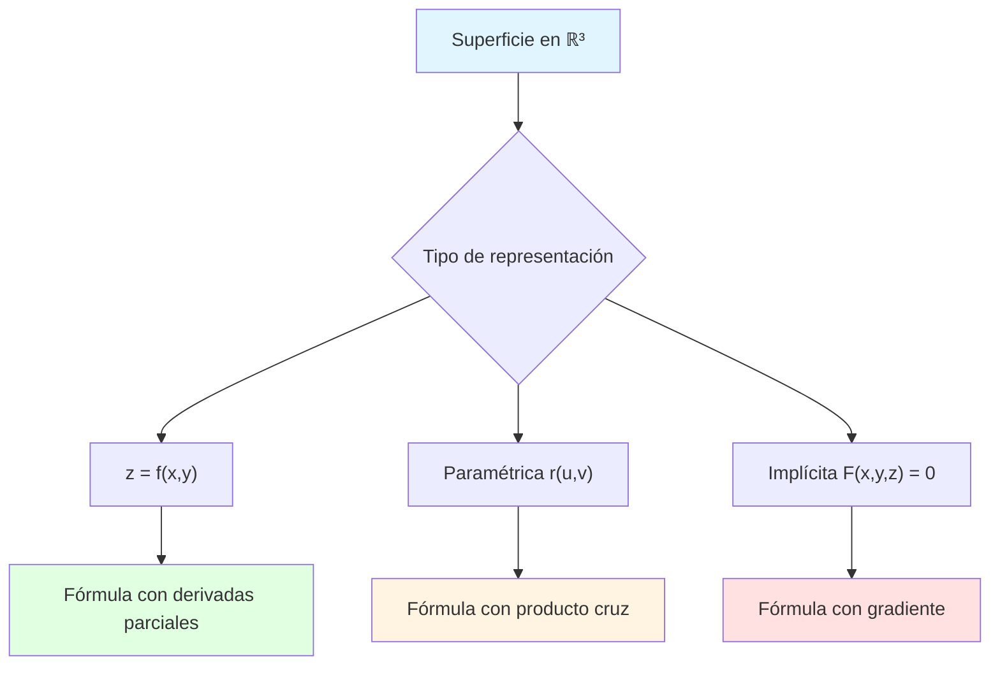

# 📐 Área de una Superficie para Integrales de Superficie

## 🎯 Introducción

> [!info]- 💡 ¿Qué es el Área de una Superficie?
> 
> El **área de una superficie** en el espacio tridimensional es una extensión del concepto de área en el plano. Mientras que en 2D medimos áreas de regiones planas, en 3D necesitamos calcular el área de superficies curvas o planas que existen en el espacio.
> 
> **Analogía práctica:** Imagina que quieres pintar una colina o forrar una esfera con tela. El área que necesitas calcular no es plana, sino que se curva en el espacio. Esta es la diferencia fundamental entre áreas planas y superficies.
> 
> **¿Por qué es importante?**
> 
> |Aspecto|Descripción|Ejemplo de Uso|
> |---|---|---|
> |**Física**|Calcular flujo de campos|Flujo eléctrico a través de superficies|
> |**Ingeniería**|Diseño de estructuras|Área de domos, tanques|
> |**Geometría**|Medición de superficies curvas|Área de esferas, paraboloides|
> |**Optimización**|Minimizar o maximizar áreas|Diseño de contenedores|



---

## 📊 Representaciones de Superficies

### 📈 Superficie como Gráfica: z = f(x,y)

> [!example]- 🎨 Forma Explícita
> 
> Una superficie se expresa como **z = f(x,y)**, donde z es función de x e y.
> 
> **Fórmula del área:**
> 
> $$A = \iint_D \sqrt{1 + \left(\frac{\partial f}{\partial x}\right)^2 + \left(\frac{\partial f}{\partial y}\right)^2} , dA$$
> 
> Donde:
> 
> - **D**: región en el plano xy (proyección de la superficie)
> - **∂f/∂x**: derivada parcial respecto a x
> - **∂f/∂y**: derivada parcial respecto a y
> - **dA**: elemento de área en el plano xy (dx dy)
> 
> **Interpretación geométrica:**
> 
> |Componente|Significado|Valor|
> |---|---|---|
> |**1**|Contribución horizontal|Constante|
> |**(∂f/∂x)²**|Inclinación en dirección x|Variable|
> |**(∂f/∂y)²**|Inclinación en dirección y|Variable|
> |**√(suma)**|Factor de corrección|≥ 1|
> 
> **¿Por qué esta fórmula?**
> 
> ```mermaid
> graph LR
>     A[Elemento dA en xy] --> B[Se proyecta inclinado]
>     B --> C[Factor de estiramiento]
>     C --> D[√(1 + fx² + fy²)]
>     D --> E[Elemento real dS]
>     
>     style A fill:#e1f5ff
>     style E fill:#e1ffe1
> ```
> 
> **Ejemplo 1: Plano inclinado**
> 
> Calcular el área de z = 2x + 3y sobre el rectángulo D = [0,1] × [0,2]
> 
> ```
> Paso 1: Calcular derivadas parciales
> f(x,y) = 2x + 3y
> ∂f/∂x = 2
> ∂f/∂y = 3
> 
> Paso 2: Sustituir en la fórmula
> A = ∬_D √(1 + 2² + 3²) dA
>   = ∬_D √(1 + 4 + 9) dA
>   = ∬_D √14 dA
> 
> Paso 3: Integrar sobre D
> A = √14 ∫₀¹ ∫₀² dy dx
>   = √14 · [x]₀¹ · [y]₀²
>   = √14 · 1 · 2
>   = 2√14
> ```
> 
> **Ejemplo 2: Paraboloide**
> 
> Calcular el área de z = x² + y² sobre el círculo x² + y² ≤ 1
> 
> ```
> Paso 1: Derivadas parciales
> f(x,y) = x² + y²
> ∂f/∂x = 2x
> ∂f/∂y = 2y
> 
> Paso 2: Fórmula del área
> A = ∬_D √(1 + 4x² + 4y²) dA
> 
> Paso 3: Coordenadas polares (más conveniente)
> x = r cos θ, y = r sen θ
> dA = r dr dθ
> 
> A = ∫₀²ᵖ ∫₀¹ √(1 + 4r²) · r dr dθ
> 
> Paso 4: Integrar en r (sustitución u = 1 + 4r²)
> ∫₀¹ r√(1 + 4r²) dr = (1/12)[(1 + 4r²)^(3/2)]₀¹
>                     = (1/12)[5^(3/2) - 1]
> 
> Paso 5: Integrar en θ
> A = 2π · (1/12)[5√5 - 1]
>   = (π/6)[5√5 - 1]
> ```

### 🔄 Superficie Paramétrica: r(u,v)

> [!success]- 🎯 Representación Vectorial
> 
> Una superficie se describe mediante un vector posición que depende de dos parámetros:
> 
> $$\vec{r}(u,v) = \langle x(u,v), y(u,v), z(u,v) \rangle$$
> 
> **Fórmula del área:**
> 
> $$A = \iint_D \left|\frac{\partial \vec{r}}{\partial u} \times \frac{\partial \vec{r}}{\partial v}\right| , du,dv$$
> 
> Donde:
> 
> - **∂r/∂u**: vector tangente en dirección u
> - **∂r/∂v**: vector tangente en dirección v
> - **×**: producto cruz (vectorial)
> - **| |**: magnitud del vector
> - **D**: región en el plano uv
> 
> **Proceso de cálculo:**
> 
> ```mermaid
> flowchart TD
>     A[r(u,v) = ⟨x,y,z⟩] --> B[Calcular ∂r/∂u]
>     A --> C[Calcular ∂r/∂v]
>     B --> D[Producto cruz: ∂r/∂u × ∂r/∂v]
>     C --> D
>     D --> E[Calcular magnitud |∂r/∂u × ∂r/∂v|]
>     E --> F[Integrar sobre región D]
>     
>     style A fill:#e1f5ff
>     style D fill:#fff4e1
>     style F fill:#e1ffe1
> ```
> 
> **Recordatorio del producto cruz:**
> 
> $$\vec{a} \times \vec{b} = \begin{vmatrix} \vec{i} & \vec{j} & \vec{k} \ a_1 & a_2 & a_3 \ b_1 & b_2 & b_3 \end{vmatrix}$$
> 
> **Ejemplo 1: Cilindro**
> 
> Calcular el área del cilindro x² + y² = 4, 0 ≤ z ≤ 3
> 
> ```
> Paso 1: Parametrización
> r(θ,z) = ⟨2cos θ, 2sen θ, z⟩
> Dominio: 0 ≤ θ ≤ 2π, 0 ≤ z ≤ 3
> 
> Paso 2: Derivadas parciales
> ∂r/∂θ = ⟨-2sen θ, 2cos θ, 0⟩
> ∂r/∂z = ⟨0, 0, 1⟩
> 
> Paso 3: Producto cruz
> ∂r/∂θ × ∂r/∂z = |  i      j      k   |
>                  |-2sen θ 2cos θ  0   |
>                  |  0      0      1   |
> 
> = ⟨2cos θ, 2sen θ, 0⟩
> 
> Paso 4: Magnitud
> |∂r/∂θ × ∂r/∂z| = √(4cos²θ + 4sen²θ)
>                 = √4
>                 = 2
> 
> Paso 5: Integrar
> A = ∫₀²ᵖ ∫₀³ 2 dz dθ
>   = 2 · [θ]₀²ᵖ · [z]₀³
>   = 2 · 2π · 3
>   = 12π
> ```
> 
> **Ejemplo 2: Esfera**
> 
> Calcular el área de la esfera x² + y² + z² = R²
> 
> ```
> Paso 1: Parametrización esférica
> r(φ,θ) = ⟨R sen φ cos θ, R sen φ sen θ, R cos φ⟩
> Dominio: 0 ≤ φ ≤ π, 0 ≤ θ ≤ 2π
> 
> Paso 2: Derivadas parciales
> ∂r/∂φ = ⟨R cos φ cos θ, R cos φ sen θ, -R sen φ⟩
> ∂r/∂θ = ⟨-R sen φ sen θ, R sen φ cos θ, 0⟩
> 
> Paso 3: Producto cruz (simplificado)
> |∂r/∂φ × ∂r/∂θ| = R² sen φ
> 
> Paso 4: Integrar
> A = ∫₀²ᵖ ∫₀ᵖ R² sen φ dφ dθ
>   = R² ∫₀²ᵖ dθ · ∫₀ᵖ sen φ dφ
>   = R² · 2π · [-cos φ]₀ᵖ
>   = R² · 2π · 2
>   = 4πR²  ✓ (fórmula conocida)
> ```
> 
> **Ventajas de la parametrización:**
> 
> |Superficie|Parametrización natural|Ventaja|
> |---|---|---|
> |**Cilindro**|Cilíndricas (r,θ,z)|Simetría rotacional|
> |**Esfera**|Esféricas (ρ,φ,θ)|Simetría completa|
> |**Toro**|Toroidales|Geometría natural|
> |**Superficie de revolución**|(θ,u)|Generación por rotación|

### 🎭 Superficie Implícita: F(x,y,z) = 0

> [!note]- 📐 Forma Implícita
> 
> Una superficie definida por una ecuación F(x,y,z) = 0, proyectada sobre el plano xy.
> 
> **Fórmula del área:**
> 
> $$A = \iint_D \frac{|\nabla F|}{|\nabla F \cdot \vec{k}|} , dA$$
> 
> Donde:
> 
> - **∇F**: gradiente de F = ⟨∂F/∂x, ∂F/∂y, ∂F/∂z⟩
> - **k**: vector unitario (0,0,1)
> - **∇F · k**: componente z del gradiente = ∂F/∂z
> 
> **Fórmula expandida:**
> 
> $$A = \iint_D \frac{\sqrt{\left(\frac{\partial F}{\partial x}\right)^2 + \left(\frac{\partial F}{\partial y}\right)^2 + \left(\frac{\partial F}{\partial z}\right)^2}}{\left|\frac{\partial F}{\partial z}\right|} , dA$$
> 
> **Relación con z = f(x,y):**
> 
> Si F(x,y,z) = z - f(x,y) = 0, entonces:
> 
> - ∂F/∂x = -∂f/∂x
> - ∂F/∂y = -∂f/∂y
> - ∂F/∂z = 1
> 
> Sustituyendo:
> 
> $$A = \iint_D \sqrt{1 + \left(\frac{\partial f}{\partial x}\right)^2 + \left(\frac{\partial f}{\partial y}\right)^2} , dA$$
> 
> (Recuperamos la fórmula anterior ✓)
> 
> **Ejemplo: Esfera**
> 
> Calcular el área del hemisferio superior x² + y² + z² = 4
> 
> ```
> Paso 1: Definir F
> F(x,y,z) = x² + y² + z² - 4 = 0
> 
> Paso 2: Calcular gradiente
> ∇F = ⟨2x, 2y, 2z⟩
> |∇F| = 2√(x² + y² + z²) = 2√4 = 4
> 
> Paso 3: Componente z del gradiente
> ∂F/∂z = 2z
> 
> Paso 4: Para z ≥ 0: z = √(4 - x² - y²)
> 
> Paso 5: Fórmula del área
> A = ∬_D (4)/(2z) dA
>   = ∬_D (4)/(2√(4 - x² - y²)) dA
>   = ∬_D (2)/(√(4 - x² - y²)) dA
> 
> Paso 6: Coordenadas polares
> D: x² + y² ≤ 4
> A = ∫₀²ᵖ ∫₀² (2)/(√(4 - r²)) · r dr dθ
> 
> Paso 7: Integrar (sustitución u = 4 - r²)
> A = 2π · [-2√(4 - r²)]₀²
>   = 2π · 4
>   = 8π  (área del hemisferio) ✓
> ```

---

## 🔧 Técnicas de Cálculo

### 📊 Elección de Coordenadas

> [!tip]- 🎯 Estrategias para Elegir el Sistema
> 
> **Tabla de decisión:**
> 
> |Geometría de D|Sistema recomendado|Razón|
> |---|---|---|
> |**Circular**|Polares|x² + y² aparece|
> |**Rectangular**|Cartesianas|Límites constantes|
> |**Sector circular**|Polares|Ángulos naturales|
> |**Elíptica**|Polares modificadas|Transformación de escala|
> |**Anular**|Polares|Dos radios|
> 
> **Coordenadas polares:**
> 
> ```mermaid
> graph TB
>     A[Región D] --> B{¿Tiene simetría circular?}
>     B -->|Sí| C[Usar polares]
>     B -->|No| D{¿Límites constantes?}
>     D -->|Sí| E[Usar cartesianas]
>     D -->|No| F[Evaluar caso por caso]
>     
>     C --> G[x = r cos θ<br/>y = r sen θ<br/>dA = r dr dθ]
>     E --> H[dA = dx dy]
>     
>     style C fill:#e1ffe1
>     style E fill:#e1f5ff
> ```
> 
> **Transformación a polares:**
> 
> |Cartesiano|Polar|
> |---|---|
> |x = r cos θ|r² = x² + y²|
> |y = r sen θ|tan θ = y/x|
> |dA = dx dy|dA = r dr dθ|
> 
> **Ejemplo comparativo:**
> 
> Integrar √(1 + 4x² + 4y²) sobre x² + y² ≤ 1
> 
> ```
> ❌ En cartesianas (difícil):
> A = ∫₋₁¹ ∫₋√(1-x²)^√(1-x²) √(1 + 4x² + 4y²) dy dx
> (Límites variables, cálculo complejo)
> 
> ✅ En polares (simple):
> A = ∫₀²ᵖ ∫₀¹ √(1 + 4r²) · r dr dθ
> (Límites constantes, integración directa)
> ```

### 🧮 Técnicas de Integración

> [!example]- 🔨 Métodos Útiles
> 
> **1. Sustitución trigonométrica**
> 
> Para integrales con √(a² ± x²):
> 
> |Forma|Sustitución|Identidad útil|
> |---|---|---|
> |√(a² - x²)|x = a sen θ|1 - sen²θ = cos²θ|
> |√(a² + x²)|x = a tan θ|1 + tan²θ = sec²θ|
> |√(x² - a²)|x = a sec θ|sec²θ - 1 = tan²θ|
> 
> **Ejemplo:**
> 
> $$\int_0^1 r\sqrt{1 + 4r^2} , dr$$
> 
> ```
> Sustitución: u = 1 + 4r²
> du = 8r dr  →  r dr = du/8
> 
> Nuevos límites:
> r = 0  →  u = 1
> r = 1  →  u = 5
> 
> Integral:
> ∫₁⁵ √u · (1/8) du = (1/8) · (2/3)[u^(3/2)]₁⁵
>                    = (1/12)[5√5 - 1]
> ```
> 
> **2. Simetría**
> 
> Aprovechar simetrías para simplificar:
> 
> ```mermaid
> graph LR
>     A[Función par<br/>f(-x) = f(x)] --> B[∫₋ₐᵃ f(x)dx = 2∫₀ᵃ f(x)dx]
>     C[Función impar<br/>f(-x) = -f(x)] --> D[∫₋ₐᵃ f(x)dx = 0]
>     E[Simetría rotacional] --> F[Usar ángulo completo<br/>0 a 2π]
>     
>     style B fill:#e1ffe1
>     style D fill:#fff4e1
>     style F fill:#e1f5ff
> ```
> 
> **3. Separación de variables**
> 
> Si el integrando se factoriza:
> 
> $$\iint_D f(x)g(y) , dA = \int_a^b f(x)dx \cdot \int_c^d g(y)dy$$
> 
> **Ejemplo:**
> 
> $$A = \int_0^1 \int_0^2 \sqrt{14} , dy,dx = \sqrt{14} \cdot \int_0^1 dx \cdot \int_0^2 dy = \sqrt{14} \cdot 1 \cdot 2$$

---

## 📋 Casos Especiales Importantes

### 🎪 Superficies de Revolución

> [!success]- 🔄 Rotación alrededor de un Eje
> 
> **Superficie generada al rotar y = f(x) alrededor del eje x:**
> 
> $$A = 2\pi \int_a^b f(x)\sqrt{1 + [f'(x)]^2} , dx$$
> 
> **Interpretación:**
> 
> |Componente|Significado|
> |---|---|
> |**2π**|Circunferencia completa|
> |**f(x)**|Radio de rotación|
> |**√(1 + [f'(x)]²)**|Factor de corrección por inclinación|
> 
> **Ejemplo: Cono**
> 
> Rotar y = x desde x = 0 hasta x = h alrededor del eje x
> 
> ```
> f(x) = x  →  f'(x) = 1
> 
> A = 2π ∫₀ʰ x√(1 + 1) dx
>   = 2π√2 ∫₀ʰ x dx
>   = 2π√2 · [x²/2]₀ʰ
>   = π√2 h²
> ```
> 
> **Superficie alrededor del eje y:**
> 
> $$A = 2\pi \int_c^d x\sqrt{1 + [g'(y)]^2} , dy$$
> 
> donde x = g(y)

### 🌐 Superficies Comunes

> [!note]- 📚 Fórmulas de Referencia
> 
> |Superficie|Ecuación|Área|Notas|
> |---|---|---|---|
> |**Esfera**|x² + y² + z² = R²|4πR²|Radio R|
> |**Cilindro**|x² + y² = R², 0 ≤ z ≤ h|2πRh|Sin tapas|
> |**Cono**|z² = x² + y², 0 ≤ z ≤ h|πR√(R² + h²)|R = radio base|
> |**Paraboloide**|z = x² + y², x² + y² ≤ 1|(π/6)(5√5 - 1)|Hasta z = 1|
> |**Toro**|(√(x² + y²) - R)² + z² = r²|4π²Rr|R > r|
> 
> **Visualización:**
> 
> ```mermaid
> graph TB
>     A[Superficies Cuádricas] --> B[Elipsoides]
>     A --> C[Paraboloides]
>     A --> D[Hiperboloides]
>     A --> E[Cilindros]
>     A --> F[Conos]
>     
>     B --> B1[Esfera: caso especial]
>     C --> C1[Elíptico/Hiperbólico]
>     D --> D1[Una/Dos hojas]
>     
>     style A fill:#e1f5ff
>     style B1 fill:#e1ffe1
> ```

---

## 🎯 Estrategia General de Resolución

> [!tip]- 🗺️ Guía Paso a Paso
> 
> ```mermaid
> flowchart TD
>     A[Problema: Calcular área de superficie] --> B{¿Cómo está dada?}
>     
>     B -->|z = f(x,y)| C[Usar fórmula con derivadas parciales]
>     B -->|r(u,v)| D[Usar parametrización]
>     B -->|F(x,y,z) = 0| E[Usar gradiente]
>     
>     C --> F[1. Calcular ∂f/∂x, ∂f/∂y]
>     D --> G[1. Calcular ∂r/∂u, ∂r/∂v]
>     E --> H[1. Calcular ∇F]
>     
>     F --> I[2. Identificar región D]
>     G --> J[2. Determinar dominio]
>     H --> K[2. Proyectar sobre plano]
>     
>     I --> L{¿Coordenadas?}
>     J --> L
>     K --> L
>     
>     L -->|Polares| M[Transformar a r,θ]
>     L -->|Cartesianas| N[Mantener x,y]
>     
>     M --> O[3. Plantear integral doble]
>     N --> O
>     
>     O --> P[4. Integrar]
>     P --> Q[5. Evaluar límites]
>     Q --> R[✅ Resultado]
>     
>     style A fill:#e1f5ff
>     style R fill:#e1ffe1
> ```
> 
> **Checklist de verificación:**
> 
> - [ ] Identificar tipo de superficie
> - [ ] Elegir representación adecuada
> - [ ] Calcular derivadas/vectores tangentes
> - [ ] Determinar región de integración
> - [ ] Elegir sistema de coordenadas
> - [ ] Plantear integral correctamente
> - [ ] Verificar límites de integración
> - [ ] Simplificar integrando si es posible
> - [ ] Integrar paso a paso
> - [ ] Verificar unidades y razonabilidad

---

## 💡 Ejemplos Resueltos Completos

> [!example]- 🎓 Problema 1: Plano Inclinado
> 
> **Enunciado:** Calcular el área de la porción del plano z = 4 - 2x - y que se encuentra sobre el rectángulo D = [0,1] × [0,2] en el plano xy.
> 
> ```
> Solución:
> 
> Paso 1: Identificar f(x,y)
> f(x,y) = 4 - 2x - y
> 
> Paso 2: Derivadas parciales
> ∂f/∂x = -2
> ∂f/∂y = -1
> 
> Paso 3: Fórmula del área
> A = ∬_D √(1 + (-2)² + (-1)²) dA
>   = ∬_D √(1 + 4 + 1) dA
>   = ∬_D √6 dA
> 
> Paso 4: Región D es rectangular
> A = √6 ∫₀¹ ∫₀² dy dx
> 
> Paso 5: Integrar
> A = √6 · [x]₀¹ · [y]₀²
>   = √6 · 1 · 2
>   = 2√6
> 
> Respuesta: A = 2√6 ≈ 4.899 unidades cuadradas
> ```

> [!example]- 🎓 Problema 2: Cono
> 
> **Enunciado:** Hallar el área de la superficie lateral del cono z = √(x² + y²) que está entre z = 0 y z = 3.
> 
> ```
> Solución usando parametrización:
> 
> Paso 1: Parametrización cilíndrica
> r(r,θ) = ⟨r cos θ, r sen θ, r⟩
> Dominio: 0 ≤ r ≤ 3, 0 ≤ θ ≤ 2π
> 
> Paso 2: Vectores tangentes
> ∂r/∂r = ⟨cos θ, sen θ, 1⟩
> ∂r/∂θ = ⟨-r sen θ, r cos θ, 0⟩
> 
> Paso 3: Producto cruz
> ∂r/∂r × ∂r/∂θ = |  i      j     k  |
>                   | cos θ  sen θ  1  |
>                   |-r sen θ r cos θ 0|
> 
> = ⟨-r cos θ, -r sen θ, r⟩
> 
> Paso 4: Magnitud
> |∂r/∂r × ∂r/∂θ| = √(r² cos²θ + r² sen²θ + r²)
>                  = √(r² + r²)
>                  = r√2
> 
> Paso 5: Integrar
> A = ∫₀²ᵖ ∫₀³ r√2 dr dθ
>   = √2 ∫₀²ᵖ dθ · ∫₀³ r dr
>   = √2 · 2π · [r²/2]₀³ = √2 · 2π · (9/2)
> = 9π√2
> 
> Respuesta: A = 9π√2 ≈ 39.98 unidades cuadradas
> ```

---

## 📊 Resumen de Fórmulas

> [!success]- 📐 Tabla Resumen
> 
> |Tipo|Fórmula|Cuándo usar|
> |---|---|---|
> |**Explícita z = f(x,y)**|$$\iint_D \sqrt{1 + f_x^2 + f_y^2} , dA$$|Superficie como gráfica|
> |**Paramétrica r(u,v)**|$$\iint_D \left|\frac{\partial \vec{r}}{\partial u} \times \frac{\partial \vec{r}}{\partial v}\right|
> |**Implícita F = 0**|$$\iint_D \frac{|\nabla F|
> |**Revolución (eje x)**|$$2\pi \int_a^b f(x)\sqrt{1 + [f'(x)]^2} , dx$$|Superficie de revolución|
> 
> **Coordenadas:**
> 
> |Sistema|Transformación|Jacobiano|
> |---|---|---|
> |**Polares**|x = r cos θ, y = r sen θ|r|
> |**Cilíndricas**|x = r cos θ, y = r sen θ, z = z|r|
> |**Esféricas**|ρ sen φ cos θ, ρ sen φ sen θ, ρ cos φ|ρ² sen φ|

---

**Tags:** #calculo-vectorial #integrales-superficie #area-superficie #parametrizacion #gradiente #producto-cruz #coordenadas-polares #superficies
