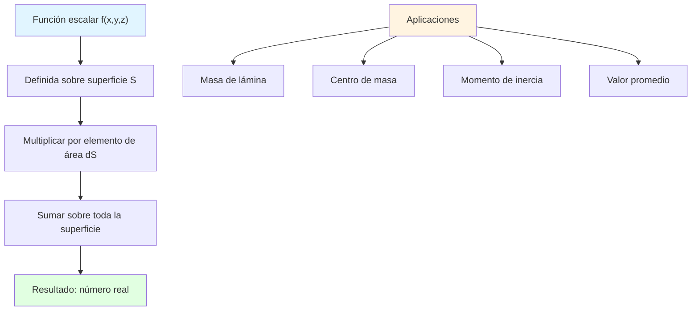

# 📊 Integral de Superficie de una Función Escalar

## 🎯 Introducción

> [!info]- 💡 ¿Qué es una Integral de Superficie Escalar?
> 
> La **integral de superficie de una función escalar** extiende el concepto de integral doble a superficies curvas en el espacio tridimensional. Mientras que las integrales dobles integran sobre regiones planas, las integrales de superficie integran sobre superficies curvas.
> 
> **Analogía práctica:** Imagina una lámina metálica curvada con densidad variable. La integral de superficie te permite calcular:
> 
> - La masa total de la lámina
> - El centro de masa
> - El momento de inercia
> - El promedio de temperatura sobre la superficie
> 
> **¿Por qué es importante?**
> 
> |Aspecto|Descripción|Ejemplo de Uso|
> |---|---|---|
> |**Física**|Calcular propiedades de objetos 3D|Masa, centro de masa|
> |**Temperatura**|Distribución de calor en superficies|Transferencia térmica|
> |**Densidad**|Masa distribuida en superficies|Láminas con densidad variable|
> |**Promedios**|Valores promedio sobre superficies|Temperatura promedio|
> |**Flujo**|Cantidad que pasa por una superficie|Flujo de calor, fluido|



---

## 📐 Definición Formal

### 🎨 Concepto Fundamental

> [!note]- 📘 Definición
> 
> Sea f(x,y,z) una función escalar continua definida sobre una superficie suave S. La **integral de superficie** de f sobre S se define como:
> 
> $$\iint_S f(x,y,z) , dS$$
> 
> Donde:
> 
> - **f(x,y,z)**: función escalar (densidad, temperatura, etc.)
> - **S**: superficie en ℝ³
> - **dS**: elemento diferencial de área en la superficie
> 
> **Interpretación geométrica:**
> 
> ```mermaid
> graph LR
>     A[Superficie S] --> B[Dividir en elementos pequeños ΔS]
>     B --> C[Evaluar f en cada elemento]
>     C --> D[f(x,y,z) · ΔS]
>     D --> E[Sumar todos los productos]
>     E --> F[Límite cuando ΔS → 0]
>     F --> G[∬_S f dS]
>     
>     style A fill:#e1f5ff
>     style G fill:#e1ffe1
> ```
> 
> **Comparación con otras integrales:**
> 
> |Tipo|Dominio|Notación|Resultado|
> |---|---|---|---|
> |**Simple**|Intervalo [a,b]|∫_a^b f(x) dx|Área bajo curva|
> |**Doble**|Región D ⊂ ℝ²|∬_D f(x,y) dA|Volumen bajo superficie|
> |**Superficie**|Superficie S ⊂ ℝ³|∬_S f(x,y,z) dS|Suma ponderada sobre S|
> |**Triple**|Región E ⊂ ℝ³|∭_E f(x,y,z) dV|Suma sobre volumen|
> 
> **Caso especial:**
> 
> Cuando f(x,y,z) = 1:
> 
> $$\iint_S 1 , dS = \text{Área de la superficie S}$$
> 
> (Recuperamos la fórmula del área del tema anterior)

---

## 🔧 Métodos de Cálculo

### 📈 Superficie como Gráfica: z = g(x,y)

> [!example]- 🎯 Primera Forma de Parametrización
> 
> Si la superficie S está dada por **z = g(x,y)** sobre una región D en el plano xy:
> 
> $$\iint_S f(x,y,z) , dS = \iint_D f(x,y,g(x,y)) \sqrt{1 + \left(\frac{\partial g}{\partial x}\right)^2 + \left(\frac{\partial g}{\partial y}\right)^2} , dA$$
> 
> **Componentes de la fórmula:**
> 
> |Componente|Significado|Origen|
> |---|---|---|
> |**f(x,y,g(x,y))**|Función evaluada en la superficie|Sustitución de z|
> |**√(1 + g_x² + g_y²)**|Factor de área (del tema anterior)|Corrección por inclinación|
> |**dA = dx dy**|Elemento de área plano|Región D|
> 
> **Proceso de cálculo:**
> 
> ```mermaid
> flowchart TD
>     A[Superficie z = g(x,y)] --> B[1. Sustituir z en f]
>     B --> C[f(x,y,z) → f(x,y,g(x,y))]
>     C --> D[2. Calcular derivadas parciales]
>     D --> E[∂g/∂x, ∂g/∂y]
>     E --> F[3. Calcular factor de área]
>     F --> G[√(1 + g_x² + g_y²)]
>     G --> H[4. Plantear integral doble]
>     H --> I[∬_D f(x,y,g(x,y))·√(...)dA]
>     I --> J[5. Integrar sobre D]
>     
>     style A fill:#e1f5ff
>     style I fill:#fff4e1
>     style J fill:#e1ffe1
> ```
> 
> **Ejemplo 1: Plano con densidad constante**
> 
> Calcular ∬_S xy dS donde S es la porción del plano z = 2 + x sobre el rectángulo D = [0,1] × [0,2]
> 
> ```
> Datos:
> f(x,y,z) = xy
> g(x,y) = 2 + x
> D = [0,1] × [0,2]
> 
> Paso 1: Derivadas parciales
> ∂g/∂x = 1
> ∂g/∂y = 0
> 
> Paso 2: Factor de área
> √(1 + 1² + 0²) = √2
> 
> Paso 3: Sustituir z (aunque no aparece en f)
> f(x,y,g(x,y)) = xy
> 
> Paso 4: Integral de superficie
> ∬_S xy dS = ∬_D xy · √2 dA
>            = √2 ∫₀¹ ∫₀² xy dy dx
> 
> Paso 5: Integrar en y
> = √2 ∫₀¹ x[y²/2]₀² dx
> = √2 ∫₀¹ x · 2 dx
> = 2√2 ∫₀¹ x dx
> 
> Paso 6: Integrar en x
> = 2√2 [x²/2]₀¹
> = 2√2 · (1/2)
> = √2
> 
> Respuesta: ∬_S xy dS = √2
> ```
> 
> **Ejemplo 2: Paraboloide con densidad variable**
> 
> Calcular ∬_S z dS donde S es z = x² + y² sobre el círculo x² + y² ≤ 1
> 
> ```
> Datos:
> f(x,y,z) = z
> g(x,y) = x² + y²
> D: x² + y² ≤ 1
> 
> Paso 1: Derivadas parciales
> ∂g/∂x = 2x
> ∂g/∂y = 2y
> 
> Paso 2: Factor de área
> √(1 + 4x² + 4y²)
> 
> Paso 3: Sustituir z = g(x,y)
> f(x,y,g(x,y)) = x² + y²
> 
> Paso 4: Integral de superficie
> ∬_S z dS = ∬_D (x² + y²)√(1 + 4x² + 4y²) dA
> 
> Paso 5: Coordenadas polares (por simetría circular)
> x = r cos θ, y = r sen θ
> x² + y² = r²
> dA = r dr dθ
> 
> = ∫₀²ᵖ ∫₀¹ r² · √(1 + 4r²) · r dr dθ
> = ∫₀²ᵖ dθ · ∫₀¹ r³√(1 + 4r²) dr
> 
> Paso 6: Integrar en θ
> = 2π · ∫₀¹ r³√(1 + 4r²) dr
> 
> Paso 7: Sustitución u = 1 + 4r²
> du = 8r dr  →  r dr = du/8
> r² = (u-1)/4
> 
> Cuando r = 0: u = 1
> Cuando r = 1: u = 5
> 
> = 2π · ∫₁⁵ [(u-1)/4] · √u · (1/8) du
> = (2π/32) ∫₁⁵ (u-1)√u du
> = (π/16) ∫₁⁵ (u^(3/2) - u^(1/2)) du
> = (π/16) [(2/5)u^(5/2) - (2/3)u^(3/2)]₁⁵
> = (π/16) [(2/5)(5^(5/2)) - (2/3)(5^(3/2)) - (2/5) + (2/3)]
> = (π/16) [(2/5)(25√5) - (2/3)(5√5) - 2/5 + 2/3]
> = π/16 · [50√5/5 - 10√5/3 + 4/15]
> = π/16 · [(150√5 - 50√5)/15 + 4/15]
> = π/16 · [(100√5 + 4)/15]
> = π(100√5 + 4)/240
> = π(25√5 + 1)/60
> 
> Respuesta: ∬_S z dS = π(25√5 + 1)/60
> ```

### 🔄 Superficie Paramétrica: r(u,v)

> [!success]- 🎨 Segunda Forma - Parametrización General
> 
> Si la superficie S está parametrizada por **r(u,v) = ⟨x(u,v), y(u,v), z(u,v)⟩** sobre una región D en el plano uv:
> 
> $$\iint_S f(x,y,z) , dS = \iint_D f(\vec{r}(u,v)) \left|\frac{\partial \vec{r}}{\partial u} \times \frac{\partial \vec{r}}{\partial v}\right| , du,dv$$
> 
> **Componentes:**
> 
> |Componente|Significado|
> |---|---|
> |**f(r(u,v))**|Función evaluada en la parametrización|
> |**∂r/∂u × ∂r/∂v**|Vector normal a la superficie|
> |**\|∂r/∂u × ∂r/∂v\|**|Magnitud = factor de área|
> 
> **Recordatorio del producto cruz:**
> 
> $$\vec{r}_u \times \vec{r}_v = \begin{vmatrix} \vec{i} & \vec{j} & \vec{k} \ \frac{\partial x}{\partial u} & \frac{\partial y}{\partial u} & \frac{\partial z}{\partial u} \ \frac{\partial x}{\partial v} & \frac{\partial y}{\partial v} & \frac{\partial z}{\partial v} \end{vmatrix}$$
> 
> **Proceso detallado:**
> 
> ```mermaid
> flowchart TD
>     A[Parametrización r(u,v)] --> B[1. Calcular vectores tangentes]
>     B --> C[r_u = ∂r/∂u<br/>r_v = ∂r/∂v]
>     C --> D[2. Producto cruz]
>     D --> E[r_u × r_v = ⟨A, B, C⟩]
>     E --> F[3. Magnitud]
>     F --> G[|r_u × r_v| = √(A² + B² + C²)]
>     G --> H[4. Sustituir en f]
>     H --> I[f(x(u,v), y(u,v), z(u,v))]
>     I --> J[5. Integrar]
>     J --> K[∬_D f·|r_u × r_v| du dv]
>     
>     style A fill:#e1f5ff
>     style K fill:#e1ffe1
> ```
> 
> **Ejemplo 1: Cilindro con densidad**
> 
> Calcular ∬_S z² dS donde S es la parte del cilindro x² + y² = 4 con 0 ≤ z ≤ 3
> 
> ```
> Datos:
> f(x,y,z) = z²
> 
> Paso 1: Parametrización cilíndrica
> r(θ,z) = ⟨2cos θ, 2sen θ, z⟩
> Dominio: 0 ≤ θ ≤ 2π, 0 ≤ z ≤ 3
> 
> Paso 2: Vectores tangentes
> r_θ = ∂r/∂θ = ⟨-2sen θ, 2cos θ, 0⟩
> r_z = ∂r/∂z = ⟨0, 0, 1⟩
> 
> Paso 3: Producto cruz
> r_θ × r_z = |  i       j      k  |
>             |-2sen θ  2cos θ  0  |
>             |  0       0      1  |
> 
> = ⟨2cos θ, 2sen θ, 0⟩
> 
> Paso 4: Magnitud
> |r_θ × r_z| = √(4cos²θ + 4sen²θ + 0)
>            = √4
>            = 2
> 
> Paso 5: Función en parámetros
> f(r(θ,z)) = z²
> 
> Paso 6: Integral de superficie
> ∬_S z² dS = ∫₀²ᵖ ∫₀³ z² · 2 dz dθ
> 
> Paso 7: Integrar en z
> = 2 ∫₀²ᵖ [z³/3]₀³ dθ
> = 2 ∫₀²ᵖ 9 dθ
> = 18 ∫₀²ᵖ dθ
> 
> Paso 8: Integrar en θ
> = 18[θ]₀²ᵖ
> = 36π
> 
> Respuesta: ∬_S z² dS = 36π
> ```
> 
> **Ejemplo 2: Esfera con densidad radial**
> 
> Calcular ∬_S (x² + y² + z²) dS donde S es la esfera x² + y² + z² = a²
> 
> ```
> Datos:
> f(x,y,z) = x² + y² + z²
> 
> Paso 1: Parametrización esférica
> r(φ,θ) = ⟨a sen φ cos θ, a sen φ sen θ, a cos φ⟩
> Dominio: 0 ≤ φ ≤ π, 0 ≤ θ ≤ 2π
> 
> Paso 2: Vectores tangentes
> r_φ = ⟨a cos φ cos θ, a cos φ sen θ, -a sen φ⟩
> r_θ = ⟨-a sen φ sen θ, a sen φ cos θ, 0⟩
> 
> Paso 3: Producto cruz (simplificado)
> |r_φ × r_θ| = a² sen φ
> 
> Paso 4: Función en parámetros
> f(r(φ,θ)) = a²sen²φcos²θ + a²sen²φsen²θ + a²cos²φ
>           = a²(sen²φ(cos²θ + sen²θ) + cos²φ)
>           = a²(sen²φ + cos²φ)
>           = a²
> 
> Paso 5: Integral de superficie
> ∬_S a² dS = ∫₀²ᵖ ∫₀ᵖ a² · a² sen φ dφ dθ
>           = a⁴ ∫₀²ᵖ dθ · ∫₀ᵖ sen φ dφ
> 
> Paso 6: Integrar
> = a⁴ · 2π · [-cos φ]₀ᵖ
> = a⁴ · 2π · 2
> = 4πa⁴
> 
> Respuesta: ∬_S (x² + y² + z²) dS = 4πa⁴
> ```

---

## 🎯 Aplicaciones Físicas

### ⚖️ Masa y Centro de Masa

> [!note]- 📊 Propiedades de Láminas
> 
> **1. Masa de una lámina con densidad δ(x,y,z):**
> 
> $$m = \iint_S \delta(x,y,z) , dS$$
> 
> **2. Centro de masa (x̄, ȳ, z̄):**
> 
> $$\bar{x} = \frac{1}{m}\iint_S x\delta(x,y,z) , dS$$
> 
> $$\bar{y} = \frac{1}{m}\iint_S y\delta(x,y,z) , dS$$
> 
> $$\bar{z} = \frac{1}{m}\iint_S z\delta(x,y,z) , dS$$
> 
> **3. Momentos respecto a los planos coordenados:**
> 
> |Momento|Fórmula|Respecto a|
> |---|---|---|
> |**M_yz**|$$\iint_S x\delta , dS$$|Plano yz|
> |**M_xz**|$$\iint_S y\delta , dS$$|Plano xz|
> |**M_xy**|$$\iint_S z\delta , dS$$|Plano xy|
> 
> **Relación:**
> 
> $$\bar{x} = \frac{M_{yz}}{m}, \quad \bar{y} = \frac{M_{xz}}{m}, \quad \bar{z} = \frac{M_{xy}}{m}$$
> 
> ```mermaid
> graph TB
>     A[Lámina con densidad δ(x,y,z)] --> B[Calcular masa total]
>     B --> C[m = ∬_S δ dS]
>     
>     A --> D[Calcular momentos]
>     D --> E[M_yz = ∬_S xδ dS]
>     D --> F[M_xz = ∬_S yδ dS]
>     D --> G[M_xy = ∬_S zδ dS]
>     
>     C --> H[Centro de masa]
>     E --> H
>     F --> H
>     G --> H
>     
>     H --> I[x̄ = M_yz/m<br/>ȳ = M_xz/m<br/>z̄ = M_xy/m]
>     
>     style A fill:#e1f5ff
>     style C fill:#fff4e1
>     style I fill:#e1ffe1
> ```
> 
> **Ejemplo: Hemisferio con densidad constante**
> 
> Encontrar el centro de masa del hemisferio superior x² + y² + z² = a², z ≥ 0, con densidad δ = k (constante)
> 
> ```
> Paso 1: Por simetría
> x̄ = 0, ȳ = 0 (por simetría rotacional)
> Solo necesitamos calcular z̄
> 
> Paso 2: Parametrización esférica
> r(φ,θ) = ⟨a sen φ cos θ, a sen φ sen θ, a cos φ⟩
> Dominio: 0 ≤ φ ≤ π/2, 0 ≤ θ ≤ 2π
> |r_φ × r_θ| = a² sen φ
> 
> Paso 3: Masa total
> m = ∬_S k dS
>   = k ∫₀²ᵖ ∫₀^(π/2) a² sen φ dφ dθ
>   = k · 2π · a² · [-cos φ]₀^(π/2)
>   = k · 2π · a² · 1
>   = 2πka²
> 
> Paso 4: Momento M_xy
> M_xy = ∬_S zk dS
>      = k ∫₀²ᵖ ∫₀^(π/2) (a cos φ) · a² sen φ dφ dθ
>      = ka³ ∫₀²ᵖ dθ · ∫₀^(π/2) cos φ sen φ dφ
> 
> Integral interna (u = sen φ):
> ∫₀^(π/2) cos φ sen φ dφ = [sen²φ/2]₀^(π/2) = 1/2
> 
> M_xy = ka³ · 2π · (1/2)
>      = πka³
> 
> Paso 5: Centro de masa
> z̄ = M_xy/m = πka³/(2πka²) = a/2
> 
> Respuesta: Centro de masa en (0, 0, a/2)
> ```

### 🌡️ Temperatura y Flujo de Calor

> [!example]- 🔥 Distribución Térmica
> 
> **Temperatura promedio sobre una superficie:**
> 
> $$T_{prom} = \frac{1}{A(S)}\iint_S T(x,y,z) , dS$$
> 
> Donde A(S) es el área de la superficie.
> 
> **Flujo de calor (caso escalar simplificado):**
> 
> Si k(x,y,z) es conductividad térmica:
> 
> $$Q = \iint_S k(x,y,z) , dS$$
> 
> **Ejemplo: Temperatura en cilindro**
> 
> Calcular la temperatura promedio sobre el cilindro x² + y² = 1, 0 ≤ z ≤ 2, si T(x,y,z) = z
> 
> ```
> Paso 1: Área del cilindro
> A = 2πrh = 2π(1)(2) = 4π
> 
> Paso 2: Parametrización
> r(θ,z) = ⟨cos θ, sen θ, z⟩
> 0 ≤ θ ≤ 2π, 0 ≤ z ≤ 2
> |r_θ × r_z| = 1
> 
> Paso 3: Integral de temperatura
> ∬_S z dS = ∫₀²ᵖ ∫₀² z · 1 dz dθ
>          = 2π · [z²/2]₀²
>          = 2π · 2
>          = 4π
> 
> Paso 4: Temperatura promedio
> T_prom = (4π)/(4π) = 1
> 
> Respuesta: T_prom = 1
> ```

---

## 📋 Propiedades de las Integrales de Superficie

> [!tip]- 🔧 Propiedades Fundamentales
> 
> **1. Linealidad:**
> 
> $$\iint_S [af(x,y,z) + bg(x,y,z)] , dS = a\iint_S f , dS + b\iint_S g , dS$$
> 
> **2. Aditividad sobre regiones:**
> 
> Si S = S₁ ∪ S₂ y S₁ ∩ S₂ = ∅:
> 
> $$\iint_S f , dS = \iint_{S_1} f , dS + \iint_{S_2} f , dS$$
> 
> **3. Invariancia bajo reparametrización:**
> 
> La integral no depende de la parametrización elegida (siempre que preserve orientación)
> 
> **4. Desigualdad:**
> 
> Si f(x,y,z) ≤ g(x,y,z) en S:
> 
> $$\iint_S f , dS \leq \iint_S g , dS$$
> 
> **5. Caso especial - Área:**
> 
> $$\iint_S 1 , dS = A(S)$$
> 
> **Tabla resumen:**
> 
> |Propiedad|Fórmula|Uso|
> |---|---|---|
> |**Linealidad**|∬(af + bg) = a∬f + b∬g|Separar integrales|
> |**Aditividad**|∬_S = ∬_S₁ + ∬_S₂|Dividir superficies|
> |**Invariancia**|No depende de r(u,v)|Libertad de parametrización|
> |**Monotonicidad**|f ≤ g ⇒ ∬f ≤ ∬g|Estimaciones|

---

## 🎓 Ejemplos Completos Paso a Paso

> [!example]- 📝 Problema 1: Cono con densidad lineal
> 
> **Enunciado:** Calcular la masa de la superficie lateral del cono z = √(x² + y²), 0 ≤ z ≤ h, si la densidad es δ(x,y,z) = z
> 
> ```
> Solución usando parametrización cilíndrica:
> 
> Paso 1: Parametrización
> En el cono: z = r, donde r = √(x² + y²)
> r(r,θ) = ⟨r cos θ, r sen θ, r⟩
> Dominio: 0 ≤ r ≤ h, 0 ≤ θ ≤ 2π
> 
> Paso 2: Vectores tangentes
> r_r = ⟨cos θ, sen θ, 1⟩
> r_θ = ⟨-r sen θ, r cos θ, 0⟩
> 
> Paso 3: Producto cruz
> r_r × r_θ = |  i      j     k  |
>             | cos θ  sen θ  1  |
>             |-r sen θ r cos θ 0|
> 
> = ⟨-r cos θ, -r sen θ, r⟩
> 
> Paso 4: Magnitud
> |r_r × r_θ| = √(r²cos²θ + r²sen²θ + r²)
>            = √(r² + r²)
>            = r√2
> 
> Paso 5: Densidad en parámetros
> δ(r(r,θ)) = z = r
> 
> Paso 6: Masa
> m = ∬_S δ dS
>   = ∫₀²ᵖ ∫₀ʰ r · r√2 dr dθ
>   = √2 ∫₀²ᵖ dθ · ∫₀ʰ r² dr
>   = √2 · 2π · [r³/3]₀ʰ
>   = √2 · 2π · h³/3
>   = (2πh³√2)/3
> 
> Respuesta: m = (2πh³√2)/3
> ```

> [!example]- 📝 Problema 2: Paraboloide con función cuadrática
> **Enunciado:** Calcular ∬_S (x² + y²) dS donde S es z = 1 - x² - y² con z ≥ 0
> 
> ```
> Solución:
> 
> Paso 1: Determinar región D
> z ≥ 0  ⇒  1 - x² - y² ≥ 0
>        ⇒  x² + y² ≤ 1
> D es el círculo unitario
> 
> Paso 2: Superficie como z = g(x,y)
> g(x,y) = 1 - x² - y²
> g_x = -2x
> g_y = -2y
> 
> Paso 3: Factor de área
> √(1 + g_x² + g_y²) = √(1 + 4x² + 4y²)
> 
> Paso 4: Integral de superficie
> ∬_S (x² + y²) dS = ∬_D (x² + y²)√(1 + 4x² + 4y²) dA
> 
> Paso 5: Coordenadas polares
> x = r cos θ, y = r sen θ
> x² + y² = r²
> dA = r dr dθ
> 
> = ∫₀²ᵖ ∫₀¹ r² · √(1 + 4r²) · r dr dθ
> = 2π ∫₀¹ r³√(1 + 4r²) dr
> 
> Paso 6: Sustitución u = 1 + 4r²
> du = 8r dr
> r² = (u-1)/4
> r³√(1 + 4r²) dr = [(u-1)/4]√u · (du/8)
>                  = (u-1)√u du/32
> 
> Límites: r=0 → u=1, r=1 → u=5
> 
> = 2π ∫₁⁵ (u-1)√u/32 du
> = (π/16) ∫₁⁵ (u^(3/2) - u^(1/2)) du
> = (π/16) [(2/5)u^(5/2) - (2/3)u^(3/2)]₁⁵
> 
> Evaluando:
> = (π/16) [(2/5)(25√5) - (2/3)(5√5) - 2/5 + 2/3]
> = (π/16) [10√5 - (10√5/3) + 4/15]
> = (π/16) [(30√5 - 10√5 + 4)/15]
> = π(20√5 + 4)/(16·15)
> = π(5√5 + 1)/60
> 
> Respuesta: ∬_S (x² + y²) dS = π(5√5 + 1)/60
> ```

---

## 🔍 Comparación de Métodos

> [!success]- ⚖️ ¿Cuándo usar cada método?
> 
> |Método|Ventajas|Desventajas|Mejor para|
> |---|---|---|---|
> |**z = g(x,y)**|Fórmula directa|Solo funciones explícitas|Gráficas simples|
> |**Paramétrica**|Muy flexible|Más cálculos|Superficies complejas|
> |**Cilíndricas**|Natural para cilindros|Limitado|Simetría rotacional|
> |**Esféricas**|Natural para esferas|Cálculos trigonométricos|Simetría esférica|
> 
> **Árbol de decisión:**
> 
> ```mermaid
> graph TD
>     A[Superficie S] --> B{¿Forma?}
>     
>     B -->|z = g(x,y)| C[Usar fórmula directa]
>     B -->|Ecuación implícita| D[Parametrizar]
>     B -->|Ya parametrizada| E[Usar r(u,v)]
>     
>     D --> F{¿Simetría?}
>     F -->|Circular/Cilíndrica| G[Coord. cilíndricas]
>     F -->|Esférica| H[Coord. esféricas]
>     F -->|Ninguna| I[Parametrización general]
>     
>     style C fill:#e1ffe1
>     style G fill:#fff4e1
>     style H fill:#e1f5ff
> ```

---

## 📊 Resumen de Fórmulas

> [!note]- 📐 Tabla Completa
> 
> **Fórmulas principales:**
> 
> |Tipo|Fórmula|Elemento dS|
> |---|---|---|
> |**Explícita**|$$\iint_D f(x,y,g(x,y))\sqrt{1 + g_x^2 + g_y^2} , dA$$|$$\sqrt{1 + g_x^2 + g_y^2} , dA$$|
> |**Paramétrica**|$$\iint_D f(\vec{r}(u,v)) \|\vec{r}_u \times \vec{r}_v\| , du,dv$$|$$\|\vec{r}_u \times \vec{r}_v\| , du,dv$$|
> 
> **Aplicaciones:**
> 
> |Cantidad|Fórmula|
> |---|---|
> |**Área**|$$A = \iint_S 1 , dS$$|
> |**Masa**|$$m = \iint_S \delta(x,y,z) , dS$$|
> |**Centro de masa**|$$\bar{x} = \frac{1}{m}\iint_S x\delta , dS$$ (similar para ȳ, z̄)|
> |**Valor promedio**|$$f_{prom} = \frac{1}{A(S)}\iint_S f , dS$$|
> 
> **Parametrizaciones estándar:**
> 
> |Superficie|Parametrización|\|r_u × r_v\||
> |---|---|---|
> |**Cilindro**|⟨R cos θ, R sen θ, z⟩|R|
> |**Esfera**|⟨R sen φ cos θ, R sen φ sen θ, R cos φ⟩|R² sen φ|
> |**Cono**|⟨r cos θ, r sen θ, r⟩|r√2|

---

## 🎯 Estrategia de Resolución

> [!tip]- 🗺️ Guía Completa
> 
> ```mermaid
> flowchart TD
>     A[Problema: ∬_S f dS] --> B[1. Identificar superficie S]
>     B --> C[2. Elegir representación]
>     C --> D{¿Tipo?}
>     
>     D -->|Explícita| E[z = g(x,y)]
>     D -->|Paramétrica| F[r(u,v)]
>     
>     E --> G[Calcular g_x, g_y]
>     F --> H[Calcular r_u, r_v]
>     
>     G --> I[dS = √(1+g_x²+g_y²) dA]
>     H --> J[dS = |r_u × r_v| du dv]
>     
>     I --> K[3. Sustituir f en parámetros]
>     J --> K
>     
>     K --> L[4. Elegir coordenadas]
>     L --> M{¿Simetría?}
>     
>     M -->|Circular| N[Polares]
>     M -->|Rectangular| O[Cartesianas]
>     
>     N --> P[5. Plantear y calcular integral]
>     O --> P
>     
>     P --> Q[6. Evaluar e interpretar]
>     
>     style A fill:#e1f5ff
>     style P fill:#fff4e1
>     style Q fill:#e1ffe1
> ```
> 
> **Checklist:**
> 
> - [ ] Identificar f(x,y,z) y superficie S
> - [ ] Elegir mejor representación
> - [ ] Calcular derivadas o vectores tangentes
> - [ ] Obtener elemento dS
> - [ ] Expresar f en parámetros de superficie
> - [ ] Determinar región de integración
> - [ ] Elegir sistema de coordenadas apropiado
> - [ ] Plantear límites correctos
> - [ ] Integrar cuidadosamente
> - [ ] Verificar unidades y signo del resultado

---

**Tags:** #calculo-vectorial #integrales-superficie #funcion-escalar #masa #centro-de-masa #parametrizacion #producto-cruz #aplicaciones-fisicas