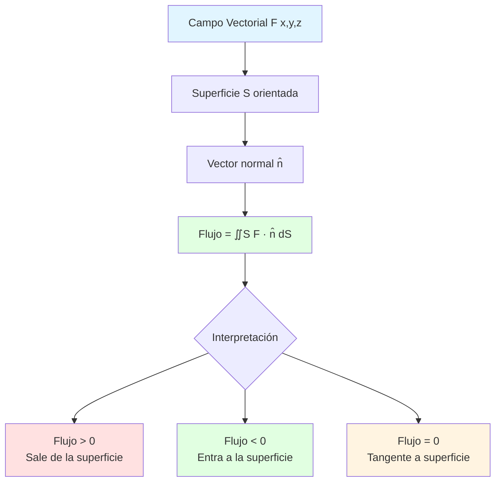
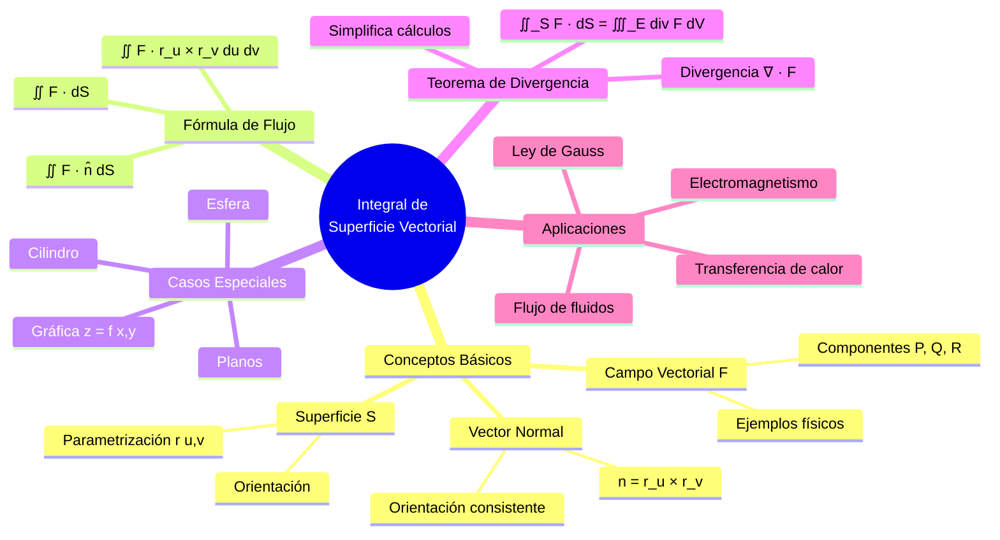
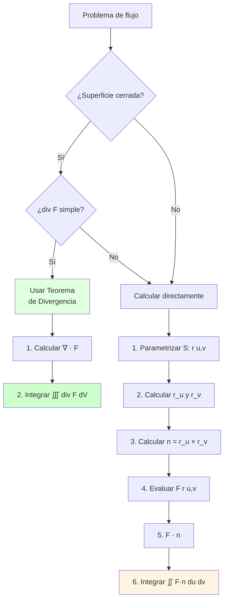

# 🌊 Integral de Superficie Vectorial (Flujo)

## 🎯 Introducción

> [!info]- 💡 ¿Qué es la Integral de Superficie Vectorial?
> 
> La **integral de superficie vectorial** o **integral de flujo** mide la cantidad de un campo vectorial que atraviesa una superficie. Es la extensión natural de las integrales de línea a superficies en el espacio tridimensional.
> 
> **Analogía práctica:** Imagina una red de pesca en un río:
> 
> - El **campo vectorial** representa la velocidad del agua en cada punto
> - La **superficie** es la red que colocas
> - El **flujo** mide cuánta agua pasa a través de la red por unidad de tiempo
> - La **orientación** de la red determina si el agua "entra" o "sale"
> 
> **¿Por qué es importante?**
> 
> |Aspecto|Descripción|Ejemplo de Uso|
> |---|---|---|
> |**Física**|Flujo de campos|Campo eléctrico, magnético, gravitatorio|
> |**Fluidos**|Caudal a través de superficies|Tuberías, válvulas, membranas|
> |**Electromagnetismo**|Ley de Gauss|Carga encerrada en superficie|
> |**Transferencia de calor**|Flujo térmico|Aislamiento, intercambiadores|
> |**Meteorología**|Flujo de masa de aire|Predicción del tiempo|



---

## 📐 Conceptos Fundamentales

### 🔷 Campo Vectorial

> [!note]- 📊 Definición y Ejemplos
> 
> **Definición:**
> 
> Un **campo vectorial** en ℝ³ es una función que asigna un vector a cada punto del espacio:
> 
> $$\mathbf{F}(x,y,z) = P(x,y,z)\mathbf{i} + Q(x,y,z)\mathbf{j} + R(x,y,z)\mathbf{k}$$
> 
> o en notación de componentes:
> 
> $$\mathbf{F}(x,y,z) = \langle P(x,y,z), Q(x,y,z), R(x,y,z) \rangle$$
> 
> **Ejemplos físicos:**
> 
> |Campo|Expresión|Significado|
> |---|---|---|
> |**Velocidad de fluido**|$\mathbf{v}(x,y,z)$|Velocidad en cada punto|
> |**Campo gravitatorio**|$\mathbf{F} = -\frac{Gm}{r^2}\hat{r}$|Fuerza gravitatoria|
> |**Campo eléctrico**|$\mathbf{E} = \frac{Q}{4\pi\epsilon_0 r^2}\hat{r}$|Fuerza eléctrica|
> |**Campo magnético**|$\mathbf{B}(x,y,z)$|Fuerza magnética|
> |**Gradiente de temperatura**|$\nabla T$|Dirección de máximo cambio|
> 
> **Visualización:**
> 
> ```mermaid
> graph LR
>     A[Punto x,y,z] --> B[Vector F x,y,z]
>     B --> C[Componentes<br/>P, Q, R]
>     
>     C --> D[P î: componente en x]
>     C --> E[Q ĵ: componente en y]
>     C --> F[R k̂: componente en z]
>     
>     style A fill:#e1f5ff
>     style B fill:#fff4e1
>     style C fill:#e1ffe1
> ```
> 
> **Ejemplo:**
> 
> Campo de velocidad de rotación alrededor del eje $z$:
> 
> $$\mathbf{F}(x,y,z) = \langle -y, x, 0 \rangle$$
> 
> - En $(1,0,0)$: $\mathbf{F} = \langle 0, 1, 0 \rangle$ (apunta en +y)
> - En $(0,1,0)$: $\mathbf{F} = \langle -1, 0, 0 \rangle$ (apunta en -x)
> - En $(0,0,z)$: $\mathbf{F} = \langle 0, 0, 0 \rangle$ (sin movimiento en el eje)

### 🎨 Superficies Parametrizadas

> [!success]- 📏 Representación de Superficies
> 
> **Definición:**
> 
> Una **superficie parametrizada** se describe mediante una función vectorial de dos parámetros:
> 
> $$\mathbf{r}(u,v) = \langle x(u,v), y(u,v), z(u,v) \rangle$$
> 
> donde $(u,v)$ pertenece a una región $D$ en el plano $uv$.
> 
> **Ejemplos comunes:**
> 
> |Superficie|Parametrización|Dominio|
> |---|---|---|
> |**Plano**|$\mathbf{r}(u,v) = \mathbf{r}_0 + u\mathbf{a} + v\mathbf{b}$|$u,v \in \mathbb{R}$|
> |**Cilindro** (radio $a$)|$\mathbf{r}(\theta,z) = \langle a\cos\theta, a\sin\theta, z \rangle$|$0 \leq \theta \leq 2\pi$|
> |**Esfera** (radio $a$)|$\mathbf{r}(\theta,\phi) = \langle a\sin\phi\cos\theta, a\sin\phi\sin\theta, a\cos\phi \rangle$|$0 \leq \theta \leq 2\pi$<br/>$0 \leq \phi \leq \pi$|
> |**Gráfica** $z=f(x,y)$|$\mathbf{r}(x,y) = \langle x, y, f(x,y) \rangle$|$(x,y) \in D$|
> |**Paraboloide**|$\mathbf{r}(r,\theta) = \langle r\cos\theta, r\sin\theta, r^2 \rangle$|$0 \leq r \leq a$|
> 
> **Vectores tangentes:**
> 
> Los vectores tangentes a la superficie son:
> 
> $$\mathbf{r}_u = \frac{\partial \mathbf{r}}{\partial u} = \left\langle \frac{\partial x}{\partial u}, \frac{\partial y}{\partial u}, \frac{\partial z}{\partial u} \right\rangle$$
> 
> $$\mathbf{r}_v = \frac{\partial \mathbf{r}}{\partial v} = \left\langle \frac{\partial x}{\partial v}, \frac{\partial y}{\partial v}, \frac{\partial z}{\partial v} \right\rangle$$
> 
> **Diagrama:**
> 
> ```mermaid
> graph TD
>     A[Región D en plano uv] --> B[Parametrización r u,v]
>     B --> C[Superficie S en ℝ³]
>     
>     B --> D[Vector tangente r_u]
>     B --> E[Vector tangente r_v]
>     
>     D --> F[Producto cruz<br/>r_u × r_v]
>     E --> F
>     
>     F --> G[Vector normal n̂]
>     
>     style A fill:#e1f5ff
>     style C fill:#e1ffe1
>     style G fill:#fff4e1
> ```

### 🧭 Vector Normal y Orientación

> [!tip]- ⬆️ Dirección Perpendicular
> 
> **Vector normal:**
> 
> El **vector normal** a una superficie parametrizada se obtiene del producto cruz:
> 
> $$\mathbf{n} = \mathbf{r}_u \times \mathbf{r}_v$$
> 
> **Magnitud del vector normal:**
> 
> $$|\mathbf{n}| = |\mathbf{r}_u \times \mathbf{r}_v|$$
> 
> Esta magnitud representa el **elemento de área** $dS$.
> 
> **Vector normal unitario:**
> 
> $$\hat{\mathbf{n}} = \frac{\mathbf{r}_u \times \mathbf{r}_v}{|\mathbf{r}_u \times \mathbf{r}_v|}$$
> 
> **Orientación de la superficie:**
> 
> Una superficie está **orientada** cuando se ha elegido consistentemente qué lado es "positivo" (hacia dónde apunta $\mathbf{n}$).
> 
> |Tipo|Orientación|Convención|
> |---|---|---|
> |**Superficie cerrada**|Hacia afuera|Normal apunta fuera del sólido|
> |**Superficie abierta**|Dos posibles|Elegir una consistentemente|
> |**Gráfica** $z=f(x,y)$|Hacia arriba|Componente $z$ del normal > 0|
> 
> **Ejemplo - Esfera:**
> 
> Para la esfera $x^2+y^2+z^2=a^2$:
> 
> $$\hat{\mathbf{n}} = \frac{\langle x,y,z \rangle}{a}$$
> 
> Apunta radialmente **hacia afuera** del origen.
> 
> **Regla de la mano derecha:**
> 
> ```mermaid
> graph LR
>     A[Dedos: dirección u] --> B[Palma: dirección v]
>     B --> C[Pulgar: dirección n]
>     
>     style A fill:#e1ffe1
>     style B fill:#fff4e1
>     style C fill:#ffe1e1
> ```
> 
> **Superficies no orientables:**
> 
> La **banda de Möbius** es un ejemplo de superficie que NO puede orientarse consistentemente.

---

## 🌊 Integral de Flujo: Definición

### 📏 Fórmula Fundamental

> [!example]- 🎯 Definición Matemática
> 
> **Integral de flujo:**
> 
> Sea $\mathbf{F}$ un campo vectorial y $S$ una superficie orientada. El **flujo** de $\mathbf{F}$ a través de $S$ es:
> 
> $$\text{Flujo} = \iint_S \mathbf{F} \cdot d\mathbf{S} = \iint_S \mathbf{F} \cdot \hat{\mathbf{n}} , dS$$
> 
> **Con parametrización:**
> 
> Si $S$ está parametrizada por $\mathbf{r}(u,v)$ en región $D$:
> 
> $$\iint_S \mathbf{F} \cdot d\mathbf{S} = \iint_D \mathbf{F}(\mathbf{r}(u,v)) \cdot (\mathbf{r}_u \times \mathbf{r}_v) , du,dv$$
> 
> **Componentes:**
> 
> Si $\mathbf{F} = \langle P, Q, R \rangle$ y $\mathbf{n} = \mathbf{r}_u \times \mathbf{r}_v = \langle n_1, n_2, n_3 \rangle$:
> 
> $$\iint_S \mathbf{F} \cdot d\mathbf{S} = \iint_D (Pn_1 + Qn_2 + Rn_3) , du,dv$$
> 
> **Interpretación física:**
> 
> |Valor|Significado|
> |---|---|
> |**Flujo > 0**|Campo sale neto de la superficie|
> |**Flujo < 0**|Campo entra neto a la superficie|
> |**Flujo = 0**|Entrada = Salida (equilibrio)|
> 
> **Proceso de cálculo:**
> 
> ```mermaid
> flowchart TD
>     A[Campo F y Superficie S] --> B[Parametrizar: r u,v]
>     B --> C[Calcular r_u y r_v]
>     C --> D[Calcular n = r_u × r_v]
>     D --> E[Evaluar F r u,v]
>     E --> F[Producto punto F · n]
>     F --> G[Integrar sobre D:<br/>∬ F·n du dv]
>     
>     style A fill:#e1f5ff
>     style D fill:#fff4e1
>     style G fill:#e1ffe1
> ```

### 📊 Casos Especiales

> [!note]- 🎨 Fórmulas para Tipos Comunes
> 
> **1. Gráfica de función: $z = f(x,y)$**
> 
> Para superficie $S$: $z = f(x,y)$, $(x,y) \in D$
> 
> Parametrización: $\mathbf{r}(x,y) = \langle x, y, f(x,y) \rangle$
> 
> $$\mathbf{r}_x = \langle 1, 0, f_x \rangle, \quad \mathbf{r}_y = \langle 0, 1, f_y \rangle$$
> 
> $$\mathbf{r}_x \times \mathbf{r}_y = \langle -f_x, -f_y, 1 \rangle$$
> 
> **Flujo:**
> 
> $$\iint_S \mathbf{F} \cdot d\mathbf{S} = \iint_D (-Pf_x - Qf_y + R) , dx,dy$$
> 
> Si $\mathbf{F} = \langle P, Q, R \rangle$.
> 
> ---
> 
> **2. Superficie cilíndrica: $x^2+y^2=a^2$**
> 
> Parametrización: $\mathbf{r}(\theta,z) = \langle a\cos\theta, a\sin\theta, z \rangle$
> 
> $$\mathbf{r}_\theta = \langle -a\sin\theta, a\cos\theta, 0 \rangle$$ $$\mathbf{r}_z = \langle 0, 0, 1 \rangle$$
> 
> $$\mathbf{r}_\theta \times \mathbf{r}_z = \langle a\cos\theta, a\sin\theta, 0 \rangle$$
> 
> (Apunta hacia afuera radialmente)
> 
> **Flujo:**
> 
> $$\iint_S \mathbf{F} \cdot d\mathbf{S} = \int_{\theta_1}^{\theta_2}\int_{z_1}^{z_2} \mathbf{F} \cdot \langle a\cos\theta, a\sin\theta, 0 \rangle , dz,d\theta$$
> 
> ---
> 
> **3. Superficie esférica: $x^2+y^2+z^2=a^2$**
> 
> Parametrización esférica:
> 
> $$\mathbf{r}(\theta,\phi) = \langle a\sin\phi\cos\theta, a\sin\phi\sin\theta, a\cos\phi \rangle$$
> 
> Después de cálculos:
> 
> $$\mathbf{r}_\theta \times \mathbf{r}_\phi = a^2\sin\phi \langle \sin\phi\cos\theta, \sin\phi\sin\theta, \cos\phi \rangle$$
> 
> $$= a^2\sin\phi \cdot \hat{\mathbf{r}}$$
> 
> donde $\hat{\mathbf{r}}$ es el vector unitario radial.
> 
> **Flujo:**
> 
> $$\iint_S \mathbf{F} \cdot d\mathbf{S} = \int_0^{2\pi}\int_0^\pi \mathbf{F} \cdot (\text{vector normal}) , d\phi,d\theta$$

---

## 🧮 Ejemplos Resueltos

### 📝 Ejemplo 1: Plano con Campo Constante

> [!example]- ✈️ Flujo a Través de un Plano
> 
> Calcular el flujo del campo $\mathbf{F} = \langle 0, 0, 3 \rangle$ a través del cuadrado $S$:
> 
> $$0 \leq x \leq 1, \quad 0 \leq y \leq 1, \quad z = 2$$
> 
> orientado hacia arriba.
> 
> **Solución:**
> 
> **Paso 1: Parametrización**
> 
> $$\mathbf{r}(x,y) = \langle x, y, 2 \rangle, \quad 0 \leq x,y \leq 1$$
> 
> **Paso 2: Vectores tangentes**
> 
> $$\mathbf{r}_x = \langle 1, 0, 0 \rangle$$ $$\mathbf{r}_y = \langle 0, 1, 0 \rangle$$
> 
> **Paso 3: Vector normal**
> 
> $$\mathbf{n} = \mathbf{r}_x \times \mathbf{r}_y = \begin{vmatrix} \mathbf{i} & \mathbf{j} & \mathbf{k} \ 1 & 0 & 0 \ 0 & 1 & 0 \end{vmatrix} = \langle 0, 0, 1 \rangle$$
> 
> (Apunta hacia arriba ✓)
> 
> **Paso 4: Producto punto**
> 
> $$\mathbf{F} \cdot \mathbf{n} = \langle 0, 0, 3 \rangle \cdot \langle 0, 0, 1 \rangle = 3$$
> 
> **Paso 5: Integral**
> 
> $$\text{Flujo} = \iint_D 3 , dx,dy = 3 \cdot \text{(área)} = 3 \cdot 1 = 3$$
> 
> **Respuesta:** Flujo = 3
> 
> **Interpretación:** El campo es vertical con magnitud 3, y la superficie es horizontal con área 1, por lo que el flujo es $3 \times 1 = 3$.

### 📝 Ejemplo 2: Paraboloide con Campo Radial

> [!example]- 🎪 Superficie Curva
> 
> Calcular el flujo de $\mathbf{F} = \langle x, y, z \rangle$ a través del paraboloide:
> 
> $$z = 4 - x^2 - y^2, \quad z \geq 0$$
> 
> orientado hacia arriba.
> 
> **Solución:**
> 
> **Paso 1: Parametrización**
> 
> Usando coordenadas cilíndricas en la base:
> 
> $$\mathbf{r}(r,\theta) = \langle r\cos\theta, r\sin\theta, 4-r^2 \rangle$$
> 
> Límites: $0 \leq r \leq 2$ (ya que $z \geq 0 \Rightarrow 4-r^2 \geq 0$), $0 \leq \theta \leq 2\pi$
> 
> **Paso 2: Vectores tangentes**
> 
> $$\mathbf{r}_r = \langle \cos\theta, \sin\theta, -2r \rangle$$
> 
> $$\mathbf{r}_\theta = \langle -r\sin\theta, r\cos\theta, 0 \rangle$$
> 
> **Paso 3: Producto cruz**
> 
> $$\mathbf{n} = \mathbf{r}_r \times \mathbf{r}_\theta = \begin{vmatrix} \mathbf{i} & \mathbf{j} & \mathbf{k} \ \cos\theta & \sin\theta & -2r \ -r\sin\theta & r\cos\theta & 0 \end{vmatrix}$$
> 
> $$= \mathbf{i}(0 + 2r^2\cos\theta) - \mathbf{j}(0 - 2r^2\sin\theta) + \mathbf{k}(r\cos^2\theta + r\sin^2\theta)$$
> 
> $$= \langle 2r^2\cos\theta, 2r^2\sin\theta, r \rangle$$
> 
> **Verificar orientación:** Componente $z$ es $r > 0$, apunta hacia arriba ✓
> 
> **Paso 4: Evaluar el campo**
> 
> $$\mathbf{F}(\mathbf{r}(r,\theta)) = \langle r\cos\theta, r\sin\theta, 4-r^2 \rangle$$
> 
> **Paso 5: Producto punto**
> 
> $$\mathbf{F} \cdot \mathbf{n} = (r\cos\theta)(2r^2\cos\theta) + (r\sin\theta)(2r^2\sin\theta) + (4-r^2)(r)$$
> 
> $$= 2r^3\cos^2\theta + 2r^3\sin^2\theta + 4r - r^3$$
> 
> $$= 2r^3(\cos^2\theta + \sin^2\theta) + 4r - r^3$$
> 
> $$= 2r^3 + 4r - r^3 = r^3 + 4r$$
> 
> **Paso 6: Integrar**
> 
> $$\text{Flujo} = \int_0^{2\pi}\int_0^2 (r^3 + 4r) , dr,d\theta$$
> 
> $$= 2\pi\int_0^2 (r^3 + 4r) , dr$$
> 
> $$= 2\pi\left[\frac{r^4}{4} + 2r^2\right]_0^2$$
> 
> $$= 2\pi\left(4 + 8\right) = 24\pi$$
> 
> **Respuesta:** Flujo = $24\pi$

### 📝 Ejemplo 3: Cilindro Cerrado

> [!example]- 🥫 Superficie Cerrada
> 
> Calcular el flujo de $\mathbf{F} = \langle 2x, 3y, z^2 \rangle$ a través del cilindro cerrado:
> 
> $$x^2 + y^2 = 1, \quad 0 \leq z \leq 2$$
> 
> (superficie lateral + tapas superior e inferior), orientado hacia afuera.
> 
> **Solución:**
> 
> Dividir en tres partes: $S = S_1 + S_2 + S_3$
> 
> ---
> 
> **Parte 1: Superficie lateral** $S_1$: $x^2+y^2=1$
> 
> Parametrización:
> 
> $$\mathbf{r}(\theta,z) = \langle \cos\theta, \sin\theta, z \rangle$$
> 
> $$0 \leq \theta \leq 2\pi, \quad 0 \leq z \leq 2$$
> 
> Vectores tangentes:
> 
> $$\mathbf{r}_\theta = \langle -\sin\theta, \cos\theta, 0 \rangle$$ $$\mathbf{r}_z = \langle 0, 0, 1 \rangle$$
> 
> Normal:
> 
> $$\mathbf{n}_1 = \mathbf{r}_\theta \times \mathbf{r}_z = \langle \cos\theta, \sin\theta, 0 \rangle$$
> 
> Campo en la superficie:
> 
> $$\mathbf{F} = \langle 2\cos\theta, 3\sin\theta, z^2 \rangle$$
> 
> Producto punto:
> 
> $$\mathbf{F} \cdot \mathbf{n}_1 = 2\cos^2\theta + 3\sin^2\theta$$
> 
> $$= 2\cos^2\theta + 3\sin^2\theta = 2 + \sin^2\theta$$
> 
> Integral:
> 
> $$\text{Flujo}_1 = \int_0^{2\pi}\int_0^2 (2 + \sin^2\theta) , dz,d\theta$$
> 
> $$= 2\int_0^{2\pi} (2 + \sin^2\theta) , d\theta$$
> 
> Usando $\int_0^{2\pi}\sin^2\theta,d\theta = \pi$:
> 
> $$= 2(2 \cdot 2\pi + \pi) = 2(4\pi + \pi) = 10\pi$$
> 
> ---
> 
> **Parte 2: Tapa superior** $S_2$: $z=2$
> 
> $$\mathbf{r}(x,y) = \langle x, y, 2 \rangle, \quad x^2+y^2 \leq 1$$
> 
> Normal hacia arriba: $\mathbf{n}_2 = \langle 0, 0, 1 \rangle$
> 
> Campo: $\mathbf{F} = \langle 2x, 3y, 4 \rangle$
> 
> $$\mathbf{F} \cdot \mathbf{n}_2 = 4$$
> 
> $$\text{Flujo}_2 = \iint_{x^2+y^2 \leq 1} 4 , dA = 4\pi$$
> 
> ---
> 
> **Parte 3: Tapa inferior** $S_3$: $z=0$
> 
> Normal hacia abajo (hacia afuera del cilindro): $\mathbf{n}_3 = \langle 0, 0, -1 \rangle$
> 
> Campo: $\mathbf{F} = \langle 2x, 3y, 0 \rangle$
> 
> $$\mathbf{F} \cdot \mathbf{n}_3 = 0$$
> 
> $$\text{Flujo}_3 = 0$$
> 
> ---
> 
> **Flujo total:**
> 
> $$\text{Flujo} = 10\pi + 4\pi + 0 = 14\pi$$
> 
> **Respuesta:** Flujo = $14\pi$

---

## 🎓 Teorema de la Divergencia (Gauss)

### 🌟 Enunciado del Teorema

> [!success]- 📐 Relación Fundamental
> 
> **Teorema de la Divergencia:**
> 
> Sea $E$ un sólido simple en ℝ³ con frontera $S = \partial E$ orientada hacia afuera, y sea $\mathbf{F}$ un campo vectorial con derivadas parciales continuas. Entonces:
> 
> $$\iint_S \mathbf{F} \cdot d\mathbf{S} = \iiint_E \nabla \cdot \mathbf{F} , dV$$
> 
> donde la **divergencia** es:
> 
> $$\nabla \cdot \mathbf{F} = \frac{\partial P}{\partial x} + \frac{\partial Q}{\partial y} + \frac{\partial R}{\partial z}$$
> 
> si $\mathbf{F} = \langle P, Q, R \rangle$.
> 
> **Interpretación:**
> 
> - **Lado izquierdo:** Flujo neto a través de la superficie (frontera)
> - **Lado derecho:** Suma de las "fuentes" y "sumideros" en el interior
> 
> **Analogía:**
> 
> ```mermaid
> graph TD
>     A[Región E] --> B[Fuentes en interior<br/>div F > 0]
>     A --> C[Sumideros en interior<br/>div F < 0]
>     
>     B --> D[Flujo sale<br/>por frontera S]
>     C --> E[Flujo entra<br/>por frontera S]
>     
>     D --> F[Flujo neto = ∭ div F dV]
>     E --> F
>     
>     style A fill:#e1f5ff
> 	style D fill:#ffe1e1
> 	style E fill:#e1ffe1
> 	style F fill:#fff4e1
> ```
> 
> 
> 
> **Cuándo usar:**
> 
> | Método | Usar cuando... |
> |--------|----------------|
> | **Integral de superficie** | La superficie es simple, div$\mathbf{F}$ es complicada |
> | **Divergencia (volumen)** | La región es simple, div$\mathbf{F}$ es simple |
> 

### 📝 Ejemplo con Divergencia

> [!tip]- 🎯 Aplicación del Teorema
> 
> Calcular el flujo de $\mathbf{F} = \langle x^3, y^3, z^3 \rangle$ a través de la esfera $x^2+y^2+z^2=a^2$, orientada hacia afuera.
> 
> **Método 1: Directamente (difícil)**
> 
> Requeriría parametrización esférica y una integral complicada.
> 
> **Método 2: Teorema de la Divergencia (fácil)**
> 
> **Paso 1: Calcular divergencia**
> 
> $$\nabla \cdot \mathbf{F} = \frac{\partial (x^3)}{\partial x} + \frac{\partial (y^3)}{\partial y} + \frac{\partial (z^3)}{\partial z}$$
> 
> $$= 3x^2 + 3y^2 + 3z^2 = 3(x^2+y^2+z^2)$$
> 
> **Paso 2: Aplicar teorema**
> 
> $$\iint_S \mathbf{F} \cdot d\mathbf{S} = \iiint_E 3(x^2+y^2+z^2) , dV$$
> 
> **Paso 3: Usar esféricas**
> 
> En coordenadas esféricas: $x^2+y^2+z^2 = \rho^2$
> 
> $$= \int_0^{2\pi}\int_0^\pi\int_0^a 3\rho^2 \cdot \rho^2\sin\phi , d\rho,d\phi,d\theta$$
> 
> $$= 3 \cdot 2\pi \cdot 2 \int_0^a \rho^4 , d\rho$$
> 
> $$= 12\pi\left[\frac{\rho^5}{5}\right]_0^a = \frac{12\pi a^5}{5}$$
> 
> **Respuesta:** Flujo = $\frac{12\pi a^5}{5}$
> 
> **¡Mucho más fácil que parametrizar la esfera!**

---

## 📊 Resumen Visual

### 🗺️ Mapa Conceptual



---

## 🔗 Tabla Comparativa

|Aspecto|Integral de Línea|Integral de Superficie|
|---|---|---|
|**Dominio**|Curva en ℝ² o ℝ³|Superficie en ℝ³|
|**Parámetros**|1 (t)|2 (u,v)|
|**Campo**|Escalar o vectorial|Vectorial|
|**Resultado**|Trabajo o circulación|Flujo|
|**Elemento**|$ds$ o $d\mathbf{r}$|$dS$ o $d\mathbf{S}$|
|**Teorema**|Teorema Fundamental, Green|Divergencia, Stokes|

---

## ✅ Proceso de Resolución



---

## 🎓 Ejercicios Propuestos

> [!example]- 💪 Práctica Progresiva
> 
> **Nivel Básico:**
> 
> 1. $\mathbf{F} = \langle 1, 2, 3 \rangle$, plano $z=5$, $0 \leq x,y \leq 1$, hacia arriba.
>     
> 2. $\mathbf{F} = \langle 0, 0, z \rangle$, paraboloide $z=x^2+y^2$, $z \leq 4$, hacia arriba.
>     
> 3. $\mathbf{F} = \langle x, y, 0 \rangle$, cilindro $x^2+y^2=1$, $0 \leq z \leq 1$, lateral hacia afuera.
>     
> 
> **Nivel Intermedio:**
> 
> 4. $\mathbf{F} = \langle x, y, z \rangle$, esfera $x^2+y^2+z^2=4$, hacia afuera (usar divergencia).
>     
> 5. $\mathbf{F} = \langle y, -x, z^2 \rangle$, parte de $z=4-x^2-y^2$, $z \geq 0$, hacia arriba.
>     
> 6. $\mathbf{F} = \langle x^2, y^2, z^2 \rangle$, cubo $[0,1]^3$, hacia afuera (usar divergencia).
>     
> 
> **Nivel Avanzado:**
> 
> 7. $\mathbf{F} = \langle x^3, y^3, z^3 \rangle$, cono $z=\sqrt{x^2+y^2}$, $0 \leq z \leq h$ con tapa en $z=h$.
>     
> 8. $\mathbf{F} = \langle yz, xz, xy \rangle$, hemisferio $x^2+y^2+z^2=a^2$, $z \geq 0$, hacia arriba.
>     
> 9. Verificar el Teorema de Divergencia para $\mathbf{F} = \langle x^2, y^2, z^2 \rangle$ en el cilindro $x^2+y^2 \leq 1$, $0 \leq z \leq 2$.
>     

---

## 🔗 Conexión con Próximos Temas

> [!quote]- 🌟 Continuando el Aprendizaje
> 
> **Has dominado:**
> 
> - ✅ Integral de flujo a través de superficies
> - ✅ Parametrización de superficies
> - ✅ Cálculo de vectores normales
> - ✅ Teorema de la Divergencia
> 
> **Próximos pasos:**
> 
> |Tema Actual|Siguiente Tema|Conexión|
> |---|---|---|
> |Integral de superficie|**Teorema de Stokes**|Relaciona flujo y circulación|
> |Divergencia|**Ecuaciones de Maxwell**|Aplicaciones en electromagnetismo|
> |Campos vectoriales|**Campos conservativos**|Potenciales y energía|
> |Flujo|**Ecuación de continuidad**|Conservación de masa|
> 
> **Roadmap:**
> 
> ```mermaid
> graph LR
>     A[Integral de<br/>Superficie] --> B[Teorema de Stokes]
>     B --> C[Ecuaciones de Maxwell]
>     C --> D[Física Matemática]
>     
>     A -.-> E[Análisis Vectorial<br/>Avanzado]
>     E -.-> F[Geometría Diferencial]
>     
>     style A fill:#e1ffe1
>     style B fill:#fff4e1
>     style C fill:#e1f5ff
>     style D fill:#f0e1ff
> ```

---

**Tags:** #cálculo-vectorial #integral-de-superficie #flujo #campo-vectorial #teorema-divergencia #parametrización #vector-normal #física #electromagnetismo #fluidos
