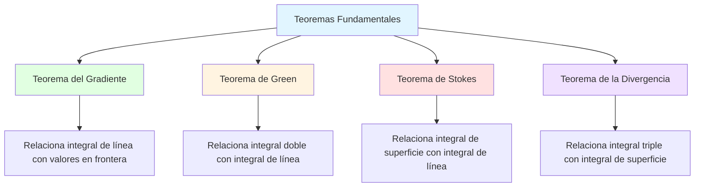

# 🧭 Teoremas de la Teoría Vectorial

## 🎯 Introducción

> [!info]- 💡 ¿Qué son los Teoremas Fundamentales del Cálculo Vectorial?
> 
> Los **teoremas fundamentales del cálculo vectorial** son resultados que relacionan integrales sobre diferentes tipos de dominios (curvas, superficies, volúmenes) con propiedades de campos vectoriales. Son análogos multidimensionales del Teorema Fundamental del Cálculo.
> 
> **Analogía práctica:** Así como el Teorema Fundamental del Cálculo relaciona la derivada con la integral en una dimensión, estos teoremas conectan operadores diferenciales (gradiente, divergencia, rotacional) con integrales en dimensiones superiores.
> 
> **¿Por qué son importantes?**
> 
> |Aspecto|Descripción|Ejemplo de Uso|
> |---|---|---|
> |**Simplificación**|Convertir integrales complejas en más simples|Calcular trabajo sin parametrizar curva|
> |**Física**|Leyes fundamentales de la naturaleza|Ecuaciones de Maxwell, flujo de fluidos|
> |**Interpretación**|Conectar propiedades locales con globales|Circulación vs rotacional|
> |**Verificación**|Comprobar campos conservativos|Trabajo independiente del camino|



---

## 📐 Operadores Diferenciales Vectoriales

### 🎨 Recordatorio de Operadores

> [!note]- 🔧 Operadores Fundamentales
> 
> Antes de los teoremas, recordemos los operadores básicos:
> 
> **1. Gradiente (∇f):**
> 
> Opera sobre **función escalar** f(x,y,z), produce **campo vectorial**:
> 
> $$\nabla f = \left\langle \frac{\partial f}{\partial x}, \frac{\partial f}{\partial y}, \frac{\partial f}{\partial z} \right\rangle$$
> 
> **Interpretación:** Dirección de máximo crecimiento de f
> 
> **2. Divergencia (∇·F):**
> 
> Opera sobre **campo vectorial** F = ⟨P,Q,R⟩, produce **función escalar**:
> 
> $$\nabla \cdot \vec{F} = \frac{\partial P}{\partial x} + \frac{\partial Q}{\partial y} + \frac{\partial R}{\partial z}$$
> 
> **Interpretación:** Medida de "fuente" o "sumidero" en un punto
> 
> **3. Rotacional (∇×F):**
> 
> Opera sobre **campo vectorial** F = ⟨P,Q,R⟩, produce **campo vectorial**:
> 
> $$\nabla \times \vec{F} = \begin{vmatrix} \vec{i} & \vec{j} & \vec{k} \ \frac{\partial}{\partial x} & \frac{\partial}{\partial y} & \frac{\partial}{\partial z} \ P & Q & R \end{vmatrix}$$
> 
> $$= \left\langle \frac{\partial R}{\partial y} - \frac{\partial Q}{\partial z}, \frac{\partial P}{\partial z} - \frac{\partial R}{\partial x}, \frac{\partial Q}{\partial x} - \frac{\partial P}{\partial y} \right\rangle$$
> 
> **Interpretación:** Medida de "rotación" del campo alrededor de un punto
> 
> **Tabla comparativa:**
> 
> |Operador|Entrada|Salida|Símbolo|Significado físico|
> |---|---|---|---|---|
> |**Gradiente**|Escalar f|Vector ∇f|∇f|Dirección de máximo cambio|
> |**Divergencia**|Vector F|Escalar ∇·F|div F|Expansión/compresión|
> |**Rotacional**|Vector F|Vector ∇×F|curl F|Rotación/circulación|
> 
> ```mermaid
> graph LR
>     A[Función escalar f] -->|∇| B[Campo vectorial ∇f]
>     B -->|∇·| C[Función escalar ∇·∇f]
>     B -->|∇×| D[Campo vectorial ∇×∇f = 0]
>     
>     E[Campo vectorial F] -->|∇·| F[Función escalar ∇·F]
>     E -->|∇×| G[Campo vectorial ∇×F]
>     G -->|∇·| H[Escalar ∇·∇×F = 0]
>     
>     style A fill:#e1f5ff
>     style B fill:#e1ffe1
>     style E fill:#e1ffe1
> ```
> 
> **Identidades importantes:**
> 
> |Identidad|Resultado|Nombre|
> |---|---|---|
> |∇×(∇f) = **0**|El rotacional de un gradiente es cero|Campo conservativo|
> |∇·(∇×F) = **0**|La divergencia de un rotacional es cero|Campo solenoidal|
> |∇·(∇f) = ∇²f|Laplaciano|Operador armónico|

---

## 📊 Teorema del Gradiente (Teorema Fundamental para Integrales de Línea)

### 🎯 Enunciado y Significado

> [!success]- 🎨 Teorema del Gradiente
> 
> Sea f una función diferenciable y C una curva suave que va desde el punto A hasta el punto B. Entonces:
> 
> $$\int_C \nabla f \cdot d\vec{r} = f(B) - f(A)$$
> 
> **Versión alternativa:**
> 
> $$\int_C \nabla f \cdot d\vec{r} = f(\vec{r}(b)) - f(\vec{r}(a))$$
> 
> donde r(t) parametriza C con a ≤ t ≤ b
> 
> **Componentes:**
> 
> |Elemento|Significado|
> |---|---|
> |**∇f**|Gradiente de f (campo vectorial)|
> |**C**|Curva desde A hasta B|
> |**f(B) - f(A)**|Diferencia de valores en los extremos|
> |**d𝐫**|Elemento diferencial de la curva|
> 
> **Interpretación física:**
> 
> ```mermaid
> graph LR
>     A[Punto A<br/>f(A)] -->|Curva C| B[Punto B<br/>f(B)]
>     C[Campo ∇f] -.->|"∫_C ∇f·dr"| D[f(B) - f(A)]
>     
>     style A fill:#e1f5ff
>     style B fill:#e1f5ff
>     style D fill:#e1ffe1
> ```
> 
> **Significado:** La integral de línea del gradiente de f a lo largo de cualquier curva C depende ÚNICAMENTE de los puntos inicial y final, no del camino tomado.
> 
> **Analogía con cálculo en una variable:**
> 
> |Cálculo 1D|Cálculo Vectorial|
> |---|---|
> |$$\int_a^b f'(x)dx = f(b) - f(a)$$|$$\int_C \nabla f \cdot d\vec{r} = f(B) - f(A)$$|
> |Derivada ordinaria f'|Gradiente ∇f|
> |Intervalo [a,b]|Curva C|
> 
> **Consecuencias importantes:**
> 
> 1. **Independencia del camino:** Si F = ∇f, entonces ∫_C F·dr depende solo de los extremos
> 2. **Curvas cerradas:** Si C es cerrada, entonces ∮_C ∇f·dr = 0
> 3. **Campos conservativos:** Los campos gradiente son conservativos

### 📝 Ejemplos

> [!example]- 🎓 Ejemplo 1: Cálculo directo
> 
> **Enunciado:** Calcular ∫_C ∇f·dr donde f(x,y) = x²y y C es cualquier curva desde (1,1) hasta (2,3)
> 
> ```
> Solución:
> 
> Paso 1: Verificar que tenemos un gradiente
> Ya está dado f(x,y) = x²y
> 
> Paso 2: Aplicar teorema del gradiente
> ∫_C ∇f·dr = f(B) - f(A)
> 
> Paso 3: Identificar puntos
> A = (1,1)
> B = (2,3)
> 
> Paso 4: Evaluar f en los extremos
> f(A) = f(1,1) = 1² · 1 = 1
> f(B) = f(2,3) = 2² · 3 = 12
> 
> Paso 5: Calcular diferencia
> ∫_C ∇f·dr = 12 - 1 = 11
> 
> Respuesta: 11 (independiente del camino elegido)
> ```
> 
> **Verificación con camino específico:**
> 
> ```
> Camino alternativo: línea recta r(t) = (1,1) + t⟨1,2⟩, 0 ≤ t ≤ 1
> 
> r(t) = ⟨1+t, 1+2t⟩
> r'(t) = ⟨1, 2⟩
> 
> ∇f = ⟨2xy, x²⟩
> ∇f(r(t)) = ⟨2(1+t)(1+2t), (1+t)²⟩
> 
> ∫₀¹ ⟨2(1+t)(1+2t), (1+t)²⟩ · ⟨1, 2⟩ dt
> = ∫₀¹ [2(1+t)(1+2t) + 2(1+t)²] dt
> = ∫₀¹ [2(1+2t+t+2t²) + 2(1+2t+t²)] dt
> = ∫₀¹ [2+6t+4t² + 2+4t+2t²] dt
> = ∫₀¹ [4+10t+6t²] dt
> = [4t + 5t² + 2t³]₀¹
> = 4 + 5 + 2 = 11 ✓
> ```

> [!example]- 🎓 Ejemplo 2: Campo conservativo en 3D
> 
> **Enunciado:** Verificar que F = ⟨yz, xz, xy⟩ es conservativo y calcular ∫_C F·dr desde (0,0,0) hasta (1,1,1)
> 
> ```
> Solución:
> 
> Paso 1: Buscar función potencial f tal que ∇f = F
> ∂f/∂x = yz  →  f = xyz + g(y,z)
> ∂f/∂y = xz  →  f = xyz + h(x,z)
> ∂f/∂z = xy  →  f = xyz + k(x,y)
> 
> Por consistencia: f(x,y,z) = xyz
> 
> Paso 2: Verificar
> ∇f = ⟨yz, xz, xy⟩ = F ✓
> 
> Paso 3: Aplicar teorema del gradiente
> ∫_C F·dr = f(1,1,1) - f(0,0,0)
>          = (1)(1)(1) - 0
>          = 1
> 
> Respuesta: 1
> ```

---

## 🔄 Teorema de Green

### 🎯 Enunciado y Significado

> [!success]- 🎨 Teorema de Green
> 
> Sea C una curva simple cerrada orientada positivamente (sentido antihorario) que encierra una región D en el plano xy. Sea F = ⟨P,Q⟩ un campo vectorial con derivadas parciales continuas en D. Entonces:
> 
> $$\oint_C P,dx + Q,dy = \iint_D \left(\frac{\partial Q}{\partial x} - \frac{\partial P}{\partial y}\right) dA$$
> 
> **Forma vectorial:**
> 
> $$\oint_C \vec{F} \cdot d\vec{r} = \iint_D (\nabla \times \vec{F}) \cdot \vec{k} , dA$$
> 
> donde k = ⟨0,0,1⟩ es el vector unitario en z
> 
> **Componentes:**
> 
> |Elemento|Descripción|
> |---|---|
> |**C**|Curva cerrada simple (frontera de D)|
> |**D**|Región plana encerrada por C|
> |**∮**|Integral sobre curva cerrada|
> |**∂Q/∂x - ∂P/∂y**|Componente z del rotacional en 2D|
> |**Orientación**|Positiva = antihorario|
> 
> **Visualización:**
> 
> ```mermaid
> graph TB
>     A[Integral de línea<br/>sobre curva C] -->|"Teorema de Green"| B[Integral doble<br/>sobre región D]
>     
>     C[∮_C F·dr] -.-> D[∬_D (∂Q/∂x - ∂P/∂y) dA]
>     
>     E[Frontera 1D] -.-> F[Interior 2D]
>     
>     style A fill:#e1f5ff
>     style B fill:#e1ffe1
>     style C fill:#ffe1e1
>     style D fill:#fff4e1
> ```
> 
> **Interpretación física:**
> 
> - **Lado izquierdo (∮_C):** Circulación del campo alrededor de C
> - **Lado derecho (∬_D):** Suma de las rotaciones locales dentro de D
> 
> **Casos especiales:**
> 
> |Condición|Resultado|Interpretación|
> |---|---|---|
> |∂Q/∂x - ∂P/∂y = 0|∮_C F·dr = 0|Campo conservativo en D|
> |P = -y, Q = x|∮_C = 2·Área(D)|Fórmula del área|
> |P = 0, Q = x|∮_C = Área(D)|Área como integral|

### 📝 Ejemplos

> [!example]- 🎓 Ejemplo 1: Cálculo de circulación
> 
> **Enunciado:** Calcular ∮_C (x² - y)dx + (x + y²)dy donde C es el círculo x² + y² = 1 orientado positivamente
> 
> ```
> Solución usando Green:
> 
> Paso 1: Identificar P y Q
> P(x,y) = x² - y
> Q(x,y) = x + y²
> 
> Paso 2: Calcular derivadas parciales
> ∂P/∂y = -1
> ∂Q/∂x = 1
> 
> Paso 3: Rotacional (componente z)
> ∂Q/∂x - ∂P/∂y = 1 - (-1) = 2
> 
> Paso 4: Aplicar Green
> ∮_C P dx + Q dy = ∬_D 2 dA
>                  = 2 · Área(D)
> 
> Paso 5: Área del círculo unitario
> Área(D) = πr² = π(1)² = π
> 
> Paso 6: Resultado
> ∮_C = 2π
> 
> Respuesta: 2π
> ```
> 
> **Sin Green (para comparar):**
> 
> ```
> Parametrización: r(t) = ⟨cos t, sen t⟩, 0 ≤ t ≤ 2π
> r'(t) = ⟨-sen t, cos t⟩
> 
> P(r(t)) = cos²t - sen t
> Q(r(t)) = cos t + sen²t
> 
> ∮_C = ∫₀²ᵖ [(cos²t - sen t)(-sen t) + (cos t + sen²t)(cos t)] dt
>     = ∫₀²ᵖ [-cos²t sen t + sen²t + cos²t + sen²t cos t] dt
>     = ∫₀²ᵖ [cos²t + sen²t] dt
>     = ∫₀²ᵖ 1 dt = 2π ✓
> 
> (Mucho más laborioso)
> ```

> [!example]- 🎓 Ejemplo 2: Cálculo de área
> 
> **Enunciado:** Usar el Teorema de Green para calcular el área de la elipse x²/a² + y²/b² = 1
> 
> ```
> Solución:
> 
> Paso 1: Elegir P y Q para área
> Usamos P = -y, Q = x
> (porque ∂Q/∂x - ∂P/∂y = 1 - (-1) = 2)
> 
> Área = (1/2) ∮_C (-y dx + x dy)
> 
> Paso 2: Parametrización de la elipse
> x = a cos t
> y = b sen t
> 0 ≤ t ≤ 2π
> 
> dx = -a sen t dt
> dy = b cos t dt
> 
> Paso 3: Sustituir en integral
> Área = (1/2) ∫₀²ᵖ [-(b sen t)(-a sen t) + (a cos t)(b cos t)] dt
>      = (1/2) ∫₀²ᵖ [ab sen²t + ab cos²t] dt
>      = (1/2) ∫₀²ᵖ ab dt
>      = (1/2) · ab · 2π
>      = πab
> 
> Respuesta: Área = πab ✓ (fórmula conocida)
> ```

---

## 🌀 Teorema de Stokes

### 🎯 Enunciado y Significado

> [!success]- 🎨 Teorema de Stokes
> 
> Sea S una superficie orientada suave a trozos con frontera C (curva cerrada simple). Sea F un campo vectorial con derivadas parciales continuas en S. Entonces:
> 
> $$\oint_C \vec{F} \cdot d\vec{r} = \iint_S (\nabla \times \vec{F}) \cdot d\vec{S}$$
> 
> **Forma expandida:**
> 
> $$\oint_C P,dx + Q,dy + R,dz = \iint_S (\nabla \times \vec{F}) \cdot \vec{n} , dS$$
> 
> donde n es el vector normal unitario a S
> 
> **Componentes:**
> 
> |Elemento|Descripción|
> |---|---|
> |**S**|Superficie orientada|
> |**C**|Frontera de S (curva cerrada)|
> |**F**|Campo vectorial ⟨P,Q,R⟩|
> |**∇×F**|Rotacional de F|
> |**n**|Vector normal unitario|
> 
> **Visualización:**
> 
> ```mermaid
> graph TB
>     A[Integral de línea<br/>sobre frontera C] -->|"Teorema de Stokes"| B[Integral de superficie<br/>sobre S]
>     
>     C[∮_C F·dr] -.-> D[∬_S (∇×F)·n dS]
>     
>     E[Curva 1D<br/>frontera] -.-> F[Superficie 2D<br/>interior]
>     
>     style A fill:#e1f5ff
>     style B fill:#e1ffe1
>     style C fill:#ffe1e1
>     style D fill:#fff4e1
> ```
> 
> **Relación con Green:**
> 
> El Teorema de Green es un **caso especial** del Teorema de Stokes cuando la superficie S es plana (en el plano xy).
> 
> |Teorema|Dimensión|Generalización|
> |---|---|---|
> |**Green**|2D (plano)|Stokes con S plano|
> |**Stokes**|3D (superficie)|Generalización de Green|
> 
> **Orientación:**
> 
> La curva C debe recorrerse de forma que S quede a la izquierda (regla de la mano derecha: dedos en dirección de C, pulgar hacia n).

### 📝 Ejemplos

> [!example]- 🎓 Ejemplo 1: Paraboloide
> 
> **Enunciado:** Verificar Stokes para F = ⟨-y, x, 0⟩ sobre el paraboloide z = 1 - x² - y², z ≥ 0
> 
> ```
> Solución:
> 
> Paso 1: Identificar S y C
> S: z = 1 - x² - y², z ≥ 0
> C: frontera en z = 0  →  x² + y² = 1
> 
> Paso 2: Calcular ∇×F
> F = ⟨-y, x, 0⟩
> 
> ∇×F = | i    j    k   |
>       | ∂/∂x ∂/∂y ∂/∂z|
>       | -y    x    0  |
> 
> = ⟨0 - 0, 0 - 0, 1 - (-1)⟩
> = ⟨0, 0, 2⟩
> 
> Paso 3: Lado izquierdo - Integral de línea
> C: r(t) = ⟨cos t, sen t, 0⟩, 0 ≤ t ≤ 2π
> r'(t) = ⟨-sen t, cos t, 0⟩
> 
> F(r(t)) = ⟨-sen t, cos t, 0⟩
> 
> ∮_C F·dr = ∫₀²ᵖ ⟨-sen t, cos t, 0⟩ · ⟨-sen t, cos t, 0⟩ dt
>          = ∫₀²ᵖ (sen²t + cos²t) dt
>          = ∫₀²ᵖ 1 dt
>          = 2π
> 
> Paso 4: Lado derecho - Integral de superficie
> S como z = g(x,y) = 1 - x² - y²
> n dS = ⟨-g_x, -g_y, 1⟩ dA
>      = ⟨2x, 2y, 1⟩ dA
> 
> ∇×F · n dS = ⟨0, 0, 2⟩ · ⟨2x, 2y, 1⟩ dA
>            = 2 dA
> 
> ∬_S (∇×F)·n dS = ∬_D 2 dA
>                 = 2 · Área(D)
>                 = 2 · π(1)²
>                 = 2π ✓
> 
> Verificado: ambos lados = 2π
> ```

---

## 📦 Teorema de la Divergencia (Teorema de Gauss)

### 🎯 Enunciado y Significado

> [!success]- 🎨 Teorema de la Divergencia
> 
> Sea E una región sólida en ℝ³ con frontera S (superficie cerrada) orientada hacia afuera. Sea F un campo vectorial con derivadas parciales continuas en E. Entonces:
> 
> $$\iint_S \vec{F} \cdot d\vec{S} = \iiint_E (\nabla \cdot \vec{F}) , dV$$
> 
> **Forma expandida:**
> 
> $$\iint_S \vec{F} \cdot \vec{n} , dS = \iiint_E \left(\frac{\partial P}{\partial x} + \frac{\partial Q}{\partial y} + \frac{\partial R}{\partial z}\right) dV$$
> 
> donde F = ⟨P,Q,R⟩
> 
> **Componentes:**
> 
> |Elemento|Descripción|
> |---|---|
> |**E**|Región sólida (volumen)|
> |**S**|Superficie cerrada (frontera de E)|
> |**F**|Campo vectorial|
> |**∇·F**|Divergencia de F|
> |**n**|Vector normal hacia afuera|
> 
> **Visualización:**
> 
> ```mermaid
> graph TB
>     A[Integral de superficie<br/>sobre frontera S] -->|"Teorema de Divergencia"| B[Integral triple<br/>sobre región E]
>     
>     C[∬_S F·n dS] -.-> D[∭_E (∇·F) dV]
>     
>     E[Superficie 2D<br/>frontera] -.-> F[Volumen 3D<br/>interior]
>     
>     style A fill:#e1f5ff
>     style B fill:#e1ffe1
>     style C fill:#ffe1e1
>     style D fill:#fff4e1
> ```
> 
> **Interpretación física:**
> 
> - **Flujo neto:** Cantidad que sale menos la que entra
> - **Lado izquierdo:** Flujo total a través de la frontera
> - **Lado derecho:** Suma de las fuentes/sumideros internos
> 
> **Aplicaciones:**
> 
> |Campo|Interpretación|
> |---|---|
> |**Fluido**|Conservación de masa|
> |**Eléctrico**|Ley de Gauss|
> |**Térmico**|Conservación de energía|

### 📝 Ejemplos

> [!example]- 🎓 Ejemplo 1: Cubo
> 
> **Enunciado:** Calcular el flujo de F = ⟨x, y, z⟩ hacia afuera del cubo [0,1]³
> 
> ```
> Solución con divergencia:
> 
> Paso 1: Calcular ∇·F
> F = ⟨x, y, z⟩
> ∇·F = ∂x/∂x + ∂y/∂y + ∂z/∂z = 1 + 1 + 1 = 3
> 
> Paso 2: Aplicar teorema
> Flujo = ∭_E 3 dV
>       = 3 · Volumen(E)
>       = 3 · (1)(1)(1)
>       = 3
> 
> Respuesta: 3
> ```
> 
> **Sin divergencia (verificación):**
> 
> ```
> Debemos calcular ∬_S F·n dS sumando las 6 caras:
> 
> Cara x=0: n = ⟨-1,0,0⟩, F·n = -x = 0
> ∬ = 0
> 
> Cara x=1: n = ⟨1,0,0⟩, F·n = x = 1
> ∬ = 1·1·1 = 1
> 
> Cara y=0: n = ⟨0,-1,0⟩, F·n = -y = 0
> ∬ = 0
> 
> Cara y=1: n = ⟨0,1,0⟩, F·n = y = 1
> ∬ = 1·1·1 = 1
> 
> Cara z=0: n = ⟨0,0,-1⟩, F·n = -z = 0
> ∬ = 0
> 
> Cara z=1: n = ⟨0,0,1⟩, F·n = z = 1
> ∬ = 1·1·1 = 1
> 
> Total: 0 + 1 + 0 + 1 + 0 + 1 = 3 ✓
> 
> (Mucho más trabajo)
> ```

> [!example]- 🎓 Ejemplo 2: Esfera
> 
> **Enunciado:** Calcular ∬_S F·n dS donde F = ⟨x³, y³, z³⟩ y S es la esfera x² + y² + z² = a²
> ```
> Solución:
> 
> Paso 1: Calcular divergencia
> ∇·F = ∂(x³)/∂x + ∂(y³)/∂y + ∂(z³)/∂z
>     = 3x² + 3y² + 3z²
>     = 3(x² + y² + z²)
> 
> Paso 2: Coordenadas esféricas
> x² + y² + z² = ρ²
> dV = ρ² sen φ dρ dφ dθ
> 
> ∇·F = 3ρ²
> 
> Paso 3: Integral triple
> Flujo = ∭_E 3ρ² · ρ² sen φ dρ dφ dθ
>       = 3 ∫₀²ᵖ dθ ∫₀ᵖ sen φ dφ ∫₀ᵃ ρ⁴ dρ
>       = 3 · 2π · 2 · [ρ⁵/5]₀ᵃ
>       = 12π · a⁵/5
>       = (12πa⁵)/5
> 
> Respuesta: (12πa⁵)/5
> ```

---

## 📊 Tabla Comparativa de los Teoremas

> [!note]- 📐 Resumen Visual
> 
> |Teorema|Relaciona|Fórmula|Dimensiones|
> |---|---|---|---|
> |**Gradiente**|Integral de línea ↔ Valores extremos|∫_C ∇f·dr = f(B) - f(A)|1D ↔ 0D|
> |**Green**|Integral de línea ↔ Integral doble|∮_C F·dr = ∬_D (∇×F)·k dA|1D ↔ 2D|
> |**Stokes**|Integral de línea ↔ Integral de superficie|∮_C F·dr = ∬_S (∇×F)·n dS|1D ↔ 2D|
> |**Divergencia**|Integral de superficie ↔ Integral triple|∬_S F·n dS = ∭_E (∇·F) dV|2D ↔ 3D|
> 
> **Jerarquía de generalización:**
> 
> ```mermaid
> graph TD
>     A[Teorema Fundamental<br/>del Cálculo<br/>∫_a^b f' dx = f(b) - f(a)] 
>     
>     A --> B[Teorema del Gradiente<br/>∫_C ∇f·dr = f(B) - f(A)]
>     
>     B --> C[Teorema de Green<br/>∮_C F·dr = ∬_D (∂Q/∂x - ∂P/∂y) dA]
>     
>     C --> D[Teorema de Stokes<br/>∮_C F·dr = ∬_S (∇×F)·n dS]
>     
>     D --> E[Teorema de la Divergencia<br/>∬_S F·n dS = ∭_E (∇·F) dV]
>     
>     style A fill:#e1f5ff
>     style B fill:#e1ffe1
>     style C fill:#fff4e1
>     style D fill:#ffe1e1
>     style E fill:#f0e1ff
> ```

---

## 🎯 Estrategia de Aplicación

> [!tip]- 🗺️ ¿Cuándo usar cada teorema?
> 
> ```mermaid
> flowchart TD
>     A[Problema de integral] --> B{¿Tipo de integral?}
>     
>     B -->|Línea sobre curva abierta| C{¿F = ∇f?}
>     C -->|Sí| D[Teorema del Gradiente]
>     C -->|No| E[Parametrizar]
>     
>     B -->|Línea sobre curva cerrada| F{¿En plano?}
>     F -->|Sí| G[Green]
>     F -->|No| H[Stokes]
>     
>     B -->|Superficie cerrada| I[Divergencia]
>     B -->|Superficie abierta| J[Stokes si conoces frontera]
>     
>     style D fill:#e1ffe1
>     style G fill:#fff4e1
>     style H fill:#ffe1e1
>     style I fill:#f0e1ff
> ```
> 
> **Checklist de decisión:**
> 
> - [ ] Identificar tipo de integral (línea, superficie, volumen)
> - [ ] Verificar si dominio es abierto o cerrado
> - [ ] Comprobar dimensión del espacio
> - [ ] Calcular operador diferencial necesario
> - [ ] Comparar complejidad: ¿es más fácil con el teorema?
> - [ ] Verificar condiciones (continuidad, orientación)

---

**Tags:** #calculo-vectorial #teoremas-fundamentales #green #stokes #divergencia #gradiente #rotacional #campos-vectoriales