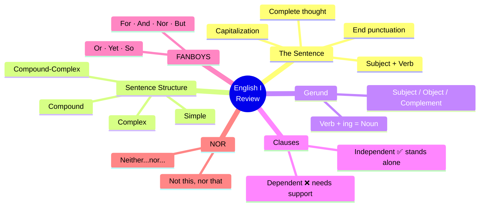

# 🟦 English II — Welcome & Grammar Review

## 🎉 Welcome to English II

> [!info]- 👋 ¡Bienvenido/a a Inglés II !
>
> ¡Hola y bienvenido/a a **Inglés II**! Es un gusto tenerte aquí. Este semestre vamos a llevar tu inglés a un nuevo nivel, pero antes de empezar, hagamos un recorrido rápido por los fundamentos que ya viste en **Inglés I**.
>
> Este repaso no es para aprender de nuevo — es para **recordar, conectar y fortalecer** lo que ya sabes, porque todo lo que veremos este semestre se construye sobre esas bases.
>
> **¿Qué vamos a repasar hoy?**
>
> | # | Tema |
> |---|------|
> | 1 | 📝 What is a sentence? |
> | 2 | 🔍 Characteristics of a sentence |
> | 3 | 🏗️ English sentence structure |
> | 4 | 🔄 The Gerund |
> | 5 | 🔗 Types of clauses |
> | 6 | 📐 Types of sentences by structure |
> | 7 | 🤝 FANBOYS — Coordinating Conjunctions |
> | 8 | 🚫 The use of **NOR** |

---

## 📝 1. What is a Sentence?

> [!info]- 💡 Definición
>
> A **sentence** is a group of words that expresses a **complete thought**. It always has at least a **subject** and a **verb**, and it makes sense on its own.
>
> **Analogía práctica:** Una oración es como una historia mínima — siempre hay alguien (sujeto) que hace algo (verbo), y juntos forman una idea completa.
>
> ```
> ✅ She runs every morning.
>    (Subject = She | Verb = runs | Complete thought ✔)
>
> ✅ The students studied hard.
>    (Subject = The students | Verb = studied | Complete thought ✔)
>
> ❌ Because she was tired.
>    (Incomplete — leaves us asking: "What happened?")
>
> ❌ Running in the park.
>    (No subject — who is running?)
> ```

---

## 🔍 2. Characteristics of a Sentence

> [!example]- 📋 Key Characteristics
>
> Every sentence in English must have these features:
>
> | Characteristic | Description | Example |
> |---|---|---|
> | **Subject** | Who or what the sentence is about | ***She*** sings beautifully. |
> | **Predicate (Verb)** | What the subject does or is | She ***sings*** beautifully. |
> | **Complete thought** | It makes sense on its own | She sings beautifully. ✔ |
> | **Capitalization** | Starts with a capital letter | ***S***he sings beautifully. |
> | **End punctuation** | Ends with . ? or ! | She sings beautifully**.** |
>
> **Estructura visual:**
>
> ```
> ┌─────────────────────────────────────────────────────┐
> │  [Capital Letter]  SUBJECT  +  VERB  + ...  [. ? !] │
> └─────────────────────────────────────────────────────┘
>
>   She       runs      every morning.
>   ↑         ↑         ↑              ↑
>   Capital   Subject   Verb   Complement   Period
> ```

---

## 🏗️ 3. English Sentence Structure

> [!tip]- 📊 The 4 Types — At a Glance
>
> In English, sentences can be classified into **4 structural types** depending on how many clauses they have and how those clauses are connected.
>
> ```mermaid
> graph TD
>     A[🧩 SENTENCE TYPES<br/>by Structure] --> B[Simple<br/>Sentence]
>     A --> C[Compound<br/>Sentence]
>     A --> D[Complex<br/>Sentence]
>     A --> E[Compound-Complex<br/>Sentence]
>
>     B --> B1["1 Independent Clause<br/>─────────────<br/>She reads books."]
>     C --> C1["2+ Independent Clauses<br/>joined by FANBOYS<br/>─────────────<br/>She reads and he writes."]
>     D --> D1["1 Independent Clause<br/>+ 1 Dependent Clause<br/>─────────────<br/>She reads because she loves stories."]
>     E --> E1["2+ Independent Clauses<br/>+ 1+ Dependent Clause<br/>─────────────<br/>She reads and he writes,<br/>although they are busy."]
>
>     style B fill:#e1ffe1
>     style C fill:#fff4e1
>     style D fill:#e1f5ff
>     style E fill:#ffe1e1
>     style B1 fill:#f0fff0
>     style C1 fill:#fffdf0
>     style D1 fill:#f0f8ff
>     style E1 fill:#fff0f0
> ```
>
> ---
>
> **🟢 Simple Sentence**
>
> Contains **one independent clause** only. It can have one or more subjects and verbs, but they all belong to a single complete thought.
>
> ```
> ✅ The dog barked.
> ✅ Maria and Pedro study together.
> ✅ She woke up, got dressed, and left quickly.
>    (Multiple verbs — still ONE clause, ONE subject)
> ```
>
> ---
>
> **🟡 Compound Sentence**
>
> Contains **two or more independent clauses** joined by a **coordinating conjunction (FANBOYS)** or a semicolon.
>
> ```
> ✅ I wanted to go, but it was raining.
>    [Independent Clause] + but + [Independent Clause]
>
> ✅ She studied hard, so she passed the exam.
>
> ✅ He likes coffee; she prefers tea.
>    (Semicolon can replace the conjunction)
> ```
>
> ---
>
> **🔵 Complex Sentence**
>
> Contains **one independent clause** and **at least one dependent clause**, joined by a **subordinating conjunction** (because, although, when, if, since, while...).
>
> ```
> ✅ Although it was raining, we went outside.
>    [Dependent Clause] + , + [Independent Clause]
>
> ✅ She passed the exam because she studied hard.
>    [Independent Clause] + because + [Dependent Clause]
>
> ⚠️ Note: When the dependent clause comes FIRST → use a comma.
>            When it comes SECOND → no comma needed.
> ```
>
> ---
>
> **🔴 Compound-Complex Sentence**
>
> Contains **two or more independent clauses** AND **at least one dependent clause**.
>
> ```
> ✅ Although she was tired, she finished the project,
>    and her boss was impressed.
>    [Dep. Clause] + [Ind. Clause] + and + [Ind. Clause]
>
> ✅ I wanted to travel, but I had no money
>    because I lost my job.
>    [Ind. Clause] + but + [Ind. Clause] + because + [Dep. Clause]
> ```

---

## 🔄 4. The Gerund

> [!note]- 🔤 What is a Gerund?
>
> A **gerund** is a verb that ends in **-ing** and functions as a **noun** in a sentence. Even though it looks like a verb, it acts like a thing or idea.
>
> **Fórmula:** `Verb + -ing = Gerund (used as a noun)`
>
> | Role in Sentence | Example |
> |---|---|
> | **Subject** | ***Swimming*** is good for your health. |
> | **Object of verb** | She enjoys ***reading***. |
> | **Object of preposition** | He is good at ***cooking***. |
> | **Subject complement** | Her hobby is ***painting***. |
>
> **Common verbs followed by Gerunds:**
>
> ```
> ✅ enjoy   → She enjoys swimming.
> ✅ avoid   → He avoids eating sugar.
> ✅ finish  → They finished working.
> ✅ keep    → Keep trying!
> ✅ suggest → I suggest leaving early.
> ✅ mind    → Do you mind waiting?
> ✅ miss    → I miss traveling.
> ✅ practice → She practices speaking English every day.
> ```
>
> **⚠️ Gerund vs. Present Participle — Don't confuse them!**
>
> ```
> Gerund (NOUN):        Swimming is fun.
>                       ↑ acts as the subject (a noun)
>
> Present Participle:   She is swimming right now.
>                       ↑ part of the verb phrase (progressive tense)
> ```

---

## 🔗 5. Clauses

> [!info]- 🧱 What is a Clause?
>
> A **clause** is a group of words that contains a **subject** and a **verb**. There are two types:
>
> ```mermaid
> graph LR
>     A[CLAUSE] --> B[Independent Clause]
>     A --> C[Dependent Clause]
>
>     B --> B1["✅ Makes complete sense alone<br/>─────────────────<br/>She loves music."]
>     C --> C1["❌ Does NOT make sense alone<br/>─────────────────<br/>Because she loves music..."]
>
>     style B fill:#e1ffe1
>     style C fill:#ffe1e1
>     style B1 fill:#f0fff0
>     style C1 fill:#fff0f0
> ```
>
> ---
>
> **✅ Independent Clause**
>
> Can stand alone as a complete sentence. It expresses a complete thought.
>
> ```
> ✅ The teacher explained the lesson.
> ✅ I love learning languages.
> ✅ He works every day.
> ```
>
> ---
>
> **❌ Dependent Clause**
>
> Cannot stand alone — it depends on an independent clause to complete its meaning. It starts with a **subordinating conjunction** (because, although, when, if, since, while, after, before, unless...).
>
> ```
> ❌ Because she was tired...       (What happened?)
> ❌ When the class ends...         (What will happen?)
> ❌ Although he studied a lot...   (What was the result?)
>
> ✅ Because she was tired, she went to bed early.
>    [Dependent] ──── + ──── [Independent]
> ```

---

## 📐 6. Types of Sentences by Structure

> [!example]- 📋 Simple Sentences
>
> A **simple sentence** has **one independent clause** — one subject and one predicate forming a complete thought. It does NOT contain any dependent clauses.
>
> ```
> Formula: [Subject] + [Verb] + (Complement)
>
> ✅ Birds fly.
> ✅ The children played in the park.
> ✅ My sister and I cook dinner together.
>    (Compound subject — still simple!)
>
> ✅ She woke up, brushed her teeth, and left.
>    (Multiple verbs — still simple!)
> ```

> [!example]- 🔗 Compound Sentences
>
> A **compound sentence** joins **two or more independent clauses** using a **coordinating conjunction (FANBOYS)** or a semicolon. Each clause could stand alone as a complete sentence.
>
> ```
> Formula: [Ind. Clause] + FANBOYS + [Ind. Clause]
>       OR [Ind. Clause] ; [Ind. Clause]
>
> ✅ I wanted to stay, but I had to leave.
> ✅ She called her friend, and they talked for hours.
> ✅ He didn't study, so he failed the test.
> ✅ You can stay here, or you can come with us.
> ✅ It was cold; we decided to stay inside.
> ```
>
> **⚠️ Important:** In compound sentences, always place a **comma before the FANBOYS conjunction**.

---

## 🤝 7. FANBOYS — Coordinating Conjunctions

> [!success]- 🧠 What are FANBOYS?
>
> **FANBOYS** is an acronym for the 7 **coordinating conjunctions** in English. They connect two independent clauses (or other equal grammatical elements) of the same importance.
>
> ```
> F — For
> A — And
> N — Nor
> B — But
> O — Or
> Y — Yet
> S — So
> ```
>
> **The FANBOYS Table:**
>
> | Conjunction | Meaning / Use | Example |
> |---|---|---|
> | **For** | Gives a reason (formal "because") | She was happy, **for** she had passed. |
> | **And** | Adds information | I study English, **and** I practice daily. |
> | **Nor** | Adds a negative alternative | He doesn't smoke, **nor** does he drink. |
> | **But** | Shows contrast | I wanted to go, **but** it was raining. |
> | **Or** | Shows a choice / alternative | You can call me, **or** you can text me. |
> | **Yet** | Shows unexpected contrast (= "but") | She was tired, **yet** she kept working. |
> | **So** | Shows a result or consequence | It was late, **so** we went home. |
>
> ---
>
> **Examples in context:**
>
> ```
> FOR (reason — formal):
> ✅ He was nervous, for it was his first exam.
> ✅ She felt relieved, for the results were good.
>
> AND (addition):
> ✅ He likes soccer, and she loves tennis.
> ✅ We studied the grammar, and we practiced the exercises.
>
> BUT (contrast):
> ✅ I wanted pizza, but the restaurant was closed.
> ✅ She speaks Spanish, but she doesn't speak French.
>
> OR (alternative / choice):
> ✅ You can study now, or you can study later.
> ✅ He will call you, or he will send an email.
>
> YET (unexpected contrast):
> ✅ It was very difficult, yet she never gave up.
> ✅ He is young, yet he is very responsible.
>
> SO (result / consequence):
> ✅ I was hungry, so I made a sandwich.
> ✅ The class was interesting, so everyone paid attention.
> ```
>
> ---
>
> **📌 Punctuation Rule:**
>
> ```
> [Independent Clause] , [FANBOYS] [Independent Clause]
>                       ↑
>                    COMMA goes here!
>
> ✅ I was tired, but I finished my homework.
> ❌ I was tired but I finished my homework.  ← Missing comma!
> ```

---

## 🚫 8. The Use of NOR

> [!warning]- 🔗 NOR — "Ni esto... ni aquello"
>
> **NOR** is used to add a **second negative idea** to a sentence that already contains a negative. It means **"and not"** or in Spanish: **"ni"**.
>
> Think of it as: **"not this... NOR that"** / **"ni esto... ni aquello"**
>
> ---
>
> **Pattern 1: Neither... nor... (Correlative)**
>
> The most common structure. Use **neither... nor...** to join two negative alternatives.
>
> ```
> Formula: Neither + [option A] + nor + [option B]
>
> ✅ She speaks neither Spanish nor French.
>    (No habla ni español ni francés.)
>
> ✅ Neither the teacher nor the students were late.
>    (Ni el maestro ni los estudiantes llegaron tarde.)
>
> ✅ I have neither the time nor the energy to argue.
>    (No tengo ni el tiempo ni la energía para discutir.)
> ```
>
> ---
>
> **Pattern 2: NOR as a FANBOYS conjunction (Compound sentence)**
>
> When **nor** joins two independent clauses, the **subject and auxiliary verb are inverted** (like a question structure) in the second clause.
>
> ```
> Formula: [Negative Ind. Clause] , nor + [auxiliary] + [subject] + [verb]...
>
> ✅ He doesn't smoke, nor does he drink.
>    (No fuma, ni tampoco bebe.)
>    ↑ Note the inversion: "nor DOES he" not "nor he does"
>
> ✅ She didn't call, nor did she send a message.
>    (No llamó, ni tampoco mandó un mensaje.)
>
> ✅ I am not angry, nor am I disappointed.
>    (No estoy enojado/a, ni tampoco decepcionado/a.)
>
> ✅ They won't give up, nor will they accept defeat.
>    (No se rendirán, ni tampoco aceptarán la derrota.)
> ```
>
> ---
>
> **⚠️ NOR vs. OR — Key Difference:**
>
> | | Sentence Type | Example |
> |---|---|---|
> | **OR** | Used in positive or neutral sentences | You can call me **or** text me. |
> | **NOR** | Used after a negative clause | She didn't call, **nor** did she text me. |
>
> ```
> ✅ CORRECT:  I don't like coffee, nor do I like tea.
> ❌ WRONG:    I don't like coffee, or do I like tea.
>              (OR cannot follow a negative clause to add another negative)
> ```

---

# 📝 Exercises — Sentence Types by Structure

## 🎯 Instructions

> [!info]- 📌 What to do?
>
> Read each sentence and identify its **structural type**. Write your answer in the space provided.
>
> **Possible sentence types:**
>
> | Type | Definition | Clave en español |
> |---|---|---|
> | **Simple** | One independent clause (subject + verb) | Una sola idea completa — un sujeto y un verbo principal |
> | **Compound** | Two or more independent clauses joined by a coordinating conjunction (for, and, nor, but, or, yet, so — **FANBOYS**) or a semicolon | Dos ideas independientes unidas por *and, but, so, or…* |
> | **Complex** | One independent clause + one or more dependent clauses joined by a subordinating conjunction (because, although, when, if, since…) | Una idea principal + una secundaria que no puede estar sola (empieza con *because, although, when…*) |
> | **Compound-Complex** | Two or more independent clauses + at least one dependent clause | Combinación: dos ideas independientes **y** al menos una dependiente |

---

## 💡 Quick Help (Ayuda rápida)

> [!tip]- 🧠 How to identify each type
>
> **Step by step / Paso a paso:**
>
> ```
> 1. Count the clauses / Cuenta las cláusulas
>        ↓
> 2. Are they independent or dependent?
>    ¿Son independientes o dependientes?
>        ↓
> 3. How are they connected?
>    ¿Cómo están conectadas?
> ```
>
> | Question to ask | Answer → Type |
> |---|---|
> | ¿Solo una cláusula independiente? | ✅ **Simple** |
> | ¿Dos cláusulas independientes con FANBOYS / semicolon? | ✅ **Compound** |
> | ¿Una independiente + una dependiente (because, when, although…)? | ✅ **Complex** |
> | ¿Dos independientes + al menos una dependiente? | ✅ **Compound-Complex** |
>
> **FANBOYS** (coordinating conjunctions):
> **F**or · **A**nd · **N**or · **B**ut · **O**r · **Y**et · **S**o
>
> **Common subordinating conjunctions / Conjunciones subordinantes comunes:**
> although · because · when · while · if · since · after · before · as · even though · unless

---

## ✏️ Exercises

> [!example]- 🔎 Identify the sentence type
>
> Write **Simple**, **Compound**, **Complex**, or **Compound-Complex** in the blank.
>
> **1.** I love listening to music. &emsp; `________________`
>
> ---
>
> **2.** We ran home and took a hot shower. &emsp; `________________`
>
> ---
>
> **3.** Although the problem was not difficult to solve, no one wanted to sort it out. &emsp; `________________`
>
> ---
>
> **4.** We didn't see the new movie. &emsp; `________________`
>
> ---
>
> **5.** As I arrived, they all had finished dinner. &emsp; `________________`
>
> ---
>
> **6.** She had an enjoyable graduation party. &emsp; `________________`
>
> ---
>
> **7.** After the movie, they all went for ice cream. &emsp; `________________`
>
> ---
>
> **8.** Yesterday I went out with Tom, who is a friend from high school. &emsp; `________________`
>
> ---
>
> **9.** Let's go to the theater after lunch. &emsp; `________________`
>
> ---
>
> **10.** Vegetables are good for your health and easy to digest. &emsp; `________________`

---

## ✅ Answer Key

> [!success]- 🔑 Answers — don't peek until you're done!
>
> | # | Sentence (key element) | Type | Why / Por qué |
> |---|---|---|---|
> | 1 | *I love listening to music.* | **Simple** | Un solo sujeto (*I*) + un solo verbo (*love*). Una cláusula independiente. |
> | 2 | *We ran home **and** took a hot shower.* | **Simple** | Un solo sujeto (*We*) con dos verbos coordinados (*ran, took*) — sigue siendo simple porque no hay dos sujetos independientes. |
> | 3 | ***Although** the problem was not difficult to solve, no one wanted to sort it out.* | **Complex** | Cláusula dependiente (*Although…*) + cláusula independiente (*no one wanted…*). |
> | 4 | *We didn't see the new movie.* | **Simple** | Un sujeto, un verbo, una sola cláusula independiente. |
> | 5 | ***As** I arrived, they all had finished dinner.* | **Complex** | Cláusula dependiente (*As I arrived*) + cláusula independiente (*they all had finished dinner*). |
> | 6 | *She had an enjoyable graduation party.* | **Simple** | Un sujeto (*She*) + un verbo (*had*). Una cláusula independiente. |
> | 7 | *After the movie, they all went for ice cream.* | **Simple** | *After the movie* es una frase preposicional, no una cláusula dependiente — un solo verbo (*went*). |
> | 8 | *Yesterday I went out with Tom, **who** is a friend from high school.* | **Complex** | Cláusula independiente (*I went out with Tom*) + cláusula relativa dependiente (*who is a friend from high school*). |
> | 9 | *Let's go to the theater **after** lunch.* | **Simple** | *After lunch* es frase preposicional, no cláusula. Una sola cláusula independiente (imperativa). |
> | 10 | *Vegetables are good for your health **and** easy to digest.* | **Simple** | Un sujeto (*Vegetables*) + un verbo (*are*) con dos predicados coordinados. No hay segunda cláusula independiente. |

---

## 📊 Summary Chart

> [!note]- 🗺️ Visual overview
>
> ```mermaid
> graph TD
>     A[Sentence] --> B{How many<br/>independent clauses?}
>     B -->|One| C{Any dependent<br/>clause?}
>     B -->|Two or more| D{Any dependent<br/>clause?}
>
>     C -->|No| E[✅ SIMPLE]
>     C -->|Yes| F[✅ COMPLEX]
>
>     D -->|No| G[✅ COMPOUND]
>     D -->|Yes| H[✅ COMPOUND-COMPLEX]
>
>     style E fill:#e1ffe1
>     style F fill:#e1f5ff
>     style G fill:#fff4e1
>     style H fill:#f5e1ff
> ```

---

## 📊 Visual Summary



---

## 🔗 What's Coming in English III
 
> [!quote]- 🌟 Building on Your Foundation
>
> Excellent work reviewing the basics! Now you're ready to go deeper. In **English II**, we will build on everything you've just reviewed:
>
> | What you reviewed | What's coming next |
> |---|---|
> | **Simple & Compound sentences** | More complex writing structures |
> | **Clauses** | Subordinating conjunctions in depth |
> | **FANBOYS** | Sentence combining & style |
> | **Gerund** | Infinitives & gerund vs. infinitive contrasts |
>
> ```mermaid
> graph LR
>     A[English I<br/>Foundation] --> B[English II<br/>Mastery 🎯] 
> 
>  
>     style A fill:#e1ffe1
>     style B fill:#e1f5ff
> ```
>
> **Let's make this semester count! 💪**
 
---
 
**Tags:** #english #english2 #semester2 #review #sentences #clauses #gerund #fanboys #nor #grammar