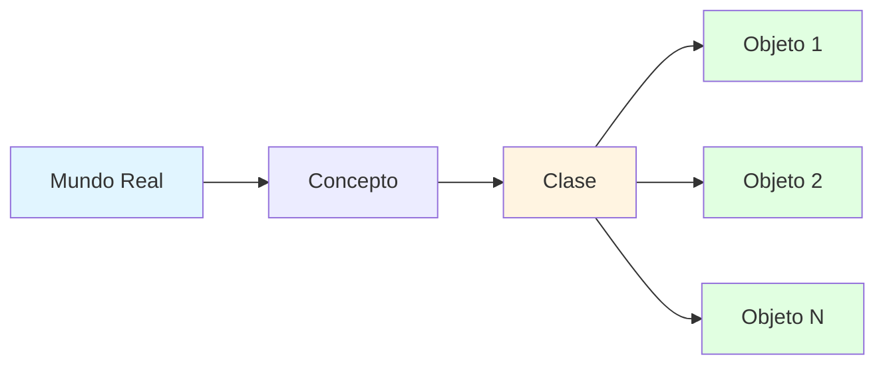
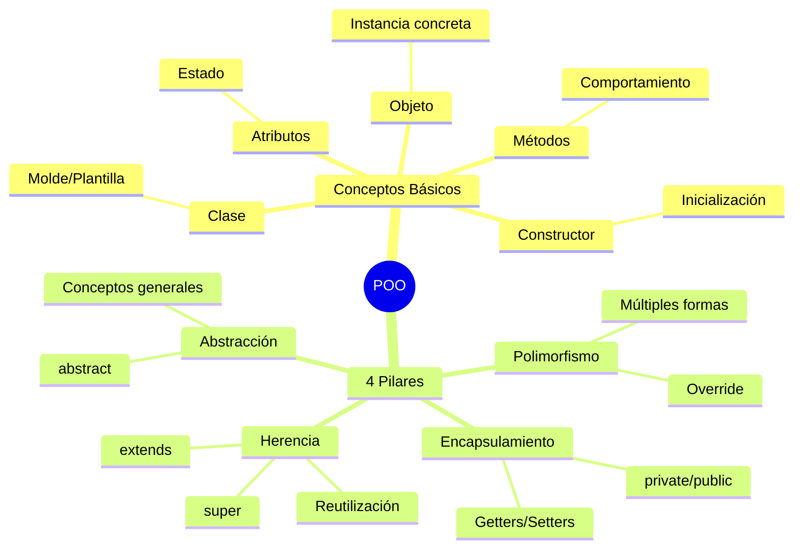

# 🎯 Introducción al Paradigma Orientado a Objetos

## 🌟 ¿Qué es la Programación Orientada a Objetos?

> [!info]- 💡 Del Mundo Real al Código
> 
> La **Programación Orientada a Objetos (POO)** es un paradigma que organiza el código imitando cómo pensamos sobre el mundo real: en términos de **objetos** que tienen características y pueden realizar acciones.
> 
> **Analogía del mundo real:** Piensa en un automóvil:
> 
> - **Características** → Tiene color, marca, modelo, velocidad actual
> - **Acciones** → Puede acelerar, frenar, encenderse, apagarse
> - **Identidad** → Cada auto es único, aunque sea del mismo modelo
> 
> **¿Por qué es importante la POO?**
> 
> |Ventaja|Descripción|Impacto|
> |---|---|---|
> |**Modularidad**|Código organizado en unidades independientes|✅ Fácil de mantener|
> |**Reutilización**|Código que se puede usar en múltiples lugares|✅ Menos duplicación|
> |**Abstracción**|Ocultar complejidad innecesaria|✅ Código más simple|
> |**Mantenibilidad**|Cambios localizados, no globales|✅ Menos errores|



---

## 🧩 Conceptos Fundamentales

### 🎨 Clase vs Objeto

> [!tip]- 📐 El Molde y las Galletas
> 
> **Clase:** El plano o molde que define cómo será algo **Objeto:** Una instancia concreta creada a partir de ese molde
> 
> ```mermaid
> graph TD
>     A[Clase: Estudiante] --> B[Objeto: Juan]
>     A --> C[Objeto: María]
>     A --> D[Objeto: Pedro]
>     
>     B --> B1[nombre: Juan<br/>edad: 20<br/>carrera: Ingeniería]
>     C --> C1[nombre: María<br/>edad: 19<br/>carrera: Medicina]
>     D --> D1[nombre: Pedro<br/>edad: 21<br/>carrera: Derecho]
>     
>     style A fill:#fff4e1
>     style B fill:#e1ffe1
>     style C fill:#e1ffe1
>     style D fill:#e1ffe1
> ```
> 
> **Ejemplo básico:**
> 
> ```java
> // La CLASE - El molde
> public class Estudiante {
>     // Atributos (características)
>     String nombre;
>     int edad;
>     String carrera;
>     
>     // Métodos (acciones)
>     void estudiar() {
>         System.out.println(nombre + " está estudiando");
>     }
>     
>     void presentarse() {
>         System.out.println("Hola, soy " + nombre + 
>                          ", tengo " + edad + " años");
>     }
> }
> 
> // Crear OBJETOS - Las galletas
> public class Main {
>     public static void main(String[] args) {
>         // Crear primer objeto
>         Estudiante estudiante1 = new Estudiante();
>         estudiante1.nombre = "Juan";
>         estudiante1.edad = 20;
>         estudiante1.carrera = "Ingeniería";
>         
>         // Crear segundo objeto
>         Estudiante estudiante2 = new Estudiante();
>         estudiante2.nombre = "María";
>         estudiante2.edad = 19;
>         estudiante2.carrera = "Medicina";
>         
>         // Usar los objetos
>         estudiante1.presentarse(); // Hola, soy Juan, tengo 20 años
>         estudiante2.estudiar();     // María está estudiando
>     }
> }
> ```

### 🔑 Atributos y Métodos

> [!success]- 🎯 Los Componentes de una Clase
> 
> **Atributos (Variables de instancia):**
> 
> - Representan el **estado** del objeto
> - Almacenan **datos** específicos de cada objeto
> - Cada objeto tiene sus propios valores
> 
> **Métodos (Funciones):**
> 
> - Representan el **comportamiento** del objeto
> - Definen **qué puede hacer** el objeto
> - Pueden modificar los atributos
> 
> |Componente|Qué es|Ejemplo en "Cuenta Bancaria"|
> |---|---|---|
> |**Atributos**|Características|saldo, titular, numeroCuenta|
> |**Métodos**|Acciones|depositar(), retirar(), consultarSaldo()|
> 
> ```java
> public class CuentaBancaria {
>     // ATRIBUTOS - Estado del objeto
>     String titular;
>     String numeroCuenta;
>     double saldo;
>     
>     // MÉTODOS - Comportamiento del objeto
>     void depositar(double monto) {
>         if (monto > 0) {
>             saldo += monto;
>             System.out.println("✅ Depósito exitoso: $" + monto);
>         }
>     }
>     
>     void retirar(double monto) {
>         if (monto > 0 && monto <= saldo) {
>             saldo -= monto;
>             System.out.println("✅ Retiro exitoso: $" + monto);
>         } else {
>             System.out.println("❌ Fondos insuficientes");
>         }
>     }
>     
>     void consultarSaldo() {
>         System.out.println("💰 Saldo actual: $" + saldo);
>     }
>     
>     void mostrarInfo() {
>         System.out.println("Titular: " + titular);
>         System.out.println("Cuenta: " + numeroCuenta);
>         System.out.println("Saldo: $" + saldo);
>     }
> }
> ```

### 🏗️ Constructores

> [!example]- ⚙️ Inicialización Automática
> 
> Los **constructores** son métodos especiales que se ejecutan automáticamente al crear un objeto, permitiendo inicializarlo con valores específicos.
> 
> **Características:**
> 
> - Mismo nombre que la clase
> - No tienen tipo de retorno (ni siquiera `void`)
> - Se invocan con la palabra `new`
> 
> ```java
> public class Producto {
>     String nombre;
>     double precio;
>     int stock;
>     
>     // Constructor sin parámetros (por defecto)
>     public Producto() {
>         nombre = "Sin nombre";
>         precio = 0.0;
>         stock = 0;
>     }
>     
>     // Constructor con parámetros
>     public Producto(String nombre, double precio, int stock) {
>         this.nombre = nombre;
>         this.precio = precio;
>         this.stock = stock;
>     }
>     
>     // Constructor parcial
>     public Producto(String nombre, double precio) {
>         this.nombre = nombre;
>         this.precio = precio;
>         this.stock = 0; // valor por defecto
>     }
>     
>     void mostrarInfo() {
>         System.out.println("Producto: " + nombre);
>         System.out.println("Precio: $" + precio);
>         System.out.println("Stock: " + stock + " unidades");
>     }
> }
> 
> // Uso de los constructores
> public class Main {
>     public static void main(String[] args) {
>         // Usando constructor por defecto
>         Producto p1 = new Producto();
>         
>         // Usando constructor completo
>         Producto p2 = new Producto("Laptop", 899.99, 15);
>         
>         // Usando constructor parcial
>         Producto p3 = new Producto("Mouse", 25.50);
>         
>         p2.mostrarInfo();
>         // Producto: Laptop
>         // Precio: $899.99
>         // Stock: 15 unidades
>     }
> }
> ```
> 
> **La palabra clave `this`:**
> 
> - Referencia al objeto actual
> - Distingue entre parámetros y atributos con el mismo nombre
> 
> ```mermaid
> graph LR
>     A[new Producto<br/>args] --> B[Constructor]
>     B --> C[this.nombre = nombre]
>     B --> D[this.precio = precio]
>     B --> E[this.stock = stock]
>     C --> F[Objeto<br/>Inicializado]
>     D --> F
>     E --> F
>     
>     style A fill:#e1f5ff
>     style B fill:#fff4e1
>     style F fill:#e1ffe1
> ```

---

## 🎭 Los 4 Pilares de la POO

### 1️⃣ Encapsulamiento

> [!note]- 🔒 Ocultar la Complejidad Interna
> 
> El **encapsulamiento** consiste en ocultar los detalles internos de implementación y exponer solo lo necesario mediante una interfaz pública.
> 
> **Niveles de acceso:**
> 
> |Modificador|Acceso|Uso típico|
> |---|---|---|
> |`private`|🔴 Solo dentro de la clase|Atributos internos|
> |`public`|🟢 Desde cualquier parte|Métodos de interfaz|
> |`protected`|🟡 Clase + subclases + paquete|Herencia|
> |_(sin modificador)_|🟠 Solo en el mismo paquete|Uso interno del paquete|
> 
> ```java
> public class CuentaBancaria {
>     // PRIVATE - Nadie puede acceder directamente
>     private String titular;
>     private double saldo;
>     
>     // Constructor público
>     public CuentaBancaria(String titular, double saldoInicial) {
>         this.titular = titular;
>         this.saldo = saldoInicial;
>     }
>     
>     // Getters - Leer valores
>     public String getTitular() {
>         return titular;
>     }
>     
>     public double getSaldo() {
>         return saldo;
>     }
>     
>     // Setter con validación
>     public void setTitular(String titular) {
>         if (titular != null && !titular.trim().isEmpty()) {
>             this.titular = titular;
>         }
>     }
>     
>     // Métodos de negocio
>     public void depositar(double monto) {
>         if (monto > 0) {
>             saldo += monto;
>         }
>     }
>     
>     public boolean retirar(double monto) {
>         if (monto > 0 && monto <= saldo) {
>             saldo -= monto;
>             return true;
>         }
>         return false;
>     }
> }
> 
> // ❌ INCORRECTO - No se puede hacer
> // cuenta.saldo = -1000; // Error: saldo is private
> 
> // ✅ CORRECTO - Usar métodos públicos
> cuenta.depositar(500);
> double saldoActual = cuenta.getSaldo();
> ```

### 2️⃣ Herencia

> [!tip]- 🌳 Reutilizar y Especializar
> 
> La **herencia** permite crear nuevas clases basadas en clases existentes, heredando sus atributos y métodos.
> 
> ```mermaid
> classDiagram
>     Vehiculo <|-- Auto
>     Vehiculo <|-- Moto
>     
>     class Vehiculo {
>         -String marca
>         -String modelo
>         -int año
>         +encender()
>         +apagar()
>     }
>     
>     class Auto {
>         -int numPuertas
>         +abrirMaletero()
>     }
>     
>     class Moto {
>         -String tipoManubrio
>         +hacerCaballito()
>     }
> ```
> 
> ```java
> // Clase base (superclase/padre)
> public class Vehiculo {
>     protected String marca;
>     protected String modelo;
>     protected int año;
>     
>     public Vehiculo(String marca, String modelo, int año) {
>         this.marca = marca;
>         this.modelo = modelo;
>         this.año = año;
>     }
>     
>     public void encender() {
>         System.out.println("🔑 Vehículo encendido");
>     }
>     
>     public void mostrarInfo() {
>         System.out.println(marca + " " + modelo + " (" + año + ")");
>     }
> }
> 
> // Clase derivada (subclase/hijo)
> public class Auto extends Vehiculo {
>     private int numPuertas;
>     
>     public Auto(String marca, String modelo, int año, int numPuertas) {
>         super(marca, modelo, año); // Llamar al constructor padre
>         this.numPuertas = numPuertas;
>     }
>     
>     public void abrirMaletero() {
>         System.out.println("🚗 Maletero abierto");
>     }
>     
>     // Sobrescribir método del padre
>     @Override
>     public void mostrarInfo() {
>         super.mostrarInfo(); // Llamar versión del padre
>         System.out.println("Puertas: " + numPuertas);
>     }
> }
> 
> // Uso
> Auto miAuto = new Auto("Toyota", "Corolla", 2023, 4);
> miAuto.encender();      // ✅ Heredado de Vehiculo
> miAuto.abrirMaletero(); // ✅ Propio de Auto
> miAuto.mostrarInfo();   // ✅ Versión sobrescrita
> ```

### 3️⃣ Polimorfismo

> [!success]- 🎭 Múltiples Formas
> 
> El **polimorfismo** permite que objetos de diferentes clases respondan al mismo mensaje de manera diferente.
> 
> ```java
> public class Animal {
>     protected String nombre;
>     
>     public Animal(String nombre) {
>         this.nombre = nombre;
>     }
>     
>     public void hacerSonido() {
>         System.out.println("El animal hace un sonido");
>     }
> }
> 
> public class Perro extends Animal {
>     public Perro(String nombre) {
>         super(nombre);
>     }
>     
>     @Override
>     public void hacerSonido() {
>         System.out.println("🐕 " + nombre + " dice: ¡Guau guau!");
>     }
> }
> 
> public class Gato extends Animal {
>     public Gato(String nombre) {
>         super(nombre);
>     }
>     
>     @Override
>     public void hacerSonido() {
>         System.out.println("🐱 " + nombre + " dice: ¡Miau!");
>     }
> }
> 
> // Polimorfismo en acción
> public class Main {
>     public static void main(String[] args) {
>         // Misma referencia, diferentes comportamientos
>         Animal animal1 = new Perro("Max");
>         Animal animal2 = new Gato("Luna");
>         Animal animal3 = new Perro("Rocky");
>         
>         // Array polimórfico
>         Animal[] animales = {animal1, animal2, animal3};
>         
>         // Mismo método, diferentes resultados
>         for (Animal animal : animales) {
>             animal.hacerSonido();
>         }
>         // 🐕 Max dice: ¡Guau guau!
>         // 🐱 Luna dice: ¡Miau!
>         // 🐕 Rocky dice: ¡Guau guau!
>     }
> }
> ```

### 4️⃣ Abstracción

> [!example]- 🎨 Conceptos Generales
> 
> La **abstracción** permite definir conceptos generales sin especificar todos los detalles de implementación.
> 
> ```java
> // Clase abstracta - No se puede instanciar
> public abstract class FiguraGeometrica {
>     protected String color;
>     
>     public FiguraGeometrica(String color) {
>         this.color = color;
>     }
>     
>     // Método abstracto - Las subclases DEBEN implementarlo
>     public abstract double calcularArea();
>     public abstract double calcularPerimetro();
>     
>     // Método concreto - Heredado tal cual
>     public void mostrarColor() {
>         System.out.println("Color: " + color);
>     }
> }
> 
> public class Circulo extends FiguraGeometrica {
>     private double radio;
>     
>     public Circulo(String color, double radio) {
>         super(color);
>         this.radio = radio;
>     }
>     
>     @Override
>     public double calcularArea() {
>         return Math.PI * radio * radio;
>     }
>     
>     @Override
>     public double calcularPerimetro() {
>         return 2 * Math.PI * radio;
>     }
> }
> 
> public class Rectangulo extends FiguraGeometrica {
>     private double base;
>     private double altura;
>     
>     public Rectangulo(String color, double base, double altura) {
>         super(color);
>         this.base = base;
>         this.altura = altura;
>     }
>     
>     @Override
>     public double calcularArea() {
>         return base * altura;
>     }
>     
>     @Override
>     public double calcularPerimetro() {
>         return 2 * (base + altura);
>     }
> }
> ```

---

## 📊 Resumen Visual



> [!success]  🎯 Tabla Comparativa
> |Concepto|Qué es|Cuándo usar|Ejemplo|
> |---|---|---|---|
> |**Clase**|Plantilla/Molde|Definir estructura común|`class Estudiante`|
> |**Objeto**|Instancia concreta|Trabajar con datos específicos|`new Estudiante()`|
> |**Encapsulamiento**|Ocultar detalles|Proteger datos|`private saldo`|
> |**Herencia**|Relación "es-un"|Reutilizar código|`Auto extends Vehiculo`|
> |**Polimorfismo**|Múltiples formas|Comportamiento flexible|`Animal[] animales`|
> |**Abstracción**|Conceptos generales|Diseño flexible|`abstract class Figura`|
> 

---

## 💪 Ejercicios Prácticos

> [!example]- 🎯 Práctica 1: Sistema de Biblioteca
> 
> ```java
> public class Libro {
>     private String titulo;
>     private String autor;
>     private boolean prestado;
>     
>     public Libro(String titulo, String autor) {
>         this.titulo = titulo;
>         this.autor = autor;
>         this.prestado = false;
>     }
>     
>     public boolean prestar() {
>         if (!prestado) {
>             prestado = true;
>             System.out.println("✅ Libro prestado: " + titulo);
>             return true;
>         }
>         System.out.println("❌ El libro ya está prestado");
>         return false;
>     }
>     
>     public void devolver() {
>         prestado = false;
>         System.out.println("✅ Libro devuelto: " + titulo);
>     }
>     
>     public void mostrarInfo() {
>         String estado = prestado ? "Prestado" : "Disponible";
>         System.out.println("📚 " + titulo + " - " + autor + " [" + estado + "]");
>     }
> }
> ```

> [!example]- 🎯 Práctica 2: Jerarquía de Empleados
> 
> ```java
> public class Empleado {
>     protected String nombre;
>     protected double salarioBase;
>     
>     public Empleado(String nombre, double salarioBase) {
>         this.nombre = nombre;
>         this.salarioBase = salarioBase;
>     }
>     
>     public double calcularSalario() {
>         return salarioBase;
>     }
>     
>     public void mostrarInfo() {
>         System.out.println("Empleado: " + nombre);
>         System.out.println("Salario: $" + calcularSalario());
>     }
> }
> 
> public class Gerente extends Empleado {
>     private double bono;
>     
>     public Gerente(String nombre, double salarioBase, double bono) {
>         super(nombre, salarioBase);
>         this.bono = bono;
>     }
>     
>     @Override
>     public double calcularSalario() {
>         return salarioBase + bono;
>     }
> }
> ```

---

## 🚀 Próximos Pasos

> [!quote]- 🌟 Has Aprendido
> 
> ✅ Qué es la POO y por qué es importante  
> ✅ Diferencia entre clase y objeto  
> ✅ Atributos, métodos y constructores  
> ✅ Los 4 pilares: Encapsulamiento, Herencia, Polimorfismo, Abstracción  
> ✅ Modificadores de acceso y visibilidad
> 
> **Continúa con:**
> 
> - Interfaces y clases abstractas en profundidad
> - Colecciones y genéricos
> - Patrones de diseño
> - Excepciones y manejo de errores

---

**Tags:** #java #poo #clases #objetos #herencia #polimorfismo #encapsulamiento #abstraccion