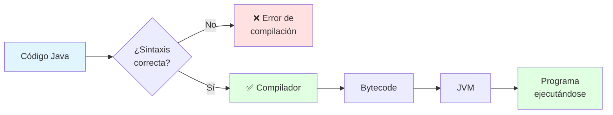
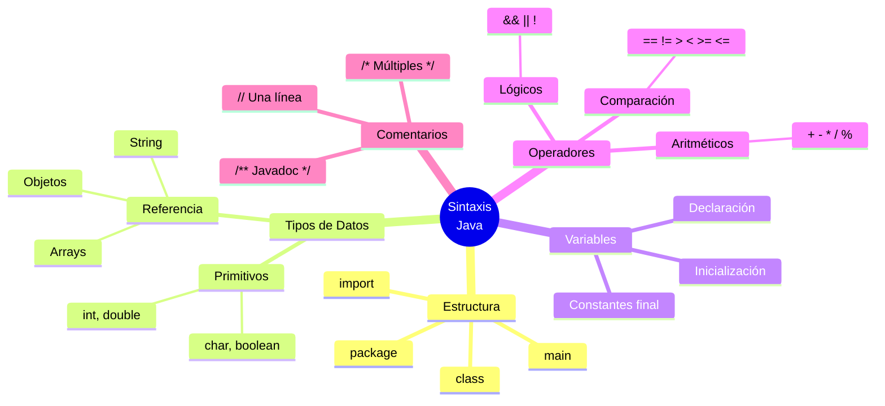

# ☕ Sintaxis Básica en Java

## 🎯 Introducción

> [!info]- 💡 ¿Qué es la Sintaxis?
> 
> La **sintaxis** es el conjunto de reglas que definen cómo escribir código válido en un lenguaje de programación. Es como la gramática del español, pero para Java.
> 
> **Analogía:** Si Java fuera un idioma:
> - **Sintaxis** → Gramática y ortografía
> - **Palabras reservadas** → Vocabulario fundamental
> - **Tipos de datos** → Sustantivos
> - **Operadores** → Verbos y conectores
> 
> **¿Por qué es importante?**
> 
> |Aspecto|Sin sintaxis correcta|Con sintaxis correcta|
> |---|---|---|
> |**Compilación**|❌ Errores constantes|✅ Código que compila|
> |**Legibilidad**|🤔 Confuso|✅ Claro y profesional|
> |**Mantenimiento**|😫 Difícil de modificar|✅ Fácil de actualizar|
> |**Colaboración**|❌ Difícil de compartir|✅ Estándar reconocible|



---

## 📝 Estructura Básica de un Programa

### 🏗️ Anatomía de una Clase Java

> [!tip]- 🔍 Componentes Esenciales
> 
> Todo programa Java comienza con una **clase** que contiene un **método main**.
> 
> ```java
> // 1. Declaración del paquete (opcional)
> package com.ejemplo.proyecto;
> 
> // 2. Importaciones (opcional)
> import java.util.Scanner;
> import java.util.ArrayList;
> 
> // 3. Declaración de la clase
> public class MiPrograma {
>     
>     // 4. Atributos de clase
>     private static int contador = 0;
>     
>     // 5. Método principal (punto de entrada)
>     public static void main(String[] args) {
>         // 6. Cuerpo del programa
>         System.out.println("¡Hola, Mundo!");
>     }
>     
>     // 7. Otros métodos
>     public static void otroMetodo() {
>         // código...
>     }
> }
> ```
> 
> **Desglose de componentes:**
> 
> |Elemento|Obligatorio|Propósito|
> |---|---|---|
> |`package`|❌ No|Organizar código en módulos|
> |`import`|❌ No|Usar clases de otros paquetes|
> |`public class`|✅ Sí|Definir la clase principal|
> |`main()`|✅ Sí|Punto de inicio del programa|
> 
> ```mermaid
> graph TD
>     A[Archivo .java] --> B[package]
>     B --> C[imports]
>     C --> D[class MiClase]
>     D --> E[Atributos]
>     D --> F[main]
>     D --> G[Otros métodos]
>     
>     F --> H[Inicio de<br/>ejecución]
>     
>     style A fill:#e1f5ff
>     style D fill:#fff4e1
>     style F fill:#e1ffe1
> ```

### 🎪 El Método main

> [!success]- 🚀 Punto de Entrada del Programa
> 
> El método `main` es **obligatorio** y debe tener esta firma exacta:
> 
> ```java
> public static void main(String[] args) {
>     // Tu código aquí
> }
> ```
> 
> **Desglose de la firma:**
> 
> |Palabra|Significado|Por qué es necesaria|
> |---|---|---|
> |`public`|Accesible desde cualquier lugar|La JVM debe poder llamarlo|
> |`static`|Pertenece a la clase, no a objetos|No requiere crear instancia|
> |`void`|No retorna ningún valor|Es un punto de entrada, no función|
> |`main`|Nombre del método|Convención reconocida por la JVM|
> |`String[] args`|Parámetros de línea de comandos|Permite pasar argumentos|
> 
> **Ejemplo con argumentos:**
> 
> ```java
> public class ProgramaConArgs {
>     public static void main(String[] args) {
>         if (args.length > 0) {
>             System.out.println("Hola, " + args[0]);
>         } else {
>             System.out.println("Hola, Mundo");
>         }
>     }
> }
> 
> // Ejecutar desde terminal:
> // java ProgramaConArgs Juan
> // Salida: Hola, Juan
> ```

---

## 🔤 Tipos de Datos

### 📊 Tipos Primitivos

> [!note]- 🧱 Los Bloques Fundamentales
> 
> Java tiene **8 tipos primitivos** que representan valores simples.
> 
> **Tipos numéricos enteros:**
> 
> |Tipo|Tamaño|Rango|Uso típico|
> |---|---|---|---|
> |`byte`|8 bits|-128 a 127|Optimizar memoria|
> |`short`|16 bits|-32,768 a 32,767|Valores pequeños|
> |`int`|32 bits|-2,147,483,648 a 2,147,483,647|✅ **Uso general**|
> |`long`|64 bits|±9,223,372,036,854,775,807|Números muy grandes|
> 
> **Tipos numéricos decimales:**
> 
> |Tipo|Tamaño|Precisión|Uso típico|
> |---|---|---|---|
> |`float`|32 bits|~6-7 dígitos|Gráficos 3D|
> |`double`|64 bits|~15 dígitos|✅ **Cálculos científicos**|
> 
> **Otros tipos:**
> 
> |Tipo|Tamaño|Valores|Uso|
> |---|---|---|---|
> |`char`|16 bits|Un carácter Unicode|Caracteres individuales|
> |`boolean`|1 bit|`true` o `false`|Condiciones lógicas|
> 
> ```java
> public class TiposPrimitivos {
>     public static void main(String[] args) {
>         // Enteros
>         byte edad = 25;
>         short año = 2024;
>         int poblacion = 1500000;
>         long distanciaLuz = 9460730472580800L; // L al final
>         
>         // Decimales
>         float precio = 19.99F; // F al final
>         double pi = 3.141592653589793;
>         
>         // Carácter
>         char inicial = 'J';
>         char unicode = '\u0041'; // 'A' en Unicode
>         
>         // Booleano
>         boolean esEstudiante = true;
>         boolean esMayorDeEdad = edad >= 18;
>         
>         System.out.println("Edad: " + edad);
>         System.out.println("Es mayor de edad: " + esMayorDeEdad);
>     }
> }
> ```

### 📦 Tipos de Referencia

> [!example]- 🎁 Objetos y Referencias
> 
> Los **tipos de referencia** son objetos que apuntan a ubicaciones en memoria.
> 
> **Principales tipos de referencia:**
> 
> |Tipo|Qué es|Ejemplo|
> |---|---|---|
> |**String**|Cadena de texto|`"Hola"`|
> |**Arrays**|Colección de elementos|`int[] numeros`|
> |**Clases**|Tipos personalizados|`Estudiante alumno`|
> |**Interfaces**|Contratos|`List<String> lista`|
> 
> ```java
> public class TiposReferencia {
>     public static void main(String[] args) {
>         // String - Inmutable
>         String nombre = "Juan";
>         String apellido = new String("Pérez");
>         
>         // Arrays
>         int[] numeros = {1, 2, 3, 4, 5};
>         String[] nombres = new String[3];
>         nombres[0] = "Ana";
>         nombres[1] = "Luis";
>         nombres[2] = "María";
>         
>         // Objetos personalizados
>         Estudiante estudiante = new Estudiante("Carlos", 20);
>         
>         // null - valor especial
>         String sinValor = null;
>         
>         System.out.println("Nombre completo: " + nombre + " " + apellido);
>         System.out.println("Primer número: " + numeros[0]);
>     }
> }
> ```
> 
> **Diferencia clave: Primitivos vs Referencias**
> 
> ```mermaid
> graph LR
>     A[Variable Primitiva] --> B[Valor directo<br/>en memoria]
>     C[Variable de Referencia] --> D[Dirección<br/>de memoria]
>     D --> E[Objeto real<br/>en heap]
>     
>     style B fill:#e1ffe1
>     style E fill:#fff4e1
> ```

---

## 🔧 Variables y Constantes

### 📌 Declaración de Variables

> [!tip]- 📝 Cómo Crear Variables
> 
> **Sintaxis básica:**
> ```
> tipo nombreVariable = valor;
> ```
> 
> **Reglas de nomenclatura:**
> 
> |Regla|✅ Correcto|❌ Incorrecto|
> |---|---|---|
> |Comenzar con letra, $ o _|`nombre`, `_edad`, `$precio`|`1nombre`, `@valor`|
> |Usar camelCase|`miVariable`, `edadEstudiante`|`mi_variable`, `MiVariable`|
> |No usar palabras reservadas|`miClass`, `valorInt`|`class`, `int`|
> |Nombres descriptivos|`precioTotal`, `nombreCompleto`|`x`, `a`, `temp`|
> 
> ```java
> public class Variables {
>     public static void main(String[] args) {
>         // Declaración simple
>         int edad;
>         edad = 25;
>         
>         // Declaración con inicialización
>         String nombre = "Ana";
>         
>         // Múltiples variables del mismo tipo
>         int x = 5, y = 10, z = 15;
>         
>         // Variable local (dentro de un método)
>         double salario = 3500.50;
>         
>         // Reasignación
>         edad = 26;
>         nombre = "Ana María";
>         
>         System.out.println(nombre + " tiene " + edad + " años");
>     }
> }
> ```
> 
> **Ámbito de variables:**
> 
> ```java
> public class Ambito {
>     // Variable de instancia (atributo)
>     private int atributo = 10;
>     
>     // Variable de clase (estática)
>     private static int variableClase = 20;
>     
>     public void metodo() {
>         // Variable local
>         int variableLocal = 30;
>         
>         if (true) {
>             // Variable de bloque
>             int variableBloque = 40;
>             System.out.println(variableBloque); // ✅ Accesible
>         }
>         // System.out.println(variableBloque); // ❌ Error: fuera de ámbito
>     }
> }
> ```

### 🔒 Constantes

> [!success]- 🎯 Valores Inmutables
> 
> Las **constantes** son valores que no cambian durante la ejecución.
> 
> ```java
> public class Constantes {
>     // Constante de clase (convención: MAYÚSCULAS)
>     public static final double PI = 3.141592653589793;
>     public static final int DIAS_SEMANA = 7;
>     public static final String NOMBRE_EMPRESA = "Mi Empresa S.A.";
>     
>     public static void main(String[] args) {
>         // Constante local
>         final int EDAD_MINIMA = 18;
>         final double IVA = 0.12;
>         
>         double precio = 100.0;
>         double precioConIva = precio + (precio * IVA);
>         
>         System.out.println("Precio con IVA: $" + precioConIva);
>         
>         // EDAD_MINIMA = 21; // ❌ Error: no se puede modificar
>     }
> }
> ```
> 
> **Cuándo usar constantes:**
> - Valores que no cambian (PI, días del mes)
> - Configuraciones fijas (IVA, límites)
> - Mejorar legibilidad del código
> - Evitar "números mágicos"

---

## ➕ Operadores

### 🔢 Operadores Aritméticos

> [!note]- 🧮 Matemáticas Básicas
> 
> |Operador|Operación|Ejemplo|Resultado|
> |---|---|---|---|
> |`+`|Suma|`5 + 3`|`8`|
> |`-`|Resta|`5 - 3`|`2`|
> |`*`|Multiplicación|`5 * 3`|`15`|
> |`/`|División|`10 / 3`|`3` (enteros)|
> |`%`|Módulo (residuo)|`10 % 3`|`1`|
> 
> ```java
> public class OperadoresAritmeticos {
>     public static void main(String[] args) {
>         int a = 10;
>         int b = 3;
>         
>         System.out.println("Suma: " + (a + b));           // 13
>         System.out.println("Resta: " + (a - b));          // 7
>         System.out.println("Multiplicación: " + (a * b)); // 30
>         System.out.println("División: " + (a / b));       // 3
>         System.out.println("Módulo: " + (a % b));         // 1
>         
>         // División con decimales
>         double c = 10.0;
>         double d = 3.0;
>         System.out.println("División decimal: " + (c / d)); // 3.333...
>         
>         // Operadores de incremento/decremento
>         int x = 5;
>         x++;        // x = x + 1  → x = 6
>         System.out.println("Después de x++: " + x);
>         
>         int y = 5;
>         y--;        // y = y - 1  → y = 4
>         System.out.println("Después de y--: " + y);
>         
>         // Operadores compuestos
>         int z = 10;
>         z += 5;     // z = z + 5  → z = 15
>         z *= 2;     // z = z * 2  → z = 30
>         System.out.println("Resultado final: " + z);
>     }
> }
> ```

### ⚖️ Operadores de Comparación

> [!tip]- 🔍 Comparar Valores
> 
> |Operador|Significado|Ejemplo|Resultado|
> |---|---|---|---|
> |`"=="`|Igual a|`5 == 5`|`true`|
> |`!=`|Diferente de|`5 != 3`|`true`|
> |`>`|Mayor que|`5 > 3`|`true`|
> |`<`|Menor que|`5 < 3`|`false`|
> |`>=`|Mayor o igual que|`5 >= 5`|`true`|
> |`<=`|Menor o igual que|`5 <= 3`|`false`|
> 
> ```java
> public class OperadoresComparacion {
>     public static void main(String[] args) {
>         int edad = 20;
>         int edadMinima = 18;
>         
>         boolean esMayor = edad >= edadMinima;
>         System.out.println("¿Es mayor de edad? " + esMayor); // true
>         
>         // Comparar Strings (usar equals, NO ==)
>         String nombre1 = "Juan";
>         String nombre2 = "Juan";
>         String nombre3 = new String("Juan");
>         
>         System.out.println(nombre1 == nombre2);        // true (mismo objeto)
>         System.out.println(nombre1 == nombre3);        // false (diferentes objetos)
>         System.out.println(nombre1.equals(nombre3));   // ✅ true (mismo contenido)
>     }
> }
> ```

### 🔗 Operadores Lógicos

> [!example]- 🧠 Lógica Booleana
> 
> |Operador|Operación|Ejemplo|Resultado|
> |---|---|---|---|
> |`&&`|AND (Y)|`true && false`|`false`|
> |`\|\|`|OR (O)|`true \|\| false`|`true`|
> |`!`|NOT (NO)|`!true`|`false`|
> 
> **Tablas de verdad:**
> 
> ```
> AND (&&)          OR (||)           NOT (!)
> T && T = T        T || T = T        !T = F
> T && F = F        T || F = T        !F = T
> F && T = F        F || T = T
> F && F = F        F || F = F
> ```
> 
> ```java
> public class OperadoresLogicos {
>     public static void main(String[] args) {
>         int edad = 25;
>         boolean tieneCarnet = true;
>         
>         // AND - Ambas condiciones deben ser verdaderas
>         boolean puedeConducir = edad >= 18 && tieneCarnet;
>         System.out.println("¿Puede conducir? " + puedeConducir);
>         
>         // OR - Al menos una condición debe ser verdadera
>         boolean esEstudiante = false;
>         boolean esTrabajador = true;
>         boolean tieneDescuento = esEstudiante || esTrabajador;
>         System.out.println("¿Tiene descuento? " + tieneDescuento);
>         
>         // NOT - Invierte el valor booleano
>         boolean esFinDeSemana = false;
>         boolean esDiaLaboral = !esFinDeSemana;
>         System.out.println("¿Es día laboral? " + esDiaLaboral);
>         
>         // Combinación de operadores
>         int nota = 85;
>         boolean aprobado = nota >= 60 && nota <= 100;
>         boolean muyBien = nota >= 80 || (nota >= 70 && tieneDescuento);
>     }
> }
> ```

---

## 📝 Comentarios

### 💬 Tipos de Comentarios

> [!success]- 📖 Documentar el Código
> 
> ```java
> public class Comentarios {
>     
>     // 1. Comentario de una línea
>     // Sirve para explicaciones breves
>     
>     /*
>      * 2. Comentario de múltiples líneas
>      * Útil para explicaciones más largas
>      * o bloques de código deshabilitados
>      */
>     
>     /**
>      * 3. Comentario Javadoc
>      * Genera documentación automática
>      * 
>      * @param nombre El nombre del usuario
>      * @return Un mensaje de saludo
>      */
>     public static String saludar(String nombre) {
>         return "Hola, " + nombre;
>     }
>     
>     public static void main(String[] args) {
>         // Esto es un comentario explicativo
>         int edad = 25; // También puede ir al final de la línea
>         
>         /*
>         Este bloque está comentado temporalmente
>         int x = 10;
>         int y = 20;
>         System.out.println(x + y);
>         */
>         
>         String mensaje = saludar("Juan");
>         System.out.println(mensaje);
>     }
> }
> ```
> 
> **Buenas prácticas:**
> 
> |✅ Hacer|❌ Evitar|
> |---|---|
> |Explicar el "por qué"|Explicar el "qué" obvio|
> |Comentarios útiles y concisos|Comentarios redundantes|
> |Actualizar comentarios|Dejar comentarios obsoletos|
> |Usar Javadoc en APIs|Comentar código mal escrito|

---

## 📊 Resumen Visual



> [!success]  🎯 Tabla de Referencia Rápida
> |Concepto|Sintaxis|Ejemplo|
> |---|---|---|
> |**Declarar variable**|`tipo nombre = valor;`|`int edad = 25;`|
> |**Constante**|`final tipo NOMBRE = valor;`|`final double PI = 3.14;`|
> |**Concatenar strings**|`string1 + string2`|`"Hola" + " Mundo"`|
> |**Comentario**|`// texto`|`// Esto es un comentario`|
> |**Comparar strings**|`str1.equals(str2)`|`nombre.equals("Juan")`|
> |**Incremento**|`variable++`|`x++` → `x = x + 1`|
> |**Operador compuesto**|`variable += valor`|`x += 5` → `x = x + 5`|
> 

---

## 💪 Ejercicios Prácticos

> [!example]- 🎯 Práctica 1: Calculadora Básica
> 
> ```java
> public class Calculadora {
>     public static void main(String[] args) {
>         // Operandos
>         double num1 = 15.5;
>         double num2 = 4.2;
>         
>         // Operaciones
>         double suma = num1 + num2;
>         double resta = num1 - num2;
>         double multiplicacion = num1 * num2;
>         double division = num1 / num2;
>         
>         // Resultados
>         System.out.println("=== CALCULADORA ===");
>         System.out.println(num1 + " + " + num2 + " = " + suma);
>         System.out.println(num1 + " - " + num2 + " = " + resta);
>         System.out.println(num1 + " * " + num2 + " = " + multiplicacion);
>         System.out.println(num1 + " / " + num2 + " = " + division);
>     }
> }
> ```

> [!example]- 🎯 Práctica 2: Validador de Edad
> 
> ```java
> public class ValidadorEdad {
>     public static void main(String[] args) {
>         final int EDAD_MINIMA = 18;
>         final int EDAD_MAXIMA = 65;
>         
>         int edad = 25;
>         String nombre = "Carlos";
>         
>         boolean esMayorDeEdad = edad >= EDAD_MINIMA;
>         boolean esEdadLaboral = edad >= EDAD_MINIMA && edad <= EDAD_MAXIMA;
>         
>         System.out.println("=== VALIDADOR DE EDAD ===");
>         System.out.println("Nombre: " + nombre);
>         System.out.println("Edad: " + edad);
>         System.out.println("¿Es mayor de edad? " + esMayorDeEdad);
>         System.out.println("¿Está en edad laboral? " + esEdadLaboral);
>         
>         if (esMayorDeEdad) {
>             System.out.println("✅ Acceso permitido");
>         } else {
>             System.out.println("❌ Acceso denegado");
>         }
>     }
> }
> ```

> [!example]- 🎯 Práctica 3: Conversor de Temperatura
> 
> ```java
> public class ConversorTemperatura {
>     public static void main(String[] args) {
>         // Constantes de conversión
>         final double FACTOR_C_A_F = 9.0 / 5.0;
>         final int OFFSET_F = 32;
>         
>         // Temperatura en Celsius
>         double celsius = 25.0;
>         
>         // Conversión a Fahrenheit
>         double fahrenheit = (celsius * FACTOR_C_A_F) + OFFSET_F;
>         
>         // Conversión a Kelvin
>         double kelvin = celsius + 273.15;
>         
>         // Mostrar resultados
>         System.out.println("=== CONVERSOR DE TEMPERATURA ===");
>         System.out.println(celsius + "°C equivale a:");
>         System.out.println("  → " + fahrenheit + "°F");
>         System.out.println("  → " + kelvin + "K");
>     }
> }
> ```

---

## 🚀 Próximos Pasos

> [!quote]- 🌟 Has Aprendido
> 
> ✅ Estructura básica de un programa Java  
> ✅ Tipos de datos primitivos y de referencia  
> ✅ Declaración de variables y constantes  
> ✅ Operadores aritméticos, de comparación y lógicos  
> ✅ Comentarios y documentación  
> ✅ Convenciones de nomenclatura
> 
> **Continúa con:**
> - Estructuras de control (if, switch, loops)
> - Métodos y funciones
> - Arrays y colecciones
> - Manejo de entrada/salida

---

**Tags:** #java #sintaxis #variables #tipos-datos #operadores #fundamentos #basico