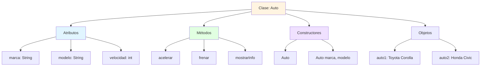
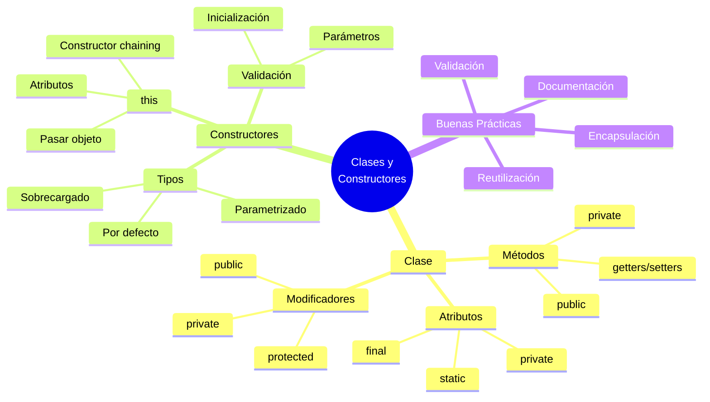

# 🏗️ Definición de Clases y Constructores

## 🎯 Introducción

> [!info]- 💡 ¿Qué es una Clase?
> 
> Una **clase** es un plano o plantilla que define la estructura y comportamiento de los objetos. Es el concepto fundamental de la Programación Orientada a Objetos.
> 
> **Analogía del mundo real:** Una clase es como un plano arquitectónico:
> 
> - **Plano (Clase)** → Define cómo será la casa
> - **Casa construida (Objeto)** → Instancia concreta del plano
> - **Características** → Número de habitaciones, color, tamaño
> - **Funcionalidades** → Abrir puerta, encender luces
> 
> **¿Por qué son importantes las clases?**
> 
> |Beneficio|Descripción|Ejemplo Real|
> |---|---|---|
> |**Encapsulación**|Agrupa datos relacionados|Clase `CuentaBancaria` con saldo y operaciones|
> |**Reutilización**|Crear múltiples objetos del mismo tipo|Muchos `Estudiante`s de una plantilla|
> |**Organización**|Código estructurado y mantenible|Separar `Producto`, `Cliente`, `Pedido`|
> |**Abstracción**|Modelar conceptos del mundo real|`Auto` representa un vehículo real|



---

## 📐 Anatomía de una Clase

### 🧩 Componentes Básicos

> [!tip]- 🔍 Estructura Completa
> 
> ```java
> // 1. Modificador de acceso + palabra clave class + nombre
> public class Estudiante {
>     
>     // 2. ATRIBUTOS (variables de instancia)
>     private String nombre;
>     private int edad;
>     private String carrera;
>     private double promedio;
>     
>     // 3. CONSTRUCTORES
>     public Estudiante() {
>         // Constructor por defecto
>     }
>     
>     public Estudiante(String nombre, int edad) {
>         this.nombre = nombre;
>         this.edad = edad;
>     }
>     
>     // 4. MÉTODOS (comportamiento)
>     public void estudiar() {
>         System.out.println(nombre + " está estudiando");
>     }
>     
>     public void mostrarInfo() {
>         System.out.println("Estudiante: " + nombre);
>         System.out.println("Edad: " + edad);
>         System.out.println("Carrera: " + carrera);
>     }
>     
>     // 5. GETTERS Y SETTERS
>     public String getNombre() {
>         return nombre;
>     }
>     
>     public void setNombre(String nombre) {
>         this.nombre = nombre;
>     }
> }
> ```
> 
> **Orden recomendado de componentes:**
> 
> |Orden|Componente|Ejemplo|
> |---|---|---|
> |1|Atributos estáticos|`static final int MAX_EDAD`|
> |2|Atributos de instancia|`private String nombre`|
> |3|Constructores|`public Estudiante()`|
> |4|Métodos públicos|`public void estudiar()`|
> |5|Getters y Setters|`public String getNombre()`|
> |6|Métodos privados|`private void validar()`|

### 🎨 Modificadores de Acceso

> [!note]- 🔐 Niveles de Visibilidad
> 
> |Modificador|Acceso desde|Símbolo|Uso típico|
> |---|---|---|---|
> |`public`|Cualquier lugar|🟢|Métodos de interfaz, clases principales|
> |`private`|Solo dentro de la clase|🔴|Atributos internos|
> |`protected`|Clase + subclases + paquete|🟡|Herencia|
> |*(ninguno)*|Solo en el mismo paquete|🟠|Clases helper internas|
> 
> ```java
> public class Persona {
>     // PRIVATE - Solo accesible dentro de Persona
>     private String nombre;
>     private int edad;
>     
>     // PROTECTED - Accesible en subclases
>     protected String documento;
>     
>     // PUBLIC - Accesible desde cualquier lugar
>     public void saludar() {
>         System.out.println("Hola, soy " + nombre);
>     }
>     
>     // SIN MODIFICADOR - Solo en el mismo paquete
>     void metodoInterno() {
>         // código...
>     }
> }
> ```
> 
> ```mermaid
> graph TD
>     A[public] --> B[Acceso desde<br/>toda la aplicación]
>     C[protected] --> D[Acceso desde<br/>paquete + herencia]
>     E[default] --> F[Acceso solo<br/>desde paquete]
>     G[private] --> H[Acceso solo<br/>dentro de la clase]
>     
>     style A fill:#90EE90
>     style C fill:#FFD700
>     style E fill:#FFA500
>     style G fill:#FF6B6B
> ```

---

## 🏗️ Constructores

### ⚙️ Concepto Fundamental

> [!success]- 🎯 ¿Qué es un Constructor?
> 
> Un **constructor** es un método especial que se ejecuta automáticamente al crear un objeto. Su propósito es **inicializar** el estado del objeto.
> 
> **Características únicas:**
> - Mismo nombre que la clase
> - No tiene tipo de retorno (ni siquiera `void`)
> - Se invoca con la palabra clave `new`
> - Puede estar sobrecargado (múltiples versiones)
> 
> **Flujo de creación de objetos:**
> 
> ```mermaid
> sequenceDiagram
>     participant C as Código
>     participant M as Memoria
>     participant O as Objeto
>     
>     C->>M: new Estudiante("Juan", 20)
>     M->>O: 1. Asignar memoria
>     O->>O: 2. Ejecutar constructor
>     O->>O: 3. Inicializar atributos
>     O-->>C: 4. Retornar referencia
> ```
> 
> ```java
> public class Producto {
>     private String nombre;
>     private double precio;
>     
>     // Constructor con parámetros
>     public Producto(String nombre, double precio) {
>         this.nombre = nombre;  // 'this' distingue atributo de parámetro
>         this.precio = precio;
>     }
>     
>     public void mostrarInfo() {
>         System.out.println(nombre + ": $" + precio);
>     }
> }
> 
> // Uso
> public class Main {
>     public static void main(String[] args) {
>         // El constructor se ejecuta aquí
>         Producto p1 = new Producto("Laptop", 899.99);
>         p1.mostrarInfo(); // Laptop: $899.99
>     }
> }
> ```

### 🔄 Tipos de Constructores

> [!example]- 📦 Constructor por Defecto
> 
> Si **no defines ningún constructor**, Java crea uno automáticamente (vacío, sin parámetros).
> 
> ```java
> // Sin constructor explícito
> public class Punto {
>     private int x;
>     private int y;
>     
>     // Java crea automáticamente:
>     // public Punto() {
>     // }
> }
> 
> // Uso
> Punto p = new Punto(); // ✅ Funciona (x=0, y=0)
> ```
> 
> ```java
> // Con constructor explícito
> public class Punto {
>     private int x;
>     private int y;
>     
>     // Constructor sin parámetros (explícito)
>     public Punto() {
>         this.x = 0;
>         this.y = 0;
>         System.out.println("Punto creado en origen");
>     }
> }
> ```
> 
> **⚠️ Importante:** Si defines **cualquier** constructor, Java **NO** crea el constructor por defecto automáticamente.

> [!example]- 🎨 Constructor Parametrizado
> 
> Permite crear objetos con valores iniciales específicos.
> 
> ```java
> public class CuentaBancaria {
>     private String titular;
>     private String numeroCuenta;
>     private double saldo;
>     
>     // Constructor con todos los parámetros
>     public CuentaBancaria(String titular, String numeroCuenta, double saldo) {
>         this.titular = titular;
>         this.numeroCuenta = numeroCuenta;
>         this.saldo = saldo;
>     }
>     
>     // Constructor con saldo inicial por defecto
>     public CuentaBancaria(String titular, String numeroCuenta) {
>         this.titular = titular;
>         this.numeroCuenta = numeroCuenta;
>         this.saldo = 0.0; // Valor por defecto
>     }
>     
>     public void mostrarInfo() {
>         System.out.println("Titular: " + titular);
>         System.out.println("Cuenta: " + numeroCuenta);
>         System.out.println("Saldo: $" + saldo);
>     }
> }
> 
> // Uso
> public class Main {
>     public static void main(String[] args) {
>         // Usar primer constructor
>         CuentaBancaria cuenta1 = new CuentaBancaria("Juan Pérez", "001", 1000.0);
>         
>         // Usar segundo constructor
>         CuentaBancaria cuenta2 = new CuentaBancaria("Ana García", "002");
>         
>         cuenta1.mostrarInfo();
>         // Titular: Juan Pérez
>         // Cuenta: 001
>         // Saldo: $1000.0
>     }
> }
> ```

> [!example]- 🔗 Sobrecarga de Constructores
> 
> Tener **múltiples constructores** con diferentes parámetros en la misma clase.
> 
> ```java
> public class Libro {
>     private String titulo;
>     private String autor;
>     private int paginas;
>     private double precio;
>     
>     // Constructor 1: Completo
>     public Libro(String titulo, String autor, int paginas, double precio) {
>         this.titulo = titulo;
>         this.autor = autor;
>         this.paginas = paginas;
>         this.precio = precio;
>     }
>     
>     // Constructor 2: Sin precio (gratis)
>     public Libro(String titulo, String autor, int paginas) {
>         this.titulo = titulo;
>         this.autor = autor;
>         this.paginas = paginas;
>         this.precio = 0.0;
>     }
>     
>     // Constructor 3: Solo información básica
>     public Libro(String titulo, String autor) {
>         this.titulo = titulo;
>         this.autor = autor;
>         this.paginas = 0;
>         this.precio = 0.0;
>     }
>     
>     // Constructor 4: Vacío
>     public Libro() {
>         this.titulo = "Sin título";
>         this.autor = "Desconocido";
>         this.paginas = 0;
>         this.precio = 0.0;
>     }
>     
>     public void mostrarInfo() {
>         System.out.println("📖 " + titulo + " - " + autor);
>         System.out.println("   Páginas: " + paginas + " | Precio: $" + precio);
>     }
> }
> 
> // Uso
> public class Main {
>     public static void main(String[] args) {
>         Libro libro1 = new Libro("El Quijote", "Cervantes", 863, 25.99);
>         Libro libro2 = new Libro("Cien Años", "García Márquez", 471);
>         Libro libro3 = new Libro("1984", "Orwell");
>         Libro libro4 = new Libro();
>         
>         libro1.mostrarInfo();
>         libro3.mostrarInfo();
>     }
> }
> ```

### 🎯 La Palabra Clave `this`

> [!tip]- 🔑 Uso de `this`
> 
> La palabra `this` se refiere al **objeto actual** y tiene múltiples usos:
> 
> **1. Distinguir atributos de parámetros:**
> 
> ```java
> public class Persona {
>     private String nombre;
>     
>     public Persona(String nombre) {
>         this.nombre = nombre; // this.nombre = atributo, nombre = parámetro
>     }
> }
> ```
> 
> **2. Llamar a otro constructor (constructor chaining):**
> 
> ```java
> public class Rectangulo {
>     private double base;
>     private double altura;
>     
>     // Constructor completo
>     public Rectangulo(double base, double altura) {
>         this.base = base;
>         this.altura = altura;
>     }
>     
>     // Constructor para cuadrado - llama al otro constructor
>     public Rectangulo(double lado) {
>         this(lado, lado); // ✅ Llama a Rectangulo(double, double)
>     }
>     
>     // Constructor por defecto
>     public Rectangulo() {
>         this(1.0, 1.0); // ✅ Llama a Rectangulo(double, double)
>     }
> }
> ```
> 
> **3. Pasar el objeto actual como parámetro:**
> 
> ```java
> public class Nodo {
>     private int valor;
>     private Nodo siguiente;
>     
>     public void agregarAlFinal(Nodo nuevo) {
>         if (siguiente == null) {
>             siguiente = nuevo;
>         } else {
>             siguiente.agregarAlFinal(nuevo);
>         }
>     }
>     
>     public void procesarLista(Procesador proc) {
>         proc.procesar(this); // Pasar el objeto actual
>     }
> }
> ```
> 
> ```mermaid
> graph LR
>     A[this] --> B{Contexto}
>     B --> C[this.atributo<br/>Referencia a campo]
>     B --> D[this args<br/>Llamada a constructor]
>     B --> E[método this<br/>Pasar objeto actual]
>     
>     style A fill:#fff4e1
>     style C fill:#e1ffe1
>     style D fill:#e1f5ff
>     style E fill:#f0e1ff
> ```

---

## 🎨 Ejemplo Completo: Clase Producto

> [!example]- 📦 Implementación Práctica
> 
> ```java
> public class Producto {
>     // ========== ATRIBUTOS ==========
>     private static int contadorProductos = 0;
>     
>     private int id;
>     private String nombre;
>     private String categoria;
>     private double precio;
>     private int stock;
>     
>     // ========== CONSTRUCTORES ==========
>     
>     // Constructor completo
>     public Producto(String nombre, String categoria, double precio, int stock) {
>         this.id = ++contadorProductos;
>         this.nombre = nombre;
>         this.categoria = categoria;
>         this.precio = precio;
>         this.stock = stock;
>     }
>     
>     // Constructor sin stock
>     public Producto(String nombre, String categoria, double precio) {
>         this(nombre, categoria, precio, 0);
>     }
>     
>     // Constructor básico
>     public Producto(String nombre, double precio) {
>         this(nombre, "General", precio, 0);
>     }
>     
>     // ========== MÉTODOS ==========
>     
>     public void agregarStock(int cantidad) {
>         if (cantidad > 0) {
>             this.stock += cantidad;
>             System.out.println("✅ Stock actualizado: " + this.stock);
>         }
>     }
>     
>     public boolean vender(int cantidad) {
>         if (cantidad > 0 && cantidad <= this.stock) {
>             this.stock -= cantidad;
>             System.out.println("✅ Venta realizada. Stock restante: " + this.stock);
>             return true;
>         }
>         System.out.println("❌ Stock insuficiente");
>         return false;
>     }
>     
>     public void aplicarDescuento(double porcentaje) {
>         if (porcentaje > 0 && porcentaje <= 100) {
>             double descuento = this.precio * (porcentaje / 100);
>             this.precio -= descuento;
>             System.out.println("✅ Descuento aplicado. Nuevo precio: $" + this.precio);
>         }
>     }
>     
>     public void mostrarInfo() {
>         System.out.println("━━━━━━━━━━━━━━━━━━━━━━━━━");
>         System.out.println("ID: " + this.id);
>         System.out.println("Nombre: " + this.nombre);
>         System.out.println("Categoría: " + this.categoria);
>         System.out.println("Precio: $" + this.precio);
>         System.out.println("Stock: " + this.stock + " unidades");
>         System.out.println("━━━━━━━━━━━━━━━━━━━━━━━━━");
>     }
>     
>     // ========== GETTERS Y SETTERS ==========
>     
>     public int getId() {
>         return id;
>     }
>     
>     public String getNombre() {
>         return nombre;
>     }
>     
>     public void setNombre(String nombre) {
>         if (nombre != null && !nombre.trim().isEmpty()) {
>             this.nombre = nombre;
>         }
>     }
>     
>     public double getPrecio() {
>         return precio;
>     }
>     
>     public void setPrecio(double precio) {
>         if (precio >= 0) {
>             this.precio = precio;
>         }
>     }
>     
>     public int getStock() {
>         return stock;
>     }
>     
>     public static int getTotalProductos() {
>         return contadorProductos;
>     }
> }
> 
> // ========== CLASE DE PRUEBA ==========
> public class TestProducto {
>     public static void main(String[] args) {
>         // Crear productos usando diferentes constructores
>         Producto p1 = new Producto("Laptop", "Electrónica", 899.99, 15);
>         Producto p2 = new Producto("Mouse", "Accesorios", 25.50);
>         Producto p3 = new Producto("Teclado", 45.00);
>         
>         // Mostrar información
>         p1.mostrarInfo();
>         
>         // Realizar operaciones
>         p1.vender(3);
>         p1.agregarStock(10);
>         p1.aplicarDescuento(10);
>         
>         // Mostrar información actualizada
>         p1.mostrarInfo();
>         
>         // Total de productos creados
>         System.out.println("Total de productos: " + Producto.getTotalProductos());
>     }
> }
> ```

---

## 🎓 Mejores Prácticas

### ✅ Recomendaciones

> [!success]- 💡 Consejos Profesionales
> 
> **1. Inicializar todos los atributos:**
> 
> ```java
> // ✅ BIEN
> public class Punto {
>     private int x;
>     private int y;
>     
>     public Punto() {
>         this.x = 0;
>         this.y = 0;
>     }
> }
> 
> // ❌ MAL
> public class Punto {
>     private int x; // sin inicializar
>     private int y; // sin inicializar
> }
> ```
> 
> **2. Validar parámetros en constructores:**
> 
> ```java
> public class Edad {
>     private int valor;
>     
>     public Edad(int valor) {
>         if (valor < 0 || valor > 150) {
>             throw new IllegalArgumentException("Edad inválida");
>         }
>         this.valor = valor;
>     }
> }
> ```
> 
> **3. Usar constructor chaining para evitar duplicación:**
> 
> ```java
> // ✅ BIEN - Reutiliza código
> public class Usuario {
>     private String nombre;
>     private String email;
>     private boolean activo;
>     
>     public Usuario(String nombre, String email, boolean activo) {
>         this.nombre = nombre;
>         this.email = email;
>         this.activo = activo;
>     }
>     
>     public Usuario(String nombre, String email) {
>         this(nombre, email, true); // Reutiliza el otro constructor
>     }
> }
> 
> // ❌ MAL - Código duplicado
> public class Usuario {
>     private String nombre;
>     private String email;
>     private boolean activo;
>     
>     public Usuario(String nombre, String email, boolean activo) {
>         this.nombre = nombre;
>         this.email = email;
>         this.activo = activo;
>     }
>     
>     public Usuario(String nombre, String email) {
>         this.nombre = nombre;      // Duplicado
>         this.email = email;         // Duplicado
>         this.activo = true;
>     }
> }
> ```
> 
> **4. Mantener atributos privados:**
> 
> ```java
> // ✅ BIEN
> public class CuentaBancaria {
>     private double saldo; // Encapsulado
>     
>     public double getSaldo() {
>         return saldo;
>     }
> }
> 
> // ❌ MAL
> public class CuentaBancaria {
>     public double saldo; // Expuesto directamente
> }
> ```

---

## 📊 Resumen Visual



> [!success]-  🎯 Tabla de Referencia Rápida
> 
> |Concepto|Sintaxis|Ejemplo|
> |---|---|---|
> |**Declarar clase**|`public class Nombre { }`|`public class Estudiante { }`|
> |**Atributo privado**|`private tipo nombre;`|`private String nombre;`|
> |**Constructor**|`public NombreClase() { }`|`public Estudiante() { }`|
> |**this para atributo**|`this.atributo = valor`|`this.nombre = nombre;`|
> |**Constructor chaining**|`this(args)`|`this(nombre, 0);`|
> |**Getter**|`public tipo getNombre()`|`public String getNombre()`|
> |**Setter**|`public void setNombre(tipo)`|`public void setNombre(String n)`|
> 
---

## 💪 Ejercicios Prácticos

> [!example]- 🎯 Práctica 1: Clase Círculo
> 
> ```java
> public class Circulo {
>     private double radio;
>     private static final double PI = 3.141592653589793;
>     
>     // Constructor
>     public Circulo(double radio) {
>         if (radio > 0) {
>             this.radio = radio;
>         } else {
>             this.radio = 1.0;
>         }
>     }
>     
>     // Constructor por defecto
>     public Circulo() {
>         this(1.0);
>     }
>     
>     // Métodos
>     public double calcularArea() {
>         return PI * radio * radio;
>     }
>     
>     public double calcularPerimetro() {
>         return 2 * PI * radio;
>     }
>     
>     public void mostrarInfo() {
>         System.out.println("⭕ Círculo");
>         System.out.println("   Radio: " + radio);
>         System.out.println("   Área: " + calcularArea());
>         System.out.println("   Perímetro: " + calcularPerimetro());
>     }
>     
>     // Getters y Setters
>     public double getRadio() {
>         return radio;
>     }
>     
>     public void setRadio(double radio) {
>         if (radio > 0) {
>             this.radio = radio;
>         }
>     }
> }
> ```

> [!example]- 🎯 Práctica 2: Clase Empleado
> 
> ```java
> public class Empleado {
>     private static int contadorEmpleados = 0;
>     
>     private int id;
>     private String nombre;
>     private String departamento;
>     private double salario;
>     
>     // Constructor completo
>     public Empleado(String nombre, String departamento, double salario) {
>         this.id = ++contadorEmpleados;
>         this.nombre = nombre;
>         this.departamento = departamento;
>         this.salario = salario;
>     }
>     
>     // Constructor básico
>     public Empleado(String nombre) {
>         this(nombre, "General", 0.0);
>     }
>     
>     // Métodos
>     public void aumentarSalario(double porcentaje) {
>         if (porcentaje > 0) {
>             double aumento = salario * (porcentaje / 100);
>             salario += aumento;
>             System.out.println("✅ Aumento aplicado: $" + aumento);
>         }
>     }
>     
>     public void mostrarInfo() {
>         System.out.println("👤 Empleado #" + id);
>         System.out.println("   Nombre: " + nombre);
>         System.out.println("   Departamento: " + departamento);
>         System.out.println("   Salario: $" + salario);
>     }
>     
>     // Getters
>     public int getId() {
>         return id;
>     }
>     
>     public String getNombre() {
>         return nombre;
>     }
>     
>     public double getSalario() {
>         return salario;
>     }
>     
>     public static int getTotalEmpleados() {
>         return contadorEmpleados;
>     }
> }
> ```

---

## 🚀 Próximos Pasos

> [!quote]- 🌟 Has Aprendido
> 
> ✅ Estructura completa de una clase  
> ✅ Modificadores de acceso (public, private, protected)  
> ✅ Tipos de constructores (defecto, parametrizado, sobrecargado)  
> ✅ Uso de `this` para atributos y constructor chaining  
> ✅ Getters y Setters para encapsulación  
> ✅ Mejores prácticas en diseño de clases
> 
> **Continúa con:**
> - Métodos estáticos vs métodos de instancia
> - Herencia y polimorfismo
> - Clases abstractas e interfaces
> - Composición y agregación

---

**Tags:** #java #clases #constructores #poo #encapsulacion #this #getters-setters #modificadores-acceso