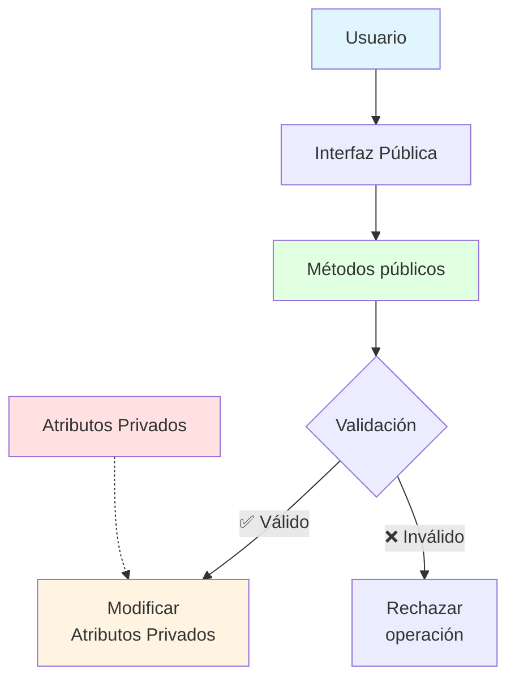

# 🔒 Encapsulamiento y Visibilidad

## 🎯 Introducción

> [!info]- 💡 ¿Qué es el Encapsulamiento?
> 
> El **encapsulamiento** es uno de los pilares fundamentales de la POO. Consiste en **ocultar los detalles internos** de implementación y exponer solo una interfaz controlada para interactuar con el objeto.
> 
> **Analogía del mundo real:** Piensa en un cajero automático:
> 
> - **Interior oculto** → No ves los mecanismos internos (motor, lectores, software)
> - **Interfaz pública** → Solo usas los botones y la pantalla
> - **Protección** → No puedes manipular directamente el dinero interno
> - **Validación** → El cajero verifica tu PIN antes de permitir operaciones
> 
> **¿Por qué es importante?**
> 
> |Beneficio|Descripción|Ejemplo|
> |---|---|---|
> |**Seguridad**|Protege datos críticos de modificaciones no autorizadas|Saldo bancario no se puede cambiar directamente|
> |**Control**|Valida datos antes de modificarlos|Edad no puede ser negativa|
> |**Mantenibilidad**|Cambios internos no afectan código externo|Cambiar implementación sin romper el código|
> |**Abstracción**|Oculta complejidad innecesaria|Usar `depositar()` en vez de `saldo += monto`|



---

## 🔐 Modificadores de Acceso

### 📊 Los 4 Niveles de Visibilidad

> [!tip]- 🎨 Tabla Completa de Modificadores
> 
> |Modificador|Clase|Paquete|Subclase|Global|Símbolo|
> |---|---|---|---|---|---|
> |`private`|✅|❌|❌|❌|🔴|
> |*(default)*|✅|✅|❌|❌|🟠|
> |`protected`|✅|✅|✅|❌|🟡|
> |`public`|✅|✅|✅|✅|🟢|
> 
> **Descripción detallada:**
> 
> ```java
> public class EjemploVisibilidad {
>     
>     // PRIVATE - Solo visible dentro de esta clase
>     private int datoPrivado = 10;
>     
>     // DEFAULT (sin modificador) - Visible en el mismo paquete
>     int datoPaquete = 20;
>     
>     // PROTECTED - Visible en paquete + subclases
>     protected int datoProtegido = 30;
>     
>     // PUBLIC - Visible desde cualquier lugar
>     public int datoPublico = 40;
>     
>     // Método privado - Solo accesible internamente
>     private void metodoPrivado() {
>         System.out.println("Solo yo puedo llamarme");
>     }
>     
>     // Método público - Interfaz externa
>     public void metodoPublico() {
>         System.out.println("Cualquiera puede llamarme");
>         metodoPrivado(); // ✅ Puedo llamar métodos privados internamente
>     }
> }
> ```

### 🎯 Uso Apropiado de Modificadores

> [!success]- 📋 Guía de Decisión
> 
> ```mermaid
> graph TD
>     A{¿Qué estás<br/>declarando?} --> B[Atributo]
>     A --> C[Método]
>     A --> D[Clase]
>     
>     B --> E{¿Debe ser<br/>modificable<br/>externamente?}
>     E -->|No| F[🔴 private]
>     E -->|Sí, con control| G[🟢 private + getter/setter]
>     E -->|Sí, libremente| H[🟢 public - Raramente]
>     
>     C --> I{¿Parte de la<br/>interfaz pública?}
>     I -->|Sí| J[🟢 public]
>     I -->|No| K[🔴 private]
>     I -->|Solo herencia| L[🟡 protected]
>     
>     D --> M{¿Usada<br/>externamente?}
>     M -->|Sí| N[🟢 public]
>     M -->|Solo en paquete| O[🟠 default]
>     
>     style F fill:#ffe1e1
>     style G fill:#e1ffe1
>     style J fill:#e1ffe1
>     style K fill:#ffe1e1
> ```
> 
> **Reglas generales:**
> 
> |Elemento|Modificador recomendado|Razón|
> |---|---|---|
> |Atributos|`private`|Siempre ocultar el estado interno|
> |Métodos de negocio|`public`|Interfaz de la clase|
> |Métodos auxiliares|`private`|Implementación interna|
> |Clases principales|`public`|Accesibles desde toda la app|
> |Clases helper|*(default)*|Solo para uso interno del paquete|

---

## 🛡️ Encapsulamiento en Práctica

### 🔓 Sin Encapsulamiento (Mal diseño)

> [!warning]- ❌ Ejemplo de Código Vulnerable
> 
> ```java
> // ❌ MAL DISEÑO - Atributos públicos
> public class CuentaBancaria {
>     public String titular;
>     public double saldo;
>     
>     public CuentaBancaria(String titular, double saldo) {
>         this.titular = titular;
>         this.saldo = saldo;
>     }
> }
> 
> // Problemas al usar esta clase:
> public class Main {
>     public static void main(String[] args) {
>         CuentaBancaria cuenta = new CuentaBancaria("Juan", 1000.0);
>         
>         // ❌ Problema 1: Modificación directa sin validación
>         cuenta.saldo = -5000.0; // Saldo negativo sin control
>         
>         // ❌ Problema 2: Sin registro de transacciones
>         cuenta.saldo += 500; // ¿Depósito? ¿De dónde vino?
>         
>         // ❌ Problema 3: Datos inconsistentes
>         cuenta.titular = ""; // Nombre vacío permitido
>         
>         // ❌ Problema 4: No hay lógica de negocio
>         // Cualquiera puede cambiar el saldo arbitrariamente
>     }
> }
> ```
> 
> **Problemas identificados:**
> - 🚫 No hay validación de datos
> - 🚫 Estado inconsistente permitido
> - 🚫 Sin control de acceso
> - 🚫 Imposible auditar cambios
> - 🚫 Lógica de negocio dispersa

### 🔐 Con Encapsulamiento (Buen diseño)

> [!success]- ✅ Ejemplo de Código Protegido
> 
> ```java
> // ✅ BUEN DISEÑO - Atributos privados con control
> public class CuentaBancaria {
>     // Atributos privados
>     private String titular;
>     private String numeroCuenta;
>     private double saldo;
>     private static final double SALDO_MINIMO = 0.0;
>     
>     // Constructor
>     public CuentaBancaria(String titular, String numeroCuenta, double saldoInicial) {
>         if (titular == null || titular.trim().isEmpty()) {
>             throw new IllegalArgumentException("Titular inválido");
>         }
>         if (saldoInicial < SALDO_MINIMO) {
>             throw new IllegalArgumentException("Saldo inicial debe ser >= 0");
>         }
>         
>         this.titular = titular;
>         this.numeroCuenta = numeroCuenta;
>         this.saldo = saldoInicial;
>     }
>     
>     // Métodos públicos controlados
>     public boolean depositar(double monto) {
>         if (monto <= 0) {
>             System.out.println("❌ El monto debe ser positivo");
>             return false;
>         }
>         
>         saldo += monto;
>         System.out.println("✅ Depósito exitoso: $" + monto);
>         System.out.println("   Nuevo saldo: $" + saldo);
>         return true;
>     }
>     
>     public boolean retirar(double monto) {
>         if (monto <= 0) {
>             System.out.println("❌ El monto debe ser positivo");
>             return false;
>         }
>         
>         if (monto > saldo) {
>             System.out.println("❌ Fondos insuficientes");
>             System.out.println("   Saldo disponible: $" + saldo);
>             return false;
>         }
>         
>         saldo -= monto;
>         System.out.println("✅ Retiro exitoso: $" + monto);
>         System.out.println("   Nuevo saldo: $" + saldo);
>         return true;
>     }
>     
>     public boolean transferir(CuentaBancaria destino, double monto) {
>         if (destino == null) {
>             System.out.println("❌ Cuenta destino inválida");
>             return false;
>         }
>         
>         if (retirar(monto)) {
>             destino.depositar(monto);
>             System.out.println("✅ Transferencia completada");
>             return true;
>         }
>         
>         return false;
>     }
>     
>     // Getters (solo lectura)
>     public String getTitular() {
>         return titular;
>     }
>     
>     public String getNumeroCuenta() {
>         return numeroCuenta;
>     }
>     
>     public double getSaldo() {
>         return saldo;
>     }
>     
>     // Setter con validación
>     public void setTitular(String titular) {
>         if (titular != null && !titular.trim().isEmpty()) {
>             this.titular = titular;
>             System.out.println("✅ Titular actualizado");
>         } else {
>             System.out.println("❌ Titular inválido");
>         }
>     }
>     
>     public void mostrarInfo() {
>         System.out.println("━━━━━━━━━━━━━━━━━━━━━");
>         System.out.println("Titular: " + titular);
>         System.out.println("Cuenta: " + numeroCuenta);
>         System.out.println("Saldo: $" + saldo);
>         System.out.println("━━━━━━━━━━━━━━━━━━━━━");
>     }
> }
> 
> // Uso correcto
> public class Main {
>     public static void main(String[] args) {
>         CuentaBancaria cuenta = new CuentaBancaria("Juan Pérez", "001", 1000.0);
>         
>         // ✅ Operaciones controladas
>         cuenta.depositar(500.0);    // Validado internamente
>         cuenta.retirar(200.0);       // Verificación de fondos
>         
>         // ✅ No se puede modificar directamente
>         // cuenta.saldo = -5000; // ❌ Error de compilación
>         
>         // ✅ Solo lectura del saldo
>         double saldoActual = cuenta.getSaldo();
>         System.out.println("Saldo consultado: $" + saldoActual);
>     }
> }
> ```

---

## 🎓 Getters y Setters

### 📖 Conceptos Fundamentales

> [!note]- 🔑 Métodos de Acceso
> 
> Los **getters** y **setters** son métodos que permiten **leer** y **modificar** atributos privados de forma controlada.
> 
> **Nomenclatura estándar:**
> 
> |Tipo|Patrón|Ejemplo|
> |---|---|---|
> |**Getter**|`get` + Atributo|`getNombre()`, `getEdad()`|
> |**Setter**|`set` + Atributo|`setNombre(String)`, `setEdad(int)`|
> |**Boolean**|`is` + Atributo|`isActivo()`, `isEstudiante()`|
> 
> ```java
> public class Persona {
>     private String nombre;
>     private int edad;
>     private boolean activo;
>     
>     // Getter para String
>     public String getNombre() {
>         return nombre;
>     }
>     
>     // Setter para String con validación
>     public void setNombre(String nombre) {
>         if (nombre != null && !nombre.trim().isEmpty()) {
>             this.nombre = nombre;
>         } else {
>             throw new IllegalArgumentException("Nombre inválido");
>         }
>     }
>     
>     // Getter para int
>     public int getEdad() {
>         return edad;
>     }
>     
>     // Setter para int con validación
>     public void setEdad(int edad) {
>         if (edad >= 0 && edad <= 150) {
>             this.edad = edad;
>         } else {
>             throw new IllegalArgumentException("Edad debe estar entre 0 y 150");
>         }
>     }
>     
>     // Getter para boolean (usa 'is' en vez de 'get')
>     public boolean isActivo() {
>         return activo;
>     }
>     
>     // Setter para boolean
>     public void setActivo(boolean activo) {
>         this.activo = activo;
>     }
> }
> ```

### 🎯 Patrones Avanzados

> [!example]- 🚀 Técnicas Especializadas
> 
> **1. Getter con lógica computada:**
> 
> ```java
> public class Rectangulo {
>     private double base;
>     private double altura;
>     
>     // Getter simple
>     public double getBase() {
>         return base;
>     }
>     
>     // Getter computado (no hay atributo "area")
>     public double getArea() {
>         return base * altura;
>     }
>     
>     // Getter computado con caché
>     private Double areaCacheada = null;
>     
>     public double getAreaOptimizada() {
>         if (areaCacheada == null) {
>             areaCacheada = base * altura;
>         }
>         return areaCacheada;
>     }
>     
>     // Invalidar caché al modificar
>     public void setBase(double base) {
>         this.base = base;
>         this.areaCacheada = null; // Invalidar caché
>     }
> }
> ```
> 
> **2. Setter con efectos secundarios:**
> 
> ```java
> public class Empleado {
>     private String nombre;
>     private double salario;
>     private double salarioAnterior;
>     private boolean cambioSalarioReciente;
>     
>     public void setSalario(double nuevoSalario) {
>         if (nuevoSalario < 0) {
>             throw new IllegalArgumentException("Salario no puede ser negativo");
>         }
>         
>         // Guardar historial
>         this.salarioAnterior = this.salario;
>         this.salario = nuevoSalario;
>         this.cambioSalarioReciente = true;
>         
>         // Notificar cambio
>         System.out.println("💰 Salario actualizado: $" + nuevoSalario);
>         
>         if (nuevoSalario > salarioAnterior) {
>             double aumento = nuevoSalario - salarioAnterior;
>             System.out.println("📈 Aumento: $" + aumento);
>         }
>     }
> }
> ```
> 
> **3. Getter defensivo (copias):**
> 
> ```java
> public class Agenda {
>     private List<String> contactos;
>     
>     public Agenda() {
>         this.contactos = new ArrayList<>();
>     }
>     
>     // ❌ MAL - Expone referencia interna
>     public List<String> getContactosMal() {
>         return contactos; // Modificable externamente
>     }
>     
>     // ✅ BIEN - Retorna copia defensiva
>     public List<String> getContactos() {
>         return new ArrayList<>(contactos);
>     }
>     
>     // ✅ MEJOR - Retorna copia inmutable
>     public List<String> getContactosInmutable() {
>         return Collections.unmodifiableList(contactos);
>     }
> }
> ```
> 
> **4. Solo Getter (atributo de solo lectura):**
> 
> ```java
> public class Producto {
>     private final int id;
>     private String nombre;
>     private int vecesVendido;
>     
>     public Producto(int id, String nombre) {
>         this.id = id;
>         this.nombre = nombre;
>         this.vecesVendido = 0;
>     }
>     
>     // Solo getter - ID inmutable
>     public int getId() {
>         return id;
>     }
>     
>     // Getter y setter - nombre modificable
>     public String getNombre() {
>         return nombre;
>     }
>     
>     public void setNombre(String nombre) {
>         this.nombre = nombre;
>     }
>     
>     // Solo getter - se incrementa internamente
>     public int getVecesVendido() {
>         return vecesVendido;
>     }
>     
>     // Método de negocio que modifica el atributo
>     public void registrarVenta() {
>         vecesVendido++;
>     }
> }
> ```

---

## 🎨 Ejemplo Completo: Sistema de Empleados

> [!example]- 💼 Implementación Profesional
> 
> ```java
> public class Empleado {
>     // ========== CONSTANTES ==========
>     private static final double SALARIO_MINIMO = 450.0;
>     private static final double SALARIO_MAXIMO = 50000.0;
>     private static final int EDAD_MINIMA = 18;
>     private static final int EDAD_MAXIMA = 70;
>     
>     // ========== ATRIBUTOS PRIVADOS ==========
>     private int id;
>     private String nombre;
>     private String apellido;
>     private int edad;
>     private String departamento;
>     private double salario;
>     private boolean activo;
>     
>     // ========== CONTADOR ESTÁTICO ==========
>     private static int contadorEmpleados = 0;
>     
>     // ========== CONSTRUCTOR ==========
>     public Empleado(String nombre, String apellido, int edad, 
>                     String departamento, double salario) {
>         this.id = ++contadorEmpleados;
>         setNombre(nombre);
>         setApellido(apellido);
>         setEdad(edad);
>         setDepartamento(departamento);
>         setSalario(salario);
>         this.activo = true;
>     }
>     
>     // ========== MÉTODOS DE NEGOCIO ==========
>     
>     public void aumentarSalario(double porcentaje) {
>         if (porcentaje <= 0 || porcentaje > 100) {
>             System.out.println("❌ Porcentaje inválido (debe estar entre 0 y 100)");
>             return;
>         }
>         
>         double aumento = salario * (porcentaje / 100);
>         double nuevoSalario = salario + aumento;
>         
>         if (nuevoSalario > SALARIO_MAXIMO) {
>             System.out.println("❌ Nuevo salario excede el máximo permitido");
>             return;
>         }
>         
>         salario = nuevoSalario;
>         System.out.println("✅ Aumento del " + porcentaje + "% aplicado");
>         System.out.println("   Aumento: $" + aumento);
>         System.out.println("   Nuevo salario: $" + salario);
>     }
>     
>     public void cambiarDepartamento(String nuevoDepartamento) {
>         if (nuevoDepartamento == null || nuevoDepartamento.trim().isEmpty()) {
>             System.out.println("❌ Departamento inválido");
>             return;
>         }
>         
>         String departamentoAnterior = this.departamento;
>         this.departamento = nuevoDepartamento;
>         System.out.println("✅ Transferencia exitosa");
>         System.out.println("   De: " + departamentoAnterior);
>         System.out.println("   A: " + nuevoDepartamento);
>     }
>     
>     public void darDeBaja() {
>         if (!activo) {
>             System.out.println("⚠️ El empleado ya está inactivo");
>             return;
>         }
>         
>         activo = false;
>         System.out.println("✅ Empleado dado de baja");
>     }
>     
>     public void reactivar() {
>         if (activo) {
>             System.out.println("⚠️ El empleado ya está activo");
>             return;
>         }
>         
>         activo = true;
>         System.out.println("✅ Empleado reactivado");
>     }
>     
>     public String getNombreCompleto() {
>         return nombre + " " + apellido;
>     }
>     
>     public void mostrarInfo() {
>         System.out.println("━━━━━━━━━━━━━━━━━━━━━━━━━━━━");
>         System.out.println("👤 Empleado #" + id);
>         System.out.println("   Nombre: " + getNombreCompleto());
>         System.out.println("   Edad: " + edad + " años");
>         System.out.println("   Departamento: " + departamento);
>         System.out.println("   Salario: $" + salario);
>         System.out.println("   Estado: " + (activo ? "✅ Activo" : "❌ Inactivo"));
>         System.out.println("━━━━━━━━━━━━━━━━━━━━━━━━━━━━");
>     }
>     
>     // ========== GETTERS ==========
>     
>     public int getId() {
>         return id;
>     }
>     
>     public String getNombre() {
>         return nombre;
>     }
>     
>     public String getApellido() {
>         return apellido;
>     }
>     
>     public int getEdad() {
>         return edad;
>     }
>     
>     public String getDepartamento() {
>         return departamento;
>     }
>     
>     public double getSalario() {
>         return salario;
>     }
>     
>     public boolean isActivo() {
>         return activo;
>     }
>     
>     public static int getTotalEmpleados() {
>         return contadorEmpleados;
>     }
>     
>     // ========== SETTERS CON VALIDACIÓN ==========
>     
>     public void setNombre(String nombre) {
>         if (nombre == null || nombre.trim().isEmpty()) {
>             throw new IllegalArgumentException("Nombre no puede estar vacío");
>         }
>         if (nombre.length() < 2) {
>             throw new IllegalArgumentException("Nombre debe tener al menos 2 caracteres");
>         }
>         this.nombre = nombre.trim();
>     }
>     
>     public void setApellido(String apellido) {
>         if (apellido == null || apellido.trim().isEmpty()) {
>             throw new IllegalArgumentException("Apellido no puede estar vacío");
>         }
>         if (apellido.length() < 2) {
>             throw new IllegalArgumentException("Apellido debe tener al menos 2 caracteres");
>         }
>         this.apellido = apellido.trim();
>     }
>     
>     public void setEdad(int edad) {
>         if (edad < EDAD_MINIMA || edad > EDAD_MAXIMA) {
>             throw new IllegalArgumentException(
>                 "Edad debe estar entre " + EDAD_MINIMA + " y " + EDAD_MAXIMA
>             );
>         }
>         this.edad = edad;
>     }
>     
>     public void setDepartamento(String departamento) {
>         if (departamento == null || departamento.trim().isEmpty()) {
>             throw new IllegalArgumentException("Departamento no puede estar vacío");
>         }
>         this.departamento = departamento.trim();
>     }
>     
>     public void setSalario(double salario) {
>         if (salario < SALARIO_MINIMO || salario > SALARIO_MAXIMO) {
>             throw new IllegalArgumentException(
>                 "Salario debe estar entre $" + SALARIO_MINIMO + 
>                 " y $" + SALARIO_MAXIMO
>             );
>         }
>         this.salario = salario;
>     }
> }
> 
> // ========== CLASE DE PRUEBA ==========
> public class TestEmpleado {
>     public static void main(String[] args) {
>         // Crear empleado
>         Empleado emp1 = new Empleado("Juan", "Pérez", 30, "Ventas", 2500.0);
>         emp1.mostrarInfo();
>         
>         // Operaciones
>         emp1.aumentarSalario(10);
>         emp1.cambiarDepartamento("Marketing");
>         
>         // Intentar operación inválida
>         emp1.aumentarSalario(150); // Excede máximo
>         
>         // Estado
>         emp1.darDeBaja();
>         emp1.mostrarInfo();
>         
>         System.out.println("
Total de empleados: " + Empleado.getTotalEmpleados());
>     }
> }
> ```

---
## 🎓 Mejores Prácticas

### ✅ Principios de Encapsulamiento

> [!success]- 💡 Reglas de Oro
> 
> **1. Siempre hacer atributos privados:**
> 
> ```java
> // ✅ CORRECTO
> public class Usuario {
>     private String email;
>     private String password;
> }
> 
> // ❌ INCORRECTO
> public class Usuario {
>     public String email;
>     public String password;
> }
> ```
> 
> **2. Proveer getters solo cuando sea necesario:**
> 
> ```java
> public class Password {
>     private String hash;
>     
>     // ❌ MAL - Expone el hash
>     public String getHash() {
>         return hash;
>     }
>     
>     // ✅ BIEN - Solo permite verificar
>     public boolean verificar(String password) {
>         return hash.equals(calcularHash(password));
>     }
> }
> ```
> 
> **3. Validar siempre en setters:**
> 
> ```java
> public class Producto {
>     private double precio;
>     
>     // ✅ CORRECTO - Con validación
>     public void setPrecio(double precio) {
>         if (precio < 0) {
>             throw new IllegalArgumentException("Precio no puede ser negativo");
>         }
>         this.precio = precio;
>     }
>     
>     // ❌ INCORRECTO - Sin validación
>     public void setPrecioMal(double precio) {
>         this.precio = precio; // Permite negativos
>     }
> }
> ```
> 
> **4. Usar métodos de negocio en lugar de setters cuando sea apropiado:**
> 
> ```java
> public class CuentaBancaria {
>     private double saldo;
>     
>     // ❌ EVITAR - Setter genérico
>     public void setSaldo(double saldo) {
>         this.saldo = saldo;
>     }
>     
>     // ✅ PREFERIR - Métodos específicos
>     public void depositar(double monto) {
>         if (monto > 0) {
>             saldo += monto;
>         }
>     }
>     
>     public void retirar(double monto) {
>         if (monto > 0 && monto <= saldo) {
>             saldo -= monto;
>         }
>     }
> }
> ```

---
## 📊 Resumen Visual

```mermaid
mindmap
  root((Encapsulamiento))
    Modificadores
      private
        Atributos
        Métodos auxiliares
      protected
        Herencia
      public
        Interfaz pública
      default
        Paquete
    Getters/Setters
      Lectura
        getNombre
        isActivo
      Escritura
        setNombre
        Validación
      Defensivos
        Copias
        Inmutables
    Validación
      En constructor
      En setters
      En métodos
    Beneficios
      Seguridad
      Control
      Mantenibilidad
      Abstracción
````

> [!success]  🎯 Tabla de Referencia Rápida
> 
> |Concepto|Cuándo usar|Ejemplo|
> |---|---|---|
> |`private`|Atributos y métodos internos|`private String nombre;`|
> |`public`|Interfaz pública de la clase|`public void metodo()`|
> |`protected`|Compartir con subclases|`protected int valor;`|
> |Getter|Leer atributo privado|`public String getNombre()`|
> |Setter|Modificar con validación|`public void setEdad(int edad)`|
> |Método de negocio|Operaciones específicas|`depositar()`, `retirar()`|
> 
---

## 💪 Ejercicios Prácticos

> [!example]- 🎯 Práctica 1: Clase Fecha
> 
> ```java
> public class Fecha {
>     // Atributos privados
>     private int dia;
>     private int mes;
>     private int anio;
>     
>     // Constructor con validación
>     public Fecha(int dia, int mes, int anio) {
>         setDia(dia);
>         setMes(mes);
>         setAnio(anio);
>     }
>     
>     // Getters
>     public int getDia() {
>         return dia;
>     }
>     
>     public int getMes() {
>         return mes;
>     }
>     
>     public int getAnio() {
>         return anio;
>     }
>     
>     // Setters con validación
>     public void setDia(int dia) {
>         if (dia < 1 || dia > 31) {
>             throw new IllegalArgumentException("Día debe estar entre 1 y 31");
>         }
>         this.dia = dia;
>     }
>     
>     public void setMes(int mes) {
>         if (mes < 1 || mes > 12) {
>             throw new IllegalArgumentException("Mes debe estar entre 1 y 12");
>         }
>         this.mes = mes;
>     }
>     
>     public void setAnio(int anio) {
>         if (anio < 1900 || anio > 2100) {
>             throw new IllegalArgumentException("Año debe estar entre 1900 y 2100");
>         }
>         this.anio = anio;
>     }
>     
>     // Método computado
>     public String getFechaFormateada() {
>         return String.format("%02d/%02d/%04d", dia, mes, anio);
>     }
>     
>     public void mostrarInfo() {
>         System.out.println("📅 Fecha: " + getFechaFormateada());
>     }
> }
> ```

> [!example]- 🎯 Práctica 2: Clase Temperatura
> 
> ```java
> public class Temperatura {
>     private double celsius;
>     
>     // Constructor
>     public Temperatura(double celsius) {
>         setCelsius(celsius);
>     }
>     
>     // Getter y setter para Celsius
>     public double getCelsius() {
>         return celsius;
>     }
>     
>     public void setCelsius(double celsius) {
>         if (celsius < -273.15) {
>             throw new IllegalArgumentException(
>                 "Temperatura no puede ser menor al cero absoluto (-273.15°C)"
>             );
>         }
>         this.celsius = celsius;
>     }
>     
>     // Getters computados (sin setter)
>     public double getFahrenheit() {
>         return (celsius * 9.0 / 5.0) + 32;
>     }
>     
>     public double getKelvin() {
>         return celsius + 273.15;
>     }
>     
>     // Métodos de negocio
>     public void aumentar(double grados) {
>         setCelsius(celsius + grados);
>         System.out.println("✅ Temperatura aumentada " + grados + "°C");
>     }
>     
>     public void disminuir(double grados) {
>         setCelsius(celsius - grados);
>         System.out.println("✅ Temperatura disminuida " + grados + "°C");
>     }
>     
>     public void mostrarInfo() {
>         System.out.println("🌡️ Temperatura:");
>         System.out.println("   " + celsius + "°C");
>         System.out.println("   " + getFahrenheit() + "°F");
>         System.out.println("   " + getKelvin() + "K");
>     }
> }
> ```

---

## 🚀 Próximos Pasos

> [!quote]- 🌟 Has Aprendido
> 
> ✅ Los 4 modificadores de acceso y cuándo usarlos  
> ✅ Principios del encapsulamiento  
> ✅ Diferencia entre código con y sin encapsulamiento  
> ✅ Getters y setters: nomenclatura y validación  
> ✅ Técnicas avanzadas (getters computados, setters con efectos)  
> ✅ Mejores prácticas de diseño orientado a objetos
> 
> **Continúa con:**
> 
> - Herencia y polimorfismo
> - Clases abstractas e interfaces
> - Relaciones entre clases (composición, agregación)
> - Principios SOLID

---

**Tags:** #java #encapsulamiento #visibilidad #modificadores-acceso #getters-setters #poo #validacion #seguridad
