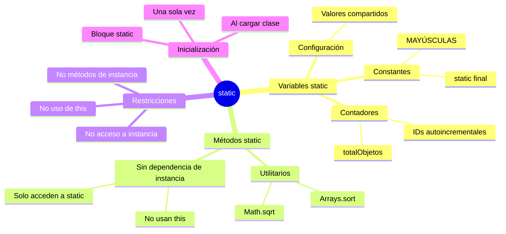

# 🔷 Miembros Estáticos (static)

## 🎯 Introducción

> [!info]- 💡 ¿Qué significa "static" en Java?
> 
> La palabra clave **`static`** indica que un miembro (variable o método) pertenece a la **clase en sí misma**, no a instancias individuales de la clase.
> 
> **Analogía del mundo real:** Piensa en un contador de visitantes en un museo:
> 
> - **Sin static (instancia)** → Cada visitante tiene su propio contador personal (no tiene sentido)
> - **Con static (clase)** → Hay UN SOLO contador compartido por todos los visitantes
> 
> **Diferencia fundamental:**
> 
> ```mermaid
> graph TB
>     A[Clase Persona] --> B[Variable de instancia:<br/>nombre]
>     A --> C[Variable static:<br/>totalPersonas]
>     
>     D[Persona 1<br/>Ana] --> E[nombre = Ana]
>     F[Persona 2<br/>Luis] --> G[nombre = Luis]
>     H[Persona 3<br/>María] --> I[nombre = María]
>     
>     D -.-> J[totalPersonas = 3]
>     F -.-> J
>     H -.-> J
>     
>     style C fill:#fff4e1
>     style J fill:#fff4e1
>     style E fill:#e1f5ff
>     style G fill:#e1f5ff
>     style I fill:#e1f5ff
> ```
> 
> |Aspecto|Miembro de Instancia|Miembro Static|
> |---|---|---|
> |**Pertenece a**|Cada objeto individual|La clase completa|
> |**Acceso**|Requiere objeto|Directo desde la clase|
> |**Memoria**|Una copia por objeto|Una única copia compartida|
> |**Uso típico**|Atributos personales|Contadores, constantes, utilidades|

---

## 📊 Variables Estáticas

### 🔢 Conceptos Fundamentales

> [!tip]- 🎲 ¿Cuándo usar variables static?
> 
> **Casos de uso comunes:**
> 
> ```mermaid
> mindmap
>   root((Variables<br/>static))
>     Contadores
>       Total de objetos creados
>       IDs autoincrementales
>       Estadísticas globales
>     Constantes
>       PI matemático
>       Configuraciones
>       Valores fijos
>     Configuración
>       Conexión BD
>       Rutas del sistema
>       Parámetros globales
>     Caché
>       Datos compartidos
>       Resultados precalculados
> ```
> 
> **Ejemplo básico:**
> 
> ```java
> public class Banco {
>     // ❌ Variable de instancia - cada cuenta tiene su saldo
>     private double saldo;
>     
>     // ✅ Variable static - UN SOLO contador para todas las cuentas
>     private static int totalCuentas = 0;
>     
>     // ✅ Constante static - valor compartido e inmutable
>     public static final double INTERES_ANUAL = 0.05;
>     
>     public Banco(double saldoInicial) {
>         this.saldo = saldoInicial;
>         totalCuentas++; // Incrementa el contador global
>     }
>     
>     public static int obtenerTotalCuentas() {
>         return totalCuentas;
>     }
> }
> ```
> 
> **Uso:**
> 
> ```java
> Banco cuenta1 = new Banco(1000);
> Banco cuenta2 = new Banco(2000);
> Banco cuenta3 = new Banco(1500);
> 
> // Acceso directo desde la clase (sin objeto)
> System.out.println("Total cuentas: " + Banco.obtenerTotalCuentas()); // 3
> System.out.println("Interés: " + Banco.INTERES_ANUAL); // 0.05
> ```

### 🆔 Patrón: IDs Autoincrementales

> [!example]- 🔑 Generación Automática de Identificadores
> 
> **Implementación completa:**
> 
> ```java
> public class Producto {
>     // Contador static - compartido por todos los productos
>     private static int contadorId = 1;
>     
>     // Atributos de instancia - únicos para cada producto
>     private int id;
>     private String nombre;
>     private double precio;
>     
>     public Producto(String nombre, double precio) {
>         this.id = contadorId++;  // Asigna y luego incrementa
>         this.nombre = nombre;
>         this.precio = precio;
>     }
>     
>     public static int obtenerTotalProductos() {
>         return contadorId - 1;  // -1 porque ya incrementó para el siguiente
>     }
>     
>     @Override
>     public String toString() {
>         return String.format("ID: %d | %s | $%.2f", id, nombre, precio);
>     }
> }
> ```
> 
> **Visualización del proceso:**
> 
> ```mermaid
> sequenceDiagram
>     participant C as Clase Producto<br/>(contadorId = 1)
>     participant P1 as Producto 1
>     participant P2 as Producto 2
>     participant P3 as Producto 3
>     
>     Note over C: contadorId = 1
>     C->>P1: new Producto("Laptop", 1200)
>     P1->>P1: id = 1
>     P1->>C: contadorId++
>     Note over C: contadorId = 2
>     
>     C->>P2: new Producto("Mouse", 25)
>     P2->>P2: id = 2
>     P2->>C: contadorId++
>     Note over C: contadorId = 3
>     
>     C->>P3: new Producto("Teclado", 80)
>     P3->>P3: id = 3
>     P3->>C: contadorId++
>     Note over C: contadorId = 4
> ```
> 
> **Uso práctico:**
> 
> ```java
> Producto p1 = new Producto("Laptop", 1200);
> Producto p2 = new Producto("Mouse", 25);
> Producto p3 = new Producto("Teclado", 80);
> 
> System.out.println(p1); // ID: 1 | Laptop | $1200.00
> System.out.println(p2); // ID: 2 | Mouse | $25.00
> System.out.println(p3); // ID: 3 | Teclado | $80.00
> 
> System.out.println("Total productos: " + Producto.obtenerTotalProductos()); // 3
> ```

---

## ⚙️ Métodos Estáticos

### 🛠️ Características y Limitaciones

> [!warning]- ⚠️ Reglas Importantes de Métodos Static
> 
> **Restricciones fundamentales:**
> 
> |Puede hacer|NO puede hacer|
> |---|---|
> |✅ Acceder a variables static|❌ Acceder a variables de instancia|
> |✅ Llamar otros métodos static|❌ Llamar métodos de instancia|
> |✅ Usar parámetros|❌ Usar `this` o `super`|
> |✅ Crear objetos|❌ Depender de objetos existentes|
> 
> **Ejemplo de limitaciones:**
> 
> ```java
> public class Ejemplo {
>     private int valorInstancia = 10;
>     private static int valorStatic = 20;
>     
>     // ✅ VÁLIDO - método static accede a static
>     public static void metodoStatic1() {
>         System.out.println(valorStatic);  // OK
>     }
>     
>     // ❌ ERROR - método static NO puede acceder a instancia
>     public static void metodoStatic2() {
>         System.out.println(valorInstancia);  // ❌ COMPILACIÓN FALLA
>     }
>     
>     // ❌ ERROR - método static NO puede usar 'this'
>     public static void metodoStatic3() {
>         System.out.println(this.valorStatic);  // ❌ COMPILACIÓN FALLA
>     }
>     
>     // ✅ VÁLIDO - método de instancia accede a todo
>     public void metodoInstancia() {
>         System.out.println(valorInstancia);  // OK
>         System.out.println(valorStatic);     // OK
>         metodoStatic1();                     // OK
>     }
> }
> ```
> 
> **Razón de las restricciones:**
> 
> ```mermaid
> graph TB
>     A[Método static] --> B{¿Existe objeto?}
>     B -->|No necesita| C[Acceso a miembros static<br/>✅ PERMITIDO]
>     B -->|Requiere| D[Acceso a miembros de instancia<br/>❌ PROHIBIDO]
>     
>     E[Método de instancia] --> F[Siempre hay objeto]
>     F --> G[Acceso a TODO<br/>✅ PERMITIDO]
>     
>     style C fill:#e1ffe1
>     style D fill:#ffe1e1
>     style G fill:#e1ffe1
> ```

### 🧮 Métodos Utilitarios

> [!success]- 🎯 Patrón: Clases Utility
> 
> **Ejemplo: Calculadora matemática**
> 
> ```java
> public class Matematicas {
>     // Constructor privado - impide crear instancias
>     private Matematicas() {
>         throw new UnsupportedOperationException("Clase utilitaria");
>     }
>     
>     // Constantes
>     public static final double PI = 3.14159265359;
>     public static final double E = 2.71828182846;
>     
>     // Métodos utilitarios
>     public static double areaCirculo(double radio) {
>         return PI * radio * radio;
>     }
>     
>     public static double perimetroCirculo(double radio) {
>         return 2 * PI * radio;
>     }
>     
>     public static int factorial(int n) {
>         if (n < 0) throw new IllegalArgumentException("n debe ser >= 0");
>         if (n <= 1) return 1;
>         return n * factorial(n - 1);
>     }
>     
>     public static boolean esPrimo(int numero) {
>         if (numero < 2) return false;
>         for (int i = 2; i <= Math.sqrt(numero); i++) {
>             if (numero % i == 0) return false;
>         }
>         return true;
>     }
> }
> ```
> 
> **Uso directo sin crear objetos:**
> 
> ```java
> // ❌ No se puede hacer (constructor privado)
> // Matematicas m = new Matematicas();
> 
> // ✅ Uso correcto - acceso directo desde la clase
> double area = Matematicas.areaCirculo(5);
> double perimetro = Matematicas.perimetroCirculo(5);
> int fact = Matematicas.factorial(5);
> boolean primo = Matematicas.esPrimo(17);
> 
> System.out.println("Área: " + area);           // 78.54
> System.out.println("Perímetro: " + perimetro); // 31.42
> System.out.println("5! = " + fact);            // 120
> System.out.println("17 es primo: " + primo);   // true
> ```
> 
> **Ejemplos en la API de Java:**
> 
> ```java
> // Math - clase utilitaria de Java
> double raiz = Math.sqrt(16);        // 4.0
> double potencia = Math.pow(2, 3);   // 8.0
> int maximo = Math.max(10, 20);      // 20
> 
> // Arrays - utilidades para arrays
> int[] numeros = {5, 2, 8, 1, 9};
> Arrays.sort(numeros);
> System.out.println(Arrays.toString(numeros));
> 
> // Collections - utilidades para colecciones
> List<Integer> lista = Arrays.asList(1, 2, 3);
> Collections.reverse(lista);
> ```

---

## 🎓 Constantes con static final

### 📌 Buenas Prácticas

> [!tip]- 🔒 Definición de Constantes
> 
> **Convención de nombres:**
> 
> ```java
> public class Configuracion {
>     // ✅ CORRECTO - MAYÚSCULAS con guión bajo
>     public static final int MAX_INTENTOS = 3;
>     public static final double TASA_IVA = 0.12;
>     public static final String NOMBRE_APLICACION = "MiApp";
>     
>     // ❌ INCORRECTO - no sigue convención
>     public static final int maxIntentos = 3;
>     public static final double tasaIva = 0.12;
> }
> ```
> 
> **Ventajas de usar constantes:**
> 
> |Aspecto|Sin constantes|Con constantes|
> |---|---|---|
> |**Mantenibilidad**|Cambiar en múltiples lugares|Cambiar en UN solo lugar|
> |**Legibilidad**|`if (intentos > 3)`|`if (intentos > MAX_INTENTOS)`|
> |**Errores**|Fácil equivocarse en el número|Imposible equivocarse|
> |**Documentación**|Número "mágico" sin contexto|Nombre descriptivo|
> 
> **Ejemplo práctico:**
> 
> ```java
> public class Juego {
>     // Constantes de configuración
>     public static final int VIDAS_INICIALES = 3;
>     public static final int PUNTOS_POR_ENEMIGO = 100;
>     public static final int PUNTOS_VICTORIA = 1000;
>     public static final double VELOCIDAD_BASE = 1.5;
>     
>     // Variables de instancia
>     private int vidas;
>     private int puntos;
>     private double velocidad;
>     
>     public Juego() {
>         this.vidas = VIDAS_INICIALES;
>         this.puntos = 0;
>         this.velocidad = VELOCIDAD_BASE;
>     }
>     
>     public void eliminarEnemigo() {
>         puntos += PUNTOS_POR_ENEMIGO;
>         if (puntos >= PUNTOS_VICTORIA) {
>             System.out.println("¡Victoria!");
>         }
>     }
>     
>     public void perderVida() {
>         vidas--;
>         if (vidas <= 0) {
>             System.out.println("Game Over");
>         }
>     }
> }
> ```

---

## 🔄 Bloques de Inicialización Estáticos

### ⚡ Static Initializer Block

> [!info]- 🎬 Ejecución al Cargar la Clase
> 
> **Sintaxis y uso:**
> 
> ```java
> public class BaseDatos {
>     private static Connection conexion;
>     private static boolean inicializada = false;
>     
>     // Bloque static - se ejecuta UNA VEZ al cargar la clase
>     static {
>         System.out.println("🔄 Inicializando configuración...");
>         try {
>             conexion = establecerConexion();
>             inicializada = true;
>             System.out.println("✅ Base de datos conectada");
>         } catch (Exception e) {
>             System.out.println("❌ Error al conectar: " + e.getMessage());
>             inicializada = false;
>         }
>     }
>     
>     private static Connection establecerConexion() {
>         // Lógica de conexión...
>         return null; // Simulación
>     }
>     
>     public static boolean estaInicializada() {
>         return inicializada;
>     }
> }
> ```
> 
> **Orden de ejecución:**
> 
> ```mermaid
> sequenceDiagram
>     participant JVM
>     participant Clase
>     participant Objeto
>     
>     Note over JVM: Primera referencia a la clase
>     JVM->>Clase: Cargar clase en memoria
>     Clase->>Clase: 1. Inicializar variables static
>     Clase->>Clase: 2. Ejecutar bloque static
>     Note over Clase: Clase lista para usar
>     
>     Note over JVM: new Objeto()
>     JVM->>Objeto: 3. Inicializar variables de instancia
>     Objeto->>Objeto: 4. Ejecutar constructor
>     Note over Objeto: Objeto creado
> ```
> 
> **Ejemplo completo:**
> 
> ```java
> public class Demo {
>     // 1. Variables static (primero)
>     private static int valor1 = 10;
>     
>     // 2. Bloque static (segundo)
>     static {
>         System.out.println("Bloque static ejecutado");
>         valor1 = 20; // Puede modificar variables
>     }
>     
>     // 3. Variables de instancia (al crear objeto)
>     private int valor2 = 30;
>     
>     // 4. Constructor (al crear objeto)
>     public Demo() {
>         System.out.println("Constructor ejecutado");
>     }
>     
>     public static void main(String[] args) {
>         System.out.println("main iniciado");
>         Demo d = new Demo();
>     }
> }
> 
> // Salida:
> // Bloque static ejecutado
> // main iniciado
> // Constructor ejecutado
> ```

---

## 📊 Comparación: Static vs Instancia

### 🔀 Tabla Comparativa Completa

> [!note]- 📋 Diferencias Clave
> 
> |Característica|Miembros de Instancia|Miembros Static|
> |---|---|---|
> |**Declaración**|Sin `static`|Con `static`|
> |**Pertenece a**|Objetos individuales|La clase completa|
> |**Memoria**|Una copia por objeto|Una única copia compartida|
> |**Creación**|Al instanciar objeto|Al cargar la clase|
> |**Acceso**|`objeto.miembro`|`Clase.miembro` (recomendado)|
> |**Puede acceder a**|Todo (static e instancia)|Solo static|
> |**Palabra `this`**|✅ Sí|❌ No|
> |**Ejemplo típico**|Nombre de persona|Contador de personas|
> 
> **Visualización en memoria:**
> 
> ```mermaid
> graph TB
>     subgraph "Memoria Heap"
>         A[Área Static<br/>Clase Persona]
>         A --> B[totalPersonas = 3<br/>COMPARTIDA]
>         
>         C[Objeto 1: Ana]
>         C --> D[nombre = Ana]
>         
>         E[Objeto 2: Luis]
>         E --> F[nombre = Luis]
>         
>         G[Objeto 3: María]
>         G --> H[nombre = María]
>         
>         C -.referencia.-> B
>         E -.referencia.-> B
>         G -.referencia.-> B
>     end
>     
>     style A fill:#fff4e1
>     style B fill:#fff4e1
>     style C fill:#e1f5ff
>     style E fill:#e1f5ff
>     style G fill:#e1f5ff
> ```

---

## ✅ Mejores Prácticas

### 🎯 Guía de Uso Correcto

> [!success]- 🏆 Recomendaciones Profesionales
> 
> **1. Cuándo usar static:**
> 
> ```mermaid
> flowchart TD
>     A{¿El valor/comportamiento<br/>es común a TODAS<br/>las instancias?} -->|Sí| B[✅ Usar static]
>     A -->|No| C[❌ Usar instancia]
>     
>     B --> D[Ejemplos:<br/>- Contadores globales<br/>- Constantes<br/>- Métodos utilitarios]
>     C --> E[Ejemplos:<br/>- Atributos personales<br/>- Estado del objeto]
>     
>     style B fill:#e1ffe1
>     style C fill:#e1f5ff
> ```
> 
> **2. Constantes siempre public static final:**
> 
> ```java
> // ✅ CORRECTO
> public class Config {
>     public static final int TIMEOUT = 5000;
>     public static final String VERSION = "1.0.0";
> }
> 
> // ❌ INCORRECTO - sin final (puede cambiar)
> public class ConfigMal {
>     public static int TIMEOUT = 5000; // ⚠️ No es constante real
> }
> ```
> 
> **3. Evitar abuso de static:**
> 
> ```java
> // ❌ MAL - todo static sin necesidad
> public class UsuarioMal {
>     private static String nombre;
>     private static int edad;
>     
>     public static void setNombre(String n) { nombre = n; }
>     // Problema: ¡solo puede haber UN usuario!
> }
> 
> // ✅ BIEN - solo lo necesario es static
> public class Usuario {
>     private static int totalUsuarios = 0;
>     
>     private String nombre;
>     private int edad;
>     
>     public Usuario(String nombre, int edad) {
>         this.nombre = nombre;
>         this.edad = edad;
>         totalUsuarios++;
>     }
> }
> ```
> 
> **4. Métodos utilitarios en clases dedicadas:**
> 
> ```java
> // ✅ BIEN - clase utilitaria dedicada
> public class StringUtils {
>     private StringUtils() {} // Constructor privado
>     
>     public static boolean esVacio(String str) {
>         return str == null || str.trim().isEmpty();
>     }
>     
>     public static String capitalizar(String str) {
>         if (esVacio(str)) return str;
>         return str.substring(0, 1).toUpperCase() + str.substring(1);
>     }
> }
> ```

---

## 📚 Resumen Visual



> [!quote]- 🎓 Puntos Clave para Recordar
> 
> ✅ **Static = pertenece a la CLASE**, no a objetos  
> ✅ **Una sola copia en memoria**, compartida por todos  
> ✅ **Acceso directo** desde la clase: `Clase.miembro`  
> ✅ **Perfecto para**: contadores, constantes, utilidades  
> ✅ **Limitación**: no puede acceder a miembros de instancia  
> ✅ **Constantes**: siempre `public static final MAYUSCULAS`  
> ✅ **No abusar**: solo usar cuando realmente sea necesario

---

**Tags:** #java #static #poo #variables-estaticas #metodos-estaticos #constantes #final #bloques-static #mejores-practicas