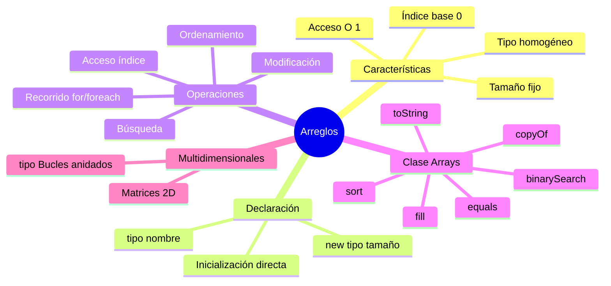

# 📊 Arreglos Estáticos

## 🎯 Introducción

> [!info]- 💡 ¿Qué es un Arreglo (Array)?
> 
> Un **arreglo** es una estructura de datos que almacena una **colección de elementos del mismo tipo** en posiciones de memoria contiguas. Es la forma más básica y eficiente de manejar múltiples valores relacionados.
> 
> **Analogía del mundo real:** Piensa en un arreglo como:
> 
> - **Casillero de correos** → Cada casilla tiene un número (índice) y guarda algo del mismo tipo
> - **Estante de biblioteca** → Espacios numerados consecutivamente
> - **Tren de pasajeros** → Vagones numerados, cada uno con capacidad para un pasajero
> 
> **Características fundamentales:**
> 
> ```mermaid
> graph TB
>     A[Arreglo int scores] --> B[Tamaño FIJO: 5]
>     A --> C[Tipo HOMOGÉNEO: int]
>     A --> D[Índices: 0 a 4]
>     A --> E[Memoria CONTIGUA]
>     
>     F[scores] --> G["[0] → 85"]
>     F --> H["[1] → 92"]
>     F --> I["[2] → 78"]
>     F --> J["[3] → 90"]
>     F --> K["[4] → 88"]
>     
>     style A fill:#e1f5ff
>     style B fill:#fff4e1
>     style C fill:#fff4e1
>     style D fill:#fff4e1
>     style E fill:#fff4e1
> ```
> 
> |Característica|Descripción|Implicación|
> |---|---|---|
> |**Tamaño fijo**|Se define al crear y no cambia|Debes conocer el tamaño de antemano|
> |**Tipo único**|Todos los elementos del mismo tipo|`int[]`, `String[]`, `double[]`|
> |**Índice base 0**|Primer elemento en posición 0|Último en posición `length - 1`|
> |**Acceso O(1)**|Acceso directo por índice|Muy rápido para leer/escribir|

---

## 🔨 Declaración y Creación

### 📝 Sintaxis Básica

> [!tip]- 🎨 Formas de Declarar Arreglos
> 
> **Sintaxis general:**
> 
> ```java
> // Forma 1: Declaración + creación separadas
> tipo[] nombreArreglo;           // Declaración
> nombreArreglo = new tipo[tamaño]; // Creación
> 
> // Forma 2: Declaración + creación juntas
> tipo[] nombreArreglo = new tipo[tamaño];
> 
> // Forma 3: Declaración + inicialización
> tipo[] nombreArreglo = {valor1, valor2, valor3};
> ```
> 
> **Ejemplos concretos:**
> 
> ```java
> // Arreglo de enteros
> int[] numeros = new int[5];  // 5 espacios para int
> 
> // Arreglo de cadenas
> String[] nombres = new String[3];  // 3 espacios para String
> 
> // Arreglo de decimales
> double[] precios = new double[10];  // 10 espacios para double
> 
> // Arreglo de booleanos
> boolean[] estados = new boolean[4];  // 4 espacios para boolean
> ```
> 
> **⚠️ Notación alternativa (NO recomendada):**
> 
> ```java
> // ❌ Estilo C - válido pero NO recomendado en Java
> int numeros[] = new int[5];
> String nombres[] = new String[3];
> 
> // ✅ Estilo Java - RECOMENDADO
> int[] numeros = new int[5];
> String[] nombres = new String[3];
> ```
> 
> **Valores por defecto:**
> 
> |Tipo de dato|Valor inicial|
> |---|---|
> |`int`, `short`, `long`, `byte`|`0`|
> |`float`, `double`|`0.0`|
> |`boolean`|`false`|
> |`char`|`'\u0000'` (carácter nulo)|
> |Objetos (String, etc.)|`null`|

### 🎯 Inicialización de Arreglos

> [!example]- 🔢 Diferentes Formas de Inicializar
> 
> **1. Inicialización directa con valores:**
> 
> ```java
> // Forma compacta - el tamaño se calcula automáticamente
> int[] edades = {18, 22, 25, 30, 19};  // length = 5
> 
> String[] dias = {"Lunes", "Martes", "Miércoles"};  // length = 3
> 
> double[] precios = {19.99, 25.50, 8.75};  // length = 3
> 
> boolean[] activos = {true, false, true, true};  // length = 4
> ```
> 
> **2. Crear vacío y llenar después:**
> 
> ```java
> // Crear con tamaño definido
> int[] puntuaciones = new int[5];
> 
> // Asignar valores uno por uno
> puntuaciones[0] = 100;
> puntuaciones[1] = 85;
> puntuaciones[2] = 92;
> puntuaciones[3] = 78;
> puntuaciones[4] = 95;
> ```
> 
> **3. Llenar con bucle:**
> 
> ```java
> // Llenar con valores consecutivos
> int[] numeros = new int[10];
> for (int i = 0; i < numeros.length; i++) {
>     numeros[i] = i + 1;  // 1, 2, 3, ..., 10
> }
> 
> // Llenar con valores calculados
> double[] cuadrados = new double[5];
> for (int i = 0; i < cuadrados.length; i++) {
>     cuadrados[i] = Math.pow(i, 2);  // 0, 1, 4, 9, 16
> }
> ```
> 
> **4. Usando Arrays.fill():**
> 
> ```java
> import java.util.Arrays;
> 
> int[] numeros = new int[5];
> Arrays.fill(numeros, 10);  // Todos los elementos = 10
> 
> // Llenar rango específico
> int[] datos = new int[10];
> Arrays.fill(datos, 0, 5, 1);  // Primeros 5 elementos = 1
> Arrays.fill(datos, 5, 10, 2); // Últimos 5 elementos = 2
> ```
> 
> **Visualización de inicialización:**
> 
> ```mermaid
> flowchart LR
>     A[Crear arreglo] --> B{¿Conoces<br/>los valores?}
>     B -->|Sí| C[Inicialización directa<br/>{v1, v2, v3}]
>     B -->|No| D[new tipo tamaño]
>     
>     D --> E{¿Llenar<br/>después?}
>     E -->|Valor por valor| F[arr 0 = x<br/>arr 1 = y]
>     E -->|Con patrón| G[Usar bucle for]
>     E -->|Mismo valor| H[Arrays.fill]
>     
>     style C fill:#e1ffe1
>     style F fill:#e1f5ff
>     style G fill:#e1f5ff
>     style H fill:#e1f5ff
> ```

---

## 🔍 Acceso y Modificación

### 📍 Uso de Índices

> [!tip]- 🎯 Acceder a Elementos
> 
> **Sintaxis de acceso:**
> 
> ```java
> nombreArreglo[índice]  // Leer
> nombreArreglo[índice] = valor;  // Escribir
> ```
> 
> **Ejemplo completo:**
> 
> ```java
> String[] frutas = {"Manzana", "Banana", "Naranja", "Uva", "Pera"};
> 
> // LECTURA
> System.out.println(frutas[0]);  // Manzana
> System.out.println(frutas[2]);  // Naranja
> System.out.println(frutas[4]);  // Pera
> 
> // MODIFICACIÓN
> frutas[1] = "Fresa";  // Cambiar "Banana" por "Fresa"
> System.out.println(frutas[1]);  // Fresa
> 
> // PROPIEDAD length (sin paréntesis)
> System.out.println("Total frutas: " + frutas.length);  // 5
> 
> // Acceso al último elemento
> System.out.println("Última: " + frutas[frutas.length - 1]);  // Pera
> ```
> 
> **Representación visual:**
> 
> ```mermaid
> graph TB
>     A["frutas (length = 5)"] --> B["[0] Manzana"]
>     A --> C["[1] Banana → Fresa"]
>     A --> D["[2] Naranja"]
>     A --> E["[3] Uva"]
>     A --> F["[4] Pera"]
>     
>     G[Índices válidos: 0 a 4] --> H["❌ frutas[5] → ERROR"]
>     G --> I["❌ frutas[-1] → ERROR"]
>     
>     style A fill:#e1f5ff
>     style H fill:#ffe1e1
>     style I fill:#ffe1e1
> ```
> 
> **⚠️ Error común - ArrayIndexOutOfBoundsException:**
> 
> ```java
> int[] numeros = {10, 20, 30};  // length = 3
> 
> // ✅ VÁLIDO
> System.out.println(numeros[0]);  // 10
> System.out.println(numeros[2]);  // 30
> 
> // ❌ ERROR - índice 3 no existe (máximo es 2)
> System.out.println(numeros[3]);  // ❌ ArrayIndexOutOfBoundsException
> 
> // ❌ ERROR - índice negativo
> System.out.println(numeros[-1]); // ❌ ArrayIndexOutOfBoundsException
> ```

### 🔄 Recorrer Arreglos

> [!success]- 🚶 Formas de Iterar
> 
> **1. Bucle for tradicional:**
> 
> ```java
> int[] numeros = {10, 20, 30, 40, 50};
> 
> // Acceso por índice
> for (int i = 0; i < numeros.length; i++) {
>     System.out.println("Posición " + i + ": " + numeros[i]);
> }
> 
> // Útil cuando necesitas el índice
> for (int i = 0; i < numeros.length; i++) {
>     numeros[i] = numeros[i] * 2;  // Duplicar cada valor
> }
> ```
> 
> **2. For-each (enhanced for):**
> 
> ```java
> String[] nombres = {"Ana", "Luis", "María"};
> 
> // Más simple cuando solo necesitas los valores
> for (String nombre : nombres) {
>     System.out.println("Hola, " + nombre);
> }
> 
> // ⚠️ LIMITACIÓN - solo lectura, no se puede modificar
> int[] nums = {1, 2, 3};
> for (int n : nums) {
>     n = n * 2;  // ❌ NO modifica el arreglo original
> }
> ```
> 
> **3. Comparación de métodos:**
> 
> |Aspecto|for tradicional|for-each|
> |---|---|---|
> |**Acceso a índice**|✅ Sí|❌ No|
> |**Modificar elementos**|✅ Sí|❌ No (solo lectura)|
> |**Simplicidad**|⚠️ Más verboso|✅ Más limpio|
> |**Recorrer parcial**|✅ Sí|❌ Solo completo|
> |**Uso típico**|Modificar, índices|Solo leer/mostrar|
> 
> **Ejemplo práctico combinado:**
> 
> ```java
> public class RecorridoArreglos {
>     public static void main(String[] args) {
>         int[] calificaciones = {85, 92, 78, 90, 88};
>         
>         // 1. Mostrar con for-each (solo lectura)
>         System.out.println("Calificaciones originales:");
>         for (int cal : calificaciones) {
>             System.out.print(cal + " ");
>         }
>         System.out.println();
>         
>         // 2. Aplicar bonificación con for tradicional (modificación)
>         for (int i = 0; i < calificaciones.length; i++) {
>             calificaciones[i] += 5;  // Bonus de 5 puntos
>         }
>         
>         // 3. Mostrar modificadas
>         System.out.println("Con bonificación:");
>         for (int cal : calificaciones) {
>             System.out.print(cal + " ");
>         }
>     }
> }
> ```
> 
> **Flujo de decisión:**
> 
> ```mermaid
> flowchart TD
>     A{¿Necesitas el índice?} -->|Sí| B[Usar for tradicional]
>     A -->|No| C{¿Vas a modificar<br/>elementos?}
>     C -->|Sí| B
>     C -->|No| D[Usar for-each]
>     
>     B --> E[for i = 0; i < arr.length]
>     D --> F[for tipo elem : arr]
>     
>     style D fill:#e1ffe1
>     style B fill:#e1f5ff
> ```

---

## 🧮 Operaciones Comunes

### 🔢 Búsqueda y Cálculos

> [!example]- 🎯 Algoritmos Básicos
> 
> **1. Buscar un valor:**
> 
> ```java
> public static boolean contiene(int[] arreglo, int valor) {
>     for (int elemento : arreglo) {
>         if (elemento == valor) {
>             return true;
>         }
>     }
>     return false;
> }
> 
> // Uso
> int[] numeros = {10, 20, 30, 40, 50};
> boolean existe = contiene(numeros, 30);  // true
> ```
> 
> **2. Encontrar máximo y mínimo:**
> 
> ```java
> public static int encontrarMaximo(int[] arreglo) {
>     if (arreglo.length == 0) {
>         throw new IllegalArgumentException("Arreglo vacío");
>     }
>     
>     int max = arreglo[0];
>     for (int i = 1; i < arreglo.length; i++) {
>         if (arreglo[i] > max) {
>             max = arreglo[i];
>         }
>     }
>     return max;
> }
> 
> public static int encontrarMinimo(int[] arreglo) {
>     if (arreglo.length == 0) {
>         throw new IllegalArgumentException("Arreglo vacío");
>     }
>     
>     int min = arreglo[0];
>     for (int elemento : arreglo) {
>         if (elemento < min) {
>             min = elemento;
>         }
>     }
>     return min;
> }
> ```
> 
> **3. Calcular suma y promedio:**
> 
> ```java
> public static int calcularSuma(int[] arreglo) {
>     int suma = 0;
>     for (int num : arreglo) {
>         suma += num;
>     }
>     return suma;
> }
> 
> public static double calcularPromedio(int[] arreglo) {
>     if (arreglo.length == 0) return 0.0;
>     return (double) calcularSuma(arreglo) / arreglo.length;
> }
> 
> // Uso
> int[] calificaciones = {85, 92, 78, 90, 88};
> int suma = calcularSuma(calificaciones);          // 433
> double promedio = calcularPromedio(calificaciones); // 86.6
> ```
> 
> **4. Contar elementos que cumplen condición:**
> 
> ```java
> public static int contarAprobados(int[] calificaciones, int notaMinima) {
>     int contador = 0;
>     for (int cal : calificaciones) {
>         if (cal >= notaMinima) {
>             contador++;
>         }
>     }
>     return contador;
> }
> 
> // Uso
> int[] notas = {85, 92, 55, 78, 45, 90};
> int aprobados = contarAprobados(notas, 60);  // 4 aprobados
> ```

### 📋 Copiar y Comparar

> [!warning]- ⚠️ Copia de Arreglos
> 
> **❌ ERROR COMÚN - Asignación por referencia:**
> 
> ```java
> int[] original = {1, 2, 3, 4, 5};
> int[] copia = original;  // ❌ NO es una copia, es la misma referencia
> 
> copia[0] = 999;
> System.out.println(original[0]);  // 999 (¡cambió el original!)
> ```
> 
> **Visualización del problema:**
> 
> ```mermaid
> graph LR
>     A[original] --> C[Memoria: 1,2,3,4,5]
>     B[copia] --> C
>     
>     style C fill:#ffe1e1
> ```
> 
> **✅ Formas correctas de copiar:**
> 
> ```java
> int[] original = {1, 2, 3, 4, 5};
> 
> // Opción 1: Bucle manual
> int[] copia1 = new int[original.length];
> for (int i = 0; i < original.length; i++) {
>     copia1[i] = original[i];
> }
> 
> // Opción 2: Arrays.copyOf (recomendado)
> int[] copia2 = Arrays.copyOf(original, original.length);
> 
> // Opción 3: System.arraycopy (más flexible)
> int[] copia3 = new int[original.length];
> System.arraycopy(original, 0, copia3, 0, original.length);
> 
> // Opción 4: clone()
> int[] copia4 = original.clone();
> ```
> 
> **Comparación de métodos de copia:**
> 
> |Método|Velocidad|Facilidad|Flexibilidad|
> |---|---|---|---|
> |Bucle for|⚠️ Lenta|✅ Simple|✅ Total control|
> |Arrays.copyOf|⚡ Rápida|✅ Muy simple|⚠️ Limitada|
> |System.arraycopy|⚡ Más rápida|⚠️ Compleja|✅ Muy flexible|
> |clone()|⚡ Rápida|✅ Simple|⚠️ Limitada|
> 
> **Comparar arreglos:**
> 
> ```java
> int[] arr1 = {1, 2, 3};
> int[] arr2 = {1, 2, 3};
> int[] arr3 = arr1;
> 
> // ❌ INCORRECTO - compara referencias, no contenido
> System.out.println(arr1 == arr2);   // false (diferentes objetos)
> System.out.println(arr1 == arr3);   // true (misma referencia)
> 
> // ✅ CORRECTO - compara contenido
> System.out.println(Arrays.equals(arr1, arr2));  // true
> ```

---

## 🧰 Clase Arrays (Utilidades)

### 🛠️ Métodos Útiles

> [!success]- 📦 java.util.Arrays
> 
> **Importar la clase:**
> 
> ```java
> import java.util.Arrays;
> ```
> 
> **1. Ordenar arreglos:**
> 
> ```java
> int[] numeros = {5, 2, 8, 1, 9, 3};
> Arrays.sort(numeros);  // Orden ascendente
> System.out.println(Arrays.toString(numeros));  // [1, 2, 3, 5, 8, 9]
> 
> String[] nombres = {"Carlos", "Ana", "Beatriz"};
> Arrays.sort(nombres);  // Orden alfabético
> System.out.println(Arrays.toString(nombres));  // [Ana, Beatriz, Carlos]
> ```
> 
> **2. Búsqueda binaria (requiere arreglo ordenado):**
> 
> ```java
> int[] numeros = {1, 3, 5, 7, 9, 11, 13};
> Arrays.sort(numeros);  // Asegurar que esté ordenado
> 
> int indice = Arrays.binarySearch(numeros, 7);
> if (indice >= 0) {
>     System.out.println("Encontrado en posición: " + indice);  // 3
> } else {
>     System.out.println("No encontrado");
> }
> ```
> 
> **3. Convertir a String:**
> 
> ```java
> int[] numeros = {10, 20, 30, 40};
> 
> // ❌ INCORRECTO
> System.out.println(numeros);  // [I@hashcode (referencia)
> 
> // ✅ CORRECTO
> System.out.println(Arrays.toString(numeros));  // [10, 20, 30, 40]
> ```
> 
> **4. Llenar con un valor:**
> 
> ```java
> int[] numeros = new int[5];
> Arrays.fill(numeros, 10);
> System.out.println(Arrays.toString(numeros));  // [10, 10, 10, 10, 10]
> ```
> 
> **5. Comparar arreglos:**
> 
> ```java
> int[] arr1 = {1, 2, 3};
> int[] arr2 = {1, 2, 3};
> int[] arr3 = {1, 2, 4};
> 
> System.out.println(Arrays.equals(arr1, arr2));  // true
> System.out.println(Arrays.equals(arr1, arr3));  // false
> ```
> 
> **Tabla resumen de métodos:**
> 
> |Método|Función|Ejemplo|
> |---|---|---|
> |`sort(arr)`|Ordenar ascendente|`Arrays.sort(numeros)`|
> |`binarySearch(arr, val)`|Buscar en ordenado|`Arrays.binarySearch(arr, 5)`|
> |`toString(arr)`|Convertir a String|`Arrays.toString(arr)`|
> |`fill(arr, val)`|Llenar con valor|`Arrays.fill(arr, 0)`|
> |`equals(arr1, arr2)`|Comparar contenido|`Arrays.equals(a, b)`|
> |`copyOf(arr, len)`|Copiar arreglo|`Arrays.copyOf(arr, 5)`|

---

## 🎨 Arreglos Multidimensionales

### 📐 Matrices (2D)

> [!info]- 🔲 Arreglos de Arreglos
> 
> **Sintaxis básica:**
> 
> ```java
> // Declaración
> tipo[][] nombreMatriz = new tipo[filas][columnas];
> 
> // Ejemplo: matriz 3x4
> int[][] matriz = new int[3][4];
> ```
> 
> **Visualización de matriz 3x3:**
> 
> ```mermaid
> graph TB
>     A["matriz[3][3]"] --> B["Fila 0"]
>     A --> C["Fila 1"]
>     A --> D["Fila 2"]
>     
>     B --> E["[0][0]  [0][1]  [0][2]"]
>     C --> F["[1][0]  [1][1]  [1][2]"]
>     D --> G["[2][0]  [2][1]  [2][2]"]
>     
>     style A fill:#e1f5ff
> ```
> 
> **Inicialización:**
> 
> ```java
> // Forma 1: Directa
> int[][] matriz = {
>     {1, 2, 3},
>     {4, 5, 6},
>     {7, 8, 9}
> };
> 
> // Forma 2: Crear vacía y llenar
> int[][] tabla = new int[2][3];
> tabla[0][0] = 10;
> tabla[0][1] = 20;
> tabla[1][2] = 30;
> 
> // Forma 3: Con bucles
> int[][] numeros = new int[3][3];
> int contador = 1;
> for (int i = 0; i < numeros.length; i++) {
>     for (int j = 0; j < numeros[i].length; j++) {
>         numeros[i][j] = contador++;
>     }
> }
> ```
> 
> **Recorrer matriz:**
> 
> ```java
> int[][] matriz = {
>     {1, 2, 3},
>     {4, 5, 6},
>     {7, 8, 9}
> };
> 
> // For tradicional
> for (int i = 0; i < matriz.length; i++) {           // Filas
>     for (int j = 0; j < matriz[i].length; j++) {    // Columnas
>         System.out.print(matriz[i][j] + " ");
>     }
>     System.out.println();
> }
> 
> // For-each
> for (int[] fila : matriz) {
>     for (int elemento : fila) {
>         System.out.print(elemento + " ");
>     }
>     System.out.println();
> }
> ```
> 
> **Operaciones comunes:**
> 
> ```java
> public static int sumarMatriz(int[][] matriz) {
>     int suma = 0;
>     for (int[] fila : matriz) {
>         for (int elemento : fila) {
>             suma += elemento;
>         }
>     }
>     return suma;
> }
> 
> public static void mostrarMatriz(int[][] matriz) {
>     for (int[] fila : matriz) {
>         System.out.println(Arrays.toString(fila));
>     }
> }
> ```

---

## ⚠️ Errores Comunes y Soluciones

> [!danger]- 🐛 Problemas Frecuentes
> 
> **1. ArrayIndexOutOfBoundsException:**
> 
> ```java
> int[] arr = {10, 20, 30};
> 
> // ❌ ERROR - índice fuera de rango
> System.out.println(arr[3]);  // Índice máximo es 2
> 
> // ✅ SOLUCIÓN - validar antes de acceder
> int indice = 3;
> if (indice >= 0 && indice < arr.length) {
>     System.out.println(arr[indice]);
> } else {
>     System.out.println("Índice inválido");
> }
> ```
> 
> **2. NullPointerException:**
> 
> ```java
> int[] arr = null;
> 
> // ❌ ERROR - arreglo no inicializado
> System.out.println(arr.length);
> 
> // ✅ SOLUCIÓN - verificar null
> if (arr != null) {
>     System.out.println(arr.length);
> }
> ```
> 
> **3. Confundir length con length():**
> 
> ```java
> int[] arr = {1, 2, 3};
> String texto = "Hola";
> 
> // ✅ CORRECTO - arreglos usan .length (propiedad)
> System.out.println(arr.length);
> 
> // ✅ CORRECTO - Strings usan .length() (método)
> System.out.println(texto.length());
> 
> // ❌ ERROR - confundir ambos
> // System.out.println(arr.length());   // Error de compilación
> // System.out.println(texto.length);   // Error de compilación
> ```
> 
> **4. Modificar durante for-each:**
> 
> ```java
> int[] numeros = {1, 2, 3, 4, 5};
> 
> // ❌ NO funciona - no modifica el arreglo
> for (int num : numeros) {
>     num = num * 2;  // Solo modifica la variable local
> }
> 
> // ✅ Usar for tradicional para modificar
> for (int i = 0; i < numeros.length; i++) {
>     numeros[i] = numeros[i] * 2;
> }
> ```

---

## 📊 Resumen Visual



> [!quote]- 🎓 Puntos Clave para Recordar
> 
> ✅ **Tamaño fijo** - se define al crear y no cambia  
> ✅ **Índice base 0** - primer elemento en `[0]`, último en `[length-1]`  
> ✅ **length es propiedad** - sin paréntesis: `arr.length`  
> ✅ **For-each solo lectura** - usar for tradicional para modificar  
> ✅ **Validar índices** - evitar `ArrayIndexOutOfBoundsException`  
> ✅ **Arrays.toString()** - para imprimir contenido legible  
> ✅ **Arrays.equals()** - para comparar contenido, no `"=="`  
> ✅ **Copiar correctamente** - usar `Arrays.copyOf()` o `clone()`

---

**Tags:** #java #arreglos #arrays #estructuras-datos #matrices #arrays-multidimensionales #java-util-arrays #algoritmos-basicos
