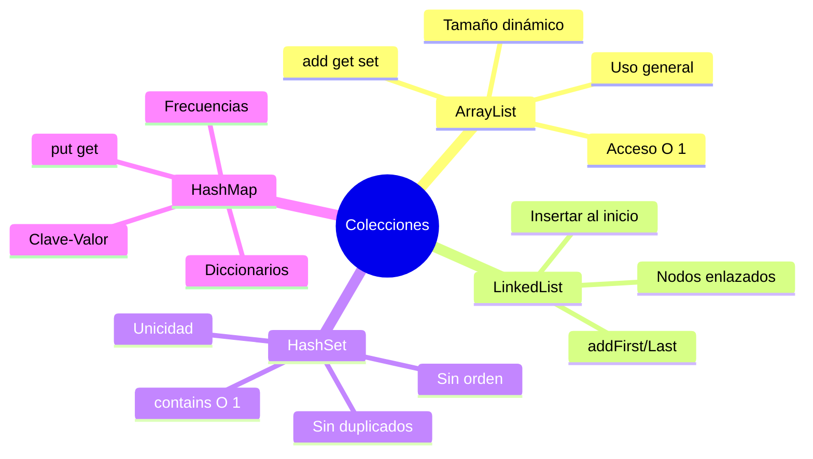

# 📦 Colecciones Dinámicas (ArrayList, etc.)

## 🎯 Introducción

> [!info]- 💡 ¿Qué son las Colecciones?
> 
> Las **colecciones** son estructuras de datos que almacenan y organizan grupos de objetos de forma dinámica. A diferencia de los arreglos, pueden **crecer y reducirse** automáticamente según sea necesario.
> 
> **Analogía del mundo real:** Piensa en las colecciones como:
> 
> - **ArrayList** → Playlist de música que puede crecer sin límite
> - **LinkedList** → Tren de vagones donde se pueden añadir/quitar vagones fácilmente
> - **HashSet** → Conjunto de llaves únicas (no duplicados)
> - **HashMap** → Diccionario (palabra → definición)
> 
> **Problema que resuelven:**
> 
> ```mermaid
> graph TB
>     A[Arreglo Estático] --> B[❌ Tamaño fijo<br/>new int 5]
>     A --> C[❌ No se puede<br/>cambiar tamaño]
>     A --> D[❌ Operaciones<br/>manuales]
>     
>     E[ArrayList Dinámico] --> F[✅ Tamaño flexible<br/>crece automáticamente]
>     E --> G[✅ Métodos<br/>incorporados]
>     E --> H[✅ Fácil de usar<br/>add, remove, etc]
>     
>     style B fill:#ffe1e1
>     style C fill:#ffe1e1
>     style D fill:#ffe1e1
>     style F fill:#e1ffe1
>     style G fill:#e1ffe1
>     style H fill:#e1ffe1
> ```
> 
> **Comparación rápida:**
> 
> |Aspecto|Arreglo|ArrayList|
> |---|---|---|
> |**Tamaño**|Fijo al crear|Dinámico (crece automáticamente)|
> |**Sintaxis**|`int[] arr = new int[5]`|`ArrayList<Integer> list = new ArrayList<>()`|
> |**Tipo**|Primitivos y objetos|Solo objetos (usar Wrappers)|
> |**Métodos**|`.length` (propiedad)|`.add()`, `.remove()`, `.get()`, `.size()`|
> |**Rendimiento**|⚡ Más rápido|⚠️ Ligero overhead|
> |**Flexibilidad**|⚠️ Limitada|✅ Alta|

---

## 📋 ArrayList - La Colección Fundamental

### 🔨 Declaración y Creación

> [!tip]- 🎨 Sintaxis Básica
> 
> **Importar la clase:**
> 
> ```java
> import java.util.ArrayList;
> ```
> 
> **Formas de declarar:**
> 
> ```java
> // Forma 1: Sin capacidad inicial
> ArrayList<String> nombres = new ArrayList<>();
> 
> // Forma 2: Con capacidad inicial (optimización)
> ArrayList<Integer> numeros = new ArrayList<>(100);
> 
> // Forma 3: Desde otra colección
> ArrayList<String> copia = new ArrayList<>(nombres);
> 
> // ⚠️ Sintaxis antigua (antes de Java 7)
> ArrayList<String> legacy = new ArrayList<String>();  // Redundante
> 
> // ✅ Sintaxis moderna (Java 7+) - Diamond operator
> ArrayList<String> moderno = new ArrayList<>();  // Recomendado
> ```
> 
> **Ejemplos con diferentes tipos:**
> 
> ```java
> // ArrayList de Strings
> ArrayList<String> frutas = new ArrayList<>();
> 
> // ArrayList de Integers (NO int)
> ArrayList<Integer> edades = new ArrayList<>();
> 
> // ArrayList de Doubles
> ArrayList<Double> precios = new ArrayList<>();
> 
> // ArrayList de objetos personalizados
> ArrayList<Estudiante> estudiantes = new ArrayList<>();
> 
> // ❌ ERROR - no se pueden usar primitivos
> // ArrayList<int> numeros = new ArrayList<>();  // ❌ Error de compilación
> 
> // ✅ CORRECTO - usar Wrapper
> ArrayList<Integer> numeros = new ArrayList<>();  // ✅
> ```
> 
> **Visualización interna:**
> 
> ```mermaid
> graph TB
>     A[ArrayList Vacío<br/>size = 0] --> B[Capacidad inicial<br/>10 espacios]
>     
>     C[Agregar elementos] --> D[size = 1, 2, 3...]
>     
>     D --> E{¿Capacidad<br/>llena?}
>     E -->|No| F[Agregar<br/>normalmente]
>     E -->|Sí| G[Crear array<br/>más grande]
>     G --> H[Copiar elementos]
>     H --> I[Capacidad x 1.5]
>     
>     style A fill:#e1f5ff
>     style G fill:#fff4e1
>     style I fill:#e1ffe1
> ```

### ➕ Operaciones Básicas

> [!success]- 🔧 Métodos Fundamentales
> 
> **1. Agregar elementos:**
> 
> ```java
> ArrayList<String> frutas = new ArrayList<>();
> 
> // add(elemento) - agrega al final
> frutas.add("Manzana");
> frutas.add("Banana");
> frutas.add("Naranja");
> System.out.println(frutas);  // [Manzana, Banana, Naranja]
> 
> // add(indice, elemento) - agrega en posición específica
> frutas.add(1, "Fresa");  // Inserta en posición 1
> System.out.println(frutas);  // [Manzana, Fresa, Banana, Naranja]
> 
> // Agregar múltiples
> frutas.add("Uva");
> frutas.add("Pera");
> ```
> 
> **2. Acceder a elementos:**
> 
> ```java
> ArrayList<String> frutas = new ArrayList<>();
> frutas.add("Manzana");
> frutas.add("Banana");
> frutas.add("Naranja");
> 
> // get(indice) - obtener elemento
> String primera = frutas.get(0);      // "Manzana"
> String segunda = frutas.get(1);      // "Banana"
> 
> // size() - tamaño actual
> int total = frutas.size();           // 3
> 
> // isEmpty() - verificar si está vacío
> boolean vacio = frutas.isEmpty();    // false
> 
> // Último elemento
> String ultima = frutas.get(frutas.size() - 1);  // "Naranja"
> ```
> 
> **3. Modificar elementos:**
> 
> ```java
> ArrayList<Integer> numeros = new ArrayList<>();
> numeros.add(10);
> numeros.add(20);
> numeros.add(30);
> 
> // set(indice, nuevoValor) - reemplazar
> numeros.set(1, 25);  // Cambia 20 por 25
> System.out.println(numeros);  // [10, 25, 30]
> ```
> 
> **4. Eliminar elementos:**
> 
> ```java
> ArrayList<String> colores = new ArrayList<>();
> colores.add("Rojo");
> colores.add("Verde");
> colores.add("Azul");
> colores.add("Verde");
> 
> // remove(indice) - elimina por posición
> colores.remove(0);  // Elimina "Rojo"
> System.out.println(colores);  // [Verde, Azul, Verde]
> 
> // remove(objeto) - elimina primera ocurrencia
> colores.remove("Verde");  // Elimina primer "Verde"
> System.out.println(colores);  // [Azul, Verde]
> 
> // clear() - vaciar completamente
> colores.clear();
> System.out.println(colores.size());  // 0
> ```
> 
> **5. Buscar elementos:**
> 
> ```java
> ArrayList<String> nombres = new ArrayList<>();
> nombres.add("Ana");
> nombres.add("Luis");
> nombres.add("María");
> nombres.add("Luis");
> 
> // contains(objeto) - verificar existencia
> boolean existe = nombres.contains("Ana");     // true
> boolean noExiste = nombres.contains("Pedro"); // false
> 
> // indexOf(objeto) - primera posición
> int posicion = nombres.indexOf("Luis");       // 1
> 
> // lastIndexOf(objeto) - última posición
> int ultima = nombres.lastIndexOf("Luis");     // 3
> 
> // Retorna -1 si no encuentra
> int noEncontrado = nombres.indexOf("Pedro");  // -1
> ```
> 
> **Tabla de métodos principales:**
> 
> |Método|Función|Ejemplo|Retorno|
> |---|---|---|---|
> |`add(E)`|Agregar al final|`list.add("X")`|`boolean`|
> |`add(int, E)`|Insertar en posición|`list.add(0, "X")`|`void`|
> |`get(int)`|Obtener elemento|`list.get(0)`|`E`|
> |`set(int, E)`|Modificar elemento|`list.set(0, "Y")`|`E`|
> |`remove(int)`|Eliminar por índice|`list.remove(0)`|`E`|
> |`remove(Object)`|Eliminar por valor|`list.remove("X")`|`boolean`|
> |`size()`|Tamaño actual|`list.size()`|`int`|
> |`isEmpty()`|¿Está vacío?|`list.isEmpty()`|`boolean`|
> |`contains(Object)`|¿Contiene elemento?|`list.contains("X")`|`boolean`|
> |`indexOf(Object)`|Primera posición|`list.indexOf("X")`|`int`|
> |`clear()`|Vaciar lista|`list.clear()`|`void`|

### 🔄 Recorrer ArrayList

> [!example]- 🚶 Formas de Iterar
> 
> **1. For tradicional:**
> 
> ```java
> ArrayList<String> frutas = new ArrayList<>();
> frutas.add("Manzana");
> frutas.add("Banana");
> frutas.add("Naranja");
> 
> // Acceso por índice
> for (int i = 0; i < frutas.size(); i++) {
>     System.out.println(i + ": " + frutas.get(i));
> }
> // Salida:
> // 0: Manzana
> // 1: Banana
> // 2: Naranja
> ```
> 
> **2. For-each (enhanced for):**
> 
> ```java
> // Más simple cuando solo necesitas los elementos
> for (String fruta : frutas) {
>     System.out.println(fruta);
> }
> ```
> 
> **3. forEach con lambda (Java 8+):**
> 
> ```java
> // Estilo funcional
> frutas.forEach(fruta -> System.out.println(fruta));
> 
> // Aún más conciso con method reference
> frutas.forEach(System.out::println);
> ```
> 
> **4. Iterator:**
> 
> ```java
> import java.util.Iterator;
> 
> Iterator<String> it = frutas.iterator();
> while (it.hasNext()) {
>     String fruta = it.next();
>     System.out.println(fruta);
>     
>     // Permite eliminar durante la iteración
>     if (fruta.equals("Banana")) {
>         it.remove();  // Seguro eliminar así
>     }
> }
> ```
> 
> **Comparación de métodos:**
> 
> |Método|Ventajas|Desventajas|Uso recomendado|
> |---|---|---|---|
> |**For tradicional**|Acceso a índice, modificar|Más verboso|Cuando necesitas el índice|
> |**For-each**|Simple y claro|No da índice|Solo lectura|
> |**forEach lambda**|Muy conciso|No da índice|Operaciones simples|
> |**Iterator**|Permite eliminar|Más complejo|Eliminar durante iteración|
> 
> **Ejemplo combinado:**
> 
> ```java
> public class EjemploRecorridos {
>     public static void main(String[] args) {
>         ArrayList<Integer> numeros = new ArrayList<>();
>         numeros.add(10);
>         numeros.add(20);
>         numeros.add(30);
>         numeros.add(40);
>         
>         // 1. Modificar elementos - usar for tradicional
>         for (int i = 0; i < numeros.size(); i++) {
>             numeros.set(i, numeros.get(i) * 2);
>         }
>         System.out.println("Duplicados: " + numeros);  // [20, 40, 60, 80]
>         
>         // 2. Solo mostrar - usar for-each
>         System.out.print("Elementos: ");
>         for (Integer num : numeros) {
>             System.out.print(num + " ");
>         }
>         System.out.println();
>         
>         // 3. Eliminar condicional - usar iterator
>         Iterator<Integer> it = numeros.iterator();
>         while (it.hasNext()) {
>             if (it.next() > 50) {
>                 it.remove();
>             }
>         }
>         System.out.println("Filtrados: " + numeros);  // [20, 40]
>     }
> }
> ```

---

## 🔗 LinkedList - Lista Enlazada

### 📌 Características

> [!info]- 🔗 Diferencia con ArrayList
> 
> **Estructura interna:**
> 
> ```mermaid
> graph LR
>     subgraph ArrayList
>         A1[0: Ana] --> A2[1: Luis] --> A3[2: María]
>         A4[Array continuo en memoria]
>     end
>     
>     subgraph LinkedList
>         L1[Ana] -.->|next| L2[Luis] -.->|next| L3[María]
>         L2 -.->|prev| L1
>         L3 -.->|prev| L2
>         L4[Nodos enlazados]
>     end
>     
>     style A1 fill:#e1f5ff
>     style L1 fill:#fff4e1
> ```
> 
> **Comparación de rendimiento:**
> 
> |Operación|ArrayList|LinkedList|
> |---|---|---|
> |**get(índice)**|⚡ O(1) - Muy rápido|🐌 O(n) - Lento|
> |**add() al final**|⚡ O(1) - Rápido|⚡ O(1) - Rápido|
> |**add(índice)**|🐌 O(n) - Desplazar elementos|⚡ O(n) - Buscar + insertar|
> |**remove(índice)**|🐌 O(n) - Desplazar|⚡ O(n) - Buscar + eliminar|
> |**remove() al inicio**|🐌 O(n) - Muy lento|⚡ O(1) - Muy rápido|
> |**Uso de memoria**|✅ Eficiente|⚠️ Más memoria (enlaces)|
> 
> **Uso básico:**
> 
> ```java
> import java.util.LinkedList;
> 
> LinkedList<String> lista = new LinkedList<>();
> 
> // Mismos métodos que ArrayList
> lista.add("Primero");
> lista.add("Segundo");
> lista.add("Tercero");
> 
> // Métodos adicionales de LinkedList
> lista.addFirst("Inicio");    // Agregar al inicio
> lista.addLast("Final");      // Agregar al final
> 
> String primero = lista.getFirst();  // Obtener primero
> String ultimo = lista.getLast();    // Obtener último
> 
> lista.removeFirst();  // Eliminar primero
> lista.removeLast();   // Eliminar último
> 
> System.out.println(lista);
> ```
> 
> **Cuándo usar cada una:**
> 
> ```mermaid
> flowchart TD
>     A{Tipo de<br/>operación?} --> B[Acceso aleatorio<br/>frecuente]
>     A --> C[Inserción/eliminación<br/>al inicio]
>     A --> D[Agregar al final<br/>principalmente]
>     
>     B --> E[✅ ArrayList<br/>get es O 1]
>     C --> F[✅ LinkedList<br/>addFirst es O 1]
>     D --> E
>     
>     style E fill:#e1ffe1
>     style F fill:#fff4e1
> ```
> 
> **Recomendación general:**
> 
> - **Usa ArrayList** → 95% de los casos (mejor rendimiento general)
> - **Usa LinkedList** → Solo si insertas/eliminas frecuentemente al inicio

---

## 🎨 HashSet - Conjunto sin Duplicados

### 🔑 Características Únicas

> [!success]- 🎯 Colección sin Repetidos
> 
> **Propiedades del HashSet:**
> 
> ```mermaid
> graph TB
>     A[HashSet] --> B[❌ No permite duplicados]
>     A --> C[❌ No tiene orden]
>     A --> D[✅ Búsqueda muy rápida O 1]
>     A --> E[✅ Ideal para unicidad]
>     
>     style B fill:#fff4e1
>     style C fill:#fff4e1
>     style D fill:#e1ffe1
>     style E fill:#e1ffe1
> ```
> 
> **Uso básico:**
> 
> ```java
> import java.util.HashSet;
> 
> HashSet<String> colores = new HashSet<>();
> 
> // Agregar elementos
> colores.add("Rojo");
> colores.add("Verde");
> colores.add("Azul");
> colores.add("Rojo");     // ❌ No se agrega (duplicado)
> 
> System.out.println(colores.size());  // 3 (no 4)
> System.out.println(colores);         // [Azul, Rojo, Verde] (orden aleatorio)
> 
> // Verificar existencia
> boolean existe = colores.contains("Rojo");  // true
> 
> // Eliminar
> colores.remove("Verde");
> 
> // Recorrer (sin índice)
> for (String color : colores) {
>     System.out.println(color);
> }
> ```
> 
> **Caso de uso típico - eliminar duplicados:**
> 
> ```java
> public static ArrayList<Integer> eliminarDuplicados(ArrayList<Integer> lista) {
>     // Convertir a HashSet (elimina duplicados)
>     HashSet<Integer> sinDuplicados = new HashSet<>(lista);
>     
>     // Convertir de vuelta a ArrayList
>     return new ArrayList<>(sinDuplicados);
> }
> 
> // Uso
> ArrayList<Integer> numeros = new ArrayList<>();
> numeros.add(1);
> numeros.add(2);
> numeros.add(2);
> numeros.add(3);
> numeros.add(3);
> numeros.add(3);
> 
> ArrayList<Integer> unicos = eliminarDuplicados(numeros);
> System.out.println(unicos);  // [1, 2, 3]
> ```
> 
> **Métodos principales:**
> 
> |Método|Función|Complejidad|
> |---|---|---|
> |`add(E)`|Agregar (ignora duplicados)|O(1)|
> |`contains(Object)`|Verificar existencia|O(1)|
> |`remove(Object)`|Eliminar elemento|O(1)|
> |`size()`|Tamaño|O(1)|
> |`isEmpty()`|¿Está vacío?|O(1)|
> |`clear()`|Vaciar|O(n)|

---

## 🗺️ HashMap - Pares Clave-Valor

### 📚 Diccionarios en Java

> [!tip]- 🔐 Estructura Clave-Valor
> 
> **Concepto:**
> 
> ```mermaid
> graph LR
>     A[HashMap] --> B[Clave: DNI]
>     B --> C[Valor: Nombre]
>     
>     D["12345678"] --> E["Ana García"]
>     F["87654321"] --> G["Luis Pérez"]
>     H["11223344"] --> I["María López"]
>     
>     style A fill:#e1f5ff
>     style B fill:#fff4e1
>     style C fill:#e1ffe1
> ```
> 
> **Sintaxis básica:**
> 
> ```java
> import java.util.HashMap;
> 
> // HashMap<TipoClave, TipoValor>
> HashMap<String, Integer> edades = new HashMap<>();
> 
> // put(clave, valor) - agregar/actualizar
> edades.put("Ana", 25);
> edades.put("Luis", 30);
> edades.put("María", 28);
> edades.put("Ana", 26);  // Actualiza el valor de "Ana"
> 
> // get(clave) - obtener valor
> int edadAna = edades.get("Ana");  // 26
> 
> // containsKey(clave) - verificar si existe la clave
> boolean existe = edades.containsKey("Luis");  // true
> 
> // containsValue(valor) - verificar si existe el valor
> boolean hay30 = edades.containsValue(30);  // true
> 
> // remove(clave) - eliminar par
> edades.remove("Luis");
> 
> // size() - cantidad de pares
> int total = edades.size();  // 2
> ```
> 
> **Recorrer HashMap:**
> 
> ```java
> HashMap<String, Double> productos = new HashMap<>();
> productos.put("Laptop", 1200.00);
> productos.put("Mouse", 25.50);
> productos.put("Teclado", 80.00);
> 
> // Forma 1: Solo claves
> for (String producto : productos.keySet()) {
>     System.out.println(producto);
> }
> 
> // Forma 2: Solo valores
> for (Double precio : productos.values()) {
>     System.out.println("$" + precio);
> }
> 
> // Forma 3: Pares clave-valor (recomendado)
> for (Map.Entry<String, Double> entry : productos.entrySet()) {
>     String producto = entry.getKey();
>     Double precio = entry.getValue();
>     System.out.println(producto + ": $" + precio);
> }
> 
> // Forma 4: forEach con lambda (Java 8+)
> productos.forEach((producto, precio) -> 
>     System.out.println(producto + ": $" + precio)
> );
> ```
> 
> **Ejemplo práctico - contador de frecuencias:**
> 
> ```java
> public static HashMap<String, Integer> contarPalabras(String texto) {
>     HashMap<String, Integer> frecuencias = new HashMap<>();
>     
>     String[] palabras = texto.toLowerCase().split("\\s+");
>     
>     for (String palabra : palabras) {
>         // getOrDefault: si no existe, retorna 0
>         int count = frecuencias.getOrDefault(palabra, 0);
>         frecuencias.put(palabra, count + 1);
>     }
>     
>     return frecuencias;
> }
> 
> // Uso
> String texto = "hola mundo hola java mundo mundo";
> HashMap<String, Integer> resultado = contarPalabras(texto);
> System.out.println(resultado);
> // {hola=2, mundo=3, java=1}
> ```
> 
> **Métodos útiles:**
> 
> |Método|Función|Ejemplo|
> |---|---|---|
> |`put(K, V)`|Agregar/actualizar|`map.put("key", 10)`|
> |`get(K)`|Obtener valor|`map.get("key")`|
> |`getOrDefault(K, V)`|Get con valor por defecto|`map.getOrDefault("x", 0)`|
> |`containsKey(K)`|¿Existe la clave?|`map.containsKey("key")`|
> |`containsValue(V)`|¿Existe el valor?|`map.containsValue(10)`|
> |`remove(K)`|Eliminar por clave|`map.remove("key")`|
> |`keySet()`|Conjunto de claves|`map.keySet()`|
> |`values()`|Colección de valores|`map.values()`|
> |`entrySet()`|Pares clave-valor|`map.entrySet()`|

---

## 📊 Comparación de Colecciones

### 🔍 Tabla Resumen

> [!note]- 📋 Cuándo Usar Cada Una
> 
> |Colección|Permite Duplicados|Ordenada|Acceso|Uso Principal|
> |---|---|---|---|---|
> |**ArrayList**|✅ Sí|✅ Por índice|`get(i)` O(1)|Lista general, acceso aleatorio|
> |**LinkedList**|✅ Sí|✅ Por índice|`get(i)` O(n)|Inserción/eliminación frecuente al inicio|
> |**HashSet**|❌ No|❌ No|`contains()` O(1)|Elementos únicos, búsqueda rápida|
> |**HashMap**|Claves únicas|❌ No|`get(key)` O(1)|Pares clave-valor, diccionarios|
> 
> **Árbol de decisión:**
> 
> ```mermaid
> flowchart TD
>     A{¿Qué necesitas?} --> B[Lista ordenada]
>     A --> C[Elementos únicos]
>     A --> D[Pares clave-valor]
>     
>     B --> E{¿Qué operaciones?}
>     E -->|Acceso por índice| F[ArrayList]
>     E -->|Insertar al inicio| G[LinkedList]
>     
>     C --> H[HashSet]
>     D --> I[HashMap]
>     
>     style F fill:#e1ffe1
>     style G fill:#fff4e1
>     style H fill:#e1f5ff
>     style I fill:#ffe1e1
> ```

---

## 🛠️ Operaciones Avanzadas

### 🔄 Conversiones entre Colecciones

> [!example]- 🔀 Transformaciones Comunes
> 
> **1. ArrayList ↔ Array:**
> 
> ```java
> // ArrayList → Array
> ArrayList<String> lista = new ArrayList<>();
> lista.add("A");
> lista.add("B");
> lista.add("C");
> 
> String[] array = lista.toArray(new String[0]);
> 
> // Array → ArrayList
> String[] arr = {"X", "Y", "Z"};
> ArrayList<String> nueva = new ArrayList<>(Arrays.asList(arr));
> ```
> 
> **2. ArrayList → HashSet (eliminar duplicados):**
> 
> ```java
> ArrayList<Integer> conDuplicados = new ArrayList<>();
> conDuplicados.add(1);
> conDuplicados.add(2);
> conDuplicados.add(2);
> conDuplicados.add(3);
> 
> HashSet<Integer> unicos = new HashSet<>(conDuplicados);
> ArrayList<Integer> sinDuplicados = new ArrayList<>(unicos);
> ```
> 
> **3. HashMap → ArrayList:**
> 
> ```java
> HashMap<String, Integer> map = new HashMap<>();
> map.put("A", 1);
> map.put("B", 2);
> 
> // Solo claves
> ArrayList<String> claves = new ArrayList<>(map.keySet());
> 
> // Solo valores
> ArrayList<Integer> valores = new ArrayList<>(map.values());
> ```

### 🎯 Ordenamiento

> [!success]- ↕️ Ordenar Colecciones
> 
> **Ordenar ArrayList:**
> 
> ```java
> import java.util.Collections;
> 
> ArrayList<Integer> numeros = new ArrayList<>();
> numeros.add(5);
> numeros.add(2);
> numeros.add(8);
> numeros.add(1);
> 
> // Orden ascendente
> Collections.sort(numeros);
> System.out.println(numeros);  // [1, 2, 5, 8]
> 
> // Orden descendente
> Collections.sort(numeros, Collections.reverseOrder());
> System.out.println(numeros);  // [8, 5, 2, 1]
> 
> // Strings (orden alfabético)
> ArrayList<String> nombres = new ArrayList<>();
> nombres.add("Carlos");
> nombres.add("Ana");
> nombres.add("Beatriz");
> 
> Collections.sort(nombres);
> System.out.println(nombres);  // [Ana, Beatriz, Carlos]
> ```

---

## ⚠️ Errores Comunes

> [!danger]- 🐛 Problemas Frecuentes
> 
> **1. ConcurrentModificationException:**
> 
> ```java
> ArrayList<Integer> numeros = new ArrayList<>();
> numeros.add(1);
> numeros.add(2);
> numeros.add(3);
> 
> // ❌ ERROR - modificar mientras iteras
> for (Integer num : numeros) {
>     if (num == 2) {
>         numeros.remove(num);  // ❌ ConcurrentModificationException
>     }
> }
> 
> // ✅ SOLUCIÓN 1 - usar Iterator
> Iterator<Integer> it = numeros.iterator();
> while (it.hasNext()) {
>     if (it.next() == 2. {
>     it.remove();  // ✅ Seguro
> }
> 
> 
> }
> 
> // ✅ SOLUCIÓN 2 - removeIf (Java 8+) numeros.removeIf(num -> num == 2);
> 
> ````
> 
> **2. IndexOutOfBoundsException:**
> 
> ```java
> ArrayList<String> lista = new ArrayList<>();
> lista.add("A");
> lista.add("B");
> 
> // ❌ ERROR - índice 2 no existe
> String elemento = lista.get(2);  // ❌ IndexOutOfBoundsException
> 
> // ✅ SOLUCIÓN - validar antes
> int indice = 2;
> if (indice >= 0 && indice < lista.size()) {
>     String elem = lista.get(indice);
> }
> ````
> 
> **3. NullPointerException:**
> 
> ```java
> ArrayList<String> lista = null;
> 
> // ❌ ERROR - lista no inicializada
> lista.add("X");  // ❌ NullPointerException
> 
> // ✅ SOLUCIÓN - inicializar
> ArrayList<String> lista = new ArrayList<>();
> lista.add("X");  // ✅ OK
> ```

---

## 📊 Resumen Visual



> [!quote]- 🎓 Puntos Clave para Recordar
> 
> ✅ **ArrayList** - uso general, tamaño dinámico, acceso rápido por índice  
> ✅ **LinkedList** - solo si insertas/eliminas al inicio frecuentemente  
> ✅ **HashSet** - elementos únicos, sin orden, búsqueda O(1)  
> ✅ **HashMap** - pares clave-valor, diccionarios, contadores  
> ✅ **Solo objetos** - usar Wrappers para primitivos  
> ✅ **size() es método** - con paréntesis, no como array.length  
> ✅ **Iterator** - para eliminar durante iteración  
> ✅ **Collections.sort()** - para ordenar ArrayList

---

**Tags:** #java #colecciones #arraylist #linkedlist #hashset #hashmap #estructuras-datos #collections #generics #iteradores
