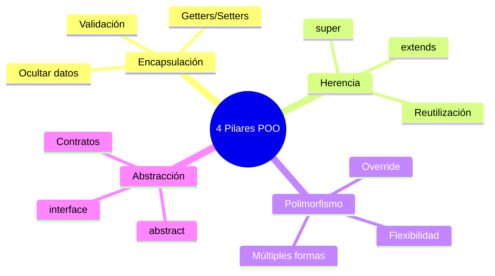
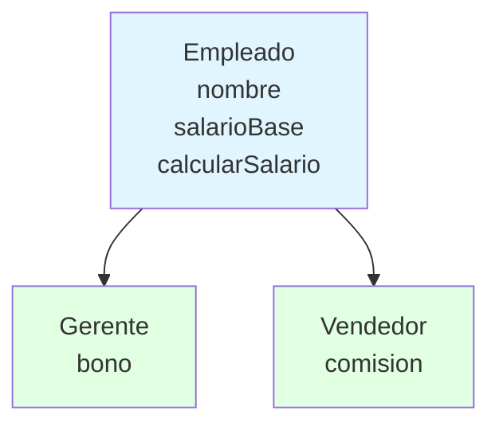
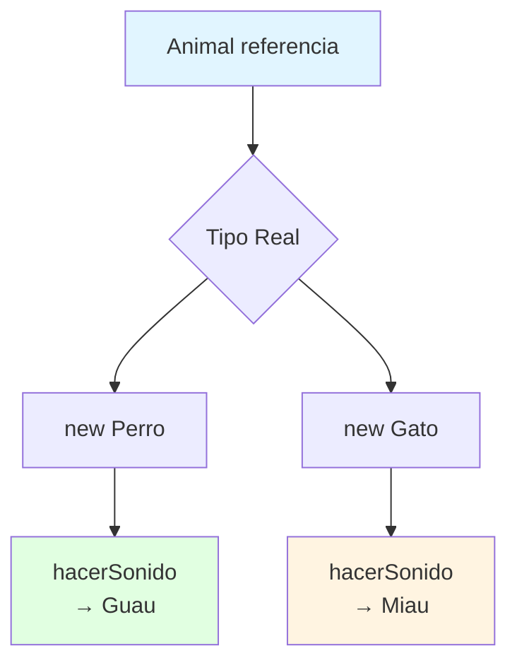
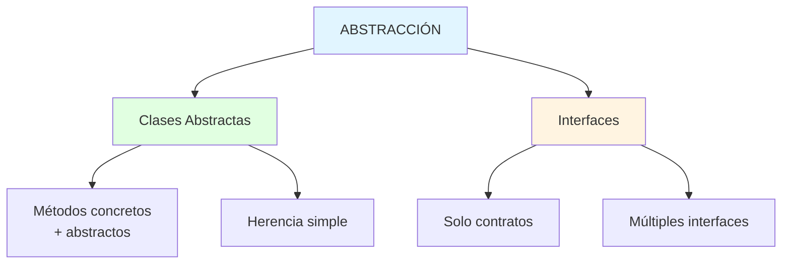
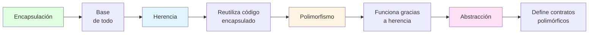
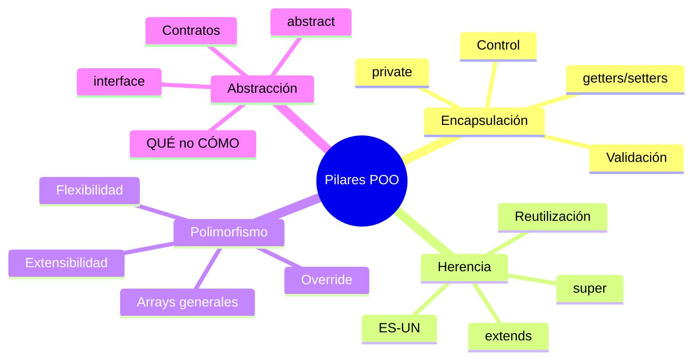

# 🏛️ Pilares de la Programación Orientada a Objetos

## 🎯 Introducción

> [!info]- 💡 ¿Qué son los Pilares de la POO?
> 
> Los **4 pilares fundamentales** son principios de diseño que estructuran cómo organizamos y relacionamos clases y objetos. Son la base conceptual que distingue la POO de otros paradigmas.
> 
> **¿Por qué son importantes?**
> 
> |Pilar|Problema que Resuelve|Resultado|
> |---|---|---|
> |**Encapsulación**|Datos desprotegidos y modificables desde cualquier lugar|✅ Control total sobre el acceso|
> |**Herencia**|Duplicación de código entre clases similares|✅ Reutilización y jerarquías lógicas|
> |**Polimorfismo**|Código rígido que no se adapta a nuevos tipos|✅ Flexibilidad y extensibilidad|
> |**Abstracción**|Complejidad expuesta innecesariamente|✅ Interfaces simples y claras|



---

## 🔒 Pilar 1: ENCAPSULACIÓN

### 📦 Concepto

> [!tip]- 🛡️ ¿Qué es la Encapsulación?
> 
> La **encapsulación** es el principio de **ocultar los detalles internos** de un objeto y exponer solo lo necesario a través de una interfaz pública.
> 
> **Regla fundamental:**
> 
> - Atributos: `private` ❌ (no accesibles directamente)
> - Métodos de acceso: `public` ✅ (getters, setters con validación)
> 
> **Beneficios:**
> 
> |Beneficio|Sin Encapsulación|Con Encapsulación|
> |---|---|---|
> |**Seguridad**|🚫 Datos modificables desde cualquier lugar|✅ Control total sobre quién y cómo accede|
> |**Validación**|🚫 Datos pueden ser inválidos|✅ Validación garantizada en cada modificación|
> |**Mantenimiento**|🚫 Cambios afectan todo el código|✅ Cambios internos no afectan el exterior|

### 🛠️ Implementación

> [!example]- 💰 Ejemplo: Cuenta Bancaria
> 
> **❌ SIN encapsulación:**
> 
> ```java
> public class CuentaBancaria {
>     public double saldo;  // ¡Peligro! Acceso directo
> }
> 
> // Uso problemático:
> CuentaBancaria cuenta = new CuentaBancaria();
> cuenta.saldo = -5000;  // 🚫 ¡Saldo negativo sin control!
> ```
> 
> **✅ CON encapsulación:**
> 
> ```java
> public class CuentaBancaria {
>     // 🔒 Datos privados
>     private double saldo;
>     private String titular;
>     
>     public CuentaBancaria(String titular) {
>         this.titular = titular;
>         this.saldo = 0.0;
>     }
>     
>     // 👁️ Solo lectura
>     public double getSaldo() {
>         return saldo;
>     }
>     
>     // ✅ Modificación con validación
>     public boolean depositar(double monto) {
>         if (monto <= 0) {
>             System.out.println("❌ Monto debe ser positivo");
>             return false;
>         }
>         saldo += monto;
>         return true;
>     }
>     
>     public boolean retirar(double monto) {
>         if (monto <= 0 || monto > saldo) {
>             System.out.println("❌ Operación inválida");
>             return false;
>         }
>         saldo -= monto;
>         return true;
>     }
> }
> ```
> 
> **Uso correcto:**
> 
> ```java
> CuentaBancaria cuenta = new CuentaBancaria("Juan");
> cuenta.depositar(1000);    // ✅ Depósito válido
> cuenta.retirar(1500);      // ❌ Saldo insuficiente
> // cuenta.saldo = -5000;   // ❌ Error de compilación
> ```

---

## 👪 Pilar 2: HERENCIA

### 🌳 Concepto

> [!tip]- 🧬 ¿Qué es la Herencia?
> 
> La **herencia** permite crear nuevas clases basadas en clases existentes, **reutilizando** y **extendiendo** su funcionalidad. Es una relación **"ES-UN"** (is-a).
> 
> **Ejemplos de relación "ES-UN":**
> 
> - Un **Gerente** ES-UN **Empleado** ✅
> - Un **Perro** ES-UN **Animal** ✅
> - Un **Coche** TIENE-UN **Motor** ❌ (composición, no herencia)
> 
> **Terminología:**
> 
> |Término|Descripción|
> |---|---|
> |**Superclase**|Clase padre de la que se hereda|
> |**Subclase**|Clase hija que hereda|
> |**extends**|Palabra clave para heredar|
> |**super**|Referencia a la superclase|



### 🛠️ Implementación

> [!example]- 👔 Ejemplo: Jerarquía de Empleados
> 
> **Superclase:**
> 
> ```java
> public class Empleado {
>     protected String nombre;
>     protected double salarioBase;
>     
>     public Empleado(String nombre, double salarioBase) {
>         this.nombre = nombre;
>         this.salarioBase = salarioBase;
>     }
>     
>     public double calcularSalario() {
>         return salarioBase;
>     }
>     
>     public void mostrarInfo() {
>         System.out.println("Empleado: " + nombre);
>         System.out.println("Salario: $" + calcularSalario());
>     }
> }
> ```
> 
> **Subclase:**
> 
> ```java
> public class Gerente extends Empleado {
>     private double bono;
>     
>     public Gerente(String nombre, double salarioBase, double bono) {
>         super(nombre, salarioBase);  // 🔑 Llamar constructor padre
>         this.bono = bono;
>     }
>     
>     @Override
>     public double calcularSalario() {
>         return salarioBase + bono;
>     }
>     
>     @Override
>     public void mostrarInfo() {
>         super.mostrarInfo();  // Reutilizar código del padre
>         System.out.println("Bono: $" + bono);
>     }
> }
> ```
> 
> **Uso:**
> 
> ```java
> Empleado emp = new Empleado("Juan", 2000);
> Gerente ger = new Gerente("Ana", 3000, 500);
> 
> emp.mostrarInfo();  
> // Empleado: Juan
> // Salario: $2000
> 
> ger.mostrarInfo();  
> // Empleado: Ana
> // Salario: $3500
> // Bono: $500
> ```

> [!warning]- ⚠️ Puntos Importantes
> 
> **1. Java solo permite herencia simple:**
> 
> ```java
> // ✅ CORRECTO
> class Gerente extends Empleado { }
> 
> // ❌ INCORRECTO
> class Gerente extends Empleado, Persona { }  // Error
> ```
> 
> **2. `super()` debe ser la primera línea:**
> 
> ```java
> public Gerente(String nombre, double salario, double bono) {
>     super(nombre, salario);  // ✅ Primera línea
>     this.bono = bono;
> }
> ```
> 
> **3. Usar `@Override` siempre:**
> 
> ```java
> @Override  // ✅ Buena práctica
> public double calcularSalario() {
>     return salarioBase + bono;
> }
> ```

---

## 🎭 Pilar 3: POLIMORFISMO

### 🔄 Concepto

> [!tip]- 🎨 ¿Qué es el Polimorfismo?
> 
> El **polimorfismo** permite que objetos de diferentes clases sean tratados como objetos de una clase común, pero **comportándose de manera específica** según su tipo real.
> 
> **Clave:** Referencia de tipo general → Objeto de tipo específico
> 
> **Analogía:** Un control remoto (interfaz) funciona con diferentes dispositivos (TV, reproductor, aire) - mismo botón "encender", diferente comportamiento.



### 🛠️ Implementación

> [!example]- 🐾 Ejemplo: Polimorfismo en Acción
> 
> **Jerarquía:**
> 
> ```java
> public class Animal {
>     protected String nombre;
>     
>     public Animal(String nombre) {
>         this.nombre = nombre;
>     }
>     
>     public void hacerSonido() {
>         System.out.println("El animal hace un sonido");
>     }
> }
> 
> public class Perro extends Animal {
>     public Perro(String nombre) {
>         super(nombre);
>     }
>     
>     @Override
>     public void hacerSonido() {
>         System.out.println(nombre + ": ¡Guau!");
>     }
> }
> 
> public class Gato extends Animal {
>     public Gato(String nombre) {
>         super(nombre);
>     }
>     
>     @Override
>     public void hacerSonido() {
>         System.out.println(nombre + ": ¡Miau!");
>     }
> }
> ```
> 
> **✨ La magia del polimorfismo:**
> 
> ```java
> // 🎭 Mismo tipo de referencia, diferentes objetos
> Animal a1 = new Perro("Max");
> Animal a2 = new Gato("Luna");
> 
> a1.hacerSonido();  // Max: ¡Guau!
> a2.hacerSonido();  // Luna: ¡Miau!
> 
> // ✅ Array polimórfico
> Animal[] animales = {
>     new Perro("Rex"),
>     new Gato("Michi"),
>     new Perro("Toby")
> };
> 
> for (Animal animal : animales) {
>     animal.hacerSonido();  // Cada uno según su tipo real
> }
> // Rex: ¡Guau!
> // Michi: ¡Miau!
> // Toby: ¡Guau!
> ```

> [!success]- 🚀 Ventajas del Polimorfismo
> 
> **1. Código extensible sin modificar existente:**
> 
> ```java
> // Agregar nueva subclase
> public class Vaca extends Animal {
>     @Override
>     public void hacerSonido() {
>         System.out.println(nombre + ": ¡Muuu!");
>     }
> }
> 
> // ✅ El código anterior sigue funcionando
> Animal vaca = new Vaca("Lola");
> vaca.hacerSonido();  // Lola: ¡Muuu!
> ```
> 
> **2. Métodos genéricos:**
> 
> ```java
> public void examinarAnimal(Animal animal) {
>     animal.hacerSonido();  // Funciona con CUALQUIER Animal
> }
> 
> examinarAnimal(new Perro("Max"));  // ✅
> examinarAnimal(new Gato("Luna"));  // ✅
> examinarAnimal(new Vaca("Lola"));  // ✅
> ```

---

## 🎨 Pilar 4: ABSTRACCIÓN

### 🌟 Concepto

> [!tip]- 🎯 ¿Qué es la Abstracción?
> 
> La **abstracción** es el proceso de **ocultar los detalles de implementación** y mostrar solo la funcionalidad esencial. Define **QUÉ** hace algo, no **CÓMO** lo hace.
> 
> **Mecanismos en Java:**
> 
> |Mecanismo|Uso|Nivel|
> |---|---|---|
> |**Clases Abstractas**|Herencia con métodos parcialmente implementados|Medio|
> |**Interfaces**|Contratos puros - solo definiciones|Alto|



### 🛠️ Clases Abstractas

> [!example]- 🏗️ Implementación
> 
> **Definición:**
> 
> ```java
> // ❌ No se puede instanciar directamente
> public abstract class FiguraGeometrica {
>     protected String color;
>     
>     public FiguraGeometrica(String color) {
>         this.color = color;
>     }
>     
>     // ✅ Métodos abstractos - SIN implementación
>     public abstract double calcularArea();
>     public abstract double calcularPerimetro();
>     
>     // ✅ Método concreto - compartido por subclases
>     public void mostrarInfo() {
>         System.out.println("Color: " + color);
>         System.out.println("Área: " + calcularArea());
>     }
> }
> ```
> 
> **Subclases concretas:**
> 
> ```java
> public class Circulo extends FiguraGeometrica {
>     private double radio;
>     
>     public Circulo(String color, double radio) {
>         super(color);
>         this.radio = radio;
>     }
>     
>     @Override
>     public double calcularArea() {
>         return Math.PI * radio * radio;
>     }
>     
>     @Override
>     public double calcularPerimetro() {
>         return 2 * Math.PI * radio;
>     }
> }
> 
> public class Rectangulo extends FiguraGeometrica {
>     private double base;
>     private double altura;
>     
>     public Rectangulo(String color, double base, double altura) {
>         super(color);
>         this.base = base;
>         this.altura = altura;
>     }
>     
>     @Override
>     public double calcularArea() {
>         return base * altura;
>     }
>     
>     @Override
>     public double calcularPerimetro() {
>         return 2 * (base + altura);
>     }
> }
> ```
> 
> **Uso:**
> 
> ```java
> // ❌ IMPOSIBLE
> // FiguraGeometrica fig = new FiguraGeometrica("rojo");
> 
> // ✅ CORRECTO
> FiguraGeometrica circulo = new Circulo("rojo", 5);
> FiguraGeometrica rect = new Rectangulo("azul", 4, 6);
> 
> circulo.mostrarInfo();
> // Color: rojo
> // Área: 78.54
> ```

### 🛠️ Interfaces

> [!example]- 🔌 Implementación de Interfaces
> 
> **Definición:**
> 
> ```java
> public interface Volador {
>     void despegar();
>     void volar();
>     void aterrizar();
> }
> 
> public interface Nadador {
>     void nadar();
> }
> ```
> 
> **Implementación:**
> 
> ```java
> // ✅ Múltiples interfaces
> public class Pato implements Volador, Nadador {
>     @Override
>     public void despegar() {
>         System.out.println("El pato despega del agua");
>     }
>     
>     @Override
>     public void volar() {
>         System.out.println("El pato vuela");
>     }
>     
>     @Override
>     public void aterrizar() {
>         System.out.println("El pato aterriza");
>     }
>     
>     @Override
>     public void nadar() {
>         System.out.println("El pato nada");
>     }
> }
> ```
> 
> **Uso polimórfico:**
> 
> ```java
> Volador v = new Pato();
> v.volar();  // El pato vuela
> 
> Nadador n = new Pato();
> n.nadar();  // El pato nada
> ```

> [!info]- 📊 Clase Abstracta vs Interface
> 
> |Aspecto|Clase Abstracta|Interface|
> |---|---|---|
> |**Herencia**|Solo una|Múltiples|
> |**Métodos**|Concretos y abstractos|Solo abstractos|
> |**Constructores**|✅ Puede tener|❌ No puede|
> |**Atributos**|Cualquier tipo|Solo constantes|
> |**Cuándo usar**|Código compartido + contrato|Solo contrato/capacidad|
> 
> **Regla práctica:**
> 
> - Clase abstracta: "ES-UN" con código común
> - Interface: "PUEDE-HACER" (capacidad)

---

## 🔗 Relación entre los Pilares



> [!example]- 🚗 Ejemplo Integrador
> 
> ```java
> // ABSTRACCIÓN - Define contrato
> public abstract class Vehiculo {
>     private String marca;  // ENCAPSULACIÓN
>     
>     public Vehiculo(String marca) {
>         this.marca = marca;
>     }
>     
>     public abstract void acelerar();
>     
>     public String getMarca() {
>         return marca;
>     }
> }
> 
> // HERENCIA - Reutiliza y especializa
> public class Coche extends Vehiculo {
>     public Coche(String marca) {
>         super(marca);
>     }
>     
>     @Override
>     public void acelerar() {
>         System.out.println("Coche " + getMarca() + " acelera suavemente");
>     }
> }
> 
> public class Moto extends Vehiculo {
>     public Moto(String marca) {
>         super(marca);
>     }
>     
>     @Override
>     public void acelerar() {
>         System.out.println("Moto " + getMarca() + " acelera rápido");
>     }
> }
> 
> // POLIMORFISMO - Flexibilidad
> Vehiculo[] garage = {
>     new Coche("Toyota"),
>     new Moto("Yamaha")
> };
> 
> for (Vehiculo v : garage) {
>     v.acelerar();  // Comportamiento según tipo real
> }
> ```

---

## 📊 Resumen Visual



> [!success]- ✅ Checklist de Aplicación
> 
> **Encapsulación:** SIEMPRE
> 
> - ✅ Atributos `private`
> - ✅ Getters/setters con validación
> 
> **Herencia:** Relación "ES-UN"
> 
> - ✅ Gerente ES-UN Empleado
> - ❌ Coche TIENE-UN Motor (composición)
> 
> **Polimorfismo:** Con herencia/interfaces
> 
> - ✅ Arrays de tipo general
> - ✅ Métodos que aceptan superclase
> 
> **Abstracción:** Contratos y jerarquías
> 
> - ✅ Clase abstracta: código común + abstracto
> - ✅ Interface: solo capacidades

---

## 🎯 Ejemplo Final Completo

> [!example]- 💳 Sistema Bancario Integrador
> 
> ```java
> // ABSTRACCIÓN + ENCAPSULACIÓN
> public abstract class CuentaBancaria {
>     private String titular;        // ENCAPSULACIÓN
>     protected double saldo;
>     
>     public CuentaBancaria(String titular) {
>         this.titular = titular;
>         this.saldo = 0;
>     }
>     
>     // Método abstracto
>     public abstract double calcularInteres();
>     
>     public void depositar(double monto) {
>         if (monto > 0) saldo += monto;
>     }
>     
>     public double getSaldo() { 
>         return saldo; 
>     }
>     
>     public String getTitular() {
>         return titular;
>     }
> }
> 
> // HERENCIA
> public class CuentaAhorro extends CuentaBancaria {
>     private double tasaInteres;
>     
>     public CuentaAhorro(String titular, double tasa) {
>         super(titular);
>         this.tasaInteres = tasa;
>     }
>     
>     @Override
>     public double calcularInteres() {
>         return saldo * tasaInteres;
>     }
> }
> 
> public class CuentaCorriente extends CuentaBancaria {
>     public CuentaCorriente(String titular) {
>         super(titular);
>     }
>     
>     @Override
>     public double calcularInteres() {
>         return 0;  // Sin intereses
>     }
> }
> 
> // POLIMORFISMO en uso
> public class BancoApp {
>     public static void main(String[] args) {
>         // Array polimórfico
>         CuentaBancaria[] cuentas = {
>             new CuentaAhorro("Juan", 0.05),
>             new CuentaCorriente("Ana"),
>             new CuentaAhorro("Luis", 0.03)
>         };
>         
>         // Procesamiento uniforme
>         for (CuentaBancaria c : cuentas) {
>             c.depositar(1000);
>             System.out.println(c.getTitular() + 
>                 " - Interés: $" + c.calcularInteres());
>         }
>         // Juan - Interés: $50.0
>         // Ana - Interés: $0.0
>         // Luis - Interés: $30.0
>     }
> }
> ```

---

**Tags:** #poo #pilares #encapsulacion #herencia #polimorfismo #abstraccion #java #orientado-objetos