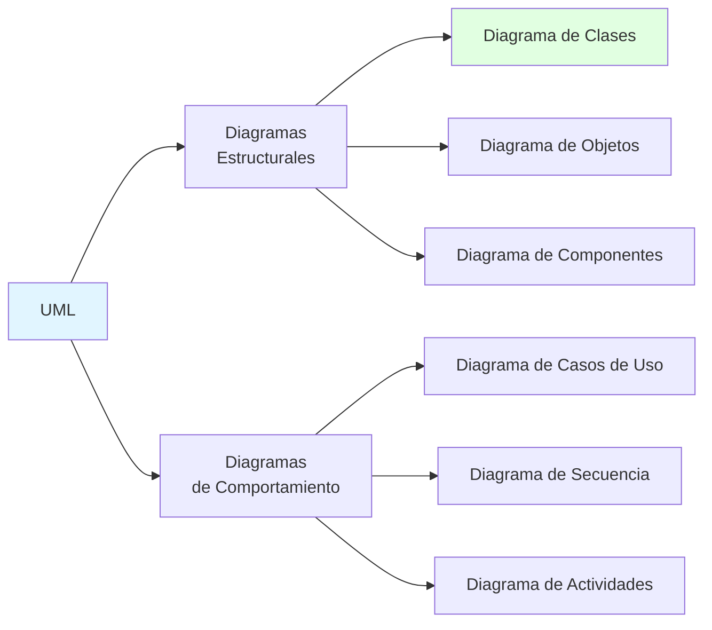
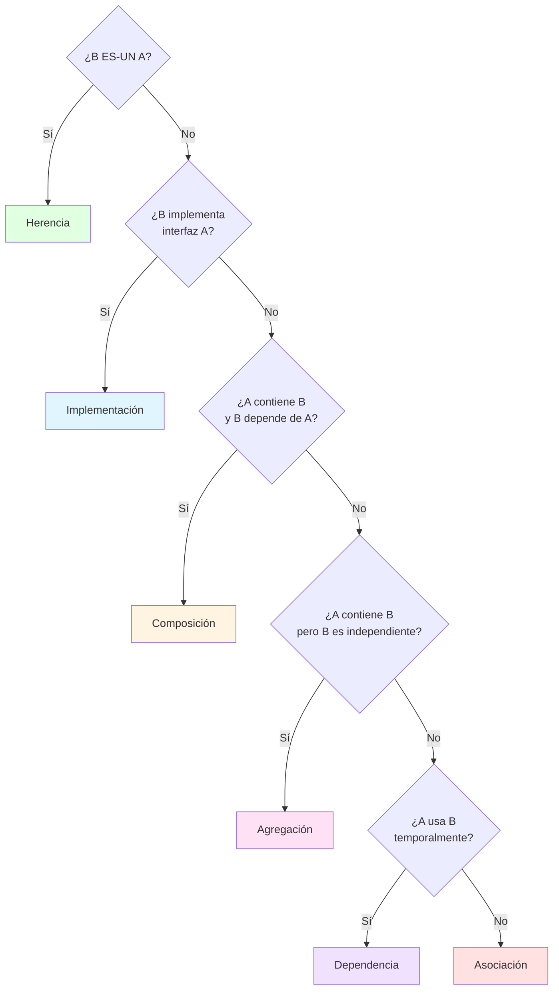
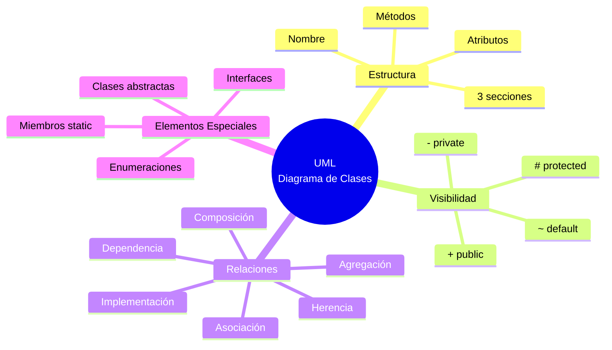

# 📐 UML y Diagrama de Clases

## 🎯 Introducción

> [!info]- 💡 ¿Qué es UML?
> 
> **UML** (Unified Modeling Language - Lenguaje Unificado de Modelado) es un **lenguaje visual estandarizado** para representar, diseñar y documentar sistemas orientados a objetos.
> 
> **Analogía del mundo real:** Así como los arquitectos usan planos antes de construir un edificio, los desarrolladores usan UML para diseñar software antes de programarlo.
> 
> **¿Por qué es importante?**
> 
> |Beneficio|Descripción|Ventaja|
> |---|---|---|
> |**Comunicación**|Lenguaje común entre desarrolladores|Todos entienden lo mismo|
> |**Diseño previo**|Planificar antes de codificar|Menos errores y retrabajos|
> |**Documentación**|Representación visual del sistema|Más fácil de entender que código|
> |**Análisis**|Identificar problemas de diseño|Corregir antes de implementar|



> [!note]- 🎯 Enfoque de este Tema
> 
> Nos centraremos en el **Diagrama de Clases**, el más importante para POO y el que usarás en tus proyectos de Java.

---

## 📦 Diagrama de Clases: Conceptos Básicos

### 🔲 Representación de una Clase

> [!tip]- 📋 Estructura de una Clase en UML
> 
> Una clase se representa como un **rectángulo dividido en 3 secciones**:
> 
> ```mermaid
> classDiagram
>     class NombreClase {
>         -atributoPrivado: tipo
>         #atributoProtegido: tipo
>         +atributoPúblico: tipo
>         --
>         +métodoPúblico(): tipoRetorno
>         -métodoPrivado(): tipoRetorno
>         #métodoProtegido(): tipoRetorno
>     }
> ```
> 
> **Secciones:**
> 
> |Sección|Contenido|Ejemplo|
> |---|---|---|
> |**Superior**|Nombre de la clase|`CuentaBancaria`|
> |**Media**|Atributos (variables)|`- saldo: double`|
> |**Inferior**|Métodos (funciones)|`+ depositar(monto: double): boolean`|

### 🔐 Modificadores de Visibilidad

> [!info]- 🎨 Símbolos de Acceso
> 
> |Símbolo|Modificador|Significado|Uso|
> |---|---|---|---|
> |**-**|private|Solo accesible dentro de la clase|✅ Atributos|
> |**+**|public|Accesible desde cualquier lugar|✅ Métodos públicos|
> |**#**|protected|Accesible en la clase y subclases|Herencia|
> |**~**|default|Accesible en el mismo paquete|Uso interno|
> 
> **Regla general:**
> 
> - Atributos: `-` (private)
> - Getters/Setters y métodos públicos: `+` (public)
> - Métodos auxiliares: `-` (private)

### 📝 Sintaxis de Atributos y Métodos

> [!example]- ✍️ Formato Completo
> 
> **Atributos:**
> 
> ```
> [visibilidad] nombreAtributo: tipo [= valorPorDefecto]
> ```
> 
> **Métodos:**
> 
> ```
> [visibilidad] nombreMétodo(parámetro: tipo): tipoRetorno
> ```
> 
> **Ejemplos:**
> 
> ```mermaid
> classDiagram
>     class CuentaBancaria {
>         -saldo: double = 0.0
>         -titular: String
>         -numeroCuenta: String
>         --
>         +CuentaBancaria(titular: String)
>         +getSaldo(): double
>         +depositar(monto: double): boolean
>         +retirar(monto: double): boolean
>         -validarMonto(monto: double): boolean
>     }
> ```
> 
> **Equivalente en Java:**
> 
> ```java
> public class CuentaBancaria {
>     private double saldo = 0.0;
>     private String titular;
>     private String numeroCuenta;
>     
>     public CuentaBancaria(String titular) { }
>     public double getSaldo() { }
>     public boolean depositar(double monto) { }
>     public boolean retirar(double monto) { }
>     private boolean validarMonto(double monto) { }
> }
> ```

---

## 🔗 Relaciones entre Clases

### 📊 Tipos de Relaciones

> [!tip]- 🌐 Relaciones Fundamentales
> 
> |Relación|Símbolo|Significado|Ejemplo|
> |---|---|---|---|
> |**Herencia**|`<|--`|"ES-UN"|
> |**Implementación**|`<|..`|Implementa interfaz|
> |**Asociación**|`--`|Usa o conoce|Persona tiene Dirección|
> |**Agregación**|`o--`|"TIENE-UN" (débil)|Departamento tiene Empleados|
> |**Composición**|`*--`|"TIENE-UN" (fuerte)|Coche tiene Motor|
> |**Dependencia**|`..>`|Usa temporalmente|Método usa otra clase|

### 🏛️ Herencia

> [!example]- 👨‍👩‍👧 Jerarquía de Clases
> 
> **Símbolo:** Flecha con triángulo vacío `<|--`
> 
> ```mermaid
> classDiagram
>     Animal <|-- Perro
>     Animal <|-- Gato
>     Animal <|-- Ave
>     
>     class Animal {
>         #nombre: String
>         #edad: int
>         +comer(): void
>         +dormir(): void
>         +hacerSonido(): void
>     }
>     
>     class Perro {
>         -raza: String
>         +ladrar(): void
>         +hacerSonido(): void
>     }
>     
>     class Gato {
>         -color: String
>         +maullar(): void
>         +hacerSonido(): void
>     }
>     
>     class Ave {
>         -especie: String
>         +volar(): void
>         +hacerSonido(): void
>     }
> ```
> 
> **Lectura:** "Perro hereda de Animal" o "Perro ES-UN Animal"

### 🔌 Implementación de Interfaces

> [!example]- 📜 Interfaces
> 
> **Símbolo:** Flecha punteada con triángulo `<|..`
> 
> ```mermaid
> classDiagram
>     class Volador {
>         <<interface>>
>         +despegar(): void
>         +volar(): void
>         +aterrizar(): void
>     }
>     
>     class Nadador {
>         <<interface>>
>         +nadar(): void
>         +bucear(): void
>     }
>     
>     Volador <|.. Pato
>     Nadador <|.. Pato
>     Volador <|.. Avion
>     
>     class Pato {
>         -nombre: String
>         +despegar(): void
>         +volar(): void
>         +aterrizar(): void
>         +nadar(): void
>         +bucear(): void
>     }
>     
>     class Avion {
>         -modelo: String
>         +despegar(): void
>         +volar(): void
>         +aterrizar(): void
>     }
> ```
> 
> **Nota:** Las interfaces se marcan con `<<interface>>`

### 🔗 Asociación

> [!example]- 🤝 Relación Básica
> 
> **Símbolo:** Línea simple `--`
> 
> Indica que una clase **conoce** o **usa** otra clase.
> 
> ```mermaid
> classDiagram
>     Persona "1" -- "1" Direccion : tiene
>     Estudiante "1" -- "*" Curso : se inscribe en
>     
>     class Persona {
>         -nombre: String
>         -direccion: Direccion
>         +getDireccion(): Direccion
>     }
>     
>     class Direccion {
>         -calle: String
>         -ciudad: String
>         -codigoPostal: String
>     }
>     
>     class Estudiante {
>         -carnet: String
>         -cursos: List~Curso~
>     }
>     
>     class Curso {
>         -codigo: String
>         -nombre: String
>     }
> ```
> 
> **Multiplicidad:**
> 
> - `1` : Uno
> - `*` o `0..*` : Muchos (cero o más)
> - `1..*` : Uno o más
> - `0..1` : Cero o uno

### 🔷 Agregación

> [!example]- 📦 "Tiene-Un" (Débil)
> 
> **Símbolo:** Rombo vacío `o--`
> 
> Las partes pueden existir **independientemente** del todo.
> 
> ```mermaid
> classDiagram
>     Departamento "1" o-- "*" Empleado : tiene
>     Universidad "1" o-- "*" Estudiante : contiene
>     
>     class Departamento {
>         -nombre: String
>         -empleados: List~Empleado~
>         +agregarEmpleado(e: Empleado): void
>     }
>     
>     class Empleado {
>         -nombre: String
>         -salario: double
>     }
>     
>     class Universidad {
>         -nombre: String
>         -estudiantes: List~Estudiante~
>     }
>     
>     class Estudiante {
>         -nombre: String
>         -carnet: String
>     }
> ```
> 
> **Característica:** Si el Departamento se elimina, los Empleados siguen existiendo.

### 🔶 Composición

> [!example]- 🏗️ "Tiene-Un" (Fuerte)
> 
> **Símbolo:** Rombo lleno `*--`
> 
> Las partes **NO pueden existir** sin el todo.
> 
> ```mermaid
> classDiagram
>     Coche "1" *-- "1" Motor : tiene
>     Coche "1" *-- "4" Rueda : tiene
>     Casa "1" *-- "*" Habitacion : contiene
>     
>     class Coche {
>         -marca: String
>         -motor: Motor
>         -ruedas: Rueda[4]
>     }
>     
>     class Motor {
>         -cilindrada: int
>         -potencia: int
>     }
>     
>     class Rueda {
>         -tamaño: int
>         -presion: double
>     }
>     
>     class Casa {
>         -direccion: String
>         -habitaciones: List~Habitacion~
>     }
>     
>     class Habitacion {
>         -nombre: String
>         -area: double
>     }
> ```
> 
> **Característica:** Si el Coche se destruye, su Motor específico también se destruye.

### ⚡ Dependencia

> [!example]- 🔄 Uso Temporal
> 
> **Símbolo:** Flecha punteada `..>`
> 
> Una clase **usa** temporalmente otra (parámetro, variable local).
> 
> ```mermaid
> classDiagram
>     Impresora ..> Documento : usa
>     CalculadoraImpuestos ..> Factura : procesa
>     
>     class Impresora {
>         +imprimir(doc: Documento): void
>     }
>     
>     class Documento {
>         -contenido: String
>         +getContenido(): String
>     }
>     
>     class CalculadoraImpuestos {
>         +calcular(f: Factura): double
>     }
>     
>     class Factura {
>         -monto: double
>         +getMonto(): double
>     }
> ```

---

## 🎨 Elementos Especiales

### 🔸 Clases Abstractas

> [!example]- 🏗️ Clases No Instanciables
> 
> Se representan con el nombre en **cursiva** o con `<<abstract>>`.
> 
> ```mermaid
> classDiagram
>     class FiguraGeometrica {
>         <<abstract>>
>         #color: String
>         +FiguraGeometrica(color: String)
>         +calcularArea()* double
>         +calcularPerimetro()* double
>         +mostrarInfo(): void
>     }
>     
>     FiguraGeometrica <|-- Circulo
>     FiguraGeometrica <|-- Rectangulo
>     FiguraGeometrica <|-- Triangulo
>     
>     class Circulo {
>         -radio: double
>         +calcularArea(): double
>         +calcularPerimetro(): double
>     }
>     
>     class Rectangulo {
>         -base: double
>         -altura: double
>         +calcularArea(): double
>         +calcularPerimetro(): double
>     }
>     
>     class Triangulo {
>         -lado1: double
>         -lado2: double
>         -lado3: double
>         +calcularArea(): double
>         +calcularPerimetro(): double
>     }
> ```
> 
> **Nota:** Los métodos abstractos se marcan con `*` o en _cursiva_.

### 🔹 Atributos y Métodos Estáticos

> [!example]- ⚡ Miembros de Clase
> 
> Se **subrayan** para indicar que son `static`.
> 
> ```mermaid
> classDiagram
>     class Contador {
>         -count: int$
>         --
>         +Contador()
>         +incrementar()$: void
>         +getContador()$: int
>     }
>     
>     class Configuracion {
>         -URL_BASE: String$
>         -TIMEOUT: int$
>         --
>         +getUrlBase()$: String
>         +getTimeout()$: int
>     }
> ```
> 
> **Nota:** `$` indica miembro estático (algunos diagramadores usan subrayado).

### 📦 Enumeraciones

> [!example]- 🎯 Tipos Enumerados
> 
> ```mermaid
> classDiagram
>     class DiaSemana {
>         <<enumeration>>
>         LUNES
>         MARTES
>         MIERCOLES
>         JUEVES
>         VIERNES
>         SABADO
>         DOMINGO
>     }
>     
>     class TipoCuenta {
>         <<enumeration>>
>         AHORRO
>         CORRIENTE
>         NOMINA
>         --
>         +getTasa(): double
>     }
>     
>     CuentaBancaria --> TipoCuenta : usa
>     
>     class CuentaBancaria {
>         -tipo: TipoCuenta
>         -saldo: double
>     }
> ```

---

## 📚 Ejemplos Completos

### 🏦 Sistema Bancario

> [!example]- 💳 Diagrama Completo
> 
> ```mermaid
> classDiagram
>     class CuentaBancaria {
>         <<abstract>>
>         #titular: String
>         #saldo: double
>         #numeroCuenta: String
>         --
>         +CuentaBancaria(titular: String)
>         +depositar(monto: double): boolean
>         +retirar(monto: double): boolean
>         +getSaldo(): double
>         +calcularInteres()* double
>         #validarMonto(monto: double): boolean
>     }
>     
>     CuentaBancaria <|-- CuentaAhorro
>     CuentaBancaria <|-- CuentaCorriente
>     CuentaBancaria <|-- CuentaNomina
>     
>     class CuentaAhorro {
>         -tasaInteres: double
>         --
>         +CuentaAhorro(titular: String, tasa: double)
>         +calcularInteres(): double
>     }
>     
>     class CuentaCorriente {
>         -sobregiro: double
>         --
>         +CuentaCorriente(titular: String, sobregiro: double)
>         +calcularInteres(): double
>         +retirar(monto: double): boolean
>     }
>     
>     class CuentaNomina {
>         -empresa: String
>         --
>         +CuentaNomina(titular: String, empresa: String)
>         +calcularInteres(): double
>     }
>     
>     Cliente "1" o-- "*" CuentaBancaria : posee
>     
>     class Cliente {
>         -nombre: String
>         -identificacion: String
>         -cuentas: List~CuentaBancaria~
>         --
>         +agregarCuenta(cuenta: CuentaBancaria): void
>         +getSaldoTotal(): double
>     }
>     
>     Banco "1" *-- "*" Cliente : gestiona
>     
>     class Banco {
>         -nombre: String
>         -clientes: List~Cliente~
>         --
>         +agregarCliente(cliente: Cliente): void
>         +buscarCliente(id: String): Cliente
>     }
> ```

### 🎓 Sistema Universitario

> [!example]- 📖 Gestión Académica
> 
> ```mermaid
> classDiagram
>     class Persona {
>         <<abstract>>
>         #nombre: String
>         #identificacion: String
>         #edad: int
>         --
>         +Persona(nombre: String, id: String)
>         +getNombre(): String
>         +mostrarInfo()* void
>     }
>     
>     Persona <|-- Estudiante
>     Persona <|-- Profesor
>     
>     class Estudiante {
>         -carnet: String
>         -creditos: int
>         -cursos: List~Curso~
>         --
>         +inscribirCurso(curso: Curso): void
>         +calcularPromedio(): double
>         +mostrarInfo(): void
>     }
>     
>     class Profesor {
>         -especialidad: String
>         -cursos: List~Curso~
>         --
>         +asignarCurso(curso: Curso): void
>         +mostrarInfo(): void
>     }
>     
>     class Curso {
>         -codigo: String
>         -nombre: String
>         -creditos: int
>         -profesor: Profesor
>         -estudiantes: List~Estudiante~
>         --
>         +agregarEstudiante(e: Estudiante): void
>         +getProfesor(): Profesor
>     }
>     
>     Estudiante "*" -- "*" Curso : se inscribe
>     Profesor "1" -- "*" Curso : imparte
>     
>     Departamento "1" o-- "*" Profesor : tiene
>     Departamento "1" o-- "*" Curso : ofrece
>     
>     class Departamento {
>         -nombre: String
>         -profesores: List~Profesor~
>         -cursos: List~Curso~
>         --
>         +agregarProfesor(p: Profesor): void
>         +ofrecerCurso(c: Curso): void
>     }
> ```

### 🛒 Sistema de Comercio

> [!example]- 🏪 E-commerce
> 
> ```mermaid
> classDiagram
>     class Producto {
>         -codigo: String
>         -nombre: String
>         -precio: double
>         -stock: int
>         --
>         +Producto(codigo: String, nombre: String, precio: double)
>         +actualizarStock(cantidad: int): void
>         +getPrecio(): double
>     }
>     
>     class CarritoCompra {
>         -items: List~ItemCarrito~
>         --
>         +agregarProducto(p: Producto, cant: int): void
>         +eliminarProducto(codigo: String): void
>         +calcularTotal(): double
>         +vaciar(): void
>     }
>     
>     class ItemCarrito {
>         -producto: Producto
>         -cantidad: int
>         --
>         +ItemCarrito(p: Producto, cant: int)
>         +getSubtotal(): double
>     }
>     
>     CarritoCompra "1" *-- "*" ItemCarrito : contiene
>     ItemCarrito "*" --> "1" Producto : referencia
>     
>     class Cliente {
>         -nombre: String
>         -email: String
>         -carrito: CarritoCompra
>         -pedidos: List~Pedido~
>         --
>         +realizarPedido(): Pedido
>     }
>     
>     Cliente "1" *-- "1" CarritoCompra : tiene
>     Cliente "1" o-- "*" Pedido : realiza
>     
>     class Pedido {
>         -numero: String
>         -fecha: Date
>         -estado: EstadoPedido
>         -items: List~ItemCarrito~
>         -total: double
>         --
>         +confirmar(): void
>         +cancelar(): void
>     }
>     
>     class EstadoPedido {
>         <<enumeration>>
>         PENDIENTE
>         CONFIRMADO
>         ENVIADO
>         ENTREGADO
>         CANCELADO
>     }
>     
>     Pedido --> EstadoPedido : usa
> ```

---

## 🎯 Buenas Prácticas

> [!success]- ✅ Recomendaciones para Diagramas UML
> 
> **1. Claridad sobre completitud:**
> 
> - No incluyas TODOS los métodos getter/setter si son obvios
> - Enfócate en los métodos importantes de la lógica
> 
> **2. Nivel de detalle apropiado:**
> 
> - **Alto nivel:** Solo nombres de clases y relaciones principales
> - **Detallado:** Atributos y métodos principales
> - **Completo:** Todo (para documentación final)
> 
> **3. Organización visual:**
> 
> - Clases relacionadas cerca una de otra
> - Superclases arriba, subclases abajo
> - Interfaces a la izquierda o arriba
> 
> **4. Nomenclatura consistente:**
> 
> - Clases: `PascalCase`
> - Atributos y métodos: `camelCase`
> - Constantes: `UPPER_SNAKE_CASE`
> 
> **5. Uso de colores (opcional):**
> 
> - Verde: Clases principales
> - Azul: Clases auxiliares
> - Amarillo: Interfaces
> - Rojo: Clases abstractas

> [!warning]- ⚠️ Errores Comunes
> 
> **❌ Evitar:**
> 
> 1. **Sobrecargar el diagrama** - Demasiadas clases en un solo diagrama
> 2. **Falta de relaciones** - Clases aisladas sin mostrar cómo se conectan
> 3. **Inconsistencia** - Mezclar niveles de detalle
> 4. **Omitir multiplicidad** - No mostrar cardinalidad en asociaciones
> 5. **Relaciones incorrectas** - Usar composición cuando es agregación
> 
> **✅ Hacer:**
> 
> 6. **Dividir en diagramas** - Un diagrama por subsistema
> 7. **Mostrar relaciones clave** - Las que realmente importan
> 8. **Mantener consistencia** - Mismo nivel en todo el diagrama
> 9. **Indicar multiplicidad** - 1, *, 0..1, etc.
> 10. **Elegir relación correcta** - Entender diferencia entre agregación y composición

---

## 📊 Comparativa de Relaciones

> [!info]- 🔍 Guía Rápida de Decisión
> 
> |Pregunta|Sí →|No →|
> |---|---|---|
> |¿Clase B ES-UN tipo de Clase A?|**Herencia** `<|--`|
> |¿Clase B implementa interfaz A?|**Implementación** `<|..`|
> |¿Clase A contiene Clase B y B no puede existir sin A?|**Composición** `*--`|Siguiente pregunta|
> |¿Clase A contiene Clase B pero B puede existir independiente?|**Agregación** `o--`|Siguiente pregunta|
> |¿Clase A solo usa temporalmente Clase B?|**Dependencia** `..>`|**Asociación** `--`|



---

## 🛠️ Herramientas para UML

> [!tip]- 🔧 Software Recomendado
> 
> |Herramienta|Tipo|Características|Recomendado Para|
> |---|---|---|---|
> |**PlantUML**|Texto|Código → Diagrama|Programadores|
> |**Draw.io**|Visual|Gratuito, online|Principiantes|
> |**StarUML**|Visual|Profesional|Proyectos grandes|
> |**Lucidchart**|Visual|Colaborativo, online|Equipos|
> |**Visual Paradigm**|Visual|Completo, generación código|Empresas|
> |**Mermaid**|Texto|Integrado en Markdown|Documentación|

---

## 📋 Resumen Visual



> [!quote]- 💡 Recuerda
> 
> **"Un buen diagrama UML vale más que mil líneas de documentación"**
> 
> - Diseña **antes** de codificar
> - Mantén los diagramas **actualizados** con el código
> - Usa el **nivel de detalle** apropiado para tu audiencia
> - Los diagramas son para **comunicar**, no para impresionar

---

## 🎯 Checklist de Diseño

> [!success]- ✅ Antes de Implementar
> 
> **Diseño de clases:**
> 
> - [ ] ¿Están identificadas todas las clases necesarias?
> - [ ] ¿Los nombres de clases son descriptivos?
> - [ ] ¿Los atributos tienen el modificador correcto (private)?
> - [ ] ¿Los métodos públicos exponen solo lo necesario?
> 
> **Relaciones:**
> 
> - [ ] ¿Las herencias representan relaciones "ES-UN" válidas?
> - [ ] ¿Las composiciones vs agregaciones están bien diferenciadas?
> - [ ] ¿La multiplicidad está indicada correctamente?
> - [ ] ¿No hay dependencias circulares problemáticas?
> 
> **Organización:**
> 
> - [ ] ¿El diagrama es legible y claro?
> - [ ] ¿Las interfaces están claramente marcadas?
> - [ ] ¿Las clases abstractas son identificables?
> - [ ] ¿El nivel de detalle es consistente?

---

**Tags:** #uml #diagrama-clases #diseño #modelado #poo #relaciones #herencia #composicion #agregacion #arquitectura