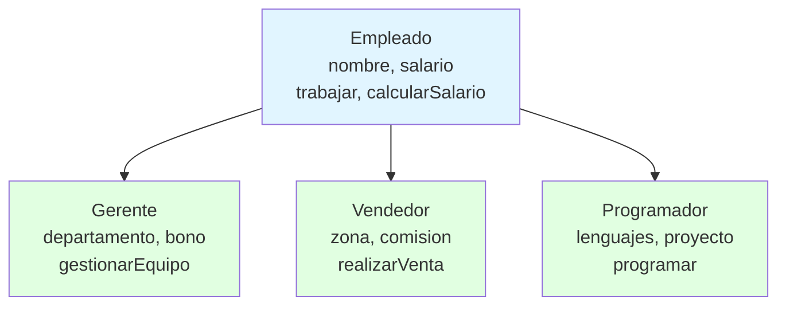
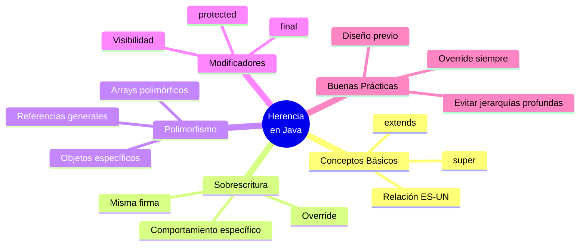

# 👨‍👩‍👧‍👦 Herencia en Java

## 🎯 Introducción

> [!info]- 💡 ¿Qué es la Herencia?
> 
> La **herencia** es un mecanismo que permite crear nuevas clases a partir de clases existentes, **heredando** sus atributos y métodos. Es uno de los pilares fundamentales de la POO.
> 
> **Conceptos clave:**
> 
> |Término|Sinónimo|Descripción|
> |---|---|---|
> |**Superclase**|Clase padre/base|Clase que proporciona atributos y métodos|
> |**Subclase**|Clase hija/derivada|Clase que hereda de la superclase|
> |**extends**|-|Palabra clave para heredar en Java|
> |**super**|-|Referencia a la superclase|
> 
> **Relación "ES-UN":**
> 
> La herencia representa una relación **"ES-UN"** (is-a):
> 
> - Un Gerente **ES-UN** Empleado ✅
> - Un Perro **ES-UN** Animal ✅
> - Un Coche **TIENE-UN** Motor ❌ (composición, no herencia)



> [!tip]- 🎯 ¿Cuándo Usar Herencia?
> 
> **✅ USA herencia cuando:**
> 
> - Existe una relación clara "ES-UN"
> - Necesitas reutilizar código común
> - Quieres crear una jerarquía lógica
> - Las subclases son especializaciones de la superclase
> 
> **❌ NO uses herencia cuando:**
> 
> - Solo quieres reutilizar código (usa composición)
> - No hay relación conceptual "ES-UN"
> - La relación es "TIENE-UN" o "USA-UN"
> - Crearía dependencias innecesarias

---

## 🏗️ Sintaxis Básica

### 📝 Estructura Fundamental

> [!example]- 🔨 Definición de Clases
> 
> **Superclase:**
> 
> ```java
> public class Empleado {
>     // Atributos protegidos - accesibles en subclases
>     protected String nombre;
>     protected double salarioBase;
>     
>     // Constructor
>     public Empleado(String nombre, double salarioBase) {
>         this.nombre = nombre;
>         this.salarioBase = salarioBase;
>     }
>     
>     // Métodos comunes
>     public void trabajar() {
>         System.out.println(nombre + " está trabajando");
>     }
>     
>     public double calcularSalario() {
>         return salarioBase;
>     }
>     
>     public String getNombre() {
>         return nombre;
>     }
> }
> ```
> 
> **Subclase:**
> 
> ```java
> public class Gerente extends Empleado {
>     // Atributos específicos de Gerente
>     private String departamento;
>     private double bono;
>     
>     // Constructor
>     public Gerente(String nombre, double salarioBase, 
>                    String departamento, double bono) {
>         // 🔑 Llamar al constructor del padre
>         super(nombre, salarioBase);
>         this.departamento = departamento;
>         this.bono = bono;
>     }
>     
>     // ✅ Sobrescribir método heredado
>     @Override
>     public double calcularSalario() {
>         return salarioBase + bono;
>     }
>     
>     // ✅ Método nuevo específico
>     public void gestionarEquipo() {
>         System.out.println(nombre + " gestiona el departamento de " 
>                          + departamento);
>     }
> }
> ```
> 
> **Uso:**
> 
> ```java
> // Crear instancias
> Empleado emp = new Empleado("Juan", 2000);
> Gerente ger = new Gerente("Ana", 3000, "Ventas", 500);
> 
> // Métodos heredados funcionan
> emp.trabajar();           // Juan está trabajando
> ger.trabajar();           // Ana está trabajando (heredado)
> 
> // Método sobrescrito
> System.out.println(emp.calcularSalario());  // 2000.0
> System.out.println(ger.calcularSalario());  // 3500.0
> 
> // Método específico
> ger.gestionarEquipo();    // Ana gestiona el departamento de Ventas
> ```

### 🔑 La Palabra Clave `super`

> [!tip]- 🎯 Usos de super
> 
> **1. Llamar al constructor del padre:**
> 
> ```java
> public class Programador extends Empleado {
>     private String lenguaje;
>     
>     public Programador(String nombre, double salario, String lenguaje) {
>         super(nombre, salario);  // ✅ DEBE ser la primera línea
>         this.lenguaje = lenguaje;
>     }
> }
> ```
> 
> **2. Acceder a métodos del padre:**
> 
> ```java
> public class Vendedor extends Empleado {
>     private double comision;
>     
>     @Override
>     public double calcularSalario() {
>         // Obtener salario base del padre y agregar comisión
>         return super.calcularSalario() + comision;
>     }
> }
> ```
> 
> **3. Acceder a atributos del padre (cuando hay nombre duplicado):**
> 
> ```java
> public class Supervisor extends Empleado {
>     private String nombre;  // Oculta el nombre del padre
>     
>     public void mostrarNombres() {
>         System.out.println("Nombre local: " + this.nombre);
>         System.out.println("Nombre padre: " + super.nombre);
>     }
> }
> ```

> [!warning]- ⚠️ Reglas Importantes de super()
> 
> **1. super() DEBE ser la primera línea:**
> 
> ```java
> // ❌ INCORRECTO
> public Gerente(String nombre, double salario, String dept) {
>     this.departamento = dept;  // ❌ Código antes de super()
>     super(nombre, salario);
> }
> 
> // ✅ CORRECTO
> public Gerente(String nombre, double salario, String dept) {
>     super(nombre, salario);    // ✅ Primera línea
>     this.departamento = dept;
> }
> ```
> 
> **2. Si no llamas a super(), Java lo hace automáticamente:**
> 
> ```java
> public class Simple extends Empleado {
>     public Simple(String nombre) {
>         // Java agrega implícitamente: super();
>         // ⚠️ Error si Empleado no tiene constructor sin parámetros
>     }
> }
> ```
> 
> **3. No puedes usar super() y this() juntos:**
> 
> ```java
> public class Complejo extends Empleado {
>     public Complejo(String nombre, double salario) {
>         super(nombre, salario);  // ✅ Llamar al padre
>         // O
>         this(nombre);            // ✅ Llamar a otro constructor
>         // Pero NO ambos
>     }
> }
> ```

---

## 🔄 Sobrescritura de Métodos (Override)

### 📋 Concepto

> [!tip]- 🎨 ¿Qué es Sobrescribir?
> 
> **Sobrescribir** (override) es redefinir en la subclase un método heredado de la superclase, manteniendo la **misma firma** (nombre, parámetros y tipo de retorno).
> 
> **Propósito:** Especializar el comportamiento para la subclase.
> 
> **Requisitos para sobrescribir:**
> 
> |Aspecto|Regla|
> |---|---|
> |**Nombre**|Exactamente igual|
> |**Parámetros**|Mismos tipos y orden|
> |**Tipo retorno**|Igual o subtipo (covariante)|
> |**Visibilidad**|Igual o más permisivo|
> |**Excepciones**|Iguales o subtipos|

### 🛠️ Implementación

> [!example]- ✍️ Ejemplos de Sobrescritura
> 
> **Ejemplo básico:**
> 
> ```java
> public class Animal {
>     public void hacerSonido() {
>         System.out.println("El animal hace un sonido");
>     }
>     
>     public void moverse() {
>         System.out.println("El animal se mueve");
>     }
> }
> 
> public class Perro extends Animal {
>     // ✅ Sobrescritura correcta
>     @Override
>     public void hacerSonido() {
>         System.out.println("¡Guau guau!");
>     }
>     
>     // ✅ Heredado sin cambios
>     // moverse() funciona tal cual
> }
> 
> public class Pez extends Animal {
>     @Override
>     public void hacerSonido() {
>         System.out.println("...");  // Los peces no hacen sonido
>     }
>     
>     @Override
>     public void moverse() {
>         System.out.println("El pez nada");
>     }
> }
> ```
> 
> **Uso:**
> 
> ```java
> Animal animal = new Animal();
> Animal perro = new Perro();
> Animal pez = new Pez();
> 
> animal.hacerSonido();  // El animal hace un sonido
> perro.hacerSonido();   // ¡Guau guau!
> pez.hacerSonido();     // ...
> 
> pez.moverse();         // El pez nada
> ```

> [!example]- 🎯 Sobrescritura con super
> 
> Puedes **reutilizar** el código del padre y **agregar** funcionalidad:
> 
> ```java
> public class Empleado {
>     protected String nombre;
>     protected double salarioBase;
>     
>     public void mostrarInfo() {
>         System.out.println("Información del Empleado");
>         System.out.println("Nombre: " + nombre);
>         System.out.println("Salario base: $" + salarioBase);
>     }
> }
> 
> public class Gerente extends Empleado {
>     private String departamento;
>     private double bono;
>     
>     @Override
>     public void mostrarInfo() {
>         super.mostrarInfo();  // ✅ Ejecutar código del padre
>         // Agregar información específica
>         System.out.println("Departamento: " + departamento);
>         System.out.println("Bono: $" + bono);
>         System.out.println("Salario total: $" + calcularSalario());
>     }
> }
> ```
> 
> **Salida:**
> 
> ```
> Información del Empleado
> Nombre: Ana
> Salario base: $3000.0
> Departamento: Ventas
> Bono: $500.0
> Salario total: $3500.0
> ```

### 🏷️ Anotación @Override

> [!success]- ✅ Buena Práctica: Usar @Override
> 
> **¿Por qué usar @Override?**
> 
> |Ventaja|Descripción|
> |---|---|
> |**Prevención de errores**|Si no coincide la firma, error de compilación|
> |**Legibilidad**|Indica claramente la intención|
> |**Mantenimiento**|Si cambia el padre, detectas el problema|
> 
> **Ejemplo:**
> 
> ```java
> public class Empleado {
>     public double calcularSalario() {
>         return salarioBase;
>     }
> }
> 
> public class Gerente extends Empleado {
>     // ✅ CORRECTO - con @Override
>     @Override
>     public double calcularSalario() {
>         return salarioBase + bono;
>     }
> }
> 
> public class Vendedor extends Empleado {
>     // ❌ Error de tipeo - @Override detecta el problema
>     @Override
>     public double calcularSallario() {  // ← Typo: "Sallario"
>         return salarioBase + comision;
>     }
>     // Error de compilación: método no sobrescribe nada
> }
> ```

---

## 🎭 Polimorfismo con Herencia

### 🔄 Concepto

> [!tip]- 🌟 Polimorfismo Explicado
> 
> El **polimorfismo** permite que una referencia de tipo superclase apunte a objetos de cualquier subclase. El método que se ejecuta depende del **tipo real** del objeto, no del tipo de la referencia.
> 
> **Fórmula:**
> 
> ```
> TipoReferencia variable = new TipoReal();
> ```

### 🛠️ Implementación

> [!example]- 🎨 Polimorfismo en Acción
> 
> **Jerarquía:**
> 
> ```java
> public class Vehiculo {
>     protected String marca;
>     
>     public Vehiculo(String marca) {
>         this.marca = marca;
>     }
>     
>     public void acelerar() {
>         System.out.println("El vehículo acelera");
>     }
> }
> 
> public class Coche extends Vehiculo {
>     public Coche(String marca) {
>         super(marca);
>     }
>     
>     @Override
>     public void acelerar() {
>         System.out.println("El coche " + marca + " acelera suavemente");
>     }
> }
> 
> public class Moto extends Vehiculo {
>     public Moto(String marca) {
>         super(marca);
>     }
>     
>     @Override
>     public void acelerar() {
>         System.out.println("La moto " + marca + " acelera rápidamente");
>     }
> }
> ```
> 
> **Uso polimórfico:**
> 
> ```java
> // 🎭 Referencias de tipo Vehiculo, objetos de tipos específicos
> Vehiculo v1 = new Coche("Toyota");
> Vehiculo v2 = new Moto("Yamaha");
> Vehiculo v3 = new Vehiculo("Genérico");
> 
> // El método ejecutado depende del tipo REAL del objeto
> v1.acelerar();  // El coche Toyota acelera suavemente
> v2.acelerar();  // La moto Yamaha acelera rápidamente
> v3.acelerar();  // El vehículo acelera
> 
> // ✅ Arrays polimórficos
> Vehiculo[] garage = {
>     new Coche("Honda"),
>     new Moto("Suzuki"),
>     new Coche("Ford")
> };
> 
> System.out.println("Acelerando todos los vehículos");
> for (Vehiculo v : garage) {
>     v.acelerar();  // Comportamiento según tipo real
> }
> ```
> 
> **Salida:**
> 
> ```
> Acelerando todos los vehículos
> El coche Honda acelera suavemente
> La moto Suzuki acelera rápidamente
> El coche Ford acelera suavemente
> ```

> [!example]- 🎯 Métodos Polimórficos
> 
> ```java
> public class TallerMecanico {
>     // ✅ Método que acepta CUALQUIER Vehiculo
>     public void hacerMantenimiento(Vehiculo vehiculo) {
>         System.out.println("=== Mantenimiento ===");
>         System.out.println("Marca: " + vehiculo.marca);
>         vehiculo.acelerar();  // Comportamiento específico
>         System.out.println("Mantenimiento completado\n");
>     }
> }
> 
> // Uso
> TallerMecanico taller = new TallerMecanico();
> 
> taller.hacerMantenimiento(new Coche("Tesla"));
> taller.hacerMantenimiento(new Moto("Ducati"));
> ```

### 🔍 Casting y instanceof

> [!warning]- ⚠️ Casting de Objetos
> 
> **Upcasting (automático):**
> 
> ```java
> Coche coche = new Coche("BMW");
> Vehiculo v = coche;  // ✅ Automático - subclase a superclase
> ```
> 
> **Downcasting (manual y peligroso):**
> 
> ```java
> Vehiculo v = new Coche("Audi");
> 
> // ✅ CORRECTO - verificar antes de hacer cast
> if (v instanceof Coche) {
>     Coche c = (Coche) v;  // Cast seguro
>     // Ahora puedo usar métodos específicos de Coche
> }
> 
> // ❌ PELIGROSO - sin verificar
> Vehiculo v2 = new Moto("Kawasaki");
> Coche c2 = (Coche) v2;  // ☠️ ClassCastException en tiempo de ejecución
> ```
> 
> **Patrón recomendado:**
> 
> ```java
> public void procesarVehiculo(Vehiculo v) {
>     // Comportamiento común
>     v.acelerar();
>     
>     // Comportamiento específico si es Coche
>     if (v instanceof Coche) {
>         Coche c = (Coche) v;
>         c.abrirMaletera();  // Método solo de Coche
>     }
>     
>     // Comportamiento específico si es Moto
>     if (v instanceof Moto) {
>         Moto m = (Moto) v;
>         m.hacerCaballito();  // Método solo de Moto
>     }
> }
> ```

---

## 🔒 Modificadores de Acceso en Herencia

### 📊 Tabla de Visibilidad

> [!info]- 🔐 Control de Acceso
> 
> |Modificador|Misma Clase|Mismo Paquete|Subclase|Cualquier Lugar|
> |---|---|---|---|---|
> |**private**|✅|❌|❌|❌|
> |**default**|✅|✅|❌*|❌|
> |**protected**|✅|✅|✅|❌|
> |**public**|✅|✅|✅|✅|
> 
> *Solo si la subclase está en el mismo paquete

### 🛠️ Uso Práctico

> [!example]- 🎯 Ejemplo de Modificadores
> 
> ```java
> public class Empleado {
>     // ❌ No accesible en subclases
>     private String numeroSeguroSocial;
>     
>     // ✅ Accesible en subclases
>     protected String nombre;
>     protected double salarioBase;
>     
>     // ✅ Accesible en todo
>     public String getDepartamento() {
>         return departamento;
>     }
>     
>     // 🔒 Solo para uso interno
>     private void calcularImpuestos() {
>         // Lógica interna
>     }
>     
>     // ✅ Subclases pueden usar esto
>     protected void validarSalario(double salario) {
>         if (salario < 0) {
>             throw new IllegalArgumentException("Salario inválido");
>         }
>     }
> }
> 
> public class Gerente extends Empleado {
>     public void aumentarSalario(double aumento) {
>         // ✅ Puedo acceder a protected
>         validarSalario(salarioBase + aumento);
>         salarioBase += aumento;
>         
>         // ❌ NO puedo acceder a private
>         // System.out.println(numeroSeguroSocial);  // Error
>     }
> }
> ```

> [!tip]- 💡 Buenas Prácticas
> 
> **Recomendaciones:**
> 
> 1. **Atributos → protected o private:**
>     - `protected`: Si las subclases necesitan acceso directo
>     - `private`: Si solo deben usar getters/setters
> 2. **Métodos públicos → public:**
>     - Interfaz de la clase
> 3. **Métodos auxiliares → private:**
>     - Implementación interna
> 4. **Métodos para subclases → protected:**
>     - Funcionalidad compartida pero no pública

---

## 🚫 Limitaciones de la Herencia

### 📋 Restricciones en Java

> [!warning]- ⚠️ Clases y Métodos final
> 
> **Clase final - NO se puede heredar:**
> 
> ```java
> public final class Constantes {
>     public static final double PI = 3.14159;
> }
> 
> // ❌ Error de compilación
> public class MisConstantes extends Constantes {
>     // No se puede heredar de clase final
> }
> ```
> 
> **Método final - NO se puede sobrescribir:**
> 
> ```java
> public class Empleado {
>     protected double salarioBase;
>     
>     // ✅ Método final - implementación fija
>     public final double getSalarioBase() {
>         return salarioBase;
>     }
>     
>     // ✅ Se puede sobrescribir
>     public double calcularSalario() {
>         return salarioBase;
>     }
> }
> 
> public class Gerente extends Empleado {
>     // ❌ Error - no se puede sobrescribir final
>     @Override
>     public double getSalarioBase() {
>         return salarioBase * 1.1;
>     }
>     
>     // ✅ Sí se puede sobrescribir
>     @Override
>     public double calcularSalario() {
>         return salarioBase + bono;
>     }
> }
> ```
> 
> **¿Cuándo usar final?**
> 
> |Contexto|Razón|
> |---|---|
> |**Clases utilitarias**|Prevenir herencia innecesaria (`Math`, `String`)|
> |**Seguridad**|Evitar que se modifique comportamiento crítico|
> |**Optimización**|Permite al compilador hacer optimizaciones|

### 🔗 Herencia Simple

> [!info]- 🎯 Java = Herencia Simple
> 
> **Java NO permite herencia múltiple de clases:**
> 
> ```java
> // ❌ IMPOSIBLE en Java
> public class Anfibio extends Animal, Vehiculo {
>     // Error: no se puede heredar de múltiples clases
> }
> ```
> 
> **Alternativa - Interfaces:**
> 
> ```java
> public interface Nadador {
>     void nadar();
> }
> 
> public interface Volador {
>     void volar();
> }
> 
> // ✅ CORRECTO - Una clase, múltiples interfaces
> public class Pato extends Animal implements Nadador, Volador {
>     @Override
>     public void nadar() {
>         System.out.println("El pato nada");
>     }
>     
>     @Override
>     public void volar() {
>         System.out.println("El pato vuela");
>     }
> }
> ```

---

## 🏗️ Jerarquías de Herencia

### 🌳 Tipos de Jerarquías

> [!example]- 📊 Jerarquía Simple
> 
> **Lineal - Un nivel de herencia:**
> 
> ```mermaid
> classDiagram
>     Persona <|-- Empleado
>     
>     class Persona {
>         -nombre: String
>         -edad: int
>         +getNombre(): String
>     }
>     
>     class Empleado {
>         -salario: double
>         -puesto: String
>         +trabajar(): void
>     }
> ```
> 
> ```java
> public class Persona {
>     protected String nombre;
>     protected int edad;
> }
> 
> public class Empleado extends Persona {
>     private double salario;
>     private String puesto;
> }
> ```

> [!example]- 🌲 Jerarquía Multinivel
> 
> **Múltiples niveles - Herencia en cadena:**
> 
> ```mermaid
> classDiagram
>     Persona <|-- Empleado
>     Empleado <|-- Gerente
>     Gerente <|-- GerenteGeneral
>     
>     class Persona {
>         #nombre: String
>         #edad: int
>     }
>     
>     class Empleado {
>         #salarioBase: double
>         +trabajar(): void
>     }
>     
>     class Gerente {
>         -departamento: String
>         -bono: double
>         +gestionarEquipo(): void
>     }
>     
>     class GerenteGeneral {
>         -empresas: List~String~
>         +dirigirEmpresa(): void
>     }
> ```
> 
> ```java
> public class Persona {
>     protected String nombre;
>     protected int edad;
> }
> 
> public class Empleado extends Persona {
>     protected double salarioBase;
>     
>     public void trabajar() {
>         System.out.println(nombre + " está trabajando");
>     }
> }
> 
> public class Gerente extends Empleado {
>     private String departamento;
>     private double bono;
>     
>     public void gestionarEquipo() {
>         System.out.println(nombre + " gestiona " + departamento);
>     }
> }
> 
> public class GerenteGeneral extends Gerente {
>     private List<String> empresas;
>     
>     public void dirigirEmpresa() {
>         System.out.println(nombre + " dirige " + empresas.size() + " empresas");
>     }
> }
> ```

> [!example]- 🌿 Jerarquía Jerárquica
> 
> **Una superclase, múltiples subclases:**
> 
> ```mermaid
> classDiagram
>     Empleado <|-- Gerente
>     Empleado <|-- Vendedor
>     Empleado <|-- Programador
>     Empleado <|-- Diseñador
>     
>     class Empleado {
>         #nombre: String
>         #salarioBase: double
>         +calcularSalario(): double
>         +trabajar(): void
>     }
>     
>     class Gerente {
>         -departamento: String
>         -bono: double
>         +gestionarEquipo(): void
>     }
>     
>     class Vendedor {
>         -zona: String
>         -comision: double
>         +realizarVenta(): void
>     }
>     
>     class Programador {
>         -lenguajes: List~String~
>         -proyecto: String
>         +programar(): void
>     }
>     
>     class Diseñador {
>         -especialidad: String
>         -herramientas: List~String~
>         +diseñar(): void
>     }
> ```

---

## 🎯 Ejemplo Completo Integrador

> [!example]- 🏢 Sistema de Gestión de Empleados
> 
> ```java
> // ==================== SUPERCLASE ====================
> public class Empleado {
>     protected String nombre;
>     protected String id;
>     protected double salarioBase;
>     
>     public Empleado(String nombre, String id, double salarioBase) {
>         this.nombre = nombre;
>         this.id = id;
>         this.salarioBase = salarioBase;
>     }
>     
>     // Método que puede ser sobrescrito
>     public double calcularSalario() {
>         return salarioBase;
>     }
>     
>     // Método común para todos
>     public void trabajar() {
>         System.out.println(nombre + " está trabajando");
>     }
>     
>     public void mostrarInfo() {
>         System.out.println("=== Empleado ===");
>         System.out.println("Nombre: " + nombre);
>         System.out.println("ID: " + id);
>         System.out.println("Salario: $" + calcularSalario());
>     }
>     
>     // Getters
>     public String getNombre() { return nombre; }
>     public String getId() { return id; }
> }
> 
> // ==================== SUBCLASE 1 ====================
> public class Gerente extends Empleado {
>     private String departamento;
>     private double bono;
>     private int empleadosACargo;
>     
>     public Gerente(String nombre, String id, double salarioBase,
>                    String departamento, double bono) {
>         super(nombre, id, salarioBase);
>         this.departamento = departamento;
>         this.bono = bono;
>     this.empleadosACargo = 0;
> }
> 
> @Override
> public double calcularSalario() {
>     return salarioBase + bono;
> }
> 
> @Override
> public void mostrarInfo() {
>     super.mostrarInfo();
>     System.out.println("Departamento: " + departamento);
>     System.out.println("Bono: $" + bono);
>     System.out.println("Empleados a cargo: " + empleadosACargo);
> }
> 
> public void gestionarEquipo() {
>     System.out.println(nombre + " gestiona el departamento de " 
>                      + departamento);
> }
> 
> public void asignarEmpleado() {
>     empleadosACargo++;
>     System.out.println("Empleado asignado. Total: " + empleadosACargo);
> }
> 
> 
> }
> 
> // ==================== SUBCLASE 2 ==================== 
> 
> public class Vendedor extends Empleado { 
> private String zona; 
> private double comisionPorVenta; 
> private int ventasRealizadas;
> 
> public Vendedor(String nombre, String id, double salarioBase,
>                 String zona, double comisionPorVenta) {
>     super(nombre, id, salarioBase);
>     this.zona = zona;
>     this.comisionPorVenta = comisionPorVenta;
>     this.ventasRealizadas = 0;
> }
> 
> @Override
> public double calcularSalario() {
>     return salarioBase + (comisionPorVenta * ventasRealizadas);
> }
> 
> @Override
> public void mostrarInfo() {
>     super.mostrarInfo();
>     System.out.println("Zona: " + zona);
>     System.out.println("Ventas: " + ventasRealizadas);
>     System.out.println("Comisión total: $" 
>                      + (comisionPorVenta * ventasRealizadas));
> }
> 
> public void realizarVenta() {
>     ventasRealizadas++;
>     System.out.println("¡Venta realizada! Total: " + ventasRealizadas);
> }
> 
> 
> }
> 
> // ==================== SUBCLASE 3 ==================== 
> public class Programador extends Empleado { 
> private String lenguajePrincipal; 
> private String proyectoActual; 
> private int horasExtra;
> 
> 
> public Programador(String nombre, String id, double salarioBase,
>                    String lenguaje, String proyecto) {
>     super(nombre, id, salarioBase);
>     this.lenguajePrincipal = lenguaje;
>     this.proyectoActual = proyecto;
>     this.horasExtra = 0;
> }
> 
> @Override
> public double calcularSalario() {
>     double pagoHoraExtra = 20.0;
>     return salarioBase + (horasExtra * pagoHoraExtra);
> }
> 
> @Override
> public void mostrarInfo() {
>     super.mostrarInfo();
>     System.out.println("Lenguaje: " + lenguajePrincipal);
>     System.out.println("Proyecto: " + proyectoActual);
>     System.out.println("Horas extra: " + horasExtra);
> }
> 
> public void programar() {
>     System.out.println(nombre + " está programando en " 
>                      + lenguajePrincipal);
> }
> 
> public void registrarHorasExtra(int horas) {
>     horasExtra += horas;
>     System.out.println("Horas extra registradas: " + horas);
> }
> 
> 
> }
> 
> // ==================== USO ==================== 
> public class SistemaEmpleados { 
> public static void main(String[] args) { // Crear diferentes tipos de empleados 
> Empleado emp = new Empleado("Carlos", "E001", 1800); 
> Gerente ger = new Gerente("Ana", "G001", 3000, "Ventas", 500); 
> Vendedor ven = new Vendedor("Luis", "V001", 1500, "Norte", 50); 
> Programador prog = new Programador("María", "P001", 2500, "Java", "Sistema Web");
> 
> 
>     // Array polimórfico
>     Empleado[] empresa = {emp, ger, ven, prog};
>     
>     // Procesar todos uniformemente
>     System.out.println("=== NÓMINA DE LA EMPRESA ===\n");
>     double totalNomina = 0;
>     
>     for (Empleado e : empresa) {
>         e.mostrarInfo();
>         totalNomina += e.calcularSalario();
>         System.out.println();
>     }
>     
>     System.out.println("TOTAL NÓMINA: $" + totalNomina);
>     
>     // Usar métodos específicos
>     System.out.println("\n=== ACTIVIDADES ESPECÍFICAS ===");
>     ger.gestionarEquipo();
>     ven.realizarVenta();
>     prog.programar();
>     prog.registrarHorasExtra(5);
>     
>     System.out.println("\n=== SALARIOS ACTUALIZADOS ===");
>     System.out.println(ven.getNombre() + ": $" + ven.calcularSalario());
>     System.out.println(prog.getNombre() + ": $" + prog.calcularSalario());
> }
> 
> 
> }
> ```

---

## ✅ Mejores Prácticas

> [!success]- 🎯 Recomendaciones
> 
> **1. Diseña la jerarquía antes de codificar:**
> 
> - Usa diagramas UML
> - Identifica atributos y métodos comunes
> - Define qué debe ser sobrescrito
> 
> **2. Principio de Sustitución de Liskov:**
> 
> - Las subclases deben poder usarse donde se espera la superclase
> - No rompas el contrato del padre
> 
> ```java
> // ✅ CORRECTO - respeta el contrato
> public class CuentaAhorro extends CuentaBancaria {
>     @Override
>     public boolean retirar(double monto) {
>         // Mantiene la lógica: retorna true si éxito, false si falla
>         if (monto > saldo) return false;
>         saldo -= monto;
>         return true;
>     }
> }
> 
> // ❌ INCORRECTO - rompe el contrato
> public class CuentaProblematica extends CuentaBancaria {
>     @Override
>     public boolean retirar(double monto) {
>         // Lanza excepción en lugar de retornar false
>         throw new RuntimeException("No implementado");
>     }
> }
> ```
> 
> **3. Favorece composición sobre herencia:**
> 
> ```java
> // ❌ Herencia forzada
> public class Coche extends Motor {  // Un coche NO ES-UN motor
>     // ...
> }
> 
> // ✅ Composición apropiada
> public class Coche {
>     private Motor motor;  // Un coche TIENE-UN motor
>     // ...
> }
> ```
> 
> **4. Usa @Override siempre:**
> 
> - Previene errores de tipeo
> - Documenta la intención
> 
> **5. Atributos protected con cuidado:**
> 
> - Prefiere private + getters/setters protected
> - Mantiene encapsulación

> [!warning]- ⚠️ Antipatrones a Evitar
> 
> **1. Jerarquías muy profundas:**
> 
> ```java
> // ❌ Difícil de mantener
> A → B → C → D → E → F
> ```
> 
> **2. Clases "God" (dioses):**
> 
> ```java
> // ❌ Superclase con demasiada responsabilidad
> public class EntidadUniversal {
>     // 50+ atributos
>     // 100+ métodos
> }
> ```
> 
> **3. Herencia por conveniencia:**
> 
> ```java
> // ❌ Heredar solo para reutilizar un método
> public class MiClase extends Utils {
>     // Solo quiero usar un método de Utils
> }
> ```
> 
> **4. Romper encapsulación:**
> 
> ```java
> // ❌ Exponer todo como protected
> public class Padre {
>     protected int dato1, dato2, dato3;  // Mal
> }
> ```

---

## 📊 Resumen Visual



> [!quote]- 💡 Puntos Clave
> 
> - **Herencia** = Reutilización + Especialización
> - **super** = Acceso a la superclase
> - **@Override** = Sobrescritura segura
> - **Polimorfismo** = Flexibilidad y extensibilidad
> - **protected** = Compartido con subclases
> - **final** = No heredable/sobrescribible
> - Java = Herencia simple de clases

---

**Tags:** #herencia #java #poo #extends #super #override #polimorfismo #jerarquia #modificadores
