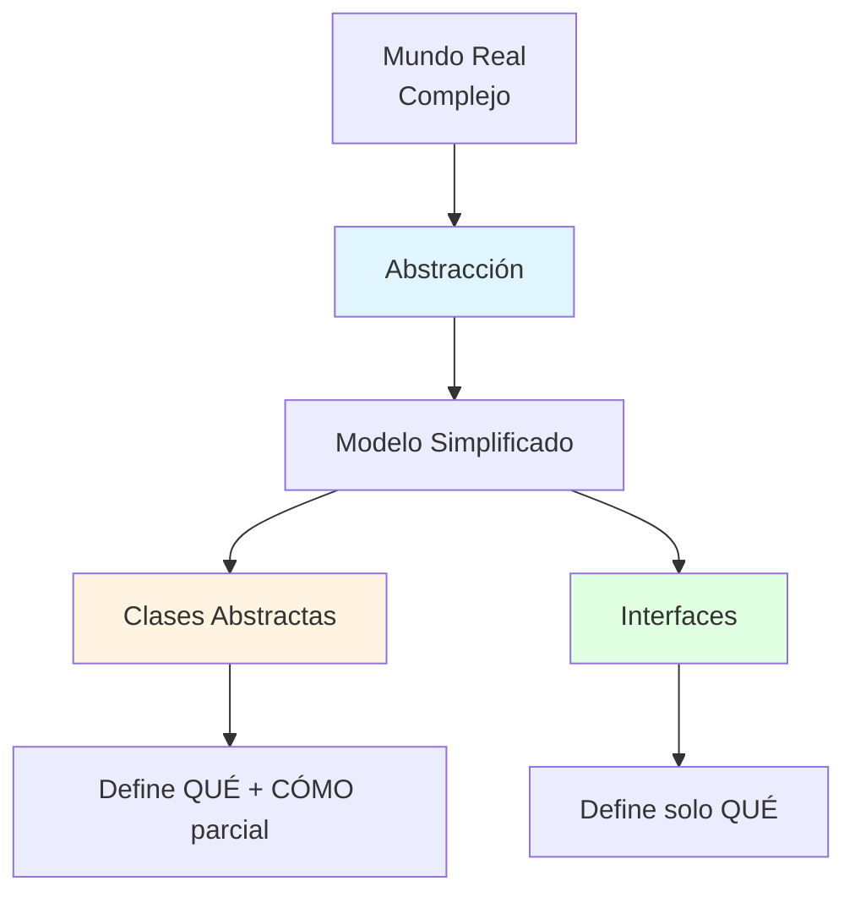
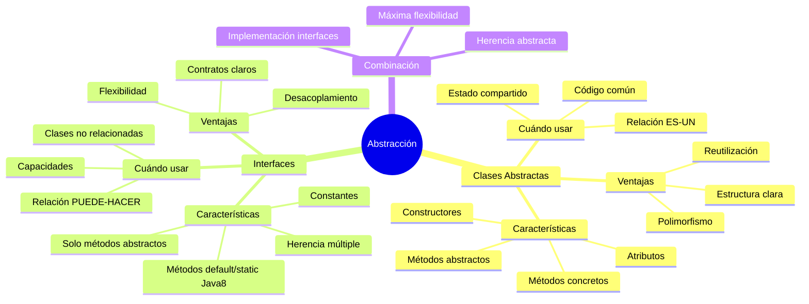

# 🎭 Abstracción (Clases Abstractas e Interfaces)

## 🎯 Introducción

> [!info]- 💡 ¿Qué es la Abstracción?
> 
> La **abstracción** es uno de los pilares fundamentales de la Programación Orientada a Objetos (POO). Consiste en **ocultar los detalles de implementación** y mostrar solo la funcionalidad esencial al usuario.
> 
> **Analogía del mundo real:** Piensa en cómo usas un control remoto:
> 
> - **Lo que ves** → Botones de encendido, volumen, canales (interfaz)
> - **Lo que NO ves** → Circuitos, señales infrarrojas, procesadores (implementación)
> - **Lo importante** → Sabes QUÉ hace cada botón, no CÓMO funciona internamente
> 
> **¿Por qué es importante la abstracción?**
> 
> |Razón|Descripción|Beneficio|
> |---|---|---|
> |**Simplificación**|Reduce la complejidad del código|Más fácil de entender|
> |**Reutilización**|Define contratos que otros implementan|Menos código duplicado|
> |**Flexibilidad**|Permite cambiar implementaciones sin afectar el código cliente|Mantenimiento sencillo|
> |**Diseño robusto**|Fuerza una estructura clara|Menos errores|



---

## 🗺️ Panorama General

### 📊 Dos Mecanismos de Abstracción

> [!note]- 🌳 Clases Abstractas vs Interfaces
> 
> Java ofrece **dos formas** de implementar abstracción:
> 
> ```mermaid
> graph LR
>     A[Abstracción] --> B[Clases Abstractas]
>     A --> C[Interfaces]
>     
>     B --> D[Herencia simple]
>     B --> E[Puede tener estado]
>     B --> F[Métodos concretos + abstractos]
>     
>     C --> G[Herencia múltiple]
>     C --> H[Solo constantes]
>     C --> I[Solo métodos abstractos*]
>     
>     style B fill:#fff4e1
>     style C fill:#e1ffe1
> ```
> 
> **Tabla comparativa rápida:**
> 
> |Aspecto|Clase Abstracta|Interfaz|
> |---|---|---|
> |**Palabra clave**|`abstract class`|`interface`|
> |**Métodos abstractos**|✅ Sí|✅ Sí|
> |**Métodos concretos**|✅ Sí|⚠️ Sí (desde Java 8)|
> |**Atributos**|✅ Variables de instancia|❌ Solo constantes (static final)|
> |**Constructor**|✅ Sí|❌ No|
> |**Herencia**|🔷 Simple (extends)|🔶 Múltiple (implements)|
> |**Cuándo usar**|Relación "ES-UN" con código común|Relación "PUEDE-HACER"|
> 
> **Regla de oro:**
> 
> - **Clase abstracta** → Cuando quieres compartir código entre clases relacionadas
> - **Interfaz** → Cuando quieres definir capacidades que clases NO relacionadas pueden tener

---

## 🎨 Parte 1: CLASES ABSTRACTAS

### 📝 Conceptos Fundamentales

> [!tip]- 🏗️ ¿Qué es una Clase Abstracta?
> 
> Una clase abstracta es una clase **incompleta** que:
> 
> - ❌ NO se puede instanciar directamente
> - ✅ Puede contener métodos abstractos (sin implementación)
> - ✅ Puede contener métodos concretos (con implementación)
> - ✅ Sirve como plantilla para sus subclases
> 
> **Sintaxis básica:**
> 
> ```java
> // Declaración de clase abstracta
> public abstract class Animal {
>     // Atributos normales
>     protected String nombre;
>     protected int edad;
>     
>     // Constructor
>     public Animal(String nombre, int edad) {
>         this.nombre = nombre;
>         this.edad = edad;
>     }
>     
>     // Método abstracto (sin implementación)
>     public abstract void hacerSonido();
>     
>     // Método concreto (con implementación)
>     public void dormir() {
>         System.out.println(nombre + " está durmiendo... 💤");
>     }
>     
>     // Getters
>     public String getNombre() {
>         return nombre;
>     }
> }
> ```

### 🛠️ Implementación de Clases Abstractas

> [!success]- 🎯 Ejemplo Completo: Sistema de Figuras Geométricas
> 
> **CLASE ABSTRACTA: Define el contrato y comportamiento común**
> 
> ```java
> public abstract class Figura {
>     protected String color;
>     
>     public Figura(String color) {
>         this.color = color;
>     }
>     
>     // Métodos abstractos: cada figura calcula diferente
>     public abstract double calcularArea();
>     public abstract double calcularPerimetro();
>     
>     // Método concreto: comportamiento común
>     public void mostrarInfo() {
>         System.out.println("Información de la figura");
>         System.out.println("Color: " + color);
>         System.out.println("Área: " + calcularArea());
>         System.out.println("Perímetro: " + calcularPerimetro());
>     }
> }
> ```
> 
> **SUBCLASE 1: Círculo**
> 
> ```java
> public class Circulo extends Figura {
>     private double radio;
>     
>     public Circulo(String color, double radio) {
>         super(color);
>         this.radio = radio;
>     }
>     
>     @Override
>     public double calcularArea() {
>         return Math.PI * radio * radio;
>     }
>     
>     @Override
>     public double calcularPerimetro() {
>         return 2 * Math.PI * radio;
>     }
> }
> ```
> 
> **SUBCLASE 2: Rectángulo**
> 
> ```java
> public class Rectangulo extends Figura {
>     private double base;
>     private double altura;
>     
>     public Rectangulo(String color, double base, double altura) {
>         super(color);
>         this.base = base;
>         this.altura = altura;
>     }
>     
>     @Override
>     public double calcularArea() {
>         return base * altura;
>     }
>     
>     @Override
>     public double calcularPerimetro() {
>         return 2 * (base + altura);
>     }
> }
> ```
> 
> **USO:**
> 
> ```java
> public class Main {
>     public static void main(String[] args) {
>         // ❌ ERROR: No se puede instanciar clase abstracta
>         // Figura figura = new Figura("rojo");
>         
>         // ✅ CORRECTO: Instanciar subclases concretas
>         Figura circulo = new Circulo("azul", 5.0);
>         Figura rectangulo = new Rectangulo("rojo", 4.0, 6.0);
>         
>         circulo.mostrarInfo();
>         System.out.println();
>         rectangulo.mostrarInfo();
>     }
> }
> ```
> 
> **Salida:**
> 
> ```
> Información de la figura
> Color: azul
> Área: 78.53981633974483
> Perímetro: 31.41592653589793
> 
> Información de la figura
> Color: rojo
> Área: 24.0
> Perímetro: 20.0
> ```

### ✅ Ventajas de las Clases Abstractas

> [!success]- 🏆 Beneficios Clave
> 
> |Ventaja|Descripción|Ejemplo|
> |---|---|---|
> |**Reutilización de código**|Código común en la clase padre|`mostrarInfo()` se hereda|
> |**Fuerza implementación**|Subclases DEBEN implementar métodos abstractos|Cada figura calcula su área|
> |**Polimorfismo**|Tratar objetos diferentes de forma uniforme|`Figura[] figuras = {...}`|
> |**Encapsulación**|Ocultar detalles de implementación|Solo exponer lo necesario|

---

## 🔌 Parte 2: INTERFACES

### 📝 Conceptos Fundamentales

> [!tip]- 🎯 ¿Qué es una Interfaz?
> 
> Una interfaz es un **contrato** que:
> 
> - ✅ Define QUÉ debe hacer una clase (métodos)
> - ❌ NO define CÓMO lo hace (sin implementación tradicional)
> - ✅ Una clase puede implementar múltiples interfaces
> - ✅ Todos los métodos son públicos y abstractos por defecto (antes de Java 8)
> 
> **Sintaxis básica:**
> 
> ```java
> // Declaración de interfaz
> public interface Volador {
>     // Constante (public static final por defecto)
>     double VELOCIDAD_MAXIMA = 100.0;
>     
>     // Métodos abstractos (public abstract por defecto)
>     void volar();
>     void aterrizar();
>     
>     // Método default (desde Java 8)
>     default void planear() {
>         System.out.println("Planeando... 🪂");
>     }
>     
>     // Método static (desde Java 8)
>     static void mostrarInfo() {
>         System.out.println("Interfaz para objetos voladores");
>     }
> }
> ```

### 🛠️ Implementación de Interfaces

> [!example]- 🦆 Ejemplo Completo: Capacidades de Animales y Vehículos
> 
> **INTERFAZ 1: Capacidad de nadar**
> 
> ```java
> public interface Nadador {
>     void nadar();
>     void sumergirse();
> }
> ```
> 
> **INTERFAZ 2: Capacidad de volar**
> 
> ```java
> public interface Volador {
>     void volar();
>     void aterrizar();
> }
> ```
> 
> **INTERFAZ 3: Capacidad de caminar**
> 
> ```java
> public interface Caminante {
>     void caminar();
>     void correr();
> }
> ```
> 
> **CLASE 1: Pato (puede nadar, volar y caminar)**
> 
> ```java
> public class Pato implements Nadador, Volador, Caminante {
>     private String nombre;
>     
>     public Pato(String nombre) {
>         this.nombre = nombre;
>     }
>     
>     @Override
>     public void nadar() {
>         System.out.println(nombre + " está nadando 🦆");
>     }
>     
>     @Override
>     public void sumergirse() {
>         System.out.println(nombre + " se sumergió bajo el agua");
>     }
>     
>     @Override
>     public void volar() {
>         System.out.println(nombre + " está volando 🦆✈️");
>     }
>     
>     @Override
>     public void aterrizar() {
>         System.out.println(nombre + " aterrizó suavemente");
>     }
>     
>     @Override
>     public void caminar() {
>         System.out.println(nombre + " está caminando 🦆👣");
>     }
>     
>     @Override
>     public void correr() {
>         System.out.println(nombre + " está corriendo rápido");
>     }
> }
> ```
> 
> **CLASE 2: Pez (solo puede nadar)**
> 
> ```java
> public class Pez implements Nadador {
>     private String nombre;
>     
>     public Pez(String nombre) {
>         this.nombre = nombre;
>     }
>     
>     @Override
>     public void nadar() {
>         System.out.println(nombre + " está nadando 🐟");
>     }
>     
>     @Override
>     public void sumergirse() {
>         System.out.println(nombre + " se sumergió profundo");
>     }
> }
> ```
> 
> **CLASE 3: Avión (solo puede volar)**
> 
> ```java
> public class Avion implements Volador {
>     private String modelo;
>     
>     public Avion(String modelo) {
>         this.modelo = modelo;
>     }
>     
>     @Override
>     public void volar() {
>         System.out.println("Avión " + modelo + " está volando ✈️");
>     }
>     
>     @Override
>     public void aterrizar() {
>         System.out.println("Avión " + modelo + " aterrizó en la pista");
>     }
> }
> ```
> 
> **USO:**
> 
> ```java
> public class Main {
>     public static void main(String[] args) {
>         Pato donald = new Pato("Donald");
>         Pez nemo = new Pez("Nemo");
>         Avion boeing = new Avion("Boeing 747");
>         
>         System.out.println("=== Pato ===");
>         donald.nadar();
>         donald.volar();
>         donald.caminar();
>         
>         System.out.println("\n=== Pez ===");
>         nemo.nadar();
>         nemo.sumergirse();
>         
>         System.out.println("\n=== Avión ===");
>         boeing.volar();
>         boeing.aterrizar();
>         
>         // Polimorfismo con interfaces
>         System.out.println("\n=== Todos los voladores ===");
>         Volador[] voladores = {donald, boeing};
>         for (Volador v : voladores) {
>             v.volar();
>         }
>     }
> }
> ```

### ✅ Ventajas de las Interfaces

> [!success]- 🏆 Beneficios Clave
> 
> |Ventaja|Descripción|Ejemplo|
> |---|---|---|
> |**Herencia múltiple**|Una clase puede implementar varias interfaces|Pato implementa 3 interfaces|
> |**Flexibilidad**|Clases no relacionadas pueden compartir comportamiento|Pato y Avión son Voladores|
> |**Desacoplamiento**|Programar contra interfaces, no implementaciones|`Volador v = new Pato()`|
> |**Extensibilidad**|Fácil agregar nuevas capacidades|Crear nueva interfaz Terrestre|

---

## ⚖️ Comparación: Clase Abstracta vs Interfaz

### 📊 Tabla Comparativa Completa

> [!note]- 🔍 Diferencias Clave
> 
> |Característica|Clase Abstracta|Interfaz|
> |---|---|---|
> |**Palabra clave**|`abstract class`|`interface`|
> |**Implementación**|`extends` (una sola)|`implements` (múltiples)|
> |**Métodos abstractos**|✅ Sí|✅ Sí|
> |**Métodos concretos**|✅ Sí, todos los que quieras|⚠️ Sí, con `default` (Java 8+)|
> |**Atributos**|✅ Variables de instancia|❌ Solo constantes `static final`|
> |**Constructor**|✅ Sí|❌ No|
> |**Modificadores de acceso**|✅ Cualquiera (public, protected, private)|✅ Solo public (implícito)|
> |**Herencia múltiple**|❌ No|✅ Sí|
> |**Estado**|✅ Puede tener estado|❌ No tiene estado|
> |**Relación semántica**|"ES-UN" (is-a)|"PUEDE-HACER" (can-do)|

### 🎯 ¿Cuándo Usar Cada Una?

> [!tip]- 💡 Guía de Decisión
> 
> **Usa CLASE ABSTRACTA cuando:**
> 
> ```mermaid
> graph TD
>     A{¿Necesitas...?} --> B[Compartir código común]
>     A --> C[Mantener estado]
>     A --> D[Control de acceso]
>     A --> E[Constructores]
>     
>     B --> F[✅ Clase Abstracta]
>     C --> F
>     D --> F
>     E --> F
>     
>     style F fill:#fff4e1
> ```
> 
> - Tienes código común que varias clases relacionadas pueden heredar
> - Necesitas mantener estado (atributos no constantes)
> - Quieres definir constructores
> - Necesitas métodos con diferentes modificadores de acceso
> - Las clases tienen una relación "ES-UN"
> 
> **Ejemplo:** `Animal` (abstracta) → `Perro`, `Gato` (todos SON animales)
> 
> **Usa INTERFAZ cuando:**
> 
> ```mermaid
> graph TD
>     A{¿Necesitas...?} --> B[Herencia múltiple]
>     A --> C[Capacidades compartidas]
>     A --> D[Clases no relacionadas]
>     A --> E[Contrato puro]
>     
>     B --> F[✅ Interfaz]
>     C --> F
>     D --> F
>     E --> F
>     
>     style F fill:#e1ffe1
> ```
> 
> - Quieres que clases no relacionadas compartan capacidades
> - Necesitas herencia múltiple
> - Defines un contrato (QUÉ hacer, no CÓMO)
> - Las clases tienen una relación "PUEDE-HACER"
> 
> **Ejemplo:** `Volador` (interfaz) → `Pato`, `Avion`, `Superman` (todos PUEDEN volar)

---

## 🔀 Combinando Ambas: Clase Abstracta + Interfaces

### 💪 El Poder de la Combinación

> [!example]- 🎪 Ejemplo Completo: Sistema de Vehículos
> 
> **INTERFACES: Definen capacidades**
> 
> ```java
> public interface Motorizado {
>     void encenderMotor();
>     void apagarMotor();
> }
> 
> public interface Acuatico {
>     void navegar();
> }
> 
> public interface Terrestre {
>     void conducir();
> }
> ```
> 
> **CLASE ABSTRACTA: Define estructura común**
> 
> ```java
> public abstract class Vehiculo {
>     protected String marca;
>     protected String modelo;
>     protected int año;
>     
>     public Vehiculo(String marca, String modelo, int año) {
>         this.marca = marca;
>         this.modelo = modelo;
>         this.año = año;
>     }
>     
>     // Método abstracto
>     public abstract void mostrarEspecificaciones();
>     
>     // Método concreto
>     public void mostrarInfo() {
>         System.out.println("Vehículo: " + marca + " " + modelo + " (" + año + ")");
>     }
> }
> ```
> 
> **CLASES CONCRETAS: Combinan abstracta + interfaces**
> 
> ```java
> // Auto: Es vehículo, motorizado y terrestre
> public class Auto extends Vehiculo implements Motorizado, Terrestre {
>     private int numeroPuertas;
>     
>     public Auto(String marca, String modelo, int año, int numeroPuertas) {
>         super(marca, modelo, año);
>         this.numeroPuertas = numeroPuertas;
>     }
>     
>     @Override
>     public void mostrarEspecificaciones() {
>         mostrarInfo();
>         System.out.println("Puertas: " + numeroPuertas);
>     }
>     
>     @Override
>     public void encenderMotor() {
>         System.out.println("🔑 Motor del auto encendido");
>     }
>     
>     @Override
>     public void apagarMotor() {
>         System.out.println("🔑 Motor del auto apagado");
>     }
>     
>     @Override
>     public void conducir() {
>         System.out.println("🚗 Conduciendo por la carretera");
>     }
> }
> 
> // Lancha: Es vehículo, motorizado y acuático
> public class Lancha extends Vehiculo implements Motorizado, Acuatico {
>     private double eslora;
>     
>     public Lancha(String marca, String modelo, int año, double eslora) {
>         super(marca, modelo, año);
>         this.eslora = eslora;
>     }
>     
>     @Override
>     public void mostrarEspecificaciones() {
>         mostrarInfo();
>         System.out.println("Eslora: " + eslora + " metros");
>     }
>     
>     @Override
>     public void encenderMotor() {
>         System.out.println("🔑 Motor de la lancha encendido");
>     }
>     
>     @Override
>     public void apagarMotor() {
>         System.out.println("🔑 Motor de la lancha apagado");
>     }
>     
>     @Override
>     public void navegar() {
>         System.out.println("⛵ Navegando por el agua");
>     }
> }
> 
> // Anfibio: Es vehículo, motorizado, terrestre Y acuático
> public class VehiculoAnfibio extends Vehiculo implements Motorizado, Terrestre, Acuatico {
>     
>     public VehiculoAnfibio(String marca, String modelo, int año) {
>         super(marca, modelo, año);
>     }
>     
>     @Override
>     public void mostrarEspecificaciones() {
>         mostrarInfo();
>         System.out.println("Tipo: Anfibio (tierra y agua)");
>     }
>     
>     @Override
>     public void encenderMotor() {
>         System.out.println("🔑 Motor anfibio encendido");
>     }
>     
>     @Override
>     public void apagarMotor() {
>         System.out.println("🔑 Motor anfibio apagado");
>     }
>     
>     @Override
>     public void conducir() {
>         System.out.println("🚙 Conduciendo por tierra");
>     }
>     
>     @Override
>     public void navegar() {
>         System.out.println("🚤 Navegando por agua");
>     }
> }
> ```
> 
> **USO:**
> 
> ```java
> public class Main {
>     public static void main(String[] args) {
>         Auto auto = new Auto("Toyota", "Corolla", 2024, 4);
>         Lancha lancha = new Lancha("Yamaha", "242X", 2024, 7.3);
>         VehiculoAnfibio anfibio = new VehiculoAnfibio("Gibbs", "Quadski", 2024);
>         
>         System.out.println("=== AUTO ===");
>         auto.mostrarEspecificaciones();
>         auto.encenderMotor();
>         auto.conducir();
>         
>         System.out.println("\n=== LANCHA ===");
>         lancha.mostrarEspecificaciones();
>         lancha.encenderMotor();
>         lancha.navegar();
>         
>         System.out.println("\n=== ANFIBIO ===");
>         anfibio.mostrarEspecificaciones();
>         anfibio.encenderMotor();
>         anfibio.conducir();
>         anfibio.navegar();
>         
>         // Polimorfismo
>         System.out.println("\n=== TODOS LOS VEHÍCULOS ===");
>         Vehiculo[] vehiculos = {auto, lancha, anfibio};
>         for (Vehiculo v : vehiculos) {
>             v.mostrarInfo();
>         }
>     }
> }
> ```

---

## 🎯 Mejores Prácticas

### ✅ Recomendaciones Profesionales

> [!tip]- 🏆 Checklist de Buenas Prácticas
> 
> **1. Nombra correctamente tus abstracciones**
> 
> ```java
> // ✅ BIEN: Nombres descriptivos
> public abstract class Empleado { }
> public interface Imprimible { }
> public interface Comparable { }
> 
> // ❌ MAL: Nombres genéricos
> public abstract class ClaseBase { }
> public interface Interface1 { }
> ```
> 
> **2. Usa interfaces para capacidades, clases abstractas para jerarquías**
> 
> ```java
> // ✅ BIEN: Interfaz para capacidad
> public interface Serializable { }
> 
> // ✅ BIEN: Clase abstracta para jerarquía
> public abstract class Figura { }
> 
> // ❌ MAL: Clase abstracta para capacidad simple
> public abstract class PuedeVolar { } // Debería ser interfaz
> ```
> 
> **3. Minimiza las dependencias**
> 
> ```java
> // ✅ BIEN: Programa contra interfaces
> public void procesar(List<String> datos) { }
> 
> // ❌ MAL: Programa contra implementación
> public void procesar(ArrayList<String> datos) { }
> ```
> 
> **4. No abuses de la herencia**
> 
> ```mermaid
> graph TD
>     A[¿Necesitas abstraer?] --> B{¿Relación ES-UN<br/>verdadera?}
>     B -->|Sí| C[✅ Usar herencia]
>     B -->|No| D[✅ Usar composición]
>     
>     style C fill:#e1ffe1
>     style D fill:#e1ffe1
> ```
> 
> **5. Documenta tus abstracciones**
> 
> ```java
> /**
>  * Clase abstracta que representa una figura geométrica.
>  * Define métodos comunes y obliga a las subclases a 
>  * implementar cálculos específicos de área y perímetro.
>  */
> public abstract class Figura {
>     // ...
> }
> ```

---

## 📊 Resumen Visual

### 🗺️ Mapa Mental Completo



### 📋 Tabla de Decisión Rápida

> [!success]- 🎯 Guía de Referencia Rápida
> 
> |Situación|Solución|
> |---|---|
> |Jerarquía de clases relacionadas|Clase Abstracta|
> |Capacidades en clases no relacionadas|Interfaz|
> |Necesitas estado y comportamiento|Clase Abstracta|
> |Necesitas herencia múltiple|Interfaz|
> |Quieres compartir código|Clase Abstracta|
> |Defines un contrato puro|Interfaz|
> |Necesitas constructores|Clase Abstracta|
> |Programación contra contratos|Interfaz|

---

## 🎓 Ejercicios Prácticos

> [!example]- 💪 Práctica Guiada
> 
> **Ejercicio 1: Sistema de Pagos**
> 
> Crea una interfaz `MetodoPago` con métodos `procesarPago(double monto)` y `validarPago()`. Implementa tres clases: `TarjetaCredito`, `PayPal` y `Efectivo`.
> 
> ```java
> public interface MetodoPago {
>     boolean procesarPago(double monto);
>     boolean validarPago();
> }
> 
> public class TarjetaCredito implements MetodoPago {
>     private String numero;
>     private String cvv;
>     
>     public TarjetaCredito(String numero, String cvv) {
>         this.numero = numero;
>         this.cvv = cvv;
>     }
>     
>     @Override
>     public boolean validarPago() {
>         return numero.length() == 16 && cvv.length() == 3;
>     }
>     
>     @Override
>     public boolean procesarPago(doublemonto) {
>     if (validarPago()) {
>         System.out.println("💳 Pago de $" + monto + " procesado con tarjeta");
>         return true;
>     }
>     return false;
> }
> 
> 
> }
> 
> ````
> 
> **Ejercicio 2: Jerarquía de Empleados**
> 
> Crea una clase abstracta `Empleado` con atributos comunes y método abstracto `calcularSalario()`. Implementa `EmpleadoTiempoCompleto` y `EmpleadoPorHoras`.
> 
> ```java
> public abstract class Empleado {
>     protected String nombre;
>     protected String id;
>     
>     public Empleado(String nombre, String id) {
>         this.nombre = nombre;
>         this.id = id;
>     }
>     
>     public abstract double calcularSalario();
>     
>     public void mostrarInfo() {
>         System.out.println("Empleado: " + nombre + " (ID: " + id + ")");
>         System.out.println("Salario: $" + calcularSalario());
>     }
> }
> 
> public class EmpleadoTiempoCompleto extends Empleado {
>     private double salarioMensual;
>     
>     public EmpleadoTiempoCompleto(String nombre, String id, double salarioMensual) {
>         super(nombre, id);
>         this.salarioMensual = salarioMensual;
>     }
>     
>     @Override
>     public double calcularSalario() {
>         return salarioMensual;
>     }
> }
> 
> public class EmpleadoPorHoras extends Empleado {
>     private double tarifaPorHora;
>     private int horasTrabajadas;
>     
>     public EmpleadoPorHoras(String nombre, String id, double tarifa, int horas) {
>         super(nombre, id);
>         this.tarifaPorHora = tarifa;
>         this.horasTrabajadas = horas;
>     }
>     
>     @Override
>     public double calcularSalario() {
>         return tarifaPorHora * horasTrabajadas;
>     }
> }
> ````

---

## 🚀 Próximos Pasos

> [!quote]- 🌟 Continuando el Aprendizaje
> 
> **Has aprendido:**
> 
> ✅ Qué es la abstracción y por qué es importante  
> ✅ Diferencia entre clases abstractas e interfaces  
> ✅ Cuándo usar cada mecanismo de abstracción  
> ✅ Cómo combinar clases abstractas con interfaces  
> ✅ Mejores prácticas de diseño
> 
> **Próximos temas:**
> 
> |Tema|Qué aprenderás|Por qué es importante|
> |---|---|---|
> |**Polimorfismo**|Uso avanzado de abstracción|Diseño flexible y extensible|
> |**SOLID Principles**|Principios de diseño orientado a objetos|Código profesional y mantenible|
> |**Patrones de diseño**|Soluciones probadas a problemas comunes|Arquitectura de software robusta|
> |**Genéricos**|Abstracción con tipos parametrizados|Código reutilizable y type-safe|

---

**Tags:** #java #abstraccion #clases-abstractas #interfaces #poo #herencia #polimorfismo #diseño #mejores-practicas
