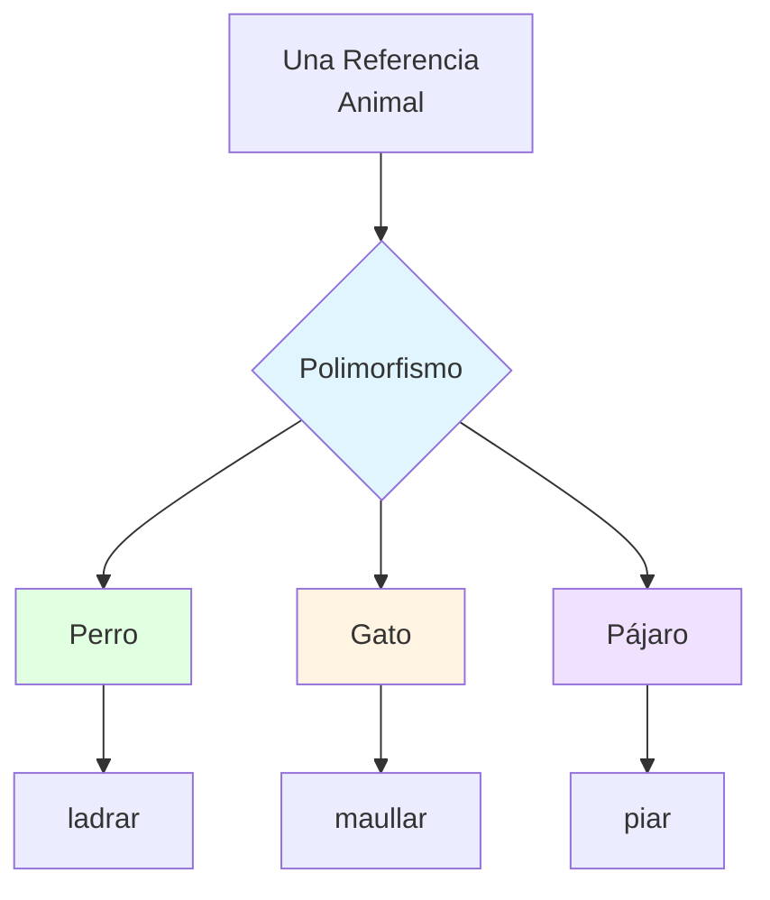
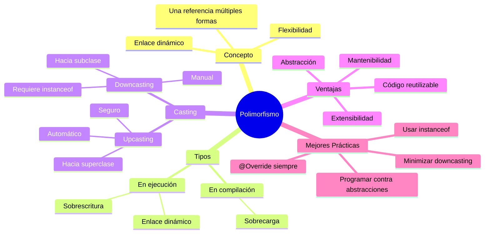

# 🎭 Polimorfismo, Enlace Dinámico y Casting

## 🎯 Introducción

> [!info]- 💡 ¿Qué es el Polimorfismo?
> 
> El **polimorfismo** (del griego "muchas formas") es la capacidad de un objeto de tomar **múltiples formas**. Es uno de los pilares fundamentales de la POO que permite que un mismo código funcione con diferentes tipos de objetos.
> 
> **Analogía del mundo real:** Piensa en un control remoto universal:
> 
> - **Una acción** → Presionar "Play"
> - **Múltiples comportamientos** → TV reproduce video, Radio reproduce música, DVD reproduce película
> - **Misma interfaz** → El botón "Play" siempre funciona, pero cada dispositivo responde diferente
> 
> **¿Por qué es importante el polimorfismo?**
> 
> |Razón|Descripción|Beneficio|
> |---|---|---|
> |**Flexibilidad**|Código funciona con múltiples tipos|Menos código duplicado|
> |**Extensibilidad**|Fácil agregar nuevos tipos|Sistema escalable|
> |**Mantenibilidad**|Cambios localizados|Menos errores|
> |**Abstracción**|Trabajar con conceptos generales|Código más limpio|



---

## 🗺️ Panorama General

### 📊 Tipos de Polimorfismo en Java

> [!note]- 🌳 Clasificación del Polimorfismo
> 
> ```mermaid
> graph TD
>     A[Polimorfismo] --> B[En Tiempo de Compilación<br/>Estático]
>     A --> C[En Tiempo de Ejecución<br/>Dinámico]
>     
>     B --> D[Sobrecarga de métodos<br/>Overloading]
>     B --> E[Sobrecarga de operadores]
>     
>     C --> F[Sobrescritura de métodos<br/>Overriding]
>     C --> G[Interfaces]
>     C --> H[Clases abstractas]
>     
>     style C fill:#e1f5ff
>     style F fill:#e1ffe1
> ```
> 
> **Comparación rápida:**
> 
> |Tipo|Momento|Mecanismo|Ejemplo|
> |---|---|---|---|
> |**Estático**|Compilación|Sobrecarga|`print(int)` vs `print(String)`|
> |**Dinámico**|Ejecución|Sobrescritura|`animal.hacerSonido()`|
> 
> **En este tema nos enfocaremos en el polimorfismo DINÁMICO** ⭐

---

## 🎨 Parte 1: POLIMORFISMO DINÁMICO

### 📝 Conceptos Fundamentales

> [!tip]- 🏗️ ¿Cómo Funciona el Polimorfismo Dinámico?
> 
> El polimorfismo dinámico se basa en tres conceptos clave:
> 
> 1. **Herencia** → Una clase hereda de otra
> 2. **Sobrescritura** → Subclase redefine método de la superclase
> 3. **Enlace dinámico** → Java decide en EJECUCIÓN qué método llamar
> 
> **Regla fundamental:**
> 
> ```java
> // La REFERENCIA puede ser del tipo PADRE
> // El OBJETO puede ser de cualquier tipo HIJO
> 
> Padre referencia = new Hijo();
> //  ↑                    ↑
> //  Tipo de referencia   Tipo real del objeto
> ```
> 
> **Ejemplo básico:**
> 
> ```java
> // Superclase
> public class Animal {
>     public void hacerSonido() {
>         System.out.println("El animal hace un sonido");
>     }
> }
> 
> // Subclases
> public class Perro extends Animal {
>     @Override
>     public void hacerSonido() {
>         System.out.println("🐕 Guau guau!");
>     }
> }
> 
> public class Gato extends Animal {
>     @Override
>     public void hacerSonido() {
>         System.out.println("🐱 Miau miau!");
>     }
> }
> 
> // USO: ¡Aquí está la magia del polimorfismo!
> Animal animal1 = new Perro();  // Referencia Animal, objeto Perro
> Animal animal2 = new Gato();   // Referencia Animal, objeto Gato
> 
> animal1.hacerSonido();  // Imprime: 🐕 Guau guau!
> animal2.hacerSonido();  // Imprime: 🐱 Miau miau!
> ```

### 🛠️ Polimorfismo en Acción

> [!success]- 🎯 Ejemplo Completo: Sistema de Empleados
> 
> **JERARQUÍA DE CLASES:**
> 
> ```java
> // Clase base
> public class Empleado {
>     protected String nombre;
>     protected String id;
>     protected double salarioBase;
>     
>     public Empleado(String nombre, String id, double salarioBase) {
>         this.nombre = nombre;
>         this.id = id;
>         this.salarioBase = salarioBase;
>     }
>     
>     // Método que será sobrescrito
>     public double calcularSalario() {
>         return salarioBase;
>     }
>     
>     public void mostrarInfo() {
>         System.out.println("Empleado: " + nombre);
>         System.out.println("ID: " + id);
>         System.out.println("Salario: $" + calcularSalario());
>     }
> }
> 
> // Subclase 1: Gerente
> public class Gerente extends Empleado {
>     private double bono;
>     
>     public Gerente(String nombre, String id, double salarioBase, double bono) {
>         super(nombre, id, salarioBase);
>         this.bono = bono;
>     }
>     
>     @Override
>     public double calcularSalario() {
>         return salarioBase + bono;
>     }
> }
> 
> // Subclase 2: Vendedor
> public class Vendedor extends Empleado {
>     private double comision;
>     private double ventasTotales;
>     
>     public Vendedor(String nombre, String id, double salarioBase, 
>                     double comision, double ventasTotales) {
>         super(nombre, id, salarioBase);
>         this.comision = comision;
>         this.ventasTotales = ventasTotales;
>     }
>     
>     @Override
>     public double calcularSalario() {
>         return salarioBase + (ventasTotales * comision);
>     }
> }
> 
> // Subclase 3: Programador
> public class Programador extends Empleado {
>     private int horasExtra;
>     private double tarifaHoraExtra;
>     
>     public Programador(String nombre, String id, double salarioBase,
>                        int horasExtra, double tarifaHoraExtra) {
>         super(nombre, id, salarioBase);
>         this.horasExtra = horasExtra;
>         this.tarifaHoraExtra = tarifaHoraExtra;
>     }
>     
>     @Override
>     public double calcularSalario() {
>         return salarioBase + (horasExtra * tarifaHoraExtra);
>     }
> }
> ```
> 
> **USO: El Poder del Polimorfismo**
> 
> ```java
> public class SistemaNomina {
>     public static void main(String[] args) {
>         // ✨ POLIMORFISMO: Todas las referencias son tipo Empleado
>         // pero los objetos son de diferentes tipos
>         Empleado emp1 = new Gerente("Ana García", "G001", 5000, 2000);
>         Empleado emp2 = new Vendedor("Carlos Ruiz", "V001", 3000, 0.05, 50000);
>         Empleado emp3 = new Programador("María López", "P001", 4000, 20, 25);
>         Empleado emp4 = new Empleado("Juan Pérez", "E001", 2500);
>         
>         // Crear array polimórfico
>         Empleado[] empleados = {emp1, emp2, emp3, emp4};
>         
>         // 🎭 UN MISMO CÓDIGO funciona con DIFERENTES TIPOS
>         System.out.println("PROCESANDO NÓMINA\n");
>         double totalNomina = 0;
>         
>         for (Empleado empleado : empleados) {
>             empleado.mostrarInfo();  // Llama al método de cada tipo
>             totalNomina += empleado.calcularSalario();  // Polimorfismo
>             System.out.println("─".repeat(40));
>         }
>         
>         System.out.println("\nTotal nómina: $" + totalNomina);
>     }
>     
>     // 🎯 Método que acepta CUALQUIER tipo de Empleado
>     public static void procesarEmpleado(Empleado empleado) {
>         System.out.println("Procesando: " + empleado.nombre);
>         System.out.println("Salario: $" + empleado.calcularSalario());
>     }
> }
> ```
> 
> **Salida:**
> 
> ```
> PROCESANDO NÓMINA
> 
> Empleado: Ana García
> ID: G001
> Salario: $7000.0
> ────────────────────────────────────────
> Empleado: Carlos Ruiz
> ID: V001
> Salario: $5500.0
> ────────────────────────────────────────
> Empleado: María López
> ID: P001
> Salario: $4500.0
> ────────────────────────────────────────
> Empleado: Juan Pérez
> ID: E001
> Salario: $2500.0
> ────────────────────────────────────────
> 
> Total nómina: $19500.0
> ```

### ✅ Ventajas del Polimorfismo

> [!success]- 🏆 Beneficios Reales
> 
> **1. Código más flexible y reutilizable**
> 
> ```java
> // ✅ CON polimorfismo: UN método para TODOS los tipos
> public void imprimirSalarios(Empleado[] empleados) {
>     for (Empleado emp : empleados) {
>         System.out.println(emp.calcularSalario());
>     }
> }
> 
> // ❌ SIN polimorfismo: MÚLTIPLES métodos
> public void imprimirSalariosGerentes(Gerente[] gerentes) { ... }
> public void imprimirSalariosVendedores(Vendedor[] vendedores) { ... }
> public void imprimirSalariosProgramadores(Programador[] programadores) { ... }
> ```
> 
> **2. Fácil extensibilidad**
> 
> ```java
> // Agregar nuevo tipo de empleado
> public class Practicante extends Empleado {
>     @Override
>     public double calcularSalario() {
>         return salarioBase * 0.5;  // 50% del salario base
>     }
> }
> 
> // ✅ El código existente FUNCIONA automáticamente
> Empleado nuevo = new Practicante("Luis", "PR001", 2000);
> procesarEmpleado(nuevo);  // ¡Funciona sin cambios!
> ```
> 
> **3. Principio de Sustitución de Liskov (LSP)**
> 
> > "Los objetos de una subclase deben poder sustituir a los objetos de la superclase sin romper el programa"
> 
> ```java
> // Cualquier Empleado puede usarse donde se espera Empleado
> public void darAumento(Empleado emp, double porcentaje) {
>     emp.salarioBase *= (1 + porcentaje);
> }
> 
> // Funciona con CUALQUIER tipo de empleado
> darAumento(new Gerente(...), 0.1);      // ✅
> darAumento(new Vendedor(...), 0.1);     // ✅
> darAumento(new Programador(...), 0.1);  // ✅
> ```

---

## ⚡ Parte 2: ENLACE DINÁMICO

### 📝 Conceptos Fundamentales

> [!tip]- 🔗 ¿Qué es el Enlace Dinámico?
> 
> El **enlace dinámico** (dynamic binding o late binding) es el mecanismo por el cual Java decide **en tiempo de ejecución** qué versión de un método llamar, basándose en el **tipo real del objeto**, no en el tipo de la referencia.
> 
> **Proceso de resolución:**
> 
> ```mermaid
> sequenceDiagram
>     participant C as Código
>     participant JVM as JVM
>     participant O as Objeto Real
>     
>     C->>JVM: animal.hacerSonido()
>     Note over C: Referencia tipo Animal
>     
>     JVM->>O: ¿Cuál es tu tipo REAL?
>     O-->>JVM: Soy un Perro
>     
>     JVM->>O: Ejecutar hacerSonido() de Perro
>     O-->>C: "Guau guau!"
> ```
> 
> **Ejemplo ilustrativo:**
> 
> ```java
> public class Demo {
>     public static void main(String[] args) {
>         Animal ref = new Perro();  // Referencia Animal, objeto Perro
>         
>         // En COMPILACIÓN: Java verifica que Animal tenga hacerSonido()
>         // En EJECUCIÓN: Java llama a hacerSonido() de PERRO
>         ref.hacerSonido();  // Imprime: Guau guau!
>         
>         // Cambiar el objeto al que apunta la referencia
>         ref = new Gato();  // Ahora apunta a un Gato
>         
>         // En EJECUCIÓN: Java llama a hacerSonido() de GATO
>         ref.hacerSonido();  // Imprime: Miau miau!
>     }
> }
> ```

### 🔍 Enlace Estático vs Dinámico

> [!note]- ⚖️ Comparación Detallada
> 
> |Aspecto|Enlace Estático|Enlace Dinámico|
> |---|---|---|
> |**Momento**|Compilación|Ejecución|
> |**Se basa en**|Tipo de referencia|Tipo real del objeto|
> |**Aplicado a**|Métodos `static`, `final`, `private`|Métodos sobrescritos|
> |**Rendimiento**|⚡ Más rápido|🐌 Ligeramente más lento|
> |**Flexibilidad**|❌ Limitada|✅ Alta|
> |**Polimorfismo**|❌ No|✅ Sí|
> 
> **Ejemplo comparativo:**
> 
> ```java
> public class Animal {
>     // Método sobrescribible → Enlace DINÁMICO
>     public void hacerSonido() {
>         System.out.println("Sonido genérico");
>     }
>     
>     // Método static → Enlace ESTÁTICO
>     public static void dormir() {
>         System.out.println("Animal durmiendo");
>     }
>     
>     // Método final → Enlace ESTÁTICO
>     public final void respirar() {
>         System.out.println("Respirando");
>     }
> }
> 
> public class Perro extends Animal {
>     @Override
>     public void hacerSonido() {
>         System.out.println("Guau!");
>     }
>     
>     // Esto NO es sobrescritura, es OCULTAR
>     public static void dormir() {
>         System.out.println("Perro durmiendo");
>     }
>     
>     // ❌ ERROR: No se puede sobrescribir método final
>     // public void respirar() { }
> }
> 
> // USO
> Animal ref = new Perro();
> 
> ref.hacerSonido();  // DINÁMICO: "Guau!" (método de Perro)
> ref.dormir();       // ESTÁTICO: "Animal durmiendo" (método de Animal)
> ref.respirar();     // ESTÁTICO: "Respirando" (método de Animal)
> ```

### 🎯 Reglas del Enlace Dinámico

> [!warning]- ⚠️ Reglas Importantes
> 
> **Regla 1: Solo aplica a métodos de instancia sobrescritos**
> 
> ```java
> ✅ Enlace dinámico:
> - Métodos public sobrescritos
> - Métodos protected sobrescritos
> 
> ❌ Enlace estático:
> - Métodos static
> - Métodos final
> - Métodos private
> - Constructores
> ```
> 
> **Regla 2: El método debe existir en el tipo de referencia**
> 
> ```java
> public class Animal {
>     public void comer() { }
> }
> 
> public class Perro extends Animal {
>     public void ladrar() { }  // Método NUEVO
> }
> 
> Animal ref = new Perro();
> ref.comer();    // ✅ OK: comer() existe en Animal
> ref.ladrar();   // ❌ ERROR: ladrar() no existe en Animal
> ```
> 
> **Regla 3: Los atributos NO tienen enlace dinámico**
> 
> ```java
> public class Animal {
>     public String tipo = "Animal genérico";
> }
> 
> public class Perro extends Animal {
>     public String tipo = "Perro";
> }
> 
> Animal ref = new Perro();
> System.out.println(ref.tipo);  // Imprime: "Animal genérico"
>                                 // ⚠️ Se basa en el tipo de REFERENCIA
> ```

---

## 🔄 Parte 3: CASTING (Conversión de Tipos)

### 📝 Conceptos Fundamentales

> [!tip]- 🎭 ¿Qué es el Casting?
> 
> El **casting** es la conversión explícita de un tipo de referencia a otro dentro de una jerarquía de herencia. Hay dos tipos:
> 
> **1. Upcasting (hacia arriba) - Implícito y seguro**
> 
> ```java
> Perro perro = new Perro();
> Animal animal = perro;  // ✅ Automático, siempre seguro
> 
> // Todo Perro ES-UN Animal
> ```
> 
> **2. Downcasting (hacia abajo) - Explícito y puede fallar**
> 
> ```java
> Animal animal = new Perro();
> Perro perro = (Perro) animal;  // ⚠️ Requiere cast explícito
> 
> // No todo Animal ES-UN Perro (puede fallar)
> ```
> 
> ```mermaid
> graph TB
>     A[Animal<br/>Superclase] 
>     B[Perro<br/>Subclase]
>     C[Gato<br/>Subclase]
>     
>     B -.->|Upcasting<br/>✅ Seguro| A
>     C -.->|Upcasting<br/>✅ Seguro| A
>     
>     A ==>|Downcasting<br/>⚠️ Puede fallar| B
>     A ==>|Downcasting<br/>⚠️ Puede fallar| C
>     
>     style A fill:#e1f5ff
>     style B fill:#e1ffe1
>     style C fill:#fff4e1
> ```

### 🛠️ Upcasting en Detalle

> [!success]- ⬆️ Casting Hacia Arriba (Upcasting)
> 
> **Características:**
> 
> - ✅ Siempre es seguro
> - ✅ Es automático (implícito)
> - ✅ No requiere operador de cast
> - ⚠️ Pierdes acceso a métodos específicos de la subclase
> 
> **Ejemplo:**
> 
> ```java
> public class Animal {
>     public void comer() {
>         System.out.println("Animal comiendo");
>     }
> }
> 
> public class Perro extends Animal {
>     public void ladrar() {
>         System.out.println("Guau guau!");
>     }
>     
>     @Override
>     public void comer() {
>         System.out.println("Perro comiendo croquetas");
>     }
> }
> 
> // UPCASTING
> Perro perro = new Perro();
> Animal animal = perro;  // ✅ Upcasting automático
> 
> animal.comer();    // ✅ OK: "Perro comiendo croquetas" (polimorfismo)
> animal.ladrar();   // ❌ ERROR: Animal no tiene ladrar()
> 
> // Aunque el objeto REAL es un Perro,
> // la referencia Animal solo ve métodos de Animal
> ```
> 
> **¿Cuándo usar upcasting?**
> 
> ```java
> // 1. Crear colecciones heterogéneas
> Animal[] animales = {
>     new Perro(),   // Upcasting automático
>     new Gato(),    // Upcasting automático
>     new Pajaro()   // Upcasting automático
> };
> 
> // 2. Parámetros de métodos polimórficos
> public void alimentar(Animal animal) {
>     animal.comer();  // Funciona con cualquier Animal
> }
> 
> alimentar(new Perro());  // Upcasting automático
> alimentar(new Gato());   // Upcasting automático
> 
> // 3. Retornar tipos generales
> public Animal crearAnimal(String tipo) {
>     if (tipo.equals("perro")) {
>         return new Perro();  // Upcasting automático
>     } else {
>         return new Gato();   // Upcasting automático
>     }
> }
> ```

### 🔻 Downcasting en Detalle

> [!warning]- ⬇️ Casting Hacia Abajo (Downcasting)
> 
> **Características:**
> 
> - ⚠️ Puede fallar en tiempo de ejecución
> - ❌ NO es automático (requiere cast explícito)
> - ✅ Recupera acceso a métodos específicos
> - ⚠️ Lanza `ClassCastException` si el cast es inválido
> 
> **Sintaxis:**
> 
> ```java
> Animal animal = new Perro();
> 
> // Downcasting explícito
> Perro perro = (Perro) animal;  // ✅ OK: el objeto REAL es un Perro
> perro.ladrar();  // Ahora puedo llamar métodos de Perro
> ```
> 
> **Ejemplo de error:**
> 
> ```java
> Animal animal = new Gato();  // El objeto REAL es un Gato
> 
> // Intentar hacer downcasting a Perro
> Perro perro = (Perro) animal;  // ❌ ClassCastException!
> // No puedes convertir un Gato en Perro
> ```
> 
> **✅ Downcasting SEGURO con instanceof:**
> 
> ```java
> public void procesarAnimal(Animal animal) {
>     // Verificar ANTES de hacer downcasting
>     if (animal instanceof Perro) {
>         Perro perro = (Perro) animal;  // ✅ Seguro
>         perro.ladrar();
>         System.out.println("Es un perro");
>         
>     } else if (animal instanceof Gato) {
>         Gato gato = (Gato) animal;     // ✅ Seguro
>         gato.maullar();
>         System.out.println("Es un gato");
>         
>     } else {
>         System.out.println("Tipo de animal desconocido");
>     }
> }
> ```
> 
> **Patrón común de uso:**
> 
> ```java
> public class SistemaVeterinaria {
>     public void atenderAnimal(Animal animal) {
>         // Comportamiento común
>         System.out.println("Revisando animal...");
>         animal.comer();
>         
>         // Comportamiento específico con downcasting seguro
>         if (animal instanceof Perro) {
>             Perro perro = (Perro) animal;
>             perro.vacunarContraRabia();
>             perro.cortarUñas();
>             
>         } else if (animal instanceof Gato) {
>             Gato gato = (Gato) animal;
>             gato.limpiarArenero();
>             gato.revisarGarras();
>         }
>     }
> }
> ```

### 🔍 Operador instanceof

> [!tip]- 🎯 Verificación de Tipos con instanceof
> 
> El operador `instanceof` verifica si un objeto es una instancia de una clase o interfaz específica.
> 
> **Sintaxis:**
> 
> ```java
> objeto instanceof Tipo
> // Retorna true si el objeto es del tipo especificado o un subtipo
> ```
> 
> **Ejemplo completo:**
> 
> ```java
> public class Animal { }
> public class Mamifero extends Animal { }
> public class Perro extends Mamifero { }
> public class Gato extends Mamifero { }
> 
> public class Demo {
>     public static void main(String[] args) {
>         Perro perro = new Perro();
>         
>         // Verificaciones de jerarquía
>         System.out.println(perro instanceof Perro);     // true
>         System.out.println(perro instanceof Mamifero);  // true
>         System.out.println(perro instanceof Animal);    // true
>         System.out.println(perro instanceof Gato);      // false
>         
>         // Con referencias polimórficas
>         Animal animal = new Perro();
>         
>         if (animal instanceof Perro) {
>             System.out.println("Es un perro");  // ✅ Se ejecuta
>             Perro p = (Perro) animal;           // ✅ Downcasting seguro
>         }
>         
>         if (animal instanceof Gato) {
>             System.out.println("Es un gato");   // ❌ NO se ejecuta
>         }
>     }
> }
> ```
> 
> **Reglas importantes:**
> 
> |Situación|Resultado|Explicación|
> |---|---|---|
> |`null instanceof Tipo`|`false`|null no es instancia de nada|
> |`objeto instanceof SuperClase`|`true`|Si objeto hereda de SuperClase|
> |`objeto instanceof Interface`|`true`|Si objeto implementa Interface|
> |`objeto instanceof ClaseNoRelacionada`|Error compilación|Tipos incompatibles|
> 
> **Pattern Matching (Java 16+):**
> 
> ```java
> // ❌ Forma antigua
> if (animal instanceof Perro) {
>     Perro perro = (Perro) animal;
>     perro.ladrar();
> }
> 
> // ✅ Forma moderna (Java 16+)
> if (animal instanceof Perro perro) {
>     perro.ladrar();  // Variable 'perro' ya está casteada
> }
> ```

---

## 🎯 Parte 4: EJEMPLOS PRÁCTICOS COMPLETOS

### 💼 Ejemplo 1: Sistema de Formas Geométricas

> [!example]- 📐 Polimorfismo con Figuras
> 
> ```java
> // Clase base abstracta
> public abstract class Figura {
>     protected String color;
>     
>     public Figura(String color) {
>         this.color = color;
>     }
>     
>     // Métodos abstractos
>     public abstract double calcularArea();
>     public abstract double calcularPerimetro();
>     public abstract String getTipo();
>     
>     // Método concreto
>     public void mostrarInfo() {
>         System.out.println("=== " + getTipo() + " ===");
>         System.out.println("Color: " + color);
>         System.out.println("Área: " + calcularArea());
>         System.out.println("Perímetro: " + calcularPerimetro());
>     }
> }
> 
> // Subclases concretas
> public class Circulo extends Figura {
>     private double radio;
>     
>     public Circulo(String color, double radio) {
>         super(color);
>         this.radio = radio;
>     }
>     
>     @Override
>     public double calcularArea() {
>         return Math.PI * radio * radio;
>     }
>     
>     @Override
>     public double calcularPerimetro() {
>         return 2 * Math.PI * radio;
>     }
>     
>     @Override
>     public String getTipo() {
>         return "Círculo";
>     }
>     
>     public doublegetRadio() {
>     return radio;
> }
> 
> 
> }
> 
> public class Rectangulo extends Figura { private double base; private double altura;
> 
> 
> public Rectangulo(String color, double base, double altura) {
>     super(color);
>     this.base = base;
>     this.altura = altura;
> }
> 
> @Override
> public double calcularArea() {
>     return base * altura;
> }
> 
> @Override
> public double calcularPerimetro() {
>     return 2 * (base + altura);
> }
> 
> @Override
> public String getTipo() {
>     return "Rectángulo";
> }
> 
> public boolean esCuadrado() {
>     return base == altura;
> }
> 
> 
> }
> 
> public class Triangulo extends Figura { private double lado1, lado2, lado3;
> 
> 
> public Triangulo(String color, double lado1, double lado2, double lado3) {
>     super(color);
>     this.lado1 = lado1;
>     this.lado2 = lado2;
>     this.lado3 = lado3;
> }
> 
> @Override
> public double calcularArea() {
>     // Fórmula de Herón
>     double s = calcularPerimetro() / 2;
>     return Math.sqrt(s * (s - lado1) * (s - lado2) * (s - lado3));
> }
> 
> @Override
> public double calcularPerimetro() {
>     return lado1 + lado2 + lado3;
> }
> 
> @Override
> public String getTipo() {
>     return "Triángulo";
> }
> 
> 
> }
> 
> // Clase que usa polimorfismo public class SistemaGeometrico {
> 
> 
> // Método polimórfico: acepta CUALQUIER Figura
> public static void analizarFigura(Figura figura) {
>     figura.mostrarInfo();
>     
>     // Downcasting seguro para funcionalidad específica
>     if (figura instanceof Circulo) {
>         Circulo circulo = (Circulo) figura;
>         System.out.println("Radio: " + circulo.getRadio());
>         
>     } else if (figura instanceof Rectangulo) {
>         Rectangulo rect = (Rectangulo) figura;
>         if (rect.esCuadrado()) {
>             System.out.println("⭐ Es un cuadrado especial!");
>         }
>     }
>     
>     System.out.println();
> }
> 
> public static void main(String[] args) {
>     // Array polimórfico
>     Figura[] figuras = {
>         new Circulo("Rojo", 5.0),
>         new Rectangulo("Azul", 4.0, 4.0),
>         new Triangulo("Verde", 3.0, 4.0, 5.0),
>         new Rectangulo("Amarillo", 6.0, 3.0)
>     };
>     
>     System.out.println("🔷 ANÁLISIS DE FIGURAS 🔷\n");
>     
>     // Procesar todas con el mismo código
>     for (Figura figura : figuras) {
>         analizarFigura(figura);
>     }
>     
>     // Calcular área total
>     double areaTotal = 0;
>     for (Figura figura : figuras) {
>         areaTotal += figura.calcularArea();  // Polimorfismo
>     }
>     
>     System.out.println("📊 Área total de todas las figuras: " + areaTotal);
> }
> 
> 
> }
> ```

### 🎮 Ejemplo 2: Sistema de Juego con Personajes

> [!example]- 🎯 Polimorfismo en Videojuegos
> 
> ```java
> // Clase base abstracta
> public abstract class Personaje {
>     protected String nombre;
>     protected int vida;
>     protected int nivel;
>     
>     public Personaje(String nombre, int vida, int nivel) {
>         this.nombre = nombre;
>         this.vida = vida;
>         this.nivel = nivel;
>     }
>     
>     // Métodos abstractos (cada personaje ataca diferente)
>     public abstract void atacar();
>     public abstract void habilidadEspecial();
>     
>     // Métodos concretos (común para todos)
>     public void recibirDaño(int daño) {
>         vida -= daño;
>         System.out.println(nombre + " recibió " + daño + " de daño. Vida: " + vida);
>         
>         if (vida <= 0) {
>             System.out.println("💀 " + nombre + " ha sido derrotado!");
>         }
>     }
>     
>     public void mostrarEstado() {
>         System.out.println("─".repeat(40));
>         System.out.println("Personaje: " + nombre);
>         System.out.println("Tipo: " + getClass().getSimpleName());
>         System.out.println("Vida: " + vida + " | Nivel: " + nivel);
>     }
>     
>     public boolean estaVivo() {
>         return vida > 0;
>     }
> }
> 
> // Subclases específicas
> public class Guerrero extends Personaje {
>     private int fuerza;
>     
>     public Guerrero(String nombre, int vida, int nivel, int fuerza) {
>         super(nombre, vida, nivel);
>         this.fuerza = fuerza;
>     }
>     
>     @Override
>     public void atacar() {
>         int daño = fuerza * nivel;
>         System.out.println("⚔️ " + nombre + " ataca con espada causando " + daño + " de daño");
>     }
>     
>     @Override
>     public void habilidadEspecial() {
>         System.out.println("🛡️ " + nombre + " usa ESCUDO PROTECTOR (+50 defensa)");
>     }
>     
>     public void berserker() {
>         System.out.println("😤 " + nombre + " entra en modo BERSERKER!");
>     }
> }
> 
> public class Mago extends Personaje {
>     private int mana;
>     
>     public Mago(String nombre, int vida, int nivel, int mana) {
>         super(nombre, vida, nivel);
>         this.mana = mana;
>     }
>     
>     @Override
>     public void atacar() {
>         if (mana >= 10) {
>             mana -= 10;
>             int daño = nivel * 15;
>             System.out.println("🔮 " + nombre + " lanza BOLA DE FUEGO causando " + daño + " de daño");
>         } else {
>             System.out.println("❌ " + nombre + " no tiene suficiente mana");
>         }
>     }
>     
>     @Override
>     public void habilidadEspecial() {
>         System.out.println("✨ " + nombre + " lanza TELETRANSPORTACIÓN");
>     }
>     
>     public void restaurarMana(int cantidad) {
>         mana += cantidad;
>         System.out.println("💙 " + nombre + " restauró " + cantidad + " de mana");
>     }
> }
> 
> public class Arquero extends Personaje {
>     private int precision;
>     
>     public Arquero(String nombre, int vida, int nivel, int precision) {
>         super(nombre, vida, nivel);
>         this.precision = precision;
>     }
>     
>     @Override
>     public void atacar() {
>         int daño = (precision + nivel) * 2;
>         System.out.println("🏹 " + nombre + " dispara flecha causando " + daño + " de daño");
>     }
>     
>     @Override
>     public void habilidadEspecial() {
>         System.out.println("🎯 " + nombre + " usa DISPARO MÚLTIPLE (x3 flechas)");
>     }
>     
>     public void camuflarse() {
>         System.out.println("🌿 " + nombre + " se camufla en las sombras");
>     }
> }
> 
> // Sistema de combate
> public class SistemaCombate {
>     
>     public static void realizarCombate(Personaje atacante, Personaje defensor) {
>         System.out.println("\n⚔️ COMBATE ⚔️");
>         atacante.mostrarEstado();
>         defensor.mostrarEstado();
>         System.out.println();
>         
>         atacante.atacar();
>         defensor.recibirDaño(20);  // Daño fijo para simplicidad
>     }
>     
>     public static void usarHabilidadesEspeciales(Personaje[] personajes) {
>         System.out.println("\n✨ HABILIDADES ESPECIALES ✨\n");
>         
>         for (Personaje p : personajes) {
>             if (p.estaVivo()) {
>                 p.habilidadEspecial();
>                 
>                 // Downcasting para habilidades únicas
>                 if (p instanceof Guerrero) {
>                     ((Guerrero) p).berserker();
>                     
>                 } else if (p instanceof Mago) {
>                     ((Mago) p).restaurarMana(20);
>                     
>                 } else if (p instanceof Arquero) {
>                     ((Arquero) p).camuflarse();
>                 }
>                 
>                 System.out.println();
>             }
>         }
>     }
>     
>     public static void main(String[] args) {
>         // Array polimórfico de personajes
>         Personaje[] equipo = {
>             new Guerrero("Aragorn", 150, 10, 25),
>             new Mago("Gandalf", 100, 12, 200),
>             new Arquero("Legolas", 120, 11, 30)
>         };
>         
>         System.out.println("🎮 SISTEMA DE COMBATE RPG 🎮");
>         
>         // Mostrar todos los personajes (polimorfismo)
>         System.out.println("\n👥 EQUIPO:\n");
>         for (Personaje p : equipo) {
>             p.mostrarEstado();
>         }
>         
>         // Todos atacan (polimorfismo - cada uno ataca diferente)
>         System.out.println("\n⚔️ TODOS ATACAN ⚔️\n");
>         for (Personaje p : equipo) {
>             p.atacar();
>         }
>         
>         // Usar habilidades especiales
>         usarHabilidadesEspeciales(equipo);
>         
>         // Combate entre dos personajes
>         realizarCombate(equipo[0], equipo[1]);
>     }
> }
> ```

---

## 🎯 Mejores Prácticas

### ✅ Recomendaciones Profesionales

> [!tip]- 🏆 Checklist de Buenas Prácticas
> 
> **1. Usa polimorfismo en lugar de condicionales**
> 
> ```java
> // ❌ MAL: Usar instanceof en cadena
> public void procesar(Animal animal) {
>     if (animal instanceof Perro) {
>         // código específico de Perro
>     } else if (animal instanceof Gato) {
>         // código específico de Gato
>     } else if (animal instanceof Pajaro) {
>         // código específico de Pájaro
>     }
> }
> 
> // ✅ BIEN: Usar polimorfismo
> public void procesar(Animal animal) {
>     animal.hacerSonido();  // Cada uno hace su sonido
> }
> ```
> 
> **2. Verifica con instanceof ANTES de hacer downcasting**
> 
> ```java
> // ❌ MAL: Downcasting sin verificar
> Perro perro = (Perro) animal;  // ¡Puede lanzar ClassCastException!
> 
> // ✅ BIEN: Verificar primero
> if (animal instanceof Perro) {
>     Perro perro = (Perro) animal;
>     // Usar perro de forma segura
> }
> ```
> 
> **3. Minimiza el uso de downcasting**
> 
> ```java
> // ⚠️ Si necesitas downcasting frecuente, 
> // probablemente tu diseño necesita mejorarse
> 
> // Pregúntate: ¿Puedo resolver esto con polimorfismo?
> ```
> 
> **4. Programa contra interfaces/abstracciones**
> 
> ```java
> // ✅ BIEN: Tipo de referencia abstracto
> List<String> lista = new ArrayList<>();
> Figura figura = new Circulo();
> 
> // ❌ MAL: Tipo de referencia concreto
> ArrayList<String> lista = new ArrayList<>();
> Circulo circulo = new Circulo();
> ```
> 
> **5. Usa @Override siempre**
> 
> ```java
> public class Perro extends Animal {
>     @Override  // ✅ Ayuda a detectar errores
>     public void hacerSonido() {
>         System.out.println("Guau!");
>     }
> }
> ```

---

## 📊 Resumen Visual

### 🗺️ Mapa Mental Completo



### 📋 Tabla Resumen Final

> [!success]- 🎯 Referencia Rápida
> 
> |Concepto|Definición|Cuándo Usar|
> |---|---|---|
> |**Polimorfismo**|Un objeto toma muchas formas|Siempre que sea posible|
> |**Enlace Dinámico**|Decisión en ejecución|Métodos sobrescritos|
> |**Upcasting**|Subclase → Superclase|Automático, siempre|
> |**Downcasting**|Superclase → Subclase|Con instanceof|
> |**instanceof**|Verificar tipo real|Antes de downcast|
> |**@Override**|Indicar sobrescritura|Siempre|

---

## 🎓 Ejercicios Prácticos

> [!example]- 💪 Práctica Guiada
> 
> **Ejercicio 1: Sistema de Instrumentos Musicales**
> 
> Crea una jerarquía de clases para instrumentos musicales. Usa polimorfismo para crear una orquesta.
> 
> ```java
> public abstract class Instrumento {
>     protected String nombre;
>     
>     public Instrumento(String nombre) {
>         this.nombre = nombre;
>     }
>     
>     public abstract void tocar();
>     public abstract String getTipo();
> }
> 
> public class Guitarra extends Instrumento {
>     public Guitarra() {
>         super("Guitarra");
>     }
>     
>     @Override
>     public void tocar() {
>         System.out.println("🎸 Tocando la guitarra: strum strum");
>     }
>     
>     @Override
>     public String getTipo() {
>         return "Cuerda";
>     }
> }
> 
> public class Piano extends Instrumento {
>     public Piano() {
>         super("Piano");
>     }
>     
>     @Override
>     public void tocar() {
>         System.out.println("🎹 Tocando el piano: do re mi");
>     }
>     
>     @Override
>     public String getTipo() {
>         return "Teclado";
>     }
> }
> 
> public class Orquesta {
>     public static void main(String[] args) {
>         // Array polimórfico
>         Instrumento[] instrumentos = {
>             new Guitarra(),
>             new Piano(),
>             new Guitarra()
>         };
>         
>         // Tocar todos con el mismo código
>         for (Instrumento i : instrumentos) {
>             i.tocar();
>         }
>     }
> }
> ```
> 
> **Ejercicio 2: Sistema de Notificaciones**
> 
> Implementa un sistema que envíe notificaciones por diferentes medios usando polimorfismo.
> 
> ```java
> public interface Notificacion {
>     void enviar(String mensaje);
>     String getTipo();
> }
> 
> public class Email implements Notificacion {
>     private String direccion;
>     
>     public Email(String direccion) {
>         this.direccion = direccion;
>     }
>     
>     @Override
>     public void enviar(String mensaje) {
>         System.out.println("📧 Enviando email a " + direccion);
>         System.out.println("Mensaje: " + mensaje);
>     }
>     
>     @Override
>     public String getTipo() {
>         return "Email";
>     }
> }
> 
> public class SMS implements Notificacion {
>     private String telefono;
>     
>     public SMS(String telefono) {
>         this.telefono = telefono;
>     }
>     
>     @Override
>     public void enviar(String mensaje) {
>         System.out.println("📱 Enviando SMS a " + telefono);
>         System.out.println("Mensaje: " + mensaje);
>     }
>     
>     @Override
>     public String getTipo() {
>         return "SMS";
>     }
> }
> 
> public class SistemaNotificaciones {
>     public static void notificarUsuario(Notificacion[] medios, String mensaje) {
>         for (Notificacion medio : medios) {
>             medio.enviar(mensaje);
>             System.out.println();
>         }
>     }
>     
>     public static void main(String[] args) {
>         Notificacion[] medios = {
>             new Email("usuario@example.com"),
>             new SMS("+593-999-888-777")
>         };
>         
>         notificarUsuario(medios, "¡Tu pedido ha sido enviado!");
>     }
> }
> ```

---

## 🚀 Próximos Pasos

> [!quote]- 🌟 Continuando el Aprendizaje
> 
> **Has aprendido:**
> 
> ✅ Qué es el polimorfismo y cómo funciona  
> ✅ Enlace dinámico vs enlace estático  
> ✅ Upcasting y downcasting  
> ✅ Uso seguro de instanceof  
> ✅ Aplicaciones prácticas del polimorfismo
> 
> **Próximos temas:**
> 
> |Tema|Qué aprenderás|Por qué es importante|
> |---|---|---|
> |**Excepciones**|Manejo robusto de errores|Aplicaciones confiables|
> |**Colecciones**|Estructuras de datos avanzadas|Manejo eficiente de datos|
> |**Genéricos**|Polimorfismo parametrizado|Type-safety y reutilización|
> |**Patrones de Diseño**|Soluciones probadas|Arquitectura profesional|

---

**Tags:** #java #polimorfismo #enlace-dinamico #casting #instanceof #poo #herencia #sobrescritura #mejores-practicas
