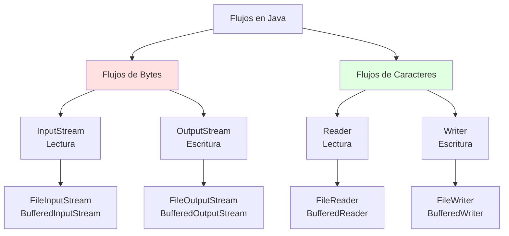

# 🌊 Flujos y Archivos en Java

## 🎯 Introducción

> [!info]- 💡 ¿Qué son los Flujos (Streams)?
> 
> Un **flujo** es una secuencia de datos que viaja desde un origen hacia un destino. En Java, los flujos son la abstracción fundamental para cualquier operación de entrada/salida (E/S).
> 
> **Analogía del mundo real:** Piensa en un río:
> 
> - **Origen** → Manantial (archivo, teclado, red)
> - **Flujo** → Corriente de agua (datos fluyendo)
> - **Destino** → Desembocadura (pantalla, archivo, red)
> 
> ```mermaid
> graph LR
>     A[📁 Origen<br/>Archivo] -->|Flujo de entrada| B[☕ Programa<br/>Java]
>     B -->|Flujo de salida| C[📄 Destino<br/>Archivo]
>     
>     style A fill:#e1f5ff
>     style B fill:#fff4e1
>     style C fill:#e1ffe1
> ```

---

## 📚 Tipos de Flujos

### 🔤 Flujos de Bytes vs Caracteres

> [!tip]- 🎭 Dos Familias Principales
> 
> Java proporciona dos jerarquías paralelas de clases para manejar flujos:
> 
> |Aspecto|Flujos de Bytes|Flujos de Caracteres|
> |---|---|---|
> |**Unidad**|byte (8 bits)|char (16 bits Unicode)|
> |**Clases base**|`InputStream`/`OutputStream`|`Reader`/`Writer`|
> |**Uso típico**|Archivos binarios|Archivos de texto|
> |**Ejemplos**|Imágenes, audio, video|.txt, .csv, .log|
> |**Codificación**|No maneja|✅ Maneja UTF-8, etc.|



### 📊 Jerarquía Completa

> [!note]- 🌳 Árbol de Clases de E/S
> 
> ```mermaid
> classDiagram
>     class InputStream {
>         <<abstract>>
>         +read() int
>         +close()
>     }
>     
>     class OutputStream {
>         <<abstract>>
>         +write(int)
>         +flush()
>         +close()
>     }
>     
>     class Reader {
>         <<abstract>>
>         +read() int
>         +close()
>     }
>     
>     class Writer {
>         <<abstract>>
>         +write(int)
>         +flush()
>         +close()
>     }
>     
>     InputStream <|-- FileInputStream
>     InputStream <|-- BufferedInputStream
>     
>     OutputStream <|-- FileOutputStream
>     OutputStream <|-- BufferedOutputStream
>     
>     Reader <|-- FileReader
>     Reader <|-- BufferedReader
>     
>     Writer <|-- FileWriter
>     Writer <|-- BufferedWriter
> ```

---

## 🔄 Flujos de Entrada y Salida

### 📥 Flujos de Entrada (Input Streams)

> [!example]- 📖 Lectura de Datos
> 
> **Propósito:** Traer datos DESDE una fuente HACIA el programa.
> 
> |Clase|Nivel|Función|Cuándo usar|
> |---|---|---|---|
> |`InputStream`|Abstracto|Base para bytes|No usar directamente|
> |`FileInputStream`|Bajo|Leer bytes de archivo|Archivos binarios pequeños|
> |`BufferedInputStream`|Alto|Leer bytes con buffer|✅ Archivos binarios grandes|
> |`Reader`|Abstracto|Base para caracteres|No usar directamente|
> |`FileReader`|Bajo|Leer caracteres de archivo|Archivos texto pequeños|
> |`BufferedReader`|Alto|Leer caracteres con buffer|✅ Archivos de texto|
> 
> ```java
> // Ejemplo: Lectura de texto
> try (BufferedReader br = new BufferedReader(new FileReader("datos.txt"))) {
>     String linea;
>     while ((linea = br.readLine()) != null) {
>         System.out.println(linea);
>     }
> } catch (IOException e) {
>     System.out.println("Error: " + e.getMessage());
> }
> ```

### 📤 Flujos de Salida (Output Streams)

> [!example]- ✍️ Escritura de Datos
> 
> **Propósito:** Enviar datos DESDE el programa HACIA un destino.
> 
> |Clase|Nivel|Función|Cuándo usar|
> |---|---|---|---|
> |`OutputStream`|Abstracto|Base para bytes|No usar directamente|
> |`FileOutputStream`|Bajo|Escribir bytes a archivo|Archivos binarios pequeños|
> |`BufferedOutputStream`|Alto|Escribir bytes con buffer|✅ Archivos binarios grandes|
> |`Writer`|Abstracto|Base para caracteres|No usar directamente|
> |`FileWriter`|Bajo|Escribir caracteres a archivo|Archivos texto pequeños|
> |`BufferedWriter`|Alto|Escribir caracteres con buffer|✅ Archivos de texto|
> 
> ```java
> // Ejemplo: Escritura de texto
> try (BufferedWriter bw = new BufferedWriter(new FileWriter("salida.txt"))) {
>     bw.write("Primera línea");
>     bw.newLine();
>     bw.write("Segunda línea");
> } catch (IOException e) {
>     System.out.println("Error: " + e.getMessage());
> }
> ```

---

## 🎨 Concepto de Decorador (Wrapper)

> [!success]- 🎁 Envolver Flujos para Añadir Funcionalidad
> 
> Java usa el **patrón Decorator** para añadir capacidades a los flujos básicos sin modificarlos.
> 
> ```mermaid
> graph LR
>     A[FileReader<br/>Lectura básica] --> B[BufferedReader<br/>+ Buffer]
>     B --> C[Tu Programa<br/>readLine]
>     
>     style A fill:#ffe1e1
>     style B fill:#fff4e1
>     style C fill:#e1ffe1
> ```
> 
> **Ejemplo práctico:**
> 
> ```java
> // Capa 1: Acceso básico al archivo
> FileReader fr = new FileReader("datos.txt");
> 
> // Capa 2: Añadir buffering (8KB de cache)
> BufferedReader br = new BufferedReader(fr);
> 
> // Forma compacta (recomendada)
> BufferedReader br = new BufferedReader(new FileReader("datos.txt"));
> ```
> 
> **Ventajas del buffering:**
> 
> |Sin Buffer|Con Buffer|
> |---|---|
> |1000 lecturas = 1000 accesos a disco|1000 lecturas = ~1 acceso a disco|
> |🐢 Muy lento|⚡ Hasta 100x más rápido|

---

## 🔑 Conceptos Clave

### 💾 Persistencia de Datos

> [!info]- 📌 Datos que Sobreviven
> 
> Los archivos permiten que la información **persista** más allá de la ejecución del programa.
> 
> |Tipo de Almacenamiento|Duración|Ejemplo|
> |---|---|---|
> |**Variables**|Durante ejecución|`int x = 5;`|
> |**Memoria RAM**|Mientras el programa está activo|Objetos, arrays|
> |**Archivos**|✅ Permanente|Configuraciones, datos guardados|

### 🚿 Flujo de Datos Unidireccional

> [!tip]- ➡️ Una Dirección a la Vez
> 
> Cada flujo es **unidireccional**:
> 
> - **InputStream/Reader** → Solo LECTURA
> - **OutputStream/Writer** → Solo ESCRITURA
> 
> Si necesitas leer Y escribir, necesitas DOS flujos:
> 
> ```java
> // Copiar archivo (requiere 2 flujos)
> try (BufferedReader entrada = new BufferedReader(new FileReader("origen.txt"));
>      BufferedWriter salida = new BufferedWriter(new FileWriter("destino.txt"))) {
>     
>     String linea;
>     while ((linea = entrada.readLine()) != null) {
>         salida.write(linea);
>         salida.newLine();
>     }
> }
> ```

### 🔒 Cierre de Recursos

> [!warning]- ⚠️ SIEMPRE Cerrar Flujos
> 
> **Problema:** Los flujos consumen recursos del sistema operativo.
> 
> ```mermaid
> graph TD
>     A[Abrir flujo] --> B[Usar flujo]
>     B --> C{¿Cerrado?}
>     C -->|❌ No| D[Fuga de recursos<br/>Archivos bloqueados]
>     C -->|✅ Sí| E[Recursos liberados<br/>Todo OK]
>     
>     style D fill:#ffe1e1
>     style E fill:#e1ffe1
> ```
> 
> **Solución: try-with-resources** (Java 7+)
> 
> ```java
> // ✅ Se cierra automáticamente
> try (BufferedReader br = new BufferedReader(new FileReader("file.txt"))) {
>     // usar br...
> } // br.close() se llama automáticamente aquí
> ```

---

## 📊 Resumen Comparativo

> [!summary]- 🎯 Guía Rápida de Decisión
> 
> ```mermaid
> graph TD
>     A{¿Tipo de<br/>archivo?} --> B[Texto]
>     A --> C[Binario]
>     
>     B --> D{¿Operación?}
>     C --> E{¿Operación?}
>     
>     D -->|Lectura| F[BufferedReader +<br/>FileReader]
>     D -->|Escritura| G[BufferedWriter +<br/>FileWriter]
>     
>     E -->|Lectura| H[BufferedInputStream +<br/>FileInputStream]
>     E -->|Escritura| I[BufferedOutputStream +<br/>FileOutputStream]
>     
>     style F fill:#e1ffe1
>     style G fill:#e1ffe1
>     style H fill:#e1f5ff
>     style I fill:#e1f5ff
> ```
> 
> |Pregunta|Respuesta|Clase a usar|
> |---|---|---|
> |¿Archivo de texto?|Sí|`Reader`/`Writer`|
> |¿Archivo binario?|Sí|`InputStream`/`OutputStream`|
> |¿Archivo > 1KB?|Sí|✅ Usar versión `Buffered`|
> |¿Necesitas eficiencia?|Sí|✅ Usar versión `Buffered`|

---

**Tags:** #java #flujos #streams #io #archivos #input #output #buffering #decorador