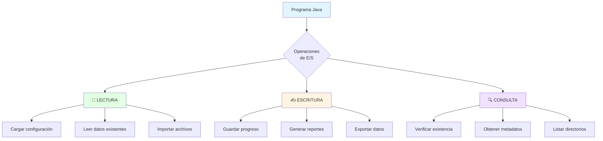
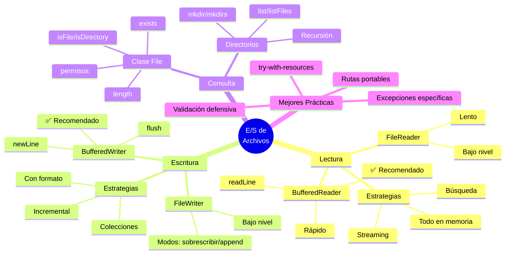

# 📁 Lectura y Escritura de Archivos (Vista General)

## 🎯 Introducción

> [!info]- 💡 ¿Qué es la E/S (Entrada/Salida) de Archivos?
> 
> La **E/S de archivos** (Input/Output) es el conjunto de operaciones que permiten a los programas **comunicarse con el sistema de archivos** del ordenador. Esta capacidad es fundamental para que las aplicaciones puedan **almacenar y recuperar información** de forma permanente.
> 
> **Analogía del mundo real:** Piensa en cómo interactúas con un archivador físico:
> 
> - **Leer** → Abres un cajón, tomas un documento y lees su contenido
> - **Escribir** → Tomas papel, escribes información y lo guardas en el cajón
> - **Consultar** → Verificas qué documentos existen sin abrirlos
> - **Organizar** → Creas carpetas, mueves documentos, cambias nombres
> 
> **¿Por qué es importante aprender E/S de archivos?**
> 
> |Razón|Descripción|Ejemplos Reales|
> |---|---|---|
> |**Persistencia**|Los datos sobreviven después de cerrar el programa|Configuraciones de usuario, partidas guardadas|
> |**Intercambio de datos**|Compartir información entre aplicaciones|Exportar/importar datos, reportes|
> |**Almacenamiento masivo**|Manejar grandes cantidades de información|Logs del sistema, bases de datos simples|
> |**Respaldo**|Crear copias de seguridad|Backups automáticos, historial de cambios|
> |**Procesamiento por lotes**|Procesar múltiples archivos automáticamente|Conversión de formatos, análisis de datos|



---

## 🗺️ Panorama General: Clases de E/S en Java

### 📊 Jerarquía de Clases

> [!note]- 🌳 Organización del paquete java.io
> 
> Java proporciona un rico conjunto de clases para trabajar con archivos, organizadas en una **jerarquía lógica** que separa responsabilidades.
> 
> ```mermaid
> classDiagram
>     class File {
>         <<Representación>>
>         +exists()
>         +isFile()
>         +isDirectory()
>         +length()
>         +getName()
>     }
>     
>     class Reader {
>         <<Abstracta - Lectura>>
>         +read()
>         +close()
>     }
>     
>     class Writer {
>         <<Abstracta - Escritura>>
>         +write()
>         +flush()
>         +close()
>     }
>     
>     class FileReader {
>         <<Lectura básica>>
>         +read() char
>     }
>     
>     class FileWriter {
>         <<Escritura básica>>
>         +write(String)
>     }
>     
>     class BufferedReader {
>         <<Lectura eficiente>>
>         +readLine() String
>     }
>     
>     class BufferedWriter {
>         <<Escritura eficiente>>
>         +write(String)
>         +newLine()
>     }
>     
>     Reader <|-- FileReader
>     Reader <|-- BufferedReader
>     Writer <|-- FileWriter
>     Writer <|-- BufferedWriter
>     
>     FileReader --> File : usa
>     FileWriter --> File : usa
> ```
> 
> **Categorías principales:**
> 
> |Categoría|Propósito|Nivel|Cuándo usar|
> |---|---|---|---|
> |**File**|Representar rutas|Sistema|Consultar metadatos, verificar existencia|
> |**Reader/Writer**|Clases abstractas|Base|No se usan directamente|
> |**FileReader/FileWriter**|Acceso básico|Bajo|Archivos muy pequeños|
> |**BufferedReader/BufferedWriter**|Acceso optimizado|Alto|✅ **Uso general recomendado**|
> |**InputStream/OutputStream**|Bytes (binarios)|Bajo|Imágenes, audio, archivos binarios|

### 🔄 Flujo de Operaciones

> [!example]- ⚡ Cómo Fluyen los Datos
> 
> **Lectura de archivos:**
> 
> ```mermaid
> sequenceDiagram
>     participant P as Programa
>     participant BR as BufferedReader
>     participant FR as FileReader
>     participant F as Archivo (Disco)
>     
>     P->>BR: readLine()
>     BR->>BR: ¿Hay datos en buffer?
>     alt Buffer vacío
>         BR->>FR: read(buffer)
>         FR->>F: Leer 8KB del disco
>         F-->>FR: Datos leídos
>         FR-->>BR: Llenar buffer
>     end
>     BR-->>P: Retornar línea
> ```
> 
> **Escritura de archivos:**
> 
> ```mermaid
> sequenceDiagram
>     participant P as Programa
>     participant BW as BufferedWriter
>     participant FW as FileWriter
>     participant F as Archivo (Disco)
>     
>     P->>BW: write("datos")
>     BW->>BW: Agregar a buffer
>     alt Buffer lleno o flush/close
>         BW->>FW: Vaciar buffer
>         FW->>F: Escribir en disco
>         F-->>FW: Confirmación
>     end
> ```
> 
> **¿Por qué usar buffers?**
> 
> |Sin Buffer (Directo)|Con Buffer (Recomendado)|
> |---|---|
> |1 carácter = 1 acceso a disco|8192 caracteres = 1 acceso a disco|
> |🐌 **Muy lento**|⚡ **Hasta 100x más rápido**|
> |Desgasta el disco|Eficiente con recursos|
> |Simple pero ineficiente|Más código pero mejor rendimiento|

---

## 📖 Operación 1: LECTURA de Archivos

### 🔍 Conceptos Fundamentales

> [!tip]- 📥 ¿Cómo Leer un Archivo?
> 
> **Proceso paso a paso:**
> 
> ```mermaid
> flowchart LR
>     A[1. Verificar<br/>existencia] --> B[2. Abrir<br/>archivo]
>     B --> C[3. Leer<br/>contenido]
>     C --> D[4. Procesar<br/>datos]
>     D --> E{¿Más datos?}
>     E -->|Sí| C
>     E -->|No| F[5. Cerrar<br/>archivo]
>     
>     style A fill:#fff4e1
>     style C fill:#e1f5ff
>     style F fill:#e1ffe1
> ```
> 
> **Métodos de lectura:**
> 
> |Método|Retorna|Uso|Velocidad|
> |---|---|---|---|
> |`read()`|Un carácter (int)|Caracter por caracter|🐌 Lenta|
> |`read(char[])`|Cantidad de chars leídos|Por bloques|⚡ Media|
> |`readLine()`|Una línea (String)|**✅ Recomendado**|⚡ Rápida|
> 
> **Ejemplo básico:**
> 
> ```java
> // Lectura simple línea por línea
> try (BufferedReader br = new BufferedReader(new FileReader("datos.txt"))) {
>     String linea;
>     while ((linea = br.readLine()) != null) {
>         System.out.println(linea);
>     }
> } catch (IOException e) {
>     System.out.println("❌ Error al leer: " + e.getMessage());
> }
> ```

### 🛠️ Técnicas de Lectura

> [!success]- 🎯 Estrategias Según el Caso de Uso
> 
> **1. Leer todo el archivo en memoria:**
> 
> ```java
> public List<String> leerArchivoCompleto(String nombreArchivo) {
>     List<String> lineas = new ArrayList<>();
>     
>     try (BufferedReader br = new BufferedReader(new FileReader(nombreArchivo))) {
>         String linea;
>         while ((linea = br.readLine()) != null) {
>             lineas.add(linea);
>         }
>     } catch (IOException e) {
>         System.out.println("Error: " + e.getMessage());
>     }
>     
>     return lineas;
> }
> ```
> 
> **Pros:** Simple, acceso aleatorio a las líneas  
> **Contras:** Consume mucha memoria con archivos grandes
> 
> **2. Procesar línea por línea (streaming):**
> 
> ```java
> public void procesarArchivo(String nombreArchivo) {
>     try (BufferedReader br = new BufferedReader(new FileReader(nombreArchivo))) {
>         String linea;
>         int numeroLinea = 1;
>         
>         while ((linea = br.readLine()) != null) {
>             // Procesar inmediatamente, sin almacenar
>             procesarLinea(linea, numeroLinea);
>             numeroLinea++;
>         }
>     } catch (IOException e) {
>         System.out.println("Error: " + e.getMessage());
>     }
> }
> ```
> 
> **Pros:** Eficiente en memoria, puede procesar archivos enormes  
> **Contras:** No permite acceso aleatorio
> 
> **3. Leer con búsqueda:**
> 
> ```java
> public String buscarLinea(String archivo, String criterio) {
>     try (BufferedReader br = new BufferedReader(new FileReader(archivo))) {
>         String linea;
>         while ((linea = br.readLine()) != null) {
>             if (linea.contains(criterio)) {
>                 return linea; // Detener búsqueda al encontrar
>             }
>         }
>     } catch (IOException e) {
>         System.out.println("Error: " + e.getMessage());
>     }
>     return null; // No encontrado
> }
> ```
> 
> **Pros:** Eficiente si el resultado está al inicio  
> **Contras:** En el peor caso, lee todo el archivo
> 
> **Comparación de estrategias:**
> 
> ```mermaid
> graph TD
>     A{Tamaño del<br/>archivo?} --> B[< 1 MB]
>     A --> C[1-100 MB]
>     A --> D[> 100 MB]
>     
>     B --> E[Cargar todo<br/>en memoria]
>     C --> F[Decidir según<br/>necesidad]
>     D --> G[Streaming<br/>obligatorio]
>     
>     F --> H{¿Acceso<br/>aleatorio?}
>     H -->|Sí| E
>     H -->|No| G
>     
>     style E fill:#e1ffe1
>     style G fill:#e1f5ff
>     style F fill:#fff4e1
> ```

---

## ✍️ Operación 2: ESCRITURA de Archivos

### 📝 Conceptos Fundamentales

> [!tip]- 📤 ¿Cómo Escribir un Archivo?
> 
> **Proceso paso a paso:**
> 
> ```mermaid
> flowchart LR
>     A[1. Decidir<br/>modo] --> B[2. Abrir<br/>archivo]
>     B --> C[3. Escribir<br/>datos]
>     C --> D{¿Más datos?}
>     D -->|Sí| C
>     D -->|No| E[4. Flush<br/>buffer]
>     E --> F[5. Cerrar<br/>archivo]
>     
>     style A fill:#fff4e1
>     style C fill:#e1f5ff
>     style F fill:#e1ffe1
> ```
> 
> **Modos de escritura:**
> 
> |Modo|Constructor|Comportamiento|Uso Típico|
> |---|---|---|---|
> |**Sobrescribir**|`new FileWriter(archivo)`|❌ Borra contenido anterior|Regenerar archivo completo|
> |**Anexar (append)**|`new FileWriter(archivo, true)`|➕ Agrega al final|Logs, historial, acumulación|
> 
> **Ejemplo básico:**
> 
> ```java
> // Modo sobrescribir
> try (BufferedWriter bw = new BufferedWriter(new FileWriter("salida.txt"))) {
>     bw.write("Primera línea");
>     bw.newLine();
>     bw.write("Segunda línea");
>     bw.newLine();
> } catch (IOException e) {
>     System.out.println("❌ Error al escribir");
> }
> 
> // Modo append
> try (BufferedWriter bw = new BufferedWriter(new FileWriter("log.txt", true))) {
>     bw.write("[" + new Date() + "] Evento registrado");
>     bw.newLine();
> } catch (IOException e) {
>     System.out.println("❌ Error al escribir log");
> }
> ```

### 🔧 Técnicas de Escritura

> [!success]- 🎯 Estrategias Según el Caso de Uso
> 
> **1. Escribir colección completa:**
> 
> ```java
> public void guardarLista(String archivo, List<String> datos) {
>     try (BufferedWriter bw = new BufferedWriter(new FileWriter(archivo))) {
>         for (String linea : datos) {
>             bw.write(linea);
>             bw.newLine();
>         }
>         System.out.println("✅ " + datos.size() + " líneas guardadas");
>     } catch (IOException e) {
>         System.out.println("❌ Error: " + e.getMessage());
>     }
> }
> ```
> 
> **2. Escritura incremental con flush:**
> 
> ```java
> public void registrarEventos(String archivoLog) {
>     try (BufferedWriter bw = new BufferedWriter(new FileWriter(archivoLog, true))) {
>         
>         // Escribir evento crítico
>         bw.write("[CRÍTICO] Sistema iniciado");
>         bw.newLine();
>         bw.flush(); // 🔥 Forzar escritura inmediata
>         
>         // Continuar con otros eventos...
>         
>     } catch (IOException e) {
>         System.out.println("❌ Error en log");
>     }
> }
> ```
> 
> **¿Cuándo usar `flush()`?**
> 
> |Situación|¿Usar flush?|Razón|
> |---|---|---|
> |Evento crítico|✅ Sí|Garantizar que se guarda inmediatamente|
> |Escritura masiva|❌ No|Dejar que el buffer se llene naturalmente|
> |Antes de cerrar|❌ No|`close()` ya hace flush automático|
> |Debugging|✅ Sí|Ver resultados inmediatamente|
> 
> **3. Escritura con formato:**
> 
> ```java
> public void generarReporte(String archivo, Map<String, Integer> datos) {
>     try (BufferedWriter bw = new BufferedWriter(new FileWriter(archivo))) {
>         // Encabezado
>         bw.write("=".repeat(40));
>         bw.newLine();
>         bw.write("       REPORTE DE VENTAS       ");
>         bw.newLine();
>         bw.write("=".repeat(40));
>         bw.newLine();
>         bw.newLine();
>         
>         // Datos
>         for (Map.Entry<String, Integer> entry : datos.entrySet()) {
>             String linea = String.format("%-20s : %,d", 
>                                         entry.getKey(), 
>                                         entry.getValue());
>             bw.write(linea);
>             bw.newLine();
>         }
>         
>         System.out.println("✅ Reporte generado");
>     } catch (IOException e) {
>         System.out.println("❌ Error: " + e.getMessage());
>     }
> }
> ```
> 
> **Comparación de modos:**
> 
> ```mermaid
> graph TB
>     A{Modo de<br/>escritura?} --> B[Sobrescribir]
>     A --> C[Append]
>     
>     B --> D[FileWriter archivo]
>     C --> E[FileWriter archivo, true]
>     
>     D --> F[❌ Contenido anterior<br/>se pierde]
>     E --> G[✅ Contenido anterior<br/>se conserva]
>     
>     F --> H[Regenerar archivo<br/>completo]
>     G --> I[Agregar al final<br/>logs, históricos]
>     
>     style B fill:#ffe1e1
>     style C fill:#e1ffe1
> ```

---

## 🔍 Operación 3: CONSULTA de Metadatos

### 📋 Clase File: El Inspector

> [!info]- 🗂️ Trabajar con la Clase File
> 
> La clase `File` representa una **ruta en el sistema de archivos**, NO el contenido del archivo.
> 
> **Operaciones más comunes:**
> 
> ```mermaid
> mindmap
>   root((File))
>     Existencia
>       exists
>       isFile
>       isDirectory
>     Información
>       getName
>       getPath
>       getAbsolutePath
>       length
>       lastModified
>     Permisos
>       canRead
>       canWrite
>       canExecute
>     Modificación
>       createNewFile
>       delete
>       renameTo
>       mkdir
>       mkdirs
>     Listado
>       list
>       listFiles
> ```
> 
> **Ejemplo completo de uso:**
> 
> ```java
> public void analizarArchivo(String nombreArchivo) {
>     File archivo = new File(nombreArchivo);
>     
>     System.out.println("📄 Análisis de: " + nombreArchivo);
>     System.out.println("─".repeat(50));
>     
>     // 1. Existencia
>     if (!archivo.exists()) {
>         System.out.println("❌ El archivo no existe");
>         return;
>     }
>     
>     // 2. Tipo
>     String tipo = archivo.isFile() ? "Archivo" : 
>                  archivo.isDirectory() ? "Directorio" : "Desconocido";
>     System.out.println("Tipo: " + tipo);
>     
>     // 3. Tamaño
>     if (archivo.isFile()) {
>         long bytes = archivo.length();
>         System.out.println("Tamaño: " + formatearTamaño(bytes));
>     }
>     
>     // 4. Permisos
>     System.out.println("Lectura: " + (archivo.canRead() ? "✅" : "❌"));
>     System.out.println("Escritura: " + (archivo.canWrite() ? "✅" : "❌"));
>     System.out.println("Ejecución: " + (archivo.canExecute() ? "✅" : "❌"));
>     
>     // 5. Fecha de modificación
>     long timestamp = archivo.lastModified();
>     Date fecha = new Date(timestamp);
>     System.out.println("Última modificación: " + fecha);
>     
>     // 6. Ruta completa
>     System.out.println("Ruta absoluta: " + archivo.getAbsolutePath());
> }
> 
> private String formatearTamaño(long bytes) {
>     if (bytes < 1024) return bytes + " B";
>     if (bytes < 1024 * 1024) return (bytes / 1024) + " KB";
>     return (bytes / (1024 * 1024)) + " MB";
> }
> ```

### 📁 Trabajar con Directorios

> [!example]- 🗃️ Explorar el Sistema de Archivos
> 
> **1. Listar contenido de un directorio:**
> 
> ```java
> public void listarDirectorio(String ruta) {
>     File directorio = new File(ruta);
>     
>     if (!directorio.exists()) {
>         System.out.println("❌ El directorio no existe");
>         return;
>     }
>     
>     if (!directorio.isDirectory()) {
>         System.out.println("❌ No es un directorio");
>         return;
>     }
>     
>     File[] archivos = directorio.listFiles();
>     
>     if (archivos == null || archivos.length == 0) {
>         System.out.println("📭 Directorio vacío");
>         return;
>     }
>     
>     System.out.println("📂 Contenido de: " + ruta);
>     System.out.println("─".repeat(60));
>     
>     for (File archivo : archivos) {
>         String icono = archivo.isDirectory() ? "📁" : "📄";
>         String tamaño = archivo.isFile() ? 
>                        " (" + archivo.length() + " bytes)" : "";
>         System.out.println(icono + " " + archivo.getName() + tamaño);
>     }
> }
> ```
> 
> **2. Buscar archivos recursivamente:**
> 
> ```java
> public void buscarArchivo(File directorio, String nombreBuscado) {
>     if (!directorio.isDirectory()) return;
>     
>     File[] archivos = directorio.listFiles();
>     if (archivos == null) return;
>     
>     for (File archivo : archivos) {
>         if (archivo.isFile() && archivo.getName().equals(nombreBuscado)) {
>             System.out.println("✅ Encontrado: " + archivo.getAbsolutePath());
>         } else if (archivo.isDirectory()) {
>             // Recursión para explorar subdirectorios
>             buscarArchivo(archivo, nombreBuscado);
>         }
>     }
> }
> ```
> 
> **3. Crear estructura de directorios:**
> 
> ```java
> public void crearEstructura(String rutaBase) {
>     // mkdir: crea UN nivel
>     File dir1 = new File(rutaBase + "/carpeta");
>     if (dir1.mkdir()) {
>         System.out.println("✅ Creado: " + dir1.getName());
>     }
>     
>     // mkdirs: crea MÚLTIPLES niveles
>     File dir2 = new File(rutaBase + "/nivel1/nivel2/nivel3");
>     if (dir2.mkdirs()) {
>         System.out.println("✅ Estructura creada");
>     }
> }
> ```
> 
> **Flujo de exploración:**
> 
> ```mermaid
> graph TD
>     A[Directorio raíz] --> B[listFiles]
>     B --> C{Para cada File}
>     C --> D{¿Es directorio?}
>     D -->|Sí| E[Recursión:<br/>explorar subdirectorio]
>     D -->|No| F[Procesar archivo]
>     E --> C
>     F --> C
>     C --> G[Fin]
>     
>     style A fill:#e1f5ff
>     style E fill:#fff4e1
>     style F fill:#e1ffe1
> ```

---

## ⚠️ Manejo de Errores y Excepciones

### 🛡️ Estrategia Defensiva

> [!warning]- 🚨 Excepciones Comunes en E/S
> 
> **Jerarquía de excepciones:**
> 
> ```mermaid
> classDiagram
>     Exception <|-- IOException
>     IOException <|-- FileNotFoundException
>     IOException <|-- EOFException
>     Exception <|-- SecurityException
>     
>     class IOException {
>         Error general de E/S
>     }
>     class FileNotFoundException {
>         Archivo no existe
>     }
>     class EOFException {
>         Fin de archivo inesperado
>     }
>     class SecurityException {
>         Sin permisos
>     }
> ```
> 
> **Tabla de excepciones:**
> 
> |Excepción|Causa|Prevención|Manejo|
> |---|---|---|---|
> |**FileNotFoundException**|Archivo no existe|`file.exists()`|Informar al usuario|
> |**IOException**|Error de E/S genérico|Validar permisos|Reintentar o abortar|
> |**SecurityException**|Sin permisos|`canRead()`, `canWrite()`|Solicitar permisos|
> |**OutOfMemoryError**|Archivo demasiado grande|Verificar `length()`|Procesar por partes|
> 
> **Ejemplo robusto:**
> 
> ```java
> public boolean leerArchivoSeguro(String nombreArchivo) {
>     // 1. Validar parámetro
>     if (nombreArchivo == null || nombreArchivo.trim().isEmpty()) {
>         System.out.println("❌ Nombre de archivo inválido");
>         return false;
>     }
>     
>     File archivo = new File(nombreArchivo);
>     
>     // 2. Verificar existencia
>     if (!archivo.exists()) {
>         System.out.println("❌ El archivo no existe: " + nombreArchivo);
>         return false;
>     }
>     
>     // 3. Verificar que es un archivo (no directorio)
>     if (!archivo.isFile()) {
>         System.out.println("❌ No es un archivo válido");
>         return false;
>     }
>     
>     // 4. Verificar permisos
>     if (!archivo.canRead()) {
>         System.out.println("❌ Sin permisos de lectura");
>         return false;
>     }
>     
>     // 5. Intentar leer
>     try (BufferedReader br = new BufferedReader(new FileReader(archivo))) {
>         String linea;
>         while ((linea = br.readLine()) != null) {
>             // Procesar línea...
>         }
>         return true;
>         
>     } catch (IOException e) {
>         System.out.println("❌ Error al leer: " + e.getMessage());
>         return false;
>     }
> }
> ```

### 🎯 Try-with-Resources

> [!success]- ⚡ Gestión Automática de Recursos
> 
> **Comparación visual:**
> 
> |Aspecto|Sin try-with-resources|Con try-with-resources|
> |---|---|---|
> |**Líneas de código**|~15 líneas|~5 líneas|
> |**Cierre garantizado**|⚠️ Manual|✅ Automático|
> |**Claridad**|Confuso|Claro|
> |**Errores comunes**|Olvidar cerrar|Imposible|
> 
> ```java
> // ❌ Forma antigua - NO RECOMENDADA
> FileReader fr = null;
> try {
>     fr = new FileReader("archivo.txt");
>     // usar archivo...
> } catch (IOException e) {
>     e.printStackTrace();
> } finally {
>     if (fr != null) {
>         try {
>             fr.close();
>         } catch (IOException e) {
>             e.printStackTrace();
>         }
>     }
> }
> 
> // ✅ Forma moderna - RECOMENDADA
> try (FileReader fr = new FileReader("archivo.txt")) {
>     // usar archivo...
> } catch (IOException e) {
>     System.out.println("Error: " + e.getMessage());
> }
> // Se cierra automáticamente
> ```
> 
> **Flujo de ejecución:**
> 
> ```mermaid
> flowchart TD
>     A[Abrir recurso<br/>try] --> B[Ejecutar código]
>     B --> C{¿Excepción?}
>     C -->|No| D[Cerrar automáticamente]
>     C -->|Sí| E[Cerrar automáticamente]
>     E --> F[Ejecutar catch]
>     D --> G[Continuar programa]
>     F --> G
>     
>     style A fill:#e1f5ff
>     style D fill:#e1ffe1
>     style E fill:#e1ffe1
>     style F fill:#fff4e1
> ```

---

## 🎯 Mejores Prácticas

### ✅ Checklist de Buenas Prácticas

> [!tip]- 🏆 Recomendaciones Profesionales
> 
> **1. SIEMPRE usar try-with-resources**
> 
> ```java
> // ✅ CORRECTO
> try (BufferedReader br = new BufferedReader(new FileReader("datos.txt"))) {
>     // código...
> }
> 
> // ❌ INCORRECTO
> BufferedReader br = new BufferedReader(new FileReader("datos.txt"));
> // si hay error aquí, nunca se cierra br.close();
> 
> ````
> 
> **2. Validar antes de operar**
> 
> ```java
> File archivo = new File("datos.txt");
> 
> // Verificar existencia
> if (!archivo.exists()) {
>     System.out.println("Archivo no existe");
>     return;
> }
> 
> // Verificar permisos
> if (!archivo.canRead()) {
>     System.out.println("Sin permisos de lectura");
>     return;
> }
> 
> // Ahora sí, operar con el archivo
> ````
> 
> **3. Manejar excepciones específicas**
> 
> ```java
> try {
>     // operaciones con archivo
> } catch (FileNotFoundException e) {
>     System.out.println("❌ Archivo no encontrado");
> } catch (IOException e) {
>     System.out.println("❌ Error de lectura/escritura");
> } catch (SecurityException e) {
>     System.out.println("❌ Sin permisos");
> }
> ```
> 
> **4. Usar rutas portables**
> 
> ```java
> // ❌ MAL - Específico de Windows
> File archivo = new File("C:\\Users\\usuario\\datos.txt");
> 
> // ✅ BIEN - Portable
> File archivo = new File("carpeta" + File.separator + "datos.txt");
> 
> // ✅ MEJOR - Java 7+
> Path ruta = Paths.get("carpeta", "datos.txt");
> ```
> 
> **5. Elegir el nivel correcto de abstracción**
> 
> ```mermaid
> graph TD
>     A{Tipo de<br/>operación?} --> B[Solo metadatos]
>     A --> C[Lectura/escritura]
>     
>     B --> D[Usar File]
>     C --> E{Buffer?}
>     
>     E -->|Archivo pequeño| F[FileReader/<br/>FileWriter]
>     E -->|Uso general| G[✅ BufferedReader/<br/>BufferedWriter]
>     
>     style G fill:#e1ffe1
>     style D fill:#e1f5ff
> ```

### 🔄 Patrón Común: Copiar Archivo

> [!example]- 📋 Ejemplo Completo y Robusto
> 
> ```java
> public boolean copiarArchivo(String origen, String destino) {
>     // 1. Validar parámetros
>     if (origen == null || destino == null) {
>         System.out.println("❌ Rutas inválidas");
>         return false;
>     }
>     
>     File archivoOrigen = new File(origen);
>     File archivoDestino = new File(destino);
>     
>     // 2. Validar origen
>     if (!archivoOrigen.exists()) {
>         System.out.println("❌ Archivo origen no existe");
>         return false;
>     }
>     
>     if (!archivoOrigen.isFile()) {
>         System.out.println("❌ Origen no es un archivo");
>         return false;
>     }
>     
>     if (!archivoOrigen.canRead()) {
>         System.out.println("❌ Sin permisos de lectura");
>         return false;
>     }
>     
>     // 3. Validar destino
>     if (archivoDestino.exists()) {
>         System.out.println("⚠️ El archivo destino ya existe");
>         // Aquí podrías pedir confirmación al usuario
>     }
>     
>     // 4. Realizar copia
>     try (BufferedReader br = new BufferedReader(new FileReader(archivoOrigen));
>          BufferedWriter bw = new BufferedWriter(new FileWriter(archivoDestino))) {
>         
>         String linea;
>         int lineasCopiadas = 0;
>         
>         while ((linea = br.readLine()) != null) {
>             bw.write(linea);
>             bw.newLine();
>             lineasCopiadas++;
>         }
>         
>         System.out.println("✅ Archivo copiado: " + lineasCopiadas + " líneas");
>         return true;
>         
>     } catch (IOException e) {
>         System.out.println("❌ Error al copiar: " + e.getMessage());
>         // Intentar eliminar archivo parcial
>         if (archivoDestino.exists()) {
>             archivoDestino.delete();
>         }
>         return false;
>     }
> }
> ```

---

## 📊 Resumen Visual

### 🗺️ Mapa Mental Completo



>[!success] ### 📋 Tabla Comparativa Final
> 
> |Aspecto|FileReader/Writer|BufferedReader/Writer|File|
> |---|---|---|---|
> |**Propósito**|Lectura/escritura básica|Lectura/escritura optimizada|Metadatos|
> |**Rendimiento**|🐌 Lento|⚡ Rápido|N/A|
> |**Buffer**|❌ No|✅ Sí (8KB)|N/A|
> |**Uso recomendado**|Archivos < 1KB|✅ **Uso general**|Consultas|
> |**Métodos clave**|`read()`, `write()`|`readLine()`, `newLine()`|`exists()`, `length()`|
> 
---

## 🎓 Ejercicios Prácticos

> [!example]- 💪 Práctica Guiada
> 
> **Ejercicio 1: Contador de palabras**
> 
> ```java
> public int contarPalabras(String nombreArchivo) {
>     int totalPalabras = 0;
>     
>     try (BufferedReader br = new BufferedReader(new FileReader(nombreArchivo))) {
>         String linea;
>         while ((linea = br.readLine()) != null) {
>             String[] palabras = linea.trim().split("\\s+");
>             totalPalabras += palabras.length;
>         }
>     } catch (IOException e) {
>         System.out.println("Error: " + e.getMessage());
>         return -1;
>     }
>     
>     return totalPalabras;
> }
> ```
> 
> **Ejercicio 2: Filtrar líneas**
> 
> ```java
> public void filtrarLineas(String entrada, String salida, String criterio) {
>     try (BufferedReader br = new BufferedReader(new FileReader(entrada));
>          BufferedWriter bw = new BufferedWriter(new FileWriter(salida))) {
>         
>         String linea;
>         int lineasFiltradas = 0;
>         
>         while ((linea = br.readLine()) != null) {
>             if (linea.contains(criterio)) {
>                 bw.write(linea);
>                 bw.newLine();
>                 lineasFiltradas++;
>             }
>         }
>         
>         System.out.println("✅ " + lineasFiltradas + " líneas filtradas");
>         
>     } catch (IOException e) {
>         System.out.println("❌ Error: " + e.getMessage());
>     }
> }
> ```
> 
> **Ejercicio 3: Estadísticas de archivo**
> 
> ```java
> public void estadisticasArchivo(String nombreArchivo) {
>     File archivo = new File(nombreArchivo);
>     
>     if (!archivo.exists()) {
>         System.out.println("❌ Archivo no existe");
>         return;
>     }
>     
>     int lineas = 0;
>     int palabras = 0;
>     int caracteres = 0;
>     
>     try (BufferedReader br = new BufferedReader(new FileReader(archivo))) {
>         String linea;
>         while ((linea = br.readLine()) != null) {
>             lineas++;
>             caracteres += linea.length();
>             palabras += linea.trim().split("\\s+").length;
>         }
>         
>         System.out.println("📊 Estadísticas:");
>         System.out.println("  Líneas: " + lineas);
>         System.out.println("  Palabras: " + palabras);
>         System.out.println("  Caracteres: " + caracteres);
>         System.out.println("  Tamaño: " + archivo.length() + " bytes");
>         
>     } catch (IOException e) {
>         System.out.println("❌ Error: " + e.getMessage());
>     }
> }
> ```

---

## 🚀 Próximos Pasos

> [!quote]- 🌟 Continuando el Aprendizaje
> 
> **Has aprendido:**
> 
> ✅ Conceptos fundamentales de E/S  
> ✅ Diferencia entre File, FileReader/Writer y BufferedReader/Writer  
> ✅ Cómo leer archivos eficientemente  
> ✅ Cómo escribir archivos en diferentes modos  
> ✅ Consultar metadatos con la clase File  
> ✅ Manejar excepciones correctamente  
> ✅ Usar try-with-resources
> 
> **Próximos temas:**
> 
> |Tema|Qué aprenderás|Por qué es importante|
> |---|---|---|
> |**Serialización**|Guardar objetos completos|Persistir estructuras complejas|
> |**Java NIO.2**|API moderna de archivos|Mayor rendimiento y funcionalidad|
> |**JSON/XML**|Formatos estructurados|Estándar en aplicaciones modernas|
> |**Bases de datos**|Persistencia robusta|Aplicaciones profesionales|

---

**Tags:** #java #archivos #io #lectura #escritura #file #bufferedreader #bufferedwriter #try-with-resources #excepciones #mejores-practicas
