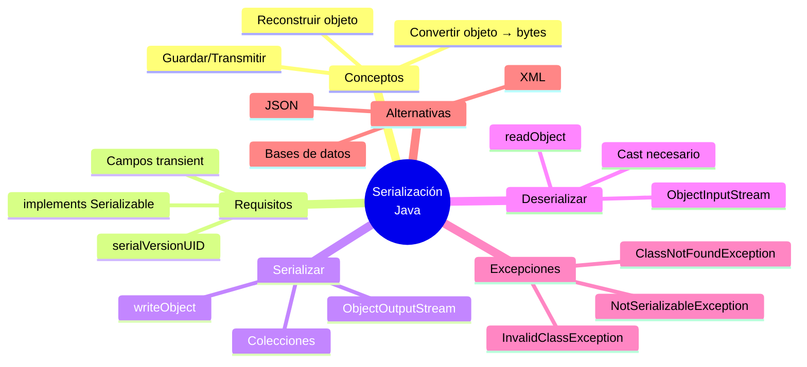

# 🔄 Serialización de Objetos

## 🎯 Introducción

> [!info]- 💡 ¿Qué es la Serialización?
> 
> La **serialización** es el proceso de convertir un objeto Java en una secuencia de bytes para poder:
> 
> - **Guardarlo** en un archivo
> - **Enviarlo** por la red
> - **Almacenarlo** en una base de datos
> 
> La **deserialización** es el proceso inverso: reconstruir el objeto desde los bytes.
> 
> **Analogía del mundo real:**
> 
> Imagina que quieres enviar un mueble por correo:
> 
> - **Serializar** → Desarmar el mueble, empacarlo en cajas
> - **Transmitir** → Enviar las cajas por correo
> - **Deserializar** → Recibir las cajas, rearmar el mueble
> 
> ```mermaid
> graph LR
>     A[🪑 Objeto Java<br/>en memoria] -->|Serialización| B[📦 Bytes<br/>secuencia]
>     B -->|Almacenar/Enviar| C[💾 Archivo<br/>o Red]
>     C -->|Deserialización| D[🪑 Objeto Java<br/>reconstruido]
>     
>     style A fill:#e1f5ff
>     style B fill:#fff4e1
>     style C fill:#ffe1e1
>     style D fill:#e1ffe1
> ```

---

## 📋 Requisitos para Serializar

### ✅ Implementar Serializable

> [!tip]- 🔖 La Interfaz Serializable
> 
> Para que un objeto sea serializable, su clase debe implementar `java.io.Serializable`.
> 
> ```java
> import java.io.Serializable;
> 
> public class Estudiante implements Serializable {
>     // ⚠️ Recomendado: versión de serialización
>     private static final long serialVersionUID = 1L;
>     
>     private String nombre;
>     private int edad;
>     private double promedio;
>     
>     // Constructores, getters, setters...
> }
> ```
> 
> **Características:**
> 
> - `Serializable` es una **interfaz marcadora** (sin métodos)
> - Solo indica que la clase "acepta" ser serializada
> - Si no la implementas → `NotSerializableException`

### 🔢 serialVersionUID

> [!warning]- 🆔 Control de Versiones
> 
> El `serialVersionUID` es un identificador único que garantiza compatibilidad entre versiones.
> 
> |Situación|Sin serialVersionUID|Con serialVersionUID|
> |---|---|---|
> |Modificas la clase|❌ Error al deserializar|✅ Funciona si cambios compatibles|
> |Control de versión|❌ Automático (impredecible)|✅ Manual (controlado)|
> |Recomendación|⚠️ No recomendado|✅ **Siempre incluirlo**|
> 
> ```java
> // ✅ RECOMENDADO
> private static final long serialVersionUID = 1L;
> 
> // ❌ NO RECOMENDADO (omitir)
> // Java genera uno automático basado en la estructura de la clase
> ```

### 🚫 Campos No Serializables

> [!example]- 🔒 Atributos transient y static
> 
> **1. Modificador `transient`:**
> 
> Excluye un campo de la serialización (útil para datos sensibles o temporales).
> 
> ```java
> public class Usuario implements Serializable {
>     private static final long serialVersionUID = 1L;
>     
>     private String username;
>     private transient String password; // ❌ NO se serializa
>     private transient int sessionId;   // ❌ NO se serializa
>     private String email;              // ✅ Se serializa
> }
> ```
> 
> **2. Campos `static`:**
> 
> Los campos estáticos NO se serializan (pertenecen a la clase, no al objeto).
> 
> ```java
> public class Configuracion implements Serializable {
>     private static final long serialVersionUID = 1L;
>     
>     private static String VERSION = "1.0"; // ❌ NO se serializa
>     private String nombreApp;              // ✅ Se serializa
> }
> ```
> 
> **Tabla comparativa:**
> 
> |Tipo de campo|¿Se serializa?|Valor al deserializar|
> |---|---|---|
> |Normal|✅ Sí|Valor guardado|
> |`transient`|❌ No|Valor por defecto (null, 0, false)|
> |`static`|❌ No|Valor actual de la clase|

---

## 📤 Serializar Objetos

### 🔧 Uso de ObjectOutputStream

> [!example]- 💾 Guardar Objetos en Archivo
> 
> **Proceso:**
> 
> ```mermaid
> sequenceDiagram
>     participant P as Programa
>     participant OOS as ObjectOutputStream
>     participant FOS as FileOutputStream
>     participant F as Archivo
>     
>     P->>OOS: writeObject(objeto)
>     OOS->>OOS: Convertir a bytes
>     OOS->>FOS: Escribir bytes
>     FOS->>F: Guardar en disco
>     F-->>P: ✅ Objeto guardado
> ```
> 
> **Código básico:**
> 
> ```java
> import java.io.*;
> 
> public class SerializacionBasica {
>     
>     public static void guardarEstudiante(Estudiante est, String archivo) {
>         try (ObjectOutputStream oos = new ObjectOutputStream(
>                 new FileOutputStream(archivo))) {
>             
>             oos.writeObject(est);
>             System.out.println("✅ Estudiante guardado");
>             
>         } catch (IOException e) {
>             System.out.println("❌ Error: " + e.getMessage());
>         }
>     }
> }
> ```

### 📚 Serializar Colecciones

> [!success]- 🗂️ Guardar Múltiples Objetos
> 
> **Opción 1: Serializar colección completa**
> 
> ```java
> public static void guardarLista(List<Estudiante> estudiantes, String archivo) {
>     try (ObjectOutputStream oos = new ObjectOutputStream(
>             new FileOutputStream(archivo))) {
>         
>         oos.writeObject(estudiantes); // ✅ Serializa toda la lista
>         System.out.println("✅ " + estudiantes.size() + " estudiantes guardados");
>         
>     } catch (IOException e) {
>         System.out.println("❌ Error: " + e.getMessage());
>     }
> }
> ```
> 
> **Opción 2: Serializar objetos uno por uno**
> 
> ```java
> public static void guardarMultiples(List<Estudiante> estudiantes, String archivo) {
>     try (ObjectOutputStream oos = new ObjectOutputStream(
>             new FileOutputStream(archivo))) {
>         
>         for (Estudiante est : estudiantes) {
>             oos.writeObject(est); // Escribir cada objeto
>         }
>         System.out.println("✅ " + estudiantes.size() + " objetos guardados");
>         
>     } catch (IOException e) {
>         System.out.println("❌ Error: " + e.getMessage());
>     }
> }
> ```
> 
> **Comparación:**
> 
> |Aspecto|Serializar colección|Serializar individual|
> |---|---|---|
> |**Código**|Más simple|Más control|
> |**Lectura**|Leer todo de una vez|Leer objeto por objeto|
> |**Flexibilidad**|Menos flexible|Más flexible|
> |**Recomendado**|✅ Listas pequeñas/medianas|Archivos grandes|

---

## 📥 Deserializar Objetos

### 🔧 Uso de ObjectInputStream

> [!example]- 📖 Leer Objetos desde Archivo
> 
> **Proceso:**
> 
> ```mermaid
> sequenceDiagram
>     participant F as Archivo
>     participant FIS as FileInputStream
>     participant OIS as ObjectInputStream
>     participant P as Programa
>     
>     P->>OIS: readObject()
>     OIS->>FIS: Leer bytes
>     FIS->>F: Cargar desde disco
>     F-->>OIS: Bytes
>     OIS->>OIS: Reconstruir objeto
>     OIS-->>P: ✅ Objeto restaurado
> ```
> 
> **Código básico:**
> 
> ```java
> public static Estudiante cargarEstudiante(String archivo) {
>     try (ObjectInputStream ois = new ObjectInputStream(
>             new FileInputStream(archivo))) {
>         
>         Estudiante est = (Estudiante) ois.readObject(); // ⚠️ Cast necesario
>         System.out.println("✅ Estudiante cargado");
>         return est;
>         
>     } catch (IOException | ClassNotFoundException e) {
>         System.out.println("❌ Error: " + e.getMessage());
>         return null;
>     }
> }
> ```

### 📚 Deserializar Colecciones

> [!success]- 🗂️ Cargar Múltiples Objetos
> 
> **Opción 1: Cargar colección completa**
> 
> ```java
> @SuppressWarnings("unchecked")
> public static List<Estudiante> cargarLista(String archivo) {
>     try (ObjectInputStream ois = new ObjectInputStream(
>             new FileInputStream(archivo))) {
>         
>         List<Estudiante> estudiantes = (List<Estudiante>) ois.readObject();
>         System.out.println("✅ " + estudiantes.size() + " estudiantes cargados");
>         return estudiantes;
>         
>     } catch (IOException | ClassNotFoundException e) {
>         System.out.println("❌ Error: " + e.getMessage());
>         return new ArrayList<>();
>     }
> }
> ```
> 
> **Opción 2: Cargar objetos uno por uno**
> 
> ```java
> public static List<Estudiante> cargarMultiples(String archivo) {
>     List<Estudiante> estudiantes = new ArrayList<>();
>     
>     try (ObjectInputStream ois = new ObjectInputStream(
>             new FileInputStream(archivo))) {
>         
>         while (true) {
>             try {
>                 Estudiante est = (Estudiante) ois.readObject();
>                 estudiantes.add(est);
>             } catch (EOFException e) {
>                 break; // ✅ Fin del archivo alcanzado
>             }
>         }
>         
>         System.out.println("✅ " + estudiantes.size() + " objetos cargados");
>         
>     } catch (IOException | ClassNotFoundException e) {
>         System.out.println("❌ Error: " + e.getMessage());
>     }
>     
>     return estudiantes;
> }
> ```

---

## ⚠️ Excepciones Comunes

> [!warning]- 🚨 Manejo de Errores
> 
> |Excepción|Causa|Solución|
> |---|---|---|
> |`NotSerializableException`|Clase no implementa `Serializable`|Añadir `implements Serializable`|
> |`InvalidClassException`|`serialVersionUID` no coincide|Actualizar `serialVersionUID` o regenerar clase|
> |`ClassNotFoundException`|Clase no existe al deserializar|Verificar que clase esté disponible|
> |`EOFException`|Fin de archivo alcanzado|✅ Normal al leer múltiples objetos|
> |`IOException`|Error de E/S general|Verificar permisos, espacio en disco|
> 
> **Ejemplo de manejo robusto:**
> 
> ```java
> public static Estudiante cargarSeguro(String archivo) {
>     File f = new File(archivo);
>     
>     // Validaciones previas
>     if (!f.exists()) {
>         System.out.println("❌ Archivo no existe");
>         return null;
>     }
>     
>     if (!f.canRead()) {
>         System.out.println("❌ Sin permisos de lectura");
>         return null;
>     }
>     
>     try (ObjectInputStream ois = new ObjectInputStream(
>             new FileInputStream(archivo))) {
>         
>         return (Estudiante) ois.readObject();
>         
>     } catch (InvalidClassException e) {
>         System.out.println("❌ Versión incompatible: " + e.getMessage());
>     } catch (ClassNotFoundException e) {
>         System.out.println("❌ Clase no encontrada: " + e.getMessage());
>     } catch (IOException e) {
>         System.out.println("❌ Error de E/S: " + e.getMessage());
>     }
>     
>     return null;
> }
> ```

---

## 🎯 Ejemplo Completo

> [!example]- 💼 Sistema de Gestión de Estudiantes
> 
> **Clase Estudiante:**
> 
> ```java
> import java.io.Serializable;
> 
> public class Estudiante implements Serializable {
>     private static final long serialVersionUID = 1L;
>     
>     private String nombre;
>     private int edad;
>     private double promedio;
>     private transient String password; // NO se guarda
>     
>     public Estudiante(String nombre, int edad, double promedio) {
>         this.nombre = nombre;
>         this.edad = edad;
>         this.promedio = promedio;
>     }
>     
>     @Override
>     public String toString() {
>         return String.format("Estudiante{nombre='%s', edad=%d, promedio=%.2f}",
>                            nombre, edad, promedio);
>     }
>     
>     // Getters y setters...
> }
> ```
> 
> **Clase GestorEstudiantes:**
> 
> ```java
> import java.io.*;
> import java.util.*;
> 
> public class GestorEstudiantes {
>     
>     // Guardar lista
>     public static boolean guardar(List<Estudiante> estudiantes, String archivo) {
>         try (ObjectOutputStream oos = new ObjectOutputStream(
>                 new FileOutputStream(archivo))) {
>             
>             oos.writeObject(estudiantes);
>             System.out.println("✅ " + estudiantes.size() + " estudiantes guardados");
>             return true;
>             
>         } catch (IOException e) {
>             System.out.println("❌ Error al guardar: " + e.getMessage());
>             return false;
>         }
>     }
>     
>     // Cargar lista
>     @SuppressWarnings("unchecked")
>     public static List<Estudiante> cargar(String archivo) {
>         File f = new File(archivo);
>         
>         if (!f.exists()) {
>             System.out.println("⚠️ Archivo no existe, creando lista vacía");
>             return new ArrayList<>();
>         }
>         
>         try (ObjectInputStream ois = new ObjectInputStream(
>                 new FileInputStream(archivo))) {
>             
>             List<Estudiante> estudiantes = (List<Estudiante>) ois.readObject();
>             System.out.println("✅ " + estudiantes.size() + " estudiantes cargados");
>             return estudiantes;
>             
>         } catch (IOException | ClassNotFoundException e) {
>             System.out.println("❌ Error al cargar: " + e.getMessage());
>             return new ArrayList<>();
>         }
>     }
>     
>     // Programa principal
>     public static void main(String[] args) {
>         String archivo = "estudiantes.dat";
>         
>         // Crear estudiantes
>         List<Estudiante> estudiantes = new ArrayList<>();
>         estudiantes.add(new Estudiante("Ana", 20, 8.5));
>         estudiantes.add(new Estudiante("Carlos", 22, 9.0));
>         estudiantes.add(new Estudiante("María", 21, 8.8));
>         
>         // Guardar
>         guardar(estudiantes, archivo);
>         
>         // Cargar
>         List<Estudiante> cargados = cargar(archivo);
>         
>         // Mostrar
>         System.out.println("\n📋 Estudiantes cargados:");
>         for (Estudiante est : cargados) {
>             System.out.println("  " + est);
>         }
>     }
> }
> ```

---

## 🆚 Serialización vs Otros Formatos

> [!note]- 📊 Comparación con Alternativas
> 
> |Aspecto|Serialización Java|JSON|XML|Base de Datos|
> |---|---|---|---|---|
> |**Facilidad**|✅ Muy fácil|Media|Complejo|Complejo|
> |**Portabilidad**|❌ Solo Java|✅ Universal|✅ Universal|✅ Universal|
> |**Legibilidad**|❌ Binario|✅ Texto|✅ Texto|N/A|
> |**Tamaño**|Medio|Pequeño|Grande|Variable|
> |**Velocidad**|✅ Rápida|Media|Lenta|Depende|
> |**Mejor para**|Objetos Java complejos|APIs, configs|Documentos|Grandes volúmenes|
> 
> ```mermaid
> graph TD
>     A{¿Qué usar?} --> B{¿Solo Java?}
>     B -->|Sí| C[Serialización Java]
>     B -->|No| D{¿Formato?}
>     
>     D --> E[Datos estructurados<br/>simples]
>     D --> F[Documentos<br/>complejos]
>     D --> G[Gran volumen<br/>consultas]
>     
>     E --> H[JSON]
>     F --> I[XML]
>     G --> J[Base de Datos]
>     
>     style C fill:#e1f5ff
>     style H fill:#e1ffe1
>     style I fill:#fff4e1
>     style J fill:#ffe1e1
> ```

---

## ✅ Mejores Prácticas

> [!tip]- 🏆 Recomendaciones
> 
> **1. SIEMPRE incluir serialVersionUID**
> 
> ```java
> private static final long serialVersionUID = 1L;
> ```
> 
> **2. Usar transient para datos sensibles**
> 
> ```java
> private transient String password;
> private transient int sessionToken;
> ```
> 
> **3. Validar antes de deserializar**
> 
> ```java
> File f = new File(archivo);
> if (!f.exists() || !f.canRead()) {
>     return null;
> }
> ```
> 
> **4. Manejar todas las excepciones**
> 
> ```java
> } catch (InvalidClassException e) {
>     // Versión incompatible
> } catch (ClassNotFoundException e) {
>     // Clase no existe
> } catch (IOException e) {
>     // Error general
> }
> ```
> 
> **5. Considerar alternativas modernas**
> 
> - Para intercambio de datos → JSON (Gson, Jackson)
> - Para configuraciones → Properties, YAML
> - Para persistencia → Bases de datos, JPA

---

## 📊 Resumen Visual



---

**Tags:** #java #serialización #objetos #persistencia #objectoutputstream #objectinputstream #serializable #transient