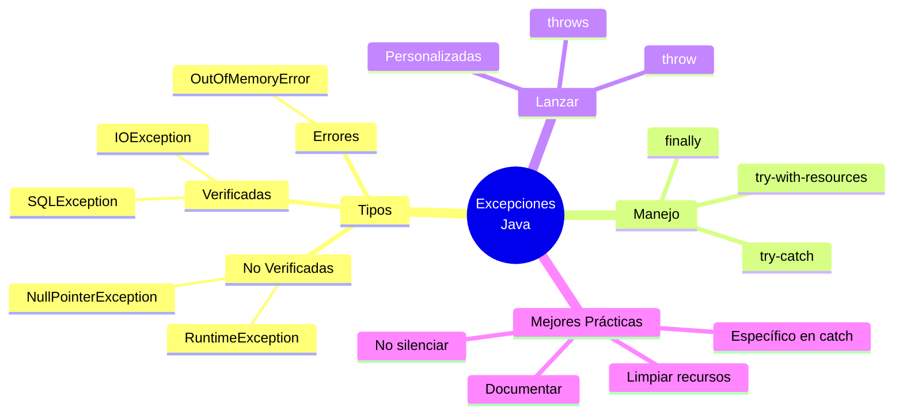

# ⚠️ Excepciones en Java

## 🎯 Introducción

> [!info]- 💡 ¿Qué es una Excepción?
> 
> Una **excepción** es un evento anormal que ocurre durante la ejecución de un programa y que interrumpe el flujo normal de instrucciones.
> 
> **Analogía del mundo real:**
> 
> Imagina que estás conduciendo:
> 
> - **Situación normal** → Conduces sin problemas
> - **Excepción** → Pinchazo en una llanta
> - **Manejo** → Detenerte, cambiar la llanta, continuar
> - **Sin manejo** → Accidente, daños mayores
> 
> ```mermaid
> graph LR
>     A[Programa<br/>ejecutándose] --> B{¿Ocurre<br/>error?}
>     B -->|No| C[Continuar<br/>normal]
>     B -->|Sí| D[Lanzar<br/>Excepción]
>     D --> E{¿Manejada?}
>     E -->|Sí| F[Ejecutar catch<br/>Recuperarse]
>     E -->|No| G[💥 Programa<br/>termina]
>     F --> C
>     
>     style C fill:#e1ffe1
>     style F fill:#fff4e1
>     style G fill:#ffe1e1
> ```

---

## 📚 Jerarquía de Excepciones

### 🌳 Árbol de Clases

> [!note]- 🗂️ Organización de Excepciones en Java
> 
> ```mermaid
> classDiagram
>     class Throwable {
>         <<Clase raíz>>
>         +getMessage()
>         +printStackTrace()
>     }
>     
>     class Error {
>         <<Errores graves>>
>         OutOfMemoryError
>         StackOverflowError
>     }
>     
>     class Exception {
>         <<Excepciones>>
>         Recuperables
>     }
>     
>     class RuntimeException {
>         <<No verificadas>>
>         NullPointerException
>         ArrayIndexOutOfBounds
>     }
>     
>     class IOException {
>         <<Verificadas>>
>         FileNotFoundException
>     }
>     
>     Throwable <|-- Error
>     Throwable <|-- Exception
>     Exception <|-- RuntimeException
>     Exception <|-- IOException
> ```
> 
> **Categorías principales:**
> 
> |Categoría|Descripción|¿Obligatorio manejar?|Ejemplos|
> |---|---|---|---|
> |**Error**|Problemas graves del sistema|❌ No (irrecuperables)|`OutOfMemoryError`, `StackOverflowError`|
> |**Exception**|Condiciones excepcionales|✅ Sí (verificadas)|`IOException`, `SQLException`|
> |**RuntimeException**|Errores de programación|❌ No (no verificadas)|`NullPointerException`, `ArithmeticException`|

### 🔍 Excepciones Verificadas vs No Verificadas

> [!tip]- 📋 Diferencias Clave
> 
> **Excepciones VERIFICADAS (Checked):**
> 
> - El compilador **obliga** a manejarlas
> - Deben estar en `try-catch` o declaradas con `throws`
> - Representan condiciones que **pueden ocurrir** fuera del control del programador
> 
> ```java
> // ❌ NO COMPILA - Falta manejo
> public void leerArchivo(String nombre) {
>     FileReader fr = new FileReader(nombre); // Error de compilación
> }
> 
> // ✅ OPCIÓN 1: try-catch
> public void leerArchivo(String nombre) {
>     try {
>         FileReader fr = new FileReader(nombre);
>     } catch (FileNotFoundException e) {
>         System.out.println("Archivo no encontrado");
>     }
> }
> 
> // ✅ OPCIÓN 2: throws
> public void leerArchivo(String nombre) throws FileNotFoundException {
>     FileReader fr = new FileReader(nombre);
> }
> ```
> 
> **Excepciones NO VERIFICADAS (Unchecked):**
> 
> - El compilador **NO** obliga a manejarlas
> - Heredan de `RuntimeException`
> - Representan **errores de programación** que deberían prevenirse
> 
> ```java
> // ✅ COMPILA - Aunque puede fallar en ejecución
> public void dividir(int a, int b) {
>     int resultado = a / b; // ArithmeticException si b == 0
> }
> 
> // ✅ MEJOR - Prevenir el error
> public void dividir(int a, int b) {
>     if (b == 0) {
>         System.out.println("❌ No se puede dividir por cero");
>         return;
>     }
>     int resultado = a / b;
> }
> ```
> 
> **Tabla comparativa:**
> 
> |Aspecto|Verificadas|No Verificadas|
> |---|---|---|
> |**Herencia**|`Exception`|`RuntimeException`|
> |**Compilador**|✅ Obliga a manejar|❌ No obliga|
> |**Cuándo ocurren**|Condiciones externas|Errores de lógica|
> |**Ejemplos**|`IOException`, `SQLException`|`NullPointerException`, `IndexOutOfBoundsException`|
> |**Prevención**|Difícil (externo)|✅ Posible (código)|

---

## 🛡️ Manejo de Excepciones

### 🔧 Bloque try-catch

> [!example]- 🎯 Sintaxis Básica
> 
> **Estructura:**
> 
> ```java
> try {
>     // Código que puede lanzar excepciones
>     
> } catch (TipoExcepcion1 e) {
>     // Manejar excepción tipo 1
>     
> } catch (TipoExcepcion2 e) {
>     // Manejar excepción tipo 2
>     
> } finally {
>     // SIEMPRE se ejecuta (opcional)
> }
> ```
> 
> **Flujo de ejecución:**
> 
> ```mermaid
> flowchart TD
>     A[Entrar try] --> B{¿Excepción?}
>     B -->|No| C[Ejecutar todo try]
>     B -->|Sí| D[Saltar a catch<br/>correspondiente]
>     C --> E{¿Hay finally?}
>     D --> E
>     E -->|Sí| F[Ejecutar finally]
>     E -->|No| G[Continuar programa]
>     F --> G
>     
>     style C fill:#e1ffe1
>     style D fill:#fff4e1
>     style F fill:#e1f5ff
> ```
> 
> **Ejemplo práctico:**
> 
> ```java
> public void leerNumero() {
>     Scanner sc = new Scanner(System.in);
>     
>     try {
>         System.out.print("Ingresa un número: ");
>         int numero = sc.nextInt();
>         System.out.println("✅ Número ingresado: " + numero);
>         
>     } catch (InputMismatchException e) {
>         System.out.println("❌ Error: Debes ingresar un número entero");
>         
>     } finally {
>         System.out.println("🔚 Fin del proceso");
>     }
> }
> ```

### 📦 Múltiples catch

> [!success]- 🎪 Manejar Diferentes Excepciones
> 
> **Orden IMPORTANTE: De más específico a más general**
> 
> ```java
> public void procesarArchivo(String nombre) {
>     try {
>         FileReader fr = new FileReader(nombre);
>         BufferedReader br = new BufferedReader(fr);
>         String linea = br.readLine();
>         int numero = Integer.parseInt(linea);
>         
>     } catch (FileNotFoundException e) {
>         // Más específico
>         System.out.println("❌ Archivo no encontrado: " + e.getMessage());
>         
>     } catch (NumberFormatException e) {
>         // Específico
>         System.out.println("❌ Formato de número inválido");
>         
>     } catch (IOException e) {
>         // Más general
>         System.out.println("❌ Error de E/S: " + e.getMessage());
>         
>     } catch (Exception e) {
>         // MÁS general (catch-all)
>         System.out.println("❌ Error desconocido: " + e.getMessage());
>     }
> }
> ```
> 
> **Multi-catch (Java 7+):**
> 
> ```java
> try {
>     // código...
>     
> } catch (FileNotFoundException | NumberFormatException e) {
>     // Manejar ambas excepciones igual
>     System.out.println("❌ Error: " + e.getMessage());
> }
> ```
> 
> **❌ ERROR COMÚN - Orden incorrecto:**
> 
> ```java
> try {
>     // código...
>     
> } catch (Exception e) {          // ❌ Demasiado general primero
>     System.out.println("Error");
>     
> } catch (IOException e) {         // ❌ NO COMPILA - Código inalcanzable
>     System.out.println("Error E/S");
> }
> ```

### 🔒 Bloque finally

> [!tip]- 🎯 Código que SIEMPRE se Ejecuta
> 
> El bloque `finally` se ejecuta **siempre**, haya o no excepción.
> 
> **Casos de uso:**
> 
> - Cerrar recursos (archivos, conexiones)
> - Liberar memoria
> - Registrar en logs
> - Limpiar estado
> 
> ```java
> public void procesarConRecursos() {
>     FileReader fr = null;
>     
>     try {
>         fr = new FileReader("datos.txt");
>         // procesar archivo...
>         
>     } catch (IOException e) {
>         System.out.println("❌ Error: " + e.getMessage());
>         
>     } finally {
>         // ✅ SIEMPRE se ejecuta
>         if (fr != null) {
>             try {
>                 fr.close();
>                 System.out.println("🔒 Archivo cerrado");
>             } catch (IOException e) {
>                 System.out.println("❌ Error al cerrar");
>             }
>         }
>     }
> }
> ```
> 
> **Situaciones donde se ejecuta finally:**
> 
> |Situación|¿Se ejecuta finally?|
> |---|---|
> |No hay excepción|✅ Sí|
> |Hay excepción capturada|✅ Sí|
> |Hay excepción NO capturada|✅ Sí (antes de terminar)|
> |Hay `return` en try|✅ Sí (antes del return)|
> |Hay `return` en catch|✅ Sí (antes del return)|
> |`System.exit()`|❌ No|
> |Error fatal del sistema|❌ No|

---

## 🚀 Lanzar Excepciones

### 💥 throw - Lanzar una Excepción

> [!example]- 🎯 Generar Excepciones Manualmente
> 
> **Sintaxis:**
> 
> ```java
> throw new TipoExcepcion("mensaje");
> ```
> 
> **Ejemplo - Validación:**
> 
> ```java
> public void setEdad(int edad) {
>     if (edad < 0) {
>         throw new IllegalArgumentException("❌ La edad no puede ser negativa");
>     }
>     if (edad > 150) {
>         throw new IllegalArgumentException("❌ Edad no válida");
>     }
>     this.edad = edad;
> }
> ```
> 
> **Ejemplo - Lógica de negocio:**
> 
> ```java
> public void retirarDinero(double cantidad) {
>     if (cantidad <= 0) {
>         throw new IllegalArgumentException("❌ Cantidad debe ser positiva");
>     }
>     if (cantidad > saldo) {
>         throw new IllegalStateException("❌ Saldo insuficiente");
>     }
>     saldo -= cantidad;
>     System.out.println("✅ Retiro exitoso");
> }
> ```
> 
> **Excepciones comunes para lanzar:**
> 
> |Excepción|Cuándo usarla|
> |---|---|
> |`IllegalArgumentException`|Parámetro inválido|
> |`IllegalStateException`|Objeto en estado inválido|
> |`NullPointerException`|Parámetro null inesperado|
> |`UnsupportedOperationException`|Operación no soportada|

### 📢 throws - Declarar Excepciones

> [!tip]- 📋 Propagar Excepciones
> 
> **Propósito:** Indicar que un método **puede lanzar** excepciones verificadas.
> 
> ```java
> public void metodo() throws ExcepcionTipo1, ExcepcionTipo2 {
>     // código que puede lanzar excepciones
> }
> ```
> 
> **Ejemplo:**
> 
> ```java
> // Método que DECLARA pero NO MANEJA
> public void leerArchivo(String nombre) throws IOException {
>     FileReader fr = new FileReader(nombre); // Puede lanzar IOException
>     BufferedReader br = new BufferedReader(fr);
>     String linea = br.readLine();
>     System.out.println(linea);
>     br.close();
> }
> 
> // Método que LLAMA debe MANEJAR o PROPAGAR
> public void procesarDatos() {
>     try {
>         leerArchivo("datos.txt");
>     } catch (IOException e) {
>         System.out.println("❌ Error al leer: " + e.getMessage());
>     }
> }
> ```
> 
> **Cadena de propagación:**
> 
> ```mermaid
> graph TD
>     A[metodoA<br/>throws IOException] --> B[metodoB<br/>throws IOException]
>     B --> C[metodoC<br/>throws IOException]
>     C --> D[main<br/>try-catch]
>     
>     D --> E{¿Manejada?}
>     E -->|Sí| F[✅ Programa continúa]
>     E -->|No| G[💥 Programa termina]
>     
>     style F fill:#e1ffe1
>     style G fill:#ffe1e1
> ```

---

## 🎨 Excepciones Personalizadas

> [!success]- 🏗️ Crear Tus Propias Excepciones
> 
> **Cuándo crear excepciones personalizadas:**
> 
> - Errores específicos de tu dominio
> - Mayor claridad en el código
> - Manejo diferenciado de errores
> 
> **Estructura básica:**
> 
> ```java
> // Excepción verificada (hereda de Exception)
> public class SaldoInsuficienteException extends Exception {
>     
>     public SaldoInsuficienteException() {
>         super("Saldo insuficiente para realizar la operación");
>     }
>     
>     public SaldoInsuficienteException(String mensaje) {
>         super(mensaje);
>     }
>     
>     public SaldoInsuficienteException(double saldo, double monto) {
>         super(String.format("Saldo: %.2f, Monto solicitado: %.2f", saldo, monto));
>     }
> }
> ```
> 
> ```java
> // Excepción no verificada (hereda de RuntimeException)
> public class UsuarioNoEncontradoException extends RuntimeException {
>     
>     private String username;
>     
>     public UsuarioNoEncontradoException(String username) {
>         super("Usuario no encontrado: " + username);
>         this.username = username;
>     }
>     
>     public String getUsername() {
>         return username;
>     }
> }
> ```
> 
> **Uso:**
> 
> ```java
> public class CuentaBancaria {
>     private double saldo;
>     
>     public void retirar(double monto) throws SaldoInsuficienteException {
>         if (monto > saldo) {
>             throw new SaldoInsuficienteException(saldo, monto);
>         }
>         saldo -= monto;
>     }
> }
> 
> // Manejo
> try {
>     cuenta.retirar(1000);
> } catch (SaldoInsuficienteException e) {
>     System.out.println("❌ " + e.getMessage());
>     // Acción específica para este tipo de error
> }
> ```

---

## 🔍 Información de Excepciones

> [!info]- 🛠️ Métodos Útiles de Throwable
> 
> |Método|Descripción|Uso|
> |---|---|---|
> |`getMessage()`|Mensaje de error|Mostrar al usuario|
> |`printStackTrace()`|Traza completa del error|Debug/desarrollo|
> |`toString()`|Nombre + mensaje|Logs|
> |`getCause()`|Excepción que causó esta|Análisis de cadena|
> 
> **Ejemplos:**
> 
> ```java
> try {
>     int resultado = 10 / 0;
>     
> } catch (ArithmeticException e) {
>     // 1. Mensaje simple
>     System.out.println("Mensaje: " + e.getMessage());
>     // Salida: Mensaje: / by zero
>     
>     // 2. toString completo
>     System.out.println("toString: " + e.toString());
>     // Salida: toString: java.lang.ArithmeticException: / by zero
>     
>     // 3. Stack trace completo (solo para debug)
>     e.printStackTrace();
>     // Salida: Múltiples líneas con toda la cadena de llamadas
> }
> ```
> 
> **⚠️ IMPORTANTE:**
> 
> ```java
> // ❌ MAL - Usuario final no necesita stack trace
> catch (Exception e) {
>     e.printStackTrace(); // Muestra todo el error técnico
> }
> 
> // ✅ BIEN - Mensaje amigable
> catch (FileNotFoundException e) {
>     System.out.println("❌ Archivo no encontrado: " + e.getMessage());
> }
> 
> // ✅ MEJOR - Logging profesional
> catch (IOException e) {
>     logger.error("Error de E/S: " + e.getMessage(), e);
>     System.out.println("❌ Ocurrió un error al procesar el archivo");
> }
> ```

---

## 📋 Excepciones Comunes

> [!note]- 🎯 Excepciones Frecuentes en Java
> 
> **Excepciones NO verificadas (RuntimeException):**
> 
> |Excepción|Causa|Prevención|
> |---|---|---|
> |`NullPointerException`|Llamar método en objeto null|Validar `!= null` antes|
> |`ArrayIndexOutOfBoundsException`|Índice fuera de rango|Verificar `< array.length`|
> |`ArithmeticException`|División por cero|Validar divisor `!= 0`|
> |`NumberFormatException`|Parsear string inválido|Usar try-catch al parsear|
> |`ClassCastException`|Cast inválido|Usar `instanceof` antes|
> |`IllegalArgumentException`|Argumento inválido|Validar parámetros|
> 
> **Excepciones verificadas (Exception):**
> 
> |Excepción|Causa|Manejo|
> |---|---|---|
> |`IOException`|Error de E/S general|try-catch o throws|
> |`FileNotFoundException`|Archivo no existe|Verificar con `File.exists()`|
> |`SQLException`|Error en BD|try-catch, transacciones|
> |`ClassNotFoundException`|Clase no encontrada|Verificar dependencias|
> |`InterruptedException`|Hilo interrumpido|Manejo apropiado de hilos|
> 
> **Ejemplos de prevención:**
> 
> ```java
> // NullPointerException
> if (objeto != null) {
>     objeto.metodo();
> }
> 
> // ArrayIndexOutOfBoundsException
> if (indice >= 0 && indice < array.length) {
>     valor = array[indice];
> }
> 
> // ArithmeticException
> if (divisor != 0) {
>     resultado = dividendo / divisor;
> }
> 
> // NumberFormatException
> try {
>     int numero = Integer.parseInt(texto);
> } catch (NumberFormatException e) {
>     System.out.println("Texto no es un número válido");
> }
> ```

---

## ✅ Mejores Prácticas

> [!tip]- 🏆 Recomendaciones Profesionales
> 
> **1. Ser específico en los catch**
> 
> ```java
> // ❌ MAL - Muy genérico
> try {
>     // código...
> } catch (Exception e) {
>     System.out.println("Error");
> }
> 
> // ✅ BIEN - Específico
> try {
>     // código...
> } catch (FileNotFoundException e) {
>     System.out.println("Archivo no encontrado");
> } catch (IOException e) {
>     System.out.println("Error de lectura");
> }
> ```
> 
> **2. No capturar excepciones silenciosamente**
> 
> ```java
> // ❌ MAL - Catch vacío
> try {
>     // código...
> } catch (IOException e) {
>     // No hacer nada - Error silencioso
> }
> 
> // ✅ BIEN - Al menos log
> try {
>     // código...
> } catch (IOException e) {
>     System.err.println("Error: " + e.getMessage());
>     // o logger.error("Error", e);
> }
> ```
> 
> **3. Limpiar recursos en finally o try-with-resources**
> 
> ```java
> // ❌ Forma antigua
> BufferedReader br = null;
> try {
>     br = new BufferedReader(new FileReader("file.txt"));
>     // usar br...
> } finally {
>     if (br != null) {
>         try {
>             br.close();
>         } catch (IOException e) {
>             e.printStackTrace();
>         }
>     }
> }
> 
> // ✅ Forma moderna (Java 7+)
> try (BufferedReader br = new BufferedReader(new FileReader("file.txt"))) {
>     // usar br...
> } // Se cierra automáticamente
> ```
> 
> **4. Documentar excepciones con @throws**
> 
> ```java
> /**
>  * Lee datos de un archivo.
>  * 
>  * @param nombreArchivo ruta del archivo
>  * @return contenido del archivo
>  * @throws FileNotFoundException si el archivo no existe
>  * @throws IOException si hay error de lectura
>  */
> public String leerArchivo(String nombreArchivo) 
>         throws FileNotFoundException, IOException {
>     // implementación...
> }
> ```
> 
> **5. No usar excepciones para control de flujo**
> 
> ```java
> // ❌ MAL - Excepciones para lógica normal
> try {
>     while (true) {
>         String linea = br.readLine();
>         if (linea == null) break;
>         procesar(linea);
>     }
> } catch (IOException e) {
>     // ...
> }
> 
> // ✅ BIEN - Control de flujo normal
> String linea;
> while ((linea = br.readLine()) != null) {
>     procesar(linea);
> }
> ```

---

## 🎯 Ejemplo Completo

> [!example]- 💼 Sistema de Registro de Estudiantes
> 
> ```java
> // Excepción personalizada
> public class EstudianteInvalidoException extends Exception {
>     public EstudianteInvalidoException(String mensaje) {
>         super(mensaje);
>     }
> }
> 
> // Clase principal
> public class GestorEstudiantes {
>     
>     public void registrarEstudiante(String nombre, int edad) 
>             throws EstudianteInvalidoException {
>         
>         // Validaciones
>         if (nombre == null || nombre.trim().isEmpty()) {
>             throw new EstudianteInvalidoException(
>                 "El nombre no puede estar vacío");
>         }
>         
>         if (edad < 0 || edad > 100) {
>             throw new EstudianteInvalidoException(
>                 "Edad inválida: " + edad);
>         }
>         
>         // Guardar en archivo
>         try (BufferedWriter bw = new BufferedWriter(
>                 new FileWriter("estudiantes.txt", true))) {
>             
>             bw.write(nombre + "," + edad);
>             bw.newLine();
>             System.out.println("✅ Estudiante registrado: " + nombre);
>             
>         } catch (IOException e) {
>             throw new EstudianteInvalidoException(
>                 "Error al guardar: " + e.getMessage());
>         }
>     }
>     
>     public static void main(String[] args) {
>         GestorEstudiantes gestor = new GestorEstudiantes();
>         Scanner sc = new Scanner(System.in);
>         
>         try {
>             System.out.print("Nombre: ");
>             String nombre = sc.nextLine();
>             
>             System.out.print("Edad: ");
>             int edad = sc.nextInt();
>             
>             gestor.registrarEstudiante(nombre, edad);
>             
>         } catch (InputMismatchException e) {
>             System.out.println("❌ Edad debe ser un número");
>             
>         } catch (EstudianteInvalidoException e) {
>             System.out.println("❌ " + e.getMessage());
>             
>         } finally {
>             sc.close();
>             System.out.println("🔚 Proceso finalizado");
>         }
>     }
> }
> ```

---

## 📊 Resumen Visual



---

**Tags:** #java #excepciones #try-catch #throw #throws #manejo-errores #exception #runtime-exception