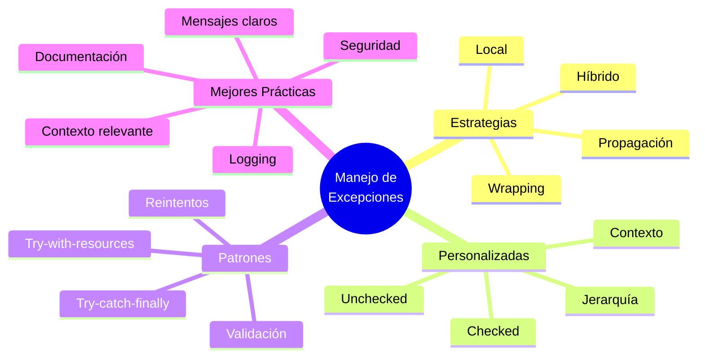

# 🎯 Manejo de Excepciones y Personalizadas

## 🎯 Introducción

> [!info]- 💡 ¿Por Qué Manejar Excepciones?
> 
> El **manejo de excepciones** permite que tu programa responda elegantemente a situaciones inesperadas en lugar de terminar abruptamente.
> 
> **Analogía del mundo real:**
> 
> Imagina un cajero automático:
> 
> - **Sin manejo** → Si falla, se apaga y deja al usuario confundido
> - **Con manejo** → Muestra mensaje "Servicio temporalmente no disponible, intente más tarde"
> 
> ```mermaid
> graph TD
>     A[Operación normal] --> B{¿Error?}
>     B -->|Sin manejo| C[💥 Programa termina<br/>Usuario frustrado]
>     B -->|Con manejo| D[⚠️ Mensaje amigable<br/>Alternativas ofrecidas]
>     D --> E[✅ Usuario satisfecho<br/>Continúa usando app]
>     
>     style C fill:#ffe1e1
>     style E fill:#e1ffe1
> ```

---

## 🛡️ Estrategias de Manejo

### 📋 Niveles de Manejo

> [!tip]- 🎚️ Dónde Manejar las Excepciones
> 
> **1. Manejo Local (en el método donde ocurre)**
> 
> ```java
> public void leerConfiguracion() {
>     try {
>         Properties props = new Properties();
>         props.load(new FileInputStream("config.properties"));
>         System.out.println("✅ Configuración cargada");
>         
>     } catch (IOException e) {
>         // Manejo inmediato
>         System.out.println("⚠️ Usando configuración por defecto");
>         cargarConfiguracionPorDefecto();
>     }
> }
> ```
> 
> **2. Propagación (dejar que el llamador maneje)**
> 
> ```java
> public void procesarArchivo(String ruta) throws IOException {
>     // NO maneja aquí, delega al llamador
>     BufferedReader br = new BufferedReader(new FileReader(ruta));
>     String linea = br.readLine();
>     br.close();
> }
> 
> public void metodoLlamador() {
>     try {
>         procesarArchivo("datos.txt");
>     } catch (IOException e) {
>         // El llamador decide qué hacer
>         System.out.println("❌ Error al procesar: " + e.getMessage());
>     }
> }
> ```
> 
> **3. Manejo Híbrido (captura, procesa y re-lanza)**
> 
> ```java
> public void guardarDatos(String archivo) throws IOException {
>     try {
>         FileWriter fw = new FileWriter(archivo);
>         // escribir datos...
>         fw.close();
>         
>     } catch (IOException e) {
>         // Log local
>         System.err.println("Error al guardar en: " + archivo);
>         // Re-lanzar para que niveles superiores también manejen
>         throw e;
>     }
> }
> ```
> 
> **Tabla de decisión:**
> 
> |Situación|Estrategia|Razón|
> |---|---|---|
> |Puedes recuperarte completamente|Manejo local|No hay que propagar el problema|
> |No sabes qué hacer|Propagación|Dejar que decida quien llamó|
> |Necesitas log pero también notificar|Híbrido|Doble responsabilidad|
> |Datos críticos|Propagación + log|Asegurar que se atienda en alto nivel|

### 🔄 Wrapping de Excepciones

> [!success]- 🎁 Encapsular Excepciones de Bajo Nivel
> 
> **Propósito:** Convertir excepciones técnicas en excepciones de negocio más significativas.
> 
> ```java
> // Excepción de negocio
> public class ErrorAlmacenamientoException extends Exception {
>     public ErrorAlmacenamientoException(String mensaje, Throwable causa) {
>         super(mensaje, causa);
>     }
> }
> 
> // Clase de repositorio
> public class RepositorioEstudiantes {
>     
>     public void guardar(Estudiante est) throws ErrorAlmacenamientoException {
>         try {
>             // Operación de bajo nivel
>             ObjectOutputStream oos = new ObjectOutputStream(
>                 new FileOutputStream("estudiantes.dat"));
>             oos.writeObject(est);
>             oos.close();
>             
>         } catch (IOException e) {
>             // Wrapping: convertir IOException técnica 
>             // en excepción de dominio
>             throw new ErrorAlmacenamientoException(
>                 "No se pudo guardar el estudiante: " + est.getNombre(), 
>                 e); // ⬅️ Preservar causa original
>         }
>     }
> }
> 
> // Uso
> try {
>     repo.guardar(estudiante);
> } catch (ErrorAlmacenamientoException e) {
>     System.out.println("❌ " + e.getMessage());
>     // Acceder a la causa original si se necesita
>     System.out.println("Causa técnica: " + e.getCause());
> }
> ```
> 
> **Ventajas del wrapping:**
> 
> ```mermaid
> graph LR
>     A[IOException<br/>Técnica] -->|Wrapping| B[ErrorAlmacenamientoException<br/>De negocio]
>     
>     A --> C[❌ Usuario no entiende<br/>'FileNotFoundException']
>     B --> D[✅ Usuario entiende<br/>'Error al guardar estudiante']
>     
>     style A fill:#ffe1e1
>     style B fill:#e1ffe1
>     style C fill:#fff4e1
>     style D fill:#e1f5ff
> ```

---

## 🏗️ Excepciones Personalizadas

### 📐 Diseño de Excepciones

> [!example]- 🎨 Crear Excepciones Significativas
> 
> **Estructura completa:**
> 
> ```java
> /**
>  * Excepción lanzada cuando una operación bancaria falla.
>  */
> public class OperacionBancariaException extends Exception {
>     
>     // Información adicional específica del dominio
>     private String numeroCuenta;
>     private double montoIntentado;
>     private TipoOperacion tipoOperacion;
>     
>     // Constructor básico
>     public OperacionBancariaException(String mensaje) {
>         super(mensaje);
>     }
>     
>     // Constructor con causa
>     public OperacionBancariaException(String mensaje, Throwable causa) {
>         super(mensaje, causa);
>     }
>     
>     // Constructor con datos del dominio
>     public OperacionBancariaException(String mensaje, 
>                                      String numeroCuenta,
>                                      double montoIntentado,
>                                      TipoOperacion tipo) {
>         super(mensaje);
>         this.numeroCuenta = numeroCuenta;
>         this.montoIntentado = montoIntentado;
>         this.tipoOperacion = tipo;
>     }
>     
>     // Getters para información adicional
>     public String getNumeroCuenta() { return numeroCuenta; }
>     public double getMontoIntentado() { return montoIntentado; }
>     public TipoOperacion getTipoOperacion() { return tipoOperacion; }
>     
>     @Override
>     public String toString() {
>         return String.format(
>             "OperacionBancariaException{tipo=%s, cuenta=%s, monto=%.2f, mensaje=%s}",
>             tipoOperacion, numeroCuenta, montoIntentado, getMessage()
>         );
>     }
> }
> 
> enum TipoOperacion {
>     RETIRO, DEPOSITO, TRANSFERENCIA
> }
> ```

### 🌳 Jerarquía de Excepciones Personalizadas

> [!note]- 📊 Organizar Excepciones por Dominio
> 
> **Estructura jerárquica:**
> 
> ```mermaid
> classDiagram
>     class Exception
>     
>     class AplicacionException {
>         <<Base de la aplicación>>
>     }
>     
>     class ErrorNegocioException {
>         <<Errores de lógica>>
>     }
>     
>     class ErrorTecnicoException {
>         <<Errores técnicos>>
>     }
>     
>     class SaldoInsuficienteException
>     class CuentaBloqueadaException
>     class LimiteExcedidoException
>     
>     class ErrorConexionException
>     class ErrorAlmacenamientoException
>     
>     Exception <|-- AplicacionException
>     AplicacionException <|-- ErrorNegocioException
>     AplicacionException <|-- ErrorTecnicoException
>     
>     ErrorNegocioException <|-- SaldoInsuficienteException
>     ErrorNegocioException <|-- CuentaBloqueadaException
>     ErrorNegocioException <|-- LimiteExcedidoException
>     
>     ErrorTecnicoException <|-- ErrorConexionException
>     ErrorTecnicoException <|-- ErrorAlmacenamientoException
> ```
> 
> **Implementación:**
> 
> ```java
> // Excepción raíz de la aplicación
> public class AplicacionException extends Exception {
>     public AplicacionException(String mensaje) {
>         super(mensaje);
>     }
>     
>     public AplicacionException(String mensaje, Throwable causa) {
>         super(mensaje, causa);
>     }
> }
> 
> // Categoría: Errores de negocio
> public class ErrorNegocioException extends AplicacionException {
>     public ErrorNegocioException(String mensaje) {
>         super(mensaje);
>     }
> }
> 
> // Excepciones específicas
> public class SaldoInsuficienteException extends ErrorNegocioException {
>     private double saldoActual;
>     private double montoRequerido;
>     
>     public SaldoInsuficienteException(double saldoActual, double montoRequerido) {
>         super(String.format(
>             "Saldo insuficiente. Disponible: %.2f, Requerido: %.2f",
>             saldoActual, montoRequerido
>         ));
>         this.saldoActual = saldoActual;
>         this.montoRequerido = montoRequerido;
>     }
>     
>     public double getSaldoActual() { return saldoActual; }
>     public double getMontoRequerido() { return montoRequerido; }
> }
> 
> public class CuentaBloqueadaException extends ErrorNegocioException {
>     private String motivo;
>     private LocalDate fechaBloqueo;
>     
>     public CuentaBloqueadaException(String motivo, LocalDate fecha) {
>         super("Cuenta bloqueada: " + motivo);
>         this.motivo = motivo;
>         this.fechaBloqueo = fecha;
>     }
>     
>     public String getMotivo() { return motivo; }
>     public LocalDate getFechaBloqueo() { return fechaBloqueo; }
> }
> ```

### 🎯 Checked vs Unchecked Personalizadas

> [!tip]- ⚖️ ¿Exception o RuntimeException?
> 
> **Regla de decisión:**
> 
> ```mermaid
> graph TD
>     A{¿El llamador puede<br/>recuperarse?} --> B[¿Es un error<br/>de programación?]
>     A --> C[¿Es una condición<br/>esperada de negocio?]
>     
>     B -->|Sí| D[RuntimeException<br/>No verificada]
>     C -->|Sí| E[Exception<br/>Verificada]
>     
>     D --> F[Ejemplos:<br/>ArgumentoInvalidoException<br/>EstadoInvalidoException]
>     E --> G[Ejemplos:<br/>SaldoInsuficienteException<br/>UsuarioNoEncontradoException]
>     
>     style D fill:#ffe1e1
>     style E fill:#e1ffe1
> ```
> 
> **Excepción VERIFICADA (extends Exception):**
> 
> ```java
> // Condición esperada que el llamador DEBE manejar
> public class SaldoInsuficienteException extends Exception {
>     public SaldoInsuficienteException(String mensaje) {
>         super(mensaje);
>     }
> }
> 
> // Uso: OBLIGA a manejar
> public void retirar(double monto) throws SaldoInsuficienteException {
>     if (monto > saldo) {
>         throw new SaldoInsuficienteException("Fondos insuficientes");
>     }
>     saldo -= monto;
> }
> ```
> 
> **Excepción NO VERIFICADA (extends RuntimeException):**
> 
> ```java
> // Error de programación que NO debería ocurrir
> public class MontoNegativoException extends RuntimeException {
>     public MontoNegativoException(double monto) {
>         super("El monto no puede ser negativo: " + monto);
>     }
> }
> 
> // Uso: NO obliga a manejar
> public void setMonto(double monto) {
>     if (monto < 0) {
>         throw new MontoNegativoException(monto);
>     }
>     this.monto = monto;
> }
> ```
> 
> **Tabla comparativa:**
> 
> |Aspecto|Checked (Exception)|Unchecked (RuntimeException)|
> |---|---|---|
> |**Compilador**|✅ Obliga a manejar|❌ No obliga|
> |**Propósito**|Condiciones de negocio esperadas|Errores de programación|
> |**Recuperación**|Posible y esperada|Difícil, requiere corrección|
> |**Ejemplos**|Saldo insuficiente, usuario no encontrado|Argumento null, índice inválido|
> |**Cuándo usar**|Situaciones fuera del control del programador|Violaciones de contratos/precondiciones|

---

## 🎭 Patrones de Manejo

### 🔄 Patrón: Try-Catch-Finally

> [!example]- 🎯 Manejo Completo de Recursos
> 
> ```java
> public class GestorArchivos {
>     
>     public List<String> leerArchivoRobusto(String ruta) {
>         BufferedReader br = null;
>         List<String> lineas = new ArrayList<>();
>         
>         try {
>             // 1. Abrir recurso
>             br = new BufferedReader(new FileReader(ruta));
>             
>             // 2. Procesar
>             String linea;
>             while ((linea = br.readLine()) != null) {
>                 lineas.add(linea);
>             }
>             
>             System.out.println("✅ Archivo leído: " + lineas.size() + " líneas");
>             
>         } catch (FileNotFoundException e) {
>             System.out.println("❌ Archivo no encontrado: " + ruta);
>             
>         } catch (IOException e) {
>             System.out.println("❌ Error de lectura: " + e.getMessage());
>             
>         } finally {
>             // 3. Limpiar SIEMPRE
>             if (br != null) {
>                 try {
>                     br.close();
>                     System.out.println("🔒 Recurso cerrado");
>                 } catch (IOException e) {
>                     System.err.println("⚠️ Error al cerrar: " + e.getMessage());
>                 }
>             }
>         }
>         
>         return lineas;
>     }
> }
> ```

### 🎁 Patrón: Try-With-Resources

> [!success]- ⚡ Forma Moderna (Java 7+)
> 
> ```java
> public List<String> leerArchivoModerno(String ruta) {
>     List<String> lineas = new ArrayList<>();
>     
>     // ✅ Cierre automático garantizado
>     try (BufferedReader br = new BufferedReader(new FileReader(ruta))) {
>         
>         String linea;
>         while ((linea = br.readLine()) != null) {
>             lineas.add(linea);
>         }
>         
>     } catch (FileNotFoundException e) {
>         System.out.println("❌ Archivo no encontrado: " + ruta);
>         
>     } catch (IOException e) {
>         System.out.println("❌ Error de lectura: " + e.getMessage());
>     }
>     // br.close() se llama automáticamente aquí
>     
>     return lineas;
> }
> ```
> 
> **Múltiples recursos:**
> 
> ```java
> public void copiarArchivo(String origen, String destino) {
>     try (BufferedReader br = new BufferedReader(new FileReader(origen));
>          BufferedWriter bw = new BufferedWriter(new FileWriter(destino))) {
>         
>         String linea;
>         while ((linea = br.readLine()) != null) {
>             bw.write(linea);
>             bw.newLine();
>         }
>         
>         System.out.println("✅ Archivo copiado");
>         
>     } catch (IOException e) {
>         System.out.println("❌ Error: " + e.getMessage());
>     }
>     // Ambos recursos se cierran en orden inverso
> }
> ```

### 🔁 Patrón: Reintentos

> [!tip]- 🔄 Intentar Múltiples Veces
> 
> ```java
> public class ConexionConReintentos {
>     
>     private static final int MAX_REINTENTOS = 3;
>     private static final int DELAY_MS = 1000;
>     
>     public boolean conectar(String servidor) {
>         int intento = 0;
>         
>         while (intento < MAX_REINTENTOS) {
>             try {
>                 System.out.println("🔄 Intento " + (intento + 1) + " de " + MAX_REINTENTOS);
>                 
>                 // Simular conexión
>                 realizarConexion(servidor);
>                 
>                 System.out.println("✅ Conexión exitosa");
>                 return true;
>                 
>             } catch (IOException e) {
>                 intento++;
>                 
>                 if (intento >= MAX_REINTENTOS) {
>                     System.out.println("❌ Falló después de " + MAX_REINTENTOS + " intentos");
>                     System.out.println("   Último error: " + e.getMessage());
>                     return false;
>                 }
>                 
>                 System.out.println("⚠️ Error: " + e.getMessage());
>                 System.out.println("   Reintentando en " + DELAY_MS + "ms...");
>                 
>                 try {
>                     Thread.sleep(DELAY_MS);
>                 } catch (InterruptedException ie) {
>                     Thread.currentThread().interrupt();
>                     return false;
>                 }
>             }
>         }
>         
>         return false;
>     }
>     
>     private void realizarConexion(String servidor) throws IOException {
>         // Implementación de conexión
>         if (Math.random() < 0.5) {
>             throw new IOException("Conexión rechazada");
>         }
>     }
> }
> ```

### 🎯 Patrón: Validación con Excepciones

> [!example]- ✅ Validación Defensiva
> 
> ```java
> public class ValidadorEstudiante {
>     
>     public void validarYGuardar(Estudiante est) 
>             throws ValidacionException, AlmacenamientoException {
>         
>         // 1. Validaciones rápidas con excepciones específicas
>         validarNombre(est.getNombre());
>         validarEdad(est.getEdad());
>         validarPromedio(est.getPromedio());
>         
>         // 2. Si todo OK, guardar
>         try {
>             guardarEnBaseDatos(est);
>         } catch (IOException e) {
>             throw new AlmacenamientoException(
>                 "Error al guardar estudiante", e);
>         }
>     }
>     
>     private void validarNombre(String nombre) throws ValidacionException {
>         if (nombre == null || nombre.trim().isEmpty()) {
>             throw new ValidacionException("El nombre no puede estar vacío");
>         }
>         if (nombre.length() < 3) {
>             throw new ValidacionException("El nombre es demasiado corto");
>         }
>         if (!nombre.matches("[a-zA-ZáéíóúÁÉÍÓÚñÑ ]+")) {
>             throw new ValidacionException("El nombre contiene caracteres inválidos");
>         }
>     }
>     
>     private void validarEdad(int edad) throws ValidacionException {
>         if (edad < 0) {
>             throw new ValidacionException("La edad no puede ser negativa");
>         }
>         if (edad < 16) {
>             throw new ValidacionException("Edad mínima: 16 años");
>         }
>         if (edad > 100) {
>             throw new ValidacionException("Edad máxima: 100 años");
>         }
>     }
>     
>     private void validarPromedio(double promedio) throws ValidacionException {
>         if (promedio < 0.0 || promedio > 10.0) {
>             throw new ValidacionException(
>                 "El promedio debe estar entre 0.0 y 10.0");
>         }
>     }
>     
>     private void guardarEnBaseDatos(Estudiante est) throws IOException {
>         // Implementación
>     }
> }
> 
> // Excepciones personalizadas
> class ValidacionException extends Exception {
>     public ValidacionException(String mensaje) {
>         super(mensaje);
>     }
> }
> 
> class AlmacenamientoException extends Exception {
>     public AlmacenamientoException(String mensaje, Throwable causa) {
>         super(mensaje, causa);
>     }
> }
> ```

---

## 🎯 Ejemplo Completo: Sistema Bancario

> [!example]- 💼 Caso Práctico Integral
> 
> **1. Jerarquía de excepciones:**
> 
> ```java
> // Excepción base
> public class BancoException extends Exception {
>     private LocalDateTime timestamp;
>     
>     public BancoException(String mensaje) {
>         super(mensaje);
>         this.timestamp = LocalDateTime.now();
>     }
>     
>     public BancoException(String mensaje, Throwable causa) {
>         super(mensaje, causa);
>         this.timestamp = LocalDateTime.now();
>     }
>     
>     public LocalDateTime getTimestamp() { return timestamp; }
> }
> 
> // Excepciones específicas
> public class SaldoInsuficienteException extends BancoException {
>     private double saldoDisponible;
>     private double montoSolicitado;
>     
>     public SaldoInsuficienteException(double saldo, double monto) {
>         super(String.format(
>             "Saldo insuficiente. Disponible: $%.2f, Solicitado: $%.2f",
>             saldo, monto));
>         this.saldoDisponible = saldo;
>         this.montoSolicitado = monto;
>     }
>     
>     public double getSaldoDisponible() { return saldoDisponible; }
>     public double getMontoSolicitado() { return montoSolicitado; }
>     public double getFaltante() { return montoSolicitado - saldoDisponible; }
> }
> 
> public class LimiteExcedidoException extends BancoException {
>     private double limiteActual;
>     private double montoIntentado;
>     
>     public LimiteExcedidoException(double limite, double monto) {
>         super(String.format(
>             "Límite diario excedido. Límite: $%.2f, Intentado: $%.2f",
>             limite, monto));
>         this.limiteActual = limite;
>         this.montoIntentado = monto;
>     }
> }
> 
> public class CuentaInactivaException extends BancoException {
>     private String numeroCuenta;
>     private String motivo;
>     
>     public CuentaInactivaException(String cuenta, String motivo) {
>         super("Cuenta inactiva: " + motivo);
>         this.numeroCuenta = cuenta;
>         this.motivo = motivo;
>     }
> }
> ```
> 
> **2. Clase CuentaBancaria:**
> 
> ```java
> public class CuentaBancaria {
>     private String numero;
>     private String titular;
>     private double saldo;
>     private double limiteDiario;
>     private double retiradoHoy;
>     private boolean activa;
>     
>     public CuentaBancaria(String numero, String titular, double saldoInicial) {
>         this.numero = numero;
>         this.titular = titular;
>         this.saldo = saldoInicial;
>         this.limiteDiario = 5000.0;
>         this.retiradoHoy = 0.0;
>         this.activa = true;
>     }
>     
>     public void retirar(double monto) throws BancoException {
>         // Validaciones
>         validarMonto(monto);
>         validarCuentaActiva();
>         validarSaldo(monto);
>         validarLimiteDiario(monto);
>         
>         // Realizar operación
>         saldo -= monto;
>         retiradoHoy += monto;
>         
>         System.out.println(String.format(
>             "✅ Retiro exitoso: $%.2f | Saldo: $%.2f", monto, saldo));
>     }
>     
>     public void depositar(double monto) throws BancoException {
>         validarMonto(monto);
>         validarCuentaActiva();
>         
>         saldo += monto;
>         System.out.println(String.format(
>             "✅ Depósito exitoso: $%.2f | Saldo: $%.2f", monto, saldo));
>     }
>     
>     public void transferir(CuentaBancaria destino, double monto) 
>             throws BancoException {
>         if (destino == null) {
>             throw new IllegalArgumentException("Cuenta destino no puede ser null");
>         }
>         
>         // Retirar de origen
>         retirar(monto);
>         
>         try {
>             // Depositar en destino
>             destino.depositar(monto);
>             System.out.println("✅ Transferencia completada");
>             
>         } catch (BancoException e) {
>             // Si falla el depósito, revertir el retiro
>             saldo += monto;
>             retiradoHoy -= monto;
>             throw new BancoException(
>                 "Error en transferencia, operación revertida", e);
>         }
>     }
>     
>     // Validaciones privadas
>     private void validarMonto(double monto) throws IllegalArgumentException {
>         if (monto <= 0) {
>             throw new IllegalArgumentException(
>                 "El monto debe ser mayor a cero");
>         }
>     }
>     
>     private void validarCuentaActiva() throws CuentaInactivaException {
>         if (!activa) {
>             throw new CuentaInactivaException(numero, "Cuenta suspendida");
>         }
>     }
>     
>     private void validarSaldo(double monto) throws SaldoInsuficienteException {
>         if (monto > saldo) {
>             throw new SaldoInsuficienteException(saldo, monto);
>         }
>     }
>     
>     private void validarLimiteDiario(double monto) throws LimiteExcedidoException {
>         double totalRetirado = retiradoHoy + monto;
>         if (totalRetirado > limiteDiario) {
>             throw new LimiteExcedidoException(limiteDiario, totalRetirado);
>         }
>     }
>     
>     // Getters
>     public String getNumero() { return numero; }
>     public String getTitular() { return titular; }
>     public double getSaldo() { return saldo; }
> }
> ```
> 
> **3. Programa principal con manejo:**
> 
> ```java
> public class SistemaBancario {
>     
>     public static void main(String[] args) {
>         CuentaBancaria cuenta1 = new CuentaBancaria("001", "Ana García", 10000);
>         CuentaBancaria cuenta2 = new CuentaBancaria("002", "Carlos Ruiz", 5000);
>         
>         // Caso 1: Retiro exitoso
>         try {
>             cuenta1.retirar(2000);
>         } catch (BancoException e) {
>             manejarError(e);
>         }
>         
>         // Caso 2: Saldo insuficiente
>         try {
>             cuenta1.retirar(15000);
>         } catch (SaldoInsuficienteException e) {
>             System.out.println("❌ " + e.getMessage());
>             System.out.println("   Faltante: $" + e.getFaltante());
>     } catch (BancoException e) {
>         manejarError(e);
>     }
>     
>     // Caso 3: Límite excedido
>     try {
>         cuenta1.retirar(4000);
>         cuenta1.retirar(2000); // Excede límite diario
>     } catch (LimiteExcedidoException e) {
>         System.out.println("❌ " + e.getMessage());
>         System.out.println("   Intente mañana");
>     } catch (BancoException e) {
>         manejarError(e);
>     }
>     
>     // Caso 4: Transferencia con manejo completo
>     try {
>         cuenta1.transferir(cuenta2, 3000);
>     } catch (SaldoInsuficienteException e) {
>         System.out.println("❌ No se pudo completar la transferencia");
>         System.out.println("   " + e.getMessage());
>         ofrecerAlternativas(e.getSaldoDisponible());
>     } catch (BancoException e) {
>         System.out.println("❌ Error en transferencia: " + e.getMessage());
>         if (e.getCause() != null) {
>             System.out.println("   Causa: " + e.getCause().getMessage());
>         }
>     }
> }
> 
> private static void manejarError(BancoException e) {
>     System.out.println("❌ Error bancario: " + e.getMessage());
>     System.out.println("   Fecha/Hora: " + e.getTimestamp());
> }
> 
> private static void ofrecerAlternativas(double saldoDisponible) {
>     System.out.println("\n💡 Alternativas:");
>     System.out.println("   1. Transferir solo $" + saldoDisponible);
>     System.out.println("   2. Depositar fondos adicionales");
>     System.out.println("   3. Solicitar un préstamo");
> }
> 
> 
> }
> ```

---

## ✅ Mejores Prácticas Avanzadas

> [!tip]- 🏆 Recomendaciones Profesionales
> 
> **1. Mensajes descriptivos y accionables**
> 
> ```java
> // ❌ MAL
> throw new Exception("Error");
> 
> // ✅ BIEN
> throw new SaldoInsuficienteException(
>     "Saldo insuficiente para completar el retiro. " +
>     "Disponible: $" + saldo + ", Solicitado: $" + monto + ". " +
>     "Por favor deposite al menos $" + (monto - saldo) + " adicionales.");
> ```
> 
> **2. Incluir contexto relevante**
> 
> ```java
> public class TransaccionException extends Exception {
>     private String tipoTransaccion;
>     private String cuentaOrigen;
>     private String cuentaDestino;
>     private double monto;
>     
>     // Constructor con todo el contexto
>     public TransaccionException(String mensaje, 
>                                String tipo,
>                                String origen,
>                                String destino,
>                                double monto,
>                                Throwable causa) {
>         super(mensaje, causa);
>         this.tipoTransaccion = tipo;
>         this.cuentaOrigen = origen;
>         this.cuentaDestino = destino;
>         this.monto = monto;
>     }
> }
> ```
> 
> **3. No exponer detalles internos**
> 
> ```java
> // ❌ MAL - Expone estructura interna
> catch (SQLException e) {
>     throw new Exception("Error en tabla USERS columna PWD: " + e);
> }
> 
> // ✅ BIEN - Mensaje genérico para usuario
> catch (SQLException e) {
>     logger.error("Error de BD", e); // Log técnico
>     throw new ErrorAlmacenamientoException(
>         "No se pudo guardar la información", e);
> }
> ```
> 
> **4. Documentar con JavaDoc**
> 
> ```java
> /**
>  * Retira dinero de la cuenta.
>  * 
>  * @param monto cantidad a retirar
>  * @throws SaldoInsuficienteException si no hay fondos suficientes
>  * @throws LimiteExcedidoException si supera el límite diario
>  * @throws CuentaInactivaException si la cuenta está suspendida
>  * @throws IllegalArgumentException si el monto es <= 0
>  */
> public void retirar(double monto) throws BancoException {
>     // implementación
> }
> ```
> 
> **5. Logging estructurado**
> 
> ```java
> catch (IOException e) {
>     // Log completo para desarrolladores
>     logger.error("Error al procesar archivo: {}", 
>                  archivo, e);
>     
>     // Mensaje simple para usuarios
>     System.out.println("❌ No se pudo procesar el archivo");
> }
> ```

---

## 📊 Resumen Visual



---

**Tags:** #java #excepciones #manejo #personalizadas #try-catch #throws #mejores-practicas #patrones