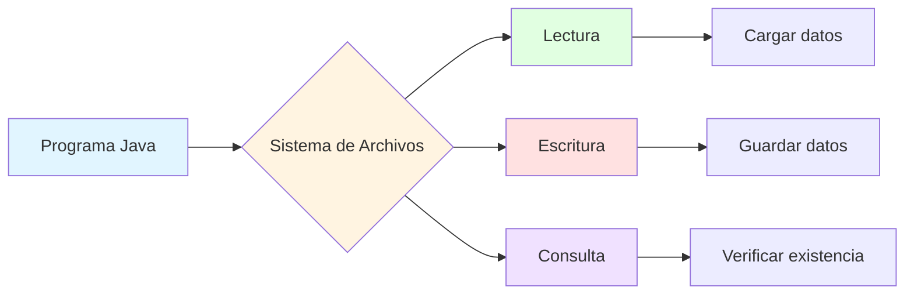
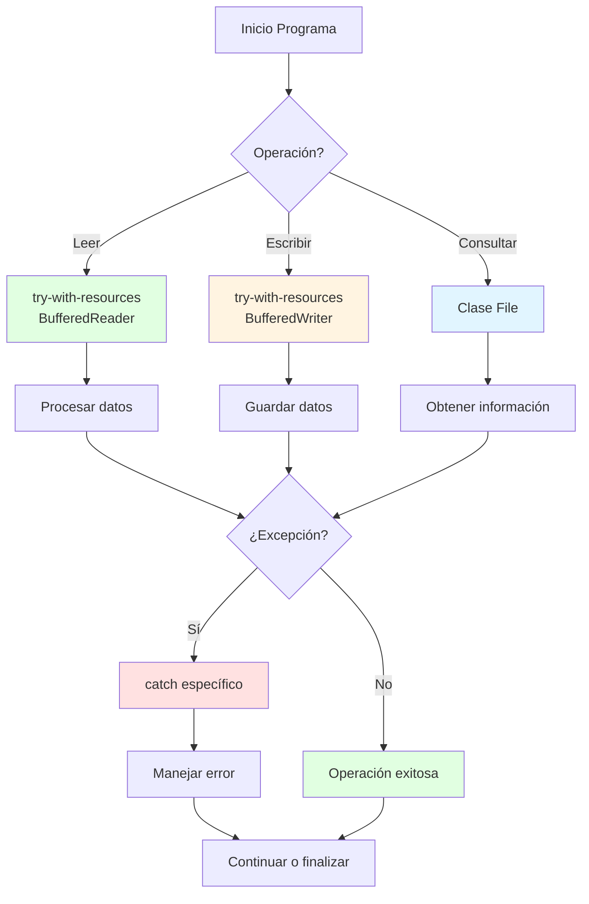

# 📁 Manipulación de Archivos y Manejo de Excepciones en Java

## 🎯 Introducción

> [!info]- 💡 ¿Qué es la Manipulación de Archivos? La **manipulación de archivos** es una capacidad fundamental en programación que permite a las aplicaciones interactuar con el sistema de archivos del ordenador. Esta funcionalidad es esencial para lograr la **persistencia de datos**, es decir, mantener información disponible más allá del ciclo de vida de un programa.
> 
> **Analogía práctica:** Imagina un bibliotecario organizando documentos físicos. El bibliotecario puede:
> 
> - **Consultar** información de documentos existentes (lectura)
> - **Registrar** nueva información en documentos (escritura)
> - **Verificar** la existencia y estado de documentos
> - **Manejar problemas** como documentos extraviados, permisos denegados o estantes llenos
> 
> **¿Por qué es importante?**
> 
> |Aspecto|Descripción|Ejemplo de Uso|
> |---|---|---|
> |**Persistencia**|Los datos sobreviven al cierre del programa|Configuraciones, progreso de juegos|
> |**Compartir información**|Diferentes aplicaciones intercambian datos|Archivos CSV, XML, JSON|
> |**Almacenamiento masivo**|Manejar grandes volúmenes de datos|Logs, bases de datos de texto|
> |**Configuración**|Guardar preferencias del usuario|Ajustes, temas, idioma|
> |**Registros históricos**|Mantener logs y auditorías|Historial de transacciones|



---

## 🚨 Fundamentos del Manejo de Excepciones

### 📋 Concepto de Excepción

> [!example]- ⚠️ ¿Qué son las Excepciones?
> 
> Una **excepción** es un evento que interrumpe el flujo normal de ejecución de un programa. Representa una situación anómala o error que ocurre durante la ejecución del código.
> 
> **Ejemplo simple:**
> 
> ```java
> // Sin manejo de excepciones - El programa se detiene abruptamente
> int resultado = 10 / 0;  // ❌ ArithmeticException
> System.out.println("Esto nunca se ejecutará");
> 
> // Con manejo de excepciones - El programa continúa
> try {
>     int resultado = 10 / 0;
> } catch (ArithmeticException e) {
>     System.out.println("⚠️ Error: División por cero");
> }
> System.out.println("✅ El programa continúa normalmente");
> ```
> 
> **Tipos de situaciones excepcionales:**
> 
> |Tipo de Error|Descripción|Cuándo Ocurre|
> |---|---|---|
> |**Aritméticos**|Operaciones matemáticas inválidas|División por cero, desbordamiento|
> |**Índices**|Acceso fuera de límites|Array[10] cuando solo tiene 5 elementos|
> |**Conversión**|Transformación de datos fallida|Convertir "abc" a número|
> |**Referencias**|Uso de objetos no inicializados|Llamar método en variable null|
> |**Entrada/Salida**|Problemas con archivos|Archivo no existe, sin permisos|
> 
> **Flujo del programa:**
> 
> ```mermaid
> graph TD
>     A[Inicio del programa] --> B{¿Hay try-catch?}
>     B -->|No| C[Ejecutar código]
>     C --> D{¿Ocurre error?}
>     D -->|Sí| E[❌ Programa termina]
>     D -->|No| F[✅ Continúa normalmente]
>     
>     B -->|Sí| G[Ejecutar bloque try]
>     G --> H{¿Ocurre error?}
>     H -->|Sí| I[Ejecutar catch]
>     H -->|No| J[Saltar catch]
>     I --> K[✅ Continúa normalmente]
>     J --> K
>     
>     style E fill:#ffe1e1
>     style F fill:#e1ffe1
>     style K fill:#e1ffe1
> ```

### 🌳 Jerarquía de Excepciones en Java

> [!note]- 📊 Organización de las Clases de Excepciones
> 
> Java organiza las excepciones en una jerarquía que hereda de `Throwable`. Esta estructura determina cómo se manejan los errores.
> 
> ```mermaid
> classDiagram
>     Throwable <|-- Error
>     Throwable <|-- Exception
>     Exception <|-- IOException
>     Exception <|-- SQLException
>     Exception <|-- RuntimeException
>     RuntimeException <|-- NullPointerException
>     RuntimeException <|-- ArithmeticException
>     RuntimeException <|-- ArrayIndexOutOfBoundsException
>     IOException <|-- FileNotFoundException
>     
>     class Throwable{
>         +getMessage()
>         +printStackTrace()
>     }
>     class Error{
>         Errores del sistema
>         No recuperables
>     }
>     class Exception{
>         Excepciones recuperables
>         Deben manejarse
>     }
>     class RuntimeException{
>         Errores de programación
>         No requieren manejo explícito
>     }
> ```
> 
> **Categorías fundamentales:**
> 
> |Categoría|Verificación|Manejo Obligatorio|Causa Típica|Ejemplos|
> |---|---|---|---|---|
> |**Checked**|Compilación|✅ Sí|Factores externos|IOException, SQLException|
> |**Unchecked**|Ejecución|❌ No|Error de lógica|NullPointerException, ArithmeticException|
> |**Error**|Ejecución|❌ No|Fallo del sistema|OutOfMemoryError, StackOverflowError|
> 
> **Ejemplos de cada tipo:**
> 
> ```java
> // 1. CHECKED EXCEPTION - Debe manejarse obligatoriamente
> try {
>     FileReader file = new FileReader("datos.txt");
> } catch (FileNotFoundException e) {
>     System.out.println("Archivo no encontrado");
> }
> 
> // 2. UNCHECKED EXCEPTION - Manejo opcional (pero recomendado)
> String texto = null;
> // texto.length();  // ❌ NullPointerException en ejecución
> if (texto != null) {
>     texto.length();  // ✅ Prevención con validación
> }
> 
> // 3. ERROR - No debe capturarse normalmente
> // OutOfMemoryError - Indica problema grave del sistema
> ```
> 
> **Diferencias clave:**
> 
> ```mermaid
> graph LR
>     A[Throwable] --> B[Exception<br/>Recuperable]
>     A --> C[Error<br/>No Recuperable]
>     B --> D[Checked<br/>Compilador lo verifica]
>     B --> E[Unchecked<br/>No verificado]
>     
>     D --> F[IOException<br/>FileNotFoundException]
>     E --> G[RuntimeException<br/>NullPointerException]
>     C --> H[OutOfMemoryError<br/>StackOverflowError]
>     
>     style D fill:#ffe1e1
>     style E fill:#fff4e1
>     style C fill:#e1e1e1
> ```

### 🛡️ Bloques try-catch-finally

> [!success]- 🔧 Estructura del Manejo de Excepciones
> 
> **Anatomía de try-catch-finally:**
> 
> ```java
> try {
>     // 1. Código que puede generar excepciones
>     int resultado = 10 / 0;
>     
> } catch (ArithmeticException e) {
>     // 2. Manejo específico de error aritmético
>     System.out.println("Error: " + e.getMessage());
>     
> } catch (Exception e) {
>     // 3. Captura cualquier otra excepción
>     System.out.println("Error inesperado");
>     
> } finally {
>     // 4. Siempre se ejecuta (opcional)
>     System.out.println("Limpieza de recursos");
> }
> ```
> 
> **Flujo de ejecución:**
> 
> ```mermaid
> flowchart TD
>     A[Inicio] --> B[Bloque TRY]
>     B --> C{¿Excepción?}
>     C -->|No| D[Saltar CATCH]
>     C -->|Sí| E[Buscar CATCH compatible]
>     E --> F{¿Encontrado?}
>     F -->|Sí| G[Ejecutar CATCH]
>     F -->|No| H[Propagar excepción]
>     D --> I[Bloque FINALLY]
>     G --> I
>     I --> J[Fin]
>     H --> K[Terminar programa]
>     
>     style C fill:#fff4e1
>     style I fill:#e1ffe1
>     style K fill:#ffe1e1
> ```
> 
> **Componentes explicados:**
> 
> |Bloque|Propósito|¿Obligatorio?|Cuándo se ejecuta|
> |---|---|---|---|
> |**try**|Contiene código riesgoso|✅ Sí|Siempre primero|
> |**catch**|Maneja excepciones específicas|⚠️ Al menos uno|Solo si hay excepción|
> |**finally**|Limpieza de recursos|❌ No|Siempre (incluso con return)|
> 
> **Ejemplo con múltiples catch:**
> 
> ```java
> public void procesarDatos(String[] datos, int indice) {
>     try {
>         String valor = datos[indice];           // Puede: ArrayIndexOutOfBoundsException
>         int numero = Integer.parseInt(valor);   // Puede: NumberFormatException
>         int resultado = 100 / numero;            // Puede: ArithmeticException
>         System.out.println("Resultado: " + resultado);
>         
>     } catch (ArrayIndexOutOfBoundsException e) {
>         System.out.println("❌ Índice fuera de rango");
>     } catch (NumberFormatException e) {
>         System.out.println("❌ No es un número válido");
>     } catch (ArithmeticException e) {
>         System.out.println("❌ División por cero");
>     } finally {
>         System.out.println("📋 Procesamiento finalizado");
>     }
> }
> ```
> 
> **Multi-catch (Java 7+):**
> 
> ```java
> try {
>     // Código riesgoso
> } catch (IOException | SQLException e) {
>     // Manejar ambas excepciones de la misma forma
>     System.out.println("Error de entrada/salida o base de datos");
> }
> ```
> 
> **Orden de catch:**
> 
> ```mermaid
> graph TD
>     A[Excepción lanzada] --> B{catch específico<br/>primero}
>     B -->|Match| C[Ejecutar este catch]
>     B -->|No match| D{catch más general}
>     D -->|Match| E[Ejecutar este catch]
>     D -->|No match| F[Propagar excepción]
>     
>     style B fill:#e1ffe1
>     style D fill:#fff4e1
>     style F fill:#ffe1e1
> ```

### 🎯 Propagación y Lanzamiento de Excepciones

> [!tip]- 🚀 throws y throw
> 
> **1. Declaración con `throws`**
> 
> Declara que un método puede lanzar ciertas excepciones, transfiriendo la responsabilidad al llamador.
> 
> ```java
> // Método que DECLARA posibles excepciones
> public void leerArchivo(String nombre) throws IOException {
>     FileReader fr = new FileReader(nombre);
>     // ... trabajar con el archivo
>     fr.close();
> }
> 
> // El llamador DEBE manejar la excepción
> public void usarArchivo() {
>     try {
>         leerArchivo("datos.txt");
>     } catch (IOException e) {
>         System.out.println("Error al leer: " + e.getMessage());
>     }
> }
> ```
> 
> **2. Lanzamiento con `throw`**
> 
> Lanza una excepción manualmente, útil para validaciones.
> 
> ```java
> public void validarEdad(int edad) {
>     if (edad < 0) {
>         throw new IllegalArgumentException("Edad no puede ser negativa");
>     }
>     if (edad > 150) {
>         throw new IllegalArgumentException("Edad no realista: " + edad);
>     }
>     System.out.println("✅ Edad válida: " + edad);
> }
> ```
> 
> **Flujo de throws y throw:**
> 
> ```mermaid
> sequenceDiagram
>     participant C as Código Cliente
>     participant M as Método con throws
>     participant S as Sistema
>     
>     C->>M: llamar método()
>     M->>M: detectar error
>     M->>M: throw new Exception()
>     M-->>C: throws Exception
>     C->>C: try-catch
>     C->>C: manejar excepción
>     C->>S: continuar ejecución
> ```
> 
> **3. Excepciones personalizadas:**
> 
> ```java
> // Definir excepción personalizada
> public class SaldoInsuficienteException extends Exception {
>     private double saldo;
>     private double montoRequerido;
>     
>     public SaldoInsuficienteException(double saldo, double montoRequerido) {
>         super("Saldo insuficiente. Tiene: $" + saldo + 
>               ", Requiere: $" + montoRequerido);
>         this.saldo = saldo;
>         this.montoRequerido = montoRequerido;
>     }
>     
>     public double getFaltante() {
>         return montoRequerido - saldo;
>     }
> }
> 
> // Usar la excepción personalizada
> public void retirar(double monto) throws SaldoInsuficienteException {
>     if (monto > saldo) {
>         throw new SaldoInsuficienteException(saldo, monto);
>     }
>     saldo -= monto;
> }
> ```
> 
> **Comparación throws vs throw:**
> 
> |Aspecto|throws|throw|
> |---|---|---|
> |**Ubicación**|Firma del método|Dentro del método|
> |**Propósito**|Declarar posibles excepciones|Lanzar excepción actual|
> |**Cantidad**|Múltiples (separadas por coma)|Una a la vez|
> |**Ejemplo**|`void metodo() throws IOException`|`throw new IOException()`|

---

## 📂 Sistema de Archivos en Java

### 🗂️ Clase File: Representación Abstracta

> [!info]- 📄 Concepto y Funcionalidad de File
> 
> La clase `File` representa rutas en el sistema de archivos, **NO el contenido** del archivo.
> 
> **Creación de objetos File:**
> 
> ```java
> import java.io.File;
> 
> // Diferentes formas de crear File
> File archivo1 = new File("datos.txt");                    // Ruta relativa
> File archivo2 = new File("carpeta/subcarpeta/datos.txt"); // Ruta con directorios
> File archivo3 = new File("carpeta", "datos.txt");          // Padre + nombre
> 
> // Usar separador del sistema (portable)
> File archivo4 = new File("carpeta" + File.separator + "datos.txt");
> ```
> 
> **Operaciones principales:**
> 
> |Método|Descripción|Retorna|Ejemplo de Uso|
> |---|---|---|---|
> |`exists()`|Verifica si existe|boolean|Antes de leer/escribir|
> |`isFile()`|Es un archivo|boolean|Distinguir archivo de directorio|
> |`isDirectory()`|Es un directorio|boolean|Antes de listar contenido|
> |`getName()`|Nombre del archivo|String|Mostrar nombre al usuario|
> |`getPath()`|Ruta como se creó|String|Logging, debug|
> |`getAbsolutePath()`|Ruta completa|String|Saber ubicación real|
> |`length()`|Tamaño en bytes|long|Verificar espacio necesario|
> |`canRead()`|Permisos de lectura|boolean|Antes de intentar leer|
> |`canWrite()`|Permisos de escritura|boolean|Antes de intentar escribir|
> |`delete()`|Eliminar archivo|boolean|Limpiar archivos temporales|
> |`createNewFile()`|Crear archivo vacío|boolean|Inicializar nuevo archivo|
> |`mkdir()`|Crear directorio|boolean|Un nivel|
> |`mkdirs()`|Crear directorios anidados|boolean|Múltiples niveles|
> |`list()`|Listar nombres|String[]|Contenido de directorio|
> |`listFiles()`|Listar como File|File[]|Información detallada|
> 
> **Ejemplo de uso:**
> 
> ```java
> File archivo = new File("datos.txt");
> 
> // Verificar antes de usar
> if (archivo.exists()) {
>     System.out.println("Tamaño: " + archivo.length() + " bytes");
>     System.out.println("Puede leer: " + archivo.canRead());
>     System.out.println("Es archivo: " + archivo.isFile());
> } else {
>     System.out.println("El archivo no existe");
> }
> ```
> 
> **Estructura de operaciones con File:**
> 
> ```mermaid
> graph TD
>     A[Objeto File] --> B{exists?}
>     B -->|Sí| C[Consultar propiedades]
>     B -->|No| D[Crear archivo]
>     C --> E[getName]
>     C --> F[length]
>     C --> G[isFile/isDirectory]
>     C --> H[canRead/canWrite]
>     D --> I[createNewFile]
>     D --> J[mkdir/mkdirs]
>     
>     style A fill:#e1f5ff
>     style C fill:#e1ffe1
>     style D fill:#fff4e1
> ```
> 
> **Trabajar con directorios:**
> 
> ```java
> // Crear directorio
> File dir = new File("mi_carpeta");
> if (dir.mkdir()) {
>     System.out.println("✅ Directorio creado");
> }
> 
> // Crear directorios anidados
> File dirAnidado = new File("nivel1/nivel2/nivel3");
> dirAnidado.mkdirs();  // Crea todos los niveles necesarios
> 
> // Listar contenido
> File carpeta = new File(".");
> File[] archivos = carpeta.listFiles();
> 
> for (File f : archivos) {
>     String tipo = f.isDirectory() ? "📁 DIR" : "📄 FILE";
>     System.out.println(tipo + " - " + f.getName());
> }
> ```

### 📖 Lectura de Archivos

> [!example]- 📥 FileReader y BufferedReader
> 
> **Jerarquía de clases de lectura:**
> 
> ```mermaid
> graph LR
>     A[File] --> B[FileReader]
>     B --> C[BufferedReader]
>     C --> D[readLine]
>     
>     B -.-> E[read<br/>caracter a caracter<br/>LENTO]
>     C -.-> F[readLine<br/>línea completa<br/>RÁPIDO]
>     
>     style B fill:#ffe1e1
>     style C fill:#e1ffe1
>     style E fill:#ffcccc
>     style F fill:#ccffcc
> ```
> 
> **Comparación de métodos:**
> 
> |Clase|Nivel|Buffer|Método Principal|Velocidad|Uso Recomendado|
> |---|---|---|---|---|---|
> |**FileReader**|Bajo|❌ No|`read()`|🐌 Lenta|Archivos muy pequeños|
> |**BufferedReader**|Alto|✅ Sí|`readLine()`|🚀 Rápida|Uso general (recomendado)|
> 
> **1. FileReader - Lectura básica:**
> 
> ```java
> // ⚠️ Forma antigua - NO recomendada (sin try-with-resources)
> FileReader fr = new FileReader("archivo.txt");
> int caracter = fr.read();  // Lee UN carácter
> fr.close();  // Debe cerrarse manualmente
> 
> // ✅ Forma moderna - try-with-resources
> try (FileReader fr = new FileReader("archivo.txt")) {
>     int c;
>     while ((c = fr.read()) != -1) {
>         System.out.print((char) c);
>     }
> } catch (IOException e) {
>     System.out.println("Error: " + e.getMessage());
> }
> // Se cierra automáticamente
> ```
> 
> **2. BufferedReader - Lectura eficiente:**
> 
> ```java
> // Lectura línea por línea (RECOMENDADO)
> try (BufferedReader br = new BufferedReader(new FileReader("datos.txt"))) {
>     String linea;
>     int numeroLinea = 1;
>     
>     while ((linea = br.readLine()) != null) {
>         System.out.println(numeroLinea + ": " + linea);
>         numeroLinea++;
>     }
>     
> } catch (FileNotFoundException e) {
>     System.out.println("❌ Archivo no encontrado");
> } catch (IOException e) {
>     System.out.println("❌ Error al leer: " + e.getMessage());
> }
> ```
> 
> **Estrategias de lectura:**
> 
> ```mermaid
> graph TD
>     A[Archivo a leer] --> B{Tamaño?}
>     B -->|Pequeño| C[Cargar todo en memoria]
>     B -->|Mediano| D[Línea por línea]
>     B -->|Grande| E[Por bloques o streaming]
>     
>     C --> F[StringBuilder o ArrayList]
>     D --> G[BufferedReader.readLine]
>     E --> H[Procesar y descartar]
>     
>     style C fill:#e1ffe1
>     style D fill:#e1f5ff
>     style E fill:#fff4e1
> ```
> 
> **¿Por qué usar BufferedReader?**
> 
> |Sin Buffer (FileReader)|Con Buffer (BufferedReader)|
> |---|---|
> |Lee 1 carácter → accede al disco|Lee 8KB → accede al disco una vez|
> |1000 caracteres = 1000 accesos|1000 caracteres = 1-2 accesos|
> |⏱️ Muy lento|⚡ Muy rápido|
> |Sin método `readLine()`|✅ Tiene `readLine()`|

### ✏️ Escritura de Archivos

> [!success]- 📤 FileWriter y BufferedWriter
> 
> **Jerarquía de clases de escritura:**
> 
> ```mermaid
> graph LR
>     A[File] --> B[FileWriter]
>     B --> C[BufferedWriter]
>     
>     B --> D[write<br/>String o char]
>     C --> E[write + newLine<br/>Eficiente]
>     
>     B -.-> F[Modo: sobrescribir]
>     B -.-> G[Modo: append]
>     
>     style B fill:#ffe1e1
>     style C fill:#e1ffe1
> ```
> 
> **Modos de escritura:**
> 
> |Modo|Constructor|Comportamiento|Uso|
> |---|---|---|---|
> |**Sobrescribir**|`new FileWriter("archivo.txt")`|Borra contenido anterior|Regenerar archivo completo|
> |**Anexar**|`new FileWriter("archivo.txt", true)`|Agrega al final|Logs, historial|
> 
> **1. FileWriter - Escritura básica:**
> 
> ```java
> // Sobrescribir archivo
> try (FileWriter fw = new FileWriter("salida.txt")) {
>     fw.write("Primera línea\n");
>     fw.write("Segunda línea\n");
>     System.out.println("✅ Archivo escrito");
> } catch (IOException e) {
>     System.out.println("❌ Error: " + e.getMessage());
> }
> 
> // Modo append - agregar al final
> try (FileWriter fw = new FileWriter("salida.txt", true)) {
>     fw.write("Línea adicional\n");
>     System.out.println("✅ Contenido añadido");
> } catch (IOException e) {
>     System.out.println("❌ Error: " + e.getMessage());
> }
> ```
> 
> **2. BufferedWriter - Escritura eficiente:**
> 
> ```java
> try (BufferedWriter bw = new BufferedWriter(new FileWriter("datos.txt"))) {
>     bw.write("Primera línea");
>     bw.newLine();  // Salto de línea multiplataforma
>     bw.write("Segunda línea");
>     bw.newLine();
>     
>     System.out.println("✅ Datos escritos eficientemente");
>     
> } catch (IOException e) {
>     System.out.println("❌ Error: " + e.getMessage());
> }
> ```
> 
> **Flujo de escritura:**
> 
> ```mermaid
> flowchart LR
>     A[Datos en programa] --> B[BufferedWriter<br/>buffer en RAM]
>     B --> C{Buffer lleno?}
>     C -->|No| B
>     C -->|Sí| D[FileWriter]
>     D --> E[Sistema de archivos]
>     F[close o flush] --> D
>     
>     style B fill:#e1f5ff
>     style C fill:#fff4e1
>     style E fill:#e1ffe1
> ```
> 
> **Método flush():**
> 
> ```java
> BufferedWriter bw = new BufferedWriter(new FileWriter("log.txt", true));
> bw.write("Operación crítica iniciada");
> bw.flush();  // Fuerza escritura inmediata (no espera a llenar buffer)
> // Ahora el dato está garantizado en disco
> ```
> 
> **Comparación:**
> 
> |Aspecto|FileWriter|BufferedWriter|
> |---|---|---|
> |**Rendimiento**|🐌 Lento|🚀 Rápido (8x-50x)|
> |**Buffer**|❌ No|✅ Sí (8KB típico)|
> |**newLine()**|❌ No|✅ Sí (multiplataforma)|
> |**Uso recomendado**|Casi nunca|Siempre que sea posible|

---

## 🔄 Try-with-Resources: Gestión Automática

> [!tip]- ⚡ Simplificación del Manejo de Recursos
> 
> **Comparación visual:**
> 
> ```mermaid
> graph TB
>     subgraph "❌ Forma Antigua (Java 6-)"
>     A1[FileReader fr = null] --> A2[try]
>     A2 --> A3[fr = new FileReader...]
>     A3 --> A4[Usar archivo]
>     A4 --> A5[catch IOException]
>     A5 --> A6[finally]
>     A6 --> A7[if fr != null<br/>fr.close]
>     end
>     
>     subgraph "✅ Forma Moderna (Java 7+)"
>     B1[try FileReader...] --> B2[Usar archivo]
>     B2 --> B3[catch IOException]
>     B3 --> B4[Cierre automático]
>     end
>     
>     style A1 fill:#ffe1e1
>     style A6 fill:#ffe1e1
>     style B1 fill:#e1ffe1
>     style B4 fill:#e1ffe1
> ```
> 
> **Comparación de código:**
> 
> |Aspecto|Sin try-with-resources|Con try-with-resources|
> |---|---|---|
> |**Líneas de código**|~15 líneas|~5 líneas|
> |**Cierre garantizado**|⚠️ Manual (fácil olvidar)|✅ Automático|
> |**Manejo de excepciones**|Complejo|Simple|
> |**Legibilidad**|Difícil|Excelente|
> 
> **Ejemplo completo:**
> 
> ```java
> // ❌ Forma antigua - Compleja y propensa a errores
> FileReader fr = null;
> BufferedReader br = null;
> try {
>     fr = new FileReader("archivo.txt");
>     br = new BufferedReader(fr);
>     String linea = br.readLine();
>     System.out.println(linea);
> } catch (IOException e) {
>     System.out.println("Error: " + e.getMessage());
> } finally {
>     try {
>         if (br != null) br.close();
>         if (fr != null) fr.close();
>     } catch (IOException e) {
>         System.out.println("Error al cerrar");
>     }
> }
> 
> // ✅ Forma moderna - Simple y segura
> try (FileReader fr = new FileReader("archivo.txt");
>      BufferedReader br = new BufferedReader(fr)) {
>     
>     String linea = br.readLine();
>     System.out.println(linea);
>     
> } catch (IOException e) {
>     System.out.println("Error: " + e.getMessage());
> }
> // Cierre automático garantizado
> ```
> 
> **Múltiples recursos:**
> 
> ```java
> try (FileReader fr1 = new FileReader("entrada.txt");
>      BufferedReader br = new BufferedReader(fr1);
>      FileWriter fw = new FileWriter("salida.txt");
>      BufferedWriter bw = new BufferedWriter(fw)) {
>     
>     String linea;
>     while ((linea = br.readLine()) != null) {
>         bw.write(linea.toUpperCase());
>         bw.newLine();
>     }
> } catch (IOException e) {
>     System.out.println("Error: " + e.getMessage());
> }
> // Se cierran en orden inverso: bw, fw, br, fr1
> ```
> 
> **Requisitos:**
> 
> - Solo funciona con clases que implementan `AutoCloseable` o `Closeable`
> - Todas las clases de I/O de Java las implementan
> - Los recursos se cierran en orden inverso al de declaración

---

## 🎯 Patrones y Mejores Prácticas

### ✅ Principios de Diseño

> [!success]- 🏆 Recomendaciones Profesionales
> 
> **1. Siempre usar try-with-resources**
> 
> ```java
> // ❌ MAL - Puede dejar archivo abierto
> FileReader fr = new FileReader("archivo.txt");
> // Si ocurre error aquí, nunca se cierra
> fr.close();
> 
> // ✅ BIEN - Cierre garantizado
> try (FileReader fr = new FileReader("archivo.txt")) {
>     // Usar archivo
> } // Se cierra automáticamente
> ```
> 
> **2. Validación defensiva**
> 
> ```java
> public void leerArchivo(String nombreArchivo) {
>     // Validar parámetro
>     if (nombreArchivo == null || nombreArchivo.trim().isEmpty()) {
>         throw new IllegalArgumentException("Nombre de archivo inválido");
>     }
>     
>     File archivo = new File(nombreArchivo);
>     
>     // Verificar existencia
>     if (!archivo.exists()) {
>         System.out.println("❌ El archivo no existe");
>         return;
>     }
>     
>     // Verificar permisos
>     if (!archivo.canRead()) {
>         System.out.println("❌ No hay permisos de lectura");
>         return;
>     }
>     
>     // Proceder con lectura...
> }
> ```
> 
> **Checklist de validaciones:**
> 
> |Validación|Propósito|Método|
> |---|---|---|
> |Nombre no nulo|Evitar NullPointerException|`!= null`|
> |Nombre no vacío|Evitar rutas inválidas|`!isEmpty()`|
> |Archivo existe|Antes de leer|`file.exists()`|
> |Es un archivo|No es directorio|`file.isFile()`|
> |Permisos lectura|Puede leer|`file.canRead()`|
> |Permisos escritura|Puede escribir|`file.canWrite()`|
> |Espacio disponible|Antes de escribir|`file.getFreeSpace()`|
> 
> **3. Manejo específico de excepciones**
> 
> ```java
> // ❌ MAL - Muy genérico
> try {
>     // operaciones con archivo
> } catch (Exception e) {
>     System.out.println("Error");  // ¿Qué error?
> }
> 
> // ✅ BIEN - Específico y útil
> try {
>     // operaciones con archivo
> } catch (FileNotFoundException e) {
>     System.out.println("❌ El archivo no existe: " + e.getMessage());
> } catch (IOException e) {
>     System.out.println("❌ Error de lectura/escritura: " + e.getMessage());
> } catch (SecurityException e) {
>     System.out.println("❌ Sin permisos de acceso");
> }
> ```
> 
> **Orden de especificidad:**
> 
> ```mermaid
> graph TD
>     A[Más específica] --> B[FileNotFoundException]
>     B --> C[EOFException]
>     C --> D[IOException]
>     D --> E[Exception]
>     E --> F[Más genérica]
>     
>     style B fill:#e1ffe1
>     style C fill:#e1ffe1
>     style D fill:#fff4e1
>     style E fill:#ffe1e1
> ```
> 
> **4. Estrategia de backups**
> 
> ```java
> public void guardarConBackup(String archivo) throws IOException {
>     File original = new File(archivo);
>     
>     // Crear backup si el archivo existe
>     if (original.exists()) {
>         File backup = new File(archivo + ".bak");
>         
>         // Copiar contenido al backup
>         try (BufferedReader br = new BufferedReader(new FileReader(original));
>              BufferedWriter bw = new BufferedWriter(new FileWriter(backup))) {
>             
>             String linea;
>             while ((linea = br.readLine()) != null) {
>                 bw.write(linea);
>                 bw.newLine();
>             }
>         }
>         System.out.println("💾 Backup creado");
>     }
>     
>     // Ahora guardar los nuevos datos...
> }
> ```
> 
> **Estrategias de backup:**
> 
> |Estrategia|Descripción|Cuándo usar|
> |---|---|---|
> |**Simple**|archivo.txt → archivo.txt.bak|Datos no críticos|
> |**Con timestamp**|archivo_20241209_153045.bak|Mantener historial|
> |**Rotativo**|Mantener últimas N versiones|Espacio limitado|
> |**Archivo temporal**|Escribir en .tmp, luego renombrar|Prevenir corrupción|
> 
> **5. Usar rutas portables**
> 
> ```java
> // ❌ MAL - Específico de Windows
> File archivo = new File("C:\\Users\\usuario\\datos.txt");
> 
> // ❌ MAL - Barra manual
> File archivo = new File("carpeta/subcarpeta/datos.txt");
> 
> // ✅ BIEN - Portable
> File archivo = new File("carpeta" + File.separator + "subcarpeta" + 
>                         File.separator + "datos.txt");
> 
> // ✅ MEJOR - Usar Path (Java 7+)
> Path ruta = Paths.get("carpeta", "subcarpeta", "datos.txt");
> ```

### 🛡️ Seguridad y Robustez

> [!warning]- 🔒 Consideraciones de Seguridad
> 
> **1. Validación de rutas**
> 
> ```java
> public boolean rutaSegura(String ruta) {
>     // Rechazar rutas con ".."
>     if (ruta.contains("..")) {
>         return false;
>     }
>     
>     // Verificar que está en directorio permitido
>     File archivo = new File(ruta);
>     File dirPermitido = new File("datos");
>     
>     try {
>         String rutaCanonica = archivo.getCanonicalPath();
>         String rutaPermitida = dirPermitido.getCanonicalPath();
>         
>         return rutaCanonica.startsWith(rutaPermitida);
>     } catch (IOException e) {
>         return false;
>     }
> }
> ```
> 
> **Amenazas comunes:**
> 
> |Amenaza|Ejemplo|Prevención|
> |---|---|---|
> |**Directory Traversal**|`../../etc/passwd`|Rechazar ".."|
> |**Rutas absolutas**|`/etc/shadow`|Solo permitir relativas|
> |**Caracteres especiales**|`archivo\0.txt`|Validar caracteres|
> |**Nombres reservados**|`CON`, `PRN` (Windows)|Lista negra|
> 
> **Ejemplo de ataque:**
> 
> ```mermaid
> graph LR
>     A[Usuario ingresa:<br/>../../etc/passwd] --> B{Validación?}
>     B -->|No| C[❌ Accede a archivo del sistema]
>     B -->|Sí| D[✅ Rechazado]
>     
>     style C fill:#ffe1e1
>     style D fill:#e1ffe1
> ```
> 
> **2. Permisos restrictivos**
> 
> ```java
> File archivo = new File("datos_sensibles.txt");
> 
> // Establecer permisos restrictivos
> archivo.setReadable(false, false);  // Nadie puede leer
> archivo.setReadable(true, true);    // Solo el propietario
> archivo.setWritable(false, false);  // Solo lectura para todos
> archivo.setExecutable(false, false); // No ejecutable
> ```
> 
> **3. Manejo seguro de errores**
> 
> ```java
> // ❌ MAL - Expone información del sistema
> catch (IOException e) {
>     System.out.println("Error: " + e.getMessage());
>     e.printStackTrace();  // Muestra rutas internas
> }
> 
> // ✅ BIEN - Mensaje genérico para usuario
> catch (IOException e) {
>     System.out.println("No se pudo acceder al archivo");
>     logger.error("Error detallado para admin", e);  // Solo en logs
> }
> ```

---

## 📊 Resumen Visual Completo

### Diagrama de Flujo General



> [!success]- Tablas Visuales
> ### Tabla Resumen de Clases
> 
> |Clase|Propósito|Nivel|Uso Principal|Velocidad|
> |---|---|---|---|---|
> |**File**|Representar rutas|N/A|Metadatos, no contenido|N/A|
> |**FileReader**|Leer caracteres|Bajo|Archivos muy pequeños|🐌 Lenta|
> |**FileWriter**|Escribir caracteres|Bajo|Archivos muy pequeños|🐌 Lenta|
> |**BufferedReader**|Leer con buffer|Alto|✅ Uso general|🚀 Rápida|
> |**BufferedWriter**|Escribir con buffer|Alto|✅ Uso general|🚀 Rápida|
> 
> ### Mapa de Excepciones Comunes
> 
> |Excepción|Causa|Prevención|Manejo|
> |---|---|---|---|
> |**FileNotFoundException**|Archivo no existe|`file.exists()`|Informar al usuario|
> |**IOException**|Error de E/S genérico|Validar permisos|Reintentar o abortar|
> |**SecurityException**|Sin permisos|`canRead()`, `canWrite()`|Solicitar permisos|
> |**OutOfMemoryError**|Archivo muy grande|Verificar tamaño|Procesar por partes|
> 

---

## 🎓 Ejercicios Guiados

> [!example]- 💪 Práctica con Ejemplos Simples
> 
> **Nivel Básico:**
> 
> **1. Contador de líneas**
> 
> ```java
> // Contar líneas de un archivo
> try (BufferedReader br = new BufferedReader(new FileReader("texto.txt"))) {
>     int contador = 0;
>     while (br.readLine() != null) {
>         contador++;
>     }
>     System.out.println("Total de líneas: " + contador);
> } catch (IOException e) {
>     System.out.println("Error: " + e.getMessage());
> }
> ```
> 
> **2. Copiar archivo**
> 
> ```java
> try (BufferedReader br = new BufferedReader(new FileReader("origen.txt"));
>      BufferedWriter bw = new BufferedWriter(new FileWriter("destino.txt"))) {
>     
>     String linea;
>     while ((linea = br.readLine()) != null) {
>         bw.write(linea);
>         bw.newLine();
>     }
>     System.out.println("✅ Archivo copiado");
> } catch (IOException e) {
>     System.out.println("❌ Error: " + e.getMessage());
> }
> ```
> 
> **Nivel Intermedio:**
> 
> **3. Buscar palabra en archivo**
> 
> ```java
> public void buscarPalabra(String archivo, String palabra) {
>     try (BufferedReader br = new BufferedReader(new FileReader(archivo))) {
>         String linea;
>         int numeroLinea = 1;
>         boolean encontrada = false;
>         
>         while ((linea = br.readLine()) != null) {
>             if (linea.contains(palabra)) {
>                 System.out.println("Línea " + numeroLinea + ": " + linea);
>                 encontrada = true;
>             }
>             numeroLinea++;
>         }
>         
>         if (!encontrada) {
>             System.out.println("Palabra no encontrada");
>         }
>     } catch (IOException e) {
>         System.out.println("Error: " + e.getMessage());
>     }
> }
> ```
> 
> **4. Estructura de datos simple**
> 
> ```java
> // Guardar lista de tareas
> public void guardarTareas(String[] tareas) {
>     try (BufferedWriter bw = new BufferedWriter(new FileWriter("tareas.txt"))) {
>         for (String tarea : tareas) {
>             bw.write("[ ] " + tarea);
>             bw.newLine();
>         }
>         System.out.println("✅ " + tareas.length + " tareas guardadas");
>     } catch (IOException e) {
>         System.out.println("❌ Error al guardar");
>     }
> }
> 
> // Cargar lista de tareas
> public ArrayList<String> cargarTareas() {
>     ArrayList<String> tareas = new ArrayList<>();
>     
>     try (BufferedReader br = new BufferedReader(new FileReader("tareas.txt"))) {
>         String linea;
>         while ((linea = br.readLine()) != null) {
>             tareas.add(linea.replace("[ ] ", ""));
>         }
>     } catch (IOException e) {
>         System.out.println("⚠️ No hay tareas guardadas");
>     }
>     
>     return tareas;
> }
> ```

---

## 🔗 Conexión con Próximos Temas

> [!quote]- 🌟 Continuando el Aprendizaje
> 
> **Has dominado:**
> 
> ```mermaid
> mindmap
>   root((Archivos y<br/>Excepciones))
>     Excepciones
>       try-catch-finally
>       throws y throw
>       Jerarquía
>       Personalizadas
>     Archivos
>       Clase File
>       Lectura
>       Escritura
>       try-with-resources
>     Mejores Prácticas
>       Validación
>       Seguridad
>       Backups
>       Portabilidad
> ```
> 
> **Progresión natural del aprendizaje:**
> 
> |Nivel|Tema|Por qué es el siguiente paso|
> |---|---|---|
> |**Actual**|Archivos de texto + Excepciones|Base fundamental|
> |**Siguiente**|Serialización de objetos|Guardar objetos completos, no solo texto|
> |**Avanzado**|Java NIO.2|API moderna con más capacidades|
> |**Estructurado**|JSON/XML|Formatos estándar de intercambio|
> |**Profesional**|Bases de datos|Persistencia robusta y escalable|
> |**Producción**|Logging frameworks|Registro profesional de eventos|
> 
> **Roadmap de evolución:**
> 
> ```mermaid
> graph LR
>     A[Archivos de Texto] --> B[Serialización]
>     B --> C[JSON/XML]
>     C --> D[Bases de Datos]
>     D --> E[ORM Frameworks]
>     
>     A -.-> F[Java NIO]
>     F -.-> G[Async I/O]
>     
>     style A fill:#e1ffe1
>     style B fill:#fff4e1
>     style D fill:#e1f5ff
> ```

---

**Tags:** #java #archivos #excepciones #io #file #bufferedreader #bufferedwriter #try-catch #persistencia #best-practices #mermaid #diagramas