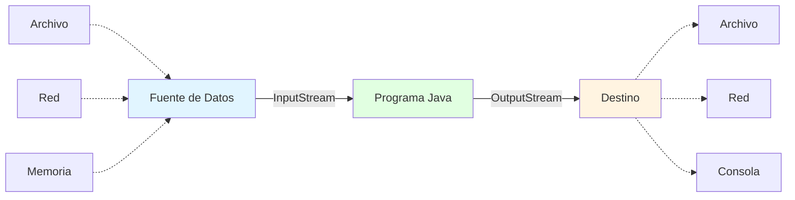
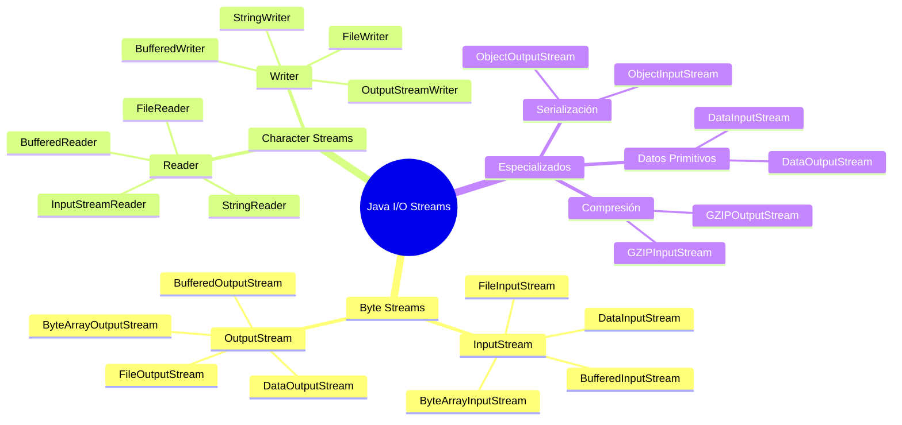
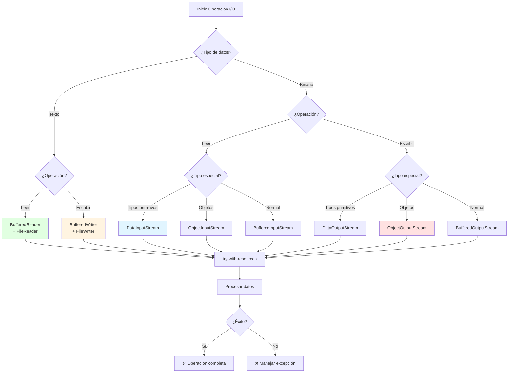

# 🌊 Conceptos y Tipos de Flujos (Streams) en Java

## 🎯 Introducción

> [!info]- 💡 ¿Qué son los Streams?
> 
> Un **Stream** (flujo) es una abstracción que representa una secuencia de datos que fluye desde una **fuente** (origen) hacia un **destino**. Es como un canal o tubería por donde viajan los datos.
> 
> **Analogía práctica:** Imagina el sistema de agua de una casa:
> 
> - **Fuente (Input):** El tanque de agua o red municipal
> - **Tubería (Stream):** El conducto que transporta el agua
> - **Destino (Output):** La llave del lavabo o ducha
> - **Flujo continuo:** El agua viaja byte a byte (o gota a gota)
> 
> **¿Por qué usar Streams?**
> 
> |Aspecto|Descripción|Beneficio|
> |---|---|---|
> |**Abstracción**|Oculta detalles de implementación|Código más simple y mantenible|
> |**Uniformidad**|Misma interfaz para diferentes fuentes|Archivos, red, memoria con mismo código|
> |**Eficiencia**|Procesamiento gradual de datos|No requiere cargar todo en memoria|
> |**Flexibilidad**|Combinar y encadenar operaciones|Decoradores y filtros|
> |**Escalabilidad**|Maneja archivos de cualquier tamaño|Procesa GB con poca RAM|



---

## 🔍 Concepto Fundamental de Stream

### 📚 Definición y Características

> [!example]- 🎯 ¿Qué es un Stream en Java I/O?
> 
> Un **Stream** es un flujo secuencial de datos entre una fuente y un destino. En Java, los streams son la base del sistema de entrada/salida (I/O).
> 
> **Características esenciales:**
> 
> |Característica|Descripción|Implicación|
> |---|---|---|
> |**Secuencial**|Datos procesados en orden|Byte 1, luego 2, luego 3...|
> |**Unidireccional**|Flujo en una sola dirección|Input O Output, no ambos|
> |**Destructivo**|Una vez leído, no se puede releer|Sin "rebobinar" por defecto|
> |**Bloqueante**|Espera hasta que hay datos|read() pausa el programa|
> |**Conectado**|Vinculado a fuente/destino|Archivo, socket, array...|
> 
> **Visualización del concepto:**
> 
> ```mermaid
> sequenceDiagram
>     participant F as Fuente (Archivo)
>     participant S as Stream
>     participant P as Programa
>     
>     F->>S: Byte 1
>     S->>P: read() → 1
>     F->>S: Byte 2
>     S->>P: read() → 2
>     F->>S: Byte 3
>     S->>P: read() → 3
>     F->>S: EOF (-1)
>     S->>P: read() → -1
>     
>     Note over F,P: Flujo secuencial unidireccional
> ```
> 
> **Diferencia con estructuras de datos:**
> 
> ```java
> // Array - Acceso aleatorio, datos en memoria
> int[] numeros = {1, 2, 3, 4, 5};
> System.out.println(numeros[3]); // ✅ Acceso directo
> System.out.println(numeros[1]); // ✅ Puedo volver atrás
> 
> // Stream - Acceso secuencial, datos desde fuente externa
> InputStream stream = new FileInputStream("datos.bin");
> int byte1 = stream.read(); // Lee byte 1
> int byte2 = stream.read(); // Lee byte 2
> // ❌ No puedo volver a leer byte1 sin reabrir el stream
> ```
> 
> **Flujo de vida de un Stream:**
> 
> ```mermaid
> stateDiagram-v2
>     [*] --> Cerrado: Stream creado
>     Cerrado --> Abierto: open()
>     Abierto --> Leyendo: read()
>     Abierto --> Escribiendo: write()
>     Leyendo --> Abierto: continuar
>     Escribiendo --> Abierto: continuar
>     Abierto --> Cerrado: close()
>     Cerrado --> [*]
>     
>     note right of Abierto
>         Estado activo
>         Consumiendo recursos
>     end note
>     
>     note right of Cerrado
>         Recursos liberados
>         No se puede usar
>     end note
> ```

### 🔄 Direccionalidad de los Streams

> [!note]- ➡️ Input vs Output Streams
> 
> **Los streams se dividen según la dirección del flujo de datos:**
> 
> ```mermaid
> graph TB
>     subgraph "Input Stream (Lectura)"
>     A[Fuente Externa] -->|Datos fluyen hacia| B[Programa Java]
>     end
>     
>     subgraph "Output Stream (Escritura)"
>     C[Programa Java] -->|Datos fluyen desde| D[Destino Externo]
>     end
>     
>     style A fill:#e1f5ff
>     style B fill:#e1ffe1
>     style C fill:#e1ffe1
>     style D fill:#fff4e1
> ```
> 
> **Comparación detallada:**
> 
> |Aspecto|InputStream|OutputStream|
> |---|---|---|
> |**Dirección**|Entrada → Programa|Programa → Salida|
> |**Operación principal**|`read()`|`write()`|
> |**Propósito**|Consumir datos|Producir datos|
> |**Fin de flujo**|Retorna -1|No aplica|
> |**Buffer**|Lee y almacena temporalmente|Acumula antes de enviar|
> |**Ejemplo común**|Leer archivo, recibir red|Escribir archivo, enviar red|
> 
> **Ejemplo conceptual:**
> 
> ```java
> // INPUT STREAM - Leer desde archivo
> try (InputStream input = new FileInputStream("entrada.dat")) {
>     int dato;
>     while ((dato = input.read()) != -1) {
>         // Procesar byte leído
>         System.out.println("Leído: " + dato);
>     }
> } catch (IOException e) {
>     e.printStackTrace();
> }
> 
> // OUTPUT STREAM - Escribir a archivo
> try (OutputStream output = new FileOutputStream("salida.dat")) {
>     output.write(65);  // Escribe 'A'
>     output.write(66);  // Escribe 'B'
>     output.write(67);  // Escribe 'C'
>     System.out.println("✅ Datos escritos");
> } catch (IOException e) {
>     e.printStackTrace();
> }
> ```
> 
> **Flujo bidireccional (requiere dos streams):**
> 
> ```mermaid
> graph LR
>     A[Archivo datos.txt] -->|FileInputStream<br/>read| B[Programa]
>     B -->|FileOutputStream<br/>write| C[Archivo salida.txt]
>     
>     style A fill:#e1f5ff
>     style B fill:#e1ffe1
>     style C fill:#fff4e1
> ```

---

## 🌳 Jerarquía de Clases de Streams

### 📊 Organización de las Clases

> [!success]- 🗂️ Estructura de java.io
> 
> **Java organiza los streams en cuatro jerarquías principales:**
> 
> ```mermaid
> classDiagram
>     class InputStream {
>         <<abstract>>
>         +read() int
>         +read(byte[]) int
>         +close() void
>         +available() int
>     }
>     
>     class OutputStream {
>         <<abstract>>
>         +write(int) void
>         +write(byte[]) void
>         +flush() void
>         +close() void
>     }
>     
>     class Reader {
>         <<abstract>>
>         +read() int
>         +read(char[]) int
>         +close() void
>     }
>     
>     class Writer {
>         <<abstract>>
>         +write(int) void
>         +write(String) void
>         +flush() void
>         +close() void
>     }
>     
>     InputStream <|-- FileInputStream
>     InputStream <|-- ByteArrayInputStream
>     InputStream <|-- FilterInputStream
>     FilterInputStream <|-- BufferedInputStream
>     FilterInputStream <|-- DataInputStream
>     
>     OutputStream <|-- FileOutputStream
>     OutputStream <|-- ByteArrayOutputStream
>     OutputStream <|-- FilterOutputStream
>     FilterOutputStream <|-- BufferedOutputStream
>     FilterOutputStream <|-- DataOutputStream
>     
>     Reader <|-- FileReader
>     Reader <|-- BufferedReader
>     Reader <|-- InputStreamReader
>     
>     Writer <|-- FileWriter
>     Writer <|-- BufferedWriter
>     Writer <|-- OutputStreamWriter
> ```
> 
> **Cuatro familias principales:**
> 
> |Familia|Tipo de Dato|Operación|Unidad Básica|Uso Principal|
> |---|---|---|---|---|
> |**InputStream**|Bytes|Lectura|byte (8 bits)|Datos binarios, imágenes, audio|
> |**OutputStream**|Bytes|Escritura|byte (8 bits)|Datos binarios, archivos comprimidos|
> |**Reader**|Caracteres|Lectura|char (16 bits Unicode)|Texto, archivos .txt, .csv|
> |**Writer**|Caracteres|Escritura|char (16 bits Unicode)|Texto, logs, documentos|
> 
> **Decisión clave: ¿Bytes o Caracteres?**
> 
> ```mermaid
> graph TD
>     A{¿Qué tipo de datos?} --> B[Texto/Caracteres]
>     A --> C[Binarios/Bytes]
>     
>     B --> D[Reader/Writer]
>     C --> E[InputStream/OutputStream]
>     
>     D --> F[FileReader<br/>BufferedReader]
>     E --> G[FileInputStream<br/>DataInputStream]
>     
>     style B fill:#e1ffe1
>     style C fill:#e1f5ff
>     style D fill:#ccffcc
>     style E fill:#cce5ff
> ```

### 🎭 Tipos de Streams por Función

> [!tip]- 🔧 Clasificación Funcional
> 
> **Los streams se clasifican en dos categorías según su función:**
> 
> **1. Streams de Origen/Destino (Node Streams)**
> 
> Conectan directamente con una fuente o destino de datos.
> 
> |Clase|Propósito|Fuente/Destino|Ejemplo|
> |---|---|---|---|
> |**FileInputStream**|Lee bytes de archivo|Archivo físico|Leer imagen .jpg|
> |**FileOutputStream**|Escribe bytes a archivo|Archivo físico|Guardar PDF|
> |**ByteArrayInputStream**|Lee bytes de array|Array en memoria|Procesar datos en RAM|
> |**ByteArrayOutputStream**|Escribe bytes a array|Array en memoria|Crear buffer temporal|
> |**FileReader**|Lee caracteres de archivo|Archivo de texto|Leer .txt, .csv|
> |**FileWriter**|Escribe caracteres a archivo|Archivo de texto|Escribir log.txt|
> 
> ```java
> // Node Stream - Conexión directa con archivo
> FileInputStream fis = new FileInputStream("imagen.jpg");
> // Lee directamente desde el archivo en disco
> ```
> 
> **2. Streams de Procesamiento (Filter/Wrapper Streams)**
> 
> Envuelven otros streams para añadir funcionalidad adicional.
> 
> |Clase|Funcionalidad Añadida|Envuelve|Beneficio|
> |---|---|---|---|
> |**BufferedInputStream**|Buffering para lectura|Cualquier InputStream|10-50x más rápido|
> |**BufferedOutputStream**|Buffering para escritura|Cualquier OutputStream|Reduce accesos a disco|
> |**DataInputStream**|Leer tipos primitivos|Cualquier InputStream|readInt(), readDouble()|
> |**DataOutputStream**|Escribir tipos primitivos|Cualquier OutputStream|writeInt(), writeDouble()|
> |**ObjectInputStream**|Deserializar objetos|Cualquier InputStream|Leer objetos completos|
> |**ObjectOutputStream**|Serializar objetos|Cualquier OutputStream|Guardar objetos|
> |**BufferedReader**|Buffering + readLine()|Reader|Lee líneas completas|
> |**BufferedWriter**|Buffering + newLine()|Writer|Escribe líneas eficientemente|
> 
> ```java
> // Filter Stream - Añade funcionalidad
> FileInputStream fis = new FileInputStream("datos.bin");
> BufferedInputStream bis = new BufferedInputStream(fis);
> // Ahora tiene buffer para lectura eficiente
> ```
> 
> **Patrón Decorator (Envoltorio):**
> 
> ```mermaid
> graph LR
>     A[FileInputStream<br/>Conexión básica] --> B[BufferedInputStream<br/>+ Buffer]
>     B --> C[DataInputStream<br/>+ Tipos primitivos]
>     
>     style A fill:#ffe1e1
>     style B fill:#fff4e1
>     style C fill:#e1ffe1
>     
>     D[Funcionalidad<br/>Básica] --> E[Funcionalidad<br/>Mejorada] --> F[Funcionalidad<br/>Completa]
> ```
> 
> **Ejemplo de encadenamiento:**
> 
> ```java
> // ❌ Sin wrappers - Lento y limitado
> FileInputStream fis = new FileInputStream("datos.bin");
> int byte1 = fis.read(); // Acceso directo a disco
> int byte2 = fis.read(); // Otro acceso a disco
> 
> // ✅ Con wrappers - Rápido y potente
> try (FileInputStream fis = new FileInputStream("datos.bin");
>      BufferedInputStream bis = new BufferedInputStream(fis);
>      DataInputStream dis = new DataInputStream(bis)) {
>     
>     int numero = dis.readInt();        // Lee 4 bytes como int
>     double decimal = dis.readDouble(); // Lee 8 bytes como double
>     
>     // Buffer reduce accesos a disco
>     // DataInputStream facilita lectura de tipos
> }
> ```

---

## 🔢 Streams de Bytes (Byte Streams)

### 📥 InputStream - Lectura de Bytes

> [!example]- 📖 Clase Base y Métodos Principales
> 
> **InputStream es la clase abstracta base para todos los streams de entrada de bytes.**
> 
> **Métodos fundamentales:**
> 
> |Método|Retorno|Descripción|Cuándo Usar|
> |---|---|---|---|
> |`read()`|int|Lee 1 byte (0-255) o -1 si EOF|Lectura byte a byte|
> |`read(byte[] b)`|int|Lee hasta b.length bytes|Lectura en bloques|
> |`read(byte[] b, int off, int len)`|int|Lee hasta len bytes desde off|Control fino|
> |`available()`|int|Bytes disponibles sin bloquear|Verificar antes de leer|
> |`skip(long n)`|long|Salta n bytes|Ignorar datos|
> |`close()`|void|Cierra el stream|Liberar recursos|
> 
> **Ejemplo básico de read():**
> 
> ```java
> // Lectura byte a byte - INEFICIENTE pero didáctica
> try (InputStream is = new FileInputStream("datos.bin")) {
>     int byteLeido;
>     
>     while ((byteLeido = is.read()) != -1) {
>         // byteLeido está en rango 0-255
>         System.out.println("Byte: " + byteLeido);
>     }
>     
> } catch (IOException e) {
>     e.printStackTrace();
> }
> ```
> 
> **⚠️ Importante sobre read():**
> 
> ```mermaid
> graph TD
>     A[is.read] --> B{¿Hay datos?}
>     B -->|Sí| C[Retorna byte<br/>0-255]
>     B -->|No más datos| D[Retorna -1<br/>EOF]
>     B -->|Error| E[Lanza IOException]
>     
>     C --> F[✅ Procesar dato]
>     D --> G[✅ Terminar lectura]
>     E --> H[❌ Manejar error]
>     
>     style C fill:#e1ffe1
>     style D fill:#fff4e1
>     style E fill:#ffe1e1
> ```
> 
> **Lectura en bloques (EFICIENTE):**
> 
> ```java
> // Lectura por bloques - RECOMENDADO
> try (InputStream is = new FileInputStream("archivo.bin")) {
>     byte[] buffer = new byte[1024]; // Buffer de 1KB
>     int bytesLeidos;
>     
>     while ((bytesLeidos = is.read(buffer)) != -1) {
>         // Procesar bytesLeidos bytes desde buffer[0] hasta buffer[bytesLeidos-1]
>         System.out.println("Leídos " + bytesLeidos + " bytes");
>         
>         // Procesar solo los bytes leídos
>         for (int i = 0; i < bytesLeidos; i++) {
>             // Usar buffer[i]
>         }
>     }
>     
> } catch (IOException e) {
>     e.printStackTrace();
> }
> ```
> 
> **Comparación de rendimiento:**
> 
> |Método|Accesos a Disco (10KB)|Velocidad|Uso de Memoria|
> |---|---|---|---|
> |read()|10,240|🐌 Muy lento|Mínimo|
> |read(byte[1024])|10|🚀 Rápido|1KB buffer|
> |BufferedInputStream|1-2|⚡ Muy rápido|8KB buffer interno|

### 📤 OutputStream - Escritura de Bytes

> [!success]- ✍️ Clase Base y Métodos Principales
> 
> **OutputStream es la clase abstracta base para todos los streams de salida de bytes.**
> 
> **Métodos fundamentales:**
> 
> |Método|Parámetro|Descripción|Cuándo Usar|
> |---|---|---|---|
> |`write(int b)`|byte como int|Escribe 1 byte|Escritura byte a byte|
> |`write(byte[] b)`|array completo|Escribe todo el array|Escribir bloque completo|
> |`write(byte[] b, int off, int len)`|array parcial|Escribe len bytes desde off|Control fino|
> |`flush()`|ninguno|Fuerza escritura del buffer|Datos críticos|
> |`close()`|ninguno|Cierra y hace flush|Liberar recursos|
> 
> **Ejemplo básico:**
> 
> ```java
> // Escritura byte a byte
> try (OutputStream os = new FileOutputStream("salida.bin")) {
>     os.write(65);  // Escribe 'A' (código ASCII 65)
>     os.write(66);  // Escribe 'B'
>     os.write(67);  // Escribe 'C'
>     
>     System.out.println("✅ Bytes escritos");
>     
> } catch (IOException e) {
>     e.printStackTrace();
> }
> ```
> 
> **Escritura de arrays:**
> 
> ```java
> // Escritura eficiente por bloques
> try (OutputStream os = new FileOutputStream("datos.bin")) {
>     byte[] datos = {10, 20, 30, 40, 50};
>     
>     // Escribir array completo
>     os.write(datos);
>     
>     // Escribir parcialmente: 3 bytes desde posición 1
>     os.write(datos, 1, 3); // Escribe: 20, 30, 40
>     
>     os.flush(); // Asegurar escritura inmediata
>     
> } catch (IOException e) {
>     e.printStackTrace();
> }
> ```
> 
> **Importancia de flush():**
> 
> ```mermaid
> sequenceDiagram
>     participant P as Programa
>     participant B as Buffer
>     participant D as Disco
>     
>     P->>B: write(datos)
>     Note over B: Datos en buffer<br/>NO en disco
>     P->>B: write(más datos)
>     P->>B: flush()
>     B->>D: Enviar todo al disco
>     Note over D: Datos persistidos
>     P->>B: close()
>     B->>D: flush automático
> ```
> 
> **Escenarios donde flush() es crítico:**
> 
> ```java
> // ❌ Sin flush - Datos pueden perderse
> OutputStream os = new FileOutputStream("log.txt");
> os.write("Operación crítica iniciada\n".getBytes());
> // Si el programa falla aquí, el texto puede perderse
> 
> // ✅ Con flush - Datos garantizados
> OutputStream os = new FileOutputStream("log.txt");
> os.write("Operación crítica iniciada\n".getBytes());
> os.flush(); // Fuerza escritura inmediata
> // Ahora está en disco, seguro ante fallos
> ```

### 🗂️ Implementaciones Comunes

> [!info]- 📁 Clases Concretas de Byte Streams
> 
> **1. FileInputStream / FileOutputStream**
> 
> Para trabajar con archivos físicos.
> 
> ```java
> // Leer archivo binario
> try (FileInputStream fis = new FileInputStream("imagen.jpg")) {
>     byte[] buffer = new byte[4096];
>     int bytesLeidos;
>     
>     while ((bytesLeidos = fis.read(buffer)) != -1) {
>         // Procesar buffer...
>     }
> } catch (IOException e) {
>     e.printStackTrace();
> }
> 
> // Escribir archivo binario
> try (FileOutputStream fos = new FileOutputStream("copia.jpg")) {
>     byte[] datos = obtenerDatosImagen();
>     fos.write(datos);
>     fos.flush();
> } catch (IOException e) {
>     e.printStackTrace();
> }
> ```
> 
> **2. ByteArrayInputStream / ByteArrayOutputStream**
> 
> Para trabajar con datos en memoria.
> 
> ```java
> // Leer desde array en memoria
> byte[] datos = {65, 66, 67, 68, 69}; // A, B, C, D, E
> try (ByteArrayInputStream bais = new ByteArrayInputStream(datos)) {
>     int b;
>     while ((b = bais.read()) != -1) {
>         System.out.println((char) b);
>     }
> }
> 
> // Escribir a array en memoria (crecimiento dinámico)
> try (ByteArrayOutputStream baos = new ByteArrayOutputStream()) {
>     baos.write(72);  // H
>     baos.write(73);  // I
>     
>     byte[] resultado = baos.toByteArray();
>     System.out.println(new String(resultado)); // "HI"
> }
> ```
> 
> **3. BufferedInputStream / BufferedOutputStream**
> 
> Añaden buffering para mejorar rendimiento.
> 
> ```java
> // ⚡ Lectura con buffer - RECOMENDADO
> try (FileInputStream fis = new FileInputStream("grande.dat");
>      BufferedInputStream bis = new BufferedInputStream(fis, 8192)) {
>     
>     int dato;
>     while ((dato = bis.read()) != -1) {
>         // Lectura muy eficiente gracias al buffer
>     }
> }
> 
> // ⚡ Escritura con buffer - RECOMENDADO
> try (FileOutputStream fos = new FileOutputStream("salida.dat");
>      BufferedOutputStream bos = new BufferedOutputStream(fos, 8192)) {
>     
>     for (int i = 0; i < 10000; i++) {
>         bos.write(i % 256);
>     }
>     // flush automático al cerrar
> }
> ```
> 
> **Comparación de rendimiento:**
> 
> ```mermaid
> graph LR
>     A[FileInputStream<br/>1 byte = 1 acceso disco] --> B[10,000 bytes<br/>= 10,000 accesos<br/>⏱️ 5 segundos]
>     
>     C[BufferedInputStream<br/>8KB buffer] --> D[10,000 bytes<br/>= 2 accesos<br/>⚡ 0.05 segundos]
>     
>     style A fill:#ffe1e1
>     style B fill:#ffcccc
>     style C fill:#e1ffe1
>     style D fill:#ccffcc
> ```

---

## 🔤 Streams de Caracteres (Character Streams)

### 📖 Reader - Lectura de Caracteres

> [!example]- 📚 Diferencias con InputStream
> 
> **Reader vs InputStream:**
> 
> |Aspecto|InputStream|Reader|
> |---|---|---|
> |**Unidad**|byte (8 bits)|char (16 bits Unicode)|
> |**Propósito**|Datos binarios|Texto/caracteres|
> |**Método read()**|Retorna 0-255 o -1|Retorna 0-65535 o -1|
> |**Codificación**|No maneja|✅ Sí maneja (UTF-8, etc.)|
> |**Uso típico**|Imágenes, audio, PDFs|Archivos .txt, .csv, .log|
> 
> **¿Por qué Reader para texto?**
> 
> ```java
> // ❌ Problema con bytes para texto Unicode
> FileInputStream fis = new FileInputStream("texto.txt");
> int b = fis.read(); // Lee 1 byte
> // Si el carácter es 'ñ' (UTF-8 = 2 bytes), solo lee la mitad!
> 
> // ✅ Reader maneja caracteres completos
> FileReader fr = new FileReader("texto.txt");
> int c = fr.read(); // Lee 1 carácter completo
> // 'ñ' se lee correctamente como 1 char
> ```
> 
> **Métodos principales de Reader:**
> 
> |Método|Retorno|Descripción|
> |---|---|---|
> |`read()`|int|Lee 1 carácter (0-65535) o -1|
> |`read(char[] cbuf)`|int|Lee caracteres a array|
> |`read(char[] cbuf, int off, int len)`|int|Lee len caracteres desde off|
> |`skip(long n)`|long|Salta n caracteres|
> |`ready()`|boolean|¿Hay caracteres disponibles?|
> |`close()`|void|Cierra el reader|
> 
> **Ejemplo práctico:**
> 
> ```java
> // Lectura de texto carácter por carácter
> try (Reader reader = new FileReader("texto.txt")) {
>     int caracter;
>     
>     while ((caracter = reader.read()) != -1) {
>         System.out.print((char) caracter);
>     }
>     
> } catch (IOException e) {
>     e.printStackTrace();
> }
> 
> // Lectura eficiente con buffer
> try (Reader reader = new FileReader("texto.txt")) {
>     char[] buffer = new char[1024];
>     int caracteresLeidos;
>     
>     while ((caracteresLeidos = reader.read(buffer)) != -1) {
>         String texto = new String(buffer, 0, caracteresLeidos);
>         System.out.print(texto);
>     }
> } catch (IOException e) {
>     e.printStackTrace();
> }
> ```

### ✍️ Writer - Escritura de Caracteres

> [!success]- 📝 Escritura de Texto
> 
> **Métodos principales de Writer:**
> 
> |Método|Parámetro|Descripción|
> |---|---|---|
> |`write(int c)`|1 carácter|Escribe 1 char|
> |`write(char[] cbuf)`|array completo|Escribe array de caracteres|
> |`write(String str)`|cadena|Escribe String completo|
> |`write(String str, int off, int len)`|subcadena|Escribe parte del String|
> |`flush()`|ninguno|Fuerza escritura|
> |`close()`|ninguno|Cierra y hace flush|
> 
> **Ventaja principal: Manejo de Strings:**
> 
> ```java
> // Writer - Directo con Strings ✅
> try (Writer writer = new FileWriter("salida.txt")) {
>     writer.write("Hola Mundo\n");
>     writer.write("Segunda línea\n");
>     
>     String texto = "Texto desde variable";
>     writer.write(texto);
>     
> } catch (IOException e) {
>     e.printStackTrace();
> }
> 
> // OutputStream - Necesita conversión ❌
> try (OutputStream os = new FileOutputStream("salida.txt")) {
>     String texto = "Hola Mundo\n";
>     os.write(texto.getBytes()); //Conversión necesaria
> }
> 
> ````
> 
> **Escritura eficiente:**
> 
> ```java
> try (Writer writer = new FileWriter("log.txt", true)) { // append mode
>     writer.write("=== Inicio de log ===\n");
>     writer.write("Operación 1: OK\n");
>     writer.write("Operación 2: OK\n");
>     writer.flush(); // Asegurar persistencia
>     
> } catch (IOException e) {
>     e.printStackTrace();
> }
> ````

### 🔄 InputStreamReader y OutputStreamWriter

> [!tip]- 🌉 Puentes entre Bytes y Caracteres
> 
> **Estas clases convierten entre streams de bytes y streams de caracteres:**
> 
> ```mermaid
> graph LR
>     A[InputStream<br/>bytes] --> B[InputStreamReader<br/>🔄 Conversión]
>     B --> C[Reader<br/>caracteres]
>     
>     D[Writer<br/>caracteres] --> E[OutputStreamWriter<br/>🔄 Conversión]
>     E --> F[OutputStream<br/>bytes]
>     
>     style B fill:#fff4e1
>     style E fill:#fff4e1
> ```
> 
> **¿Cuándo usar?**
> 
> |Escenario|Solución|Razón|
> |---|---|---|
> |Leer texto desde la consola|InputStreamReader(System.in)|System.in es InputStream|
> |Leer texto con codificación específica|InputStreamReader(fis, "UTF-8")|Control de encoding|
> |Escribir texto a stream binario|OutputStreamWriter(os, "UTF-8")|Conversión necesaria|
> |Conectar red con texto|InputStreamReader(socket.getInputStream())|Socket usa bytes|
> 
> **Ejemplo: Lectura desde consola:**
> 
> ```java
> // System.in es InputStream, pero queremos leer caracteres
> try (InputStreamReader isr = new InputStreamReader(System.in);
>      BufferedReader br = new BufferedReader(isr)) {
>     
>     System.out.print("Ingrese texto: ");
>     String linea = br.readLine();
>     System.out.println("Usted escribió: " + linea);
>     
> } catch (IOException e) {
>     e.printStackTrace();
> }
> ```
> 
> **Especificar codificación:**
> 
> ```java
> // Leer archivo con codificación específica
> try (FileInputStream fis = new FileInputStream("texto_utf8.txt");
>      InputStreamReader isr = new InputStreamReader(fis, "UTF-8");
>      BufferedReader br = new BufferedReader(isr)) {
>     
>     String linea;
>     while ((linea = br.readLine()) != null) {
>         System.out.println(linea);
>     }
> }
> 
> // Escribir con codificación específica
> try (FileOutputStream fos = new FileOutputStream("salida_utf8.txt");
>      OutputStreamWriter osw = new OutputStreamWriter(fos, "UTF-8");
>      BufferedWriter bw = new BufferedWriter(osw)) {
>     
>     bw.write("Texto con ñ, á, é, ü");
>     bw.newLine();
> }
> ```
> 
> **Importancia de la codificación:**
> 
> ```mermaid
> graph TD
>     A[Texto: Hola ñ] --> B{Codificación?}
>     B -->|UTF-8| C[Bytes: 48 6F 6C 61 20 C3 B1]
>     B -->|ISO-8859-1| D[Bytes: 48 6F 6C 61 20 F1]
>     
>     C --> E[✅ Compatible con emojis]
>     D --> F[❌ Solo caracteres latinos]
>     
>     style C fill:#e1ffe1
>     style D fill:#ffe1e1
> ```

### 🗂️ Implementaciones Comunes de Character Streams

> [!info]- 📁 Clases Concretas
> 
> **1. FileReader / FileWriter**
> 
> ```java
> // Leer archivo de texto
> try (FileReader fr = new FileReader("poema.txt")) {
>     int caracter;
>     while ((caracter = fr.read()) != -1) {
>         System.out.print((char) caracter);
>     }
> } catch (IOException e) {
>     e.printStackTrace();
> }
> 
> // Escribir archivo de texto
> try (FileWriter fw = new FileWriter("notas.txt")) {
>     fw.write("Primera nota\n");
>     fw.write("Segunda nota\n");
> } catch (IOException e) {
>     e.printStackTrace();
> }
> ```
> 
> **2. BufferedReader / BufferedWriter**
> 
> ```java
> // Lectura eficiente línea por línea (MÁS USADO)
> try (BufferedReader br = new BufferedReader(new FileReader("datos.txt"))) {
>     String linea;
>     int numeroLinea = 1;
>     
>     while ((linea = br.readLine()) != null) {
>         System.out.println(numeroLinea + ": " + linea);
>         numeroLinea++;
>     }
> } catch (IOException e) {
>     e.printStackTrace();
> }
> 
> // Escritura eficiente con newLine()
> try (BufferedWriter bw = new BufferedWriter(new FileWriter("reporte.txt"))) {
>     bw.write("=== REPORTE DIARIO ===");
>     bw.newLine(); // Salto de línea multiplataforma
>     bw.write("Total ventas: $1,500");
>     bw.newLine();
>     bw.write("Clientes atendidos: 25");
>     bw.newLine();
> } catch (IOException e) {
>     e.printStackTrace();
> }
> ```
> 
> **3. StringReader / StringWriter**
> 
> Para trabajar con Strings como si fueran streams.
> 
> ```java
> // Leer desde String
> String texto = "Línea 1\nLínea 2\nLínea 3";
> try (BufferedReader br = new BufferedReader(new StringReader(texto))) {
>     String linea;
>     while ((linea = br.readLine()) != null) {
>         System.out.println("-> " + linea);
>     }
> }
> 
> // Escribir a String
> try (StringWriter sw = new StringWriter()) {
>     sw.write("Generando reporte...\n");
>     sw.write("Datos procesados: ");
>     sw.write(String.valueOf(1000));
>     
>     String resultado = sw.toString();
>     System.out.println(resultado);
> }
> ```

---

## 🎯 Comparación: Bytes vs Caracteres

### 📊 Cuadro Comparativo Completo

> [!success]- ⚖️ Diferencias Clave
> 
> |Aspecto|Byte Streams|Character Streams|
> |---|---|---|
> |**Clases base**|InputStream / OutputStream|Reader / Writer|
> |**Unidad de datos**|byte (8 bits)|char (16 bits Unicode)|
> |**Propósito principal**|Datos binarios|Texto|
> |**Ejemplos de uso**|Imágenes, audio, videos, archivos comprimidos|Archivos .txt, .csv, .log, código fuente|
> |**Manejo de codificación**|❌ No|✅ Sí (UTF-8, ISO-8859-1, etc.)|
> |**Método read()**|Retorna 0-255 o -1|Retorna 0-65535 o -1|
> |**Trabajo con String**|Requiere conversión manual|✅ Directo|
> |**Rendimiento**|Más bajo nivel|Más alto nivel|
> |**Buffering común**|BufferedInputStream/Output|BufferedReader/Writer|
> |**Conversión**|N/A|InputStreamReader/OutputStreamWriter|
> 
> **Diagrama de decisión:**
> 
> ```mermaid
> graph TD
>     A{¿Qué tipo de datos?} --> B[Texto legible por humanos]
>     A --> C[Datos binarios]
>     
>     B --> D{¿Necesitas leer líneas?}
>     D -->|Sí| E[BufferedReader]
>     D -->|No| F[FileReader]
>     
>     C --> G{¿Tipos primitivos?}
>     G -->|Sí| H[DataInputStream]
>     G -->|No| I{¿Objetos?}
>     I -->|Sí| J[ObjectInputStream]
>     I -->|No| K[FileInputStream + Buffer]
>     
>     style E fill:#e1ffe1
>     style H fill:#e1f5ff
>     style J fill:#fff4e1
> ```
> 
> **Ejemplos de decisión:**
> 
> ```java
> // 1. Leer archivo de texto → Character Stream
> BufferedReader br = new BufferedReader(new FileReader("config.txt"));
> 
> // 2. Leer imagen JPG → Byte Stream
> FileInputStream fis = new FileInputStream("foto.jpg");
> 
> // 3. Leer archivo CSV → Character Stream
> BufferedReader br = new BufferedReader(new FileReader("datos.csv"));
> 
> // 4. Leer archivo PDF → Byte Stream
> FileInputStream fis = new FileInputStream("documento.pdf");
> 
> // 5. Leer log de aplicación → Character Stream
> BufferedReader br = new BufferedReader(new FileReader("app.log"));
> ```

---

## 🛠️ Streams Especializados

### 📊 DataInputStream / DataOutputStream

> [!tip]- 🔢 Lectura/Escritura de Tipos Primitivos
> 
> **Permiten leer y escribir tipos primitivos de Java de manera portable:**
> 
> **Métodos de DataOutputStream:**
> 
> |Método|Tipo|Bytes Escritos|Descripción|
> |---|---|---|---|
> |`writeBoolean(boolean)`|boolean|1|true o false|
> |`writeByte(int)`|byte|1|-128 a 127|
> |`writeShort(int)`|short|2|-32768 a 32767|
> |`writeInt(int)`|int|4|-2³¹ a 2³¹-1|
> |`writeLong(long)`|long|8|-2⁶³ a 2⁶³-1|
> |`writeFloat(float)`|float|4|Punto flotante|
> |`writeDouble(double)`|double|8|Doble precisión|
> |`writeChar(int)`|char|2|Carácter Unicode|
> |`writeUTF(String)`|String|variable|Cadena en UTF-8|
> 
> **Ejemplo de escritura:**
> 
> ```java
> try (FileOutputStream fos = new FileOutputStream("datos.dat");
>      BufferedOutputStream bos = new BufferedOutputStream(fos);
>      DataOutputStream dos = new DataOutputStream(bos)) {
>     
>     // Escribir diferentes tipos
>     dos.writeInt(12345);           // 4 bytes
>     dos.writeDouble(3.14159);      // 8 bytes
>     dos.writeBoolean(true);        // 1 byte
>     dos.writeUTF("Hola Mundo");    // variable
>     
>     System.out.println("✅ Datos escritos");
>     
> } catch (IOException e) {
>     e.printStackTrace();
> }
> ```
> 
> **Métodos de DataInputStream:**
> 
> ```java
> try (FileInputStream fis = new FileInputStream("datos.dat");
>      BufferedInputStream bis = new BufferedInputStream(fis);
>      DataInputStream dis = new DataInputStream(bis)) {
>     
>     // Leer en el MISMO ORDEN que se escribió
>     int numero = dis.readInt();
>     double decimal = dis.readDouble();
>     boolean flag = dis.readBoolean();
>     String texto = dis.readUTF();
>     
>     System.out.println("Número: " + numero);
>     System.out.println("Decimal: " + decimal);
>     System.out.println("Flag: " + flag);
>     System.out.println("Texto: " + texto);
>     
> } catch (IOException e) {
>     e.printStackTrace();
> }
> ```
> 
> **⚠️ Orden es crucial:**
> 
> ```mermaid
> sequenceDiagram
>     participant W as DataOutputStream
>     participant F as Archivo
>     participant R as DataInputStream
>     
>     W->>F: writeInt(100)
>     W->>F: writeDouble(3.14)
>     W->>F: writeUTF("Hola")
>     
>     Note over F: Archivo con bytes<br/>en orden específico
>     
>     F->>R: readInt() → 100 ✅
>     F->>R: readDouble() → 3.14 ✅
>     F->>R: readUTF() → "Hola" ✅
>     
>     Note over R: ❌ Si lees en orden<br/>diferente, datos corruptos
> ```
> 
> **Caso de uso: Guardar configuración:**
> 
> ```java
> public class ConfigManager {
>     
>     public void guardarConfig(int nivel, double volumen, String usuario) {
>         try (DataOutputStream dos = new DataOutputStream(
>                 new BufferedOutputStream(
>                     new FileOutputStream("config.dat")))) {
>             
>             dos.writeInt(nivel);
>             dos.writeDouble(volumen);
>             dos.writeUTF(usuario);
>             
>         } catch (IOException e) {
>             e.printStackTrace();
>         }
>     }
>     
>     public void cargarConfig() {
>         try (DataInputStream dis = new DataInputStream(
>                 new BufferedInputStream(
>                     new FileInputStream("config.dat")))) {
>             
>             int nivel = dis.readInt();
>             double volumen = dis.readDouble();
>             String usuario = dis.readUTF();
>             
>             System.out.println("Nivel: " + nivel);
>             System.out.println("Volumen: " + volumen);
>             System.out.println("Usuario: " + usuario);
>             
>         } catch (IOException e) {
>             System.out.println("No se pudo cargar configuración");
>         }
>     }
> }
> ```

### 📦 ObjectInputStream / ObjectOutputStream

> [!info]- 🎁 Serialización de Objetos
> 
> **Permiten guardar y recuperar objetos completos:**
> 
> ```mermaid
> graph LR
>     A[Objeto en memoria] -->|ObjectOutputStream<br/>Serialización| B[Bytes en archivo]
>     B -->|ObjectInputStream<br/>Deserialización| C[Objeto restaurado]
>     
>     style A fill:#e1ffe1
>     style B fill:#fff4e1
>     style C fill:#e1ffe1
> ```
> 
> **Requisitos:**
> 
> - La clase debe implementar `Serializable` (interfaz marcadora)
> - Todos los campos deben ser serializables
> - `transient` excluye campos de la serialización
> 
> **Ejemplo completo:**
> 
> ```java
> import java.io.*;
> 
> // Clase serializable
> class Estudiante implements Serializable {
>     private static final long serialVersionUID = 1L;
>     
>     private String nombre;
>     private int edad;
>     private double promedio;
>     private transient String password; // No se serializa
>     
>     public Estudiante(String nombre, int edad, double promedio) {
>         this.nombre = nombre;
>         this.edad = edad;
>         this.promedio = promedio;
>     }
>     
>     @Override
>     public String toString() {
>         return "Estudiante{" +
>                 "nombre='" + nombre + '\'' +
>                 ", edad=" + edad +
>                 ", promedio=" + promedio +
>                 '}';
>     }
> }
> 
> // Guardar objeto
> public void guardarEstudiante(Estudiante estudiante) {
>     try (ObjectOutputStream oos = new ObjectOutputStream(
>             new FileOutputStream("estudiante.ser"))) {
>         
>         oos.writeObject(estudiante);
>         System.out.println("✅ Objeto guardado");
>         
>     } catch (IOException e) {
>         e.printStackTrace();
>     }
> }
> 
> // Cargar objeto
> public Estudiante cargarEstudiante() {
>     try (ObjectInputStream ois = new ObjectInputStream(
>             new FileInputStream("estudiante.ser"))) {
>         
>         Estudiante estudiante = (Estudiante) ois.readObject();
>         System.out.println("✅ Objeto cargado: " + estudiante);
>         return estudiante;
>         
>     } catch (IOException | ClassNotFoundException e) {
>         e.printStackTrace();
>         return null;
>     }
> }
> ```
> 
> **serialVersionUID:**
> 
> ```java
> // ⚠️ Sin serialVersionUID
> class MiClase implements Serializable {
>     // Si cambias la clase, los objetos guardados no cargarán
> }
> 
> // ✅ Con serialVersionUID
> class MiClase implements Serializable {
>     private static final long serialVersionUID = 1L;
>     // Controlas la compatibilidad de versiones
> }
> ```
> 
> **Guardar múltiples objetos:**
> 
> ```java
> public void guardarEstudiantes(List<Estudiante> estudiantes) {
>     try (ObjectOutputStream oos = new ObjectOutputStream(
>             new FileOutputStream("estudiantes.ser"))) {
>         
>         oos.writeObject(estudiantes); // Serializa la lista completa
>         
>     } catch (IOException e) {
>         e.printStackTrace();
>     }
> }
> 
> @SuppressWarnings("unchecked")
> public List<Estudiante> cargarEstudiantes() {
>     try (ObjectInputStream ois = new ObjectInputStream(
>             new FileInputStream("estudiantes.ser"))) {
>         
>         return (List<Estudiante>) ois.readObject();
>         
>     } catch (IOException | ClassNotFoundException e) {
>         e.printStackTrace();
>         return new ArrayList<>();
>     }
> }
> ```

### 🗜️ Compresión y Descompresión

> [!example]- 📦 GZIPInputStream / GZIPOutputStream
> 
> **Comprimir y descomprimir datos on-the-fly:**
> 
> ```java
> import java.util.zip.*;
> 
> // Comprimir archivo
> public void comprimirArchivo(String origen, String destino) {
>     try (FileInputStream fis = new FileInputStream(origen);
>          FileOutputStream fos = new FileOutputStream(destino);
>          GZIPOutputStream gzos = new GZIPOutputStream(fos)) {
>         
>         byte[] buffer = new byte[1024];
>         int bytesLeidos;
>         
>         while ((bytesLeidos = fis.read(buffer)) != -1) {
>             gzos.write(buffer, 0, bytesLeidos);
>         }
>         
>         System.out.println("✅ Archivo comprimido");
>         
>     } catch (IOException e) {
>         e.printStackTrace();
>     }
> }
> 
> // Descomprimir archivo
> public void descomprimirArchivo(String origen, String destino) {
>     try (FileInputStream fis = new FileInputStream(origen);
>          GZIPInputStream gzis = new GZIPInputStream(fis);
>          FileOutputStream fos = new FileOutputStream(destino)) {
>         
>         byte[] buffer = new byte[1024];
>         int bytesLeidos;
>         
>         while ((bytesLeidos = gzis.read(buffer)) != -1) {
>             fos.write(buffer, 0, bytesLeidos);
>         }
>         
>         System.out.println("✅ Archivo descomprimido");
>         
>     } catch (IOException e) {
>         e.printStackTrace();
>     }
> }
> ```
> 
> **Ahorro de espacio:**
> 
> ```mermaid
> graph LR
>     A[texto.txt<br/>1 MB] -->|GZIPOutputStream| B[texto.txt.gz<br/>100 KB]
>     B -->|GZIPInputStream| C[texto.txt<br/>1 MB]
>     
>     style A fill:#ffe1e1
>     style B fill:#e1ffe1
>     style C fill:#e1f5ff
> ```

---

## 🎯 Patrones de Uso Comunes

### 🔄 Copia de Archivos

> [!success]- 📋 Diferentes Enfoques
> 
> **1. Copia básica (ineficiente):**
> 
> ```java
> public void copiarArchivoBasico(String origen, String destino) {
>     try (FileInputStream fis = new FileInputStream(origen);
>          FileOutputStream fos = new FileOutputStream(destino)) {
>         
>         int dato;
>         while ((dato = fis.read()) != -1) {
>             fos.write(dato);
>         }
>         
>     } catch (IOException e) {
>         e.printStackTrace();
>     }
> }
> ```
> 
> **2. Copia con buffer (eficiente):**
> 
> ```java
> public void copiarArchivoEficiente(String origen, String destino) {
>     try (FileInputStream fis = new FileInputStream(origen);
>          BufferedInputStream bis = new BufferedInputStream(fis);
>          FileOutputStream fos = new FileOutputStream(destino);
>          BufferedOutputStream bos = new BufferedOutputStream(fos)) {
>         
>         byte[] buffer = new byte[8192];
>         int bytesLeidos;
>         
>         while ((bytesLeidos = bis.read(buffer)) != -1) {
>             bos.write(buffer, 0, bytesLeidos);
>         }
>         
>         System.out.println("✅ Archivo copiado");
>         
>     } catch (IOException e) {
>         e.printStackTrace();
>     }
> }
> ```
> 
> **Comparación de rendimiento:**
> 
> |Método|Archivo 10MB|Accesos a Disco|
> |---|---|---|
> |Byte a byte|~300 segundos|10,485,760|
> |Buffer 8KB|~0.5 segundos|~1,280|
> |Buffered + array|~0.3 segundos|~2-3|

### 🔍 Procesamiento de Archivos de Texto

> [!tip]- 📄 Patrones Comunes
> 
> **1. Contar palabras:**
> 
> ```java
> public int contarPalabras(String archivo) {
>     int contador = 0;
>     
>     try (BufferedReader br = new BufferedReader(new FileReader(archivo))) {
>         String linea;
>         
>         while ((linea = br.readLine()) != null) {
>             String[] palabras = linea.trim().split("\\s+");
>             contador += palabras.length;
>         }
>         
>     } catch (IOException e) {
>         e.printStackTrace();
>     }
>     
>     return contador;
> }
> ```
> 
> **2. Filtrar líneas:**
> 
> ```java
> public void filtrarLineas(String entrada, String salida, String filtro) {
>     try (BufferedReader br = new BufferedReader(new FileReader(entrada));
>          BufferedWriter bw = new BufferedWriter(new FileWriter(salida))) {
>         
>         String linea;
>         
>         while ((linea = br.readLine()) != null) {
>             if (linea.contains(filtro)) {
>                 bw.write(linea);
>                 bw.newLine();
>             }
>         }
>         
>         System.out.println("✅ Líneas filtradas");
>         
>     } catch (IOException e) {
>         e.printStackTrace();
>     }
> }
> ```
> 
> **3. Procesar CSV:**
> 
> ```java
> public void procesarCSV(String archivo) {
>     try (BufferedReader br = new BufferedReader(new FileReader(archivo))) {
>         String linea;
>         boolean primeraLinea = true;
>         
>         while ((linea = br.readLine()) != null) {
>             if (primeraLinea) {
>                 primeraLinea = false;
>                 continue; // Saltar encabezado
>             }
>             
>             String[] campos = linea.split(",");
>             // Procesar campos...
>             System.out.println("Procesando: " + String.join(" | ", campos));
>         }
>         
>     } catch (IOException e) {
>         e.printStackTrace();
>     }
> }
> ```

---

## 📊 Resumen Visual Completo

### 🗺️ Mapa Conceptual



### 📋 Tabla de Decisión Rápida

> [!success]- 🎯 ¿Qué Stream Usar?
> 
> |Necesito...|Usar...|Ejemplo|
> |---|---|---|
> |Leer archivo de texto|BufferedReader + FileReader|Leer .txt, .csv, .log|
> |Escribir archivo de texto|BufferedWriter + FileWriter|Crear reporte|
> |Leer archivo binario|BufferedInputStream + FileInputStream|Leer .jpg, .pdf|
> |Escribir archivo binario|BufferedOutputStream + FileOutputStream|Guardar imagen|
> |Leer tipos primitivos|DataInputStream|Leer int, double de archivo|
> |Escribir tipos primitivos|DataOutputStream|Guardar configuración|
> |Guardar objetos|ObjectOutputStream|Persistir estado del juego|
> |Cargar objetos|ObjectInputStream|Recuperar sesión|
> |Comprimir archivo|GZIPOutputStream|Reducir tamaño|
> |Descomprimir archivo|GZIPInputStream|Extraer datos|
> |Leer desde consola|BufferedReader + InputStreamReader(System.in)|Input del usuario|
> |Trabajar con String como stream|StringReader / StringWriter|Testing, parseo|
> |Trabajar con bytes en memoria|ByteArrayInputStream / ByteArrayOutputStream|Buffer temporal|

### 🔄 Diagrama de Flujo General



---

## 🎓 Ejercicios Guiados

> [!example]- 💪 Práctica con Diferentes Streams
> 
> **Nivel Básico:**
> 
> **1. Copiar archivo binario:**
> 
> ```java
> public void copiarImagen(String origen, String destino) {
>     try (BufferedInputStream bis = new BufferedInputStream(
>             new FileInputStream(origen));
>          BufferedOutputStream bos = new BufferedOutputStream(
>             new FileOutputStream(destino))) {
>         
>         byte[] buffer = new byte[4096];
>         int bytesLeidos;
>         
>         while ((bytesLeidos = bis.read(buffer)) != -1) {
>             bos.write(buffer, 0, bytesLeidos);
>         }
>         
>         System.out.println("✅ Imagen copiada");
>         
>     } catch (IOException e) {
>         System.out.println("❌ Error: " + e.getMessage());
>     }
> }
> ```
> 
> **2. Convertir a mayúsculas:**
> 
> ```java
> public void convertirAMayusculas(String entrada, String salida) {
>     try (BufferedReader br = new BufferedReader(new FileReader(entrada));
>          BufferedWriter bw = new BufferedWriter(new FileWriter(salida))) {
>         
>         String linea;
>         while ((linea = br.readLine()) != null) {
>             bw.write(linea.toUpperCase());
>             bw.newLine();
>         }
>         
>         System.out.println("✅ Archivo convertido");
>          > ```
> } catch (IOException e) {
>     e.printStackTrace();
> }
> ```
> 
> }
> 
> ````
> 
> **Nivel Intermedio:**
> 
> **3. Guardar y cargar configuración:**
> 
> ```java
> public class ConfiguracionApp {
>     
>     public void guardar(String archivo, int nivel, double volumen, 
>                         boolean sonido) {
>         try (DataOutputStream dos = new DataOutputStream(
>                 new BufferedOutputStream(
>                     new FileOutputStream(archivo)))) {
>             
>             dos.writeInt(nivel);
>             dos.writeDouble(volumen);
>             dos.writeBoolean(sonido);
>             
>             System.out.println("✅ Configuración guardada");
>             
>         } catch (IOException e) {
>             e.printStackTrace();
>         }
>     }
>     
>     public void cargar(String archivo) {
>         try (DataInputStream dis = new DataInputStream(
>                 new BufferedInputStream(
>                     new FileInputStream(archivo)))) {
>             
>             int nivel = dis.readInt();
>             double volumen = dis.readDouble();
>             boolean sonido = dis.readBoolean();
>             
>             System.out.println("Nivel: " + nivel);
>             System.out.println("Volumen: " + volumen);
>             System.out.println("Sonido: " + (sonido ? "ON" : "OFF"));
>             
>         } catch (IOException e) {
>             System.out.println("⚠️ Usando configuración por defecto");
>         }
>     }
> }
> ````
> 
> **4. Sistema de puntuaciones:**
> 
> ```java
> import java.io.*;
> import java.util.*;
> 
> class Puntuacion implements Serializable {
>     private static final long serialVersionUID = 1L;
>     private String jugador;
>     private int puntos;
>     private Date fecha;
>     
>     public Puntuacion(String jugador, int puntos) {
>         this.jugador = jugador;
>         this.puntos = puntos;
>         this.fecha = new Date();
>     }
>     
>     @Override
>     public String toString() {
>         return jugador + ": " + puntos + " pts (" + fecha + ")";
>     }
> }
> 
> public class SistemaPuntuaciones {
>     
>     public void guardarPuntuacion(String archivo, Puntuacion puntuacion) {
>         List<Puntuacion> puntuaciones = cargarTodas(archivo);
>         puntuaciones.add(puntuacion);
>         
>         try (ObjectOutputStream oos = new ObjectOutputStream(
>                 new FileOutputStream(archivo))) {
>             
>             oos.writeObject(puntuaciones);
>             System.out.println("✅ Puntuación guardada");
>             
>         } catch (IOException e) {
>             e.printStackTrace();
>         }
>     }
>     
>     @SuppressWarnings("unchecked")
>     public List<Puntuacion> cargarTodas(String archivo) {
>         try (ObjectInputStream ois = new ObjectInputStream(
>                 new FileInputStream(archivo))) {
>             
>             return (List<Puntuacion>) ois.readObject();
>             
>         } catch (IOException | ClassNotFoundException e) {
>             return new ArrayList<>();
>         }
>     }
>     
>     public void mostrarTop10(String archivo) {
>         List<Puntuacion> puntuaciones = cargarTodas(archivo);
>         puntuaciones.sort((p1, p2) -> Integer.compare(p2.puntos, p1.puntos));
>         
>         System.out.println("=== TOP 10 ===");
>         puntuaciones.stream()
>             .limit(10)
>             .forEach(System.out::println);
>     }
> }
> ```

---

## 🔗 Conexión con Próximos Temas

> [!quote]- 🌟 Continuando el Aprendizaje
> 
> **Has dominado:**
> 
> ```mermaid
> mindmap
>   root((Streams))
>     Conceptos
>       Flujo secuencial
>       Unidireccional
>       Bloqueante
>     Byte Streams
>       InputStream/OutputStream
>       File, Buffer, Data
>     Character Streams
>       Reader/Writer
>       Codificación
>     Especializados
>       Serialización
>       Compresión
>       Tipos primitivos
> ```
> 
> **Progresión natural del aprendizaje:**
> 
> |Nivel|Tema|Por qué es el siguiente paso|
> |---|---|---|
> |**Actual**|Streams básicos|Fundamento esencial|
> |**Siguiente**|Java NIO (New I/O)|API moderna, más eficiente|
> |**Avanzado**|Channels y Buffers|I/O no bloqueante|
> |**Práctico**|Formatos estructurados (JSON/XML)|Intercambio de datos estándar|
> |**Profesional**|Bases de datos JDBC|Persistencia robusta|
> |**Avanzado**|Streams de Java 8+|Programación funcional con datos|
> 
> **Roadmap de evolución:**
> 
> ```mermaid
> graph LR
>     A[Streams Clásicos<br/>java.io] --> B[NIO.2<br/>java.nio.file]
>     B --> C[Async I/O<br/>AsynchronousChannel]
>     
>     A -.-> D[JSON/XML<br/>Procesamiento]
>     D -.-> E[APIs REST<br/>HTTP Streams]
>     
>     A -.-> F[Java 8 Streams<br/>Colecciones]
>     
>     style A fill:#e1ffe1
>     style B fill:#e1f5ff
>     style D fill:#fff4e1
> ```
> 
> **Comparación con temas relacionados:**
> 
> |Concepto|java.io Streams|Java 8+ Streams|NIO Channels|
> |---|---|---|---|
> |**Propósito**|I/O de datos|Procesamiento de colecciones|I/O alta performance|
> |**Paradigma**|Imperativo|Funcional|Event-driven|
> |**Bloqueo**|Sí (bloqueante)|N/A|Opcional (non-blocking)|
> |**Uso principal**|Archivos, red|Transformar datos|Servidores, apps concurrentes|

---

**Tags:** #java #streams #io #inputstream #outputstream #reader #writer #serialization #datastreams #nio #file-processing #buffering #byte-streams #character-streams #mermaid #diagramas
