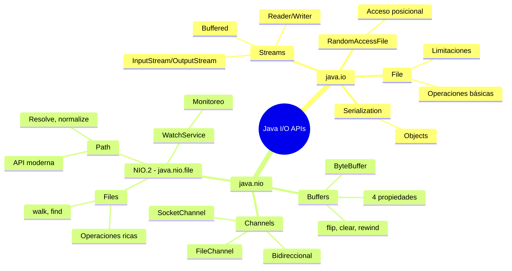

# 📦 Paquetes java.io y java.nio en Java

## 🎯 Introducción

> [!info]- 💡 ¿Qué son java.io y java.nio?
> 
> Java proporciona dos APIs principales para operaciones de entrada/salida (I/O):
> 
> - **java.io** (Java I/O clásico) - Desde Java 1.0
> - **java.nio** (New I/O) - Desde Java 1.4, mejorado en Java 7 (NIO.2)
> 
> **Analogía práctica:**
> 
> - **java.io** es como un **sistema de correo tradicional**: Envías una carta (stream), esperas respuesta (bloqueante), proceso secuencial.
> - **java.nio** es como un **centro de distribución moderno**: Múltiples canales simultáneos, procesas lo que está listo (non-blocking), buffers eficientes.
> 
> **Evolución histórica:**
> 
> |Versión|Año|Característica|Beneficio|
> |---|---|---|---|
> |**Java 1.0**|1996|java.io inicial|I/O básico con streams|
> |**Java 1.4**|2002|java.nio (NIO)|Buffers, Channels, Selectors|
> |**Java 7**|2011|NIO.2 (java.nio.file)|Path, Files, mejor API|
> |**Java 8+**|2014+|Stream API|Procesamiento funcional|
> 
> **¿Cuándo usar cada uno?**
> 
> ```mermaid
> graph TD
>     A{Necesitas...} --> B[I/O simple<br/>Archivos pequeños<br/>Compatibilidad]
>     A --> C[Alto rendimiento<br/>Archivos grandes<br/>Non-blocking I/O]
>     
>     B --> D[java.io<br/>Streams tradicionales]
>     C --> E[java.nio<br/>Channels y Buffers]
>     
>     D --> F[FileInputStream<br/>BufferedReader<br/>FileWriter]
>     E --> G[FileChannel<br/>ByteBuffer<br/>Path/Files]
>     
>     style D fill:#e1ffe1
>     style E fill:#e1f5ff
> ```

---

## 📚 Paquete java.io - I/O Clásico

### 🌳 Estructura del Paquete

> [!example]- 🗂️ Organización de java.io
> 
> **Principales categorías de clases:**
> 
> ```mermaid
> classDiagram
>     class java_io {
>         <<package>>
>     }
>     
>     java_io ..> Streams : Byte Streams
>     java_io ..> Characters : Character Streams
>     java_io ..> File_System : Sistema de Archivos
>     java_io ..> Serialization : Serialización
>     java_io ..> RandomAccess : Acceso Aleatorio
>     
>     class Streams {
>         InputStream
>         OutputStream
>         FilterInputStream
>         FilterOutputStream
>     }
>     
>     class Characters {
>         Reader
>         Writer
>         InputStreamReader
>         OutputStreamWriter
>     }
>     
>     class File_System {
>         File
>         FileDescriptor
>         FilenameFilter
>     }
>     
>     class Serialization {
>         Serializable
>         ObjectInputStream
>         ObjectOutputStream
>     }
>     
>     class RandomAccess {
>         RandomAccessFile
>     }
> ```
> 
> **Componentes principales:**
> 
> |Categoría|Clases Principales|Propósito|
> |---|---|---|
> |**Byte Streams**|InputStream, OutputStream|Lectura/escritura de bytes|
> |**Character Streams**|Reader, Writer|Lectura/escritura de caracteres|
> |**File Operations**|File, FileDescriptor|Manipulación de archivos|
> |**Buffering**|BufferedInputStream, BufferedReader|Optimización de I/O|
> |**Data Types**|DataInputStream, DataOutputStream|Tipos primitivos|
> |**Objects**|ObjectInputStream, ObjectOutputStream|Serialización|
> |**Random Access**|RandomAccessFile|Acceso no secuencial|
> |**Piped**|PipedInputStream, PipedOutputStream|Comunicación entre threads|
> |**Filtering**|FilterInputStream, FilterOutputStream|Decoradores|

### 🔑 Clases Fundamentales de java.io

> [!success]- 📋 Descripción Detallada
> 
> **1. Clase File**
> 
> Representa una ruta abstracta a un archivo o directorio.
> 
> ```java
> import java.io.File;
> 
> public class FileDemo {
>     public static void main(String[] args) {
>         File archivo = new File("datos.txt");
>         File directorio = new File("carpeta");
>         File ruta = new File("carpeta/subcarpeta/archivo.txt");
>         
>         // Información del archivo
>         System.out.println("Existe: " + archivo.exists());
>         System.out.println("Es archivo: " + archivo.isFile());
>         System.out.println("Es directorio: " + archivo.isDirectory());
>         System.out.println("Nombre: " + archivo.getName());
>         System.out.println("Ruta absoluta: " + archivo.getAbsolutePath());
>         System.out.println("Tamaño: " + archivo.length() + " bytes");
>         System.out.println("Última modificación: " + archivo.lastModified());
>         
>         // Permisos
>         System.out.println("Puede leer: " + archivo.canRead());
>         System.out.println("Puede escribir: " + archivo.canWrite());
>         System.out.println("Puede ejecutar: " + archivo.canExecute());
>     }
> }
> ```
> 
> **Métodos importantes de File:**
> 
> |Método|Tipo|Descripción|
> |---|---|---|
> |`exists()`|boolean|Verifica existencia|
> |`isFile()`|boolean|Es un archivo|
> |`isDirectory()`|boolean|Es un directorio|
> |`createNewFile()`|boolean|Crea archivo vacío|
> |`mkdir()`|boolean|Crea directorio|
> |`mkdirs()`|boolean|Crea directorios anidados|
> |`delete()`|boolean|Elimina archivo/directorio|
> |`renameTo(File)`|boolean|Renombra/mueve|
> |`list()`|String[]|Lista nombres en directorio|
> |`listFiles()`|File[]|Lista archivos en directorio|
> |`getParent()`|String|Directorio padre|
> |`getFreeSpace()`|long|Espacio libre en disco|
> 
> **2. RandomAccessFile**
> 
> Permite lectura y escritura en posiciones específicas del archivo.
> 
> ```java
> import java.io.RandomAccessFile;
> import java.io.IOException;
> 
> public class RandomAccessDemo {
>     
>     public void ejemploCompleto() {
>         try (RandomAccessFile raf = new RandomAccessFile("datos.bin", "rw")) {
>             
>             // ESCRIBIR en diferentes posiciones
>             raf.writeInt(100);        // Posición 0-3
>             raf.writeDouble(3.14);    // Posición 4-11
>             raf.writeUTF("Hola");     // Posición 12-...
>             
>             // LEER desde el inicio
>             raf.seek(0);              // Ir al inicio
>             int numero = raf.readInt();
>             System.out.println("Número: " + numero);
>             
>             // LEER desde posición específica
>             raf.seek(4);              // Ir a posición 4
>             double decimal = raf.readDouble();
>             System.out.println("Decimal: " + decimal);
>             
>             // Obtener posición actual
>             long posicion = raf.getFilePointer();
>             System.out.println("Posición actual: " + posicion);
>             
>             // Tamaño del archivo
>             long tamaño = raf.length();
>             System.out.println("Tamaño: " + tamaño + " bytes");
>             
>         } catch (IOException e) {
>             e.printStackTrace();
>         }
>     }
> }
> ```
> 
> **Modos de apertura:**
> 
> |Modo|Descripción|Lectura|Escritura|
> |---|---|---|---|
> |`"r"`|Solo lectura|✅|❌|
> |`"rw"`|Lectura y escritura|✅|✅|
> |`"rws"`|rw + sync de contenido y metadata|✅|✅|
> |`"rwd"`|rw + sync de contenido|✅|✅|
> 
> **Visualización de seek():**
> 
> ```mermaid
> graph LR
>     A[Posición 0] -->|seek 0| B[int: 100]
>     B -->|seek 4| C[double: 3.14]
>     C -->|seek 12| D[String: Hola]
>     
>     B -.->|4 bytes| C
>     C -.->|8 bytes| D
>     
>     style B fill:#e1ffe1
>     style C fill:#e1f5ff
>     style D fill:#fff4e1
> ```
> 
> **3. Interfaces Importantes**
> 
> ```java
> // Serializable - Marcadora (sin métodos)
> public class Producto implements Serializable {
>     private static final long serialVersionUID = 1L;
>     private String nombre;
>     private double precio;
>     // getters, setters, constructores...
> }
> 
> // Closeable - Recursos que deben cerrarse
> public interface Closeable extends AutoCloseable {
>     void close() throws IOException;
> }
> 
> // AutoCloseable - Para try-with-resources
> public interface AutoCloseable {
>     void close() throws Exception;
> }
> 
> // FilenameFilter - Filtrar archivos
> File[] archivos = directorio.listFiles(new FilenameFilter() {
>     @Override
>     public boolean accept(File dir, String name) {
>         return name.endsWith(".txt");
>     }
> });
> 
> // Versión lambda (Java 8+)
> File[] archivosTxt = directorio.listFiles(
>     (dir, name) -> name.endsWith(".txt")
> );
> ```

### ⚠️ Limitaciones de java.io

> [!warning]- 🚫 Problemas y Restricciones
> 
> **Principales limitaciones:**
> 
> |Limitación|Descripción|Impacto|
> |---|---|---|
> |**Bloqueante**|Operaciones sincronizan thread|Baja concurrencia|
> |**Sin metadatos extendidos**|Permisos limitados|Dificulta operaciones avanzadas|
> |**Manejo de errores pobre**|Excepciones genéricas|Debugging complicado|
> |**Sin operaciones atómicas**|Move/copy no atómicos|Problemas de concurrencia|
> |**API inconsistente**|Métodos retornan boolean|Error handling complejo|
> |**Sin soporte para links simbólicos**|No detecta/sigue symlinks|Problemas en Unix/Linux|
> |**Operaciones limitadas**|Copiar requiere código manual|Más líneas de código|
> 
> **Ejemplos de limitaciones:**
> 
> ```java
> // ❌ Problema 1: Bloqueante
> InputStream is = new FileInputStream("archivo_grande.bin");
> is.read(); // Bloquea el thread hasta que hay datos disponibles
> 
> // ❌ Problema 2: Error handling pobre
> File archivo = new File("importante.txt");
> boolean eliminado = archivo.delete();
> if (!eliminado) {
>     // ¿Por qué falló? No lo sabemos...
>     System.out.println("No se pudo eliminar, ¿pero por qué?");
> }
> 
> // ❌ Problema 3: Copiar archivo requiere código manual
> public void copiarArchivo(File origen, File destino) throws IOException {
>     try (FileInputStream fis = new FileInputStream(origen);
>          FileOutputStream fos = new FileOutputStream(destino)) {
>         
>         byte[] buffer = new byte[8192];
>         int bytesLeidos;
>         
>         while ((bytesLeidos = fis.read(buffer)) != -1) {
>             fos.write(buffer, 0, bytesLeidos);
>         }
>     }
>     // Mucho código para una operación simple
> }
> 
> // ❌ Problema 4: Renombrar puede fallar silenciosamente
> File origen = new File("old.txt");
> File destino = new File("new.txt");
> boolean renombrado = origen.renameTo(destino);
> // Si falla, no sabemos si es por permisos, porque destino existe, etc.
> ```
> 
> **Diagrama de problemas:**
> 
> ```mermaid
> graph TD
>     A[Operación I/O<br/>con java.io] --> B{Éxito?}
>     B -->|No| C[boolean = false]
>     C --> D[❌ Sin información<br/>de por qué falló]
>     B -->|Sí| E[boolean = true]
>     
>     F[Thread bloqueado] --> G[Esperando I/O]
>     G --> H[❌ No puede hacer<br/>otra tarea]
>     
>     style C fill:#ffe1e1
>     style D fill:#ffcccc
>     style H fill:#ffe1e1
> ```

---

## 🚀 Paquete java.nio - New I/O

### 🌟 Introducción a NIO

> [!tip]- ⚡ ¿Por qué NIO?
> 
> **NIO (New I/O) fue diseñado para superar las limitaciones de java.io:**
> 
> ```mermaid
> graph LR
>     A[java.io<br/>Problemas] --> B[java.nio<br/>Soluciones]
>     
>     C[Bloqueante] --> D[Non-blocking]
>     E[Byte a byte] --> F[Buffers]
>     G[Streams] --> H[Channels]
>     I[Sin selección] --> J[Selectors]
>     K[API limitada] --> L[NIO.2 rico]
>     
>     style A fill:#ffe1e1
>     style B fill:#e1ffe1
> ```
> 
> **Conceptos clave de NIO:**
> 
> |Concepto|Descripción|Beneficio|
> |---|---|---|
> |**Buffers**|Contenedores de datos|Acceso eficiente y flexible|
> |**Channels**|Conexiones a entidades I/O|Bidireccional, más eficiente|
> |**Selectors**|Multiplexación de I/O|Un thread maneja múltiples canales|
> |**Non-blocking**|Operaciones asíncronas|Mayor concurrencia|
> |**Direct Buffers**|Memoria fuera del heap|Cero copias, más rápido|
> 
> **Comparación arquitectural:**
> 
> ```mermaid
> graph TB
>     subgraph "java.io - Stream Oriented"
>     A1[Programa] <-->|InputStream| A2[Archivo]
>     A1 <-->|OutputStream| A2
>     end
>     
>     subgraph "java.nio - Buffer Oriented"
>     B1[Programa] <-->|Buffer| B2[Channel]
>     B2 <-->|Bidireccional| B3[Archivo]
>     end
>     
>     style A1 fill:#ffe1e1
>     style B1 fill:#e1ffe1
>     style B2 fill:#e1f5ff
> ```

### 📦 Estructura de java.nio

> [!info]- 🗂️ Organización del Paquete
> 
> **Paquetes principales:**
> 
> ```mermaid
> classDiagram
>     class java_nio {
>         <<package>>
>     }
>     
>     java_nio <|-- java_nio_channels
>     java_nio <|-- java_nio_file
>     java_nio <|-- java_nio_charset
>     
>     class java_nio {
>         Buffer
>         ByteBuffer
>         CharBuffer
>         IntBuffer
>         etc.
>     }
>     
>     class java_nio_channels {
>         Channel
>         FileChannel
>         SocketChannel
>         ServerSocketChannel
>         Selector
>     }
>     
>     class java_nio_file {
>         Path
>         Paths
>         Files
>         FileSystem
>         WatchService
>     }
>     
>     class java_nio_charset {
>         Charset
>         CharsetEncoder
>         CharsetDecoder
>     }
> ```
> 
> **Descripción de paquetes:**
> 
> |Paquete|Contenido|Uso Principal|
> |---|---|---|
> |**java.nio**|Buffers (ByteBuffer, CharBuffer)|Contenedores de datos|
> |**java.nio.channels**|Channels, Selectors|I/O de alto rendimiento|
> |**java.nio.file**|Path, Files, FileSystem|API moderna de archivos (NIO.2)|
> |**java.nio.charset**|Codificación de caracteres|Conversión entre bytes y chars|
> |**java.nio.file.attribute**|Atributos de archivos|Permisos, timestamps, metadata|

### 🎯 Buffers - Contenedores de Datos

> [!example]- 📊 Concepto y Uso de Buffers
> 
> **Un Buffer es un contenedor para datos de un tipo específico:**
> 
> ```mermaid
> graph LR
>     A[Buffer] --> B[Almacena datos<br/>en memoria]
>     B --> C[4 propiedades<br/>fundamentales]
>     
>     C --> D[capacity: tamaño total]
>     C --> E[position: siguiente índice]
>     C --> F[limit: límite de acceso]
>     C --> G[mark: posición marcada]
>     
>     style A fill:#e1ffe1
>     style C fill:#e1f5ff
> ```
> 
> **Tipos de Buffers:**
> 
> |Clase|Tipo de Dato|Uso|
> |---|---|---|
> |**ByteBuffer**|byte|El más usado, datos binarios|
> |**CharBuffer**|char|Texto|
> |**ShortBuffer**|short|Enteros pequeños|
> |**IntBuffer**|int|Enteros|
> |**LongBuffer**|long|Enteros largos|
> |**FloatBuffer**|float|Decimales|
> |**DoubleBuffer**|double|Decimales de precisión|
> 
> **Propiedades de un Buffer:**
> 
> ```java
> import java.nio.ByteBuffer;
> 
> public class BufferDemo {
>     public static void main(String[] args) {
>         // Crear buffer de 10 bytes
>         ByteBuffer buffer = ByteBuffer.allocate(10);
>         
>         System.out.println("=== Estado inicial ===");
>         mostrarEstado(buffer);
>         
>         // Escribir datos
>         buffer.put((byte) 65); // 'A'
>         buffer.put((byte) 66); // 'B'
>         buffer.put((byte) 67); // 'C'
>         
>         System.out.println("\n=== Después de escribir ===");
>         mostrarEstado(buffer);
>         
>         // Preparar para lectura
>         buffer.flip();
>         
>         System.out.println("\n=== Después de flip() ===");
>         mostrarEstado(buffer);
>         
>         // Leer datos
>         while (buffer.hasRemaining()) {
>             System.out.println((char) buffer.get());
>         }
>         
>         System.out.println("\n=== Después de leer ===");
>         mostrarEstado(buffer);
>     }
>     
>     static void mostrarEstado(ByteBuffer buffer) {
>         System.out.println("capacity: " + buffer.capacity());
>         System.out.println("position: " + buffer.position());
>         System.out.println("limit: " + buffer.limit());
>         System.out.println("remaining: " + buffer.remaining());
>     }
> }
> ```
> 
> **Visualización de las 4 propiedades:**
> 
> ```mermaid
> graph TB
>     subgraph "Estado inicial: capacity=10, position=0, limit=10"
>     A1[0] --- A2[1] --- A3[2] --- A4[3] --- A5[4] --- A6[5] --- A7[6] --- A8[7] --- A9[8] --- A10[9]
>     end
>     
>     subgraph "Después de put 3 bytes: position=3"
>     B1[A] --- B2[B] --- B3[C] --- B4[ ] --- B5[ ] --- B6[ ] --- B7[ ] --- B8[ ] --- B9[ ] --- B10[ ]
>     end
>     
>     subgraph "Después de flip: limit=3, position=0"
>     C1[A] --- C2[B] --- C3[C] --- C4[X] --- C5[X] --- C6[X] --- C7[X] --- C8[X] --- C9[X] --- C10[X]
>     end
>     
>     style B1 fill:#e1ffe1
>     style B2 fill:#e1ffe1
>     style B3 fill:#e1ffe1
>     style C1 fill:#e1f5ff
>     style C2 fill:#e1f5ff
>     style C3 fill:#e1f5ff
>     style C4 fill:#ffe1e1
> ```
> 
> **Métodos principales de Buffer:**
> 
> |Método|Descripción|Efecto|
> |---|---|---|
> |`put()`|Escribe dato|position++|
> |`get()`|Lee dato|position++|
> |`flip()`|Prepara para lectura|limit = position; position = 0|
> |`rewind()`|Vuelve al inicio|position = 0|
> |`clear()`|Prepara para escritura|position = 0; limit = capacity|
> |`compact()`|Compacta datos no leídos|Mueve datos no leídos al inicio|
> |`mark()`|Marca posición actual|mark = position|
> |`reset()`|Vuelve a marca|position = mark|
> |`remaining()`|Elementos restantes|limit - position|
> |`hasRemaining()`|¿Hay elementos?|position < limit|
> 
> **Flujo típico de uso:**
> 
> ```java
> // 1. CREAR buffer
> ByteBuffer buffer = ByteBuffer.allocate(48);
> 
> // 2. ESCRIBIR datos
> buffer.put((byte) 10);
> buffer.put((byte) 20);
> buffer.put((byte) 30);
> 
> // 3. FLIP - cambiar a modo lectura
> buffer.flip();
> 
> // 4. LEER datos
> while (buffer.hasRemaining()) {
>     byte b = buffer.get();
>     System.out.println(b);
> }
> 
> // 5. CLEAR - preparar para nueva escritura
> buffer.clear();
> ```

### 🔗 Channels - Conexiones I/O

> [!success]- 🌊 Concepto y Tipos de Channels
> 
> **Un Channel es una conexión abierta a una entidad I/O (archivo, socket, etc.):**
> 
> **Diferencias Channel vs Stream:**
> 
> |Aspecto|Stream (java.io)|Channel (java.nio)|
> |---|---|---|
> |**Dirección**|Unidireccional|✅ Bidireccional|
> |**Modo**|Solo bloqueante|✅ Bloqueante y non-blocking|
> |**Interacción**|Directo|✅ A través de Buffers|
> |**Transferencia**|Byte a byte o array|✅ Bulk transfers optimizadas|
> |**Scatter/Gather**|❌ No|✅ Sí|
> 
> **Tipos principales de Channels:**
> 
> ```mermaid
> classDiagram
>     class Channel {
>         <<interface>>
>         +isOpen() boolean
>         +close() void
>     }
>     
>     Channel <|-- FileChannel
>     Channel <|-- SocketChannel
>     Channel <|-- ServerSocketChannel
>     Channel <|-- DatagramChannel
>     
>     class FileChannel {
>         +read(ByteBuffer) int
>         +write(ByteBuffer) int
>         +position() long
>         +size() long
>         +transferTo()
>         +transferFrom()
>     }
>     
>     class SocketChannel {
>         +connect(SocketAddress)
>         +read(ByteBuffer) int
>         +write(ByteBuffer) int
>         +configureBlocking(boolean)
>     }
> ```
> 
> **FileChannel - Ejemplo completo:**
> 
> ```java
> import java.nio.ByteBuffer;
> import java.nio.channels.FileChannel;
> import java.nio.file.Path;
> import java.nio.file.Paths;
> import java.nio.file.StandardOpenOption;
> import java.io.IOException;
> 
> public class FileChannelDemo {
>     
>     // ESCRIBIR con FileChannel
>     public void escribirArchivo(String archivo, String contenido) {
>         Path path = Paths.get(archivo);
>         
>         try (FileChannel channel = FileChannel.open(path,
>                 StandardOpenOption.CREATE,
>                 StandardOpenOption.WRITE)) {
>             
>             // Preparar datos en buffer
>             ByteBuffer buffer = ByteBuffer.wrap(contenido.getBytes());
>             
>             // Escribir buffer completo
>             while (buffer.hasRemaining()) {
>                 channel.write(buffer);
>             }
>             
>             System.out.println("✅ Archivo escrito");
>             
>         } catch (IOException e) {
>             e.printStackTrace();
>         }
>     }
>     
>     // LEER con FileChannel
>     public void leerArchivo(String archivo) {
>         Path path = Paths.get(archivo);
>         
>         try (FileChannel channel = FileChannel.open(path,
>                 StandardOpenOption.READ)) {
>             
>             // Crear buffer
>             ByteBuffer buffer = ByteBuffer.allocate(1024);
>             
>             // Leer del channel al buffer
>             int bytesLeidos = channel.read(buffer);
>             
>             while (bytesLeidos != -1) {
>                 // Preparar buffer para lectura
>                 buffer.flip();
>                 
>                 // Procesar datos
>                 while (buffer.hasRemaining()) {
>                     System.out.print((char) buffer.get());
>                 }
>                 
>                 // Preparar buffer para siguiente lectura
>                 buffer.clear();
>                 bytesLeidos = channel.read(buffer);
>             }
>             
>         } catch (IOException e) {
>             e.printStackTrace();
>         }
>     }
>     
>     // COPIAR archivo eficientemente
>     public void copiarArchivo(String origen, String destino) {
>         Path pathOrigen = Paths.get(origen);
>         Path pathDestino = Paths.get(destino);
>         
>         try (FileChannel canalOrigen = FileChannel.open(pathOrigen,
>                     StandardOpenOption.READ);
>              FileChannel canalDestino = FileChannel.open(pathDestino,
>                     StandardOpenOption.CREATE,
>                     StandardOpenOption.WRITE)) {
>             
>             // Transferencia directa (muy eficiente)
>             long tamaño = canalOrigen.size();
>             canalOrigen.transferTo(0, tamaño, canalDestino);
>             
>             System.out.println("✅ Archivo copiado eficientemente");
>             
>         } catch (IOException e) {
>             e.printStackTrace();
>         }
>     }
> }
> ```
> 
> **transferTo() vs lectura manual:**
> 
> ```mermaid
> graph TB
>     subgraph "Lectura Manual - Múltiples copias"
>     A1[Archivo] -->|Kernel| A2[Buffer SO]
>     A2 -->|read| A3[Buffer Java]
>     A3 -->|write| A4[Buffer SO]
>     A4 -->|Kernel| A5[Archivo destino]
>     end
>     
>     subgraph "transferTo - Copia directa"
>     B1[Archivo] -->|Kernel space| B2[Archivo destino]
>     end
>     
>     style A1 fill:#ffe1e1
>     style A5 fill:#ffe1e1
>     style B1 fill:#e1ffe1
>     style B2 fill:#e1ffe1
> ```

---

## 📁 java.nio.file - NIO.2 (Java 7+)

### 🛤️ Path - Rutas Modernas

> [!tip]- 🗺️ Interfaz Path
> 
> **Path reemplaza a File con una API más moderna y flexible:**
> 
> **Crear objetos Path:**
> 
> ```java
> import java.nio.file.Path;
> import java.nio.file.Paths;
> 
> public class PathDemo {
>     public static void main(String[] args) {
>         // Diferentes formas de crear Path
>         Path path1 = Paths.get("archivo.txt");
>         Path path2 = Paths.get("carpeta", "subcarpeta", "archivo.txt");
>         Path path3 = Paths.get("C:\\Users\\usuario\\datos.txt");
>         Path path4 = Paths.get("/home/usuario/datos.txt");
>         
>         // Desde URI
>         Path path5 = Paths.get(URI.create("file:///datos.txt"));
> 
>     // Información del path
>     System.out.println("Nombre archivo: " + path2.getFileName());
>     System.out.println("Directorio padre: " + path2.getParent());
>     System.out.println("Raíz: " + path2.getRoot());
>     System.out.println("Elementos: " + path2.getNameCount());
>     
>     // Iterar elementos
>     for (Path elemento : path2) {
>         System.out.println("  - " + elemento);
>     }
> }
> 
> 
> }
> 
> ````
> 
> **Métodos principales de Path:**
> 
> |Método|Retorno|Descripción|
> |---|---|---|
> |`getFileName()`|Path|Nombre del archivo|
> |`getParent()`|Path|Directorio padre|
> |`getRoot()`|Path|Raíz del sistema de archivos|
> |`toAbsolutePath()`|Path|Ruta absoluta|
> |`toRealPath()`|Path|Ruta canónica (resuelve symlinks)|
> |`normalize()`|Path|Elimina redundancias (.. y .)|
> |`resolve(Path)`|Path|Combina rutas|
> |`relativize(Path)`|Path|Ruta relativa entre dos paths|
> |`startsWith(Path)`|boolean|Comienza con...|
> |`endsWith(Path)`|boolean|Termina con...|
> |`getNameCount()`|int|Número de elementos|
> |`getName(int)`|Path|Elemento en índice|
> 
> **Operaciones con Path:**
> 
> ```java
> Path base = Paths.get("/home/usuario");
> Path archivo = Paths.get("documentos/reporte.txt");
> 
> // Resolver - combinar rutas
> Path completo = base.resolve(archivo);
> // Resultado: /home/usuario/documentos/reporte.txt
> 
> // Normalizar - eliminar redundancias
> Path redundante = Paths.get("/home/usuario/../usuario/./docs");
> Path limpio = redundante.normalize();
> // Resultado: /home/usuario/docs
> 
> // Relativizar - obtener ruta relativa
> Path origen = Paths.get("/home/usuario/docs");
> Path destino = Paths.get("/home/usuario/images");
> Path relativa = origen.relativize(destino);
> // Resultado: ../images
> 
> // Comparar rutas
> Path p1 = Paths.get("archivo.txt");
> Path p2 = Paths.get("./archivo.txt");
> System.out.println("Iguales: " + p1.equals(p2)); // false
> System.out.println("Mismo archivo: " + 
>     Files.isSameFile(p1.toAbsolutePath(), p2.toAbsolutePath())); // true
> ````
> 
> **Diagrama de operaciones:**
> 
> ```mermaid
> graph TD
>     A[/home/usuario/] -->|resolve| B[/home/usuario/docs/archivo.txt/]
>     C["/home/usuario/../usuario/./docs"] -->|normalize| D[/home/usuario/docs/]
>     E["/home/usuario/docs"] -->|relativize| F[../images]
>     F -.-> G[/home/usuario/images/]
> 
>     style B fill:#e1ffe1
>     style D fill:#e1f5ff
>     style F fill:#fff4e1
> ```

### 📂 Files - Operaciones de Archivos

> [!success]- 🛠️ Clase Utility Files
> 
> **Files proporciona métodos estáticos para operaciones comunes:**
> 
> **Operaciones básicas:**
> 
> ```java
> import java.nio.file.*;
> import java.io.IOException;
> import java.util.List;
> 
> public class FilesDemo {
>     
>     // CREAR archivo
>     public void crearArchivo(String ruta) throws IOException {
>         Path path = Paths.get(ruta);
>         Files.createFile(path);
>         System.out.println("✅ Archivo creado");
>     }
>     
>     // CREAR directorios
>     public void crearDirectorios(String ruta) throws IOException {
>         Path path = Paths.get(ruta);
>         Files.createDirectories(path); // Crea todos los niveles necesarios
>         System.out.println("✅ Directorios creados");
>     }
>     
>     // ELIMINAR
>     public void eliminar(String ruta) throws IOException {
>         Path path = Paths.get(ruta);
>         Files.delete(path); // Lanza excepción si no existe
>         // O usar:
>         boolean eliminado = Files.deleteIfExists(path); // Retorna boolean
>     }
>     
>     // COPIAR
>     public void copiar(String origen, String destino) throws IOException {
>         Path pathOrigen = Paths.get(origen);
>         Path pathDestino = Paths.get(destino);
>         
>         Files.copy(pathOrigen, pathDestino,
>             StandardCopyOption.REPLACE_EXISTING);
>         System.out.println("✅ Archivo copiado");
>     }
>     
>     // MOVER
>     public void mover(String origen, String destino) throws IOException {
>         Path pathOrigen = Paths.get(origen);
>         Path pathDestino = Paths.get(destino);
>         
>         Files.move(pathOrigen, pathDestino,
>             StandardCopyOption.REPLACE_EXISTING,
>             StandardCopyOption.ATOMIC_MOVE);
>         System.out.println("✅ Archivo movido");
>     }
>     
>     // VERIFICAR existencia
>     public void verificar(String ruta) {
>         Path path = Paths.get(ruta);
>         
>         System.out.println("Existe: " + Files.exists(path));
>         System.out.println("Es archivo: " + Files.isRegularFile(path));
>         System.out.println("Es directorio: " + Files.isDirectory(path));
>         System.out.println("Es symlink: " + Files.isSymbolicLink(path));
>         System.out.println("Es legible: " + Files.isReadable(path));
>         System.out.println("Es escribible: " + Files.isWritable(path));
>         System.out.println("Es ejecutable: " + Files.isExecutable(path));
>     }
>     
>     // OBTENER tamaño
>     public void obtenerTamaño(String ruta) throws IOException {
>         Path path = Paths.get(ruta);
>         long tamaño = Files.size(path);
>         System.out.println("Tamaño: " + tamaño + " bytes");
>     }
> }
> ```
> 
> **Lectura y escritura simplificadas:**
> 
> ```java
> // LEER archivo completo (archivos pequeños)
> public void leerCompleto(String ruta) throws IOException {
>     Path path = Paths.get(ruta);
>     
>     // Leer todas las líneas
>     List<String> lineas = Files.readAllLines(path);
>     for (String linea : lineas) {
>         System.out.println(linea);
>     }
>     
>     // O leer como String completo
>     String contenido = Files.readString(path); // Java 11+
>     System.out.println(contenido);
>     
>     // Leer bytes
>     byte[] bytes = Files.readAllBytes(path);
> }
> 
> // ESCRIBIR archivo completo
> public void escribirCompleto(String ruta, List<String> lineas) 
>         throws IOException {
>     Path path = Paths.get(ruta);
>     
>     // Escribir lista de líneas
>     Files.write(path, lineas,
>         StandardOpenOption.CREATE,
>         StandardOpenOption.TRUNCATE_EXISTING);
>     
>     // O escribir String directamente (Java 11+)
>     Files.writeString(path, "Contenido completo");
>     
>     // Escribir bytes
>     byte[] datos = {65, 66, 67};
>     Files.write(path, datos);
> }
> 
> // LEER línea por línea (archivos grandes)
> public void leerGrande(String ruta) throws IOException {
>     Path path = Paths.get(ruta);
>     
>     try (Stream<String> lineas = Files.lines(path)) {
>         lineas.forEach(System.out::println);
>     }
>     
>     // Con filtrado
>     try (Stream<String> lineas = Files.lines(path)) {
>         lineas.filter(l -> l.contains("ERROR"))
>               .forEach(System.out::println);
>     }
> }
> ```
> 
> **Métodos importantes de Files:**
> 
> |Categoría|Métodos|Descripción|
> |---|---|---|
> |**Crear**|`createFile()`, `createDirectory()`, `createDirectories()`|Crear archivos/directorios|
> |**Eliminar**|`delete()`, `deleteIfExists()`|Borrar archivos|
> |**Copiar/Mover**|`copy()`, `move()`|Operaciones de archivos|
> |**Verificar**|`exists()`, `isRegularFile()`, `isDirectory()`|Consultas|
> |**Leer**|`readAllLines()`, `readAllBytes()`, `readString()`, `lines()`|Lectura completa o streaming|
> |**Escribir**|`write()`, `writeString()`|Escritura|
> |**Atributos**|`size()`, `getLastModifiedTime()`, `setAttribute()`|Metadata|
> |**Permisos**|`isReadable()`, `isWritable()`, `isExecutable()`|Acceso|
> |**Recorrer**|`walk()`, `list()`, `find()`|Navegación de directorios|

### 🌲 Recorriendo Directorios

> [!example]- 🚶 Walking the File Tree
> 
> **Files proporciona métodos para recorrer árboles de directorios:**
> 
> **1. Listar contenido directo:**
> 
> ```java
> import java.nio.file.*;
> import java.io.IOException;
> import java.util.stream.Stream;
> 
> public void listarDirectorio(String ruta) throws IOException {
>     Path path = Paths.get(ruta);
>     
>     // Listar contenido directo
>     try (Stream<Path> stream = Files.list(path)) {
>         stream.forEach(p -> {
>             String tipo = Files.isDirectory(p) ? "📁 DIR" : "📄 FILE";
>             System.out.println(tipo + " - " + p.getFileName());
>         });
>     }
> }
> ```
> 
> **2. Recorrer recursivamente:**
> 
> ```java
> public void recorrerArbol(String ruta) throws IOException {
>     Path inicio = Paths.get(ruta);
>     
>     // walk() - Profundidad máxima opcional
>     try (Stream<Path> stream = Files.walk(inicio, 3)) { // máx 3 niveles
>         stream.forEach(p -> {
>             try {
>                 String indent = "  ".repeat(p.getNameCount() - inicio.getNameCount());
>                 String tipo = Files.isDirectory(p) ? "📁" : "📄";
>                 System.out.println(indent + tipo + " " + p.getFileName());
>             } catch (Exception e) {
>                 e.printStackTrace();
>             }
>         });
>     }
> }
> ```
> 
> **3. Buscar archivos:**
> 
> ```java
> // Buscar por nombre
> public void buscarArchivos(String ruta, String patron) throws IOException {
>     Path inicio = Paths.get(ruta);
>     
>     try (Stream<Path> stream = Files.find(inicio, Integer.MAX_VALUE,
>             (path, attrs) -> path.getFileName().toString().contains(patron))) {
>         
>         System.out.println("=== Archivos encontrados ===");
>         stream.forEach(System.out::println);
>     }
> }
> 
> // Buscar por extensión
> public void buscarPorExtension(String ruta, String extension) throws IOException {
>     Path inicio = Paths.get(ruta);
>     
>     try (Stream<Path> stream = Files.walk(inicio)) {
>         stream.filter(Files::isRegularFile)
>               .filter(p -> p.toString().endsWith(extension))
>               .forEach(System.out::println);
>     }
> }
> 
> // Buscar archivos grandes
> public void buscarGrandes(String ruta, long tamaañoMinimo) throws IOException {
>     Path inicio = Paths.get(ruta);
>     
>     try (Stream<Path> stream = Files.walk(inicio)) {
>         stream.filter(Files::isRegularFile)
>               .filter(p -> {
>                   try {
>                       return Files.size(p) > tamaañoMinimo;
>                   } catch (IOException e) {
>                       return false;
>                   }
>               })
>               .forEach(p -> {
>                   try {
>                       System.out.println(p + " - " + Files.size(p) + " bytes");
>                   } catch (IOException e) {
>                       e.printStackTrace();
>                   }
>               });
>     }
> }
> ```
> 
> **4. FileVisitor - Control total:**
> 
> ```java
> import java.nio.file.attribute.BasicFileAttributes;
> 
> public class ContadorArchivos extends SimpleFileVisitor<Path> {
>     private int archivos = 0;
>     private int directorios = 0;
>     private long tamaañoTotal = 0;
>     
>     @Override
>     public FileVisitResult visitFile(Path file, BasicFileAttributes attrs) {
>         archivos++;
>         tamaañoTotal += attrs.size();
>         return FileVisitResult.CONTINUE;
>     }
>     
>     @Override
>     public FileVisitResult preVisitDirectory(Path dir, BasicFileAttributes attrs) {
>         directorios++;
>         return FileVisitResult.CONTINUE;
>     }
>     
>     @Override
>     public FileVisitResult visitFileFailed(Path file, IOException exc) {
>         System.err.println("Error accediendo: " + file);
>         return FileVisitResult.CONTINUE;
>     }
>     
>     public void mostrarEstadisticas() {
>         System.out.println("Archivos: " + archivos);
>         System.out.println("Directorios: " + directorios);
>         System.out.println("Tamaño total: " + tamaañoTotal + " bytes");
>     }
> }
> 
> // Usar el visitor
> public void analizarDirectorio(String ruta) throws IOException {
>     Path inicio = Paths.get(ruta);
>     ContadorArchivos contador = new ContadorArchivos();
>     Files.walkFileTree(inicio, contador);
>     contador.mostrarEstadisticas();
> }
> ```
> 
> **Visualización de walk():**
> 
> ```mermaid
> graph TD
>     A[📁 proyecto] --> B[📁 src]
>     A --> C[📁 docs]
>     A --> D[📄 README.md]
>     
>     B --> E[📁 main]
>     B --> F[📁 test]
>     
>     E --> G[📄 App.java]
>     E --> H[📄 Utils.java]
>     
>     F --> I[📄 AppTest.java]
>     
>     C --> J[📄 manual.pdf]
>     
>     style A fill:#e1ffe1
>     style B fill:#e1f5ff
>     style E fill:#fff4e1
> ```

---

## ⚖️ Comparación: java.io vs java.nio

### 📊 Cuadro Comparativo Completo

> [!success]- 🔍 Diferencias Clave
> 
> |Aspecto|java.io|java.nio|
> |---|---|---|
> |**Año**|1996 (Java 1.0)|2002 (Java 1.4), 2011 (NIO.2)|
> |**Orientación**|Stream|Buffer + Channel|
> |**I/O**|Bloqueante (synchronous)|Bloqueante y non-blocking|
> |**API de archivos**|File (limitada)|Path + Files (rica)|
> |**Manejo de errores**|boolean (pobre)|Excepciones detalladas|
> |**Operaciones atómicas**|❌ No|✅ Sí (ATOMIC_MOVE)|
> |**Symlinks**|No detecta|✅ Detecta y puede seguir|
> |**Metadatos**|Limitados|✅ Completos|
> |**Performance**|Aceptable|✅ Superior (especialmente archivos grandes)|
> |**Copiar archivos**|Código manual|✅ Files.copy() built-in|
> |**Recorrer directorios**|Recursión manual|✅ Files.walk(), FileVisitor|
> |**Watch Service**|❌ No|✅ Monitorear cambios en directorios|
> |**Scatter/Gather**|❌ No|✅ Sí|
> |**Memory-mapped files**|❌ No|✅ Sí|
> |**Transferencia directa**|❌ No|✅ transferTo/transferFrom|
> 
> **Ejemplo comparativo - Copiar archivo:**
> 
> ```java
> // ========== java.io ==========
> public void copiarIO(File origen, File destino) throws IOException {
>     try (FileInputStream fis = new FileInputStream(origen);
>          BufferedInputStream bis = new BufferedInputStream(fis);
>          FileOutputStream fos = new FileOutputStream(destino);
>          BufferedOutputStream bos = new BufferedOutputStream(fos)) {
>         
>         byte[] buffer = new byte[8192];
>         int bytesLeidos;
>         
>         while ((bytesLeidos = bis.read(buffer)) != -1) {
>             bos.write(buffer, 0, bytesLeidos);
>         }
>     }
>     // ~15 líneas de código
> }
> 
> // ========== java.nio ==========
> public void copiarNIO(Path origen, Path destino) throws IOException {
>     Files.copy(origen, destino, StandardCopyOption.REPLACE_EXISTING);
>     // 1 línea de código
> }
> ```
> 
> **Comparación de rendimiento:**
> 
> |Operación|java.io|java.nio|Mejora|
> |---|---|---|---|
> |Copiar 100MB|~3.5 seg|~0.8 seg|⚡ 4.4x|
> |Leer 1GB secuencialmente|~15 seg|~5 seg|⚡ 3x|
> |Transferencia directa|N/A|~0.3 seg|⚡ 50x+|
> |Listar 10,000 archivos|~2 seg|~0.5 seg|⚡ 4x|

### 🎯 ¿Cuándo Usar Cada Uno?

> [!tip]- 📋 Guía de Decisión
> 
> **Usa java.io cuando:**
> 
> ```mermaid
> graph TD
>     A[¿Usar java.io?] --> B[✅ Compatibilidad<br/>con código legacy]
>     A --> C[✅ Operaciones simples<br/>archivos pequeños]
>     A --> D[✅ APIs antiguas<br/>requieren InputStream]
>     A --> E[✅ Aplicación simple<br/>sin requisitos de performance]
>     
>     style B fill:#e1ffe1
>     style C fill:#e1ffe1
> ```
> 
> - Necesitas compatibilidad con código antiguo
> - Trabajas con archivos pequeños (< 1MB)
> - No necesitas alto rendimiento
> - APIs de terceros requieren java.io tipos
> - Aplicaciones simples de consola
> 
> **Usa java.nio cuando:**
> 
> ```mermaid
> graph TD
>     A[¿Usar java.nio?] --> B[✅ Alto rendimiento<br/>archivos grandes]
>     A --> C[✅ Non-blocking I/O<br/>Servidores]
>     A --> D[✅ API moderna<br/>código limpio]
>     A --> E[✅ Operaciones avanzadas<br/>symlinks, atributos]
>     A --> F[✅ Watch Service<br/>monitoreo]
>     
>     style B fill:#e1f5ff
>     style C fill:#e1f5ff
>     style D fill:#e1f5ff
> ```
> 
> - Necesitas alto rendimiento
> - Trabajas con archivos grandes (> 10MB)
> - Servidor con muchas conexiones (non-blocking)
> - Necesitas operaciones avanzadas (symlinks, atributos detallados)
> - Quieres código más limpio y moderno
> - Necesitas monitorear cambios en directorios
> - Transferencias directas (zero-copy)
> 
> **Tabla de decisión rápida:**
> 
> |Escenario|Recomendación|Razón|
> |---|---|---|
> |Leer archivo de configuración (5KB)|java.io|Simple y suficiente|
> |Copiar video (2GB)|java.nio|Mucho más rápido|
> |Servidor web (1000 conexiones)|java.nio|Non-blocking esencial|
> |Script de procesamiento simple|java.io|Más fácil para principiantes|
> |Aplicación empresarial moderna|java.nio|API superior|
> |Seguir symlinks|java.nio|java.io no los maneja bien|
> |Monitorear carpeta por cambios|java.nio|WatchService|
> |Leer línea por línea texto|Ambos OK|BufferedReader vs Files.lines()|

---

## 🎓 Ejemplos Prácticos Completos

> [!example]- 💼 Casos de Uso Reales
> 
> **1. Gestor de configuración con java.nio:**
> 
> ```java
> import java.nio.file.*;
> import java.io.IOException;
> import java.util.*;
> 
> public class ConfigManager {
>     private Path configPath;
>     private Properties props;
>     
>     public ConfigManager(String archivo) {
>         this.configPath = Paths.get(archivo);
>         this.props = new Properties();
>     }
>     
>     // Cargar configuración
>     public void cargar() throws IOException {
>         if (Files.exists(configPath)) {
>             try (var reader = Files.newBufferedReader(configPath)) {
>                 props.load(reader);
>                 System.out.println("✅ Configuración cargada");
>             }
>         } else {
>             System.out.println("⚠️ Archivo no existe, usando defaults");
>             cargarDefaults();
>         }
>     }
>     
>     // Guardar configuración
>     public void guardar() throws IOException {
>         // Crear directorio si no existe
>         Path parent = configPath.getParent();
>         if (parent != null) {
>             Files.createDirectories(parent);
>         }
>         
>         try (var writer = Files.newBufferedWriter(configPath,
>                 StandardOpenOption.CREATE,
>                 StandardOpenOption.TRUNCATE_EXISTING)) {
>             props.store(writer, "Configuración de la aplicación");
>             System.out.println("✅ Configuración guardada");
>         }
>     }
>     
>     // Obtener valor
>     public String get(String key, String defaultValue) {
>         return props.getProperty(key, defaultValue);
>     }
>     
>     // Establecer valor
>     public void set(String key, String value) {
>         props.setProperty(key, value);
>     }
>     
>     private void cargarDefaults() {
>         props.setProperty("idioma", "es");
>         props.setProperty("tema", "oscuro");
>         props.setProperty("volumen", "50");
>     }
> }
> ```
> 
> **2. Analizador de directorio:**
> 
> ```java
> import java.nio.file.*;
> import java.nio.file.attribute.BasicFileAttributes;
> import java.io.IOException;
> import java.util.*;
> 
> public class AnalizadorDirectorio {
>     
>     public static class Estadisticas {
>         int totalArchivos = 0;
>         int totalDirectorios = 0;
>         long tamaañoTotal = 0;
>         Map<String, Integer> porExtension = new HashMap<>();
>         Path archivoMasGrande = null;
>         long tamañoMaximo = 0;
>         
>         public void mostrar() {
>             System.out.println("=== ESTADÍSTICAS ===");
>             System.out.println("Archivos: " + totalArchivos);
>             System.out.println("Directorios: " + totalDirectorios);
>             System.out.println("Tamaño total: " + formatearTamaño(tamaañoTotal));
>             System.out.println("\nArchivos por extensión:");
>             porExtension.entrySet().stream()
>                 .sorted((e1, e2) -> e2.getValue().compareTo(e1.getValue()))
>                 .forEach(e -> System.out.println("  " + e.getKey() + ": " + e.getValue()));
>             System.out.println("\nArchivo más grande: " + archivoMasGrande);
>             System.out.println("Tamaño: " + formatearTamaño(tamañoMaximo));
>         }
>         
>         private String formatearTamaño(long bytes) {
>             if (bytes < 1024) return bytes + " B";
>             if (bytes < 1024 * 1024) return (bytes / 1024) + " KB";
>             if (bytes < 1024 * 1024 * 1024) return (bytes / (1024 * 1024)) + " MB";
>             return (bytes / (1024 * 1024 * 1024)) + " GB";
>         }
>     }
>     
>     public Estadisticas analizar(String ruta) throws IOException {
>         Path inicio = Paths.get(ruta);
>         Estadisticas stats = new Estadisticas();
>         
>         Files.walkFileTree(inicio, new SimpleFileVisitor<Path>() {
>             @Override
>             public FileVisitResult visitFile(Path file, BasicFileAttributes attrs) {
>                 stats.totalArchivos++;
>                 long tamaño = attrs.size();
>                 stats.tamaañoTotal += tamaño;
>                 
>                 // Actualizar archivo más grande
>                 if (tamaño > stats.tamañoMaximo) {
>                     stats.tamañoMaximo = tamaño;
>                     stats.archivoMasGrande = file;
>                 }
>                 
>                 // Contar por extensión
>                 String nombre = file.getFileName().toString();
>                 String extension = nombre.contains(".") 
>                     ? nombre.substring(nombre.lastIndexOf("."))
>                     : "(sin extensión)";
>                 stats.porExtension.merge(extension, 1, Integer::sum);
>                 
>                 return FileVisitResult.CONTINUE;
>             }
>             
>             @Override
>             public FileVisitResult preVisitDirectory(Path dir, BasicFileAttributes attrs) {
>                 stats.totalDirectorios++;
>                 return FileVisitResult.CONTINUE;
>             }
>         });
>         
>         return stats;
>     }
> }
> ```
> 
> **3. Sistema de backup:**
> 
> ```java
> import java.nio.file.*;
> import java.io.IOException;
> import java.time.LocalDateTime;
> import java.time.format.DateTimeFormatter;
> 
> public class SistemaBackup {
>     
>     public void crearBackup(String origen, String directorioBackups) 
>             throws IOException {
>         Path pathOrigen = Paths.get(origen);
>         Path dirBackups = Paths.get(directorioBackups);
>         
>         // Crear directorio de backups si no existe
>         Files.createDirectories(dirBackups);
>         
>         // Nombre con timestamp
>         String timestamp = LocalDateTime.now()
>             .format(DateTimeFormatter.ofPattern("yyyyMMdd_HHmmss"));
>         String nombreBackup = pathOrigen.getFileName() + "_" + timestamp;
>         Path pathBackup = dirBackups.resolve(nombreBackup);
>         
>         // Copiar
>         if (Files.isRegularFile(pathOrigen)) {
>             // Es un archivo
>             Files.copy(pathOrigen, pathBackup);
>             System.out.println("✅ Backup creado: " + pathBackup);
>         } else if (Files.isDirectory(pathOrigen)) {
>             // Es un directorio - copiar recursivamente
>             Files.walk(pathOrigen).forEach(source -> {
>                 try {
>                     Path destination = pathBackup.resolve(
>                         pathOrigen.relativize(source));
>                     if (Files.isDirectory(source)) {
>                         Files.createDirectories(destination);
>                     } else {
>                         Files.copy(source, destination,
>                             StandardCopyOption.REPLACE_EXISTING);
>                     }
>                 } catch (IOException e) {
>                     e.printStackTrace();
>                 }
>             });
>             System.out.println("✅ Backup completo creado: " + pathBackup);
>         }
>     }
>     
>     public void limpiarBackupsAntiguos(String directorioBackups, int mantener) 
>             throws IOException {
>         Path dir = Paths.get(directorioBackups);
>         
>         List<Path> backups = new ArrayList<>();
>         Files.list(dir).forEach(backups::add);
>         
>         // Ordenar por fecha de modificación (más reciente primero)
>         backups.sort((p1, p2) -> {
>             try {
>                 return Files.getLastModifiedTime(p2)
>                 .compareTo(Files.getLastModifiedTime(p1));
>         } catch (IOException e) {
>             return 0;
>         }
>     });
>     
>     // Eliminar backups viejos
>     if (backups.size() > mantener) {
>         for (int i = mantener; i < backups.size(); i++) {
>             Path viejo = backups.get(i);
>             if (Files.isDirectory(viejo)) {
>                 eliminarDirectorio(viejo);
>             } else {
>                 Files.delete(viejo);
>             }
>             System.out.println("🗑️ Backup eliminado: " + viejo.getFileName());
>         }
>     }
> }
> 
> private void eliminarDirectorio(Path dir) throws IOException {
>     Files.walk(dir)
>         .sorted(Comparator.reverseOrder())
>         .forEach(path -> {
>             try {
>                 Files.delete(path);
>             } catch (IOException e) {
>                 e.printStackTrace();
>             }
>         });
> }
> 
> 
> }
> ```

---

## 📊 Resumen Visual Completo

### 🗺️ Mapa Conceptual



### 📋 Tabla de Referencia Rápida

> [!success]- 🎯 Guía de Referencia
> 
> **Operaciones comunes y cómo hacerlas:**
> 
> |Operación|java.io|java.nio|
> |---|---|---|
> |**Crear archivo**|`file.createNewFile()`|`Files.createFile(path)`|
> |**Crear directorio**|`file.mkdir()`|`Files.createDirectory(path)`|
> |**Crear directorios anidados**|`file.mkdirs()`|`Files.createDirectories(path)`|
> |**Eliminar**|`file.delete()`|`Files.delete(path)`|
> |**Copiar**|Código manual|`Files.copy(src, dest)`|
> |**Mover**|`file.renameTo()`|`Files.move(src, dest)`|
> |**Verificar existencia**|`file.exists()`|`Files.exists(path)`|
> |**Tamaño**|`file.length()`|`Files.size(path)`|
> |**Listar directorio**|`file.list()`|`Files.list(path)`|
> |**Recorrer árbol**|Recursión manual|`Files.walk(path)`|
> |**Leer todo**|Código manual|`Files.readAllLines(path)`|
> |**Escribir todo**|Código manual|`Files.write(path, lines)`|
> |**Última modificación**|`file.lastModified()`|`Files.getLastModifiedTime(path)`|

---

## 🔗 Conexión con Próximos Temas

> [!quote]- 🌟 Continuando el Aprendizaje
> 
> **Has dominado:**
> 
> ```mermaid
> mindmap
>   root((java.io y java.nio))
>     java.io clásico
>       Streams
>       File
>       Limitaciones
>     java.nio moderno
>       Buffers
>       Channels
>       Path y Files
>       FileVisitor
>     Comparación
>       Cuándo usar cada uno
>       Trade-offs
> ```
> 
> **Progresión natural del aprendizaje:**
> 
> |Nivel|Tema|Por qué es el siguiente paso|
> |---|---|---|
> |**Actual**|java.io y java.nio básicos|Fundamento completo de I/O|
> |**Siguiente**|AsynchronousChannel|I/O asíncrono verdadero|
> |**Avanzado**|Memory-mapped files|Performance extremo|
> |**Práctico**|WatchService|Monitoreo de cambios en tiempo real|
> |**Networking**|SocketChannel + Selector|Servidores de alto rendimiento|
> |**Profesional**|Charset y encoding|Internacionalización|
> 
> **Roadmap de evolución:**
> 
> ```mermaid
> graph LR
>     A[java.io/nio<br/>Básico] --> B[Async I/O<br/>CompletableFuture]
>     B --> C[Memory-Mapped<br/>Files]
>     
>     A -.-> D[WatchService<br/>Monitoreo]
>     D -.-> E[File Systems<br/>Custom]
>     
>     A -.-> F[NIO Sockets<br/>Selectors]
>     F -.-> G[Servidor NIO<br/>Alto rendimiento]
>     
>     style A fill:#e1ffe1
>     style B fill:#e1f5ff
>     style F fill:#fff4e1
> ```

---

**Tags:** #java #io #nio #file #path #channels #buffers #streams #filesystem #performance #nio2 #filechannel #bytebuffer #files #paths #mermaid #diagramas