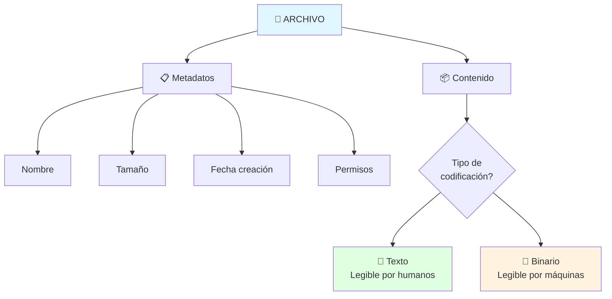
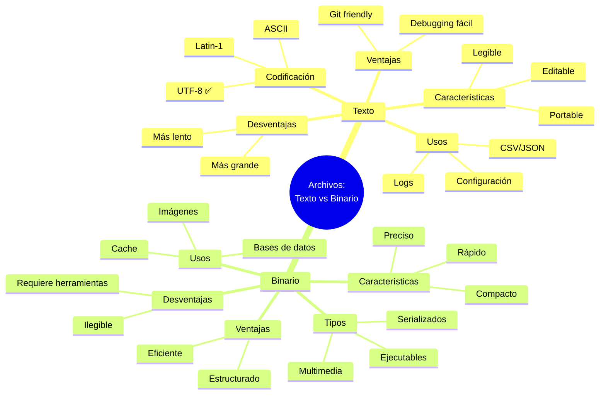
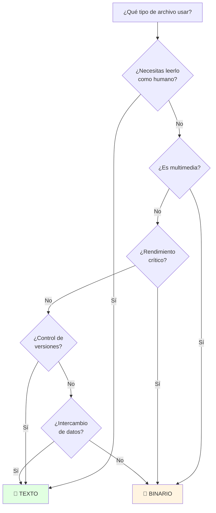

# 📄 ¿Qué es un Archivo?: Texto vs Binario

## 🎯 Introducción

> [!info]- 💡 Concepto Fundamental de Archivo
> 
> Un **archivo** es una colección de datos almacenados en un dispositivo de almacenamiento (disco duro, SSD, USB, etc.) que se identifica mediante un **nombre único** y tiene una **estructura específica** según su tipo.
> 
> **Analogía del mundo real:** Piensa en un archivo como un contenedor:
> 
> - 📝 **Archivo de texto** → Como una carta escrita a mano que puedes leer directamente
> - 🎁 **Archivo binario** → Como una caja cerrada con objetos que necesitas herramientas especiales para usar
> 
> **Componentes de un archivo:**
> 
> |Componente|Descripción|Ejemplo|
> |---|---|---|
> |**Nombre**|Identificador único|`documento.txt`|
> |**Extensión**|Indica el tipo de archivo|`.txt`, `.jpg`, `.pdf`|
> |**Contenido**|Los datos reales|Texto, imagen, código|
> |**Metadatos**|Información sobre el archivo|Tamaño, fecha, permisos|
> |**Ubicación**|Ruta en el sistema|`/home/usuario/docs/`|



---

## 📝 Archivos de Texto

### 🔤 Concepto y Características

> [!success]- 📖 ¿Qué es un Archivo de Texto?
> 
> Un **archivo de texto** contiene datos que están codificados usando un **sistema de caracteres legibles** (como ASCII o Unicode). Cada byte o secuencia de bytes representa un carácter que los humanos pueden leer.
> 
> **Características principales:**
> 
> |Característica|Descripción|Ventaja|
> |---|---|---|
> |**Legibilidad**|Se puede abrir con editores simples|Fácil de inspeccionar y depurar|
> |**Portabilidad**|Compatible entre sistemas operativos|Universal|
> |**Editabilidad**|Modificable con cualquier editor|Flexible|
> |**Estructura**|Organizado en líneas|Intuitivo|
> |**Tamaño**|Generalmente más grande|Pero comprimible|
> 
> **Codificación de caracteres:**
> 
> ```mermaid
> graph LR
>     A[Carácter 'A'] --> B[Codificación]
>     B --> C[ASCII: 65]
>     B --> D[Unicode: U+0041]
>     B --> E[UTF-8: 0x41]
>     
>     F[Carácter 'ñ'] --> G[Codificación]
>     G --> H[ASCII: ❌ No soportado]
>     G --> I[Unicode: U+00F1]
>     G --> J[UTF-8: 0xC3 0xB1]
>     
>     style C fill:#e1ffe1
>     style D fill:#e1f5ff
>     style E fill:#fff4e1
>     style H fill:#ffe1e1
> ```
> 
> **Ejemplo visual del contenido:**
> 
> ```
> Archivo: saludo.txt
> ┌─────────────────────────────┐
> │ Hola Mundo!                 │
> │ Este es un archivo de texto │
> │ con múltiples líneas.       │
> └─────────────────────────────┘
> 
> En memoria (UTF-8):
> 48 6F 6C 61 20 4D 75 6E 64 6F 21 0A ...
> H  o  l  a     M  u  n  d  o  !  \n
> ```

### 📋 Tipos de Archivos de Texto

> [!example]- 📚 Formatos Comunes
> 
> **1. Texto Plano (.txt)**
> 
> ```java
> // Ejemplo de lectura
> try (BufferedReader br = new BufferedReader(new FileReader("notas.txt"))) {
>     String linea;
>     while ((linea = br.readLine()) != null) {
>         System.out.println(linea);
>     }
> }
> ```
> 
> **Características:**
> 
> - Sin formato especial
> - Solo caracteres y saltos de línea
> - Universal y simple
> 
> **2. Archivos de Configuración (.properties, .ini, .conf)**
> 
> ```properties
> # config.properties
> servidor.host=localhost
> servidor.puerto=8080
> base.datos=usuarios
> debug=true
> ```
> 
> ```java
> // Lectura de archivo properties
> Properties props = new Properties();
> try (FileInputStream fis = new FileInputStream("config.properties")) {
>     props.load(fis);
>     String host = props.getProperty("servidor.host");
>     System.out.println("Host: " + host);
> }
> ```
> 
> **3. Código Fuente (.java, .py, .js, .html)**
> 
> ```java
> // Main.java - es texto plano
> public class Main {
>     public static void main(String[] args) {
>         System.out.println("Hola Mundo");
>     }
> }
> ```
> 
> **4. Datos Estructurados (.csv, .json, .xml)**
> 
> ```csv
> # estudiantes.csv
> nombre,edad,promedio
> Ana,20,8.5
> Luis,22,9.0
> María,21,8.8
> ```
> 
> **Tabla comparativa:**
> 
> |Formato|Uso Principal|Complejidad|Legibilidad|
> |---|---|---|---|
> |**.txt**|Notas, logs simples|Muy baja|⭐⭐⭐⭐⭐|
> |**.csv**|Datos tabulares|Baja|⭐⭐⭐⭐|
> |**.json**|APIs, configuración|Media|⭐⭐⭐|
> |**.xml**|Documentos estructurados|Alta|⭐⭐|
> |**.properties**|Configuración Java|Baja|⭐⭐⭐⭐|

### ⚙️ Codificaciones de Texto

> [!tip]- 🔠 Sistemas de Codificación
> 
> **Evolución histórica:**
> 
> ```mermaid
> timeline
>     title Evolución de Codificaciones
>     1960s : ASCII (7 bits, 128 caracteres)
>           : Solo inglés básico
>     1980s : ASCII Extendido (8 bits, 256 caracteres)
>           : Caracteres especiales limitados
>     1990s : Unicode (hasta 4 bytes)
>           : Todos los idiomas del mundo
>     2000s : UTF-8 (longitud variable)
>           : Estándar actual de facto
> ```
> 
> **Comparación de codificaciones:**
> 
> |Codificación|Bytes por carácter|Caracteres soportados|Uso recomendado|
> |---|---|---|---|
> |**ASCII**|1 byte fijo|128 (solo inglés)|Legado, compatibilidad|
> |**Latin-1**|1 byte fijo|256 (Europa Occidental)|Archivos antiguos|
> |**UTF-8**|1-4 bytes variable|✅ **Todos**|✅ **Uso moderno**|
> |**UTF-16**|2-4 bytes|Todos|Sistemas Windows internos|
> |**UTF-32**|4 bytes fijo|Todos|Procesamiento interno|
> 
> **Ejemplo de diferencias:**
> 
> ```java
> String texto = "Hola ñ 你好";
> 
> // ASCII - ❌ No puede representar ñ ni 你好
> // Latin-1 - ⚠️ Puede representar ñ, pero no 你好
> // UTF-8 - ✅ Representa todo correctamente
> 
> try {
>     // Escribir con codificación específica
>     FileWriter fw = new FileWriter("saludo.txt", StandardCharsets.UTF_8);
>     fw.write(texto);
>     fw.close();
>     
>     // Leer con codificación específica
>     FileReader fr = new FileReader("saludo.txt", StandardCharsets.UTF_8);
>     // ...
> } catch (IOException e) {
>     e.printStackTrace();
> }
> ```
> 
> **Representación en memoria:**
> 
> ```
> Carácter: "ñ"
> 
> ASCII:       ❌ No soportado
> 
> Latin-1:     F1 (1 byte)
>              ┌──┐
>              │F1│
>              └──┘
> 
> UTF-8:       C3 B1 (2 bytes)
>              ┌──┬──┐
>              │C3│B1│
>              └──┴──┘
> 
> UTF-16:      00 F1 (2 bytes)
>              ┌──┬──┐
>              │00│F1│
>              └──┴──┘
> ```

### ✅ Ventajas y Desventajas

> [!note]- ⚖️ Análisis de Archivos de Texto
> 
> **Ventajas:**
> 
> |Ventaja|Descripción|Ejemplo de Uso|
> |---|---|---|
> |🔍 **Inspección fácil**|Se abre con cualquier editor|Debugging, revisión rápida|
> |🔧 **Edición manual**|Modificable sin herramientas especiales|Correcciones rápidas|
> |🌐 **Portabilidad**|Compatible entre sistemas|Intercambio de datos|
> |📝 **Versionamiento**|Git y SVN funcionan bien|Control de versiones|
> |🛠️ **Herramientas**|grep, sed, awk, etc.|Procesamiento automatizado|
> 
> **Desventajas:**
> 
> |Desventaja|Descripción|Impacto|
> |---|---|---|
> |📦 **Tamaño**|Ocupa más espacio|Mayor uso de disco|
> |⚡ **Velocidad**|Lectura/escritura más lenta|Afecta rendimiento|
> |🔒 **Seguridad**|Fácil de leer = fácil de robar|Datos sensibles expuestos|
> |📊 **Estructura compleja**|Difícil para datos complejos|Mejor usar binario|
> |🎯 **Precisión numérica**|Conversiones pueden perder precisión|Cálculos científicos|
> 
> **Comparación de tamaño:**
> 
> ```
> Número: 1234567890
> 
> Texto (ASCII):    "1234567890" = 10 bytes
>                   ┌─┬─┬─┬─┬─┬─┬─┬─┬─┬─┐
>                   │1│2│3│4│5│6│7│8│9│0│
>                   └─┴─┴─┴─┴─┴─┴─┴─┴─┴─┘
> 
> Binario (int):    1234567890 = 4 bytes
>                   ┌────┬────┬────┬────┐
>                   │ 49 │ 96 │ 02 │ D2 │
>                   └────┴────┴────┴────┘
> 
> Ahorro: 60% menos espacio
> ```

---

## 🔢 Archivos Binarios

### 💾 Concepto y Características

> [!info]- 🔧 ¿Qué es un Archivo Binario?
> 
> Un **archivo binario** contiene datos en su **forma más directa y eficiente**, usando la representación binaria nativa de la máquina. No están diseñados para ser leídos directamente por humanos.
> 
> **Características principales:**
> 
> |Característica|Descripción|Ventaja|
> |---|---|---|
> |**Compacto**|Usa menos espacio|Eficiente en almacenamiento|
> |**Rápido**|Acceso directo sin conversión|Alto rendimiento|
> |**Preciso**|Mantiene exactitud de datos|Ideal para números|
> |**Estructurado**|Formato definido por especificación|Consistente|
> |**Ilegible**|No se puede leer con editor de texto|Requiere herramientas especiales|
> 
> **Representación visual:**
> 
> ```
> Archivo binario: imagen.jpg
> 
> Editor de texto muestra:
> ┌─────────────────────────────┐
> │ ÿØÿà♣JFIF♣♣☺☺☺☺☺☺☻♣C♣    │
> │ ♥↕♠♠♦♦♠☺♥♣♠♠♥♥♠♣♣♦♣☺♣♣♣ │
> │ ♣♣♦♥♥♦♠♦♣♣♣♣♣♣♣♣♣♣♣♣♣♣♣♣ │
> └─────────────────────────────┘
> Caracteres sin sentido ❌
> 
> Visor de hexadecimal:
> ┌─────────────────────────────┐
> │ FF D8 FF E0 00 10 4A 46 49  │
> │ 46 00 01 01 00 00 01 00 01  │
> │ 00 00 FF DB 00 43 00 08 06  │
> └─────────────────────────────┘
> Estructura definida ✅
> ```

### 📂 Tipos de Archivos Binarios

> [!example]- 🎨 Formatos Comunes
> 
> **Clasificación por categoría:**
> 
> ```mermaid
> mindmap
>   root((Archivos<br/>Binarios))
>     Multimedia
>       Imágenes
>         .jpg .png .gif
>       Audio
>         .mp3 .wav .ogg
>       Video
>         .mp4 .avi .mkv
>     Ejecutables
>       Programas
>         .exe .dll .so
>       Bytecode
>         .class .pyc
>     Documentos
>       Ofimática
>         .docx .xlsx .pptx
>       PDF
>         .pdf
>     Datos
>       Bases de datos
>         .db .sqlite
>       Comprimidos
>         .zip .rar .7z
>       Serializados
>         .ser .dat
> ```
> 
> **Tabla detallada:**
> 
> |Categoría|Formato|Descripción|Lectura en Java|
> |---|---|---|---|
> |**Imágenes**|`.jpg`, `.png`|Píxeles comprimidos|`ImageIO.read()`|
> |**Audio**|`.mp3`, `.wav`|Ondas sonoras|`AudioInputStream`|
> |**Ejecutables**|`.exe`, `.class`|Código máquina/bytecode|JVM lo ejecuta|
> |**Comprimidos**|`.zip`, `.jar`|Archivos empaquetados|`ZipInputStream`|
> |**Base de datos**|`.db`, `.sqlite`|Estructuras indexadas|JDBC|
> |**Serialización**|`.ser`|Objetos Java|`ObjectInputStream`|
> 
> **Ejemplo de archivo .class (bytecode de Java):**
> 
> ```
> Archivo: Main.class (binario)
> 
> Primeros bytes en hexadecimal:
> CA FE BA BE 00 00 00 3D ...
> └──────────┘ └──────────┘
>   "Magic      Versión
>    Number"    de Java
>    
> No se puede leer como texto, pero la JVM lo entiende perfectamente
> ```

### 🔨 Trabajar con Archivos Binarios en Java

> [!tip]- 💻 Lectura y Escritura Binaria
> 
> **Clases principales:**
> 
> ```mermaid
> graph TB
>     A[InputStream<br/>OutputStream] --> B[FileInputStream<br/>FileOutputStream]
>     A --> C[BufferedInputStream<br/>BufferedOutputStream]
>     A --> D[DataInputStream<br/>DataOutputStream]
>     A --> E[ObjectInputStream<br/>ObjectOutputStream]
>     
>     B --> F[Bytes básicos]
>     C --> G[Bytes con buffer]
>     D --> H[Tipos primitivos]
>     E --> I[Objetos completos]
>     
>     style B fill:#fff4e1
>     style C fill:#e1ffe1
>     style D fill:#e1f5ff
>     style E fill:#f0e1ff
> ```
> 
> **1. Lectura/Escritura de bytes básicos:**
> 
> ```java
> // Escribir bytes
> try (FileOutputStream fos = new FileOutputStream("datos.bin")) {
>     byte[] datos = {10, 20, 30, 40, 50};
>     fos.write(datos);
>     System.out.println("✅ Bytes escritos");
> } catch (IOException e) {
>     e.printStackTrace();
> }
> 
> // Leer bytes
> try (FileInputStream fis = new FileInputStream("datos.bin")) {
>     int byteLeido;
>     while ((byteLeido = fis.read()) != -1) {
>         System.out.println("Byte: " + byteLeido);
>     }
> } catch (IOException e) {
>     e.printStackTrace();
> }
> ```
> 
> **2. Tipos primitivos con DataInputStream/DataOutputStream:**
> 
> ```java
> // Escribir tipos primitivos
> try (DataOutputStream dos = new DataOutputStream(
>          new FileOutputStream("numeros.bin"))) {
>     
>     dos.writeInt(42);           // 4 bytes
>     dos.writeDouble(3.14159);   // 8 bytes
>     dos.writeBoolean(true);     // 1 byte
>     dos.writeUTF("Hola");       // Variable
>     
>     System.out.println("✅ Datos escritos");
>     
> } catch (IOException e) {
>     e.printStackTrace();
> }
> 
> // Leer tipos primitivos (MISMO ORDEN)
> try (DataInputStream dis = new DataInputStream(
>          new FileInputStream("numeros.bin"))) {
>     
>     int numero = dis.readInt();
>     double decimal = dis.readDouble();
>     boolean bandera = dis.readBoolean();
>     String texto = dis.readUTF();
>     
>     System.out.println("Int: " + numero);
>     System.out.println("Double: " + decimal);
>     System.out.println("Boolean: " + bandera);
>     System.out.println("String: " + texto);
>     
> } catch (IOException e) {
>     e.printStackTrace();
> }
> ```
> 
> **3. Objetos completos (Serialización):**
> 
> ```java
> // Clase serializable
> class Persona implements Serializable {
>     private static final long serialVersionUID = 1L;
>     private String nombre;
>     private int edad;
>     
>     public Persona(String nombre, int edad) {
>         this.nombre = nombre;
>         this.edad = edad;
>     }
> }
> 
> // Escribir objeto
> try (ObjectOutputStream oos = new ObjectOutputStream(
>          new FileOutputStream("persona.ser"))) {
>     
>     Persona p = new Persona("Ana", 25);
>     oos.writeObject(p);
>     System.out.println("✅ Objeto guardado");
>     
> } catch (IOException e) {
>     e.printStackTrace();
> }
> 
> // Leer objeto
> try (ObjectInputStream ois = new ObjectInputStream(
>          new FileInputStream("persona.ser"))) {
>     
>     Persona p = (Persona) ois.readObject();
>     System.out.println("Objeto cargado: " + p.nombre);
>     
> } catch (IOException | ClassNotFoundException e) {
>     e.printStackTrace();
> }
> ```

### ✅ Ventajas y Desventajas

> [!note]- ⚖️ Análisis de Archivos Binarios
> 
> **Ventajas:**
> 
> |Ventaja|Descripción|Impacto|
> |---|---|---|
> |🚀 **Velocidad**|Sin conversiones de tipo|Hasta 10x más rápido|
> |💾 **Compacto**|Representación directa|30-70% menos espacio|
> |🎯 **Precisión**|Sin pérdida de datos|Ideal para científicos|
> |🔐 **Ofuscación**|No legible fácilmente|Seguridad básica|
> |📊 **Estructuras complejas**|Objetos completos|Facilita persistencia|
> 
> **Desventajas:**
> 
> |Desventaja|Descripción|Impacto|
> |---|---|---|
> |🔍 **Debugging difícil**|No legible en editor de texto|Requiere herramientas especiales|
> |🛠️ **Requiere herramientas**|Necesita programas específicos|Menos flexible|
> |🌐 **Portabilidad**|Puede variar entre sistemas|Problemas de compatibilidad|
> |📝 **Versionamiento**|Git no funciona bien|Difícil control de cambios|
> |⚙️ **Complejidad**|Más código para manejar|Mayor esfuerzo de desarrollo|
> 
> **Ejemplo de eficiencia:**
> 
> ```
> Guardar 1 millón de números (integers):
> 
> Archivo de texto:
> "1,2,3,4,...,1000000"
> Tamaño: ~7-10 MB
> Tiempo lectura: ~500 ms
> 
> Archivo binario:
> Bytes directos
> Tamaño: ~4 MB (int = 4 bytes cada uno)
> Tiempo lectura: ~50 ms
> 
> Mejora: 50-60% espacio, 10x velocidad
> ```

---

## ⚔️ Comparación Directa: Texto vs Binario

### 📊 Tabla Comparativa Completa

> [!success]- 🎯 Decisión Informada
> 
> |Aspecto|Archivos de Texto|Archivos Binarios|Ganador|
> |---|---|---|---|
> |**Legibilidad humana**|✅ Totalmente legible|❌ Ilegible sin herramientas|📝 Texto|
> |**Tamaño de archivo**|❌ Más grande (2-3x)|✅ Compacto|🔢 Binario|
> |**Velocidad I/O**|❌ Más lento|✅ Más rápido (5-10x)|🔢 Binario|
> |**Portabilidad**|✅ Universal|⚠️ Puede variar|📝 Texto|
> |**Debugging**|✅ Muy fácil|❌ Difícil|📝 Texto|
> |**Edición manual**|✅ Cualquier editor|❌ Requiere herramientas|📝 Texto|
> |**Versionamiento (Git)**|✅ Excelente|❌ No funciona bien|📝 Texto|
> |**Precisión numérica**|⚠️ Puede perder precisión|✅ Exacto|🔢 Binario|
> |**Estructuras complejas**|❌ Difícil|✅ Natural|🔢 Binario|
> |**Compresión**|✅ Comprime bien|⚠️ Ya comprimido|📝 Texto|
> |**Seguridad básica**|❌ Expuesto|⚠️ Ofuscado|🔢 Binario|
> |**Intercambio de datos**|✅ APIs, configuración|❌ Multimedia, binarios|📝 Texto|

### 🎯 ¿Cuándo Usar Cada Uno?

> [!tip]- 🤔 Guía de Decisión
> 
> **Usa archivos de TEXTO cuando:**
> 
> ```mermaid
> graph TD
>     A{¿Necesitas usar<br/>archivos de texto?} --> B[✅ Configuración]
>     A --> C[✅ Logs]
>     A --> D[✅ Datos para humanos]
>     A --> E[✅ Intercambio de datos]
>     A --> F[✅ Control de versiones]
>     
>     B --> G[Fácil edición manual]
>     C --> H[Debugging y monitoreo]
>     D --> I[Reportes, documentos]
>     E --> J[APIs REST, CSV]
>     F --> K[Git, SVN]
>     
>     style A fill:#e1f5ff
>     style B fill:#e1ffe1
>     style C fill:#e1ffe1
>     style D fill:#e1ffe1
>     style E fill:#e1ffe1
>     style F fill:#e1ffe1
> ```
> 
> |Caso de Uso|Por Qué Texto|Ejemplo|
> |---|---|---|
> |**Configuración**|Edición manual frecuente|`config.properties`, `.env`|
> |**Logs**|Necesitan ser legibles|`application.log`|
> |**Intercambio de datos**|Estándares abiertos|JSON, XML, CSV|
> |**Documentación**|Para lectura humana|README.md, docs.txt|
> |**Scripts**|Código fuente|.java, .py, .sh|
> 
> **Usa archivos BINARIOS cuando:**
> 
> ```mermaid
> graph TD
>     A{¿Necesitas usar<br/>archivos binarios?} --> B[✅ Multimedia]
>     A --> C[✅ Rendimiento crítico]
>     A --> D[✅ Datos complejos]
>     A --> E[✅ Espacio limitado]
>     A --> F[✅ Precisión numérica]
>     
>     B --> G[Imágenes, audio, video]
>     C --> H[Bases de datos, cache]
>     D --> I[Objetos serializados]
>     E --> J[Sensores, IoT]
>     F --> K[Científicos, financieros]
>     
>     style A fill:#e1f5ff
>     style B fill:#fff4e1
>     style C fill:#fff4e1
>     style D fill:#fff4e1
>     style E fill:#fff4e1
>     style F fill:#fff4e1
> ```
> 
> |Caso de Uso|Por Qué Binario|Ejemplo|
> |---|---|---|
> |**Multimedia**|Tamaño y calidad|.jpg, .mp3, .mp4|
> |**Rendimiento**|Velocidad crítica|Bases de datos, cache|
> |**Objetos complejos**|Estructura preservada|Serialización Java|
> |**Recursos limitados**|Espacio reducido|Dispositivos embebidos|
> |**Cálculos precisos**|Sin pérdida de precisión|Datos científicos|

### 💡 Ejemplo Práctico Comparativo

> [!example]- 🔬 Mismo Dato, Dos Formatos
> 
> **Escenario:** Guardar información de estudiantes
> 
> **OPCIÓN 1: Archivo de texto (CSV)**
> 
> ```csv
> nombre,edad,promedio,activo
> Ana García,20,8.5,true
> Luis Pérez,22,9.0,true
> María López,21,8.8,false
> ```
> 
> ```java
> // Leer CSV
> try (BufferedReader br = new BufferedReader(new FileReader("estudiantes.csv"))) {
>     String linea;
>     br.readLine(); // Saltar encabezado
>     
>     while ((linea = br.readLine()) != null) {
>         String[] datos = linea.split(",");
>         String nombre = datos[0];
>         int edad = Integer.parseInt(datos[1]);      // Conversión
>         double promedio = Double.parseDouble(datos[2]); // Conversión
>         boolean activo = Boolean.parseBoolean(datos[3]); // Conversión
>         
>         // Usar datos...
>     }
> } catch (IOException e) {
>     e.printStackTrace();
> }
> ```
> 
> **Análisis:**
> 
> - ✅ Legible: Puedes abrir con Excel
> - ✅ Editable: Corregir errores fácilmente
> - ❌ Lento: Conversiones String → int/double
> - ❌ Grande: ~60 bytes por estudiante
> **OPCIÓN 2: Archivo binario**
> 
> ```java
> // Escribir binario
> try (DataOutputStream dos = new DataOutputStream(
>          new FileOutputStream("estudiantes.bin"))) {
>     
>     // Estudiante 1
>     dos.writeUTF("Ana García");
>     dos.writeInt(20);
>     dos.writeDouble(8.5);
>     dos.writeBoolean(true);
>     
>     // Estudiante 2
>     dos.writeUTF("Luis Pérez");
>     dos.writeInt(22);
>     dos.writeDouble(9.0);
>     dos.writeBoolean(true);
>     
>     // ...
>     
> } catch (IOException e) {
>     e.printStackTrace();
> }
> 
> // Leer binario
> try (DataInputStream dis = new DataInputStream(
>          new FileInputStream("estudiantes.bin"))) {
>     
>     while (dis.available() > 0) {
>         String nombre = dis.readUTF();      // Directo
>         int edad = dis.readInt();           // Directo
>         double promedio = dis.readDouble(); // Directo
>         boolean activo = dis.readBoolean(); // Directo
>         
>         // Usar datos...
>     }
>     
> } catch (IOException e) {
>     e.printStackTrace();
> }
> ```
> 
> **Análisis:**
> 
> - ❌ Ilegible: No se puede abrir con editor
> - ❌ No editable: Requiere programa
> - ✅ Rápido: Sin conversiones
> - ✅ Compacto: ~35 bytes por estudiante
> 
> **Comparación de resultados:**
> 
> ```
> 1000 estudiantes:
> 
> CSV (texto):
> - Tamaño: ~60 KB
> - Tiempo lectura: ~150 ms
> - Legible: ✅
> - Git diff: ✅
> 
> Binario:
> - Tamaño: ~35 KB (40% menos)
> - Tiempo lectura: ~20 ms (7.5x más rápido)
> - Legible: ❌
> - Git diff: ❌
> ```

---

## 🔍 Identificación de Tipos de Archivo

### 🏷️ Extensiones vs Contenido Real

> [!warning]- ⚠️ No Confiar Solo en la Extensión
> 
> **La extensión es solo una convención**, el contenido real determina el tipo.
> 
> ```mermaid
> graph LR
>     A[archivo.txt] --> B{¿Qué contiene<br/>realmente?}
>     B --> C[Texto plano ✅]
>     B --> D[Datos binarios ❌<br/>Engañoso]
>     B --> E[Código HTML ⚠️<br/>Extensión incorrecta]
>     
>     style C fill:#e1ffe1
>     style D fill:#ffe1e1
>     style E fill:#fff4e1
> ```
> 
> **Magic Numbers (Números Mágicos):**
> 
> Muchos archivos binarios comienzan con bytes específicos que los identifican:
> 
> |Formato|Magic Number (Hex)|Magic Number (ASCII)|
> |---|---|---|
> |**JPEG**|`FF D8 FF`|N/A|
> |**PNG**|`89 50 4E 47`|`.PNG`|
> |**GIF**|`47 49 46 38`|`GIF8`|
> |**PDF**|`25 50 44 46`|`%PDF`|
> |**ZIP**|`50 4B 03 04`|`PK..`|
> |**Class (Java)**|`CA FE BA BE`|N/A (CAFEBABE)|
> 
> **Código para detectar tipo:**
> 
> ```java
> public String detectarTipoArchivo(String ruta) throws IOException {
>     try (FileInputStream fis = new FileInputStream(ruta)) {
>         byte[] magicBytes = new byte[4];
>         fis.read(magicBytes);
>         
>         // Convertir a hex para comparar
>         StringBuilder hex = new StringBuilder();
>         for (byte b : magicBytes) {
>             hex.append(String.format("%02X ", b));
>         }
>         
>         String magicNumber = hex.toString().trim();
>         
>         // Identificar por magic number
>         if (magicNumber.startsWith("FF D8 FF")) {
>             return "JPEG";
>         } else if (magicNumber.startsWith("89 50 4E 47")) {
>             return "PNG";
>         } else if (magicNumber.startsWith("47 49 46 38")) {
>             return "GIF";
>         } else if (magicNumber.startsWith("25 50 44 46")) {
>             return "PDF";
>         } else if (magicNumber.startsWith("50 4B 03 04")) {
>             return "ZIP";
>         } else if (magicNumber.startsWith("CA FE BA BE")) {
>             return "Java Class";
>         } else {
>             return "Desconocido o texto";
>         }
>     }
> }
> ```

### 🧪 Prueba de Texto vs Binario

> [!tip]- 🔬 Método Heurístico
> 
> **Algoritmo simple para detectar si es texto:**
> 
> ```java
> public boolean esArchivoTexto(String ruta) throws IOException {
>     try (FileInputStream fis = new FileInputStream(ruta)) {
>         byte[] muestra = new byte[512]; // Leer primeros 512 bytes
>         int bytesLeidos = fis.read(muestra);
>         
>         int caracteresNoImprimibles = 0;
>         
>         for (int i = 0; i < bytesLeidos; i++) {
>             byte b = muestra[i];
>             
>             // Caracteres de control permitidos en texto
>             if (b == '\n' || b == '\r' || b == '\t') {
>                 continue;
>             }
>             
>             // Rango ASCII imprimible: 32-126
>             if (b < 32 || b > 126) {
>                 caracteresNoImprimibles++;
>             }
>         }
>         
>         // Si más del 10% son no imprimibles, probablemente es binario
>         double porcentaje = (caracteresNoImprimibles * 100.0) / bytesLeidos;
>         return porcentaje < 10;
>     }
> }
> 
> // Uso
> if (esArchivoTexto("documento.txt")) {
>     System.out.println("✅ Es archivo de texto");
> } else {
>     System.out.println("🔢 Es archivo binario");
> }
> ```
> 
> **Criterios de evaluación:**
> 
> |Indicador|Texto|Binario|
> |---|---|---|
> |**Bytes null (0x00)**|Raro|Común|
> |**Caracteres de control**|Solo \n \r \t|Muchos|
> |**Secuencias válidas UTF-8**|Consistentes|Aleatorias|
> |**Líneas terminadas correctamente**|Sí|No aplicable|

---

## 📚 Casos de Uso Reales

### 🌍 Ejemplos del Mundo Real

> [!example]- 💼 Aplicaciones Prácticas
> 
> **1. Sistema de Logs (TEXTO)**
> 
> ```java
> public class LoggerSimple {
>     private String archivoLog = "aplicacion.log";
>     
>     public void registrarEvento(String nivel, String mensaje) {
>         try (BufferedWriter bw = new BufferedWriter(
>                  new FileWriter(archivoLog, true))) { // append
>             
>             String timestamp = new SimpleDateFormat("yyyy-MM-dd HH:mm:ss")
>                               .format(new Date());
>             String linea = String.format("[%s] %s: %s", 
>                                         timestamp, nivel, mensaje);
>             bw.write(linea);
>             bw.newLine();
>             
>         } catch (IOException e) {
>             System.err.println("Error al escribir log: " + e.getMessage());
>         }
>     }
> }
> 
> // Uso
> LoggerSimple logger = new LoggerSimple();
> logger.registrarEvento("INFO", "Aplicación iniciada");
> logger.registrarEvento("ERROR", "Conexión fallida");
> 
> // Resultado en aplicacion.log:
> // [2024-12-09 15:30:45] INFO: Aplicación iniciada
> // [2024-12-09 15:30:52] ERROR: Conexión fallida
> ```
> 
> **Por qué texto:** Necesitas leer logs rápidamente para debugging
> 
> **2. Cache de Objetos (BINARIO)**
> 
> ```java
> public class CacheUsuarios {
>     private String archivoCache = "usuarios.cache";
>     
>     public void guardarCache(List<Usuario> usuarios) {
>         try (ObjectOutputStream oos = new ObjectOutputStream(
>                  new FileOutputStream(archivoCache))) {
>             
>             oos.writeObject(usuarios);
>             System.out.println("✅ Cache guardado: " + usuarios.size());
>             
>         } catch (IOException e) {
>             System.err.println("Error al guardar cache");
>         }
>     }
>     
>     @SuppressWarnings("unchecked")
>     public List<Usuario> cargarCache() {
>         try (ObjectInputStream ois = new ObjectInputStream(
>                  new FileInputStream(archivoCache))) {
>             
>             return (List<Usuario>) ois.readObject();
>             
>         } catch (IOException | ClassNotFoundException e) {
>             return new ArrayList<>(); // Cache vacío
>         }
>     }
> }
> ```
> 
> **Por qué binario:** Velocidad crítica, objetos complejos
> 
> **3. Configuración Híbrida**
> 
> ```java
> // config.properties (TEXTO) - Configuración editable
> servidor.host=localhost
> servidor.puerto=8080
> cache.enabled=true
> 
> // cache.bin (BINARIO) - Datos temporales
> // Objetos serializados para inicio rápido
> ```

---

## 📊 Resumen Visual

### 🗺️ Mapa Mental Completo



### 📋 Decisión Rápida



---

## 🎓 Ejercicios Prácticos

> [!example]- 💪 Práctica Hands-On
> 
> **Ejercicio 1: Convertidor Texto a Binario**
> 
> ```java
> public class Convertidor {
>     
>     // Leer CSV y convertir a binario
>     public void csvABinario(String csvFile, String binFile) {
>         try (BufferedReader br = new BufferedReader(new FileReader(csvFile));
>              DataOutputStream dos = new DataOutputStream(
>                  new FileOutputStream(binFile))) {
>             
>             String linea;
>             br.readLine(); // Saltar encabezado
>             
>             while ((linea = br.readLine()) != null) {
>                 String[] datos = linea.split(",");
>                 dos.writeUTF(datos[0]);          // nombre
>                 dos.writeInt(Integer.parseInt(datos[1]));  // edad
>                 dos.writeDouble(Double.parseDouble(datos[2])); // promedio
>             }
>             
>             System.out.println("✅ Conversión completada");
>             
>         } catch (IOException e) {
>             e.printStackTrace();
>         }
>     }
> }
> ```
> 
> **Ejercicio 2: Analizador de Archivos**
> 
> ```java
> public class AnalizadorArchivos {
>     
>     public void analizarArchivo(String ruta) throws IOException {
>         File archivo = new File(ruta);
>         
>         System.out.println("📊 ANÁLISIS DE ARCHIVO");
>         System.out.println("=".repeat(50));
>         System.out.println("Nombre: " + archivo.getName());
>         System.out.println("Tamaño: " + archivo.length() + " bytes");
>         
>         // Detectar tipo
>         String tipo = detectarTipoArchivo(ruta);
>         System.out.println("Tipo detectado: " + tipo);
>         
>         // Analizar contenido
>         if (esArchivoTexto(ruta)) {
>             analizarTexto(ruta);
>         } else {
>             System.out.println("📦 Archivo binario - análisis limitado");
>         }
>     }
>     
>     private void analizarTexto(String ruta) throws IOException {
>         try (BufferedReader br = new BufferedReader(new FileReader(ruta))) {
>             int lineas = 0;
>             int palabras = 0;
>             int caracteres = 0;
>             
>             String linea;
>             while ((linea = br.readLine()) != null) {
>                 lineas++;
>                 caracteres += linea.length();
>                 palabras += linea.split("\\s+").length;
>             }
>             
>             System.out.println("\n📝 Estadísticas de texto:");
>             System.out.println("  Líneas: " + lineas);
>             System.out.println("  Palabras: " + palabras);
>             System.out.println("  Caracteres: " + caracteres);
>         }
>     }
> }
> ```

---

## 🚀 Próximos Pasos

> [!quote]- 🌟 Continuando el Aprendizaje
> 
> **Has aprendido:**
> 
> ✅ Diferencia fundamental entre texto y binario  
> ✅ Codificaciones de texto (ASCII, UTF-8)  
> ✅ Cómo trabajar con archivos binarios en Java  
> ✅ Ventajas y desventajas de cada tipo  
> ✅ Cuándo usar cada formato  
> ✅ Magic numbers y detección de tipos
> 
> **Próximos temas sugeridos:**
> 
> |Tema|Relación|Importancia|
> |---|---|---|
> |**Serialización Java**|Profundizar en archivos binarios|Alta|
> |**JSON/XML**|Texto estructurado moderno|Muy alta|
> |**Compresión**|Optimizar archivos|Media|
> |**Encriptación**|Seguridad de archivos|Alta|
> |**Java NIO.2**|API moderna de archivos|Alta|

---

**Tags:** #java #archivos #texto #binario #codificacion #utf8 #serialization #io #streams #comparacion