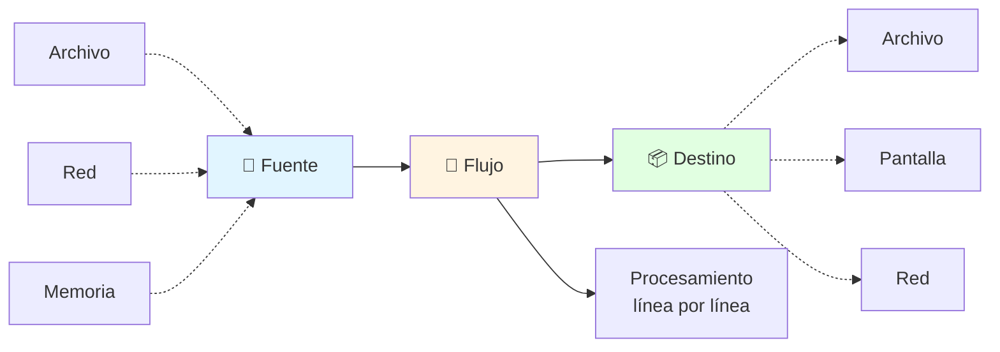
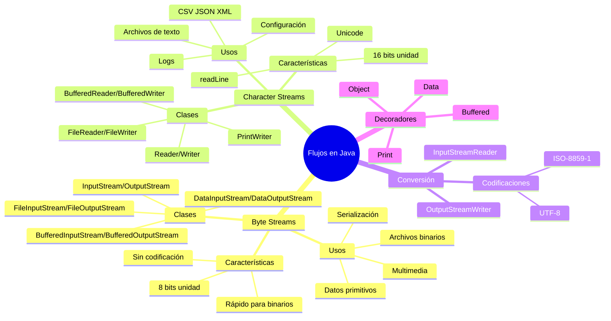

# 🌊 Flujos de Caracteres vs Flujos de Bytes

## 🎯 Introducción

> [!info]- 💡 Concepto de Flujo (Stream)
> 
> Un **flujo (stream)** es una abstracción que representa una secuencia de datos que fluye desde una **fuente** (origen) hacia un **destino**. Es como una tubería por donde pasan los datos de forma ordenada.
> 
> **Analogía del mundo real:** Imagina dos tipos de tuberías:
> 
> - 🔢 **Tubería de bytes** → Transporta agua cruda (datos puros, sin procesar)
> - 🔤 **Tubería de caracteres** → Transporta agua filtrada y purificada (datos interpretados como texto)
> 
> **¿Por qué necesitamos flujos?**
> 
> |Razón|Descripción|Beneficio|
> |---|---|---|
> |**Abstracción**|Mismo código para diferentes fuentes|Código reutilizable|
> |**Eficiencia**|Procesamiento progresivo|No carga todo en memoria|
> |**Uniformidad**|API consistente|Fácil de aprender|
> |**Flexibilidad**|Combinar flujos (decoradores)|Funcionalidad modular|



---

## 🔢 Flujos de Bytes (Byte Streams)

### 📋 Concepto y Jerarquía

> [!note]- 🏗️ Fundamentos de Byte Streams
> 
> Los **flujos de bytes** trabajan con datos **sin procesar**, byte por byte (8 bits). Son la forma más básica y fundamental de E/S en Java.
> 
> **Jerarquía de clases:**
> 
> ```mermaid
> classDiagram
>     class InputStream {
>         <<abstract>>
>         +read() int
>         +read(byte[]) int
>         +close() void
>         +available() int
>     }
>     
>     class OutputStream {
>         <<abstract>>
>         +write(int) void
>         +write(byte[]) void
>         +flush() void
>         +close() void
>     }
>     
>     InputStream <|-- FileInputStream
>     InputStream <|-- BufferedInputStream
>     InputStream <|-- DataInputStream
>     InputStream <|-- ObjectInputStream
>     InputStream <|-- ByteArrayInputStream
>     
>     OutputStream <|-- FileOutputStream
>     OutputStream <|-- BufferedOutputStream
>     OutputStream <|-- DataOutputStream
>     OutputStream <|-- ObjectOutputStream
>     OutputStream <|-- ByteArrayOutputStream
>     
>     class FileInputStream {
>         Leer archivo como bytes
>     }
>     
>     class BufferedInputStream {
>         Buffer para eficiencia
>     }
>     
>     class DataInputStream {
>         Leer tipos primitivos
>     }
>     
>     class ObjectInputStream {
>         Deserializar objetos
>     }
> ```
> 
> **Clases principales:**
> 
> |Clase|Propósito|Uso Principal|Nivel|
> |---|---|---|---|
> |**InputStream/OutputStream**|Clases base abstractas|No usar directamente|Base|
> |**FileInputStream/FileOutputStream**|Leer/escribir archivos|Archivos binarios básicos|Bajo|
> |**BufferedInputStream/BufferedOutputStream**|Con buffer|✅ **Uso general**|Medio|
> |**DataInputStream/DataOutputStream**|Tipos primitivos|Leer/escribir int, double, etc.|Alto|
> |**ObjectInputStream/ObjectOutputStream**|Objetos completos|Serialización|Alto|
> |**ByteArrayInputStream/ByteArrayOutputStream**|Memoria|Testing, cache en RAM|Medio|

### 🔨 Operaciones Básicas

> [!example]- 💻 Trabajar con Byte Streams
> 
> **1. Lectura básica de bytes:**
> 
> ```java
> // Leer archivo byte por byte
> try (FileInputStream fis = new FileInputStream("imagen.jpg")) {
>     int byteLeido;
>     int contador = 0;
>     
>     // read() retorna -1 al final del archivo
>     while ((byteLeido = fis.read()) != -1) {
>         // Procesar byte (0-255)
>         contador++;
>     }
>     
>     System.out.println("Total bytes leídos: " + contador);
>     
> } catch (IOException e) {
>     System.err.println("Error: " + e.getMessage());
> }
> ```
> 
> **2. Lectura eficiente con buffer:**
> 
> ```java
> // Leer en bloques (MÁS EFICIENTE)
> try (BufferedInputStream bis = new BufferedInputStream(
>          new FileInputStream("archivo.dat"))) {
>     
>     byte[] buffer = new byte[8192]; // 8KB buffer
>     int bytesLeidos;
>     
>     while ((bytesLeidos = bis.read(buffer)) != -1) {
>         // Procesar bloque de bytes
>         System.out.println("Bloque de " + bytesLeidos + " bytes");
>     }
>     
> } catch (IOException e) {
>     e.printStackTrace();
> }
> ```
> 
> **3. Escritura de bytes:**
> 
> ```java
> // Escribir bytes individuales
> try (FileOutputStream fos = new FileOutputStream("salida.dat")) {
>     fos.write(65);  // Escribe byte 'A'
>     fos.write(66);  // Escribe byte 'B'
>     fos.write(67);  // Escribe byte 'C'
>     
> } catch (IOException e) {
>     e.printStackTrace();
> }
> 
> // Escribir array de bytes
> try (BufferedOutputStream bos = new BufferedOutputStream(
>          new FileOutputStream("datos.bin"))) {
>     
>     byte[] datos = {10, 20, 30, 40, 50};
>     bos.write(datos);
>     
>     // O escribir parte del array
>     byte[] buffer = new byte[1024];
>     bos.write(buffer, 0, 512); // Escribir primeros 512 bytes
>     
> } catch (IOException e) {
>     e.printStackTrace();
> }
> ```
> 
> **Flujo de lectura:**
> 
> ```mermaid
> sequenceDiagram
>     participant P as Programa
>     participant BIS as BufferedInputStream
>     participant FIS as FileInputStream
>     participant D as Disco
>     
>     P->>BIS: read()
>     BIS->>BIS: ¿Buffer vacío?
>     alt Buffer vacío
>         BIS->>FIS: read(8KB)
>         FIS->>D: Leer del disco
>         D-->>FIS: 8KB de datos
>         FIS-->>BIS: Llenar buffer
>     end
>     BIS-->>P: Retornar 1 byte
>     
>     Note over P,D: El buffer reduce accesos a disco
> ```

### 🎯 Casos de Uso

> [!success]- 📊 Cuándo Usar Byte Streams
> 
> **Escenarios ideales:**
> 
> |Caso de Uso|Por Qué Byte Streams|Ejemplo|
> |---|---|---|
> |**Archivos multimedia**|Datos binarios puros|Copiar imágenes, audio, video|
> |**Archivos binarios**|No son texto|Bases de datos, ejecutables|
> |**Serialización**|Objetos Java|Guardar objetos completos|
> |**Datos de red**|Sockets envían bytes|Comunicación cliente-servidor|
> |**Tipos primitivos**|int, double, etc.|DataInputStream/DataOutputStream|
> 
> **Ejemplo práctico: Copiar imagen**
> 
> ```java
> public void copiarImagen(String origen, String destino) {
>     try (BufferedInputStream bis = new BufferedInputStream(
>              new FileInputStream(origen));
>          BufferedOutputStream bos = new BufferedOutputStream(
>              new FileOutputStream(destino))) {
>         
>         byte[] buffer = new byte[8192];
>         int bytesLeidos;
>         
>         while ((bytesLeidos = bis.read(buffer)) != -1) {
>             bos.write(buffer, 0, bytesLeidos);
>         }
>         
>         System.out.println("✅ Imagen copiada");
>         
>     } catch (IOException e) {
>         System.err.println("❌ Error: " + e.getMessage());
>     }
> }
> ```
> 
> **Ejemplo: Leer tipos primitivos**
> 
> ```java
> // Escribir tipos primitivos
> try (DataOutputStream dos = new DataOutputStream(
>          new FileOutputStream("numeros.dat"))) {
>     
>     dos.writeInt(100);
>     dos.writeDouble(3.14159);
>     dos.writeBoolean(true);
>     dos.writeLong(123456789L);
>     
> } catch (IOException e) {
>     e.printStackTrace();
> }
> 
> // Leer tipos primitivos (MISMO ORDEN)
> try (DataInputStream dis = new DataInputStream(
>          new FileInputStream("numeros.dat"))) {
>     
>     int numero = dis.readInt();
>     double decimal = dis.readDouble();
>     boolean flag = dis.readBoolean();
>     long grande = dis.readLong();
>     
>     System.out.println("Int: " + numero);
>     System.out.println("Double: " + decimal);
>     System.out.println("Boolean: " + flag);
>     System.out.println("Long: " + grande);
>     
> } catch (IOException e) {
>     e.printStackTrace();
> }
> ```

---

## 🔤 Flujos de Caracteres (Character Streams)

### 📋 Concepto y Jerarquía

> [!note]- 🏗️ Fundamentos de Character Streams
> 
> Los **flujos de caracteres** están diseñados específicamente para trabajar con **texto**. Manejan automáticamente la **codificación de caracteres** (UTF-8, etc.) y trabajan con unidades de 16 bits (caracteres Unicode).
> 
> **Jerarquía de clases:**
> 
> ```mermaid
> classDiagram
>     class Reader {
>         <<abstract>>
>         +read() int
>         +read(char[]) int
>         +close() void
>         +ready() boolean
>     }
>     
>     class Writer {
>         <<abstract>>
>         +write(int) void
>         +write(String) void
>         +flush() void
>         +close() void
>     }
>     
>     Reader <|-- FileReader
>     Reader <|-- BufferedReader
>     Reader <|-- InputStreamReader
>     Reader <|-- StringReader
>     Reader <|-- CharArrayReader
>     
>     Writer <|-- FileWriter
>     Writer <|-- BufferedWriter
>     Writer <|-- OutputStreamWriter
>     Writer <|-- StringWriter
>     Writer <|-- PrintWriter
>     
>     class FileReader {
>         Leer archivo como texto
>     }
>     
>     class BufferedReader {
>         Buffer + readLine()
>     }
>     
>     class InputStreamReader {
>         Convierte bytes a caracteres
>         Especifica codificación
>     }
>     
>     class PrintWriter {
>         Métodos print/println
>     }
> ```
> 
> **Clases principales:**
> 
> |Clase|Propósito|Uso Principal|Ventaja Clave|
> |---|---|---|---|
> |**Reader/Writer**|Clases base abstractas|No usar directamente|Base|
> |**FileReader/FileWriter**|Leer/escribir archivos de texto|Archivos pequeños|Simple|
> |**BufferedReader/BufferedWriter**|Con buffer|✅ **Uso general para texto**|`readLine()`|
> |**InputStreamReader/OutputStreamWriter**|Conversión|Bytes ↔ caracteres|Control de codificación|
> |**StringReader/StringWriter**|Memoria (Strings)|Testing, manipulación|No toca disco|
> |**PrintWriter**|Escritura formateada|Logs, reportes|`println()`, formato|

### 🔨 Operaciones Básicas

> [!example]- 💻 Trabajar con Character Streams
> 
> **1. Lectura de texto:**
> 
> ```java
> // Leer carácter por carácter
> try (FileReader fr = new FileReader("texto.txt")) {
>     int caracterLeido;
>     
>     while ((caracterLeido = fr.read()) != -1) {
>         char c = (char) caracterLeido;
>         System.out.print(c);
>     }
>     
> } catch (IOException e) {
>     e.printStackTrace();
> }
> 
> // Leer línea por línea (RECOMENDADO)
> try (BufferedReader br = new BufferedReader(
>          new FileReader("texto.txt"))) {
>     
>     String linea;
>     int numeroLinea = 1;
>     
>     while ((linea = br.readLine()) != null) {
>         System.out.println(numeroLinea + ": " + linea);
>         numeroLinea++;
>     }
>     
> } catch (IOException e) {
>     e.printStackTrace();
> }
> ```
> 
> **2. Escritura de texto:**
> 
> ```java
> // Escritura básica
> try (FileWriter fw = new FileWriter("salida.txt")) {
>     fw.write("Hola Mundo\n");
>     fw.write("Segunda línea\n");
>     
> } catch (IOException e) {
>     e.printStackTrace();
> }
> 
> // Escritura con buffer (RECOMENDADO)
> try (BufferedWriter bw = new BufferedWriter(
>          new FileWriter("salida.txt"))) {
>     
>     bw.write("Primera línea");
>     bw.newLine(); // Salto de línea multiplataforma
>     bw.write("Segunda línea");
>     bw.newLine();
>     
> } catch (IOException e) {
>     e.printStackTrace();
> }
> 
> // Escritura con formato (CONVENIENTE)
> try (PrintWriter pw = new PrintWriter("reporte.txt")) {
>     pw.println("=== REPORTE ===");
>     pw.println();
>     pw.printf("Usuario: %s%n", "Ana");
>     pw.printf("Edad: %d años%n", 25);
>     pw.printf("Promedio: %.2f%n", 8.75);
>     
> } catch (IOException e) {
>     e.printStackTrace();
> }
> ```
> 
> **3. Control de codificación:**
> 
> ```java
> // Leer con codificación específica
> try (BufferedReader br = new BufferedReader(
>          new InputStreamReader(
>              new FileInputStream("texto.txt"), 
>              StandardCharsets.UTF_8))) {
>     
>     String linea;
>     while ((linea = br.readLine()) != null) {
>         System.out.println(linea);
>     }
>     
> } catch (IOException e) {
>     e.printStackTrace();
> }
> 
> // Escribir con codificación específica
> try (BufferedWriter bw = new BufferedWriter(
>          new OutputStreamWriter(
>              new FileOutputStream("salida.txt"), 
>              StandardCharsets.UTF_8))) {
>     
>     bw.write("Texto con ñ, á, é, í, ó, ú");
>     bw.newLine();
>     bw.write("中文字符"); // Caracteres chinos
>     
> } catch (IOException e) {
>     e.printStackTrace();
> }
> ```
> 
> **Flujo de conversión:**
> 
> ```mermaid
> graph LR
>     A[Bytes en disco<br/>UTF-8] --> B[FileInputStream]
>     B --> C[InputStreamReader<br/>Decodifica]
>     C --> D[BufferedReader]
>     D --> E[String en programa<br/>Unicode]
>     
>     style A fill:#fff4e1
>     style C fill:#e1f5ff
>     style E fill:#e1ffe1
> ```

### 🎯 Casos de Uso

> [!success]- 📊 Cuándo Usar Character Streams
> 
> **Escenarios ideales:**
> 
> |Caso de Uso|Por Qué Character Streams|Ejemplo|
> |---|---|---|
> |**Archivos de texto**|Diseñados para texto|.txt, .log, .csv|
> |**Logs de aplicación**|Formato legible|Registro de eventos|
> |**Configuración**|Archivos properties, ini|Parámetros de app|
> |**Reportes**|Documentos para humanos|Informes, resúmenes|
> |**Datos estructurados**|JSON, XML, CSV|Intercambio de datos|
> |**Internacionalización**|Múltiples idiomas|UTF-8, Unicode|
> 
> **Ejemplo práctico: Sistema de logs**
> 
> ```java
> public class Logger {
>     private String archivoLog = "app.log";
>     
>     public void log(String nivel, String mensaje) {
>         try (PrintWriter pw = new PrintWriter(
>                  new BufferedWriter(
>                      new FileWriter(archivoLog, true)))) { // append
>             
>             String timestamp = LocalDateTime.now()
>                 .format(DateTimeFormatter.ofPattern("yyyy-MM-dd HH:mm:ss"));
>             
>             pw.printf("[%s] [%s] %s%n", timestamp, nivel, mensaje);
>             
>         } catch (IOException e) {
>             System.err.println("Error al escribir log: " + e);
>         }
>     }
> }
> 
> // Uso
> Logger logger = new Logger();
> logger.log("INFO", "Aplicación iniciada");
> logger.log("WARNING", "Conexión lenta");
> logger.log("ERROR", "Archivo no encontrado");
> 
> // Resultado en app.log:
> // [2024-12-09 15:45:30] [INFO] Aplicación iniciada
> // [2024-12-09 15:45:35] [WARNING] Conexión lenta
> // [2024-12-09 15:45:40] [ERROR] Archivo no encontrado
> ```
> 
> **Ejemplo: Procesar archivo CSV**
> 
> ```java
> public void procesarCSV(String archivo) {
>     try (BufferedReader br = new BufferedReader(
>              new FileReader(archivo))) {
>         
>         String encabezado = br.readLine();
>         System.out.println("Columnas: " + encabezado);
>         
>         String linea;
>         int filas = 0;
>         
>         while ((linea = br.readLine()) != null) {
>             String[] valores = linea.split(",");
>             // Procesar valores...
>             filas++;
>         }
>         
>         System.out.println("Procesadas " + filas + " filas");
>         
>     } catch (IOException e) {
>         e.printStackTrace();
>     }
> }
> ```

---

## ⚔️ Comparación: Bytes vs Caracteres

### 📊 Diferencias Fundamentales

> [!note]- 🔍 Análisis Comparativo
> 
> **Tabla comparativa completa:**
> 
> |Aspecto|Flujos de Bytes|Flujos de Caracteres|
> |---|---|---|
> |**Unidad de trabajo**|8 bits (byte)|16 bits (char Unicode)|
> |**Clases base**|InputStream/OutputStream|Reader/Writer|
> |**Propósito**|Datos binarios|Texto|
> |**Codificación**|No aplica|UTF-8, ISO-8859-1, etc.|
> |**Métodos clave**|`read()`, `write(byte[])`|`read()`, `readLine()`, `write(String)`|
> |**Eficiencia para texto**|❌ Requiere conversión manual|✅ Optimizado|
> |**Eficiencia para binario**|✅ Directo|❌ No recomendado|
> |**Internacionalización**|⚠️ Manual|✅ Automático|
> |**Caso de uso típico**|Imágenes, audio, serialización|Logs, CSV, configuración|
> 
> **Representación visual:**
> 
> ```mermaid
> graph TB
>     subgraph "Flujos de Bytes"
>     A1[Archivo binario] --> B1[InputStream]
>     B1 --> C1[byte: 8 bits]
>     C1 --> D1[0-255]
>     D1 --> E1[Sin interpretación]
>     end
>     
>     subgraph "Flujos de Caracteres"
>     A2[Archivo de texto] --> B2[Reader]
>     B2 --> C2[char: 16 bits]
>     C2 --> D2[Unicode]
>     D2 --> E2[Caracteres legibles]
>     end
>     
>     style A1 fill:#fff4e1
>     style A2 fill:#e1ffe1
>     style E1 fill:#ffe1e1
>     style E2 fill:#e1ffe1
> ```

### 🔄 Conversión Entre Flujos

> [!tip]- 🌉 Puentes Entre Bytes y Caracteres
> 
> Java proporciona **clases puente** para convertir entre flujos de bytes y caracteres:
> 
> |Clase|Conversión|Uso|
> |---|---|---|
> |**InputStreamReader**|InputStream → Reader|Bytes a caracteres (lectura)|
> |**OutputStreamWriter**|OutputStream → Writer|Caracteres a bytes (escritura)|
> 
> **Diagrama de conversión:**
> 
> ```mermaid
> graph LR
>     A[InputStream<br/>bytes] --> B[InputStreamReader<br/>🌉 puente]
>     B --> C[Reader<br/>caracteres]
>     
>     D[Writer<br/>caracteres] --> E[OutputStreamWriter<br/>🌉 puente]
>     E --> F[OutputStream<br/>bytes]
>     
>     style B fill:#e1f5ff
>     style E fill:#e1f5ff
> ```
> 
> **Ejemplo práctico:**
> 
> ```java
> // Leer texto desde un InputStream con codificación específica
> InputStream is = new FileInputStream("datos.txt");
> Reader reader = new InputStreamReader(is, StandardCharsets.UTF_8);
> BufferedReader br = new BufferedReader(reader);
> 
> // Forma simplificada (recomendada desde Java 11)
> try (BufferedReader br = new BufferedReader(
>          new InputStreamReader(
>              new FileInputStream("datos.txt"),
>              StandardCharsets.UTF_8))) {
>     
>     String linea;
>     while ((linea = br.readLine()) != null) {
>         System.out.println(linea);
>     }
> }
> 
> // Escribir texto a un OutputStream con codificación
> try (BufferedWriter bw = new BufferedWriter(
>          new OutputStreamWriter(
>              new FileOutputStream("salida.txt"),
>              StandardCharsets.UTF_8))) {
>     
>     bw.write("Texto con ñ y acentos");
>     bw.newLine();
> }
> ```
> 
> **¿Por qué es importante la conversión?**
> 
> ```mermaid
> flowchart TD
>     A[Fuente: Socket<br/>InputStream] --> B{¿Qué contiene?}
>     B -->|Texto| C[Usar InputStreamReader]
>     B -->|Binario| D[Usar directamente]
>     
>     C --> E[BufferedReader]
>     E --> F[readLine]
>     
>     D --> G[DataInputStream]
>     G --> H[readInt, readDouble]
>     
>     style C fill:#e1ffe1
>     style D fill:#fff4e1
> ```

### 🎯 Guía de Decisión

> [!success]- 🤔 ¿Qué Flujo Usar?
> 
> **Diagrama de decisión:**
> 
> ```mermaid
> flowchart TD
>     A[¿Qué tipo de flujo usar?] --> B{¿Es texto?}
>     
>     B -->|Sí| C[🔤 Character Streams]
>     B -->|No| D[🔢 Byte Streams]
>     
>     C --> E{¿Necesitas líneas?}
>     E -->|Sí| F[BufferedReader/<br/>BufferedWriter]
>     E -->|No| G[FileReader/<br/>FileWriter]
>     
>     D --> H{¿Qué tipo de datos?}
>     H -->|Binario puro| I[FileInputStream/<br/>FileOutputStream]
>     H -->|Tipos primitivos| J[DataInputStream/<br/>DataOutputStream]
>     H -->|Objetos| K[ObjectInputStream/<br/>ObjectOutputStream]
>     
>     style C fill:#e1ffe1
>     style D fill:#fff4e1
>     style F fill:#ccffcc
>     style J fill:#ffe1cc
> ```
> 
> **Reglas rápidas:**
> 
> |Situación|Usa|Razón|
> |---|---|---|
> |Archivo .txt, .log, .csv|Character Streams|Diseñado para texto|
> |Archivo .jpg, .png, .mp3|Byte Streams|Datos binarios|
> |Leer línea por línea|BufferedReader|Método `readLine()`|
> |Guardar int, double|DataOutputStream|Métodos específicos|
> |Guardar objetos|ObjectOutputStream|Serialización|
> |Red (sockets)|Byte Streams + conversión|Sockets son binarios|
> |Múltiples idiomas|Character Streams + UTF-8|Soporte Unicode|

---

## 🔗 Decorador: Combinar Flujos

### 🎨 Patrón Decorador

> [!info]- 🧩 Composición de Flujos
> 
> Java usa el **patrón Decorador** para agregar funcionalidad a los flujos. Puedes "envolver" un flujo básico con decoradores que añaden capacidades.
> 
> **Concepto visual:**
> 
> ```mermaid
> graph LR
>     A[FileInputStream<br/>Básico] --> B[BufferedInputStream<br/>+Buffer]
>     B --> C[DataInputStream<br/>+Tipos primitivos]
>     
>     style A fill:#ffe1e1
>     style B fill:#fff4e1
>     style C fill:#e1ffe1
> ```
> 
> **Ejemplos de combinaciones:**
> 
> ```java
> // Nivel 1: Básico
> FileInputStream fis = new FileInputStream("datos.bin");
> 
> // Nivel 2: + Buffer
> BufferedInputStream bis = new BufferedInputStream(fis);
> 
> // Nivel 3: + Tipos primitivos
> DataInputStream dis = new DataInputStream(bis);
> 
> // Ahora puedes usar métodos de todos los niveles
> int numero = dis.readInt();
> 
> // Forma compacta (recomendada)
> try (DataInputStream dis = new DataInputStream(
>          new BufferedInputStream(
>              new FileInputStream("datos.bin")))) {
>     
>     int numero = dis.readInt();
>     double decimal = dis.readDouble();
> }
> ```
> 
> **Decoradores comunes:**
> 
> |Decorador|Añade|Ejemplo de Uso|
> |---|---|---|
> |**Buffered**|Buffer en memoria|Mejora rendimiento|
> |**Data**|Tipos primitivos|`readInt()`, `writeDouble()`|
> |**Object**|Serialización|`readObject()`, `writeObject()`|
> |**InputStreamReader**|Conversión a texto|Bytes → caracteres|
> |**PrintWriter**|Métodos print/println|Escritura formateada|
> 
> **Combinaciones típicas:**
> 
> ```java
> // 1. Lectura eficiente de texto
> BufferedReader br = new BufferedReader(
>     new InputStreamReader(
>         new FileInputStream("texto.txt"),
>         StandardCharsets.UTF_8
>     )
> );
> 
> // 2. Escritura eficiente de tipos primitivos
> DataOutputStream dos = new DataOutputStream(
>     new BufferedOutputStream(
>         new FileOutputStream("numeros.bin")
>     )
> );
> 
> // 3. Escritura formateada de texto
> PrintWriter pw = new PrintWriter(
>     new BufferedWriter(
>         new FileWriter("reporte.txt")
>     )
> );
> ```

---

## 💡 Mejores Prácticas

### ✅ Recomendaciones

> [!tip]- 🏆 Consejos Profesionales
> 
> **1. Siempre usa buffers para archivos**
> 
> ```java
> // ❌ MAL - Muy lento
> try (FileInputStream fis = new FileInputStream("grande.txt")) {
>     int b;
>     while ((b = fis.read()) != -1) {
>         // Cada read() accede al disco
>     }
> }
> 
> // ✅ BIEN - Rápido
> try (BufferedInputStream bis = new BufferedInputStream(
>          new FileInputStream("grande.txt"))) {
> 
> int b;
> while ((b = bis.read()) != -1) {
>     // Lee en bloques de 8KB
> }
> 
> 
> }
> ```
> 
> 
> **2. Usa character streams para texto**
> 
> ```java
> // ❌ MAL - Posibles problemas de codificación
> try (FileInputStream fis = new FileInputStream("texto.txt")) {
>     // Trabajar con bytes...
> }
> 
> // ✅ BIEN - Maneja codificación correctamente
> try (BufferedReader br = new BufferedReader(
>          new FileReader("texto.txt"))) {
>     String linea;
>     while ((linea = br.readLine()) != null) {
>         // Trabajar con texto...
>     }
> }
> ````
> 
> **3. Especifica la codificación explícitamente**
> 
> ```java
> // ⚠️ ACEPTABLE - Usa codificación por defecto del sistema
> FileReader fr = new FileReader("texto.txt");
> 
> // ✅ MEJOR - Codificación explícita
> InputStreamReader isr = new InputStreamReader(
>     new FileInputStream("texto.txt"),
>     StandardCharsets.UTF_8
> );
> ```
> 
> **4. Usa try-with-resources siempre**
> 
> ```java
> // ❌ MAL
> BufferedReader br = new BufferedReader(new FileReader("datos.txt"));
> // Si hay error, nunca se cierra
> 
> // ✅ BIEN
> try (BufferedReader br = new BufferedReader(new FileReader("datos.txt"))) {
>     // Se cierra automáticamente
> }
> ```
> 
> **5. Elige el flujo apropiado según el contenido**
> 
> ```mermaid
> flowchart TD
>     A[Contenido del archivo] --> B{Tipo?}
>     B -->|Texto plano| C[BufferedReader]
>     B -->|Números/datos estructurados| D[DataInputStream]
>     B -->|Objetos Java| E[ObjectInputStream]
>     B -->|Imágenes/multimedia| F[BufferedInputStream]
>     B -->|Texto con formato| G[PrintWriter]
>     
>     style C fill:#e1ffe1
>     style D fill:#e1f5ff
>     style E fill:#fff4e1
>     style F fill:#ffe1cc
>     style G fill:#e1ffe1
> ```

---

## 🎓 Ejercicios Prácticos

> [!example]- 💪 Práctica Hands-On
> 
> **Ejercicio 1: Convertidor de codificación**
> 
> ```java
> public class ConvertidorCodificacion {
>     
>     public void convertir(String entrada, String salida,
>                          Charset codOriginal, Charset codDestino) {
>         
>         try (BufferedReader br = new BufferedReader(
>                  new InputStreamReader(
>                      new FileInputStream(entrada), codOriginal));
>              BufferedWriter bw = new BufferedWriter(
>                  new OutputStreamWriter(
>                      new FileOutputStream(salida), codDestino))) {
>             
>             String linea;
>             while ((linea = br.readLine()) != null) {
>                 bw.write(linea);
>                 bw.newLine();
>             }
>             
>             System.out.println("✅ Conversión completada");
>             System.out.println("   " + codOriginal + " → " + codDestino);
>             
>         } catch (IOException e) {
>             System.err.println("❌ Error: " + e.getMessage());
>         }
>     }
> }
> 
> // Uso
> ConvertidorCodificacion conv = new ConvertidorCodificacion();
> conv.convertir("latin1.txt", "utf8.txt",
>                StandardCharsets.ISO_8859_1,
>                StandardCharsets.UTF_8);
> ```
> 
> **Ejercicio 2: Comparador de archivos**
> 
> ```java
> public class ComparadorArchivos {
>     
>     public boolean sonIguales(String archivo1, String archivo2) {
>         try (BufferedInputStream bis1 = new BufferedInputStream(
>                  new FileInputStream(archivo1));
>              BufferedInputStream bis2 = new BufferedInputStream(
>                  new FileInputStream(archivo2))) {
>             
>             int byte1, byte2;
>             long posicion = 0;
>             
>             while (true) {
>                 byte1 = bis1.read();
>                 byte2 = bis2.read();
>                 
>                 if (byte1 != byte2) {
>                     System.out.println("❌ Diferencia en byte " + posicion);
>                     return false;
>                 }
>                 
>                 if (byte1 == -1) {
>                     break; // Ambos terminaron
>                 }
>                 
>                 posicion++;
>             }
>             
>             System.out.println("✅ Archivos idénticos (" + posicion + " bytes)");
>             return true;
>             
>         } catch (IOException e) {
>             System.err.println("❌ Error: " + e.getMessage());
>             return false;
>         }
>     }
> }
> ```
> 
> **Ejercicio 3: Analizador de tipo de archivo**
> 
> ```java
> public class AnalizadorFlujos {
>     
>     public void analizar(String archivo) {
>         File f = new File(archivo);
>         
>         if (!f.exists()) {
>             System.out.println("❌ Archivo no existe");
>             return;
>         }
>         
>         System.out.println("📊 ANÁLISIS DE FLUJOS");
>         System.out.println("=".repeat(50));
>         System.out.println("Archivo: " + archivo);
>         System.out.println("Tamaño: " + f.length() + " bytes");
>         
>         // Intentar como texto
>         if (esTexto(archivo)) {
>             System.out.println("Tipo: 📝 TEXTO");
>             System.out.println("Flujo recomendado: BufferedReader");
>             analizarTexto(archivo);
>         } else {
>             System.out.println("Tipo: 🔢 BINARIO");
>             System.out.println("Flujo recomendado: BufferedInputStream");
>             analizarBinario(archivo);
>         }
>     }
>     
>     private boolean esTexto(String archivo) {
>         try (BufferedInputStream bis = new BufferedInputStream(
>                  new FileInputStream(archivo))) {
>             
>             byte[] muestra = new byte[512];
>             int leidos = bis.read(muestra);
>             int noImprimibles = 0;
>             
>             for (int i = 0; i < leidos; i++) {
>                 byte b = muestra[i];
>                 if (b != '\n' && b != '\r' && b != '\t' && 
>                     (b < 32 || b > 126)) {
>                     noImprimibles++;
>                 }
>             }
>             
>             return (noImprimibles * 100.0 / leidos) < 10;
>             
>         } catch (IOException e) {
>             return false;
>         }
>     }
>     
>     private void analizarTexto(String archivo) {
>         try (BufferedReader br = new BufferedReader(
>                  new FileReader(archivo))) {
>             
>             int lineas = 0;
>             int palabras = 0;
>             String linea;
>             
>             while ((linea = br.readLine()) != null) {
>                 lineas++;
>                 palabras += linea.split("\\s+").length;
>             }
>             
>             System.out.println("  Líneas: " + lineas);
>             System.out.println("  Palabras: " + palabras);
>             
>         } catch (IOException e) {
>             System.err.println("Error al analizar texto");
>         }
>     }
>     
>     private void analizarBinario(String archivo) {
>         try (BufferedInputStream bis = new BufferedInputStream(
>                  new FileInputStream(archivo))) {
>             
>             byte[] primeros4 = new byte[4];
>             bis.read(primeros4);
>             
>             System.out.printf("  Primeros bytes (hex): ");
>             for (byte b : primeros4) {
>                 System.out.printf("%02X ", b);
>             }
>             System.out.println();
>             
>         } catch (IOException e) {
>             System.err.println("Error al analizar binario");
>         }
>     }
> }
> ```

---

## 📊 Resumen Visual

### 🗺️ Mapa Mental Completo



>[!success] ### 📋 Tabla de Referencia Rápida
> 
> |Necesidad|Lectura|Escritura|Nota|
> |---|---|---|---|
> |**Texto, línea por línea**|BufferedReader|BufferedWriter|✅ Más común|
> |**Texto, con formato**|BufferedReader|PrintWriter|Para reportes|
> |**Binario simple**|FileInputStream|FileOutputStream|Sin buffer|
> |**Binario eficiente**|BufferedInputStream|BufferedOutputStream|✅ Recomendado|
> |**Tipos primitivos**|DataInputStream|DataOutputStream|int, double, etc.|
> |**Objetos completos**|ObjectInputStream|ObjectOutputStream|Serialización|
> |**Conversión bytes↔chars**|InputStreamReader|OutputStreamWriter|Con codificación|
> 
---

## 🚀 Próximos Pasos

> [!quote]- 🌟 Continuando el Aprendizaje
> 
> **Has dominado:**
> 
> ✅ Concepto de flujos (streams)  
> ✅ Diferencia entre byte streams y character streams  
> ✅ Jerarquía de clases de E/S  
> ✅ Cuándo usar cada tipo de flujo  
> ✅ Patrón decorador para combinar flujos  
> ✅ Conversión entre bytes y caracteres  
> ✅ Manejo de codificaciones
> 
> **Próximos temas:**
> 
> |Tema|Relación|Importancia|
> |---|---|---|
> |**Java NIO.2**|API moderna de E/S|Alta|
> |**Serialización profunda**|ObjectStreams avanzado|Media|
> |**Compresión**|Trabajar con ZIP/GZIP|Media|
> |**JSON/XML**|Datos estructurados|Muy alta|
> |**Sockets y networking**|Flujos en red|Alta|

---

**Tags:** #java #streams #io #bytes #caracteres #reader #writer #inputstream #outputstream #codificacion #utf8 #buffered
