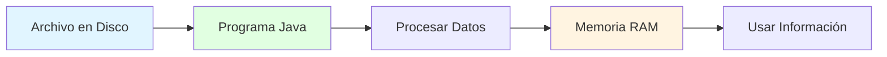
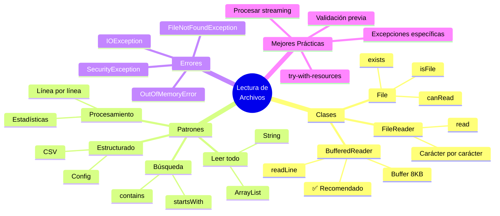
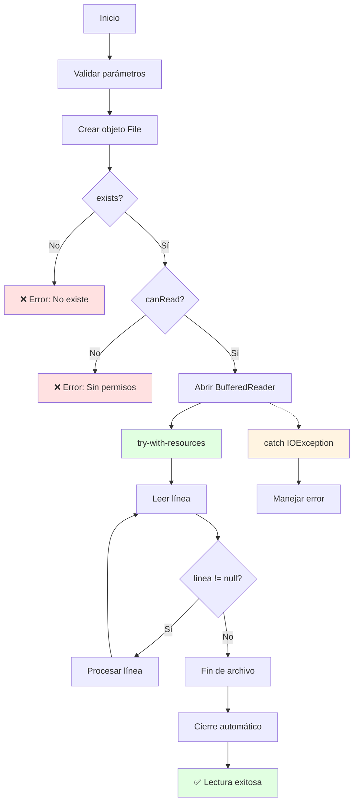

# 📖 Lectura de Archivos de Texto en Java

## 🎯 Introducción

> [!info]- 💡 ¿Qué es la Lectura de Archivos?
> 
> La **lectura de archivos** es el proceso mediante el cual un programa Java accede y extrae información almacenada en archivos del sistema. Es una operación fundamental para trabajar con datos persistentes.
> 
> **Analogía práctica:** Imagina que eres un bibliotecario consultando un libro:
> 
> - **Localizar** el libro en el estante (verificar que existe)
> - **Abrir** el libro en la página correcta
> - **Leer** el contenido línea por línea o palabra por palabra
> - **Cerrar** el libro cuando termines
> 
> **¿Por qué es importante leer archivos?**
> 
> |Escenario|Descripción|Ejemplo Real|
> |---|---|---|
> |**Cargar configuraciones**|Leer preferencias del usuario|Ajustes de una aplicación|
> |**Procesar datos**|Analizar información almacenada|Hojas de cálculo, reportes|
> |**Importar información**|Traer datos de otras fuentes|Archivos CSV, logs|
> |**Recuperar estado**|Continuar donde se quedó|Progreso de videojuego|
> |**Análisis de texto**|Buscar, contar, filtrar información|Análisis de documentos|



---

## 📚 Fundamentos de Lectura

### 🔍 ¿Qué se Puede Leer?

> [!example]- 📄 Tipos de Contenido
> 
> **Archivos de texto vs archivos binarios:**
> 
> |Tipo|Contenido|Legible por humanos|Clases Java|
> |---|---|---|---|
> |**Texto**|Caracteres, líneas, palabras|✅ Sí|FileReader, BufferedReader|
> |**Binario**|Bytes, objetos serializados|❌ No|FileInputStream, ObjectInputStream|
> 
> **Ejemplos de archivos de texto:**
> 
> ```
> - datos.txt
> - configuracion.ini
> - log.txt
> - notas.csv
> - documento.md
> - script.js
> - styles.css
> ```
> 
> **Codificación de caracteres:**
> 
> ```mermaid
> graph TD
>     A[Archivo en Disco] --> B{Codificación}
>     B -->|UTF-8| C[Caracteres Unicode<br/>español, emojis ✅]
>     B -->|ASCII| D[Solo inglés<br/>127 caracteres]
>     B -->|ISO-8859-1| E[Latin-1<br/>español limitado]
>     
>     style C fill:#e1ffe1
>     style D fill:#fff4e1
>     style E fill:#ffe1e1
> ```
> 
> **Estructura típica de un archivo de texto:**
> 
> ```
> Primera línea de texto\n
> Segunda línea con más información\n
> Tercera línea con datos importantes\n
> ```
> 
> - Cada línea termina con un carácter de nueva línea (`\n`)
> - El archivo termina con un marcador EOF (End Of File)
> - Los caracteres se almacenan según la codificación (UTF-8, ASCII, etc.)

### 🎭 Niveles de Lectura

> [!note]- 📊 Granularidad de Lectura
> 
> Java permite leer archivos a diferentes niveles de detalle:
> 
> ```mermaid
> graph LR
>     A[Archivo Completo] --> B[Por Líneas]
>     B --> C[Por Palabras]
>     C --> D[Por Caracteres]
>     
>     A -.-> E[Menos control<br/>más simple]
>     D -.-> F[Más control<br/>más complejo]
>     
>     style B fill:#e1ffe1
>     style C fill:#fff4e1
>     style D fill:#ffe1e1
> ```
> 
> **Comparación de enfoques:**
> 
> |Nivel|Método|Cuándo usar|Complejidad|
> |---|---|---|---|
> |**Archivo completo**|`Files.readAllLines()`|Archivos pequeños|⭐|
> |**Por líneas**|`BufferedReader.readLine()`|✅ Uso general|⭐⭐|
> |**Por palabras**|`Scanner.next()`|Parsear tokens|⭐⭐⭐|
> |**Por caracteres**|`FileReader.read()`|Control fino|⭐⭐⭐⭐|
> 
> **Visualización del proceso:**
> 
> ```
> Archivo: "Hola mundo\nSegunda línea\n"
> 
> Por líneas:
>   ├─ "Hola mundo"
>   └─ "Segunda línea"
> 
> Por palabras:
>   ├─ "Hola"
>   ├─ "mundo"
>   ├─ "Segunda"
>   └─ "línea"
> 
> Por caracteres:
>   'H', 'o', 'l', 'a', ' ', 'm', 'u', 'n', 'd', 'o', '\n', ...
> ```

---

## 🛠️ Clases para Lectura

### 📁 Clase File: Verificación Previa

> [!tip]- 🔍 Preparar el Terreno
> 
> Antes de leer, siempre verifica que el archivo existe y es accesible:
> 
> ```java
> import java.io.File;
> 
> public class VerificarArchivo {
>     public static void main(String[] args) {
>         File archivo = new File("datos.txt");
>         
>         // ✅ Verificaciones esenciales
>         if (!archivo.exists()) {
>             System.out.println("❌ El archivo no existe");
>             return;
>         }
>         
>         if (!archivo.isFile()) {
>             System.out.println("❌ No es un archivo (es un directorio)");
>             return;
>         }
>         
>         if (!archivo.canRead()) {
>             System.out.println("❌ No hay permisos de lectura");
>             return;
>         }
>         
>         // ✅ Todo correcto
>         System.out.println("✅ Archivo listo para leer");
>         System.out.println("📏 Tamaño: " + archivo.length() + " bytes");
>     }
> }
> ```
> 
> **Flujo de verificación:**
> 
> ```mermaid
> flowchart TD
>     A[Crear objeto File] --> B{exists?}
>     B -->|No| C[❌ Error: No existe]
>     B -->|Sí| D{isFile?}
>     D -->|No| E[❌ Error: Es directorio]
>     D -->|Sí| F{canRead?}
>     F -->|No| G[❌ Error: Sin permisos]
>     F -->|Sí| H[✅ Proceder a leer]
>     
>     style C fill:#ffe1e1
>     style E fill:#ffe1e1
>     style G fill:#ffe1e1
>     style H fill:#e1ffe1
> ```
> 
> **Información útil de File:**
> 
> |Método|Retorna|Utilidad|
> |---|---|---|
> |`exists()`|boolean|¿Existe el archivo?|
> |`isFile()`|boolean|¿Es archivo (no directorio)?|
> |`canRead()`|boolean|¿Tenemos permisos?|
> |`length()`|long|Tamaño en bytes|
> |`getName()`|String|Nombre del archivo|
> |`getAbsolutePath()`|String|Ruta completa|
> |`lastModified()`|long|Última modificación|

### 📖 FileReader: Lectura Básica

> [!example]- 🔤 Leer Carácter por Carácter
> 
> **FileReader** es la clase más simple para leer texto, pero opera a nivel de caracteres individuales.
> 
> ```java
> import java.io.FileReader;
> import java.io.IOException;
> 
> public class LecturaBasica {
>     public static void main(String[] args) {
>         // ✅ try-with-resources garantiza cierre automático
>         try (FileReader fr = new FileReader("mensaje.txt")) {
>             
>             int caracter;
>             // read() retorna -1 al final del archivo
>             while ((caracter = fr.read()) != -1) {
>                 System.out.print((char) caracter);
>             }
>             
>         } catch (IOException e) {
>             System.out.println("❌ Error: " + e.getMessage());
>         }
>     }
> }
> ```
> 
> **¿Cómo funciona `read()`?**
> 
> ```mermaid
> sequenceDiagram
>     participant P as Programa
>     participant FR as FileReader
>     participant D as Disco
>     
>     P->>FR: read()
>     FR->>D: Leer 1 carácter
>     D-->>FR: 'H' (72)
>     FR-->>P: 72
>     
>     P->>FR: read()
>     FR->>D: Leer 1 carácter
>     D-->>FR: 'o' (111)
>     FR-->>P: 111
>     
>     P->>FR: read()
>     FR->>D: Leer 1 carácter
>     D-->>FR: EOF
>     FR-->>P: -1
> ```
> 
> **Características de FileReader:**
> 
> |Aspecto|Detalle|
> |---|---|
> |**Método principal**|`read()` - devuelve int|
> |**Valor de retorno**|0-65535 (código Unicode) o -1 (EOF)|
> |**Velocidad**|🐌 Lenta (acceso directo a disco)|
> |**Buffer**|❌ No tiene|
> |**Uso recomendado**|Solo para archivos muy pequeños|
> 
> **⚠️ Problema de rendimiento:**
> 
> ```java
> // ❌ MAL - 10,000 caracteres = 10,000 accesos a disco
> try (FileReader fr = new FileReader("grande.txt")) {
>     int c;
>     while ((c = fr.read()) != -1) {
>         // Cada read() va al disco físicamente
>     }
> }
> ```
> 
> **Ejemplo completo con manejo robusto:**
> 
> ```java
> public void leerConFileReader(String nombreArchivo) {
>     File archivo = new File(nombreArchivo);
>     
>     // Verificación previa
>     if (!archivo.exists()) {
>         System.out.println("❌ Archivo no encontrado");
>         return;
>     }
>     
>     System.out.println("📖 Leyendo: " + archivo.getName());
>     System.out.println("📏 Tamaño: " + archivo.length() + " bytes");
>     System.out.println("━".repeat(50));
>     
>     try (FileReader fr = new FileReader(archivo)) {
>         int caracter;
>         int contador = 0;
>         
>         while ((caracter = fr.read()) != -1) {
>             System.out.print((char) caracter);
>             contador++;
>         }
>         
>         System.out.println("\n" + "━".repeat(50));
>         System.out.println("✅ Leídos " + contador + " caracteres");
>         
>     } catch (IOException e) {
>         System.out.println("❌ Error de lectura: " + e.getMessage());
>     }
> }
> ```

### ⚡ BufferedReader: Lectura Eficiente

> [!success]- 🚀 La Mejor Opción para Lectura de Texto
> 
> **BufferedReader** es la clase recomendada para leer archivos de texto. Usa un buffer interno para minimizar accesos a disco.
> 
> **Arquitectura en capas:**
> 
> ```mermaid
> graph TB
>     A[Programa] --> B[BufferedReader<br/>Buffer 8KB en RAM]
>     B --> C[FileReader<br/>Interfaz con disco]
>     C --> D[Archivo en Disco]
>     
>     B -.-> E[readLine<br/>Lee líneas completas]
>     C -.-> F[read<br/>Lee caracteres]
>     
>     style B fill:#e1ffe1
>     style E fill:#ccffcc
> ```
> 
> **Ventajas del buffer:**
> 
> ```
> Sin buffer (FileReader):
> ├─ Leer 'H' → Acceso a disco #1
> ├─ Leer 'o' → Acceso a disco #2
> ├─ Leer 'l' → Acceso a disco #3
> └─ 1000 caracteres = 1000 accesos 🐌
> 
> Con buffer (BufferedReader):
> ├─ Cargar 8KB en RAM → Acceso a disco #1
> ├─ Leer 'H' → Desde RAM ⚡
> ├─ Leer 'o' → Desde RAM ⚡
> └─ 1000 caracteres = 1-2 accesos 🚀
> ```
> 
> **Ejemplo básico - Lectura línea por línea:**
> 
> ```java
> import java.io.BufferedReader;
> import java.io.FileReader;
> import java.io.IOException;
> 
> public class LecturaConBuffer {
>     public static void main(String[] args) {
>         // ✅ Patrón recomendado
>         try (BufferedReader br = new BufferedReader(new FileReader("notas.txt"))) {
>             
>             String linea;
>             int numeroLinea = 1;
>             
>             // readLine() retorna null al final del archivo
>             while ((linea = br.readLine()) != null) {
>                 System.out.println(numeroLinea + ": " + linea);
>                 numeroLinea++;
>             }
>             
>         } catch (IOException e) {
>             System.out.println("❌ Error: " + e.getMessage());
>         }
>     }
> }
> ```
> 
> **Métodos importantes:**
> 
> |Método|Retorno|Descripción|
> |---|---|---|
> |`readLine()`|String|Lee una línea completa (sin \n)|
> |`read()`|int|Lee un carácter|
> |`read(char[])`|int|Lee múltiples caracteres|
> |`ready()`|boolean|¿Hay datos disponibles?|
> |`skip(long)`|long|Saltar n caracteres|
> |`mark(int)`|void|Marcar posición|
> |`reset()`|void|Volver a marca|
> 
> **Comparación FileReader vs BufferedReader:**
> 
> |Aspecto|FileReader|BufferedReader|
> |---|---|---|
> |**Velocidad**|🐌 Lenta|🚀 Rápida (10-50x)|
> |**Buffer interno**|❌ No|✅ Sí (8KB)|
> |**`readLine()`**|❌ No|✅ Sí|
> |**Uso de memoria**|Mínimo|8KB por instancia|
> |**Recomendado**|❌ Casi nunca|✅ Siempre|

---

## 🎯 Patrones de Lectura

### 📋 Patrón 1: Leer Todo el Archivo

> [!example]- 📚 Cargar Contenido Completo
> 
> **Cuándo usar:** Archivos pequeños que caben en memoria y necesitas procesar todo el contenido.
> 
> ```java
> import java.io.BufferedReader;
> import java.io.FileReader;
> import java.io.IOException;
> import java.util.ArrayList;
> 
> public class LeerTodo {
>     
>     // Método 1: Como ArrayList de líneas
>     public ArrayList<String> leerLineas(String archivo) {
>         ArrayList<String> lineas = new ArrayList<>();
>         
>         try (BufferedReader br = new BufferedReader(new FileReader(archivo))) {
>             String linea;
>             while ((linea = br.readLine()) != null) {
>                 lineas.add(linea);
>             }
>         } catch (IOException e) {
>             System.out.println("❌ Error: " + e.getMessage());
>         }
>         
>         return lineas;
>     }
>     
>     // Método 2: Como String único
>     public String leerCompleto(String archivo) {
>         StringBuilder contenido = new StringBuilder();
>         
>         try (BufferedReader br = new BufferedReader(new FileReader(archivo))) {
>             String linea;
>             while ((linea = br.readLine()) != null) {
>                 contenido.append(linea).append("\n");
>             }
>         } catch (IOException e) {
>             System.out.println("❌ Error: " + e.getMessage());
>         }
>         
>         return contenido.toString();
>     }
>     
>     // Uso
>     public static void main(String[] args) {
>         LeerTodo lector = new LeerTodo();
>         
>         // Opción 1: ArrayList
>         ArrayList<String> lineas = lector.leerLineas("datos.txt");
>         System.out.println("Total líneas: " + lineas.size());
>         
>         // Opción 2: String
>         String texto = lector.leerCompleto("datos.txt");
>         System.out.println("Total caracteres: " + texto.length());
>     }
> }
> ```
> 
> **Flujo de lectura completa:**
> 
> ```mermaid
> flowchart LR
>     A[Archivo] --> B[BufferedReader]
>     B --> C[Línea 1]
>     B --> D[Línea 2]
>     B --> E[Línea 3]
>     C --> F[ArrayList o StringBuilder]
>     D --> F
>     E --> F
>     F --> G[Contenido Completo]
>     
>     style B fill:#e1ffe1
>     style F fill:#fff4e1
>     style G fill:#e1f5ff
> ```
> 
> **⚠️ Consideraciones:**
> 
> |Tamaño de Archivo|Estrategia|Riesgo|
> |---|---|---|
> |< 1 MB|✅ Cargar todo|Ninguno|
> |1-10 MB|⚠️ Depende del contexto|Usar ~10% de RAM|
> |> 10 MB|❌ Procesar por partes|OutOfMemoryError|

### 🔍 Patrón 2: Búsqueda en Archivo

> [!tip]- 🎯 Encontrar Información Específica
> 
> **Cuándo usar:** No necesitas todo el archivo, solo líneas que cumplan una condición.
> 
> ```java
> import java.io.BufferedReader;
> import java.io.FileReader;
> import java.io.IOException;
> 
> public class BuscarEnArchivo {
>     
>     // Buscar líneas que contengan una palabra
>     public void buscarPalabra(String archivo, String palabra) {
>         System.out.println("🔍 Buscando: '" + palabra + "'");
>         System.out.println("━".repeat(60));
>         
>         try (BufferedReader br = new BufferedReader(new FileReader(archivo))) {
>             String linea;
>             int numeroLinea = 1;
>             int coincidencias = 0;
>             
>             while ((linea = br.readLine()) != null) {
>                 // Búsqueda case-insensitive
>                 if (linea.toLowerCase().contains(palabra.toLowerCase())) {
>                     System.out.println("Línea " + numeroLinea + ": " + linea);
>                     coincidencias++;
>                 }
>                 numeroLinea++;
>             }
>             
>             System.out.println("━".repeat(60));
>             System.out.println("✅ Encontradas " + coincidencias + " coincidencias");
>             
>         } catch (IOException e) {
>             System.out.println("❌ Error: " + e.getMessage());
>         }
>     }
>     
>     // Buscar líneas que empiecen con un prefijo
>     public void buscarPorPrefijo(String archivo, String prefijo) {
>         try (BufferedReader br = new BufferedReader(new FileReader(archivo))) {
>             String linea;
>             
>             while ((linea = br.readLine()) != null) {
>                 if (linea.startsWith(prefijo)) {
>                     System.out.println("✓ " + linea);
>                 }
>             }
>             
>         } catch (IOException e) {
>             System.out.println("❌ Error: " + e.getMessage());
>         }
>     }
>     
>     // Contar ocurrencias de una palabra
>     public int contarPalabra(String archivo, String palabra) {
>         int contador = 0;
>         
>         try (BufferedReader br = new BufferedReader(new FileReader(archivo))) {
>             String linea;
>             
>             while ((linea = br.readLine()) != null) {
>                 String[] palabras = linea.split("\\s+");
>                 for (String p : palabras) {
>                     if (p.equalsIgnoreCase(palabra)) {
>                         contador++;
>                     }
>                 }
>             }
>             
>         } catch (IOException e) {
>             System.out.println("❌ Error: " + e.getMessage());
>         }
>         
>         return contador;
>     }
> }
> ```
> 
> **Ventaja del enfoque streaming:**
> 
> ```mermaid
> graph LR
>     A[Archivo 1GB] --> B[Lee línea 1]
>     B --> C{¿Cumple condición?}
>     C -->|Sí| D[Guardar/Mostrar]
>     C -->|No| E[Descartar]
>     E --> F[Lee línea 2]
>     D --> F
>     F --> C
>     
>     style C fill:#fff4e1
>     style D fill:#e1ffe1
>     style E fill:#ffe1e1
> ```
> 
> **Memoria usada:** Solo 1 línea a la vez (~100 bytes), no el archivo completo (1GB)

### 📊 Patrón 3: Procesamiento Línea por Línea

> [!example]- ⚙️ Transformar Datos
> 
> **Cuándo usar:** Necesitas procesar cada línea de forma independiente (cálculos, validaciones, transformaciones).
> 
> ```java
> import java.io.BufferedReader;
> import java.io.FileReader;
> import java.io.IOException;
> 
> public class ProcesarLineas {
>     
>     // Calcular estadísticas de un archivo
>     public void analizarArchivo(String archivo) {
>         int totalLineas = 0;
>         int lineasVacias = 0;
>         int totalPalabras = 0;
>         int totalCaracteres = 0;
>         String lineaMasLarga = "";
>         
>         try (BufferedReader br = new BufferedReader(new FileReader(archivo))) {
>             String linea;
>             
>             while ((linea = br.readLine()) != null) {
>                 totalLineas++;
>                 totalCaracteres += linea.length();
>                 
>                 if (linea.trim().isEmpty()) {
>                     lineasVacias++;
>                 } else {
>                     String[] palabras = linea.trim().split("\\s+");
>                     totalPalabras += palabras.length;
>                 }
>                 
>                 if (linea.length() > lineaMasLarga.length()) {
>                     lineaMasLarga = linea;
>                 }
>             }
>             
>             // Mostrar estadísticas
>             System.out.println("📊 ESTADÍSTICAS DEL ARCHIVO");
>             System.out.println("━".repeat(50));
>             System.out.println("Total de líneas: " + totalLineas);
>             System.out.println("Líneas vacías: " + lineasVacias);
>             System.out.println("Líneas con texto: " + (totalLineas - lineasVacias));
>             System.out.println("Total de palabras: " + totalPalabras);
>             System.out.println("Total de caracteres: " + totalCaracteres);
>             System.out.println("Promedio palabras/línea: " + 
>                              (totalLineas > 0 ? totalPalabras / totalLineas : 0));
>             System.out.println("Línea más larga (" + lineaMasLarga.length() + 
>                              " caracteres):");
>             System.out.println("  " + lineaMasLarga);
>             
>         } catch (IOException e) {
>             System.out.println("❌ Error: " + e.getMessage());
>         }
>     }
>     
>     // Filtrar y procesar líneas
>     public void filtrarYMostrar(String archivo, int longitudMinima) {
>         System.out.println("📋 Líneas con más de " + longitudMinima + " caracteres:");
>         System.out.println("━".repeat(60));
>         
>         try (BufferedReader br = new BufferedReader(new FileReader(archivo))) {
>             String linea;
>             int contador = 0;
>             
>             while ((linea = br.readLine()) != null) {
>                 if (linea.length() >= longitudMinima) {
>                     contador++;
>                     System.out.println(contador + ". " + linea);
>                 }
>             }
>             
>             if (contador == 0) {
>                 System.out.println("⚠️ No se encontraron líneas");
>             }
>             
>         } catch (IOException e) {
>             System.out.println("❌ Error: " + e.getMessage());
>         }
>     }
> }
> ```
> 
> **Pipeline de procesamiento:**
> 
> ```mermaid
> flowchart LR
>     A[Leer Línea] --> B[Validar]
>     B --> C[Transformar]
>     C --> D[Calcular]
>     D --> E[Acumular]
>     E --> F{¿Más líneas?}
>     F -->|Sí| A
>     F -->|No| G[Mostrar Resultados]
>     
>     style A fill:#e1f5ff
>     style C fill:#fff4e1
>     style G fill:#e1ffe1
> ```

### 🎲 Patrón 4: Lectura con Formato Estructurado

> [!success]- 📐 Parsear Datos con Estructura
> 
> **Cuándo usar:** El archivo tiene un formato específico (CSV, datos tabulares, configuraciones).
> 
> ```java
> import java.io.BufferedReader;
> import java.io.FileReader;
> import java.io.IOException;
> import java.util.ArrayList;
> 
> public class LeerEstructurado {
>     
>     // Clase para representar un estudiante
>     static class Estudiante {
>         String nombre;
>         int edad;
>         double promedio;
>         
>         Estudiante(String nombre, int edad, double promedio) {
>             this.nombre = nombre;
>             this.edad = edad;
>             this.promedio = promedio;
>         }
>         
>         @Override
>         public String toString() {
>             return String.format("%s (%d años) - Promedio: %.2f", 
>                                nombre, edad, promedio);
>         }
>     }
>     
>     // Leer archivo CSV: nombre,edad,promedio
>     public ArrayList<Estudiante> leerEstudiantes(String archivo) {
>         ArrayList<Estudiante> estudiantes = new ArrayList<>();
>         
>         try (BufferedReader br = new BufferedReader(new FileReader(archivo))) {
>             String linea;
>             int numeroLinea = 0;
>             
>             // Saltar encabezado si existe
>             br.readLine();
>             
>             while ((linea = br.readLine()) != null) {
>                 numeroLinea++;
>                 
>                 try {
>                     String[] datos = linea.split(",");
>                     
>                     if (datos.length != 3) {
>                         System.out.println("⚠️ Línea " + numeroLinea + 
>                                          " formato incorrecto: " + linea);
>                         continue;
>                     }
>                     
>                     String nombre = datos[0].trim();
>                     int edad = Integer.parseInt(datos[1].trim());
>                     double promedio = Double.parseDouble(datos[2].trim());
>                     
>                     estudiantes.add(new Estudiante(nombre, edad, promedio));
>                     
>                 } catch (NumberFormatException e) {
>                     System.out.println("⚠️ Línea " + numeroLinea + 
>                                      " con datos inválidos: " + linea);
>                 }
>             }
>             
>             System.out.println("✅ Leídos " + estudiantes.size() + " estudiantes");
>             
>         } catch (IOException e) {
>             System.out.println("❌ Error: " + e.getMessage());
>     }
>     
>     return estudiantes;
> }
> 
> // Leer archivo de configuración: clave=valor
> public void leerConfiguracion(String archivo) {
>     System.out.println("⚙️ Configuración:");
>     System.out.println("━".repeat(40));
>     
>     try (BufferedReader br = new BufferedReader(new FileReader(archivo))) {
>         String linea;
>         
>         while ((linea = br.readLine()) != null) {
>             // Ignorar comentarios y líneas vacías
>             if (linea.trim().isEmpty() || linea.startsWith("#")) {
>                 continue;
>             }
>             
>             String[] partes = linea.split("=", 2);
>             if (partes.length == 2) {
>                 String clave = partes[0].trim();
>                 String valor = partes[1].trim();
>                 System.out.println(clave + " → " + valor);
>             }
>         }
>         
>     } catch (IOException e) {
>         System.out.println("❌ Error: " + e.getMessage());
>     }
> }
> 
> // Ejemplo de uso
> public static void main(String[] args) {
>     LeerEstructurado lector = new LeerEstructurado();
>     
>     // Leer CSV
>     ArrayList<Estudiante> estudiantes = 
>         lector.leerEstudiantes("estudiantes.csv");
>     
>     for (Estudiante e : estudiantes) {
>         System.out.println(e);
>     }
>     
>     // Leer configuración
>     lector.leerConfiguracion("config.txt");
> }
> 
> 
> }
> 
> ```
> 
> **Ejemplo de archivo CSV:**
> ```
> 
> nombre,edad,promedio Juan Pérez,20,8.5 María García,19,9.2 Carlos López,21,7.8
> 
> ```
> 
> **Ejemplo de archivo de configuración:**
> ```
> 
> # Configuración de la aplicación
> 
> puerto=8080 host=localhost timeout=30 debug=true
> 
> ````
> 
> **Flujo de parseo:**
> 
> ```mermaid
> flowchart TD
>     A[Leer Línea] --> B{¿Comentario o vacía?}
>     B -->|Sí| C[Saltar]
>     B -->|No| D[Dividir por delimitador]
>     D --> E[Validar formato]
>     E --> F{¿Válido?}
>     F -->|Sí| G[Parsear datos]
>     F -->|No| H[Registrar error]
>     G --> I[Crear objeto]
>     I --> J[Agregar a colección]
>     H --> K[Continuar]
>     C --> K
>     J --> K
>     K --> L{¿Más líneas?}
>     L -->|Sí| A
>     L -->|No| M[Retornar resultados]
>     
>     style F fill:#fff4e1
>     style G fill:#e1ffe1
>     style H fill:#ffe1e1
> ````

---

## 🛡️ Manejo de Errores en Lectura

### ⚠️ Excepciones Comunes

> [!warning]- 🚨 Problemas Frecuentes y Soluciones
> 
> **Jerarquía de excepciones de I/O:**
> 
> ```mermaid
> classDiagram
>     IOException <|-- FileNotFoundException
>     IOException <|-- EOFException
>     IOException <|-- UnsupportedEncodingException
>     
>     class IOException{
>         +getMessage()
>         Problema general de I/O
>     }
>     class FileNotFoundException{
>         Archivo no existe
>         o no accesible
>     }
>     class EOFException{
>         Fin de archivo inesperado
>     }
> ```
> 
> **Tabla de excepciones:**
> 
> |Excepción|Causa|Prevención|Manejo|
> |---|---|---|---|
> |**FileNotFoundException**|Archivo no existe|`file.exists()`|Informar y crear/pedir ruta|
> |**IOException**|Error de lectura genérico|Verificar permisos|Reintentar o abortar|
> |**SecurityException**|Sin permisos de acceso|`file.canRead()`|Solicitar permisos|
> |**OutOfMemoryError**|Archivo muy grande|Verificar tamaño|Leer por partes|
> |**NullPointerException**|Ruta nula|Validar parámetro|Valor por defecto|
> 
> **Ejemplo de manejo robusto:**
> 
> ```java
> import java.io.*;
> 
> public class LecturaRobusta {
>     
>     public void leerConManejo(String nombreArchivo) {
>         // 1. Validación de parámetro
>         if (nombreArchivo == null || nombreArchivo.trim().isEmpty()) {
>             System.out.println("❌ Nombre de archivo inválido");
>             return;
>         }
>         
>         File archivo = new File(nombreArchivo);
>         
>         // 2. Verificación de existencia
>         if (!archivo.exists()) {
>             System.out.println("❌ El archivo no existe: " + nombreArchivo);
>             System.out.println("💡 Verifica la ruta y vuelve a intentar");
>             return;
>         }
>         
>         // 3. Verificación de tipo
>         if (!archivo.isFile()) {
>             System.out.println("❌ La ruta no corresponde a un archivo");
>             return;
>         }
>         
>         // 4. Verificación de permisos
>         if (!archivo.canRead()) {
>             System.out.println("❌ No hay permisos de lectura");
>             System.out.println("💡 Verifica los permisos del archivo");
>             return;
>         }
>         
>         // 5. Verificación de tamaño (para evitar OutOfMemory)
>         long tamaño = archivo.length();
>         if (tamaño > 100_000_000) { // 100 MB
>             System.out.println("⚠️ Archivo muy grande: " + 
>                              (tamaño / 1_000_000) + " MB");
>             System.out.println("💡 Considera procesarlo por partes");
>             return;
>         }
>         
>         // 6. Lectura con manejo específico
>         try (BufferedReader br = new BufferedReader(new FileReader(archivo))) {
>             
>             String linea;
>             int numeroLinea = 0;
>             
>             while ((linea = br.readLine()) != null) {
>                 numeroLinea++;
>                 System.out.println(numeroLinea + ": " + linea);
>             }
>             
>             System.out.println("✅ Archivo leído correctamente");
>             
>         } catch (FileNotFoundException e) {
>             // No debería ocurrir (ya verificamos), pero por seguridad
>             System.out.println("❌ Archivo no encontrado: " + e.getMessage());
>             
>         } catch (IOException e) {
>             // Error durante la lectura
>             System.out.println("❌ Error al leer el archivo: " + e.getMessage());
>             System.out.println("💡 El archivo puede estar corrupto o bloqueado");
>             
>         } catch (OutOfMemoryError e) {
>             System.out.println("❌ Sin memoria suficiente");
>             System.out.println("💡 Cierra otras aplicaciones o procesa por partes");
>         }
>     }
>     
>     // Método con reintentos
>     public String leerConReintentos(String archivo, int maxIntentos) {
>         for (int intento = 1; intento <= maxIntentos; intento++) {
>             try (BufferedReader br = new BufferedReader(new FileReader(archivo))) {
>                 
>                 StringBuilder contenido = new StringBuilder();
>                 String linea;
>                 
>                 while ((linea = br.readLine()) != null) {
>                     contenido.append(linea).append("\n");
>                 }
>                 
>                 return contenido.toString();
>                 
>             } catch (IOException e) {
>                 System.out.println("⚠️ Intento " + intento + " fallido: " + 
>                                  e.getMessage());
>                 
>                 if (intento < maxIntentos) {
>                     System.out.println("🔄 Reintentando en 1 segundo...");
>                     try {
>                         Thread.sleep(1000);
>                     } catch (InterruptedException ie) {
>                         Thread.currentThread().interrupt();
>                     }
>                 }
>             }
>         }
>         
>         System.out.println("❌ Falló después de " + maxIntentos + " intentos");
>         return null;
>     }
> }
> ```
> 
> **Flujo de validación:**
> 
> ```mermaid
> flowchart TD
>     A[Inicio] --> B{¿Parámetro válido?}
>     B -->|No| C[❌ Error: parámetro nulo/vacío]
>     B -->|Sí| D{¿Archivo existe?}
>     D -->|No| E[❌ Error: no existe]
>     D -->|Sí| F{¿Es archivo?}
>     F -->|No| G[❌ Error: es directorio]
>     F -->|Sí| H{¿Permisos lectura?}
>     H -->|No| I[❌ Error: sin permisos]
>     H -->|Sí| J{¿Tamaño razonable?}
>     J -->|No| K[⚠️ Advertencia: muy grande]
>     J -->|Sí| L[✅ Proceder con lectura]
>     K --> M[Ofrecer leer por partes]
>     
>     style C fill:#ffe1e1
>     style E fill:#ffe1e1
>     style G fill:#ffe1e1
>     style I fill:#ffe1e1
>     style K fill:#fff4e1
>     style L fill:#e1ffe1
> ```

---

## 🎓 Mejores Prácticas

### ✅ Principios Fundamentales

> [!success]- 🏆 Código Profesional
> 
> **1. Siempre usar try-with-resources**
> 
> ```java
> // ❌ MAL - Cierre manual (propenso a errores)
> BufferedReader br = new BufferedReader(new FileReader("archivo.txt"));
> String linea = br.readLine();
> br.close(); // Si hay excepción antes, nunca se cierra
> 
> // ✅ BIEN - Cierre automático garantizado
> try (BufferedReader br = new BufferedReader(new FileReader("archivo.txt"))) {
>     String linea = br.readLine();
>     // Procesamiento...
> } // Se cierra automáticamente incluso si hay excepción
> ```
> 
> **2. Validar antes de leer**
> 
> ```java
> public void leerArchivo(String nombre) {
>     // ✅ Validaciones defensivas
>     if (nombre == null || nombre.trim().isEmpty()) {
>         throw new IllegalArgumentException("Nombre de archivo inválido");
>     }
>     
>     File archivo = new File(nombre);
>     
>     if (!archivo.exists()) {
>         System.out.println("❌ Archivo no existe");
>         return;
>     }
>     
>     if (!archivo.canRead()) {
>         System.out.println("❌ Sin permisos de lectura");
>         return;
>     }
>     
>     // Ahora sí, proceder con la lectura...
> }
> ```
> 
> **3. Manejar excepciones específicas**
> 
> ```java
> // ❌ MAL - Demasiado genérico
> try {
>     // leer archivo
> } catch (Exception e) {
>     System.out.println("Error");
> }
> 
> // ✅ BIEN - Específico y útil
> try {
>     // leer archivo
> } catch (FileNotFoundException e) {
>     System.out.println("❌ Archivo no encontrado: " + e.getMessage());
>     System.out.println("💡 Verifica la ruta");
> } catch (IOException e) {
>     System.out.println("❌ Error de lectura: " + e.getMessage());
>     System.out.println("💡 El archivo puede estar bloqueado");
> }
> ```
> 
> **4. Procesar línea por línea para archivos grandes**
> 
> ```java
> // ❌ MAL - Carga todo en memoria
> ArrayList<String> lineas = new ArrayList<>();
> try (BufferedReader br = new BufferedReader(new FileReader("grande.txt"))) {
>     String linea;
>     while ((linea = br.readLine()) != null) {
>         lineas.add(linea); // Si el archivo tiene 1M líneas...
>     }
> } // OutOfMemoryError potencial
> 
> // ✅ BIEN - Procesa y descarta
> try (BufferedReader br = new BufferedReader(new FileReader("grande.txt"))) {
>     String linea;
>     while ((linea = br.readLine()) != null) {
>         procesarLinea(linea); // Procesa y libera memoria
>     }
> }
> ```
> 
> **5. Considerar la codificación**
> 
> ```java
> // ⚠️ CUIDADO - Usa codificación por defecto del sistema
> BufferedReader br = new BufferedReader(new FileReader("archivo.txt"));
> 
> // ✅ MEJOR - Especificar codificación explícitamente
> BufferedReader br = new BufferedReader(
>     new InputStreamReader(
>         new FileInputStream("archivo.txt"), 
>         StandardCharsets.UTF_8
>     )
> );
> ```
> 
> **Checklist de lectura:**
> 
> ```mermaid
> graph TD
>     A[📋 Checklist de Lectura] --> B[✓ Validar parámetros]
>     A --> C[✓ Verificar existencia]
>     A --> D[✓ Verificar permisos]
>     A --> E[✓ Usar try-with-resources]
>     A --> F[✓ Manejo específico de errores]
>     A --> G[✓ Procesar eficientemente]
>     A --> H[✓ Considerar codificación]
>     
>     style A fill:#e1f5ff
>     style B fill:#e1ffe1
>     style C fill:#e1ffe1
>     style D fill:#e1ffe1
>     style E fill:#e1ffe1
>     style F fill:#e1ffe1
>     style G fill:#e1ffe1
>     style H fill:#e1ffe1
> ```

### 🎯 Patrones de Diseño

> [!tip]- 🏗️ Estructuras Reutilizables
> 
> **Patrón: Clase Lectora Genérica**
> 
> ```java
> import java.io.*;
> import java.util.ArrayList;
> import java.util.function.Consumer;
> import java.util.function.Predicate;
> 
> public class LectorArchivos {
>     
>     // Leer todas las líneas
>     public static ArrayList<String> leerLineas(String archivo) 
>             throws IOException {
>         ArrayList<String> lineas = new ArrayList<>();
>         
>         try (BufferedReader br = new BufferedReader(new FileReader(archivo))) {
>             String linea;
>             while ((linea = br.readLine()) != null) {
>                 lineas.add(linea);
>             }
>         }
>         
>         return lineas;
>     }
>     
>     // Leer con filtro
>     public static ArrayList<String> leerConFiltro(String archivo, 
>                                                    Predicate<String> filtro) 
>             throws IOException {
>         ArrayList<String> resultado = new ArrayList<>();
>         
>         try (BufferedReader br = new BufferedReader(new FileReader(archivo))) {
>             String linea;
>             while ((linea = br.readLine()) != null) {
>                 if (filtro.test(linea)) {
>                     resultado.add(linea);
>                 }
>             }
>         }
>         
>         return resultado;
>     }
>     
>     // Procesar cada línea (sin cargar en memoria)
>     public static void procesarCadaLinea(String archivo, 
>                                          Consumer<String> procesador) 
>             throws IOException {
>         try (BufferedReader br = new BufferedReader(new FileReader(archivo))) {
>             String linea;
>             while ((linea = br.readLine()) != null) {
>                 procesador.accept(linea);
>             }
>         }
>     }
>     
>     // Contar líneas sin cargar todo
>     public static int contarLineas(String archivo) throws IOException {
>         int contador = 0;
>         try (BufferedReader br = new BufferedReader(new FileReader(archivo))) {
>             while (br.readLine() != null) {
>                 contador++;
>             }
>         }
>         return contador;
>     }
>     
>     // Buscar primera línea que cumpla condición
>     public static String buscarPrimera(String archivo, 
>                                       Predicate<String> condicion) 
>             throws IOException {
>         try (BufferedReader br = new BufferedReader(new FileReader(archivo))) {
>             String linea;
>             while ((linea = br.readLine()) != null) {
>                 if (condicion.test(linea)) {
>                     return linea;
>                 }
>             }
>         }
>         return null;
>     }
>     
>     // Ejemplo de uso
>     public static void main(String[] args) {
>         try {
>             // Leer todo
>             ArrayList<String> todas = leerLineas("datos.txt");
>             
>             // Leer solo líneas largas
>             ArrayList<String> largas = leerConFiltro("datos.txt", 
>                 linea -> linea.length() > 50
>             );
>             
>             // Procesar sin cargar en memoria
>             procesarCadaLinea("log.txt", linea -> {
>                 if (linea.contains("ERROR")) {
>                     System.out.println("❌ " + linea);
>                 }
>             });
>             
>             // Contar líneas
>             int total = contarLineas("datos.txt");
>             System.out.println("Total: " + total);
>             
>             // Buscar
>             String primera = buscarPrimera("config.txt", 
>                 linea -> linea.startsWith("puerto=")
>             );
>             System.out.println("Encontrado: " + primera);
>             
>         } catch (IOException e) {
>             System.out.println("❌ Error: " + e.getMessage());
>         }
>     }
> }
> ```
> 
> **Ventajas del patrón:**
> 
> - ✅ Código reutilizable
> - ✅ Menos duplicación
> - ✅ Manejo consistente de errores
> - ✅ Más fácil de mantener

---

## 📊 Resumen Visual

### Mapa Mental Completo



### Tabla Comparativa Final

> [!success]- 📋 Resumen de Métodos de Lectura
> 
> |Método|Velocidad|Memoria|Complejidad|Caso de Uso|
> |---|---|---|---|---|
> |**FileReader.read()**|🐌|Mínima|⭐|Archivos minúsculos|
> |**BufferedReader.readLine()**|🚀|Baja|⭐⭐|✅ Uso general|
> |**Cargar todo en ArrayList**|🚀|Alta|⭐⭐|Archivos pequeños|
> |**Scanner**|🐢|Media|⭐⭐⭐|Parseo de tokens|
> |**Files.readAllLines()**|🚀|Alta|⭐|Java 7+ pequeños|

### Flujo Completo de Lectura



---

## 🎓 Ejercicios Prácticos

> [!example]- 💪 Práctica Guiada
> 
> **Ejercicio 1: Contador de Palabras**
> 
> ```java
> // Contar cuántas veces aparece cada palabra en un archivo
> public void contarPalabras(String archivo) {
>     // COMPLETAR: Usar HashMap<String, Integer>
>     // Leer línea por línea
>     // Dividir en palabras con split
>     // Contar ocurrencias
> }
> ```
> 
> **Ejercicio 2: Filtro de Logs**
> 
> ```java
> // Extraer solo líneas de ERROR de un archivo de log
> public void filtrarErrores(String entrada, String salida) {
>     // COMPLETAR: Leer entrada
>     // Buscar líneas con "ERROR"
>     // Escribir a archivo salida
> }
> ```
> 
> **Ejercicio 3: Analizador de CSV**
> 
> ```java
> // Calcular promedio de calificaciones desde CSV
> public double calcularPromedio(String archivo) {
>     // COMPLETAR: Leer CSV
>     // Parsear números
>     // Calcular promedio
> }
> ```
> 
> **Ejercicio 4: Buscador de Texto**
> 
> ```java
> // Buscar palabra y mostrar contexto (línea anterior y posterior)
> public void buscarConContexto(String archivo, String palabra) {
>     // COMPLETAR: Mantener buffer de 3 líneas
>     // Mostrar contexto cuando encuentre la palabra
> }
> ```

---

## 🔗 Próximos Pasos

> [!quote]- 🌟 Continuando el Aprendizaje
> 
> **Has dominado:**
> 
> - ✅ Lectura básica con FileReader
> - ✅ Lectura eficiente con BufferedReader
> - ✅ Patrones de lectura comunes
> - ✅ Manejo robusto de errores
> - ✅ Mejores prácticas
> 
> **Siguiente tema: 05 - Escritura de archivos de texto**
> 
> - Guardar datos en archivos
> - Modos de escritura (sobrescribir vs anexar)
> - BufferedWriter y PrintWriter
> - Formateo de salida
> 
> **Progresión natural:**
> 
> ```
> 03 - Excepciones ✅
>   ↓
> 04 - Lectura ← ESTÁS AQUÍ
>   ↓
> 05 - Escritura
>   ↓
> 06 - Proyecto integrador
> ```

---

**Tags:** #java #lectura #archivos #bufferedreader #filereader #io #patrones #best-practices
