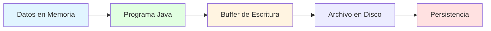
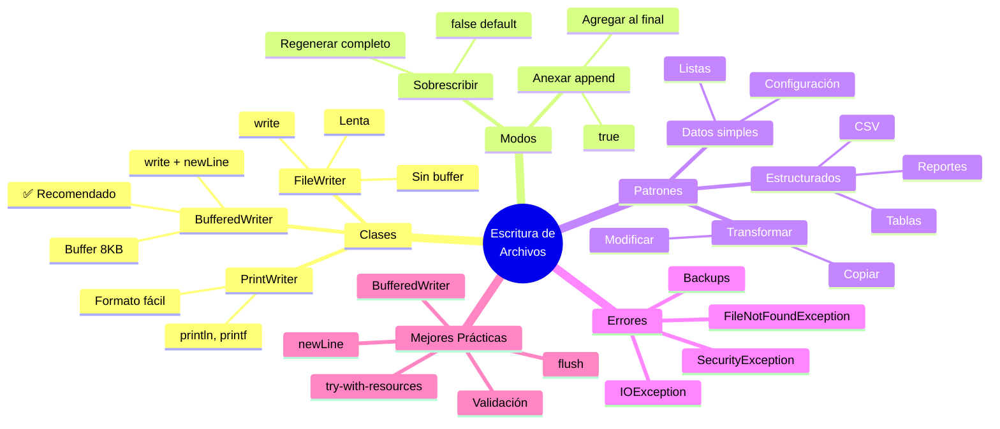
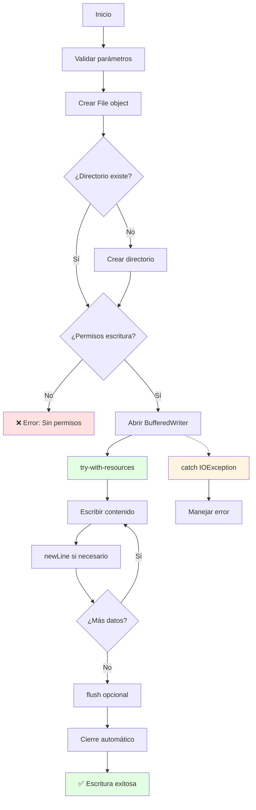

# ✍️ Escritura de Archivos de Texto en Java

## 🎯 Introducción

> [!info]- 💡 ¿Qué es la Escritura de Archivos?
> 
> La **escritura de archivos** es el proceso mediante el cual un programa Java guarda información en el sistema de archivos, permitiendo que los datos persistan más allá de la ejecución del programa.
> 
> **Analogía práctica:** Imagina que eres un escritor creando un documento:
> 
> - **Crear** un nuevo documento en blanco
> - **Escribir** contenido línea por línea
> - **Decidir** si borrar lo anterior o agregar al final
> - **Guardar** y cerrar el documento cuando termines
> 
> **¿Por qué es importante escribir archivos?**
> 
> |Escenario|Descripción|Ejemplo Real|
> |---|---|---|
> |**Guardar progreso**|Persistir estado del programa|Guardado de videojuego|
> |**Exportar datos**|Generar reportes|Archivos CSV, PDF|
> |**Registro de eventos**|Mantener logs|Historial de errores|
> |**Configuración**|Almacenar preferencias|Settings de aplicación|
> |**Compartir información**|Intercambio de datos|Exportar a Excel|



---

## 📚 Fundamentos de Escritura

### 🔍 Modos de Escritura

> [!example]- 📄 Sobrescribir vs Anexar
> 
> Java ofrece dos modos principales de escritura que determinan qué sucede con el contenido existente:
> 
> ```mermaid
> graph TD
>     A[Archivo: datos.txt<br/>Contenido: ABC] --> B{Modo de Escritura}
>     B -->|Sobrescribir| C[Borrar ABC<br/>Escribir XYZ]
>     B -->|Anexar append| D[Mantener ABC<br/>Agregar XYZ]
>     C --> E[Resultado: XYZ]
>     D --> F[Resultado: ABCXYZ]
>     
>     style C fill:#ffe1e1
>     style D fill:#e1ffe1
>     style E fill:#fff4e1
>     style F fill:#e1f5ff
> ```
> 
> **Comparación de modos:**
> 
> |Modo|Constructor|Comportamiento|Uso Típico|
> |---|---|---|---|
> |**Sobrescribir**|`new FileWriter("archivo.txt")`|❌ Borra contenido anterior|Regenerar archivo completo|
> |**Anexar (append)**|`new FileWriter("archivo.txt", true)`|✅ Mantiene contenido anterior|Logs, historial, acumulación|
> 
> **Visualización del comportamiento:**
> 
> ```
> Estado inicial del archivo:
> ┌─────────────────┐
> │ Línea 1         │
> │ Línea 2         │
> │ Línea 3         │
> └─────────────────┘
> 
> Modo SOBRESCRIBIR (false o sin parámetro):
> ┌─────────────────┐
> │                 │  ← Contenido anterior eliminado
> │                 │
> │                 │
> └─────────────────┘
> ↓
> ┌─────────────────┐
> │ Nueva línea A   │  ← Nuevo contenido
> │ Nueva línea B   │
> └─────────────────┘
> 
> Modo ANEXAR (true):
> ┌─────────────────┐
> │ Línea 1         │  ← Contenido original preservado
> │ Línea 2         │
> │ Línea 3         │
> │ Nueva línea A   │  ← Nuevo contenido agregado
> │ Nueva línea B   │
> └─────────────────┘
> ```
> 
> **Ejemplo comparativo:**
> 
> ```java
> // MODO 1: Sobrescribir (por defecto)
> try (FileWriter fw = new FileWriter("datos.txt")) {
>     fw.write("Este texto reemplaza TODO el contenido anterior");
> } catch (IOException e) {
>     e.printStackTrace();
> }
> 
> // MODO 2: Anexar (append = true)
> try (FileWriter fw = new FileWriter("datos.txt", true)) {
>     fw.write("\nEsta línea se AGREGA al final");
> } catch (IOException e) {
>     e.printStackTrace();
> }
> ```

### 🎭 Niveles de Escritura

> [!note]- 📊 Granularidad de Escritura
> 
> Similar a la lectura, puedes escribir a diferentes niveles:
> 
> ```mermaid
> graph LR
>     A[String Completo] --> B[Por Líneas]
>     B --> C[Por Palabras]
>     C --> D[Por Caracteres]
>     
>     A -.-> E[Más simple<br/>menos control]
>     D -.-> F[Más control<br/>más complejo]
>     
>     style B fill:#e1ffe1
>     style C fill:#fff4e1
>     style D fill:#ffe1e1
> ```
> 
> **Comparación de enfoques:**
> 
> |Nivel|Método|Cuándo usar|Ejemplo|
> |---|---|---|---|
> |**String completo**|`write(String)`|Texto pequeño en una sola operación|"Hola Mundo"|
> |**Por líneas**|`write() + newLine()`|✅ Uso general|Archivo de texto|
> |**Por caracteres**|`write(char)`|Control fino, casos especiales|Generación dinámica|
> |**Formateado**|`printf()` con PrintWriter|Salida con formato|Reportes, tablas|

---

## 🛠️ Clases para Escritura

### 📝 FileWriter: Escritura Básica

> [!tip]- 🔤 Escribir Directo a Disco
> 
> **FileWriter** es la clase más simple para escribir texto, pero opera sin buffer (lenta para grandes volúmenes).
> 
> ```java
> import java.io.FileWriter;
> import java.io.IOException;
> 
> public class EscrituraBasica {
>     public static void main(String[] args) {
>         // ✅ try-with-resources garantiza cierre automático
>         try (FileWriter fw = new FileWriter("salida.txt")) {
>             
>             fw.write("Primera línea\n");
>             fw.write("Segunda línea\n");
>             fw.write("Tercera línea\n");
>             
>             System.out.println("✅ Archivo escrito correctamente");
>             
>         } catch (IOException e) {
>             System.out.println("❌ Error: " + e.getMessage());
>         }
>     }
> }
> ```
> 
> **Métodos principales de FileWriter:**
> 
> |Método|Parámetro|Descripción|
> |---|---|---|
> |`write(String)`|String|Escribe texto completo|
> |`write(char)`|char|Escribe un carácter|
> |`write(char[])`|char[]|Escribe array de caracteres|
> |`write(String, int, int)`|String, offset, len|Escribe porción de String|
> |`flush()`|void|Fuerza escritura inmediata|
> |`close()`|void|Cierra el flujo|
> 
> **Ejemplo con diferentes métodos:**
> 
> ```java
> public void demostrarMetodos() {
>     try (FileWriter fw = new FileWriter("ejemplo.txt")) {
>         
>         // 1. Escribir String completo
>         fw.write("Línea completa\n");
>         
>         // 2. Escribir carácter individual
>         fw.write('A');
>         fw.write('\n');
>         
>         // 3. Escribir array de caracteres
>         char[] letras = {'H', 'o', 'l', 'a', '\n'};
>         fw.write(letras);
>         
>         // 4. Escribir porción de String
>         String texto = "0123456789";
>         fw.write(texto, 3, 4); // Escribe "3456"
>         fw.write('\n');
>         
>         // 5. Forzar escritura (no esperar al buffer/cierre)
>         fw.write("Dato crítico");
>         fw.flush(); // Garantiza que se escriba YA
>         
>     } catch (IOException e) {
>         System.out.println("❌ Error: " + e.getMessage());
>     }
> }
> ```
> 
> **Características de FileWriter:**
> 
> |Aspecto|Detalle|
> |---|---|
> |**Buffer interno**|❌ No tiene|
> |**Velocidad**|🐌 Lenta (acceso directo a disco)|
> |**Manejo de líneas**|Manual (debes agregar \n)|
> |**Uso recomendado**|Solo archivos muy pequeños|
> 
> **⚠️ Problema de rendimiento:**
> 
> ```java
> // ❌ MAL - 10,000 líneas = 10,000 accesos a disco
> try (FileWriter fw = new FileWriter("grande.txt")) {
>     for (int i = 0; i < 10000; i++) {
>         fw.write("Línea " + i + "\n"); // Cada write() va al disco
>     }
> }
> // Muy lento: ~5-10 segundos
> ```
> 
> **Flujo de FileWriter:**
> 
> ```mermaid
> sequenceDiagram
>     participant P as Programa
>     participant FW as FileWriter
>     participant D as Disco
>     
>     P->>FW: write("Hola")
>     FW->>D: Escribir en disco
>     Note over D: Operación I/O lenta
>     
>     P->>FW: write("Mundo")
>     FW->>D: Escribir en disco
>     Note over D: Otra operación I/O
>     
>     P->>FW: close()
>     FW->>D: Cerrar archivo
> ```

### ⚡ BufferedWriter: Escritura Eficiente

> [!success]- 🚀 La Mejor Opción para Escritura de Texto
> 
> **BufferedWriter** es la clase recomendada para escribir archivos de texto. Usa un buffer interno para minimizar accesos a disco.
> 
> **Arquitectura en capas:**
> 
> ```mermaid
> graph TB
>     A[Programa] --> B[BufferedWriter<br/>Buffer 8KB en RAM]
>     B --> C[FileWriter<br/>Interfaz con disco]
>     C --> D[Archivo en Disco]
>     
>     B -.-> E[write + newLine<br/>Escritura por líneas]
>     C -.-> F[write<br/>Escritura directa]
>     
>     style B fill:#e1ffe1
>     style E fill:#ccffcc
> ```
> 
> **Ventajas del buffer:**
> 
> ```
> Sin buffer (FileWriter):
> ├─ write("A") → Disco (0.01ms)
> ├─ write("B") → Disco (0.01ms)
> ├─ write("C") → Disco (0.01ms)
> └─ 1000 escrituras = 10ms 🐌
> 
> Con buffer (BufferedWriter):
> ├─ write("A") → Buffer RAM (0.00001ms)
> ├─ write("B") → Buffer RAM (0.00001ms)
> ├─ write("C") → Buffer RAM (0.00001ms)
> └─ flush → Disco una vez = 0.01ms 🚀
> 
> Resultado: 1000x más rápido
> ```
> 
> **Ejemplo básico:**
> 
> ```java
> import java.io.BufferedWriter;
> import java.io.FileWriter;
> import java.io.IOException;
> 
> public class EscrituraConBuffer {
>     public static void main(String[] args) {
>         // ✅ Patrón recomendado
>         try (BufferedWriter bw = new BufferedWriter(new FileWriter("datos.txt"))) {
>             
>             bw.write("Primera línea");
>             bw.newLine(); // ✅ Salto de línea multiplataforma
>             
>             bw.write("Segunda línea");
>             bw.newLine();
>             
>             bw.write("Tercera línea");
>             bw.newLine();
>             
>             System.out.println("✅ Archivo escrito correctamente");
>             
>         } catch (IOException e) {
>             System.out.println("❌ Error: " + e.getMessage());
>         }
>     }
> }
> ```
> 
> **Métodos importantes:**
> 
> |Método|Descripción|Ventaja|
> |---|---|---|
> |`write(String)`|Escribe texto|Buffer acumula|
> |`newLine()`|Salto de línea del SO|✅ Multiplataforma|
> |`flush()`|Forzar escritura inmediata|Datos críticos|
> |`close()`|Cierra y vacía buffer|Automático con try-with-resources|
> 
> **Comparación FileWriter vs BufferedWriter:**
> 
> |Aspecto|FileWriter|BufferedWriter|
> |---|---|---|
> |**Velocidad**|🐌 Lenta|🚀 Rápida (10-100x)|
> |**Buffer interno**|❌ No|✅ Sí (8KB)|
> |**`newLine()`**|❌ No (usar \n)|✅ Sí (automático)|
> |**Uso de memoria**|Mínimo|8KB por instancia|
> |**Recomendado**|❌ Casi nunca|✅ Siempre|
> 
> **Ejemplo con modo append:**
> 
> ```java
> // Agregar líneas al final de un archivo existente
> try (BufferedWriter bw = new BufferedWriter(
>         new FileWriter("log.txt", true))) { // ← true = append
>     
>     bw.write("[" + java.time.LocalDateTime.now() + "] ");
>     bw.write("Evento registrado");
>     bw.newLine();
>     
> } catch (IOException e) {
>     System.out.println("❌ Error: " + e.getMessage());
> }
> ```
> 
> **Importancia de newLine():**
> 
> ```java
> // ❌ Problema multiplataforma
> bw.write("Línea 1\n"); // Windows usa \r\n, esto solo usa \n
> 
> // ✅ Solución correcta
> bw.write("Línea 1");
> bw.newLine(); // Usa el separador correcto del sistema operativo
> ```
> 
> **Flujo con buffer:**
> 
> ```mermaid
> flowchart LR
>     A[Programa] --> B[write]
>     B --> C{Buffer lleno?}
>     C -->|No| D[Acumular en RAM]
>     D --> B
>     C -->|Sí| E[Vaciar a disco]
>     E --> B
>     F[close/flush] --> E
>     
>     style C fill:#fff4e1
>     style D fill:#e1ffe1
>     style E fill:#e1f5ff
> ```

### 🖨️ PrintWriter: Escritura con Formato

> [!example]- 📊 Salida Formateada
> 
> **PrintWriter** combina la funcionalidad de BufferedWriter con métodos de formateo similares a `System.out.println()`.
> 
> ```java
> import java.io.PrintWriter;
> import java.io.FileWriter;
> import java.io.IOException;
> 
> public class EscrituraFormateada {
>     public static void main(String[] args) {
>         try (PrintWriter pw = new PrintWriter(new FileWriter("reporte.txt"))) {
>             
>             // Métodos familiares de System.out
>             pw.println("=== REPORTE DE VENTAS ===");
>             pw.println();
>             
>             pw.print("Producto: ");
>             pw.println("Laptop");
>             
>             pw.printf("Precio: $%.2f%n", 1299.99);
>             pw.printf("Cantidad: %d%n", 15);
>             pw.printf("Total: $%.2f%n", 1299.99 * 15);
>             
>             System.out.println("✅ Reporte generado");
>             
>         } catch (IOException e) {
>             System.out.println("❌ Error: " + e.getMessage());
>         }
>     }
> }
> ```
> 
> **Métodos principales:**
> 
> |Método|Descripción|Ejemplo|
> |---|---|---|
> |`print(Object)`|Escribe sin salto|`pw.print("Hola");`|
> |`println(Object)`|Escribe con salto|`pw.println("Hola");`|
> |`printf(String, Object...)`|Formato estilo C|`pw.printf("%.2f", 3.14);`|
> |`format(String, Object...)`|Igual que printf|`pw.format("%d", 42);`|
> 
> **Especificadores de formato comunes:**
> 
> |Especificador|Tipo|Ejemplo|Resultado|
> |---|---|---|---|
> |`%d`|Entero|`printf("%d", 42)`|42|
> |`%f`|Decimal|`printf("%f", 3.14)`|3.140000|
> |`%.2f`|Decimal 2 decimales|`printf("%.2f", 3.14159)`|3.14|
> |`%s`|String|`printf("%s", "Hola")`|Hola|
> |`%n`|Nueva línea|`printf("Fin%n")`|Fin\n|
> |`%10s`|String ancho 10|`printf("%10s", "Hi")`|Hi|
> |`%-10s`|String alineado izq|`printf("%-10s", "Hi")`|Hi|
> 
> **Ejemplo de tabla formateada:**
> 
> ```java
> public void generarTabla() {
>     try (PrintWriter pw = new PrintWriter(new FileWriter("tabla.txt"))) {
>         
>         // Encabezado
>         pw.println("┌──────────────┬─────────┬──────────┐");
>         pw.printf("│ %-12s │ %7s │ %8s │%n", "Producto", "Precio", "Stock");
>         pw.println("├──────────────┼─────────┼──────────┤");
>         
>         // Datos
>         String[][] productos = {
>             {"Laptop", "1299.99", "15"},
>             {"Mouse", "29.99", "50"},
>             {"Teclado", "79.99", "30"}
>         };
>         
>         for (String[] p : productos) {
>             pw.printf("│ %-12s │ $%6s │ %8s │%n", 
>                      p[0], p[1], p[2]);
>         }
>         
>         pw.println("└──────────────┴─────────┴──────────┘");
>         
>     } catch (IOException e) {
>         System.out.println("❌ Error: " + e.getMessage());
>     }
> }
> ```
> 
> **Salida generada:**
> 
> ```
> ┌──────────────┬─────────┬──────────┐
> │ Producto     │  Precio │    Stock │
> ├──────────────┼─────────┼──────────┤
> │ Laptop       │ $1299.99│       15 │
> │ Mouse        │  $29.99 │       50 │
> │ Teclado      │  $79.99 │       30 │
> └──────────────┴─────────┴──────────┘
> ```
> 
> **Ventajas de PrintWriter:**
> 
> ```mermaid
> graph LR
>     A[PrintWriter] --> B[println/print]
>     A --> C[printf/format]
>     A --> D[No lanza IOException]
>     A --> E[Buffer automático]
>     
>     B -.-> F[Fácil como System.out]
>     C -.-> G[Formato avanzado]
>     D -.-> H[Uso de checkError]
>     
>     style A fill:#e1ffe1
>     style B fill:#e1f5ff
>     style C fill:#fff4e1
> ```
> 
> **⚠️ Diferencia importante:**
> 
> ```java
> // BufferedWriter: Lanza excepciones
> try (BufferedWriter bw = new BufferedWriter(new FileWriter("archivo.txt"))) {
>     bw.write("Texto"); // Puede lanzar IOException
> } catch (IOException e) {
>     // Manejar error
> }
> 
> // PrintWriter: NO lanza excepciones en print/println
> try (PrintWriter pw = new PrintWriter(new FileWriter("archivo.txt"))) {
>     pw.println("Texto"); // NO lanza IOException
>     
>     // Verificar si hubo error
>     if (pw.checkError()) {
>         System.out.println("❌ Ocurrió un error");
>     }
> } catch (IOException e) {
>     // Solo para el constructor
> }
> ```

---

## 🎯 Patrones de Escritura

### 📋 Patrón 1: Guardar Datos Simples

> [!example]- 💾 Persistir Información Básica
> 
> **Cuándo usar:** Guardar datos simples como configuraciones, preferencias o listas.
> 
> ```java
> import java.io.BufferedWriter;
> import java.io.FileWriter;
> import java.io.IOException;
> import java.util.ArrayList;
> 
> public class GuardarDatos {
>     
>     // Guardar lista de strings
>     public void guardarLista(String archivo, ArrayList<String> items) {
>         try (BufferedWriter bw = new BufferedWriter(new FileWriter(archivo))) {
>             
>             for (String item : items) {
>                 bw.write(item);
>                 bw.newLine();
>             }
>             
>             System.out.println("✅ Guardados " + items.size() + " elementos");
>             
>         } catch (IOException e) {
>             System.out.println("❌ Error al guardar: " + e.getMessage());
>         }
>     }
>     
>     // Guardar configuración clave=valor
>     public void guardarConfiguracion(String archivo) {
>         try (BufferedWriter bw = new BufferedWriter(new FileWriter(archivo))) {
>             
>             bw.write("# Configuración de la aplicación");
>             bw.newLine();
>             bw.newLine();
>             
>             bw.write("puerto=8080");
>             bw.newLine();
>             
>             bw.write("host=localhost");
>             bw.newLine();
>             
>             bw.write("timeout=30");
>             bw.newLine();
>             
>             bw.write("debug=true");
>             bw.newLine();
>             
>             System.out.println("✅ Configuración guardada");
>             
>         } catch (IOException e) {
>             System.out.println("❌ Error: " + e.getMessage());
>         }
>     }
>     
>     // Ejemplo de uso
>     public static void main(String[] args) {
>         GuardarDatos guardador = new GuardarDatos();
>         
>         // Guardar lista de tareas
>         ArrayList<String> tareas = new ArrayList<>();
>         tareas.add("Estudiar Java");
>         tareas.add("Hacer ejercicio");
>         tareas.add("Leer documentación");
>         
>         guardador.guardarLista("tareas.txt", tareas);
>         
>         // Guardar configuración
>         guardador.guardarConfiguracion("config.txt");
>     }
> }
> ```
> 
> **Flujo de guardado:**
> 
> ```mermaid
> flowchart LR
>     A[Colección de Datos] --> B[Iterar elementos]
>     B --> C[Escribir cada elemento]
>     C --> D[Agregar newLine]
>     D --> E{¿Más elementos?}
>     E -->|Sí| B
>     E -->|No| F[Cerrar archivo]
>     F --> G[✅ Datos guardados]
>     
>     style A fill:#e1f5ff
>     style C fill:#e1ffe1
>     style G fill:#ccffcc
> ```

### 🔄 Patrón 2: Sobrescribir vs Anexar

> [!tip]- 🎯 Estrategias de Actualización
> 
> **Cuándo usar cada modo:**
> 
> ```java
> import java.io.BufferedWriter;
> import java.io.FileWriter;
> import java.io.IOException;
> import java.time.LocalDateTime;
> import java.time.format.DateTimeFormatter;
> 
> public class ModosEscritura {
>     
>     // MODO 1: Sobrescribir - Regenerar archivo completo
>     public void guardarEstado(String archivo, String[] datos) {
>         try (BufferedWriter bw = new BufferedWriter(
>                 new FileWriter(archivo))) { // Sin 'true' = sobrescribir
>             
>             bw.write("=== ESTADO ACTUAL ===");
>             bw.newLine();
>             bw.write("Generado: " + LocalDateTime.now());
>             bw.newLine();
>             bw.newLine();
>             
>             for (String dato : datos) {
>                 bw.write(dato);
>                 bw.newLine();
>             }
>             
>             System.out.println("✅ Estado guardado (sobrescrito)");
>             
>         } catch (IOException e) {
>             System.out.println("❌ Error: " + e.getMessage());
>         }
>     }
>     
>     // MODO 2: Anexar - Agregar al final
>     public void registrarEvento(String archivoLog, String evento) {
>         try (BufferedWriter bw = new BufferedWriter(
>                 new FileWriter(archivoLog, true))) { // true = append
>             
>             DateTimeFormatter formatter = 
>                 DateTimeFormatter.ofPattern("yyyy-MM-dd HH:mm:ss");
>             String timestamp = LocalDateTime.now().format(formatter);
>             
>             bw.write("[" + timestamp + "] " + evento);
>             bw.newLine();
>             
>             // flush para garantizar escritura inmediata
>             bw.flush();
>             
>         } catch (IOException e) {
>             System.out.println("❌ Error: " + e.getMessage());
>         }
>     }
>     
>     // Ejemplo combinado
>     public static void main(String[] args) {
>         ModosEscritura escritor = new ModosEscritura();
>         
>         // 1. Guardar estado inicial (sobrescribir)
>         String[] estado = {"Usuario: Juan", "Nivel: 5", "Puntos: 1500"};
>         escritor.guardarEstado("jugador.txt", estado);
>         
>         // 2. Registrar eventos (anexar)
>         escritor.registrarEvento("log.txt", "Aplicación iniciada");
>         escritor.registrarEvento("log.txt", "Usuario autenticado");
>         escritor.registrarEvento("log.txt", "Datos cargados");
>     }
> }
> ```
> 
> **Tabla de decisión:**
> 
> |Escenario|Modo|Razón|
> |---|---|---|
> |**Archivo de configuración**|Sobrescribir|Se regenera completo|
> |**Guardado de juego**|Sobrescribir|Estado completo nuevo|
> |**Archivo de log**|Anexar|Historial acumulativo|
> |**Registro de transacciones**|Anexar|No perder historia|
> |**Reporte diario**|Sobrescribir|Datos del día actual|
> |**Exportar datos**|Sobrescribir|Snapshot actual|
> 
> **Visualización:**
> 
> ```mermaid
> graph TD
>     A[¿Qué necesitas?] --> B{Tipo de operación}
>     B -->|Reemplazar todo| C[Sobrescribir]
>     B -->|Acumular| D[Anexar append]
>     
>     C --> E[Config, guardado, reporte]
>     D --> F[Logs, historial, auditoría]
>     
>     style C fill:#ffe1e1
>     style D fill:#e1ffe1
> ```

### 📊 Patrón 3: Generar Archivos Estructurados

> [!success]- 🗂️ CSV, Tablas y Formatos
> 
> **Cuándo usar:** Exportar datos en formato legible por otras aplicaciones.
> 
> ```java
> import java.io.BufferedWriter;
> import java.io.FileWriter;
> import java.io.IOException;
> import java.io.PrintWriter;
> import java.util.ArrayList;
> 
> public class GenerarEstructurados {
>     
>     // Clase para datos de ejemplo
>     static class Estudiante {
>         String nombre;
>         int edad;
>         double promedio;
> 	    Estudiante(String nombre, int edad, double promedio) {
>         this.nombre = nombre;
>         this.edad = edad;
>         this.promedio = promedio;
>     }
> }
> 
> // Generar archivo CSV
> public void generarCSV(String archivo, ArrayList<Estudiante> estudiantes) {
>     try (BufferedWriter bw = new BufferedWriter(new FileWriter(archivo))) {
>         
>         // Encabezado
>         bw.write("nombre,edad,promedio");
>         bw.newLine();
>         
>         // Datos
>         for (Estudiante e : estudiantes) {
>             bw.write(e.nombre + "," + e.edad + "," + e.promedio);
>             bw.newLine();
>         }
>         
>         System.out.println("✅ CSV generado: " + estudiantes.size() + " registros");
>         
>     } catch (IOException e) {
>         System.out.println("❌ Error: " + e.getMessage());
>     }
> }
> 
> // Generar tabla formateada
> public void generarTabla(String archivo, ArrayList<Estudiante> estudiantes) {
>     try (PrintWriter pw = new PrintWriter(new FileWriter(archivo))) {
>         
>         // Encabezado
>         pw.println("╔═══════════════════╦═══════╦═══════════╗");
>         pw.printf("║ %-17s ║ %5s ║ %9s ║%n", "NOMBRE", "EDAD", "PROMEDIO");
>         pw.println("╠═══════════════════╬═══════╬═══════════╣");
>         
>         // Datos
>         for (Estudiante e : estudiantes) {
>             pw.printf("║ %-17s ║ %5d ║ %9.2f ║%n", 
>                      e.nombre, e.edad, e.promedio);
>         }
>         
>         pw.println("╚═══════════════════╩═══════╩═══════════╝");
>         
>         // Estadísticas
>         double suma = 0;
>         for (Estudiante e : estudiantes) {
>             suma += e.promedio;
>         }
>         double promedioGeneral = suma / estudiantes.size();
>         
>         pw.println();
>         pw.printf("Promedio general: %.2f%n", promedioGeneral);
>         pw.printf("Total estudiantes: %d%n", estudiantes.size());
>         
>         System.out.println("✅ Tabla generada");
>         
>     } catch (IOException e) {
>         System.out.println("❌ Error: " + e.getMessage());
>     }
> }
> 
> // Generar reporte completo
> public void generarReporte(String archivo, ArrayList<Estudiante> estudiantes) {
>     try (PrintWriter pw = new PrintWriter(new FileWriter(archivo))) {
>         
>         // Título
>         pw.println("═".repeat(60));
>         pw.println("           REPORTE DE ESTUDIANTES");
>         pw.println("═".repeat(60));
>         pw.println();
>         
>         // Fecha
>         pw.println("Fecha de generación: " + 
>                   java.time.LocalDate.now());
>         pw.println();
>         
>         // Datos detallados
>         for (int i = 0; i < estudiantes.size(); i++) {
>             Estudiante e = estudiantes.get(i);
>             pw.println("─".repeat(60));
>             pw.printf("Registro #%d%n", i + 1);
>             pw.println("─".repeat(60));
>             pw.printf("  Nombre:   %s%n", e.nombre);
>             pw.printf("  Edad:     %d años%n", e.edad);
>             pw.printf("  Promedio: %.2f%n", e.promedio);
>             
>             // Categoría
>             String categoria;
>             if (e.promedio >= 9.0) categoria = "Excelente";
>             else if (e.promedio >= 8.0) categoria = "Muy Bueno";
>             else if (e.promedio >= 7.0) categoria = "Bueno";
>             else categoria = "Regular";
>             
>             pw.printf("  Categoría: %s%n", categoria);
>             pw.println();
>         }
>         
>         pw.println("═".repeat(60));
>         System.out.println("✅ Reporte completo generado");
>         
>     } catch (IOException e) {
>         System.out.println("❌ Error: " + e.getMessage());
>     }
> }
> 
> // Ejemplo de uso
> public static void main(String[] args) {
>     GenerarEstructurados generador = new GenerarEstructurados();
>     
>     // Datos de ejemplo
>     ArrayList<Estudiante> estudiantes = new ArrayList<>();
>     estudiantes.add(new Estudiante("Juan Pérez", 20, 8.5));
>     estudiantes.add(new Estudiante("María García", 19, 9.2));
>     estudiantes.add(new Estudiante("Carlos López", 21, 7.8));
>     estudiantes.add(new Estudiante("Ana Martínez", 20, 9.5));
>     
>     // Generar diferentes formatos
>     generador.generarCSV("estudiantes.csv", estudiantes);
>     generador.generarTabla("estudiantes_tabla.txt", estudiantes);
>     generador.generarReporte("reporte_completo.txt", estudiantes);
> }
> 
> 
> }
> 
> ```
> 
> **Ejemplo de salida CSV:**
> ```
> 
> nombre,edad,promedio Juan Pérez,20,8.5 María García,19,9.2 Carlos López,21,7.8 Ana Martínez,20,9.5
> 
> ````
> 
> **Flujo de generación:**
> 
> ```mermaid
> flowchart TD
>     A[Datos en memoria] --> B[Definir formato]
>     B --> C{Tipo de formato}
>     C -->|CSV| D[Separar con comas]
>     C -->|Tabla| E[Formatear columnas]
>     C -->|Reporte| F[Texto estructurado]
>     D --> G[Escribir archivo]
>     E --> G
>     F --> G
>     G --> H[✅ Archivo generado]
>     
>     style C fill:#fff4e1
>     style G fill:#e1ffe1
> ````

### 🔄 Patrón 4: Copiar y Transformar

> [!example]- 🔀 Procesar Mientras se Escribe
> 
> **Cuándo usar:** Leer un archivo, procesarlo y escribir el resultado en otro.
> 
> ```java
> import java.io.*;
> 
> public class CopiarYTransformar {
>     
>     // Copiar archivo con transformación
>     public void convertirAMayusculas(String entrada, String salida) {
>         try (BufferedReader br = new BufferedReader(new FileReader(entrada));
>              BufferedWriter bw = new BufferedWriter(new FileWriter(salida))) {
>             
>             String linea;
>             int lineasProcesadas = 0;
>             
>             while ((linea = br.readLine()) != null) {
>                 bw.write(linea.toUpperCase());
>                 bw.newLine();
>                 lineasProcesadas++;
>             }
>             
>             System.out.println("✅ Procesadas " + lineasProcesadas + " líneas");
>             
>         } catch (IOException e) {
>             System.out.println("❌ Error: " + e.getMessage());
>         }
>     }
>     
>     // Filtrar líneas al copiar
>     public void copiarSoloLargas(String entrada, String salida, int longitudMin) {
>         try (BufferedReader br = new BufferedReader(new FileReader(entrada));
>              BufferedWriter bw = new BufferedWriter(new FileWriter(salida))) {
>             
>             String linea;
>             int incluidas = 0;
>             int descartadas = 0;
>             
>             while ((linea = br.readLine()) != null) {
>                 if (linea.length() >= longitudMin) {
>                     bw.write(linea);
>                     bw.newLine();
>                     incluidas++;
>                 } else {
>                     descartadas++;
>                 }
>             }
>             
>             System.out.println("✅ Incluidas: " + incluidas);
>             System.out.println("⚠️ Descartadas: " + descartadas);
>             
>         } catch (IOException e) {
>             System.out.println("❌ Error: " + e.getMessage());
>         }
>     }
>     
>     // Agregar numeración de líneas
>     public void agregarNumeracion(String entrada, String salida) {
>         try (BufferedReader br = new BufferedReader(new FileReader(entrada));
>              PrintWriter pw = new PrintWriter(new FileWriter(salida))) {
>             
>             String linea;
>             int numeroLinea = 1;
>             
>             while ((linea = br.readLine()) != null) {
>                 pw.printf("%4d | %s%n", numeroLinea, linea);
>                 numeroLinea++;
>             }
>             
>             System.out.println("✅ Numeradas " + (numeroLinea-1) + " líneas");
>             
>         } catch (IOException e) {
>             System.out.println("❌ Error: " + e.getMessage());
>         }
>     }
>     
>     // Reemplazar palabras
>     public void reemplazarTexto(String entrada, String salida, 
>                                 String buscar, String reemplazar) {
>         try (BufferedReader br = new BufferedReader(new FileReader(entrada));
>              BufferedWriter bw = new BufferedWriter(new FileWriter(salida))) {
>             
>             String linea;
>             int reemplazos = 0;
>             
>             while ((linea = br.readLine()) != null) {
>                 int antesDe = linea.length();
>                 String lineaModificada = linea.replace(buscar, reemplazar);
>                 int despuesDe = lineaModificada.length();
>                 
>                 if (antesDe != despuesDe) {
>                     reemplazos++;
>                 }
>                 
>                 bw.write(lineaModificada);
>                 bw.newLine();
>             }
>             
>             System.out.println("✅ Líneas con reemplazos: " + reemplazos);
>             
>         } catch (IOException e) {
>             System.out.println("❌ Error: " + e.getMessage());
>         }
>     }
> }
> ```
> 
> **Pipeline de transformación:**
> 
> ```mermaid
> flowchart LR
>     A[Archivo Entrada] --> B[BufferedReader]
>     B --> C[Leer línea]
>     C --> D[Transformar]
>     D --> E[BufferedWriter]
>     E --> F[Archivo Salida]
>     
>     D -.-> G[Mayúsculas]
>     D -.-> H[Filtrar]
>     D -.-> I[Numerar]
>     D -.-> J[Reemplazar]
>     
>     style D fill:#fff4e1
>     style E fill:#e1ffe1
> ```

---

## 🛡️ Manejo de Errores en Escritura

### ⚠️ Excepciones Comunes

> [!warning]- 🚨 Problemas Frecuentes y Soluciones
> 
> **Tabla de excepciones:**
> 
> |Excepción|Causa|Prevención|Manejo|
> |---|---|---|---|
> |**IOException**|Error general de escritura|Verificar permisos|Reintentar o informar|
> |**FileNotFoundException**|Ruta de directorio no existe|Crear directorios|`mkdirs()` antes|
> |**SecurityException**|Sin permisos de escritura|Verificar con `canWrite()`|Solicitar permisos|
> |**DiskFullException**|Disco lleno|Verificar espacio disponible|Liberar espacio|
> |**ReadOnlyFileException**|Archivo de solo lectura|Verificar atributos|Cambiar permisos|
> 
> **Ejemplo de manejo robusto:**
> 
> ```java
> import java.io.*;
> 
> public class EscrituraRobusta {
>     
>     public boolean escribirConValidacion(String nombreArchivo, String contenido) {
>         // 1. Validación de parámetros
>         if (nombreArchivo == null || nombreArchivo.trim().isEmpty()) {
>             System.out.println("❌ Nombre de archivo inválido");
>             return false;
>         }
>         
>         if (contenido == null) {
>             System.out.println("⚠️ Contenido nulo, guardando vacío");
>             contenido = "";
>         }
>         
>         File archivo = new File(nombreArchivo);
>         File directorio = archivo.getParentFile();
>         
>         // 2. Crear directorio si no existe
>         if (directorio != null && !directorio.exists()) {
>             System.out.println("📁 Creando directorio: " + directorio.getPath());
>             if (!directorio.mkdirs()) {
>                 System.out.println("❌ No se pudo crear el directorio");
>                 return false;
>             }
>         }
>         
>         // 3. Verificar si el archivo existe y es escribible
>         if (archivo.exists()) {
>             if (!archivo.canWrite()) {
>                 System.out.println("❌ Archivo sin permisos de escritura");
>                 return false;
>             }
>             
>             if (archivo.isDirectory()) {
>                 System.out.println("❌ La ruta es un directorio, no un archivo");
>                 return false;
>             }
>         }
>         
>         // 4. Verificar espacio disponible
>         long espacioRequerido = contenido.length() * 2; // Estimación
>         long espacioDisponible = archivo.getFreeSpace();
>         
>         if (espacioDisponible < espacioRequerido) {
>             System.out.println("❌ Espacio insuficiente en disco");
>             System.out.printf("   Requerido: ~%d bytes%n", espacioRequerido);
>             System.out.printf("   Disponible: %d bytes%n", espacioDisponible);
>             return false;
>         }
>         
>         // 5. Escritura con manejo de errores
>         try (BufferedWriter bw = new BufferedWriter(new FileWriter(archivo))) {
>             
>             bw.write(contenido);
>             bw.flush(); // Garantizar escritura
>             
>             System.out.println("✅ Archivo escrito correctamente");
>             System.out.println("📍 Ubicación: " + archivo.getAbsolutePath());
>             return true;
>             
>         } catch (IOException e) {
>             System.out.println("❌ Error al escribir: " + e.getMessage());
>             
>             // Intentar determinar causa específica
>             if (e.getMessage().contains("Permission denied")) {
>                 System.out.println("💡 Verifica los permisos del archivo");
>             } else if (e.getMessage().contains("No space left")) {
>                 System.out.println("💡 Libera espacio en el disco");
>             } else if (e.getMessage().contains("Read-only")) {
>                 System.out.println("💡 El archivo o sistema es de solo lectura");
>             }
>             
>             return false;
>         }
>     }
>     
>     // Escritura con backup automático
>     public void escribirConBackup(String archivo, String contenido) {
>         File archivoOriginal = new File(archivo);
>         
>         // Crear backup si el archivo existe
>         if (archivoOriginal.exists()) {
>             File backup = new File(archivo + ".bak");
>             
>             try {
>                 copiarArchivo(archivoOriginal, backup);
>                 System.out.println("💾 Backup creado: " + backup.getName());
>             } catch (IOException e) {
>                 System.out.println("⚠️ No se pudo crear backup: " + e.getMessage());
>             }
>         }
>         
>         // Escribir nuevo contenido
>         try (BufferedWriter bw = new BufferedWriter(new FileWriter(archivoOriginal))) {
>             bw.write(contenido);
>             System.out.println("✅ Archivo actualizado");
>             
>         } catch (IOException e) {
>             System.out.println("❌ Error al escribir: " + e.getMessage());
>             
>             // Si hay backup, intentar restaurar
>             File backup = new File(archivo + ".bak");
>             if (backup.exists()) {
>                 System.out.println("🔄 Intentando restaurar desde backup...");
>                 try {
>                     copiarArchivo(backup, archivoOriginal);
>                     System.out.println("✅ Archivo restaurado desde backup");
>                 } catch (IOException ex) {
>                     System.out.println("❌ No se pudo restaurar: " + ex.getMessage());
>                 }
>             }
>         }
>     }
>     
>     // Método auxiliar para copiar archivos
>     private void copiarArchivo(File origen, File destino) throws IOException {
>         try (BufferedReader br = new BufferedReader(new FileReader(origen));
>              BufferedWriter bw = new BufferedWriter(new FileWriter(destino))) {
>             
>             String linea;
>             while ((linea = br.readLine()) != null) {
>                 bw.write(linea);
>                 bw.newLine();
>             }
>         }
>     }
> }
> ```
> 
> **Flujo de validación:**
> 
> ```mermaid
> flowchart TD
>     A[Inicio] --> B{¿Parámetros válidos?}
>     B -->|No| C[❌ Error parámetros]
>     B -->|Sí| D{¿Directorio existe?}
>     D -->|No| E[Crear directorio]
>     E --> F{¿Creación exitosa?}
>     F -->|No| G[❌ Error creación]
>     D -->|Sí| H{¿Permisos escritura?}
>     F -->|Sí| H
>     H -->|No| I[❌ Sin permisos]
>     H -->|Sí| J{¿Espacio suficiente?}
>     J -->|No| K[❌ Disco lleno]
>     J -->|Sí| L[Escribir archivo]
>     L --> M{¿Éxito?}
>     M -->|Sí| N[✅ Completado]
>     M -->|No| O[❌ Error I/O]
>     
>     style C fill:#ffe1e1
>     style G fill:#ffe1e1
>     style I fill:#ffe1e1
>     style K fill:#ffe1e1
>     style N fill:#e1ffe1
>     style O fill:#ffe1e1
> ```

---

## 🎓 Mejores Prácticas

### ✅ Principios Fundamentales

> [!success]- 🏆 Código Profesional de Escritura
> 
> **1. Siempre usar try-with-resources**
> 
> ```java
> // ❌ MAL - Cierre manual (propenso a fugas)
> BufferedWriter bw = new BufferedWriter(new FileWriter("archivo.txt"));
> bw.write("Contenido");
> bw.close(); // Si hay excepción antes, nunca se cierra
> 
> // ✅ BIEN - Cierre automático garantizado
> try (BufferedWriter bw = new BufferedWriter(new FileWriter("archivo.txt"))) {
>     bw.write("Contenido");
> } // Se cierra automáticamente incluso si hay excepción
> ```
> 
> **2. Usar BufferedWriter para mejor rendimiento**
> 
> ```java
> // ❌ MALO - Lento para múltiples escrituras
> try (FileWriter fw = new FileWriter("datos.txt")) {
>     for (int i = 0; i < 10000; i++) {
>         fw.write("Línea " + i + "\n");
>     }
> } // ~10 segundos
> 
> // ✅ BUENO - Rápido con buffer
> try (BufferedWriter bw = new BufferedWriter(new FileWriter("datos.txt"))) {
>     for (int i = 0; i < 10000; i++) {
>         bw.write("Línea " + i);
>         bw.newLine();
>     }
> } // ~0.1 segundos
> ```
> 
> **3. Usar newLine() en lugar de \n**
> 
> ```java
> // ⚠️ CUIDADO - No portable (solo funciona en Unix/Linux)
> bw.write("Línea 1\n");
> bw.write("Línea 2\n");
> 
> // ✅ MEJOR - Multiplataforma
> bw.write("Línea 1");
> bw.newLine(); // \n en Unix, \r\n en Windows
> bw.write("Línea 2");
> bw.newLine();
> ```
> 
> **4. Usar flush() para datos críticos**
> 
> ```java
> try (BufferedWriter bw = new BufferedWriter(new FileWriter("log.txt", true))) {
>     bw.write("[CRÍTICO] Operación importante completada");
>     bw.newLine();
>     bw.flush(); // Garantiza que se escriba AHORA, no cuando se llene el buffer
> }
> ```
> 
> **5. Validar antes de escribir**
> 
> ```java
> public void escribirSeguro(String archivo, String contenido) {
>     // Validaciones
>     if (archivo == null || archivo.trim().isEmpty()) {
>         throw new IllegalArgumentException("Nombre de archivo inválido");
>     }
>     
>     if (contenido == null) {
>         contenido = ""; // Valor por defecto
>     }
>     
>     File file = new File(archivo);
>     File dir = file.getParentFile();
>     
>     // Crear directorio si no existe
>     if (dir != null && !dir.exists()) {
>         dir.mkdirs();
>     }
>     
>     // Ahora sí, escribir
>     try (BufferedWriter bw = new BufferedWriter(new FileWriter(file))) {
>         bw.write(contenido);
>     } catch (IOException e) {
>         // Manejo específico
>     }
> }
> ```
> 
> **6. Manejar errores específicamente**
> 
> ```java
> // ❌ MAL - Muy genérico
> try {
>     // escribir archivo
> } catch (Exception e) {
>     System.out.println("Error");
> }
> 
> // ✅ BIEN - Específico y útil
> try {
>     // escribir archivo
> } catch (FileNotFoundException e) {
>     System.out.println("❌ Directorio no existe");
>     System.out.println("💡 Crea el directorio o verifica la ruta");
> } catch (IOException e) {
>     System.out.println("❌ Error de escritura: " + e.getMessage());
>     System.out.println("💡 Verifica permisos y espacio en disco");
> }
> ```
> 
> **7. Considerar backups para datos importantes**
> 
> ```java
> public void escribirConSeguridad(String archivo, String contenido) {
>     File original = new File(archivo);
>     File temporal = new File(archivo + ".tmp");
>     File backup = new File(archivo + ".bak");
>     
>     try {
>         // 1. Escribir a archivo temporal
>         try (BufferedWriter bw = new BufferedWriter(new FileWriter(temporal))) {
>             bw.write(contenido);
>         }
>         
>         // 2. Si existe original, renombrarlo a backup
>         if (original.exists()) {
>             if (backup.exists()) backup.delete();
>             original.renameTo(backup);
>         }
>         
>         // 3. Renombrar temporal a original
>         temporal.renameTo(original);
>         
>         System.out.println("✅ Guardado con seguridad");
>         
>     } catch (IOException e) {
>         System.out.println("❌ Error: " + e.getMessage());
>         // El original nunca se tocó si falló
>     }
> }
> ```
> 
> **Checklist de escritura:**
> 
> ```mermaid
> graph TD
>     A[📋 Checklist Escritura] --> B[✓ try-with-resources]
>     A --> C[✓ BufferedWriter para rendimiento]
>     A --> D[✓ newLine para portabilidad]
>     A --> E[✓ flush para datos críticos]
>     A --> F[✓ Validar antes de escribir]
>     A --> G[✓ Manejo específico de errores]
>     A --> H[✓ Considerar backups]
>     
>     style A fill:#e1f5ff
>     style B fill:#e1ffe1
>     style C fill:#e1ffe1
>     style D fill:#e1ffe1
>     style E fill:#e1ffe1
>     style F fill:#e1ffe1
>     style G fill:#e1ffe1
>     style H fill:#e1ffe1
> ```

---

## 📊 Resumen Visual

### Mapa Mental Completo



### Tabla Comparativa Final

> [!success]- 📋 Resumen de Métodos de Escritura
> 
> |Clase|Velocidad|Facilidad|Características|Uso Recomendado|
> |---|---|---|---|---|
> |**FileWriter**|🐌|⭐⭐|Sin buffer, básica|Archivos minúsculos|
> |**BufferedWriter**|🚀|⭐⭐⭐|Buffer, newLine()|✅ Uso general|
> |**PrintWriter**|🚀|⭐⭐⭐⭐|println, printf|Reportes formateados|

### Flujo Completo de Escritura



---

## 🎓 Ejercicios Prácticos

> [!example]- 💪 Práctica Guiada
> 
> **Ejercicio 1: Sistema de Logs**
> 
> ```java
> // Crear un sistema de logging que registre eventos con timestamp
> public class SistemaLog {
>     public void registrar(String nivel, String mensaje) {
>         // COMPLETAR:
>         // - Abrir log.txt en modo append
>         // - Agregar: [timestamp] [NIVEL] mensaje
>         // - Usar flush para garantizar escritura inmediata
>     }
> }
> ```
> 
> **Ejercicio 2: Exportador CSV**
> 
> ```java
> // Exportar una lista de objetos a formato CSV
> public void exportarACSV(ArrayList<Producto> productos, String archivo) {
>     // COMPLETAR:
>     // - Escribir encabezado: id,nombre,precio,stock
>     // - Escribir cada producto como línea CSV
>     // - Manejar nombres con comas correctamente
> }
> ```
> 
> **Ejercicio 3: Generador de Reportes**
> 
> ```java
> // Generar reporte formateado con estadísticas
> public void generarReporteVentas(ArrayList<Venta> ventas, String archivo) {
>     // COMPLETAR:
>     // - Título y fecha
>     // - Tabla con ventas
> 	// - Totales y promedios
> 	// - Usar PrintWriter con printf
> 
> 
> }
> 
> ````
> 
> **Ejercicio 4: Backup Automático**
> ```java
> // Guardar configuración con backup automático
> public void guardarConfiguracion(Map<String, String> config, String archivo) {
>     // COMPLETAR:
>     // - Crear backup del archivo actual si existe
>     // - Escribir nueva configuración
>     // - Si falla, restaurar desde backup
> }
> ````

---

## 🔗 Próximos Pasos

> [!quote]- 🌟 Continuando el Aprendizaje
> 
> **Has dominado:**
> 
> - ✅ Escritura básica con FileWriter
> - ✅ Escritura eficiente con BufferedWriter
> - ✅ Formateo con PrintWriter
> - ✅ Modos sobrescribir vs anexar
> - ✅ Patrones de escritura comunes
> - ✅ Manejo robusto de errores
> - ✅ Mejores prácticas
> 
> **Siguiente tema: 06 - Proyecto Integrador**
> 
> - Combinar lectura y escritura
> - Sistema completo de gestión de archivos
> - Menú interactivo
> - Persistencia de datos
> 
> **Progresión natural:**
> 
> ```
> 04 - Lectura ✅
>   ↓
> 05 - Escritura ← ESTÁS AQUÍ
>   ↓
> 06 - Proyecto Integrador
>   ↓
> 07 - Serialización de objetos
> ```
> 
> **Recordatorio importante:**
> 
> ```java
> // Patrón completo de lectura + escritura
> try (BufferedReader br = new BufferedReader(new FileReader("entrada.txt"));
>      BufferedWriter bw = new BufferedWriter(new FileWriter("salida.txt"))) {
>     
>     String linea;
>     while ((linea = br.readLine()) != null) {
>         // Procesar
>         String resultado = procesar(linea);
>         // Escribir
>         bw.write(resultado);
>         bw.newLine();
>     }
> } catch (IOException e) {
>     System.out.println("Error: " + e.getMessage());
> }
> ```

---

**Tags:** #java #escritura #archivos #bufferedwriter #filewriter #printwriter #io #patrones #best-practices #csv #logs
