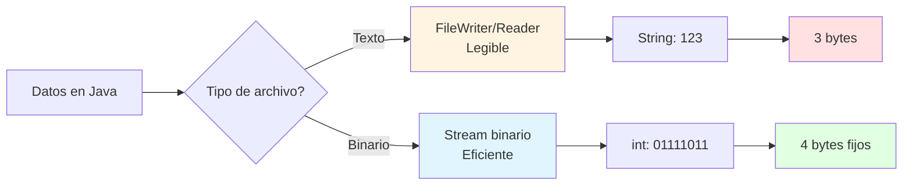
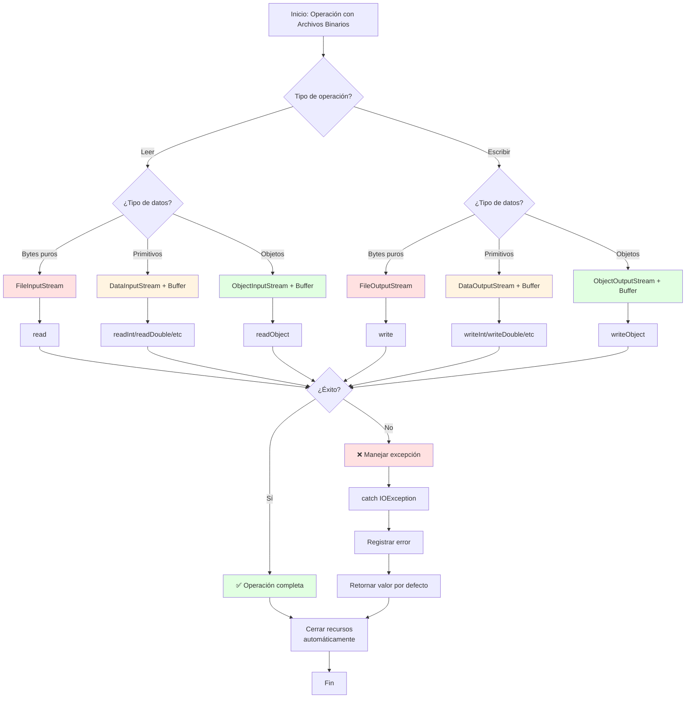

# 🔢 Lectura y Escritura de Archivos Binarios en Java

## 🎯 Introducción

> [!info]- 💡 ¿Qué son los Archivos Binarios?
> 
> Los **archivos binarios** almacenan datos en su forma binaria pura (0s y 1s), a diferencia de los archivos de texto que almacenan caracteres legibles. Esta característica los hace ideales para almacenar datos estructurados, objetos complejos, o información que no necesita ser legible por humanos.
> 
> **Analogía práctica:** Imagina dos formas de guardar una receta:
> 
> - **Archivo de texto:** Escribir la receta en un papel (legible, pero ocupa más espacio)
> - **Archivo binario:** Codificar la receta en un código compacto (no legible directamente, pero más eficiente)
> 
> **¿Por qué usar archivos binarios?**
> 
> |Aspecto|Descripción|Ejemplo de Uso|
> |---|---|---|
> |**Eficiencia**|Menor tamaño, lectura/escritura más rápida|Imágenes, videos, audio|
> |**Precisión**|Preserva tipos de datos exactos|Números decimales, fechas|
> |**Estructura**|Almacena objetos completos|Serialización de objetos|
> |**Seguridad**|No legible a simple vista|Archivos de configuración sensibles|
> |**Integridad**|Preserva datos sin conversiones|Datos científicos, financieros|



---

## 📊 Comparación: Archivos de Texto vs Binarios

> [!example]- 🔍 Diferencias Fundamentales
> 
> ### Comparación Visual
> 
> ```mermaid
> graph TD
>     subgraph "Archivo de Texto"
>     A1[int numero = 12345] --> B1[Conversión a String]
>     B1 --> C1["'1' '2' '3' '4' '5'"]
>     C1 --> D1[5 bytes]
>     end
>     
>     subgraph "Archivo Binario"
>     A2[int numero = 12345] --> B2[Representación binaria]
>     B2 --> C2[00110000 00111001]
>     C2 --> D2[4 bytes]
>     end
>     
>     style D1 fill:#ffe1e1
>     style D2 fill:#e1ffe1
> ```
> 
> ### Tabla Comparativa Detallada
> 
> |Característica|Archivos de Texto|Archivos Binarios|
> |---|---|---|
> |**Legibilidad**|✅ Legible en editor de texto|❌ No legible (bytes puros)|
> |**Tamaño**|🔴 Mayor (conversiones a texto)|🟢 Menor (datos compactos)|
> |**Velocidad**|🟡 Media (conversiones)|🟢 Rápida (sin conversiones)|
> |**Precisión**|⚠️ Puede perder precisión|✅ Precisión exacta|
> |**Portabilidad**|✅ Alta (cualquier SO)|⚠️ Depende del formato|
> |**Edición manual**|✅ Fácil con editor|❌ Requiere herramientas|
> |**Tipos de datos**|Solo texto|Todos los tipos primitivos|
> |**Uso típico**|Logs, CSV, configuración|Imágenes, objetos, datos científicos|
> 
> ### Ejemplo Práctico
> 
> ```java
> // Guardar el número 123456789 en ambos formatos
> 
> // ARCHIVO DE TEXTO (9 bytes - un byte por carácter)
> FileWriter fw = new FileWriter("numero.txt");
> fw.write("123456789");  // "1" "2" "3" "4" "5" "6" "7" "8" "9"
> fw.close();
> 
> // ARCHIVO BINARIO (4 bytes - tamaño fijo de int)
> DataOutputStream dos = new DataOutputStream(new FileOutputStream("numero.bin"));
> dos.writeInt(123456789);  // 4 bytes en formato binario
> dos.close();
> 
> // Resultado: archivo binario es 55% más pequeño
> ```
> 
> ### Visualización de Almacenamiento
> 
> ```mermaid
> graph LR
>     A[Valor: 42.5] --> B{Formato?}
>     
>     B -->|Texto| C["'4' '2' '.' '5'<br/>4 caracteres"]
>     B -->|Binario| D[01000010001010000000000000000000<br/>8 bytes double]
>     
>     C --> E[Ventaja: Legible]
>     D --> F[Ventaja: Preciso]
>     
>     style C fill:#fff4e1
>     style D fill:#e1f5ff
> ```

---

## 🔄 Streams Binarios en Java

### 📥 Jerarquía de Clases

> [!note]- 🌳 Organización de Streams Binarios
> 
> ```mermaid
> classDiagram
>     InputStream <|-- FileInputStream
>     InputStream <|-- FilterInputStream
>     FilterInputStream <|-- DataInputStream
>     FilterInputStream <|-- BufferedInputStream
>     
>     OutputStream <|-- FileOutputStream
>     OutputStream <|-- FilterOutputStream
>     FilterOutputStream <|-- DataOutputStream
>     FilterOutputStream <|-- BufferedOutputStream
>     
>     class InputStream{
>         +read() int
>         +read(byte[]) int
>         +close()
>     }
>     
>     class OutputStream{
>         +write(int)
>         +write(byte[])
>         +flush()
>         +close()
>     }
>     
>     class DataInputStream{
>         +readInt() int
>         +readDouble() double
>         +readUTF() String
>         +readBoolean() boolean
>     }
>     
>     class DataOutputStream{
>         +writeInt(int)
>         +writeDouble(double)
>         +writeUTF(String)
>         +writeBoolean(boolean)
>     }
> ```
> 
> ### Categorías de Streams
> 
> |Categoría|Propósito|Clases Principales|Nivel|
> |---|---|---|---|
> |**Node Streams**|Conexión con fuente de datos|FileInputStream/FileOutputStream|Bajo|
> |**Filter Streams**|Procesamiento adicional|BufferedInputStream/BufferedOutputStream|Medio|
> |**Data Streams**|Lectura/escritura de primitivos|DataInputStream/DataOutputStream|Alto|
> |**Object Streams**|Serialización de objetos|ObjectInputStream/ObjectOutputStream|Alto|
> 
> ### Flujo de Trabajo
> 
> ```mermaid
> flowchart LR
>     A[Archivo en disco] --> B[FileInputStream<br/>Bytes básicos]
>     B --> C[BufferedInputStream<br/>Buffer optimización]
>     C --> D[DataInputStream<br/>Tipos primitivos]
>     D --> E[Datos en programa]
>     
>     style B fill:#ffe1e1
>     style C fill:#fff4e1
>     style D fill:#e1ffe1
>     style E fill:#e1f5ff
> ```

---

## 🔧 FileInputStream y FileOutputStream

### 📖 Operaciones Básicas de Lectura

> [!example]- 📥 FileInputStream - Lectura de Bytes
> 
> **Conceptos fundamentales:**
> 
> - Lee datos byte por byte (valores 0-255)
> - Retorna `-1` cuando termina el archivo
> - Opera a nivel más bajo (sin interpretación de tipos)
> 
> ### Método 1: Lectura Byte por Byte
> 
> ```java
> // Leer archivo binario byte por byte
> try (FileInputStream fis = new FileInputStream("datos.bin")) {
>     int byteDato;
>     int contador = 0;
>     
>     // Leer hasta el final del archivo
>     while ((byteDato = fis.read()) != -1) {
>         System.out.println("Byte " + contador + ": " + byteDato);
>         contador++;
>     }
>     
>     System.out.println("✅ Total bytes leídos: " + contador);
>     
> } catch (FileNotFoundException e) {
>     System.out.println("❌ Archivo no encontrado");
> } catch (IOException e) {
>     System.out.println("❌ Error de lectura: " + e.getMessage());
> }
> ```
> 
> ### Método 2: Lectura con Buffer (Más Eficiente)
> 
> ```java
> try (FileInputStream fis = new FileInputStream("imagen.jpg")) {
>     byte[] buffer = new byte[1024];  // Buffer de 1KB
>     int bytesLeidos;
>     int totalBytes = 0;
>     
>     // Leer en bloques de 1024 bytes
>     while ((bytesLeidos = fis.read(buffer)) != -1) {
>         totalBytes += bytesLeidos;
>         // Procesar buffer[0] hasta buffer[bytesLeidos-1]
>         System.out.println("Bloque leído: " + bytesLeidos + " bytes");
>     }
>     
>     System.out.println("✅ Total: " + totalBytes + " bytes");
>     
> } catch (IOException e) {
>     System.out.println("❌ Error: " + e.getMessage());
> }
> ```
> 
> ### Comparación de Métodos
> 
> ```mermaid
> graph TD
>     A[Archivo 10MB] --> B{Método de lectura?}
>     
>     B -->|Byte por byte| C[read<br/>10,485,760 llamadas]
>     B -->|Buffer 1KB| D[read buffer<br/>10,240 llamadas]
>     
>     C --> E[⏱️ MUY LENTO<br/>~30 segundos]
>     D --> F[⚡ RÁPIDO<br/>~0.5 segundos]
>     
>     style C fill:#ffe1e1
>     style D fill:#e1ffe1
>     style E fill:#ffe1e1
>     style F fill:#e1ffe1
> ```
> 
> ### Métodos Importantes
> 
> |Método|Descripción|Retorno|Uso|
> |---|---|---|---|
> |`read()`|Lee un byte|int (0-255 o -1)|Archivos pequeños|
> |`read(byte[])`|Llena array completo|int (bytes leídos)|Tamaño conocido|
> |`read(byte[], offset, length)`|Lee en posición específica|int (bytes leídos)|Control fino|
> |`available()`|Bytes disponibles|int|Verificar antes de leer|
> |`skip(long)`|Saltar bytes|long (bytes saltados)|Navegar en archivo|
> |`close()`|Cerrar stream|void|Liberar recursos|

### ✏️ Operaciones Básicas de Escritura

> [!success]- 📤 FileOutputStream - Escritura de Bytes
> 
> **Modos de apertura:**
> 
> ```java
> // Modo SOBRESCRIBIR (por defecto)
> FileOutputStream fos1 = new FileOutputStream("datos.bin");
> 
> // Modo APPEND (añadir al final)
> FileOutputStream fos2 = new FileOutputStream("datos.bin", true);
> ```
> 
> ### Método 1: Escritura Byte por Byte
> 
> ```java
> try (FileOutputStream fos = new FileOutputStream("salida.bin")) {
>     // Escribir bytes individuales
>     fos.write(65);   // Escribe 'A' (código ASCII)
>     fos.write(66);   // Escribe 'B'
>     fos.write(67);   // Escribe 'C'
>     
>     System.out.println("✅ Bytes escritos");
>     
> } catch (IOException e) {
>     System.out.println("❌ Error: " + e.getMessage());
> }
> ```
> 
> ### Método 2: Escritura de Arrays
> 
> ```java
> try (FileOutputStream fos = new FileOutputStream("datos.bin")) {
>     // Crear array de bytes
>     byte[] datos = {10, 20, 30, 40, 50};
>     
>     // Escribir todo el array de una vez
>     fos.write(datos);
>     
>     // O escribir parte del array
>     fos.write(datos, 1, 3);  // Escribe índices 1, 2, 3
>     
>     System.out.println("✅ Array escrito");
>     
> } catch (IOException e) {
>     System.out.println("❌ Error: " + e.getMessage());
> }
> ```
> 
> ### Método 3: Copiar Archivo Binario
> 
> ```java
> public void copiarArchivoBinario(String origen, String destino) {
>     try (FileInputStream fis = new FileInputStream(origen);
>          FileOutputStream fos = new FileOutputStream(destino)) {
>         
>         byte[] buffer = new byte[4096];  // Buffer de 4KB
>         int bytesLeidos;
>         int totalCopiado = 0;
>         
>         while ((bytesLeidos = fis.read(buffer)) != -1) {
>             fos.write(buffer, 0, bytesLeidos);
>             totalCopiado += bytesLeidos;
>         }
>         
>         System.out.println("✅ Copiados " + totalCopiado + " bytes");
>         
>     } catch (IOException e) {
>         System.out.println("❌ Error al copiar: " + e.getMessage());
>     }
> }
> ```
> 
> ### Flujo de Escritura
> 
> ```mermaid
> flowchart LR
>     A[Datos en Java] --> B[byte o byte[]]
>     B --> C[FileOutputStream]
>     C --> D{Buffer?}
>     D -->|No| E[Escritura directa<br/>Lento]
>     D -->|Sí| F[Escritura buffered<br/>Rápido]
>     E --> G[Archivo en disco]
>     F --> G
>     
>     style E fill:#ffe1e1
>     style F fill:#e1ffe1
> ```
> 
> ### Métodos Importantes
> 
> |Método|Descripción|Parámetro|Uso Común|
> |---|---|---|---|
> |`write(int)`|Escribe un byte|int (0-255)|Bytes individuales|
> |`write(byte[])`|Escribe array completo|byte[]|Bloques de datos|
> |`write(byte[], offset, length)`|Escribe porción|byte[], int, int|Control preciso|
> |`flush()`|Fuerza escritura|-|Asegurar persistencia|
> |`close()`|Cierra stream|-|Liberar recursos|

---

## 🎯 DataInputStream y DataOutputStream

### 💾 Lectura de Tipos Primitivos

> [!tip]- 📊 DataInputStream - Tipos de Datos Estructurados
> 
> **¿Por qué usar DataInputStream?**
> 
> - Lee tipos primitivos directamente (int, double, boolean, etc.)
> - Mantiene formato binario consistente
> - No requiere conversiones manuales
> 
> ### Métodos Disponibles
> 
> |Método|Tipo Java|Bytes|Rango|
> |---|---|---|---|
> |`readBoolean()`|boolean|1|true/false|
> |`readByte()`|byte|1|-128 a 127|
> |`readShort()`|short|2|-32,768 a 32,767|
> |`readInt()`|int|4|±2.1 billones|
> |`readLong()`|long|8|±9.2 trillones|
> |`readFloat()`|float|4|Punto flotante|
> |`readDouble()`|double|8|Punto flotante doble|
> |`readChar()`|char|2|Unicode|
> |`readUTF()`|String|Variable|Texto UTF-8|
> 
> ### Ejemplo Básico
> 
> ```java
> try (DataInputStream dis = new DataInputStream(
>          new FileInputStream("datos.bin"))) {
>     
>     // Leer diferentes tipos de datos
>     int edad = dis.readInt();
>     double salario = dis.readDouble();
>     boolean activo = dis.readBoolean();
>     String nombre = dis.readUTF();
>     
>     System.out.println("Edad: " + edad);
>     System.out.println("Salario: " + salario);
>     System.out.println("Activo: " + activo);
>     System.out.println("Nombre: " + nombre);
>     
> } catch (EOFException e) {
>     System.out.println("📄 Fin del archivo");
> } catch (IOException e) {
>     System.out.println("❌ Error: " + e.getMessage());
> }
> ```
> 
> ### Ejemplo: Leer Múltiples Registros
> 
> ```java
> public void leerEstudiantes(String archivo) {
>     try (DataInputStream dis = new DataInputStream(
>              new BufferedInputStream(
>                  new FileInputStream(archivo)))) {
>         
>         // Leer número de registros
>         int totalEstudiantes = dis.readInt();
>         System.out.println("📚 Total estudiantes: " + totalEstudiantes);
>         
>         // Leer cada estudiante
>         for (int i = 0; i < totalEstudiantes; i++) {
>             int id = dis.readInt();
>             String nombre = dis.readUTF();
>             double promedio = dis.readDouble();
>             boolean aprobado = dis.readBoolean();
>             
>             System.out.println("\n👤 Estudiante " + (i + 1));
>             System.out.println("   ID: " + id);
>             System.out.println("   Nombre: " + nombre);
>             System.out.println("   Promedio: " + promedio);
>             System.out.println("   Aprobado: " + (aprobado ? "✅" : "❌"));
>         }
>         
>     } catch (EOFException e) {
>         System.out.println("⚠️ Archivo incompleto");
>     } catch (IOException e) {
>         System.out.println("❌ Error: " + e.getMessage());
>     }
> }
> ```
> 
> ### Estructura de Datos en Archivo
> 
> ```mermaid
> graph TD
>     A[Archivo datos.bin] --> B[int: total registros<br/>4 bytes]
>     B --> C[Registro 1]
>     C --> D[int: id<br/>4 bytes]
>     D --> E[String: nombre<br/>variable]
>     E --> F[double: promedio<br/>8 bytes]
>     F --> G[boolean: aprobado<br/>1 byte]
>     G --> H[Registro 2...]
>     
>     style B fill:#e1f5ff
>     style C fill:#e1ffe1
>     style H fill:#fff4e1
> ```
> 
> ### Manejo de EOFException
> 
> ```java
> // Leer todos los registros hasta el final
> try (DataInputStream dis = new DataInputStream(
>          new FileInputStream("datos.bin"))) {
>     
>     while (true) {
>         try {
>             int numero = dis.readInt();
>             System.out.println("Número: " + numero);
>         } catch (EOFException e) {
>             // Final del archivo alcanzado
>             break;
>         }
>     }
>     
>     System.out.println("✅ Lectura completa");
>     
> } catch (IOException e) {
>     System.out.println("❌ Error: " + e.getMessage());
> }
> ```

### 💿 Escritura de Tipos Primitivos

> [!success]- 📝 DataOutputStream - Persistencia Estructurada
> 
> **Ventajas de DataOutputStream:**
> 
> - Escribe tipos primitivos en formato binario
> - Formato compatible con DataInputStream
> - Compacto y eficiente
> - Independiente de la plataforma
> 
> ### Métodos Disponibles
> 
> |Método|Tipo Java|Ejemplo|
> |---|---|---|
> |`writeBoolean(boolean)`|boolean|`dos.writeBoolean(true)`|
> |`writeByte(int)`|byte|`dos.writeByte(100)`|
> |`writeShort(int)`|short|`dos.writeShort(1000)`|
> |`writeInt(int)`|int|`dos.writeInt(123456)`|
> |`writeLong(long)`|long|`dos.writeLong(999999L)`|
> |`writeFloat(float)`|float|`dos.writeFloat(3.14f)`|
> |`writeDouble(double)`|double|`dos.writeDouble(99.99)`|
> |`writeChar(int)`|char|`dos.writeChar('A')`|
> |`writeUTF(String)`|String|`dos.writeUTF("Hola")`|
> 
> ### Ejemplo Básico
> 
> ```java
> try (DataOutputStream dos = new DataOutputStream(
>          new FileOutputStream("empleado.bin"))) {
>     
>     // Escribir datos de un empleado
>     dos.writeInt(1001);              // ID
>     dos.writeUTF("Juan Pérez");      // Nombre
>     dos.writeDouble(3500.50);        // Salario
>     dos.writeBoolean(true);          // Activo
>     dos.writeInt(5);                 // Años experiencia
>     
>     System.out.println("✅ Empleado guardado");
>     
> } catch (IOException e) {
>     System.out.println("❌ Error: " + e.getMessage());
> }
> ```
> 
> ### Ejemplo: Guardar Múltiples Registros
> 
> ```java
> public void guardarEstudiantes(List<Estudiante> estudiantes, String archivo) {
>     try (DataOutputStream dos = new DataOutputStream(
>              new BufferedOutputStream(
>                  new FileOutputStream(archivo)))) {
>         
>         // Escribir número total de estudiantes
>         dos.writeInt(estudiantes.size());
>         
>         // Escribir cada estudiante
>         for (Estudiante est : estudiantes) {
>             dos.writeInt(est.getId());
>             dos.writeUTF(est.getNombre());
>             dos.writeDouble(est.getPromedio());
>             dos.writeBoolean(est.isAprobado());
>         }
>         
>         System.out.println("✅ " + estudiantes.size() + " estudiantes guardados");
>         
>     } catch (IOException e) {
>         System.out.println("❌ Error: " + e.getMessage());
>     }
> }
> ```
> 
> ### Clase Estudiante de Ejemplo
> 
> ```java
> public class Estudiante {
>     private int id;
>     private String nombre;
>     private double promedio;
>     private boolean aprobado;
>     
>     public Estudiante(int id, String nombre, double promedio) {
>         this.id = id;
>         this.nombre = nombre;
>         this.promedio = promedio;
>         this.aprobado = promedio >= 6.0;
>     }
>     
>     // Método para guardar en archivo binario
>     public void guardar(DataOutputStream dos) throws IOException {
>         dos.writeInt(id);
>         dos.writeUTF(nombre);
>         dos.writeDouble(promedio);
>         dos.writeBoolean(aprobado);
>     }
>     
>     // Método para cargar desde archivo binario
>     public static Estudiante cargar(DataInputStream dis) throws IOException {
>         int id = dis.readInt();
>         String nombre = dis.readUTF();
>         double promedio = dis.readDouble();
>         boolean aprobado = dis.readBoolean();
>         
>         Estudiante est = new Estudiante(id, nombre, promedio);
>         est.aprobado = aprobado;
>         return est;
>     }
>     
>     // Getters
>     public int getId() { return id; }
>     public String getNombre() { return nombre; }
>     public double getPromedio() { return promedio; }
>     public boolean isAprobado() { return aprobado; }
> }
> ```
> 
> ### Flujo Completo de Escritura
> 
> ```mermaid
> flowchart TD
>     A[Objeto Java] --> B[Extraer campos]
>     B --> C[DataOutputStream]
>     C --> D[writeInt<br/>writeUTF<br/>writeDouble]
>     D --> E[BufferedOutputStream<br/>Optimización]
>     E --> F[FileOutputStream<br/>Conexión disco]
>     F --> G[Archivo .bin]
>     
>     style C fill:#e1ffe1
>     style E fill:#fff4e1
>     style G fill:#e1f5ff
> ```
> 
> ### ⚠️ Orden de Lectura/Escritura
> 
> ```java
> // ❌ INCORRECTO - Orden diferente
> // Escritura
> dos.writeInt(100);
> dos.writeUTF("Juan");
> dos.writeDouble(50.5);
> 
> // Lectura
> double d = dis.readDouble();  // ❌ Error! Esperaba int
> int i = dis.readInt();
> String s = dis.readUTF();
> 
> // ✅ CORRECTO - Mismo orden
> // Escritura
> dos.writeInt(100);
> dos.writeUTF("Juan");
> dos.writeDouble(50.5);
> 
> // Lectura
> int i = dis.readInt();       // ✅ Correcto
> String s = dis.readUTF();    // ✅ Correcto
> double d = dis.readDouble(); // ✅ Correcto
> ```

---

## 🔐 Serialización de Objetos

### 📦 Concepto de Serialización

> [!info]- 🎁 ¿Qué es la Serialización?
> 
> La **serialización** es el proceso de convertir un objeto Java completo en una secuencia de bytes que puede almacenarse en un archivo o transmitirse por red. La **deserialización** es el proceso inverso.
> 
> **Analogía práctica:**
> 
> - **Serializar:** Desensamblar un mueble para guardarlo en una caja
> - **Deserializar:** Volver a armar el mueble desde las piezas
> 
> ```mermaid
> graph LR
>     A[Objeto en RAM] -->|Serializar| B[Bytes]
>     B -->|Guardar| C[Archivo .ser]
>     C -->|Cargar| D[Bytes]
>     D -->|Deserializar| E[Objeto en RAM]
>     
>     style A fill:#e1f5ff
>     style B fill:#fff4e1
>     style C fill:#ffe1e1
>     style D fill:#fff4e1
>     style E fill:#e1f5ff
> ```
> 
> ### ¿Cuándo Usar Serialización?
> 
> |Caso de Uso|Ventaja|Ejemplo|
> |---|---|---|
> |**Guardar estado**|Persistencia completa|Guardar partida de juego|
> |**Objetos complejos**|Automático|Objetos con muchos campos|
> |**Comunicación red**|Transferir objetos|RMI, sockets|
> |**Caché**|Almacenamiento temporal|Sesiones de usuario|
> |**Clonación profunda**|Copias independientes|Backup de objetos|
> 
> ### Requisitos para Serialización
> 
> ```java
> import java.io.Serializable;
> 
> // ✅ Clase serializable
> public class Persona implements Serializable {
>     // serialVersionUID - Identificador de versión
>     private static final long serialVersionUID = 1L;
>     
>     private String nombre;
>     private int edad;
>     private double salario;
>     
>     // Constructor, getters, setters...
> }
> ```
> 
> ### ¿Qué se Serializa?
> 
> ```mermaid
> graph TD
>     A[Objeto Persona] --> B{Campo}
>     
>     B -->|Primitivo| C[✅ Se serializa<br/>int, double, boolean]
>     B -->|String| D[✅ Se serializa<br/>String]
>     B -->|Serializable| E[✅ Se serializa<br/>Objeto implementa Serializable]
>     B -->|static| F[❌ NO se serializa<br/>Variable de clase]
>     B -->|transient| G[❌ NO se serializa<br/>Marcado explícitamente]
>     B -->|No Serializable| H[❌ Error<br/>NotSerializableException]
>     
>     style C fill:#e1ffe1
>     style D fill:#e1ffe1
>     style E fill:#e1ffe1
> 	style F fill:#ffe1e1
> 	style G fill:#ffe1e1
> 	style H fill:#ffe1e1
> ```

### ✍️ ObjectOutputStream

> [!example]- 💾 Serializar Objetos a Archivos
> 
> ### Sintaxis Básica
> 
> ```java
> try (ObjectOutputStream oos = new ObjectOutputStream(
>          new FileOutputStream("objeto.ser"))) {
>     
>     Persona persona = new Persona("Ana", 25, 3000.0);
>     oos.writeObject(persona);
>     
>     System.out.println("✅ Objeto serializado");
>     
> } catch (IOException e) {
>     System.out.println("❌ Error: " + e.getMessage());
> }
> ```
> 
> ### Ejemplo Completo: Clase Serializable
> 
> ```java
> import java.io.*;
> 
> public class Empleado implements Serializable {
>     private static final long serialVersionUID = 1L;
>     
>     // Campos que se serializan
>     private int id;
>     private String nombre;
>     private double salario;
>     private String departamento;
>     
>     // Campo que NO se serializa (calculado)
>     private transient double bonus;
>     
>     // Variable estática NO se serializa
>     private static int contador = 0;
>     
>     public Empleado(int id, String nombre, double salario, String departamento) {
>         this.id = id;
>         this.nombre = nombre;
>         this.salario = salario;
>         this.departamento = departamento;
>         this.bonus = salario * 0.1;
>         contador++;
>     }
>     
>     @Override
>     public String toString() {
>         return String.format("Empleado[id=%d, nombre=%s, salario=%.2f, " +
>                            "depto=%s, bonus=%.2f]",
>                            id, nombre, salario, departamento, bonus);
>     }
>     
>     // Getters y setters...
> }
> ```
> 
> ### Serializar Múltiples Objetos
> 
> ```java
> public void guardarEmpleados(List<Empleado> empleados, String archivo) {
>     try (ObjectOutputStream oos = new ObjectOutputStream(
>              new BufferedOutputStream(
>                  new FileOutputStream(archivo)))) {
>         
>         // Escribir el número de objetos (útil para lectura)
>         oos.writeInt(empleados.size());
>         
>         // Serializar cada empleado
>         for (Empleado emp : empleados) {
>             oos.writeObject(emp);
>         }
>         
>         System.out.println("✅ Guardados " + empleados.size() + " empleados");
>         
>     } catch (IOException e) {
>         System.out.println("❌ Error: " + e.getMessage());
>     }
> }
> ```
> 
> ### Serializar Colecciones Completas
> 
> ```java
> try (ObjectOutputStream oos = new ObjectOutputStream(
>          new FileOutputStream("empleados.ser"))) {
>     
>     // Crear lista de empleados
>     List<Empleado> lista = new ArrayList<>();
>     lista.add(new Empleado(1, "Juan", 3000, "IT"));
>     lista.add(new Empleado(2, "María", 3500, "Ventas"));
>     lista.add(new Empleado(3, "Pedro", 4000, "Gerencia"));
>     
>     // Serializar toda la lista de una vez
>     oos.writeObject(lista);
>     
>     System.out.println("✅ Lista completa serializada");
>     
> } catch (IOException e) {
>     System.out.println("❌ Error: " + e.getMessage());
> }
> ```
> 
> ### Flujo de Serialización
> 
> ```mermaid
> flowchart TD
>     A[Objeto Java] --> B{¿Implementa<br/>Serializable?}
>     B -->|No| C[❌ NotSerializableException]
>     B -->|Sí| D[Inspeccionar campos]
>     D --> E{Tipo de campo}
>     E -->|Primitivo| F[Convertir a bytes]
>     E -->|String| F
>     E -->|Serializable| G[Serializar recursivamente]
>     E -->|transient| H[Omitir campo]
>     E -->|static| H
>     F --> I[ObjectOutputStream]
>     G --> I
>     I --> J[Archivo .ser]
>     
>     style B fill:#fff4e1
>     style F fill:#e1ffe1
>     style G fill:#e1ffe1
>     style H fill:#ffe1e1
>     style J fill:#e1f5ff
> ```
> 
> ### Palabra Clave: transient
> 
> ```java
> public class Usuario implements Serializable {
>     private String username;
>     private transient String password;  // ❌ NO se serializa (seguridad)
>     private String email;
>     private transient Socket conexion;  // ❌ NO se serializa (no es Serializable)
>     
>     // password y conexion serán null después de deserializar
> }
> ```

### 📖 ObjectInputStream

> [!tip]- 📥 Deserializar Objetos desde Archivos
> 
> ### Sintaxis Básica
> 
> ```java
> try (ObjectInputStream ois = new ObjectInputStream(
>          new FileInputStream("objeto.ser"))) {
>     
>     // Leer objeto y hacer cast al tipo correcto
>     Persona persona = (Persona) ois.readObject();
>     
>     System.out.println("✅ Objeto deserializado: " + persona);
>     
> } catch (FileNotFoundException e) {
>     System.out.println("❌ Archivo no encontrado");
> } catch (IOException e) {
>     System.out.println("❌ Error de lectura: " + e.getMessage());
> } catch (ClassNotFoundException e) {
>     System.out.println("❌ Clase no encontrada: " + e.getMessage());
> }
> ```
> 
> ### Deserializar Múltiples Objetos
> 
> ```java
> public List<Empleado> cargarEmpleados(String archivo) {
>     List<Empleado> empleados = new ArrayList<>();
>     
>     try (ObjectInputStream ois = new ObjectInputStream(
>              new BufferedInputStream(
>                  new FileInputStream(archivo)))) {
>         
>         // Leer número de objetos
>         int cantidad = ois.readInt();
>         
>         // Deserializar cada empleado
>         for (int i = 0; i < cantidad; i++) {
>             Empleado emp = (Empleado) ois.readObject();
>             empleados.add(emp);
>         }
>         
>         System.out.println("✅ Cargados " + cantidad + " empleados");
>         
>     } catch (EOFException e) {
>         System.out.println("⚠️ Fin del archivo");
>     } catch (IOException | ClassNotFoundException e) {
>         System.out.println("❌ Error: " + e.getMessage());
>     }
>     
>     return empleados;
> }
> ```
> 
> ### Deserializar Colecciones
> 
> ```java
> try (ObjectInputStream ois = new ObjectInputStream(
>          new FileInputStream("empleados.ser"))) {
>     
>     // Deserializar lista completa
>     @SuppressWarnings("unchecked")
>     List<Empleado> lista = (List<Empleado>) ois.readObject();
>     
>     System.out.println("✅ Lista deserializada con " + lista.size() + " elementos");
>     
>     // Usar la lista
>     for (Empleado emp : lista) {
>         System.out.println(emp);
>     }
>     
> } catch (IOException | ClassNotFoundException e) {
>     System.out.println("❌ Error: " + e.getMessage());
> }
> ```
> 
> ### Manejo de Excepciones Específicas
> 
> ```java
> public Persona cargarPersona(String archivo) {
>     try (ObjectInputStream ois = new ObjectInputStream(
>              new FileInputStream(archivo))) {
>         
>         return (Persona) ois.readObject();
>         
>     } catch (FileNotFoundException e) {
>         System.out.println("❌ El archivo no existe");
>         return null;
>         
>     } catch (ClassNotFoundException e) {
>         System.out.println("❌ Clase Persona no encontrada");
>         System.out.println("   Verifica que la clase esté en el classpath");
>         return null;
>         
>     } catch (InvalidClassException e) {
>         System.out.println("❌ Versión de clase incompatible");
>         System.out.println("   serialVersionUID no coincide");
>         return null;
>         
>     } catch (StreamCorruptedException e) {
>         System.out.println("❌ Archivo corrupto");
>         return null;
>         
>     } catch (IOException e) {
>         System.out.println("❌ Error de lectura: " + e.getMessage());
>         return null;
>     }
> }
> ```
> 
> ### Flujo de Deserialización
> 
> ```mermaid
> flowchart TD
>     A[Archivo .ser] --> B[ObjectInputStream]
>     B --> C[readObject]
>     C --> D{¿Clase existe?}
>     D -->|No| E[❌ ClassNotFoundException]
>     D -->|Sí| F{¿serialVersionUID<br/>coincide?}
>     F -->|No| G[❌ InvalidClassException]
>     F -->|Sí| H[Reconstruir objeto]
>     H --> I[Asignar campos]
>     I --> J{¿transient?}
>     J -->|Sí| K[Asignar valor por defecto]
>     J -->|No| L[Asignar valor serializado]
>     K --> M[Objeto en RAM]
>     L --> M
>     
>     style D fill:#fff4e1
>     style F fill:#fff4e1
>     style E fill:#ffe1e1
>     style G fill:#ffe1e1
>     style M fill:#e1ffe1
> ```
> 
> ### ⚠️ Consideraciones Importantes
> 
> |Aspecto|Descripción|Solución|
> |---|---|---|
> |**ClassNotFoundException**|Clase no está en classpath|Incluir clase en proyecto|
> |**InvalidClassException**|serialVersionUID diferente|Mantener misma versión|
> |**Campos transient**|Se vuelven null/0|Reinicializar después|
> |**Compatibilidad**|Cambios en la clase|Usar serialVersionUID|
> |**Cast explícito**|readObject() retorna Object|`(TipoClase) ois.readObject()`|

---

## 🎨 BufferedInputStream y BufferedOutputStream

> [!success]- ⚡ Optimización con Buffers
> 
> ### ¿Por qué usar buffers?
> 
> ```mermaid
> graph TB
>     subgraph "Sin Buffer - LENTO"
>     A1[Programa] -->|1 byte| B1[Disco]
>     A1 -->|1 byte| B1
>     A1 -->|1 byte| B1
>     A1 -->|...1000 veces| B1
>     end
>     
>     subgraph "Con Buffer - RÁPIDO"
>     A2[Programa] -->|1 byte| B2[Buffer RAM<br/>8KB]
>     A2 -->|1 byte| B2
>     A2 -->|1 byte| B2
>     B2 -->|8KB de una vez| C2[Disco]
>     end
>     
>     style B1 fill:#ffe1e1
>     style B2 fill:#e1ffe1
>     style C2 fill:#e1f5ff
> ```
> 
> ### Comparación de Rendimiento
> 
> |Operación|Sin Buffer|Con Buffer (8KB)|Mejora|
> |---|---|---|---|
> |Escribir 1MB|~5000ms|~50ms|**100x más rápido**|
> |Leer 1MB|~4500ms|~45ms|**100x más rápido**|
> |Accesos a disco|1,048,576|~128|**8000x menos**|
> 
> ### Uso con FileOutputStream
> 
> ```java
> // ❌ Sin buffer - Muy lento
> try (FileOutputStream fos = new FileOutputStream("datos.bin")) {
>     for (int i = 0; i < 1000000; i++) {
>         fos.write(i);  // 1,000,000 accesos al disco
>     }
> }
> 
> // ✅ Con buffer - Muy rápido
> try (BufferedOutputStream bos = new BufferedOutputStream(
>          new FileOutputStream("datos.bin"))) {
>     for (int i = 0; i < 1000000; i++) {
>         bos.write(i);  // Buffer acumula, ~125 accesos al disco
>     }
> }  // flush() automático al cerrar
> ```
> 
> ### Uso con FileInputStream
> 
> ```java
> // ✅ Lectura eficiente con buffer
> try (BufferedInputStream bis = new BufferedInputStream(
>          new FileInputStream("datos.bin"))) {
>     
>     int dato;
>     while ((dato = bis.read()) != -1) {
>         // Procesar dato
>         System.out.print(dato + " ");
>     }
> }
> ```
> 
> ### Combinación con Data Streams
> 
> ```java
> // ✅ MEJOR PRÁCTICA: Combinar buffer con data streams
> try (DataOutputStream dos = new DataOutputStream(
>          new BufferedOutputStream(
>              new FileOutputStream("datos.bin"), 8192))) {  // Buffer de 8KB
>     
>     for (int i = 0; i < 10000; i++) {
>         dos.writeInt(i);
>         dos.writeDouble(i * 1.5);
>         dos.writeUTF("Dato " + i);
>     }
>     
>     System.out.println("✅ 10,000 registros escritos eficientemente");
> }
> 
> // Lectura correspondiente
> try (DataInputStream dis = new DataInputStream(
>          new BufferedInputStream(
>              new FileInputStream("datos.bin"), 8192))) {
>     
>     for (int i = 0; i < 10000; i++) {
>         int numero = dis.readInt();
>         double valor = dis.readDouble();
>         String texto = dis.readUTF();
>     }
>     
>     System.out.println("✅ 10,000 registros leídos eficientemente");
> }
> ```
> 
> ### Configurar Tamaño de Buffer
> 
> ```java
> // Buffer por defecto (8192 bytes = 8KB)
> BufferedOutputStream bos1 = new BufferedOutputStream(
>     new FileOutputStream("datos.bin"));
> 
> // Buffer personalizado (16KB para archivos grandes)
> BufferedOutputStream bos2 = new BufferedOutputStream(
>     new FileOutputStream("datos.bin"), 16384);
> 
> // Buffer pequeño (2KB para archivos pequeños)
> BufferedOutputStream bos3 = new BufferedOutputStream(
>     new FileOutputStream("datos.bin"), 2048);
> ```
> 
> ### Método flush()
> 
> ```java
> BufferedOutputStream bos = new BufferedOutputStream(
>     new FileOutputStream("log.bin"));
> 
> // Escribir datos críticos
> bos.write(datosImportantes);
> bos.flush();  // ✅ Forzar escritura inmediata al disco
> 
> // Ahora está garantizado en disco, no solo en buffer
> ```
> 
> ### Arquitectura de Capas
> 
> ```mermaid
> flowchart TB
>     A[Programa Java] --> B[DataOutputStream<br/>Primitivos Java]
>     B --> C[BufferedOutputStream<br/>8KB Buffer]
>     C --> D[FileOutputStream<br/>Conexión archivo]
>     D --> E[Sistema Operativo]
>     E --> F[Disco Físico]
>     
>     style B fill:#e1ffe1
>     style C fill:#fff4e1
>     style D fill:#ffe1e1
>     style F fill:#e1f5ff
> ```
> 
> ### Recomendaciones de Uso
> 
> |Escenario|Usar Buffer|Tamaño Sugerido|
> |---|---|---|
> |Archivos pequeños (<1KB)|Opcional|1-2 KB|
> |Archivos medianos (1KB-1MB)|✅ Recomendado|8 KB (defecto)|
> |Archivos grandes (>1MB)|✅ Esencial|16-64 KB|
> |Escritura frecuente|✅ Esencial|8-16 KB|
> |Datos críticos|✅ Con flush()|4-8 KB|

---

## 🛠️ Casos de Uso Prácticos

### 📊 Sistema de Gestión de Estudiantes

> [!example]- 🎓 Aplicación Completa con Archivos Binarios
> 
> ```java
> import java.io.*;
> import java.util.*;
> 
> public class SistemaEstudiantes {
>     private static final String ARCHIVO = "estudiantes.dat";
>     
>     // Clase interna Estudiante
>     static class Estudiante implements Serializable {
>         private static final long serialVersionUID = 1L;
>         
>         private int id;
>         private String nombre;
>         private double[] calificaciones;
>         private double promedio;
>         
>         public Estudiante(int id, String nombre, double[] calificaciones) {
>             this.id = id;
>             this.nombre = nombre;
>             this.calificaciones = calificaciones;
>             this.promedio = calcularPromedio();
>         }
>         
>         private double calcularPromedio() {
>             double suma = 0;
>             for (double cal : calificaciones) {
>                 suma += cal;
>             }
>             return suma / calificaciones.length;
>         }
>         
>         @Override
>         public String toString() {
>             return String.format("ID: %d | Nombre: %s | Promedio: %.2f", 
>                                id, nombre, promedio);
>         }
>         
>         public int getId() { return id; }
>         public String getNombre() { return nombre; }
>         public double getPromedio() { return promedio; }
>     }
>     
>     // Guardar estudiantes con DataOutputStream
>     public void guardarConDataStreams(List<Estudiante> estudiantes) {
>         try (DataOutputStream dos = new DataOutputStream(
>                  new BufferedOutputStream(
>                      new FileOutputStream(ARCHIVO)))) {
>             
>             // Escribir cantidad
>             dos.writeInt(estudiantes.size());
>             
>             // Escribir cada estudiante
>             for (Estudiante est : estudiantes) {
>                 dos.writeInt(est.id);
>                 dos.writeUTF(est.nombre);
>                 
>                 // Escribir array de calificaciones
>                 dos.writeInt(est.calificaciones.length);
>                 for (double cal : est.calificaciones) {
>                     dos.writeDouble(cal);
>                 }
>                 
>                 dos.writeDouble(est.promedio);
>             }
>             
>             System.out.println("✅ " + estudiantes.size() + 
>                              " estudiantes guardados");
>             
>         } catch (IOException e) {
>             System.out.println("❌ Error al guardar: " + e.getMessage());
>         }
>     }
>     
>     // Cargar estudiantes con DataInputStream
>     public List<Estudiante> cargarConDataStreams() {
>         List<Estudiante> estudiantes = new ArrayList<>();
>         
>         try (DataInputStream dis = new DataInputStream(
>                  new BufferedInputStream(
>                      new FileInputStream(ARCHIVO)))) {
>             
>             int cantidad = dis.readInt();
>             
>             for (int i = 0; i < cantidad; i++) {
>                 int id = dis.readInt();
>                 String nombre = dis.readUTF();
>                 
>                 // Leer array de calificaciones
>                 int numCalificaciones = dis.readInt();
>                 double[] calificaciones = new double[numCalificaciones];
>                 for (int j = 0; j < numCalificaciones; j++) {
>                     calificaciones[j] = dis.readDouble();
>                 }
>                 
>                 double promedio = dis.readDouble();
>                 
>                 Estudiante est = new Estudiante(id, nombre, calificaciones);
>                 estudiantes.add(est);
>             }
>             
>             System.out.println("✅ " + cantidad + " estudiantes cargados");
>             
>         } catch (FileNotFoundException e) {
>             System.out.println("⚠️ Archivo no existe, creando nuevo");
>         } catch (IOException e) {
>             System.out.println("❌ Error al cargar: " + e.getMessage());
>         }
>         
>         return estudiantes;
>     }
>     
>     // Guardar con serialización (más simple)
>     public void guardarConSerializacion(List<Estudiante> estudiantes) {
>         try (ObjectOutputStream oos = new ObjectOutputStream(
>                  new BufferedOutputStream(
>                      new FileOutputStream(ARCHIVO)))) {
>             
>             oos.writeObject(estudiantes);
>             System.out.println("✅ Lista serializada");
>             
>         } catch (IOException e) {
>             System.out.println("❌ Error: " + e.getMessage());
>         }
>     }
>     
>     // Cargar con deserialización
>     @SuppressWarnings("unchecked")
>     public List<Estudiante> cargarConSerializacion() {
>         try (ObjectInputStream ois = new ObjectInputStream(
>                  new BufferedInputStream(
>                      new FileInputStream(ARCHIVO)))) {
>             
>             return (List<Estudiante>) ois.readObject();
>             
>         } catch (FileNotFoundException e) {
>             System.out.println("⚠️ Archivo no existe");
>             return new ArrayList<>();
>         } catch (IOException | ClassNotFoundException e) {
>             System.out.println("❌ Error: " + e.getMessage());
>             return new ArrayList<>();
>         }
>     }
>     
>     // Buscar estudiante por ID
>     public Estudiante buscarPorId(int id) {
>         try (DataInputStream dis = new DataInputStream(
>                  new BufferedInputStream(
>                      new FileInputStream(ARCHIVO)))) {
>             
>             int cantidad = dis.readInt();
>             
>             for (int i = 0; i < cantidad; i++) {
>                 int estId = dis.readInt();
>                 String nombre = dis.readUTF();
>                 
>                 int numCal = dis.readInt();
>                 double[] calificaciones = new double[numCal];
>                 for (int j = 0; j < numCal; j++) {
>                     calificaciones[j] = dis.readDouble();
>                 }
>                 
>                 double promedio = dis.readDouble();
>                 
>                 if (estId == id) {
>                     return new Estudiante(estId, nombre, calificaciones);
>                 }
>             }
>             
>         } catch (IOException e) {
>             System.out.println("❌ Error: " + e.getMessage());
>         }
>         
>         return null;
>     }
>     
>     // Método main de prueba
>     public static void main(String[] args) {
>         SistemaEstudiantes sistema = new SistemaEstudiantes();
>         
>         // Crear datos de prueba
>         List<Estudiante> estudiantes = Arrays.asList(
>             new Estudiante(1, "Ana García", new double[]{8.5, 9.0, 7.5}),
>             new Estudiante(2, "Luis Pérez", new double[]{9.5, 9.0, 10.0}),
>             new Estudiante(3, "María López", new double[]{7.0, 8.0, 7.5})
>         );
>         
>         // Guardar
>         sistema.guardarConDataStreams(estudiantes);
>         
>         // Cargar y mostrar
>         List<Estudiante> cargados = sistema.cargarConDataStreams();
>         System.out.println("\n📚 Estudiantes:");
>         for (Estudiante est : cargados) {
>             System.out.println(est);
>         }
>         
>         // Buscar específico
>         System.out.println("\n🔍 Buscando ID 2:");
>         Estudiante encontrado = sistema.buscarPorId(2);
>         if (encontrado != null) {
>             System.out.println(encontrado);
>         }
>     }
> }
> ```

### 💾 Gestor de Configuración

> [!tip]- ⚙️ Sistema de Configuración Binaria
> 
> ```java
> import java.io.*;
> import java.util.*;
> 
> public class ConfiguracionApp implements Serializable {
>     private static final long serialVersionUID = 1L;
>     private static final String ARCHIVO_CONFIG = "app.config";
>     
>     // Configuraciones
>     private String idioma;
>     private int volumen;
>     private boolean modoOscuro;
>     private String rutaArchivos;
>     private Map<String, String> preferencias;
>     
>     // Configuración por defecto
>     public ConfiguracionApp() {
>         this.idioma = "es";
>         this.volumen = 50;
>         this.modoOscuro = false;
>         this.rutaArchivos = "./datos";
>         this.preferencias = new HashMap<>();
>     }
>     
>     // Guardar configuración
>     public void guardar() {
>         try (ObjectOutputStream oos = new ObjectOutputStream(
>                  new FileOutputStream(ARCHIVO_CONFIG))) {
>             
>             oos.writeObject(this);
>             System.out.println("✅ Configuración guardada");
>             
>         } catch (IOException e) {
>             System.out.println("❌ Error al guardar: " + e.getMessage());
>         }
>     }
>     
>     // Cargar configuración
>     public static ConfiguracionApp cargar() {
>         try (ObjectInputStream ois = new ObjectInputStream(
>                  new FileInputStream(ARCHIVO_CONFIG))) {
>             
>             ConfiguracionApp config = (ConfiguracionApp) ois.readObject();
>             System.out.println("✅ Configuración cargada");
>             return config;
>             
>         } catch (FileNotFoundException e) {
>             System.out.println("⚠️ Usando configuración por defecto");
>             return new ConfiguracionApp();
>         } catch (IOException | ClassNotFoundException e) {
>             System.out.println("❌ Error al cargar: " + e.getMessage());
>             return new ConfiguracionApp();
>         }
>     }
>     
>     // Exportar a formato legible (para backup)
>     public void exportarATexto(String archivo) {
>         try (PrintWriter pw = new PrintWriter(new FileWriter(archivo))) {
>             pw.println("=== CONFIGURACIÓN DE LA APLICACIÓN ===");
>             pw.println("Idioma: " + idioma);
>             pw.println("Volumen: " + volumen);
>             pw.println("Modo Oscuro: " + modoOscuro);
>             pw.println("Ruta Archivos: " + rutaArchivos);
>             pw.println("\nPreferencias personalizadas:");
>             for (Map.Entry<String, String> entry : preferencias.entrySet()) {
>                 pw.println("  " + entry.getKey() + " = " + entry.getValue());
>             }
>             
>             System.out.println("✅ Configuración exportada a texto");
>             
>         } catch (IOException e) {
>             System.out.println("❌ Error al exportar: " + e.getMessage());
>         }
>     }
>     
>     // Getters y Setters
>     public void setIdioma(String idioma) { this.idioma = idioma; }
>     public void setVolumen(int volumen) { this.volumen = Math.max(0, Math.min(100, volumen)); }
>     public void setModoOscuro(boolean modoOscuro) { this.modoOscuro = modoOscuro; }
>     public void setRutaArchivos(String ruta) { this.rutaArchivos = ruta; }
>     public void setPreferencia(String clave, String valor) { 
>         preferencias.put(clave, valor); 
>     }
>     
>     public String getIdioma() { return idioma; }
>     public int getVolumen() { return volumen; }
>     public boolean isModoOscuro() { return modoOscuro; }
>     public String getRutaArchivos() { return rutaArchivos; }
>     public String getPreferencia(String clave) { 
>         return preferencias.getOrDefault(clave, ""); 
>     }
>     
>     @Override
>     public String toString() {
>         return String.format("Config[idioma=%s, volumen=%d, oscuro=%b, ruta=%s]",
>                            idioma, volumen, modoOscuro, rutaArchivos);
>     }
>     
>     // Ejemplo de uso
>     public static void main(String[] args) {
>         // Cargar configuración existente o crear nueva
>         ConfiguracionApp config = ConfiguracionApp.cargar();
>         
>         // Modificar configuración
>         config.setIdioma("en");
>         config.setVolumen(75);
>         config.setModoOscuro(true);
>         config.setPreferencia("tema", "dark-blue");
>         
>         // Guardar cambios
>         config.guardar();
>         
> 	    // Exportar backup legible
> 	    config.exportarATexto("config_backup.txt");
>     
>     System.out.println("\n" + config);
> }
> 
> 
> }
> ```

---

## ⚖️ Comparación: Data Streams vs Serialización

> [!note]- 🔄 ¿Cuál Usar y Cuándo?
> 
> ### Tabla Comparativa
> 
> |Aspecto|DataInputStream/OutputStream|ObjectInputStream/OutputStream|
> |---|---|---|
> |**Complejidad**|Manual, control total|Automático|
> |**Código**|Más verbose|Más simple|
> |**Tamaño archivo**|🟢 Compacto|🟡 Mayor (metadatos)|
> |**Velocidad**|🟢 Rápido|🟡 Más lento|
> |**Flexibilidad**|🟢 Total control formato|🔴 Formato Java|
> |**Compatibilidad**|🟢 Otros lenguajes posible|🔴 Solo Java|
> |**Mantenimiento**|🔴 Difícil (cambios rompen formato)|🟢 Más robusto|
> |**Objetos complejos**|🔴 Muy difícil|🟢 Automático|
> |**Arrays/Colecciones**|🔴 Manual|🟢 Automático|
> |**Mejor para**|Datos simples, performance|Objetos complejos, rapidez desarrollo|
> 
> ### Ejemplo Comparativo
> 
> ```java
> // ESCENARIO: Guardar un estudiante
> class Estudiante {
>     int id;
>     String nombre;
>     List<Double> calificaciones;
>     Map<String, String> datos;
> }
> 
> // ========================================
> // OPCIÓN 1: DataOutputStream (35+ líneas)
> // ========================================
> try (DataOutputStream dos = new DataOutputStream(...)) {
>     dos.writeInt(est.id);
>     dos.writeUTF(est.nombre);
>     
>     // Guardar lista
>     dos.writeInt(est.calificaciones.size());
>     for (Double cal : est.calificaciones) {
>         dos.writeDouble(cal);
>     }
>     
>     // Guardar mapa
>     dos.writeInt(est.datos.size());
>     for (Map.Entry<String, String> entry : est.datos.entrySet()) {
>         dos.writeUTF(entry.getKey());
>         dos.writeUTF(entry.getValue());
>     }
> }
> 
> // Lectura correspondiente (otras 35+ líneas)...
> 
> // ========================================
> // OPCIÓN 2: ObjectOutputStream (2 líneas)
> // ========================================
> try (ObjectOutputStream oos = new ObjectOutputStream(...)) {
>     oos.writeObject(estudiante);  // ¡Eso es todo!
> }
> 
> // Lectura (1 línea)
> Estudiante est = (Estudiante) ois.readObject();
> ```
> 
> ### Diagrama de Decisión
> 
> ```mermaid
> flowchart TD
>     A[¿Qué guardar?] --> B{Complejidad}
>     
>     B -->|Primitivos simples| C[DataStreams]
>     B -->|Objetos complejos| D[Serialización]
>     
>     C --> E{¿Interoperabilidad?}
>     E -->|Sí - Otros lenguajes| F[✅ DataStreams]
>     E -->|No - Solo Java| G[Cualquiera]
>     
>     D --> H{¿Performance crítico?}
>     H -->|Sí| I[Considerar DataStreams]
>     H -->|No| J[✅ Serialización]
>     
>     F --> K[Ventaja: Control total]
>     J --> L[Ventaja: Desarrollo rápido]
>     
>     style F fill:#e1ffe1
>     style J fill:#e1ffe1
>     style C fill:#fff4e1
>     style D fill:#e1f5ff
> ```
> 
> ### Recomendaciones Prácticas
> 
> **Usa DataStreams cuando:**
> 
> - ✅ Necesitas formato específico/personalizado
> - ✅ Interoperabilidad con otros lenguajes
> - ✅ Performance es crítico
> - ✅ Tamaño de archivo debe ser mínimo
> - ✅ Datos son principalmente primitivos
> 
> **Usa Serialización cuando:**
> 
> - ✅ Objetos tienen muchos campos
> - ✅ Hay colecciones anidadas
> - ✅ Rapidez de desarrollo es prioridad
> - ✅ Solo trabajas en Java
> - ✅ Quieres versionado de clases

---

## 🛡️ Mejores Prácticas y Seguridad

### ✅ Principios de Diseño

> [!success]- 🏆 Patrones Recomendados
> 
> ### 1. Siempre usar try-with-resources
> 
> ```java
> // ❌ MAL - Posible fuga de recursos
> DataOutputStream dos = new DataOutputStream(
>     new FileOutputStream("datos.bin"));
> dos.writeInt(100);
> dos.close();  // Si falla antes, nunca se cierra
> 
> // ✅ BIEN - Cierre garantizado
> try (DataOutputStream dos = new DataOutputStream(
>          new FileOutputStream("datos.bin"))) {
>     dos.writeInt(100);
> }  // Se cierra automáticamente
> ```
> 
> ### 2. Validación antes de operaciones
> 
> ```java
> public void guardarDatos(Object datos, String archivo) {
>     // Validar parámetros
>     if (datos == null) {
>         throw new IllegalArgumentException("Datos no pueden ser null");
>     }
>     if (archivo == null || archivo.trim().isEmpty()) {
>         throw new IllegalArgumentException("Nombre de archivo inválido");
>     }
>     
>     // Verificar si es serializable
>     if (!(datos instanceof Serializable)) {
>         throw new IllegalArgumentException(
>             "El objeto debe implementar Serializable");
>     }
>     
>     File file = new File(archivo);
>     
>     // Verificar directorio
>     File parent = file.getParentFile();
>     if (parent != null && !parent.exists()) {
>         if (!parent.mkdirs()) {
>             throw new IOException("No se pudo crear directorio");
>         }
>     }
>     
>     // Ahora sí, proceder con la operación
>     try (ObjectOutputStream oos = new ObjectOutputStream(
>              new FileOutputStream(file))) {
>         oos.writeObject(datos);
>     }
> }
> ```
> 
> ### 3. Usar serialVersionUID
> 
> ```java
> // ❌ MAL - Sin serialVersionUID
> public class Producto implements Serializable {
>     private String nombre;
>     private double precio;
> }
> 
> // ✅ BIEN - Con serialVersionUID explícito
> public class Producto implements Serializable {
>     private static final long serialVersionUID = 1L;
>     
>     private String nombre;
>     private double precio;
>     
>     // Si agregas/quitas campos, aumenta la versión:
>     // private static final long serialVersionUID = 2L;
> }
> ```
> 
> ### 4. Manejo robusto de excepciones
> 
> ```java
> public Optional<Datos> cargarDatos(String archivo) {
>     try (ObjectInputStream ois = new ObjectInputStream(
>              new BufferedInputStream(
>                  new FileInputStream(archivo)))) {
>         
>         return Optional.of((Datos) ois.readObject());
>         
>     } catch (FileNotFoundException e) {
>         logger.info("Archivo no existe: {}", archivo);
>         return Optional.empty();
>         
>     } catch (InvalidClassException e) {
>         logger.error("Versión de clase incompatible: {}", e.getMessage());
>         return Optional.empty();
>         
>     } catch (ClassNotFoundException e) {
>         logger.error("Clase no encontrada: {}", e.classname);
>         return Optional.empty();
>         
>     } catch (IOException e) {
>         logger.error("Error de lectura: {}", e.getMessage(), e);
>         return Optional.empty();
>     }
> }
> ```
> 
> ### 5. Crear backups antes de sobrescribir
> 
> ```java
> public void guardarConBackup(Object datos, String archivo) throws IOException {
>     File original = new File(archivo);
>     File backup = new File(archivo + ".bak");
>     File temp = new File(archivo + ".tmp");
>     
>     try {
>         // 1. Escribir a archivo temporal
>         try (ObjectOutputStream oos = new ObjectOutputStream(
>                  new FileOutputStream(temp))) {
>             oos.writeObject(datos);
>         }
>         
>         // 2. Si existe original, hacer backup
>         if (original.exists()) {
>             // Eliminar backup anterior
>             if (backup.exists()) {
>                 backup.delete();
>             }
>             // Renombrar original a backup
>             if (!original.renameTo(backup)) {
>                 throw new IOException("No se pudo crear backup");
>             }
>         }
>         
>         // 3. Renombrar temporal a original
>         if (!temp.renameTo(original)) {
>             // Si falla, restaurar backup
>             if (backup.exists()) {
>                 backup.renameTo(original);
>             }
>             throw new IOException("No se pudo finalizar guardado");
>         }
>         
>         System.out.println("✅ Guardado con backup exitoso");
>         
>     } finally {
>         // Limpiar archivo temporal si quedó
>         if (temp.exists()) {
>             temp.delete();
>         }
>     }
> }
> ```
> 
> ### 6. Usar BufferedStreams para performance
> 
> ```java
> // ❌ LENTO - Sin buffer
> try (DataOutputStream dos = new DataOutputStream(
>          new FileOutputStream("datos.bin"))) {
>     for (int i = 0; i < 100000; i++) {
>         dos.writeInt(i);
>     }
> }
> 
> // ✅ RÁPIDO - Con buffer
> try (DataOutputStream dos = new DataOutputStream(
>          new BufferedOutputStream(
>              new FileOutputStream("datos.bin"), 8192))) {
>     for (int i = 0; i < 100000; i++) {
>         dos.writeInt(i);
>     }
> }
> ```

### 🔒 Consideraciones de Seguridad

> [!warning]- 🛡️ Seguridad en Archivos Binarios
> 
> ### 1. No serializar información sensible
> 
> ```java
> public class Usuario implements Serializable {
>     private static final long serialVersionUID = 1L;
>     
>     private String username;
>     private transient String password;  // ❌ NO se serializa
>     private String email;
>     private transient byte[] tokenSesion;  // ❌ NO se serializa
>     
>     // Reimplementar después de deserializar
>     private void readObject(ObjectInputStream ois) 
>             throws IOException, ClassNotFoundException {
>         ois.defaultReadObject();
>         
>         // Reinicializar campos sensibles
>         this.password = null;
>         this.tokenSesion = null;
>     }
> }
> ```
> 
> ### 2. Validar datos deserializados
> 
> ```java
> public Configuracion cargarConfiguracion(String archivo) {
>     try (ObjectInputStream ois = new ObjectInputStream(
>              new FileInputStream(archivo))) {
>         
>         Object obj = ois.readObject();
>         
>         // Validar tipo
>         if (!(obj instanceof Configuracion)) {
>             throw new SecurityException("Tipo de objeto inválido");
>         }
>         
>         Configuracion config = (Configuracion) obj;
>         
>         // Validar contenido
>         if (config.getVolumen() < 0 || config.getVolumen() > 100) {
>             throw new SecurityException("Volumen fuera de rango");
>         }
>         
>         return config;
>         
>     } catch (Exception e) {
>         logger.error("Error de seguridad al cargar config", e);
>         return new Configuracion();  // Retornar config por defecto
>     }
> }
> ```
> 
> ### 3. Limitar deserialización
> 
> ```java
> // Implementar ObjectInputFilter (Java 9+)
> public class FiltroDeserializacion implements ObjectInputFilter {
>     private static final Set<String> CLASES_PERMITIDAS = Set.of(
>         "com.miapp.modelo.Estudiante",
>         "com.miapp.modelo.Profesor",
>         "java.util.ArrayList",
>         "java.util.HashMap"
>     );
>     
>     @Override
>     public Status checkInput(FilterInfo info) {
>         Class<?> clazz = info.serialClass();
>         
>         if (clazz == null) {
>             return Status.UNDECIDED;
>         }
>         
>         if (CLASES_PERMITIDAS.contains(clazz.getName())) {
>             return Status.ALLOWED;
>         }
>         
>         logger.warn("Clase no permitida: {}", clazz.getName());
>         return Status.REJECTED;
>     }
> }
> 
> // Usar el filtro
> ObjectInputStream ois = new ObjectInputStream(new FileInputStream("datos.ser"));
> ois.setObjectInputFilter(new FiltroDeserializacion());
> ```
> 
> ### 4. Encriptar archivos sensibles
> 
> ```java
> import javax.crypto.*;
> import javax.crypto.spec.*;
> import java.security.*;
> 
> public void guardarEncriptado(Object datos, String archivo, String password) 
>         throws Exception {
>     
>     // Generar clave desde password
>     SecretKeyFactory factory = SecretKeyFactory.getInstance("PBKDF2WithHmacSHA256");
>     KeySpec spec = new PBEKeySpec(
>         password.toCharArray(), 
>         "salt".getBytes(),  // En producción: salt aleatorio
>         65536, 
>         256
>     );
>     SecretKey tmp = factory.generateSecret(spec);
>     SecretKey secret = new SecretKeySpec(tmp.getEncoded(), "AES");
>     
>     // Configurar cifrado
>     Cipher cipher = Cipher.getInstance("AES/CBC/PKCS5Padding");
>     cipher.init(Cipher.ENCRYPT_MODE, secret);
>     
>     // Serializar a bytes
>     ByteArrayOutputStream baos = new ByteArrayOutputStream();
>     try (ObjectOutputStream oos = new ObjectOutputStream(baos)) {
>         oos.writeObject(datos);
>     }
>     
>     // Encriptar y guardar
>     byte[] encriptado = cipher.doFinal(baos.toByteArray());
>     
>     try (FileOutputStream fos = new FileOutputStream(archivo)) {
>         // Guardar IV primero
>         fos.write(cipher.getIV());
>         // Luego datos encriptados
>         fos.write(encriptado);
>     }
>     
>     System.out.println("✅ Datos guardados encriptados");
> }
> ```
> 
> ### 5. Verificar integridad con checksums
> 
> ```java
> import java.security.MessageDigest;
> 
> public void guardarConChecksum(Object datos, String archivo) throws Exception {
>     // Serializar a bytes
>     ByteArrayOutputStream baos = new ByteArrayOutputStream();
>     try (ObjectOutputStream oos = new ObjectOutputStream(baos)) {
>         oos.writeObject(datos);
>     }
>     byte[] datosBytes = baos.toByteArray();
>     
>     // Calcular checksum SHA-256
>     MessageDigest digest = MessageDigest.getInstance("SHA-256");
>     byte[] hash = digest.digest(datosBytes);
>     
>     // Guardar datos + checksum
>     try (DataOutputStream dos = new DataOutputStream(
>              new FileOutputStream(archivo))) {
>         // Primero el checksum
>         dos.writeInt(hash.length);
>         dos.write(hash);
>         // Luego los datos
>         dos.writeInt(datosBytes.length);
>         dos.write(datosBytes);
>     }
>     
>     System.out.println("✅ Guardado con checksum");
> }
> 
> public Object cargarConVerificacion(String archivo) throws Exception {
>     try (DataInputStream dis = new DataInputStream(
>              new FileInputStream(archivo))) {
>         
>         // Leer checksum guardado
>         int hashLen = dis.readInt();
>         byte[] hashGuardado = new byte[hashLen];
>         dis.readFully(hashGuardado);
>         
>         // Leer datos
>         int dataLen = dis.readInt();
>         byte[] datosBytes = new byte[dataLen];
>         dis.readFully(datosBytes);
>         
>         // Calcular checksum de los datos leídos
>         MessageDigest digest = MessageDigest.getInstance("SHA-256");
>         byte[] hashCalculado = digest.digest(datosBytes);
>         
>         // Verificar integridad
>         if (!MessageDigest.isEqual(hashGuardado, hashCalculado)) {
>             throw new SecurityException("❌ Archivo corrupto o modificado");
>         }
>         
>         // Deserializar
>         ByteArrayInputStream bais = new ByteArrayInputStream(datosBytes);
>         try (ObjectInputStream ois = new ObjectInputStream(bais)) {
>             System.out.println("✅ Integridad verificada");
>             return ois.readObject();
>         }
>     }
> }
> ```
> 
> ### Resumen de Amenazas y Defensas
> 
> |Amenaza|Riesgo|Defensa|
> |---|---|---|
> |**Deserialización no confiable**|Ejecución código malicioso|ObjectInputFilter|
> |**Datos sensibles expuestos**|Fuga de información|Usar `transient`|
> |**Archivos modificados**|Corrupción/manipulación|Checksums (SHA-256)|
> |**Lectura no autorizada**|Acceso a datos privados|Encriptación (AES)|
> |**Inyección de objetos**|Manipulación de estado|Validar después de deserializar|

---

## 📊 Resumen Visual Completo

### Diagrama de Flujo General



>[!success]- ### Tabla Resumen de Clases
> 
> |Clase|Propósito|Nivel|Método Principal|Velocidad|Mejor Para|
> |---|---|---|---|---|---|
> |**FileInputStream**|Leer bytes|Bajo|`read()`|🔴 Lenta|Archivos pequeños|
> |**FileOutputStream**|Escribir bytes|Bajo|`write()`|🔴 Lenta|Archivos pequeños|
> |**BufferedInputStream**|Buffer lectura|Medio|`read()`|🟢 Rápida|Optimización|
> |**BufferedOutputStream**|Buffer escritura|Medio|`write()`|🟢 Rápida|Optimización|
> |**DataInputStream**|Leer primitivos|Alto|`readInt()`, `readDouble()`|🟡 Media|Datos estructurados|
> |**DataOutputStream**|Escribir primitivos|Alto|`writeInt()`, `writeDouble()`|🟡 Media|Datos estructurados|
> |**ObjectInputStream**|Deserializar|Alto|`readObject()`|🟡 Media|Objetos complejos|
> |**ObjectOutputStream**|Serializar|Alto|`writeObject()`|🟡 Media|Objetos complejos|
> 
> ### Mapa de Excepciones
> 
> |Excepción|Causa|Prevención|Manejo|
> |---|---|---|---|
> |**FileNotFoundException**|Archivo no existe|`file.exists()`|Crear o informar|
> |**IOException**|Error de E/S|Validar permisos|Reintentar o abortar|
> |**EOFException**|Fin inesperado|Verificar tamaño|Normal en lectura|
> |**ClassNotFoundException**|Clase no disponible|Incluir en classpath|Usar versión compatible|
> |**InvalidClassException**|serialVersionUID diferente|Mantener versión|Convertir o rechazar|
> |**NotSerializableException**|Objeto no serializable|Implementar Serializable|Usar transient|
> 
---

## 🎓 Ejercicios Prácticos

> [!example]- 💪 Ejercicios Graduales
> 
> ### Nivel Básico
> 
> **1. Copiar archivo binario**
> 
> ```java
> /**
>  * Copia un archivo binario byte por byte
>  * Usa buffer para eficiencia
>  */
> public void copiarArchivo(String origen, String destino) {
>     try (FileInputStream fis = new FileInputStream(origen);
>          FileOutputStream fos = new FileOutputStream(destino)) {
>         
>         byte[] buffer = new byte[1024];
>         int bytesLeidos;
>         
>         while ((bytesLeidos = fis.read(buffer)) != -1) {
>             fos.write(buffer, 0, bytesLeidos);
>         }
>         
>         System.out.println("✅ Archivo copiado");
>         
>     } catch (IOException e) {
>         System.out.println("❌ Error: " + e.getMessage());
>     }
> }
> ```
> 
> **2. Contar bytes de un archivo**
> 
> ```java
> public long contarBytes(String archivo) {
>     long total = 0;
>     
>     try (FileInputStream fis = new FileInputStream(archivo)) {
>         while (fis.read() != -1) {
>             total++;
>         }
>         System.out.println("📊 Total: " + total + " bytes");
>     } catch (IOException e) {
>         System.out.println("❌ Error: " + e.getMessage());
>     }
>     
>     return total;
> }
> ```
> 
> ### Nivel Intermedio
> 
> **3. Agenda de contactos binaria**
> 
> ```java
> class Contacto implements Serializable {
>     private static final long serialVersionUID = 1L;
>     private String nombre;
>     private String telefono;
>     private String email;
>     
>     // Constructor, getters, setters, toString...
> }
> 
> class AgendaContactos {
>     private List<Contacto> contactos;
>     private static final String ARCHIVO = "agenda.dat";
>     
>     public AgendaContactos() {
>         this.contactos = new ArrayList<>();
>         cargar();
>     }
>     
>     public void agregar(Contacto contacto) {
>         contactos.add(contacto);
>         guardar();
>     }
>     
>     public void guardar() {
>         try (ObjectOutputStream oos = new ObjectOutputStream(
>                  new FileOutputStream(ARCHIVO))) {
>             oos.writeObject(contactos);
>             System.out.println("✅ Agenda guardada");
>         } catch (IOException e) {
>             System.out.println("❌ Error al guardar: " + e.getMessage());
>         }
>     }
>     
>     @SuppressWarnings("unchecked")
>     private void cargar() {
>         try (ObjectInputStream ois = new ObjectInputStream(
>                  new FileInputStream(ARCHIVO))) {
>             contactos = (List<Contacto>) ois.readObject();
>             System.out.println("✅ Agenda cargada");
>         } catch (FileNotFoundException e) {
>             System.out.println("📝 Creando nueva agenda");
>         } catch (IOException | ClassNotFoundException e) {
>             System.out.println("❌ Error al cargar: " + e.getMessage());
>         }
>     }
>     
>     public void listar() {
>         System.out.println("\n📇 CONTACTOS:");
>         for (Contacto c : contactos) {
>             System.out.println(c);
>         }
>     }
> }
> ```
> 
> **4. Registro de transacciones**
> 
> ```java
> class Transaccion {
>     private int id;
>     private String tipo;
>     private double monto;
>     private Date fecha;
>     
>     // Constructor, getters, setters...
> }
> 
> class RegistroTransacciones {
>     private static final String ARCHIVO = "transacciones.dat";
>     
>     public void agregar(Transaccion t) {
>         try (DataOutputStream dos = new DataOutputStream(
>                  new BufferedOutputStream(
>                      new FileOutputStream(ARCHIVO, true)))) {
>             
>             dos.writeInt(t.getId());
>             dos.writeUTF(t.getTipo());
>             dos.writeDouble(t.getMonto());
>             dos.writeLong(t.getFecha().getTime());
>             
>             System.out.println("✅ Transacción registrada");
>             
>         } catch (IOException e) {
>             System.out.println("❌ Error: " + e.getMessage());
>         }
>     }
>     
>     public List<Transaccion> leerTodas() {
>         List<Transaccion> transacciones = new ArrayList<>();
>         
>         try (DataInputStream dis = new DataInputStream(
>                  new BufferedInputStream(
>                      new FileInputStream(ARCHIVO)))) {
>             
>             while (true) {
>                 try {
>                     int id = dis.readInt();
>                     String tipo = dis.readUTF();
>                     double monto = dis.readDouble();
>                     long fechaMs = dis.readLong();
>                     
>                     Transaccion t = new Transaccion(
>                         id, tipo, monto, new Date(fechaMs));
>                     transacciones.add(t);
>                     
>                 } catch (EOFException e) {
>                     break;  // Fin del archivo
>                 }
>             }
>             
>         } catch (FileNotFoundException e) {
>             System.out.println("⚠️ No hay transacciones");
>         } catch (IOException e) {
>             System.out.println("❌ Error: " + e.getMessage());
>         }
>         
>         return transacciones;
>     }
> }
> ```
> 
> ### Nivel Avanzado
> 
> **5. Sistema de caché de objetos**
> 
> ```java
> class CacheObjetos {
>     private Map<String, Object> cache;
>     private String directorio;
>     
>     public CacheObjetos(String dir) {
>         this.directorio = dir;
>         this.cache = new HashMap<>();
>         new File(dir).mkdirs();
>     }
>     
>     public void poner(String clave, Object valor) {
>         cache.put(clave, valor);
>         persistir(clave, valor);
>     }
>     
>     public Object obtener(String clave) {
>         // Primero buscar en memoria
>         if (cache.containsKey(clave)) {
>             return cache.get(clave);
>         }
>         
>         // Si no está, cargar de disco
>         Object valor = cargar(clave);
>         if (valor != null) {
>             cache.put(clave, valor);
>         }
>         return valor;
>     }
>     
>     private void persistir(String clave, Object valor) {
>         String archivo = directorio + File.separator + clave + ".cache";
>         
>         try (ObjectOutputStream oos = new ObjectOutputStream(
>                  new BufferedOutputStream(
>                      new FileOutputStream(archivo)))) {
>             oos.writeObject(valor);
>         } catch (IOException e) {
>             System.err.println("Error al persistir: " + e.getMessage());
>         }
>     }
>     
>     private Object cargar(String clave) {
>         String archivo = directorio + File.separator + clave + ".cache";
>         
>         try (ObjectInputStream ois = new ObjectInputStream(
>                  new BufferedInputStream(
>                      new FileInputStream(archivo)))) {
>         return ois.readObject();
>     } catch (IOException | ClassNotFoundException e) {
>         return null;
>     }
> }
> 
> public void limpiar() {
>     cache.clear();
>     File dir = new File(directorio);
>     File[] archivos = dir.listFiles();
>     if (archivos != null) {
>         for (File f : archivos) {
>             f.delete();
>         }
>     }
> }
> 
> 
> }
> ```

---

## 🔗 Conexión con Próximos Temas

> [!quote]- 🌟 Continuando el Aprendizaje
> 
> ### Has Dominado
> 
> ```mermaid
> mindmap
>   root((Archivos<br/>Binarios))
>     Streams Básicos
>       FileInputStream
>       FileOutputStream
>       Buffers
>     Data Streams
>       Primitivos Java
>       Lectura/Escritura
>       Orden de datos
>     Serialización
>       ObjectStreams
>       Serializable
>       transient
>     Optimización
>       BufferedStreams
>       Performance
>       Mejores prácticas
>     Seguridad
>       Validación
>       Encriptación
>       Checksums
> ```
> 
> ### Progresión Natural
> 
> |Nivel|Tema|Por qué es el siguiente paso|
> |---|---|---|
> |**Actual**|Archivos binarios básicos|Fundamento de persistencia binaria|
> |**Siguiente**|Java NIO.2|API moderna, más poder y flexibilidad|
> |**Avanzado**|Bases de datos embebidas|SQLite, H2 para persistencia estructurada|
> |**Estructurado**|Formatos especializados|Protobuf, MessagePack, BSON|
> |**Distribuido**|Serialización para red|RMI, sockets, microservicios|
> |**Profesional**|ORM Frameworks|Hibernate, JPA para abstracción completa|
> 
> ### Roadmap de Evolución
> 
> ```mermaid
> graph LR
>     A[Archivos Binarios] --> B[Java NIO.2<br/>Paths, Files]
>     B --> C[Memory-Mapped Files<br/>Performance]
>     C --> D[Bases de Datos<br/>SQLite, H2]
>     D --> E[ORM<br/>JPA, Hibernate]
>     
>     A -.-> F[Formatos Binarios<br/>Protobuf, Avro]
>     F -.-> G[Serialización Red<br/>gRPC, Thrift]
>     
>     style A fill:#e1ffe1
>     style B fill:#fff4e1
>     style D fill:#e1f5ff
>     style E fill:#ffe1f5
> ```
> 
> ### Tecnologías Complementarias
> 
> - **Java NIO.2:** API moderna de archivos (Paths, Files, FileChannel)
> - **Memory-Mapped Files:** Acceso ultra-rápido a archivos grandes
> - **Compression Streams:** GZIPInputStream/OutputStream para comprimir
> - **Cipher Streams:** CipherInputStream/OutputStream para encriptar
> - **RandomAccessFile:** Acceso aleatorio a cualquier parte del archivo
> - **FileChannel:** Transferencias eficientes entre archivos
> - **Protobuf/Avro:** Serialización binaria moderna y eficiente

---

## 📚 Recursos Adicionales

> [!tip]- 📖 Para Profundizar
> 
> ### Documentación Oficial
> 
> - [Java I/O Tutorial (Oracle)](https://docs.oracle.com/javase/tutorial/essential/io/)
> - [Serialization Specification](https://docs.oracle.com/javase/8/docs/platform/serialization/spec/serialTOC.html)
> - [DataInput/DataOutput API](https://docs.oracle.com/javase/8/docs/api/java/io/DataInput.html)
> 
> ### Mejores Prácticas
> 
> - Joshua Bloch - Effective Java (Item 87: Consider using a custom serialized form)
> - Joshua Bloch - Effective Java (Item 88: Write readObject methods defensively)
> 
> ### Temas Relacionados
> 
> - **Compresión:** `GZIPOutputStream`, `ZipOutputStream`
> - **Encriptación:** `javax.crypto.CipherOutputStream`
> - **Acceso aleatorio:** `RandomAccessFile`
> - **Mapeo de memoria:** `MappedByteBuffer`

---

**Tags:** #java #archivos-binarios #streams #serialización #datastreams #objectstreams #persistencia #io #buffered #performance #seguridad #best-practices