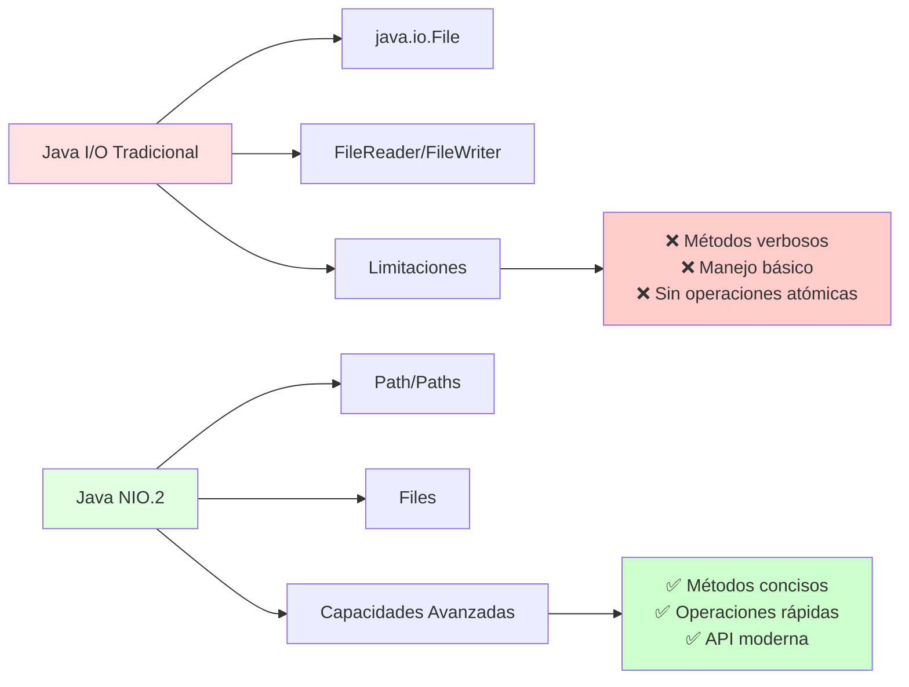
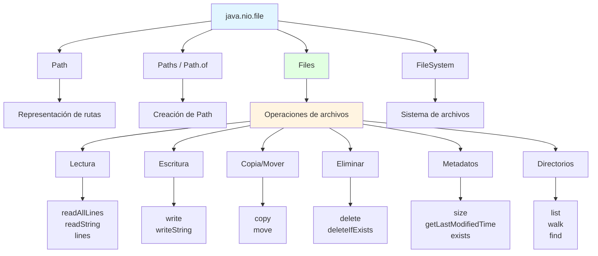
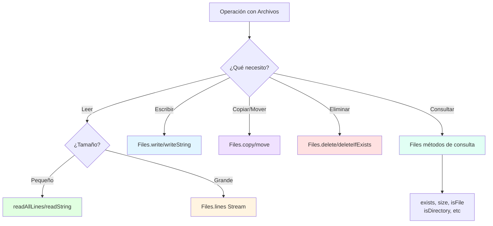

# 📦 Paquete NIO (Path, Paths, Files y Métodos Rápidos)

## 🎯 Introducción

> [!info]- 💡 ¿Qué es Java NIO.2?
> 
> **Java NIO.2** (New Input/Output 2) es la API moderna de Java para operaciones con archivos, introducida en Java 7. Representa una evolución significativa respecto a las clases tradicionales `File`, `FileReader` y `FileWriter`.
> 
> **Analogía práctica:** Imagina que las clases antiguas (`File`, `FileReader`) son como una bicicleta tradicional: funcionan, pero requieren más esfuerzo. NIO.2 es como una bicicleta eléctrica moderna: más potente, eficiente y con características avanzadas que simplifican el trabajo.
> 
> **¿Por qué usar NIO.2?**
> 
> |Aspecto|API Antigua (java.io)|NIO.2 (java.nio.file)|
> |---|---|---|
> |**Simplicidad**|🔴 Verbose, mucho código|🟢 Conciso, métodos directos|
> |**Rendimiento**|🟡 Aceptable|🟢 Optimizado|
> |**Manejo de errores**|🔴 Excepciones genéricas|🟢 Excepciones específicas|
> |**Operaciones atómicas**|❌ No|✅ Sí|
> |**Metadatos**|🟡 Limitado|🟢 Completo|
> |**Enlaces simbólicos**|❌ Soporte limitado|✅ Soporte completo|
> |**Recorrido de directorios**|🔴 Manual, complejo|🟢 Streams modernos|



> [!success] **Comparación con un ejemplo real:**
> 
> 
> ```java
> // ❌ Forma antigua - Compleja y verbosa
> File file = new File("datos.txt");
> if (file.exists()) {
>     BufferedReader br = new BufferedReader(new FileReader(file));
>     String linea;
>     while ((linea = br.readLine()) != null) {
>         System.out.println(linea);
>     }
>     br.close();
> }
> 
> // ✅ Forma NIO.2 - Simple y directa
> Path path = Paths.get("datos.txt");
> List<String> lineas = Files.readAllLines(path);
> lineas.forEach(System.out::println);
> ```
> 

---

## 🛤️ Interfaz Path: Representación Moderna de Rutas

### 📍 Concepto y Creación

> [!example]- 🗺️ ¿Qué es Path?
> 
> `Path` es una **interfaz** que representa una ruta en el sistema de archivos de forma abstracta y multiplataforma. Es el equivalente moderno de la clase `File`, pero más flexible y potente.
> 
> **Diferencias fundamentales:**
> 
> |Característica|File (java.io)|Path (java.nio.file)|
> |---|---|---|
> |**Tipo**|Clase concreta|Interfaz|
> |**Inmutabilidad**|❌ Mutable|✅ Inmutable|
> |**Operaciones de rutas**|🔴 Limitadas|🟢 Extensas|
> |**Manejo de enlaces**|🔴 Básico|🟢 Completo|
> |**Comparación de rutas**|🔴 Difícil|🟢 Métodos integrados|
> 
> **Creación de Path con Paths:**
> 
> ```java
> import java.nio.file.Path;
> import java.nio.file.Paths;
> 
> // 1. Ruta simple
> Path path1 = Paths.get("archivo.txt");
> 
> // 2. Ruta con múltiples componentes (automáticamente usa separadores correctos)
> Path path2 = Paths.get("carpeta", "subcarpeta", "archivo.txt");
> // En Windows: carpeta\subcarpeta\archivo.txt
> // En Linux/Mac: carpeta/subcarpeta/archivo.txt
> 
> // 3. Ruta absoluta
> Path path3 = Paths.get("/home/usuario/documentos/datos.txt");
> 
> // 4. Desde URI
> Path path4 = Paths.get(URI.create("file:///C:/datos.txt"));
> 
> // 5. Alternativa moderna (Java 11+)
> Path path5 = Path.of("carpeta", "archivo.txt");
> ```
> 
> **Anatomía de una ruta:**
> 
> ```mermaid
> graph LR
>     A["/home/usuario/documentos/proyecto/datos.txt"] --> B[Root: /]
>     A --> C[Componentes: home, usuario, documentos, proyecto]
>     A --> D[Nombre archivo: datos.txt]
>     A --> E[Extensión: .txt]
>     
>     style A fill:#e1f5ff
>     style B fill:#ffe1e1
>     style C fill:#fff4e1
>     style D fill:#e1ffe1
> ```

### 🔧 Operaciones con Path

> [!success]- 🛠️ Métodos Principales de Path
> 
> **1. Consulta de información:**
> 
> ```java
> Path path = Paths.get("/home/usuario/documentos/proyecto/datos.txt");
> 
> // Nombre del archivo
> System.out.println(path.getFileName());          // datos.txt
> 
> // Directorio padre
> System.out.println(path.getParent());            // /home/usuario/documentos/proyecto
> 
> // Raíz del sistema
> System.out.println(path.getRoot());              // /
> 
> // Número de componentes
> System.out.println(path.getNameCount());         // 5
> 
> // Obtener componente específico (índice 0 = primer directorio después de root)
> System.out.println(path.getName(0));             // home
> System.out.println(path.getName(1));             // usuario
> 
> // ¿Es absoluta?
> System.out.println(path.isAbsolute());           // true
> ```
> 
> **Tabla de métodos de consulta:**
> 
> |Método|Retorna|Descripción|Ejemplo|
> |---|---|---|---|
> |`getFileName()`|Path|Nombre del archivo o último componente|`datos.txt`|
> |`getParent()`|Path|Directorio padre|`/home/usuario/docs`|
> |`getRoot()`|Path|Raíz del sistema|`/` o `C:\`|
> |`getNameCount()`|int|Número de componentes|`5`|
> |`getName(i)`|Path|Componente en índice i|`usuario`|
> |`isAbsolute()`|boolean|¿Es ruta absoluta?|`true`/`false`|
> 
> **2. Manipulación de rutas:**
> 
> ```java
> Path base = Paths.get("/home/usuario");
> Path proyecto = Paths.get("documentos/proyecto");
> Path archivo = Paths.get("datos.txt");
> 
> // Resolver (concatenar) rutas
> Path completa = base.resolve(proyecto).resolve(archivo);
> System.out.println(completa);  // /home/usuario/documentos/proyecto/datos.txt
> 
> // Alternativa más directa
> Path completa2 = base.resolve("documentos/proyecto/datos.txt");
> 
> // Obtener ruta relativa entre dos rutas
> Path ruta1 = Paths.get("/home/usuario/docs/archivo1.txt");
> Path ruta2 = Paths.get("/home/usuario/imagenes/foto.jpg");
> Path relativa = ruta1.relativize(ruta2);
> System.out.println(relativa);  // ../../imagenes/foto.jpg
> 
> // Normalizar (eliminar redundancias)
> Path desordenada = Paths.get("/home/usuario/../usuario/./docs/archivo.txt");
> Path limpia = desordenada.normalize();
> System.out.println(limpia);    // /home/usuario/docs/archivo.txt
> 
> // Convertir a absoluta
> Path relativa = Paths.get("datos.txt");
> Path absoluta = relativa.toAbsolutePath();
> System.out.println(absoluta);  // /ruta/actual/del/programa/datos.txt
> 
> // Convertir a URI
> URI uri = path.toUri();
> System.out.println(uri);       // file:///home/usuario/datos.txt
> ```
> 
> **Flujo de manipulación:**
> 
> ```mermaid
> flowchart LR
>     A[Path base<br/>/home/usuario] --> B[resolve<br/>docs/proyecto]
>     B --> C[Path completo<br/>/home/usuario/docs/proyecto]
>     
>     D[Path desordenado<br/>./../usuario/./docs] --> E[normalize]
>     E --> F[Path limpio<br/>/usuario/docs]
>     
>     G[Path relativo<br/>archivo.txt] --> H[toAbsolutePath]
>     H --> I[Path absoluto<br/>/ruta/completa/archivo.txt]
>     
>     style A fill:#e1f5ff
>     style C fill:#e1ffe1
>     style F fill:#e1ffe1
>     style I fill:#e1ffe1
> ```
> 
> **3. Comparación de rutas:**
> 
> ```java
> Path path1 = Paths.get("/home/usuario/datos.txt");
> Path path2 = Paths.get("/home/usuario/datos.txt");
> Path path3 = Paths.get("/home/usuario/../usuario/datos.txt");
> 
> // Comparación directa
> System.out.println(path1.equals(path2));              // true
> System.out.println(path1.equals(path3));              // false (diferente representación)
> 
> // Comparación después de normalizar
> System.out.println(path1.equals(path3.normalize())); // true
> 
> // Verificar si comienza con
> Path base = Paths.get("/home/usuario");
> System.out.println(path1.startsWith(base));          // true
> 
> // Verificar si termina con
> System.out.println(path1.endsWith("datos.txt"));     // true
> System.out.println(path1.endsWith("usuario/datos.txt")); // true
> ```

### 🔄 Conversión entre File y Path

> [!tip]- ↔️ Interoperabilidad con API Antigua
> 
> Es posible convertir entre `File` (API antigua) y `Path` (API moderna) para mantener compatibilidad con código legacy.
> 
> ```java
> // De File a Path
> File file = new File("datos.txt");
> Path path = file.toPath();
> 
> // De Path a File
> Path path2 = Paths.get("documentos", "archivo.txt");
> File file2 = path2.toFile();
> 
> // Ejemplo práctico: usar librería antigua con NIO.2
> Path pathModerno = Paths.get("config.properties");
> Properties props = new Properties();
> props.load(new FileInputStream(pathModerno.toFile()));  // API antigua requiere File
> ```
> 
> **Flujo de conversión:**
> 
> ```mermaid
> graph LR
>     A[File<br/>java.io] <-->|toPath<br/>toFile| B[Path<br/>java.nio.file]
>     
>     A --> C[API Antigua<br/>FileReader<br/>FileWriter]
>     B --> D[API Moderna<br/>Files<br/>Métodos rápidos]
>     
>     style A fill:#ffe1e1
>     style B fill:#e1ffe1
>     style C fill:#ffcccc
>     style D fill:#ccffcc
> ```

---

## 🗂️ Clase Files: Operaciones de Alto Nivel

### 📖 Lectura Rápida de Archivos

> [!example]- 📥 Métodos de Lectura Simplificados
> 
> La clase `Files` proporciona métodos estáticos que simplifican drásticamente la lectura de archivos.
> 
> **1. Leer todas las líneas:**
> 
> ```java
> import java.nio.file.Files;
> import java.nio.file.Path;
> import java.nio.file.Paths;
> import java.util.List;
> 
> // ✅ Forma NIO.2 - Extremadamente simple
> Path path = Paths.get("datos.txt");
> try {
>     List<String> lineas = Files.readAllLines(path);
>     
>     // Procesar líneas
>     for (String linea : lineas) {
>         System.out.println(linea);
>     }
>     
>     // O con streams (Java 8+)
>     lineas.forEach(System.out::println);
>     
> } catch (IOException e) {
>     System.out.println("Error al leer: " + e.getMessage());
> }
> 
> // Especificar charset
> List<String> lineas = Files.readAllLines(path, StandardCharsets.UTF_8);
> ```
> 
> **Comparación con API antigua:**
> 
> ```java
> // ❌ API antigua - 10+ líneas
> BufferedReader br = null;
> List<String> lineas = new ArrayList<>();
> try {
>     br = new BufferedReader(new FileReader("datos.txt"));
>     String linea;
>     while ((linea = br.readLine()) != null) {
>         lineas.add(linea);
>     }
> } catch (IOException e) {
>     e.printStackTrace();
> } finally {
>     if (br != null) br.close();
> }
> 
> // ✅ NIO.2 - 1 línea
> List<String> lineas = Files.readAllLines(Paths.get("datos.txt"));
> ```
> 
> **2. Leer todo el contenido como String:**
> 
> ```java
> // Java 11+
> Path path = Paths.get("documento.txt");
> String contenido = Files.readString(path);
> System.out.println(contenido);
> 
> // Con charset específico
> String contenido = Files.readString(path, StandardCharsets.ISO_8859_1);
> ```
> 
> **3. Leer como bytes:**
> 
> ```java
> // Útil para archivos binarios
> Path imagenPath = Paths.get("foto.jpg");
> byte[] bytes = Files.readAllBytes(imagenPath);
> System.out.println("Tamaño: " + bytes.length + " bytes");
> ```
> 
> **4. Lectura eficiente con Streams (archivos grandes):**
> 
> ```java
> // Para archivos que no caben en memoria
> Path path = Paths.get("archivo_grande.log");
> 
> try (Stream<String> lineas = Files.lines(path)) {
>     // Procesar línea por línea sin cargar todo en memoria
>     lineas.filter(l -> l.contains("ERROR"))
>           .limit(10)
>           .forEach(System.out::println);
>           
> } catch (IOException e) {
>     System.out.println("Error: " + e.getMessage());
> }
> 
> // Contar líneas eficientemente
> long cantidad = Files.lines(path).count();
> ```
> 
> **Tabla comparativa de métodos de lectura:**
> 
> |Método|Retorna|Carga en Memoria|Mejor Para|
> |---|---|---|---|
> |`readAllLines()`|`List<String>`|✅ Completo|Archivos pequeños/medianos|
> |`readString()` (Java 11+)|`String`|✅ Completo|Archivos de texto pequeños|
> |`readAllBytes()`|`byte[]`|✅ Completo|Archivos binarios pequeños|
> |`lines()`|`Stream<String>`|❌ Streaming|Archivos grandes|
> 
> **Flujo de decisión:**
> 
> ```mermaid
> graph TD
>     A[Necesito leer archivo] --> B{¿Tamaño?}
>     B -->|Pequeño<br/>< 100MB| C[readAllLines<br/>o readString]
>     B -->|Grande<br/>> 100MB| D[Files.lines<br/>Stream]
>     
>     C --> E{¿Tipo?}
>     E -->|Texto| F[readAllLines<br/>readString]
>     E -->|Binario| G[readAllBytes]
>     
>     D --> H[Procesar<br/>línea por línea]
>     
>     style C fill:#e1ffe1
>     style D fill:#fff4e1
>     style F fill:#ccffcc
> ```

### ✏️ Escritura Rápida de Archivos

> [!success]- 📤 Métodos de Escritura Simplificados
> 
> **1. Escribir lista de líneas:**
> 
> ```java
> Path path = Paths.get("salida.txt");
> List<String> lineas = Arrays.asList(
>     "Primera línea",
>     "Segunda línea",
>     "Tercera línea"
> );
> 
> try {
>     // Sobrescribir archivo (comportamiento por defecto)
>     Files.write(path, lineas);
>     System.out.println("✅ Archivo escrito");
>     
> } catch (IOException e) {
>     System.out.println("❌ Error: " + e.getMessage());
> }
> 
> // Con charset específico
> Files.write(path, lineas, StandardCharsets.UTF_8);
> ```
> 
> **2. Escribir String directamente (Java 11+):**
> 
> ```java
> Path path = Paths.get("mensaje.txt");
> String contenido = "Este es el contenido\ncon múltiples líneas\n";
> 
> Files.writeString(path, contenido);
> 
> // Con charset
> Files.writeString(path, contenido, StandardCharsets.UTF_8);
> ```
> 
> **3. Escribir bytes:**
> 
> ```java
> // Útil para archivos binarios
> byte[] datos = {0x48, 0x65, 0x6C, 0x6C, 0x6F};  // "Hello" en bytes
> Path path = Paths.get("datos.bin");
> Files.write(path, datos);
> ```
> 
> **4. Opciones de escritura (StandardOpenOption):**
> 
> ```java
> import static java.nio.file.StandardOpenOption.*;
> 
> Path path = Paths.get("log.txt");
> List<String> lineas = Arrays.asList("Nuevo registro");
> 
> // Append - Agregar al final
> Files.write(path, lineas, APPEND);
> 
> // Crear si no existe
> Files.write(path, lineas, CREATE);
> 
> // Crear archivo nuevo (falla si existe)
> Files.write(path, lineas, CREATE_NEW);
> 
> // Truncar (borrar contenido existente)
> Files.write(path, lineas, TRUNCATE_EXISTING);
> 
> // Combinar opciones
> Files.write(path, lineas, CREATE, APPEND);
> ```
> 
> **Tabla de opciones de escritura:**
> 
> |Opción|Comportamiento|Uso Típico|
> |---|---|---|
> |`WRITE`|Escritura normal|Por defecto|
> |`APPEND`|Agregar al final|Logs, historial|
> |`CREATE`|Crear si no existe|Inicialización|
> |`CREATE_NEW`|Crear solo si no existe|Evitar sobrescritura|
> |`TRUNCATE_EXISTING`|Borrar contenido previo|Regenerar archivo|
> |`DELETE_ON_CLOSE`|Borrar al cerrar|Archivos temporales|
> 
> **Ejemplo completo con manejo de opciones:**
> 
> ```java
> public void registrarEvento(String mensaje) {
>     Path logPath = Paths.get("aplicacion.log");
>     String timestamp = LocalDateTime.now().toString();
>     String registro = timestamp + " - " + mensaje + "\n";
>     
>     try {
>         // Append con creación automática
>         Files.writeString(logPath, registro, CREATE, APPEND);
>     } catch (IOException e) {
>         System.err.println("Error al registrar evento");
>     }
> }
> ```
> 
> **Comparación completa:**
> 
> ```mermaid
> graph TD
>     A[Escritura de Archivo] --> B{¿Método?}
>     
>     B --> C[write con List]
>     B --> D[writeString]
>     B --> E[write con bytes]
>     
>     C --> F{¿Opciones?}
>     D --> F
>     E --> F
>     
>     F --> G[CREATE]
>     F --> H[APPEND]
>     F --> I[TRUNCATE_EXISTING]
>     F --> J[CREATE_NEW]
>     
>     style C fill:#e1ffe1
>     style D fill:#e1f5ff
>     style E fill:#fff4e1
> ```

### 📋 Copia, Movimiento y Eliminación

> [!tip]- 🔄 Operaciones de Archivos Simplificadas
> 
> **1. Copiar archivos:**
> 
> ```java
> Path origen = Paths.get("documento.txt");
> Path destino = Paths.get("documento_copia.txt");
> 
> try {
>     // Copia simple
>     Files.copy(origen, destino);
>     System.out.println("✅ Archivo copiado");
>     
> } catch (FileAlreadyExistsException e) {
>     System.out.println("❌ El archivo destino ya existe");
> } catch (IOException e) {
>     System.out.println("❌ Error: " + e.getMessage());
> }
> 
> // Con opciones de copia
> import static java.nio.file.StandardCopyOption.*;
> 
> // Reemplazar si existe
> Files.copy(origen, destino, REPLACE_EXISTING);
> 
> // Copiar atributos (permisos, timestamps)
> Files.copy(origen, destino, COPY_ATTRIBUTES);
> 
> // Combinar opciones
> Files.copy(origen, destino, REPLACE_EXISTING, COPY_ATTRIBUTES);
> 
> // Copia atómica (todo o nada)
> Files.copy(origen, destino, ATOMIC_MOVE);
> ```
> 
> **Opciones de copia:**
> 
> |Opción|Efecto|Cuándo Usar|
> |---|---|---|
> |`REPLACE_EXISTING`|Sobrescribe destino si existe|Actualizar archivos|
> |`COPY_ATTRIBUTES`|Copia metadatos (fechas, permisos)|Backup completo|
> |`ATOMIC_MOVE`|Operación atómica|Garantizar consistencia|
> 
> **2. Mover/Renombrar archivos:**
> 
> ```java
> Path origen = Paths.get("archivo_viejo.txt");
> Path destino = Paths.get("archivo_nuevo.txt");
> 
> try {
>     // Mover/renombrar
>     Files.move(origen, destino);
>     System.out.println("✅ Archivo movido/renombrado");
>     
>     // Con reemplazo
>     Files.move(origen, destino, REPLACE_EXISTING);
>     
>     // Movimiento atómico (más seguro)
>     Files.move(origen, destino, ATOMIC_MOVE);
>     
> } catch (IOException e) {
>     System.out.println("❌ Error: " + e.getMessage());
> }
> 
> // Mover a otro directorio
> Path archivo = Paths.get("documento.txt");
> Path nuevoDir = Paths.get("carpeta_destino", "documento.txt");
> Files.move(archivo, nuevoDir);
> ```
> 
> **3. Eliminar archivos:**
> 
> ```java
> Path path = Paths.get("archivo_temporal.txt");
> 
> try {
>     // Eliminar (lanza excepción si no existe)
>     Files.delete(path);
>     System.out.println("✅ Archivo eliminado");
>     
> } catch (NoSuchFileException e) {
>     System.out.println("❌ El archivo no existe");
> } catch (IOException e) {
>     System.out.println("❌ Error: " + e.getMessage());
> }
> 
> // Eliminar sin excepción si no existe
> boolean eliminado = Files.deleteIfExists(path);
> if (eliminado) {
>     System.out.println("✅ Archivo eliminado");
> } else {
>     System.out.println("ℹ️ El archivo no existía");
> }
> ```
> 
> **Flujo de operaciones:**
> 
> ```mermaid
> flowchart TD
>     A[Archivo Origen] --> B{Operación}
>     
>     B -->|copy| C[Archivo Destino<br/>Original intacto]
>     B -->|move| D[Archivo Destino<br/>Original eliminado]
>     B -->|delete| E[Archivo eliminado]
>     
>     C --> F{Opciones}
>     D --> F
>     
>     F --> G[REPLACE_EXISTING]
>     F --> H[COPY_ATTRIBUTES]
>     F --> I[ATOMIC_MOVE]
>     
>     style C fill:#e1ffe1
>     style D fill:#fff4e1
>     style E fill:#ffe1e1
> ```
> 
> **Ejemplo práctico - Sistema de backup:**
> 
> ```java
> public void crearBackup(String archivoOriginal) {
>     Path origen = Paths.get(archivoOriginal);
>     String timestamp = LocalDateTime.now()
>         .format(DateTimeFormatter.ofPattern("yyyyMMdd_HHmmss"));
>     Path backup = Paths.get(archivoOriginal + ".backup." + timestamp);
>     
>     try {
>         // Copiar con atributos preservados
>         Files.copy(origen, backup, COPY_ATTRIBUTES);
>         System.out.println("💾 Backup creado: " + backup.getFileName());
>         
>         // Limpiar backups antiguos (mantener últimos 5)
>         limpiarBackupsAntiguos(origen);
>         
>     } catch (IOException e) {
>         System.err.println("❌ Error al crear backup: " + e.getMessage());
>     }
> }
> ```

### 🔍 Consulta de Metadatos y Propiedades

> [!note]- 📊 Información de Archivos y Directorios
> 
> **1. Verificaciones básicas:**
> 
> ```java
> Path path = Paths.get("documento.txt");
> 
> // Existencia
> boolean existe = Files.exists(path);
> System.out.println("Existe: " + existe);
> 
> // No existe (útil para negaciones)
> boolean noExiste = Files.notExists(path);
> 
> // Tipo de archivo
> boolean esArchivo = Files.isRegularFile(path);
> boolean esDirectorio = Files.isDirectory(path);
> boolean esEnlace = Files.isSymbolicLink(path);
> 
> // Permisos
> boolean puedeLeer = Files.isReadable(path);
> boolean puedeEscribir = Files.isWritable(path);
> boolean puedeEjecutar = Files.isExecutable(path);
> 
> // Visibilidad
> boolean esOculto = Files.isHidden(path);
> 
> System.out.println("📄 Es archivo: " + esArchivo);
> System.out.println("📁 Es directorio: " + esDirectorio);
> System.out.println("👁️ Puede leer: " + puedeLeer);
> System.out.println("✏️ Puede escribir: " + puedeEscribir);
> ```
> 
> **2. Tamaño y fechas:**
> 
> ```java
> Path path = Paths.get("video.mp4");
> 
> try {
>     // Tamaño en bytes
>     long bytes = Files.size(path);
>     System.out.println("Tamaño: " + bytes + " bytes");
>     
>     // Convertir a formato legible
>     System.out.println("Tamaño: " + formatearTamaño(bytes));
>     
>     // Última modificación
>     FileTime ultimaMod = Files.getLastModifiedTime(path);
>     System.out.println("Modificado: " + ultimaMod);
>     
>     // Establecer nueva fecha de modificación
>     FileTime nuevaFecha = FileTime.fromMillis(System.currentTimeMillis());
>     Files.setLastModifiedTime(path, nuevaFecha);
>     
> } catch (IOException e) {
>     System.out.println("Error: " + e.getMessage());
> }
> 
> // Método auxiliar para formatear tamaño
> public String formatearTamaño(long bytes) {
>     if (bytes < 1024) return bytes + " B";
>     if (bytes < 1024 * 1024) return (bytes / 1024) + " KB";
>     if (bytes < 1024 * 1024 * 1024) return (bytes / (1024 * 1024)) + " MB";
>     return (bytes/ (1024 * 1024 * 1024)) + " GB";
> }
> 
> ````
> 
> **3. Atributos completos:**
> 
> ```java
> Path path = Paths.get("documento.txt");
> 
> try {
>     // Atributos básicos
>     BasicFileAttributes attrs = Files.readAttributes(path, BasicFileAttributes.class);
>     
>     System.out.println("📅 Creación: " + attrs.creationTime());
>     System.out.println("📅 Última modificación: " + attrs.lastModifiedTime());
>     System.out.println("📅 Último acceso: " + attrs.lastAccessTime());
>     System.out.println("📏 Tamaño: " + attrs.size() + " bytes");
>     System.out.println("📄 Es archivo: " + attrs.isRegularFile());
>     System.out.println("📁 Es directorio: " + attrs.isDirectory());
>     System.out.println("🔗 Es enlace: " + attrs.isSymbolicLink());
>     
> } catch (IOException e) {
>     System.out.println("Error al leer atributos");
> }
> ````
> 
> **4. Propietario y permisos (Unix/Linux):**
> 
> ```java
> Path path = Paths.get("archivo.txt");
> 
> try {
>     // Obtener propietario
>     UserPrincipal owner = Files.getOwner(path);
>     System.out.println("👤 Propietario: " + owner.getName());
>     
>     // Cambiar propietario (requiere permisos)
>     UserPrincipalLookupService lookupService = 
>         FileSystems.getDefault().getUserPrincipalLookupService();
>     UserPrincipal newOwner = lookupService.lookupPrincipalByName("usuario");
>     Files.setOwner(path, newOwner);
>     
>     // Permisos POSIX (Unix/Linux)
>     Set<PosixFilePermission> permisos = Files.getPosixFilePermissions(path);
>     System.out.println("🔐 Permisos: " + PosixFilePermissions.toString(permisos));
>     
> } catch (IOException e) {
>     System.out.println("Error con permisos");
> }
> ```
> 
> **Tabla de métodos de consulta:**
> 
> |Método|Retorna|Descripción|
> |---|---|---|
> |`exists(path)`|boolean|Verifica existencia|
> |`isRegularFile(path)`|boolean|Es archivo regular|
> |`isDirectory(path)`|boolean|Es directorio|
> |`isSymbolicLink(path)`|boolean|Es enlace simbólico|
> |`isReadable(path)`|boolean|Puede leer|
> |`isWritable(path)`|boolean|Puede escribir|
> |`isExecutable(path)`|boolean|Puede ejecutar|
> |`isHidden(path)`|boolean|Es archivo oculto|
> |`size(path)`|long|Tamaño en bytes|
> |`getLastModifiedTime(path)`|FileTime|Fecha de modificación|
> |`getOwner(path)`|UserPrincipal|Propietario del archivo|
> 
> **Diagrama de metadatos:**
> 
> ```mermaid
> graph TD
>     A[Path: archivo.txt] --> B[Metadatos]
>     
>     B --> C[Tipo<br/>archivo/directorio/enlace]
>     B --> D[Tamaño<br/>bytes]
>     B --> E[Fechas<br/>creación/modificación/acceso]
>     B --> F[Permisos<br/>lectura/escritura/ejecución]
>     B --> G[Propietario<br/>usuario/grupo]
>     
>     style A fill:#e1f5ff
>     style C fill:#e1ffe1
>     style D fill:#fff4e1
>     style E fill:#ffe1e1
>     style F fill:#f0e1ff
>     style G fill:#e1fff4
> ```

---

## 📂 Manejo de Directorios

### 🏗️ Creación y Eliminación de Directorios

> [!example]- 🗂️ Operaciones con Carpetas
> 
> **1. Crear directorios:**
> 
> ```java
> // Crear directorio simple
> Path dir = Paths.get("nueva_carpeta");
> try {
>     Files.createDirectory(dir);
>     System.out.println("✅ Directorio creado");
> } catch (FileAlreadyExistsException e) {
>     System.out.println("⚠️ El directorio ya existe");
> } catch (IOException e) {
>     System.out.println("❌ Error: " + e.getMessage());
> }
> 
> // Crear estructura completa de directorios
> Path directorios = Paths.get("nivel1/nivel2/nivel3");
> try {
>     Files.createDirectories(directorios);
>     System.out.println("✅ Estructura de directorios creada");
> } catch (IOException e) {
>     System.out.println("❌ Error: " + e.getMessage());
> }
> ```
> 
> **Diferencias clave:**
> 
> |Método|Comportamiento|Caso de Uso|
> |---|---|---|
> |`createDirectory()`|Crea UN directorio|Padre debe existir|
> |`createDirectories()`|Crea TODOS los niveles necesarios|Crear estructura completa|
> 
> ```mermaid
> graph TD
>     A[Crear Directorio] --> B{¿Método?}
>     
>     B -->|createDirectory| C[Un solo nivel]
>     B -->|createDirectories| D[Múltiples niveles]
>     
>     C --> E{¿Padre existe?}
>     E -->|Sí| F[✅ Creado]
>     E -->|No| G[❌ IOException]
>     
>     D --> H[Crea todos<br/>los niveles necesarios]
>     H --> F
>     
>     style C fill:#fff4e1
>     style D fill:#e1ffe1
> ```
> 
> **2. Crear archivos temporales:**
> 
> ```java
> try {
>     // Archivo temporal en directorio por defecto del sistema
>     Path tempFile = Files.createTempFile("prefijo_", ".tmp");
>     System.out.println("📄 Archivo temporal: " + tempFile);
>     
>     // Archivo temporal en directorio específico
>     Path dirTemp = Paths.get("temp");
>     Files.createDirectories(dirTemp);
>     Path tempFile2 = Files.createTempFile(dirTemp, "datos_", ".txt");
>     
>     // Directorio temporal
>     Path tempDir = Files.createTempDirectory("mi_app_");
>     System.out.println("📁 Directorio temporal: " + tempDir);
>     
> } catch (IOException e) {
>     System.out.println("Error: " + e.getMessage());
> }
> ```
> 
> **3. Eliminar directorios:**
> 
> ```java
> Path dir = Paths.get("carpeta_vacia");
> 
> try {
>     // Eliminar directorio vacío
>     Files.delete(dir);
>     System.out.println("✅ Directorio eliminado");
>     
> } catch (DirectoryNotEmptyException e) {
>     System.out.println("❌ El directorio no está vacío");
> } catch (IOException e) {
>     System.out.println("❌ Error: " + e.getMessage());
> }
> 
> // Eliminar directorio con contenido (recursivo)
> public void eliminarDirectorioRecursivo(Path dir) throws IOException {
>     if (Files.exists(dir)) {
>         Files.walk(dir)
>              .sorted(Comparator.reverseOrder())  // Eliminar de hijos a padres
>              .forEach(path -> {
>                  try {
>                      Files.delete(path);
>                      System.out.println("🗑️ Eliminado: " + path);
>                  } catch (IOException e) {
>                      System.err.println("Error eliminando: " + path);
>                  }
>              });
>     }
> }
> ```

### 🔍 Listar Contenido de Directorios

> [!success]- 📋 Exploración de Carpetas
> 
> **1. Listar archivos directamente (un nivel):**
> 
> ```java
> Path dir = Paths.get("documentos");
> 
> try (DirectoryStream<Path> stream = Files.newDirectoryStream(dir)) {
>     System.out.println("📁 Contenido de: " + dir);
>     
>     for (Path entrada : stream) {
>         String tipo = Files.isDirectory(entrada) ? "📁 DIR" : "📄 FILE";
>         System.out.println(tipo + " - " + entrada.getFileName());
>     }
>     
> } catch (IOException e) {
>     System.out.println("Error: " + e.getMessage());
> }
> 
> // Con filtro (glob pattern)
> try (DirectoryStream<Path> stream = Files.newDirectoryStream(dir, "*.txt")) {
>     System.out.println("📄 Archivos .txt:");
>     stream.forEach(path -> System.out.println("  - " + path.getFileName()));
> }
> 
> // Múltiples extensiones
> try (DirectoryStream<Path> stream = 
>          Files.newDirectoryStream(dir, "*.{txt,pdf,doc}")) {
>     stream.forEach(System.out::println);
> }
> ```
> 
> **Patrones glob comunes:**
> 
> |Patrón|Coincide|Ejemplo|
> |---|---|---|
> |`*.txt`|Archivos .txt|`documento.txt`|
> |`datos*`|Comienza con "datos"|`datos1.csv`, `datos_final.xlsx`|
> |`*.{txt,pdf}`|Múltiples extensiones|`archivo.txt`, `reporte.pdf`|
> |`foto?.jpg`|Un carácter cualquiera|`foto1.jpg`, `fotoA.jpg`|
> |`**/*.txt`|Recursivo (con walk)|Todos los .txt en subcarpetas|
> 
> **2. Listar con list() - Java 8+:**
> 
> ```java
> Path dir = Paths.get("proyectos");
> 
> try (Stream<Path> paths = Files.list(dir)) {
>     // Filtrar y mostrar solo archivos
>     paths.filter(Files::isRegularFile)
>          .forEach(System.out::println);
>          
> } catch (IOException e) {
>     System.out.println("Error: " + e.getMessage());
> }
> 
> // Contar archivos y directorios
> long totalArchivos = Files.list(dir)
>     .filter(Files::isRegularFile)
>     .count();
>     
> long totalDirs = Files.list(dir)
>     .filter(Files::isDirectory)
>     .count();
>     
> System.out.println("📄 Archivos: " + totalArchivos);
> System.out.println("📁 Directorios: " + totalDirs);
> ```
> 
> **3. Recorrido recursivo con walk():**
> 
> ```java
> Path inicio = Paths.get("proyecto");
> 
> try (Stream<Path> paths = Files.walk(inicio)) {
>     // Listar TODOS los archivos recursivamente
>     paths.filter(Files::isRegularFile)
>          .forEach(System.out::println);
>          
> } catch (IOException e) {
>     System.out.println("Error: " + e.getMessage());
> }
> 
> // Limitar profundidad
> try (Stream<Path> paths = Files.walk(inicio, 2)) {  // Máximo 2 niveles
>     paths.forEach(System.out::println);
> }
> 
> // Buscar archivos específicos recursivamente
> try (Stream<Path> paths = Files.walk(inicio)) {
>     paths.filter(p -> p.toString().endsWith(".java"))
>          .forEach(p -> System.out.println("☕ " + p));
> }
> 
> // Calcular tamaño total de directorio
> long tamaño = Files.walk(inicio)
>     .filter(Files::isRegularFile)
>     .mapToLong(p -> {
>         try {
>             return Files.size(p);
>         } catch (IOException e) {
>             return 0;
>         }
>     })
>     .sum();
>     
> System.out.println("📦 Tamaño total: " + tamaño + " bytes");
> ```
> 
> **Comparación de métodos:**
> 
> |Método|Profundidad|Retorna|Mejor Para|
> |---|---|---|---|
> |`newDirectoryStream()`|Un nivel|DirectoryStream|Simple, filtros glob|
> |`list()`|Un nivel|Stream|Operaciones funcionales|
> |`walk()`|Recursivo|Stream|Búsqueda profunda|
> |`find()`|Recursivo con filtro|Stream|Búsqueda condicional|
> 
> **4. Búsqueda avanzada con find():**
> 
> ```java
> Path inicio = Paths.get("documentos");
> 
> // Buscar archivos mayores a 1MB
> try (Stream<Path> paths = Files.find(inicio, 
>                                      Integer.MAX_VALUE,  // Profundidad máxima
>                                      (path, attrs) -> attrs.isRegularFile() && 
>                                                       attrs.size() > 1_000_000)) {
>     System.out.println("📦 Archivos > 1MB:");
>     paths.forEach(p -> {
>         try {
>             System.out.println("  " + p + " (" + Files.size(p) + " bytes)");
>         } catch (IOException e) {
>             e.printStackTrace();
>         }
>     });
> }
> 
> // Buscar archivos modificados en últimas 24 horas
> FileTime ayer = FileTime.fromMillis(
>     System.currentTimeMillis() - 24 * 60 * 60 * 1000
> );
> 
> try (Stream<Path> paths = Files.find(inicio,
>                                      Integer.MAX_VALUE,
>                                      (path, attrs) -> attrs.lastModifiedTime()
>                                                           .compareTo(ayer) > 0)) {
>     System.out.println("🆕 Archivos recientes:");
>     paths.forEach(System.out::println);
> }
> ```
> 
> **Flujo de exploración:**
> 
> ```mermaid
> graph TD
>     A[Directorio] --> B{¿Profundidad?}
>     
>     B -->|Un nivel| C[newDirectoryStream<br/>o list]
>     B -->|Recursivo| D[walk o find]
>     
>     C --> E[Archivos directos]
>     D --> F[Todos los archivos<br/>en árbol]
>     
>     F --> G{¿Filtros?}
>     G -->|Nombre/Extensión| H[walk + filter]
>     G -->|Tamaño/Fecha| I[find + BiPredicate]
>     
>     style C fill:#e1ffe1
>     style D fill:#fff4e1
>     style H fill:#e1f5ff
>     style I fill:#f0e1ff
> ```

---

## ⚡ Comparación: API Antigua vs NIO.2

> [!tip]- 📊 Tabla Comparativa Completa
> 
> **Operaciones comunes:**
> 
> |Operación|java.io (Antigua)|java.nio.file (NIO.2)|
> |---|---|---|
> |**Leer todas las líneas**|15+ líneas con BufferedReader|`Files.readAllLines(path)`|
> |**Escribir líneas**|10+ líneas con BufferedWriter|`Files.write(path, lineas)`|
> |**Copiar archivo**|Loop manual byte a byte|`Files.copy(origen, destino)`|
> |**Mover archivo**|Copiar + eliminar manual|`Files.move(origen, destino)`|
> |**Eliminar archivo**|`file.delete()` (sin info de error)|`Files.delete(path)` (excepción específica)|
> |**Verificar existencia**|`file.exists()`|`Files.exists(path)`|
> |**Obtener tamaño**|`file.length()`|`Files.size(path)`|
> |**Listar directorio**|`file.listFiles()` (array)|`Files.list(path)` (Stream)|
> |**Recorrido recursivo**|Implementación manual|`Files.walk(path)`|
> 
> **Ejemplo lado a lado:**
> 
> ```java
> // ════════════════════════════════════════════════════════════
> // ❌ API ANTIGUA (java.io) - Verbose y propensa a errores
> // ════════════════════════════════════════════════════════════
> File origen = new File("datos.txt");
> File destino = new File("copia.txt");
> BufferedReader br = null;
> BufferedWriter bw = null;
> 
> try {
>     br = new BufferedReader(new FileReader(origen));
>     bw = new BufferedWriter(new FileWriter(destino));
>     
>     String linea;
>     while ((linea = br.readLine()) != null) {
>         bw.write(linea);
>         bw.newLine();
>     }
>     System.out.println("Archivo copiado");
>     
> } catch (IOException e) {
>     System.out.println("Error genérico");
> } finally {
>     try {
>         if (br != null) br.close();
>         if (bw != null) bw.close();
>     } catch (IOException e) {
>         System.out.println("Error al cerrar");
>     }
> }
> 
> // ════════════════════════════════════════════════════════════
> // ✅ NIO.2 (java.nio.file) - Conciso y claro
> // ════════════════════════════════════════════════════════════
> Path origen = Paths.get("datos.txt");
> Path destino = Paths.get("copia.txt");
> 
> try {
>     Files.copy(origen, destino, REPLACE_EXISTING);
>     System.out.println("Archivo copiado");
> } catch (IOException e) {
>     System.out.println("Error: " + e.getMessage());
> }
> 
> // O más simple aún:
> Files.copy(Paths.get("datos.txt"), 
>            Paths.get("copia.txt"), 
>            REPLACE_EXISTING);
> ```
> 
> **Ventajas de NIO.2:**
> 
> ```mermaid
> graph TD
>     A[NIO.2 Ventajas] --> B[Código más corto<br/>70% menos líneas]
>     A --> C[Operaciones atómicas<br/>Garantías de consistencia]
>     A --> D[Excepciones específicas<br/>Mejor diagnóstico]
>     A --> E[API moderna<br/>Streams, lambdas]
>     A --> F[Mejor rendimiento<br/>Operaciones optimizadas]
>     
>     style A fill:#e1ffe1
>     style B fill:#ccffcc
>     style C fill:#ccffcc
>     style D fill:#ccffcc
>     style E fill:#ccffcc
>     style F fill:#ccffcc
> ```
> 
> **Migración gradual:**
> 
> ```java
> // Código legacy con File
> File oldFile = new File("documento.txt");
> 
> // Convertir a Path para usar NIO.2
> Path path = oldFile.toPath();
> 
> // Ahora usar métodos modernos
> List<String> lineas = Files.readAllLines(path);
> long tamaño = Files.size(path);
> boolean existe = Files.exists(path);
> 
> // Si necesitas volver a File
> File backToFile = path.toFile();
> ```

---

## 🎯 Patrones y Mejores Prácticas

### ✅ Principios de Diseño con NIO.2

> [!success]- 🏆 Recomendaciones Profesionales
> 
> **1. Preferir NIO.2 sobre java.io:**
> 
> ```java
> // ❌ Evitar en código nuevo
> File file = new File("datos.txt");
> FileReader fr = new FileReader(file);
> 
> // ✅ Usar NIO.2
> Path path = Paths.get("datos.txt");
> List<String> lineas = Files.readAllLines(path);
> ```
> 
> **2. Validación defensiva:**
> 
> ```java
> public void procesarArchivo(String nombreArchivo) {
>     // Validar parámetro
>     if (nombreArchivo == null || nombreArchivo.isBlank()) {
>         throw new IllegalArgumentException("Nombre de archivo inválido");
>     }
>     
>     Path path = Paths.get(nombreArchivo);
>     
>     // Verificaciones antes de operar
>     if (Files.notExists(path)) {
>         System.out.println("❌ El archivo no existe");
>         return;
>     }
>     
>     if (!Files.isRegularFile(path)) {
>         System.out.println("❌ No es un archivo regular");
>         return;
>     }
>     
>     if (!Files.isReadable(path)) {
>         System.out.println("❌ No hay permisos de lectura");
>         return;
>     }
>     
>     try {
>         // Procesar archivo...
>         List<String> lineas = Files.readAllLines(path);
>         // ...
>     } catch (IOException e) {
>         System.err.println("Error procesando: " + e.getMessage());
>     }
> }
> ```
> 
> **3. Manejo específico de excepciones:**
> 
> ```java
> Path path = Paths.get("datos.txt");
> 
> try {
>     List<String> lineas = Files.readAllLines(path);
>     // Procesar...
>     
> } catch (NoSuchFileException e) {
>     System.out.println("❌ Archivo no encontrado: " + e.getFile());
> } catch (AccessDeniedException e) {
>     System.out.println("❌ Acceso denegado: " + e.getFile());
> } catch (FileSystemException e) {
>     System.out.println("❌ Error del sistema de archivos: " + e.getReason());
> } catch (IOException e) {
>     System.out.println("❌ Error de I/O: " + e.getMessage());
> }
> ```
> 
> **Jerarquía de excepciones NIO.2:**
> 
> ```mermaid
> classDiagram
>     IOException <|-- FileSystemException
>     FileSystemException <|-- NoSuchFileException
>     FileSystemException <|-- FileAlreadyExistsException
>     FileSystemException <|-- AccessDeniedException
>     FileSystemException <|-- DirectoryNotEmptyException
>     FileSystemException <|-- AtomicMoveNotSupportedException
>     
>     class IOException{
>         Más genérica
>     }
>     class FileSystemException{
>         +getFile()
>         +getOtherFile()
>         +getReason()
>     }
>     class NoSuchFileException{
>         Archivo no existe
>     }
>     class AccessDeniedException{
>         Sin permisos
>     }
> ```
> 
> **4. Operaciones atómicas para seguridad:**
> 
> ```java
> // Escritura segura con archivo temporal
> public void guardarDatosSeguro(Path archivo, List<String> datos) throws IOException {
>     // 1. Crear archivo temporal
>     Path temp = Files.createTempFile(archivo.getParent(), "temp_", ".tmp");
>     
>     try {
>         // 2. Escribir en temporal
>         Files.write(temp, datos);
>         
>         // 3. Mover atómicamente (todo o nada)
>         Files.move(temp, archivo, REPLACE_EXISTING, ATOMIC_MOVE);
>         System.out.println("✅ Datos guardados de forma segura");
>         
>     } catch (IOException e) {
>         // 4. Si falla, eliminar temporal
>         Files.deleteIfExists(temp);
>         throw e;
>     }
> }
> ```
> 
> **5. Streams para eficiencia de memoria:**
> 
> ```java
> // ❌ Malo para archivos grandes - carga todo en memoria
> public void procesarArchivoGrande(Path path) throws IOException {
>     List<String> lineas = Files.readAllLines(path);  // Puede causar OutOfMemoryError
>     lineas.forEach(this::procesarLinea);
> }
> 
> // ✅ Bueno - procesa línea por línea
> public void procesarArchivoGrandeEficiente(Path path) throws IOException {
>     try (Stream<String> lineas = Files.lines(path)) {
>         lineas.filter(l -> !l.isBlank())
>               .map(String::trim)
>               .forEach(this::procesarLinea);
>     }
> }
> ```
> 
> **Guía de decisión:**
> 
> ```mermaid
> graph TD
>     A[Necesito leer archivo] --> B{¿Tamaño estimado?}
>     B -->|< 100 MB| C[Files.readAllLines]
>     B -->|> 100 MB| D[Files.lines Stream]
>     B -->|Desconocido| E[Files.size primero]
>     
>     E --> F{¿Tamaño?}
>     F -->|Pequeño| C
>     F -->|Grande| D
>     
>     C --> G[Procesar en memoria]
>     D --> H[Procesar streaming]
>     
>     style C fill:#e1ffe1
>     style D fill:#fff4e1
>     style G fill:#ccffcc
>     style H fill:#ffffcc
> ```

### 🔒 Seguridad y Robustez

> [!warning]- 🛡️ Consideraciones de Seguridad
> 
> **1. Validación de rutas:**
> 
> ```java
> public boolean rutaSegura(Path path, Path directorioPermitido) {
>     try {
>         // Normalizar y convertir a absoluta
>         Path rutaNormalizada = path.normalize().toAbsolutePath();
>         Path dirPermitido = directorioPermitido.normalize().toAbsolutePath();
>         
>         // Verificar que esté dentro del directorio permitido
>         return rutaNormalizada.startsWith(dirPermitido);
>         
>     } catch (Exception e) {
>         return false;
>     }
> }
> 
> // Uso
> Path dirSeguro = Paths.get("datos").toAbsolutePath();
> Path archivoUsuario = Paths.get(entradaUsuario);
> 
> if (!rutaSegura(archivoUsuario, dirSeguro)) {
>     throw new SecurityException("Acceso denegado a: " + archivoUsuario);
> }
> ```
> 
> **2. Prevenir directory traversal:**
> 
> ```java
> public Path validarRuta(String entrada) throws IllegalArgumentException {
>     // Rechazar entradas peligrosas
>     if (entrada.contains("..")) {
>         throw new IllegalArgumentException("Ruta inválida: contiene '..'");
>     }
>     
>     if (entrada.startsWith("/") || entrada.matches("^[A-Za-z]:.*")) {
>         throw new IllegalArgumentException("Rutas absolutas no permitidas");
>     }
>     
>     Path path = Paths.get(entrada).normalize();
>     
>     // Verificar que no escape del directorio base
>     Path dirBase = Paths.get("datos").toAbsolutePath();
>     Path pathAbsoluto = dirBase.resolve(path).normalize();
>     
>     if (!pathAbsoluto.startsWith(dirBase)) {
>         throw new IllegalArgumentException("Intento de escape de directorio");
>     }
>     
>     return pathAbsoluto;
> }
> ```
> 
> **Amenazas comunes:**
> 
> |Amenaza|Ejemplo Malicioso|Prevención|
> |---|---|---|
> |**Directory Traversal**|`../../etc/passwd`|Normalizar y verificar prefijo|
> |**Null Bytes**|`archivo\0.txt`|Validar caracteres|
> |**Rutas absolutas**|`/etc/shadow`|Solo permitir relativas|
> |**Enlaces simbólicos**|Enlace a `/root`|`Files.isSymbolicLink()`|
> 
> **3. Límites de tamaño:**
> 
> ```java
> public void leerArchivoConLimite(Path path, long limiteBytes) throws IOException {
>     // Verificar tamaño antes de leer
>     long tamaño = Files.size(path);
>     
>     if (tamaño > limiteBytes) {
>         throw new IOException("Archivo muy grande: " + tamaño + 
>                               " bytes (límite: " + limiteBytes + ")");
>     }
>     
>     // Ahora sí leer
>     List<String> lineas = Files.readAllLines(path);
>     // Procesar...
> }
> 
> // Uso
> long MAX_5MB = 5 * 1024 * 1024;
> leerArchivoConLimite(Paths.get("upload.txt"), MAX_5MB);
> ```

---

## 🎓 Ejercicios Prácticos

> [!example]- 💪 Ejercicios con NIO.2
> 
> **Nivel Básico:**
> 
> **1. Contador de palabras:**
> 
> ```java
> public long contarPalabras(Path archivo) throws IOException {
>     return Files.lines(archivo)
>                 .flatMap(linea -> Arrays.stream(linea.split("\\s+"))).filter(palabra -> !palabra.isBlank())
>             .count();
> 
> 
> }
> 
> // Uso Path path = Paths.get("documento.txt"); long palabras = contarPalabras(path); System.out.println("📝 Total de palabras: " + palabras);
> 
> ````
> 
> **2. Buscar y reemplazar:**
> 
> ```java
> public void buscarYReemplazar(Path archivo, String buscar, String reemplazar) 
>         throws IOException {
>     List<String> lineas = Files.readAllLines(archivo);
>     List<String> modificadas = lineas.stream()
>         .map(linea -> linea.replace(buscar, reemplazar))
>         .collect(Collectors.toList());
>     
>     Files.write(archivo, modificadas);
>     System.out.println("✅ Reemplazo completado");
> }
> ````
> 
> **Nivel Intermedio:**
> 
> **3. Organizador de archivos por extensión:**
> 
> ```java
> public void organizarPorExtension(Path directorioOrigen) throws IOException {
>     Files.list(directorioOrigen)
>          .filter(Files::isRegularFile)
>          .forEach(archivo -> {
>              try {
>                  String extension = obtenerExtension(archivo);
>                  Path carpetaDestino = directorioOrigen.resolve(extension);
>                  
>                  // Crear carpeta si no existe
>                  Files.createDirectories(carpetaDestino);
>                  
>                  // Mover archivo
>                  Path destino = carpetaDestino.resolve(archivo.getFileName());
>                  Files.move(archivo, destino, REPLACE_EXISTING);
>                  
>                  System.out.println("📦 Movido: " + archivo.getFileName() + 
>                                     " → " + extension + "/");
>              } catch (IOException e) {
>                  System.err.println("Error moviendo: " + archivo);
>              }
>          });
> }
> 
> private String obtenerExtension(Path archivo) {
>     String nombre = archivo.getFileName().toString();
>     int puntoIndex = nombre.lastIndexOf('.');
>     return (puntoIndex > 0) ? nombre.substring(puntoIndex + 1) : "sin_extension";
> }
> ```
> 
> **4. Analizador de directorio:**
> 
> ```java
> public class EstadisticasDirectorio {
>     private long totalArchivos;
>     private long totalDirectorios;
>     private long tamañoTotal;
>     private Map<String, Integer> archivosPorExtension;
>     
>     public EstadisticasDirectorio analizar(Path directorio) throws IOException {
>         totalArchivos = 0;
>         totalDirectorios = 0;
>         tamañoTotal = 0;
>         archivosPorExtension = new HashMap<>();
>         
>         Files.walk(directorio)
>              .forEach(path -> {
>                  try {
>                      if (Files.isRegularFile(path)) {
>                          totalArchivos++;
>                          tamañoTotal += Files.size(path);
>                          
>                          String ext = obtenerExtension(path);
>                          archivosPorExtension.merge(ext, 1, Integer::sum);
>                          
>                      } else if (Files.isDirectory(path)) {
>                          totalDirectorios++;
>                      }
>                  } catch (IOException e) {
>                      System.err.println("Error procesando: " + path);
>                  }
>              });
>         
>         return this;
>     }
>     
>     public void mostrarEstadisticas() {
>         System.out.println("═══════════════════════════════════");
>         System.out.println("📊 ESTADÍSTICAS DEL DIRECTORIO");
>         System.out.println("═══════════════════════════════════");
>         System.out.println("📄 Total de archivos: " + totalArchivos);
>         System.out.println("📁 Total de directorios: " + totalDirectorios);
>         System.out.println("📦 Tamaño total: " + formatearTamaño(tamañoTotal));
>         System.out.println("\n📋 Archivos por extensión:");
>         archivosPorExtension.forEach((ext, count) -> 
>             System.out.println("  ." + ext + ": " + count)
>         );
>     }
>     
>     private String formatearTamaño(long bytes) {
>         if (bytes < 1024) return bytes + " B";
>         if (bytes < 1024 * 1024) return (bytes / 1024) + " KB";
>         if (bytes < 1024L * 1024 * 1024) 
>             return (bytes / (1024 * 1024)) + " MB";
>         return (bytes / (1024L * 1024 * 1024)) + " GB";
>     }
> }
> 
> // Uso
> EstadisticasDirectorio stats = new EstadisticasDirectorio();
> stats.analizar(Paths.get("mi_proyecto")).mostrarEstadisticas();
> ```
> 
> **Nivel Avanzado:**
> 
> **5. Sistema de backup inteligente:**
> 
> ```java
> public class SistemaBackup {
>     private final int MAX_BACKUPS = 5;
>     private final Path directorioBackup;
>     
>     public SistemaBackup(Path directorioBackup) throws IOException {
>         this.directorioBackup = directorioBackup;
>         Files.createDirectories(directorioBackup);
>     }
>     
>     public void crearBackup(Path archivoOriginal) throws IOException {
>         if (!Files.exists(archivoOriginal)) {
>             throw new IllegalArgumentException("Archivo no existe");
>         }
>         
>         // Crear nombre con timestamp
>         String timestamp = LocalDateTime.now()
>             .format(DateTimeFormatter.ofPattern("yyyyMMdd_HHmmss"));
>         String nombreBackup = archivoOriginal.getFileName() + ".backup." + timestamp;
>         Path backup = directorioBackup.resolve(nombreBackup);
>         
>         // Copiar con atributos
>         Files.copy(archivoOriginal, backup, COPY_ATTRIBUTES);
>         System.out.println("💾 Backup creado: " + nombreBackup);
>         
>         // Limpiar backups antiguos
>         limpiarBackupsAntiguos(archivoOriginal.getFileName().toString());
>     }
>     
>     private void limpiarBackupsAntiguos(String nombreArchivo) throws IOException {
>         // Encontrar todos los backups de este archivo
>         List<Path> backups = Files.list(directorioBackup)
>             .filter(p -> p.getFileName().toString().startsWith(nombreArchivo + ".backup."))
>             .sorted((p1, p2) -> {
>                 try {
>                     FileTime t1 = Files.getLastModifiedTime(p1);
>                     FileTime t2 = Files.getLastModifiedTime(p2);
>                     return t2.compareTo(t1);  // Más reciente primero
>                 } catch (IOException e) {
>                     return 0;
>                 }
>             })
>             .collect(Collectors.toList());
>         
>         // Eliminar los más antiguos si excede el límite
>         if (backups.size() > MAX_BACKUPS) {
>             backups.stream()
>                    .skip(MAX_BACKUPS)
>                    .forEach(backup -> {
>                        try {
>                            Files.delete(backup);
>                            System.out.println("🗑️ Backup antiguo eliminado: " + 
>                                             backup.getFileName());
>                        } catch (IOException e) {
>                            System.err.println("Error eliminando backup: " + backup);
>                        }
>                    });
>         }
>     }
>     
>     public void restaurarBackup(String nombreBackup, Path destino) throws IOException {
>         Path backup = directorioBackup.resolve(nombreBackup);
>         
>         if (!Files.exists(backup)) {
>             throw new IllegalArgumentException("Backup no encontrado: " + nombreBackup);
>         }
>         
>         Files.copy(backup, destino, REPLACE_EXISTING, COPY_ATTRIBUTES);
>         System.out.println("♻️ Backup restaurado: " + nombreBackup);
>     }
>     
>     public void listarBackups() throws IOException {
>         System.out.println("\n📦 BACKUPS DISPONIBLES:");
>         System.out.println("═══════════════════════════════════");
>         
>         Files.list(directorioBackup)
>              .sorted((p1, p2) -> {
>                  try {
>                      return Files.getLastModifiedTime(p2)
>                                  .compareTo(Files.getLastModifiedTime(p1));
>                  } catch (IOException e) {
>                      return 0;
>                  }
>              })
>              .forEach(backup -> {
>                  try {
>                      FileTime modified = Files.getLastModifiedTime(backup);
>                      long size = Files.size(backup);
>                      System.out.printf("  %s (%s, %s)%n",
>                          backup.getFileName(),
>                          formatearTamaño(size),
>                          modified);
>                  } catch (IOException e) {
>                      System.out.println("  " + backup.getFileName() + " (error leyendo info)");
>                  }
>              });
>     }
>     
>     private String formatearTamaño(long bytes) {
>         if (bytes < 1024) return bytes + " B";
>         if (bytes < 1024 * 1024) return (bytes / 1024) + " KB";
>         return (bytes / (1024 * 1024)) + " MB";
>     }
> }
> 
> // Ejemplo de uso
> public static void main(String[] args) {
>     try {
>         SistemaBackup sistema = new SistemaBackup(Paths.get("backups"));
>         
>         // Crear backup
>         Path archivo = Paths.get("datos_importantes.txt");
>         sistema.crearBackup(archivo);
>         
>         // Listar backups disponibles
>         sistema.listarBackups();
>         
>         // Restaurar un backup específico
>         // sistema.restaurarBackup("datos_importantes.txt.backup.20241209_153045", archivo);
>         
>     } catch (IOException e) {
>         System.err.println("Error: " + e.getMessage());
>     }
> }
> ```

---

## 📊 Resumen Visual Completo

### Diagrama de Arquitectura NIO.2



### Tabla Resumen de Métodos Principales

> [!success]- 📋 Referencia Rápida
> 
> **Métodos de Files más usados:**
> 
> |Categoría|Método|Descripción|Ejemplo|
> |---|---|---|---|
> |**Lectura**|`readAllLines(path)`|Lee todas las líneas|`List<String>`|
> ||`readString(path)`|Lee como String|Java 11+|
> ||`readAllBytes(path)`|Lee bytes|Archivos binarios|
> ||`lines(path)`|Stream de líneas|Archivos grandes|
> |**Escritura**|`write(path, lines)`|Escribe líneas|`List<String>`|
> ||`writeString(path, str)`|Escribe String|Java 11+|
> |**Copia/Mover**|`copy(src, dst)`|Copia archivo|Opciones disponibles|
> ||`move(src, dst)`|Mueve/renombra|Opciones disponibles|
> |**Eliminar**|`delete(path)`|Elimina (error si no existe)|Lanza excepción|
> ||`deleteIfExists(path)`|Elimina si existe|Sin error|
> |**Consulta**|`exists(path)`|Verifica existencia|boolean|
> ||`size(path)`|Tamaño en bytes|long|
> ||`isRegularFile(path)`|Es archivo|boolean|
> ||`isDirectory(path)`|Es directorio|boolean|
> |**Directorios**|`createDirectory(path)`|Crea un directorio|Padre debe existir|
> ||`createDirectories(path)`|Crea estructura|Todos los niveles|
> ||`list(path)`|Lista contenido|Stream un nivel|
> ||`walk(path)`|Recorrido recursivo|Stream profundo|

### Flujo de Decisión General



---

## 🔗 Conexión con Próximos Temas

> [!quote]- 🌟 Continuando el Aprendizaje
> 
> **Has dominado:**
> 
> ```mermaid
> mindmap
>   root((NIO.2))
>     Path
>       Creación
>       Manipulación
>       Conversión
>     Files
>       Lectura rápida
>       Escritura rápida
>       Operaciones
>       Metadatos
>     Directorios
>       Creación
>       Listado
>       Recorrido recursivo
>     Mejores Prácticas
>       Seguridad
>       Eficiencia
>       Manejo de errores
> ```
> 
> **Progresión natural:**
> 
> |Nivel|Tema|Por qué es el siguiente paso|
> |---|---|---|
> |**Actual**|NIO.2 Básico|Operaciones modernas con archivos|
> |**Siguiente**|Serialización JSON/XML|Estructuras de datos complejas|
> |**Avanzado**|NIO.2 Asíncrono|Operaciones no bloqueantes|
> |**Profesional**|Watch Service|Monitoreo de cambios en tiempo real|
> |**Experto**|Memory-Mapped Files|Acceso ultra rápido a archivos grandes|
> 
> **Roadmap de evolución:**
> 
> ```mermaid
> graph LR
>     A[NIO.2 Básico] --> B[JSON/XML]
>     B --> C[Bases de Datos]
>     A --> D[NIO.2 Asíncrono]
>     D --> E[WatchService]
>     E --> F[Aplicaciones Reactivas]
>     
>     style A fill:#e1ffe1
>     style B fill:#fff4e1
>     style D fill:#e1f5ff
> ```

---

**Tags:** #java #nio #nio2 #path #paths #files #archivos #modernos #streams #operaciones-rapidas #best-practices #mermaid
