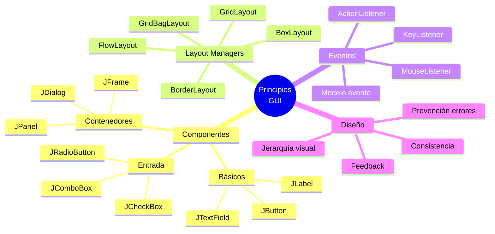

# 🖼️ Principios de las GUI

## 🎯 Introducción

> [!info]- 💡 ¿Qué es una GUI?
> 
> Una **GUI** (Graphical User Interface - Interfaz Gráfica de Usuario) es un sistema visual que permite a los usuarios interactuar con una aplicación mediante elementos gráficos como ventanas, botones, menús y campos de texto.
> 
> **Analogía del mundo real:**
> 
> - **CLI (línea de comandos)** → Como hablar por teléfono: solo voz, sin ver
> - **GUI** → Como una conversación cara a cara: gestos, expresiones, señales visuales
> 
> ```mermaid
> graph LR
>     A[Usuario] -->|Click, teclas| B[GUI<br/>Interfaz Gráfica]
>     B -->|Eventos| C[Programa<br/>Java]
>     C -->|Actualización| B
>     B -->|Feedback visual| A
>     
>     style A fill:#e1f5ff
>     style B fill:#fff4e1
>     style C fill:#e1ffe1
> ```
> 
> **Ventajas de las GUI:**
> 
> |Aspecto|CLI (Texto)|GUI (Gráfica)|
> |---|---|---|
> |**Curva de aprendizaje**|Empinada|Suave|
> |**Descubribilidad**|Debe memorizarse|✅ Visual e intuitiva|
> |**Productividad**|Alta (expertos)|Alta (todos)|
> |**Feedback**|Texto|✅ Visual inmediato|
> |**Errores**|Fácil cometer|✅ Prevención visual|

---

## 🏛️ Historia de las GUI en Java

> [!note]- 📚 Evolución de las Bibliotecas
> 
> ```mermaid
> timeline
>     title Evolución GUI en Java
>     1995 : AWT (Abstract Window Toolkit)
>            : Primera biblioteca GUI
>            : Dependiente del SO
>     1997 : Swing
>            : Componentes ligeros
>            : Look and Feel personalizable
>            : ✅ Estándar durante años
>     2008 : JavaFX
>            : GUI moderna
>            : CSS, multimedia, 3D
>            : ✅ Futuro de Java GUI
> ```
> 
> **Comparación:**
> 
> |Biblioteca|Estado|Características|Cuándo usar|
> |---|---|---|---|
> |**AWT**|Obsoleto|Pesado, limitado|❌ No recomendado|
> |**Swing**|Maduro|Amplio, estable|✅ Aplicaciones de escritorio|
> |**JavaFX**|Moderno|Rico, multimedia|✅ Aplicaciones nuevas|

---

## 🧩 Componentes Fundamentales

### 🪟 Contenedores

> [!tip]- 📦 Contenedores Principales
> 
> Los **contenedores** son componentes que pueden contener otros componentes.
> 
> ```mermaid
> graph TD
>     A[JFrame<br/>Ventana principal] --> B[JPanel<br/>Panel contenedor]
>     B --> C1[JButton]
>     B --> C2[JLabel]
>     B --> C3[JTextField]
>     
>     A --> D[JMenuBar<br/>Barra de menú]
>     
>     style A fill:#e1f5ff
>     style B fill:#fff4e1
>     style C1 fill:#e1ffe1
>     style C2 fill:#e1ffe1
>     style C3 fill:#e1ffe1
> ```
> 
> **Contenedores principales en Swing:**
> 
> |Componente|Descripción|Uso típico|
> |---|---|---|
> |`JFrame`|Ventana de nivel superior|Ventana principal de la aplicación|
> |`JPanel`|Panel contenedor ligero|Agrupar y organizar componentes|
> |`JDialog`|Ventana de diálogo|Mensajes, formularios temporales|
> |`JScrollPane`|Panel con barras de desplazamiento|Contenido que excede el espacio|
> 
> **Ejemplo básico:**
> 
> ```java
> import javax.swing.*;
> 
> public class VentanaBasica {
>     
>     public static void main(String[] args) {
>         // Crear ventana principal
>         JFrame frame = new JFrame("Mi Primera Ventana");
>         
>         // Configuración básica
>         frame.setSize(400, 300);
>         frame.setDefaultCloseOperation(JFrame.EXIT_ON_CLOSE);
>         frame.setLocationRelativeTo(null); // Centrar en pantalla
>         
>         // Crear panel
>         JPanel panel = new JPanel();
>         
>         // Agregar componentes al panel
>         JLabel etiqueta = new JLabel("¡Hola Mundo!");
>         panel.add(etiqueta);
>         
>         // Agregar panel a la ventana
>         frame.add(panel);
>         
>         // Hacer visible
>         frame.setVisible(true);
>     }
> }
> ```

### 🎨 Componentes Básicos

> [!example]- 🧰 Componentes Más Comunes
> 
> **Componentes de visualización:**
> 
> |Componente|Propósito|Ejemplo de uso|
> |---|---|---|
> |`JLabel`|Mostrar texto o imagen|Etiquetas, instrucciones|
> |`JTextArea`|Texto multilínea|Comentarios, descripciones|
> |`JList`|Lista de elementos|Selección de opciones|
> |`JTable`|Datos tabulares|Reportes, registros|
> 
> **Componentes de entrada:**
> 
> |Componente|Propósito|Ejemplo de uso|
> |---|---|---|
> |`JTextField`|Entrada de texto (1 línea)|Nombre, edad, búsqueda|
> |`JPasswordField`|Entrada de contraseña|Login, registro|
> |`JTextArea`|Entrada multilínea|Comentarios, notas|
> |`JCheckBox`|Selección múltiple|Preferencias, filtros|
> |`JRadioButton`|Selección única|Género, tipo de pago|
> |`JComboBox`|Lista desplegable|País, categoría|
> |`JSlider`|Valor numérico visual|Volumen, brillo|
> |`JSpinner`|Valor numérico con flechas|Cantidad, edad|
> 
> **Componentes de acción:**
> 
> |Componente|Propósito|Ejemplo de uso|
> |---|---|---|
> |`JButton`|Ejecutar acción|Guardar, cancelar, enviar|
> |`JToggleButton`|Botón de dos estados|Activar/desactivar|
> |`JMenuItem`|Opción de menú|Archivo → Abrir|
> 
> **Ejemplo con varios componentes:**
> 
> ```java
> import javax.swing.*;
> import java.awt.*;
> 
> public class ComponentesBasicos {
>     
>     public static void main(String[] args) {
>         JFrame frame = new JFrame("Componentes Básicos");
>         frame.setDefaultCloseOperation(JFrame.EXIT_ON_CLOSE);
>         frame.setSize(400, 300);
>         
>         // Panel principal
>         JPanel panel = new JPanel();
>         panel.setLayout(new GridLayout(5, 2, 10, 10));
>         
>         // JLabel y JTextField
>         panel.add(new JLabel("Nombre:"));
>         panel.add(new JTextField(20));
>         
>         // JLabel y JPasswordField
>         panel.add(new JLabel("Contraseña:"));
>         panel.add(new JPasswordField(20));
>         
>         // JCheckBox
>         panel.add(new JLabel(""));
>         panel.add(new JCheckBox("Recordar datos"));
>         
>         // JComboBox
>         panel.add(new JLabel("País:"));
>         String[] paises = {"Ecuador", "Colombia", "Perú", "Argentina"};
>         panel.add(new JComboBox<>(paises));
>         
>         // JButton
>         panel.add(new JLabel(""));
>         panel.add(new JButton("Registrar"));
>         
>         frame.add(panel);
>         frame.setLocationRelativeTo(null);
>         frame.setVisible(true);
>     }
> }
> ```

---

## 📐 Gestores de Diseño (Layout Managers)

> [!success]- 🎯 Organizar Componentes Automáticamente
> 
> Los **Layout Managers** controlan cómo se posicionan y dimensionan los componentes dentro de un contenedor.
> 
> **¿Por qué usar Layout Managers?**
> 
> - ✅ Adaptación automática al redimensionar
> - ✅ Consistencia entre sistemas operativos
> - ✅ Mantenimiento más fácil
> - ✅ Diseño responsivo
> 
> ```mermaid
> graph TD
>     A[Layout Managers] --> B[FlowLayout<br/>Flujo izq→der]
>     A --> C[BorderLayout<br/>5 regiones]
>     A --> D[GridLayout<br/>Cuadrícula]
>     A --> E[BoxLayout<br/>Línea/Columna]
>     A --> F[GridBagLayout<br/>Flexible complejo]
>     
>     style B fill:#e1ffe1
>     style C fill:#e1f5ff
>     style D fill:#fff4e1
>     style E fill:#ffe1f5
>     style F fill:#f5e1ff
> ```

### 🌊 FlowLayout

> [!example]- 📍 Diseño de Flujo
> 
> **Comportamiento:** Coloca componentes de izquierda a derecha, como texto en un párrafo.
> 
> ```java
> JPanel panel = new JPanel(new FlowLayout());
> panel.add(new JButton("Uno"));
> panel.add(new JButton("Dos"));
> panel.add(new JButton("Tres"));
> panel.add(new JButton("Cuatro"));
> ```
> 
> **Visual:**
> 
> ```
> ┌──────────────────────────┐
> │ [Uno] [Dos] [Tres]       │
> │ [Cuatro]                 │
> └──────────────────────────┘
> ```
> 
> **Cuándo usar:**
> 
> - Barras de herramientas simples
> - Grupos de botones
> - Componentes que no necesitan alineación estricta

### 🧭 BorderLayout

> [!example]- 🗺️ Diseño de Bordes
> 
> **Comportamiento:** Divide el contenedor en 5 regiones: NORTH, SOUTH, EAST, WEST, CENTER.
> 
> ```java
> JPanel panel = new JPanel(new BorderLayout());
> panel.add(new JButton("Norte"), BorderLayout.NORTH);
> panel.add(new JButton("Sur"), BorderLayout.SOUTH);
> panel.add(new JButton("Este"), BorderLayout.EAST);
> panel.add(new JButton("Oeste"), BorderLayout.WEST);
> panel.add(new JButton("Centro"), BorderLayout.CENTER);
> ```
> 
> **Visual:**
> 
> ```
> ┌──────────────────────────┐
> │       [Norte]            │
> ├────┬──────────────┬──────┤
> │    │              │      │
> │[O] │   [Centro]   │ [E]  │
> │    │              │      │
> ├────┴──────────────┴──────┤
> │       [Sur]              │
> └──────────────────────────┘
> ```
> 
> **Cuándo usar:**
> 
> - Diseño típico de aplicaciones (menú arriba, contenido centro, barra abajo)
> - JFrame por defecto usa BorderLayout

### 📊 GridLayout

> [!example]- 🔲 Diseño de Cuadrícula
> 
> **Comportamiento:** Organiza componentes en una cuadrícula de filas y columnas iguales.
> 
> ```java
> JPanel panel = new JPanel(new GridLayout(3, 2, 5, 5));
> // 3 filas, 2 columnas, espacio horizontal 5, vertical 5
> 
> panel.add(new JLabel("Nombre:"));
> panel.add(new JTextField());
> panel.add(new JLabel("Edad:"));
> panel.add(new JTextField());
> panel.add(new JLabel("Email:"));
> panel.add(new JTextField());
> ```
> 
> **Visual:**
> 
> ```
> ┌──────────┬──────────┐
> │ Nombre:  │ [____]   │
> ├──────────┼──────────┤
> │ Edad:    │ [____]   │
> ├──────────┼──────────┤
> │ Email:   │ [____]   │
> └──────────┴──────────┘
> ```
> 
> **Cuándo usar:**
> 
> - Calculadoras
> - Formularios simples
> - Galerías de imágenes

### 📏 BoxLayout

> [!example]- ➡️ Diseño en Línea
> 
> **Comportamiento:** Organiza componentes en una sola línea (horizontal o vertical).
> 
> ```java
> JPanel panel = new JPanel();
> panel.setLayout(new BoxLayout(panel, BoxLayout.Y_AXIS));
> // Y_AXIS = vertical, X_AXIS = horizontal
> 
> panel.add(new JButton("Primero"));
> panel.add(Box.createVerticalStrut(10)); // Espacio
> panel.add(new JButton("Segundo"));
> panel.add(Box.createVerticalStrut(10));
> panel.add(new JButton("Tercero"));
> ```
> 
> **Visual (Y_AXIS):**
> 
> ```
> ┌──────────────┐
> │  [Primero]   │
> │              │
> │  [Segundo]   │
> │              │
> │  [Tercero]   │
> └──────────────┘
> ```
> 
> **Cuándo usar:**
> 
> - Menús verticales
> - Barras laterales
> - Listas de elementos

### 🎛️ GridBagLayout

> [!tip]- 🔧 Diseño Flexible (Avanzado)
> 
> **Comportamiento:** El más flexible y complejo. Permite control total sobre posición y tamaño.
> 
> ```java
> JPanel panel = new JPanel(new GridBagLayout());
> GridBagConstraints gbc = new GridBagConstraints();
> 
> // Componente 1: fila 0, columna 0
> gbc.gridx = 0;
> gbc.gridy = 0;
> panel.add(new JLabel("Nombre:"), gbc);
> 
> // Componente 2: fila 0, columna 1, ocupa 2 columnas
> gbc.gridx = 1;
> gbc.gridwidth = 2;
> gbc.fill = GridBagConstraints.HORIZONTAL;
> panel.add(new JTextField(), gbc);
> ```
> 
> **Cuándo usar:**
> 
> - Formularios complejos
> - Cuando ningún otro layout sirve
> - Diseños muy específicos

### 🚫 Null Layout (Absoluto)

> [!warning]- ⚠️ Posicionamiento Manual
> 
> **Comportamiento:** Tú controlas la posición exacta (x, y) y tamaño de cada componente.
> 
> ```java
> JPanel panel = new JPanel();
> panel.setLayout(null); // Desactivar layout manager
> 
> JButton boton = new JButton("Click");
> boton.setBounds(50, 50, 100, 30); // x, y, ancho, alto
> panel.add(boton);
> ```
> 
> **❌ Desventajas:**
> 
> - No se adapta al redimensionar
> - Diferente en cada sistema operativo
> - Difícil de mantener
> - No recomendado
> 
> **✅ Cuándo usar:**
> 
> - Nunca (casi nunca)
> - Solo para prototipos rápidos
> - Herramientas de diseño visual generan este código

---

## 🎨 Principios de Diseño GUI

> [!tip]- 🏆 Mejores Prácticas
> 
> **1. Consistencia**
> 
> - Usar los mismos patrones en toda la aplicación
> - Botones similares deben verse iguales
> - Mismas teclas de atajo para acciones similares
> 
> **2. Feedback visual**
> 
> ```java
> boton.addActionListener(e -> {
>     boton.setEnabled(false); // Deshabilitar durante proceso
>     boton.setText("Procesando...");
>     
>     // Realizar operación...
>     
>     boton.setEnabled(true);
>     boton.setText("Guardar");
> });
> ```
> 
> **3. Prevención de errores**
> 
> ```java
> // Validar mientras el usuario escribe
> JTextField edadField = new JTextField();
> edadField.addKeyListener(new KeyAdapter() {
>     public void keyTyped(KeyEvent e) {
>         char c = e.getKeyChar();
>         if (!Character.isDigit(c)) {
>             e.consume(); // Ignorar caracteres no numéricos
>         }
>     }
> });
> ```
> 
> **4. Jerarquía visual**
> 
> ```mermaid
> graph TD
>     A[Título grande] --> B[Subtítulo mediano]
>     B --> C[Contenido normal]
>     C --> D[Notas pequeñas]
>     
>     style A fill:#e1f5ff,font-size:20px
>     style B fill:#fff4e1,font-size:16px
>     style C fill:#e1ffe1,font-size:14px
>     style D fill:#f0f0f0,font-size:12px
> ```
> 
> **5. Agrupación lógica**
> 
> ```java
> // Agrupar campos relacionados
> JPanel datosPersonales = new JPanel();
> datosPersonales.setBorder(
>     BorderFactory.createTitledBorder("Datos Personales"));
> datosPersonales.add(new JLabel("Nombre:"));
> datosPersonales.add(nombreField);
> 
> JPanel datosContacto = new JPanel();
> datosContacto.setBorder(
>     BorderFactory.createTitledBorder("Contacto"));
> datosContacto.add(new JLabel("Email:"));
> datosContacto.add(emailField);
> ```

---

## 🔄 Modelo de Eventos

> [!info]- ⚡ Programación Basada en Eventos
> 
> Las GUI funcionan con **eventos**: acciones del usuario que disparan código.
> 
> ```mermaid
> sequenceDiagram
>     participant U as Usuario
>     participant B as Botón
>     participant L as Listener
>     participant P as Programa
>     
>     U->>B: Click
>     B->>L: actionPerformed()
>     L->>P: Ejecutar código
>     P-->>U: Actualizar interfaz
> ```
> 
> **Componentes del modelo:**
> 
> |Elemento|Descripción|Ejemplo|
> |---|---|---|
> |**Event Source**|Componente que genera eventos|JButton, JTextField|
> |**Event**|Objeto que representa la acción|ActionEvent, MouseEvent|
> |**Event Listener**|Objeto que responde al evento|ActionListener, MouseListener|
> 
> **Ejemplo básico:**
> 
> ```java
> JButton boton = new JButton("Click me");
> 
> // Registrar listener
> boton.addActionListener(new ActionListener() {
>     @Override
>     public void actionPerformed(ActionEvent e) {
>         System.out.println("¡Botón clickeado!");
>     }
> });
> 
> // Versión moderna con lambda
> boton.addActionListener(e -> {
>     System.out.println("¡Botón clickeado!");
> });
> ```
> 
> **Tipos de eventos comunes:**
> 
> |Listener|Evento|Cuándo se dispara|
> |---|---|---|
> |`ActionListener`|`ActionEvent`|Click en botón, Enter en campo|
> |`MouseListener`|`MouseEvent`|Click, entrada/salida del mouse|
> |`KeyListener`|`KeyEvent`|Tecla presionada/liberada|
> |`WindowListener`|`WindowEvent`|Abrir/cerrar ventana|
> |`FocusListener`|`FocusEvent`|Componente gana/pierde foco|

---

## 🎯 Ejemplo Completo

> [!example]- 💼 Formulario de Registro
> 
> ```java
> import javax.swing.*;
> import java.awt.*;
> import java.awt.event.*;
> 
> public class FormularioRegistro extends JFrame {
>     
>     // Componentes
>     private JTextField nombreField;
>     private JTextField edadField;
>     private JTextField emailField;
>     private JComboBox<String> paisCombo;
>     private JCheckBox aceptaTerminos;
>     private JButton btnRegistrar;
>     private JTextArea areaResultado;
>     
>     public FormularioRegistro() {
>         // Configuración de la ventana
>         setTitle("Formulario de Registro");
>         setSize(500, 400);
>         setDefaultCloseOperation(JFrame.EXIT_ON_CLOSE);
>         setLocationRelativeTo(null);
>         
>         // Layout principal
>         setLayout(new BorderLayout(10, 10));
>         
>         // Panel de formulario
>         JPanel panelFormulario = crearPanelFormulario();
>         add(panelFormulario, BorderLayout.CENTER);
>         
>         // Panel de botones
>         JPanel panelBotones = crearPanelBotones();
>         add(panelBotones, BorderLayout.SOUTH);
>         
>         // Área de resultados
>         areaResultado = new JTextArea(5, 40);
>         areaResultado.setEditable(false);
>         JScrollPane scroll = new JScrollPane(areaResultado);
>         add(scroll, BorderLayout.NORTH);
>     }
>     
>     private JPanel crearPanelFormulario() {
>         JPanel panel = new JPanel(new GridLayout(5, 2, 10, 10));
>         panel.setBorder(BorderFactory.createEmptyBorder(10, 10, 10, 10));
>         
>         // Nombre
>         panel.add(new JLabel("Nombre:"));
>         nombreField = new JTextField(20);
>         panel.add(nombreField);
>         
>         // Edad
>         panel.add(new JLabel("Edad:"));
>         edadField = new JTextField(20);
>         panel.add(edadField);
>         
>         // Email
>         panel.add(new JLabel("Email:"));
>         emailField = new JTextField(20);
>         panel.add(emailField);
>         
>         // País
>         panel.add(new JLabel("País:"));
>         String[] paises = {"Ecuador", "Colombia", "Perú", "Chile", "Argentina"};
>         paisCombo = new JComboBox<>(paises);
>         panel.add(paisCombo);
>         
>         // Términos
>         panel.add(new JLabel(""));
>         aceptaTerminos = new JCheckBox("Acepto términos y condiciones");
>         panel.add(aceptaTerminos);
>         
>         return panel;
>     }
>     
>     private JPanel crearPanelBotones() {
>         JPanel panel = new JPanel(new FlowLayout(FlowLayout.CENTER));
>         
>         btnRegistrar = new JButton("Registrar");
>         btnRegistrar.addActionListener(e -> registrarUsuario());
>         
>         JButton btnLimpiar = new JButton("Limpiar");
>         btnLimpiar.addActionListener(e -> limpiarFormulario());
>         
>         panel.add(btnRegistrar);
>         panel.add(btnLimpiar);
>         
>         return panel;
>     }
>     
>     private void registrarUsuario() {
>         // Validaciones
>         if (nombreField.getText().trim().isEmpty()) {
>             mostrarError("El nombre es obligatorio");
>             return;
>         }
>         
>         if (!aceptaTerminos.isSelected()) {
>             mostrarError("Debe aceptar los términos y condiciones");
>             return;
>         }
>         
>         try {
>             int edad = Integer.parseInt(edadField.getText());
>             if (edad < 18) {
>                 mostrarError("Debe ser mayor de 18 años");
>                 return;
>             }
>         } catch (NumberFormatException e) {
>             mostrarError("La edad debe ser un número válido");
>             return;
>         }
>         
>         // Registro exitoso
>         String resultado = String.format(
>             "✅ Usuario registrado:%n" +
>             "Nombre: %s%n" +
>             "Edad: %s%n" +
>             "Email: %s%n" +
>             "País: %s%n",
>             nombreField.getText(),
>             edadField.getText(),
>             emailField.getText(),
>             paisCombo.getSelectedItem()
>         );
>         
>         areaResultado.setText(resultado);
>         limpiarFormulario();
>     }
>     
>     private void limpiarFormulario() {
>         nombreField.setText("");
>         edadField.setText("");
>         emailField.setText("");
>         paisCombo.setSelectedIndex(0);
>         aceptaTerminos.setSelected(false);
>     }
>     
>     private void mostrarError(String mensaje) {
>         JOptionPane.showMessageDialog(
>             this,
>             mensaje,
>             "Error de Validación",
>             JOptionPane.ERROR_MESSAGE
>         );
>     }
>     
>     public static void main(String[] args) {
>         SwingUtilities.invokeLater(() -> {
>             FormularioRegistro form = new FormularioRegistro();
>             form.setVisible(true);
>         });
>     }
> }
> ```

---

## 📊 Resumen Visual



---

**Tags:** #java #gui #swing #interfaz #layout #eventos #componentes #diseño