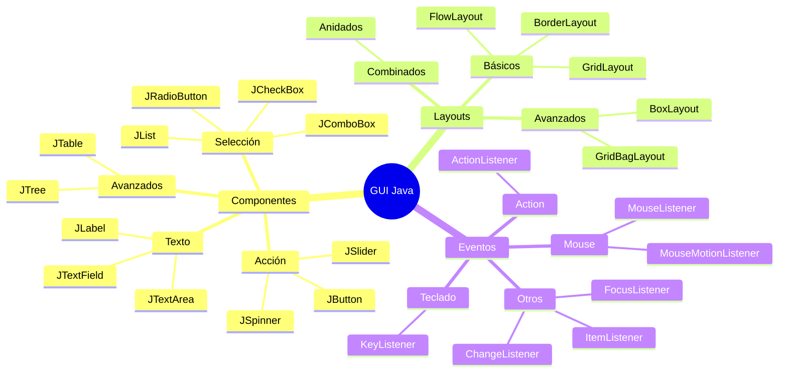

# 🎨 Componentes, Layouts y Eventos

## 🎯 Introducción

> [!info]- 💡 Los Tres Pilares de una GUI
> 
> Toda interfaz gráfica en Java se construye sobre tres conceptos fundamentales:
> 
> ```mermaid
> graph TD
>     A[GUI Completa] --> B[🧩 COMPONENTES<br/>Qué mostrar]
>     A --> C[📐 LAYOUTS<br/>Cómo organizarlo]
>     A --> D[⚡ EVENTOS<br/>Qué hacer cuando...]
>     
>     B --> B1[Botones, campos,<br/>etiquetas...]
>     C --> C1[FlowLayout,<br/>BorderLayout...]
>     D --> D1[Clicks, teclas,<br/>acciones...]
>     
>     style B fill:#e1ffe1
>     style C fill:#e1f5ff
>     style D fill:#fff4e1
> ```
> 
> **Analogía del mundo real:**
> 
> - **Componentes** → Muebles de una casa (sofá, mesa, silla)
> - **Layouts** → Disposición de los muebles (sala, comedor, dormitorio)
> - **Eventos** → Acciones que realizas (sentarte, comer, dormir)

---

## 🧩 PARTE 1: Componentes en Detalle

### 📝 Componentes de Texto

> [!example]- ✍️ Entrada y Visualización de Texto
> 
> **1. JLabel - Etiquetas**
> 
> ```java
> // Texto simple
> JLabel etiqueta1 = new JLabel("Nombre:");
> 
> // Con icono
> JLabel etiqueta2 = new JLabel("Usuario", 
>     new ImageIcon("user.png"), JLabel.LEFT);
> 
> // HTML para formato rico
> JLabel etiqueta3 = new JLabel(
>     "<html><b>Título</b><br/>Subtítulo en <i>cursiva</i></html>");
> 
> // Alineación
> etiqueta1.setHorizontalAlignment(JLabel.CENTER);
> 
> // Color y fuente
> etiqueta1.setForeground(Color.BLUE);
> etiqueta1.setFont(new Font("Arial", Font.BOLD, 16));
> ```
> 
> **2. JTextField - Campo de texto (una línea)**
> 
> ```java
> // Constructor básico
> JTextField campo1 = new JTextField(20); // 20 columnas
> 
> // Con texto inicial
> JTextField campo2 = new JTextField("Texto por defecto");
> 
> // Obtener y establecer texto
> String texto = campo1.getText();
> campo1.setText("Nuevo texto");
> 
> // Placeholder (con FocusListener)
> JTextField campo3 = new JTextField("Buscar...");
> campo3.setForeground(Color.GRAY);
> campo3.addFocusListener(new FocusAdapter() {
>     public void focusGained(FocusEvent e) {
>         if (campo3.getText().equals("Buscar...")) {
>             campo3.setText("");
>             campo3.setForeground(Color.BLACK);
>         }
>     }
>     public void focusLost(FocusEvent e) {
>         if (campo3.getText().isEmpty()) {
>             campo3.setText("Buscar...");
>             campo3.setForeground(Color.GRAY);
>         }
>     }
> });
> 
> // Solo lectura
> campo1.setEditable(false);
> ```
> 
> **3. JPasswordField - Campo de contraseña**
> 
> ```java
> JPasswordField passField = new JPasswordField(20);
> 
> // Obtener contraseña (char[] por seguridad)
> char[] password = passField.getPassword();
> String passwordStr = new String(password);
> 
> // Cambiar carácter de eco
> passField.setEchoChar('*'); // Por defecto es '•'
> ```
> 
> **4. JTextArea - Área de texto multilínea**
> 
> ```java
> // Área básica
> JTextArea area = new JTextArea(10, 30); // 10 filas, 30 columnas
> 
> // Con scroll
> JScrollPane scroll = new JScrollPane(area);
> 
> // Propiedades
> area.setLineWrap(true);              // Ajustar líneas
> area.setWrapStyleWord(true);         // Ajustar por palabras
> area.append("Texto adicional\n");    // Agregar texto
> 
> // Insertar en posición específica
> area.insert("Texto insertado", 0);
> ```
> 
> **Tabla comparativa:**
> 
> |Componente|Líneas|Uso típico|Scroll|
> |---|---|---|---|
> |`JLabel`|1+ (HTML)|Mostrar texto estático|❌|
> |`JTextField`|1|Entrada corta (nombre, edad)|❌|
> |`JPasswordField`|1|Contraseñas|❌|
> |`JTextArea`|Múltiples|Comentarios, descripciones|✅|

### 🔘 Componentes de Selección

> [!example]- ☑️ Opciones y Selecciones
> 
> **1. JCheckBox - Casillas de verificación**
> 
> ```java
> // Básico
> JCheckBox check1 = new JCheckBox("Acepto términos");
> 
> // Con estado inicial
> JCheckBox check2 = new JCheckBox("Recordar datos", true);
> 
> // Verificar estado
> if (check1.isSelected()) {
>     System.out.println("Términos aceptados");
> }
> 
> // Cambiar estado
> check1.setSelected(true);
> 
> // Evento
> check1.addItemListener(e -> {
>     if (e.getStateChange() == ItemEvent.SELECTED) {
>         System.out.println("✅ Marcado");
>     } else {
>         System.out.println("❌ Desmarcado");
>     }
> });
> ```
> 
> **2. JRadioButton - Botones de opción (selección única)**
> 
> ```java
> // Crear radio buttons
> JRadioButton rb1 = new JRadioButton("Masculino");
> JRadioButton rb2 = new JRadioButton("Femenino");
> JRadioButton rb3 = new JRadioButton("Otro", true); // Seleccionado
> 
> // IMPORTANTE: Agrupar para selección única
> ButtonGroup grupo = new ButtonGroup();
> grupo.add(rb1);
> grupo.add(rb2);
> grupo.add(rb3);
> 
> // Obtener selección
> if (rb1.isSelected()) {
>     System.out.println("Masculino seleccionado");
> }
> 
> // Iterar sobre el grupo
> for (Enumeration<AbstractButton> buttons = grupo.getElements(); 
>      buttons.hasMoreElements();) {
>     AbstractButton button = buttons.nextElement();
>     if (button.isSelected()) {
>         System.out.println("Seleccionado: " + button.getText());
>     }
> }
> ```
> 
> **3. JComboBox - Lista desplegable**
> 
> ```java
> // Con array
> String[] opciones = {"Ecuador", "Colombia", "Perú", "Chile"};
> JComboBox<String> combo1 = new JComboBox<>(opciones);
> 
> // Agregar elementos dinámicamente
> JComboBox<String> combo2 = new JComboBox<>();
> combo2.addItem("Opción 1");
> combo2.addItem("Opción 2");
> 
> // Obtener selección
> String seleccionado = (String) combo1.getSelectedItem();
> int indice = combo1.getSelectedIndex();
> 
> // Establecer selección
> combo1.setSelectedIndex(0);
> combo1.setSelectedItem("Perú");
> 
> // Editable (permite escribir)
> combo1.setEditable(true);
> 
> // Evento de selección
> combo1.addActionListener(e -> {
>     System.out.println("Seleccionado: " + combo1.getSelectedItem());
> });
> ```
> 
> **4. JList - Lista de elementos**
> 
> ```java
> // Con array
> String[] datos = {"Item 1", "Item 2", "Item 3", "Item 4"};
> JList<String> lista = new JList<>(datos);
> 
> // Con DefaultListModel (más flexible)
> DefaultListModel<String> modelo = new DefaultListModel<>();
> modelo.addElement("Elemento 1");
> modelo.addElement("Elemento 2");
> JList<String> lista2 = new JList<>(modelo);
> 
> // Con scroll
> JScrollPane scroll = new JScrollPane(lista);
> 
> // Modo de selección
> lista.setSelectionMode(ListSelectionModel.SINGLE_SELECTION);
> // SINGLE_SELECTION, SINGLE_INTERVAL_SELECTION, MULTIPLE_INTERVAL_SELECTION
> 
> // Obtener selección
> String seleccionado = lista.getSelectedValue();
> int indice = lista.getSelectedIndex();
> List<String> seleccionados = lista.getSelectedValuesList();
> 
> // Evento de selección
> lista.addListSelectionListener(e -> {
>     if (!e.getValueIsAdjusting()) {
>         String valor = lista.getSelectedValue();
>         System.out.println("Seleccionado: " + valor);
>     }
> });
> ```
> 
> **Comparación:**
> 
> |Componente|Selección|Espacio|Uso típico|
> |---|---|---|---|
> |`JCheckBox`|Múltiple independiente|Poco|Preferencias, filtros|
> |`JRadioButton`|Una del grupo|Medio|Género, método de pago|
> |`JComboBox`|Una|Poco (plegable)|País, categoría|
> |`JList`|Una o múltiple|Mucho|Archivos, contactos|

### 🔳 Componentes de Acción

> [!example]- 🖱️ Botones y Controles
> 
> **1. JButton - Botón estándar**
> 
> ```java
> // Básico
> JButton btn1 = new JButton("Guardar");
> 
> // Con icono
> JButton btn2 = new JButton("Abrir", new ImageIcon("open.png"));
> 
> // Solo icono
> JButton btn3 = new JButton(new ImageIcon("save.png"));
> btn3.setToolTipText("Guardar"); // Tooltip al pasar mouse
> 
> // Deshabilitar
> btn1.setEnabled(false);
> 
> // Tamaño
> btn1.setPreferredSize(new Dimension(100, 30));
> 
> // Evento click
> btn1.addActionListener(e -> {
>     System.out.println("Botón clickeado");
> });
> 
> // Atajo de teclado (Alt+G)
> btn1.setMnemonic(KeyEvent.VK_G);
> ```
> 
> **2. JToggleButton - Botón de dos estados**
> 
> ```java
> JToggleButton toggle = new JToggleButton("Activar");
> 
> // Verificar estado
> if (toggle.isSelected()) {
>     System.out.println("Activado");
> }
> 
> // Evento de cambio
> toggle.addItemListener(e -> {
>     if (e.getStateChange() == ItemEvent.SELECTED) {
>         toggle.setText("Desactivar");
>     } else {
>         toggle.setText("Activar");
>     }
> });
> ```
> 
> **3. JSlider - Control deslizante**
> 
> ```java
> // Rango 0-100, valor inicial 50
> JSlider slider = new JSlider(0, 100, 50);
> 
> // Orientación vertical
> JSlider sliderV = new JSlider(JSlider.VERTICAL, 0, 100, 50);
> 
> // Mostrar marcas
> slider.setMajorTickSpacing(20);  // Marcas grandes cada 20
> slider.setMinorTickSpacing(5);   // Marcas pequeñas cada 5
> slider.setPaintTicks(true);      // Dibujar marcas
> slider.setPaintLabels(true);     // Dibujar números
> 
> // Obtener valor
> int valor = slider.getValue();
> 
> // Evento de cambio
> slider.addChangeListener(e -> {
>     if (!slider.getValueIsAdjusting()) {
>         System.out.println("Valor: " + slider.getValue());
>     }
> });
> ```
> 
> **4. JSpinner - Control numérico**
> 
> ```java
> // Modelo simple con rango
> SpinnerNumberModel modelo = new SpinnerNumberModel(
>     0,    // valor inicial
>     0,    // mínimo
>     100,  // máximo
>     1     // incremento
> );
> JSpinner spinner = new JSpinner(modelo);
> 
> // Obtener valor
> int valor = (Integer) spinner.getValue();
> 
> // Establecer valor
> spinner.setValue(50);
> 
> // Evento de cambio
> spinner.addChangeListener(e -> {
>     System.out.println("Valor: " + spinner.getValue());
> });
> ```

### 📊 Componentes Avanzados

> [!example]- 🔧 Componentes Complejos
> 
> **1. JTable - Tabla de datos**
> 
> ```java
> // Datos
> String[] columnas = {"Nombre", "Edad", "Email"};
> Object[][] datos = {
>     {"Ana", 25, "ana@email.com"},
>     {"Carlos", 30, "carlos@email.com"},
>     {"María", 28, "maria@email.com"}
> };
> 
> // Crear tabla
> JTable tabla = new JTable(datos, columnas);
> 
> // Con scroll
> JScrollPane scroll = new JScrollPane(tabla);
> 
> // No editable
> tabla.setEnabled(false);
> 
> // Obtener selección
> int fila = tabla.getSelectedRow();
> if (fila != -1) {
>     String nombre = (String) tabla.getValueAt(fila, 0);
>     System.out.println("Seleccionado: " + nombre);
> }
> 
> // Modelo personalizado (más control)
> DefaultTableModel modelo = new DefaultTableModel(datos, columnas);
> JTable tabla2 = new JTable(modelo);
> 
> // Agregar fila
> modelo.addRow(new Object[]{"Luis", 35, "luis@email.com"});
> 
> // Eliminar fila
> modelo.removeRow(0);
> ```
> 
> **2. JTree - Árbol jerárquico**
> 
> ```java
> // Nodo raíz
> DefaultMutableTreeNode raiz = new DefaultMutableTreeNode("Root");
> 
> // Nodos hijos
> DefaultMutableTreeNode carpeta1 = new DefaultMutableTreeNode("Carpeta 1");
> DefaultMutableTreeNode carpeta2 = new DefaultMutableTreeNode("Carpeta 2");
> 
> raiz.add(carpeta1);
> raiz.add(carpeta2);
> 
> // Archivos
> carpeta1.add(new DefaultMutableTreeNode("archivo1.txt"));
> carpeta1.add(new DefaultMutableTreeNode("archivo2.txt"));
> 
> // Crear árbol
> JTree arbol = new JTree(raiz);
> JScrollPane scroll = new JScrollPane(arbol);
> 
> // Evento de selección
> arbol.addTreeSelectionListener(e -> {
>     DefaultMutableTreeNode nodo = (DefaultMutableTreeNode)
>         arbol.getLastSelectedPathComponent();
>     if (nodo != null) {
>         System.out.println("Seleccionado: " + nodo.getUserObject());
>     }
> });
> ```
> 
> **3. JProgressBar - Barra de progreso**
> 
> ```java
> // Rango 0-100
> JProgressBar progress = new JProgressBar(0, 100);
> progress.setValue(0);
> progress.setStringPainted(true); // Mostrar porcentaje
> 
> // Simular progreso
> Timer timer = new Timer(100, e -> {
>     int valor = progress.getValue();
>     if (valor < 100) {
>         progress.setValue(valor + 1);
>     }
> });
> timer.start();
> 
> // Modo indeterminado (animación continua)
> progress.setIndeterminate(true);
> ```

---

## 📐 PARTE 2: Layouts en Profundidad

### 🎯 Layouts Básicos Detallados

> [!success]- 📏 FlowLayout - Flujo Natural
> 
> ```java
> // Constructor con alineación
> FlowLayout layout = new FlowLayout(FlowLayout.CENTER, 10, 5);
> // CENTER, LEFT, RIGHT, LEADING, TRAILING
> // 10 = espacio horizontal, 5 = espacio vertical
> 
> JPanel panel = new JPanel(layout);
> 
> // Agregar componentes
> panel.add(new JButton("Uno"));
> panel.add(new JButton("Dos"));
> panel.add(new JButton("Tres"));
> panel.add(new JButton("Cuatro"));
> panel.add(new JButton("Cinco"));
> ```
> 
> **Visual al redimensionar:**
> 
> ```
> Ventana ancha:
> ┌─────────────────────────────┐
> │ [Uno] [Dos] [Tres] [Cuatro] │
> │ [Cinco]                     │
> └─────────────────────────────┘
> 
> Ventana estrecha:
> ┌───────────┐
> │ [Uno]     │
> │ [Dos]     │
> │ [Tres]    │
> │ [Cuatro]  │
> │ [Cinco]   │
> └───────────┘
> ```
> 
> **Cuándo usar:**
> 
> - ✅ Barras de herramientas
> - ✅ Grupos de botones pequeños
> - ❌ Formularios (usar GridLayout)
> - ❌ Diseños complejos

> [!success]- 🧭 BorderLayout - Cinco Regiones
> 
> ```java
> JPanel panel = new JPanel(new BorderLayout(10, 10));
> // 10 = espacio horizontal, 10 = espacio vertical
> 
> // Agregar en cada región
> panel.add(new JButton("Norte"), BorderLayout.NORTH);
> panel.add(new JButton("Sur"), BorderLayout.SOUTH);
> panel.add(new JButton("Este"), BorderLayout.EAST);
> panel.add(new JButton("Oeste"), BorderLayout.WEST);
> panel.add(new JButton("Centro"), BorderLayout.CENTER);
> ```
> 
> **Comportamiento al redimensionar:**
> 
> - `NORTH` y `SOUTH`: Ancho completo, alto preferido
> - `EAST` y `WEST`: Alto completo, ancho preferido
> - `CENTER`: Toma todo el espacio restante
> 
> **Patrón típico de aplicación:**
> 
> ```java
> JFrame frame = new JFrame("Mi App");
> frame.setLayout(new BorderLayout());
> 
> // Menú superior
> JMenuBar menuBar = new JMenuBar();
> frame.setJMenuBar(menuBar);
> 
> // Barra de herramientas
> JToolBar toolBar = new JToolBar();
> frame.add(toolBar, BorderLayout.NORTH);
> 
> // Área principal
> JTextArea areaTexto = new JTextArea();
> frame.add(new JScrollPane(areaTexto), BorderLayout.CENTER);
> 
> // Barra lateral
> JPanel panelLateral = new JPanel();
> frame.add(panelLateral, BorderLayout.EAST);
> 
> // Barra de estado
> JLabel estado = new JLabel("Listo");
> frame.add(estado, BorderLayout.SOUTH);
> ```

> [!success]- 🔲 GridLayout - Cuadrícula Uniforme
> 
> ```java
> // 3 filas, 2 columnas, espacio 5px
> GridLayout layout = new GridLayout(3, 2, 5, 5);
> JPanel panel = new JPanel(layout);
> 
> // IMPORTANTE: Todos los componentes tienen el mismo tamaño
> panel.add(new JLabel("Nombre:"));
> panel.add(new JTextField());
> panel.add(new JLabel("Edad:"));
> panel.add(new JTextField());
> panel.add(new JLabel("Email:"));
> panel.add(new JTextField());
> ```
> 
> **Variantes:**
> 
> ```java
> // Filas flexibles (0 = auto-calcular)
> GridLayout layout1 = new GridLayout(0, 2); // 2 columnas, filas auto
> 
> // Columnas flexibles
> GridLayout layout2 = new GridLayout(3, 0); // 3 filas, columnas auto
> ```
> 
> **Ejemplo: Calculadora**
> 
> ```java
> JPanel panelBotones = new JPanel(new GridLayout(4, 4, 5, 5));
> String[] botones = {
>     "7", "8", "9", "/",
>     "4", "5", "6", "*",
>     "1", "2", "3", "-",
>     "0", ".", "=", "+"
> };
> 
> for (String texto : botones) {
>     JButton btn = new JButton(texto);
>     panelBotones.add(btn);
> }
> ```

### 🎨 Layouts Avanzados

> [!success]- 📦 BoxLayout - Línea Flexible
> 
> ```java
> JPanel panel = new JPanel();
> panel.setLayout(new BoxLayout(panel, BoxLayout.Y_AXIS));
> // Y_AXIS = vertical, X_AXIS = horizontal
> 
> // Agregar componentes
> panel.add(new JButton("Primero"));
> panel.add(Box.createVerticalStrut(10)); // Espacio fijo
> panel.add(new JButton("Segundo"));
> panel.add(Box.createVerticalGlue());    // Espacio flexible
> panel.add(new JButton("Tercero"));
> ```
> 
> **Espaciadores útiles:**
> 
> ```java
> // Espacio vertical fijo
> Box.createVerticalStrut(10);
> 
> // Espacio horizontal fijo
> Box.createHorizontalStrut(10);
> 
> // Espacio vertical flexible (empuja componentes)
> Box.createVerticalGlue();
> 
> // Espacio horizontal flexible
> Box.createHorizontalGlue();
> 
> // Espacio rígido (ancho y alto)
> Box.createRigidArea(new Dimension(10, 10));
> ```
> 
> **Alineación:**
> 
> ```java
> JButton btn = new JButton("Alineado");
> btn.setAlignmentX(Component.CENTER_ALIGNMENT);
> // LEFT_ALIGNMENT, CENTER_ALIGNMENT, RIGHT_ALIGNMENT
> ```

> [!success]- 🔧 GridBagLayout - Control Total
> 
> ```java
> JPanel panel = new JPanel(new GridBagLayout());
> GridBagConstraints gbc = new GridBagConstraints();
> 
> // Configuración común
> gbc.insets = new Insets(5, 5, 5, 5); // Márgenes
> gbc.fill = GridBagConstraints.HORIZONTAL;
> 
> // Etiqueta "Nombre:" - Fila 0, Columna 0
> gbc.gridx = 0;
> gbc.gridy = 0;
> gbc.weightx = 0.3;
> panel.add(new JLabel("Nombre:"), gbc);
> 
> // Campo de texto - Fila 0, Columna 1, ocupa 2 columnas
> gbc.gridx = 1;
> gbc.gridwidth = 2;
> gbc.weightx = 0.7;
> panel.add(new JTextField(), gbc);
> 
> // Botón "Guardar" - Fila 2, Columnas 1-2
> gbc.gridy = 2;
> gbc.gridwidth = 2;
> gbc.fill = GridBagConstraints.NONE;
> gbc.anchor = GridBagConstraints.CENTER;
> panel.add(new JButton("Guardar"), gbc);
> ```
> 
> **Propiedades clave de GridBagConstraints:**
> 
> |Propiedad|Descripción|Valores|
> |---|---|---|
> |`gridx, gridy`|Posición en cuadrícula|0, 1, 2...|
> |`gridwidth, gridheight`|Celdas que ocupa|1, 2, REMAINDER, RELATIVE|
> |`fill`|Cómo llenar el espacio|NONE, HORIZONTAL, VERTICAL, BOTH|
> |`anchor`|Dónde anclar si no llena|CENTER, NORTH, SOUTH, EAST, WEST|
> |`weightx, weighty`|Distribución espacio extra|0.0 a 1.0|
> |`insets`|Márgenes externos|new Insets(top, left, bottom, right)|
> |`ipadx, ipady`|Padding interno|Píxeles|

### 🎭 Combinación de Layouts

> [!tip]- 🏗️ Layouts Anidados (Patrón Común)
> 
> ```java
> public class FormularioComplejo extends JFrame {
>     
>     public FormularioComplejo() {
>         setTitle("Formulario Complejo");
>         setLayout(new BorderLayout(10, 10));
>         
>         // Panel superior con título
>         JPanel panelTitulo = new JPanel(new FlowLayout());
>         panelTitulo.add(new JLabel("=== REGISTRO DE USUARIO ==="));
>         add(panelTitulo, BorderLayout.NORTH);
>         
>         // Panel central con formulario
>         JPanel panelFormulario = crearPanelFormulario();
>         add(panelFormulario, BorderLayout.CENTER);
>         
>         // Panel inferior con botones
>         JPanel panelBotones = new JPanel(new FlowLayout(FlowLayout.RIGHT));
>         panelBotones.add(new JButton("Cancelar"));
>         panelBotones.add(new JButton("Guardar"));
>         add(panelBotones, BorderLayout.SOUTH);
>         
>         pack(); // Ajustar al tamaño preferido
>     }
>     
>     private JPanel crearPanelFormulario() {
>         JPanel panel = new JPanel(new GridLayout(4, 2, 10, 10));
>         panel.setBorder(BorderFactory.createEmptyBorder(10, 10, 10, 10));
>         
>         panel.add(new JLabel("Nombre:"));
>         panel.add(new JTextField());
>         
>         panel.add(new JLabel("Email:"));
>         panel.add(new JTextField());
>         
>         panel.add(new JLabel("País:"));
>         panel.add(new JComboBox<>(new String[]{"Ecuador", "Colombia"}));
>         
>         panel.add(new JLabel(""));
>         panel.add(new JCheckBox("Acepto términos"));
>         
>         return panel;
>     }
> }
> ```

---

## ⚡ PARTE 3: Eventos en Detalle

### 🎯 Modelo de Eventos

> [!info]- 🔄 Arquitectura de Eventos
> 
> ```mermaid
> sequenceDiagram
>     participant U as Usuario
>     participant C as Componente<br/>(Event Source)
>     participant L as Listener<br/>(Event Listener)
>     participant H as Handler<br/>(Tu código)
>     
>     U->>C: Acción (click, tecla)
>     C->>C: Crear Event Object
>     C->>L: Notificar listeners
>     L->>H: Llamar método
>     H->>H: Ejecutar lógica
>     H-->>C: Actualizar UI
>     C-->>U: Feedback visual
> ```
> 
> **Componentes del modelo:**
> 
> |Elemento|Rol|Ejemplo|
> |---|---|---|
> |**Event Source**|Genera eventos|JButton, JTextField|
> |**Event Object**|Contiene info del evento|ActionEvent, MouseEvent|
> |**Event Listener**|Interfaz que escucha|ActionListener, MouseListener|
> |**Event Handler**|Implementación que responde|Tu código|

### 🖱️ Listeners Principales

> [!example]- 📋 ActionListener - Eventos de Acción
> 
> **Uso:** Botones, menús, campos de texto (Enter), checkboxes
> 
> ```java
> // Forma 1: Clase anónima
> JButton boton1 = new JButton("Click 1");
> boton1.addActionListener(new ActionListener() {
>     @Override
>     public void actionPerformed(ActionEvent e) {
>         System.out.println("Botón 1 clickeado");
>     }
> });
> 
> // Forma 2: Lambda (Java 8+) - ✅ MÁS COMÚN
> JButton boton2 = new JButton("Click 2");
> boton2.addActionListener(e -> {
>     System.out.println("Botón 2 clickeado");
>     // Acceder al componente
>     JButton source = (JButton) e.getSource();
>     source.setText("Clickeado!");
> });
> 
> // Forma 3: Referencia a método
> JButton boton3 = new JButton("Click 3");
> boton3.addActionListener(this::manejarClick);
> private void manejarClick(ActionEvent e) { System.out.println("Método separado"); }
> 
> // Forma 4: Clase interna class MiListener implements ActionListener { public void actionPerformed(ActionEvent e) { System.out.println("Clase interna"); } } boton.addActionListener(new MiListener());
> 
> ````
> 
> **Información del evento:**
> ```java
> boton.addActionListener(e -> {
>     // Comando de acción
>     String comando = e.getActionCommand();
>     
>     // Componente que generó el evento
>     Object source = e.getSource();
>     JButton btn = (JButton) source;
>     
>     // Timestamp
>     long cuando = e.getWhen();
>     
>     // Modificadores (Ctrl, Shift, Alt)
>     int modifiers = e.getModifiers();
>     if ((modifiers & ActionEvent.CTRL_MASK) != 0) {
>         System.out.println("Ctrl presionado");
>     }
> });
> ````

> [!example]- 🖱️ MouseListener - Eventos del Mouse
> 
> **Métodos de la interfaz:**
> 
> |Método|Cuándo se dispara|
> |---|---|
> |`mouseClicked(MouseEvent e)`|Click completo (press + release)|
> |`mousePressed(MouseEvent e)`|Botón presionado|
> |`mouseReleased(MouseEvent e)`|Botón liberado|
> |`mouseEntered(MouseEvent e)`|Mouse entra al componente|
> |`mouseExited(MouseEvent e)`|Mouse sale del componente|
> 
> ```java
> JPanel panel = new JPanel();
> panel.addMouseListener(new MouseListener() {
>     @Override
>     public void mouseClicked(MouseEvent e) {
>         int x = e.getX();
>         int y = e.getY();
>         System.out.println("Click en: (" + x + ", " + y + ")");
>         
>         // Botón clickeado
>         if (e.getButton() == MouseEvent.BUTTON1) {
>             System.out.println("Botón izquierdo");
>         } else if (e.getButton() == MouseEvent.BUTTON3) {
>             System.out.println("Botón derecho");
>         }
>         
>         // Número de clicks
>         if (e.getClickCount() == 2) {
>             System.out.println("Doble click");
>         }
>     }
>     
>     @Override
>     public void mousePressed(MouseEvent e) {
>         System.out.println("Mouse presionado");
>     }
>     
>     @Override
>     public void mouseReleased(MouseEvent e) {
>         System.out.println("Mouse liberado");
>     }
>     
>     @Override
>     public void mouseEntered(MouseEvent e) {
>         panel.setBackground(Color.YELLOW);
>     }
>     
>     @Override
>     public void mouseExited(MouseEvent e) {
>         panel.setBackground(Color.WHITE);
>     }
> });
> ```
> 
> **MouseAdapter - Implementación parcial:**
> 
> ```java
> // Solo implementar los métodos que necesitas
> panel.addMouseListener(new MouseAdapter() {
>     @Override
>     public void mouseClicked(MouseEvent e) {
>         System.out.println("Solo necesito el click");
>     }
> });
> ```

> [!example]- ⌨️ KeyListener - Eventos del Teclado
> 
> **Métodos:**
> 
> |Método|Cuándo se dispara|
> |---|---|
> |`keyTyped(KeyEvent e)`|Carácter generado (a, b, 1, 2)|
> |`keyPressed(KeyEvent e)`|Tecla presionada (incluye Ctrl, Shift)|
> |`keyReleased(KeyEvent e)`|Tecla liberada|
> 
> ```java
> JTextField campo = new JTextField();
> campo.addKeyListener(new KeyAdapter() {
>     @Override
>     public void keyTyped(KeyEvent e) {
>         char c = e.getKeyChar();
>         
>         // Solo permitir dígitos
>         if (!Character.isDigit(c)) {
>             e.consume(); // Cancelar el evento
>         }
>     }
>     
>     @Override
>     public void keyPressed(KeyEvent e) {
>         int code = e.getKeyCode();
>         
>         // Detectar teclas especiales
>         if (code == KeyEvent.VK_ENTER) {
>             System.out.println("Enter presionado");
>         } else if (code == KeyEvent.VK_ESCAPE) {
>             System.out.println("Escape presionado");
>         }
>         
>         // Detectar combinaciones
>         if (e.isControlDown() && code == KeyEvent.VK_S) {
>             System.out.println("Ctrl+S - Guardar");
>             e.consume();
>         }
>     }
> });
> ```

> [!example]- 🔄 Otros Listeners Comunes
> 
> **ItemListener - Cambios de selección:**
> 
> ```java
> JCheckBox check = new JCheckBox("Opción");
> check.addItemListener(e -> {
>     if (e.getStateChange() == ItemEvent.SELECTED) {
>         System.out.println("Seleccionado");
>     } else {
>         System.out.println("Deseleccionado");
>     }
> });
> 
> JComboBox<String> combo = new JComboBox<>(new String[]{"A", "B", "C"});
> combo.addItemListener(e -> {
>     if (e.getStateChange() == ItemEvent.SELECTED) {
>         System.out.println("Seleccionado: " + e.getItem());
>     }
> });
> ```
> 
> **ChangeListener - Cambios de valor:**
> 
> ```java
> JSlider slider = new JSlider(0, 100, 50);
> slider.addChangeListener(e -> {
>     if (!slider.getValueIsAdjusting()) {
>         System.out.println("Valor final: " + slider.getValue());
>     }
> });
> 
> JSpinner spinner = new JSpinner();
> spinner.addChangeListener(e -> {
>     System.out.println("Nuevo valor: " + spinner.getValue());
> });
> ```
> 
> **FocusListener - Foco del componente:**
> 
> ```java
> JTextField campo = new JTextField();
> campo.addFocusListener(new FocusAdapter() {
>     @Override
>     public void focusGained(FocusEvent e) {
>         campo.selectAll(); // Seleccionar todo al enfocar
>     }
>     
>     @Override
>     public void focusLost(FocusEvent e) {
>         validarCampo(); // Validar al perder foco
>     }
> });
> ```
> 
> **WindowListener - Eventos de ventana:**
> 
> ```java
> frame.addWindowListener(new WindowAdapter() {
>     @Override
>     public void windowClosing(WindowEvent e) {
>         int opcion = JOptionPane.showConfirmDialog(
>             frame,
>             "¿Seguro que desea salir?",
>             "Confirmar",
>             JOptionPane.YES_NO_OPTION
>         );
>         
>         if (opcion == JOptionPane.YES_OPTION) {
>             System.exit(0);
>         }
>     }
> });
> ```

---

## 🎯 Ejemplo Completo Integrado

> [!example]- 💼 Calculadora Simple
> 
> ```java
> import javax.swing.*;
> import java.awt.*;
> import java.awt.event.*;
> 
> public class CalculadoraSimple extends JFrame {
>     
>     private JTextField display;
>     private double numero1 = 0;
>     private String operador = "";
>     private boolean iniciarNuevoNumero = true;
>     
>     public CalculadoraSimple() {
>         setTitle("Calculadora");
>         setDefaultCloseOperation(JFrame.EXIT_ON_CLOSE);
>         setLayout(new BorderLayout(5, 5));
>         
>         // Display
>         display = new JTextField("0");
>         display.setEditable(false);
>         display.setHorizontalAlignment(JTextField.RIGHT);
>         display.setFont(new Font("Arial", Font.BOLD, 24));
>         add(display, BorderLayout.NORTH);
>         
>         // Panel de botones
>         JPanel panelBotones = new JPanel(new GridLayout(4, 4, 5, 5));
>         
>         String[] botones = {
>             "7", "8", "9", "/",
>             "4", "5", "6", "*",
>             "1", "2", "3", "-",
>             "C", "0", "=", "+"
>         };
>         
>         for (String texto : botones) {
>             JButton btn = new JButton(texto);
>             btn.setFont(new Font("Arial", Font.PLAIN, 18));
>             btn.addActionListener(this::manejarBoton);
>             panelBotones.add(btn);
>         }
>         
>         add(panelBotones, BorderLayout.CENTER);
>         
>         // Teclas de atajo
>         agregarAtajos();
>         
>         pack();
>         setLocationRelativeTo(null);
>         setResizable(false);
>     }
>     
>     private void manejarBoton(ActionEvent e) {
>         String comando = e.getActionCommand();
>         
>         if (comando.matches("[0-9]")) {
>             // Número
>             if (iniciarNuevoNumero) {
>                 display.setText(comando);
>                 iniciarNuevoNumero = false;
>             } else {
>                 display.setText(display.getText() + comando);
>             }
>             
>         } else if (comando.matches("[+\\-*/]")) {
>             // Operador
>             numero1 = Double.parseDouble(display.getText());
>             operador = comando;
>             iniciarNuevoNumero = true;
>             
>         } else if (comando.equals("=")) {
>             // Calcular
>             calcular();
>             
>         } else if (comando.equals("C")) {
>             // Limpiar
>             display.setText("0");
>             numero1 = 0;
>             operador = "";
>             iniciarNuevoNumero = true;
>         }
>     }
>     
>     private void calcular() {
>         double numero2 = Double.parseDouble(display.getText());
>         double resultado = 0;
>         
>         switch (operador) {
>             case "+":
>                 resultado = numero1 + numero2;
>                 break;
>             case "-":
>                 resultado = numero1 - numero2;
>                 break;
>             case "*":
>                 resultado = numero1 * numero2;
>                 break;
>             case "/":
>                 if (numero2 != 0) {
>                     resultado = numero1 / numero2;
>                 } else {
>                     JOptionPane.showMessageDialog(this, 
>                         "No se puede dividir por cero");
>                     return;
>                 }
>                 break;
>         }
>         
>         display.setText(String.valueOf(resultado));
>         iniciarNuevoNumero = true;
>     }
>     
>     private void agregarAtajos() {
>         // Listener de teclado para toda la ventana
>         KeyboardFocusManager.getCurrentKeyboardFocusManager()
>             .addKeyEventDispatcher(e -> {
>                 if (e.getID() == KeyEvent.KEY_TYPED) {
>                     char c = e.getKeyChar();
>                     
>                     if (Character.isDigit(c) || "+-*/=".indexOf(c) >= 0) {
>                         manejarBoton(new ActionEvent(this, 
>                             ActionEvent.ACTION_PERFORMED, String.valueOf(c)));
>                         return true;
>                     } else if (c == '\n') {
>                         calcular();
>                         return true;
>                     } else if (c == 'c' || c == 'C') {
>                         manejarBoton(new ActionEvent(this, 
>                             ActionEvent.ACTION_PERFORMED, "C"));
>                         return true;
>                     }
>                 }
>                 return false;
>             });
>     }
>     
>     public static void main(String[] args) {
>         SwingUtilities.invokeLater(() -> {
>             new CalculadoraSimple().setVisible(true);
>         });
>     }
> }
> ```

---

## 📊 Resumen Visual



---

**Tags:** #java #gui #swing #componentes #layouts #eventos #actionlistener #mouselistener #keylistener
