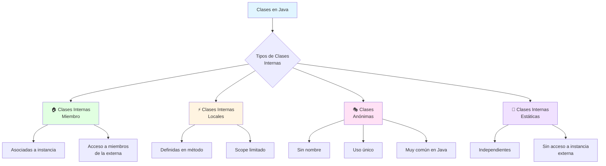
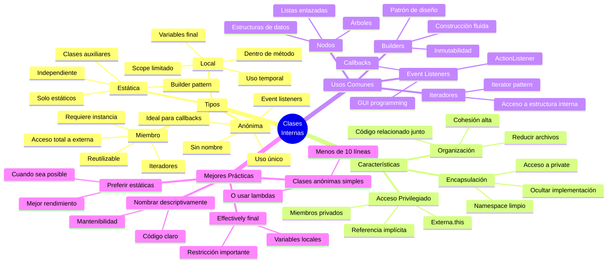

# 🎭 Clases Internas y Anónimas (Vista General)

## 🎯 Introducción

> [!info]- 💡 ¿Qué son las Clases Internas?
> 
> Las **clases internas** (inner classes) son clases definidas **dentro de otras clases**. Java permite esta estructura para modelar relaciones muy estrechas entre componentes y crear código más organizado y encapsulado.
> 
> **Analogía del mundo real:** Piensa en una casa con habitaciones:
> 
> - **La casa** → Clase externa (contenedor principal)
> - **Las habitaciones** → Clases internas (componentes internos)
> - **Los muebles en cada habitación** → Objetos de las clases internas
> - Las habitaciones tienen acceso a los recursos de la casa, pero no existen independientemente
> 
> **¿Por qué usar clases internas?**
> 
> |Razón|Descripción|Ejemplos Reales|
> |---|---|---|
> |**Encapsulación fuerte**|Ocultar implementación interna|Nodo en una lista enlazada|
> |**Acceso privilegiado**|Acceder a miembros privados de la clase externa|Iteradores personalizados|
> |**Organización lógica**|Agrupar clases relacionadas|Event listeners en interfaces gráficas|
> |**Código más legible**|Clases auxiliares cerca de donde se usan|Comparadores específicos|
> |**Reducir namespace**|Evitar contaminación del espacio de nombres|Clases helper internas|



---

## 🗺️ Panorama General: Tipos de Clases Internas

### 📊 Jerarquía y Clasificación

> [!note]- 🌳 Organización de Clases Internas
> 
> ```mermaid
> classDiagram
>     class ClaseExterna {
>         -atributoPrivado
>         +metodoPublico()
>         // Puede contener:
>     }
>     
>     class ClaseInternaMiembro {
>         <<Inner Class>>
>         Accede a toda la clase externa
>         Requiere instancia de externa
>     }
>     
>     class ClaseInternaLocal {
>         <<Local Class>>
>         Solo en método/bloque
>         Variables finales/effectively final
>     }
>     
>     class ClaseAnonima {
>         <<Anonymous Class>>
>         Sin nombre explícito
>         Implementa/extiende al vuelo
>     }
>     
>     class ClaseInternaEstatica {
>         <<Static Nested Class>>
>         No accede a instancia externa
>         Funciona como clase normal
>     }
>     
>     ClaseExterna *-- ClaseInternaMiembro
>     ClaseExterna *-- ClaseInternaLocal
>     ClaseExterna *-- ClaseAnonima
>     ClaseExterna *-- ClaseInternaEstatica
> ```
> 
> **Comparación de características:**
> 
> |Tipo|Ubicación|Acceso a Externa|Cuándo Usar|Frecuencia|
> |---|---|---|---|---|
> |**Miembro**|Dentro de clase|✅ Total|Relación fuerte|⭐⭐⭐|
> |**Local**|Dentro de método|✅ Limitado|Uso muy específico|⭐⭐|
> |**Anónima**|En expresión|✅ Limitado|✅ **Implementación rápida**|⭐⭐⭐⭐⭐|
> |**Estática**|Dentro de clase|❌ Solo estáticos|Clase auxiliar independiente|⭐⭐⭐|

### 🔄 Flujo de Creación y Uso

> [!example]- ⚡ Cómo se Relacionan las Clases
> 
> **Ciclo de vida de clases internas:**
> 
> ```mermaid
> sequenceDiagram
>     participant M as Main/Cliente
>     participant E as ClaseExterna
>     participant I as ClaseInterna
>     
>     M->>E: new ClaseExterna()
>     E->>E: Constructor ejecutado
>     Note over E: Instancia externa creada
>     
>     M->>E: externa.new ClaseInterna()
>     E->>I: Constructor ejecutado
>     Note over I: Instancia interna creada
>     Note over I: Tiene referencia a externa
>     
>     M->>I: interna.metodo()
>     I->>E: Accede a miembros privados
>     E-->>I: Datos compartidos
>     I-->>M: Resultado
> ```
> 
> **Niveles de acceso:**
> 
> |Desde → Hacia|Clase Externa|Clase Interna|Mundo Exterior|
> |---|---|---|---|
> |**Clase Externa**|✅ Todo|✅ Todo (incluso private)|Según modificadores|
> |**Clase Interna**|✅ Todo (incluso private)|✅ Propio|Según modificadores|
> |**Mundo Exterior**|Según modificadores|Según modificadores|-|

---

## 🏠 Tipo 1: Clases Internas Miembro

### 📝 Definición y Sintaxis

> [!tip]- 🎯 Clases Internas No Estáticas
> 
> Una **clase interna miembro** se define como un miembro más de la clase externa, junto con atributos y métodos. Cada instancia de la clase interna está **asociada a una instancia específica** de la clase externa.
> 
> **Sintaxis básica:**
> 
> ```java
> public class ClaseExterna {
>     private int datoExterno = 100;
>     
>     // Clase interna miembro
>     public class ClaseInterna {
>         private int datoInterno = 200;
>         
>         public void mostrarDatos() {
>             // ✅ Acceso directo a miembros de la externa
>             System.out.println("Dato externo: " + datoExterno);
>             System.out.println("Dato interno: " + datoInterno);
>             
>             // Referencia explícita a la clase externa
>             System.out.println("Externa: " + ClaseExterna.this.datoExterno);
>         }
>     }
>     
>     public void usarInterna() {
>         ClaseInterna interna = new ClaseInterna();
>         interna.mostrarDatos();
>     }
> }
> ```
> 
> **Características clave:**
> 
> ```mermaid
> graph TD
>     A[Clase Interna<br/>Miembro] --> B[Acceso a TODO<br/>de la externa]
>     A --> C[Requiere instancia<br/>de externa]
>     A --> D[Puede tener cualquier<br/>modificador]
>     A --> E[Referencia implícita<br/>Externa.this]
>     
>     B --> B1[Atributos privados]
>     B --> B2[Métodos privados]
>     B --> B3[Otros miembros internos]
>     
>     style A fill:#e1ffe1
>     style B fill:#e1f5ff
> ```

### 🛠️ Creación e Instanciación

> [!success]- 🔨 Cómo Crear Instancias
> 
> **1. Desde dentro de la clase externa:**
> 
> ```java
> public class Empresa {
>     private String nombre = "TechCorp";
>     
>     public class Empleado {
>         private String nombreEmpleado;
>         
>         public Empleado(String nombre) {
>             this.nombreEmpleado = nombre;
>         }
>         
>         public void mostrarInfo() {
>             // Acceso directo al nombre de la empresa
>             System.out.println(nombreEmpleado + " trabaja en " + nombre);
>         }
>     }
>     
>     public void contratar(String nombre) {
>         // ✅ Sintaxis simple desde la externa
>         Empleado emp = new Empleado(nombre);
>         emp.mostrarInfo();
>     }
> }
> ```
> 
> **2. Desde fuera de la clase externa:**
> 
> ```java
> public class Main {
>     public static void main(String[] args) {
>         // Primero crear instancia de la externa
>         Empresa empresa = new Empresa();
>         
>         // ✅ Sintaxis especial: externa.new Interna()
>         Empresa.Empleado emp1 = empresa.new Empleado("Ana");
>         emp1.mostrarInfo();
>         
>         // También se puede hacer en una línea
>         Empresa.Empleado emp2 = new Empresa().new Empleado("Carlos");
>         emp2.mostrarInfo();
>     }
> }
> ```
> 
> **Comparación de sintaxis:**
> 
> |Ubicación|Sintaxis|Explicación|
> |---|---|---|
> |**Dentro de externa**|`new ClaseInterna()`|Usa la instancia actual implícitamente|
> |**Fuera de externa**|`externa.new ClaseInterna()`|Requiere referencia explícita|
> |**Tipo de variable**|`Externa.Interna variable`|Tipo cualificado completo|
> 
> **Flujo de creación:**
> 
> ```mermaid
> flowchart LR
>     A[1. Crear<br/>ClaseExterna] --> B[2. Obtener<br/>referencia externa]
>     B --> C[3. Usar externa.new<br/>ClaseInterna]
>     C --> D[4. Instancia interna<br/>creada]
>     D --> E[5. Vinculada a<br/>instancia externa]
>     
>     style A fill:#fff4e1
>     style C fill:#e1f5ff
>     style E fill:#e1ffe1
> ```

### 💼 Casos de Uso Reales

> [!example]- 🎯 Ejemplos Prácticos
> 
> **Ejemplo 1: Iterador personalizado**
> 
> ```java
> public class ListaPersonalizada<T> {
>     private T[] elementos;
>     private int tamaño;
>     
>     @SuppressWarnings("unchecked")
>     public ListaPersonalizada(int capacidad) {
>         elementos = (T[]) new Object[capacidad];
>         tamaño = 0;
>     }
>     
>     public void agregar(T elemento) {
>         if (tamaño < elementos.length) {
>             elementos[tamaño++] = elemento;
>         }
>     }
>     
>     // Clase interna: Iterador personalizado
>     public class Iterador {
>         private int posicionActual = 0;
>         
>         public boolean tieneSiguiente() {
>             return posicionActual < tamaño;
>         }
>         
>         public T siguiente() {
>             if (!tieneSiguiente()) {
>                 throw new IllegalStateException("No hay más elementos");
>             }
>             // ✅ Acceso directo al array privado de la externa
>             return elementos[posicionActual++];
>         }
>         
>         public void reiniciar() {
>             posicionActual = 0;
>         }
>     }
>     
>     public Iterador obtenerIterador() {
>         return new Iterador();
>     }
> }
> 
> // Uso
> public class Main {
>     public static void main(String[] args) {
>         ListaPersonalizada<String> lista = new ListaPersonalizada<>(5);
>         lista.agregar("Java");
>         lista.agregar("Python");
>         lista.agregar("JavaScript");
>         
>         ListaPersonalizada<String>.Iterador it = lista.obtenerIterador();
>         
>         while (it.tieneSiguiente()) {
>             System.out.println(it.siguiente());
>         }
>     }
> }
> ```
> 
> **Ejemplo 2: Estructura de datos compleja**
> 
> ```java
> public class ArbolBinario {
>     // Clase interna: Nodo del árbol
>     private class Nodo {
>         int valor;
>         Nodo izquierdo;
>         Nodo derecho;
>         
>         Nodo(int valor) {
>             this.valor = valor;
>         }
>     }
>     
>     private Nodo raiz;
>     
>     public void insertar(int valor) {
>         raiz = insertarRecursivo(raiz, valor);
>     }
>     
>     private Nodo insertarRecursivo(Nodo nodo, int valor) {
>         if (nodo == null) {
>             return new Nodo(valor); // ✅ Clase interna usada internamente
>         }
>         
>         if (valor < nodo.valor) {
>             nodo.izquierdo = insertarRecursivo(nodo.izquierdo, valor);
>         } else {
>             nodo.derecho = insertarRecursivo(nodo.derecho, valor);
>         }
>         
>         return nodo;
>     }
>     
>     public void recorrerEnOrden() {
>         recorrerEnOrdenRecursivo(raiz);
>     }
>     
>     private void recorrerEnOrdenRecursivo(Nodo nodo) {
>         if (nodo != null) {
>             recorrerEnOrdenRecursivo(nodo.izquierdo);
>             System.out.print(nodo.valor + " ");
>             recorrerEnOrdenRecursivo(nodo.derecho);
>         }
>     }
> }
> ```
> 
> **Ventajas de usar clase interna:**
> 
> |Aspecto|Con Clase Interna|Sin Clase Interna|
> |---|---|---|
> |**Encapsulación**|✅ Nodo oculto completamente|❌ Nodo expuesto públicamente|
> |**Acceso**|✅ Directo a estructura|❌ Getters/setters necesarios|
> |**Namespace**|✅ ArbolBinario.Nodo|❌ NodoArbolBinario (polucionado)|
> |**Cohesión**|✅ Alta - juntos en mismo archivo|❌ Baja - archivos separados|

---

## ⚡ Tipo 2: Clases Internas Locales

### 📝 Definición y Alcance

> [!tip]- 🔍 Clases Dentro de Métodos
> 
> Una **clase interna local** se define **dentro de un método o bloque de código**. Su alcance se limita al bloque donde fue declarada y es útil para lógica muy específica.
> 
> **Sintaxis básica:**
> 
> ```java
> public class ClaseExterna {
>     
>     public void metodoConClaseLocal() {
>         final String mensaje = "Hola desde método";
>         int contador = 0; // effectively final (no se modifica)
>         
>         // Clase interna local
>         class ClaseLocal {
>             void mostrar() {
>                 // ✅ Acceso a variables finales/effectively final
>                 System.out.println(mensaje);
>                 System.out.println("Contador: " + contador);
>                 
>                 // ❌ ERROR: No puede modificar variables locales
>                 // contador++;
>             }
>         }
>         
>         // Usar la clase local
>         ClaseLocal obj = new ClaseLocal();
>         obj.mostrar();
>         
>     } // ← La clase local solo existe hasta aquí
> }
> ```
> 
> **Restricciones importantes:**
> 
> ```mermaid
> graph TD
>     A[Clase Interna<br/>Local] --> B[Solo variables<br/>final/effectively final]
>     A --> C[No puede tener<br/>modificadores estáticos]
>     A --> D[Scope limitado<br/>al bloque]
>     A --> E[Acceso a miembros<br/>de la externa]
>     
>     B --> B1[final String x]
>     B --> B2[int y - no modificada]
>     
>     C --> C1[❌ No static]
>     C --> C2[❌ No public/private<br/>en la definición]
>     
>     style A fill:#fff4e1
>     style B fill:#ffe1e1
> ```
> 
> **Effectively final:** Una variable que no se declara como `final` pero nunca se modifica después de su inicialización. Java 8+ permite usarlas en clases internas locales.

### 🛠️ Casos de Uso

> [!example]- 💡 Cuándo Usar Clases Locales
> 
> **Ejemplo 1: Comparador temporal**
> 
> ```java
> public class GestorPersonas {
>     private List<Persona> personas = new ArrayList<>();
>     
>     public void ordenarPorEdad() {
>         // Clase local para comparación específica
>         class ComparadorEdad implements Comparator<Persona> {
>             @Override
>             public int compare(Persona p1, Persona p2) {
>                 return Integer.compare(p1.getEdad(), p2.getEdad());
>             }
>         }
>         
>         Collections.sort(personas, new ComparadorEdad());
>         System.out.println("✅ Ordenado por edad");
>     }
>     
>     public void ordenarPorNombre() {
>         // Otra clase local diferente
>         class ComparadorNombre implements Comparator<Persona> {
>             @Override
>             public int compare(Persona p1, Persona p2) {
>                 return p1.getNombre().compareTo(p2.getNombre());
>             }
>         }
>         
>         Collections.sort(personas, new ComparadorNombre());
>         System.out.println("✅ Ordenado por nombre");
>     }
> }
> ```
> 
> **Ejemplo 2: Validador específico**
> 
> ```java
> public class FormularioRegistro {
>     
>     public boolean validarEmail(String email) {
>         final int longitudMinima = 5;
>         final String dominioPermitido = "@empresa.com";
>         
>         // Clase local para validación
>         class ValidadorEmail {
>             boolean esValido(String email) {
>                 if (email == null || email.length() < longitudMinima) {
>                     return false;
>                 }
>                 return email.endsWith(dominioPermitido);
>             }
>             
>             String obtenerMensajeError(String email) {
>                 if (email == null || email.length() < longitudMinima) {
>                     return "Email demasiado corto";
>                 }
>                 if (!email.endsWith(dominioPermitido)) {
>                     return "Debe usar dominio " + dominioPermitido;
>                 }
>                 return "Email válido";
>             }
>         }
>         
>         ValidadorEmail validador = new ValidadorEmail();
>         boolean resultado = validador.esValido(email);
>         System.out.println(validador.obtenerMensajeError(email));
>         
>         return resultado;
>     }
> }
> ```
> 
> **Cuándo elegir clases locales:**
> 
> |Situación|Usar Clase Local|Alternativa Mejor|
> |---|---|---|
> |Lógica usada 1 vez|✅ Sí|-|
> |Necesita variables del método|✅ Sí|-|
> |Lógica compleja (>20 líneas)|❌ No|Clase interna miembro|
> |Reutilizable en varios métodos|❌ No|Clase interna miembro|
> |Muy simple (<10 líneas)|❌ No|✅ Clase anónima|

---

## 🎭 Tipo 3: Clases Anónimas

### 📝 Concepto y Sintaxis

> [!tip]- 🎨 Clases Sin Nombre
> 
> Una **clase anónima** es una clase **sin nombre** que se declara e instancia en una sola expresión. Se usa para implementar interfaces o extender clases de forma rápida y directa.
> 
> **Sintaxis básica:**
> 
> ```java
> // Forma tradicional con clase nombrada
> class MiComparador implements Comparator<String> {
>     @Override
>     public int compare(String s1, String s2) {
>         return s1.length() - s2.length();
>     }
> }
> Comparator<String> comp1 = new MiComparador();
> 
> // ✅ Forma con clase anónima
> Comparator<String> comp2 = new Comparator<String>() {
>     @Override
>     public int compare(String s1, String s2) {
>         return s1.length() - s2.length();
>     }
> };
> ```
> 
> **Estructura visual:**
> 
> ```mermaid
> flowchart LR
>     A[new Interface/Class] --> B[Paréntesis<br/>constructor]
>     B --> C[Llaves: cuerpo<br/>de la clase]
>     C --> D[Implementar<br/>métodos]
>     D --> E[Punto y coma<br/>final;]
>     
>     style A fill:#fff4e1
>     style C fill:#e1f5ff
>     style E fill:#ffe1e1
> ```
> 
> **Características:**
> 
> |Aspecto|Descripción|
> |---|---|
> |**Nombre**|❌ No tiene nombre explícito|
> |**Declaración**|✅ En una sola expresión|
> |**Reutilización**|❌ No se puede reutilizar|
> |**Herencia**|✅ Extiende una clase O implementa interfaz|
> |**Uso típico**|Event listeners, callbacks, comparadores|

### 🛠️ Implementar Interfaces

> [!success]- 🎯 Caso Más Común: Interfaces
> 
> **Ejemplo 1: Runnable para hilos**
> 
> ```java
> public class EjemplosAnonimas {
>     
>     public void iniciarHilo() {
>         // ✅ Clase anónima implementando Runnable
>         Thread hilo = new Thread(new Runnable() {
>             @Override
>             public void run() {
>                 for (int i = 1; i <= 5; i++) {
>                     System.out.println("Contando: " + i);
>                     try {
>                         Thread.sleep(1000);
>                     } catch (InterruptedException e) {
>                         e.printStackTrace();
>                     }
>                 }
>             }
>         });
>         
>         hilo.start();
>         System.out.println("✅ Hilo iniciado");
>     }
> }
> ```
> 
> **Ejemplo 2: Event listeners en GUI**
> 
> ```java
> import javax.swing.*;
> import java.awt.event.*;
> 
> public class VentanaSimple {
>     
>     public void crearVentana() {
>         JFrame frame = new JFrame("Mi Aplicación");
>         JButton boton = new JButton("Click aquí");
>         
>         // ✅ Clase anónima como ActionListener
>         boton.addActionListener(new ActionListener() {
>             private int clicks = 0;
>             
>             @Override
>             public void actionPerformed(ActionEvent e) {
>                 clicks++;
>                 System.out.println("Botón clickeado " + clicks + " veces");
>                 
>                 if (clicks >= 5) {
>                     JOptionPane.showMessageDialog(frame, 
>                         "¡Has hecho 5 clicks!");
>                 }
>             }
>         });
>         
>         frame.add(boton);
>         frame.setSize(300, 200);
>         frame.setDefaultCloseOperation(JFrame.EXIT_ON_CLOSE);
>         frame.setVisible(true);
>     }
> }
> ```
> 
> **Ejemplo 3: Comparadores personalizados**
> 
> ```java
> public class OrdenamientoEjemplos {
>     
>     public void ordenarPersonas() {
>         List<Persona> personas = Arrays.asList(
>             new Persona("Ana", 25),
>             new Persona("Carlos", 30),
>             new Persona("Beatriz", 22)
>         );
>         
>         // ✅ Ordenar por edad (clase anónima)
>         Collections.sort(personas, new Comparator<Persona>() {
>             @Override
>             public int compare(Persona p1, Persona p2) {
>                 return Integer.compare(p1.getEdad(), p2.getEdad());
>             }
>         });
>         
>         System.out.println("Ordenado por edad:");
>         personas.forEach(System.out::println);
>         
>         // ✅ Ordenar por nombre (otra clase anónima)
>         Collections.sort(personas, new Comparator<Persona>() {
>             @Override
>             public int compare(Persona p1, Persona p2) {
>                 return p1.getNombre().compareTo(p2.getNombre());
>             }
>         });
>         
>         System.out.println("\nOrdenado por nombre:");
>         personas.forEach(System.out::println);
>     }
> }
> ```

### 🔄 Extender Clases

> [!example]- 🏗️ Heredar de Clases Concretas
> 
> **Ejemplo: Personalizar comportamiento de clase base**
> 
> ```java
> // Clase base
> abstract class Vehiculo {
>     private String marca;
>     
>     public Vehiculo(String marca) {
>         this.marca = marca;
>     }
>     
>     public String getMarca() {
>         return marca;
>     }
>     
>     public abstract void acelerar();
>     public abstract void frenar();
> }
> 
> // Uso con clases anónimas
> public class PruebaVehiculos {
>     
>     public void probar() {
>         // ✅ Clase anónima extendiendo clase abstracta
>         Vehiculo auto = new Vehiculo("Toyota") {
>             private int velocidad = 0;
>             
>             @Override
>             public void acelerar() {
>                 velocidad += 10;
>                 System.out.println(getMarca() + " acelerando. Velocidad: " + 
>                                  velocidad + " km/h");
>             }
>             
>             @Override
>             public void frenar() {
>                 velocidad = Math.max(0, velocidad - 20);
>                 System.out.println(getMarca() + " frenando. Velocidad: " + 
>                                  velocidad + " km/h");
>             }
>         };
>         
>         auto.acelerar();
>         auto.acelerar();
>         auto.frenar();
>         
>         // ✅ Otra clase anónima con comportamiento diferente
>         Vehiculo moto = new Vehiculo("Honda") {
>             private int velocidad = 0;
>             
>             @Override
>             public void acelerar() {
>                 velocidad += 20; // Las motos aceleran más rápido
>                 System.out.println(getMarca() + " 🏍️ acelerando rápido! " + 
>                                  "Velocidad: " + velocidad + " km/h");
>             }
>             
>             @Override
>             public void frenar() {
>                 velocidad = 0; // Freno completo
>                 System.out.println(getMarca() + " 🏍️ frenado completo!");
>             }
>         };
>         
>         moto.acelerar();
>         moto.frenar();
>     }
> }
> ```

### 💡 Ventajas y Limitaciones

> [!info]- ⚖️ Pros y Contras de Clases Anónimas
> 
> **Ventajas:**
> 
> |Ventaja|Descripción|Ejemplo de Uso|
> |---|---|---|
> |**Concisión**|Código más compacto|Event listeners simples|
> |**Contexto local**|Todo en un lugar|Callbacks únicos|
> |**Sin namespace**|No contamina espacio de nombres|Comparadores temporales|
> |**Acceso a variables**|Usa variables del contexto|Closures en Java|
> 
> **Limitaciones:**
> 
> ```mermaid
> graph TD
>     A[Limitaciones<br/>Clases Anónimas] --> B[❌ No reutilizable]
>     A --> C[❌ Solo 1 interfaz/clase]
>     A --> D[❌Sin constructor<br/>personalizado]
> A --> E[❌ Dificulta debugging]
> 
> B --> B1[Cada uso requiere<br/>nueva declaración]
> C --> C1[No múltiples interfaces]
> D --> D1[Solo constructor<br/>de la clase padre]
> E --> E1[Nombres autogenerados<br/>Clase$1, Clase$2...]
> 
> style A fill:#ffe1e1
> ```
> 
> 
> 
> **Comparación con alternativas modernas:**
> 
> ```java
> List<String> lista = Arrays.asList("perro", "gato", "elefante");
> 
> // ❌ Clase anónima (verboso)
> Collections.sort(lista, new Comparator<String>() {
>     @Override
>     public int compare(String s1, String s2) {
>         return Integer.compare(s1.length(), s2.length());
>     }
> });
> 
> // ✅ Lambda (Java 8+, más conciso)
> Collections.sort(lista, (s1, s2) -> Integer.compare(s1.length(), s2.length()));
> 
> // ✅ Method reference (aún más conciso)
> Collections.sort(lista, Comparator.comparingInt(String::length));
> ````
> 
> **Cuándo usar cada uno:**
> 
> |Situación|Recomendación|
> |---|---|
> |Método único simple|✅ Lambda|
> |Múltiples métodos|✅ Clase anónima|
> |Lógica compleja (>10 líneas)|✅ Clase nombrada|
> |Java 7 o anterior|✅ Clase anónima (única opción)|
> |Necesitas constructor|✅ Clase nombrada|

---

## 📌 Tipo 4: Clases Internas Estáticas

### 📝 Definición y Características

> [!tip]- 🔧 Clases Anidadas Independientes
> 
> Una **clase interna estática** (static nested class) se declara con el modificador `static`. A diferencia de las clases internas normales, **NO tiene acceso a la instancia de la clase externa**.
> 
> **Sintaxis básica:**
> 
> ```java
> public class ClaseExterna {
>     private static int datoEstatico = 100;
>     private int datoInstancia = 200;
>     
>     // Clase interna estática
>     public static class ClaseInternaEstatica {
>         private int dato = 300;
>         
>         public void mostrar() {
>             // ✅ Acceso a miembros estáticos de la externa
>             System.out.println("Dato estático: " + datoEstatico);
>             
>             // ❌ ERROR: No acceso a miembros de instancia
>             // System.out.println("Dato instancia: " + datoInstancia);
>             
>             System.out.println("Dato propio: " + dato);
>         }
>     }
> }
> ```
> 
> **Diferencias clave con clases internas normales:**
> 
> ```mermaid
> graph LR
>     A[Clase Interna<br/>Normal] --> B[Requiere instancia<br/>de externa]
>     A --> C[Acceso total a<br/>miembros de instancia]
>     
>     D[Clase Interna<br/>Estática] --> E[Independiente de<br/>instancia externa]
>     D --> F[Solo miembros<br/>estáticos de externa]
>     
>     style A fill:#e1ffe1
>     style D fill:#f0e1ff
> ```
> 
> **Tabla comparativa:**
> 
> |Aspecto|Interna Normal|Interna Estática|
> |---|---|---|
> |**Modificador**|Sin `static`|Con `static`|
> |**Instanciación**|`externa.new Interna()`|`new Externa.Interna()`|
> |**Acceso a externa**|✅ Todo|❌ Solo estáticos|
> |**Independencia**|❌ Depende de instancia|✅ Independiente|
> |**Uso**|Relación fuerte|Organización lógica|

### 🛠️ Creación e Instanciación

> [!success]- 🔨 Cómo Usar Clases Estáticas
> 
> **Instanciación simple (no requiere instancia de externa):**
> 
> ```java
> public class Computadora {
>     private String marca;
>     
>     public Computadora(String marca) {
>         this.marca = marca;
>     }
>     
>     // Clase interna estática: Componente independiente
>     public static class Procesador {
>         private String modelo;
>         private int nucleos;
>         
>         public Procesador(String modelo, int nucleos) {
>             this.modelo = modelo;
>             this.nucleos = nucleos;
>         }
>         
>         public void mostrarInfo() {
>             System.out.println("Procesador: " + modelo);
>             System.out.println("Núcleos: " + nucleos);
>         }
>     }
> }
> 
> // Uso desde cualquier lugar
> public class Main {
>     public static void main(String[] args) {
>         // ✅ No se necesita instancia de Computadora
>         Computadora.Procesador cpu = new Computadora.Procesador("Intel i7", 8);
>         cpu.mostrarInfo();
>         
>         // Se puede crear sin crear Computadora primero
>         Computadora.Procesador cpu2 = new Computadora.Procesador("AMD Ryzen", 12);
>         cpu2.mostrarInfo();
>     }
> }
> ```
> 
> **Comparación visual de instanciación:**
> 
> ```mermaid
> sequenceDiagram
>     participant M as Main
>     participant E as ClaseExterna
>     participant I as Interna Normal
>     participant S as Interna Estática
>     
>     Note over M,S: Clase Interna Normal
>     M->>E: externa = new Externa()
>     M->>I: externa.new Interna()
>     Note over I: Vinculada a externa
>     
>     Note over M,S: Clase Interna Estática
>     M->>S: new Externa.Interna()
>     Note over S: Completamente independiente
> ```

### 💼 Casos de Uso

> [!example]- 🎯 Ejemplos Prácticos
> 
> **Ejemplo 1: Builder Pattern**
> 
> ```java
> public class Persona {
>     // Atributos finales (inmutables)
>     private final String nombre;
>     private final String apellido;
>     private final int edad;
>     private final String email;
>     private final String telefono;
>     
>     // Constructor privado
>     private Persona(Builder builder) {
>         this.nombre = builder.nombre;
>         this.apellido = builder.apellido;
>         this.edad = builder.edad;
>         this.email = builder.email;
>         this.telefono = builder.telefono;
>     }
>     
>     // ✅ Clase interna estática: Builder
>     public static class Builder {
>         // Obligatorios
>         private final String nombre;
>         private final String apellido;
>         
>         // Opcionales
>         private int edad = 0;
>         private String email = "";
>         private String telefono = "";
>         
>         public Builder(String nombre, String apellido) {
>             this.nombre = nombre;
>             this.apellido = apellido;
>         }
>         
>         public Builder edad(int edad) {
>             this.edad = edad;
>             return this;
>         }
>         
>         public Builder email(String email) {
>             this.email = email;
>             return this;
>         }
>         
>         public Builder telefono(String telefono) {
>             this.telefono = telefono;
>             return this;
>         }
>         
>         public Persona build() {
>             return new Persona(this);
>         }
>     }
>     
>     @Override
>     public String toString() {
>         return "Persona{" +
>                 "nombre='" + nombre + '\'' +
>                 ", apellido='" + apellido + '\'' +
>                 ", edad=" + edad +
>                 ", email='" + email + '\'' +
>                 ", telefono='" + telefono + '\'' +
>                 '}';
>     }
> }
> 
> // Uso del Builder
> public class Main {
>     public static void main(String[] args) {
>         // ✅ Construcción fluida y clara
>         Persona persona = new Persona.Builder("Juan", "Pérez")
>                 .edad(30)
>                 .email("juan@example.com")
>                 .telefono("555-1234")
>                 .build();
>         
>         System.out.println(persona);
>     }
> }
> ```
> 
> **Ejemplo 2: Clase de utilidades relacionada**
> 
> ```java
> public class ListaEnlazada<T> {
>     // Clase interna estática: Nodo
>     private static class Nodo<T> {
>         T dato;
>         Nodo<T> siguiente;
>         
>         Nodo(T dato) {
>             this.dato = dato;
>             this.siguiente = null;
>         }
>     }
>     
>     private Nodo<T> cabeza;
>     private int tamaño;
>     
>     public ListaEnlazada() {
>         cabeza = null;
>         tamaño = 0;
>     }
>     
>     public void agregar(T dato) {
>         Nodo<T> nuevo = new Nodo<>(dato);
>         
>         if (cabeza == null) {
>             cabeza = nuevo;
>         } else {
>             Nodo<T> actual = cabeza;
>             while (actual.siguiente != null) {
>                 actual = actual.siguiente;
>             }
>             actual.siguiente = nuevo;
>         }
>         tamaño++;
>     }
>     
>     public void mostrar() {
>         Nodo<T> actual = cabeza;
>         System.out.print("Lista: ");
>         while (actual != null) {
>             System.out.print(actual.dato + " -> ");
>             actual = actual.siguiente;
>         }
>         System.out.println("null");
>     }
> }
> ```
> 
> **Ejemplo 3: Constantes agrupadas**
> 
> ```java
> public class Configuracion {
>     
>     // ✅ Clase interna estática para agrupar constantes de base de datos
>     public static class Database {
>         public static final String HOST = "localhost";
>         public static final int PORT = 3306;
>         public static final String USER = "admin";
>         public static final String DATABASE = "mi_app";
>         
>         // Constructor privado para evitar instanciación
>         private Database() {}
>     }
>     
>     // ✅ Clase interna estática para constantes de interfaz
>     public static class UI {
>         public static final int WINDOW_WIDTH = 800;
>         public static final int WINDOW_HEIGHT = 600;
>         public static final String THEME = "dark";
>         
>         private UI() {}
>     }
>     
>     // ✅ Clase interna estática para rutas de archivos
>     public static class Paths {
>         public static final String DATA_DIR = "data/";
>         public static final String LOG_DIR = "logs/";
>         public static final String TEMP_DIR = "temp/";
>         
>         private Paths() {}
>     }
> }
> 
> // Uso claro y organizado
> public class Main {
>     public static void main(String[] args) {
>         System.out.println("Conectando a: " + Configuracion.Database.HOST);
>         System.out.println("Puerto: " + Configuracion.Database.PORT);
>         System.out.println("Ventana: " + Configuracion.UI.WINDOW_WIDTH + 
>                          "x" + Configuracion.UI.WINDOW_HEIGHT);
>         System.out.println("Directorio de datos: " + Configuracion.Paths.DATA_DIR);
>     }
> }
> ```

---

## ⚖️ Comparación Entre Tipos

### 📊 Tabla Comparativa Completa

> [!info]- 🔍 Todas las Clases Internas en Perspectiva
> 
> |Característica|Miembro|Local|Anónima|Estática|
> |---|---|---|---|---|
> |**Ubicación**|Dentro de clase|Dentro de método|En expresión|Dentro de clase|
> |**Modificador static**|❌ No|❌ No|❌ No|✅ Sí|
> |**Nombre**|✅ Tiene|✅ Tiene|❌ No tiene|✅ Tiene|
> |**Acceso a externa (instancia)**|✅ Total|✅ Limitado|✅ Limitado|❌ Solo estáticos|
> |**Requiere instancia externa**|✅ Sí|✅ Sí|✅ Sí|❌ No|
> |**Reutilizable**|✅ Sí|❌ Solo en método|❌ No|✅ Sí|
> |**Variables locales**|N/A|final/effectively final|final/effectively final|N/A|
> |**Modificadores acceso**|✅ public/private/protected|❌ No|❌ No|✅ public/private/protected|
> |**Hereda/Implementa**|✅ Sí|✅ Sí|✅ Uno solo|✅ Sí|

### 🎯 Guía de Decisión

> [!tip]- 🤔 ¿Qué Tipo Usar?
> 
> ```mermaid
> graph TD
>     A{¿Necesitas un<br/>nombre?} -->|No| B{¿Método simple?}
>     A -->|Sí| C{¿Acceso a<br/>instancia externa?}
>     
>     B -->|Sí - 1 método| D[✅ Clase Anónima]
>     B -->|No - múltiples| E[✅ Clase Local]
>     
>     C -->|Sí| F{¿Scope<br/>específico?}
>     C -->|No| G[✅ Clase Interna<br/>Estática]
>     
>     F -->|Método| E
>     F -->|Clase completa| H[✅ Clase Interna<br/>Miembro]
>     
>     style D fill:#ffe1f5
>     style E fill:#fff4e1
>     style G fill:#f0e1ff
>     style H fill:#e1ffe1
> ```
> 
> **Escenarios específicos:**
> 
> |Necesitas...|Usa...|Ejemplo|
> |---|---|---|
> |Event listener simple|Anónima|`button.addActionListener(new ActionListener() {...})`|
> |Iterador personalizado|Miembro|`class Iterador { ... }` dentro de lista|
> |Comparador temporal|Local o Anónima|Dentro de método de ordenamiento|
> |Nodo de estructura de datos|Estática|`static class Nodo<T>` en árbol|
> |Builder pattern|Estática|`static class Builder`|
> |Clase auxiliar privada|Miembro|Helper interno de clase compleja|

---

## 🔑 Conceptos Clave y Mejores Prácticas

### ✅ Checklist de Buenas Prácticas

> [!success]- 🏆 Recomendaciones Profesionales
> 
> **1. Encapsulación: Ocultar clases auxiliares**
> 
> ```java
> // ✅ CORRECTO: Nodo oculto como clase interna privada
> public class ListaEnlazada<T> {
>     private static class Nodo<T> {
>         T dato;
>         Nodo<T> siguiente;
>     }
>     // ...
> }
> 
> // ❌ INCORRECTO: Nodo expuesto públicamente
> public class Nodo<T> { ... }  // Archivo separado
> public class ListaEnlazada<T> { ... }
> ```
> 
> **2. Preferir estáticas cuando sea posible**
> 
> ```java
> public class Externa {
>     
>     // ❌ NO ESTÁTICA sin razón (desperdicia memoria)
>     public class Helper {
>         public void ayudar() {
>             // No usa nada de Externa
>         }
>     }
>     
>     // ✅ ESTÁTICA (más eficiente)
>     public static class Helper {
>         public void ayudar() {
>             // Independiente
>         }
>     }
> }
> ```
> 
> **3. Usar clases anónimas para código simple**
> 
> ```java
> // ✅ CORRECTO: Lógica simple (< 10 líneas)
> button.addActionListener(new ActionListener() {
>     @Override
>     public void actionPerformed(ActionEvent e) {
>         System.out.println("Click!");
>     }
> });
> 
> // ❌ INCORRECTO: Lógica compleja (> 20 líneas)
> button.addActionListener(new ActionListener() {
>     @Override
>     public void actionPerformed(ActionEvent e) {
>         // 50 líneas de código aquí...
>         // Mejor crear una clase nombrada
>     }
> });
> ```
> 
> **4. Variables effectively final en clases locales/anónimas**
> 
> ```java
> public void metodo() {
>     final String mensaje = "Hola";  // Explícitamente final
>     int contador = 0;  // Effectively final (no se modifica)
>     
>     class Local {
>         void usar() {
>             System.out.println(mensaje);  // ✅ OK
>             System.out.println(contador);  // ✅ OK
>         }
>     }
>     
>     // contador++;  // ❌ Esto haría que contador no sea effectively final
> }
> ```
> 
> **5. Nombrar clases internas descriptivamente**
> 
> ```java
> // ❌ MAL: Nombre genérico
> private class Helper { ... }
> 
> // ✅ BIEN: Nombre descriptivo
> private class ArbolNodo { ... }
> private class OrdenadorPorFecha { ... }
> private class ValidadorEmail { ... }
> ```

### ⚠️ Errores Comunes

> [!warning]- 🚨 Trampas Frecuentes
> 
> **1. Olvidar que clase interna necesita instancia externa**
> 
> ```java
> public class Externa {
>     public class Interna { }
> }
> 
> // ❌ ERROR
> Externa.Interna obj = new Externa.Interna();  // No compila!
> 
> // ✅ CORRECTO
> Externa externa = new Externa();
> Externa.Interna obj = externa.new Interna();
> ```
> 
> **2. Modificar variables locales en clases anónimas**
> 
> ```java
> public void metodo() {
>     int contador = 0;
>     
>     Runnable r = new Runnable() {
>         @Override
>         public void run() {
>             contador++;  // ❌ ERROR: no es effectively final
>         }
>     };
> }
> 
> // ✅ SOLUCIÓN: Usar array o AtomicInteger
> final int[] contador = {0};
> Runnable r = new Runnable() {
>     @Override
>     public void run() {
>         contador[0]++;  // ✅ OK
>     }
> };
> ```
> 
> **3. Confundir clase interna con estática**
> 
> ```java
> public class Externa {
>     private int dato = 100;
>     
>     // ❌ ERROR: Intentar acceder a dato de instancia
>     public static class Estatica {
>         void mostrar() {
>             System.out.println(dato);  // No compila!
>         }
>     }
>     
>     // ✅ CORRECTO: Clase no estática
>     public class NoEstatica {
>         void mostrar() {
>             System.out.println(dato);  // ✅ OK
>         }
>     }
> }
> ```
> 
> **4. Memory leaks con clases internas**
> 
> ```java
> // ⚠️ CUIDADO: La clase interna mantiene referencia a externa
> public class Activity {
>     
>     // ❌ Puede causar memory leak
>     private class AsyncTask {
>         void execute() {
>             // Si esta tarea dura mucho y Activity se destruye,
>             // la referencia implícita evita que Activity sea recolectada
>         }
>     }
>     
>     // ✅ MEJOR: Clase estática con WeakReference
>     private static class AsyncTask {
>         private WeakReference<Activity> activityRef;
>         
>         AsyncTask(Activity activity) {
>             activityRef = new WeakReference<>(activity);
>         }
>     }
> }
> ```

---

## 🆚 Clases Internas vs Lambdas (Java 8+)

### 📊 Evolución del Lenguaje

> [!info]- 🚀 Desde Java 8: Una Alternativa Más Limpia
> 
> **Comparación sintáctica:**
> 
> ```java
> List<String> palabras = Arrays.asList("java", "python", "c++");
> 
> // ❌ Java 7: Clase anónima (verboso)
> Collections.sort(palabras, new Comparator<String>() {
>     @Override
>     public int compare(String s1, String s2) {
>         return Integer.compare(s1.length(), s2.length());
>     }
> });
> 
> // ✅ Java 8+: Lambda (conciso)
> Collections.sort(palabras, (s1, s2) -> Integer.compare(s1.length(), s2.length()));
> 
> // ✅ Java 8+: Method reference (más conciso aún)
> Collections.sort(palabras, Comparator.comparingInt(String::length));
> ```
> 
> **Cuándo usar cada uno:**
> 
> |Situación|Clase Anónima|Lambda|
> |---|---|---|
> |**Interfaz funcional (1 método)**|⚠️ Funciona pero verboso|✅ Ideal|
> |**Múltiples métodos**|✅ Necesario|❌ No funciona|
> |**Necesitas estado (fields)**|✅ Sí|❌ No|
> |**Necesitas constructor**|✅ Sí|❌ No|
> |**Código > 5 líneas**|✅ Más claro|⚠️ Se vuelve confuso|
> |**Java 7 o anterior**|✅ Única opción|❌ No disponible|
> 
> **Conversión de ejemplos:**
> 
> ```java
> // Runnable
> // Antes (Java 7)
> new Thread(new Runnable() {
>     @Override
>     public void run() {
>         System.out.println("Hola desde hilo");
>     }
> }).start();
> 
> // Ahora (Java 8+)
> new Thread(() -> System.out.println("Hola desde hilo")).start();
> 
> 
> // ActionListener
> // Antes (Java 7)
> button.addActionListener(new ActionListener() {
>     @Override
>     public void actionPerformed(ActionEvent e) {
>         System.out.println("Click!");
>     }
> });
> 
> // Ahora (Java 8+)
> button.addActionListener(e -> System.out.println("Click!"));
> ```

---

## 🎓 Ejercicios Prácticos

> [!example]- 💪 Práctica Guiada
> 
> **Ejercicio 1: Implementar ArrayList con iterador**
> 
> ```java
> public class MiArrayList<T> {
>     private Object[] elementos;
>     private int tamaño;
>     
>     public MiArrayList(int capacidad) {
>         elementos = new Object[capacidad];
>         tamaño = 0;
>     }
>     
>     public void agregar(T elemento) {
>         if (tamaño < elementos.length) {
>             elementos[tamaño++] = elemento;
>         }
>     }
>     
>     @SuppressWarnings("unchecked")
>     public T obtener(int indice) {
>         if (indice < 0 || indice >= tamaño) {
>             throw new IndexOutOfBoundsException();
>         }
>         return (T) elementos[indice];
>     }
>     
>     // ✅ Clase interna: Iterador
>     public class Iterador {
>         private int posicion = 0;
>         
>         public boolean hasNext() {
>             return posicion < tamaño;
>         }
>         
>         @SuppressWarnings("unchecked")
>         public T next() {
>             if (!hasNext()) {
>                 throw new IllegalStateException("No hay más elementos");
>             }
>             return (T) elementos[posicion++];
>         }
>     }
>     
>     public Iterador iterator() {
>         return new Iterador();
>     }
> }
> 
> // Uso
> MiArrayList<String> lista = new MiArrayList<>(10);
> lista.agregar("A");
> lista.agregar("B");
> lista.agregar("C");
> 
> MiArrayList<String>.Iterador it = lista.iterator();
> while (it.hasNext()) {
>     System.out.println(it.next());
> }
> ```
> 
> **Ejercicio 2: Calculadora con operaciones como clases anónimas**
> 
> ```java
> interface Operacion {
>     double calcular(double a, double b);
> }
> 
> public class Calculadora {
>     
>     public void ejecutarOperaciones() {
>         double a = 10, b = 5;
>         
>         // ✅ Clase anónima: Suma
>         Operacion suma = new Operacion() {
>             @Override
>             public double calcular(double a, double b) {
>                 return a + b;
>             }
>         };
>         
>         // ✅ Clase anónima: Resta
>         Operacion resta = new Operacion() {
>             @Override
>             public double calcular(double a, double b) {
>                 return a - b;
>             }
>         };
>         
>         // ✅ Clase anónima: Multiplicación
>         Operacion multiplicacion = new Operacion() {
>             @Override
>             public double calcular(double a, double b) {
>                 return a * b;
>             }
>         };
>         
>         System.out.println("Suma: " + suma.calcular(a, b));
>         System.out.println("Resta: " + resta.calcular(a, b));
>         System.out.println("Multiplicación: " + multiplicacion.calcular(a, b));
>     }
> }
> ```
> 
> **Ejercicio 3: Builder pattern con clase interna estática**
> 
> ```java
> public class Pizza {
>     private final int tamaño;
>     private final boolean queso;
>     private final boolean peperoni;
>     private final boolean champiñones;
>     
>     private Pizza(Builder builder) {
>         this.tamaño = builder.tamaño;
>         this.queso = builder.queso;
>         this.peperoni = builder.peperoni;
>         this.champiñones = builder.champiñones;
>     }
>     
>     // ✅ Clase interna estática: Builder
>     public static class Builder {
>         private final int tamaño;  // Obligatorio
>         
>         // Opcionales con valores por defecto
>         private boolean queso = false;
>         private boolean peperoni = false;
>         private boolean champiñones = false;
>         
>         public Builder(int tamaño) {
>             this.tamaño = tamaño;
>         }
>         
>         public Builder queso(boolean valor) {
>             queso = valor;
>             return this;
>         }
>         
>         public Builder peperoni(boolean valor) {
>             peperoni = valor;
>             return this;
>         }
>         
>         public Builder champiñones(boolean valor) {
>             champiñones = valor;
>             return this;
>         }
>         
>         public Pizza build() {
>             return new Pizza(this);
>         }
>     }
>     
>     @Override
>     public String toString() {
>         return "Pizza [tamaño=" + tamaño + 
>                ", queso=" + queso + 
>                ", peperoni=" + peperoni + 
>                ", champiñones=" + champiñones + "]";
>     }
> }
> 
> // Uso
> Pizza pizza = new Pizza.Builder(12)
>         .queso(true)
>         .peperoni(true)
>         .build();
> System.out.println(pizza);
> ```

---

## 📊 Resumen Visual

### 🗺️ Mapa Mental Completo




### 📋 Tabla de Decisión Rápida

> [!success]- 🎯 Guía Rápida de Elección
> 
> | Pregunta | Sí → | No → |
> |----------|------|------|
> | ¿Necesitas acceso a instancia de externa? | Miembro/Local/Anónima | **Estática** |
> | ¿Tiene nombre la clase? | Miembro/Local/Estática | **Anónima** |
> | ¿Se usa solo en un método? | Local/Anónima | **Miembro/Estática** |
> | ¿Implementa 1 solo método? | **Anónima** (o Lambda) | Miembro/Local |
> | ¿Es código > 20 líneas? | **Miembro/Estática** | Local/Anónima |
> | ¿Necesitas reutilizar en varios lugares? | **Miembro/Estática** | Local/Anónima |

---

## 🚀 Próximos Pasos

> [!quote]- 🌟 Continuando el Aprendizaje
> 
> **Has aprendido:**
> 
> ✅ Los 4 tipos de clases internas en Java  
> ✅ Cuándo usar cada tipo  
> ✅ Sintaxis y patrones de instanciación  
> ✅ Casos de uso reales y prácticos  
> ✅ Diferencias con lambdas (Java 8+)  
> ✅ Mejores prácticas y errores comunes  
> ✅ Patrones de diseño (Builder, Iterator)
> 
> **Próximos temas relacionados:**
> 
> | Tema | Qué aprenderás | Por qué es importante |
> |------|----------------|----------------------|
> | **Lambdas y Streams** | Programación funcional en Java | Código más conciso y expresivo |
> | **Patrones de Diseño** | Soluciones probadas | Código profesional y mantenible |
> | **Generics Avanzados** | Tipos parametrizados complejos | Type safety en estructuras |
> | **Reflection** | Manipulación dinámica de clases | Frameworks y herramientas avanzadas |

---

**Tags:** #java #clases-internas #inner-class #anonymous-class #static-nested-class #encapsulacion #patron-builder #iteradores #poo #mejores-practicas