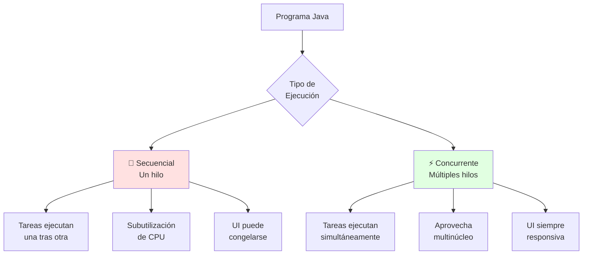
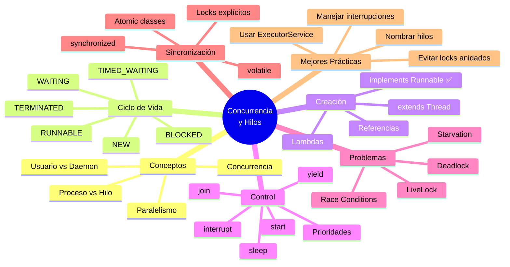

# 🧵 Concurrencia y Ciclo de Vida de Hilos 

## 🎯 Introducción

> [!info]- 💡 ¿Qué es la Concurrencia?
> 
> La **concurrencia** es la capacidad de un programa para ejecutar múltiples tareas de manera simultánea o intercalada. En Java, esto se logra principalmente mediante **hilos (threads)**, que son flujos de ejecución independientes dentro de un mismo proceso.
> 
> **Analogía del mundo real:** Piensa en cómo funciona una cocina de restaurante:
> 
> - **Sin concurrencia** → Un solo chef prepara un plato completo antes de empezar el siguiente
> - **Con concurrencia** → Múltiples chefs trabajan simultáneamente en diferentes platos
> - **Coordinación** → Los chefs comparten recursos (hornos, ingredientes) y deben coordinarse
> - **Eficiencia** → Los clientes reciben sus platos más rápido
> 
> **¿Por qué es importante aprender concurrencia?**
> 
> |Razón|Descripción|Ejemplos Reales|
> |---|---|---|
> |**Rendimiento**|Aprovechar procesadores multinúcleo|Procesamiento de imágenes, análisis de datos|
> |**Responsividad**|Interfaces que no se "congelan"|Aplicaciones desktop, apps móviles|
> |**Eficiencia**|Maximizar uso de recursos|Servidores web, sistemas de mensajería|
> |**Escalabilidad**|Manejar múltiples usuarios simultáneamente|APIs REST, sistemas distribuidos|
> |**Operaciones I/O**|No bloquear mientras se espera datos|Descargas, conexiones de red|



---

## 🧬 Conceptos Fundamentales

### 🔍 Proceso vs Hilo

> [!note]- 🏗️ Diferencias Clave
> 
> **Comparación visual:**
> 
> ```mermaid
> graph TB
>     subgraph "Sistema Operativo"
>         P1[Proceso 1<br/>Chrome]
>         P2[Proceso 2<br/>Word]
>         P3[Proceso 3<br/>Tu App Java]
>     end
>     
>     subgraph "Proceso 3 - Tu App Java"
>         T1[Hilo 1<br/>main]
>         T2[Hilo 2<br/>UI]
>         T3[Hilo 3<br/>Background]
>         M[Memoria Compartida]
>         
>         T1 -.-> M
>         T2 -.-> M
>         T3 -.-> M
>     end
>     
>     style P3 fill:#e1f5ff
>     style M fill:#fff4e1
> ```
> 
> **Tabla comparativa:**
> 
> |Característica|Proceso|Hilo (Thread)|
> |---|---|---|
> |**Definición**|Programa en ejecución completo|Unidad de ejecución dentro de un proceso|
> |**Memoria**|Espacio de memoria propio y aislado|Comparte memoria con otros hilos del proceso|
> |**Comunicación**|Compleja (IPC, sockets)|Sencilla (variables compartidas)|
> |**Creación**|🐢 Costosa (varios MB)|⚡ Ligera (pocos KB)|
> |**Cambio de contexto**|🐢 Lento|⚡ Rápido|
> |**Independencia**|Totalmente independiente|Dependiente del proceso padre|
> |**Fallo**|No afecta otros procesos|Puede afectar todo el proceso|
> 
> **Ejemplo práctico:**
> 
> ```java
> // Un proceso Java puede tener múltiples hilos
> public class DemoHilos {
>     public static void main(String[] args) {
>         // main es el hilo principal
>         System.out.println("Hilo principal: " + Thread.currentThread().getName());
>         
>         // Crear hilos adicionales
>         Thread hilo1 = new Thread(() -> {
>             System.out.println("Hilo 1 ejecutándose: " + Thread.currentThread().getName());
>         });
>         
>         Thread hilo2 = new Thread(() -> {
>             System.out.println("Hilo 2 ejecutándose: " + Thread.currentThread().getName());
>         });
>         
>         hilo1.start();
>         hilo2.start();
>         
>         System.out.println("Hilos creados, main continúa...");
>     }
> }
> ```

### 🎭 Tipos de Hilos en Java

> [!tip]- 🔧 Clasificación de Hilos
> 
> **1. Hilos de Usuario (User Threads)**
> 
> ```java
> Thread hiloUsuario = new Thread(() -> {
>     System.out.println("Hilo de usuario trabajando...");
> });
> hiloUsuario.start(); // Por defecto es hilo de usuario
> ```
> 
> **Características:**
> 
> - La JVM espera a que terminen antes de salir
> - Se usan para tareas críticas del programa
> - Mantienen el programa vivo
> 
> **2. Hilos Daemon (Hilos Demonio)**
> 
> ```java
> Thread hiloDaemon = new Thread(() -> {
>     while (true) {
>         System.out.println("Servicio en background...");
>         try {
>             Thread.sleep(1000);
>         } catch (InterruptedException e) {
>             break;
>         }
>     }
> });
> hiloDaemon.setDaemon(true); // Marcarlo como daemon ANTES de start()
> hiloDaemon.start();
> ```
> 
> **Características:**
> 
> - La JVM NO espera a que terminen
> - Se detienen automáticamente cuando no quedan hilos de usuario
> - Se usan para servicios de soporte (garbage collector, monitoreo)
> 
> **Comparación:**
> 
> ```mermaid
> sequenceDiagram
>     participant JVM
>     participant HU as Hilo Usuario
>     participant HD as Hilo Daemon
>     
>     JVM->>HU: start()
>     JVM->>HD: start()
>     HU->>HU: Trabajando...
>     HD->>HD: Servicio background...
>     HU->>JVM: Termina
>     Note over JVM,HD: Todos los hilos de usuario terminaron
>     JVM->>HD: ⚠️ Detención forzada
>     JVM->>JVM: Apagar JVM
> ```
> 
> **Ejemplo práctico:**
> 
> |Tipo|Ejemplo de Uso|Comportamiento al Salir|
> |---|---|---|
> |**Usuario**|Procesamiento de datos críticos|JVM espera su finalización|
> |**Daemon**|Auto-guardado cada 5 minutos|JVM lo detiene inmediatamente|
> |**Usuario**|Servidor web aceptando conexiones|JVM espera que se cierre el servidor|
> |**Daemon**|Monitor de memoria|JVM lo detiene sin esperar|

---

## 🔄 Ciclo de Vida de un Hilo

### 📊 Estados del Hilo

> [!info]- 🎢 Diagrama de Estados
> 
> ```mermaid
> stateDiagram-v2
>     [*] --> NEW: new Thread()
>     NEW --> RUNNABLE: start()
>     RUNNABLE --> RUNNING: Scheduler asigna CPU
>     RUNNING --> RUNNABLE: Yield / Quantum expiró
>     RUNNING --> WAITING: wait() / join()
>     RUNNING --> TIMED_WAITING: sleep(n) / wait(n)
>     RUNNING --> BLOCKED: Espera lock/sincronización
>     WAITING --> RUNNABLE: notify() / notifyAll()
>     TIMED_WAITING --> RUNNABLE: Tiempo expiró
>     BLOCKED --> RUNNABLE: Lock disponible
>     RUNNING --> TERMINATED: Termina run()
>     TERMINATED --> [*]
> ```
> 
> **Descripción de cada estado:**
> 
> |Estado|Enum|Descripción|Cómo se alcanza|
> |---|---|---|---|
> |**NEW**|`NEW`|Hilo creado pero no iniciado|`new Thread()`|
> |**RUNNABLE**|`RUNNABLE`|Listo para ejecutar o ejecutándose|`start()`, vuelve de BLOCKED/WAITING|
> |**BLOCKED**|`BLOCKED`|Esperando un monitor/lock|Intenta entrar a bloque synchronized|
> |**WAITING**|`WAITING`|Esperando indefinidamente|`wait()`, `join()`, `LockSupport.park()`|
> |**TIMED_WAITING**|`TIMED_WAITING`|Esperando por tiempo limitado|`sleep(n)`, `wait(n)`, `join(n)`|
> |**TERMINATED**|`TERMINATED`|Hilo terminado|`run()` completó o excepción no capturada|

### 🛠️ Transiciones de Estado

> [!example]- 🔀 Ejemplos de Transiciones
> 
> **1. NEW → RUNNABLE → TERMINATED**
> 
> ```java
> public class TransicionBasica {
>     public static void main(String[] args) {
>         Thread hilo = new Thread(() -> {
>             System.out.println("Estado durante run(): " + 
>                 Thread.currentThread().getState()); // RUNNABLE
>         });
>         
>         System.out.println("Estado inicial: " + hilo.getState()); // NEW
>         hilo.start();
>         
>         // Esperar a que termine
>         try {
>             hilo.join();
>             System.out.println("Estado final: " + hilo.getState()); // TERMINATED
>         } catch (InterruptedException e) {
>             e.printStackTrace();
>         }
>     }
> }
> ```
> 
> **2. RUNNABLE → TIMED_WAITING → RUNNABLE**
> 
> ```java
> public class TransicionSleep {
>     public static void main(String[] args) throws InterruptedException {
>         Thread hilo = new Thread(() -> {
>             try {
>                 System.out.println("Antes de dormir: RUNNABLE");
>                 Thread.sleep(2000); // TIMED_WAITING
>                 System.out.println("Después de dormir: RUNNABLE");
>             } catch (InterruptedException e) {
>                 e.printStackTrace();
>             }
>         });
>         
>         hilo.start();
>         Thread.sleep(500); // Dar tiempo para que entre en sleep
>         System.out.println("Estado del hilo: " + hilo.getState()); // TIMED_WAITING
>     }
> }
> ```
> 
> **3. RUNNABLE → BLOCKED → RUNNABLE**
> 
> ```java
> public class TransicionBlocked {
>     private static final Object lock = new Object();
>     
>     public static void main(String[] args) throws InterruptedException {
>         Thread hilo1 = new Thread(() -> {
>             synchronized (lock) {
>                 System.out.println("Hilo 1 tiene el lock");
>                 try {
>                     Thread.sleep(3000); // Mantener el lock
>                 } catch (InterruptedException e) {
>                     e.printStackTrace();
>                 }
>             }
>         });
>         
>         Thread hilo2 = new Thread(() -> {
>             synchronized (lock) { // Se bloqueará aquí
>                 System.out.println("Hilo 2 obtuvo el lock");
>             }
>         });
>         
>         hilo1.start();
>         Thread.sleep(100); // Asegurar que hilo1 tome el lock primero
>         hilo2.start();
>         Thread.sleep(100);
>         
>         System.out.println("Estado hilo2: " + hilo2.getState()); // BLOCKED
>     }
> }
> ```
> 
> **4. RUNNABLE → WAITING → RUNNABLE**
> 
> ```java
> public class TransicionWaiting {
>     private static final Object lock = new Object();
>     
>     public static void main(String[] args) throws InterruptedException {
>         Thread esperador = new Thread(() -> {
>             synchronized (lock) {
>                 try {
>                     System.out.println("Esperador: entrando en wait()");
>                     lock.wait(); // WAITING
>                     System.out.println("Esperador: despertado!");
>                 } catch (InterruptedException e) {
>                     e.printStackTrace();
>                 }
>             }
>         });
>         
>         Thread notificador = new Thread(() -> {
>             try {
>                 Thread.sleep(2000);
>                 synchronized (lock) {
>                     System.out.println("Notificador: enviando notify()");
>                     lock.notify();
>                 }
>             } catch (InterruptedException e) {
>                 e.printStackTrace();
>             }
>         });
>         
>         esperador.start();
>         Thread.sleep(500);
>         System.out.println("Estado esperador: " + esperador.getState()); // WAITING
>         
>         notificador.start();
>     }
> }
> ```

---

## 🚀 Creación de Hilos

### 📋 Método 1: Extender Thread

> [!example]- 🧬 Herencia de Thread
> 
> **Sintaxis básica:**
> 
> ```java
> public class MiHilo extends Thread {
>     @Override
>     public void run() {
>         // Código que ejecutará el hilo
>         System.out.println("Hilo ejecutándose: " + getName());
>     }
> }
> 
> // Uso
> MiHilo hilo = new MiHilo();
> hilo.start(); // ⚠️ Nunca llamar run() directamente
> ```
> 
> **Ejemplo completo:**
> 
> ```java
> public class ContadorHilo extends Thread {
>     private String nombre;
>     private int hasta;
>     
>     public ContadorHilo(String nombre, int hasta) {
>         this.nombre = nombre;
>         this.hasta = hasta;
>     }
>     
>     @Override
>     public void run() {
>         for (int i = 1; i <= hasta; i++) {
>             System.out.println(nombre + ": " + i);
>             try {
>                 Thread.sleep(500); // Pausa de 500ms
>             } catch (InterruptedException e) {
>                 System.out.println(nombre + " interrumpido");
>                 return;
>             }
>         }
>         System.out.println(nombre + " completado!");
>     }
> }
> 
> // Uso
> public class Demo {
>     public static void main(String[] args) {
>         ContadorHilo c1 = new ContadorHilo("Contador-1", 5);
>         ContadorHilo c2 = new ContadorHilo("Contador-2", 5);
>         
>         c1.start();
>         c2.start();
>     }
> }
> ```
> 
> **Ventajas:**
> 
> - Sintaxis simple y directa
> - Acceso directo a métodos de Thread (getName(), setPriority(), etc.)
> 
> **Desventajas:**
> 
> - ❌ No permite herencia múltiple
> - ❌ Mezcla lógica de negocio con gestión de hilos
> - ❌ Menos flexible

### 🎯 Método 2: Implementar Runnable (✅ RECOMENDADO)

> [!success]- 🏆 Forma Preferida en la Industria
> 
> **Sintaxis básica:**
> 
> ```java
> public class MiTarea implements Runnable {
>     @Override
>     public void run() {
>         // Código que ejecutará el hilo
>         System.out.println("Tarea ejecutándose");
>     }
> }
> 
> // Uso
> MiTarea tarea = new MiTarea();
> Thread hilo = new Thread(tarea);
> hilo.start();
> ```
> 
> **Ejemplo completo:**
> 
> ```java
> public class DescargadorArchivo implements Runnable {
>     private String nombreArchivo;
>     private int tamaño;
>     
>     public DescargadorArchivo(String nombreArchivo, int tamaño) {
>         this.nombreArchivo = nombreArchivo;
>         this.tamaño = tamaño;
>     }
>     
>     @Override
>     public void run() {
>         System.out.println("Iniciando descarga: " + nombreArchivo);
>         
>         for (int i = 0; i <= 100; i += 10) {
>             System.out.println(nombreArchivo + ": " + i + "% completado");
>             try {
>                 Thread.sleep(500);
>             } catch (InterruptedException e) {
>                 System.out.println("Descarga cancelada: " + nombreArchivo);
>                 return;
>             }
>         }
>         
>         System.out.println("✅ Descarga completada: " + nombreArchivo);
>     }
> }
> 
> // Uso
> public class GestorDescargas {
>     public static void main(String[] args) {
>         Thread d1 = new Thread(new DescargadorArchivo("video.mp4", 1024));
>         Thread d2 = new Thread(new DescargadorArchivo("musica.mp3", 512));
>         Thread d3 = new Thread(new DescargadorArchivo("imagen.jpg", 256));
>         
>         d1.setName("Descarga-1");
>         d2.setName("Descarga-2");
>         d3.setName("Descarga-3");
>         
>         d1.start();
>         d2.start();
>         d3.start();
>     }
> }
> ```
> 
> **Ventajas:**
> 
> - ✅ Permite implementar otras interfaces o heredar de otras clases
> - ✅ Separa lógica de negocio de gestión de hilos
> - ✅ Más flexible y reutilizable
> - ✅ Compatible con ExecutorService (veremos después)
> 
> **Desventajas:**
> 
> - Requiere crear objeto Thread adicional
> - Acceso indirecto a métodos de Thread

### ⚡ Método 3: Lambdas y Referencias (Java 8+)

> [!tip]- 🎨 Sintaxis Moderna
> 
> **1. Expresiones Lambda:**
> 
> ```java
> public class DemoLambdas {
>     public static void main(String[] args) {
>         // Lambda simple
>         Thread hilo1 = new Thread(() -> {
>             System.out.println("Hilo con lambda");
>         });
>         
>         // Lambda con lógica compleja
>         Thread hilo2 = new Thread(() -> {
>             for (int i = 0; i < 5; i++) {
>                 System.out.println("Contador: " + i);
>                 try {
>                     Thread.sleep(500);
>                 } catch (InterruptedException e) {
>                     break;
>                 }
>             }
>         });
>         
>         hilo1.start();
>         hilo2.start();
>     }
> }
> ```
> 
> **2. Referencias a Métodos:**
> 
> ```java
> public class ProcesadorDatos {
>     
>     public void procesarLote() {
>         System.out.println("Procesando lote de datos...");
>         // Lógica de procesamiento
>     }
>     
>     public static void main(String[] args) {
>         ProcesadorDatos procesador = new ProcesadorDatos();
>         
>         // Referencia a método de instancia
>         Thread hilo = new Thread(procesador::procesarLote);
>         hilo.start();
>     }
> }
> ```
> 
> **3. Comparación de sintaxis:**
> 
> ```java
> // Forma tradicional (verbose)
> Thread t1 = new Thread(new Runnable() {
>     @Override
>     public void run() {
>         System.out.println("Hola desde hilo");
>     }
> });
> 
> // Forma lambda (concisa) ✅
> Thread t2 = new Thread(() -> System.out.println("Hola desde hilo"));
> 
> // Ambos hacen exactamente lo mismo
> ```

### 📊 Comparación de Métodos

> [!note]- 🔍 ¿Cuál Elegir?
> 
> |Método|Cuándo Usar|Ventajas|Desventajas|
> |---|---|---|---|
> |**extends Thread**|Tareas muy simples, aprendizaje|Simple, directa|No permite herencia múltiple|
> |**implements Runnable**|✅ **Uso general profesional**|Flexible, separación de conceptos|Requiere objeto Thread|
> |**Lambdas**|Tareas cortas inline|Sintaxis concisa, moderna|Menos clara para lógica compleja|
> |**Referencias**|Métodos existentes|Reutilización código existente|Solo para métodos compatibles|
> 
> **Flujo de decisión:**
> 
> ```mermaid
> graph TD
>     A{¿Qué tipo de<br/>tarea?} --> B[Lógica inline<br/>simple]
>     A --> C[Clase con<br/>estado complejo]
>     A --> D[Método<br/>existente]
>     
>     B --> E[✅ Lambda]
>     C --> F[✅ Runnable]
>     D --> G[✅ Referencia]
>     
>     style E fill:#e1ffe1
>     style F fill:#e1ffe1
>     style G fill:#e1ffe1
> ```

---

## 🎮 Control de Hilos

### ⏸️ Métodos Fundamentales

> [!tip]- 🎛️ Control de Ejecución
> 
> **1. start() - Iniciar un hilo**
> 
> ```java
> Thread hilo = new Thread(() -> System.out.println("Trabajando..."));
> hilo.start(); // ✅ Correcto - crea nuevo hilo
> 
> // ❌ NUNCA hacer esto:
> // hilo.run(); // Ejecuta en el hilo actual, NO crea nuevo hilo
> ```
> 
> **2. sleep() - Pausar ejecución**
> 
> ```java
> public class DemoSleep {
>     public static void main(String[] args) {
>         Thread contador = new Thread(() -> {
>             for (int i = 1; i <= 5; i++) {
>                 System.out.println("Segundo: " + i);
>                 try {
>                     Thread.sleep(1000); // Pausa de 1 segundo
>                 } catch (InterruptedException e) {
>                     System.out.println("Interrumpido!");
>                     return;
>                 }
>             }
>         });
>         
>         contador.start();
>     }
> }
> ```
> 
> **Características de sleep():**
> 
> - Estado: RUNNABLE → TIMED_WAITING
> - Libera CPU pero NO libera locks/monitores
> - Tiempo NO es exacto (depende del scheduler)
> - Puede ser interrumpido (InterruptedException)
> 
> **3. join() - Esperar a que termine otro hilo**
> 
> ```java
> public class DemoJoin {
>     public static void main(String[] args) {
>         Thread preparador = new Thread(() -> {
>             System.out.println("Preparando datos...");
>             try {
>                 Thread.sleep(3000);
>             } catch (InterruptedException e) {
>                 return;
>             }
>             System.out.println("Datos listos!");
>         });
>         
>         preparador.start();
>         
>         try {
>             System.out.println("Esperando a que los datos estén listos...");
>             preparador.join(); // Esperar hasta que preparador termine
>             System.out.println("Continuando con datos preparados");
>         } catch (InterruptedException e) {
>             e.printStackTrace();
>         }
>     }
> }
> ```
> 
> **Variantes de join():**
> 
> |Método|Comportamiento|Uso|
> |---|---|---|
> |`join()`|Espera indefinidamente|Cuando es crítico que termine|
> |`join(millis)`|Espera máximo N milisegundos|Cuando hay timeout|
> |`join(millis, nanos)`|Precisión en nanosegundos|Casos muy específicos|
> 
> **4. interrupt() - Solicitar interrupción**
> 
> ```java
> public class DemoInterrupt {
>     public static void main(String[] args) throws InterruptedException {
>         Thread trabajador = new Thread(() -> {
>             try {
>                 System.out.println("Trabajando...");
>                 Thread.sleep(10000); // Dormir 10 segundos
>                 System.out.println("Trabajo completado");
>             } catch (InterruptedException e) {
>                 System.out.println("⚠️ Trabajo interrumpido!");
>                 // Limpiar recursos si es necesario
>             }
>         });
>         
>         trabajador.start();
>         Thread.sleep(2000); // Esperar 2 segundos
>         
>         System.out.println("Cancelando trabajo...");
>         trabajador.interrupt(); // Solicitar interrupción
>     }
> }
> ```
> 
> **Manejo correcto de interrupciones:**
> 
> ```java
> public class TareaInterrumpible implements Runnable {
>     @Override
>     public void run() {
>         // Opción 1: Verificar flag de interrupción
>         while (!Thread.currentThread().isInterrupted()) {
>             // Hacer trabajo
>             System.out.println("Trabajando...");
>             
>             try {
>                 Thread.sleep(500);
>             } catch (InterruptedException e) {
>                 // Restaurar flag de interrupción
>                 Thread.currentThread().interrupt();
>                 System.out.println("Interrumpido durante sleep");
>                 break;
>             }
>         }
>         
>         System.out.println("Tarea finalizada correctamente");
>     }
> }
> ```

### ⚙️ Prioridades de Hilos

> [!warning]- ⚖️ Gestión de Prioridades
> 
> **Rango de prioridades:**
> 
> |Constante|Valor|Uso|
> |---|---|---|
> |`Thread.MIN_PRIORITY`|1|Tareas de muy baja prioridad|
> |`Thread.NORM_PRIORITY`|5|**Valor por defecto**|
> |`Thread.MAX_PRIORITY`|10|Tareas críticas|
> 
> **Ejemplo:**
> 
> ```java
> public class DemoPrioridades {
>     public static void main(String[] args) {
>         Thread alta = new Thread(() -> {
>             for (int i = 0; i < 5; i++) {
>                 System.out.println("Alta prioridad: " + i);
>             }
>         });
>         
>         Thread baja = new Thread(() -> {
>             for (int i = 0; i < 5; i++) {
>                 System.out.println("Baja prioridad: " + i);
>             }
>         });
>         
>         alta.setPriority(Thread.MAX_PRIORITY);
>         baja.setPriority(Thread.MIN_PRIORITY);
>         
>         baja.start();
>         alta.start();
>     }
> }
> ```
> 
> **⚠️ ADVERTENCIAS IMPORTANTES:**
> 
> ```mermaid
> graph TD
>     A[Prioridades en Java] --> B[⚠️ NO son garantías]
>     B --> C[Dependen del SO]
>     B --> D[Scheduler puede ignorarlas]
>     B --> E[Comportamiento varía]
>     
>     C --> F[Windows: 7 niveles]
>     C --> G[Linux: diferentes políticas]
>     C --> H[macOS: tiempo compartido]
>     
>     style B fill:#ffe1e1
> ```
> 
> **Mejores prácticas:**
> 
> - ❌ NO confiar en prioridades para corrección lógica
> - ✅ Usar como "sugerencias" al scheduler
> - ✅ Preferir sincronización explícita
> - ✅ Documentar dependencias de prioridad

### 🔧 Métodos Útiles

> [!success]- 🛠️ Herramientas de Inspección y Control
> 
> **1. Información del hilo:**
> 
> ```java
> public class InfoHilo {
>     public static void main(String[] args) {
>         Thread actual = Thread.currentThread();
>         
>         System.out.println("Nombre: " + actual.getName());
>         System.out.println("ID: " + actual.getId());
>         System.out.println("Prioridad: " + actual.getPriority());
>         System.out.println("Estado: " + actual.getState());
>         System.out.println("¿Es daemon?: " + actual.isDaemon());
>         System.out.println("¿Está vivo?: " + actual.isAlive());
>         System.out.println("¿Interrumpido?: " + actual.isInterrupted());
> }
> 
> 
> }
> 
> ````
> 
> **2. yield() - Ceder control al scheduler**
> 
> ```java
> public class DemoYield {
>     public static void main(String[] args) {
>         Runnable tarea = () -> {
>             for (int i = 0; i < 5; i++) {
>                 System.out.println(Thread.currentThread().getName() + ": " + i);
>                 Thread.yield(); // Sugerencia para dar paso a otros hilos
>             }
>         };
>         
>         new Thread(tarea, "Hilo-A").start();
>         new Thread(tarea, "Hilo-B").start();
>     }
> }
> 
> 
> **⚠️ yield() es solo una "sugerencia"** - el scheduler puede ignorarla
> ```
> **3. setName() / getName() - Identificación:**
> 
> ```java
> Thread hilo = new Thread(() -> {
>     System.out.println("Ejecutando: " + Thread.currentThread().getName());
> });
> 
> hilo.setName("Procesador-Datos");
> hilo.start();
> ```
> 
> **4. isAlive() - Verificar si está en ejecución:**
> 
> ```java
> Thread hilo = new Thread(() -> {
>     try {
>         Thread.sleep(2000);
>     } catch (InterruptedException e) {}
> });
> 
> System.out.println("Antes de start: " + hilo.isAlive()); // false
> hilo.start();
> System.out.println("Después de start: " + hilo.isAlive()); // true
> 
> try {
>     hilo.join();
> } catch (InterruptedException e) {}
> 
> System.out.println("Después de terminar: " + hilo.isAlive()); // false
> ```

---

## ⚠️ Problemas Comunes en Concurrencia

### 🐛 Race Conditions (Condiciones de Carrera)

> [!danger]- 🏁 El Problema de la Concurrencia
> 
> **¿Qué es una Race Condition?**
> 
> Ocurre cuando múltiples hilos acceden y modifican datos compartidos simultáneamente, produciendo resultados impredecibles.
> 
> **Ejemplo problemático:**
> 
> ```java
> public class ContadorInseguro {
>     private int contador = 0; // Variable compartida
>     
>     public void incrementar() {
>         contador++; // ⚠️ NO es atómico
>     }
>     
>     public int getContador() {
>         return contador;
>     }
>     
>     public static void main(String[] args) throws InterruptedException {
>         ContadorInseguro contador = new ContadorInseguro();
>         
>         // Crear 10 hilos que incrementan 1000 veces cada uno
>         Thread[] hilos = new Thread[10];
>         for (int i = 0; i < 10; i++) {
>             hilos[i] = new Thread(() -> {
>                 for (int j = 0; j < 1000; j++) {
>                     contador.incrementar();
>                 }
>             });
>             hilos[i].start();
>         }
>         
>         // Esperar a que todos terminen
>         for (Thread hilo : hilos) {
>             hilo.join();
>         }
>         
>         // Resultado esperado: 10,000
>         // Resultado real: ¡Varía! (ejemplo: 8,543, 9,217, etc.)
>         System.out.println("Contador final: " + contador.getContador());
>     }
> }
> ```
> 
> **¿Por qué falla?**
> 
> ```mermaid
> sequenceDiagram
>     participant H1 as Hilo 1
>     participant M as Memoria (contador=5)
>     participant H2 as Hilo 2
>     
>     H1->>M: Leer valor (5)
>     H2->>M: Leer valor (5)
>     H1->>H1: Incrementar (5+1=6)
>     H2->>H2: Incrementar (5+1=6)
>     H1->>M: Escribir (6)
>     H2->>M: Escribir (6) ⚠️ Sobrescribe
>     
>     Note over M: Valor esperado: 7<br/>Valor real: 6<br/>Se perdió un incremento
> ```
> 
> **Visualización del problema:**
> 
> |Paso|Hilo 1|Hilo 2|Valor Memoria|
> |---|---|---|---|
> |1|Lee contador (5)|-|5|
> |2|Lee contador (5)|Lee contador (5)|5|
> |3|Calcula 5+1=6|Calcula 5+1=6|5|
> |4|Escribe 6|-|6|
> |5|-|Escribe 6|**6** ❌ (debería ser 7)|

### 🔒 Introducción a la Sincronización

> [!success]- 🛡️ Solución: Palabra Clave synchronized
> 
> **Contador seguro:**
> 
> ```java
> public class ContadorSeguro {
>     private int contador = 0;
>     
>     // Método sincronizado - solo un hilo a la vez
>     public synchronized void incrementar() {
>         contador++;
>     }
>     
>     public synchronized int getContador() {
>         return contador;
>     }
>     
>     public static void main(String[] args) throws InterruptedException {
>         ContadorSeguro contador = new ContadorSeguro();
>         
>         Thread[] hilos = new Thread[10];
>         for (int i = 0; i < 10; i++) {
>             hilos[i] = new Thread(() -> {
>                 for (int j = 0; j < 1000; j++) {
>                     contador.incrementar();
>                 }
>             });
>             hilos[i].start();
>         }
>         
>         for (Thread hilo : hilos) {
>             hilo.join();
>         }
>         
>         // Ahora SIEMPRE será 10,000 ✅
>         System.out.println("Contador final: " + contador.getContador());
>     }
> }
> ```
> 
> **¿Cómo funciona synchronized?**
> 
> ```mermaid
> sequenceDiagram
>     participant H1 as Hilo 1
>     participant L as Lock (Monitor)
>     participant H2 as Hilo 2
>     
>     H1->>L: Solicitar lock
>     L->>H1: Lock concedido ✅
>     H2->>L: Solicitar lock
>     L->>H2: BLOQUEADO ⛔
>     H1->>H1: Ejecutar incrementar()
>     H1->>L: Liberar lock
>     L->>H2: Lock concedido ✅
>     H2->>H2: Ejecutar incrementar()
>     H2->>L: Liberar lock
> ```
> 
> **Formas de usar synchronized:**
> 
> ```java
> // 1. Método sincronizado completo
> public synchronized void metodo1() {
>     // Todo el método protegido
> }
> 
> // 2. Bloque sincronizado (más granular)
> public void metodo2() {
>     // Código no crítico
>     
>     synchronized(this) {
>         // Solo esta sección protegida
>         contador++;
>     }
>     
>     // Más código no crítico
> }
> 
> // 3. Sincronizar en objeto específico
> private final Object lock = new Object();
> public void metodo3() {
>     synchronized(lock) {
>         // Protegido por 'lock', no por 'this'
>     }
> }
> ```

### 💀 Deadlock (Interbloqueo)

> [!danger]- ⚰️ El Problema Mortal de la Concurrencia
> 
> **¿Qué es un Deadlock?**
> 
> Situación donde dos o más hilos se bloquean mutuamente esperando recursos que nunca se liberarán.
> 
> **Ejemplo clásico (Filósofos Cenando):**
> 
> ```java
> public class EjemploDeadlock {
>     private static final Object tenedor1 = new Object();
>     private static final Object tenedor2 = new Object();
>     
>     public static void main(String[] args) {
>         // Filósofo 1: toma tenedor1, luego tenedor2
>         Thread filosofo1 = new Thread(() -> {
>             synchronized (tenedor1) {
>                 System.out.println("Filósofo 1: tengo tenedor 1");
>                 
>                 try { Thread.sleep(100); } catch (InterruptedException e) {}
>                 
>                 System.out.println("Filósofo 1: esperando tenedor 2...");
>                 synchronized (tenedor2) {
>                     System.out.println("Filósofo 1: comiendo");
>                 }
>             }
>         });
>         
>         // Filósofo 2: toma tenedor2, luego tenedor1
>         Thread filosofo2 = new Thread(() -> {
>             synchronized (tenedor2) {
>                 System.out.println("Filósofo 2: tengo tenedor 2");
>                 
>                 try { Thread.sleep(100); } catch (InterruptedException e) {}
>                 
>                 System.out.println("Filósofo 2: esperando tenedor 1...");
>                 synchronized (tenedor1) {
>                     System.out.println("Filósofo 2: comiendo");
>                 }
>             }
>         });
>         
>         filosofo1.start();
>         filosofo2.start();
>         
>         // ⚠️ Programa se queda bloqueado indefinidamente
>     }
> }
> ```
> 
> **Diagrama del Deadlock:**
> 
> ```mermaid
> graph TD
>     H1[Hilo 1] -->|Tiene| R1[Recurso 1]
>     H1 -->|Espera| R2[Recurso 2]
>     H2[Hilo 2] -->|Tiene| R2
>     H2 -->|Espera| R1
>     
>     style H1 fill:#ffe1e1
>     style H2 fill:#ffe1e1
>     style R1 fill:#fff4e1
>     style R2 fill:#fff4e1
> ```
> 
> **Condiciones para que ocurra Deadlock:**
> 
> 1. **Exclusión mutua**: Recursos no compartibles
> 2. **Hold and wait**: Mantener recursos mientras espera otros
> 3. **No preemption**: Recursos no pueden ser quitados forzosamente
> 4. **Espera circular**: Ciclo de dependencias
> 
> **Solución - Ordenar la adquisición de locks:**
> 
> ```java
> public class SolucionDeadlock {
>     private static final Object tenedor1 = new Object();
>     private static final Object tenedor2 = new Object();
>     
>     public static void main(String[] args) {
>         // ✅ AMBOS filósofos toman locks en el MISMO orden
>         Thread filosofo1 = new Thread(() -> {
>             synchronized (tenedor1) {
>                 synchronized (tenedor2) {
>                     System.out.println("Filósofo 1: comiendo");
>                 }
>             }
>         });
>         
>         Thread filosofo2 = new Thread(() -> {
>             synchronized (tenedor1) { // Mismo orden que filosofo1
>                 synchronized (tenedor2) {
>                     System.out.println("Filósofo 2: comiendo");
>                 }
>             }
>         });
>         
>         filosofo1.start();
>         filosofo2.start();
>         
>         // ✅ Ahora NO hay deadlock
>     }
> }
> ```

---

## 🎯 Mejores Prácticas

### ✅ Checklist de Buenas Prácticas

> [!tip]- 🏆 Recomendaciones Profesionales
> 
> **1. Preferir Runnable sobre extends Thread**
> 
> ```java
> // ❌ EVITAR
> class MiHilo extends Thread {
>     public void run() { /* ... */ }
> }
> 
> // ✅ PREFERIR
> class MiTarea implements Runnable {
>     public void run() { /* ... */ }
> }
> ```
> 
> **2. Siempre manejar InterruptedException correctamente**
> 
> ```java
> // ❌ MAL
> try {
>     Thread.sleep(1000);
> } catch (InterruptedException e) {
>     e.printStackTrace(); // Solo imprimir no es suficiente
> }
> 
> // ✅ BIEN
> try {
>     Thread.sleep(1000);
> } catch (InterruptedException e) {
>     Thread.currentThread().interrupt(); // Restaurar flag
>     return; // O manejar apropiadamente
> }
> ```
> 
> **3. Dar nombres descriptivos a los hilos**
> 
> ```java
> // ❌ Difícil de debuggear
> Thread t = new Thread(tarea);
> t.start();
> 
> // ✅ Fácil de identificar en logs/debugger
> Thread t = new Thread(tarea, "Procesador-Facturas-" + id);
> t.start();
> ```
> 
> **4. Proteger datos compartidos con sincronización**
> 
> ```java
> // ❌ PELIGROSO
> private int contador;
> public void incrementar() {
>     contador++; // Race condition
> }
> 
> // ✅ SEGURO
> private int contador;
> public synchronized void incrementar() {
>     contador++;
> }
> 
> // ✅ ALTERNATIVA (java.util.concurrent)
> private AtomicInteger contador = new AtomicInteger(0);
> public void incrementar() {
>     contador.incrementAndGet();
> }
> ```
> 
> **5. Evitar locks anidados cuando sea posible**
> 
> ```java
> // ⚠️ Riesgo de deadlock
> synchronized(lock1) {
>     synchronized(lock2) {
>         // Código
>     }
> }
> 
> // ✅ Mejor: un solo lock
> synchronized(lock1) {
>     // Todo el código crítico
> }
> ```
> 
> **6. No confiar en prioridades para corrección**
> 
> ```java
> // ❌ Lógica dependiente de prioridades
> if (thread.getPriority() == MAX_PRIORITY) {
>     // Asumir que se ejecutará primero
> }
> 
> // ✅ Usar sincronización explícita
> synchronized(lock) {
>     // Control explícito del orden
> }
> ```
> 
> **7. Usar try-finally para liberar recursos**
> 
> ```java
> Lock lock = new ReentrantLock();
> 
> lock.lock();
> try {
>     // Código crítico
> } finally {
>     lock.unlock(); // Siempre se ejecuta
> }
> ```

### 🔍 Debugging de Hilos

> [!example]- 🐛 Técnicas de Depuración
> 
> **1. Imprimir información del hilo:**
> 
> ```java
> public class DebugHilo {
>     private static void log(String mensaje) {
>         String nombre = Thread.currentThread().getName();
>         long id = Thread.currentThread().getId();
>         System.out.printf("[%s-%d] %s%n", nombre, id, mensaje);
>     }
>     
>     public static void main(String[] args) {
>         Thread t1 = new Thread(() -> {
>             log("Iniciando tarea");
>             log("Tarea completada");
>         }, "Worker-1");
>         
>         t1.start();
>     }
> }
> ```
> 
> **2. Obtener stack trace de todos los hilos:**
> 
> ```java
> public class DumpHilos {
>     public static void imprimirTodosLosHilos() {
>         Map<Thread, StackTraceElement[]> allThreads = Thread.getAllStackTraces();
>         
>         for (Map.Entry<Thread, StackTraceElement[]> entry : allThreads.entrySet()) {
>             Thread thread = entry.getKey();
>             StackTraceElement[] stack = entry.getValue();
>             
>             System.out.println("\n" + "=".repeat(50));
>             System.out.println("Hilo: " + thread.getName());
>             System.out.println("ID: " + thread.getId());
>             System.out.println("Estado: " + thread.getState());
>             System.out.println("Prioridad: " + thread.getPriority());
>             System.out.println("Daemon: " + thread.isDaemon());
>             System.out.println("\nStack Trace:");
>             for (StackTraceElement element : stack) {
>                 System.out.println("  " + element);
>             }
>         }
>     }
> }
> ```
> 
> **3. Detectar deadlocks programáticamente:**
> 
> ```java
> import java.lang.management.ManagementFactory;
> import java.lang.management.ThreadMXBean;
> 
> public class DetectorDeadlock {
>     public static void detectarDeadlocks() {
>         ThreadMXBean threadBean = ManagementFactory.getThreadMXBean();
>         long[] deadlockedThreads = threadBean.findDeadlockedThreads();
>         
>         if (deadlockedThreads != null) {
>             System.out.println("⚠️ DEADLOCK DETECTADO!");
>             System.out.println("Hilos involucrados:");
>             
>             ThreadInfo[] threadInfos = threadBean.getThreadInfo(deadlockedThreads);
>             for (ThreadInfo info : threadInfos) {
>                 System.out.println("  - " + info.getThreadName() + 
>                                  " (Estado: " + info.getThreadState() + ")");
>             }
>         } else {
>             System.out.println("✅ No se detectaron deadlocks");
>         }
>     }
> }
> ```

---

## 📊 Resumen Visual

### 🗺️ Mapa Mental Completo



### 📋 Tabla Comparativa Final

> [!success]- 🔍 Comparación de Enfoques
> 
> |Aspecto|extends Thread|implements Runnable|Lambda|
> |---|---|---|---|
> |**Herencia**|❌ Bloqueada|✅ Disponible|✅ Disponible|
> |**Reutilización**|⚠️ Limitada|✅ Alta|⚠️ Media|
> |**Claridad**|✅ Simple|✅ Clara|⚠️ Depende|
> |**ExecutorService**|❌ Incompatible|✅ Compatible|✅ Compatible|
> |**Uso Recomendado**|Aprendizaje|✅ **Producción**|Tareas simples|
> 
> **Métodos de Control:**
> 
> |Método|Efecto|Estado|Libera CPU|Libera Lock|
> |---|---|---|---|---|
> |`sleep()`|Pausa|TIMED_WAITING|✅|❌|
> |`wait()`|Espera notificación|WAITING|✅|✅|
> |`join()`|Espera otro hilo|WAITING|✅|✅|
> |`yield()`|Cede turno|RUNNABLE|Sugerencia|❌|

---

## 🎓 Ejercicios Prácticos

> [!example]- 💪 Práctica Guiada
> 
> **Ejercicio 1: Simulador de descarga**
> 
> ```java
> public class SimuladorDescarga implements Runnable {
>     private String archivo;
>     private int tamaño; // MB
>     
>     public SimuladorDescarga(String archivo, int tamaño) {
>         this.archivo = archivo;
>         this.tamaño = tamaño;
>     }
>     
>     @Override
>     public void run() {
>         System.out.println("Iniciando descarga: " + archivo);
>         
>         for (int descargado = 0; descargado <= tamaño; descargado += 10) {
>             int progreso = (descargado * 100) / tamaño;
>             System.out.printf("%s: %d%% (%d/%d MB)%n", 
>                 archivo, progreso, descargado, tamaño);
>             
>             try {
>                 Thread.sleep(500); // Simular tiempo de descarga
>             } catch (InterruptedException e) {
>                 System.out.println(archivo + ": Descarga cancelada");
>                 return;
>             }
>         }
>         
>         System.out.println("✅ Descarga completada: " + archivo);
>     }
>     
>     public static void main(String[] args) {
>         Thread d1 = new Thread(new SimuladorDescarga("video.mp4", 100));
>         Thread d2 = new Thread(new SimuladorDescarga("musica.mp3", 50));
>         Thread d3 = new Thread(new SimuladorDescarga("documento.pdf", 20));
>         
>         d1.start();
>         d2.start();
>         d3.start();
>     }
> }
> ```
> 
> **Ejercicio 2: Productor-Consumidor simple**
> 
> ```java
> import java.util.LinkedList;
> import java.util.Queue;
> 
> public class ProductorConsumidor {
>     private static final Queue<Integer> cola = new LinkedList<>();
>     private static final int CAPACIDAD = 5;
>     
>     static class Productor implements Runnable {
>         @Override
>         public void run() {
>             int valor = 0;
>             while (true) {
>                 synchronized (cola) {
>                     while (cola.size() == CAPACIDAD) {
>                         try {
>                             System.out.println("Cola llena, productor esperando...");
>                             cola.wait();
>                         } catch (InterruptedException e) {
>                             return;
>                         }
>                     }
>                     
>                     cola.add(valor);
>                     System.out.println("Producido: " + valor + " (Tamaño: " + cola.size() + ")");
>                     valor++;
>                     
>                     cola.notifyAll();
>                 }
>                 
>                 try {
>                     Thread.sleep(1000);
>                 } catch (InterruptedException e) {
>                     return;
>                 }
>             }
>         }
>     }
>     
>     static class Consumidor implements Runnable {
>         @Override
>         public void run() {
>             while (true) {
>                 synchronized (cola) {
>                     while (cola.isEmpty()) {
>                         try {
>                             System.out.println("Cola vacía, consumidor esperando...");
>                             cola.wait();
>                         } catch (InterruptedException e) {
>                             return;
>                         }
>                     }
>                     
>                     int valor = cola.poll();
>                     System.out.println("Consumido: " + valor + " (Tamaño: " + cola.size() + ")");
>                     
>                     cola.notifyAll();
>                 }
>                 
>                 try {
>                     Thread.sleep(1500);
>                 } catch (InterruptedException e) {
>                     return;
>                 }
>             }
>         }
>     }
>     
>     public static void main(String[] args) {
>         Thread productor = new Thread(new Productor(), "Productor");
>         Thread consumidor = new Thread(new Consumidor(), "Consumidor");
>         
>         productor.start();
>         consumidor.start();
>     }
> }
> ```
> 
> **Ejercicio 3: Contador con hilos competitivos**
> 
> ```java
> public class ContadorCompetitivo {
>     private int contador = 0;
>     private final Object lock = new Object();
>     
>     public void incrementarSinSeguridad() {
>         contador++; // ⚠️ Race condition
>     }
>     
>     public void incrementarConSeguridad() {
>         synchronized(lock) {
>             contador++; // ✅ Thread-safe
>         }
>     }
>     
>     public int getContador() {
>         synchronized(lock) {
>             return contador;
>         }
>     }
>     
>     public static void probarSinSeguridad() throws InterruptedException {
>         ContadorCompetitivo contador = new ContadorCompetitivo();
>         Thread[] hilos = new Thread[10];
>         
>         for (int i = 0; i < 10; i++) {
>             hilos[i] = new Thread(() -> {
>                 for (int j = 0; j < 1000; j++) {
>                     contador.incrementarSinSeguridad();
>                 }
>             });
>             hilos[i].start();
>         }
>         
>         for (Thread hilo : hilos) {
>             hilo.join();
>         }
>         
>         System.out.println("Sin seguridad - Esperado: 10000, Real: " + 
>             contador.getContador());
>     }
>     
>     public static void probarConSeguridad() throws InterruptedException {
>         ContadorCompetitivo contador = new ContadorCompetitivo();
>         Thread[] hilos = new Thread[10];
>         
>         for (int i = 0; i < 10; i++) {
>             hilos[i] = new Thread(() -> {
>                 for (int j = 0; j < 1000; j++) {
>                     contador.incrementarConSeguridad();
>                 }
>             });
>             hilos[i].start();
>         }
>         
>         for (Thread hilo : hilos) {
>             hilo.join();
>         }
>         
>         System.out.println("Con seguridad - Esperado: 10000, Real: " + 
>             contador.getContador());
>     }
>     
>     public static void main(String[] args) throws InterruptedException {
>         System.out.println("=== Prueba sin sincronización ===");
>         probarSinSeguridad();
>         
>         System.out.println("\n=== Prueba con sincronización ===");
>         probarConSeguridad();
>     }
> }
> ```

---

## 🚀 Próximos Pasos

> [!quote]- 🌟 Continuando el Aprendizaje
> 
> **Has aprendido:**
> 
> ✅ Diferencia entre procesos e hilos  
> ✅ Ciclo de vida completo de un hilo  
> ✅ Tres formas de crear hilos en Java  
> ✅ Métodos fundamentales de control (start, sleep, join, interrupt)  
> ✅ Problemas comunes (race conditions, deadlocks)  
> ✅ Introducción a sincronización con `synchronized`  
> ✅ Mejores prácticas de programación concurrente
> 
> **Próximos temas:**
> 
> |Tema|Qué aprenderás|Por qué es importante|
> |---|---|---|
> |**ExecutorService**|Pool de hilos profesional|Manejo eficiente de recursos|
> |**java.util.concurrent**|Estructuras thread-safe|Colecciones concurrentes listas|
> |**Locks avanzados**|ReentrantLock, ReadWriteLock|Mayor control que synchronized|
> |**Atomic classes**|Operaciones atómicas|Alto rendimiento sin locks|
> |**Fork/Join Framework**|Paralelismo de tareas|Dividir y conquistar problemas|
> |**CompletableFuture**|Programación asíncrona|Código no bloqueante moderno|

---

**Tags:** #java #concurrencia #hilos #threads #multithreading #sincronizacion #race-conditions #deadlock #runnable #thread-lifecycle #mejores-practicas
